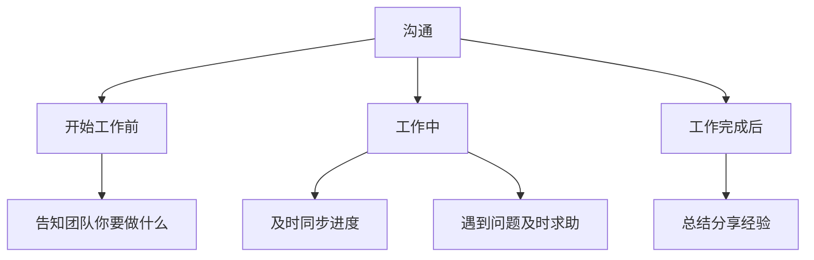
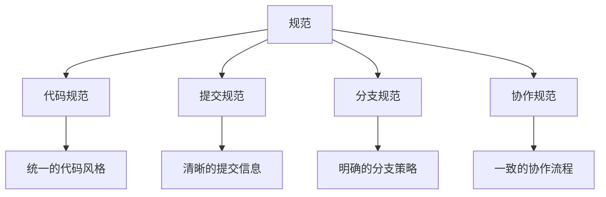
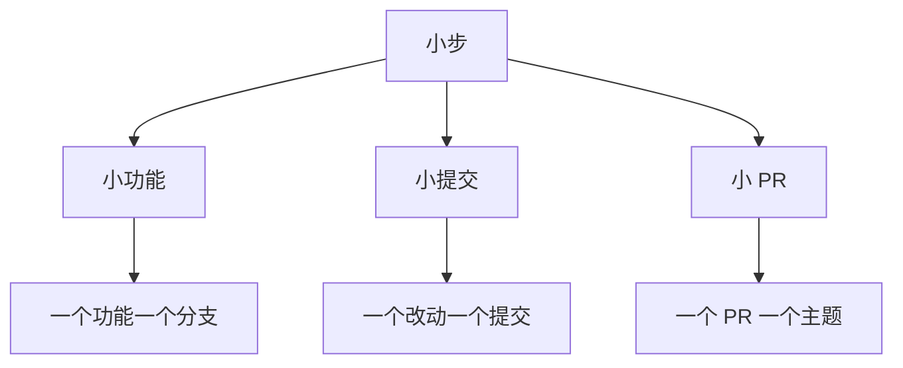
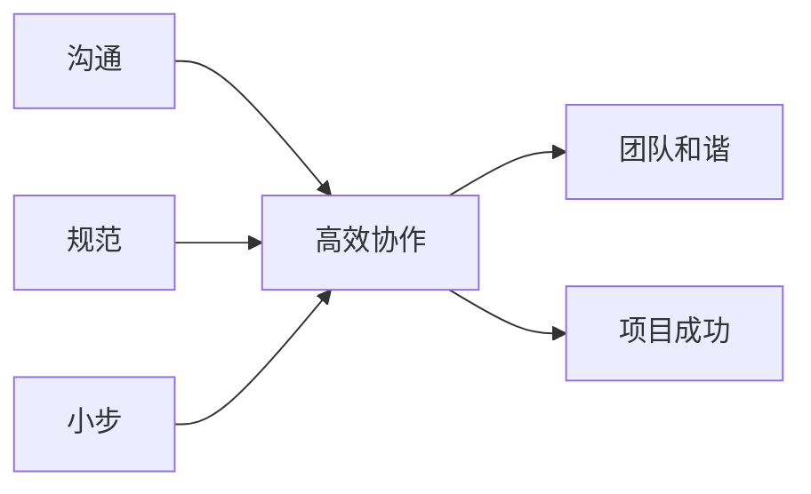
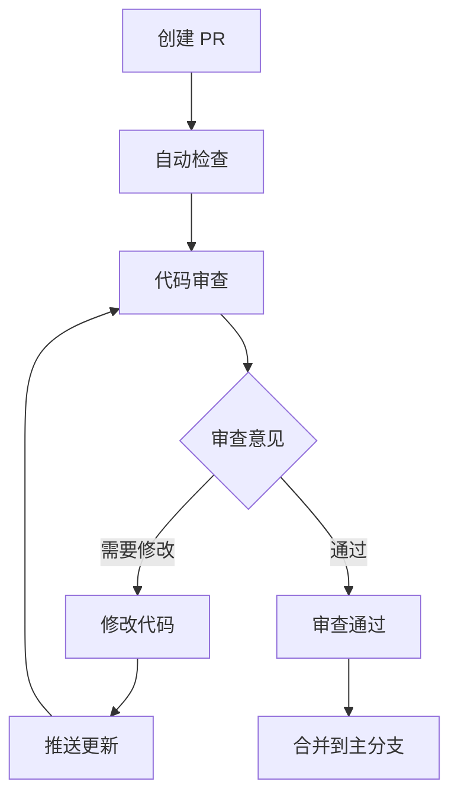
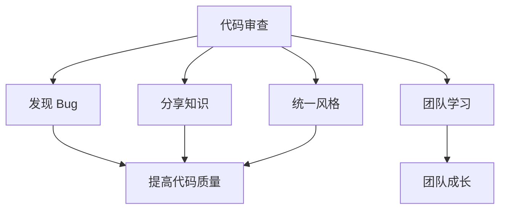
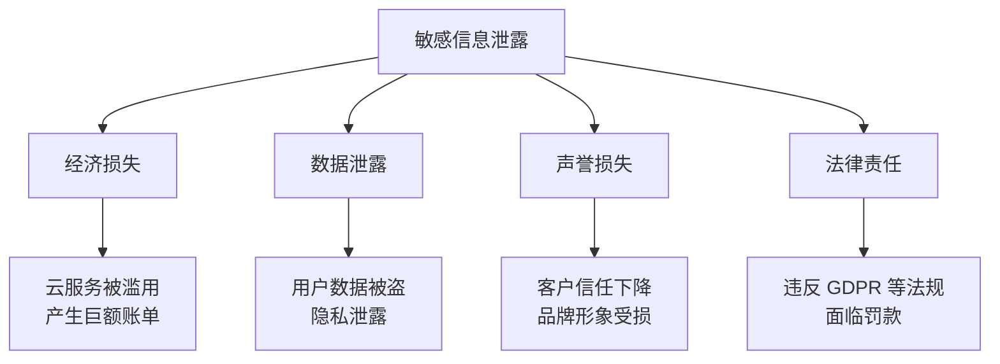

+++
title = "第19章：团队协作最佳实践 —— 别做那个被嫌弃的人"
weight = 190
date = 2026-04-03T19:36:48+08:00
type = "docs"
description = ""
isCJKLanguage = true
draft = false
+++
# 第19章：团队协作最佳实践 —— 别做那个被嫌弃的人

> 技术决定你能做什么，协作决定你能走多远。这一章，让我们学习如何成为团队中受欢迎的开发者，而不是那个被嫌弃的人。

---

## 19.1 三大原则：沟通、规范、小步

Git 协作的三大原则，就像是武林高手的内功心法——掌握了这些，你的协作功力将大增。

### 原则一：沟通



#### 沟通场景

```markdown
## ✅ 需要沟通的场景

1. **开始工作前**
   - "我要开始开发登录功能了"
   - "有人已经在做吗？"

2. **工作中**
   - "我遇到了一个技术难题"
   - "这个方案可行吗？"

3. **工作完成后**
   - "功能已完成，请 review"
   - "分享一下遇到的问题和解决方案"

4. **代码冲突时**
   - "我们的代码冲突了，一起解决一下"

5. **需要协调时**
   - "我需要你接口的支持"
   - "能帮我 review 一下吗？"
```

### 原则二：规范



#### 规范的重要性

```markdown
## 为什么需要规范？

1. **降低沟通成本**
   - 不需要问"这个文件放哪"
   - 不需要问"提交信息怎么写"

2. **提高代码质量**
   - 统一的代码风格
   - 一致的审查标准

3. **减少错误**
   - 规范的流程减少遗漏
   - 明确的职责减少冲突

4. **方便新人加入**
   - 有章可循
   - 快速上手
```

### 原则三：小步



#### 小步的好处

```markdown
## 小步快跑的优势

1. **降低风险**
   - 改得少，出错概率低
   - 容易回滚

2. **快速反馈**
   - 代码审查更快
   - 问题发现更早

3. **减少冲突**
   - 提交频繁，冲突少
   - 合并容易

4. **提高质量**
   - 专注做好一件事
   - 代码更清晰
```

### 三大原则的关系



### 实践建议

```markdown
## 每日检查清单

### 沟通
- [ ] 开始工作前在群里说一声
- [ ] 遇到问题及时求助
- [ ] 完成工作后通知相关人员

### 规范
- [ ] 遵循团队的代码规范
- [ ] 提交信息写清楚
- [ ] 按流程创建 PR

### 小步
- [ ] 功能拆分成小块
- [ ] 频繁提交
- [ ] PR 控制在合理大小
```

记住：**沟通让团队同步，规范让协作顺畅，小步让风险可控——三大原则，缺一不可！**

---

## 19.2 Commit 规范：Conventional Commits 实战

提交信息写 "update"、"fix"、"修改"... 这样的提交信息，过一个月后你自己都看不懂改了什么。

**Conventional Commits** 规范让提交信息清晰、一致、可自动化处理。

### 什么是 Conventional Commits？

**Conventional Commits** 是一种提交信息规范，定义了提交信息的格式：

```
<type>[optional scope]: <description>

[optional body]

[optional footer(s)]
```

### 提交类型（Type）

| 类型 | 含义 | 示例 |
|------|------|------|
| `feat` | 新功能 | `feat: 添加用户登录` |
| `fix` | Bug 修复 | `fix: 修复登录失败问题` |
| `docs` | 文档更新 | `docs: 更新 API 文档` |
| `style` | 代码格式 | `style: 格式化代码` |
| `refactor` | 重构 | `refactor: 重构用户模块` |
| `perf` | 性能优化 | `perf: 优化查询速度` |
| `test` | 测试相关 | `test: 添加登录测试` |
| `chore` | 构建/工具 | `chore: 更新依赖` |
| `ci` | CI/CD 相关 | `ci: 更新 GitHub Actions` |
| `build` | 构建相关 | `build: 更新 webpack 配置` |
| `revert` | 回滚 | `revert: 回滚登录功能` |

### 完整示例

```bash
# 基本格式
git commit -m "feat: 添加用户登录功能"

# 带 scope（范围）
git commit -m "feat(auth): 添加用户登录功能"

# 带 body（详细说明）
git commit -m "feat(auth): 添加用户登录功能

- 实现邮箱密码登录
- 添加 JWT Token 认证
- 添加登录状态保持

Closes #123"

# 带 footer（页脚）
git commit -m "feat(auth): 添加用户登录功能

BREAKING CHANGE: 登录接口返回格式变更

Closes #123"
```

### 提交信息示例

```markdown
## 好的提交信息

### feat: 新功能
```
feat(user): 添加用户注册功能

- 实现邮箱注册
- 添加邮箱验证
- 添加注册表单

Closes #100
```

### fix: Bug 修复
```
fix(auth): 修复登录失败问题

修复了当密码包含特殊字符时登录失败的问题。
原因是 URL 编码未正确处理。

Fixes #200
```

### docs: 文档
```
docs(api): 更新登录 API 文档

- 添加请求示例
- 添加响应示例
- 添加错误码说明
```

### refactor: 重构
```
refactor(user): 重构用户模块

将用户相关逻辑提取到单独的模块，
提高代码可维护性。

无功能变更。
```

### test: 测试
```
test(auth): 添加登录测试

- 添加单元测试
- 添加集成测试
- 添加 E2E 测试
```

### chore: 构建
```
chore(deps): 更新依赖

- 更新 React 到 18.0
- 更新 TypeScript 到 5.0
```
```

### 不好的提交信息

```markdown
## ❌ 不好的提交信息

- "update"（更新了什么？）
- "fix"（修复了什么？）
- "修改"（修改了什么？）
- "2024-01-01 更新"（没有意义）
- "WIP"（Work In Progress，不要提交）
- "bug fix"（哪个 bug？）
```

### 工具支持

#### Commitizen

```bash
# 安装 Commitizen
npm install -g commitizen

# 使用
git cz

# 交互式选择类型、范围、描述等
```

#### Commitlint

```bash
# 安装 Commitlint
npm install -g @commitlint/cli @commitlint/config-conventional

# 配置 .commitlintrc.js
module.exports = {
  extends: ['@commitlint/config-conventional'],
};

# 使用
commitlint --from HEAD~5
```

#### Husky + Commitlint

```bash
# 配置 Husky 在提交前检查
# .husky/commit-msg

#!/bin/sh
. "$(dirname "$0")/_/husky.sh"

npx --no -- commitlint --edit ${1}
```

### 自动生成 CHANGELOG

```bash
# 使用 conventional-changelog
npm install -g conventional-changelog-cli

# 生成 CHANGELOG
conventional-changelog -p angular -i CHANGELOG.md -s

# 或者使用 standard-version
npm install -g standard-version

# 自动更新版本号和 CHANGELOG
standard-version
```

### 团队约定

```markdown
## Commit 规范团队约定

### 提交信息格式
```
<type>(<scope>): <subject>

<body>

<footer>
```

### Type 必须
- feat: 新功能
- fix: Bug 修复
- docs: 文档
- style: 格式
- refactor: 重构
- test: 测试
- chore: 构建

### Scope 可选
- auth: 认证
- user: 用户
- api: 接口
- ui: 界面
- db: 数据库

### Subject 要求
- 不超过 50 个字符
- 小写开头
- 不加句号
- 使用祈使句

### Body 可选
- 详细说明改动
- 说明原因
- 说明影响

### Footer 可选
- Closes #xxx
- BREAKING CHANGE
```

### 小贴士

```bash
# 配置 Git 模板
# .gitmessage

# <type>(<scope>): <subject>
#
# <body>
#
# <footer>

# 配置
git config commit.template .gitmessage
```

记住：**好的提交信息是写给未来的自己看的——写清楚，未来的你会感谢现在的你！**

---

## 19.3 分支命名规范：feature/、fix/、hotfix/

分支命名就像是文件的命名——好的命名让你一眼就知道这个分支是做什么的，不好的命名让你一脸懵逼。

### 为什么需要分支命名规范？

```bash
# ❌ 不好的分支命名
git branch
  feature1
  new-stuff
  test
  bugfix
  my-branch
  temp

# ✅ 好的分支命名
git branch
  feature/user-login
  feature/payment-integration
  fix/login-error-message
  hotfix/security-vulnerability
  docs/api-update
```

### 分支类型前缀

| 前缀 | 用途 | 示例 |
|------|------|------|
| `feature/` | 新功能 | `feature/user-login` |
| `fix/` | Bug 修复 | `fix/login-error` |
| `hotfix/` | 紧急修复 | `hotfix/security-patch` |
| `docs/` | 文档更新 | `docs/api-reference` |
| `refactor/` | 重构 | `refactor/user-module` |
| `test/` | 测试相关 | `test/login-e2e` |
| `chore/` | 构建/工具 | `chore/update-deps` |
| `release/` | 发布 | `release/v1.0.0` |

### 命名格式

```
<type>/<description>

或者

<type>/<scope>/<description>
```

### 完整示例

```bash
# 功能分支
git checkout -b feature/user-authentication
git checkout -b feature/payment-gateway-integration
git checkout -b feature/api-rate-limiting

# 修复分支
git checkout -b fix/login-error-message
git checkout -b fix/memory-leak-in-dashboard
git checkout -b fix/api-timeout-handling

# 紧急修复分支
git checkout -b hotfix/critical-security-vulnerability
git checkout -b hotfix/database-connection-pool
git checkout -b hotfix/payment-processing-error

# 文档分支
git checkout -b docs/update-readme
git checkout -b docs/api-documentation
git checkout -b docs/deployment-guide

# 重构分支
git checkout -b refactor/extract-user-service
git checkout -b refactor/optimize-database-queries
git checkout -b refactor/migrate-to-typescript

# 测试分支
git checkout -b test/add-integration-tests
git checkout -b test/improve-code-coverage

# 发布分支
git checkout -b release/v1.0.0
git checkout -b release/v2.0.0-beta
```

### 命名规则

```markdown
## 分支命名规则

### 基本要求
1. **使用小写字母**
   - ✅ feature/user-login
   - ❌ Feature/UserLogin

2. **使用连字符分隔**
   - ✅ feature/user-login
   - ❌ feature/user_login
   - ❌ feature/userLogin

3. **简洁明了**
   - ✅ fix/login-error
   - ❌ fix/the-error-that-happens-when-user-tries-to-login

4. **包含 Issue 编号（可选）**
   - ✅ feature/123-user-login
   - ✅ fix/456-login-error

### 长度限制
- 总长度不超过 50 个字符
- 描述部分不超过 30 个字符
```

### 特殊分支

```bash
# 主分支
main          # 主分支（生产环境）
master        # 主分支（旧命名）
develop       # 开发分支
development   # 开发分支（另一种命名）

# 发布分支
release/v1.0.0
release/v2.0.0
release/v2.1.0-beta

# 紧急修复分支
hotfix/critical-bug
hotfix/security-patch
hotfix/data-corruption
```

### 团队约定

```markdown
## 分支命名团队约定

### 分支类型
- feature/*: 新功能
- fix/*: Bug 修复
- hotfix/*: 紧急修复
- docs/*: 文档
- refactor/*: 重构
- test/*: 测试
- release/*: 发布

### 命名格式
<type>/<issue-id>-<description>

示例：
- feature/123-user-login
- fix/456-login-error
- hotfix/789-security-patch

### 创建分支前
1. 检查是否已存在同名分支
2. 从正确的基分支创建
3. 在群里说一声（如果是大型功能）

### 删除分支
- 合并后及时删除
- 使用 git push origin --delete <branch>
```

### 自动化检查

```bash
# 使用 Git hooks 检查分支命名
# .husky/pre-commit

#!/bin/sh
. "$(dirname "$0")/_/husky.sh"

BRANCH=$(git rev-parse --abbrev-ref HEAD)
REGEX="^(feature|fix|hotfix|docs|refactor|test|release)\/[a-z0-9-]+$"

if ! echo "$BRANCH" | grep -qE "$REGEX"; then
  echo "分支命名不符合规范！"
  echo "格式: <type>/<description>"
  echo "示例: feature/user-login"
  exit 1
fi
```

### 小贴士

```bash
# 快速创建规范分支的别名
git config --global alias.feature '!git checkout -b feature/$1'
git config --global alias.fix '!git checkout -b fix/$1'
git config --global alias.hotfix '!git checkout -b hotfix/$1'

# 使用
git feature user-login
git fix login-error
git hotfix security-patch
```

记住：**好的分支命名是"自文档化"的——看一眼就知道是做什么的！**

---

## 19.4 PR 规范：标题、描述、Review 流程

PR（Pull Request）是团队协作的核心环节。一个好的 PR 能让审查者快速理解你的改动，加快合并速度。

### PR 标题规范

```markdown
## PR 标题格式

<type>: <description>

或者

<type>(<scope>): <description>
```

#### 示例

```markdown
## ✅ 好的 PR 标题

- feat: 添加用户登录功能
- fix(auth): 修复登录失败问题
- docs(api): 更新 API 文档
- refactor(user): 重构用户模块
- test(login): 添加登录测试

## ❌ 不好的 PR 标题

- 更新
- 修复 bug
- 功能完成
- 修改代码
- PR #123
```

### PR 描述模板

```markdown
## PR 描述模板

### 改动描述
<!-- 描述这个 PR 做了什么 -->
实现了用户登录功能，支持邮箱和密码登录。

### 改动原因
<!-- 为什么要做这个改动 -->
用户需要登录才能访问个人中心。

### 改动内容
- [x] 添加登录表单组件
- [x] 实现登录 API 对接
- [x] 添加表单验证
- [x] 添加错误处理

### 测试方法
1. 访问 /login 页面
2. 输入测试账号：test@example.com / password
3. 点击登录按钮
4. 验证是否跳转到首页

### 截图
<!-- 如果有 UI 改动 -->


### 关联 Issue
Closes #123

### 检查清单
- [x] 代码通过测试
- [x] 没有引入新的 lint 错误
- [x] 文档已更新（如果需要）
- [x] 提交信息符合规范
```

### Review 流程



### Review 检查清单

```markdown
## Review 检查清单

### 代码质量
- [ ] 代码逻辑正确
- [ ] 没有明显的 bug
- [ ] 边界条件处理
- [ ] 错误处理完善

### 代码风格
- [ ] 符合团队代码规范
- [ ] 命名清晰
- [ ] 注释适当
- [ ] 没有冗余代码

### 测试
- [ ] 有单元测试
- [ ] 测试覆盖主要逻辑
- [ ] 测试通过

### 文档
- [ ] 代码注释清晰
- [ ] 接口文档更新（如果需要）
- [ ] README 更新（如果需要）

### 性能
- [ ] 没有明显的性能问题
- [ ] 没有内存泄漏
```

### Review 意见规范

```markdown
## Review 意见分类

### 🔴 Blocking（必须修改）
- 代码有 bug
- 有安全问题
- 有性能问题

### 🟡 Suggestion（建议修改）
- 代码可以优化
- 有更好的实现方式
- 建议添加测试

### 🟢 Praise（表扬）
- 代码写得好
- 思路清晰
- 值得学习

### ❓ Question（疑问）
- 不理解的地方
- 需要解释
- 讨论方案
```

### Review 回复规范

```markdown
## Review 回复示例

### 同意修改
```
感谢指出！已修改，请查看。
```

### 不同意修改
```
感谢建议！这里我考虑的是...
你觉得这样是否可行？
```

### 解释原因
```
这里这样做是因为...
如果改成建议的方式，会有...问题。
```

### 请求澄清
```
不太理解这个建议，能详细说明一下吗？
```
```

### PR 大小规范

```markdown
## PR 大小规范

### 理想大小
- 修改文件数：5-10 个
- 代码行数：100-300 行
- 审查时间：15-30 分钟

### 最大限制
- 修改文件数：不超过 20 个
- 代码行数：不超过 500 行
- 审查时间：不超过 1 小时

### 如果 PR 太大
- 拆分成多个小 PR
- 使用 Draft PR 先占坑
- 分阶段 review
```

### 团队约定

```markdown
## PR 团队约定

### 创建 PR 前
- [ ] 代码通过本地测试
- [ ] 代码符合规范
- [ ] 提交信息符合规范
- [ ] 分支已推送到远程

### PR 描述
- [ ] 标题清晰
- [ ] 描述完整
- [ ] 有测试方法
- [ ] 关联 Issue

### Review 时间
- [ ] 24 小时内响应
- [ ] 48 小时内完成审查
- [ ] 紧急情况优先处理

### 合并条件
- [ ] 至少 1 人审查通过
- [ ] CI/CD 检查通过
- [ ] 无冲突
- [ ] 提交信息规范
```

### 小贴士

```bash
# 配置 PR 模板
# 创建 .github/pull_request_template.md

# GitHub CLI 创建 PR
gh pr create --title "feat: 添加登录功能" --body-file pr-template.md
```

记住：**好的 PR 是"自解释的"——审查者不需要问你就能理解改动！**

---

## 19.5 .gitignore 规范：每个项目都必须有

你有没有遇到过这种情况：不小心把 `node_modules` 或者 `.env` 文件提交到了仓库？

**`.gitignore`** 文件就是用来防止这种问题的！

### 什么是 .gitignore？

**`.gitignore`** 文件告诉 Git 哪些文件不应该被跟踪和提交。

```bash
# .gitignore 示例
node_modules/
.env
.DS_Store
*.log
dist/
build/
```

### 为什么需要 .gitignore？

```markdown
## 需要忽略的文件类型

1. **依赖目录**
   - node_modules/
   - vendor/
   - 可以通过包管理器重新安装

2. **配置文件（含敏感信息）**
   - .env
   - config.local.js
   - 包含密码、密钥等

3. **构建输出**
   - dist/
   - build/
   - 可以通过构建生成

4. **日志文件**
   - *.log
   - logs/
   - 临时文件

5. **系统文件**
   - .DS_Store (macOS)
   - Thumbs.db (Windows)
   - 系统生成的临时文件

6. **IDE 配置**
   - .idea/ (WebStorm)
   - .vscode/ (VS Code)
   - 个人偏好设置
```

### 常见项目的 .gitignore

#### Node.js 项目

```gitignore
# Dependencies
node_modules/
npm-debug.log*
yarn-debug.log*
yarn-error.log*

# Production build
dist/
build/

# Environment variables
.env
.env.local
.env.development.local
.env.test.local
.env.production.local

# Logs
logs
*.log

# Coverage
coverage/

# Cache
.cache/
.parcel-cache/

# IDE
.idea/
.vscode/
*.swp
*.swo

# OS
.DS_Store
Thumbs.db
```

#### Python 项目

```gitignore
# Byte-compiled
__pycache__/
*.py[cod]
*$py.class

# Virtual environments
venv/
env/
ENV/

# Distribution
build/
dist/
*.egg-info/

# IDE
.idea/
.vscode/
*.swp

# Environment
.env
.env.local

# Testing
.pytest_cache/
.coverage
htmlcov/

# OS
.DS_Store
Thumbs.db
```

#### Java 项目

```gitignore
# Compiled
*.class
target/
build/

# IDE
.idea/
*.iml
.vscode/
.classpath
.project
.settings/

# Gradle
.gradle/
build/

# Maven
target/

# OS
.DS_Store
Thumbs.db
```

### .gitignore 语法

```gitignore
# 注释
# 这是注释

# 忽略文件
*.log

# 忽略目录
node_modules/

# 不忽略特定文件
!important.log

# 忽略根目录下的文件
/config.json

# 忽略所有目录下的文件
config.json

# 忽略特定目录
build/

# 忽略所有 .tmp 文件
*.tmp

# 但不禁用特定 .tmp 文件
!important.tmp

# 忽略 doc/notes.txt，但不忽略 doc/server/arch.txt
doc/*.txt

# 忽略 doc/ 目录下的所有 .pdf 文件
doc/**/*.pdf
```

### 全局 .gitignore

```bash
# 配置全局 .gitignore
git config --global core.excludesfile ~/.gitignore_global

# 创建全局 .gitignore
cat > ~/.gitignore_global << 'EOF'
# OS
.DS_Store
Thumbs.db

# IDE
.idea/
.vscode/
*.swp
*.swo
*~

# Logs
*.log
EOF
```

### 检查 .gitignore 是否生效

```bash
# 查看哪些文件被忽略
git check-ignore -v filename

# 查看所有被忽略的文件
git status --ignored

# 查看被跟踪但被忽略的文件
git ls-files --others --ignored --exclude-standard
```

### 强制添加被忽略的文件

```bash
# 如果确实需要添加被忽略的文件
git add -f filename

# 或者修改 .gitignore
# 添加例外规则
!filename
```

### 从仓库中移除已跟踪的文件

```bash
# 如果文件已经被跟踪，添加到 .gitignore 后不会自动忽略

# 1. 添加到 .gitignore
echo "filename" >> .gitignore

# 2. 从仓库中移除（但保留本地文件）
git rm --cached filename

# 3. 提交
git add .gitignore
git commit -m "chore: 添加 .gitignore"
```

### 最佳实践

```markdown
## .gitignore 最佳实践

### ✅ 要做的
- [ ] 项目初始化时就创建 .gitignore
- [ ] 根据项目类型选择合适的模板
- [ ] 及时更新 .gitignore
- [ ] 使用全局 .gitignore 处理系统文件

### ❌ 不要做的
- [ ] 提交 node_modules/
- [ ] 提交 .env 文件
- [ ] 提交构建输出
- [ ] 提交个人 IDE 配置

### 检查清单
- [ ] 克隆项目后能否正常运行？
- [ ] 敏感信息是否在 .gitignore 中？
- [ ] 构建输出是否在 .gitignore 中？
```

### 常用模板

```bash
# GitHub 提供了各种项目的 .gitignore 模板
# https://github.com/github/gitignore

# 下载 Node.js 模板
curl -o .gitignore https://raw.githubusercontent.com/github/gitignore/main/Node.gitignore

# 下载 Python 模板
curl -o .gitignore https://raw.githubusercontent.com/github/gitignore/main/Python.gitignore

# 下载 Java 模板
curl -o .gitignore https://raw.githubusercontent.com/github/gitignore/main/Java.gitignore
```

### 小贴士

```bash
# 使用 gitignore.io 生成 .gitignore
# https://www.toptal.com/developers/gitignore

# 或者使用命令行
curl -sL https://www.toptal.com/developers/gitignore/api/node,python >> .gitignore
```

记住：**.gitignore 是项目的"门卫"——把好关，别让不该进的东西进来！**

---

## 19.6 代码审查文化：建设性反馈的艺术

代码审查（Code Review）不只是找 bug，更是团队学习和成长的机会。建设性的反馈能让代码质量提升，也能让团队氛围更和谐。

### 审查的目的



### 审查者的态度

```markdown
## ✅ 正确的态度

- **帮助而不是批评**
  - "这里可以优化一下..."
  - 而不是 "这里写错了！"

- **询问而不是命令**
  - "这里为什么这样写？"
  - 而不是 "改成..."

- **解释原因**
  - "建议这样改，因为..."
  - 而不是只说 "改成..."

- **认可好的代码**
  - "这个实现很巧妙！"
  - 不只是找问题

## ❌ 错误的态度

- 挑刺
- 命令式语气
- 不解释原因
- 只关注问题
- 拖延审查
```

### 反馈的格式

```markdown
## 建设性反馈格式

### 1. 先肯定
"整体实现很好，思路清晰！"

### 2. 指出问题
"不过这里有个小问题..."

### 3. 解释原因
"因为如果用户输入为空，会导致..."

### 4. 提供建议
"建议添加空值检查："
```javascript
if (!input) {
  return;
}
```

### 5. 征求意见
"你觉得这样改怎么样？"
```

### 反馈示例

#### 好的反馈

```markdown
这个函数的实现很简洁！👍

不过我在想，如果数组很大，
递归会不会导致栈溢出？

建议改成迭代实现，这样更安全：

```javascript
function findItem(items, id) {
  for (const item of items) {
    if (item.id === id) return item;
  }
  return null;
}
```

你觉得呢？
```

#### 不好的反馈

```markdown
这里有问题，改一下。
```

### 不同类型的反馈

```markdown
## 🔴 Blocking（必须修改）

```
这里有一个安全问题。
密码不应该明文存储，
建议使用 bcrypt 加密。

这是 blocking 问题，需要修改后才能合并。
```

## 🟡 Suggestion（建议修改）

```
建议把魔法数字提取成常量：

```javascript
// 现在
if (status === 200) { ... }

// 建议
const HTTP_OK = 200;
if (status === HTTP_OK) { ... }
```

这样可读性更好。
```

## 🟢 Praise（表扬）

```
错误处理写得很全面！
考虑了各种边界情况，👍
```

## ❓ Question（疑问）

```
这里为什么要用 setTimeout？
是有特殊的考虑吗？
```
```

### 被审查者的态度

```markdown
## ✅ 正确的态度

- **虚心接受**
  - "感谢指出，我改一下"

- **不懂就问**
  - "不太理解这个建议，能详细说说吗？"

- **解释原因**
  - "这里这样做是因为..."

- **及时修改**
  - 不要让 reviewer 等太久

- **感谢时间**
  - "感谢 review！"

## ❌ 错误的态度

- 抵触情绪
- "我没错"
- 不回复
- 拖延修改
- 情绪化
```

### 审查的时机

```markdown
## 审查时间约定

### 普通 PR
- 24 小时内开始审查
- 48 小时内完成审查

### 紧急 PR
- 2 小时内开始审查
- 当天完成审查

### 大型 PR
- 可以分阶段审查
- 提前沟通审查计划
```

### 审查的范围

```markdown
## 审查什么？

### 必须审查
- [ ] 代码逻辑正确性
- [ ] 安全性问题
- [ ] 性能问题
- [ ] 错误处理

### 建议审查
- [ ] 代码风格
- [ ] 命名规范
- [ ] 注释质量
- [ ] 测试覆盖

### 可选审查
- [ ] 架构设计（大型改动）
- [ ] 文档更新
```

### 团队建设

```markdown
## 建立良好的审查文化

### 1. 定期分享
- 分享好的代码实践
- 讨论审查中发现的问题

### 2. 互相学习
-  senior 帮助 junior
-  junior 也能发现 senior 的问题

### 3. 不指责
- 对事不对人
- 问题不是人的问题，是代码的问题

### 4. 持续改进
- 定期回顾审查流程
- 优化审查清单
```

### 小贴士

```bash
# 使用工具辅助审查
# 1. 代码风格检查
npm run lint

# 2. 自动化测试
npm test

# 3. 代码覆盖率
cat coverage/lcov-report/index.html
```

记住：**代码审查是"代码的体检"——发现问题，共同成长，而不是挑毛病！**

---

## 19.7 团队 Git 工作流文档：写在纸上，记在心里

口头约定容易被遗忘，书面文档才能长久。一个清晰的 Git 工作流文档，能让团队协作事半功倍。

### 为什么需要工作流文档？

```markdown
## 文档的好处

1. **减少沟通成本**
   - 不需要反复解释流程
   - 新人可以快速上手

2. **统一标准**
   - 所有人按同一套规则工作
   - 减少冲突和混乱

3. **便于追溯**
   - 为什么这样规定？
   - 文档里有说明

4. **持续改进**
   - 发现问题可以更新文档
   - 流程不断优化
```

### 工作流文档模板

```markdown
# Git 工作流文档

## 分支策略

### 主分支
- `main`: 生产环境代码
- `develop`: 开发环境代码

### 功能分支
- `feature/*`: 新功能
- `fix/*`: Bug 修复
- `hotfix/*`: 紧急修复

## 工作流程

### 1. 开始新功能
```bash
git checkout develop
git pull origin develop
git checkout -b feature/xxx
```

### 2. 开发过程中
```bash
git add .
git commit -m "feat: xxx"
git push origin feature/xxx
```

### 3. 创建 PR
- 从 feature/xxx 到 develop
- 填写 PR 模板
- 添加审查者

### 4. 代码审查
- 至少 1 人审查通过
- 解决所有评论
- CI/CD 检查通过

### 5. 合并
- 使用 Squash 合并
- 删除 feature 分支

## 提交信息规范

使用 Conventional Commits：
- `feat`: 新功能
- `fix`: Bug 修复
- `docs`: 文档
- `style`: 格式
- `refactor`: 重构
- `test`: 测试
- `chore`: 构建

## 代码审查规范

### 审查者
- 24 小时内响应
- 使用分类标签：🔴 Blocking / 🟡 Suggestion / 🟢 Praise

### 被审查者
- 48 小时内修改完成
- 回复所有评论

## 发布流程

### 1. 创建发布分支
```bash
git checkout -b release/v1.0.0 develop
```

### 2. 测试
- 运行所有测试
- 手动测试关键功能

### 3. 修复问题
- 在 release 分支修复
- 合并回 develop

### 4. 发布
```bash
git checkout main
git merge release/v1.0.0
git tag -a v1.0.0 -m "版本 1.0.0"
git push origin main --tags
```

## 常见问题

### Q: 如何解决冲突？
A: 在本地解决，不要直接在 GitHub 上解决。

### Q: 可以 force push 吗？
A: 个人 feature 分支可以，但必须用 --force-with-lease。

### Q: PR 多大合适？
A: 建议 300 行以内，最多不超过 500 行。

## 联系方式

- Git 问题：@技术负责人
- 流程问题：@团队负责人
```

### 文档应该放在哪里？

```markdown
## 文档位置

### 1. 项目内文档
- `docs/git-workflow.md`
- `CONTRIBUTING.md`
- `README.md` 中链接

### 2. 团队 Wiki
- Confluence
- Notion
- GitHub Wiki

### 3. 代码仓库
- `.github/CONTRIBUTING.md`
- 创建 PR 时自动显示
```

### 文档维护

```markdown
## 文档维护原则

1. **谁发现问题谁更新**
   - 流程有问题，及时更新文档

2. **定期回顾**
   - 每月/每季度回顾一次
   - 优化不合理的地方

3. **版本控制**
   - 文档也要版本控制
   - 记录变更历史

4. **通知团队**
   - 文档更新后通知团队
   - 重要变更需要讨论
```

### 新人入职指南

```markdown
# Git 新人入职指南

## 第一天

### 1. 配置 Git
```bash
git config --global user.name "你的名字"
git config --global user.email "你的邮箱"
git config --global init.defaultBranch main
```

### 2. 克隆项目
```bash
git clone https://github.com/team/project.git
cd project
```

### 3. 阅读文档
- 阅读 README.md
- 阅读 CONTRIBUTING.md
- 阅读本文档

## 第一周

### 1. 小任务练习
- 找一个简单的 bug 修复
- 走一遍完整流程

### 2. 寻求帮助
- 有问题随时问
- 不要自己瞎琢磨

## 第一个月

### 1. 独立完成任务
- 从功能设计到上线
- 完整走一遍流程

### 2. 反馈改进
- 发现文档问题及时反馈
- 帮助改进流程
```

### 小贴士

```markdown
## 文档编写技巧

1. **简洁明了**
   - 不要长篇大论
   - 用列表和表格

2. **示例丰富**
   - 提供具体命令
   - 提供示例代码

3. **常见问题**
   - 收集常见问题
   - 提供解决方案

4. **持续更新**
   - 流程变化及时更新
   - 定期检查准确性
```

记住：**好的文档是团队的"宪法"——写在纸上，记在心里，共同遵守！**

---

## 19.8 安全与合规：敏感信息保护

代码仓库是公司的核心资产，保护好敏感信息是每个开发者的责任。一个不小心的提交，可能导致严重的安全事故。

### 什么是敏感信息？

```markdown
## 敏感信息类型

### 🔴 绝对不能提交
- 密码
- API 密钥
- 私钥（SSH、SSL）
- 数据库连接字符串
- 令牌（Token）
- 信用卡信息

### 🟡 谨慎提交
- 配置文件（可能含敏感信息）
- 日志文件（可能含敏感信息）
- 测试数据（可能含真实数据）

### 🟢 可以提交
- 代码
- 文档
- 测试（不含敏感信息）
- 配置文件（使用占位符）
```

### 敏感信息泄露的后果



### 预防措施

#### 1. 使用 .gitignore

```gitignore
# 敏感文件
.env
.env.local
.env.*.local

# 密钥文件
*.pem
*.key
*.p12
*.pfx

# 配置文件（可能含敏感信息）
config.local.js
config.prod.js

# 日志文件
*.log
logs/
```

#### 2. 使用环境变量

```javascript
// ❌ 不要这样做
const apiKey = 'sk-1234567890abcdef';

// ✅ 应该这样做
const apiKey = process.env.API_KEY;
```

```bash
# .env 文件（添加到 .gitignore）
API_KEY=sk-1234567890abcdef
DB_PASSWORD=mypassword
```

#### 3. 使用配置文件模板

```javascript
// config.template.js
module.exports = {
  apiKey: process.env.API_KEY || 'your-api-key-here',
  dbPassword: process.env.DB_PASSWORD || 'your-db-password-here',
};

// config.js（添加到 .gitignore）
module.exports = {
  apiKey: process.env.API_KEY,
  dbPassword: process.env.DB_PASSWORD,
};
```

### 敏感信息泄露后的处理

```markdown
## 紧急处理流程

### 1. 立即撤销
- 撤销泄露的密钥/密码
- 生成新的密钥/密码

### 2. 评估影响
- 哪些服务受到影响？
- 是否有数据泄露？
- 影响范围有多大？

### 3. 通知相关方
- 通知安全团队
- 通知管理层
- 必要时通知用户

### 4. 清理历史
- 从 Git 历史中删除敏感信息
- 使用 git-filter-repo 或 BFG Repo-Cleaner

### 5. 复盘改进
- 为什么会泄露？
- 如何防止再次发生？
- 更新安全规范
```

### 从 Git 历史中删除敏感信息

```bash
# 使用 git-filter-repo（推荐）
pip install git-filter-repo

# 删除文件
git filter-repo --path config.js --invert-paths

# 删除包含敏感信息的提交
git filter-repo --replace-text <(echo 'password==>REMOVED')

# 强制推送（谨慎！）
git push origin --force --all
```

### 自动化检测

```bash
# 使用 Git hooks 检测敏感信息
# .husky/pre-commit

#!/bin/sh
. "$(dirname "$0")/_/husky.sh"

# 检测敏感信息
if git diff --cached --name-only | xargs grep -l "password\|secret\|key" 2>/dev/null; then
  echo "⚠️  检测到可能的敏感信息！"
  echo "请检查提交的文件。"
  exit 1
fi
```

### 使用工具检测

```bash
# 安装 git-secrets
brew install git-secrets

# 初始化
git secrets --install
git secrets --register-aws

# 扫描历史
git secrets --scan-history

# 扫描当前
git secrets --scan
```

### 团队安全规范

```markdown
## 安全规范

### 开发规范
- [ ] 不在代码中硬编码敏感信息
- [ ] 使用环境变量管理配置
- [ ] 配置文件添加到 .gitignore
- [ ] 提交前检查敏感信息

### 审查规范
- [ ] PR 审查时检查敏感信息
- [ ] 使用自动化工具扫描
- [ ] 发现敏感信息立即阻止合并

### 应急处理
- [ ] 发现泄露立即撤销密钥
- [ ] 通知安全团队
- [ ] 清理 Git 历史
- [ ] 复盘改进

### 培训
- [ ] 新员工安全培训
- [ ] 定期安全意识培训
- [ ] 分享安全案例
```

### 小贴士

```bash
# 使用 git-secrets 防止提交敏感信息

# 1. 安装
git clone https://github.com/awslabs/git-secrets.git
cd git-secrets
make install

# 2. 在项目目录初始化
git secrets --install
git secrets --register-aws

# 3. 添加自定义模式
git secrets --add 'password\s*=\s*.+'
git secrets --add 'api_key\s*=\s*.+'

# 4. 扫描
git secrets --scan
```

记住：**安全是每个人的责任——保护好敏感信息，就是保护团队和公司！**

---

## 19.9 本章小结：好的协作习惯，受益终身

这一章，我们学习了团队协作的最佳实践：

| 主题 | 核心要点 |
|------|----------|
| 三大原则 | 沟通、规范、小步 |
| Commit 规范 | Conventional Commits |
| 分支命名 | feature/、fix/、hotfix/ |
| PR 规范 | 清晰的标题和描述 |
| .gitignore | 保护敏感信息 |
| 代码审查 | 建设性反馈 |
| 工作流文档 | 书面约定 |
| 安全合规 | 保护敏感信息 |

### 核心原则

1. **沟通第一**：及时同步，减少误解
2. **规范为王**：统一标准，提高效率
3. **小步快跑**：降低风险，快速迭代
4. **安全第一**：保护敏感信息

**好的协作习惯，让团队更高效，让自己更专业！**

---

**第19章完**

