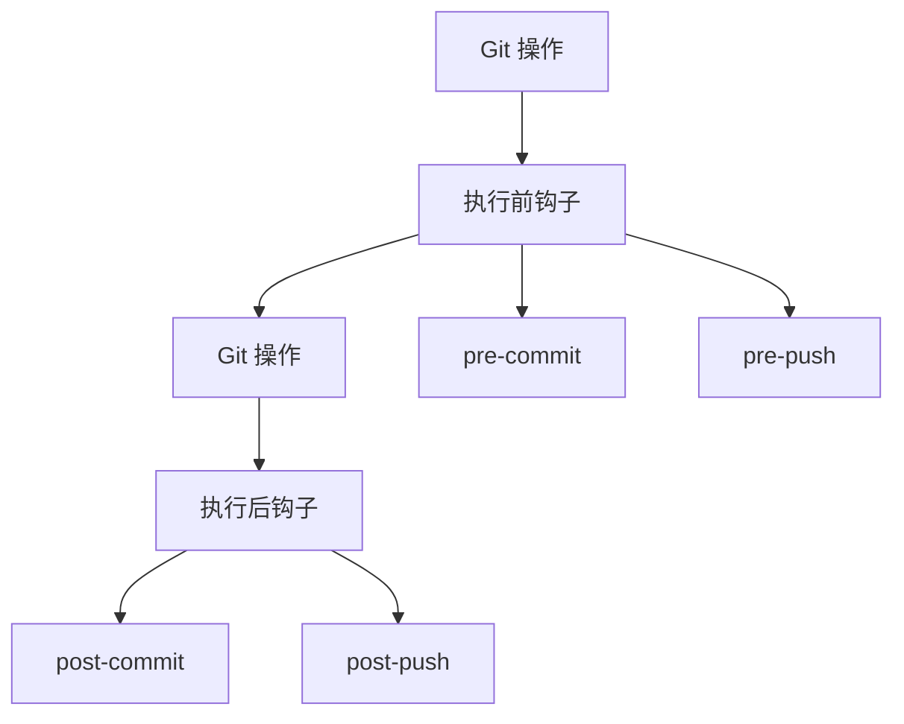
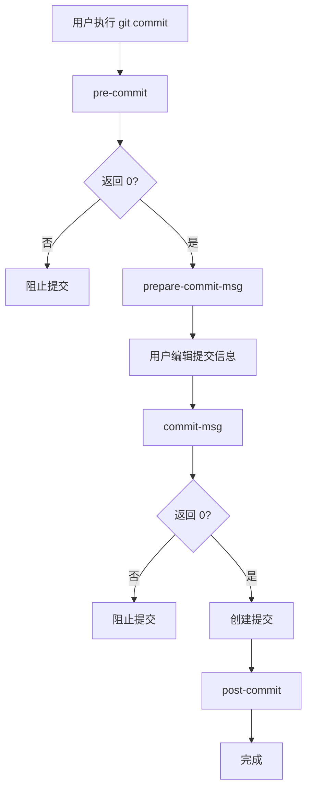
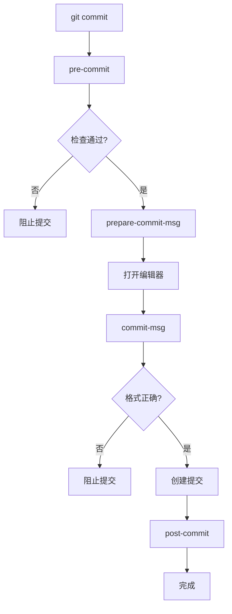
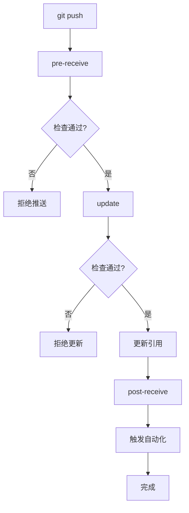
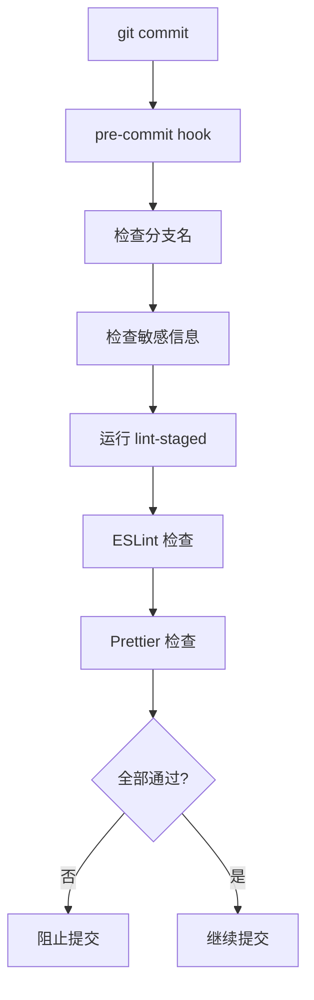
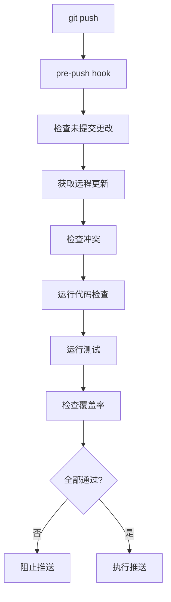
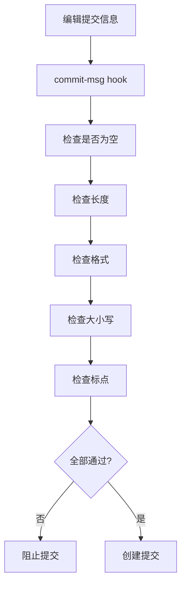
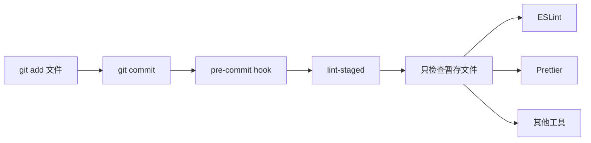
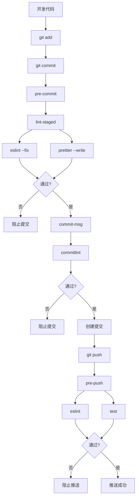

+++
title = "第20章：Git 钩子与自动化 —— 让 Git 替你干活"
weight = 200
date = 2026-04-03T19:36:48+08:00
type = "docs"
description = ""
isCJKLanguage = true
draft = false
+++
# 第20章：Git 钩子与自动化 —— 让 Git 替你干活

> 重复的工作让人疲惫，自动化的工具让人轻松。Git Hooks 让你在特定时机自动执行脚本，让 Git 成为你的自动化助手！

---

## 20.1 什么是 Git Hooks？特定时机的自动执行

想象一下：每次提交代码前，自动检查代码格式；每次推送前，自动运行测试。这不是梦想，这是 **Git Hooks**！

### 什么是 Git Hooks？

**Git Hooks** 是在 Git 特定操作（如提交、推送）前后自动执行的脚本。



### Hooks 的存储位置

```bash
# 项目级别的 hooks（推荐）
.git/hooks/

# 全局 hooks
git config --global core.hooksPath ~/.git-hooks/

# 查看当前 hooks
cd .git/hooks && ls -la
```

### Hooks 的类型

```markdown
## 客户端 Hooks

### 提交相关
- `pre-commit`: 提交前执行
- `prepare-commit-msg`: 准备提交信息时执行
- `commit-msg`: 提交信息编辑后执行
- `post-commit`: 提交后执行

### 推送相关
- `pre-push`: 推送前执行
- `post-push`: 推送后执行

### 其他
- `pre-rebase`: rebase 前执行
- `post-checkout`: checkout 后执行
- `post-merge`: merge 后执行

## 服务端 Hooks

- `pre-receive`: 接收推送前执行
- `update`: 更新引用时执行
- `post-receive`: 接收推送后执行
```

### 一个简单的 Hook 示例

```bash
# 1. 进入 hooks 目录
cd .git/hooks

# 2. 创建 pre-commit hook
cat > pre-commit << 'EOF'
#!/bin/bash
echo "🚀 准备提交..."
echo "正在检查代码..."
# 这里可以添加检查逻辑
echo "✅ 检查通过！"
EOF

# 3. 添加执行权限
chmod +x pre-commit

# 4. 测试
git commit -m "test"
# 输出：
# 🚀 准备提交...
# 正在检查代码...
# ✅ 检查通过！
```

### Hooks 的工作原理



### Hooks 的返回值

```bash
# 返回 0：继续执行
exit 0

# 返回非 0：阻止操作
exit 1
```

### 查看示例 Hooks

```bash
# Git 自带示例 hooks
cd .git/hooks
ls -la

# 你会看到：
# applypatch-msg.sample
# commit-msg.sample
# fsmonitor-watchman.sample
# post-update.sample
# pre-applypatch.sample
# pre-commit.sample
# pre-merge-commit.sample
# pre-push.sample
# pre-rebase.sample
# pre-receive.sample
# prepare-commit-msg.sample
# push-to-checkout.sample
# update.sample

# 去掉 .sample 后缀即可启用
cp pre-commit.sample pre-commit
chmod +x pre-commit
```

### 共享 Hooks

```bash
# 项目级别的 hooks 不会随仓库共享
# 需要其他方式共享

## 方法1：使用 git config
git config core.hooksPath .githooks

# 然后将 hooks 放在 .githooks/ 目录
# 并提交到仓库

## 方法2：使用 Husky
npm install husky --save-dev
npx husky install
```

### 小贴士

```bash
# 跳过 hooks（紧急情况）
git commit -m "message" --no-verify

# 或者
git commit -m "message" -n

# 禁用 hooks
git config --local core.hooksPath /dev/null
```

记住：**Git Hooks 是 Git 的"自动机器人"——在特定时机自动帮你干活！**

---

## 20.2 客户端钩子：pre-commit、prepare-commit-msg、commit-msg、post-commit

客户端 Hooks 在本地执行，是最常用的 Hooks 类型。让我们详细了解每个 Hooks 的作用和用法。

### pre-commit：提交前执行

在创建提交前执行，是最常用的 Hook。

```bash
# .git/hooks/pre-commit
#!/bin/bash

echo "🔍 正在检查代码..."

# 运行代码检查
npm run lint

if [ $? -ne 0 ]; then
    echo "❌ 代码检查失败，请修复后再提交"
    exit 1
fi

# 运行测试
npm test

if [ $? -ne 0 ]; then
    echo "❌ 测试失败，请修复后再提交"
    exit 1
fi

echo "✅ 检查通过！"
exit 0
```

#### pre-commit 的常见用途

```bash
# 1. 代码格式检查
#!/bin/bash
npm run lint

# 2. 运行测试
#!/bin/bash
npm test

# 3. 检查敏感信息
#!/bin/bash
if git diff --cached --name-only | xargs grep -l "password"; then
    echo "❌ 检测到敏感信息！"
    exit 1
fi

# 4. 检查文件大小
#!/bin/bash
if git diff --cached --stat | grep -E "^.*\s+\d+\s+\d+\s+.*$"; then
    echo "⚠️  大文件检测"
fi
```

### prepare-commit-msg：准备提交信息

在打开提交信息编辑器前执行，可以修改默认的提交信息。

```bash
# .git/hooks/prepare-commit-msg
#!/bin/bash

# $1: 提交信息文件路径
# $2: 提交类型（message, template, merge, squash, commit）
# $3: 提交 SHA（如果是 amend）

COMMIT_MSG_FILE=$1
COMMIT_SOURCE=$2
SHA1=$3

# 如果是普通提交，添加前缀
if [ "$COMMIT_SOURCE" = "message" ]; then
    echo "feat: $(cat $COMMIT_MSG_FILE)" > $COMMIT_MSG_FILE
fi

# 添加提交模板
if [ -z "$COMMIT_SOURCE" ] || [ "$COMMIT_SOURCE" = "template" ]; then
    cat > $COMMIT_MSG_FILE << 'EOF'
# <type>: <description>
#
# <body>
#
# <footer>
#
# Type:
# - feat: 新功能
# - fix: Bug 修复
# - docs: 文档
# - style: 格式
# - refactor: 重构
# - test: 测试
# - chore: 构建
EOF
fi
```

### commit-msg：提交信息编辑后

在提交信息编辑完成后执行，用于验证提交信息格式。

```bash
# .git/hooks/commit-msg
#!/bin/bash

COMMIT_MSG_FILE=$1
COMMIT_MSG=$(cat $COMMIT_MSG_FILE)

# 检查提交信息格式
if ! echo "$COMMIT_MSG" | grep -qE "^(feat|fix|docs|style|refactor|test|chore)(\(.+\))?: .+"; then
    echo "❌ 提交信息格式不正确！"
    echo "格式: <type>: <description>"
    echo "示例: feat: 添加登录功能"
    exit 1
fi

# 检查提交信息长度
if [ ${#COMMIT_MSG} -lt 10 ]; then
    echo "❌ 提交信息太短！"
    exit 1
fi

echo "✅ 提交信息格式正确！"
exit 0
```

### post-commit：提交后执行

在提交创建完成后执行，用于通知或后续处理。

```bash
# .git/hooks/post-commit
#!/bin/bash

# 获取提交信息
COMMIT_MSG=$(git log -1 --pretty=%B)
COMMIT_HASH=$(git log -1 --pretty=%H)

echo "✅ 提交成功！"
echo "提交: $COMMIT_HASH"
echo "信息: $COMMIT_MSG"

# 发送通知（可选）
# curl -X POST \
#   -H "Content-Type: application/json" \
#   -d "{\"text\": \"新提交: $COMMIT_MSG\"}" \
#   https://hooks.slack.com/...

# 播放提示音（macOS）
afplay /System/Library/Sounds/Glass.aiff
```

### 完整示例：提交流程



### 客户端 Hooks 对比

| Hook | 执行时机 | 常见用途 |
|------|----------|----------|
| pre-commit | 提交前 | 代码检查、测试 |
| prepare-commit-msg | 准备提交信息 | 添加模板、修改信息 |
| commit-msg | 提交信息编辑后 | 验证格式 |
| post-commit | 提交后 | 通知、后续处理 |

### 小贴士

```bash
# 查看 hooks 示例
ls .git/hooks/*.sample

# 启用示例 hook
cp .git/hooks/pre-commit.sample .git/hooks/pre-commit
chmod +x .git/hooks/pre-commit

# 调试 hook
#!/bin/bash
set -x  # 开启调试模式
# hook 逻辑
set +x  # 关闭调试模式
```

记住：**客户端 Hooks 是你的"代码守门员"——在代码进入仓库前把好质量关！**

---

## 20.3 服务端钩子：pre-receive、update、post-receive

服务端 Hooks 在 Git 服务器上执行，用于控制推送行为和触发自动化流程。

### pre-receive：接收推送前

在接收推送前执行，可以拒绝不符合条件的推送。

```bash
# 在 Git 服务器上
# /path/to/repo.git/hooks/pre-receive

#!/bin/bash

echo "🔍 正在检查推送..."

# 读取推送的引用
while read oldrev newrev refname; do
    # 检查分支名格式
    branch=$(echo $refname | sed 's/refs\/heads\///')
    
    if ! echo "$branch" | grep -qE "^(feature|fix|hotfix|docs|refactor|test)\/"; then
        if [ "$branch" != "main" ] && [ "$branch" != "develop" ]; then
            echo "❌ 分支名不符合规范: $branch"
            echo "格式: <type>/<description>"
            exit 1
        fi
    fi
    
    # 检查提交信息
    commits=$(git rev-list $oldrev..$newrev)
    for commit in $commits; do
        msg=$(git log -1 --pretty=%B $commit)
        if ! echo "$msg" | grep -qE "^(feat|fix|docs|style|refactor|test|chore)(\(.+\))?: .+"; then
            echo "❌ 提交信息格式不正确: $commit"
            echo "$msg"
            exit 1
        fi
    done
done

echo "✅ 检查通过！"
exit 0
```

### update：更新引用时

在更新每个引用时执行，比 pre-receive 更细粒度。

```bash
# /path/to/repo.git/hooks/update

#!/bin/bash

refname=$1
oldrev=$2
newrev=$3

echo "🔍 正在更新: $refname"

# 禁止直接推送到 main 分支
if [ "$refname" = "refs/heads/main" ]; then
    echo "❌ 禁止直接推送到 main 分支！"
    echo "请使用 Pull Request 合并代码。"
    exit 1
fi

# 检查文件大小
if git rev-list $oldrev..$newrev | while read commit; do
    git diff-tree -r -c -M -C --no-commit-id $commit | while read oldmode newmode oldsha newsha status file; do
        if [ -n "$newsha" ]; then
            size=$(git cat-file -s $newsha 2>/dev/null)
            if [ "$size" -gt 10485760 ]; then  # 10MB
                echo "❌ 文件过大: $file ($size bytes)"
                exit 1
            fi
        fi
    done
done; then
    :  # 通过
else
    exit 1
fi

echo "✅ 更新检查通过！"
exit 0
```

### post-receive：接收推送后

在推送完成后执行，用于触发自动化流程。

```bash
# /path/to/repo.git/hooks/post-receive

#!/bin/bash

echo "🚀 推送完成，触发自动化流程..."

while read oldrev newrev refname; do
    branch=$(echo $refname | sed 's/refs\/heads\///')
    
    # 推送到 main 分支时触发部署
    if [ "$branch" = "main" ]; then
        echo "📦 触发生产环境部署..."
        # 调用部署脚本
        /path/to/deploy.sh production
    fi
    
    # 推送到 develop 分支时触发测试
    if [ "$branch" = "develop" ]; then
        echo "🧪 触发测试..."
        # 调用测试脚本
        /path/to/run-tests.sh
    fi
    
    # 发送通知
    echo "📧 发送通知..."
    # curl -X POST \
    #   -H "Content-Type: application/json" \
    #   -d "{\"branch\": \"$branch\", \"commit\": \"$newrev\"}" \
    #   https://your-notification-service.com/webhook
done

echo "✅ 自动化流程完成！"
```

### 服务端 Hooks 对比

| Hook | 执行时机 | 常见用途 |
|------|----------|----------|
| pre-receive | 接收推送前 | 全局检查、拒绝推送 |
| update | 更新每个引用时 | 分支级别检查 |
| post-receive | 推送完成后 | 触发自动化、通知 |

### 服务端 Hooks 的工作流程



### 注意事项

```markdown
## ⚠️ 服务端 Hooks 注意事项

1. **执行环境**
   - 在服务器上执行
   - 需要正确的权限
   - 需要安装依赖

2. **性能考虑**
   - 不要执行耗时操作
   - 超时会导致推送失败

3. **错误处理**
   - 输出到 stderr
   - 返回非 0 拒绝推送

4. **日志记录**
   - 记录检查日志
   - 便于排查问题
```

### 小贴士

```bash
# 测试服务端 hook
# 在本地创建 bare 仓库模拟服务器

git init --bare server.git
cd server.git/hooks

# 创建 pre-receive
cat > pre-receive << 'EOF'
#!/bin/bash
echo "Testing pre-receive hook"
exit 0
EOF
chmod +x pre-receive

# 测试推送
cd ..
git clone server.git client
cd client
echo "test" > test.txt
git add .
git commit -m "test"
git push origin main
```

记住：**服务端 Hooks 是"中央大门"——控制什么代码可以进入仓库！**

---

## 20.4 pre-commit：提交前自动检查代码格式

`pre-commit` 是最常用的 Git Hook，让我们在提交前自动检查代码，确保代码质量。

### 基础 pre-commit

```bash
# .git/hooks/pre-commit
#!/bin/bash

echo "🔍 正在检查代码..."

# 获取暂存的文件
STAGED_FILES=$(git diff --cached --name-only --diff-filter=ACM | grep -E '\.(js|jsx|ts|tsx)$')

if [ -z "$STAGED_FILES" ]; then
    echo "✅ 没有需要检查的文件"
    exit 0
fi

echo "检查文件:"
echo "$STAGED_FILES"

# 运行 ESLint
echo "🧹 运行 ESLint..."
npx eslint $STAGED_FILES

if [ $? -ne 0 ]; then
    echo "❌ ESLint 检查失败"
    echo "请修复错误后再提交"
    exit 1
fi

# 运行 Prettier 检查
echo "🎨 检查代码格式..."
npx prettier --check $STAGED_FILES

if [ $? -ne 0 ]; then
    echo "❌ 代码格式不正确"
    echo "运行 'npx prettier --write' 修复格式"
    exit 1
fi

echo "✅ 代码检查通过！"
exit 0
```

### 使用 lint-staged

```bash
# 安装 lint-staged
npm install --save-dev lint-staged

# 配置 package.json
{
  "lint-staged": {
    "*.{js,jsx,ts,tsx}": [
      "eslint --fix",
      "prettier --write",
      "git add"
    ],
    "*.{css,scss}": [
      "stylelint --fix",
      "git add"
    ],
    "*.md": [
      "prettier --write",
      "git add"
    ]
  }
}

# pre-commit hook
#!/bin/bash
npx lint-staged
```

### 完整 pre-commit 示例

```bash
#!/bin/bash

# 颜色定义
RED='\033[0;31m'
GREEN='\033[0;32m'
YELLOW='\033[1;33m'
NC='\033[0m' # No Color

echo "${YELLOW}🔍 开始提交前检查...${NC}"

# 1. 检查分支名
BRANCH=$(git rev-parse --abbrev-ref HEAD)
if ! echo "$BRANCH" | grep -qE "^(feature|fix|hotfix|docs|refactor|test)\/|^(main|develop)$"; then
    echo "${RED}❌ 分支名不符合规范: $BRANCH${NC}"
    echo "格式: <type>/<description> 或 main/develop"
    exit 1
fi

# 2. 检查敏感信息
echo "${YELLOW}🔒 检查敏感信息...${NC}"
if git diff --cached --name-only | xargs grep -l "password\|secret\|api_key" 2>/dev/null; then
    echo "${RED}❌ 检测到可能的敏感信息！${NC}"
    exit 1
fi

# 3. 运行 lint-staged
echo "${YELLOW}🧹 运行代码检查...${NC}"
npx lint-staged

if [ $? -ne 0 ]; then
    echo "${RED}❌ 代码检查失败${NC}"
    exit 1
fi

# 4. 运行测试（可选，如果测试很快）
# echo "${YELLOW}🧪 运行测试...${NC}"
# npm test -- --watchAll=false
# 
# if [ $? -ne 0 ]; then
#     echo "${RED}❌ 测试失败${NC}"
#     exit 1
# fi

echo "${GREEN}✅ 所有检查通过！准备提交...${NC}"
exit 0
```

### pre-commit 配置（.pre-commit-config.yaml）

```yaml
# 使用 pre-commit 框架
# https://pre-commit.com/

repos:
  - repo: https://github.com/pre-commit/pre-commit-hooks
    rev: v4.4.0
    hooks:
      - id: trailing-whitespace
      - id: end-of-file-fixer
      - id: check-yaml
      - id: check-added-large-files
        args: ['--maxkb=1000']
      - id: check-merge-conflict
      - id: detect-private-key

  - repo: https://github.com/psf/black
    rev: 23.1.0
    hooks:
      - id: black
        language_version: python3

  - repo: https://github.com/pycqa/flake8
    rev: 6.0.0
    hooks:
      - id: flake8

  - repo: https://github.com/pre-commit/mirrors-eslint
    rev: v8.34.0
    hooks:
      - id: eslint
        files: \.(js|jsx|ts|tsx)$
        types: [file]
```

### 安装 pre-commit

```bash
# 安装 pre-commit 工具
pip install pre-commit

# 安装 hooks
pre-commit install

# 手动运行检查
pre-commit run --all-files

# 更新 hooks
pre-commit autoupdate
```

### pre-commit 的工作流程



### 常见问题

#### 问题1：Hook 太慢

```bash
# 只检查暂存的文件，不要检查整个项目
# 使用 lint-staged

# 或者跳过某些检查
SKIP=eslint git commit -m "message"
```

#### 问题2：Hook 失败但想强制提交

```bash
# 跳过 hooks
git commit -m "message" --no-verify

# 或者
SKIP=pre-commit git commit -m "message"
```

#### 问题3：Windows 上脚本不执行

```bash
# 确保使用正确的换行符
git config --global core.autocrlf true

# 或者使用 pre-commit 框架，跨平台支持更好
```

### 小贴士

```bash
# 配置 IDE 自动修复
# VS Code 设置
{
  "editor.formatOnSave": true,
  "editor.codeActionsOnSave": {
    "source.fixAll.eslint": true
  }
}

# 这样提交前错误会更少
```

记住：**pre-commit 是你的"代码质检员"——在代码入库前把好质量关！**

---

## 20.5 pre-push：推送前自动运行测试

`pre-push` Hook 在推送前执行，是运行完整测试套件的最佳时机。

### 基础 pre-push

```bash
# .git/hooks/pre-push
#!/bin/bash

echo "🚀 准备推送..."

# 获取远程和分支信息
remote=$1
url=$2

echo "远程: $remote"
echo "URL: $url"

# 运行测试
echo "🧪 运行测试..."
npm test

if [ $? -ne 0 ]; then
    echo "❌ 测试失败，推送取消"
    exit 1
fi

echo "✅ 测试通过，准备推送..."
exit 0
```

### 完整的 pre-push

```bash
#!/bin/bash

# 颜色定义
RED='\033[0;31m'
GREEN='\033[0;32m'
YELLOW='\033[1;33m'
BLUE='\033[0;34m'
NC='\033[0m'

remote=$1
url=$2

echo "${BLUE}🚀 准备推送到 $remote${NC}"

# 获取当前分支
BRANCH=$(git rev-parse --abbrev-ref HEAD)
echo "${YELLOW}📋 当前分支: $BRANCH${NC}"

# 检查是否是主分支
if [ "$BRANCH" = "main" ] || [ "$BRANCH" = "master" ]; then
    echo "${YELLOW}⚠️  正在推送到主分支${NC}"
    echo "${YELLOW}   请确保代码已经通过 review${NC}"
fi

# 1. 检查是否有未提交的更改
echo "${YELLOW}🔍 检查工作区...${NC}"
if ! git diff-index --quiet HEAD --; then
    echo "${RED}❌ 有未提交的更改${NC}"
    echo "请先提交或暂存更改"
    exit 1
fi

# 2. 获取远程更新
echo "${YELLOW}📥 获取远程更新...${NC}"
git fetch $remote

# 3. 检查是否有冲突
echo "${YELLOW}🔍 检查冲突...${NC}"
if git merge-tree $(git merge-base HEAD $remote/$BRANCH) HEAD $remote/$BRANCH | grep -q "<<<<<<<"; then
    echo "${RED}❌ 检测到潜在冲突${NC}"
    echo "请先拉取最新代码并解决冲突"
    exit 1
fi

# 4. 运行代码检查
echo "${YELLOW}🧹 运行代码检查...${NC}"
npm run lint

if [ $? -ne 0 ]; then
    echo "${RED}❌ 代码检查失败${NC}"
    exit 1
fi

# 5. 运行测试
echo "${YELLOW}🧪 运行测试...${NC}"
npm test -- --coverage --watchAll=false

if [ $? -ne 0 ]; then
    echo "${RED}❌ 测试失败${NC}"
    exit 1
fi

# 6. 检查测试覆盖率
echo "${YELLOW}📊 检查测试覆盖率...${NC}"
COVERAGE=$(cat coverage/coverage-summary.json | grep -o '"pct":[0-9]*' | head -1 | cut -d: -f2)
if [ "$COVERAGE" -lt 80 ]; then
    echo "${RED}❌ 测试覆盖率低于 80% ($COVERAGE%)${NC}"
    exit 1
fi

echo "${GREEN}✅ 所有检查通过！正在推送...${NC}"
exit 0
```

### pre-push 的工作流程



### 针对不同分支的检查

```bash
#!/bin/bash

remote=$1
url=$2
BRANCH=$(git rev-parse --abbrev-ref HEAD)

case $BRANCH in
    "main"|"master")
        echo "🔒 主分支推送检查"
        # 严格检查
        npm run lint
        npm test -- --coverage --watchAll=false
        # 检查覆盖率
        if [ $(cat coverage/lcov-report/index.html | grep -o '[0-9]*%' | head -1 | tr -d '%') -lt 90 ]; then
            echo "❌ 主分支要求 90% 覆盖率"
            exit 1
        fi
        ;;
    "develop")
        echo "🔧 开发分支推送检查"
        # 标准检查
        npm run lint
        npm test -- --watchAll=false
        ;;
    feature/*)
        echo "✨ 功能分支推送检查"
        # 基础检查
        npm run lint
        ;;
    *)
        echo "📁 其他分支，跳过检查"
        ;;
esac

exit 0
```

### 性能优化

```bash
#!/bin/bash

# 只检查将要推送的提交
while read local_ref local_sha remote_ref remote_sha; do
    # 获取将要推送的提交
    commits=$(git rev-list $remote_sha..$local_sha)
    
    # 只检查这些提交涉及的文件
    files=$(git diff --name-only $remote_sha $local_sha)
    
    # 只运行相关测试
    npm test -- --testPathPattern=$(echo $files | tr ' ' '|')
done

exit 0
```

### 与 CI/CD 配合

```bash
#!/bin/bash

# 本地 pre-push 做快速检查
# CI/CD 做完整检查

echo "🚀 快速检查..."

# 快速 lint
npm run lint:quick

# 快速测试（只测试修改的文件）
npm test -- --changedSince=origin/main

# 完整检查留给 CI/CD
echo "✅ 快速检查通过"
echo "📡 完整检查将在 CI/CD 中执行"

exit 0
```

### 常见问题

#### 问题1：测试太慢

```bash
# 只运行相关测试
npm test -- --testPathPattern=$(git diff --name-only HEAD~5..HEAD | grep -E '\.(js|ts)$' | tr '\n' '|')

# 或者跳过测试（紧急情况）
git push --no-verify
```

#### 问题2：推送被拒绝后如何恢复

```bash
# pre-push 失败后，修复问题再次推送即可
# 不需要特殊恢复步骤
```

### 小贴士

```bash
# 配置别名，快速推送
git config --global alias.push-safe '!git push'

# 使用
git push-safe

# 或者使用 git push --no-verify 跳过（紧急情况）
git push --no-verify
```

记住：**pre-push 是你的"最后一道防线"——确保推送的代码不会破坏远程仓库！**

---

## 20.6 commit-msg：检查提交信息格式

`commit-msg` Hook 在提交信息编辑完成后执行，用于验证提交信息是否符合规范。

### 基础 commit-msg

```bash
# .git/hooks/commit-msg
#!/bin/bash

# 提交信息文件路径
COMMIT_MSG_FILE=$1

# 读取提交信息
COMMIT_MSG=$(cat $COMMIT_MSG_FILE)

echo "🔍 检查提交信息..."

# 检查是否为空
if [ -z "$COMMIT_MSG" ]; then
    echo "❌ 提交信息不能为空"
    exit 1
fi

# 检查格式
if ! echo "$COMMIT_MSG" | grep -qE "^(feat|fix|docs|style|refactor|test|chore)(\(.+\))?: .+"; then
    echo "❌ 提交信息格式不正确"
    echo "格式: <type>: <description>"
    echo "示例: feat: 添加登录功能"
    exit 1
fi

echo "✅ 提交信息格式正确"
exit 0
```

### 完整的 commit-msg

```bash
#!/bin/bash

# 颜色定义
RED='\033[0;31m'
GREEN='\033[0;32m'
YELLOW='\033[1;33m'
NC='\033[0m'

COMMIT_MSG_FILE=$1
COMMIT_SOURCE=$2
SHA1=$3

echo "${YELLOW}🔍 检查提交信息...${NC}"

# 读取提交信息
COMMIT_MSG=$(head -1 $COMMIT_MSG_FILE)

# 1. 检查是否为空
if [ -z "$COMMIT_MSG" ]; then
    echo "${RED}❌ 提交信息不能为空${NC}"
    exit 1
fi

# 2. 检查长度（标题不超过 50 字符）
if [ ${#COMMIT_MSG} -gt 50 ]; then
    echo "${RED}❌ 提交信息标题过长 (${#COMMIT_MSG} 字符)${NC}"
    echo "请保持在 50 字符以内"
    exit 1
fi

# 3. 检查格式
if ! echo "$COMMIT_MSG" | grep -qE "^(feat|fix|docs|style|refactor|perf|test|chore|ci|build|revert)(\([a-z-]+\))?: .+"; then
    echo "${RED}❌ 提交信息格式不正确${NC}"
    echo ""
    echo "格式: <type>(<scope>): <description>"
    echo ""
    echo "Type:"
    echo "  feat:     新功能"
    echo "  fix:      Bug 修复"
    echo "  docs:     文档"
    echo "  style:    格式"
    echo "  refactor: 重构"
    echo "  perf:     性能优化"
    echo "  test:     测试"
    echo "  chore:    构建"
    echo "  ci:       CI/CD"
    echo "  build:    构建"
    echo "  revert:   回滚"
    echo ""
    echo "示例:"
    echo "  feat: 添加登录功能"
    echo "  fix(auth): 修复登录失败问题"
    exit 1
fi

# 4. 检查是否以大写字母开头（不应该）
if echo "$COMMIT_MSG" | grep -qE "^[^:]+: [A-Z]"; then
    echo "${RED}❌ 描述不应该以大写字母开头${NC}"
    exit 1
fi

# 5. 检查是否以句号结尾（不应该）
if echo "$COMMIT_MSG" | grep -qE "\.$"; then
    echo "${RED}❌ 描述不应该以句号结尾${NC}"
    exit 1
fi

# 6. 检查 body 和 footer（如果有）
BODY=$(tail -n +3 $COMMIT_MSG_FILE)
if [ -n "$BODY" ]; then
    # 检查 body 是否以空行分隔
    LINE2=$(sed -n '2p' $COMMIT_MSG_FILE)
    if [ -n "$LINE2" ]; then
        echo "${RED}❌ 标题和正文之间应该有空行${NC}"
        exit 1
    fi
fi

echo "${GREEN}✅ 提交信息格式正确${NC}"
exit 0
```

### commit-msg 的工作流程



### 使用 commitlint

```bash
# 安装 commitlint
npm install --save-dev @commitlint/cli @commitlint/config-conventional

# 配置 .commitlintrc.js
cat > .commitlintrc.js << 'EOF'
module.exports = {
  extends: ['@commitlint/config-conventional'],
  rules: {
    'type-enum': [2, 'always', [
      'feat', 'fix', 'docs', 'style', 'refactor',
      'perf', 'test', 'chore', 'ci', 'build', 'revert'
    ]],
    'type-case': [2, 'always', 'lower-case'],
    'type-empty': [2, 'never'],
    'scope-case': [2, 'always', 'lower-case'],
    'subject-case': [2, 'never', ['sentence-case', 'start-case', 'pascal-case', 'upper-case']],
    'subject-empty': [2, 'never'],
    'subject-full-stop': [2, 'never', '.'],
    'header-max-length': [2, 'always', 50],
    'body-leading-blank': [1, 'always'],
    'footer-leading-blank': [1, 'always'],
  }
};
EOF

# commit-msg hook
#!/bin/bash
npx --no -- commitlint --edit ${1}
```

### 团队约定

```markdown
## 提交信息规范

### 格式
```
<type>(<scope>): <subject>

<body>

<footer>
```

### Type
- feat: 新功能
- fix: Bug 修复
- docs: 文档
- style: 格式
- refactor: 重构
- perf: 性能优化
- test: 测试
- chore: 构建
- ci: CI/CD
- build: 构建
- revert: 回滚

### Scope
- auth: 认证
- user: 用户
- api: 接口
- ui: 界面
- db: 数据库

### Subject
- 不超过 50 字符
- 小写开头
- 不加句号
- 使用祈使句

### Body
- 详细说明改动
- 说明原因
- 说明影响

### Footer
- Closes #xxx
- BREAKING CHANGE
```

### 小贴士

```bash
# 配置 Git 提交模板
git config commit.template .gitmessage

# .gitmessage 内容
# <type>(<scope>): <subject>
#
# <body>
#
# <footer>
```

记住：**commit-msg 是你的"提交信息警察"——确保每条提交信息都规范清晰！**

---

## 20.7 Husky：管理 Git Hooks 的神器

手动管理 `.git/hooks` 下的脚本很麻烦，而且不能随仓库共享。**Husky** 让你可以用 npm 管理 Git Hooks，轻松共享给团队成员。

### 什么是 Husky？

**Husky** 是一个 npm 包，让你可以在 `package.json` 中配置 Git Hooks，Hooks 脚本存储在项目目录中，可以随仓库共享。

### 安装 Husky

```bash
# 安装 husky
npm install husky --save-dev

# 初始化 husky
npx husky install

# 添加 prepare 脚本（npm install 后自动启用）
npm set-script prepare "husky install"
```

### 添加 Hooks

```bash
# 添加 pre-commit hook
npx husky add .husky/pre-commit "npm test"

# 添加 commit-msg hook
npx husky add .husky/commit-msg 'npx --no -- commitlint --edit ${1}'

# 添加 pre-push hook
npx husky add .husky/pre-push "npm run lint && npm test"
```

### 生成的文件结构

```
项目根目录/
├── .husky/
│   ├── _/
│   │   └── husky.sh
│   ├── pre-commit
│   ├── commit-msg
│   └── pre-push
├── package.json
└── ...
```

### 配置示例

#### package.json

```json
{
  "scripts": {
    "prepare": "husky install",
    "lint": "eslint src/",
    "test": "jest",
    "lint-staged": "lint-staged"
  },
  "lint-staged": {
    "*.{js,jsx,ts,tsx}": [
      "eslint --fix",
      "prettier --write"
    ]
  },
  "devDependencies": {
    "husky": "^8.0.0",
    "lint-staged": "^13.0.0",
    "@commitlint/cli": "^17.0.0",
    "@commitlint/config-conventional": "^17.0.0"
  }
}
```

#### .husky/pre-commit

```bash
#!/usr/bin/env sh
. "$(dirname -- "$0")/_/husky.sh"

npx lint-staged
```

#### .husky/commit-msg

```bash
#!/usr/bin/env sh
. "$(dirname -- "$0")/_/husky.sh"

npx --no -- commitlint --edit ${1}
```

#### .husky/pre-push

```bash
#!/usr/bin/env sh
. "$(dirname -- "$0")/_/husky.sh"

npm run lint
npm test
```

### Husky v8 配置

```bash
# 初始化
npx husky-init && npm install

# 添加 hook
npx husky add .husky/pre-commit "npm test"
```

### 跳过 Hooks

```bash
# 跳过所有 hooks
git commit -m "message" --no-verify

# 或者
HUSKY=0 git commit -m "message"

# 跳过特定 hook
HUSKY_SKIP_HOOKS=1 git commit -m "message"
```

### 团队共享

```bash
# 因为 husky 配置在仓库中，团队成员只需要：

# 1. 克隆仓库
git clone https://github.com/team/project.git

# 2. 安装依赖
npm install
# prepare 脚本会自动运行 husky install

# 3. 完成！hooks 已启用
```

### Husky 的优势

```markdown
## 相比手动管理 .git/hooks

### ✅ 优势
- 可以随仓库共享
- 跨平台支持（Windows、Mac、Linux）
- 易于管理（npm 脚本）
- 版本控制
- 团队一致

### ❌ 劣势
- 需要安装 Node.js
- 需要 npm install
- 稍微复杂一点
```

### 完整示例项目

```bash
# 1. 初始化项目
mkdir my-project && cd my-project
npm init -y

# 2. 安装依赖
npm install --save-dev husky lint-staged prettier eslint

# 3. 初始化 husky
npx husky install

# 4. 添加 hooks
npx husky add .husky/pre-commit "npx lint-staged"
npx husky add .husky/commit-msg 'npx --no -- commitlint --edit ${1}'

# 5. 配置 package.json
cat > package.json << 'EOF'
{
  "name": "my-project",
  "scripts": {
    "prepare": "husky install",
    "lint": "eslint src/",
    "test": "jest"
  },
  "lint-staged": {
    "*.{js,ts}": [
      "eslint --fix",
      "prettier --write"
    ]
  },
  "devDependencies": {
    "husky": "^8.0.0",
    "lint-staged": "^13.0.0",
    "prettier": "^2.8.0",
    "eslint": "^8.0.0"
  }
}
EOF

# 6. 提交配置
git add .
git commit -m "chore: 配置 husky 和 lint-staged"
```

### 常见问题

#### 问题1：Husky 不生效

```bash
# 确保 hooks 可执行
chmod +x .husky/*

# 重新安装
rm -rf .husky
npx husky install
```

#### 问题2：Windows 上问题

```bash
# 使用 Git Bash 或 WSL
# 或者使用 cross-env
npm install --save-dev cross-env
```

### 小贴士

```bash
# 查看 husky 版本
npx husky --version

# 卸载 husky
npm uninstall husky
rm -rf .husky
```

记住：**Husky 是 Git Hooks 的"管家"——让 Hooks 管理变得简单优雅！**

---

## 20.8 lint-staged：只检查暂存的文件，飞快

`lint-staged` 让你在 Git 暂存文件上运行 linters，只检查你将要提交的文件，而不是整个项目，速度飞快！

### 什么是 lint-staged？

**lint-staged** 是一个配合 pre-commit hook 使用的工具，只对 Git 暂存区的文件运行指定的命令。



### 安装 lint-staged

```bash
# 安装
npm install --save-dev lint-staged

# 配置 package.json
{
  "lint-staged": {
    "*.{js,jsx,ts,tsx}": [
      "eslint --fix",
      "prettier --write",
      "git add"
    ]
  }
}
```

### 配置示例

#### 基础配置

```json
{
  "lint-staged": {
    "*.{js,jsx}": [
      "eslint --fix",
      "prettier --write"
    ],
    "*.{css,scss}": [
      "stylelint --fix"
    ],
    "*.md": [
      "prettier --write"
    ]
  }
}
```

#### 高级配置

```json
{
  "lint-staged": {
    "*.{js,jsx,ts,tsx}": [
      "eslint --fix",
      "prettier --write",
      "git add"
    ],
    "*.{css,scss,less}": [
      "stylelint --fix",
      "git add"
    ],
    "*.{json,md,yaml,yml}": [
      "prettier --write",
      "git add"
    ],
    "*.md": [
      "markdownlint --fix",
      "git add"
    ],
    "*.{png,jpg,jpeg,gif,svg}": [
      "imagemin-lint-staged",
      "git add"
    ]
  }
}
```

#### 使用函数配置

```javascript
// lint-staged.config.js
module.exports = {
  '*.{js,jsx,ts,tsx}': (filenames) => [
    `eslint --fix ${filenames.join(' ')}`,
    `prettier --write ${filenames.join(' ')}`,
  ],
  '*.{css,scss}': 'stylelint --fix',
  '*.md': 'prettier --write',
};
```

### 与 Husky 配合使用

```bash
# .husky/pre-commit
#!/usr/bin/env sh
. "$(dirname -- "$0")/_/husky.sh"

npx lint-staged
```

### 完整配置示例

```json
{
  "name": "my-project",
  "scripts": {
    "prepare": "husky install",
    "lint": "eslint src/",
    "lint:fix": "eslint src/ --fix",
    "format": "prettier --write src/",
    "test": "jest"
  },
  "lint-staged": {
    "*.{js,jsx,ts,tsx}": [
      "eslint --fix",
      "prettier --write"
    ],
    "*.{css,scss}": [
      "stylelint --fix"
    ],
    "*.{json,md}": [
      "prettier --write"
    ]
  },
  "devDependencies": {
    "husky": "^8.0.0",
    "lint-staged": "^13.0.0",
    "eslint": "^8.0.0",
    "prettier": "^2.8.0",
    "stylelint": "^14.0.0"
  }
}
```

### lint-staged 的优势

```markdown
## 为什么使用 lint-staged？

### ✅ 优势
- **只检查暂存文件**：速度快
- **自动修复**：eslint --fix, prettier --write
- **自动添加**：修复后自动 git add
- **并行执行**：多个命令并行
- **灵活配置**：支持 glob 匹配

### 对比
| 方式 | 检查范围 | 速度 | 体验 |
|------|----------|------|------|
| npm run lint | 整个项目 | 慢 | ❌ |
| lint-staged | 暂存文件 | 快 | ✅ |
```

### 配置选项

```javascript
// lint-staged.config.js
module.exports = {
  // 并发数
  concurrent: false,
  
  // 从根目录运行
  relative: false,
  
  // 匹配规则
  '*.{js,ts}': [
    'eslint --fix',
    'prettier --write',
  ],
};
```

### 调试

```bash
# 查看将要执行的命令
npx lint-staged --debug

# 只检查不执行
npx lint-staged --dry-run

# 安静模式
npx lint-staged --quiet
```

### 常见问题

#### 问题1：修复后文件没有暂存

```json
{
  "lint-staged": {
    "*.{js,ts}": [
      "eslint --fix",
      "prettier --write",
      "git add"  // 添加这一行
    ]
  }
}
```

#### 问题2：某些文件被忽略

```bash
# 检查 .lintstagedrc 配置
# 检查 glob 匹配是否正确
```

### 小贴士

```bash
# 跳过 lint-staged
git commit -m "message" --no-verify

# 或者
SKIP=lint-staged git commit -m "message"
```

记住：**lint-staged 是"精准打击"——只检查你改动的文件，速度飞快！**

---

## 20.9 自动化工作流配置实战

让我们配置一个完整的自动化工作流，包含代码检查、测试、提交信息验证等。

### 项目结构

```
my-project/
├── .husky/
│   ├── pre-commit
│   ├── commit-msg
│   └── pre-push
├── .commitlintrc.js
├── .eslintrc.js
├── .prettierrc
├── lint-staged.config.js
├── package.json
└── src/
```

### 完整配置

#### package.json

```json
{
  "name": "my-project",
  "version": "1.0.0",
  "scripts": {
    "prepare": "husky install",
    "dev": "vite",
    "build": "vite build",
    "lint": "eslint src/ --ext .js,.jsx,.ts,.tsx",
    "lint:fix": "eslint src/ --ext .js,.jsx,.ts,.tsx --fix",
    "format": "prettier --write src/",
    "format:check": "prettier --check src/",
    "test": "vitest",
    "test:ui": "vitest --ui",
    "coverage": "vitest --coverage",
    "type-check": "tsc --noEmit"
  },
  "lint-staged": {
    "*.{js,jsx,ts,tsx}": [
      "eslint --fix",
      "prettier --write"
    ],
    "*.{css,scss}": [
      "prettier --write"
    ],
    "*.{json,md}": [
      "prettier --write"
    ]
  },
  "devDependencies": {
    "@commitlint/cli": "^17.0.0",
    "@commitlint/config-conventional": "^17.0.0",
    "@typescript-eslint/eslint-plugin": "^5.0.0",
    "@typescript-eslint/parser": "^5.0.0",
    "eslint": "^8.0.0",
    "eslint-config-prettier": "^8.0.0",
    "eslint-plugin-react": "^7.0.0",
    "husky": "^8.0.0",
    "lint-staged": "^13.0.0",
    "prettier": "^2.8.0",
    "typescript": "^5.0.0",
    "vite": "^4.0.0",
    "vitest": "^0.30.0"
  }
}
```

#### .husky/pre-commit

```bash
#!/usr/bin/env sh
. "$(dirname -- "$0")/_/husky.sh"

echo "🔍 正在检查代码..."

# 运行 lint-staged
npx lint-staged

# 运行类型检查
npm run type-check

echo "✅ 检查通过！"
```

#### .husky/commit-msg

```bash
#!/usr/bin/env sh
. "$(dirname -- "$0")/_/husky.sh"

echo "🔍 正在检查提交信息..."

# 运行 commitlint
npx --no -- commitlint --edit ${1}

echo "✅ 提交信息格式正确！"
```

#### .husky/pre-push

```bash
#!/usr/bin/env sh
. "$(dirname -- "$0")/_/husky.sh"

echo "🚀 准备推送..."

# 运行代码检查
npm run lint

# 运行测试
npm run test -- --run

# 检查测试覆盖率
npm run coverage -- --run

echo "✅ 所有检查通过！"
```

#### .commitlintrc.js

```javascript
module.exports = {
  extends: ['@commitlint/config-conventional'],
  rules: {
    'type-enum': [
      2,
      'always',
      [
        'feat',
        'fix',
        'docs',
        'style',
        'refactor',
        'perf',
        'test',
        'chore',
        'ci',
        'build',
        'revert',
      ],
    ],
    'type-case': [2, 'always', 'lower-case'],
    'type-empty': [2, 'never'],
    'scope-case': [2, 'always', 'lower-case'],
    'subject-case': [2, 'never', ['sentence-case', 'start-case', 'pascal-case', 'upper-case']],
    'subject-empty': [2, 'never'],
    'subject-full-stop': [2, 'never', '.'],
    'header-max-length': [2, 'always', 50],
  },
};
```

#### .eslintrc.js

```javascript
module.exports = {
  root: true,
  env: {
    browser: true,
    es2021: true,
    node: true,
  },
  extends: [
    'eslint:recommended',
    'plugin:@typescript-eslint/recommended',
    'plugin:react/recommended',
    'prettier',
  ],
  parser: '@typescript-eslint/parser',
  parserOptions: {
    ecmaVersion: 'latest',
    sourceType: 'module',
  },
  plugins: ['@typescript-eslint', 'react'],
  rules: {
    'react/react-in-jsx-scope': 'off',
    '@typescript-eslint/explicit-function-return-type': 'off',
  },
};
```

#### .prettierrc

```json
{
  "semi": true,
  "singleQuote": true,
  "tabWidth": 2,
  "trailingComma": "es5",
  "printWidth": 80,
  "bracketSpacing": true,
  "arrowParens": "avoid"
}
```

### 工作流程



### 安装步骤

```bash
# 1. 安装依赖
npm install

# 2. 初始化 husky
npx husky install

# 3. 添加 hooks
npx husky add .husky/pre-commit "npx lint-staged && npm run type-check"
npx husky add .husky/commit-msg 'npx --no -- commitlint --edit ${1}'
npx husky add .husky/pre-push "npm run lint && npm run test -- --run"

# 4. 完成！
```

### 自动化收益

```markdown
## 自动化带来的好处

### 1. 代码质量
- ✅ 统一的代码风格
- ✅ 自动修复格式问题
- ✅ 提交前发现问题

### 2. 团队协作
- ✅ 统一的提交规范
- ✅ 减少代码审查时间
- ✅ 新人快速上手

### 3. 开发效率
- ✅ 自动化重复工作
- ✅ 即时反馈
- ✅ 减少上下文切换

### 4. 项目健康
- ✅ 测试覆盖率保障
- ✅ 类型安全
- ✅ 持续集成基础
```

记住：**自动化是程序员的终极追求——让机器做重复的事，让人做有创造力的事！**

---

## 20.10 本章小结：自动化是程序员的终极追求

这一章，我们学习了 Git Hooks 和自动化：

| Hook | 作用 | 使用场景 |
|------|------|----------|
| pre-commit | 提交前执行 | 代码检查、格式化 |
| commit-msg | 提交信息编辑后 | 验证提交格式 |
| pre-push | 推送前执行 | 运行测试 |
| pre-receive | 服务端接收前 | 全局检查 |
| post-receive | 服务端接收后 | 触发部署 |

### 工具链

- **Husky**: 管理 Git Hooks
- **lint-staged**: 只检查暂存文件
- **commitlint**: 验证提交信息
- **ESLint**: 代码检查
- **Prettier**: 代码格式化

### 核心原则

1. **自动化重复工作**: 让机器做重复的事
2. **即时反馈**: 问题早发现早修复
3. **团队一致**: 统一的规范和流程
4. **持续改进**: 不断优化自动化流程

**自动化是程序员的终极追求——配置一次，受益终身！**


