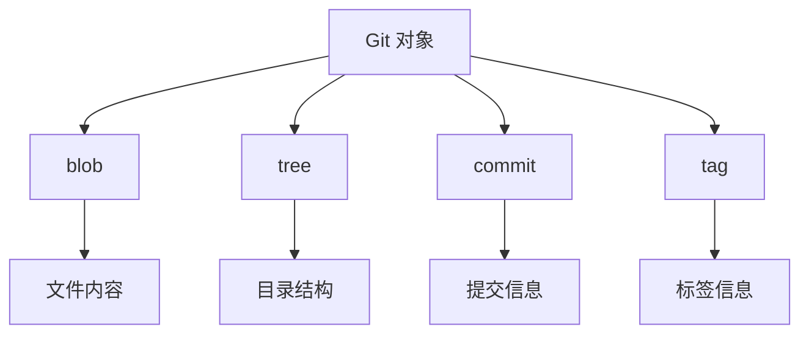
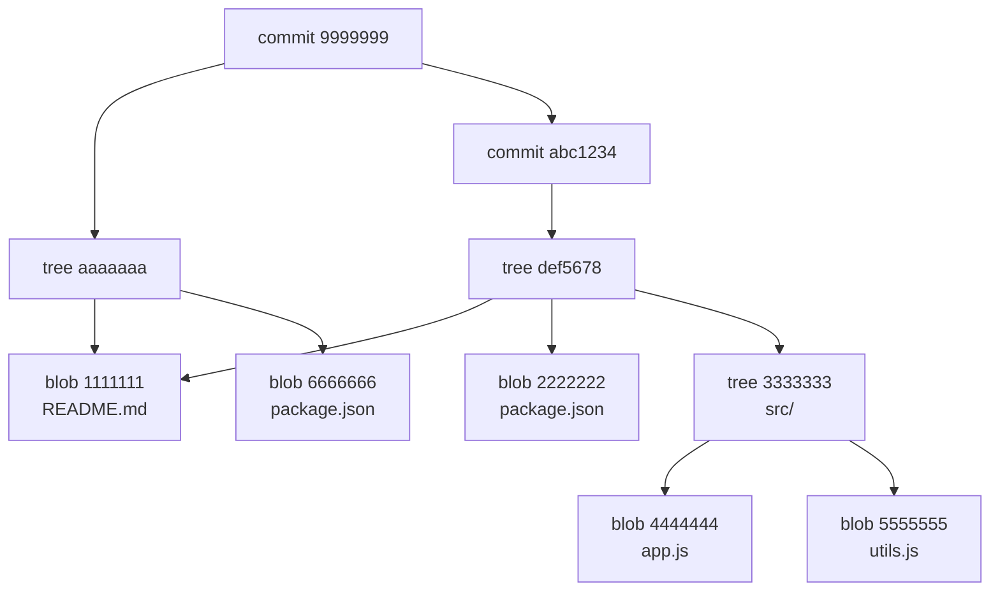
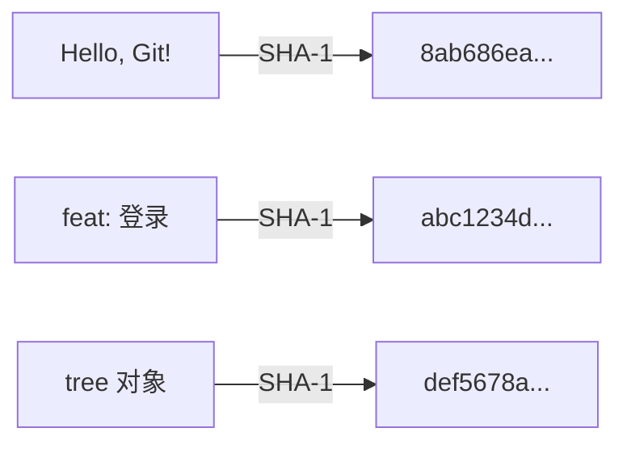
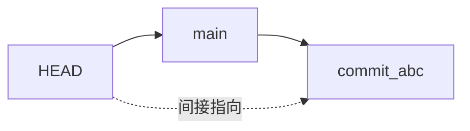
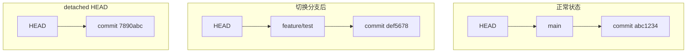
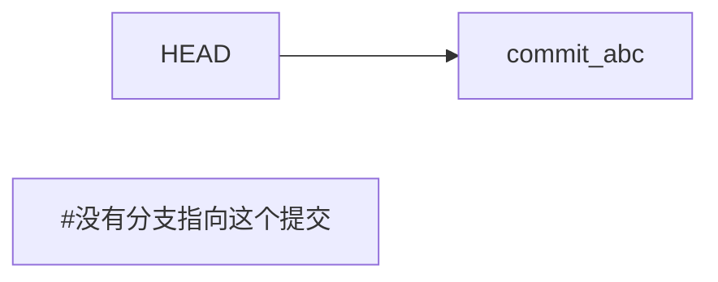
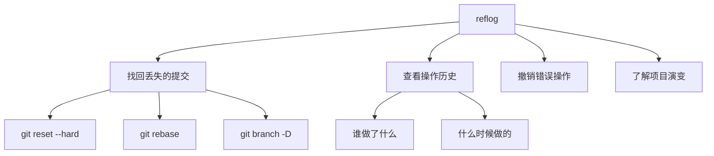
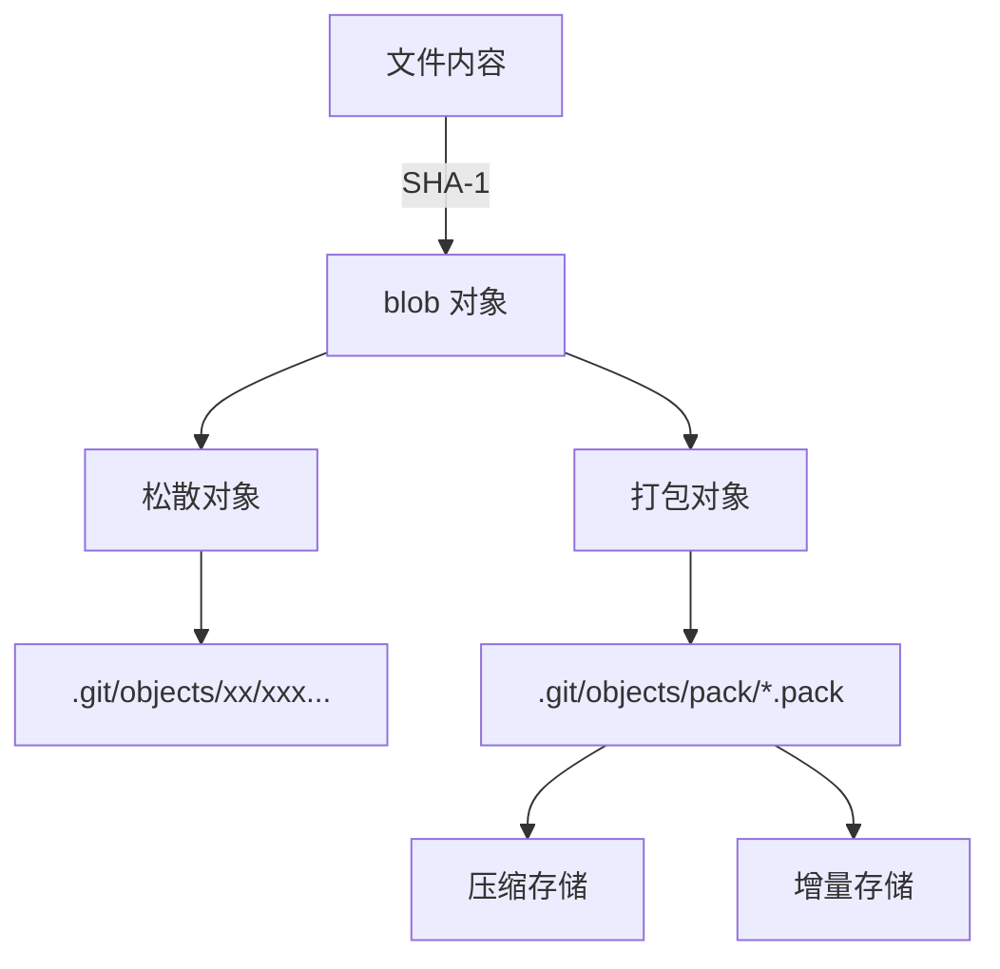
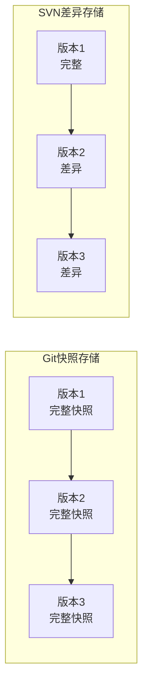

+++
title = "第21章：Git 内部原理 —— 了解黑盒子里有什么"
weight = 210
date = 2026-04-03T19:36:48+08:00
type = "docs"
description = ""
isCJKLanguage = true
draft = false
+++
# 第21章：Git 内部原理 —— 了解黑盒子里有什么

> 知其然，更要知其所以然。了解 Git 的内部原理，让你在使用 Git 时更加得心应手，遇到问题时也能从容应对。

---

## 21.1 .git 目录结构：Git 的大脑

每次执行 `git init`，Git 都会创建一个 `.git` 目录。这个目录就是 Git 的"大脑"，存储着所有的历史记录和配置。

### .git 目录结构

```
.git/
├── HEAD              # 当前分支的引用
├── config            # 项目配置
├── description       # 项目描述（供 GitWeb 使用）
├── index             # 暂存区
├── info/             # 额外信息
│   └── exclude       # 本地排除文件（类似 .gitignore）
├── hooks/            # 客户端或服务端钩子脚本
│   ├── applypatch-msg.sample
│   ├── commit-msg.sample
│   └── ...
├── objects/          # Git 对象数据库
│   ├── info/
│   └── pack/         # 压缩后的对象
├── refs/             # 引用（分支和标签）
│   ├── heads/        # 本地分支
│   ├── tags/         # 标签
│   └── remotes/      # 远程分支
└── logs/             # 引用日志（reflog）
    └── refs/
        ├── heads/
        └── remotes/
```

### 关键文件解析

#### HEAD 文件

```bash
# 查看 HEAD
cat .git/HEAD
# ref: refs/heads/main

# HEAD 指向当前分支
# 当切换分支时，HEAD 会更新
```

#### config 文件

```bash
# 查看配置
cat .git/config

[core]
    repositoryformatversion = 0
    filemode = true
    bare = false
    logallrefupdates = true
[remote "origin"]
    url = https://github.com/user/repo.git
    fetch = +refs/heads/*:refs/remotes/origin/*
[branch "main"]
    remote = origin
    merge = refs/heads/main
```

#### index 文件

```bash
# index 是暂存区的二进制表示
# 可以使用 git ls-files 查看
git ls-files --stage

# 输出：
# 100644 abc1234def5678901234567890abcdef12345678 0	README.md
# 100644 def5678abc1234567890abcdef1234567890abc 0	package.json
```

### refs 目录

```bash
# 本地分支
cat .git/refs/heads/main
# abc1234def5678901234567890abcdef12345678

# 标签
cat .git/refs/tags/v1.0.0
# def5678abc1234567890abcdef1234567890abc

# 远程分支
cat .git/refs/remotes/origin/main
# 7890abcdef1234567890abcdef1234567890abc
```

### objects 目录

```bash
# 查看对象目录结构
ls .git/objects/
# 00  0a  14  1e  28  32  3c  46  50  5a  64  6e  78  82  8c  96  a0  aa  b4  be  c8  d2  dc  e6  f0  fa
# info  pack

# 对象按 SHA-1 的前两位分目录存储
# abc1234... 存储在 .git/objects/ab/c1234...
```

### 探索 .git 目录

```bash
# 查看当前分支
cat .git/HEAD

# 查看 main 分支指向的提交
cat .git/refs/heads/main

# 查看该提交的内容
git cat-file -p $(cat .git/refs/heads/main)

# 查看暂存区
git ls-files --stage

# 查看所有分支
ls .git/refs/heads/

# 查看所有标签
ls .git/refs/tags/
```

### .git 目录大小

```bash
# 查看 .git 目录大小
du -sh .git

# 查看 objects 目录大小
du -sh .git/objects

# 垃圾回收
git gc

# 再次查看大小
du -sh .git
```

### 小贴士

```bash
# 查看 .git 目录的统计信息
git count-objects -vH

# 输出：
# count: 0
# size: 0 bytes
# in-pack: 1234
# packs: 1
# size-pack: 10.00 MiB
# prune-packable: 0
# garbage: 0
# size-garbage: 0 bytes
```

记住：**.git 目录是 Git 的"大脑"——了解它的结构，你就了解了 Git 的秘密！**

---

## 21.2 Git 对象：blob、tree、commit

Git 是一个内容寻址文件系统，核心就是三种对象：**blob**、**tree**、**commit**。

### Git 对象类型



### blob 对象：文件内容

**blob** 对象存储文件的内容，不包含文件名。

```bash
# 创建 blob 对象
echo "Hello, Git!" | git hash-object --stdin
# 8ab686eafeb1f44702738c8b0f24f2567c36da6d

# 写入 blob 对象
echo "Hello, Git!" | git hash-object --stdin -w

# 查看 blob 对象
git cat-file -p 8ab686eafeb1f44702738c8b0f24f2567c36da6d
# Hello, Git!

# 查看对象类型
git cat-file -t 8ab686eafeb1f44702738c8b0f24f2567c36da6d
# blob
```

**特点**：
- 只存储内容，不存储文件名
- 相同内容只存储一次
- 通过 SHA-1 哈希寻址

### tree 对象：目录结构

**tree** 对象存储目录结构和文件名，指向 blob 或其他 tree。

```bash
# 查看 tree 对象
git cat-file -p HEAD^{tree}

# 输出：
# 100644 blob 8ab686eafeb1f44702738c8b0f24f2567c36da6d    README.md
# 100644 blob 9f4e3d2c1b0a9f8e7d6c5b4a39281726354abcdef    package.json
# 040000 tree 1a2b3c4d5e6f7a8b9c0d1e2f3a4b5c6d7e8f9a0b    src
```

**tree 条目格式**：
```
<mode> <type> <sha> <filename>
```

| mode | 含义 |
|------|------|
| 100644 | 普通文件 |
| 100755 | 可执行文件 |
| 120000 | 符号链接 |
| 040000 | 目录（tree） |
| 160000 | 子模块 |

### commit 对象：提交信息

**commit** 对象存储提交信息，指向一个 tree 对象。

```bash
# 查看 commit 对象
git cat-file -p HEAD

# 输出：
# tree 1a2b3c4d5e6f7a8b9c0d1e2f3a4b5c6d7e8f9a0b
# parent abc1234def5678901234567890abcdef12345678
# author Your Name <email@example.com> 1704067200 +0800
# committer Your Name <email@example.com> 1704067200 +0800
#
# feat: 添加登录功能
```

**commit 对象包含**：
- tree：指向根目录的 tree 对象
- parent：父提交（可以有多个）
- author：作者信息
- committer：提交者信息
- 提交信息

### 对象关系图



### 创建对象的底层命令

```bash
# 1. 创建 blob 对象
echo "Hello, World!" > hello.txt
git hash-object -w hello.txt
# 557db03de997c86a4a028e1ebd3a1ceb225be238

# 2. 创建 tree 对象
git update-index --add --cacheinfo 100644 \
    557db03de997c86a4a028e1ebd3a1ceb225be238 hello.txt

git write-tree
# 8d7e5f3a2b1c0d9e8f7a6b5c4d3e2f1a0b9c8d7e

# 3. 创建 commit 对象
git commit-tree 8d7e5f3a2b1c0d9e8f7a6b5c4d3e2f1a0b9c8d7e \
    -m "Initial commit"
# 1a2b3c4d5e6f7a8b9c0d1e2f3a4b5c6d7e8f9a0b

# 4. 更新分支引用
echo "1a2b3c4d5e6f7a8b9c0d1e2f3a4b5c6d7e8f9a0b" > .git/refs/heads/main
```

### 查看对象统计

```bash
# 统计对象数量
git count-objects -v

# 列出所有对象
git rev-list --objects --all

# 查看对象大小
git rev-list --objects --all | \
    git cat-file --batch-check='%(objecttype) %(objectname) %(objectsize)' | \
    awk '{print $3, $2}' | sort -rn | head -20
```

### 小贴士

```bash
# 查看对象内容
git cat-file -p <sha>

# 查看对象类型
git cat-file -t <sha>

# 查看对象大小
git cat-file -s <sha>
```

记住：**Git 对象是 Git 的"积木"——blob 是内容，tree 是结构，commit 是历史！**

---

## 21.3 SHA-1：一切皆有唯一标识

Git 使用 **SHA-1** 哈希算法为每个对象生成唯一的标识符。这个 40 位的十六进制字符串，就是 Git 的"身份证号"。

### 什么是 SHA-1？

**SHA-1**（Secure Hash Algorithm 1）是一种密码学哈希函数，将任意长度的输入转换为 160 位（40 个十六进制字符）的输出。

```
输入："Hello, Git!"
输出：8ab686eafeb1f44702738c8b0f24f2567c36da6d
```

### SHA-1 的特点

```markdown
## SHA-1 特点

1. **唯一性**
   - 相同输入产生相同输出
   - 不同输入产生不同输出（概率极高）

2. **不可逆**
   - 无法从哈希值反推原始内容

3. **固定长度**
   - 无论输入多长，输出都是 40 字符

4. **敏感性**
   - 输入微小变化，输出完全不同
```

### Git 中的 SHA-1

```bash
# 查看提交的 SHA-1
git log --oneline
# abc1234 feat: 添加登录功能

# abc1234 是完整的 SHA-1 的前 7 位
# 完整 SHA-1: abc1234def5678901234567890abcdef12345678

# 使用完整 SHA-1
git show abc1234def5678901234567890abcdef12345678

# 使用短 SHA-1（至少 4 位，不冲突即可）
git show abc1234
```

### 计算 SHA-1

```bash
# 计算文件内容的 SHA-1
git hash-object hello.txt

# 计算字符串的 SHA-1
echo "Hello, Git!" | git hash-object --stdin

# 手动计算（Linux）
echo -n "Hello, Git!" | sha1sum
# 注意：Git 的 SHA-1 计算包含头部信息
```

### SHA-1 的冲突

```markdown
## SHA-1 冲突

### 理论上
- SHA-1 有 2^160 种可能
- 冲突概率极低

### 实际上
- 2017 年，Google 发现了 SHA-1 的碰撞
- Git 正在迁移到 SHA-256

### Git 的应对
- 检测冲突
- 使用 SHA-256（未来）
```

### 短 SHA-1

```bash
# Git 会自动识别短的 SHA-1
git show abc1234

# 需要多少位？
# 通常 7-8 位足够
# 大型项目可能需要更多

# 查看需要多少位才能唯一标识
git rev-parse --short HEAD
# abc1234

git rev-parse --short=4 HEAD
# abc1
```

### SHA-1 与分支、标签

```bash
# 分支就是指向 SHA-1 的引用
cat .git/refs/heads/main
# abc1234def5678901234567890abcdef12345678

# 标签也是指向 SHA-1 的引用
cat .git/refs/tags/v1.0.0
# def5678abc1234567890abcdef1234567890abc

# HEAD 也是引用
cat .git/HEAD
# ref: refs/heads/main
```

### 可视化 SHA-1



### 小贴士

```bash
# 查看对象的 SHA-1
git rev-parse HEAD

# 查看父提交的 SHA-1
git rev-parse HEAD^

# 查看第 N 个父提交
git rev-parse HEAD^2

# 查看祖先提交的 SHA-1
git rev-parse HEAD~3

# 查看引用的完整 SHA-1
git rev-parse main
```

记住：**SHA-1 是 Git 的"身份证号"——每个对象都有唯一的标识，永不混淆！**

---

## 21.4 HEAD 和分支：指针的指针

Git 中的分支非常简单——它只是一个指向提交的指针。而 HEAD 则是指向当前分支的指针。

### HEAD 是什么？

**HEAD** 是一个特殊的引用，指向当前所在的提交或分支。

```bash
# 查看 HEAD
cat .git/HEAD
# ref: refs/heads/main

# HEAD 指向 main 分支
# main 分支指向具体的提交
```



### 分支是什么？

**分支**就是一个指向提交的引用，存储在 `.git/refs/heads/` 目录中。

```bash
# 查看分支文件
cat .git/refs/heads/main
# abc1234def5678901234567890abcdef12345678

# 创建新分支
git branch feature/test

# 查看新分支
cat .git/refs/heads/feature/test
# abc1234def5678901234567890abcdef12345678
# 和 main 指向同一个提交
```

### HEAD 和分支的关系



### 切换分支时发生了什么？

```bash
# 当前在 main 分支
git branch
# * main
#   feature/test

cat .git/HEAD
# ref: refs/heads/main

# 切换到 feature/test
git checkout feature/test

cat .git/HEAD
# ref: refs/heads/feature/test
# HEAD 更新了！
```

### detached HEAD 状态

```bash
# 直接检出某个提交
git checkout abc1234

# 查看 HEAD
cat .git/HEAD
# abc1234def5678901234567890abcdef12345678
# HEAD 直接指向提交，而不是分支！

# 这就是 detached HEAD 状态
```



### 分支的创建和删除

```bash
# 创建分支（只是创建一个引用）
git branch feature/new
# 创建 .git/refs/heads/feature/new

# 删除分支（只是删除引用）
git branch -d feature/new
# 删除 .git/refs/heads/feature/new

# 提交还在！
# 只要知道 SHA-1，就能找回
```

### 分支的本质

```bash
# 分支就是文件！
ls .git/refs/heads/
# main
# feature/test
# feature/login

# 每个文件内容就是一个 SHA-1
cat .git/refs/heads/main
# abc1234def5678901234567890abcdef12345678

# 修改分支指向
echo "def5678abc1234567890abcdef1234567890abc" > .git/refs/heads/main
# 现在 main 指向另一个提交了！
# 这就是 reset 的本质
```

### HEAD 的多种形态

```bash
# 1. 指向分支（正常状态）
cat .git/HEAD
# ref: refs/heads/main

# 2. 指向提交（detached HEAD）
cat .git/HEAD
# abc1234def5678901234567890abcdef12345678

# 3. 指向标签
git checkout v1.0.0
cat .git/HEAD
# abc1234def5678901234567890abcdef12345678
# detached HEAD

# 4. 指向远程分支
git checkout origin/main
cat .git/HEAD
# abc1234def5678901234567890abcdef12345678
# detached HEAD
```

### 符号引用

```bash
# HEAD 的多种表示

HEAD          # 当前提交
HEAD^         # 父提交
HEAD~1        # 第 1 个祖先
HEAD~3        # 第 3 个祖先
HEAD^2        # 第 2 个父提交（合并提交）

main          # main 分支的提交
main^         # main 的父提交
main~3        # main 的第 3 个祖先

@             # HEAD 的简写
@^            # HEAD 的父提交
@{yesterday}  # 昨天的 HEAD
```

### 小贴士

```bash
# 查看 HEAD 的历史
git reflog HEAD

# 查看分支的历史
git reflog main

# 查看 HEAD 指向的提交
git rev-parse HEAD

# 查看分支指向的提交
git rev-parse main
```

记住：**HEAD 是指针的指针——指向分支，分支指向提交，层层递进！**

---

## 21.5 引用和 reflog：Git 的备忘录

Git 的 **reflog** 就像是"时光机"，记录了 HEAD 和分支的所有变动历史。即使操作失误，也能从 reflog 中找回丢失的提交。

### 什么是 reflog？

**reflog**（reference log）是 Git 的引用日志，记录了引用（HEAD、分支等）的每次变动。

```bash
# 查看 HEAD 的 reflog
git reflog

# 输出：
# abc1234 HEAD@{0}: commit: feat: 添加登录
# def5678 HEAD@{1}: commit: fix: 修复 bug
# 7890abc HEAD@{2}: checkout: moving from main to feature/test
```

### reflog 的内容

```bash
git reflog

# 格式：
# <commit-sha> HEAD@{<n>}: <action>: <description>

# abc1234 HEAD@{0}: commit: feat: 添加登录
#   ↑        ↑        ↑          ↑
#   |        |        |          └── 描述
#   |        |        └── 动作（commit、checkout、merge等）
#   |        └── reflog 索引
#   └── 提交 SHA-1
```

### reflog 的用途



### 找回丢失的提交

```bash
# 场景：不小心 reset --hard 了

# 1. 查看 reflog
git reflog
# abc1234 HEAD@{0}: reset: moving to HEAD~3
# def5678 HEAD@{1}: commit: feat: 重要功能
# 7890abc HEAD@{2}: commit: feat: 另一个功能

# 2. 找到 reset 前的提交
git reset --hard HEAD@{1}
# 或者
git reset --hard def5678

# 3. 恢复成功！
```

### reflog 的时间表示

```bash
# 使用相对时间
git reflog HEAD@{10.minutes.ago}
git reflog HEAD@{1.day.ago}
git reflog HEAD@{yesterday}
git reflog HEAD@{2.days.ago}
git reflog HEAD@{1.week.ago}

# 使用绝对时间
git reflog HEAD@{2024-01-01}
```

### 查看特定引用的 reflog

```bash
# HEAD 的 reflog
git reflog HEAD

# main 分支的 reflog
git reflog main

# 远程分支的 reflog
git reflog origin/main
```

### reflog 的存储

```bash
# reflog 存储在 .git/logs/refs/
ls .git/logs/refs/heads/
# main
# feature/test

# 查看 reflog 文件
cat .git/logs/refs/heads/main
```

### reflog 的过期

```bash
# reflog 默认保留 90 天
git reflog expire --expire=90.days.ago --all

# 清理过期 reflog
git gc --prune=now
```

### 引用（refs）

```bash
# 列出所有引用
git show-ref

# 列出分支引用
git show-ref --heads

# 列出标签引用
git show-ref --tags

# 查看引用指向的提交
git rev-parse main
git rev-parse v1.0.0
```

### 引用的类型

```bash
# 本地分支
refs/heads/main
refs/heads/feature/test

# 远程分支
refs/remotes/origin/main
refs/remotes/origin/develop

# 标签
refs/tags/v1.0.0
refs/tags/v2.0.0

# HEAD
HEAD

# 存储在 stash
refs/stash
```

### 创建自定义引用

```bash
# 创建自定义引用
git update-ref refs/notes/my-notes abc1234

# 查看
git show-ref | grep my-notes

# 删除
git update-ref -d refs/notes/my-notes
```

### reflog vs log

```bash
# git log：提交历史
git log --oneline

# git reflog：引用变动历史
git reflog

# reflog 包含 log 不包含的信息
# - 分支切换
# - reset 操作
# - rebase 操作
# - 已删除分支的提交
```

### 小贴士

```bash
# 使用 reflog 恢复分支
git reflog | grep feature/deleted-branch
# abc1234 HEAD@{5}: commit: feat: 功能
# def5678 HEAD@{6}: checkout: moving from main to feature/deleted-branch

git checkout -b feature/deleted-branch abc1234

# 使用 reflog 撤销 rebase
git reflog
# abc1234 HEAD@{0}: rebase -i (finish): ...
# def5678 HEAD@{1}: rebase -i (start): ...
# 7890abc HEAD@{2}: checkout: ...

git reset --hard HEAD@{2}
```

记住：**reflog 是 Git 的"时光机"——操作失误不用怕，reflog 帮你找回！**

---

## 21.6 打包和压缩：Git 如何节省空间

Git 仓库随着时间增长会变得很大。Git 使用 **打包（packing）** 和 **压缩（compression）** 技术来节省空间。

### Git 的存储机制



### 松散对象（Loose Objects）

```bash
# 新创建的对象是松散的
ls .git/objects/
# 00  0a  14  1e  ...

# 每个对象一个文件
ls .git/objects/ab/
# c1234def5678901234567890abcdef1234567890
```

**问题**：
- 占用磁盘空间多
- 访问速度慢
- 传输效率低

### 打包对象（Packed Objects）

```bash
# 执行垃圾回收
git gc

# 查看打包后的结构
ls .git/objects/
# info  pack

ls .git/objects/pack/
# pack-xxx.pack
# pack-xxx.idx
```

### 打包的工作原理

```bash
# 1. 收集松散对象
git repack

# 2. 压缩相似内容
# 使用 zlib 压缩

# 3. 增量存储（delta compression）
# 只存储差异
```

### 增量存储示例

```
文件 A（版本 1）：Hello, World!
文件 A（版本 2）：Hello, Git!

松散存储：
- blob 1: "Hello, World!" (13 bytes)
- blob 2: "Hello, Git!" (11 bytes)
- 总计: 24 bytes

打包存储：
- blob 1: "Hello, World!" (压缩后 ~10 bytes)
- blob 2: delta("Hello, " + "Git!") (~5 bytes)
- 总计: ~15 bytes
```

### git gc 命令

```bash
# 垃圾回收（完整）
git gc

# 快速垃圾回收
git gc --auto

# 激进模式
git gc --aggressive

# 查看统计
git gc --verbose
```

### 打包相关命令

```bash
# 创建包
git repack

# 创建增量包
git repack -d -l

# 验证包
git verify-pack -v .git/objects/pack/*.pack

# 查看包内容
git verify-pack .git/objects/pack/*.pack

# 从包中提取对象
git unpack-objects < .git/objects/pack/*.pack
```

### 查看仓库大小

```bash
# 查看仓库统计
git count-objects -vH

# 输出：
# count: 0          # 松散对象数量
# size: 0 bytes     # 松散对象大小
# in-pack: 1234     # 打包对象数量
# packs: 1          # 包文件数量
# size-pack: 10.00 MiB  # 包文件大小
# prune-packable: 0
# garbage: 0
# size-garbage: 0 bytes
```

### 清理仓库

```bash
# 清理未引用的对象
git prune

# 清理并打包
git gc

# 清理远程分支引用
git remote prune origin

# 清理 reflog
git reflog expire --expire=90.days.ago --all
```

### 大文件处理

```bash
# 找出大文件
git rev-list --objects --all | \
    git cat-file --batch-check='%(objecttype) %(objectname) %(objectsize)' | \
    awk '/^blob/ {print $3, $2}' | \
    sort -rn | head -20

# 使用 Git LFS 管理大文件
git lfs track "*.psd"
git lfs track "*.zip"
```

### 压缩率对比

```bash
# 打包前
du -sh .git
# 100M

# 打包后
git gc
du -sh .git
# 50M

# 节省 50% 空间！
```

### 传输压缩

```bash
# 推送时压缩
git push --verbose

# 拉取时压缩
git fetch --verbose

# 配置压缩级别
git config --global core.compression 9
# 0-9，9 是最高压缩
```

### 小贴士

```bash
# 定期执行 gc
git gc --auto

# 在 .gitconfig 中配置自动 gc
[gc]
    auto = 1
    autoDetach = false
```

记住：**打包和压缩是 Git 的"瘦身秘诀"——让仓库保持苗条，传输快速！**

---

## 21.7 底层命令：`git cat-file`、`git hash-object`

Git 提供了一系列底层命令（plumbing commands），让你可以直接操作 Git 对象。这些命令是理解 Git 原理的关键。

### git cat-file：查看对象内容

```bash
# 查看对象类型
git cat-file -t <sha>
# blob / tree / commit / tag

# 查看对象内容
git cat-file -p <sha>

# 查看对象大小
git cat-file -s <sha>
```

#### 示例

```bash
# 查看 HEAD 提交
git cat-file -t HEAD
# commit

git cat-file -p HEAD
# tree abc1234...
# parent def5678...
# author ...
# committer ...
#
# feat: 添加登录功能

# 查看 tree 对象
git cat-file -p HEAD^{tree}
# 100644 blob 1111111... README.md
# 100644 blob 2222222... package.json
# 040000 tree 3333333... src

# 查看 blob 对象
git cat-file -p abc1234
# Hello, Git!
```

### git hash-object：计算哈希并创建对象

```bash
# 计算内容的 SHA-1
echo "Hello" | git hash-object --stdin
# f2e2c5d5e8f8a6b4c3d2e1f0a9b8c7d6e5f4a3b2

# 创建 blob 对象
echo "Hello" | git hash-object --stdin -w
# 对象被写入 .git/objects/

# 从文件创建对象
git hash-object -w hello.txt
```

### git mktree：创建 tree 对象

```bash
# 创建 tree 对象
git mktree << 'EOF'
100644 blob abc1234... hello.txt
100644 blob def5678... world.txt
040000 tree 9999999... src
EOF
# 输出新 tree 对象的 SHA-1
```

### git commit-tree：创建 commit 对象

```bash
# 创建 commit 对象
git commit-tree <tree-sha> -m "Initial commit"
# 输出新 commit 对象的 SHA-1

# 指定父提交
git commit-tree <tree-sha> -p <parent-sha> -m "Second commit"
```

### git update-index：更新暂存区

```bash
# 添加文件到暂存区（底层）
git update-index --add hello.txt

# 添加 blob 到暂存区（指定 SHA）
git update-index --add --cacheinfo 100644 abc1234... hello.txt

# 查看暂存区
git ls-files --stage
```

### git write-tree：从暂存区创建 tree

```bash
# 从暂存区创建 tree 对象
git write-tree
# 输出 tree 对象的 SHA-1
```

### git read-tree：读取 tree 到暂存区

```bash
# 读取 tree 到暂存区
git read-tree <tree-sha>

# 合并 tree
git read-tree -m <tree1-sha> <tree2-sha> <tree3-sha>
```

### git update-ref：更新引用

```bash
# 更新分支引用
git update-ref refs/heads/main <commit-sha>

# 更新 HEAD
git update-ref HEAD <commit-sha>

# 安全更新（检查旧值）
git update-ref refs/heads/main <new-sha> <old-sha>

# 删除引用
git update-ref -d refs/heads/feature/test
```

### git symbolic-ref：更新符号引用

```bash
# 更新 HEAD 指向分支
git symbolic-ref HEAD refs/heads/main

# 查看 HEAD 指向
git symbolic-ref HEAD
# refs/heads/main
```

### git for-each-ref：遍历引用

```bash
# 列出所有引用
git for-each-ref

# 列出分支
git for-each-ref refs/heads/

# 格式化输出
git for-each-ref --format='%(refname:short) %(objectname:short)' refs/heads/
```

### 完整示例：手动创建提交

```bash
# 1. 创建 blob 对象
echo "Hello, Git!" > hello.txt
git hash-object -w hello.txt
# 557db03de997c86a4a028e1ebd3a1ceb225be238

# 2. 添加到暂存区
git update-index --add --cacheinfo 100644 \
    557db03de997c86a4a028e1ebd3a1ceb225be238 hello.txt

# 3. 创建 tree 对象
git write-tree
# 8d7e5f3a2b1c0d9e8f7a6b5c4d3e2f1a0b9c8d7e

# 4. 创建 commit 对象
git commit-tree 8d7e5f3a2b1c0d9e8f7a6b5c4d3e2f1a0b9c8d7e \
    -m "Initial commit"
# 1a2b3c4d5e6f7a8b9c0d1e2f3a4b5c6d7e8f9a0b

# 5. 更新分支引用
git update-ref refs/heads/main 1a2b3c4d5e6f7a8b9c0d1e2f3a4b5c6d7e8f9a0b

# 完成！
```

### 底层命令 vs 高层命令

| 底层命令 | 高层命令 | 用途 |
|----------|----------|------|
| git hash-object | git add | 创建 blob |
| git update-index | git add | 更新暂存区 |
| git write-tree | git commit | 创建 tree |
| git commit-tree | git commit | 创建 commit |
| git update-ref | git branch | 更新引用 |

### 小贴士

```bash
# 查看底层命令帮助
git hash-object --help
git cat-file --help

# 底层命令通常以 -w（write）选项写入对象
# 否则只计算哈希不写入
```

记住：**底层命令是 Git 的"手术刀"——精确操作每一个对象，理解 Git 的本质！**

---

## 21.8 Git 的存储机制：为什么 Git 如此高效

Git 为什么比其他版本控制系统更快、更高效？秘密就在于它的存储机制。

### 快照 vs 差异



**Git**：存储每个版本的完整快照
**SVN**：存储每个版本与上一版本的差异

### Git 的高效之处

```markdown
## 1. 内容寻址

- 通过 SHA-1 哈希快速定位对象
- 相同内容只存储一次
- 天然去重

## 2. 快照存储

- 每个版本都是完整快照
- 切换版本极快（只需改变指针）
- 分支操作极快（只需创建引用）

## 3. 本地操作

- 几乎所有操作都在本地
- 不需要网络
- 速度快

## 4. 压缩优化

- 松散对象定期打包
- 增量压缩相似内容
- 节省空间

## 5. 数据结构

- 不可变对象
- 有向无环图（DAG）
- 高效遍历
```

### 分支操作为什么快？

```bash
# 创建分支
git branch feature/test

# 发生了什么？
# 1. 创建文件 .git/refs/heads/feature/test
# 2. 写入当前提交的 SHA-1
# 3. 完成！

# 时间复杂度：O(1)
# 与项目大小无关！
```

### 提交操作为什么快？

```bash
# 创建提交
git commit -m "message"

# 发生了什么？
# 1. 创建 tree 对象（如果有变化）
# 2. 创建 commit 对象
# 3. 更新分支引用
# 4. 完成！

# 时间复杂度：O(变化文件数)
# 与项目总大小无关！
```

### 切换分支为什么快？

```bash
# 切换分支
git checkout feature/test

# 发生了什么？
# 1. 更新 HEAD 指向 feature/test
# 2. 根据 tree 对象更新工作目录
# 3. 完成！

# 时间复杂度：O(变化文件数)
# 不需要网络，不需要计算差异！
```

### 存储效率对比

```markdown
## 场景：100MB 项目，100 个版本

### Git
- 初始：100MB
- 100 个版本：~150MB（压缩后）
- 原因：只存储变化的内容

### SVN
- 初始：100MB
- 100 个版本：~200MB（累积差异）
- 原因：每个版本都存储差异

### 结论
- Git 更节省空间
- Git 切换版本更快
```

### Git 的性能优化

```bash
# 1. 索引（Index）
# 暂存区记录文件状态
# 快速判断文件是否变化

# 2. 打包（Pack）
# 相似内容压缩存储
# 节省磁盘空间

# 3. 缓存（Cache）
# 对象缓存
# 加速访问

# 4. 延迟加载
# 按需加载对象
# 减少内存占用
```

### Git 的局限性

```markdown
## Git 不适合的场景

1. **大文件**
   - 视频、二进制文件
   - 每次修改都存储完整副本
   - 解决方案：Git LFS

2. **大量小文件**
   - 几万个小文件
   - 文件系统压力大
   - 解决方案：打包工具

3. **权限控制**
   - Git 没有细粒度权限
   - 只能控制整个仓库
   - 解决方案：Git 服务器（GitLab、Gitea）
```

### 优化 Git 性能

```bash
# 1. 定期 gc
git gc --auto

# 2. 配置缓存
git config --global core.preloadindex true
git config --global core.fscache true

# 3. 使用并行操作
git config --global pack.threads 4

# 4. 限制日志输出
git log --oneline -20

# 5. 使用浅克隆（如果不需要完整历史）
git clone --depth 1 <url>
```

### 小贴士

```bash
# 查看 Git 性能统计
git config --global trace2.eventTarget /path/to/log

# 或者使用 GIT_TRACE
git GIT_TRACE=1 status
```

记住：**Git 的高效来自巧妙的设计——快照存储、内容寻址、本地操作，三者合一！**

---

## 21.9 本章小结：懂原理，才能解决问题

这一章，我们深入了解了 Git 的内部原理：

| 主题 | 核心概念 |
|------|----------|
| .git 目录 | Git 的"大脑" |
| Git 对象 | blob、tree、commit |
| SHA-1 | 唯一标识 |
| HEAD 和分支 | 指针的指针 |
| reflog | 时光机 |
| 打包压缩 | 节省空间 |
| 底层命令 | 精确操作 |
| 存储机制 | 快照 vs 差异 |

### 核心要点

1. **Git 是内容寻址文件系统**：通过 SHA-1 定位一切
2. **快照存储**：每个版本都是完整快照
3. **本地优先**：几乎所有操作都在本地
4. **不可变对象**：历史不可修改，只能追加

**懂原理，才能解决问题；知根底，才能运用自如！**

---

**第21章完**

