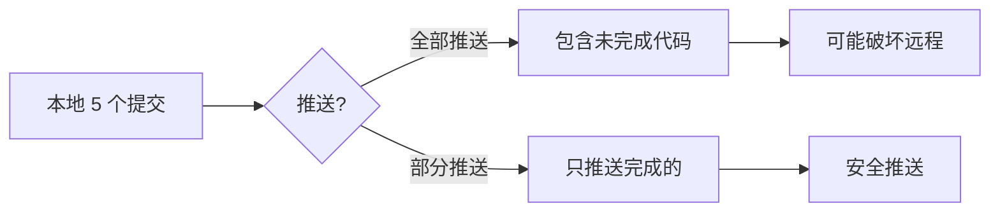
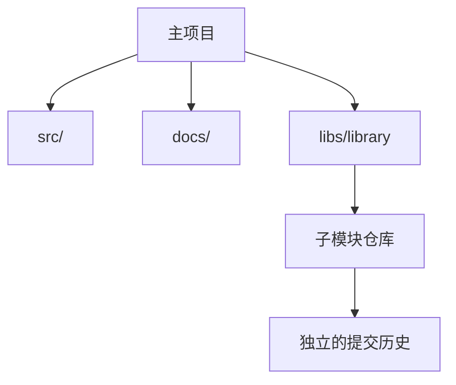
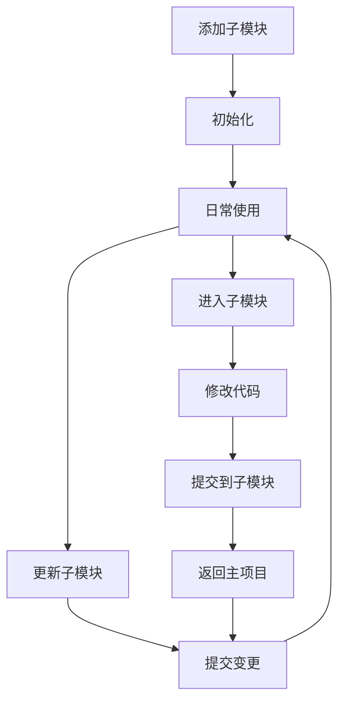

+++
title = "第22章：常见场景实战 —— 解决真实世界的问题"
weight = 220
date = 2026-04-03T19:36:48+08:00
type = "docs"
description = ""
isCJKLanguage = true
draft = false
+++
# 第22章：常见场景实战 —— 解决真实世界的问题

> 理论学了一堆，实战才是检验真理的唯一标准。这一章，我们用12个真实场景，带你从"会 Git"进化到"精通 Git"！

想象一下：你自信满满地部署了新功能，结果半夜三点被老板电话叫醒——"系统崩了！快回滚！"这时候，Git 就是你的救命稻草。

---

## 22.1 场景一：代码回滚到某个版本

**场景**：新功能上线后发现严重 bug，需要紧急回滚到上一个稳定版本。

**你的心情**：😱 → 😰 → 😅 → 😌

### 发生了什么？


### 解决方案

#### 方法1：使用 git revert（推荐，保留历史）

**revert** 就像是"撤销键"，但它不是删除历史，而是创建一个新的提交来"抵消"之前的修改。

```bash
# 查看提交历史，找到要回滚的提交
# 这就像在查看"犯罪记录"
git log --oneline -10
# abc1234 feat: 新功能（有 bug）
# def5678 fix: 修复问题
# 7890abc feat: 稳定版本

# revert 有问题的提交
# 这不会删除 abc1234，而是创建一个新提交来撤销它
git revert abc1234

# 编辑器会弹出，让你编辑 revert 的提交信息
# 默认是 "Revert 'feat: 新功能（有 bug）'"
# 保存退出

# 推送回滚到远程
# 现在所有人都能看到："我们回滚了，因为出 bug 了"
git push origin main
```

**revert 的好处**：
- ✅ 保留完整历史（老板问起来，你能说"看，我们及时回滚了"）
- ✅ 安全，不会丢失代码
- ✅ 团队协作友好

#### 方法2：使用 git reset（丢弃历史，谨慎使用）

**reset** 就像是"时光机"，直接回到过去，但会"抹掉"中间的历史。

```bash
# 重置到稳定版本
# --hard 表示：工作区、暂存区都给我变回那个版本！
git reset --hard 7890abc

# 强制推送（如果已推送到远程）
# --force-with-lease 是安全版的强制推送
# 它会检查远程有没有新提交，防止覆盖别人的工作
git push origin main --force-with-lease

# ⚠️ 警告：这会丢失 abc1234 和 def5678 的提交！
# 就像时光倒流，中间的"记忆"都消失了
```

**reset 的风险**：
- ❌ 丢失历史（如果别人基于这些提交工作，会出问题）
- ❌ 需要 force push
- ❌ 团队协作不友好

### 对比表

| 方法 | 优点 | 缺点 | 适用场景 | 推荐指数 |
|------|------|------|----------|----------|
| **revert** | 保留历史，安全，团队协作友好 | 产生新提交，历史看起来有点乱 | 已推送到远程，团队协作 | ⭐⭐⭐⭐⭐ |
| **reset** | 彻底回滚，历史干净 | 丢失历史，需要 force push | 本地开发，还没推送 | ⭐⭐⭐ |

### 实战流程

```bash
# 紧急回滚标准流程

# 1. 冷静，先查看历史
git log --oneline -10

# 2. 确定要回滚到哪个版本
# 通常是 "最后一个稳定版本"

# 3. 使用 revert（推荐）
git revert abc1234

# 4. 如果有多个提交要回滚
git revert abc1234 def5678

# 5. 推送
git push origin main

# 6. 通知团队
# "已回滚到稳定版本，请拉取最新代码"
```

### 小贴士

```bash
# revert 多个提交（按顺序）
git revert abc1234 def5678

# revert 合并提交（需要指定父提交）
# -m 1 表示使用第一个父提交作为主线
git revert -m 1 abc1234

# 查看 revert 后的历史
# 你会看到：
# xyz9999 Revert "feat: 新功能（有 bug）"
# abc1234 feat: 新功能（有 bug）
# def5678 fix: 修复问题
```

### 幽默一刻

> 老板："为什么回滚了？"
> 
> 你："因为...因为 Git 说这样可以保护世界和平。"
> 
> 老板："...下次测试充分点。"
> 
> Git："我救了你的命，记得请我喝咖啡。"

记住：**revert 是"优雅撤退"，reset 是"时光倒流"——生产环境用 revert，安全第一！**


---

## 22.2 场景二：找回误删的文件

**场景**：手滑执行了 `git rm important.js`，文件不见了！

**你的心情**：😱 → 🤔 → 😅 → 🎉

### 发生了什么？


### 解决方案

#### 情况1：还没提交（最简单）

如果你只是 `git rm` 了，但还没 `git commit`，恭喜你，恢复超级简单！

```bash
# 查看状态，确认文件被删除
git status
# Changes to be committed:
#   deleted:    important.js

# 方法1：使用 checkout 恢复（老版本 Git）
git checkout -- important.js
# 这就像对 Git 说："刚才的删除不算数！"

# 方法2：使用 restore 恢复（Git 2.23+，推荐）
git restore important.js
# 这就像对 Git 说："给我还原！"

# 方法3：使用 reset 恢复
git reset HEAD important.js
git checkout -- important.js

# 文件回来了！
ls important.js
# important.js
```

#### 情况2：已经提交删除（需要时光机）

如果你已经 `git commit` 了删除操作，那就需要用 Git 的"时光机"了。

```bash
# 第一步：找到删除文件的提交
# 这就像在查"案发现场"
git log --diff-filter=D --summary
# commit abc1234
# Author: Your Name <you@example.com>
# Date:   Mon Jan 1 00:00:00 2024 +0800
#
#     refactor: 清理代码
#
#  delete mode 100644 important.js
#  delete mode 100644 another-file.js

# 找到了！文件是在 abc1234 这个提交中被删除的

# 第二步：恢复到删除前的版本
# abc1234^ 表示 abc1234 的父提交（也就是删除前的状态）
git checkout abc1234^ -- important.js

# 文件回来了！
ls important.js
# important.js

# 第三步：提交恢复
git add important.js
git commit -m "restore: 恢复误删的 important.js

手滑删除了文件，现在恢复。
以后删除前一定三思！"

# 推送
git push origin main
```

### 进阶技巧

#### 批量恢复多个文件

```bash
# 如果删除了多个文件，可以批量恢复

# 查看所有被删除的文件
git log --diff-filter=D --summary | grep "delete mode"

# 恢复多个文件
git checkout abc1234^ -- important.js another-file.js config.js

# 或者恢复整个目录
git checkout abc1234^ -- src/utils/
```

#### 从历史版本恢复（文件没被删除，只是想要旧版本）

```bash
# 查看文件的历史
git log --oneline -- important.js
# def5678 feat: 更新功能
# 9ab9012 feat: 添加功能
# 0123456 feat: 初始化

# 恢复到特定版本
git checkout 9ab9012 -- important.js

# 现在文件是 9ab9012 版本的内容
# 可以提交，也可以继续修改
```

### 小贴士

```bash
# 查看删除的文件列表（带提交信息）
git log --diff-filter=D --summary --name-only

# 查看某个文件的完整历史（包括删除）
git log --follow -- important.js

# 从特定提交恢复文件
git checkout <commit-sha> -- <file>

# 恢复文件并重命名
git show abc1234^:important.js > important-backup.js

# 查看删除文件的内容（不恢复）
git show abc1234^:important.js
```

### 预防措施

```bash
# 配置别名，防止手滑

# 安全删除（先备份）
git config --global alias.safe-rm '!sh -c "git mv $1 $1.backup-$(date +%Y%m%d)"'

# 使用
git safe-rm important.js
# 文件被重命名为 important.js.backup-20240101
```

### 幽默一刻

> 你："完了完了，我把重要文件删了！"
> 
> Git："淡定，我帮你存着呢。"
> 
> 你："真的吗？在哪？"
> 
> Git："在历史里，去找吧。"
> 
> 你："找到了！你是我的救命恩人！"
> 
> Git："下次手滑前，先想清楚。还有，记得 star 我。"

记住：**Git 是你的"时光机"——文件删了不用怕，历史里永远有备份！**


---

## 22.3 场景三：合并多个提交为一个

**场景**：开发过程中提交了 10 个 "fix"、"fix again"、"fix fix"，想合并成一个干净的提交。

**你的提交历史**：
```
abc1234 fix: fix fix
def5678 fix: fix again
9ab9012 fix: fix
0123456 feat: 实现功能
7890abc feat: 初始化
```

**你的心情**：😅 → 🤦 → 💪 → ✨

> "这提交历史太乱了，reviewer 会杀了我的..."

### 发生了什么？


### 解决方案

#### 方法1：使用 git rebase -i（交互式 rebase）

这是最灵活的方法，可以精确控制每个提交。

```bash
# 第一步：查看最近 5 个提交
git log --oneline -5
# abc1234 fix: fix fix
# def5678 fix: fix again
# 9ab9012 fix: fix
# 0123456 feat: 实现功能
# 7890abc feat: 初始化

# 第二步：启动交互式 rebase
# 我们要合并最近的 3 个 fix 提交到 feat 提交
git rebase -i HEAD~4

# 这会打开编辑器，显示：
# pick 0123456 feat: 实现功能
# pick 9ab9012 fix: fix
# pick def5678 fix: fix again
# pick abc1234 fix: fix fix

# 第三步：修改命令
# 把要合并的提交的 "pick" 改成 "squash" 或 "fixup"
# pick: 保留提交
# squash: 合并提交，保留提交信息
# fixup: 合并提交，丢弃提交信息

# 修改后：
pick 0123456 feat: 实现功能
fixup 9ab9012 fix: fix
fixup def5678 fix: fix again
fixup abc1234 fix: fix fix

# 保存退出

# 第四步：编辑合并后的提交信息
# 会弹出编辑器，让你编辑最终的提交信息
# 默认包含所有被合并的提交信息
# 你可以整理成：
# feat: 实现功能
#
# - 实现核心功能
# - 修复边界情况
# - 优化性能

# 保存退出

# 完成！
git log --oneline -3
# xyz9999 feat: 实现功能
# 7890abc feat: 初始化
```

#### 方法2：使用 git reset + git commit（快速方法）

如果你确定要合并最近的几个提交，这个方法更快。

```bash
# 查看最近 5 个提交
git log --oneline -5
# abc1234 fix: fix fix
# def5678 fix: fix again
# 9ab9012 fix: fix
# 0123456 feat: 实现功能
# 7890abc feat: 初始化

# 重置到 feat 提交，但保留修改
# --soft 表示：保留暂存区和工作区的修改
git reset --soft HEAD~3

# 现在所有修改都在暂存区了
git status
# Changes to be committed:
#   modified:   src/feature.js
#   modified:   src/utils.js

# 重新提交
git commit -m "feat: 实现功能

- 实现核心功能
- 修复边界情况
- 优化性能

Closes #123"

# 完成！
git log --oneline -3
# xyz9999 feat: 实现功能
# 0123456 feat: 初始化
```

### 对比

| 方法 | 优点 | 缺点 | 适用场景 |
|------|------|------|----------|
| **rebase -i** | 灵活，可以精确控制 | 需要编辑 | 复杂的合并需求 |
| **reset --soft** | 快速，简单 | 不够灵活 | 简单的合并需求 |

### 实战流程

```bash
# 标准流程：使用 rebase -i

# 1. 查看历史
git log --oneline -10

# 2. 确定要合并的提交范围
# 比如要合并最近的 5 个提交
git rebase -i HEAD~5

# 3. 在编辑器中修改命令
# pick 最早的提交
# squash/fixup 其他提交

# 4. 编辑合并后的提交信息

# 5. 完成！

# 6. 如果需要推送到远程（已经推送过的情况）
git push origin feature/xxx --force-with-lease
```

### 小贴士

```bash
# squash vs fixup 的区别

# squash: 合并提交，保留提交信息（可以编辑）
# fixup: 合并提交，丢弃提交信息

# 示例：
pick abc1234 feat: 实现功能
squash def5678 fix: 修复 bug  # 保留这个提交信息
fixup 9ab9012 fix: typo        # 丢弃这个提交信息

# 最终结果只包含 abc1234 和 def5678 的提交信息
```

### 预防措施

```bash
# 养成好习惯，避免频繁 fix

# 1. 提交前检查
git diff --cached

# 2. 使用 amend 修改最后一次提交
git commit --amend

# 3. 配置别名，快速 amend
git config --global alias.amend 'commit --amend --no-edit'

# 使用
git add .
git amend
```

### 幽默一刻

> Reviewer："为什么你的提交历史有 20 个 'fix'？"
> 
> 你："因为...因为我在练习打字？"
> 
> Reviewer："...下次用 rebase -i 整理一下。"
> 
> Git："我可以帮你隐藏黑历史，但记得 force push 时要小心。"

记住：**rebase -i 是"历史整容师"——让你的提交历史从"车祸现场"变成"精选集"！**


# 交互式 rebase
git rebase -i HEAD~3

# 在编辑器中修改：
pick 0123456 feat: 实现功能
squash 9ab9012 fix: fix
squash def5678 fix: fix again
squash abc1234 fix: fix fix

# 保存，编辑合并后的提交信息
```

```bash
# 方法2：使用 git reset + git commit

# 回到功能提交
git reset --soft HEAD~3

# 重新提交
git commit -m "feat: 实现功能（包含所有修复）"
```

---

## 22.4 场景四：只推送部分提交到远程

**场景**：本地有 5 个提交，但只想推送前 3 个到远程。

**你的提交历史**：
```
abc1234 (HEAD -> feature) commit 5 - 实验性功能（未完成）
def5678 commit 4 - 实验性功能（未完成）
9ab9012 commit 3 - 完成功能 C
0123456 commit 2 - 完成功能 B
7890abc commit 1 - 完成功能 A
```

**你的心情**：🤔 → 💡 → ✅

> "后两个提交还在实验中，不能推送，但前三个已经完成，需要推送到远程..."

### 发生了什么？



### 为什么需要部分推送？

```markdown
## 常见场景

1. **部分功能已完成**
   - 前 3 个提交是完成的功能
   - 后 2 个提交是实验性的

2. **分阶段 review**
   - 先推送基础功能 review
   - 实验性功能后续再 review

3. **紧急修复**
   - 前几个提交是紧急修复
   - 后几个提交是其他功能

4. **避免大 PR**
   - 拆分大功能为多个小 PR
```

### 解决方案

#### 方法1：推送特定提交到现有分支（推荐）

```bash
# 查看提交历史
git log --oneline -5
# abc1234 (HEAD -> feature) commit 5
# def5678 commit 4
# 9ab9012 commit 3
# 0123456 commit 2
# 7890abc commit 1

# 推送前 3 个提交到远程 feature 分支
# 语法：git push origin <本地提交>:<远程分支>
git push origin 9ab9012:feature

# 解释：
# 9ab9012 是本地第 3 个提交的 SHA-1
# feature 是远程分支名
# 这会更新远程 feature 分支，使其包含到 9ab9012 为止的所有提交

# 验证
git log origin/feature --oneline -3
# 9ab9012 commit 3
# 0123456 commit 2
# 7890abc commit 1

# 完美！只推送了前 3 个提交
```

#### 方法2：创建新分支推送前 3 个提交

```bash
# 基于第 3 个提交创建新分支
git checkout -b feature-ready 9ab9012

# 现在 feature-ready 分支只包含前 3 个提交
git log --oneline -3
# 9ab9012 commit 3
# 0123456 commit 2
# 7890abc commit 1

# 推送到远程
git push -u origin feature-ready

# 创建 PR 从 feature-ready 到 main
# 实验性功能保留在 feature 分支继续开发
```

#### 方法3：使用 cherry-pick（最灵活）

```bash
# 切换到目标分支（比如 develop）
git checkout develop

# cherry-pick 前 3 个提交
git cherry-pick 7890abc
git cherry-pick 0123456
git cherry-pick 9ab9012

# 或者使用范围
git cherry-pick 7890abc..9ab9012

# 推送到远程
git push origin develop
```

### 对比

| 方法 | 优点 | 缺点 | 适用场景 |
|------|------|------|----------|
| **直接推送** | 简单，快速 | 会覆盖远程分支历史 | 个人分支，未共享 |
| **新建分支** | 安全，保留原分支 | 分支多 | 团队协作 |
| **cherry-pick** | 最灵活 | 需要解决冲突 | 复杂场景 |

### 实战流程

```bash
# 标准流程：部分推送

# 1. 查看提交历史
git log --oneline -10

# 2. 确定要推送的提交
# 比如要推送到第 3 个提交（9ab9012）

# 3. 方法1：直接推送
git push origin 9ab9012:feature

# 4. 验证
git log origin/feature --oneline

# 5. 继续开发剩余提交
# 在本地 feature 分支继续工作
```

### 注意事项

```bash
# ⚠️ 警告：如果远程分支有更新，直接推送会失败

# 解决方法1：先 fetch
git fetch origin

# 解决方法2：使用 --force-with-lease（如果确定安全）
git push origin 9ab9012:feature --force-with-lease

# 解决方法3：先 rebase
git rebase origin/feature
git push origin feature
```

### 小贴士

```bash
# 查看本地和远程的差异
git log HEAD...origin/feature --oneline

# 查看本地有但远程没有的提交
git log origin/feature..HEAD --oneline

# 推送时设置上游分支
git push -u origin 9ab9012:feature

# 推送标签
git push origin 9ab9012 --tags
```

### 幽默一刻

> 你："我只想推送前 3 个提交..."
> 
> Git："没问题，告诉我哪个提交。"
> 
> 你："9ab9012"
> 
> Git："搞定！后两个提交还在你本地。"
> 
> 你："太棒了！"
> 
> Git："下次记得，commit 5 个，推 3 个，留 2 个，这是数学。"

记住：**部分推送是"精准投放"——只分享成熟的代码，实验性的留在本地继续打磨！**


---

## 22.5 场景五：大文件误提交后的清理

**场景**：不小心提交了 100MB 的视频文件，仓库变得巨大。

**你的心情**：😱 → 😰 → 🤔 → 💪 → ✅

> "我只是想提交代码，怎么把视频也带进去了？仓库从 10MB 变成 500MB 了！"

### 发生了什么？


### 为什么会这样？

```markdown
## Git 的"特性"

1. **Git 存储完整副本**
   - 每次提交都存储完整文件
   - 不是差异存储
   - 大文件会永久留在历史中

2. **即使删除，历史还在**
   - git rm 删除文件
   - 但之前的提交还有这个文件
   - 克隆时还是会下载

3. **累积效应**
   - 100MB × 10 个版本 = 1GB
   - 仓库越来越臃肿
```

### 解决方案

#### 方法1：使用 git-filter-repo（推荐，现代方法）

**git-filter-repo** 是官方推荐的工具，快速、安全、功能强大。

```bash
# 第一步：安装 git-filter-repo
pip install git-filter-repo

# 或者使用包管理器
# macOS
brew install git-filter-repo

# Ubuntu/Debian
sudo apt install git-filter-repo

# 第二步：备份仓库（重要！）
cp -r my-project my-project-backup

# 第三步：分析仓库
# 查看哪些文件占空间
git filter-repo --analyze

# 查看报告
# .git/filter-repo/analysis/*

# 第四步：删除大文件
# 删除所有大于 10MB 的文件
git filter-repo --strip-blobs-bigger-than 10M

# 或者删除特定文件
git filter-repo --path large-video.mp4 --invert-paths

# 第五步：清理 reflog
git reflog expire --expire=now --all

# 第六步：垃圾回收
git gc --prune=now --aggressive

# 第七步：强制推送（⚠️ 这会重写历史！）
git push origin --force --all

# 第八步：通知团队
# "仓库历史已重写，请重新 clone！"
```

#### 方法2：使用 BFG Repo-Cleaner（经典方法）

**BFG** 是 git-filter-repo 之前最流行的工具，现在仍可使用。

```bash
# 第一步：下载 BFG
wget https://repo1.maven.org/maven2/com/madgag/bfg/1.14.0/bfg-1.14.0.jar

# 或者使用镜像
wget https://search.maven.org/remotecontent?filepath=com/madgag/bfg/1.14.0/bfg-1.14.0.jar

# 第二步：进入仓库目录
cd my-project

# 第三步：使用 BFG 删除大文件
# 删除所有大于 10MB 的文件
java -jar /path/to/bfg.jar --strip-blobs-bigger-than 10M

# 或者删除特定文件
java -jar /path/to/bfg.jar --delete-files large-video.mp4

# 或者删除特定目录
java -jar /path/to/bfg.jar --delete-folders node_modules

# 第四步：清理
git reflog expire --expire=now --all
git gc --prune=now --aggressive

# 第五步：强制推送
git push origin --force --all
```

#### 方法3：使用 git filter-branch（旧方法，不推荐）

```bash
# 旧方法，现在已被 git-filter-repo 取代
# 但了解一下原理

git filter-branch --force --index-filter \
    'git rm --cached --ignore-unmatch large-video.mp4' \
    --prune-empty --tag-name-filter cat -- --all
```

### 找出大文件

```bash
# 方法1：使用 git-filter-repo 分析
git filter-repo --analyze
cat .git/filter-repo/analysis/blob-shas.txt | head -20

# 方法2：手动查找
git rev-list --objects --all | \
    git cat-file --batch-check='%(objecttype) %(objectname) %(objectsize) %(rest)' | \
    awk '/^blob/ {print $3, $4}' | \
    sort -rn | head -20

# 输出：
# 104857600 large-video.mp4
# 52428800 another-big-file.zip
# ...

# 方法3：使用脚本
#!/bin/bash
echo "🔍 查找大文件..."
git rev-list --objects --all | \
    git cat-file --batch-check='%(objecttype) %(objectname) %(objectsize)' | \
    awk '/^blob/ {printf "%.2f MB\t%s\n", $3/1024/1024, $2}' | \
    sort -rn | head -20
```

### 预防措施

```bash
# 1. 使用 .gitignore
# 在 .gitignore 中添加：
*.mp4
*.zip
*.tar.gz
node_modules/
dist/

# 2. 使用 Git LFS（Large File Storage）
# 安装 Git LFS
git lfs install

# 跟踪大文件
git lfs track "*.psd"
git lfs track "*.zip"
git lfs track "videos/*"

# 提交 .gitattributes
git add .gitattributes
git commit -m "chore: 配置 Git LFS"

# 3. 使用 pre-commit hook 检查大文件
# .git/hooks/pre-commit
#!/bin/bash
MAX_SIZE=10485760  # 10MB

for file in $(git diff --cached --name-only); do
    size=$(stat -f%z "$file" 2>/dev/null || stat -c%s "$file" 2>/dev/null)
    if [ "$size" -gt "$MAX_SIZE" ]; then
        echo "❌ 文件过大: $file ($size bytes)"
        echo "请使用 Git LFS 或从提交中移除"
        exit 1
    fi
done
```

### 对比

| 工具 | 优点 | 缺点 | 推荐度 |
|------|------|------|--------|
| **git-filter-repo** | 快速，现代，功能丰富 | 需要安装 | ⭐⭐⭐⭐⭐ |
| **BFG** | 快速，成熟 | Java 依赖 | ⭐⭐⭐⭐ |
| **filter-branch** | 内置 | 慢，已弃用 | ⭐⭐ |

### 注意事项

```markdown
## ⚠️ 重要警告

1. **重写历史是危险的**
   - 会改变所有提交的 SHA-1
   - 团队成员需要重新 clone
   - 已创建的 PR 会失效

2. **一定要备份**
   - 操作前备份仓库
   - 以防万一

3. **通知团队**
   - 操作前告知团队
   - 操作后通知重新 clone

4. **考虑 Git LFS**
   - 如果确实需要大文件
   - 使用 Git LFS 管理
```

### 小贴士

```bash
# 查看仓库大小
du -sh .git

# 查看 objects 大小
du -sh .git/objects

# 查看 pack 文件大小
du -sh .git/objects/pack

# 清理后对比
git gc --aggressive
du -sh .git
```

### 幽默一刻

> 你："我不小心提交了 100MB 的视频..."
> 
> Git："哦，小事。你的仓库现在 500MB 了。"
> 
> 你："什么？！"
> 
> Git："每次提交都存完整副本，你提交了 5 次，100×5=500，数学。"
> 
> 你："怎么办？"
> 
> Git："用 git-filter-repo，但记得通知团队重新 clone。"
> 
> 你："以后怎么办？"
> 
> Git："用 Git LFS，或者...别提交视频。"

记住：**大文件是 Git 的"天敌"——预防胜于治疗，Git LFS 是你的好朋友！**


---

## 22.6 场景六：子模块的使用与管理

**场景**：项目依赖另一个 Git 仓库，需要作为子模块管理。

**你的心情**：🤔 → 😅 → 🤯 → 💪 → ✅

> "我想在项目中引用另一个仓库，但又不想复制代码，子模块是什么鬼？"

### 什么是子模块？

**子模块（Submodule）** 是 Git 仓库中的仓库。它允许你将一个 Git 仓库作为另一个 Git 仓库的子目录，同时保持两者的独立提交历史。



### 为什么要用子模块？

```markdown
## 使用场景

1. **共享库**
   - 多个项目共享同一个库
   - 库有自己的版本控制

2. **分离关注点**
   - 主项目关注业务逻辑
   - 子模块关注通用功能

3. **版本锁定**
   - 主项目使用特定版本的库
   - 升级库需要显式操作

4. **大型项目拆分**
   - 将大项目拆分为多个仓库
   - 通过子模块组合
```

### 解决方案

#### 添加子模块

```bash
# 添加子模块
# 语法：git submodule add <仓库地址> <本地路径>
git submodule add https://github.com/user/shared-library.git libs/shared-library

# 发生了什么？
# 1. 克隆子模块仓库到 libs/shared-library
# 2. 在 .gitmodules 文件中添加配置
# 3. 将子模块作为提交添加到主项目

# 查看 .gitmodules
cat .gitmodules
# [submodule "libs/shared-library"]
#     path = libs/shared-library
#     url = https://github.com/user/shared-library.git

# 提交子模块配置
git add .gitmodules libs/shared-library
git commit -m "chore: 添加 shared-library 子模块"
```

#### 初始化子模块

```bash
# 如果克隆了包含子模块的项目，需要初始化

# 方法1：手动初始化
git submodule init
git submodule update

# 方法2：克隆时自动初始化
git clone --recurse-submodules https://github.com/user/project.git

# 或者
# Git 2.13+
git clone --recurse-submodules --remote-submodules https://github.com/user/project.git
```

#### 更新子模块

```bash
# 更新子模块到最新版本
git submodule update --remote

# 更新特定子模块
git submodule update --remote libs/shared-library

# 更新并合并
git submodule update --remote --merge

# 更新并 rebase
git submodule update --remote --rebase
```

#### 在子模块中工作

```bash
# 进入子模块目录
cd libs/shared-library

# 现在你在子模块仓库中
# 可以执行正常的 Git 操作
git status
git pull origin main
git checkout v1.0.0

# 返回主项目
cd ../..

# 提交子模块的变更
git add libs/shared-library
git commit -m "chore: 更新 shared-library 到 v1.0.0"
```

#### 删除子模块

```bash
# 删除子模块需要多个步骤

# 1. 删除子模块目录
git rm -f libs/shared-library

# 2. 删除 .gitmodules 中的配置
# 编辑 .gitmodules，删除相关部分

# 3. 删除 .git/config 中的配置
git config --remove-section submodule.libs/shared-library

# 4. 删除 .git/modules 中的子模块数据
rm -rf .git/modules/libs/shared-library

# 5. 提交
git add .gitmodules
git commit -m "chore: 移除 shared-library 子模块"
```

### 常用命令

```bash
# 查看所有子模块
git submodule status

# 查看子模块的日志
git submodule foreach 'git log --oneline -5'

# 在所有子模块中执行命令
git submodule foreach 'git checkout main'
git submodule foreach 'git pull origin main'

# 递归更新（包含子模块的子模块）
git submodule update --init --recursive
```

### 子模块的工作流程



### 最佳实践

```markdown
## ✅ 要做的

- [ ] 使用 --recurse-submodules 克隆
- [ ] 定期更新子模块
- [ ] 记录子模块的版本
- [ ] 在 CI/CD 中初始化子模块

## ❌ 不要做的

- [ ] 在子模块中修改但不提交
- [ ] 忘记初始化子模块
- [ ] 随意删除子模块目录
```

### CI/CD 中的子模块

```yaml
# .github/workflows/ci.yml
name: CI

on: [push]

jobs:
  build:
    runs-on: ubuntu-latest
    steps:
      - uses: actions/checkout@v3
        with:
          submodules: recursive  # 自动初始化子模块
          token: ${{ secrets.GITHUB_TOKEN }}
      
      - name: Build
        run: |
          # 子模块已经准备好了
          npm ci
          npm run build
```

### 替代方案

```markdown
## 子模块的替代方案

### 1. Git Subtree
```bash
# 合并子仓库到主项目
git subtree add --prefix=libs/library \
    https://github.com/user/library.git main --squash

# 更新
git subtree pull --prefix=libs/library \
    https://github.com/user/library.git main --squash
```

### 2. Package Manager
- npm / yarn（JavaScript）
- pip（Python）
- Maven / Gradle（Java）
- Go Modules

### 3. 复制代码
- 简单直接
- 但失去版本控制
```

### 对比

| 方案 | 优点 | 缺点 |
|------|------|------|
| **子模块** | 保持独立，版本锁定 | 复杂，容易出错 |
| **subtree** | 简单，代码在主项目 | 历史混合 |
| **包管理器** | 标准做法 | 需要发布 |
| **复制代码** | 最简单 | 失去版本控制 |

### 小贴士

```bash
# 配置别名，简化子模块操作
git config --global alias.supdate 'submodule update --init --recursive'
git config --global alias.sforeach 'submodule foreach'

# 使用
git supdate
git sforeach 'git pull origin main'
```

### 幽默一刻

> 你："子模块是什么？"
> 
> Git："仓库里的仓库。"
> 
> 你："那是什么鬼？"
> 
> Git："就像俄罗斯套娃，但每个娃娃都有自己的记忆。"
> 
> 你："..."
> 
> Git："记住，进入子模块后，你就在另一个世界了。"
> 
> 你："那怎么出来？"
> 
> Git："cd ..，或者使用任意门。"

记住：**子模块是"仓库的套娃"——强大但复杂，用得好是神器，用不好是噩梦！**


---

## 22.7 场景七：多远程仓库的配置

**场景**：同时推送到 GitHub 和 GitLab 两个远程仓库。

### 解决方案

```bash
# 添加多个远程仓库
git remote add github https://github.com/user/repo.git
git remote add gitlab https://gitlab.com/user/repo.git

# 查看远程仓库
git remote -v

# 推送到 GitHub
git push github main

# 推送到 GitLab
git push gitlab main

# 同时推送到两个仓库（配置）
git remote add all https://github.com/user/repo.git
git remote set-url --add all https://gitlab.com/user/repo.git

# 推送到所有仓库
git push all main
```

---

## 22.8 场景八：Git 仓库迁移与备份

**场景**：将项目从 GitHub 迁移到 GitLab，保留完整历史。

### 解决方案

```bash
# 方法1：使用 --mirror 克隆

# 1. 镜像克隆
git clone --mirror https://github.com/old/repo.git
cd repo.git

# 2. 推送到新仓库
git push --mirror https://gitlab.com/new/repo.git

# 完成！包含所有分支、标签、提交
```

```bash
# 方法2：使用 bundle 备份

# 创建 bundle
git bundle create backup.bundle --all

# 恢复 bundle
git clone backup.bundle
```

---

## 22.9 场景九：敏感信息泄露后的紧急处理

**场景**：不小心把密码提交到仓库，需要紧急处理。

### 解决方案

```bash
# 步骤1：立即撤销密码
# 修改密码，使泄露的密码失效

# 步骤2：从 Git 历史中删除
git filter-repo --path credentials.js --invert-paths

# 或者使用 BFG
java -jar bfg.jar --delete-files credentials.js

# 步骤3：强制推送
git push origin --force --all

# 步骤4：通知团队
# "请重新 clone 仓库，历史已重写"

# 步骤5：检查其他泄露
# 使用 git-secrets 扫描
git secrets --scan-history
```

---

## 22.10 场景十：跨平台团队协作的配置统一

**场景**：Windows 和 macOS 开发者协作，遇到换行符问题。

### 解决方案

```bash
# 统一换行符配置

# 对于 Windows 开发者
git config --global core.autocrlf true

# 对于 macOS/Linux 开发者
git config --global core.autocrlf input

# 在项目根目录添加 .gitattributes
cat > .gitattributes << 'EOF'
# 自动处理换行符
* text=auto

# 特定文件类型
*.js text eol=lf
*.json text eol=lf
*.md text eol=lf

# 二进制文件
*.png binary
*.jpg binary
*.zip binary
EOF
```

---

## 22.11 场景十一：Git 与 SVN 混合使用

**场景**：公司使用 SVN，但你想用 Git 的本地分支功能。

### 解决方案

```bash
# 使用 git-svn

# 克隆 SVN 仓库
git svn clone https://svn.company.com/repo -T trunk -b branches -t tags

# 日常开发（使用 Git）
git checkout -b feature/test
# ... 开发 ...
git commit -m "feat: 新功能"

# 同步到 SVN
git svn rebase  # 拉取 SVN 更新
git svn dcommit  # 推送到 SVN
```

---

## 22.12 场景十二：monorepo 仓库管理策略

**场景**：多个项目在同一个仓库（monorepo），如何管理？

### 解决方案

```bash
# 目录结构
monorepo/
├── packages/
│   ├── app1/
│   ├── app2/
│   ├── lib1/
│   └── lib2/
├── package.json
└── lerna.json  # 如果使用 Lerna

# 使用 sparse-checkout（Git 2.25+）
git clone --filter=blob:none --sparse https://github.com/company/monorepo.git
cd monorepo
git sparse-checkout init --cone
git sparse-checkout set packages/app1 packages/lib1

# 只克隆需要的目录，节省时间和空间
```

### 小贴士

```bash
# 使用 Lerna 管理 monorepo
npm install --global lerna
lerna init

# 发布所有包
lerna publish

# 安装所有依赖
lerna bootstrap
```

---

**第22章完**

