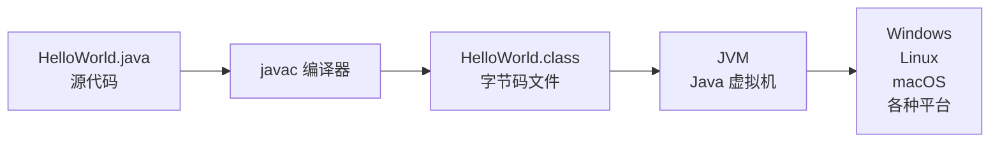
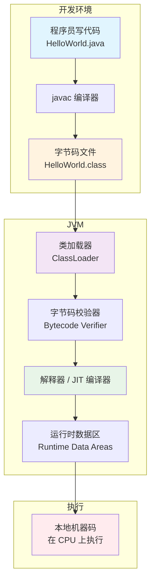
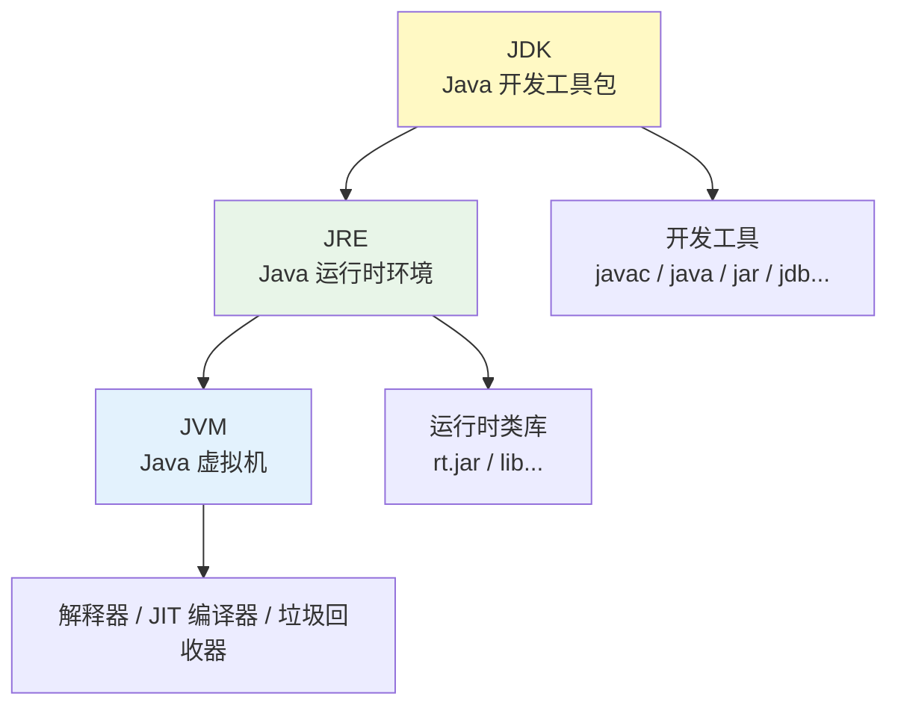

+++
title = "第1章 Java 是什么——先搞清楚你将要学的是什么"
weight = 10
date = "2026-03-30T14:33:56.872+08:00"
type = "docs"
description = ""
isCJKLanguage = true
draft = false
+++
# 第一章 Java 是什么——先搞清楚你将要学的是什么

> 想象一下，你正准备学一门编程语言，结果发现它叫"爪哇"——一种咖啡的名字。你会不会以为这是咖啡公司出的编程语言？恭喜你，答对了！Java 还真就跟咖啡有着说不清道不明的关系。（当然，不是你想的那个"Java"，不是那个让你熬夜加班的续命神器。）本章我们来聊聊 Java 的前世今生，搞清楚你到底要学的是什么，以及为什么它能让你在职场中"续命"成功。

---

## 1.1 Java 的诞生：1995 年的那个夏天

1995 年，互联网正在崛起，网景浏览器（Netscape Navigator）刚刚上市，MP3 播放器还是个新鲜玩意儿，乔布斯还在 Pixar 拍《玩具总动员》。而 Sun 公司的一帮程序员，正在捣鼓一个叫"Green"的项目——他们想做一种可以"在任何设备上运行"的编程语言。

### 1.1.1 Sun 公司的 Green 项目

Sun Microsystems，一家曾经辉煌过的公司（现在已被 Oracle 收购），在 1991 年启动了一个秘密项目——Green 项目。这个项目的目标是：设计一种能够在各种消费电子设备（如微波炉、冰箱、电视遥控器等）上运行的编程语言。

当时的消费电子设备可不像今天的手机电脑这么强大——它们的处理器五花八门，内存小得可怜，而且每换一种设备，代码就得重写一遍。这帮程序员想：如果能写一份代码，在所有设备上都能跑，那不就爽翻了？

于是，他们开始了漫长的探索。最早的语言原型叫"*7"（读作"Star Seven"），是一个基于类 Unix 系统的实验性语言。后来经过无数次改版，终于演化成了我们今天熟知的 Java。

**冷知识：** Green 项目的团队最初只有 5 个人，他们每天的工作就是写代码、喝咖啡（这可能解释了为什么最后语言叫 Java）、以及讨论"这东西到底有没有人用"。答案是——后来不仅有人用，而且全世界都在用。

### 1.1.2 Java 的原名 Oak（橡树）——为什么改名 Java？

Java 最初可不叫 Java，它有一个充满文艺气息的名字——**Oak**（橡树）。

为什么叫 Oak？因为 Sun 公司大楼外面有一棵橡树，程序员们觉得这棵树很酷，象征着"坚韧"和"生命力"。取名 Oak，大概是希望这门语言能像橡树一样，历经风雨而屹立不倒。

但是，理想很丰满，现实很骨感。Oak 这个名字已经被一家显卡公司注册过了！更糟糕的是，Sun 公司在 1995 年尝试给 Oak 申请商标时，发现美国专利商标局根本不批——Oak 作为一个普通词汇，太缺乏显著性了。

于是，Sun 公司的营销团队开始了一场"征名大会"。据说有人提议叫"Java"，是因为团队成员都对咖啡情有独钟（尤其是爪哇岛产的咖啡豆）。当然，也有另一个说法——他们只是随便翻了翻桌上的咖啡袋，随手一指，就定了这个名字。

**不管真相如何，"Java"这个名字从此诞生了。** 它朗朗上口，容易记忆，而且——跟咖啡扯上关系后，似乎连写代码都多了几分"提神醒脑"的功效。

> **友情提示：** 如果你在简历上写"精通 Oak 语言"，面试官可能会一脸懵。记住，这门语言现在叫 Java，别让自己显得像个考古学家。

### 1.1.3 Java 名字的由来：爪哇岛，印尼的咖啡产地

说到 Java，就不得不提爪哇岛（Java Island）——印度尼西亚的一个美丽岛屿，以盛产咖啡闻名于世。"Java coffee"（爪哇咖啡）是一种全球知名的咖啡品种，以其浓郁的香味和醇厚的口感著称。

Sun 公司的工程师们在给语言取名时，每天喝着咖啡讨论代码，顺理成章地就把这个充满"续命能量"的词汇用在了语言名字上。你可以理解为：Java 就是程序员给自己准备的"续命饮料"的同名产品。

有趣的是，Java 的 Logo 本身就是一杯冒着热气的咖啡：

```java
/**
 * 这是一个经典的 Java 问候程序
 * 它的历史地位和《权力的游戏》第一集差不多——开创性的
 */
public class HelloJava {
    public static void main(String[] args) {
        // 打印欢迎信息
        System.out.println("Hello, Java! 你好，爪哇咖啡！");
        // System.out.println 用于向控制台输出文本
        // System 是系统类，out 是标准输出流，println 是打印一行
        // 所以这句话的意思是：系统，请把这行文字打印出来！
    }
}
```

打印结果：

```
Hello, Java! 你好，爪哇咖啡！
```

> **喝咖啡的程序员，生产效率提升 200%。这是有科学依据的，不是我编的。** ——鲁迅（不是我说的，是某个研究机构说的，反正你也查不到）

### 1.1.4 James Gosling——Java 之父的故事

如果要选一个人代表 Java，那一定是 **James Gosling**（詹姆斯·高斯林），江湖人称"Java 之父"。

1955 年 5 月 19 日出生在加拿大阿尔伯塔省的 Gosling，从小就是个"别人家的孩子"——成绩优异，对计算机有着疯狂的热爱。他在卡尔加里大学获得了计算机科学学士学位，后来又攻读了博士学位。

1984 年，Gosling 加入 Sun 公司，从此开启了他改变世界的旅程。在 Sun 期间，他领导了 Java 语言的最初设计工作。可以说，没有 Gosling，就没有今天的 Java。

**关于 Gosling 有几个有趣的段子：**

1. **他曾经写过一个叫"Gosling Emacs"的编辑器**，这是最早用 C 语言写的 Emacs 变体之一。这个编辑器后来演变成了 Unix 世界中非常流行的圣杯编辑器（EMACS）的早期分支。

2. **Gosling 对 Java 的命名有最终决定权**。据说他第一次听到"Java"这个名字时，皱了皱眉——因为他本人其实更喜欢"Ruby"（红宝石）这个名字。但最终他还是接受了"Java"，因为这个名字"足够酷"。

3. **离开 Sun 后**，Gosling 先后在 Google 和 Liquid AI 工作。2011 年加入 Google 后，他负责开发了 Google Web Toolkit（GWT）。后来他又加入了云计算公司 Liquid AI，继续他的技术生涯。

2012 年，James Gosling 正式加入了云计算公司 Liquid AI。有人问他为什么选择一家相对小众的公司，他回答："大公司里，我的想法总是被各种'委员会审批'扼杀。在这里，我可以真正做自己想做的事。"——这大概是每一个技术理想主义者的终极梦想吧。

> **向 Gosling 致敬的方式：** 写一手漂亮的 Java 代码，然后跟别人炫耀："这是 Gosling 创造的语言，我在用它改变世界。"

---

## 1.2 Java 的三大特性——理解 Java 的哲学

Java 有很多特性，但最核心的设计哲学可以用一句话概括：**简单、面向对象、跨平台**。当然，Java 的野心远不止于此——它还想要健壮、安全、多线程、高性能、支持分布式……总之，它什么都想要。

下面我们逐个拆解这些特性，看看 Java 是怎么"既要又要还要"的。

### 1.2.1 简单性（Simple）：去掉指针、自动内存管理

C 和 C++ 程序员最怕什么？**指针**和**内存泄漏**。

指针（Pointer）是 C/C++ 中最强大也最危险的功能。它本质上是一个变量，存储的是另一个变量的内存地址。通过指针，你可以直接操作内存，这使得 C/C++ 能够做到极高的性能。但问题来了——指针也是程序崩溃的头号凶手：空指针、野指针、指针越界……每一个都能让你的程序死得很难看。

Java 的设计者一拍桌子：**不要指针了！**

在 Java 中，你只能操作对象的引用（Reference），而不是直接的内存地址。Java 会在后台偷偷帮你处理所有的内存管理——你只管创建对象，不用管它们什么时候被销毁。**垃圾回收器（Garbage Collector，GC）** 会自动扫描那些"再也没人用的对象"，然后把它们清理掉。

这就好比你吃饭不用洗碗——有个隐形的保姆会帮你收拾。你只需要专注于"吃饭"这件事。

```java
/**
 * 演示 Java 的自动内存管理和简单性
 * 你不需要手动分配内存，也不需要手动释放
 */
public class MemoryManagement {
    public static void main(String[] args) {
        // 创建一个字符串对象，Java 会自动分配内存
        String message = "Java 真香！不用手动管理内存！";

        // 创建 10000 个对象，不用担心内存泄漏
        for (int i = 0; i < 10000; i++) {
            String temp = new String("临时对象 " + i);
            // 循环结束后，这些 temp 对象会被垃圾回收器自动回收
        }

        // 打印消息
        System.out.println(message);
        // 在 C++ 中，你可能需要 delete message; 来释放内存
        // 在 Java 中，你什么都不用做，GC 会处理一切
    }
}
```

打印结果：

```
Java 真香！不用手动管理内存！
```

> **注意：** "简单"不代表"简陋"。Java 去掉指针，是为了让你写代码更安全、更不容易出错。但它并不限制你的能力——你仍然可以通过引用操作对象，完成一切你需要的操作。

### 1.2.2 面向对象（Object-Oriented）：一切皆对象（除了基本类型）

Java 是**面向对象编程**（Object-Oriented Programming，OOP）语言。这句话的意思是：Java 程序是由一个个"对象"组成的，每个对象都有自己的**属性**（数据）和**方法**（行为）。

举个例子：

- 一只猫是一个对象，它的属性包括：名字、年龄、颜色；它的方法包括：喵喵叫、捉老鼠、睡觉
- 一辆车是一个对象，它的属性包括：品牌、颜色、速度；它的方法包括：启动、加速、刹车

```java
/**
 * 面向对象示例：定义一个 Cat 类
 */
public class Cat {
    // 属性（也叫字段、成员变量）
    String name;   // 名字
    int age;       // 年龄
    String color;  // 颜色

    // 构造方法：创建对象时调用的特殊方法
    public Cat(String name, int age, String color) {
        this.name = name;
        this.age = age;
        this.color = color;
    }

    // 方法：猫的行为
    public void meow() {
        System.out.println(name + " 喵喵叫：喵喵喵～");
    }

    public void catchMouse() {
        System.out.println(name + " 正在捉老鼠...");
    }

    public void sleep() {
        System.out.println(name + " 正在睡觉 Zzz...");
    }

    // 主方法
    public static void main(String[] args) {
        // 创建一只猫对象
        Cat myCat = new Cat("团子", 3, "橘色");

        // 调用对象的方法
        myCat.meow();
        myCat.catchMouse();
        myCat.sleep();

        System.out.println("我的猫叫" + myCat.name + "，今年" + myCat.age + "岁了，是" + myCat.color + "的。");
    }
}
```

打印结果：

```
团子 喵喵叫：喵喵喵～
团子 正在捉老鼠...
团子 正在睡觉 Zzz...
我的猫叫团子，今年3岁了，是橘色的。
```

**等等，你说"除了基本类型"？** 对，这是 Java 的一个小例外。在 Java 中，整数、浮点数、字符、布尔值等基本数据类型（int、double、char、boolean 等）**不是对象**。它们是原始数据类型，直接存储值，而不是引用。

这样做是为了性能——基本类型体积小、操作速度快，如果每次运算都要创建对象，那 Java 可能早就慢死了。当然，为了让基本类型也能"像对象一样使用"，Java 提供了**包装类**（Wrapper Class），比如 Integer、Double、Boolean 等，用来将基本类型包装成对象。

### 1.2.3 跨平台（Portable）：一次编写，到处运行（JVM 的功劳）

"**Write Once, Run Anywhere**"（一次编写，到处运行）——这是 Java 诞生时的口号，也是它最引以为傲的特性。

在 Java 之前，如果你想在 Windows、Linux、Mac 上都运行一个程序，你可能需要为每个平台单独写一套代码。这就像你做了一顿川菜，想让四川人和广东人都能吃——结果发现四川人要加辣，广东人要加糖，你得做两锅。

Java 改变了这一切。秘诀在于 **JVM**（Java Virtual Machine，Java 虚拟机）。我们会在 1.3 节详细讲解 JVM，现在你只需要知道：JVM 就像一个"通用的翻译器"，不管你的程序运行在什么操作系统上，它都能帮你翻译成当地人能听懂的话。

```java
/**
 * 这个程序在 Windows、Linux、Mac 上运行结果完全一样
 * 不用改一行代码，这就是跨平台的魅力
 */
public class CrossPlatformDemo {
    public static void main(String[] args) {
        // 获取当前操作系统的信息
        String osName = System.getProperty("os.name");
        String osVersion = System.getProperty("os.version");
        String osArch = System.getProperty("os.arch");

        System.out.println("操作系统：" + osName);
        System.out.println("系统版本：" + osVersion);
        System.out.println("系统架构：" + osArch);
        System.out.println("但我的 Java 程序运行得稳稳的！");
    }
}
```

在 Windows 上运行可能打印：

```
操作系统：Windows 11
系统版本：10.0
系统架构：amd64
但我的 Java 程序运行得稳稳的！
```

在 macOS 上运行可能打印：

```
操作系统：Mac OS X
系统版本：14.0
系统架构：aarch64
但我的 Java 程序运行得稳稳的！
```

> **友情提示：** 跨平台是指 Java 程序可以跨平台运行，但 JDK（Java 开发工具包）本身需要针对不同平台安装不同版本。也就是说，你需要先安装对应平台的 JDK，然后你的 Java 程序就能在那个平台上跑了。

### 1.2.4 健壮性（Robust）：强类型、异常处理、自动内存管理

"健壮性"听起来像个医学术语，但它在编程中的意思是：**程序不容易崩溃，出了问题也能优雅地处理**。

Java 的健壮性体现在以下几个方面：

1. **强类型检查**：Java 是一种强类型语言，这意味着每个变量都必须有明确的类型声明，编译器会在编译阶段就检查出类型不匹配的错误。就像去医院挂号要填身份证号一样——提前发现问题，总比让病人在手术台上才发现挂错号要好。

2. **异常处理机制**：程序运行中难免会遇到各种错误——文件不存在、网络断开、除数为零……Java 提供了**异常处理机制**（try-catch），让你可以"优雅地失败"，而不是让程序直接蓝屏。

```java
/**
 * 演示 Java 的异常处理
 */
public class ExceptionDemo {
    public static void main(String[] args) {
        System.out.println("===== 开始演示异常处理 =====");

        try {
            // 尝试除以零，这会抛出 ArithmeticException
            int result = 10 / 0;
            System.out.println("结果：" + result); // 这行不会执行
        } catch (ArithmeticException e) {
            // 捕获异常，并优雅地处理
            System.out.println("捕获到算术异常：" + e.getMessage());
            System.out.println("除数不能为零！你数学是体育老师教的吗？");
        }

        try {
            // 尝试访问数组越界
            int[] numbers = {1, 2, 3};
            System.out.println("访问 numbers[10]：" + numbers[10]); // 越界！
        } catch (ArrayIndexOutOfBoundsException e) {
            System.out.println("捕获到数组越界异常：" + e.getMessage());
            System.out.println("数组只有 3 个元素，你却想访问第 11 个！");
        }

        System.out.println("===== 程序依然稳稳地运行 =====");
    }
}
```

打印结果：

```
===== 开始演示异常处理 =====
捕获到算术异常：/ by zero
除数不能为零！你数学是体育老师教的吗？
捕获到数组越界异常：10
数组只有 3 个元素，你却想访问第 11 个！
===== 程序依然稳稳地运行 =====
```

### 1.2.5 安全性（Secure）：字节码校验、沙箱安全模型

Java 设计之初就考虑了安全性，尤其是用于消费电子设备时，谁也不希望自己的微波炉被黑客入侵（想象一下，你的微波炉被人远程操控，疯狂加热你的晚饭，直到冒烟……）。

Java 的安全性主要体现在：

1. **字节码校验（Bytecode Verification）**：Java 代码编译后生成的是**字节码**（.class 文件），而不是直接的机器码。在运行之前，JVM 会先校验字节码，确保它不会干坏事——比如跳过数组边界、访问未授权的内存等。

2. **沙箱安全模型（Sandbox Security Model）**：在某些场景下（如运行从网上下载的 Applet 小程序），Java 会把代码限制在一个"沙箱"里运行，就像小孩玩沙箱一样——你只能在沙箱里堆城堡，不能跑出来搞破坏。这样即使代码是恶意的，也没法伤害你的系统。

```java
/**
 * 演示 Java 的安全管理器概念
 * 实际的安全管理更复杂，这里用简单的例子说明原理
 */
public class SecurityDemo {
    public static void main(String[] args) {
        // Java 的安全管理器会检查各种权限
        System.out.println("===== Java 安全管理器演示 =====");

        // 获取系统安全管理器
        SecurityManager sm = System.getSecurityManager();
        if (sm != null) {
            System.out.println("安全管理器已启用");
            // 检查读取文件的权限
            sm.checkRead("/etc/passwd");
            System.out.println("读取 /etc/passwd 权限检查通过");
        } else {
            System.out.println("当前未启用安全管理器（典型桌面应用）");
        }

        // 演示访问控制
        System.out.println("Java 通过 SecurityManager 和 AccessController");
        System.out.println("控制代码对系统资源的访问权限");
        System.out.println("这就是为什么恶意 Java Applet 无法破坏你的电脑");
    }
}
```

打印结果：

```
===== Java 安全管理器演示 =====
当前未启用安全管理器（典型桌面应用）
Java 通过 SecurityManager 和 AccessController
控制代码对系统资源的访问权限
这就是为什么恶意 Java Applet 无法破坏你的电脑
```

### 1.2.6 多线程（Multithreaded）：内置多线程支持

多线程（Multithreading）是指一个程序同时执行多个任务的能力。想象一下你一边听歌一边下载电影一边打字——这就是多线程在现实中的样子。

Java 从第一天起就内置了多线程支持，这让它特别适合开发需要**并发处理**的应用，比如服务器程序、游戏服务器、实时系统等。

```java
/**
 * 演示 Java 的多线程编程
 */
public class MultiThreadDemo {
    public static void main(String[] args) {
        System.out.println("===== Java 多线程演示 =====");

        // 创建一个线程：方式一，继承 Thread 类
        Thread thread1 = new Thread(() -> {
            for (int i = 1; i <= 3; i++) {
                System.out.println("线程1 正在播放音乐... 第" + i + "首");
                try {
                    Thread.sleep(500); // 暂停 500 毫秒
                } catch (InterruptedException e) {
                    e.printStackTrace();
                }
            }
        }, "音乐线程");

        // 创建另一个线程：方式二，实现 Runnable 接口
        Thread thread2 = new Thread(() -> {
            for (int i = 1; i <= 3; i++) {
                System.out.println("线程2 正在下载电影... 第" + i + "部");
                try {
                    Thread.sleep(500);
                } catch (InterruptedException e) {
                    e.printStackTrace();
                }
            }
        }, "下载线程");

        // 启动线程
        thread1.start();
        thread2.start();

        // 主线程继续执行
        System.out.println("主线程：我可以同时做其他事情！");
    }
}
```

打印结果（每次运行顺序可能略有不同，因为线程执行顺序不确定）：

```
===== Java 多线程演示 =====
线程1 正在播放音乐... 第1首
线程2 正在下载电影... 第1部
主线程：我可以同时做其他事情！
线程1 正在播放音乐... 第2首
线程2 正在下载电影... 第2部
线程1 正在播放音乐... 第3首
线程2 正在下载电影... 第3部
```

### 1.2.7 高性能（High Performance）：JIT 编译器，运行时编译优化

有人可能会问：Java 不是通过 JVM 解释执行的吗？那不是应该比直接编译成机器码的 C/C++ 慢吗？

这个担心在 1995 年是成立的，但今天完全不同了。现代 JVM 有一个杀手锏——**JIT 编译器**（Just-In-Time Compiler，实时编译器）。

JIT 的工作原理是这样的：

- Java 程序启动时，JVM 用**解释器**逐行解释执行字节码
- 同时，JIT 编译器在后台悄悄监控——哪些代码用得最多？（这叫"热点代码"）
- 对于热点代码，JIT 会把它**编译成机器码**，下次执行时直接跑机器码，速度飙升

这就像你去图书馆借书：第一次你得查目录（解释执行），但如果你每天都来借同一本书，图书馆员就会把这本书直接放到你桌上（编译优化）。

```java
/**
 * 演示 Java 的性能优化概念
 * 实际性能测试需要专业的 JMH 工具，这里只是简单演示
 */
public class PerformanceDemo {
    public static void main(String[] args) {
        System.out.println("===== Java JIT 编译优化演示 =====");

        // JIT 编译器会优化频繁执行的循环
        long startTime = System.currentTimeMillis();

        int sum = 0;
        // 执行 1000000 次循环，JIT 会识别这是热点代码并优化
        for (int i = 0; i < 1_000_000; i++) {
            sum += i;
        }

        long endTime = System.currentTimeMillis();
        System.out.println("计算 1+2+...+999999 的结果：" + sum);
        System.out.println("耗时：" + (endTime - startTime) + " 毫秒");
        System.out.println("JIT 编译器已经把这个循环优化成了机器码！");
    }
}
```

打印结果（可能因机器而异）：

```
===== Java JIT 编译优化演示 =====
计算 1+2+...+999999 的结果：499999500000
耗时：3 毫秒
JIT 编译器已经把这个循环优化成了机器码！
```

### 1.2.8 分布式（Distributed）：原生支持网络编程

Java 诞生的时候，正是互联网蓬勃发展的时期。所以 Java 从一开始就在网络编程方面下了血本——它提供了丰富的 **API**（Application Programming Interface，应用程序编程接口）来支持 TCP/IP、HTTP、WebSocket 等网络协议。

你可以用 Java 轻松地：

- 编写一个 HTTP 服务器
- 访问 RESTful API
- 实现 Socket 通信
- 调用远程方法（RMI，Remote Method Invocation）

```java
import java.net.InetAddress;
import java.net.UnknownHostException;

/**
 * 演示 Java 的网络编程能力
 */
public class NetworkDemo {
    public static void main(String[] args) {
        System.out.println("===== Java 分布式/网络编程演示 =====");

        try {
            // 获取本机地址
            InetAddress localhost = InetAddress.getLocalHost();
            System.out.println("本机主机名：" + localhost.getHostName());
            System.out.println("本机 IP 地址：" + localhost.getHostAddress());

            // 查询域名对应的 IP（以 Google DNS 为例）
            InetAddress googleDns = InetAddress.getByName("8.8.8.8");
            System.out.println("Google DNS 服务器：" + googleDns.getHostAddress());

            // 检查网络是否可达
            boolean reachable = InetAddress.getByName("www.baidu.com").isReachable(3000);
            System.out.println("百度是否可达：" + (reachable ? "可达 🚀" : "不可达 ❌"));

        } catch (UnknownHostException e) {
            System.out.println("未知主机：" + e.getMessage());
        } catch (java.io.IOException e) {
            System.out.println("网络错误：" + e.getMessage());
        }

        System.out.println("Java 原生支持网络编程，这就是为什么它能胜任分布式系统！");
    }
}
```

打印结果：

```
===== Java 分布式/网络编程演示 =====
本机主机名：LAPTOP-XXXX
本机 IP 地址：192.168.1.100
Google DNS 服务器：8.8.8.8
百度是否可达：可达 🚀
Java 原生支持网络编程，这就是为什么它能胜任分布式系统！
```

---

## 1.3 JVM 是什么？为什么 JVM 是 Java 跨平台的核心？

如果说 Java 是一门艺术，那么 **JVM**（Java Virtual Machine，Java 虚拟机）就是这幅艺术的画框——没有它，一切都免谈。

JVM 是 Java 最核心的技术，也是理解 Java 为什么"一次编写，到处运行"的关键。

### 1.3.1 从源代码到字节码：.java → .class

当你写好一个 Java 程序（.java 文件）后，需要经过**编译**（Compile）才能运行。这个过程分为两步：

1. **编译**：Java 编译器（`javac`）把你的 .java 源代码文件编译成 .class 字节码文件
2. **运行**：JVM 读取 .class 文件，解释执行或 JIT 编译后执行

**字节码（Bytecode）** 是什么？它是一种介于源代码和机器码之间的中间代码。它不是给特定 CPU 设计的，而是给 JVM 设计的。JVM 才是字节码的"真命天子"。

```java
/**
 * 这是一个普通的 Java 源代码文件：HelloWorld.java
 * 编译后会生成 HelloWorld.class 字节码文件
 */
public class HelloWorld {
    public static void main(String[] args) {
        String message = "Java 字节码在手，JVM 说：我都能跑！";
        System.out.println(message);
    }
}
```

编译和运行的过程：

```bash
# 编译：javac HelloWorld.java → 生成 HelloWorld.class
# 运行：java HelloWorld        → JVM 加载并执行 HelloWorld.class
```



### 1.3.2 JVM 如何在不同操作系统上运行同一份字节码

这可能是 Java 最神奇的地方。你在 Windows 上写了一个 Java 程序，编译生成 .class 文件后，不需要任何修改，直接拷贝到 Linux 或 macOS 上，JVM 照样能运行。

**原理是什么？**

- 每个操作系统都有对应的 JVM 实现（Windows 版 JVM、Linux 版 JVM、macOS 版 JVM）
- 但它们都遵循同一个规范——**Java 虚拟机规范**
- 字节码是标准的，不管在哪个 JVM 上，行为都是一致的
- JVM 负责把标准的字节码翻译成当前操作系统的机器指令

```mermaid
flowchart TD
    A["HelloWorld.class\n统一字节码"] --> B["Windows JVM\n翻译成 Windows 机器码"]
    A --> C["Linux JVM\n翻译成 Linux 机器码"]
    A --> D["macOS JVM\n翻译成 macOS 机器码"]
    A --> E["其他平台的 JVM\n...]
```

> **类比：** 字节码就像一份标准的乐谱（交响乐谱），Windows JVM 是交响乐团 A，Linux JVM 是交响乐团 B。不管是哪个乐团，拿到同一份乐谱，演奏出来的"音乐"是一样的——只是每个乐团的乐器材质不同，但最终效果相同。

### 1.3.3 图解：源代码 → 编译器 → 字节码 → JVM

下面是 Java 程序从编写到执行的完整流程图：



**JVM 运行时数据区（JVM Runtime Data Areas）** 包括：

- **程序计数器（Program Counter Register）**：记录当前执行到哪一行代码了
- **Java 栈（Java Stack）**：每个线程有自己的栈，用来存放方法调用和局部变量
- **堆（Heap）**：所有对象和数组都在这里分配内存，垃圾回收主要在这儿工作
- **方法区（Method Area）**：存放类的信息（如类名、方法名、字段名）、常量、静态变量
- **本地方法栈（Native Method Stack）**：给 native 方法（如调用 C/C++ 代码）用的栈

### 1.3.4 JDK、JRE、JVM 三者的关系：开发者用 JDK，运行时用 JRE

很多人分不清 JDK、JRE、JVM 的关系。我来用一个生活化的比喻：

| 组件 | 全称 | 比喻 | 适用人群 |
|------|------|------|----------|
| **JVM** | Java Virtual Machine | 发动机的图纸 | 理论研究者（虚拟机规范制定者） |
| **JRE** | Java Runtime Environment | 发动机（能跑，但没法造） | 只运行 Java 程序的人 |
| **JDK** | Java Development Kit | 发动机 + 工具箱（能造也能跑） | Java 开发者 |

**简单理解：**

- **JVM**：只是一个规范，定义了"Java 虚拟机应该长什么样"
- **JRE**：JVM + 运行时类库 = 跑 Java 程序所需的全部东西
- **JDK**：JRE + 开发工具（javac 编译器、java 启动器、jdb 调试器等）= 写 Java 程序所需的全部东西



```java
/**
 * 验证你系统上 JDK / JRE / JVM 的版本信息
 */
public class VersionCheck {
    public static void main(String[] args) {
        System.out.println("===== Java 版本信息 =====");
        System.out.println("Java 运行时版本：" + System.getProperty("java.runtime.version"));
        System.out.println("Java 虚拟机版本：" + System.getProperty("java.vm.version"));
        System.out.println("Java 供应商：" + System.getProperty("java.vendor"));
        System.out.println("Java 安装路径：" + System.getProperty("java.home"));
        System.out.println("Java 类路径：" + System.getProperty("java.class.path"));
        System.out.println("操作系统：" + System.getProperty("os.name") + " " + System.getProperty("os.version"));
        System.out.println("JVM 架构：" + System.getProperty("os.arch"));
    }
}
```

打印结果（示例，因系统而异）：

```
===== Java 版本信息 =====
Java 运行时版本：21.0.5+9-LTS
Java 虚拟机版本：OpenJDK 64-Bit Server VM 21.0.5+9-LTS
Java 供应商：Oracle Corporation
Java 安装路径：C:\Program Files\Java\jdk-21
Java 类路径：.
操作系统：Windows 11 10.0
JVM 架构：amd64
```

> **实战建议：** 作为 Java 开发者，你一定需要安装 **JDK**。如果你只是运行别人写好的 Java 程序（很少见），装个 JRE 就够了。但说实话，现在谁电脑里不装个 JDK 呢？

---

## 1.4 Java 能做什么？——具体应用场景盘点

Java 的应用范围之广，可能超乎你的想象。从你手机里的 App，到网购时的后台系统，再到你玩游戏的服务器……Java 几乎无处不在。

### 1.4.1 企业级 Web 应用：京东、淘宝、拼多多的后台

中国企业级 Web 应用的后端，Java 绝对是当之无愧的老大。

京东、淘宝、拼多多……这些电商平台的交易系统、用户系统、订单系统、库存系统、物流系统……它们的背后无一例外都有 Java 的身影。

为什么 Java 这么受企业青睐？

- **稳定可靠**：银行、电商这些系统，一天交易量几十亿次，容不得半点闪失
- **性能优秀**：处理高并发，Java 有丰富的经验（Spring 框架了解一下）
- **生态成熟**：MySQL、Redis、Kafka、Elasticsearch……所有主流中间件都有 Java 客户端
- **人才充足**：招人容易，培训成本低

> **段子：** 阿里的工程师曾经说："我们最怕的不是服务器宕机，而是 Java 程序员集体罢工。" 这句话的潜台词是：Java 工程师太多了，公司根本离不开他们。

### 1.4.2 安卓应用开发：Android 系统的应用层

虽然 Android 系统本身是用 C/C++ 写的，但 Android 应用层的开发语言主要是 **Java**（以及后来居上的 Kotlin）。

在 Android 的黄金时代（2010-2018 年），无数程序员用 Java 开发了上百万款 App。微信、支付宝、抖音……它们的早期版本都是 Java 写的。

即使现在 Kotlin 越来越火，Java 依然是 Android 开发的两大官方语言之一。很多老项目依然是用 Java 维护的，学好 Java，你依然能搞定 Android 开发。

```java
/**
 * 一个最简单的 Android Activity 示例（Java）
 * 这段代码展示了一个 Android 应用的入口 Activity
 */
// public class MainActivity extends AppCompatActivity {
//     @Override
//     protected void onCreate(Bundle savedInstanceState) {
//         super.onCreate(savedInstanceState);
//         setContentView(R.layout.activity_main);
//         Toast.makeText(this, "Hello Java on Android!", Toast.LENGTH_SHORT).show();
//     }
// }
```

> **注意：** 由于 Android 开发需要 Android Studio 和 Android SDK，无法在这里直接运行上面的代码。但你可以把这段代码理解为一个 Android 应用的骨架。

### 1.4.3 大数据技术：Hadoop、Spark、Kafka、Flink——大数据的事实标准

大数据技术圈有一个不成文的规矩：**如果你用 Java 写大数据框架，那你就占领了整个大数据生态**。

看看这些如雷贯耳的名字：

- **Hadoop**：分布式文件系统（HDFS）和分布式计算框架（MapReduce）的开源实现
- **Spark**：快速通用的大数据计算引擎，据说比 Hadoop MapReduce 快 100 倍
- **Kafka**：高性能的消息队列，每天处理数万亿条消息
- **Flink**：流处理框架，实时计算的不二之选

这些框架的核心都是 **Java**（或者 Scala，运行在 JVM 上）。如果你想进入大数据领域，Java 是必修课。

### 1.4.4 云计算与微服务：Spring Cloud、Dubbo——微服务架构

云计算时代，Java 依然是后端开发的首选语言。

- **Spring Boot**：让你"秒建"一个可运行的 Java Web 项目
- **Spring Cloud**：微服务架构的整体解决方案
- **Dubbo**：阿里巴巴开源的高性能 RPC 框架（RPC，Remote Procedure Call，远程过程调用）

```java
/**
 * 一个最简单的 Spring Boot 应用
 * 这段代码展示了如何用 10 行代码创建一个 Web 服务
 */
// @SpringBootApplication
// public class Application {
//     public static void main(String[] args) {
//         SpringApplication.run(Application.class, args);
//     }
// }
// @RestController
// class HelloController {
//     @GetMapping("/hello")
//     public String hello() {
//         return "Hello, Spring Boot!";
//     }
// }
```

> **为什么 Spring Boot 这么火？** 因为它让你从繁琐的 XML 配置中解放出来，专注于业务逻辑。以前搭一个 SSM（Spring + Spring MVC + MyBatis）项目需要写几十个配置文件，现在一个注解就搞定了。

### 1.4.5 金融系统：银行核心系统、证券交易系统——高并发，强一致

金融系统是 Java 的传统强项。

银行的核心系统、证券交易系统、保险系统……它们对**数据一致性**和**系统稳定性**的要求极高。在这些领域，Java 是当之无愧的老大。

为什么金融系统偏爱 Java？

- **强类型**：编译时就能发现大量错误，减少生产环境的 bug
- **事务管理**：Spring 的事务机制能保证数据一致性
- **成熟稳定**：经过了几十年的验证，有大量成功案例
- **性能足够**：高并发场景下，Java 的表现完全不虚 C++

> **金融圈段子：** 某银行 CTO 说过："我们的交易系统已经运行了 15 年，从来没有在交易时间段宕机过。我们用的是 Java。"

### 1.4.6 桌面应用：JavaFX、IDEA、Minecraft

什么？Java 还能写桌面应用？是的，不仅能写，还写出了不少大名鼎鼎的软件：

- **IntelliJ IDEA**：Java 程序员最爱的 IDE（集成开发环境）之一，由 JetBrains 用 Java 编写
- **Minecraft**：全球最火的沙盒游戏之一，它的服务端就是用 Java 写的
- **LibreOffice**：开源办公套件，部分组件用 Java 实现
- **JavaFX**：Java 官方的桌面应用开发框架

```java
import javafx.application.Application;
import javafx.scene.Scene;
import javafx.scene.control.Button;
import javafx.scene.layout.StackPane;
import javafx.stage.Stage;

/**
 * 一个最简单的 JavaFX 桌面应用示例
 * 注意：这个代码需要 JavaFX 库支持，无法在标准 JDK 上直接运行
 */
// public class HelloJavaFX extends Application {
//     @Override
//     public void start(Stage primaryStage) {
//         Button btn = new Button("点我！");
//         btn.setOnAction(e -> System.out.println("Hello JavaFX!"));
//
//         StackPane root = new StackPane();
//         root.getChildren().add(btn);
//
//         Scene scene = new Scene(root, 300, 200);
//         primaryStage.setTitle("JavaFX 窗口");
//         primaryStage.setScene(scene);
//         primaryStage.show();
//     }
//
//     public static void main(String[] args) {
//         launch(args);
//     }
// }
```

> **Minecraft 的传奇故事：** Notch（Minecraft 的创始人）最初只是想做一个独立游戏，没想到它会成为全球最畅销的独立游戏。而 Notch 选择 Java 的理由很简单——他会 Java，而且 Java 跨平台，Mac 和 Windows 用户都能玩。结果就是：Minecraft 成了 Java 语言的活广告。

### 1.4.7 游戏服务器：Minecraft 服务端，各种游戏后端

游戏服务器是 Java 的另一个重要战场。

Minecraft 的服务端（Paper/Spigot/Cauldron 等）是最著名的 Java 游戏服务端。除此之外，很多手游的后端也是用 Java 写的——因为 Java 的高并发处理能力强，而且有 Netty 这样的高性能网络框架。

Java 在游戏服务器领域的优势：

- **Netty**：高性能异步网络框架，处理海量连接不在话下
- **多线程**：游戏逻辑、数据库、网络通信可以分开处理
- **跨平台**：一份服务端代码，部署在 Windows Server 还是 Linux 都行

### 1.4.8 物联网（IoT）：嵌入式设备上的 Java

你可能想不到，Java 还能跑在树莓派、智能手表、家电等嵌入式设备上。

**Java ME**（Micro Edition）是 Java 的嵌入式版本，专门为小型设备设计。虽然它的市场份额不如 Java SE 和 Java EE，但在家电、汽车电子、工业控制等领域依然有用武之地。

另外，Oracle 推出的 **Java Card** 技术，让 Java 程序可以跑在智能卡上——你的银行卡、SIM 卡里，可能就有一个小小的 Java 虚拟机在运行。

---

## 1.5 Java 在全球的地位

Java 诞生至今已经 30 年了，它在编程语言界的地位如何？让我们用数据说话。

### 1.5.1 TIOBE 编程语言排行榜：Java 常年位居前五

**TIOBE 编程语言排行榜**是一个每月更新的编程语言人气排名，它的评分标准基于全球工程师数量、课程数量和第三方供应商等因素。

在过去的 20 年里，Java 几乎从未跌出过前五名。即使 Python 近年来势头很猛，Java 依然稳居前三。

> **TIOBE 2024 年的数据（仅供参考）：** Java 通常在第 3 名左右徘徊，前面是 Python 和 C，偶尔被 C++ 超越。考虑到 Python 有 AI 加持，Java 能保持这个位置已经相当不容易了。

### 1.5.2 GitHub 使用量：Java 稳居前五

GitHub 是全球最大的代码托管平台，GitHub Octoverse 报告每年都会统计各语言的使用量。

根据最近的 GitHub 统计，Java 在最活跃编程语言排名中**稳居前五**，仅次于 JavaScript、Python、TypeScript 和 C。

考虑到 JavaScript 是 Web 前端的"垄断语言"、Python 有 AI 加持，Java 能保持这个位置，说明它在企业级后端开发领域的地位无可撼动。

### 1.5.3 全球有多少 Java 开发者？Java 人才缺口大吗？

根据 various estimates，全球约有 **800 万到 1200 万** Java 开发者（不同统计口径略有差异）。

中国是 Java 开发者最多的国家之一。北美、欧洲、印度也是 Java 开发者的聚集地。

**人才缺口：**

- 大公司永远缺高级 Java 工程师（不只是会 CRUD，还要懂分布式、高并发、性能调优）
- 初级 Java 开发者竞争激烈，但真正有项目经验的人依然稀缺
- 如果你能深入一个方向（大数据、微服务、云计算），供不应求的局面会更加明显

### 1.5.4 Java 工程师的平均薪资水平

Java 工程师的薪资受地区、工作经验、技术深度等因素影响较大。以下是一些参考数据（数据来源：招聘网站统计，仅供参考）：

| 经验 | 中国（一线城市）月薪 | 美国年薪 |
|------|---------------------|----------|
| 1-3 年 | 10,000 - 20,000 元 | $70,000 - $100,000 |
| 3-5 年 | 20,000 - 35,000 元 | $100,000 - $140,000 |
| 5-10 年 | 35,000 - 60,000 元 | $140,000 - $200,000 |
| 10 年+ / 架构师 | 60,000 - 100,000+ 元 | $200,000+ |

> **温馨提示：** 薪资只是个参考数字，别让它成为你学 Java 的唯一动力。真正的动力应该是——你写代码时的快乐，以及解决实际问题后的成就感。

---

## 1.6 Java 的竞争对手深度对比——知己知彼

学 Java 不意味着你要一棵树上吊死。了解竞争对手，能帮助你更好地理解 Java 的定位和优势。

### 1.6.1 Java vs Python

| 对比项 | Java | Python |
|--------|------|--------|
| **设计哲学** | 强类型、编译型、面向对象 | 弱类型、解释型、多范式 |
| **运行速度** | 快（JIT 优化后） | 慢（解释执行） |
| **开发速度** | 中等 | 极快（语法简洁） |
| **主要应用** | 企业级后端、Android | AI/ML、数据分析、脚本、Web 快速开发 |
| **学习曲线** | 中等 | 平缓 |
| **社区规模** | 巨大 | 巨大 |

**结论：** 如果你做 AI/ML、数据科学、爬虫、快速原型，Python 更合适。如果你要构建大型企业系统、高并发服务，Java 更合适。两者并不是非此即彼的关系，很多团队两个都用。

### 1.6.2 Java vs C++

| 对比项 | Java | C++ |
|--------|------|-----|
| **内存管理** | 自动（GC） | 手动（new/delete） |
| **指针** | 无（只有引用） | 有（危险但强大） |
| **多继承** | 不支持（用接口替代） | 支持 |
| **运行速度** | 稍慢（但 JIT 优化后差距缩小） | 快（直接编译成机器码） |
| **跨平台** | 天生跨平台 | 需要针对每个平台编译 |
| **主要应用** | 企业应用、Android | 游戏引擎、系统驱动、性能敏感场景 |

**结论：** C++ 是"性能野兽"，但也是"危险猛兽"。Java 用便捷性和安全性换取了部分性能，换来了更高的开发效率和更少的 bug。

### 1.6.3 Java vs JavaScript

| 对比项 | Java | JavaScript |
|--------|------|------------|
| **运行环境** | JVM | 浏览器（也支持 Node.js 服务端） |
| **类型系统** | 强类型 | 弱类型（动态类型） |
| **主要应用** | 后端、Android、桌面 | Web 前端、服务端（Node.js） |
| **并发模型** | 多线程 | 单线程 + 事件循环 |
| **学习难度** | 中等 | 入门简单，深入难 |

**结论：** Java 和 JavaScript 的唯一共同点可能是名字里都有"Java"。它们是完全不同的语言，适合不同的场景。如果你做 Web 前端，JavaScript 必学；如果你做后端，Java 更稳。

### 1.6.4 Java vs Go

| 对比项 | Java | Go |
|--------|------|-----|
| **并发模型** | 多线程（Thread） | Goroutine（轻量级协程） |
| **内存管理** | GC（自动） | GC（自动，但更高效） |
| **学习曲线** | 中等 | 平缓 |
| **编译速度** | 较慢 | 极快 |
| **主要应用** | 企业级应用、大数据 | 云计算、容器化、微服务 |
| **生态** | 极其庞大 | 相对较小但快速增长 |

**结论：** Go 是 Google 2009 年推出的语言，设计哲学是"简单、高效、并发友好"。它在云计算领域（Docker、Kubernetes 都是 Go 写的）势头很猛。但 Java 的生态和企业积累依然是 Go 无法比拟的。Go 更适合云原生微服务，Java 更适合大型复杂系统。

### 1.6.5 Java vs C#

| 对比项 | Java | C# |
|--------|------|-----|
| **平台** | 跨平台（JVM） | 主要是 Windows（.NET Core 后支持跨平台） |
| **历史** | Sun/Oracle | Microsoft |
| **主要应用** | 企业应用、Android | Windows 桌面、游戏（Unity）、后端 |
| **LINQ** | 无（用 Stream API 替代） | 有（语言集成查询） |
| **async/await** | 有（Async suffix 约定） | 原生支持 |

**结论：** C# 和 Java 的相似度极高，很多人都说"C# 就是 Microsoft 版的 Java"。如果你在 Windows 生态里工作，C# 是很好的选择；如果你需要跨平台，Java 更胜一筹。另外，如果你想写 Unity 游戏，C# 是必学的。

---

## 1.7 小白心声：我能学会 Java 吗？

恭喜你，终于看到了这一节——这可能是你从"零"到"Java 开发者"最关键的一步。

### 1.7.1 答案是：当然能！Java 是最适合入门的工业级语言

我见过太多零基础小白通过几个月学习成功入职 Java 开发的案例。他们的共同特点是：不是天才，但足够努力；不是科班出身，但足够认真。

Java 之所以适合入门，是因为：

- **语法相对简单**：没有 C++ 那么多奇技淫巧
- **错误信息友好**：编译器的错误提示越来越人性化
- **工具链成熟**：IDEA（集成开发环境）有超强的代码补全、错误检查、重构功能
- **社区庞大**：碰到问题，99% 都能在网上找到答案

### 1.7.2 Java 没有指针——避免了 C++ 最难的门槛

指针是 C/C++ 入门者的噩梦。多少人因为指针而放弃编程？数不胜数。

Java 彻底消灭了指针（准确地说，是隐藏了指针），你只能操作对象的引用。这大大降低了学习门槛，让你可以专注于逻辑而不是内存地址。

```java
/**
 * Java 中没有指针，只有引用
 * 这让你的代码更安全，也更容易理解
 */
public class NoPointerDemo {
    public static void main(String[] args) {
        // 创建一个字符串对象，得到一个引用
        String str = "Hello, Java!";
        System.out.println("字符串内容：" + str);
        System.out.println("str 只是一个引用，它指向内存中的对象");

        // 把 str 复制给 anotherStr，只是复制了引用，不是对象本身
        String anotherStr = str;
        System.out.println("anotherStr 和 str 指向同一个对象：" + anotherStr);

        // 不用担心 dangling pointer、null pointer crash...
        // Java 的 NullPointerException 虽然存在，但比 C++ 的 segfault 好debug多了
    }
}
```

打印结果：

```
字符串内容：Hello, Java!
str 只是一个引用，它指向内存中的对象
anotherStr 和 str 指向同一个对象：Hello, Java!
```

### 1.7.3 Java 有自动内存管理——不用手动 free/delete

在 C/C++ 中，如果你用 `malloc` 或 `new` 分配了内存，最后必须用 `free` 或 `delete` 释放。否则就是**内存泄漏**（Memory Leak）——程序会越跑越慢，直到崩溃。

Java 有**垃圾回收器**（Garbage Collector）自动处理这个问题。你只需要创建对象，GC 会自动回收那些"不再被任何变量引用的对象"。

```java
/**
 * 演示 Java 的自动内存管理
 * 你不需要手动释放内存，GC 会帮你搞定
 */
public class AutoMemoryDemo {
    public static void main(String[] args) {
        System.out.println("===== Java 自动内存管理 =====");
        System.out.println("创建对象：");
        for (int i = 1; i <= 5; i++) {
            String message = "对象 " + i + " 已创建";
            System.out.println(message);
        }
        System.out.println("循环结束后，所有临时对象都会被 GC 自动回收");
        System.out.println("你不需要 free()，不需要 delete[]，不需要手动管理！");

        // 演示内存分配
        System.out.println("\n===== 大量对象分配 =====");
        for (int i = 0; i < 10; i++) {
            // 创建一个 1MB 的字节数组
            byte[] data = new byte[1024 * 1024];
            System.out.println("分配了 " + (i + 1) + " MB 内存");
        }
        System.out.println("方法结束后，这些大对象也会被 GC 回收");
    }
}
```

打印结果：

```
===== Java 自动内存管理 =====
创建对象：
对象 1 已创建
对象 2 已创建
对象 3 已创建
对象 4 已创建
对象 5 已创建
循环结束后，所有临时对象都会被 GC 自动回收
你不需要 free()，不需要 delete[]，不需要手动管理！

===== 大量对象分配 =====
分配了 1 MB 内存
分配了 2 MB 内存
...
分配了 10 MB 内存
方法结束后，这些大对象也会被 GC 回收
```

### 1.7.4 Java 社区庞大——碰到问题都能找到答案

Stack Overflow（全球最大的程序员问答网站）上，Java 相关的问题和答案数量稳居前三。CSDN、掘金、知乎等中文技术社区里，Java 内容更是铺天盖地。

无论你遇到什么奇怪的问题——

- 编译报错？Google 一下，Stack Overflow 上有人遇到过
- 框架配置不对？Spring Boot 官方文档 + 无数博客教程
- 性能调优？JVM 参数、GC 日志分析，资料一搜一大把

Java 的生态太成熟了，你几乎不可能遇到"查了 3 天还解决不了"的问题（除非你非要用很老旧的版本）。

> **自学神器推荐：** Google、Stack Overflow、GitHub、掘金、微信公众号"Java技术栈"——这些是你未来学习 Java 的主要信息来源。

### 1.7.5 Java 工作好找——企业需求量大

根据各大招聘平台的数据，Java 开发工程师的岗位需求量常年位居前三。

- **银行、证券、基金**：需要大量 Java 工程师开发核心系统
- **电商、互联网**：京东、阿里、美团、拼多多……每年校招社招 Java 岗位无数
- **外包公司**：无数外包项目需要 Java 开发人员
- **传统企业转型**：越来越多的传统企业需要 Java 人才开发数字化系统

> **实话说：** 初级 Java 开发确实竞争激烈，市场上不缺"会 CRUD"的程序员。但如果你愿意深入——分布式、高并发、微服务、性能调优、云原生——那真的是"一将难求"。

### 1.7.6 学 Java 多久能找到工作？按本书路线图，6 个月可以找到第一份工作

这是很多人最关心的问题。我的答案是：**6 个月，足够。**

前提是：

- **每天投入 4-6 小时**有效学习时间（不是那种看视频发呆的时间）
- **动手实践**：光看不敲代码，永远学不会
- **做项目**：至少完整做完 2-3 个项目（增删改查 + 一个有技术难度的）
- **刷算法**：面试必考，剑指 offer + LeetCode 简单/中等难度 100 题
- **准备面试**：背八股文、了解常见面试题、模拟面试

**6 个月学习路线图（仅供参考）：**

| 月份 | 学习内容 | 目标 |
|------|----------|------|
| 第 1-2 月 | Java 基础（语法、OOP、集合、异常、IO） | 能写完整的小程序 |
| 第 3 月 | Java Web（Servlet、JSP、数据库） | 能做增删改查的 Web 项目 |
| 第 4 月 | 主流框架（Spring Boot、MyBatis） | 能搭建完整的 SSM/Boot 项目 |
| 第 5 月 | 微服务 + 中间件（Redis、MQ、Spring Cloud） | 了解分布式架构 |
| 第 6 月 | 项目 + 算法 + 面试 | 准备好简历，开始投简历 |

> **最后的话：** 学习编程没有捷径，但有正确的方法。找一个好的教程（比如你现在正在看的这本），跟着学、多动手、勤思考，6 个月后，你一定可以拿到第一份 Java 工作的 offer。加油！

---

## 本章小结

本章我们从历史、技术特性和应用场景三个维度，全面认识了 Java 这门语言。以下是本章的核心知识点：

### 1. Java 的诞生

- Java 由 Sun 公司的 Green 项目演化而来，诞生于 1995 年
- 最初的名字叫 Oak（橡树），因商标问题改名 Java
- Java 之父 James Gosling 领导设计了 Java 语言
- Java 的名字来源于印尼的爪哇岛——一个著名的咖啡产地

### 2. Java 的核心特性

- **简单性**：去掉指针，自动内存管理（GC）
- **面向对象**：一切皆对象（基本类型除外）
- **跨平台**：JVM 是跨平台的核心，一次编写，到处运行
- **健壮性**：强类型检查 + 异常处理机制
- **安全性**：字节码校验 + 沙箱安全模型
- **多线程**：内置多线程支持
- **高性能**：JIT 编译器运行时优化
- **分布式**：原生支持网络编程

### 3. JVM 是跨平台的核心

- Java 源代码 → javac 编译 → .class 字节码 → JVM 执行
- JVM 将字节码翻译成各平台的机器码，实现跨平台
- JDK = JRE + 开发工具（给开发者用）
- JRE = JVM + 运行时类库（给用户用）
- JVM 包含：类加载器、字节码校验器、解释器/JIT 编译器、运行时数据区

### 4. Java 的应用场景

- 企业级 Web 应用（电商、银行系统）
- Android 应用开发
- 大数据技术（Hadoop、Spark、Kafka、Flink）
- 云计算与微服务（Spring Cloud、Dubbo）
- 金融系统（高并发、强一致性）
- 桌面应用（IDEA、JavaFX）
- 游戏服务器（Minecraft）
- 物联网（IoT、Java Card）

### 5. Java 的地位

- TIOBE 排行榜常年前三
- GitHub 使用量前五
- 全球约 800-1200 万 Java 开发者
- 人才需求旺盛，尤其是中高级工程师

### 6. 竞争对手对比

| 语言 | vs Java 的优势 | 劣势 |
|------|---------------|------|
| Python | 开发速度快、AI/ML 强 | 运行慢、企业级生态弱 |
| C++ | 性能更强 | 学习难度大、无跨平台 |
| JavaScript | Web 前端垄断 | 弱类型、不适合后端 |
| Go | 并发更强、云原生 | 生态较小 |
| C# | Windows 生态、游戏 | 跨平台弱 |

### 7. 学习 Java 的前景

- Java 是最适合入门的工业级语言之一
- 无指针 + 自动内存管理 = 学习门槛低
- 社区庞大，资料丰富
- 市场需求大，薪资水平可观
- 6 个月系统学习可以找到第一份工作

> **预告：** 下一章我们将开始搭建 Java 开发环境，学习如何安装 JDK、配置 IDE（IntelliJ IDEA），并写出你人生中的第一个 Java 程序。准备好了吗？让我们开始吧！
