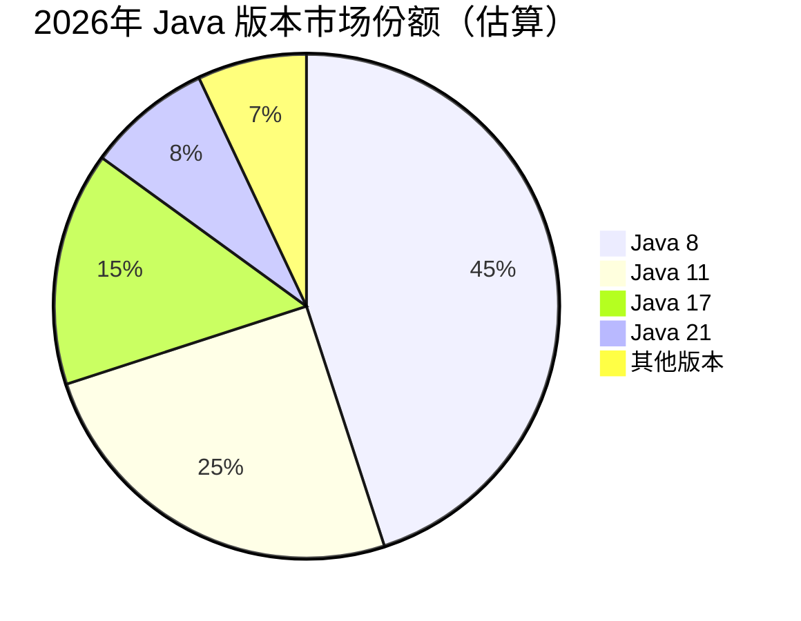
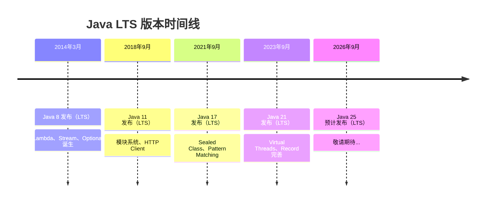
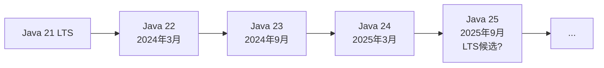
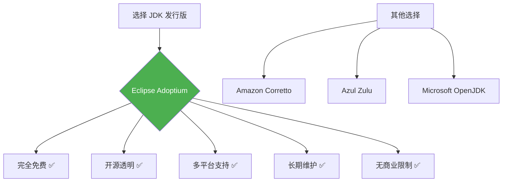

+++
title = "第3章 Java 版本选择指南——我该学哪个版本？"
weight = 30
date = "2026-03-30T14:33:56.877+08:00"
type = "docs"
description = ""
isCJKLanguage = true
draft = false
+++
# 第三章 Java 版本选择指南——我该学哪个版本？

> "世界上只有两种编程语言：一种是被人骂的，一种是没人用的。" —— Java 两个都占了，但骂的人更多，说明用的人更多。

选 Java 版本这件事，堪称新手村最难抉择。比"中午吃什么"还让人纠结，因为选错了不仅要重来，还可能影响你未来的"钱途"。别担心，这一章帮你理清思路，做个明智的选择。

---

## 3.1 各版本市场份额分析：2026 年 Java 版本分布

先来看看当前 Java 江湖的局势。下图是一个粗略的版本分布图（基于 2025-2026 年各调查数据）：



> **说明**：以上数据综合了 JRebel、JetBrains、New Relic 等机构的调查报告，实际情况因地区、行业而异。比如国内传统企业用 Java 8 的比例可能更高，互联网公司可能更多用 Java 17/21。

### 3.1.1 Java 8 仍然是最多企业在用的版本——为什么迁移这么难？

Java 8 是 2014 年发布的，距今已经超过 10 年。但它至今仍是企业里的"霸主"，原因很扎心：

**1. 遗留系统（Legacy System）太庞大**

想象一下：你接手了一辆 2014 年的车，要把它升级成 2026 年的智能汽车。发动机、底盘、线路全都不一样了，你怎么改？大部分企业面临的就是这种困境。代码几百万行，依赖几十个第三方库，升级一次需要 3-6 个月甚至更久，期间还不能停止服务。

```java
// 这是一个典型的 Java 8 遗留代码场景
// 业务逻辑已经稳定运行多年，没人敢动
public class OldBackendService {
    
    // 这个方法可能 5 年没人碰过了
    public List<String> getActiveUsers() {
        List<String> users = new ArrayList<>();
        // 曾经的实现...一个一个查数据库
        Connection conn = getConnection();
        Statement stmt = conn.createStatement();
        ResultSet rs = stmt.executeQuery("SELECT name FROM users WHERE active = 1");
        while (rs.next()) {
            users.add(rs.getString("name"));
        }
        rs.close();
        stmt.close();
        conn.close();
        return users;
    }
    
    // 谁知道这段代码有多少地方在调用？
    // 万一改了出问题，谁负责？
}
```

**2. "又不是不能用"哲学**

很多企业的 Java 系统跑得好好的，性能够用，功能正常。为什么要冒险升级？升级了用户体验没提升，业务价值没增加，反而可能引入新 bug。这种投入产出比，老板们心里门儿清。

**3. 升级成本高**

- **测试成本**：几十个系统互相依赖，一个升了可能导致其他出问题
- **人员成本**：需要熟悉新版本的开发人员
- **风险成本**：万一升完线上抖动了怎么办？
- **时间成本**：可能需要几个月甚至半年

所以，Java 8 在企业里"称霸"不是因为它最好，而是因为替换成本太高。这就像你家那台用了 10 年的冰箱，噪音大、费电，但换一台新的要花时间挑、要花钱买、要找人搬——算了，将就用吧。

### 3.1.2 Java 11 是迁移的中间目标

如果说 Java 8 是"留守老人"，那 Java 11 就是"中年危机"——不上不下，尴尬得很。

**为什么很多人选择 Java 11？**

1. **它是 LTS 版本**：有 8 年支持期（到 2026 年 9 月）
2. **比 Java 8 新**：有了模块化（Module System）、改进的流 API、HTTP Client
3. **比 Java 17 旧**：依赖库兼容性更好一些

但 Java 11 的处境有点尴尬：

```java
// Java 11 的新特性演示：HTTP Client（带中文注释）
import java.net.URI;
import java.net.http.HttpClient;
import java.net.http.HttpRequest;
import java.net.http.HttpResponse;

public class Java11HttpDemo {
    public static void main(String[] args) throws Exception {
        // 创建 HTTP 客户端（Java 11 引入的标准 API）
        HttpClient client = HttpClient.newHttpClient();
        
        // 发送 GET 请求
        HttpRequest request = HttpRequest.newBuilder()
            .uri(URI.create("https://api.example.com/data"))
            .GET()
            .build();
        
        // 同步发送请求（Java 11 支持的）
        HttpResponse<String> response = client.send(request,
            HttpResponse.BodyHandlers.ofString());
        
        System.out.println("状态码：" + response.statusCode());
        System.out.println("响应内容：" + response.body());
    }
}
```

但说实话，Java 11 的新特性相对有限，很多人把它当成"跳板"——从 8 升级到 11，再从 11 升级到 17。如果你现在还在用 Java 11，建议考虑下一步了。

### 3.1.3 Java 17 是新项目的首选 LTS——企业级项目的黄金标准

如果说 Java 8 是"经典老歌"，那 Java 17 就是"最新热门单曲"——它解决了大量历史问题，引入了现代化的语法和 API。

**Java 17 的亮点**（相对于 Java 8）：

```java
// Java 17 新特性演示

// 1. sealed class（密封类）：精确控制类的继承层次
// 解释：只有指定的类可以继承这个类，防止滥用继承
public sealed class Shape permits Circle, Rectangle, Square {
    // 密封类的基类
}

final class Circle extends Shape {
    double radius;
}

non-sealed class Rectangle extends Shape {
    double width, height;
}

sealed class Square extends Shape permits SimpleSquare {
    double side;
}

final class SimpleSquare extends Square {
    // 完结撒花，不能再被继承了
}

// 2. switch 表达式升级（Java 14 正式引入，Java 17 更完善）
public class SwitchDemo {
    public static void main(String[] args) {
        String dayType = switch (args.length > 0 ? args[0] : "MONDAY") {
            case "SATURDAY", "SUNDAY" -> "周末！休息日！";
            case "MONDAY", "TUESDAY", "WEDNESDAY", "THURSDAY", "FRIDAY" -> "工作日，搬砖中...";
            default -> "未知日期，你穿越了？";
        };
        System.out.println(dayType);
    }
}

// 3. 文本块（Text Blocks，Java 15 正式引入）
public class TextBlockDemo {
    public static void main(String[] args) {
        // 以前拼接 JSON 要疯了
        String json = """
            {
                "name": "张三",
                "age": 25,
                "city": "北京"
            }
            """;
        System.out.println(json);
    }
}

// 4. record 类型（Java 16 正式引入）
// 解释：自动生成 getter、toString、equals、hashCode，少写很多样板代码
record User(String name, int age, String city) {
    // 自动获得：name()、age()、city() 方法
    // 自动获得：toString()、equals()、hashCode()
    
    // 还可以添加自定义方法
    public String greeting() {
        return "你好，" + name + "！你住在" + city + "，今年" + age + "岁。";
    }
}

class RecordDemo {
    public static void main(String[] args) {
        User user = new User("李四", 30, "上海");
        System.out.println(user.name());      // 自动生成的 getter
        System.out.println(user.greeting());  // 自定义方法
        System.out.println(user);             // 自动的 toString
    }
}
```

**Java 17 还有一个隐藏大招**：它是**免费商用的 Oracle JDK**（从 Java 17 开始，Oracle 变更了授权条款）。以前用 Oracle JDK 商业环境要收费，现在不用了，血赚。

### 3.1.4 Java 21 是未来 5 年的方向——如果在学习新东西，直接从 21 开始

Java 21 是 2023 年 9 月发布的 LTS 版本，堪称 Java 史上最强版本之一。它包含了很多"重量级"特性，有些甚至彻底改变了 Java 的游戏规则。

```java
// Java 21 震撼新特性

// 1. 虚拟线程（Virtual Threads）—— Java 并发编程的革命！
// 解释：以前线程是"重量级"资源，创建 thousands of threads 很贵
// 虚拟线程让你能创建百万级别的线程，而且开销极低
public class VirtualThreadDemo {
    public static void main(String[] args) throws InterruptedException {
        System.out.println("=== 虚拟线程演示 ===");
        
        // 创建一个虚拟线程（语法超简洁）
        Thread virtualThread = Thread.startVirtualThread(() -> {
            System.out.println("我是一个虚拟线程！我很轻量！");
            try {
                Thread.sleep(100);
            } catch (InterruptedException e) {
                e.printStackTrace();
            }
        });
        
        virtualThread.join();
        
        // 创建大量虚拟线程（以前这样做会 OOM）
        System.out.println("\n创建 10000 个虚拟线程...");
        long start = System.currentTimeMillis();
        
        Thread[] threads = new Thread[10000];
        for (int i = 0; i < 10000; i++) {
            threads[i] = Thread.startVirtualThread(() -> {
                // 模拟一点工作
                int sum = 0;
                for (int j = 0; j < 100; j++) sum += j;
            });
        }
        
        for (Thread t : threads) t.join();
        
        long duration = System.currentTimeMillis() - start;
        System.out.println("10000 个虚拟线程完成，耗时：" + duration + "ms");
        System.out.println("如果是传统线程，早就 OOM 了！");
    }
}

// 2. Sequence Collection——更符合直觉的序列集合
// 解释：集合的元素有明确顺序，操作更直观
public class SequenceCollectionDemo {
    public static void main(String[] args) {
        // Java 21 引入了 SequencedCollection 接口
        // List、Deque 都实现了它
        
        var list = java.util.ArrayList.<String>of("苹果", "香蕉", "樱桃");
        
        // 新方法：getFirst()、getLast()
        System.out.println("第一个：" + list.getFirst());   // 苹果
        System.out.println("最后一个：" + list.getLast());  // 樱桃
        
        // reversed() 返回反向视图
        System.out.println("反向：" + list.reversed());    // [樱桃, 香蕉, 苹果]
    }
}

// 3. 模式匹配 for switch（预览版在 Java 21 成熟）
public class PatternMatchingSwitchDemo {
    static String describe(Object obj) {
        // switch 不仅能匹配类型，还能匹配条件
        return switch (obj) {
            case Integer i when i > 0 -> "正整数：" + i;
            case Integer i            -> "非正整数：" + i;
            case String s             -> "字符串，长度=" + s.length();
            case null                 -> "空值（null）";
            default                   -> "未知类型：" + obj.getClass().getName();
        };
    }
    
    public static void main(String[] args) {
        System.out.println(describe(42));          // 正整数：42
        System.out.println(describe(-5));          // 非正整数：-5
        System.out.println(describe("Hello"));     // 字符串，长度=5
        System.out.println(describe(null));        // 空值（null）
        System.out.println(describe(3.14));        // 未知类型：java.lang.Double
    }
}

// 4. String Templates（字符串模板，Java 21 预览版）
// 解释：更安全的字符串拼接，不用担心注入攻击
public class StringTemplateDemo {
    public static void main(String[] args) {
        // Java 21 预览特性，需要 --enable-preview 启用
        // String name = "World";
        // String greeting = STR."Hello, \{name}!";
        // System.out.println(greeting);  // Hello, World!
        
        System.out.println("=== 字符串模板（需要 --enable-preview）===");
        System.out.println("示例代码：");
        System.out.println("    String name = \"Java\";");
        System.out.println("    String result = STR.\"Hello, \\\\{name}!\";");
        System.out.println("    // 输出：Hello, Java!");
    }
}
```

**为什么说 Java 21 代表未来 5 年？**

| 特性 | 影响 |
|------|------|
| 虚拟线程 | 彻底改变高并发应用的设计方式 |
| Record & Pattern Matching | 大幅减少样板代码 |
| Sequenced Collections | 集合操作更直观 |
| Project Loom（虚拟线程） | 单机百万并发不再是梦 |

如果你现在要学新东西，从 Java 21 开始绝对是"面向未来编程"。就算工作中用到 Java 17，学 Java 21 也能让你领先同龄人一大截。

---

## 3.2 初学者应该从哪个版本开始？

终于到了核心问题："我到底该学哪个版本？"

### 3.2.1 建议：从 Java 17 或 21 开始——语法更现代，学了不用再重学

这是我的**强烈建议**。原因如下：

**1. 现代语法让你写代码更爽**

```java
// 对比一下 Java 8 和 Java 17 的代码风格

// Java 8：创建一个用户列表，筛选年龄大于 18 的，取名字
class Java8Style {
    public static void main(String[] args) {
        List<User> users = Arrays.asList(
            new User("张三", 15),
            new User("李四", 25),
            new User("王五", 19)
        );
        
        // Java 8 的写法
        List<String> names = users.stream()
            .filter(u -> u.getAge() > 18)  // 匿名内部类风格
            .map(u -> u.getName())
            .collect(Collectors.toList());
        
        System.out.println(names);
    }
}

class User {
    private String name;
    private int age;
    
    public User(String name, int age) {
        this.name = name;
        this.age = age;
    }
    
    public String getName() { return name; }
    public int getAge() { return age; }
}

// Java 17：同样的功能，但用 record 更简洁
// record 自动生成：构造函数、getter、toString、equals、hashCode
record UserRecord(String name, int age) {
    // 10 行代码变成了 1 行！
}

class Java17Style {
    public static void main(String[] args) {
        List<UserRecord> users = List.of(
            new UserRecord("张三", 15),
            new UserRecord("李四", 25),
            new UserRecord("王五", 19)
        );
        
        // Java 17 的写法（可以用 var 类型推断）
        var names = users.stream()
            .filter(u -> u.age() > 18)  // record 自动生成 age() 方法
            .map(UserRecord::name)      // 方法引用更简洁
            .toList();                  // Java 16+ 的 toList()
        
        System.out.println(names);
    }
}
```

**2. 生态支持已经就绪**

- 主流框架（Spring Boot 3.x、Spring Framework 6.x）已全面支持 Java 17+
- 构建工具（Maven 3.8+、Gradle 7.3+）完美支持
- 主流 IDE（IntelliJ IDEA 2022+、VS Code）支持完善

**3. 企业正在快速跟进**

根据 2025-2026 年的趋势，越来越多的新项目选择 Java 17/21 作为基线。现在入局正是时候。

### 3.2.2 Java 8 的知识有没有用？——绝对有用，80% 的企业项目还在用

看到上面建议，可能有人要问了："那我学 Java 8 岂不是白学了？"

**绝对不是！**

Java 8 的知识不仅有用，而且非常重要。原因：

1. **你很可能去的企业还在用 Java 8**
   就像前面说的，45%+ 的企业还在用 Java 8。你进去之后，很可能就是维护这些系统。

2. **Java 8 的核心概念不会过时**
   - Lambda 表达式
   - Stream API
   - 函数式编程思想
   - 接口默认方法
   
   这些概念在 Java 17/21 里依然存在，只是多了些新花样。

3. **很多经典设计模式基于 Java 8**
   学习 Java 8 能帮你理解大量开源项目的设计思路。

```java
// Java 8 的 Lambda 和 Stream 是 Java 升级的基础
// 不管你用 8、11、17 还是 21，这些都逃不掉

public class CoreConceptsJava8 {
    public static void main(String[] args) {
        // 经典场景：处理一个用户列表
        
        List<User> users = List.of(
            new User("张三", "北京", 25),
            new User("李四", "上海", 30),
            new User("王五", "北京", 28),
            new User("赵六", "深圳", 22)
        );
        
        // 需求：北京的用户，按年龄排序，取年龄最大的前两个
        
        List<String> result = users.stream()
            .filter(u -> "北京".equals(u.getCity()))      // 过滤北京用户
            .sorted((a, b) -> b.getAge() - a.getAge())   // 按年龄降序
            .limit(2)                                     // 取前两个
            .map(User::getName)                           // 取名字
            .collect(Collectors.toList());                // 收集结果
        
        System.out.println("北京年龄最大的两人：" + result);
        // 输出：[王五, 张三]
    }
}

class User {
    private String name;
    private String city;
    private int age;
    
    public User(String name, String city, int age) {
        this.name = name;
        this.city = city;
        this.age = age;
    }
    
    public String getName() { return name; }
    public String getCity() { return city; }
    public int getAge() { return age; }
}
```

**所以结论是**：Java 8 是"保底技能"，Java 17/21 是"进阶技能"。两者都要有，但学习顺序很重要。

### 3.2.3 最好的策略：先学一个新版本，再了解旧版本的差异

这个策略我称之为"**降维打击学习法**"。

**具体操作**：

```
第一步：主攻 Java 17 或 21（现代语法）
         ↓
第二步：学习 Java 8 的代码（遗留系统）
         ↓
第三步：对比两者的差异，理解为什么会有这些变化
```

**为什么这样做？**

因为**从新学旧容易，从旧学新难**。

- 你学了 Java 17 的 `record`、`sealed class`、`switch expression`，回头看 Java 8 的等价代码，能理解"为什么要改"
- 你学了 Java 21 的虚拟线程，再看 Java 8 的线程池，能理解"以前是怎么解决的，局限性在哪"

反过来，如果你先学 Java 8，可能形成思维定式，学新东西会觉得"别扭"——明明以前那样写好好的，为什么要改？

**对比示例**：

```java
// ===== Java 8 vs Java 17/21 代码对比 =====

// 场景：定义一个不可变的数据对象

// Java 8 写法（需要手写大量样板代码）
public class UserJava8 {
    private final String name;
    private final int age;
    private final String city;
    
    public UserJava8(String name, int age, String city) {
        this.name = name;
        this.age = age;
        this.city = city;
    }
    
    // getter
    public String getName() { return name; }
    public int getAge() { return age; }
    public String getCity() { return city; }
    
    // equals & hashCode
    @Override
    public boolean equals(Object o) {
        if (this == o) return true;
        if (o == null || getClass() != o.getClass()) return false;
        UserJava8 user = (UserJava8) o;
        return age == user.age && 
               Objects.equals(name, user.name) && 
               Objects.equals(city, user.city);
    }
    
    @Override
    public int hashCode() {
        return Objects.hash(name, age, city);
    }
    
    // toString
    @Override
    public String toString() {
        return "User{name='" + name + "', age=" + age + ", city='" + city + "'}";
    }
}

// Java 17 写法（一行 record 搞定！）
record UserJava17(String name, int age, String city) {
    // 自动生成：构造函数、name()/age()/city()、
    //          toString()、equals()、hashCode()
    // 编译器帮你做了所有重复劳动！
}

class CompareDemo {
    public static void main(String[] args) {
        // Java 8
        UserJava8 user8 = new UserJava8("张三", 25, "北京");
        System.out.println("Java 8: " + user8);
        System.out.println("姓名：" + user8.getName());
        
        // Java 17
        UserJava17 user17 = new UserJava17("李四", 30, "上海");
        System.out.println("\nJava 17: " + user17);
        System.out.println("姓名：" + user17.name());  // 注意：方法名不带 get
        
        // 对比结论
        System.out.println("\n=== 对比结论 ===");
        System.out.println("Java 17 比 Java 8 少写约 30 行代码！");
        System.out.println("而且 record 更安全——默认不可变。");
    }
}
```

---

## 3.3 LTS 版本 vs 非 LTS 版本

Java 的版本策略有点复杂，你需要理解两个关键概念：**LTS** 和 **非 LTS**。

### 3.3.1 LTS（长期支持版）：8、11、17、21——企业首选

**LTS** 是 Long-Term Support 的缩写，中文叫"长期支持版"。



**LTS 版本的特点**：

| 特性 | 说明 |
|------|------|
| 支持周期长 | 至少 8 年（Oracle JDK） |
| 稳定性优先 | 经过了充分测试和社区验证 |
| 企业首选 | 银行、电商、政府项目基本只用 LTS |
| 商业支持 | 有官方商业支持（Oracle 或第三方） |

**哪些是 LTS 版本？**

- Java 8（2014）——即将停止支持（2025年12月）
- Java 11（2018）——支持到 2026 年
- Java 17（2021）——支持到 2029 年
- Java 21（2023）——支持到 2031 年

> **小贴士**：Oracle 有一个"两张发布线"策略——每两年发布一个 LTS 版本，期间每 6 个月发布一个非 LTS 版本。所以 LTS 版本是"每隔一个"。

### 3.3.2 非 LTS：每 6 个月发布一个新版本——尝鲜专用

**非 LTS 版本**，比如 Java 12、13、14、15、16、18、19、20、22、23、24 等。



**非 LTS 版本的特点**：

| 特性 | 说明 |
|------|------|
| 生命周期短 | 只有 6 个月（下一个版本发布后就停止支持） |
| 预览特性多 | 很多功能还在"试水"阶段，可能改甚至删 |
| 不建议生产 | 稳定性不如 LTS |
| 适合尝鲜 | 如果你想体验最新特性，可以用用看 |

**为什么不建议生产环境用非 LTS？**

```java
// 假设你在 Java 22 中使用了一个预览特性
// 万一这个特性在 Java 23 中被改了呢？

// Java 22 的预览特性：String Templates（字符串模板）
// 用法可能是这样（以实际预览语法为准）：
String name = "World";
String greeting = STR."Hello, \{name}!";  // 需要 --enable-preview

// 到了 Java 23，如果语法改了，你得重写代码！
// 所以预览特性不适合生产环境
```

**我的建议**：

- **生产环境**：只用 LTS 版本（Java 17 或 21）
- **学习/研究**：可以玩非 LTS，了解新趋势
- **尝鲜时间**：不要超过 1 个月，新 LTS 出来就切换

---

## 3.4 Oracle JDK vs OpenJDK——用哪个好？

终于到了最后一个纠结点：**JDK 的选择**。

> **JDK 是什么？** Java Development Kit 的缩写，翻译过来就是"Java 开发工具包"。你要写 Java 代码，首先得装 JDK。它包含了编译器（javac）、运行时（JVM）、类库等所有你需要的东西。

### 3.4.1 Oracle JDK：商业特性多，有商业支持

**Oracle JDK** 是 Oracle 公司维护的 JDK，也是 Java 的"官方"实现。

**Oracle JDK 的特点**：

| 特性 | 说明 |
|------|------|
| 官方实现 | 最原汁原味的 Java |
| 商业功能 | 有一些 Oracle 独有的功能（如 Java Flight Recorder） |
| 商业许可 | 2021 年后，在生产环境使用需要付费（如果没有 Oracle 合同） |
| 稳定性 | 经过 Oracle 严格测试，非常稳定 |
| 技术支持 | 有官方技术支持（收费） |

> **重要变化**：2018 年 Oracle 调整了 Java 的商业授权策略。以前 JDK 免费的，现在如果你在生产环境用 Oracle JDK 而没有 Oracle 许可证，可能需要付费。当然个人开发、学习还是免费的。

### 3.4.2 OpenJDK：开源免费，功能与 Oracle JDK 基本一致

**OpenJDK** 是 Java 的开源实现，也是 Java SE 的官方参考实现（RI）。

**OpenJDK 的特点**：

| 特性 | 说明 |
|------|------|
| 开源免费 | 完全免费，包括生产环境使用 |
| 社区驱动 | 由社区和多家公司共同维护 |
| 功能一致 | 核心功能与 Oracle JDK 基本相同（99%+） |
| 稳定性 | 同样经过充分测试，很稳定 |
| 无商业支持 | 没有 Oracle 那种付费技术支持 |

**Oracle JDK 和 OpenJDK 的关系**：

```
Oracle JDK = OpenJDK + 一些 Oracle 私有的东西 + 商业授权
```

Oracle 会把 OpenJDK 拿来，加上自己的商业特性（比如监控工具），然后以 Oracle JDK 的名字发布。所以本质上它们是"兄弟"，不是"父子"。

### 3.4.3 推荐：初学者用 Eclipse Adoptium（Temurin）——免费，稳定

**Eclipse Adoptium**（前身为 AdoptOpenJDK）是目前最推荐的 OpenJDK 发行版之一。

**为什么推荐它？**



**Eclipse Adoptium（Temurin）的优势**：

| 优势 | 说明 |
|------|------|
| **完全免费** | 没有任何使用限制 |
| **开源项目** | Eclipse 基金会背书，透明度高 |
| **质量保证** | 每夜构建 + TCK（技术兼容性测试）认证 |
| **长期支持** | 提供 LTS 版本的长期构建 |
| **无锁定** | 没有任何商业附加条款 |
| **历史悠久** | 源于 2017 年的社区项目，口碑良好 |

**如何下载 Eclipse Adoptium？**

访问：https://adoptium.net/

```bash
# 或者用命令行下载（Windows PowerShell 示例）

# 下载 Java 17 LTS（Temurin 17）
$ wget https://github.com/adoptium/temurin17/releases/download/jdk-17.0.13%2B11/OpenJDK17U-jdk_x64_windows_hotspot_17.0.13_11.zip

# 解压到指定目录
$ unzip OpenJDK17U-jdk_x64_windows_hotspot_17.0.13_11.zip -d C:\Java

# 设置环境变量
$env:JAVA_HOME = "C:\Java\jdk-17.0.13+11"
$env:PATH = "$env:JAVA_HOME\bin;$env:PATH"

# 验证安装
$ java --version
openjdk 17.0.13 2024-10-22
OpenJDK Runtime Environment (Temurin-17+11) (build 17.0.13+11)
OpenJDK 64-Bit Server VM (build 17.0.13+11, mixed mode)
```

**其他值得考虑的 OpenJDK 发行版**：

| 发行版 | 特点 | 适合场景 |
|--------|------|----------|
| **Amazon Corretto** | AWS 维护，免费 | AWS 上运行的项目 |
| **Azul Zulu** | 商业公司维护，免费版本可用 | 需要商业支持时可选 |
| **Microsoft OpenJDK** | 微软维护 | Azure/Windows 环境 |

**初学者选择建议**：

> - **首选**：Eclipse Adoptium (Temurin) —— 就像 Java 界的"清水蛋糕"，原汁原味，免费无坑
> - **备选**：Amazon Corretto —— 如果你在 AWS 上跑
> - **避免**：来源不明的 JDK 定制版 —— 可能包含恶意代码或不稳定修改

---

## 本章小结

本章我们详细讨论了 Java 版本选择的方方面面。核心要点如下：

### 📌 版本市场份额

- **Java 8** 仍是企业使用最多的版本（约 45%），主要因为遗留系统迁移成本高
- **Java 11** 是过渡版本，适合从 8 升级的项目
- **Java 17** 是新项目的首选 LTS，企业级黄金标准
- **Java 21** 代表未来 5 年方向，虚拟线程等特性将改变游戏规则

### 📌 初学者建议

- **主攻 Java 17 或 21**：语法更现代，学了不用再重学
- **Java 8 知识同样重要**：80% 企业项目还在用，是保底技能
- **最佳策略**：先学新版本，再了解旧版本差异（降维打击）

### 📌 LTS vs 非 LTS

- **LTS 版本**（8、11、17、21）：长期支持，企业首选，生产环境必用
- **非 LTS 版本**：每 6 个月一更，适合尝鲜，不建议生产环境

### 📌 JDK 发行版选择

- **Oracle JDK**：官方实现，商业许可（生产环境可能收费）
- **OpenJDK**：开源免费，核心功能一致
- **推荐**：Eclipse Adoptium (Temurin)——完全免费，稳定可靠，社区活跃

### 🎯 一句话总结

> **如果你是 2026 年的 Java 初学者，选择 Java 17 或 21 + Eclipse Adoptium (Temurin)，既能跟上技术趋势，又能为就业市场做好准备。Java 8 的知识可以作为补充，但新版本才是你的主战场！**

---

下一章我们将开始搭建 Java 开发环境，手把手教你配置 JDK、开发工具，并编写和运行你的第一个 Java 程序。

准备好了吗？Let's Go! 🚀
