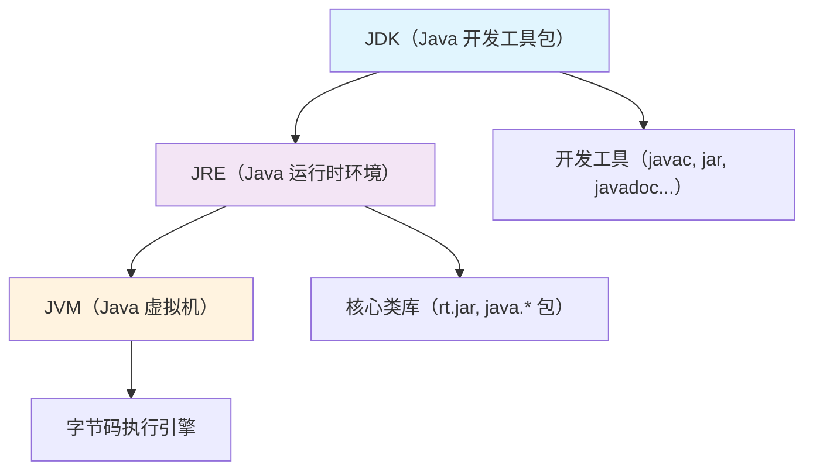
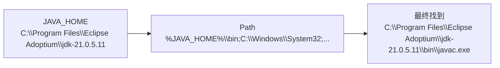

+++
title = "第4章 Java 开发环境完全搭建指南"
weight = 40
date = "2026-03-30T14:33:56.879+08:00"
type = "docs"
description = ""
isCJKLanguage = true
draft = false
+++
# 第四章 Java 开发环境完全搭建指南

> 工欲善其事，必先利其器。在写第一行 Java 代码之前，咱们得先把开发环境整利索了。这一章，手把手带你从零搭起 Java 开发环境，保证你出去能跑 Hello World，回家能调 Bug。

---

## 4.1 JDK 是什么？——JDK、JRE、JVM 三兄弟的关系

在开始安装之前，咱们得先搞清楚 Java 生态里三个最常见的概念：JVM、JRE、JDK。它们仨的关系，就像租房、拎包入住和买房装修的区别。

### 4.1.1 JVM（Java Virtual Machine）：运行 Java 字节码的虚拟机

**JVM** 是整个 Java 世界最核心的概念——**Java 虚拟机**。它的职责是运行 `.class` 文件（字节码）。

**什么是字节码？** 普通的 `.java` 文件经过 `javac` 编译器编译之后，生成的产物就是 `.class` 文件。这个文件不是给 CPU 直接执行的机器码，而是 JVM 能读懂的"中间语言"。JVM 负责把字节码翻译成真正的机器指令。

> 打个比方：字节码就像一份食谱，JVM 是厨师。食谱不是菜，但厨师可以照着食谱把菜做出来。

**JVM 的特点：**
- **跨平台**：一次编写，到处运行（Write Once, Run Anywhere）。只要有 JVM，你的字节码就能跑——不管是 Windows、macOS 还是 Linux。
- **自动内存管理**：有垃圾回收器（GC）帮你清理不再使用的内存，你不用手动 `free`。
- **安全**：JVM 有沙箱机制，防止恶意代码搞破坏。

JVM 是用 C++ 实现的（大部分实现），但对我们 Java 程序员来说，它就是一个"黑箱"，我们只管往里扔字节码，它负责跑出结果。

### 4.1.2 JRE（Java Runtime Environment）：运行时环境，包含 JVM + 核心类库

**JRE** 是**Java 运行时环境**。它包含：
- JVM（用来跑字节码）
- Java 核心类库（即 `rt.jar` / `java.*` 包，比如 `String`、`ArrayList` 这些基础类）

简单来说，JRE = JVM + 核心类库。**如果你只想运行已经编译好的 Java 程序（比如别人给你的 `.jar` 文件），装 JRE 就够了。**

> 还是租房比喻：JRE 就是拎包入住——家具（JVM）和锅碗瓢盆（类库）都给你配好了，你只管用。但你要是想装修（开发），那就不够看了。

### 4.1.3 JDK（Java Development Kit）：开发工具包，包含 JRE + 编译器（javac）+ 工具

**JDK** 是**Java 开发工具包**。它包含：
- JRE（运行时环境）
- `javac` 编译器——把 `.java` 源代码编译成 `.class` 字节码
- `java` 启动器——用来运行字节码
- 大量开发工具：`javadoc`（文档生成器）、`jar`（打包工具）、`jdb`（调试器）、`javap`（反编译器）等

> 这就是"买房+装修"套餐了。JDK 把开发要用到的一切都给你备齐了。

**作为 Java 开发人员，你必须安装 JDK。** JRE 是不够的，因为你没有编译器。

### 4.1.4 图解：JDK > JRE > JVM 的包含关系



> **一句话总结**：JDK 包含 JRE，JRE 包含 JVM。JDK 是开发者的全套工具箱，JRE 是运行程序的必备套餐，JVM 是那个真正干活的虚拟机。

---

## 4.2 在 Windows 上安装 JDK

好，理论讲完了，动手开干！

### 4.2.1 从哪里下载 JDK？

JDK 不是只有 Oracle 一家能提供。实际上，Java 是开源的（2017 年后），有很多不同的发行版（Distribution）。选择很多，但各有各的门道。

#### 4.2.1.1 Oracle 官网——商业授权，注意许可证

下载地址：https://www.oracle.com/java/technologies/downloads/

Oracle JDK 是最"正统"的官方版本，由 Oracle 公司维护。

**优点**：功能最全，最权威，更新最快。
**缺点**：2021 年后，Oracle JDK 对商业用途开始收费（即使免费下载也要注意许可证）。个人学习/开发免费，生产环境商用可能要付费。

> 如果你不确定，就先别用 Oracle 的，用下面免费的。

#### 4.2.1.2 Eclipse Adoptium（Temurin）——免费开源，生产环境推荐

下载地址：https://adoptium.net/

Eclipse Adoptium（项目前身为 AdoptOpenJDK）是由 Eclipse 基金会维护的免费开源 JDK。**目前最推荐用于生产环境的免费 JDK。**

**优点**：
- 完全免费，开源，MIT 许可证
- 提供 HotSpot JVM（和 Oracle JDK 一样的引擎）
- 长期支持版（LTS）稳定可靠
- Windows/macOS/Linux 全平台支持

#### 4.2.1.3 Amazon Corretto——AWS 的 JDK，免费且有长期支持

下载地址：https://aws.amazon.com/corretto/

Amazon Corretto 是亚马逊云服务提供的免费开源 JDK，基于 OpenJDK。

**优点**：
- 免费商用，无需许可证
- 亚马逊提供 8 年的安全更新支持
- 针对云环境做了优化

#### 4.2.1.4 微软的 Microsoft Build of OpenJDK

下载地址：https://learn.microsoft.com/zh-cn/java/openjdk/download

微软维护的 OpenJDK 构建版本，完全免费，支持 Azure 云部署。

**优点**：免费，和 Azure 集成度高，适合在 Azure 上跑 Java 应用。

#### 4.2.1.5 阿里云的 Dragonwell——针对中国开发者优化

下载地址：https://dragonwell-jdk.io/

阿里巴巴开源的 JDK，基于 OpenJDK，针对中国网络环境和电商高并发场景做了深度优化。

**优点**：
- 免费开源
- 内置 Wisp 协程等阿里自研优化
- 国内下载快，镜像支持好

> **选择建议**：初学者/学习用——Eclipse Adoptium（最省心）。生产环境——Eclipse Adoptium 或 Amazon Corretto 都行。中国特色场景——Dragonwell。

本书后续示例以 **Eclipse Adoptium (Temurin)** 为例。

### 4.2.2 安装步骤（以 Adoptium 为例）

**第一步**：打开 https://adoptium.net/，点击 "Download"。

**第二步**：选择版本和平台：
- **Version**：LTS（长期支持版）推荐 **JDK 21** 或 **JDK 17**。LTS 版本更新慢但稳定，不建议追最新非 LTS 版本。
- **Operating System**：Windows
- **Architecture**：x64（大多数电脑是这个）
- **Package Type**：`.msi`（推荐，傻瓜安装）或 `.zip`（解压即用）

**第三步**：点击下载，等待完成。

**第四步**：双击 `.msi` 文件，疯狂点击"下一步（Next）"——安装过程和装普通软件一样。

**第五步**：记住安装路径！默认大概是 `C:\Program Files\Eclipse Adoptium\jdk-21.0.5.xxxxx\`。后面的环境变量配置要用到。

### 4.2.3 安装完成验证：java -version 和 javac -version

安装完成后，**打开一个新的命令行窗口**（敲 `Win + R`，输入 `cmd`，回车），输入以下命令验证：

```bash
java -version
```

如果看到类似下面的输出，说明 Java 运行环境 OK 了：

```
openjdk version "21.0.5" 2024-10-15
OpenJDK Runtime Environment (Temurin-21.0.5+9) (build 21.0.5+9)
OpenJDK 64-Bit Server VM (Temurin-21.0.5+9, mixed mode, sharing)
```

接下来检查编译器：

```bash
javac -version
```

看到类似这个就说明编译器也装好了：

```
javac 21.0.5
```

> **注意**：这里必须打开**新的**命令行窗口！环境变量修改后，旧的窗口不认。

### 4.2.4 常见问题排查：JAVA_HOME 找不到、javac 不识别

**问题一："java" 不是内部或外部命令，也不是可运行的程序**

原因：PATH 环境变量没配好，或者还没生效。

解决：打开新的命令行窗口重试。如果还不行，参考 4.7 节配置环境变量。

**问题二："javac" 找不到，但 "java" 能用**

原因：你装的是 JRE，不是 JDK。JRE 只有运行时，没有编译器。

解决：去下载页重新下载 **JDK**（不是 JRE！）。

**问题三：装了多个 JDK 版本，版本对不上**

原因：PATH 里可能有多个 Java 路径，前面那个优先。

解决：用 `where java` 查看所有 java 程序路径，删掉不想要的。

---

## 4.3 在 macOS / Linux 上安装 JDK

Windows 用户看完上一节可以休息了，现在轮到 Mac 和 Linux 用户登场。

### 4.3.1 macOS 用 Homebrew：brew install openjdk@17

macOS 上最方便的包管理工具是 **Homebrew**。如果你还没装，先去 https://brew.sh/ 安装。

安装完 Homebrew 后，在终端里敲：

```bash
brew install openjdk@17
```

> 这里用 `@17` 指定版本，也可以用 `@21` 装 JDK 21。

安装完成后，Homebrew 会提示你做一件事——把 Java 链接到系统路径：

```bash
# 把你刚装的 JDK 链接到 /usr/local/opt/openjdk
brew link openjdk@17 --force
```

然后验证一下：

```bash
java -version
javac -version
```

都能输出版本号，就大功告成了。

### 4.3.2 Linux 用 apt 或 yum 安装

**Ubuntu / Debian（apt）：**

```bash
# 第一步：更新软件源
sudo apt update

# 第二步：安装 OpenJDK 17
sudo apt install openjdk-17-jdk

# 验证
java -version
javac -version
```

**CentOS / RHEL / Fedora（yum/dnf）：**

```bash
# 安装 OpenJDK 17
sudo yum install java-17-openjdk-devel

# 或者用 dnf
sudo dnf install java-17-openjdk-devel

# 验证
java -version
javac -version
```

> Linux 上 `java` 包可能只装 JRE，如果需要编译器，要装 `java-*-jdk` 或 `java-*-devel` 包（名字因发行版不同略有差异）。

---

## 4.4 集成开发环境（IDE）选择指南——代码在哪里写？

JDK 装好了，Hello World 理论上是能跑了。但总不能拿记事本写代码吧？（能是能，但你很快就会疯掉。）

这时候你需要 **IDE（Integrated Development Environment，集成开发环境）**——把代码编辑器、编译器、调试器、项目管理全部整合在一起的神器。

### 4.4.1 IntelliJ IDEA（Community 免费版）——业界公认最强大的 Java IDE

**IntelliJ IDEA** 由 JetBrains 公司开发，是目前业界公认最强大、最智能的 Java IDE。它的 Community（社区版）是免费开源的，对学习来说完全够用。

下载地址：https://www.jetbrains.com/idea/download/

#### 4.4.1.1 IDEA 的安装与第一个项目创建

**第一步**：下载并安装 IntelliJ IDEA Community 版。

**第二步**：启动 IDEA，点击 "New Project"（新建项目）。

**第三步**：
- Name（项目名）：填 `HelloWorld`
- Language：选 `Java`
- JDK：选你刚才装的那个 JDK（如果没有点 Add JDK 指向你的安装目录）
- 点击 Create

**第四步**：在左侧项目面板，右键 `src` 文件夹 → New → Java Class，类名填 `HelloWorld`。

**第五步**：在编辑器里写代码：

```java
public class HelloWorld {
    public static void main(String[] args) {
        // 用 println 打印到控制台
        System.out.println("Hello, Java!");
    }
}
```

**第六步**：右键编辑器 → Run 'HelloWorld.main()'，或者直接点左侧的绿色三角▶️。

底部控制台（Console）会输出：

```
Hello, Java!
```

恭喜你，Java 之旅正式启航！🎉

#### 4.4.1.2 IDEA 常用快捷键大全

快捷键用熟了，开发效率直接翻倍。以下是 Windows/Linux 快捷键（macOS 把 `Ctrl` 换成 `Cmd`）：

| 快捷键 | 功能 |
|--------|------|
| `Ctrl + D` | 复制当前行（光标在的那一行）到下一行 |
| `Ctrl + Y` | 删除当前行 |
| `Ctrl + /` | 注释/取消注释当前行（加 `//`） |
| `Ctrl + Shift + /` | 块注释 `/* */` |
| `Shift + Shift`（双击 Shift） | 全局搜索类、文件、符号（快速导航神器） |
| `Alt + Enter` | 智能修复/快速修复（出现红线时用这个！） |
| `Ctrl + Alt + L` | 格式化代码（让代码排版整齐） |
| `Ctrl + Space` | 代码补全提示 |
| `Ctrl + Click` | 跳转到定义（按住 Ctrl 点击类名/方法名） |
| `Ctrl + F` | 当前文件内搜索 |
| `Ctrl + R` | 当前文件内替换 |
| `Ctrl + Z` | 撤销 |
| `Ctrl + Shift + Z` | 重做（反撤销） |
| `F2` | 跳转到下一个错误/警告 |
| `Ctrl + G` | 跳转到指定行 |

> **建议**：刚上手不用背，先用 `Alt + Enter` 修复红色错误，`Shift + Shift` 找文件，`Ctrl + D` 复制行——这三个最常用。

#### 4.4.1.3 IDEA 调试技巧：断点调试、变量查看、表达式求值

写代码不怕不会，就怕调不通。IDEA 的调试器是你最好的朋友。

**设置断点**：在代码行号左侧点一下，会出现一个红点。这个红点就是**断点**——程序运行到这里会暂停，等你检查。

**开始调试**：右键 → Debug 'HelloWorld.main()'，或者点虫子🐛图标▶️旁边。

**调试窗口介绍**：
- **Variables（变量）面板**：暂停时能看到当前所有局部变量的值
- **Watches（监视）面板**：你可以手动添加表达式，观察它的值怎么变化
- **Debug Console**：和运行 console 一样，但你现在有控制权了

**调试按钮（从左到右）**：
- ▶️ Resume（恢复运行，到下一个断点停）
- ⏭️ Step Over（跳过当前行，执行下一行）
- ⏺️ Step Into（钻进当前行的方法里看看里面怎么跑的）
- ⏹️ Stop（停止调试）

> **什么时候用调试？** 当你的程序逻辑复杂，不知道哪里出错时，在怀疑的地方打个断点，一步一步看变量怎么变化，比加一百个 `System.out.println` 管用多了。

### 4.4.2 VS Code + Java Extension Pack——轻量级编辑器方案

如果你不喜欢 IDEA 的重量级，也可以用 **VS Code（Visual Studio Code）**——微软出的免费编辑器。

下载地址：https://code.visualstudio.com/

装完 VS Code 后，按 `Ctrl + Shift + X` 打开扩展市场，搜索并安装：

- **Extension Pack for Java**（微软官方出品，一键装齐所有 Java 插件）

安装完后，你就能在 VS Code 里写 Java 了。VS Code 的优点是轻量、打开快，和写前端（HTML/CSS/JS）体验一致。

**适合场景**：习惯了 VS Code 的前端同学，或者电脑配置不高不想装 IDEA 这种"重量级选手"。

**缺点**：对大型 Java 项目的支持不如 IDEA 完善，调试体验也稍逊一筹。

### 4.4.3 Eclipse——老牌开源 IDE

**Eclipse** 是 Java IDE 领域的老前辈，2001 年就出道了，曾经是 Java 开发的首选工具。

下载地址：https://www.eclipse.org/downloads/

**优点**：
- 完全免费开源
- 插件生态极其丰富（虽然现在不如以前繁荣）
- 曾经 Java IDE 霸主地位

**缺点**：
- 界面风格老旧（虽然现在也有新皮肤）
- 对新版 Java 语法支持有时慢半拍
- 配置比 IDEA 繁琐

> 很多老程序员对 Eclipse 有深厚感情，但现在新入门 Java 的同学，**更推荐 IDEA**。

### 4.4.4 NetBeans——Apache 顶级项目，简单易用

**NetBeans** 由 Apache 基金会维护，是另一个老牌开源 IDE。

下载地址：https://netbeans.apache.org/

**优点**：
- 完全免费
- 开箱即用，几乎不需要配置
- 自带可视化界面设计器（拖控件那种）

**缺点**：生态没有 IDEA 活跃，插件也不如 IDEA 丰富。

### 4.4.5 IDE 选择建议：初学者推荐 IntelliJ IDEA Community

| IDE | 费用 | 适合人群 | 评价 |
|-----|------|---------|------|
| **IntelliJ IDEA Community** | 免费 | 初学者、进阶开发者 | ⭐⭐⭐⭐⭐ 强烈推荐，智能程度最高 |
| VS Code + Extension Pack | 免费 | 前端转 Java、轻量级需求 | ⭐⭐⭐ 轻量灵活，但大型项目稍吃力 |
| Eclipse | 免费 | 老程序员、有历史项目 | ⭐⭐⭐ 经典老牌，略显老气 |
| NetBeans | 免费 | 喜欢开箱即用的用户 | ⭐⭐⭐ 简单易用，功能中等 |

**我的建议**：初学者老老实实用 **IntelliJ IDEA Community**。它的代码补全、错误提示、快捷重构能力，会让你的学习体验顺畅很多。

---

## 4.5 不用 IDE 也能写 Java——命令行手动编译运行

有同学问了："我就想先试试，不装 IDE 行不行？"——行！JDK 自带的命令行工具就够用。

### 4.5.1 javac 编译器：把 .java 变成 .class

`javac` 是 Java 编译器（Java Compiler）。它负责把人类能看懂的 `.java` 源代码，翻译成 JVM 能执行的 `.class` 字节码。

**语法**：

```bash
javac 源文件名.java
```

### 4.5.2 java 命令：运行字节码

`java` 是 Java 启动器（Java Launcher）。它负责启动 JVM，加载 `.class` 文件并运行。

**语法**：

```bash
java 类名（不要加 .class 后缀！）
```

### 4.5.3 写一个 Hello World 的完整流程

**第一步**：创建一个文件夹，比如 `D:\myjava`，用记事本（或任何文本编辑器）新建一个文件叫 `HelloWorld.java`。

**第二步**：写入以下代码：

```java
/**
 * 我的第一个 Java 程序
 * 作用：向控制台输出一句话
 */
public class HelloWorld {
    // main 方法：Java 程序的入口
    public static void main(String[] args) {
        // System.out.println 会在控制台打印一行文字
        System.out.println("Hello, Java 世界!");
    }
}
```

**第三步**：打开命令行，进入该目录：

```bash
cd D:\myjava
```

**第四步**：编译：

```bash
javac HelloWorld.java
```

如果没有报错，会在同一目录下生成一个 `HelloWorld.class` 文件。

**第五步**：运行：

```bash
java HelloWorld
```

注意！这里类名是 `HelloWorld`，不是 `HelloWorld.class`。

**输出结果**：

```
Hello, Java 世界!
```

> **恭喜你！** 这是你亲手用命令行编译运行的第一个 Java 程序。整个过程没有任何 IDE 介入，纯粹、干净、原始。你现在理解了 Java 从源码到运行的完整链路：`HelloWorld.java` → (javac) → `HelloWorld.class` → (java) → 屏幕输出。

---

## 4.6 JShell：像 Python 一样交互式玩 Java

### 4.6.1 什么是 REPL？为什么要用 JShell？

在介绍 JShell 之前，先说一个概念：**REPL**。

**REPL** 是 Read-Eval-Print Loop 的缩写，意思是"读取-执行-打印-循环"。这是一种交互式编程环境，你输入一行代码，它立刻执行并给你结果，不用写完整文件，不用编译，所见即所得。

Python 的交互式解释器就是一个经典的 REPL。你敲 `python3` 进入交互环境，然后 `print("Hello")` 直接出结果。

**JShell** 就是 Java 的 REPL！它从 **Java 9** 开始引入，终于让 Java 也拥有了"交互式玩耍"的能力。

> 以前你想试一个语法，得新建文件、编译、运行，烦死。现在直接 `jshell` 进去，想敲啥敲啥。

### 4.6.2 JShell 常用命令

打开命令行，输入 `jshell` 就进入了 JShell 的世界（提示符变成 `jshell>`）。

```bash
jshell
```

**常用 JShell 命令：**

| 命令 | 功能 |
|------|------|
| `/list` | 列出所有你输入过的代码片段 |
| `/edit` | 打开编辑器编辑代码片段 |
| `/save 文件名.jsh` | 把当前会话代码保存到文件 |
| `/open 文件名.jsh` | 打开一个 .jsh 文件 |
| `/exit` | 退出 JShell |
| `/reset` | 重置 JShell 会话（清空所有代码） |
| `/help` | 显示帮助信息 |
| `/vars` | 查看当前定义的所有变量 |

**JShell 简单示例：**

```bash
jshell> int x = 10
x ==> 10

jshell> int y = 20
y ==> 20

jshell> x + y
$3 ==> 30

jshell> String greeting = "你好，Java！"
greeting ==> "你好，Java！"

jshell> System.out.println(greeting)
你好，Java！

jshell> /exit
|  退出
```

注意看：输入 `int x = 10` 后，JShell 直接输出了 `x ==> 10`（`==>` 是 JShell 的输出前缀，表示"结果是"）。不用 `System.out.println`，JShell 自动帮你打印结果。

**JShell 适合场景**：
- 学习 Java 语法时快速试验
- 验证某个算法思路
- 查看某个类的 API 怎么用

**不适合场景**：
- 写正式的项目代码（没有自动保存，断电就消失）
- 调试复杂逻辑（还是得靠 IDE）

---

## 4.7 环境变量配置详解

这是 Windows 用户最常踩坑的地方！很多"javac 找不到"、"java 不是内部命令"的问题，根源都在环境变量。

### 4.7.1 什么是 PATH？为什么要配置 PATH？

**PATH** 是 Windows（和 macOS/Linux）系统的一个**环境变量**。它里面存了一系列目录路径。当你在命令行里敲一个命令（比如 `javac`），操作系统会按顺序去 PATH 里的每个目录找这个可执行文件，找到了就执行。

**举个例子**：你在命令行敲 `javac HelloWorld.java`，操作系统会去 PATH 里列的那些目录一个个找 `javac.exe`，找到第一个就执行。

如果 PATH 里没有 JDK 的 `bin` 目录，你就得**写完整的绝对路径**才能运行 `javac`，否则操作系统根本不知道去哪找它。

> 这就像你查一个人电话，你手里有个通讯录（PATH），上面列了很多人的名字（命令）和电话号码（路径）。如果名字不在通讯录里，你就得手动记下他完整的住址（绝对路径）才能联系到他——太麻烦了。

### 4.7.2 JAVA_HOME 是什么？为什么需要它？

**JAVA_HOME** 是一个**约定俗成的环境变量**（不是系统自动的，需要你设），它的值指向 JDK 的安装根目录。

比如你的 JDK 装在 `C:\Program Files\Eclipse Adoptium\jdk-21.0.5.11\`，
那 `JAVA_HOME` 就应该设成这个路径（不要加 `\bin`）。

**为什么需要 JAVA_HOME？**

很多 Java 工具（Maven、Gradle、Tomcat、IDEA 等）都依赖 `JAVA_HOME` 环境变量来找到 JDK。它们不直接用 PATH，而是去读 `JAVA_HOME` 这个"门牌号"，然后自己加上 `\bin\java` 去调用。

简单说：**PATH 是给命令行用的，`JAVA_HOME` 是给其他 Java 工具用的**。

### 4.7.3 Windows 配置 JAVA_HOME 和 PATH 的步骤

**第一步**：找到 JDK 的安装路径。

打开文件资源管理器，定位到 JDK 安装目录。拿 Adoptium JDK 21 举例：

```
C:\Program Files\Eclipse Adoptium\jdk-21.0.5.11\
```

记住这个路径！后面要用。

**第二步**：打开环境变量设置。

- 右键 **此电脑**（桌面上的） → 属性
- 点击左侧 **高级系统设置**
- 点击底部的 **环境变量（N）...**

**第三步**：在上半部分"用户变量"或下半部分"系统变量"里（都行，推荐用户变量），新建两个变量：

| 变量名 | 变量值 |
|--------|--------|
| `JAVA_HOME` | `C:\Program Files\Eclipse Adoptium\jdk-21.0.5.11`（改成你的实际路径） |
| `Path`（已存在就编辑，不存在就新建） | 在最前面加上 `%JAVA_HOME%\bin` |

**PATH 编辑要点**：
- 不要删掉 Path 里原有的内容！
- 把 `%JAVA_HOME%\bin` **加在最前面**（或者至少加在容易找到的位置）
- 各路径之间用英文分号 `;` 分隔
- `%JAVA_HOME%` 是 Windows 的变量引用语法，等价于把 JAVA_HOME 的值代进去

**设置示意**：



**第四步**：一路点"确定"保存。

**第五步**：**打开一个新的命令行窗口**（关键！），验证：

```bash
echo %JAVA_HOME%
java -version
javac -version
```

三个命令都有正确输出，就说明配置成功了！

### 4.7.4 常见问题：环境变量配置完了 CMD 没反应？——重启 CMD

这是出现频率最高的问题，没有之一。

**为什么新的 CMD 才能用？**

环境变量是在程序启动时读取的。你打开 CMD 的那一刻，Windows 把当时的 PATH 快照给了这个 CMD。之后你再改环境变量，已经打开的 CMD 不会自动刷新——它还在用那份旧快照。

**解决方案**：
1. 关掉所有 CMD 窗口，重新打开一个
2. 如果还不行，**重启电脑**（最彻底的办法）
3. 或者试试 `refreshenv`（如果你装了 Git Bash 或其他工具）

> **友情提示**：配置环境变量时，**不要手抖删掉系统原来的 Path 内容**。很多同学配环境变量时把 Path 全部清空然后只写 JAVA_HOME，结果系统命令（`dir`、`cd` 等）全失灵了，心态当场爆炸。删错东西之前，先备份原来的内容。

---

## 本章小结

本章我们完成了 Java 开发环境从零到一的搭建。回顾一下我们都干了什么：

**1. 搞清楚了 JDK、JRE、JVM 三兄弟的关系**
- JVM 是执行字节码的虚拟机，是 Java 跨平台的核心
- JRE 是运行时环境 = JVM + 核心类库（只能运行，不能开发）
- JDK 是开发工具包 = JRE + 编译器 + 开发工具（既能运行，也能开发）

**2. 安装了 JDK**
- 推荐免费开源的 Eclipse Adoptium（Temurin）JDK
- 学会了在 Windows、macOS、Linux 上安装 JDK 的方法
- 学会了用 `java -version` 和 `javac -version` 验证安装

**3. 选好了 IDE**
- 最推荐 IntelliJ IDEA Community（免费，智能，强大）
- 了解 VS Code、Eclipse、NetBeans 的各自特点

**4. 学会了命令行编译运行**
- 用 `javac` 编译 `.java` → `.class`
- 用 `java` 运行字节码
- 完成了第一个完整的 Hello World

**5. 体验了 JShell 交互式编程**
- 了解了 REPL 的概念
- 学会了用 `/list`、`/save`、`/exit` 等 JShell 命令

**6. 搞定了环境变量配置**
- 理解了 PATH 和 JAVA_HOME 的作用
- 独立完成了 Windows 环境变量配置
- 学会了"重启 CMD"这个万能解决方案

> 下一章，我们将正式开始写代码！数据类型、变量、运算符、控制语句——Java 编程的第一块基石，等你来砌。
