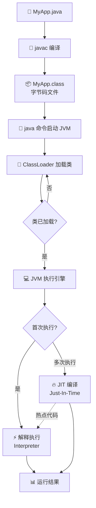
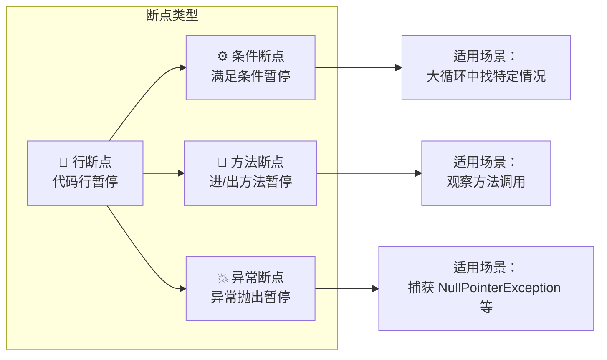

+++
title = "第5章 Java 程序的运行与调试"
weight = 50
date = "2026-03-30T14:33:56.880+08:00"
type = "docs"
description = ""
isCJKLanguage = true
draft = false
+++
# 第五章 Java 程序的运行与调试

> 把代码写出来只是第一步，让它跑起来、跑得对、跑得快，才是真正的本事。本章我们从 JVM 的运行原理讲起，再到 IDE 里如何和 bug 斗智斗勇，最后介绍几个命令行神器。准备好了吗？Let's go！

---

## 5.1 Java 程序是怎么跑起来的？

你有没有想过，当你敲下 `java MyApp` 的一瞬间，背后到底发生了什么？Java 之所以能实现"一次编写，到处运行"，靠的就是 **JVM（Java Virtual Machine，Java 虚拟机）** 这个中间层。源代码（.java）经过编译变成字节码（.class），然后由 JVM 执行——JVM 就是那个既懂字节码又能跟操作系统打交道的"翻译官"。

### 5.1.1 从 .java 到 .class：编译阶段（javac）

当你写好一个 `.java` 文件后，需要用 **javac**（Java Compiler）把它编译成 `.class` 文件。`.class` 文件里装的不是机器码，而是 **字节码（Bytecode）**——一种介于源代码和机器码之间的中间表示。

```java
// HelloWorld.java
public class HelloWorld {
    public static void main(String[] args) {
        System.out.println("Hello, Java!");
    }
}
```

编译命令如下：

```bash
javac HelloWorld.java   # 编译后生成 HelloWorld.class
```

> **javac 干了什么？**
> - 解析源代码，生成抽象语法树（AST）
> - 进行语义分析（类型检查、常量折叠等）
> - 生成字节码指令，写入 .class 文件
> - 字节码不是给 CPU 直接执行的，而是给 JVM 看的"操作手册"

生成的 `.class` 文件你可以用 `javap -c` 反编译看看里面长什么样：

```bash
javap -c HelloWorld
```

输出大概长这样：

```
Compiled from "HelloWorld.java"
public class HelloWorld {
  public HelloWorld();
    Code:
       0: aload_0
       1: invokespecial #1
       4: return

  public static void main(java.lang.String[]);
    Code:
       0: getstatic     #2
       3: ldc           #3
       5: invokevirtual #4
       8: return
}
```

看不懂？没关系，JVM 认识就行。

### 5.1.2 从 .class 到运行：类加载器（ClassLoader）的介入

编译好的 `.class` 文件只是静静躺在磁盘上的一堆字节。想要运行它，得先把它的内容加载到内存里——这个工作就交给 **ClassLoader（类加载器）**。

Java 有三种默认的类加载器：

- **Bootstrap ClassLoader**：最顶层的加载器，负责加载 Java 核心类库（`java.lang.*` 等），它是用 C++ 实现的，不是 Java 类
- **Extension ClassLoader**（Platform ClassLoader）：负责加载 `jre/lib/ext` 目录下的扩展类
- **App ClassLoader**（System ClassLoader）：负责加载应用程序 `classpath` 下的类

这三个加载器形成了经典的 **双亲委托模型（Parent Delegation Model）**：

```
App ClassLoader
     ↓ 委托
Extension ClassLoader
     ↓ 委托
Bootstrap ClassLoader
```

当你尝试加载一个类时，加载器会先把这个任务委托给父加载器，只有父加载器找不到时才自己来。这就是为什么你写的 `java.lang.String` 永远用的是 JDK 自带的那个——因为它早就被 Bootstrap ClassLoader 加载好了。

```java
public class ClassLoaderDemo {
    public static void main(String[] args) {
        // 看看当前类是谁加载的
        ClassLoader cl = ClassLoaderDemo.class.getClassLoader();
        System.out.println("当前类的加载器: " + cl);
        System.out.println("父加载器: " + cl.getParent());
        System.out.println("祖父加载器: " + cl.getParent().getParent());
    }
}
```

输出：

```
当前类的加载器: jdk.internal.loader.ClassLoaders$AppClassLoader@3fee733d
父加载器: jdk.internal.loader.ClassLoaders$PlatformClassLoader@3d4eac69
祖父加载器: null   ← Bootstrap ClassLoader 是用 C++ 实现的，所以返回 null
```

### 5.1.3 JVM 执行字节码的完整流程图

从你敲下 `java MyApp` 到程序输出结果，中间经历了漫长的旅程。下面这张图展示了整个流程：



**流程简述：**

1. **启动 JVM**：JVM 先创建一个主线程，然后找到你指定的主类（包含 `main` 方法）
2. **加载类**：ClassLoader 将主类及其依赖的类一个个加载到内存中
3. **执行字节码**：执行引擎（Execution Engine）逐条解释执行字节码指令，遇到"热点代码"就触发 JIT 编译
4. **输出结果**：程序运行，输出结果，然后正常退出（或崩溃 😱）

### 5.1.4 解释执行 vs 编译执行（JIT）

JVM 执行字节码有两种模式，理解它们是进阶的必修课。

**解释执行（Interpretation）**：JVM 逐条读取字节码指令，翻译成机器码后立即执行。就像同声传译——说一句翻一句，不用等待。

**编译执行（JIT，Just-In-Time）**：JVM 在运行时分析代码，发现某些方法被反复调用（"热点代码"），就把整个方法一次性编译成机器码并缓存起来，下次直接执行，不用再解释。

> **热点代码（Hot Spot）**：被频繁执行的代码，通常是循环体或被调用次数很多的短方法。

HotSpot JVM（Oracle 官方默认的 JVM）内置了两种 JIT 编译器：

| 编译器 | 用途 | 编译速度 | 生成代码质量 |
|--------|------|----------|--------------|
| **C1（Client Compiler）** | 客户端模式，追求启动速度 | 快 | 较保守 |
| **C2（Server Compiler）** | 服务端模式，追求长期运行性能 | 慢 | 激进优化 |

在服务端模式下，JVM 会先用 C1 快速编译热点代码，然后随着运行时间增长切到 C2 做更激进的优化。这就是著名的 **分层编译（Tiered Compilation）**。

```java
public class JitDemo {
    // 演示 JIT 编译的效果
    public static long sum(long n) {
        long result = 0;
        for (long i = 0; i < n; i++) {
            result += i;
        }
        return result;
    }

    public static void main(String[] args) {
        // 先预热，让 JIT 有机会编译
        for (int i = 0; i < 10000; i++) {
            sum(1_000_000);
        }

        long start = System.nanoTime();
        for (int i = 0; i < 1000; i++) {
            sum(1_000_000);
        }
        long end = System.nanoTime();

        System.out.println("总耗时: " + (end - start) / 1_000_000 + " ms");
        // JIT 编译后，第二次循环会快很多
    }
}
```

---

## 5.2 IDE 中的调试技巧——程序出错了怎么找 bug？

> "代码跑通了，天才！代码跑不通，天敌——bug。" ——某位不愿透露姓名的程序员

调试（Debug）就是和 bug 斗智斗勇的过程。好的调试技巧能让你事半功倍，从"大海捞针"变成"精准狙击"。

### 5.2.1 断点（Breakpoint）：让程序停在指定位置

**断点**是调试的第一步。你告诉 IDE："在这里停下来，让我看看发生了什么。"

#### 5.2.1.1 行断点、条件断点、方法断点、异常断点

**行断点（Line Breakpoint）**：最常见的断点，在某一行代码处停下。IDEA/VS Code 里单击行号左侧即可设置。

```
📍 行断点示意图：
   1 | public class DebugDemo {
   2 |     public static void main(String[] args) {
   3 |         int x = 10;         ← ← ← ← [●] ← 行断点在这里！
   4 |         int y = 20;
   5 |         int z = x + y;
   6 |         System.out.println(z);
   7 |     }
   8 | }
```

**条件断点（Conditional Breakpoint）**：不是每次都停，而是满足特定条件才停。右键断点 → 设置条件。

```java
public class DebugDemo {
    public static void main(String[] args) {
        for (int i = 0; i < 100; i++) {
            process(i);  // 只想在 i == 50 时停下来？
        }
    }

    static void process(int i) {
        System.out.println("处理: " + i);
    }
}
```

右键断点，设置条件为 `i == 50`，程序就只在 `i` 等于 50 时暂停，其他时候呼啸而过。

**方法断点（Method Breakpoint）**：打在方法声明行，进入或退出方法时都会停。适合想观察某个方法的输入输出但不想一行行单步跟的场景。

**异常断点（Exception Breakpoint）**：不打在代码行上，而是设置"当抛出某种异常时停下"。在 IDEA 中打开 Breakpoints 窗口（Ctrl+Shift+F8），勾选 "Any exception" 或指定异常类型。



### 5.2.2 单步执行：逐行调试（Step Over、Step Into、Step Out）

断点停下来之后，你需要一步一步地走查代码。单步执行有三个核心命令：

| 操作 | 快捷键（IDEA） | 作用 |
|------|---------------|------|
| **Step Over**（跳过） | F8 | 执行当前行，然后移动到下一行。如果当前行是方法调用，**不会**进入方法内部 |
| **Step Into**（进入） | F7 | 如果当前行是方法调用，**会**进入方法内部，一行行看里面发生了什么 |
| **Step Out**（跳出） | Shift+F8 | 跳出当前方法，返回调用处 |

```java
public class StepDemo {
    public static void main(String[] args) {
        int a = 10;
        int b = calculateSquare(a);  // ← 在这行停住
        System.out.println("结果: " + b);  // ← Step Over 后跳到这里
    }

    static int calculateSquare(int n) {
        int result = n * n;  // ← Step Into 后进入这里
        return result;        // ← Step Out 后跳出回到 main
    }
}
```

> 💡 **小技巧**：如果你在某行代码上，不想 Step Into 某个方法（比如 `System.out.println`），但想继续单步执行，可以用 **Force Step Into**（Alt+Shift+F7）强制进入。

### 5.2.3 变量查看：Watches 窗口，实时监控变量值

程序停在断点处时，IDE 的 **Variables（变量）窗口**会自动显示当前作用域内的所有变量及其当前值。你可以盯着它们看，看它们是怎么变化的。

```
📍 调试界面示意图：
┌─────────────────────────────────────────┐
│ Variables                               │
│  ├─ args: String[0] {}                  │
│  ├─ i: int = 50        ← 看到 i 是 50   │
│  ├─ list: ArrayList    ← 展开可以看到   │
│  │     ├─ [0]: 10           内部元素    │
│  │     ├─ [1]: 20                         │
│  │     └─ [2]: 30                         │
│  └─ map: HashMap                         │
└─────────────────────────────────────────┘
```

如果你想持续关注某个表达式的值，可以把它加到 **Watches（监视）窗口**里。比如你怀疑 `list.size() > 3` 会出问题，就把它加进去，它会实时显示 `true` 或 `false`。

```java
public class WatchDemo {
    public static void main(String[] args) {
        List<String> fruits = new ArrayList<>();
        fruits.add("苹果");
        fruits.add("香蕉");
        fruits.add("樱桃");

        // 断点停在这里
        for (String fruit : fruits) {
            System.out.println(fruit);
        }
    }
}
```

右键变量 → "Add to Watches"，你就能看到 `fruits.size()` 永远是 `3`。

### 5.2.4 表达式求值：在调试过程中执行任意代码

在调试状态下，IDE 提供了一个**计算器**——你可以在任意时刻输入任意表达式，JVM 会立刻帮你算出来并显示。这就是 **Evaluate Expression**（IDEA 中是 Alt+F8）。

```java
public class EvalDemo {
    public static void main(String[] args) {
        int x = 100;
        int y = 200;
        int z = x + y;  // ← 断点停在这里

        String msg = "Hello";
        // 在 Evaluate Expression 里输入 msg.toUpperCase()
        // 会立即得到 "HELLO"
    }
}
```

> 这个功能特别适合：当你在调试时，突然想验证一个数学公式，或者想临时构造一个值看看后续代码的反应，而不用重启程序改代码。

### 5.2.5 回退执行（Drop Frame）：回到上一个方法调用

这是 IDEA 里一个非常强大的功能！当你 Step Into 了一个方法，一路跟进去，发现走错了（比如不该进这个方法），通常的做法是让程序跑完再重来。

但 **Drop Frame** 允许你"反悔"——把当前栈帧（Stack Frame）从调用栈上"扔掉"，然后退回到上一个方法调用处，就像时间倒流一样。

```java
public class DropFrameDemo {
    public static void main(String[] args) {
        System.out.println("A");
        methodA();  // Step Into 后发现走错了？
        System.out.println("D");
    }

    static void methodA() {
        System.out.println("B");
        methodB();
        System.out.println("C");
    }

    static void methodB() {
        System.out.println("在 methodB 里");
        // 突然不想执行了，想回去
    }
}
```

在 IDEA 的 Debug 窗口中，右键当前栈帧 → **Drop Frame**，你会看到程序"回到"了 `methodA()` 调用 `methodB()` 的那一行，`methodB` 里已经执行的代码就当没发生过。

> ⚠️ **注意**：Drop Frame 只是把栈帧弹出，并不改变堆（Heap）中的对象状态。如果你已经在 methodB 里修改了某个对象的属性，那些修改是回不去的。

---

## 5.3 命令行调试工具

IDE 调试虽然方便，但有些服务器环境没有图形界面，或者你想做一些自动化脚本，这时候 JDK 自带的命令行工具就派上用场了。它们低调但极其强大。

### 5.3.1 jdb：Java 调试器的基本使用

**jdb** 是 JDK 自带的命令行调试器，类似于 IDE 调试器的文本版。虽然不如 IDE 直观，但在没有图形界面的服务器上，它是你的救命稻草。

```bash
# 首先用 -agentlib:jdwp 启动你的 Java 程序
# jdwp=Java Debug Wire Protocol，JDWP 是 JVM 调试通信协议
java -agentlib:jdwp=transport=dt_socket,server=y,suspend=y,address=5005 MyApp

# 然后在另一个终端启动 jdb 连接到它
jdb -attach 5005
```

jdb 常用命令：

| 命令 | 作用 |
|------|------|
| `stop at 类:行号` | 在指定行设置断点 |
| `stop in 类:方法` | 在指定方法入口设置断点 |
| `cont` | 继续执行（类似 IDE 的 Resume） |
| `step` | 单步执行（相当于 Step Into） |
| `next` | 越过执行（相当于 Step Over） |
| `locals` | 显示当前方法的局部变量 |
| `print 变量` | 打印变量值 |
| `watch 类.字段` | 监视字段变化 |
| `quit` | 退出 jdb |

```java
// DebugTarget.java
public class DebugTarget {
    public static void main(String[] args) {
        int count = 0;
        for (int i = 1; i <= 5; i++) {
            count += i;
        }
        System.out.println("总和: " + count);
    }
}
```

使用 jdb 调试的完整流程：

```bash
# 终端1：启动带调试端口的 Java 程序（suspend=y 表示等待 jdb 连接）
java -agentlib:jdwp=transport=dt_socket,server=y,suspend=y,address=5005 DebugTarget

# 终端2：连接 jdb
jdb -attach 5005

# jdb 交互界面：
jdb> stop at DebugTarget:5   # 在第5行设断点
jdb> cont                    # 运行到断点
jdb> locals                  # 查看局部变量
jdb> print count             # 打印 count 的值
jdb> step                    # 单步执行
jdb> cont                    # 继续运行
```

### 5.3.2 jconsole：监控 JVM 状态的图形化工具

**jconsole** 是 JDK 自带的图形化 JVM 监控工具，可以实时查看内存使用、线程数、类加载情况、CPU 使用率等。

```bash
# 直接启动 jconsole，会弹出一个图形界面让你选择要监控的 Java 进程
jconsole
```

或者指定进程 ID：

```bash
jconsole <pid>
```

> 如果你在 Linux 服务器上，可以加 `-J-Djava.awt.headless=true` 参数让它在无图形界面环境下运行，然后通过 X11 转发到本地查看。

jconsole 的几个核心标签页：

- **概览**：内存、线程、类和 CPU 的综合仪表盘
- **内存**：堆内存和非堆内存的使用情况，类似 VisualVM 的内存图表
- **线程**：所有活跃线程的列表，以及是否有死锁（检测结果会直接显示"未检测到死锁"）
- **类**：已加载类的数量和总数量
- **VM 概要**：JVM 的基本信息（堆大小、垃圾收集器、Java 版本等）

### 5.3.3 jvisualvm：性能分析和堆内存查看工具

**jvisualvm**（VisualVM）是功能最全面的 JDK 可视化工具，比 jconsole 更强大，可以做性能分析（Profiler）、抓取堆转储（Heap Dump）、查看线程转储（Thread Dump）等。

```bash
jvisualvm
```

启动后界面中会列出所有本地运行的 Java 进程，点击任意一个即可监控。

jvisualvm 的核心功能：

- **监视**：CPU、堆、类、线程的实时数据
- **线程**：和 jconsole 类似的线程视图，但界面更友好
- **抽样器**：对 CPU 和内存进行采样分析，找出消耗最大的方法
- **堆转储**：点击"堆 Dump"可以生成 `.hprof` 文件，分析哪些对象占用了最多内存

```java
// 生成堆转储文件后，可以用 jvisualvm 打开查看
// 或者用其他工具如 MAT（Memory Analyzer Tool）分析
```

### 5.3.4 jstat：查看 GC 统计信息

**jstat** 是查看 JVM 统计信息的利器，特别适合观察垃圾回收（GC）的行为。你不需要图形界面，一行命令就能看到 GC 发生了什么。

```bash
# 查看所有 GC 统计信息，1000ms 刷新一次，共刷新 5 次
jstat -gc <pid> 1000 5
```

输出示例：

```
S0C    S1C    S0U    S1U    EC       EU       OC       OU       MC     MU    CCSC   CCSU   YGC     YGCT    FGC    FGCT    CGC    CGCT     GCT
8704.0 8704.0 0.0    0.0    69888.0  5120.0   174784.0 0.0     4864.0  4492.8  512.0  444.3   0       0.000   0       0.000   0       0.000    0.000
```

各列含义：

| 列 | 含义 |
|----|------|
| S0C/S1C | Survivor 0/1 区的容量（KB） |
| S0U/S1U | Survivor 0/1 区的使用量（KB） |
| EC/EU | Eden 区的容量/使用量 |
| OC/OU | Old 区的容量/使用量 |
| MC/MU | Metaspace（元空间）的容量/使用量 |
| YGC/YGCT | Young GC（年轻代垃圾回收）的次数/总耗时 |
| FGC/FGCT | Full GC 的次数/总耗时 |

> 💡 **调优小贴士**：如果发现 `FGC` 次数很多但 `FGCT` 很大，说明 Full GC 耗时长，可能需要调整堆大小或优化 GC 参数。

常用 jstat 命令：

```bash
# 查看类加载统计
jstat -class <pid>

# 查看编译统计（看看 JIT 编译了什么）
jstat -compiler <pid>

# 查看 GC 容量
jstat -gccapacity <pid>
```

### 5.3.5 jmap：查看堆内存快照

**jmap**（Memory Map）用来生成堆内存快照（Heap Dump）和查看内存分配情况。当程序内存占用异常、疑似内存泄漏时，堆转储分析是必修课。

```bash
# 生成堆转储文件（.hprof）
jmap -dump:format=b,file=heap.hprof <pid>
```

生成的 `heap.hprof` 文件可以用 jvisualvm 或 Eclipse MAT 打开分析。

> ⚠️ 生成大型堆转储可能会导致 JVM 暂停（Stop-The-World），在生产环境要谨慎使用，可以加上 `-F` 强制执行。

```bash
# 查看堆内存概要（各类对象占用情况）
jmap -heap <pid>

# 查看类的直方图（哪些类实例最多）
jmap -histo <pid>

# 查看类加载器信息
jmap -clstats <pid>
```

`-histo` 输出示例（已简化）：

```
 num     #instances         #bytes  class name
----------------------------------------------
   1:          12345       8901234  [Ljava.lang.Object;
   2:           9876       1234567  java.lang.String
   3:           5432        654321  java.util.ArrayList
```

如果发现某个类实例数量异常多（比如 `String` 有上百万个），很可能就是问题所在。

---

## 本章小结

本章我们从宏观到微观，全面探索了 Java 程序的运行与调试机制：

1. **Java 程序是怎么跑起来的**：
   - `.java` 文件通过 `javac` 编译成 `.class` 字节码文件
   - ClassLoader 按双亲委托模型将类加载到内存
   - JVM 执行引擎通过解释执行和 JIT 编译两种方式运行字节码
   - 分层编译让程序在启动速度和长期性能之间取得平衡

2. **IDE 调试技巧**：
   - 行断点、条件断点、方法断点、异常断点——不同场景用不同断点
   - Step Over / Step Into / Step Out 三个单步命令走遍代码
   - Variables 和 Watches 窗口实时监控变量状态
   - Evaluate Expression 让你在调试时做"临时实验"
   - Drop Frame 让你在走错路时"反悔重来"

3. **命令行工具**：
   - `jdb`：文本版调试器，适合无图形界面环境
   - `jconsole`：JVM 状态监控，图形化界面
   - `jvisualvm`：性能分析和堆内存查看，功能最全
   - `jstat`：GC 统计信息，适合调优分析
   - `jmap`：堆转储和内存分析，排查内存问题的神器

调试是一场与 bug 的博弈。工具只是武器，思路才是战术。多用，多练，多踩坑——每一个你亲手解决的 bug，都是你程序员生涯的一枚勋章。祝你在 debug 的道路上永不言弃，bug 终将被你绳之以法！ 🔍
