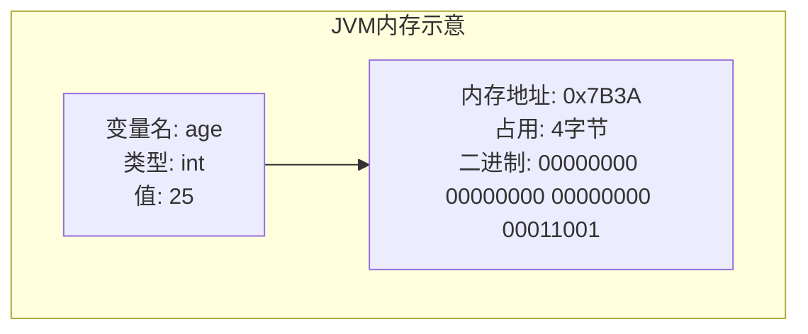
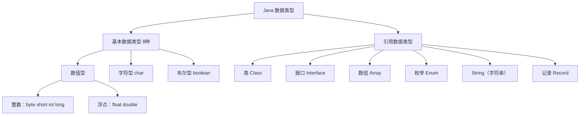
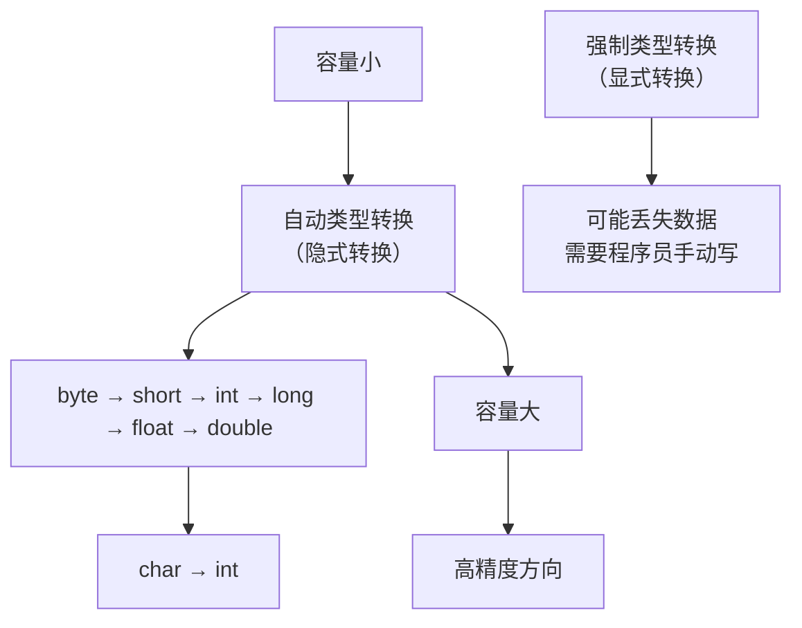
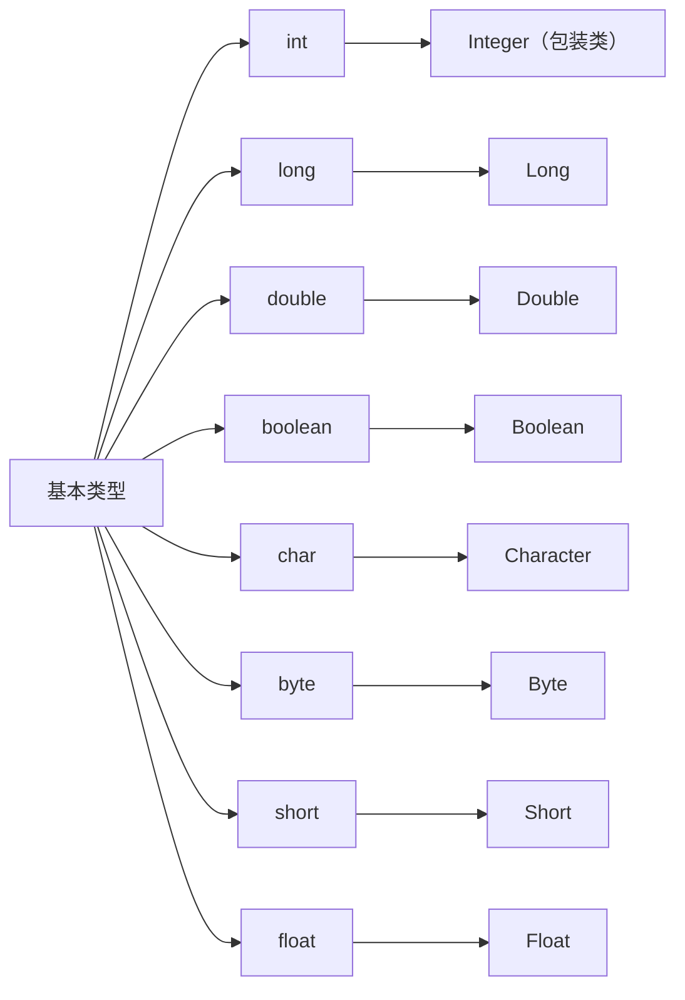
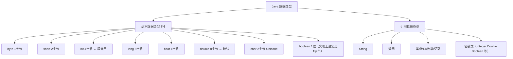

+++
title = "第7章 变量与数据类型——Java 的积木"
weight = 70
date = "2026-03-30T14:33:56.883+08:00"
type = "docs"
description = ""
isCJKLanguage = true
draft = false
+++
# 第七章 变量与数据类型——Java 的积木

> 🎯 本章目标：弄懂变量是什么、Java 有哪些数据类型、它们在内存里长什么样，以及如何让数据"变身"。

想象一下，你有一堆积木（数据），但每块积木都需要一个标签（变量名），告诉你里面装的是什么。Java 里的变量，就是你在程序世界中给数据贴的**名字标签**。没有变量，你的程序就是一团混沌的二进制乱码，连自己写的代码都看不懂。

本章我们从变量出发，逐步拆解 Java 的数据类型体系，从最小的 `byte` 到庞大的对象引用，从内存布局到类型转换——带你把 Java 的"积木"一块块摸透。

---

## 7.1 变量是什么？——给数据起个名字

### 7.1.1 变量的声明、初始化、使用

**变量**（Variable），简单说就是程序中用来**存储数据**的一块内存空间，并且它有一个**名字**，方便我们在代码中引用它。

打个比方：变量就像宿舍楼里的**储物柜**。储物柜本身大小固定（类型），柜子上贴着学号（变量名），里面放着你的东西（值）。

在 Java 中，使用变量分三步走：**声明 → 初始化 → 使用**。

```java
public class VariableDemo {
    public static void main(String[] args) {
        // 第一步：声明——告诉编译器"我这里要放一个整数"
        int age;

        // 第二步：初始化——给变量赋值，也就是往柜子里放东西
        age = 25;

        // 也可以一步到位：声明 + 初始化
        String name = "阿花";

        // 第三步：使用——在代码中引用这个变量
        System.out.println("大家好，我叫" + name + "，今年" + age + "岁！");
    }
}
```

运行结果：

```
大家好，我叫阿花，今年25岁！
```

> **⚠️ 注意**：Java 是强类型语言，变量声明时必须指定**类型**。这就像每个储物柜出厂时就定好了尺寸，不能随便塞东西进去。你不能把一个字符串塞进 `int` 类型的柜子里，编译器会毫不留情地报错。

#### 变量的命名规范

变量名不是你想怎么起就怎么起的，Java 有一套命名规则（Identifier，标识符）：

```java
public class NamingRules {
    public static void main(String[] args) {
        // ✅ 合法的命名
        int age = 18;            // 驼峰命名法（小写开头）
        String userName = "小明"; // 多个单词时从第二个单词开始首字母大写
        double $price = 99.9;    // 可以用 $ 开头（但不推荐）
        int _count = 10;         // 可以用 _ 开头（但不推荐）

        // ❌ 非法的命名（编译器直接报错）
        // int 1stPlace = 1;     // 不能以数字开头
        // int my-age = 100;     // 不能用减号
        // int class = "语文";   // 不能用 Java 保留字（如 class、int、void 等）
    }
}
```

Java 保留字（Reserved Words）列表：abstract, assert, boolean, break, byte, case, catch, char, class, const, continue, default, do, double, else, enum, extends, final, finally, float, for, goto, if, implements, import, instanceof, int, interface, long, native, new, package, private, protected, public, return, short, static, strictfp, super, switch, synchronized, this, throw, throws, transient, try, void, volatile, while（加粗的是你会在数据类型章节频繁遇到的）。

### 7.1.2 变量的本质：内存中的一块空间

从底层来看，变量究竟是什么？

**变量 = 内存中一块连续空间的「名字」**。当你声明 `int age = 25;` 时，JVM（Java 虚拟机）做了以下事情：

1. 在内存中**划分**出一块 4 字节（32 位）的空间
2. 给这块空间起了个名字叫 `age`
3. 把整数值 `25` 的二进制表示写进这块空间



#### 变量的三种类型

根据变量声明的位置和方式，Java 中的变量分为三类：

```java
public class VariableTypes {
    // 1. 成员变量（Instance Variable）——属于对象，放在堆里
    String instanceVar = "我是成员变量";

    // 2. 类变量（Class Variable）——用 static 修饰，属于类，放在方法区
    static int classVar = 100;

    public void method() {
        // 3. 局部变量（Local Variable）——在方法里声明，放在栈里
        int localVar = 42;
        System.out.println("局部变量：" + localVar);
    }

    public static void main(String[] args) {
        VariableTypes obj = new VariableTypes();
        obj.method();
        System.out.println("成员变量：" + obj.instanceVar);
        System.out.println("类变量：" + classVar); // 可直接通过类名访问
    }
}
```

| 变量类型 | 声明位置 | 关键字 | 存储位置 | 生命周期 |
|---------|---------|--------|---------|---------|
| 局部变量 | 方法或代码块内部 | 无 | 栈（Stack） | 方法/代码块执行完毕即销毁 |
| 成员变量 | 类内部、方法外部 | 无 | 堆（Heap） | 对象存在则存在 |
| 类变量 | 类内部、方法外部 | static | 方法区（Method Area） | 程序运行期间一直存在 |

> 💡 **小知识**：为什么局部变量必须先赋值再使用，而成员变量可以不用？这是因为成员变量有**默认值**（default value），但局部变量没有。如果你声明了一个局部变量却没初始化，编译器会报错——这是 Java 在帮你避免低级错误。

```java
public class DefaultValues {
    // 成员变量——有默认值，不用初始化也能编译
    int defaultInt;        // 默认值：0
    double defaultDouble;  // 默认值：0.0
    boolean defaultBool;   // 默认值：false
    String defaultRef;     // 默认值：null（引用类型的默认值都是 null）

    public static void main(String[] args) {
        DefaultValues obj = new DefaultValues();
        System.out.println("整数默认值：" + obj.defaultInt);
        System.out.println("字符串默认值：" + obj.defaultRef);
        // 局部变量——不初始化直接使用，编译器会报错！
        // int localVar;
        // System.out.println(localVar); // ❌ 编译错误：variable localVar might not have been initialized
    }
}
```

---

## 7.2 八种基本数据类型——Java 世界的基础材料

Java 的数据类型分为两大阵营：**基本数据类型**（Primitive Type）和**引用数据类型**（Reference Type）。基本数据类型是 Java 语言内置的、最基础的数据类型，一共**8 种**，它们就像是乐高积木里最原始的那几种形状——简单、紧凑、直接。

下面这张图展示了 Java 数据类型的全貌：



### 7.2.1 整数家族：byte、short、int、long

整数家族用来存储没有小数部分的数值，分四种，它们就像四个大小不同的收纳箱：

```java
public class IntegerTypes {
    public static void main(String[] args) {
        // byte：最小的整数柜子，8位（1字节），范围 -128 ~ 127
        byte level = 100;
        System.out.println("byte 占用：" + Byte.BYTES + " 字节，范围：" + Byte.MIN_VALUE + " ~ " + Byte.MAX_VALUE);

        // short：比 byte 大一点，16位（2字节），范围 -32768 ~ 32767
        short temperature = -50;
        System.out.println("short 占用：" + Short.BYTES + " 字节，范围：" + Short.MIN_VALUE + " ~ " + Short.MAX_VALUE);

        // int：最常用的整数，32位（4字节），范围约 ±21亿
        int population = 1400000000;
        System.out.println("int 占用：" + Integer.BYTES + " 字节，范围：" + Integer.MIN_VALUE + " ~ " + Integer.MAX_VALUE);

        // long：超大整数，64位（8字节），范围超级大
        long galaxyStars = 4000000000000L; // 注意：long 型常量要在数字后面加 L 或 l
        System.out.println("long 占用：" + Long.BYTES + " 字节，范围：" + Long.MIN_VALUE + " ~ " + Long.MAX_VALUE);
    }
}
```

运行结果：

```
byte 占用：1 字节，范围：-128 ~ 127
short 占用：2 字节，范围：-32768 ~ 32767
int 占用：4 字节，范围：-2147483648 ~ 2147483647
long 占用：8 字节，范围：-9223372036854775808 ~ 9223372036854775807
```

> 💡 **什么时候用哪个？**
> - `byte`：处理网络传输、文件读写等**原始字节**数据
> - `short`：历史兼容或内存敏感场景（现在很少用了）
> - `int`：**日常开发的首选**，99% 的整数场景用它就够了
> - `long`：当数字超出 21 亿时（比如统计巨大数据集的时间戳、数据库 ID 等）

#### 整数的进制表示

Java 支持四种进制的整数字面量：

```java
public class NumberBases {
    public static void main(String[] args) {
        int decimal  = 42;        // 十进制（默认）
        int binary   = 0b101010;  // 二进制（0b 开头）
        int octal    = 0o52;      // 八进制（0o 开头，字母 o 大小写均可）
        int hex      = 0x2A;      // 十六进制（0x 开头）

        System.out.println("十进制 42 = " + decimal);
        System.out.println("二进制 0b101010 = " + decimal);  // 输出 42
        System.out.println("八进制 0o52 = " + decimal);     // 输出 42
        System.out.println("十六进制 0x2A = " + decimal);   // 输出 42
    }
}
```

### 7.2.2 浮点家族：float、double

浮点数用来存储带小数部分的数值，比如 `3.14159`、`-0.25` 等。浮点家族有两个成员：

```java
public class FloatingPointTypes {
    public static void main(String[] args) {
        // float：单精度，32位（4字节）
        // 注意：float 型常量要在数字后面加 F 或 f
        float pi = 3.14F;
        System.out.println("float 占用：" + Float.BYTES + " 字节");
        System.out.println("float 精度：" + Float.SIZE + " 位");
        System.out.println("float 范围：" + Float.MIN_VALUE + " ~ " + Float.MAX_VALUE);

        System.out.println("---");

        // double：双精度，64位（8字节），Java 默认的浮点类型
        double e = 2.718281828;
        System.out.println("double 占用：" + Double.BYTES + " 字节");
        System.out.println("double 精度：" + Double.SIZE + " 位");
        System.out.println("double 范围：" + Double.MIN_VALUE + " ~ " + Double.MAX_VALUE);
    }
}
```

> ⚠️ **精度陷阱**：浮点数是近似值，不是精确值！看这个经典例子：

```java
public class FloatPrecision {
    public static void main(String[] args) {
        double a = 0.1;
        double b = 0.2;
        System.out.println("0.1 + 0.2 = " + (a + b)); // 输出 0.30000000000000004
        // 为什么会这样？因为 0.1 和 0.2 在二进制中是无法精确表示的无限循环小数！
    }
}
```

> 如果你需要**精确计算**（比如金融场景），不要用 `float`/`double`，要用 `java.math.BigDecimal`：

```java
import java.math.BigDecimal;

public class BigDecimalDemo {
    public static void main(String[] args) {
        BigDecimal a = new BigDecimal("0.1");
        BigDecimal b = new BigDecimal("0.2");
        System.out.println("精确计算：0.1 + 0.2 = " + a.add(b)); // 输出 0.3
    }
}
```

### 7.2.3 字符类型：char

`char`（Character，字符）用于存储**单个字符**，占 16 位（2 字节），使用的是 **Unicode 字符集**。这意味着它可以表示中文、英文、日文、emoji 等各种字符——从各国的文字到各种符号统统拿下。

```java
public class CharType {
    public static void main(String[] args) {
        // 用单引号声明字符
        char letterA = 'A';
        char chinese = '中';
        char emoji = '\uD83D\uDE00'; // Unicode 表示法：😊

        System.out.println("英文字符：" + letterA);
        System.out.println("中文字符：" + chinese);
        System.out.println("emoji：" + emoji);
        System.out.println("char 默认值：" + Character.MIN_VALUE + "（空字符）");

        // char 本质上存的是 Unicode 码点（整数）
        char c1 = 65;  // ASCII 65 = 'A'
        char c2 = 20013; // 中文 Unicode 码点："中"
        System.out.println("Unicode 65 对应字符：" + c1);
        System.out.println("Unicode 20013 对应字符：" + c2);
    }
}
```

### 7.2.4 布尔类型：boolean

`boolean` 简单到不能再简单——它只有两个可能的值：`true`（真）和 `false`（假）。1 位就够了，但实际 JVM 实现中通常用 1 字节或更复杂的结构存储。

```java
public class BooleanType {
    public static void main(String[] args) {
        boolean isRaining = false;
        boolean isWeekend = true;

        System.out.println("今天下雨吗？" + isRaining);
        System.out.println("是周末吗？" + isWeekend);

        // 布尔值常用在条件判断中
        int age = 20;
        boolean canVote = age >= 18;
        if (canVote) {
            System.out.println("可以投票！");
        }
    }
}
```

> 📌 **特别注意**：`boolean` 的值只能是 `true` 或 `false`，**不是 0/1**！很多编程语言允许用 0 表示 false、1 表示 true，但 Java 不允许这种写法。`if (flag == 1)` 在 Java 里是编译错误的！

---

## 7.3 引用数据类型——不是基本类型的都是引用类型

除了 8 种基本数据类型之外，Java 中所有的数据类型都是**引用数据类型**（Reference Type）。两者的核心区别在于：**基本类型变量存的是值本身，而引用类型变量存的是对象在内存中的"地址"**。

```mermaid
graph LR
    subgraph 基本类型
        A1["int age = 25;"] --> A2["变量 age<br/>值：25（直接存储在栈中）"]
    end
    subgraph 引用类型
        B1["String name = "阿花";"] --> B2["变量 name<br/>值：0x7B3A（对象的地址）"]
        B3["对象在堆中<br/>"阿花""] --> B2
    end
```

### 7.3.1 String（字符串）：用双引号，不是基本类型

`String` 是 Java 中最常用的引用类型之一，用来表示一串字符序列。虽然用起来像基本类型（可以 `+` 连接），但它**绝对不是基本类型**。

```java
public class StringDemo {
    public static void main(String[] args) {
        // 字符串用双引号
        String greeting = "你好，Java！";
        String name = "阿强";

        // 字符串的常见操作
        System.out.println("字符串长度：" + greeting.length());
        System.out.println("拼接：" + greeting + " 我叫" + name);
        System.out.println("转大写：" + name.toUpperCase());
        System.out.println("是否包含'Java'：" + greeting.contains("Java"));

        // 字符串是不可变的（Immutable）
        // 每次"修改"其实都创建了新的字符串对象
        String s1 = "hello";
        String s2 = s1.toUpperCase(); // 创建了新对象
        System.out.println("s1 = " + s1 + "（不变）");
        System.out.println("s2 = " + s2 + "（新对象）");
    }
}
```

> 💡 **String 的 intern() 方法**：字符串字面量（用双引号直接写的字符串）在 JVM 内部会被放入**字符串常量池**（String Constant Pool），相同的字符串字面量共享同一个对象。`intern()` 方法可以手动将字符串放入常量池并返回规范化引用。

```java
public class StringIntern {
    public static void main(String[] args) {
        String s1 = "你好";
        String s2 = "你好";
        String s3 = new String("你好");

        System.out.println("s1 == s2：" + (s1 == s2)); // true——字面量共享常量池
        System.out.println("s1 == s3：" + (s1 == s3)); // false——new 出来的是新对象

        // intern() 可以让 new 出来的字符串也使用常量池中的对象
        String s4 = s3.intern();
        System.out.println("s1 == s4（intern后）：" + (s1 == s4)); // true
    }
}
```

### 7.3.2 数组：int[] a = {1, 2, 3};

**数组**（Array）是一种容器，用来存储**同一种类型的多个元素**。数组本身是引用类型，但数组里的元素可以是基本类型或引用类型。

```java
public class ArrayDemo {
    public static void main(String[] args) {
        // 声明并初始化数组
        int[] scores = {95, 87, 100, 72, 88};

        // 访问数组元素（下标从 0 开始）
        System.out.println("第一个成绩：" + scores[0]);
        System.out.println("第三个成绩：" + scores[2]);

        // 数组长度
        System.out.println("共有 " + scores.length + " 个成绩");

        // 遍历数组
        System.out.print("所有成绩：");
        for (int i = 0; i < scores.length; i++) {
            System.out.print(scores[i] + " ");
        }
        System.out.println();

        // 增强 for 循环（for-each）
        System.out.print("增强for循环：");
        for (int score : scores) {
            System.out.print(score + " ");
        }
        System.out.println();

        // String 数组
        String[] names = {"阿花", "阿强", "阿美"};
        System.out.println("第二个人：" + names[1]);
    }
}
```

> ⚠️ **数组下标越界**：Java 的数组下标从 `0` 开始，到 `length - 1` 结束。如果你访问 `scores[5]`（对于长度为 5 的数组），会抛出 `ArrayIndexOutOfBoundsException`——越界异常！这是新手最常犯的错误之一。

### 7.3.3 类、接口、枚举、记录——都是引用类型

在 Java 世界里，除了基本类型，几乎所有的"类型"都是引用类型：

```java
// 类（Class）——最常见的引用类型
class Person {
    String name;
    int age;
}

public class ReferenceTypesDemo {
    public static void main(String[] args) {
        // 类：new 出来的对象是引用
        Person p = new Person();
        p.name = "阿强";
        p.age = 25;
        System.out.println("人名：" + p.name);

        // 接口：不能直接 new，要用实现类
        // Runnable r = new Runnable(); // ❌ 编译错误
        Runnable r = () -> System.out.println("线程运行中！");
        Thread t = new Thread(r);
        t.start();

        // 枚举（Enum）：固定的几个常量
        enum Season { SPRING, SUMMER, AUTUMN, WINTER }
        Season now = Season.SPRING;
        System.out.println("现在是：" + now);

        // 记录（Record，Java 16+）：简洁的数据载体
        record Point(int x, int y) {}
        Point origin = new Point(0, 0);
        System.out.println("原点坐标：" + origin.x() + ", " + origin.y());
    }
}
```

---

## 7.4 类型转换——Java 中的"变身术"

有时候，我们需要把一个类型变成另一个类型——比如把 `int` 变成 `double`，或者把 `double` 变回 `int`。这就是**类型转换**（Type Casting）。Java 的类型转换分两种：**自动转换**（小柜子往大柜子里放）和**强制转换**（大柜子往小柜子里硬塞）。



### 7.4.1 自动类型转换（隐式转换）

当把一个**小范围**的值赋给**大范围**的变量时，Java 会自动帮你完成转换，不需要你写任何额外代码。因为大范围的变量"装得下"小范围的值，不会丢失数据。

```java
public class AutoConversion {
    public static void main(String[] args) {
        // int → long：自动转换
        int i = 100;
        long l = i;  // 自动转换，不需要写 (long)
        System.out.println("int 自动转 long：" + l);

        // int → double：自动转换
        double d = i; // 自动转换
        System.out.println("int 自动转 double：" + d);

        // char → int：字符的 Unicode 码点会自动转为整数
        char c = 'A';
        int code = c; // 自动转换，'A' 的码点是 65
        System.out.println("字符 'A' 自动转 int：" + code);

        // byte → int：也自动转换（表达式中 byte 和 short 会被提升为 int）
        byte b = 50;
        int ib = b; // 自动转换
        System.out.println("byte 自动转 int：" + ib);
    }
}
```

> 📌 **自动类型转换的规则**（按容量从小到大排序）：
>
> `byte` → `short` → `char` → `int` → `long` → `float` → `double`
>
> 注意：`char` 单独一列，因为它虽然也是 16 位，但表示的是无符号整数（0 ~ 65535），而 `short` 是有符号的（-32768 ~ 32767）。

### 7.4.2 强制类型转换（显式转换）

当把一个**大范围**的值赋给**小范围**的变量时，Java 不允许自动转换——因为可能会丢失数据。这时候需要你**手动强制转换**，明确告诉编译器："我知道可能会丢数据，但我就是要这么做。"

```java
public class ForceConversion {
    public static void main(String[] args) {
        // double → int：强制转换，小数部分会被截断
        double pi = 3.14159;
        int piInt = (int) pi;  // 必须写 (int)
        System.out.println("double " + pi + " 强制转 int：" + piInt); // 输出 3，小数部分被丢弃

        // long → int：强制转换，可能丢失高位数据
        long bigNum = 123456789L;
        int smallNum = (int) bigNum;
        System.out.println("long " + bigNum + " 强制转 int：" + smallNum);

        // 浮点数强制转整数：向下取整，不是四舍五入！
        System.out.println("(int) 2.9 = " + (int) 2.9);  // 结果是 2，不是 3
        System.out.println("(int) -2.9 = " + (int) -2.9); // 结果是 -2，不是 -3

        // 强制转换时注意溢出！
        int large = 200;
        byte small = (byte) large;
        System.out.println("byte(200) = " + small); // 输出 -56，因为 200 超出了 byte 范围（-128~127）
        // 200 的二进制：11001000，作为 byte 解读为 -56
    }
}
```

> ⚠️ **溢出（Overflow）**：这是强制转换中最危险的陷阱。当数据的值超出了目标类型的范围，就会"绕回来"。就像钟表过了 12 点会变成 1 点，数据过了范围也会从头开始。上例中 `byte(200) = -56` 就是典型的溢出。

---

## 7.5 包装类——基本类型也有"包装"

Java 的 8 种基本数据类型（`int`、`char`、`boolean` 等）虽然高效，但它们是**纯数据**，不是对象。这意味着它们不能放进只接受对象的集合（如 `ArrayList`、`HashMap`），也不能调用对象的方法。

为了解决这个问题，Java 为每种基本类型提供了一个**包装类**（Wrapper Class），把基本类型"包装"成对象。



### 7.5.1 int → Integer、long → Long、double → Double……一一对应

每种基本类型都有对应的包装类，命名规则非常规律（除了 `int → Integer` 和 `char → Character`）：

```java
public class WrapperDemo {
    public static void main(String[] args) {
        // 基本类型 → 包装类（装箱）
        Integer wrapped = Integer.valueOf(42);   // 显式装箱
        Long wrappedLong = Long.valueOf(100L);
        Double wrappedDouble = Double.valueOf(3.14);

        // 也可以用构造器（Java 9 开始标记为 @Deprecated，但仍然可用）
        Integer wrapped2 = new Integer(42); // 不推荐，但你知道有这么回事

        // 包装类 → 基本类型（拆箱）
        int primitive = wrapped.intValue();
        double primitiveDouble = wrappedDouble.doubleValue();

        System.out.println("包装类 Integer：" + wrapped);
        System.out.println("拆箱后 int：" + primitive);

        // 包装类可以当对象用——放进 ArrayList
        java.util.ArrayList<Integer> list = new java.util.ArrayList<>();
        list.add(10);   // 自动装箱：int → Integer
        list.add(20);
        list.add(30);

        int first = list.get(0); // 自动拆箱：Integer → int
        System.out.println("ArrayList 第一个元素：" + first);
    }
}
```

### 7.5.2 自动装箱与拆箱

手动 `valueOf()` 和 `xxxValue()` 写起来太繁琐了？Java 5 引入了**自动装箱**（Auto-Boxing）和**自动拆箱**（Auto-Unboxing），让基本类型和包装类之间的转换**自动完成**。

```java
public class AutoBoxing {
    public static void main(String[] args) {
        // 自动装箱：int → Integer（编译器自动插入 Integer.valueOf()）
        Integer boxed = 100; // 编译器自动转为 Integer.valueOf(100)

        // 自动拆箱：Integer → int（编译器自动插入 xxxValue()）
        int unboxed = boxed; // 编译器自动转为 boxed.intValue()

        System.out.println("自动装箱：" + boxed);
        System.out.println("自动拆箱：" + unboxed);

        // 在方法调用中也会自动装箱/拆箱
        printValue(42);        // 自动装箱：int → Integer
        Integer val = getValue(); // 自动拆箱：Integer → int
    }

    public static void printValue(Integer num) {
        System.out.println("收到值：" + num);
    }

    public static Integer getValue() {
        return 100; // 自动装箱
    }
}
```

> ⚠️ **自动装箱的陷阱——空指针异常（NullPointerException）**：
> 如果你对一个 `null` 的包装类进行自动拆箱，会抛出 `NullPointerException`！

```java
public class AutoBoxingNPE {
    public static void main(String[] args) {
        Integer nullWrapper = null;

        // 看似无害，但会抛 NullPointerException！
        int value = nullWrapper; // 自动拆箱：调用 nullWrapper.intValue() → NPE

        System.out.println(value);
    }
}
```

### 7.5.3 Integer 缓存 -128 到 127

这是 Java 中一个非常有趣的优化——**Integer 缓存**（Integer Cache）。

```java
public class IntegerCacheDemo {
    public static void main(String[] args) {
        Integer a = 127;
        Integer b = 127;
        Integer c = 128;
        Integer d = 128;

        System.out.println("a == b（127）：" + (a == b)); // true！同一个对象
        System.out.println("c == d（128）：" + (c == d)); // false！不同对象

        // 原因：Java 对 -128 到 127 之间的 Integer 进行了缓存
        // 自动装箱时，会优先从缓存中取现成的对象，而不是每次都 new 新对象
        // 这个范围可以通过 -Djava.lang.Integer.IntegerCache.high=XXX 调整
    }
}
```

运行结果：

```
a == b（127）：true
c == d（128）：false
```

> 💡 **为什么这么设计？** 因为 -128 ~ 127 是最常用的整数范围（循环计数、状态码、索引偏移等），通过缓存可以大量节省内存和提升性能。这是一个**语言设计层面的性能优化**，但也容易让新手在 `==` 比较时踩坑。

> 📌 **最佳实践**：判断两个包装类是否相等，**永远用 `.equals()` 方法**，不要用 `==`！

```java
public class WrapperEquals {
    public static void main(String[] args) {
        Integer x = 128;
        Integer y = 128;
        System.out.println("用 == 比较：" + (x == y));   // false
        System.out.println("用 equals 比较：" + x.equals(y)); // true
    }
}
```

---

## 7.6 常量的声明

变量是可以变的，而**常量**（Constant）是不可变的——一旦赋值，就不能再修改。Java 中用 `final` 关键字来声明常量。

### 7.6.1 final 关键字：final int MAX = 100;

`final` 的意思是"最终的"、"不可改变的"。被 `final` 修饰的变量，只能被赋值**一次**，之后再试图修改，编译器会直接报错。

```java
public class FinalDemo {
    public static void main(String[] args) {
        // 声明常量：用 final 修饰
        final double PI = 3.141592653589793;
        final int MAX_RETRY = 3;
        final String APP_NAME = "我的 Java 应用";

        // PI = 3.14; // ❌ 编译错误：cannot assign a value to final variable PI

        // 常量的命名规范：全大写，单词之间用下划线分隔（UPPER_SNAKE_CASE）
        final double GRAVITY = 9.80665;

        System.out.println("圆周率：" + PI);
        System.out.println("重力加速度：" + GRAVITY);

        // 注意：final 修饰的是变量本身（引用），不是对象内容
        final int[] arr = {1, 2, 3};
        arr[0] = 99; // ✅ 可以修改数组内容！arr 引用本身不能变
        // arr = new int[5]; // ❌ 不能重新赋值 arr 引用本身
        System.out.println("数组第一个元素：" + arr[0]);
    }
}
```

### 7.6.2 static final：类常量

如果一个常量属于**整个类**而不是某个具体对象，可以用 `static final` 一起修饰。这样的常量在内存中只有一份，被所有对象共享，而且可以直接通过**类名**访问，不需要创建对象。

```java
public class StaticFinalDemo {
    // 类常量：用 static final 修饰，属于类，在类加载时就初始化
    static final double PI = 3.141592653589793;
    static final int MAX_SIZE = 1000;
    static final String VERSION = "1.0.0";

    public static void main(String[] args) {
        // 直接通过类名访问——不需要创建对象
        System.out.println("圆周率（类常量）：" + StaticFinalDemo.PI);
        System.out.println("最大容量：" + StaticFinalDemo.MAX_SIZE);
        System.out.println("版本：" + StaticFinalDemo.VERSION);

        // 也能通过对象访问（但不推荐）
        StaticFinalDemo obj = new StaticFinalDemo();
        System.out.println("通过对象访问：" + obj.PI);
    }
}
```

> 💡 **static final 的执行时机**：`static final` 常量在**类加载阶段**就初始化完成了，早于任何对象的创建和任何方法的执行。而普通的 `final` 变量（没有 `static`）则在对象创建时初始化。

---

## 本章小结

本章我们系统地学习了 Java 变量与数据类型的相关知识，下面用一张图和一张表来总结：



### 核心知识点回顾

| 知识点 | 关键要点 |
|-------|---------|
| **变量三要素** | 有名字（标识符）、有类型（决定占用空间）、有值（存储的数据） |
| **基本类型 vs 引用类型** | 基本类型存值本身；引用类型存对象地址（内存引用） |
| **8 种基本类型** | byte(1) short(2) int(4) long(8) float(4) double(8) char(2) boolean(1) |
| **整数默认类型** | 字面量整数（如 `42`）默认是 `int` 类型 |
| **浮点默认类型** | 字面量浮点数（如 `3.14`）默认是 `double` 类型 |
| **自动类型转换** | 小范围 → 大范围，编译器自动完成，不丢数据 |
| **强制类型转换** | 大范围 → 小范围，需手动 `(type)`，可能丢数据或溢出 |
| **包装类作用** | 让基本类型也能参与面向对象操作（集合、反射、泛型） |
| **自动装箱/拆箱** | 编译器自动在基本类型和包装类之间转换（Java 5+） |
| **Integer 缓存** | -128~127 的 Integer 会被缓存，用 `==` 比较可能意外相等 |
| **常量声明** | `final` 修饰一次赋值；`static final` 类常量共享一份 |
| **命名规范** | 变量用驼峰（camelCase）；常量用全大写下划线（UPPER_SNAKE_CASE） |

> 📖 **下一章预告**：学会了变量和数据类型，下一章我们将学习 Java 的**运算符与表达式**，看看这些数据类型之间如何做加减乘除、比较大小、以及各种逻辑运算！敬请期待《第八章：运算符与表达式——Java 的计算器》。
