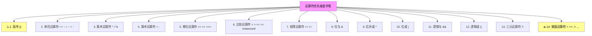

+++
title = "第8章 运算符——Java 的计算能力"
weight = 80
date = "2026-03-30T14:33:56.885+08:00"
type = "docs"
description = ""
isCJKLanguage = true
draft = false
+++
# 第八章 运算符——Java 的计算能力

想象一下，如果你有一台超级智能的机器人，但它只会站在那里一动不动，那该多无聊啊！运算符就是赋予 Java"动手能力"的关键——它们让 Java 能够做数学计算、比较大小、判断真假，甚至直接操控计算机最底层的比特位。

在 Java 的世界里，运算符（Operator）是一些特殊的符号，它们告诉 Java 执行特定的操作。比如 `+` 告诉 Java "把两个数加在一起"，`>` 告诉 Java"看看左边是不是比右边大"。没有运算符，Java 程序就像一本全是名词没有动词的书——什么都描述不了，什么都做不了。

本章我们将深入探索 Java 中的各类运算符，从最常见的加减乘除，到神秘莫测的位运算符，再到让人又爱又恨的优先级问题。准备好了吗？让我们开始这场运算符的冒险之旅！

---

## 8.1 算术运算符：+ - * / %

算术运算符是 Java 中最常用的运算符，没有之一。它们就是 Java 世界里的"计算器"，让你能够进行加减乘除取模（余数）运算。

### 运算符一览

| 运算符 | 名称     | 示例         | 结果（假设 a=10, b=3） |
|--------|----------|--------------|------------------------|
| `+`    | 加法     | `a + b`      | 13                     |
| `-`    | 减法     | `a - b`      | 7                      |
| `*`    | 乘法     | `a * b`      | 30                     |
| `/`    | 除法     | `a / b`      | 3                      |
| `%`    | 取模/取余| `a % b`      | 1                      |

### 实战代码

```java
public class ArithmeticDemo {
    public static void main(String[] args) {
        int a = 10;
        int b = 3;

        // 加法：最简单的运算
        int sum = a + b;  // 结果：13
        System.out.println("加法: " + a + " + " + b + " = " + sum);

        // 减法：找零的好帮手
        int difference = a - b;  // 结果：7
        System.out.println("减法: " + a + " - " + b + " = " + difference);

        // 乘法：批量计算神器
        int product = a * b;  // 结果：30
        System.out.println("乘法: " + a + " * " + b + " = " + product);

        // 除法：注意整数除法会截断小数部分！
        int quotient = a / b;  // 结果：3（不是3.333...！）
        System.out.println("整数除法: " + a + " / " + b + " = " + quotient);

        // 取模（取余）：判断奇偶、循环计数的好工具
        int remainder = a % b;  // 结果：1
        System.out.println("取模: " + a + " % " + b + " = " + remainder);

        // 浮点数除法——这才有"真正"的除法
        double preciseQuotient = (double) a / b;  // 3.333...
        System.out.println("浮点数除法: " + a + " / " + b + " = " + preciseQuotient);
    }
}
```

运行结果：

```
加法: 10 + 3 = 13
减法: 10 - 3 = 7
乘法: 10 * 3 = 30
整数除法: 10 / 3 = 3
取模: 10 % 3 = 1
浮点数除法: 10 / 3 = 3.3333333333333335
```

### 那些年踩过的坑

> **整数除法会"吃掉"小数部分！** 如果你用两个整数相除，结果还是整数，小数部分会被无情地截断。所以 `10 / 3 = 3`，不是 `3.333...`。想要精确结果？先把其中一个转成 `double` 或 `float`！

---

## 8.2 自增自减运算符：++ 和 --

如果你经常需要把一个数加 1 或减 1，Java 给你准备了两个超方便的简写：`++`（自增）和 `--`（自减）。它们就像是计算器上的"+1"和"-1"按钮。

### 前置与后置的区别

这是 Java 新手最容易搞混的地方，也是面试官最爱的考点之一：

- **前置（++a / --a）**：先改变变量的值，再使用该变量
- **后置（a++ / a--）**：先使用该变量的当前值，再改变它

```java
public class IncrementDemo {
    public static void main(String[] args) {
        int a = 5;
        int b = 5;

        // 前置++：先自增，再赋值
        int preIncrement = ++a;  // a 先变成 6，再赋给 preIncrement
        System.out.println("前置++: a变成" + a + ", preIncrement = " + preIncrement);

        // 重置
        a = 5;

        // 后置++：先赋值，再自增
        int postIncrement = a++;  // 先把 a 的值(5)赋给 postIncrement，然后 a 变成 6
        System.out.println("后置++: a变成" + a + ", postIncrement = " + postIncrement);

        System.out.println("--- 自减同理 ---");

        // 前置--
        int preDecrement = --b;  // b 先变成 4，再赋给 preDecrement
        System.out.println("前置--: b变成" + b + ", preDecrement = " + preDecrement);

        // 重置
        b = 5;

        // 后置--
        int postDecrement = b--;  // 先把 b 的值(5)赋给 postDecrement，然后 b 变成 4
        System.out.println("后置--: b变成" + b + ", postDecrement = " + postDecrement);
    }
}
```

运行结果：

```
前置++: a变成6, preIncrement = 6
后置++: a变成6, postIncrement = 5
--- 自减同理 ---
前置--: b变成4, preDecrement = 4
后置--: b变成4, postDecrement = 5
```

### 记忆小技巧

> 记住一个口诀：**"前"字在前，先变后用；"后"字在后，先用后变。**

---

## 8.3 赋值运算符与扩展赋值运算符

赋值运算符（Assignment Operator）可能是 Java 中最"低调"的运算符了——它干的是最基础的活儿，却往往被忽略。`=` 就是最经典的赋值运算符，它的作用是把右边的值交给左边。

### 扩展赋值运算符

除了基本的 `=`，Java 还提供了一组"扩展赋值运算符"，它们把运算和赋值合并成一步：

| 运算符 | 示例      | 等价于      | 名称       |
|--------|-----------|-------------|------------|
| `+=`   | `a += b`  | `a = a + b` | 加法赋值   |
| `-=`   | `a -= b`  | `a = a - b` | 减法赋值   |
| `*=`   | `a *= b`  | `a = a * b` | 乘法赋值   |
| `/=`   | `a /= b`  | `a = a / b` | 除法赋值   |
| `%=`   | `a %= b`  | `a = a % b` | 取模赋值   |

### 为什么要用扩展赋值运算符？

1. **更简洁**：少写一个变量名
2. **更高效**：在某些情况下性能更好（比如 `String` 的 `+=` 连接）
3. **更安全**：减少了重复求值带来的潜在问题

```java
public class AssignmentDemo {
    public static void main(String[] args) {
        int num = 10;

        // 基本赋值
        num = 20;
        System.out.println("基本赋值后: " + num);

        // 扩展赋值
        num += 5;   // 等价于 num = num + 5，结果是 25
        System.out.println("+=5 后: " + num);

        num -= 3;   // 等价于 num = num - 3，结果是 22
        System.out.println("-=3 后: " + num);

        num *= 2;   // 等价于 num = num * 2，结果是 44
        System.out.println("*=2 后: " + num);

        num /= 4;   // 等价于 num = num / 4，结果是 11
        System.out.println("/=4 后: " + num);

        num %= 3;   // 等价于 num = num % 3，结果是 2
        System.out.println("%=3 后: " + num);

        // 字符串拼接 +=（这个很常用！）
        String message = "Hello";
        message += ", World!";  // "Hello, World!"
        System.out.println("字符串拼接: " + message);
    }
}
```

---

## 8.4 比较运算符：==、!=、>、<、>=、<=

比较运算符（Comparison Operator）用于比较两个值的大小或相等性。在 Java 中，**比较的结果永远是 `boolean` 类型**——要么是 `true`（真），要么是 `false`（假）。这是做判断的基础！

### 运算符一览

| 运算符 | 名称         | 示例       | 说明                        |
|--------|--------------|------------|-----------------------------|
| `==`   | 等于         | `a == b`   | 判断两边是否相等            |
| `!=`   | 不等于       | `a != b`   | 判断两边是否不相等          |
| `>`    | 大于         | `a > b`    | 左边是否大于右边            |
| `<`    | 小于         | `a < b`    | 左边是否小于右边            |
| `>=`   | 大于等于     | `a >= b`   | 左边是否大于或等于右边      |
| `<=`   | 小于等于     | `a <= b`   | 左边是否小于或等于右边      |

### 新手易错：== 和 = 的区别

这是 Java 最最最常见的错误之一：

- `=` 是赋值运算符，把右边的值赋给左边
- `==` 是比较运算符，检查两边是否相等

```java
public class ComparisonDemo {
    public static void main(String[] args) {
        int score = 85;

        // 错误写法（把 90 赋给了 score）
        // if (score = 90) { ... }  // 编译错误！

        // 正确写法（比较 score 和 90 是否相等）
        if (score == 90) {
            System.out.println("满分！");
        } else {
            System.out.println("继续努力！");
        }

        // 各种比较
        System.out.println("score == 85: " + (score == 85));   // true
        System.out.println("score != 100: " + (score != 100)); // true
        System.out.println("score > 80: " + (score > 80));     // true
        System.out.println("score < 90: " + (score < 90));    // true
        System.out.println("score >= 85: " + (score >= 85));  // true
        System.out.println("score <= 84: " + (score <= 84));  // false

        // 字符串比较——注意要用 equals()！
        String name1 = "Alice";
        String name2 = "Alice";
        String name3 = new String("Alice");

        // == 比较的是引用（内存地址），不是内容
        System.out.println("name1 == name2: " + (name1 == name2)); // true（字符串常量池）
        System.out.println("name1 == name3: " + (name1 == name3)); // false（new 创建的新对象）

        // 要比较内容，用 equals()
        System.out.println("name1.equals(name3): " + name1.equals(name3)); // true
    }
}
```

> **警告：** 比较字符串时，**永远不要用 `==`**，要用 `equals()` 方法！`==` 比较的是引用地址，不是字符串内容。

---

## 8.5 逻辑运算符：&&、||、!、&、|

逻辑运算符（Logical Operator）用于连接布尔表达式，做出复杂的判断。它们是程序"思考"的基石。

### 运算符一览

| 运算符 | 名称     | 说明                                             |
|--------|----------|--------------------------------------------------|
| `&&`   | 短路与   | 两边都为 true 才为 true，**左边为 false 时右边不执行** |
| `&`    | 逻辑与   | 两边都为 true 才为 true，**两边都会执行**           |
| `\|\|` | 短路或   | 两边有一边为 true 就为 true，**左边为 true 时右边不执行** |
| `\|`   | 逻辑或   | 两边有一边为 true 就为 true，**两边都会执行**         |
| `!`    | 逻辑非   | 取反，true 变 false，false 变 true                      |

### 短路与非短路的区别

这可是性能优化的关键知识点！

```java
public class LogicalDemo {
    public static void main(String[] args) {
        int x = 5;

        System.out.println("--- 短路与 (&&) 演示 ---");
        // 左边 x > 10 为 false，按理说整个表达式已经是 false 了
        // 短路与会直接返回 false，不再计算右边
        boolean result1 = (x > 10) && (++x > 0);
        System.out.println("result1 = " + result1);  // false
        System.out.println("x = " + x);              // 5（++x 没执行！）

        // 重置
        x = 5;
        System.out.println("\n--- 逻辑与 (&) 演示 ---");
        // 逻辑与会执行两边
        boolean result2 = (x > 10) & (++x > 0);
        System.out.println("result2 = " + result2);  // false
        System.out.println("x = " + x);              // 6（++x 执行了！）

        System.out.println("\n--- 短路或 (||) 演示 ---");
        // 左边 x > 0 为 true，按理说整个表达式已经是 true 了
        // 短路或会直接返回 true，不再计算右边
        boolean result3 = (x > 0) || (++x > 100);
        System.out.println("result3 = " + result3);  // true
        System.out.println("x = " + x);              // 6（++x 没执行！）

        System.out.println("\n--- 逻辑非 (!) 演示 ---");
        boolean isRaining = false;
        System.out.println("下雨了吗？" + !isRaining);  // true（取反）
    }
}
```

> **实战建议：** 绝大多数情况下用 `&&` 和 `||`（短路版本），它们更高效。只有在你确实需要两边都执行的时候（比如两边有副作用的函数调用），才用 `&` 和 `|`。

---

## 8.6 位运算符——计算机底层的秘密

位运算符（Bitwise Operator）直接操作数字的二进制位。它们是 Java 中最"接近硬件"的运算符，也是最神秘的——但一旦你理解了它们，就能写出更高性能的代码！

### 什么是位运算？

计算机里所有数据都以二进制（0和1）存储。一个 `int` 在 Java 中占 32 个比特（bit）。位运算符就是直接操作这些比特位。

比如数字 `5` 的二进制是 `00000000 00000000 00000000 00000101`
比如数字 `3` 的二进制是 `00000000 00000000 00000000 00000011`

### 运算符一览

| 运算符 | 名称     | 说明                                  |
|--------|----------|---------------------------------------|
| `&`    | 按位与   | 两位都是 1 结果才为 1                 |
| `\|`   | 按位或   | 任一位为 1 结果就为 1                 |
| `^`    | 按位异或 | 两位不同结果为 1，相同为 0            |
| `~`    | 按位非   | 0 变 1，1 变 0（单目运算符）         |
| `<<`   | 左移     | 二进制位全部左移，右侧补 0            |
| `>>`   | 右移     | 二进制位全部右移，带符号扩展          |
| `>>>`  | 无符号右移 | 二进制位全部右移，零扩展            |

### 图解位运算

```
按位与 (&)      按位或 (|)      按位异或 (^)
  0101 (5)       0101 (5)       0101 (5)
& 0011 (3)     | 0011 (3)     ^ 0011 (3)
--------        --------        --------
  0001 (1)       0111 (7)       0110 (6)
```

```java
public class BitwiseDemo {
    public static void main(String[] args) {
        int a = 5;   // 二进制: 00000000 00000000 00000000 00000101
        int b = 3;   // 二进制: 00000000 00000000 00000000 00000011

        System.out.println("--- 按位运算 ---");
        System.out.println("a & b = " + (a & b) + "  (5&3=1)");  // 1
        System.out.println("a | b = " + (a | b) + "  (5|3=7)");  // 7
        System.out.println("a ^ b = " + (a ^ b) + "  (5^3=6)");  // 6
        System.out.println("~a = " + (~a));  // -6（补码反码）

        System.out.println("\n--- 移位运算 ---");
        // 左移：相当于乘以 2^n
        System.out.println("a << 1 = " + (a << 1) + "  (5<<1=10，相当于5*2)");  // 10
        System.out.println("a << 2 = " + (a << 2) + "  (5<<2=20，相当于5*4)");  // 20

        // 右移：相当于除以 2^n（向下取整）
        System.out.println("a >> 1 = " + (a >> 1) + "  (5>>1=2，相当于5/2取整)");  // 2
        System.out.println("b >> 1 = " + (b >> 1) + "  (3>>1=1)");  // 1

        // 无符号右移：负数也补 0
        int negative = -5;
        System.out.println("\n--- 负数移位 ---");
        System.out.println("-5 >> 1  = " + (negative >> 1));   // -3（算术右移）
        System.out.println("-5 >>> 1 = " + (negative >>> 1));  // 2147483645（逻辑右移）
    }
}
```

### 位运算的经典应用

```java
public class BitwiseApplications {
    public static void main(String[] args) {
        // 应用1：判断奇偶（比 %2 更快！）
        int num = 7;
        boolean isOdd = (num & 1) == 1;  // 奇数的最低位一定是 1
        System.out.println(num + " 是奇数吗？" + isOdd);

        // 应用2：交换两个数（不用临时变量）
        int x = 3, y = 5;
        System.out.println("交换前: x=" + x + ", y=" + y);
        x = x ^ y;
        y = x ^ y;  // y = (x^y)^y = x
        x = x ^ y;  // x = (x^y)^x = y
        System.out.println("交换后: x=" + x + ", y=" + y);

        // 应用3：判断某一位是否为 1
        int flags = 0b10100;  // 二进制标志位，第3位和第5位是1
        boolean bit3IsSet = (flags & (1 << 3)) != 0;  // 检查第3位
        System.out.println("第3位是1吗？" + bit3IsSet);  // true
    }
}
```

---

## 8.7 三元条件运算符：条件 ? 值1 : 值2

三元运算符（ Ternary Operator）是 Java 中唯一一个需要三个操作数的运算符。它的名字来源于"三元"——即三个部分。

### 语法

```java
条件 ? 值1 : 值2
```

执行逻辑：如果**条件**为 `true`，整个表达式的结果就是**值1**；如果**条件**为 `false`，结果就是**值2**。

### 等价代码

```java
// 三元运算符
String result = (score >= 60) ? "及格" : "不及格";

// 等价的 if-else
String result;
if (score >= 60) {
    result = "及格";
} else {
    result = "不及格";
}
```

### 实战代码

```java
public class TernaryDemo {
    public static void main(String[] args) {
        int score = 75;

        // 基础用法：找最大值
        int a = 10, b = 20;
        int max = (a > b) ? a : b;  // 如果 a>b，返回 a，否则返回 b
        System.out.println("最大值: " + max);  // 20

        // 基础用法：判断是否成年
        int age = 17;
        String message = (age >= 18) ? "已成年，可以投票！" : "未成年，还需要等待。";
        System.out.println(message);

        // 嵌套使用（但要谨慎，过度嵌套会让代码难读）
        int grade = 85;
        String result = (grade >= 90) ? "A" :
                        (grade >= 80) ? "B" :
                        (grade >= 70) ? "C" :
                        (grade >= 60) ? "D" : "F";
        System.out.println("成绩等级: " + result);  // B

        // 结合赋值运算符
        int num = 15;
        boolean isPositive = (num > 0) ? true : false;
        System.out.println(num + " 是正数吗？" + isPositive);
    }
}
```

### 注意事项

> **过度嵌套是三元运算符的天敌！** 如果你需要嵌套三层以上，建议改用 `if-else`，因为嵌套的三元运算符会让代码变成"地狱模式"，连你自己都看不懂。

---

## 8.8 字符串连接运算符：+

在 Java 中，`+` 运算符还有一个重要功能——**字符串连接**。当 `+` 的两边有一边是字符串时，它就会变成"粘合剂"，把两边的东西拼在一起。

### 字符串连接基础

```java
public class StringConcatenation {
    public static void main(String[] args) {
        String firstName = "张";
        String lastName = "三";
        int age = 25;

        // 字符串 + 字符串 = 拼接
        String fullName = firstName + lastName;
        System.out.println("姓名: " + fullName);  // 张三

        // 字符串 + 数字 = 拼接（数字会转成字符串）
        String info = fullName + "今年" + age + "岁";
        System.out.println(info);  // 张三今年25岁

        // 数字 + 数字 = 相加
        int x = 10, y = 20;
        System.out.println("x + y = " + x + y);  // 100？不对！
        System.out.println("x + y = " + (x + y)); // 30（加上括号）
    }
}
```

运行结果：

```
姓名: 张三
张三今年25岁
x + y = 1020   ← 字符串拼接！
x + y = 30     ← 算术加法
```

### 隐式类型转换的陷阱

> **小心字符串连接的顺序！** `System.out.println("x + y = " + x + y)` 会先把 `x` 转成字符串，再拼上 `y`，结果变成"1020"。如果想要加法运算，必须加括号：`"x + y = " + (x + y)`。

### StringBuilder 的优化

在循环中进行大量字符串拼接时，推荐使用 `StringBuilder`，效率更高：

```java
public class StringBuilderDemo {
    public static void main(String[] args) {
        // 循环中频繁拼接字符串
        StringBuilder sb = new StringBuilder();
        for (int i = 1; i <= 5; i++) {
            sb.append("元素").append(i).append(" ");
        }
        System.out.println("使用 StringBuilder: " + sb.toString());

        // String 的 += 在循环中每次都会创建新对象（效率低）
        String s = "";
        for (int i = 1; i <= 5; i++) {
            s += "元素" + i + " ";
        }
        System.out.println("使用 String: " + s);
    }
}
```

---

## 8.9 运算符优先级总表

终于到了大家最头疼的部分——运算符优先级！当你写下一串复杂的表达式时，哪些先算，哪些后算？

### 优先级从高到低

| 优先级 | 运算符                                  | 结合性     |
|--------|-----------------------------------------|------------|
| 1      | `()`（括号）                            | -          |
| 2      | `++` `--` `+`（正） `-`（负） `~` `!`  | 从右到左   |
| 3      | `*` `/` `%`                             | 从左到右   |
| 4      | `+` `-`                                 | 从左到右   |
| 5      | `<<` `>>` `>>>`                         | 从左到右   |
| 6      | `<` `<=` `>` `>=` `instanceof`          | -          |
| 7      | `==` `!=`                               | -          |
| 8      | `&`                                     | 从左到右   |
| 9      | `^`                                     | 从左到右   |
| 10     | `\|`                                    | 从左到右   |
| 11     | `&&`                                    | 从左到右   |
| 12     | `\|\|`                                  | 从左到右   |
| 13     | `?:`（三元运算符）                      | 从右到左   |
| 14     | `=` `+=` `-=` `*=` `/=` `%=` `&=` `^=` `\|=` `<<=` `>>=` `>>>=` | 从右到左 |

### Mermaid 图示



### 记忆口诀

> **"单算移比等，位逻三赋"**
> 
> 单目 → 算术 → 移位 → 比较 → 相等 → 位与 → 位异或 → 位或 → 逻辑与 → 逻辑或 → 三元 → 赋值

### 实际例子分析

```java
public class PriorityDemo {
    public static void main(String[] args) {
        int result = 2 + 3 * 4;           // 14（先算乘法）
        int result2 = (2 + 3) * 4;       // 20（先算括号）
        int result3 = 10 - 3 + 2;        // 9（从左到右）
        boolean result4 = 3 + 4 > 10 && 5 - 3 < 2;  // false
        // 解析: (3+4) > 10 && (5-3) < 2  →  7 > 10 && 2 < 2  →  false && false  →  false

        System.out.println("2 + 3 * 4 = " + result);
        System.out.println("(2 + 3) * 4 = " + result2);
        System.out.println("10 - 3 + 2 = " + result3);
        System.out.println("3 + 4 > 10 && 5 - 3 < 2 = " + result4);

        // 复杂的位运算
        int bitResult = 1 + 2 * 3 & 8;
        // 解析: 1 + (2*3) & 8  →  1 + 6 & 8  →  7 & 8  →  0
        System.out.println("1 + 2 * 3 & 8 = " + bitResult);
    }
}
```

> **保险起见：** 如果你对某个表达式的优先级有疑问，**永远加括号**！多几个括号不会让你的代码变慢，只会让你的代码更清晰，也让维护者（未来的你）少骂几句。

---

## 本章小结

本章我们全面探索了 Java 中的各类运算符：

1. **算术运算符**（`+ - * / %`）：Java 的计算器，处理基本数学运算。注意整数除法会截断小数部分。

2. **自增自减运算符**（`++ --`）：让变量加1或减1的便捷方式。前置（`++a`）先变后用，后置（`a++`）先用后变。

3. **赋值运算符**（`= += -= *= /= %=`）：将值赋给变量，或与运算合并赋值。

4. **比较运算符**（`== != > < >= <=`）：比较两个值，返回 `boolean`。比较字符串内容要用 `equals()`，不要用 `==`。

5. **逻辑运算符**（`&& || ! & |`）：连接布尔表达式。短路运算符（`&& ||`）更常用，非短路版本会执行两边。

6. **位运算符**（`& | ^ ~ << >> >>>`）：直接操作二进制位，高效且强大。常用场景：判断奇偶、交换变量、检查标志位。

7. **三元运算符**（`? :`）：简洁的条件表达式。适合简单判断，复杂情况用 `if-else`。

8. **字符串连接运算符**（`+`）：当 `+` 遇到字符串，就变成粘合剂。注意运算顺序导致的隐式类型转换陷阱。

9. **运算符优先级**：如果不确定，就加括号！括号永远是最可靠的选择。

掌握了这些运算符，你就掌握了 Java 进行计算、判断和逻辑处理的核心工具。下一章我们将学习 Java 的流程控制语句，让你的程序真正"活"起来！
