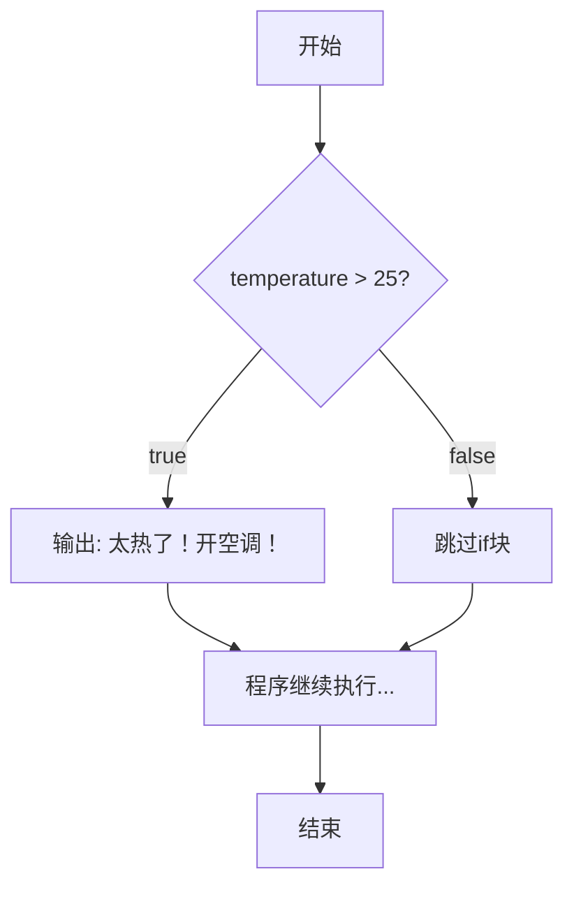
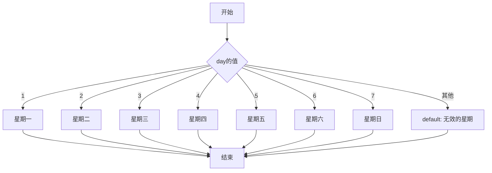
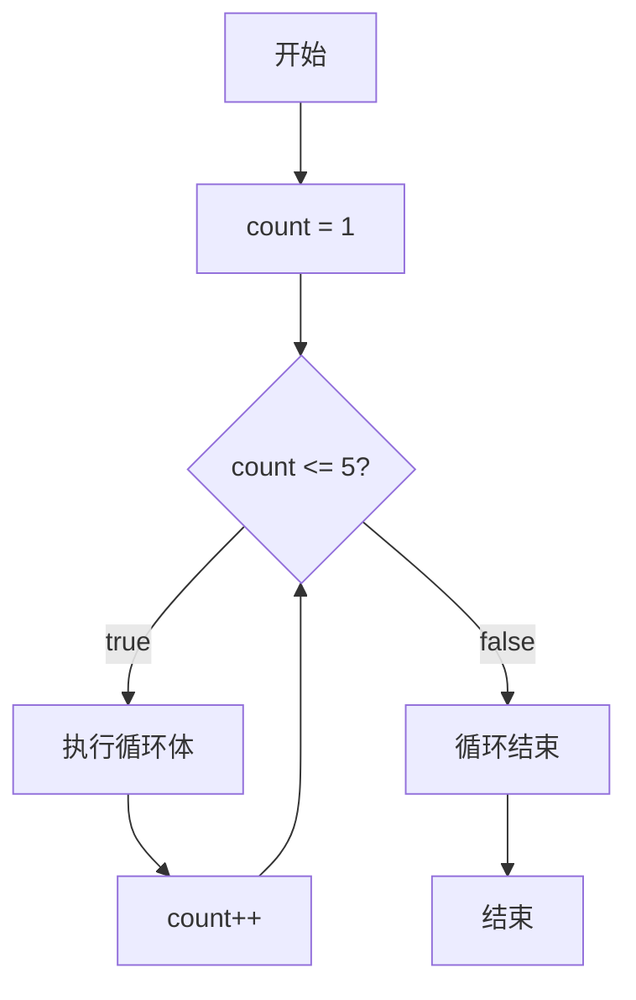
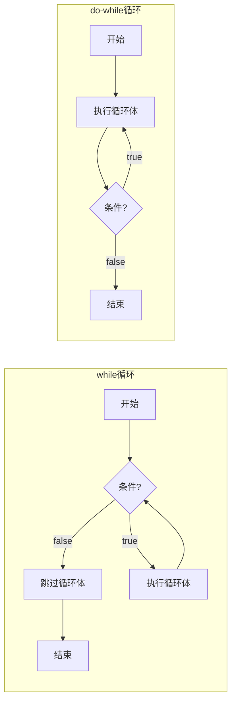
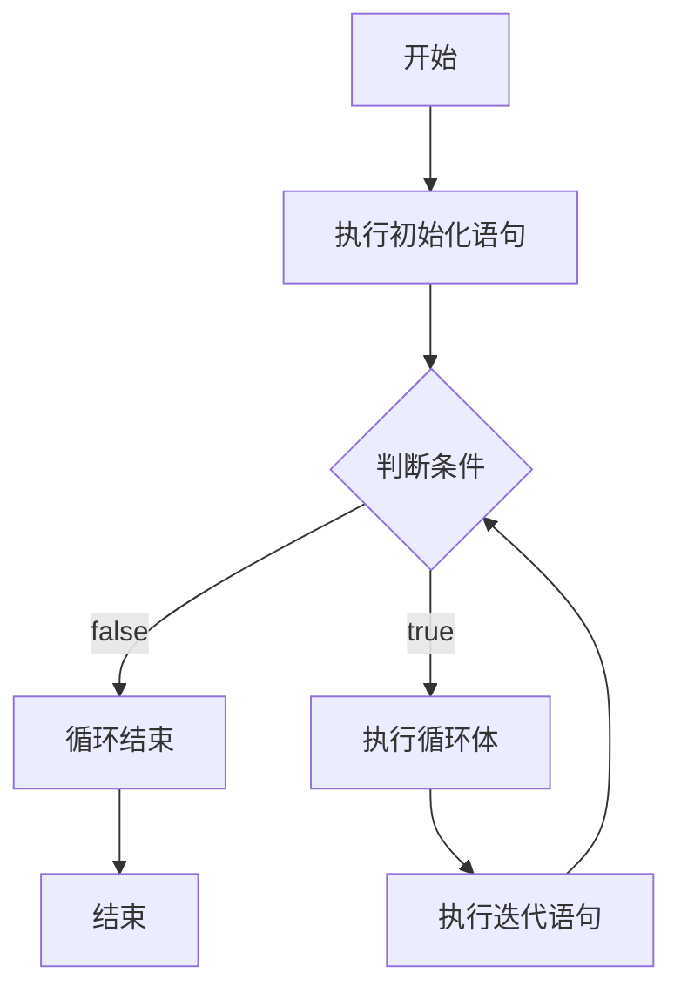
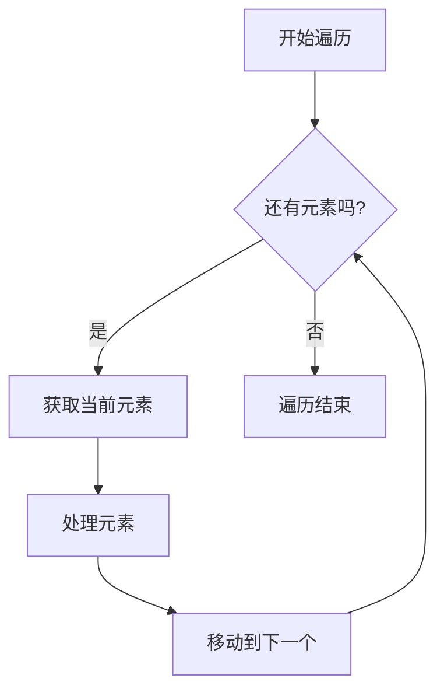
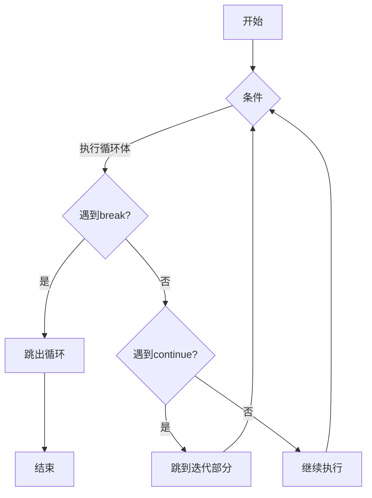

+++
title = "第9章 控制流程——程序的交通灯与循环"
weight = 90
date = "2026-03-30T14:33:56.886+08:00"
type = "docs"
description = ""
isCJKLanguage = true
draft = false
+++
# 第九章 控制流程——程序的交通灯与循环

> "程序和数据结构是算法的血肉，而控制流程是算法的灵魂。没有控制流程，代码只是一堆躺在床上的僵尸。" —— 某位不愿意透露姓名的程序员

欢迎来到控制流程的世界！如果说程序是一条高速公路，那么控制流程就是沿路的交通灯、岔路口和环岛。它决定着代码何时该加速、何时该刹车、何时该转弯。没有它，你的程序要么横冲直撞，要么原地躺平。

本章我们将深入探讨 Java 中的七大控制流利器：if、switch、while、do-while、for、foreach，以及那些让你在循环中"闪转腾挪"的跳转语句。系好安全带，我们发车了！

---

## 9.1 if 条件语句

### 9.1.1 什么是条件语句？

**条件语句**（Conditional Statement）是程序的"交警"，负责根据条件的真假来决定执行哪条路径。你可以把它想象成一个只会问"真的吗？"的家伙——它只关心两种回答：真（true）或假（false）。

### 9.1.2 if 的三种形态

#### 形态一：单枪匹马 if

最简单的情况，只有一条路可选：

```java
public class IfBasic {
    public static void main(String[] args) {
        int temperature = 30;  // 当前温度30度

        // if语句判断温度是否大于25度
        if (temperature > 25) {
            System.out.println("太热了！开空调！");
        }

        System.out.println("程序继续执行...");
    }
}
```

输出：
```
太热了！开空调！
程序继续执行...
```

流程图如下：



#### 形态二：红脸白脸 if-else

当条件为真走一条路，条件为假走另一条路：

```java
public class IfElseDemo {
    public static void main(String[] args) {
        int score = 75;  // 考试成绩

        if (score >= 60) {
            System.out.println("恭喜你及格了！🎉");
        } else {
            System.out.println("挂科了... 假期泡汤了 😢");
        }
    }
}
```

#### 形态三：连环套娃 if-else if-else

多条路径，按顺序一个个问，直到找到匹配的：

```java
public class IfElseIfDemo {
    public static void main(String[] args) {
        int score = 85;

        if (score >= 90) {
            System.out.println("成绩等级: A");
        } else if (score >= 80) {
            System.out.println("成绩等级: B");
        } else if (score >= 70) {
            System.out.println("成绩等级: C");
        } else if (score >= 60) {
            System.out.println("成绩等级: D");
        } else {
            System.out.println("成绩等级: F - 假期补习班见");
        }
    }
}
```

> **小贴士**：else if 可以无限续杯，但过多的嵌套会让代码变成"金字塔地狱"。这时候考虑用 switch 语句。

### 9.1.3 条件表达式的小技巧

#### 1. 三元运算符（if-else 的精简版）

```java
public class TernaryOperator {
    public static void main(String[] args) {
        int age = 20;

        // 传统if-else
        String result1;
        if (age >= 18) {
            result1 = "成年";
        } else {
            result1 = "未成年";
        }

        // 三元运算符：一行搞定
        String result2 = (age >= 18) ? "成年" : "未成年";

        System.out.println(result1);
        System.out.println(result2);
    }
}
```

#### 2. 合并逻辑判断

```java
public class CombinedCondition {
    public static void main(String[] args) {
        int age = 25;
        boolean hasLicense = true;
        boolean hasMoney = false;

        // 使用逻辑运算符组合条件
        if (age >= 18 && hasLicense) {
            System.out.println("可以租车");
        }

        if (hasLicense || hasMoney) {
            System.out.println("至少有一项出行资源");
        }

        // 取反
        if (!hasMoney) {
            System.out.println("穷鬼一个，但至少有驾照");
        }
    }
}
```

### 9.1.4 常见陷阱与避坑指南

```java
public class IfPitfalls {
    public static void main(String[] args) {
        // ❌ 错误示范：使用 == 比较布尔值
        boolean isRaining = true;
        if (isRaining == true) {  // 多余！
            System.out.println("带伞");
        }

        // ✅ 正确写法：直接写布尔变量
        if (isRaining) {
            System.out.println("带伞");
        }

        // ❌ 错误示范：在 if 条件中赋值
        // if (isRaining = false) { ... }  // 这是赋值，不是比较！

        // ✅ 正确写法
        if (isRaining == false) { ... }  // 或者
        if (!isRaining) { ... }
    }
}
```

---

## 9.2 switch 语句

### 9.2.1  switch 的登场

当你的 if-else if-else 链越来越长，像贪吃蛇一样无限延伸时，switch 语句就是来救场的。它让多分支选择变得清晰明了。

### 9.2.2 基本语法

```java
public class SwitchBasic {
    public static void main(String[] args) {
        int day = 3;
        String dayName;

        switch (day) {
            case 1:
                dayName = "星期一";
                break;
            case 2:
                dayName = "星期二";
                break;
            case 3:
                dayName = "星期三";
                break;
            case 4:
                dayName = "星期四";
                break;
            case 5:
                dayName = "星期五";
                break;
            case 6:
                dayName = "星期六";
                break;
            case 7:
                dayName = "星期日";
                break;
            default:
                dayName = "无效的星期";
        }

        System.out.println("今天是: " + dayName);
    }
}
```

流程图：



### 9.2.3 break 的重要性——case 穿透

> **警告**：没有 break 的 switch 会"穿透"执行下一个 case，这是新人常踩的坑！

```java
public class SwitchFallThrough {
    public static void main(String[] args) {
        int grade = 2;

        switch (grade) {
            case 1:
                System.out.println("成绩: 优秀");
                break;  // 遇到break，跳出switch
            case 2:
                System.out.println("成绩: 良好");
                // 这里没有break，会"穿透"到case 3
            case 3:
                System.out.println("成绩: 中等");
                break;
            default:
                System.out.println("成绩: 其他");
        }
    }
}
```

输出：
```
成绩: 良好
成绩: 中等
```

看到了吗？case 2 没有 break，所以执行完 case 2 后继续执行了 case 3。这种"穿透"特性有时可以巧妙利用：

```java
public class SwitchFallThroughSmart {
    public static void main(String[] args) {
        char grade = 'B';

        switch (grade) {
            case 'A':
            case 'B':
            case 'C':
                System.out.println("及格了！");
                break;
            case 'D':
            case 'F':
                System.out.println("不及格...");
                break;
        }
    }
}
```

### 9.2.4 Java 12+ 增强版 switch（箭头表达式）

Java 12 引入了更简洁的箭头语法，而且默认不会穿透：

```java
public class SwitchArrow {
    public static void main(String[] args) {
        int day = 3;

        // 新式箭头语法
        String dayName = switch (day) {
            case 1 -> "星期一";
            case 2 -> "星期二";
            case 3 -> "星期三";
            case 4 -> "星期四";
            case 5 -> "星期五";
            case 6, 7 -> "周末";  // 多个值合并
            default -> "无效的星期";
        };

        System.out.println("今天是: " + dayName);
    }
}
```

### 9.2.5 switch 的表达式形式

Java 14+ 支持 switch 表达式，返回一个值：

```java
public class SwitchExpression {
    public static void main(String[] args) {
        // 作为表达式使用
        int score = 85;
        String result = switch (score / 10) {
            case 10, 9 -> "A";
            case 8 -> "B";
            case 7 -> "C";
            case 6 -> "D";
            default -> {
                System.out.println("计算中...");
                yield "E";  // yield关键字返回值
            }
        };

        System.out.println("成绩等级: " + result);
    }
}
```

> **知识点**：yield 是在 switch 表达式中返回值的关键字，与循环中的 break 不同哦！

---

## 9.3 while 循环

### 9.3.1 while 的工作原理

**while 循环**就像一个固执的复读机，只要条件为真，它就会一直重复执行代码块。它的工作流程是：

```
while (条件) {
    // 循环体
}
```

先判断条件，条件为真则执行，然后回到开头再判断，形成一个闭环。

### 9.3.2 基本用法

```java
public class WhileBasic {
    public static void main(String[] args) {
        int count = 1;

        while (count <= 5) {
            System.out.println("第 " + count + " 次: 我在努力学习Java！");
            count++;  // 别忘了更新计数器，否则会死循环！
        }

        System.out.println("循环结束！");
    }
}
```

输出：
```
第 1 次: 我在努力学习Java！
第 2 次: 我在努力学习Java！
第 3 次: 我在努力学习Java！
第 4 次: 我在努力学习Java！
第 5 次: 我在努力学习Java！
循环结束！
```

流程图：



### 9.3.3 经典场景：猜数字游戏

```java
import java.util.Scanner;
import java.util.Random;

public class GuessNumber {
    public static void main(String[] args) {
        Random random = new Random();
        int targetNumber = random.nextInt(100) + 1;  // 生成1-100的随机数
        Scanner scanner = new Scanner(System.in);

        System.out.println("=== 猜数字游戏 ===");
        System.out.println("我已经想好了一个1-100之间的数字");

        int guess;
        int attempts = 0;

        System.out.print("请输入你猜的数字: ");

        while (true) {  // 无限循环，直到猜中
            guess = scanner.nextInt();
            attempts++;

            if (guess == targetNumber) {
                System.out.println("恭喜你猜对了！用了 " + attempts + " 次");
                break;  // 猜对了就跳出循环
            } else if (guess < targetNumber) {
                System.out.print("太小了，再试试: ");
            } else {
                System.out.print("太大了，再试试: ");
            }
        }

        scanner.close();
    }
}
```

### 9.3.4 死循环与如何避免

> **警告**：while(true) 是最常见的死循环来源！确保循环体内有 break 或条件会变假的机制。

```java
public class InfiniteLoop {
    public static void main(String[] args) {
        // ❌ 危险！这是个死循环
        // while (true) {
        //     System.out.println("停不下来...");
        // }

        // ✅ 正确的无限循环用法
        while (true) {
            System.out.println("执行一次");
            break;  // 配合break使用
        }

        // ✅ 另一种写法：while + 内部计数器
        int i = 0;
        while (i < 1) {  // 条件初始就为false，循环体不会执行
            System.out.println("永远不会执行");
            i++;
        }
    }
}
```

---

## 9.4 do-while 循环

### 9.4.1 先斩后奏的 do-while

**do-while 循环**与 while 的最大区别是：**它会先执行一次循环体，然后再判断条件**。这意味着无论条件是否为真，循环体至少会执行一次。

### 9.4.2 基本语法

```java
do {
    // 循环体
} while (条件);
```

注意：do-while 结尾的分号是必须的！

### 9.4.3 代码示例

```java
public class DoWhileDemo {
    public static void main(String[] args) {
        int number = 10;

        // do-while：先执行，再判断
        do {
            System.out.println("do-while: number = " + number);
            number--;
        } while (number > 0);

        System.out.println("---分隔线---");

        // while：先判断，再执行
        number = 10;
        while (number > 0) {
            System.out.println("while: number = " + number);
            number--;
        }
    }
}
```

### 9.4.4 典型应用场景

```java
import java.util.Scanner;

public class DoWhileMenu {
    public static void main(String[] args) {
        Scanner scanner = new Scanner(System.in);

        int choice;

        // 至少显示一次菜单
        do {
            System.out.println("\n=== 简易菜单 ===");
            System.out.println("1. 开始游戏");
            System.out.println("2. 查看排名");
            System.out.println("3. 退出");
            System.out.print("请选择: ");

            choice = scanner.nextInt();

            switch (choice) {
                case 1 -> System.out.println("游戏开始！");
                case 2 -> System.out.println("第1名: 你");
                case 3 -> System.out.println("再见！");
                default -> System.out.println("无效选择，请重试");
            }

        } while (choice != 3);  // 用户选择3才退出

        scanner.close();
    }
}
```

> **什么时候用 while vs do-while？**
> - 当你不确定是否需要执行一次时，用 **while**
> - 当你需要**至少执行一次**时，用 **do-while**

流程图对比：



---

## 9.5 for 循环

### 9.5.1 for 循环的本质

**for 循环**是 Java 中最常用的循环结构，特别适合**已知循环次数**的场景。它将循环的三个关键要素（初始化、条件、迭代）集中在一行，结构清晰。

### 9.5.2 基本语法

```java
for (初始化; 条件判断; 迭代) {
    // 循环体
}
```

### 9.5.3 执行流程



### 9.5.4 经典例子：打印九九乘法表

```java
public class ForLoopDemo {
    public static void main(String[] args) {
        // 打印1到10的平方
        System.out.println("=== 1到10的平方 ===");
        for (int i = 1; i <= 10; i++) {
            System.out.println(i + " 的平方 = " + (i * i));
        }

        System.out.println("\n=== 九九乘法表 ===");
        for (int i = 1; i <= 9; i++) {
            for (int j = 1; j <= i; j++) {
                System.out.print(j + "×" + i + "=" + (i * j) + "\t");
            }
            System.out.println();  // 换行
        }
    }
}
```

输出（部分）：
```
=== 1到10的平方 ===
1 的平方 = 1
2 的平方 = 4
3 的平方 = 9
...
```

### 9.5.5 for 循环的变种

#### 1. 省略形式（但通常不推荐）

```java
public class ForVariants {
    public static void main(String[] args) {
        int i = 0;

        // 初始化放到外面，迭代放到循环体末尾
        for (; i < 5; ) {
            System.out.println("i = " + i);
            i++;
        }

        // 完全省略形式 - 类似while
        for (;;) {
            System.out.println("这是一个无限循环！");
            break;
        }
    }
}
```

#### 2. 多个变量同时控制

```java
public class ForMultipleVars {
    public static void main(String[] args) {
        // 同时控制两个变量
        System.out.println("=== 打印三角形 ===");
        for (int i = 1, j = 10; i <= 5; i++, j--) {
            // 打印空格
            for (int s = 0; s < j; s++) {
                System.out.print(" ");
            }
            // 打印星号
            for (int k = 0; k < 2 * i - 1; k++) {
                System.out.print("*");
            }
            System.out.println();
        }
    }
}
```

### 9.5.6 常见错误

```java
public class ForCommonMistakes {
    public static void main(String[] args) {
        // ❌ 错误：在循环内修改循环变量
        // for (int i = 0; i < 5; i++) {
        //     System.out.println(i);
        //     i = 10;  // 这会打乱循环！
        // }

        // ✅ 正确：使用单独的变量
        int target = 3;
        for (int i = 0; i < 5; i++) {
            if (i == target) {
                System.out.println("找到目标: " + i);
            }
        }

        // ❌ 错误：浮点数比较用于循环条件
        // for (double d = 0.1; d != 1.0; d += 0.1) {
        //     System.out.println(d);  // 可能死循环！
        // }

        // ✅ 正确：使用整数或界限值
        for (int d = 1; d <= 10; d++) {
            System.out.println(d / 10.0);
        }
    }
}
```

---

## 9.6 foreach 增强 for 循环

### 9.6.1 foreach 是什么？

**foreach**（官方称为"增强 for 循环"）是 Java 5 引入的语法糖，专门用于遍历**数组**和**集合**。它让我们写起遍历代码来更加简洁优雅。

### 9.6.2 基本语法

```java
// 遍历数组
for (元素类型 变量名 : 数组或集合) {
    // 使用变量名访问每个元素
}

// 等价的传统for循环
for (int i = 0; i < 数组.length; i++) {
    元素类型 变量名 = 数组[i];
    // ...
}
```

### 9.6.3 遍历数组

```java
public class ForeachArray {
    public static void main(String[] args) {
        // 遍历整数数组
        int[] numbers = {10, 20, 30, 40, 50};

        System.out.println("=== 遍历整数数组 ===");
        for (int num : numbers) {
            System.out.println("数字: " + num);
        }

        // 遍历字符串数组
        String[] fruits = {"苹果", "香蕉", "橙子", "葡萄"};

        System.out.println("\n=== 遍历水果列表 ===");
        for (String fruit : fruits) {
            System.out.println("我喜欢吃: " + fruit);
        }
    }
}
```

### 9.6.4 遍历集合（List, Set等）

```java
import java.util.ArrayList;
import java.util.List;
import java.util.Set;
import java.util.HashSet;
import java.util.Map;
import java.util.HashMap;

public class ForeachCollection {
    public static void main(String[] args) {
        // 遍历 List
        List<String> fruits = new ArrayList<>();
        fruits.add("苹果");
        fruits.add("香蕉");
        fruits.add("橙子");

        System.out.println("=== 遍历 List ===");
        for (String fruit : fruits) {
            System.out.println(fruit);
        }

        // 遍历 Set
        Set<Integer> numbers = new HashSet<>();
        numbers.add(100);
        numbers.add(200);
        numbers.add(300);

        System.out.println("\n=== 遍历 Set ===");
        for (int num : numbers) {
            System.out.println("数字: " + num);
        }

        // 遍历 Map（需要用 entrySet）
        Map<String, Integer> scores = new HashMap<>();
        scores.put("语文", 90);
        scores.put("数学", 95);
        scores.put("英语", 88);

        System.out.println("\n=== 遍历 Map ===");
        for (Map.Entry<String, Integer> entry : scores.entrySet()) {
            System.out.println(entry.getKey() + ": " + entry.getValue() + "分");
        }
    }
}
```

### 9.6.5 foreach 的限制

> **注意**：foreach 循环无法修改集合结构（添加/删除元素），也无法直接获取当前索引。如果需要这些功能，请使用传统 for 循环。

```java
import java.util.ArrayList;
import java.util.List;

public class ForeachLimitation {
    public static void main(String[] args) {
        List<String> list = new ArrayList<>();
        list.add("A");
        list.add("B");
        list.add("C");

        // ❌ 错误： foreach遍历时不能修改集合
        // for (String item : list) {
        //     if ("B".equals(item)) {
        //         list.remove(item);  // 会抛出 ConcurrentModificationException
        //     }
        // }

        // ✅ 正确做法：使用迭代器
        var iterator = list.iterator();
        while (iterator.hasNext()) {
            String item = iterator.next();
            if ("B".equals(item)) {
                iterator.remove();  // 使用迭代器删除
            }
        }

        System.out.println("删除后的列表: " + list);
    }
}
```

流程图：



### 9.6.6 foreach vs 传统 for 循环

```java
public class ForeachVsFor {
    public static void main(String[] args) {
        int[] arr = {1, 2, 3, 4, 5};

        // foreach - 简洁，但无法访问索引
        System.out.println("=== foreach 方式 ===");
        for (int val : arr) {
            System.out.println("值: " + val);
        }

        // 传统 for - 可以访问索引
        System.out.println("\n=== 传统 for 方式 ===");
        for (int i = 0; i < arr.length; i++) {
            System.out.println("索引 " + i + " 的值: " + arr[i]);
        }

        // 传统 for - 适合需要跳着遍历的情况
        System.out.println("\n=== 跳着遍历 ===");
        for (int i = 0; i < arr.length; i += 2) {
            System.out.println("偶数索引 " + i + " 的值: " + arr[i]);
        }
    }
}
```

---

## 9.7 嵌套循环与跳转语句

### 9.7.1 嵌套循环：循环里面套循环

**嵌套循环**就是一个循环内部再包含一个或多个循环。常用于处理二维数据结构（如矩阵、表格）或多层迭代问题。

### 9.7.2 打印图案

```java
public class NestedLoopPatterns {
    public static void main(String[] args) {
        // 打印直角三角形
        System.out.println("=== 直角三角形 ===");
        for (int i = 1; i <= 5; i++) {
            for (int j = 1; j <= i; j++) {
                System.out.print("* ");
            }
            System.out.println();
        }

        // 打印倒直角三角形
        System.out.println("\n=== 倒直角三角形 ===");
        for (int i = 5; i >= 1; i--) {
            for (int j = 1; j <= i; j++) {
                System.out.print("* ");
            }
            System.out.println();
        }

        // 打印菱形
        System.out.println("\n=== 菱形 ===");
        int size = 5;

        // 上半部分（包括中间行）
        for (int i = 1; i <= size; i++) {
            // 打印空格
            for (int j = size; j > i; j--) {
                System.out.print(" ");
            }
            // 打印星号
            for (int j = 1; j <= 2 * i - 1; j++) {
                System.out.print("*");
            }
            System.out.println();
        }

        // 下半部分
        for (int i = size - 1; i >= 1; i--) {
            for (int j = size; j > i; j--) {
                System.out.print(" ");
            }
            for (int j = 1; j <= 2 * i - 1; j++) {
                System.out.print("*");
            }
            System.out.println();
        }
    }
}
```

输出：
```
=== 直角三角形 ===
* 
* * 
* * * 
* * * * 
* * * * * 
```

### 9.7.3 二维数组遍历

```java
public class TwoDimensionalArray {
    public static void main(String[] args) {
        // 定义一个3x3的矩阵
        int[][] matrix = {
            {1, 2, 3},
            {4, 5, 6},
            {7, 8, 9}
        };

        System.out.println("=== 遍历3x3矩阵 ===");
        for (int i = 0; i < matrix.length; i++) {
            for (int j = 0; j < matrix[i].length; j++) {
                System.out.print(matrix[i][j] + "\t");
            }
            System.out.println();
        }

        // 查找矩阵中的最大值
        int max = matrix[0][0];
        int maxRow = 0, maxCol = 0;

        for (int i = 0; i < matrix.length; i++) {
            for (int j = 0; j < matrix[i].length; j++) {
                if (matrix[i][j] > max) {
                    max = matrix[i][j];
                    maxRow = i;
                    maxCol = j;
                }
            }
        }

        System.out.println("\n最大值: " + max + "，位于第" + maxRow + "行第" + maxCol + "列");
    }
}
```

### 9.7.4 break 语句：跳出循环

**break** 关键字用于**立即终止**当前循环，程序跳出循环体，继续执行循环后面的代码。

```java
public class BreakDemo {
    public static void main(String[] args) {
        // 在数组中查找第一个负数
        int[] numbers = {5, 12, 7, -3, 8, -1, 6};

        System.out.println("=== 查找第一个负数 ===");
        for (int i = 0; i < numbers.length; i++) {
            System.out.println("检查: " + numbers[i]);
            if (numbers[i] < 0) {
                System.out.println("找到了！第一个负数是: " + numbers[i]);
                break;  // 立即跳出循环
            }
        }

        System.out.println("循环结束");
    }
}
```

### 9.7.5 continue 语句：跳过本次迭代

**continue** 关键字用于**跳过本次循环**，直接进入下一次循环迭代。它不会终止整个循环，只是跳过当前这次。

```java
public class ContinueDemo {
    public static void main(String[] args) {
        // 打印1到10，但跳过3的倍数
        System.out.println("=== 打印1-10，跳过3的倍数 ===");
        for (int i = 1; i <= 10; i++) {
            if (i % 3 == 0) {
                continue;  // 跳过这次迭代，进入下一次
            }
            System.out.print(i + " ");
        }

        System.out.println("\n\n=== 计算正数之和 ===");
        int[] values = {5, -2, 8, -1, 3, -5, 7};
        int positiveSum = 0;

        for (int val : values) {
            if (val <= 0) {
                continue;  // 跳过非正数
            }
            positiveSum += val;
        }

        System.out.println("正数之和: " + positiveSum);
    }
}
```

### 9.7.6 标签（Label）：指定跳转位置

Java 中的标签（Label）是给循环起的名字，配合 break 和 continue 使用，可以**跳出或跳过指定的外层循环**。

```java
public class LabelDemo {
    public static void main(String[] args) {
        // 场景：在二维数组中查找"目标"
        String[][] grid = {
            {"A", "B", "C"},
            {"D", "目标", "F"},
            {"G", "H", "I"}
        };

        String target = "目标";
        boolean found = false;

        // 定义外层循环的标签
        outer:
        for (int i = 0; i < grid.length; i++) {
            for (int j = 0; j < grid[i].length; j++) {
                System.out.println("检查: [" + i + "][" + j + "] = " + grid[i][j]);
                if (grid[i][j].equals(target)) {
                    found = true;
                    System.out.println("找到了！" + target + " 在 [" + i + "][" + j + "]");
                    break outer;  // 跳出外层循环
                }
            }
        }

        if (!found) {
            System.out.println("未找到目标");
        }
    }
}
```

> **知识点**：标签虽然强大，但过度使用会让代码变得难以理解。如果能用方法抽取或其他设计模式解决，就尽量少用标签。

### 9.7.7 return 语句：直接结束方法

在循环中使用 **return** 会直接结束整个方法，所有循环都终止。

```java
public class ReturnInLoop {
    public static void main(String[] args) {
        // 查找数组中是否存在负数
        int[] numbers = {5, 12, 7, 3, 8, 6};

        System.out.println("检查是否存在负数...");
        checkForNegative(numbers);
        System.out.println("方法执行完毕");
    }

    public static void checkForNegative(int[] arr) {
        for (int num : arr) {
            if (num < 0) {
                System.out.println("发现负数: " + num);
                return;  // 直接结束 checkForNegative 方法
            }
        }
        System.out.println("没有负数");
    }
}
```

### 9.7.8 跳转语句对比总结

```java
public class JumpComparison {
    public static void main(String[] args) {
        System.out.println("=== 跳转语句对比 ===");
        System.out.println("break:    跳出整个循环");
        System.out.println("continue: 跳过本次迭代，继续下一次循环");
        System.out.println("return:   直接结束整个方法");
        System.out.println("标签+break: 跳出指定的外层循环");
    }
}
```



---

## 本章小结

本章我们学习了 Java 中的控制流程语句，它们是程序逻辑的"交通系统"：

| 语句 | 作用 | 特点 |
|------|------|------|
| `if-else` | 条件分支 | 根据布尔条件选择路径 |
| `switch` | 多值分支 | 处理离散的固定值，Java 12+ 有箭头语法 |
| `while` | 前置循环 | 先判断后执行，条件不满足可能一次都不执行 |
| `do-while` | 后置循环 | 先执行后判断，**至少执行一次** |
| `for` | 计数循环 | 适合已知循环次数的场景 |
| `foreach` | 增强循环 | 遍历数组和集合的简洁语法 |
| `break` | 跳出循环 | 终止当前循环 |
| `continue` | 跳过迭代 | 跳过本次循环，继续下一次 |
| `return` | 结束方法 | 跳出整个方法 |

### 关键知识点回顾

1. **条件判断**：`if-else` 可以处理布尔条件，`switch` 适合处理离散的枚举值或固定值
2. **循环选择**：如果需要**至少执行一次**，选 `do-while`；如果知道循环次数，选 `for`；如果遍历集合，选 `foreach`
3. **防止死循环**：确保循环条件最终会变为 `false`，或者在循环体内有 `break`
4. **嵌套循环**：外层循环控制行，内层循环控制列，常用于打印图案和遍历二维数组
5. **跳转语句**：合理使用 `break`、`continue`、`return`，让程序逻辑更加清晰

> 学完这一章，你已经掌握了让程序"思考"的能力！下一章我们将学习**方法（Method）**，让代码模块化和复用达到新高度。继续保持这股热情吧！ 🚀
