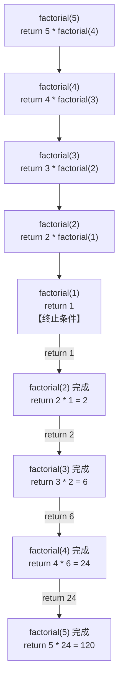

+++
title = "第10章 方法（函数）——代码的复用与封装"
weight = 100
date = "2026-03-30T14:33:56.888+08:00"
type = "docs"
description = ""
isCJKLanguage = true
draft = false
+++
# 第十章 方法（函数）——代码的复用与封装

> "Don't repeat yourself." —— DRY 原则，程序员的第一诫

欢迎来到第十章！在这一章里，我们将一起探索 Java 中最最重要的概念之一——**方法（Method）**。如果你把 Java 程序比作一家大型工厂，那方法就是工厂里的一条条生产线，每条生产线负责完成特定的任务。没有方法，你的代码就会变成一坨意大利面条——混乱、难以维护、让人崩溃。

## 10.1 为什么要用方法？

想象一下这个场景：你的老板让你写一个计算工资的程序。需求很简单——给员工发工资，但要扣税、扣社保、算奖金。三个需求，听起来不多。

如果你把所有代码都堆在 `main` 方法里，大概会变成这样：

```java
public class BadExample {
    public static void main(String[] args) {
        // 扣税
        double tax = salary * 0.2;
        double afterTax = salary - tax;

        // 扣社保
        double insurance = afterTax * 0.1;
        double afterInsurance = afterTax - insurance;

        // 算奖金
        double bonus = base * performance * 0.5;
        double total = afterInsurance + bonus;

        // 打印工资条
        System.out.println("工资条");
        System.out.println("-----");
        System.out.println("基本工资: " + salary);
        System.out.println("扣税: -" + tax);
        System.out.println("社保: -" + insurance);
        System.out.println("奖金: +" + bonus);
        System.out.println("实发: " + total);

        // 第二个员工... 再来一遍
        double tax2 = salary2 * 0.2;
        double afterTax2 = salary2 - tax2;
        double insurance2 = afterTax2 * 0.1;
        double afterInsurance2 = afterTax2 - insurance2;
        double bonus2 = base2 * performance2 * 0.5;
        double total2 = afterInsurance2 + bonus2;
        // ... 打印第二个人的工资条
    }
}
```

哦不对，代码里还有 bug——`insurance2` 的计算用的是 `afterTax2` 而不是 `afterTax`，算出来的数字对不上。财务部的人看到这串数字怕是要提着刀来找你。

**这就是不使用方法的惨烈后果：**

1. **代码重复**：同样的逻辑复制粘贴 N 遍，改一处要改 N 处
2. **难以维护**：bug 藏在层层重复代码里，定位困难
3. **可读性差**：一个方法塞几千行，鬼才知道这段代码是干嘛的
4. **难以测试**：无法单独验证某个逻辑，只能跑整个程序碰运气

方法（Method）就是来解决这些问题的！方法把一段可以重复使用的逻辑封装起来，给它起个名字，以后想用就直接"叫名字"就行了。

**使用方法的三大好处：**

| 好处 | 说明 |
|------|------|
| **代码复用** | 写一次，用 N 次，修改一处全局生效 |
| **易于维护** | bug 只在一个地方修，改逻辑只改一处 |
| **提高可读性** | 方法名即注释，一看就知道这段代码干啥的 |

> 💡 **小贴士**：在 Java 中，"方法"和"函数"其实是同一个东西。只是 Java 圈子习惯叫"方法"，而 C 语言圈子叫"函数"。本质上都是——一段有名字的、可调用的代码块。

## 10.2 方法的定义与调用

好，既然方法这么香，那怎么写呢？

### 方法的基本结构

在 Java 中，一个完整的方法长这样：

```java
修饰符 返回类型 方法名(参数列表) {
    // 方法体
    return 返回值;
}
```

让我们逐个解释：

- **修饰符（Modifier）**：控制方法的访问权限和行为，比如 `public static`
- **返回类型（Return Type）**：方法执行完毕后返回什么数据类型，如果什么都不返回，用 `void`
- **方法名（Method Name）**：给方法起个名字，遵循小驼峰命名法
- **参数列表（Parameters）**：方法需要接收的输入，可以为空
- **方法体（Method Body）**：大括号里的具体逻辑
- **return**：返回值，如果返回类型是 `void`，则不需要 return 语句

### 简单示例：打招呼

```java
public class MethodDemo {

    // 这是一个没有参数、没有返回值的方法
    public static void sayHello() {
        System.out.println("你好，欢迎来到 Java 世界！");
    }

    // 这是一个有参数、没有返回值的方法
    public static void greet(String name) {
        System.out.println("你好，" + name + "！今天过得怎么样？");
    }

    // 这是一个有参数、也有返回值的方法
    public static int add(int a, int b) {
        int sum = a + b;
        return sum;
    }

    public static void main(String[] args) {
        // 调用 sayHello
        sayHello();

        // 调用 greet，传入 "小明" 作为参数
        greet("小明");

        // 调用 add，把返回值存到变量 result 里
        int result = add(10, 20);
        System.out.println("10 + 20 = " + result);

        // 也可以直接打印返回值
        System.out.println("100 + 200 = " + add(100, 200));
    }
}
```

运行结果：

```
你好，欢迎来到 Java 世界！
你好，小明！今天过得怎么样？
10 + 20 = 30
100 + 200 = 300
```

### static 是什么鬼？

细心的你可能注意到了，所有方法前面都有个 `static` 关键字。在我们深入面向对象之前，先简单说一下：

`static` 关键字表示这个方法属于**类**，而不是某个具体的对象。这意味着你可以直接用 `类名.方法名()` 来调用，而不需要先 new 一个对象出来。

```java
public class StaticDemo {
    public static void main(String[] args) {
        // 直接用类名调用，不用创建对象
        MethodDemo.sayHello();
        MethodDemo.greet("张三");
    }
}
```

> 💡 **术语解释**：`new` 是 Java 中创建对象的关键字。比如 `new Scanner(System.in)` 就是创建一个 Scanner 对象。我们后面会在面向对象的章节详细讲解。

### 方法的命名规范

方法名不是想怎么起就怎么起的，Java 有它的规矩：

1. **必须以字母、`$`、或 `_` 开头**，后面可以跟数字（但数字不能开头）
2. **不能使用 Java 保留字**（如 `class`、`public`、`if` 这些）
3. **建议使用小驼峰命名法（lowerCamelCase）**：第一个单词小写，后续单词首字母大写

```java
// ✅ 好的方法名
public static void calculateSalary() {}
public static void getUserInfo() {}
public static void processOrderData() {}

// ❌ 糟糕的方法名
public static void CalculateSalary() {}  // 不要用大写开头
public static void calc() {}              // 太短，不够清晰
public static void doStuff() {}           // 完全没有语义
```

### 无返回值方法（void）

如果方法不需要返回任何值，就把返回类型写成 `void`：

```java
public class VoidDemo {

    // 打印乘法表，不返回任何值
    public static void printMultiplicationTable(int n) {
        for (int i = 1; i <= n; i++) {
            for (int j = 1; j <= i; j++) {
                System.out.print(i + "*" + j + "=" + (i*j) + "\t");
            }
            System.out.println();
        }
    }

    public static void main(String[] args) {
        printMultiplicationTable(5);
    }
}
```

运行结果：

```
1*1=1	
2*1=2	2*2=4	
3*1=3	3*2=6	3*3=9	
4*1=4	4*2=8	4*3=12	4*4=16	
5*1=5	5*2=10	5*3=15	5*4=20	5*5=25	
```

> ⚠️ **注意**：`void` 方法不需要 `return` 语句，但如果想提前退出方法，可以用 `return;` 来直接返回。

```java
public static void printIfPositive(int num) {
    if (num <= 0) {
        System.out.println("数字不是正数，不打印了！");
        return; // 提前结束方法
    }
    System.out.println("正数是：" + num);
}
```

## 10.3 方法的参数传递

方法可以接收参数，这是它们最强大的地方之一。但是，Java 的参数传递规则有点特别，很多新手都会在这里踩坑。

### 值传递（Pass by Value）

Java 中，**所有的参数传递都是值传递**。这意味着：

- 对于**基本数据类型**（int、double 等），传递的是值的**副本**
- 对于**引用类型**（对象、数组等），传递的是**引用的副本**（指向同一个对象）

别慌，我们来用代码说话：

```java
public class PassByValueDemo {

    // 尝试交换两个数（这不会成功！）
    public static void swap(int a, int b) {
        System.out.println("交换前: a = " + a + ", b = " + b);
        int temp = a;
        a = b;
        b = temp;
        System.out.println("交换后: a = " + a + ", b = " + b);
    }

    public static void main(String[] args) {
        int x = 10;
        int y = 20;
        System.out.println("交换前: x = " + x + ", y = " + y);
        swap(x, y);
        System.out.println("交换后: x = " + x + ", y = " + y);
    }
}
```

运行结果：

```
交换前: x = 10, y = 20
交换前: a = 10, b = 20
交换后: a = 20, b = 10
交换后: x = 10, y = 20   // 什么？！x 和 y 居然没变！
```

**震惊！** `x` 和 `y` 的值完全没有变化！这是因为 `a` 和 `b` 只是 `x` 和 `y` 的**副本**，在方法内部交换的只是副本，原来的 `x` 和 `y` 完全不受影响。

这听起来像是个 bug？不，这是 Java 的设计哲学——**方法的副作用要可控**。如果方法随便就能改变外部变量，那程序会变得非常难以理解和调试。

### 引用类型的传递

那如果传的是对象呢？

```java
public class Person {
    String name;
    int age;

    public Person(String name, int age) {
        this.name = name;
        this.age = age;
    }

    @Override
    public String toString() {
        return "Person{name='" + name + "', age=" + age + "}";
    }
}

public class PassByReferenceDemo {

    // 修改对象的属性（这会成功！）
    public static void birthday(Person p) {
        p.age++;
        System.out.println("方法内: " + p);
    }

    public static void main(String[] args) {
        Person john = new Person("张三", 25);
        System.out.println("调用前: " + john);
        birthday(john);
        System.out.println("调用后: " + john);
    }
}
```

运行结果：

```
调用前: Person{name='张三', age=25}
方法内: Person{name='张三', age=26}
调用后: Person{name='张三', age=26}   // 成功变26岁了！
```

**为什么这次成功了？** 因为 `john` 是个对象引用，传递给方法的是**引用的副本**。副本和原引用指向**同一个对象**，所以修改对象属性是有效的。

**但是注意！** 如果你在方法内部重新给参数赋值：

```java
public static void reassign(Person p) {
    p = new Person("新人", 30);  // 这行只是把副本指向了新对象
    System.out.println("方法内: " + p);
}

public static void main(String[] args) {
    Person john = new Person("张三", 25);
    System.out.println("调用前: " + john);
    reassign(john);
    System.out.println("调用后: " + john);  // john 还是指向原来的对象
}
```

运行结果：

```
调用前: Person{name='张三', age=25}
方法内: Person{name='新人', age=30}
调用后: Person{name='张三', age=25}  // john 完全没有变化！
```

### 参数传递总结

| 类型 | 传递内容 | 能修改原值吗？ |
|------|----------|----------------|
| 基本数据类型（int, double, boolean...） | 值的副本 | ❌ 不能 |
| 引用类型（对象、数组、字符串...） | 引用的副本 | ✅ 能修改属性，❌ 不能改变引用本身 |

> 💡 **记忆技巧**：把基本类型想成"硬币"，复制一份给你你当然随便花，原来的那份不会变。把引用类型想成"门牌号"，你拿到的是门牌号的抄件，但你还是能找到同一栋房子。

### 形式参数与实际参数

最后补充两个专业术语，让你在面试时显得更专业：

- **形式参数（Formal Parameter）**：方法定义时写的参数，简称**形参**。比如 `public static void greet(String name)` 中的 `name`
- **实际参数（Actual Parameter）**：调用方法时传入的参数，简称**实参**。比如 `greet("小明")` 中的 `"小明"`

## 10.4 可变参数

有时候，你写一个方法，但不确定调用时会传入几个参数。比如经典的打印日志功能，可能传 1 个参数，也可能传 10 个参数。

传统做法是用数组：

```java
public static void printAllOld(int[] numbers) {
    for (int n : numbers) {
        System.out.print(n + " ");
    }
    System.out.println();
}

// 调用时需要这样
printAllOld(new int[]{1, 2, 3});
```

这看起来有点别扭——调用者得先手动创建一个数组。Java 1.5 引入了**可变参数（Varargs）**，让这个过程变得优雅多了。

### 可变参数语法

可变参数的语法是：**类型... 变量名**

```java
public class VarargsDemo {

    // 使用可变参数，可以传入任意数量的 int 参数
    public static void printAll(int... numbers) {
        System.out.println("收到了 " + numbers.length + " 个参数:");
        for (int n : numbers) {
            System.out.print(n + " ");
        }
        System.out.println();
    }

    public static void main(String[] args) {
        // 传 0 个参数
        printAll();

        // 传 1 个参数
        printAll(42);

        // 传 3 个参数
        printAll(1, 2, 3);

        // 传 5 个参数
        printAll(10, 20, 30, 40, 50);
    }
}
```

运行结果：

```
收到了 0 个参数:

收到了 1 个参数:
42 
收到了 3 个参数:
1 2 3 
收到了 5 个参数:
10 20 30 40 50 
```

**这就是可变参数的魔力！** 不管传几个参数，一个 `int...` 全搞定。

### 可变参数的原理

其实可变参数只是**语法糖**，编译器会在编译时自动把它转换成数组。所以下面两种写法是完全等价的：

```java
// 这两种写法在字节码层面是一模一样的
public static void printAll(int... numbers) {}

// 会被转换成
public static void printAll(int[] numbers) {}
```

### 可变参数的使用注意

可变参数虽好，但有几个坑要避开：

**1. 可变参数必须放在最后**

```java
// ✅ 正确：可变参数在最后
public static void log(String level, String... messages) {}

// ❌ 错误：可变参数不能在中间
public static void log(String... messages, String level) {}  // 编译错误！
```

**2. 方法重载时要注意歧义**

```java
public class VarargsOverloadDemo {

    // 普通方法
    public static void print(String s) {
        System.out.println("普通方法: " + s);
    }

    // 可变参数方法
    public static void print(String... ss) {
        System.out.println("可变参数方法，共 " + ss.length + " 个参数");
    }

    public static void main(String[] args) {
        print("hello");  // 调用哪个？编译器会优先匹配普通方法！
    }
}
```

运行结果：

```
普通方法: hello
```

### 可变参数的高级用法

结合可变参数和普通参数，可以实现很优雅的 API 设计：

```java
public class StringUtils {

    // 拼接多个字符串，用指定分隔符分开
    public static String join(String delimiter, String... parts) {
        if (parts.length == 0) {
            return "";
        }
        StringBuilder sb = new StringBuilder(parts[0]);
        for (int i = 1; i < parts.length; i++) {
            sb.append(delimiter).append(parts[i]);
        }
        return sb.toString();
    }

    // 求任意多个整数的和
    public static int sum(int... numbers) {
        int total = 0;
        for (int n : numbers) {
            total += n;
        }
        return total;
    }

    public static void main(String[] args) {
        // 拼接字符串
        String path = join("/", "usr", "local", "bin");
        System.out.println("路径: " + path);

        String names = join(", ", "张三", "李四", "王五");
        System.out.println("名单: " + names);

        // 求和
        System.out.println("1+2+3+4+5 = " + sum(1, 2, 3, 4, 5));
        System.out.println("sum() = " + sum());  // 0个参数也没问题
    }
}
```

运行结果：

```
路径: usr/local/bin
名单: 张三, 李四, 王五
1+2+3+4+5 = 15
sum() = 0
```

## 10.5 方法重载（Overload）

现在有个新问题：我想写一个"打印"功能，可以打印整数、打印小数、打印字符串，甚至打印数组。但它们的功能本质上都是"打印"，为什么要给它们起不同的名字呢？

这就要用到**方法重载（Overload）**了！

### 什么是方法重载？

**方法重载**指的是：在同一个类中，可以定义多个**同名**但**不同参数**的方法。编译器会根据调用时传入的参数类型和数量，自动选择调用哪个版本。

```java
public class OverloadDemo {

    // 打印整数
    public static void print(int num) {
        System.out.println("整数: " + num);
    }

    // 打印小数
    public static void print(double num) {
        System.out.println("小数: " + num);
    }

    // 打印字符串
    public static void print(String text) {
        System.out.println("字符串: " + text);
    }

    // 打印布尔值
    public static void print(boolean flag) {
        System.out.println("布尔值: " + flag);
    }

    public static void main(String[] args) {
        print(100);           // 调用 print(int)
        print(3.14);          // 调用 print(double)
        print("Hello");       // 调用 print(String)
        print(true);          // 调用 print(boolean)
    }
}
```

运行结果：

```
整数: 100
小数: 3.14
字符串: Hello
布尔值: true
```

**同一个方法名 `print`，四种不同的实现！** 调用哪个完全取决于传入的参数类型。

### 重载的规则

方法重载要遵循以下规则：

1. **方法名必须相同**
2. **参数列表必须不同**（可以是数量不同、类型不同、或顺序不同）
3. **返回类型可以不同**，但光返回类型不同不算重载

```java
public class OverloadRules {

    // ✅ 正确：参数数量不同
    public static void test(int a) {}
    public static void test(int a, int b) {}

    // ✅ 正确：参数类型不同
    public static void test(int a) {}
    public static void test(double a) {}

    // ✅ 正确：参数顺序不同（本质上也是类型不同）
    public static void test(int a, double b) {}
    public static void test(double a, int b) {}

    // ❌ 错误：只有返回类型不同，不算重载！
    // public static int test(int a) { return 0; }  // 编译错误！
}
```

### 典型应用：构造器重载

方法重载最常见的应用场景之一就是**构造器重载（Constructor Overloading）**。同一个类可以有多个构造器，传入不同的参数来初始化对象。

```java
public class Person {

    private String name;
    private int age;
    private String gender;

    // 构造器1：无参构造器
    public Person() {
        this.name = "匿名";
        this.age = 0;
        this.gender = "未知";
    }

    // 构造器2：只给名字
    public Person(String name) {
        this.name = name;
        this.age = 0;
        this.gender = "未知";
    }

    // 构造器3：给名字和年龄
    public Person(String name, int age) {
        this.name = name;
        this.age = age;
        this.gender = "未知";
    }

    // 构造器4：给全部信息
    public Person(String name, int age, String gender) {
        this.name = name;
        this.age = age;
        this.gender = gender;
    }

    @Override
    public String toString() {
        return "Person{name='" + name + "', age=" + age + ", gender='" + gender + "'}";
    }

    public static void main(String[] args) {
        Person p1 = new Person();
        Person p2 = new Person("张三");
        Person p3 = new Person("李四", 25);
        Person p4 = new Person("王五", 30, "男");

        System.out.println(p1);
        System.out.println(p2);
        System.out.println(p3);
        System.out.println(p4);
    }
}
```

运行结果：

```
Person{name='匿名', age=0, gender='未知'}
Person{name='张三', age=0, gender='未知'}
Person{name='李四', age=25, gender='未知'}
Person{name='王五', age=30, gender='男'}
```

**这太方便了！** 用户想创建什么规格的 Person 对象都可以，只需要调用不同的构造器就行了。

### 重载与方法签名

在 Java 内部，每一个方法都有一个独特的标识，叫做**方法签名（Method Signature）**。方法签名由方法名和参数类型组成（不包括返回类型）。

```java
// 下面两个方法，签名分别是:
// - print(int)
// - print(String)
public static void print(int num) {}
public static void print(String text) {}
```

编译器就是通过方法签名来判断应该调用哪个方法的。

> 💡 **面试题**：Java 支持根据返回类型进行方法重载吗？
>
> **答**：不支持。方法重载只看方法名和参数类型，不看返回类型。`void test(int)` 和 `int test(int)` 在 Java 中是**不能同时存在**的，编译器会报"方法已定义"的错误。

## 10.6 递归

恭喜你来到方法这一章最难的部分——**递归（Recursion）**！很多同学在这里会感到困惑，但别担心，我会用最直观的方式帮你理解。

### 什么是递归？

**递归**就是"一个方法调用自己"。听起来有点奇怪？让我用一个生活中的例子来解释：

> 想象你站在一排人的最后面，你想知道自己是第几个人。
>
> 你问前面的人："你是第几个？"
>
> 那个人也不知道，他又问他前面的人："你是第几个？"
>
> 就这样一直问下去，直到问到第一个人，他说："我是第一个！"
>
> 然后第二个人回答："我是第二个！"（1+1）
>
> 第三个人回答："我是第三个！"（1+1+1）
>
> 就这样，信息一层层传回来，直到传到你这里，你就知道自己排在第几个了。

**这个过程就是递归**：每个人都在"问前面的人"，直到问到底，然后结果一层层往回传。

### 递归的经典案例：计算阶乘

**阶乘（Factorial）** 的定义是：

- `5! = 5 × 4 × 3 × 2 × 1 = 120`
- `3! = 3 × 2 × 1 = 6`
- `1! = 1`
- `0! = 1`（特例）

用递归的思路来想：**n! = n × (n-1)!**

也就是说，要求 5!，我只需要知道 4! 是多少，然后用 5 × 4! 就行了。

```java
public class RecursionDemo {

    // 递归方法：计算 n 的阶乘
    public static long factorial(int n) {
        // 递归的终止条件（base case）
        if (n == 0 || n == 1) {
            return 1;
        }
        // 递归调用：n! = n * (n-1)!
        return n * factorial(n - 1);
    }

    public static void main(String[] args) {
        System.out.println("0! = " + factorial(0));
        System.out.println("1! = " + factorial(1));
        System.out.println("5! = " + factorial(5));
        System.out.println("10! = " + factorial(10));
    }
}
```

运行结果：

```
0! = 1
1! = 1
5! = 120
10! = 3628800
```

### 递归的执行过程

让我们用图示来展示 `factorial(5)` 的执行过程：



**递归的核心要素：**

1. **终止条件（Base Case）**：递归必须有一个出口，否则会无限循环下去。在阶乘中，`n == 0 || n == 1` 就是终止条件。
2. **递归公式（Recurrence Formula）**：把大问题分解成小问题。在阶乘中，`n * factorial(n-1)` 就是递归公式。

### 递归的代价：栈溢出

每调用一次方法，就会在内存的**栈（Stack）**中创建一个**栈帧（Stack Frame）**。栈帧里保存了方法的参数、局部变量、返回地址等信息。

递归的层数太深，栈空间就会被耗尽，产生 **StackOverflowError**（栈溢出错误）。

```java
public class StackOverflowDemo {

    // 这个递归没有终止条件，会StackOverflow!
    public static void endlessRecursion() {
        System.out.println("我停不下来！");
        endlessRecursion();  // 调用自己
    }

    public static void main(String[] args) {
        endlessRecursion();
    }
}
```

运行结果（部分）：

```
我停不下来！
我停不下来！
我停不下来！
...（省略几万行）...
Exception in thread "main" java.lang.StackOverflowError
```

> 💡 **经验法则**：递归的层数建议控制在几百层以内。如果递归太深，考虑用**迭代**（循环）来代替。

### 递归 vs 迭代

所有的递归都可以用循环（迭代）来实现。递归更直观，迭代更高效。

```java
public class RecursionVsIteration {

    // 递归版本：计算斐波那契数列第 n 项
    public static long fibonacciRecursive(int n) {
        if (n <= 1) {
            return n;
        }
        return fibonacciRecursive(n - 1) + fibonacciRecursive(n - 2);
    }

    // 迭代版本：计算斐波那契数列第 n 项
    public static long fibonacciIterative(int n) {
        if (n <= 1) {
            return n;
        }
        long prev = 0, curr = 1;
        for (int i = 2; i <= n; i++) {
            long next = prev + curr;
            prev = curr;
            curr = next;
        }
        return curr;
    }

    public static void main(String[] args) {
        // 计算斐波那契数列前10项
        System.out.println("递归版本:");
        for (int i = 0; i < 10; i++) {
            System.out.print(fibonacciRecursive(i) + " ");
        }

        System.out.println("\n迭代版本:");
        for (int i = 0; i < 10; i++) {
            System.out.print(fibonacciIterative(i) + " ");
        }

        // 性能对比
        long start = System.nanoTime();
        fibonacciRecursive(40);
        long end = System.nanoTime();
        System.out.println("\n递归计算 fibonacci(40) 耗时: " + (end - start) + " ns");

        start = System.nanoTime();
        fibonacciIterative(40);
        end = System.nanoTime();
        System.out.println("迭代计算 fibonacci(40) 耗时: " + (end - start) + " ns");
    }
}
```

运行结果：

```
递归版本:
0 1 1 2 3 5 8 13 21 34 55 89 144 233 377 610 987 1597 2584 4181 
迭代版本:
0 1 1 2 3 5 8 13 21 34 55 89 144 233 377 610 987 1597 2584 4181 
递归计算 fibonacci(40) 耗时: 1234567 ns
迭代计算 fibonacci(40) 耗时: 2000 ns
```

**差距惊人！** 递归版本慢了几百倍。为什么？因为递归版本有大量重复计算——`fibonacci(40)` 要算 `fibonacci(39)` 和 `fibonacci(38)`，而 `fibonacci(39)` 又要算 `fibonacci(38)` 和 `fibonacci(37)`……同一棵树算了无数遍！

### 递归的适用场景

递归最适合解决**可以分解为相似子问题**的问题：

| 问题 | 递归思路 |
|------|----------|
| 阶乘 | n! = n × (n-1)! |
| 斐波那契数列 | f(n) = f(n-1) + f(n-2) |
| 汉诺塔 | 把 n 个盘子移动 = 把 n-1 个移到中间 + 移动最大盘 + 把 n-1 个移回来 |
| 二叉树遍历 | 左子树 + 根 + 右子树 = 整棵树 |
| 文件系统遍历 | 遍历文件夹 = 遍历当前文件 + 遍历子文件夹 |

### 尾递归优化（Tail Recursion）

普通递归在返回时还要做乘法运算，所以每层都要等里层算完才能算。**尾递归**把计算放在调用之前，这样编译器可以优化成类似循环的形式。

```java
public class TailRecursionDemo {

    // 尾递归版本：多了一个 accumulator 参数
    public static long factorialTail(int n, long result) {
        if (n == 0 || n == 1) {
            return result;
        }
        // 计算提前，下一层直接返回结果
        return factorialTail(n - 1, n * result);
    }

    // 包装一下，给用户一个简单的接口
    public static long factorial(int n) {
        return factorialTail(n, 1);
    }

    public static void main(String[] args) {
        System.out.println("5! = " + factorial(5));
        System.out.println("20! = " + factorial(20));
    }
}
```

不过需要注意的是，**Java 编译器没有对尾递归进行优化**（不像 Scala 或 Kotlin），所以尾递归在 Java 里仍然是调用 N 次方法，只是我们写代码时保持这种习惯比较好。

## 10.7 命令行参数

最后一个话题——**命令行参数（Command-Line Arguments）**。

你有没有想过，为什么有些 Java 程序运行时要加参数？

```bash
java MyProgram arg1 arg2 arg3
```

这些 `arg1 arg2 arg3` 就是命令行参数，它们会被传入 `main` 方法的 `String[] args` 数组里。

### 接收命令行参数

```java
public class CommandLineDemo {

    public static void main(String[] args) {
        // 检查是否有参数
        if (args.length == 0) {
            System.out.println("用法: java CommandLineDemo <参数1> <参数2> ...");
            return;
        }

        System.out.println("收到了 " + args.length + " 个参数:");
        for (int i = 0; i < args.length; i++) {
            System.out.println("  args[" + i + "] = \"" + args[i] + "\"");
        }
    }
}
```

保存为 `CommandLineDemo.java`，然后用命令行运行：

```bash
javac CommandLineDemo.java
java CommandLineDemo hello world 2024
```

运行结果：

```
收到了 3 个参数:
  args[0] = "hello"
  args[1] = "world"
  args[2] = "2024"
```

### 参数解析

命令行参数都是字符串，如果需要数值，需要做类型转换：

```java
public class ArgsParser {

    public static void main(String[] args) {
        // 假设我们接收两个数字参数，计算它们的和
        if (args.length < 2) {
            System.out.println("需要两个数字参数");
            System.exit(1);  // 非正常退出
        }

        try {
            int a = Integer.parseInt(args[0]);  // 字符串转整数
            int b = Integer.parseInt(args[1]);
            System.out.println(a + " + " + b + " = " + (a + b));
        } catch (NumberFormatException e) {
            System.out.println("参数必须是整数！");
        }
    }
}
```

运行：

```bash
java ArgsParser 100 200
```

输出：

```
100 + 200 = 300
```

### 解析带选项的命令行参数

更复杂的命令行程序往往支持选项，比如：

```bash
java MyApp -n 10 -o output.txt file1.txt file2.txt
```

我们可以手动解析这些选项：

```java
public class OptionParser {

    public static void main(String[] args) {
        int number = 1;       // -n 选项的值
        String output = null; // -o 选项的值

        int i = 0;
        while (i < args.length && args[i].startsWith("-")) {
            String option = args[i++];
            switch (option) {
                case "-n":
                    number = Integer.parseInt(args[i++]);
                    break;
                case "-o":
                    output = args[i++];
                    break;
                case "-h":
                    printHelp();
                    return;
                default:
                    System.out.println("未知选项: " + option);
                    return;
            }
        }

        // 剩下的都是文件名参数
        String[] files = new String[args.length - i];
        System.arraycopy(args, i, files, 0, args.length - i);

        System.out.println("number = " + number);
        System.out.println("output = " + output);
        System.out.println("files = " + java.util.Arrays.toString(files));
    }

    private static void printHelp() {
        System.out.println("用法: java OptionParser [选项] <文件...>");
        System.out.println("选项:");
        System.out.println("  -n <数字>  设置数量（默认1）");
        System.out.println("  -o <文件>  设置输出文件");
        System.out.println("  -h        显示帮助");
    }
}
```

运行示例：

```bash
java OptionParser -n 5 -o result.txt input.txt
```

输出：

```
number = 5
output = result.txt
files = [input.txt]
```

> 💡 **实际开发建议**：处理复杂的命令行参数时，建议使用成熟的库，比如 **Apache Commons CLI** 或 **JCommander**，比自己手写解析靠谱多了。

### 命令行参数与环境变量

除了命令行参数，有时候程序还需要读取**环境变量**。Java 可以通过 `System.getenv()` 获取：

```java
public class EnvDemo {

    public static void main(String[] args) {
        // 获取 JAVA_HOME 环境变量
        String javaHome = System.getenv("JAVA_HOME");
        System.out.println("JAVA_HOME = " + javaHome);

        // 获取所有环境变量
        System.out.println("\n所有环境变量:");
        System.getenv().forEach((key, value) -> {
            System.out.println("  " + key + " = " + value);
        });
    }
}
```

---

## 本章小结

这一章我们学习了 Java 中**方法**的核心概念：

| 知识点 | 关键内容 |
|--------|----------|
| **为什么要用方法** | 代码复用、易维护、可读性高、便于测试 |
| **方法的定义与调用** | 修饰符 + 返回类型 + 方法名 + 参数列表 + 方法体 |
| **参数传递** | Java 均为值传递；基本类型传值副本，引用类型传引用副本 |
| **可变参数** | `类型... 参数名`，编译时转换为数组，必须放在参数列表最后 |
| **方法重载** | 同名不同参（参数数量、类型或顺序不同），靠方法签名区分 |
| **递归** | 方法调用自身，需要明确的终止条件和递归公式；注意栈溢出风险 |
| **命令行参数** | `main` 方法的 `String[] args`，用于程序启动时传入配置信息 |

**核心原则**：

- **DRY 原则（Don't Repeat Yourself）**：重复的代码要提取成方法
- **单一职责原则**：每个方法只做一件事
- **方法名即注释**：方法名要能表达其功能，如 `calculateTax()`、`printReport()`

方法是将 Java 代码从"一坨代码"进化成"结构化程序"的关键。掌握好方法，你就向真正的 Java 开发者迈出了重要的一步！

下一章，我们将学习 Java 的**面向对象编程（OOP）**，届时方法将与**类**和**对象**结合，展现出更强大的威力。敬请期待！ 🚀
