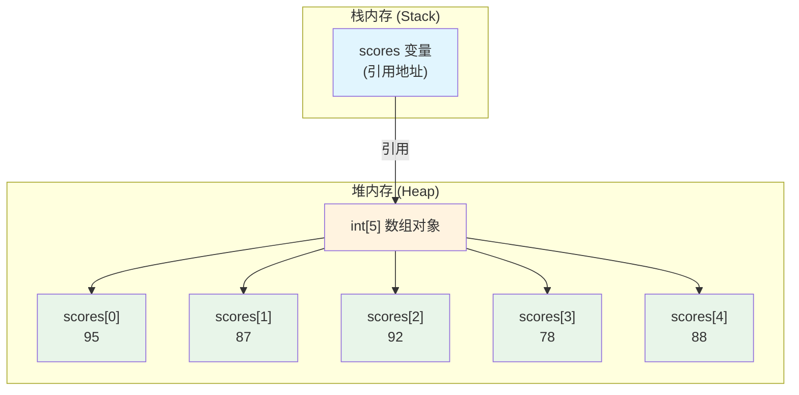
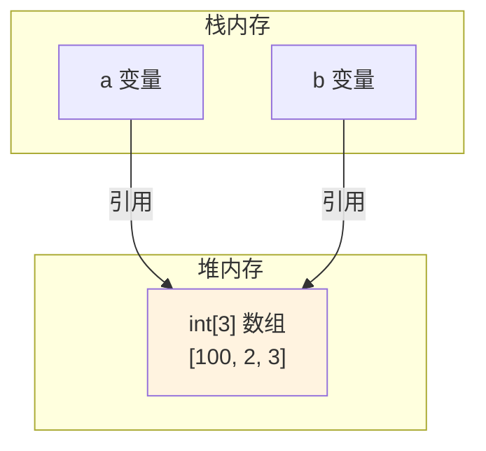
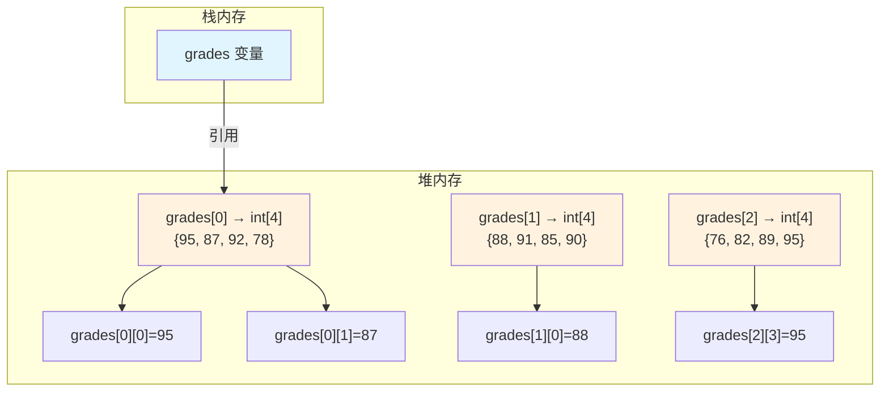

+++
title = "第11章 数组——数据的容器"
weight = 110
date = "2026-03-30T14:33:56.889+08:00"
type = "docs"
description = ""
isCJKLanguage = true
draft = false
+++
# 第十一章 数组——数据的容器

> 🎭 **导演说**：想象你是一名酒店前台管理员。如果每位客人都要你记住他的名字、房间号、喜好、入住日期...恭喜你，你的大脑会原地爆炸。数组就是那个让你优雅地管理"一群相关数据"的超级武器！

在正式进入数组世界之前，让我们先聊聊：**为什么我们需要数组？**

---

## 11.1 为什么需要数组？

### 11.1.1 没有数组的日子有多惨？

假设你需要存储 5 个同学的考试成绩，你会怎么做？

```java
// 不用数组？那就只能一个一个变量名起过去
int score1 = 95;
int score2 = 87;
int score3 = 92;
int score4 = 78;
int score5 = 88;
```

看起来还好？来，现在把需求改一下：**计算这 5 个人的平均分，然后找出最高分和最低分。**

```java
// 噩梦开始
double average = (score1 + score2 + score3 + score4 + score5) / 5.0;
int max = score1;
if (score2 > max) max = score2;
if (score3 > max) max = score3;
if (score4 > max) max = score4;
if (score5 > max) max = score5;
```

好了，如果现在告诉你：**不是 5 个人，是 500 个人呢？**

你就要写 500 个变量声明，和 500 个 `if` 判断。这不是写代码，这是**行为艺术**——而且是那种会被同事打的艺术。

### 11.1.2 数组闪亮登场

**数组（Array）** 是一种用于存储**固定数量的同类型数据**的数据结构。简单来说，数组就像一排编好号的储物柜，每个格子都有自己的编号（索引），你可以根据编号快速找到对应的数据。

```java
// 一个数组搞定 500 个分数！
int[] scores = new int[500];
```

> 💡 **索引（Index）**：数组中每个位置的编号，从 0 开始。就像酒店房间号从 1 开始一样，数组索引从 0 开始——这是编程界的传统，请接受它。

### 11.1.3 数组的内存布局

下面是一个一维数组在内存中的示意图：



> 💡 **栈 vs 堆**：Java 内存分为栈（Stack）和堆（Heap）。基本类型变量（`int`、`double` 等）的值存在栈中，而数组这种**对象**存储在堆内存中。`scores` 变量本身只是存在栈中的一个"地址指针"，指向堆里的实际数组对象。

### 11.1.4 数组的超能力

| 超能力 | 说明 |
|--------|------|
| 🚀 **批量操作** | 一行循环搞定 N 个数据 |
| 📦 **连续存储** | 内存连续，访问速度飞快 |
| 🔢 **索引访问** | O(1) 时间复杂度随机访问 |
| 🔄 **可遍历** | 可以用循环逐个处理每个元素 |

### 11.1.5 数组的局限性

数组虽好，但也有它的缺点：

1. **长度固定** — 创建时就确定了大小，不能动态伸缩
2. **类型单一** — 只能存一种类型的数据
3. **插入/删除效率低** — 中间位置的操作需要移动大量元素

> 📝 这些局限性催生了后续的数据结构，比如 `ArrayList`（动态数组）、`LinkedList`（链表）等。但数组依然是**最基础、最重要**的数据结构，理解它，你就算入门内功了！

---

## 11.2 一维数组

### 11.2.1 数组的声明

一维数组的声明有两种常见方式：

```java
// 方式一：类型[] 变量名（推荐，类型清晰）
int[] scores;

// 方式二：类型 变量名[]（C语言风格，Java也支持）
int scores2[];
```

> 💡 **推荐方式一**！`int[] scores` 读作"一个 `int` 类型的数组"，语义更清晰。`int scores[]` 容易让人误以为"一个 `int` 变量叫 `scores`"。

### 11.2.2 数组的创建

声明之后，还需要创建数组（分配内存空间）。

```java
// 方式一：先声明，后创建
int[] scores;
scores = new int[5]; // 创建长度为5的int数组，默认值为0

// 方式二：声明和创建一起完成
int[] scores = new int[5];

// 方式三：直接初始化（静态初始化）
int[] scores = {95, 87, 92, 78, 88};

// 方式四：用 new 加初始化（适合数组较长的场景）
int[] scores = new int[]{95, 87, 92, 78, 88};
```

> ⚠️ **注意**：`new int[5]` 创建数组时，整型数组的默认值为 `0`，浮点型为 `0.0`，布尔型为 `false`，引用类型为 `null`。Java 会自动给数组元素初始化，这是贴心还是懒？——两者都有！

### 11.2.3 数组的访问

通过索引访问数组元素，索引从 `0` 开始：

```java
int[] scores = {95, 87, 92, 78, 88};

// 访问第一个元素（索引0）
System.out.println("第一个成绩：" + scores[0]); // 95

// 访问第三个元素（索引2）
System.out.println("第三个成绩：" + scores[2]); // 92

// 修改元素
scores[0] = 100; // 把第一个成绩改成100
System.out.println("修改后第一个成绩：" + scores[0]); // 100

// 访问数组长度
System.out.println("数组长度：" + scores.length); // 5
```

### 11.2.4 数组的初始化小陷阱

```java
// ❌ 静态初始化时不能同时指定长度
int[] a = new int[3]{1, 2, 3}; // 编译错误！

// ✅ 正确写法：要么指定长度，要么直接给值
int[] a1 = new int[3];          // 默认值0,0,0
int[] a2 = new int[]{1, 2, 3};  // {1,2,3}
int[] a3 = {1, 2, 3};           // {1,2,3} 简化写法

// ❌ 下面的写法也是错的——分开写不能这样用{}
int[] a;
a = {1, 2, 3}; // 编译错误！静态初始化必须在一行完成
```

### 11.2.5 数组是引用类型

这是 Java 初学者非常容易踩的坑：**数组是对象，存的是引用！**

```java
int[] a = {1, 2, 3};
int[] b = a;  // b 和 a 指向同一个数组！

b[0] = 100;
System.out.println(a[0]); // 100 — 什么?! a[0]也变了?!

// 这是因为 a 和 b 只是两个"遥控器"，按的是同一个空调
```



> 💡 **引用（Reference）**：在 Java 中，数组、对象等"大块头"数据存在堆内存中，变量里只存一个"地址"（引用）。把数组赋给另一个变量，只是复制了"地址"，两者指向同一个数组对象。

### 11.2.6 猜猜输出是什么？

```java
int[] a = {1, 2, 3};
int[] b = a;
b = new int[]{4, 5, 6}; // b重新指向了新数组

System.out.println("a[0] = " + a[0]); // ???
System.out.println("b[0] = " + b[0]); // ???
```

答案：`a[0] = 1`，`b[0] = 4`。因为 `b = new int[]{4,5,6}` 让 `b` 指向了一个**全新的数组**，不再和 `a` 是同一个数组了。

---

## 11.3 数组的遍历

### 11.3.1 for 循环遍历

最传统、最通用的遍历方式：

```java
int[] scores = {95, 87, 92, 78, 88};

for (int i = 0; i < scores.length; i++) {
    System.out.println("第" + (i + 1) + "个成绩：" + scores[i]);
}
```

> 💡 **边界条件**：循环条件 `i < scores.length` 而不是 `i <= scores.length`。因为索引最大是 `length - 1`，如果写 `<=` 就会访问到 `scores[5]`——数组越界！

### 11.3.2 for-each（增强 for 循环）

JDK 5 引入了更简洁的 for-each 循环：

```java
int[] scores = {95, 87, 92, 78, 88};

for (int score : scores) {
    System.out.println("成绩：" + score);
}
```

> 💡 **for-each 的语法**：`for (元素类型 变量名 : 数组或集合)` — 每次循环，变量名就是当前元素的值。

### 11.3.3 for-each vs 普通 for

for-each 看起来很美，但不是万能的：

```java
int[] scores = {95, 87, 92, 78, 88};

// ✅ for-each 适合：只读取，不修改
for (int score : scores) {
    System.out.println(score);
}

// ❌ for-each 不能修改数组元素！
for (int score : scores) {
    score = score + 10; // 这只修改了局部变量 score，原数组不变！
}
System.out.println(scores[0]); // 仍然是 95！

// ✅ 如果要修改数组，必须用普通 for 循环
for (int i = 0; i < scores.length; i++) {
    scores[i] = scores[i] + 10; // 真正修改了原数组
}
```

### 11.3.4 实际应用：求平均分和最高分

```java
int[] scores = {95, 87, 92, 78, 88};

int sum = 0;      // 总分
int max = scores[0]; // 最高分，初始化为第一个元素
int min = scores[0]; // 最低分，初始化为第一个元素

for (int i = 0; i < scores.length; i++) {
    sum += scores[i]; // 累加总分
    if (scores[i] > max) {
        max = scores[i]; // 更新最高分
    }
    if (scores[i] < min) {
        min = scores[i]; // 更新最低分
    }
}

double average = sum / (double) scores.length;

System.out.println("总分：" + sum);
System.out.println("平均分：" + average);
System.out.println("最高分：" + max);
System.out.println("最低分：" + min);
```

输出：
```
总分：440
平均分：88.0
最高分：95
最低分：78
```

### 11.3.5 倒序遍历

有时候我们需要反向遍历：

```java
int[] scores = {95, 87, 92, 78, 88};

System.out.println("倒序打印成绩：");
for (int i = scores.length - 1; i >= 0; i--) {
    System.out.println("成绩" + (i + 1) + "：" + scores[i]);
}
```

---

## 11.4 二维数组与多维数组

### 11.4.1 为什么需要二维数组？

一维数组是"一行"数据。如果要表示**表格数据**（矩阵、座位表、游戏棋盘等），就需要二维数组了。

```java
// 3行4列的成绩表：每行是一个同学，每列是一次考试
int[][] grades = {
    {95, 87, 92, 78},  // 第1个同学的4次成绩
    {88, 91, 85, 90},  // 第2个同学的4次成绩
    {76, 82, 89, 95}   // 第3个同学的4次成绩
};
```

> 💡 **二维数组的本质**：可以理解为"数组的数组"。`grades` 是一个数组，它的每个元素又是一个 `int[]` 数组。

### 11.4.2 二维数组的内存布局



### 11.4.3 二维数组的声明和创建

```java
// 声明：类型[][] 变量名
int[][] grades;

// 创建：指定行数和列数
grades = new int[3][4]; // 3行4列，每行都有4个元素，默认值0

// 完整写法
int[][] grades = new int[3][4];

// 静态初始化
int[][] grades = {
    {95, 87, 92, 78},
    {88, 91, 85, 90},
    {76, 82, 89, 95}
};
```

### 11.4.4 不规则二维数组（重要！）

Java 的二维数组每一行的**列数可以不同**！

```java
// 不规则数组：每行的列数不一样
int[][] ragged = new int[3][]; // 先创建行

ragged[0] = new int[4]; // 第0行：4列
ragged[1] = new int[2]; // 第1行：2列
ragged[2] = new int[5]; // 第2行：5列

// 或者直接静态初始化
int[][] ragged = {
    {1, 2, 3, 4},
    {5, 6},
    {7, 8, 9, 10, 11}
};
```

> ⚠️ **重要**：声明二维数组时，**行数必须指定，列数可以省略**（因为每行列数可以不同）。但列数不能写在第一对方括号里！`new int[][4]` 是**语法错误**！

### 11.4.5 二维数组的遍历

```java
int[][] grades = {
    {95, 87, 92, 78},
    {88, 91, 85, 90},
    {76, 82, 89, 95}
};

// 普通双层 for 循环
for (int row = 0; row < grades.length; row++) {
    for (int col = 0; col < grades[row].length; col++) {
        System.out.print(grades[row][col] + "\t");
    }
    System.out.println(); // 换行
}

// for-each 方式（更简洁）
for (int[] row : grades) {
    for (int score : row) {
        System.out.print(score + "\t");
    }
    System.out.println();
}
```

### 11.4.6 三维数组（多维数组）

三维数组可以理解为"二维数组的数组"，也就是一个**立体**的数据结构：

```java
// 一个 2×3×4 的三维数组
// 可以理解为：2个班级，每个班级3个小组，每个小组4个学生
int[][][] classes = new int[2][3][4];

// 静态初始化
int[][][] classes = {
    {   // 第1个班级
        {1, 2, 3, 4},   // 第1组
        {5, 6, 7, 8},   // 第2组
        {9, 10, 11, 12} // 第3组
    },
    {   // 第2个班级
        {13, 14, 15, 16},
        {17, 18, 19, 20},
        {21, 22, 23, 24}
    }
};

// 访问元素
System.out.println(classes[1][2][3]); // 24
```

> 💡 理论上 Java 支持任意维度的数组，但实际开发中三维以上的数组很少用——维度太多脑子就转不过弯了。如果真的需要处理高维数据，通常会考虑更专业的数据结构或库。

### 11.4.7 实用场景：矩阵相乘

```java
// 3×2 矩阵 A
int[][] A = {
    {1, 2},
    {3, 4},
    {5, 6}
};

// 2×4 矩阵 B
int[][] B = {
    {1, 2, 3, 4},
    {5, 6, 7, 8}
};

// 结果矩阵 C = A × B (3×4)
int[][] C = new int[3][4];

for (int i = 0; i < 3; i++) {
    for (int j = 0; j < 4; j++) {
        for (int k = 0; k < 2; k++) {
            C[i][j] += A[i][k] * B[k][j];
        }
    }
}

// 打印结果
for (int i = 0; i < 3; i++) {
    for (int j = 0; j < 4; j++) {
        System.out.print(C[i][j] + "\t");
    }
    System.out.println();
}
```

输出：
```
11	14	17	20	
23	30	37	44	
35	46	57	68	
```

---

## 11.5 Arrays 工具类

Java 提供了 `java.util.Arrays` 工具类，里面装满了数组操作的"瑞士军刀"。熟练使用它们，能让你的代码简洁又高效。

### 11.5.1 toString() —— 一键打印数组

以前打印数组你可能写过这种噩梦：

```java
int[] arr = {95, 87, 92, 78, 88};
for (int i = 0; i < arr.length; i++) {
    System.out.print(arr[i] + (i < arr.length - 1 ? ", " : ""));
}
```

现在一行搞定：

```java
import java.util.Arrays;

int[] arr = {95, 87, 92, 78, 88};
System.out.println(Arrays.toString(arr));
```

输出：`[95, 87, 92, 78, 88]`

> 💡 `Arrays.toString()` 适用于一维数组。对于多维数组，要用 `Arrays.deepToString()`。

### 11.5.2 deepToString() —— 打印多维数组

```java
int[][] matrix = {
    {1, 2, 3},
    {4, 5, 6}
};

System.out.println(Arrays.deepToString(matrix));
```

输出：`[[1, 2, 3], [4, 5, 6]]`

### 11.5.3 sort() —— 数组排序

这是最常用的方法之一！默认升序排列：

```java
int[] arr = {95, 87, 92, 78, 88};
Arrays.sort(arr); // 排序
System.out.println(Arrays.toString(arr)); // [78, 87, 88, 92, 95]
```

**降序排序**（需要包装类型和 Comparator）：

```java
import java.util.Arrays;
import java.util.Collections;

Integer[] arr = {95, 87, 92, 78, 88};

// Java 8+ 使用 Stream API 降序
Integer[] sorted = Arrays.stream(arr)
        .sorted(Collections.reverseOrder())
        .toArray(Integer[]::new);
System.out.println(Arrays.toString(sorted)); // [95, 92, 88, 87, 78]
```

**部分排序**（只排前 n 个元素）：

```java
int[] arr = {95, 87, 92, 78, 88, 100, 60};
Arrays.sort(arr, 0, 3); // 只排序索引0到2（左闭右开）
System.out.println(Arrays.toString(arr)); // [87, 92, 95, 78, 88, 100, 60]
```

> 💡 **左闭右开**：`Arrays.sort(arr, 0, 3)` 排序索引 `[0, 3)`，即只排序 0、1、2 三个位置。这是 Java 的经典设计哲学，来自 Python 的切片风格。

### 11.5.4 binarySearch() —— 二分查找（重要前提：数组必须先排序！）

```java
int[] arr = {95, 87, 92, 78, 88};
Arrays.sort(arr); // 必须先排序！
int index = Arrays.binarySearch(arr, 92);
System.out.println("92在数组中的索引：" + index); // 4
```

> ⚠️ **警告**：二分查找**要求数组已排序**！如果数组无序，结果是未定义的（可能是负数）。

> 💡 **二分查找（Binary Search）**：一种高效的查找算法，每次把搜索范围缩小一半。查找 N 个元素最多只需要 log₂N 次比较。比如 100 万个元素，最多只要 20 次比较就能找到目标！

### 11.5.5 equals() —— 比较两个数组

```java
int[] a = {1, 2, 3};
int[] b = {1, 2, 3};
int[] c = {1, 3, 2};

System.out.println(Arrays.equals(a, b)); // true
System.out.println(Arrays.equals(a, c)); // false
```

> 💡 为什么不用 `a.equals(b)`？因为数组继承的 `Object.equals()` 比较的是引用地址，不是内容。`Arrays.equals()` 才是真正比较数组**内容**的！

### 11.5.6 fill() —— 数组填充

把数组全部填成同一个值：

```java
int[] arr = new int[5];
Arrays.fill(arr, 100); // 全部填充为100
System.out.println(Arrays.toString(arr)); // [100, 100, 100, 100, 100]

// 部分填充
int[] arr2 = new int[5];
Arrays.fill(arr2, 1, 3, 50); // 索引1到2填充为50（左闭右开）
System.out.println(Arrays.toString(arr2)); // [0, 50, 50, 0, 0]
```

### 11.5.7 copyOf() 和 copyOfRange() —— 数组复制

```java
int[] original = {10, 20, 30, 40, 50};

// 复制并指定新长度（如果新长度更长，多出的部分填0或false/null）
int[] copy1 = Arrays.copyOf(original, 3); // [10, 20, 30]
int[] copy2 = Arrays.copyOf(original, 8); // [10, 20, 30, 40, 50, 0, 0, 0]

// 复制指定范围
int[] copy3 = Arrays.copyOfRange(original, 1, 4); // [20, 30, 40] 左闭右开
```

> 💡 **数组长度不可变**：`Arrays.copyOf()` 其实是创建了一个**新数组**，然后把原数组的内容复制过去。如果你在面试中被问到"如何动态扩展数组"，标准答案就是：用 `Arrays.copyOf()` 创建一个更大的新数组，然后把原数据复制过去——这就是 `ArrayList` 内部扩容的原理！

### 11.5.8 Arrays 的全部方法一览

| 方法 | 说明 |
|------|------|
| `toString()` | 转换为一维字符串 |
| `deepToString()` | 转换为多维字符串 |
| `sort()` | 升序排序 |
| `binarySearch()` | 二分查找（需先排序） |
| `equals()` | 比较两个数组内容 |
| `fill()` | 填充数组 |
| `copyOf()` | 复制并可改变长度 |
| `copyOfRange()` | 复制指定范围 |
| `hashCode()` | 计算数组的哈希值 |
| `parallelSort()` | 多线程并行排序（大数组时更快） |

---

## 11.6 数组的常见错误

数组虽基础，但坑特别多。以下是每个 Java 程序员都踩过的"经典陷阱"。

### 11.6.1 数组越界（ArrayIndexOutOfBoundsException）

这是排名第一的错误，没有之一！

```java
int[] arr = {1, 2, 3, 4, 5};

// ❌ 越界访问！数组只有5个元素，索引0-4
System.out.println(arr[5]); // 运行时异常：ArrayIndexOutOfBoundsException

// ✅ 正确：最大索引是 length - 1
System.out.println(arr[4]); // 5

// ❌ 常见错误：循环边界写错
for (int i = 0; i <= arr.length; i++) { // 应该是 i < arr.length
    System.out.println(arr[i]); // 最后一次 i=5 会越界！
}
```

> 💡 **Java 数组不会自动检查索引**（出于性能考虑），所以越界不会在编译时报错，只会在运行时抛出 `ArrayIndexOutOfBoundsException`。记住：**索引从 0 开始，最大是 length - 1**！每次写 `arr[i]` 前，想想 `i` 的最大值会是多少。

### 11.6.2 空指针异常（NullPointerException）

```java
int[] arr;

// ❌ 数组未初始化就使用
System.out.println(arr.length); // arr 是 null，没有 length 属性！NullPointerException

// ✅ 先创建数组
arr = new int[5];
System.out.println(arr.length); // 5
```

还有一种隐蔽的情况：

```java
int[] arr = {1, 2, 3};
arr = null; // 把数组引用设为 null

// ❌ arr 现在是 null，访问会炸
System.out.println(arr[0]); // NullPointerException
```

### 11.6.3 数组静态初始化的常见错误

```java
// ❌ 不能先声明，再分开静态初始化
int[] arr;
arr = {1, 2, 3}; // 编译错误！

// ✅ 静态初始化必须在一行完成
int[] arr = {1, 2, 3};
```

```java
// ❌ 不能在静态初始化时指定长度
int[] arr = new int[3]{1, 2, 3}; // 编译错误！

// ✅ 二选一：要么指定长度，要么给值
int[] arr1 = new int[3];      // 默认值
int[] arr2 = new int[]{1, 2, 3}; // 指定值
int[] arr3 = {1, 2, 3};       // 简写
```

### 11.6.4 二维数组列数不写在第一维

```java
// ❌ 这是最常见的语法错误
int[][] arr = new int[3][4]; // 这行没问题，但是...

// ❌ 创建不规则数组时，列数不能写在第一维
int[][] ragged = new int[][4]; // 编译错误！

// ✅ 行数可以省略，列数不能省在第一维
int[][] ragged = new int[3][]; // 正确！先创建3行
ragged[0] = new int[4];
ragged[1] = new int[2];
```

### 11.6.5 用 == 比较数组

```java
int[] a = {1, 2, 3};
int[] b = {1, 2, 3};

System.out.println(a == b);       // false！比较的是引用地址，不是内容
System.out.println(a.equals(b));  // false！数组的 equals() 继承自 Object，比较引用
System.out.println(Arrays.equals(a, b)); // true！正确比较内容的方式
```

### 11.6.6 基本类型数组 vs 包装类型数组

```java
// 基本类型数组
int[] intArr = new int[3];
System.out.println(intArr[0]); // 0（自动初始化）

// 包装类型数组
Integer[] integerArr = new Integer[3];
System.out.println(integerArr[0]); // null（自动初始化为 null，不是0！）

// 所以如果对包装类型数组使用自动拆箱...
integerArr[0] = 100;
integerArr[1] = 200;
integerArr[2] = null;

int sum = integerArr[0] + integerArr[1] + integerArr[2]; // NullPointerException！ null 不能拆箱
```

### 11.6.7 在 for-each 中修改数组

```java
int[] arr = {1, 2, 3, 4, 5};

// ❌ 这样做毫无效果
for (int num : arr) {
    num = num * 2; // 修改的是循环变量 num，不是数组元素
}

// ✅ 如果要修改数组内容，必须用普通 for 循环
for (int i = 0; i < arr.length; i++) {
    arr[i] = arr[i] * 2;
}
```

### 11.6.8 错误汇总对照表

| 错误 | 原因 | 解决方案 |
|------|------|----------|
| `ArrayIndexOutOfBoundsException` | 索引超出 `[0, length-1]` | 检查循环边界 |
| `NullPointerException` | 数组未初始化或已赋值为 null | 先 `new`，后使用 |
| 编译错误：静态初始化分开写 | `arr = {1,2,3}` 不能单独用 | 必须在声明时一起写 |
| 编译错误：`new int[][4]` | 列数不能写在第一维 | `new int[3][]` |
| `a == b` 返回 false | 比较的是引用，不是内容 | 用 `Arrays.equals()` |
| `NullPointerException` 在拆箱时 | 包装类型数组元素可能是 null | 先判空或用基本类型 |

---

## 本章小结

本章我们全面学习了 Java 中的数组，内容总结如下：

1. **为什么需要数组**：解决大量同类型数据的存储和管理问题，避免写大量重复变量名和判断逻辑。

2. **一维数组**：声明 `int[] arr`、创建 `new int[5]`、静态初始化 `{1,2,3}`、索引访问 `arr[0]`。数组是**引用类型**，赋值只是复制引用。

3. **数组的遍历**：普通 `for` 循环（可修改元素）和 `for-each` 增强循环（只读遍历）。注意循环边界 `i < length` 而不是 `i <= length`。

4. **二维数组与多维数组**：本质是"数组的数组"。二维数组每行长度可以不同（不规则数组）。多维数组在游戏开发、图像处理等场景中很有用。

5. **Arrays 工具类**：提供了 `toString()`、`sort()`、`binarySearch()`、`equals()`、`fill()`、`copyOf()` 等常用方法，是处理数组的瑞士军刀。`Arrays.copyOf()` 是理解动态数组扩容的关键。

6. **数组常见错误**：数组越界（最常见！）、空指针、静态初始化语法错误、二维数组列数位置错误、`==` vs `Arrays.equals()` 的区别、基本类型和包装类型数组的默认初始化值差异。

> 🎯 **学习建议**：数组是 Java 技术栈的基石。建议大家多写代码练习，特别是边界条件的处理。下一章我们将学习字符串（String），它和数组有很多相似之处，有了数组的基础，字符串会学得更轻松！

---

*如果你觉得本章对你有帮助，欢迎推荐给正在学习 Java 的朋友！*
