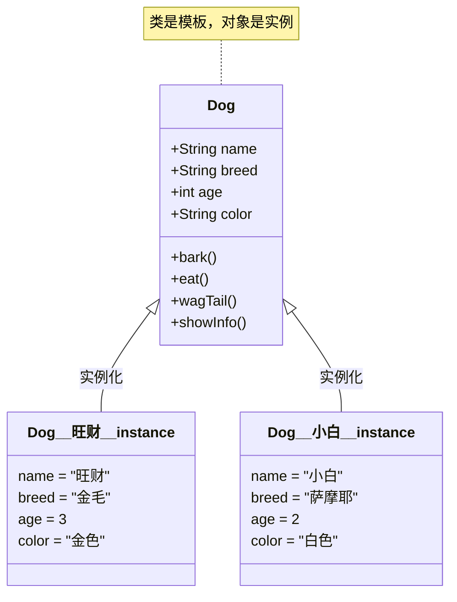

+++
title = "第12章 面向对象思想——为什么要面向对象？"
weight = 120
date = "2026-03-30T14:33:56.891+08:00"
type = "docs"
description = ""
isCJKLanguage = true
draft = false
+++
# 第十二章 面向对象思想——为什么要面向对象？

> 你有没有想过，为什么 Java 叫"面向对象"？难道 C 语言是"面向过程"就低人一等？
> 别急，这一章我们来好好聊聊这场编程界的"门派之争"，
> 顺便让你彻底搞懂：到底什么是对象？什么是类？为什么面向对象这么香？

---

## 12.1 什么是对象？什么是类？

### 12.1.1 从现实世界说起

先别急着写代码，让我们抬头看看周围的世界。

你现在坐的**椅子**是一个对象，它有属性（颜色、材质、高度），也有行为（可以坐、可以转）。

你手里的**手机**也是一个对象，它有属性（品牌、屏幕大小、电池容量），也有行为（可以打电话、可以刷视频）。

**现实世界中，万物皆对象。**

那"类"又是什么？类是对一群具有相同特征的事物的抽象描述。

比如，你家的**金毛犬**是一个对象，但你家楼下宠物店的**金毛犬**也是对象——它们都有"品种"这个特征。于是我们可以说，它们都属于**"金毛犬"这个类**。

**类**是模板，**对象**是依据这个模板造出来的具体实例。

```
类  →  模具/蓝图/设计图
对象 →  依据模具生产出来的真实产品
```

### 12.1.2 Java 中的类与对象

在 Java 中，**类（class）** 是创建对象的蓝图或模板。让我们看一个简单的例子：

```java
/**
 * 什么是类？类是一个模板，描述了一类对象的状态和行为
 * 什么是对象？对象是类的一个具体实例
 */
public class Dog {
    // ============ 属性（特征）============
    String name;   // 名字
    String breed;  // 品种
    int age;       // 年龄
    String color;  // 毛色

    // ============ 构造方法（用来创建对象）============
    public Dog(String name, String breed, int age, String color) {
        this.name = name;
        this.breed = breed;
        this.age = age;
        this.color = color;
    }

    // ============ 方法（行为）============
    // 狗会叫
    public void bark() {
        System.out.println(name + " 汪汪汪！主人，有人来了！");
    }

    // 狗会吃饭
    public void eat() {
        System.out.println(name + " 正在开心地啃骨头...");
    }

    // 狗会摇尾巴
    public void wagTail() {
        System.out.println(name + " 的尾巴疯狂摇摆～");
    }

    // 展示狗的信息
    public void showInfo() {
        System.out.println("===== " + name + " 的资料卡 =====");
        System.out.println("品种：" + breed);
        System.out.println("年龄：" + age + " 岁");
        System.out.println("毛色：" + color);
    }

    public static void main(String[] args) {
        // 使用 new 关键字，根据 Dog 类这个模板，创建两个具体的对象
        Dog dog1 = new Dog("旺财", "金毛", 3, "金色");
        Dog dog2 = new Dog("小白", "萨摩耶", 2, "白色");

        // 调用对象的方法
        dog1.showInfo();
        dog1.bark();
        dog1.eat();
        dog1.wagTail();

        System.out.println();

        dog2.showInfo();
        dog2.bark();
    }
}
```

运行结果：

```
===== 旺财 的资料卡 =====
品种：金毛
年龄：3 岁
毛色：金色
旺财 汪汪汪！主人，有人来了！
旺财 正在开心地啃骨头...
旺财 的尾巴疯狂摇摆～

===== 小白 的资料卡 =====
品种：萨摩耶
年龄：2 岁
毛色：白色
小白 汪汪汪！主人，有人来了！
```

### 12.1.3 类与对象的关系图

下面这张图展示了类与对象之间的关系：



> **图注**：Dog 是一个类模板，而"旺财"和"小白"是根据这个模板创建出来的具体对象。每个对象都有自己独立的属性值，但共享类中定义的方法。

### 12.1.4 关键术语解释

| 术语 | 解释 |
|------|------|
| **类（Class）** | 对一组对象的抽象描述，包括属性（成员变量）和行为（方法） |
| **对象（Object）** | 类的具体实例，通过 `new` 关键字创建 |
| **实例化（Instantiate）** | 从类创建对象的过程，简单说就是"造出一个对象" |
| **成员变量（Field）** | 描述对象状态的变量，也叫属性 |
| **成员方法（Method）** | 描述对象行为的函数 |

---

## 12.2 面向过程 vs 面向对象

### 12.2.1 什么是面向过程？

**面向过程（Procedural Programming）** 是一种"大事化小"的编程思想——把一个复杂的任务拆分成一系列步骤（过程/函数），然后依次执行。

打个比方：面向过程就像**写菜谱**。

```
1. 准备食材
2. 热锅
3. 放油
4. 放菜
5. 翻炒
6. 加调料
7. 出锅
```

经典的面向过程语言有 C 语言。假设我们要管理一批学生的成绩，用面向过程的方式写：

```java
public class CStyleStudent {
    public static void main(String[] args) {
        // 面向过程：用独立的变量和函数来处理数据
        String[] names = {"张三", "李四", "王五"};
        int[] scores = {85, 92, 78};

        // 需求1：打印所有学生成绩
        printAllScores(names, scores);

        // 需求2：计算平均分
        double average = calculateAverage(scores);
        System.out.println("平均分：" + average);

        // 需求3：找出最高分学生
        findTopStudent(names, scores);
    }

    // 打印所有成绩
    public static void printAllScores(String[] names, int[] scores) {
        System.out.println("===== 学生成绩 =====");
        for (int i = 0; i < names.length; i++) {
            System.out.println(names[i] + "：" + scores[i] + " 分");
        }
    }

    // 计算平均分
    public static double calculateAverage(int[] scores) {
        int sum = 0;
        for (int score : scores) {
            sum += score;
        }
        return (double) sum / scores.length;
    }

    // 找最高分学生
    public static void findTopStudent(String[] names, int[] scores) {
        int maxIndex = 0;
        for (int i = 1; i < scores.length; i++) {
            if (scores[i] > scores[maxIndex]) {
                maxIndex = i;
            }
        }
        System.out.println("最高分：" + names[maxIndex] + "，" + scores[maxIndex] + " 分");
    }
}
```

### 12.2.2 什么是面向对象？

**面向对象（Object-Oriented Programming，OOP）** 是一种"万物皆对象"的编程思想。它把现实世界中的事物抽象成对象，每个对象有自己的**数据（属性）**和**行为（方法）**，程序通过对象之间的交互来完成功能。

还是学生成绩的例子，用面向对象的方式写：

```java
/**
 * 学生类 - 抽象一个学生的特征和行为
 */
public class Student {
    // ============ 属性（特征）============
    private String name;  // 姓名
    private int score;    // 成绩

    // ============ 构造方法 ============
    public Student(String name, int score) {
        this.name = name;
        this.score = score;
    }

    // ============ getter 和 setter ============
    public String getName() {
        return name;
    }

    public int getScore() {
        return score;
    }

    // ============ 方法（行为）============
    // 自我介绍
    public void introduce() {
        System.out.println("大家好，我叫" + name + "，成绩是 " + score + " 分。");
    }

    // 成绩评价
    public void evaluate() {
        if (score >= 90) {
            System.out.println(name + " 是个大学霸！");
        } else if (score >= 70) {
            System.out.println(name + " 表现不错，继续加油！");
        } else if (score >= 60) {
            System.out.println(name + " 刚好及格，不能松懈哦～");
        } else {
            System.out.println(name + " 挂科了，得加把劲了！");
        }
    }

    // 获取等级
    public String getGrade() {
        if (score >= 90) return "A";
        if (score >= 80) return "B";
        if (score >= 70) return "C";
        if (score >= 60) return "D";
        return "F";
    }
}
```

```java
/**
 * 成绩管理器类 - 负责管理所有学生
 */
import java.util.ArrayList;
import java.util.List;

public class StudentManager {
    private List<Student> students;  // 学生列表

    public StudentManager() {
        students = new ArrayList<>();
    }

    // 添加学生
    public void addStudent(Student student) {
        students.add(student);
    }

    // 打印所有学生信息
    public void printAllStudents() {
        System.out.println("===== 全班成绩单 =====");
        for (Student s : students) {
            s.introduce();
            s.evaluate();
            System.out.println("等级：" + s.getGrade());
            System.out.println();
        }
    }

    // 计算平均分
    public double calculateAverage() {
        int sum = 0;
        for (Student s : students) {
            sum += s.getScore();
        }
        return (double) sum / students.size();
    }

    // 找最高分学生
    public void findTopStudent() {
        Student top = students.get(0);
        for (Student s : students) {
            if (s.getScore() > top.getScore()) {
                top = s;
            }
        }
        System.out.println("===== 全班最高分 =====");
        System.out.println(top.getName() + "，" + top.getScore() + " 分，等级 " + top.getGrade());
    }

    public static void main(String[] args) {
        // 创建管理器
        StudentManager manager = new StudentManager();

        // 添加学生（每个学生都是一个独立的对象）
        manager.addStudent(new Student("张三", 85));
        manager.addStudent(new Student("李四", 92));
        manager.addStudent(new Student("王五", 78));
        manager.addStudent(new Student("赵六", 95));

        // 调用管理器的方法来完成各种需求
        manager.printAllStudents();
        System.out.println("全班平均分：" + manager.calculateAverage());
        System.out.println();
        manager.findTopStudent();
    }
}
```

运行结果：

```
===== 全班成绩单 =====
大家好，我叫张三，成绩是 85 分。
张三 表现不错，继续加油！
等级：C

大家好，我叫李四，成绩是 92 分。
李四 是个大学霸！
等级：B

大家好，我叫王五，成绩是 78 分。
王五 表现不错，继续加油！
等级：C

大家好，我叫赵六，成绩是 95 分。
赵六 是个大学霸！
等级：A

全班平均分：87.5

===== 全班最高分 =====
赵六，95 分，等级 A
```

### 12.2.3 两种思想的对比

让我们用一张表来对比面向过程和面向对象：

| 对比维度 | 面向过程 | 面向对象 |
|---------|---------|---------|
| **核心思想** | 强调一步一步怎么做（算法为核心） | 强调谁来做（对象为核心） |
| **基本单位** | 函数（方法） | 类和对象 |
| **数据管理** | 数据和函数分离 | 数据和函数封装在一起 |
| **扩展方式** | 修改函数，增加新函数 | 增加新类，增加新对象 |
| **代码复用** | 通过函数调用复用 | 通过继承、组合复用 |
| **适合场景** | 简单、顺序执行的任务 | 复杂、需要模拟现实的项目 |
| **代表语言** | C、Pascal | Java、C++、Python |

### 12.2.4 为什么 Java 选择面向对象？

Java 是一门**纯面向对象**的语言（连 `main` 方法都必须写在类里）。这有几个重要原因：

1. **与现实世界对应**：现实中的事物就是对象，用面向对象来建模很自然。

2. **易于维护和扩展**：想象一下，如果要增加一个新功能，面向过程可能需要修改很多函数，而面向对象只需要增加一个新类，不会影响原有代码（开闭原则）。

3. **更好的团队协作**：不同的人可以负责不同的类，互不干扰。

> 打个比方：面向过程就像**自助餐**，你自己去拿每道菜；面向对象就像**点菜**，你告诉服务员（对象）要什么，服务员自己知道怎么去做。你不需要知道后厨怎么切菜、怎么调味——你只需要说"来一份红烧肉"。

---

## 12.3 面向对象的三大核心特性

面向对象有三大核心特性，简称 **"封装、继承、多态"**（有时也叫"封装继承多态"三剑客）。这是 Java 乃至所有 OOP 语言的基础，必须彻底搞懂。

### 12.3.1 封装（Encapsulation）

#### 什么是封装？

**封装**就是把数据和操作数据的方法打包到一起，对外隐藏内部细节，只暴露必要的接口。

用大白话说：**封装就是"藏起来，只告诉你怎么用"**。

为什么要封装？假设没有封装：

```java
// 没有封装的问题：数据完全暴露
public class BankAccount {
    public double balance;  // 余额——公开的！谁都能改！

    public static void main(String[] args) {
        BankAccount account = new BankAccount();
        account.balance = -1000;  // 余额可以是负数？银行的锅！
        System.out.println("余额：" + account.balance);
    }
}
```

余额被随意修改，变成了负数——这显然不合理。

**封装后的版本：**

```java
/**
 * 银行账户类 - 演示封装
 * 封装的核心：把数据藏起来，通过方法来控制访问
 */
public class BankAccount {
    // ============ 私有属性（隐藏起来）============
    // private 关键字：只有 BankAccount 内部能访问
    private double balance;      // 余额
    private String accountId;    // 账号
    private String password;     // 密码

    // ============ 构造方法 ============
    public BankAccount(String accountId, String password, double initialBalance) {
        this.accountId = accountId;
        this.password = password;
        // 初始化时也要校验，不能是负数
        if (initialBalance < 0) {
            System.out.println("初始化余额不能为负数！设为 0");
            this.balance = 0;
        } else {
            this.balance = initialBalance;
        }
    }

    // ============ 存款方法（公有的接口）============
    // 存款必须>=0
    public void deposit(double amount) {
        if (amount <= 0) {
            System.out.println("存款金额必须大于0！");
            return;
        }
        balance += amount;
        System.out.println("存款成功！当前余额：" + balance);
    }

    // ============ 取款方法（公有的接口）============
    // 取款必须>=0，且不能超过余额
    public void withdraw(double amount) {
        if (amount <= 0) {
            System.out.println("取款金额必须大于0！");
            return;
        }
        if (amount > balance) {
            System.out.println("余额不足！当前余额：" + balance);
            return;
        }
        balance -= amount;
        System.out.println("取款成功！当前余额：" + balance);
    }

    // ============ 查看余额（只读接口）============
    public double getBalance() {
        return balance;
    }

    // ============ 查看账号 ============
    public String getAccountId() {
        return accountId;
    }

    public static void main(String[] args) {
        BankAccount account = new BankAccount("6222XXXX1234", "123456", 1000);

        System.out.println("===== 正常操作 =====");
        account.deposit(500);   // 存款
        account.withdraw(200);  // 取款
        System.out.println("当前余额：" + account.getBalance());

        System.out.println("\n===== 异常操作 =====");
        account.deposit(-100);      // 无效：存款为负
        account.withdraw(10000);    // 无效：余额不足

        System.out.println("\n===== 尝试直接访问私有属性 =====");
        // account.balance = -1000;  // 编译错误！private 属性无法从外部访问
        // 编译器直接报错：balance has private access in BankAccount

        System.out.println("余额：" + account.getBalance() + "（只能通过方法访问）");
    }
}
```

运行结果：

```
===== 正常操作 =====
存款成功！当前余额：1500.0
取款成功！当前余额：1300.0
当前余额：1300.0

===== 异常操作 =====
存款金额必须大于0！
余额不足！当前余额：1300.0

===== 尝试直接访问私有属性 =====
余额：1300.0（只能通过方法访问）
```

#### 封装的四大好处

1. **数据安全**：外部无法直接修改内部数据，必须通过我们定义的合法方法
2. **数据验证**：方法内部可以校验输入，保证数据合理性
3. **隐藏复杂性**：使用者不需要知道内部有多复杂，调用方法就行
4. **易于维护**：内部实现改了，只要接口不变，调用方完全不用动

> **想象一下**：ATM 机就是封装的典型例子。你只需要按几个按钮（公开接口），内部怎么数钱、怎么验证密码、怎么记录流水——你统统不需要知道。

#### 访问修饰符

Java 用 `public`、`protected`、`默认（无修饰符）`、`private` 四个访问级别来控制封装：

| 修饰符 | 同类 | 同包 | 子类 | 任意位置 |
|--------|------|------|------|---------|
| `public` | ✅ | ✅ | ✅ | ✅ |
| `protected` | ✅ | ✅ | ✅ | ❌ |
| 默认（default） | ✅ | ✅ | ❌ | ❌ |
| `private` | ✅ | ❌ | ❌ | ❌ |

```java
public class AccessDemo {
    public String publicVar = "公开的 - 任何地方都能访问";
    private String privateVar = "私有的 - 只有本类能访问";
    protected String protectedVar = "受保护的 - 同包和子类能访问";
    String defaultVar = "默认的 - 同包能访问";

    public void demo() {
        // 同一个类内部，四个都能访问
        System.out.println(publicVar);
        System.out.println(privateVar);
        System.out.println(protectedVar);
        System.out.println(defaultVar);
    }
}
```

### 12.3.2 继承（Inheritance）

#### 什么是继承？

**继承**就是"子承父业"——新类可以复用已有类的属性和方法，不需要重复写代码。

用现实世界打比方：你继承了你爸的姓氏、房产——不用重新"发明"这些东西，直接拿来用。

在 Java 中：

- 被继承的类叫**父类（超类/基类）**
- 继承的类叫**子类（派生类）**
- 关键字是 `extends`（扩展）

```java
/**
 * 父类：动物
 * 定义所有动物共有的特征和行为
 */
public class Animal {
    // ============ 属性 ============
    protected String name;   // 名字（protected：子类可以直接访问）
    protected int age;       // 年龄

    // ============ 构造方法 ============
    public Animal(String name, int age) {
        this.name = name;
        this.age = age;
    }

    // ============ 通用方法 ============
    public void eat() {
        System.out.println(name + " 正在吃东西...");
    }

    public void sleep() {
        System.out.println(name + " 正在睡觉...zzZ");
    }

    public void showInfo() {
        System.out.println(name + "，" + age + " 岁");
    }
}
```

```java
/**
 * 子类：狗 - 继承自动物
 * 狗除了有动物的基本特征，还有自己独特的行为
 */
public class Dog extends Animal {
    // ============ 狗独有的属性 ============
    private String breed;  // 品种

    // ============ 构造方法 ============
    public Dog(String name, int age, String breed) {
        super(name, age);  // 调用父类的构造方法
        this.breed = breed;
    }

    // ============ 狗独有的方法 ============
    public void bark() {
        System.out.println(name + "（" + breed + "）汪汪汪！");
    }

    public void guard() {
        System.out.println(name + " 正在看家护院！");
    }

    // ============ 重写父类方法 ============
    @Override  // 注解：表示这是重写的方法，编译器会帮你检查语法
    public void eat() {
        System.out.println(name + " 正在津津有味地啃骨头...");
    }

    @Override
    public void showInfo() {
        System.out.println("===== 狗狗档案 =====");
        super.showInfo();  // 调用父类的方法
        System.out.println("品种：" + breed);
    }

    public static void main(String[] args) {
        Dog dog = new Dog("旺财", 3, "金毛");

        // 继承来的方法（从父类 Animal 那里"白嫖"来的）
        dog.eat();      // 重写了，用自己的版本
        dog.sleep();    // 继承来的，没重写，用父类的版本
        dog.showInfo();

        // 狗独有的方法
        dog.bark();
        dog.guard();
    }
}
```

运行结果：

```
旺财 正在津津有味地啃骨头...
旺财 正在睡觉...zzZ
===== 狗狗档案 =====
旺财，3 岁
品种：金毛
旺财（品种）汪汪汪！
旺财 正在看家护院！
```

#### 继承的好处

1. **代码复用**：子类可以直接使用父类的属性和方法
2. **易于扩展**：在子类中增加新功能，不用动父类
3. **符合现实**：自然界的继承关系，用继承来建模很直观

#### 继承的注意事项

- Java **不支持多继承**（一个类只能有一个直接父类），但可以通过接口实现多继承效果
- 子类可以重写（Override）父类的方法
- `private` 成员不能被继承（但可以通过 `public`/`protected` 方法间接访问）
- 构造方法不能被继承

### 12.3.3 多态（Polymorphism）

#### 什么是多态？

**多态**字面意思是"多种形态"。在 Java 中，同一个方法调用，不同对象产生不同行为。

多态让"父类引用指向子类对象"成为可能——**同一行代码，运行时才知道真正执行的是哪个版本的方法**。

#### 多态的第一种形式：方法重写（运行时多态）

同一个方法，父类和子类有不同实现：

```java
/**
 * 父类：形状
 */
public class Shape {
    public void draw() {
        System.out.println("画一个形状...");
    }

    public void erase() {
        System.out.println("擦除形状...");
    }
}
```

```java
/**
 * 子类1：圆形
 */
public class Circle extends Shape {
    @Override
    public void draw() {
        System.out.println("  ╭──────╮  ");
        System.out.println(" ╱        ╲ ");
        System.out.println("│    ●    │ ");
        System.out.println(" ╲        ╱ ");
        System.out.println("  ╰──────╯  ");
    }

    @Override
    public void erase() {
        System.out.println("擦除圆形... 完成！");
    }
}
```

```java
/**
 * 子类2：三角形
 */
public class Triangle extends Shape {
    @Override
    public void draw() {
        System.out.println("   /\\   ");
        System.out.println("  /  \\  ");
        System.out.println(" /    \\ ");
        System.out.println("/______\\");
    }

    @Override
    public void erase() {
        System.out.println("擦除三角形... 完成！");
    }
}
```

```java
/**
 * 子类3：正方形
 */
public class Square extends Shape {
    @Override
    public void draw() {
        System.out.println(" ┌────┐ ");
        System.out.println(" │    │ ");
        System.out.println(" │    │ ");
        System.out.println(" └────┘ ");
    }

    @Override
    public void erase() {
        System.out.println("擦除正方形... 完成！");
    }
}
```

```java
/**
 * 多态演示：同一个方法，不同对象，不同行为
 */
public class PolymorphismDemo {
    public static void main(String[] args) {
        // 父类引用可以指向子类对象（多态的核心语法）
        Shape s1 = new Circle();
        Shape s2 = new Triangle();
        Shape s3 = new Square();

        System.out.println("===== 多态演示 =====");

        // 同样的代码，调用的是实际对象的方法
        s1.draw();  // 输出圆形的 draw
        System.out.println();
        s2.draw();  // 输出三角形的 draw
        System.out.println();
        s3.draw();  // 输出正方形的 draw

        System.out.println("\n===== 批量操作 =====");
        // 用父类类型的数组，装着不同子类的对象
        Shape[] shapes = {new Circle(), new Triangle(), new Square()};
        for (Shape shape : shapes) {
            shape.draw();
            shape.erase();
            System.out.println();
        }
    }
}
```

运行结果：

```
===== 多态演示 =====

  ╭──────╮  
 ╱        ╲ 
│    ●    │ 
 ╲        ╱ 
  ╰──────╯  

   /\   
  /  \  
 /    \ 
/______\

 ┌────┐ 
 │    │ 
 │    │ 
 └────┘ 

===== 批量操作 =====
  ╭──────╮  
 ╱        ╲ 
│    ●    │ 
 ╲        ╱ 
  ╰──────╯  
擦除圆形... 完成！

   /\   
  /  \  
 /    \ 
/______\
擦除三角形... 完成！

 ┌────┐ 
 │    │ 
 │    │ 
 └────┘ 
擦除正方形... 完成！
```

#### 多态的第二种形式：方法重载（编译时多态）

**重载（Overload）** 是同一个类中，方法名相同但参数列表不同（参数个数、类型或顺序不同）。编译器根据参数来决定调用哪个方法，所以叫"编译时多态"。

```java
/**
 * 计算器类 - 演示方法重载
 */
public class Calculator {
    // 重载1：两个整数相加
    public int add(int a, int b) {
        System.out.println("调用：int add(int, int)");
        return a + b;
    }

    // 重载2：三个整数相加
    public int add(int a, int b, int c) {
        System.out.println("调用：int add(int, int, int)");
        return a + b + c;
    }

    // 重载3：两个浮点数相加
    public double add(double a, double b) {
        System.out.println("调用：double add(double, double)");
        return a + b;
    }

    // 重载4：字符串拼接
    public String add(String a, String b) {
        System.out.println("调用：String add(String, String)");
        return a + b;
    }

    public static void main(String[] args) {
        Calculator calc = new Calculator();

        // 编译器根据参数类型自动选择正确的方法
        System.out.println("结果：" + calc.add(1, 2));
        System.out.println("结果：" + calc.add(1, 2, 3));
        System.out.println("结果：" + calc.add(1.5, 2.5));
        System.out.println("结果：" + calc.add("Hello", "World"));
    }
}
```

运行结果：

```
调用：int add(int, int)
结果：3
调用：int add(int, int, int)
结果：6
调用：double add(double, double)
结果：4.0
调用：String add(String, String)
结果：HelloWorld
```

#### 重写 vs 重载：一张表分清楚

| 特征 | 重写（Override） | 重载（Overload） |
|------|----------------|-----------------|
| 发生位置 | 子类与父类之间 | 同一个类中 |
| 方法名 | 必须相同 | 必须相同 |
| 参数列表 | 必须完全相同 | 必须不同 |
| 返回类型 | 可以相同或 covariant | 可以不同 |
| 发生时机 | 运行时（动态绑定） | 编译时（静态绑定） |
| 关键字 | `@Override`（可选） | 无特殊关键字 |

### 12.3.4 三大特性综合示例

让我们用一个完整的例子，把封装、继承、多态串起来：

```java
/**
 * 员工系统 - 综合演示面向对象三大特性
 */

// ============ 员工父类 ============
public class Employee {
    protected String name;
    protected double baseSalary;  // 基本工资

    public Employee(String name, double baseSalary) {
        this.name = name;
        this.baseSalary = baseSalary;
    }

    // 计算月薪（被子类重写）
    public double calculateMonthlySalary() {
        return baseSalary;
    }

    public void showInfo() {
        System.out.println("姓名：" + name + "，月薪：" + calculateMonthlySalary());
    }
}

// ============ 程序员（子类） ============
class Programmer extends Employee {
    private double bonus;  // 奖金

    public Programmer(String name, double baseSalary, double bonus) {
        super(name, baseSalary);
        this.bonus = bonus;
    }

    @Override
    public double calculateMonthlySalary() {
        // 月薪 = 基本工资 + 奖金
        return baseSalary + bonus;
    }
}

// ============ 经理（子类） ============
class Manager extends Employee {
    private int teamSize;  // 团队规模

    public Manager(String name, double baseSalary, int teamSize) {
        super(name, baseSalary);
        this.teamSize = teamSize;
    }

    @Override
    public double calculateMonthlySalary() {
        // 经理有管理津贴
        return baseSalary + teamSize * 500;
    }
}

// ============ 测试类 ============
class OOPDemo {
    public static void main(String[] args) {
        System.out.println("===== 面向对象三大特性综合演示 =====\n");

        // 多态：父类引用指向子类对象
        Employee emp1 = new Programmer("张三（程序员）", 8000, 3000);
        Employee emp2 = new Manager("李四（经理）", 10000, 8);
        Employee emp3 = new Employee("王五（普通员工）", 5000);

        // 同一个方法调用，不同对象产生不同结果（多态）
        emp1.showInfo();
        emp2.showInfo();
        emp3.showInfo();

        System.out.println("\n===== 封装演示 =====");
        // 封装：工资数据被封装在 Employee 中，不能直接访问
        // emp1.baseSalary = -10000;  // 编译错误！protected 不能直接访问
        System.out.println("封装保证：工资数据只能通过方法访问，安全可靠！");

        System.out.println("\n===== 继承演示 =====");
        // 继承：Programmer 和 Manager 复用/重用了 Employee 的属性和方法
        System.out.println("Programmer 和 Manager 继承了 Employee，自动拥有了 name 属性！");
    }
}
```

---

## 本章小结

本章我们从**对象与类**出发，介绍了 Java 面向对象编程的基础，并深入探讨了面向过程与面向对象的区别，以及 OOP 的三大核心特性：

1. **封装（Encapsulation）**
   - 把数据和操作数据的方法打包在一起
   - 用 `private`、`public`、`protected` 等访问修饰符控制可见性
   - 好处：数据安全、隐藏复杂性、易于维护

2. **继承（Inheritance）**
   - 子类继承父类，复用父类的属性和方法
   - 关键字 `extends`，Java 单继承
   - 可以重写（Override）父类方法

3. **多态（Polymorphism）**
   - **重写**（Override）：运行时多态，父类引用指向不同子类对象时调用不同方法
   - **重载**（Overload）：编译时多态，同一个方法名不同参数列表
   - 多态让代码更灵活、可扩展

> **记住一句话**：封装是"把东西藏好"，继承是"子承父业"，多态是"同一个调用，不同的结果"。这三者配合使用，就是 Java 面向对象的精髓。

下一章我们将学习 Java 中更高级的面向对象特性——抽象类和接口，以及它们在设计模式中的妙用！
