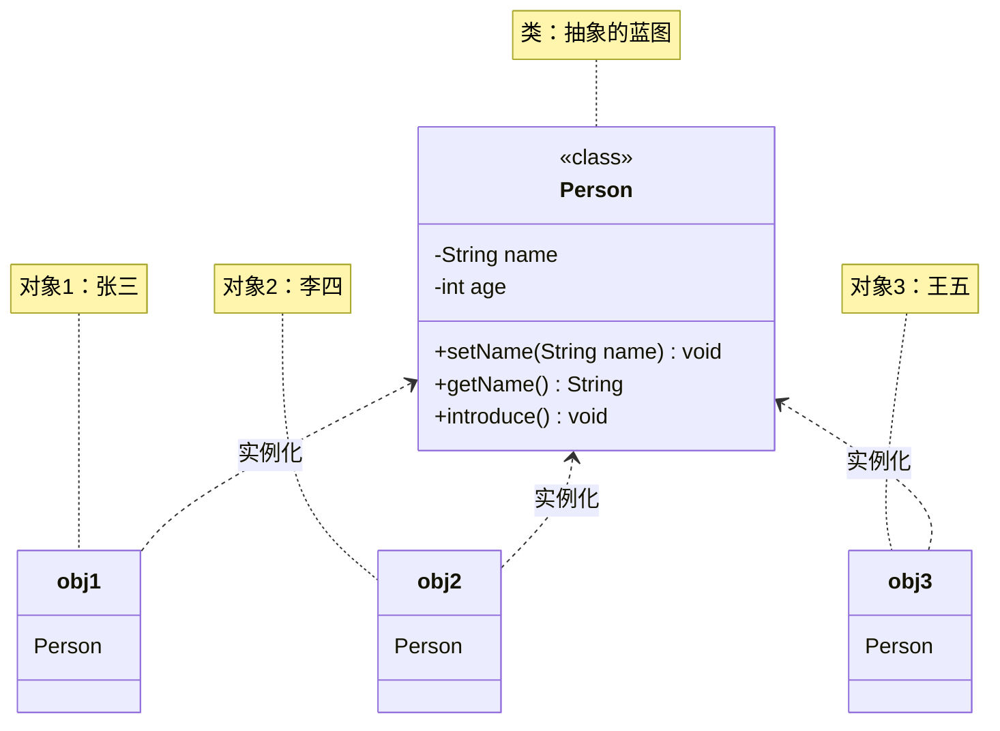

+++
title = "第13章 类与对象——Java 世界的基本单位"
weight = 130
date = "2026-03-30T14:33:56.893+08:00"
type = "docs"
description = ""
isCJKLanguage = true
draft = false
+++
# 第十三章 类与对象——Java 世界的基本单位

想象一下，如果你要建造一座房子，你需要什么？

蓝图！没有蓝图，工人们怎么知道墙要多高、门要多大、窗户朝哪开？

在 Java 的世界里，**类（Class）** 就是那张蓝图，而**对象（Object）** 就是根据这张蓝图建出来的真实房子。

> 世界上第一栋摩天大楼是芝加哥的家庭保险大楼（Home Insurance Building），建于 1885 年。它的成功靠的正是一份精心设计的结构蓝图——类比到 Java，类就是软件的"结构蓝图"。

类定义了对象的"长相"和"行为"，对象则是类"具象化"后的实体。这就是面向对象编程（Object-Oriented Programming，简称 OOP）的核心思想。

让我们用一张图来理解类与对象的关系：



如上图所示，一个类可以创建出无数个对象，每个对象都是独立的个体，拥有自己的数据。

---

## 13.1 类的定义

### 什么是类？

**类**是对一类事物的抽象描述，是一个模板。它定义了这类事物共有的**属性**（特征）和**方法**（行为）。

比如"手机"是一个类，它抽象了所有手机的共同特征：品牌、颜色、屏幕尺寸，以及打电话、发短信等功能。

### 类的声明语法

在 Java 中，类的声明语法如下：

```java
[访问修饰符] class 类名 {
    // 属性
    // 方法
}
```

### 一个完整的类示例

让我们来定义一个"学生"类：

```java
// 学生类 - 类的定义
public class Student {
    // ==================== 属性（特征）====================
    // 姓名
    String name;
    // 年龄
    int age;
    // 学号
    String studentId;
    // 成绩
    double score;

    // ==================== 方法（行为）====================
    // 自我介绍
    void introduce() {
        System.out.println("大家好，我叫" + name + "，今年" + age + "岁，学号是" + studentId);
    }

    // 考试
    void takeExam(double examScore) {
        this.score = examScore;
        System.out.println(name + "考试得了" + score + "分");
    }

    // 学习
    void study() {
        System.out.println(name + "正在努力学习...");
    }
}
```

### 类的命名规范

> **小贴士**：类的命名可不是随便来的，Java 有一套约定俗成的规矩：
> - 类名必须以**字母**、**下划线（_）** 或 **美元符号（$）** 开头
> - 建议使用**帕斯卡命名法**（PascalCase）：每个单词首字母大写，如 `Student`, `Person`, `HomeWorkManager`
> - 类名最好见名知意，别起名叫 `A` 或 `TempClass`，那是给自己挖坑

```java
// ✅ 好的类名
public class Student {}
public class UserAccount {}
public class ShoppingCart {}

// ❌ 不好的类名
public class a {}
public class temp {}
public class AB {}
```

### 一个源文件一个 public 类

> **注意**：每个 `.java` 源文件中，可以有多个类，但**最多只能有一个 `public` 类**，且文件名必须与 `public` 类名保持一致。

```java
// 文件名必须是 Person.java
public class Person {
    String name;
}

class Teacher {  // 非 public 类，同一个文件里可以有多个
    String subject;
}
```

---

## 13.2 属性（成员变量 / Field）

### 什么是属性？

**属性（Field）**，也叫成员变量，是定义在类内部、方法外部的变量。属性描述了对象的状态或特征。

打个比方：如果类是"人类"的蓝图，那么属性就是每个人的身高、体重、肤色、血型等特征。

### 属性的声明

```java
[访问修饰符] 数据类型 属性名 [= 初始值];
```

### 属性示例

```java
public class Dog {
    // ==================== 属 性 ====================
    // 名字
    public String name;           // public 表示公开访问
    // 年龄
    private int age;             // private 表示私有访问
    // 品种
    String breed;                // 默认访问权限（包级私有）
    // 颜色
    protected String color;      // protected 表示受保护访问
    // 体重
    double weight = 5.0;         // 有默认值 5.0

    // 静态属性（所有对象共享）
    static String species = "犬科";  // 狗都是犬科，这个属性属于类本身
}
```

### 属性的默认值

> **重要**：如果定义属性时没有赋初值，Java 会自动给出默认值。这可是基本类型和引用类型的重要区别之一：

| 数据类型 | 默认值 |
|---------|--------|
| byte、short、int、long | 0、0L、0 |
| float、double | 0.0f、0.0d |
| char | '\u0000'（空字符） |
| boolean | false |
| 引用类型（String、数组、对象等） | null（空引用） |

```java
public class DefaultValueDemo {
    // 没赋初值，看看默认值是什么
    int integerField;
    double doubleField;
    boolean booleanField;
    String stringField;

    public static void main(String[] args) {
        DefaultValueDemo demo = new DefaultValueDemo();
        System.out.println("int 默认值: " + demo.integerField);           // 0
        System.out.println("double 默认值: " + demo.doubleField);          // 0.0
        System.out.println("boolean 默认值: " + demo.booleanField);      // false
        System.out.println("String 默认值: " + demo.stringField);         // null
    }
}
```

### 实例属性 vs 静态属性

```java
public class Counter {
    int instanceCount = 0;           // 实例属性：每个对象独立一份
    static int staticCount = 0;      // 静态属性：所有对象共享一份

    public Counter() {
        instanceCount++;
        staticCount++;
    }

    public void showCounts() {
        System.out.println("实例属性计数: " + instanceCount);
        System.out.println("静态属性计数: " + staticCount);
    }

    public static void main(String[] args) {
        Counter c1 = new Counter();
        c1.showCounts();  // 实例=1, 静态=1

        Counter c2 = new Counter();
        c1.showCounts();  // c1的实例=1, 静态=2
        c2.showCounts();  // c2的实例=1, 静态=2
    }
}
```

运行结果：
```
实例属性计数: 1
静态属性计数: 1
实例属性计数: 1
静态属性计数: 2
实例属性计数: 1
静态属性计数: 2
```

---

## 13.3 方法（成员方法）

### 什么是方法？

**方法（Method）** 是定义在类内部的函数，描述了对象的行为或功能。

如果说属性是对象的"静态特征"（如身高、体重），那么方法就是对象的"动态行为"（如走路、跑步、吃饭）。

### 方法的声明语法

```java
[访问修饰符] 返回类型 方法名(参数列表) {
    // 方法体
    return 结果;  // 如果返回类型不是 void
}
```

### 方法示例

```java
public class Calculator {
    // 加法
    public int add(int a, int b) {
        return a + b;
    }

    // 减法
    public int subtract(int a, int b) {
        return a - b;
    }

    // 乘法
    public double multiply(double a, double b) {
        return a * b;
    }

    // 除法（注意除数为0的情况）
    public double divide(double a, double b) {
        if (b == 0) {
            System.out.println("错误：除数不能为0！");
            return 0;
        }
        return a / b;
    }

    // 无返回值的方法
    public void printResult(double result) {
        System.out.println("计算结果是: " + result);
    }

    // main 方法，程序入口
    public static void main(String[] args) {
        Calculator calc = new Calculator();

        int sum = calc.add(10, 5);
        calc.printResult(sum);  // 计算结果是: 15

        double quotient = calc.divide(10, 3);
        calc.printResult(quotient);  // 计算结果是: 3.3333333333333335
    }
}
```

### 方法的命名规范

> **小贴士**：方法的命名也有讲究：
> - 建议使用**驼峰命名法**（camelCase）：第一个单词小写，后续单词首字母大写
> - 方法名最好用**动词**开头： 如 `getName()`, `setAge()`, `calculateScore()`
> - 避免使用无意义的名称如 `doSomething()`

```java
// ✅ 好的方法名
public void setName(String name) {}
public int getAge() {}
public void calculateTotalPrice() {}
public boolean isAdult() {}

// ❌ 不好的方法名
public void do() {}
public void calc() {}
public void set(String n) {}
```

### 方法的参数传递

Java 中，方法的参数传递是**值传递**：

- **基本类型**：传递的是值的副本，方法内修改不影响原值
- **引用类型**：传递的是引用的副本（地址值），通过引用可以修改对象内容

```java
public class ParameterPassDemo {
    // 基本类型参数 - 值传递
    public void increment(int num) {
        num = num + 10;
        System.out.println("方法内 num = " + num);  // 20
    }

    // 引用类型参数 - 可以修改对象内容
    public void incrementAge(Person p) {
        p.age = p.age + 1;
        System.out.println("方法内 p.age = " + p.age);  // 21
    }

    public static void main(String[] args) {
        ParameterPassDemo demo = new ParameterPassDemo();

        // 基本类型测试
        int number = 10;
        demo.increment(number);
        System.out.println("方法外 number = " + number);  // 10，未变化！

        // 引用类型测试
        Person person = new Person();
        person.age = 20;
        demo.incrementAge(person);
        System.out.println("方法外 person.age = " + person.age);  // 21，变化了！
    }
}

// 简单的 Person 类（放在同一个文件或单独定义）
class Person {
    String name;
    int age = 0;
}
```

---

## 13.4 访问修饰符——成员的"门禁卡"

### 什么是访问修饰符？

**访问修饰符（Access Modifier）** 就像建筑物里的门禁卡，决定了谁可以进入（访问）你的类、属性和方法。

想象一下：一栋大楼里有公共区域（人人可进）、员工区域（需要员工卡）、经理办公室（需要经理卡）、还有私人保险箱（只有你自己能开）。

Java 也有类似的四级访问控制。

### 四种访问修饰符

| 修饰符 | 同一个类 | 同一个包 | 子类 | 其他包 |
|--------|---------|---------|------|--------|
| `public`（公开） | ✅ | ✅ | ✅ | ✅ |
| `protected`（受保护） | ✅ | ✅ | ✅ | ❌ |
| `default`（默认/包级私有） | ✅ | ✅ | ❌ | ❌ |
| `private`（私有） | ✅ | ❌ | ❌ | ❌ |

### 详细解释与代码演示

#### 1. `public`——完全公开

```java
// Animal.java
public class Animal {
    // 公开属性和方法 - 任何地方都能访问
    public String name;

    public void eat() {
        System.out.println(name + "正在吃东西...");
    }
}
```

```java
// 任何类都能访问 public 成员
public class PublicAccessDemo {
    public static void main(String[] args) {
        Animal animal = new Animal();
        animal.name = "小猫咪";  // ✅ 可以访问
        animal.eat();            // ✅ 可以访问
    }
}
```

#### 2. `private`——完全私密的

> **重要提示**：`private` 是面向对象"封装"概念的基础。通常的做法是：属性用 `private` 修饰（保护数据），然后通过 `public` 方法来访问和修改（提供受控的访问接口）。

```java
public class BankAccount {
    // 私有属性 - 只有 BankAccount 类自己能访问
    private double balance;

    // 公开方法 - 外部想查看余额？走正规渠道
    public double getBalance() {
        return balance;
    }

    // 公开方法 - 存钱
    public void deposit(double amount) {
        if (amount > 0) {
            balance += amount;
            System.out.println("存款成功！当前余额: " + balance);
        } else {
            System.out.println("存款金额必须为正数！");
        }
    }

    // 公开方法 - 取钱（可以加各种限制）
    public void withdraw(double amount) {
        if (amount > 0 && amount <= balance) {
            balance -= amount;
            System.out.println("取款成功！当前余额: " + balance);
        } else {
            System.out.println("余额不足或金额无效！");
        }
    }
}
```

```java
public class PrivateAccessDemo {
    public static void main(String[] args) {
        BankAccount account = new BankAccount();

        // account.balance = 1000000;  // ❌ 编译错误！不能直接访问私有属性
        // account.balance;           // ❌ 编译错误！

        account.deposit(1000);        // ✅ 正常操作
        account.withdraw(300);        // ✅ 正常操作
        System.out.println("当前余额: " + account.getBalance());  // 700.0
    }
}
```

#### 3. `protected`——子类专属

```java
// package1/Animal.java
package package1;

public class Animal {
    protected String name = "动物";
    protected void protectedMethod() {
        System.out.println("这是受保护的方法");
    }
}
```

```java
// package1/Dog.java（同包）
package package1;

public class Dog extends Animal {
    public void test() {
        this.name = "小狗";           // ✅ 同包可以访问
        this.protectedMethod();       // ✅ 同包可以访问
    }
}
```

```java
// package2/Husky.java（不同包，但继承自 Animal）
package package2;

import package1.Animal;

public class Husky extends Animal {
    public void test() {
        this.name = "哈士奇";        // ✅ 子类可以访问 protected 属性
        this.protectedMethod();       // ✅ 子类可以访问 protected 方法
    }
}
```

#### 4. `default`（默认）——包级私有

```java
// 没有写修饰符，就是 default（包级私有）
class DefaultDemo {
    String defaultField = "默认访问";

    void defaultMethod() {
        System.out.println("这是默认访问级别的方法");
    }
}
```

> **总结**：实际开发中最常用的组合是：**属性用 `private` 保护起来，通过 `public` 方法来访问和修改**。这样可以防止外部随意破坏对象的数据完整性。

---

## 13.5 封装——把数据藏起来

### 什么是封装？

**封装（Encapsulation）** 是面向对象编程的三大特性之一（另外两个是继承和多态）。

简单来说，封装就是：
> **把数据藏起来（属性私有化），提供统一的访问入口（get/set 方法）**

就像一台洗衣机，你不需要知道它内部是怎么转的、怎么加洗涤剂的，你只需要按几个按钮（公共接口），洗衣机就帮你把衣服洗好了。

### 为什么要封装？

> **问题**：如果属性直接用 `public`，外部可以随意修改，会发生什么？

```java
// ❌ 没有封装的糟糕设计
class BadStudent {
    public int age;  // 任何人都能改
}

public class BadDesignDemo {
    public static void main(String[] args) {
        BadStudent student = new BadStudent();
        student.age = -100;  // 年龄可以是负数？！这不科学！
        student.age = 999;   // 年龄999岁？你在逗我？
    }
}
```

### 正确的封装方式

```java
// ✅ 封装后的 Student 类
public class Student {
    // 第一步：把属性藏起来（私有化）
    private String name;
    private int age;
    private String studentId;

    // 第二步：提供公开的访问方法（getter/setter）

    // 姓名 getter
    public String getName() {
        return name;
    }

    // 姓名 setter（带验证）
    public void setName(String name) {
        if (name == null || name.trim().isEmpty()) {
            System.out.println("姓名不能为空！");
            return;
        }
        this.name = name;
    }

    // 年龄 getter
    public int getAge() {
        return age;
    }

    // 年龄 setter（带验证！年龄不能是负数）
    public void setAge(int age) {
        if (age < 0) {
            System.out.println("年龄不能为负数！");
            return;
        }
        if (age > 150) {
            System.out.println("年龄不能超过150岁！");
            return;
        }
        this.age = age;
    }

    // 学号 getter（只提供 get，不提供 set，入学后学号不能改）
    public String getStudentId() {
        return studentId;
    }

    // 私有方法，辅助验证（外部不需要知道）
    private boolean isValidStudentId(String id) {
        return id != null && id.length() == 10;
    }

    // 自我介绍
    public void introduce() {
        System.out.println("大家好，我叫" + name + "，今年" + age + "岁，学号是" + studentId);
    }
}
```

```java
public class EncapsulationDemo {
    public static void main(String[] args) {
        Student student = new Student();

        // 通过 setter 设置值，顺便验证
        student.setName("张三");
        student.setAge(20);
        // student.setStudentId("S123456789");  // 假设有设置方法

        student.introduce();

        // 尝试设置非法值
        student.setAge(-5);   // 输出：年龄不能为负数！
        student.setAge(200);  // 输出：年龄不能超过150岁！
        student.setName("");  // 输出：姓名不能为空！

        // 通过 getter 获取值
        System.out.println("当前姓名: " + student.getName());
        System.out.println("当前年龄: " + student.getAge());
    }
}
```

运行结果：
```
大家好，我叫张三，今年20岁，学号是null
年龄不能为负数！
年龄不能超过150岁！
姓名不能为空！
当前姓名: 张三
当前年龄: 20
```

### 封装的好处

> **总结封装的好处**：
> 1. **数据安全**：通过验证逻辑，防止非法数据
> 2. **隐藏实现细节**：外部不需要知道内部怎么实现的
> 3. **统一接口**：所有访问都通过方法进行，便于维护和扩展
> 4. **解耦合**：内部改用其他实现，外部代码不用动

---

## 13.6 构造方法——对象的诞生仪式

### 什么是构造方法？

**构造方法（Constructor）** 是一种特殊的方法，在创建对象时自动被调用。它负责**初始化对象**，也就是给对象的属性设置初始值。

如果说 new 关键字是"生孩子"的动作，那么构造方法就是"产房里护士给宝宝做的第一套体检和初始化"。

### 构造方法的特点

> **重要规则**：
> - 构造方法**没有返回类型**（连 void 都没有）
> - 构造方法**名字必须和类名完全相同**
> - 如果不写构造方法，Java 会自动提供一个**默认的无参构造方法**
> - 一旦自己写了构造方法，Java 就不会再提供默认构造方法了

### 无参构造方法

```java
public class Person {
    private String name;
    private int age;

    // 无参构造方法
    public Person() {
        System.out.println("Person 构造方法被调用了！");
        name = "无名氏";
        age = 0;
    }

    public void introduce() {
        System.out.println("我叫" + name + "，今年" + age + "岁");
    }

    public static void main(String[] args) {
        Person p = new Person();  // 创建对象时自动调用构造方法
        p.introduce();  // 我叫无名氏，今年0岁
    }
}
```

### 带参构造方法

```java
public class Person {
    private String name;
    private int age;

    // 无参构造方法
    public Person() {
        this.name = "无名氏";
        this.age = 0;
    }

    // 有参构造方法 - 方便初始化
    public Person(String name, int age) {
        this.name = name;
        this.age = age;
    }

    // 只提供姓名的构造方法
    public Person(String name) {
        this.name = name;
        this.age = 0;
    }

    public void introduce() {
        System.out.println("我叫" + name + "，今年" + age + "岁");
    }

    public static void main(String[] args) {
        Person p1 = new Person();                 // 调用无参构造
        Person p2 = new Person("张三", 25);       // 调用带两个参数的构造
        Person p3 = new Person("李四");           // 调用带一个参数的构造

        p1.introduce();  // 我叫无名氏，今年0岁
        p2.introduce();  // 我叫张三，今年25岁
        p3.introduce();  // 我叫李四，今年0岁
    }
}
```

### this() 调用其他构造方法

```java
public class User {
    private String username;
    private String email;
    private int age;

    // 调用这个构造方法时，会先调用下面的无参构造
    public User() {
        this("默认用户", "default@example.com", 0);
        // 注意：this() 必须放在第一行！
    }

    // 完整参数的构造方法
    public User(String username, String email, int age) {
        this.username = username;
        this.email = email;
        this.age = age;
    }

    public void showInfo() {
        System.out.println("用户名: " + username + ", 邮箱: " + email + ", 年龄: " + age);
    }

    public static void main(String[] args) {
        User user = new User();  // 会先打印 "正在初始化..."
        user.showInfo();
    }
}
```

### 构造方法的重载

**构造方法重载（Overloading）**：同一个类中可以定义多个构造方法，只要参数列表不同即可。这给了创建对象时不同的初始化方式。

```java
public class Rectangle {
    private double width;
    private double height;

    // 无参构造 - 默认是正方形，边长为1
    public Rectangle() {
        this.width = 1;
        this.height = 1;
    }

    // 单参数构造 - 正方形，边长为指定值
    public Rectangle(double side) {
        this.width = side;
        this.height = side;
    }

    // 双参数构造 - 长方形
    public Rectangle(double width, double height) {
        this.width = width;
        this.height = height;
    }

    public double getArea() {
        return width * height;
    }

    public double getPerimeter() {
        return 2 * (width + height);
    }

    public void showInfo() {
        System.out.println("宽: " + width + ", 高: " + height);
        System.out.println("面积: " + getArea() + ", 周长: " + getPerimeter());
    }

    public static void main(String[] args) {
        Rectangle r1 = new Rectangle();           // 正方形 1x1
        Rectangle r2 = new Rectangle(5);          // 正方形 5x5
        Rectangle r3 = new Rectangle(4, 6);       // 长方形 4x6

        r1.showInfo();
        r2.showInfo();
        r3.showInfo();
    }
}
```

---

## 13.7 this 关键字

### 什么是 this？

**`this`** 是一个隐含的引用，指向当前对象（即正在执行该方法的那个对象）。

`this` 主要有三种用途：
1. **区分成员变量和局部变量**（当名字冲突时）
2. **在构造方法中调用其他构造方法**（`this(args)`）
3. **将当前对象作为参数传递给其他方法**

### 用途一：区分成员变量和局部变量

```java
public class ThisDemo1 {
    private String name;   // 成员变量（实例变量）
    private int age;       // 成员变量

    // 参数 name 和 age 是局部变量，和成员变量同名了
    public void setInfo(String name, int age) {
        // 这里的 name 和 age 是局部变量，不是成员变量
        // 那怎么给成员变量赋值呢？用 this！
        this.name = name;   // this.name 指的是成员变量，右边的是局部变量
        this.age = age;     // 同样的道理
    }

    public void introduce() {
        System.out.println("我叫" + this.name + "，今年" + this.age + "岁");
    }

    public static void main(String[] args) {
        ThisDemo1 person = new ThisDemo1();
        person.setInfo("小明", 18);
        person.introduce();  // 我叫小明，今年18岁
    }
}
```

> **图解**：`this` 就像一面镜子，"照"出当前对象自己。

### 用途二：在构造方法中调用其他构造方法

```java
public class Phone {
    private String brand;
    private String model;
    private double price;

    // 无参构造
    public Phone() {
        this("未知品牌", "未知型号", 0.0);
        // this() 调用必须放在第一行！
    }

    // 品牌和型号构造
    public Phone(String brand, String model) {
        this(brand, model, 0.0);
    }

    // 完整构造
    public Phone(String brand, String model, double price) {
        this.brand = brand;
        this.model = model;
        this.price = price;
    }

    public void showInfo() {
        System.out.println("品牌: " + brand + ", 型号: " + model + ", 价格: ¥" + price);
    }

    public static void main(String[] args) {
        Phone p1 = new Phone();
        Phone p2 = new Phone("苹果", "iPhone 15");
        Phone p3 = new Phone("三星", "Galaxy S24", 6999.0);

        p1.showInfo();  // 品牌: 未知品牌, 型号: 未知型号, 价格: ¥0.0
        p2.showInfo();  // 品牌: 苹果, 型号: iPhone 15, 价格: ¥0.0
        p3.showInfo();  // 品牌: 三星, 型号: Galaxy S24, 价格: ¥6999.0
    }
}
```

### 用途三：将当前对象作为参数传递

```java
public class Dog {
    private String name;

    public Dog(String name) {
        this.name = name;
    }

    // 把当前对象传给另一个对象
    public void makeFriend(Dog friend) {
        System.out.println(this.name + " 和 " + friend.name + " 成为了朋友！");
    }

    // 返回当前对象
    public Dog getSelf() {
        return this;  // 返回对这个对象的引用
    }

    public static void main(String[] args) {
        Dog dog1 = new Dog("旺财");
        Dog dog2 = new Dog("小白");

        dog1.makeFriend(dog2);  // 旺财 和 小白 成为了朋友！

        Dog self = dog1.getSelf();
        System.out.println("返回的是自己吗？" + (self == dog1));  // true
    }
}
```

---

## 13.8 代码块

### 什么是代码块？

**代码块（Block）** 是用 `{}` 包围起来的一段代码。Java 中有四种代码块：

1. **普通代码块**（直接写在方法里的）
2. **构造代码块**（写在类里、方法外的）
3. **静态代码块**（用 `static {}` 包裹的）
4. **同步代码块**（`synchronized {}`，多线程相关）

### 普通代码块

```java
public class NormalBlock {
    public void method() {
        // 普通代码块 - 限定局部变量的作用域
        {
            int temp = 100;
            System.out.println("普通代码块 temp = " + temp);  // 100
        }
        // temp 在这里已经不可见了

        int temp = 200;  // 合法，因为上面的 temp 已经超出作用域
        System.out.println("方法内 temp = " + temp);  // 200
    }

    public static void main(String[] args) {
        NormalBlock demo = new NormalBlock();
        demo.method();
    }
}
```

### 构造代码块

> **构造代码块**：写在类里、方法外。每次创建对象时，**在构造方法之前**自动执行。

```java
public class ConstructBlock {
    private String name;

    // 构造代码块 - 每次创建对象都会执行
    {
        System.out.println("构造代码块执行了！");
        name = "初始名字";  // 先给个默认值
    }

    // 无参构造
    public ConstructBlock() {
        System.out.println("无参构造方法被调用");
        this.name = "无参构造的名字";
    }

    // 有参构造
    public ConstructBlock(String name) {
        System.out.println("有参构造方法被调用");
        this.name = name;
    }

    public void showName() {
        System.out.println("当前 name: " + name);
    }

    public static void main(String[] args) {
        System.out.println("--- 创建第一个对象 ---");
        ConstructBlock obj1 = new ConstructBlock();

        System.out.println("--- 创建第二个对象 ---");
        ConstructBlock obj2 = new ConstructBlock("自定义名字");

        obj1.showName();
        obj2.showName();
    }
}
```

运行结果：
```
--- 创建第一个对象 ---
构造代码块执行了！        ← 先执行构造代码块
无参构造方法被调用        ← 再执行构造方法
--- 创建第二个对象 ---
构造代码块执行了！        ← 每次创建对象都会执行
有参构造方法被调用
当前 name: 无参构造的名字
当前 name: 自定义名字
```

### 静态代码块

> **静态代码块**：用 `static {}` 包裹，在**类加载时**执行，且只执行一次。

```java
public class StaticBlock {
    private static int staticVar;
    private int instanceVar;

    // 静态代码块 - 类加载时执行，只执行一次
    static {
        System.out.println("静态代码块执行了！");
        staticVar = 100;
    }

    // 构造代码块 - 每次创建对象都执行
    {
        System.out.println("构造代码块执行了！");
        instanceVar = 50;
    }

    public StaticBlock() {
        System.out.println("构造方法被调用");
    }

    public static void show() {
        System.out.println("静态变量 staticVar = " + staticVar);
    }

    public static void main(String[] args) {
        System.out.println("--- 创建第一个对象 ---");
        StaticBlock obj1 = new StaticBlock();

        System.out.println("--- 创建第二个对象 ---");
        StaticBlock obj2 = new StaticBlock();

        System.out.println("--- 调用静态方法 ---");
        StaticBlock.show();
    }
}
```

运行结果：
```
--- 创建第一个对象 ---
静态代码块执行了！        ← 只在第一次创建对象前执行一次
构造代码块执行了！
构造方法被调用
--- 创建第二个对象 ---
构造代码块执行了！        ← 每次创建对象都会执行
构造方法被调用
--- 调用静态方法 ---
静态变量 staticVar = 100
```

### 代码块的执行顺序

> **总结代码块的执行顺序**：
> ```
> 父类静态代码块 → 子类静态代码块 → 父类构造代码块 → 父类构造方法 → 子类构造代码块 → 子类构造方法
> ```
> 静态代码块只执行一次（类加载时），构造代码块每次创建对象都执行。

---

## 13.9 对象的创建与内存分配

### Java 的内存分区

Java 运行时内存主要分为三个区域：

| 区域 | 说明 |
|------|------|
| **栈（Stack）** | 存放**基本类型变量**和**对象的引用**（地址）。方法调用时创建栈帧，方法结束时栈帧销毁。 |
| **堆（Heap）** | 存放**所有 new 出来的对象**。垃圾回收器管理这块内存。 |
| **方法区（Method Area）** | 存放**类的信息**（类名、方法、属性等）和**静态变量**。 |

### 对象的创建过程

当你执行 `new Person()` 时，JVM 做了以下事情：

```java
public class MemoryDemo {
    public static void main(String[] args) {
        // new 关键字创建对象的过程
        Person person = new Person("张三", 20);
        person.introduce();

        // 基本类型变量 - 直接存在栈里
        int age = 25;
        String name = "李四";  // String 是引用类型，但字符串常量在方法区

        // 引用传递
        Person p2 = person;  // p2 和 person 指向同一个对象
        p2.introduce();      // 同样输出"张三"
    }
}

class Person {
    private String name;
    private int age;

    public Person(String name, int age) {
        this.name = name;
        this.age = age;
    }

    public void introduce() {
        System.out.println("我叫" + name + "，今年" + age + "岁");
    }
}
```

### 图解内存分配

```
内存结构图：

┌─────────────────────────────────────────────────────┐
│                    方法区 (Method Area)              │
│  ┌─────────────────┐  ┌─────────────────────────┐   │
│  │   Person 类信息   │  │  字符串常量池           │   │
│  │  - name 属性     │  │  "张三"                 │   │
│  │  - age 属性     │  │  "李四"                 │   │
│  │  - introduce()  │  │  "我叫"                 │   │
│  └─────────────────┘  └─────────────────────────┘   │
└─────────────────────────────────────────────────────┘
                              ▲
                              │ 引用
┌─────────────────────────────────────────────────────┐
│                      堆 (Heap)                       │
│  ┌─────────────────────────────────────────────┐    │
│  │            Person 对象                       │    │
│  │  ┌─────────────┐  ┌─────────────────────┐  │    │
│  │  │ name: 张三   │  │  age: 20            │  │    │
│  │  │ (引用方法区的常量) │                    │  │    │
│  │  └─────────────┘  └─────────────────────┘  │    │
│  └─────────────────────────────────────────────┘    │
└─────────────────────────────────────────────────────┘
          ▲                              ▲
          │ person 引用                  │ p2 引用
┌─────────────────────────────────────────────────────┐
│                      栈 (Stack)                      │
│  ┌─────────────────┐  ┌─────────────────────────┐   │
│  │ person: 0x1234   │  │ p2: 0x1234 (同地址)     │   │
│  └─────────────────┘  └─────────────────────────┘   │
│  ┌─────────────────┐  ┌─────────────────────────┐   │
│  │ age: 25 (int)   │  │ name: "李四" (引用)     │   │
│  └─────────────────┘  └─────────────────────────┘   │
└─────────────────────────────────────────────────────┘
```

### 重要概念：引用与对象

> **核心概念**：变量 `person` 只是"遥控器"，真正的对象在堆内存里。`Person person` 声明的是引用变量，它存储的是对象的内存地址。

```java
public class ReferenceDemo {
    public static void main(String[] args) {
        // person1 是引用，指向堆里的 Person 对象
        Person person1 = new Person("张三", 20);

        // person2 也是引用，指向同一个对象
        Person person2 = person1;

        // 修改的是同一个对象
        person2.setName("李四");

        System.out.println(person1.getName());  // 输出: 李四
        System.out.println(person2.getName());  // 输出: 李四
        System.out.println(person1 == person2);  // true，同一个对象

        // person3 是新的引用，指向新对象
        Person person3 = new Person("王五", 25);

        System.out.println(person1 == person3);  // false，不同对象
    }
}

class Person {
    private String name;
    private int age;

    public Person(String name, int age) {
        this.name = name;
        this.age = age;
    }

    public String getName() {
        return name;
    }

    public void setName(String name) {
        this.name = name;
    }
}
```

### 垃圾回收初步介绍

> **注意**：Java 有自动垃圾回收机制（Garbage Collection，GC）。当一个对象没有任何引用指向它时，GC 会自动回收它所占用的内存。但这只是"自动"，不是"实时"。GC 在后台不定时运行，我们不能精确控制。

```java
public class GarbageDemo {
    public static void main(String[] args) {
        Person p = new Person("小明", 18);
        p.introduce();  // 对象还活着

        p = null;  // 不再有任何引用指向这个对象，变成垃圾

        // 但什么时候被回收，不确定
        System.out.println("对象变成垃圾了，等待 GC 回收...");

        // 建议 GC 回收（不保证立即执行）
        System.gc();
    }
}
```

---

## 本章小结

本章我们学习了 Java 面向对象编程的基础——类和对象。主要内容回顾：

| 知识点 | 核心要点 |
|--------|---------|
| **类的定义** | 类是对象的蓝图，使用 `class` 关键字声明，包含属性和方法 |
| **属性（Field）** | 描述对象的状态，有实例属性和静态属性之分，有默认值 |
| **方法（Method）** | 描述对象的行为，参数传递是值传递（基本类型传值，引用类型传地址） |
| **访问修饰符** | `public` > `protected` > `default` > `private`，控制成员的可见性 |
| **封装** | 把数据藏起来（private 属性）+ 提供访问接口（get/set 方法），保护数据安全 |
| **构造方法** | 用于初始化对象，没有返回类型，名字与类名相同，支持重载 |
| **this 关键字** | 指向当前对象，用于区分成员变量/局部变量、调用其他构造方法 |
| **代码块** | 构造代码块（每次创建对象执行）+ 静态代码块（类加载时执行一次） |
| **对象创建与内存** | 对象存储在堆中，引用存储在栈中，引用指向堆中的对象 |

> **下章预告**：学会了类与对象，下一章我们将学习 Java 的另一个核心特性——**继承**。继承让你可以"站在巨人的肩膀上"，复用现有类的代码。敬请期待！
