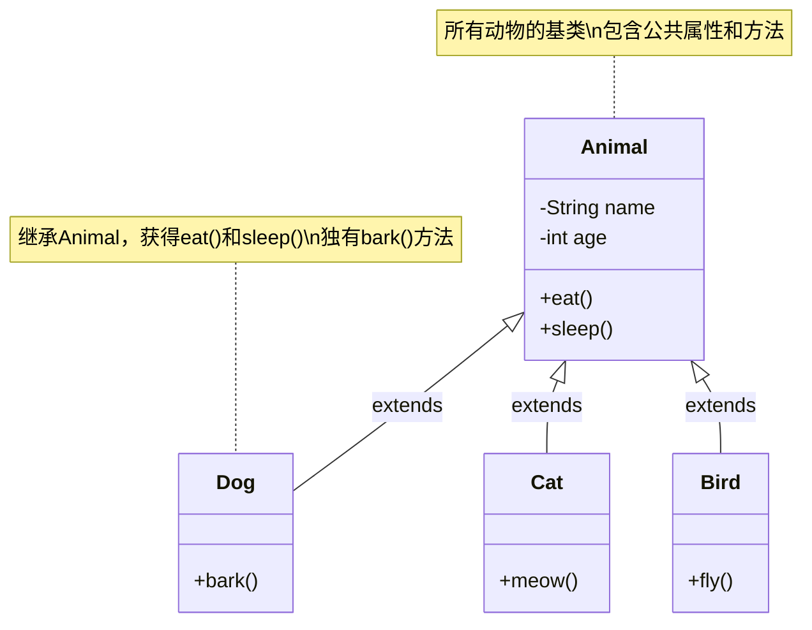
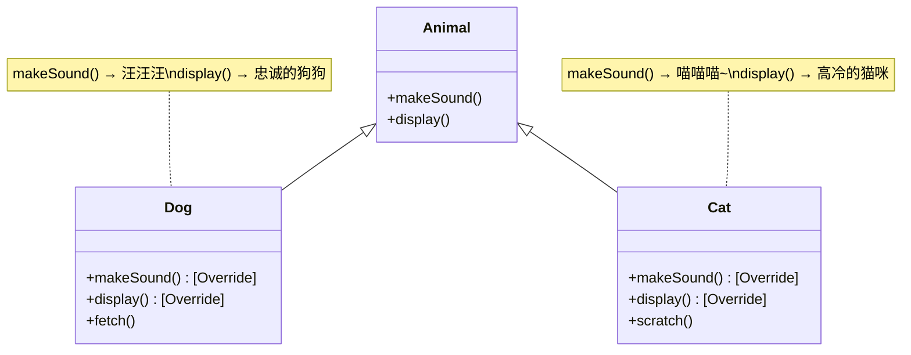
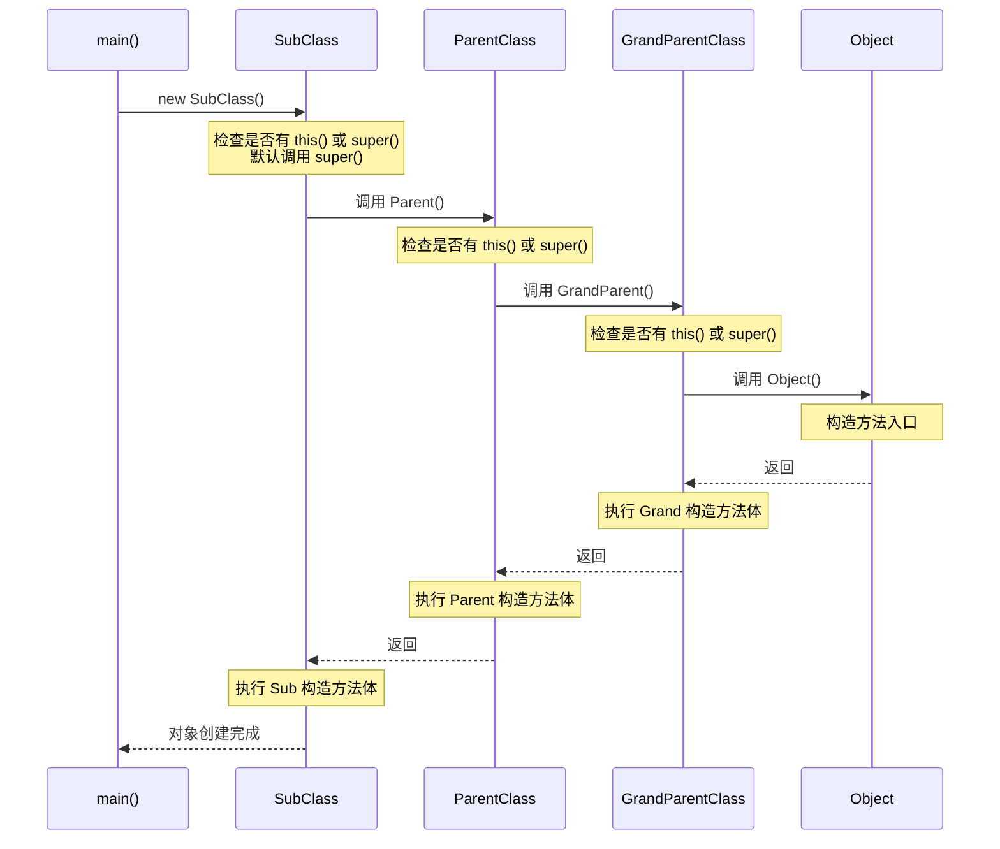

+++
title = "第14章 继承——血脉的传承"
weight = 140
date = "2026-03-30T14:33:56.894+08:00"
type = "docs"
description = ""
isCJKLanguage = true
draft = false
+++
# 第十四章 继承——血脉的传承

> "龙生龙，凤生凤，老鼠的儿子会打洞。"——这句老话完美诠释了继承的精髓。在面向对象编程的世界里，继承让我们可以站在巨人的肩膀上，复用现有代码的同时，还能青出于蓝。

## 14.1 为什么要继承？

想象一个动物园管理系统。如果让你从头开始写每个动物的类，你会崩溃——每只动物都有名字、年龄、吃和睡的行为，这些共性代码写上一百遍，你的键盘恐怕要先报废了。

**继承（Inheritance）** 就是来解决这个痛点的。它允许我们定义一个"父类"（也叫超类或基类），把公共属性和方法放进去，然后让"子类"继承父类，自动获得这些成员。这就像家族传承：祖先积累的财富和经验，后代无需重新奋斗，直接继承就能享用。

### 继承带来的三大好处

**1. 代码复用——少写代码就是赚到**

公共的属性和方法只写在父类一次，子类无需重复定义。减少代码量意味着减少 bug，也意味着你早点下班。

**2. 类型统一——多态的基石**

所有子类都可以当作父类类型来使用。一句"所有动物都会吃"，你不需要关心具体是哪只动物。这种抽象能力让程序更具扩展性。

**3. 逻辑清晰——家族关系一目了然**

继承关系本质上是一种"is-a"（是一个）关系。猫是一种动物，狗也是一种动物。这种明确的分类让代码结构清晰易懂。

```java
/**
 * 没有继承：代码重复到怀疑人生
 * 每写一个类都要重复 name、age、eat()、sleep()
 */
class Dog {
    private String name;
    private int age;

    public void eat() {
        System.out.println(name + "正在啃骨头...");
    }

    public void sleep() {
        System.out.println(name + "正在打呼噜...");
    }
}

class Cat {
    private String name;
    private int age;  // 又写一遍！

    public void eat() {
        System.out.println(name + "正在吃鱼...");
    }

    public void sleep() {
        System.out.println(name + "正在眯眼睛...");
    }
}
```

```java
/**
 * 有继承：父类定义公共成员，子类只需关注自己的独特之处
 */
class Animal {
    protected String name;  // protected：子类可见
    protected int age;

    public void eat() {
        System.out.println(name + "正在吃东西...");
    }

    public void sleep() {
        System.out.println(name + "正在睡觉...");
    }
}

class Dog extends Animal {
    public void bark() {
        System.out.println(name + "汪汪叫！");
    }
}

class Cat extends Animal {
    public void meow() {
        System.out.println(name + "喵喵叫！");
    }
}
```

## 14.2 继承的实现

在 Java 中，使用 `extends` 关键字来实现继承。注意，Java 不支持多继承——一个子类只能有一个直接父类。这是为了避免"菱形继承"这种复杂的血缘混乱。

### 继承的语法

```java
[访问修饰符] class 子类名 extends 父类名 {
    // 子类的成员
}
```

### 继承关系类图



### 完整的示例代码

```java
/**
 * 继承实战：员工管理系统
 */
public class InheritanceDemo {

    // 父类：员工
    static class Employee {
        protected String name;      // 员工姓名
        protected String department; // 部门
        protected double salary;    // 薪资

        // 构造方法
        public Employee(String name, String department) {
            this.name = name;
            this.department = department;
            this.salary = 5000;  // 默认底薪
        }

        // 通用方法：上班打卡
        public void checkIn() {
            System.out.println(name + " 在 " + department + " 部门打卡上班");
        }

        // 通用方法：领取工资
        public void getPaid() {
            System.out.println(name + " 领取工资：" + salary + " 元");
        }

        // 显示信息
        public void displayInfo() {
            System.out.println("姓名：" + name + "，部门：" + department);
        }
    }

    // 子类：程序员（继承自员工）
    static class Programmer extends Employee {
        private String[] programmingLanguages;  // 编程语言技能

        public Programmer(String name, String department, String[] languages) {
            super(name, department);  // 调用父类构造方法
            this.programmingLanguages = languages;
            this.salary = 15000;      // 程序员的薪资更高
        }

        @Override
        public void displayInfo() {
            super.displayInfo();  // 调用父类的方法
            System.out.println("技能：" + String.join(", ", programmingLanguages));
            System.out.println("职业：程序员");
        }

        // 独有方法：写代码
        public void coding() {
            System.out.println(name + " 正在写 Java 代码...");
        }
    }

    // 子类：经理（继承自员工）
    static class Manager extends Employee {
        private int teamSize;  // 团队规模

        public Manager(String name, String department, int teamSize) {
            super(name, department);
            this.teamSize = teamSize;
            this.salary = 25000;
        }

        @Override
        public void displayInfo() {
            super.displayInfo();
            System.out.println("团队规模：" + teamSize + " 人");
            System.out.println("职业：经理");
        }

        // 独有方法：开会
        public void holdMeeting() {
            System.out.println(name + " 正在主持会议...");
        }
    }

    public static void main(String[] args) {
        System.out.println("=== 继承实战演示 ===\n");

        // 创建普通员工
        Employee emp = new Employee("张三", "行政部");
        emp.checkIn();
        emp.getPaid();
        emp.displayInfo();

        System.out.println();

        // 创建程序员
        Programmer programmer = new Programmer(
            "李四",
            "研发部",
            new String[]{"Java", "Python", "Go"}
        );
        programmer.checkIn();
        programmer.getPaid();
        programmer.displayInfo();
        programmer.coding();  // 独有方法

        System.out.println();

        // 创建经理
        Manager manager = new Manager("王五", "管理层", 20);
        manager.checkIn();
        manager.getPaid();
        manager.displayInfo();
        manager.holdMeeting();  // 独有方法
    }
}
```

运行结果：

```
=== 继承实战演示 ===

张三 在 行政部 部门打卡上班
张三 领取工资：5000.0 元
姓名：张三，部门：行政部

李四 在 研发部 部门打卡上班
李四 领取工资：15000.0 元
姓名：李四，部门：研发部
技能：Java, Python, Go
职业：程序员
李四 正在写 Java 代码...

王五 在 管理层 部门打卡上班
王五 领取工资：25000.0 元
姓名：王五，部门：管理层
团队规模：20 人
职业：经理
王五 正在主持会议...
```

## 14.3 成员变量的隐藏

当子类定义了与父类**同名的成员变量**时，子类的变量会"遮蔽"（Shadowing）父类的变量。这不是覆盖（Override），因为子类同时拥有两个变量。

> **专业术语解释**：成员变量隐藏（Field Shadowing）指的是子类定义了与父类同名的实例变量，父类的变量仍然存在，只是被"藏"起来了。

### 变量隐藏的特点

- 父类的变量仍然存在于子类对象中
- 通过 `super.变量名` 访问父类版本
- 通过 `this.变量名` 或直接变量名访问子类版本
- 静态变量（类变量）的隐藏遵循同样规则

```java
/**
 * 成员变量隐藏演示
 */
public class FieldShadowingDemo {

    static class Parent {
        String name = "父亲";        // 父类的 name
        int count = 10;              // 父类的 count
        static String staticVar = "Parent静态变量";
    }

    static class Child extends Parent {
        String name = "儿子";        // 与父类同名的变量，隐藏了父类的
        int count = 20;              // 同样隐藏了父类的 count
        static String staticVar = "Child静态变量";  // 静态变量也可以隐藏

        public void show() {
            System.out.println("=== 在子类方法中 ===");

            // 直接访问：遵循编译时类型（声明的类型）
            System.out.println("直接访问 name（编译时类型是Child）：" + name);
            System.out.println("直接访问 count：" + count);

            // 使用 this：访问当前对象的变量
            System.out.println("this.name：" + this.name);
            System.out.println("this.count：" + this.count);

            // 使用 super：访问父类被隐藏的变量
            System.out.println("super.name（父类的）：" + super.name);
            System.out.println("super.count（父类的）：" + super.count);

            // 静态变量的访问
            System.out.println("静态变量 staticVar：" + staticVar);
            System.out.println("Parent.staticVar：" + Parent.staticVar);
        }
    }

    public static void main(String[] args) {
        Child child = new Child();
        child.show();

        System.out.println("\n=== 直接创建子类对象 ===");
        System.out.println("child.name = " + child.name);
        System.out.println("child.count = " + child.count);

        // 将子类引用赋值给父类类型
        System.out.println("\n=== 父类引用指向子类对象 ===");
        Parent parentRef = child;  // 向上转型
        System.out.println("parentRef.name = " + parentRef.name);  // 输出"父亲"！
        System.out.println("parentRef.count = " + parentRef.count); // 输出10！

        System.out.println("\n=== 重要结论 ===");
        System.out.println("成员变量的访问取决于变量的编译时类型，而不是运行时类型");
        System.out.println("这与方法不同：方法遵循多态规则，变量则不然！");
    }
}
```

运行结果：

```
=== 在子类方法中 ===
直接访问 name（编译时类型是Child）：儿子
直接访问 count：20
this.name：儿子
this.count：20
super.name（父类的）：父亲
super.count（父类的）：10
静态变量 staticVar：Child静态变量
Parent.staticVar：Parent静态变量

=== 直接创建子类对象 ===
child.name = 儿子
child.count = 20

=== 父类引用指向子类对象 ===
parentRef.name = 父亲
parentRef.count = 10

=== 重要结论 ===
成员变量的访问取决于变量的编译时类型，而不是运行时类型
这与方法不同：方法遵循多态规则，变量则不然！
```

> **敲黑板**：变量隐藏是一个容易出坑的地方。方法可以被重写（Override）实现多态，但变量是"隐藏"而非"覆盖"。实际开发中，**尽量避免定义与父类同名的变量**，这不是好习惯，会让代码难以理解。

## 14.4 方法的重写（Override）

如果说变量隐藏是"遮遮掩掩"，那方法重写就是"光明正大地超越"。子类可以提供与父类**方法签名完全相同**的方法实现，从而覆盖父类的行为，这就是**方法重写（Method Overriding）**。

### 重写的规则

1. **方法签名必须完全相同**：包括方法名、参数列表、返回类型
2. **访问权限不能缩小**：子类方法的访问修饰符不能比父类更严格
3. **不能重写 static 方法**：static 方法属于类，不存在多态
4. **不能重写 private 方法**：私有方法对子类不可见，根本不存在重写
5. **异常限制**：子类重写方法抛出的异常不能比父类更宽泛

### Override vs Overload

| 特征 | 重写（Override） | 重载（Overload） |
|------|-----------------|------------------|
| 方法名 | 相同 | 相同 |
| 参数列表 | 必须相同 | 必须不同 |
| 返回类型 | 必须相同（或 covariant） | 可以不同 |
| 发生位置 | 父子类之间 | 同一类中 |
| 多态性 | 是 | 否 |

### 重写示例

```java
/**
 * 方法重写演示：动物世界
 */
public class OverrideDemo {

    // 父类：动物
    static class Animal {
        protected String name;

        public Animal(String name) {
            this.name = name;
        }

        // 父类的方法：动物都会发出声音
        public void makeSound() {
            System.out.println(name + " 发出了某种声音...");
        }

        // 父类的静态方法
        public static void staticMethod() {
            System.out.println("Animal 静态方法");
        }

        // 私有方法（不能被重写）
        private void privateMethod() {
            System.out.println("这是私有方法，子类看不到！");
        }

        // 显示信息
        public void display() {
            System.out.println("这是一只叫做 " + name + " 的动物");
        }
    }

    // 子类：狗
    static class Dog extends Animal {
        public Dog(String name) {
            super(name);
        }

        // 重写父类的 makeSound 方法
        @Override  // 注解：编译器会检查这是否是有效的重写
        public void makeSound() {
            System.out.println(name + " 汪汪汪！");
        }

        // 重写父类的 display 方法
        @Override
        public void display() {
            System.out.println(name + " 是一只忠诚的狗狗");
        }

        // 独有方法
        public void fetch() {
            System.out.println(name + " 正在捡球...");
        }
    }

    // 子类：猫
    static class Cat extends Animal {
        public Cat(String name) {
            super(name);
        }

        // 重写父类的 makeSound 方法
        @Override
        public void makeSound() {
            System.out.println(name + " 喵喵喵~");
        }

        // 重写父类的 display 方法
        @Override
        public void display() {
            System.out.println(name + " 是一只高冷的猫咪");
        }

        // 独有方法
        public void scratch() {
            System.out.println(name + " 正在挠沙发...");
        }
    }

    public static void main(String[] args) {
        System.out.println("=== 方法重写演示 ===\n");

        // 父类引用指向父类对象
        Animal animal1 = new Animal("小动物");
        animal1.makeSound();  // 调用父类版本

        System.out.println();

        // 父类引用指向子类对象——多态的体现！
        Animal animal2 = new Dog("旺财");
        animal2.makeSound();  // 调用的是 Dog 类的版本！

        Animal animal3 = new Cat("咪咪");
        animal3.makeSound();  // 调用的是 Cat 类的版本！

        System.out.println("\n=== 多态的力量 ===");
        // 创建一个动物数组，但实际存放的是各种动物
        Animal[] animals = new Animal[]{
            new Dog("大黄"),
            new Cat("小黑"),
            new Dog("小白"),
            new Cat("橘猫")
        };

        // 同样的代码，不同的效果——这就是多态
        for (Animal animal : animals) {
            animal.makeSound();  // 运行时决定调用哪个版本
        }

        System.out.println("\n=== @Override 注解的作用 ===");
        // 如果方法名写错，编译器会报错
        // 下面这行如果取消注释会编译失败：
        // @Override public void makeSoundX() { }
        // 提示：方法不会覆盖或实现超类型的方法

        System.out.println("\n=== 静态方法不被重写 ===");
        Animal.staticMethod();  // 静态方法直接通过类名调用
        Dog.staticMethod();      // 子类自己的静态方法，不是重写
    }
}
```

运行结果：

```
=== 方法重写演示 ===

小动物 发出了某种声音...

旺财 汪汪汪！
咪咪 喵喵喵~

=== 多态的力量 ===
大黄 汪汪汪！
小黑 喵喵喵~
小白 汪汪汪！
橘猫 喵喵喵~

=== @Override 注解的作用 ===

=== 静态方法不被重写 ===
Animal 静态方法
Child 静态方法
```

### 重写方法的关系图



## 14.5 super 关键字

`super` 关键字是 Java 提供的访问父类的桥梁。就像 `this` 指向当前对象，`super` 指向当前对象的父类部分。简单记：**this 是"我"，super 是"我爸"**。

### super 的三大用法

**1. 调用父类的构造方法**

```java
super(参数列表);  // 必须是子类构造方法的第一行
```

**2. 调用父类被重写的方法**

```java
super.方法名(参数列表);
```

**3. 访问父类被隐藏的成员变量**

```java
super.变量名;
```

### super 完整示例

```java
/**
 * super 关键字演示
 */
public class SuperKeywordDemo {

    // 父类
    static class Vehicle {
        protected String brand;
        protected int maxSpeed;

        public Vehicle(String brand, int maxSpeed) {
            this.brand = brand;
            this.maxSpeed = maxSpeed;
            System.out.println("Vehicle 构造方法被调用");
        }

        public void showInfo() {
            System.out.println("品牌：" + brand + "，最高时速：" + maxSpeed + "km/h");
        }

        public void run() {
            System.out.println(brand + " 正在行驶...");
        }
    }

    // 子类：汽车
    static class Car extends Vehicle {
        private int doorCount;  // 车门数量

        public Car(String brand, int maxSpeed, int doorCount) {
            // 调用父类构造方法，必须是第一行
            super(brand, maxSpeed);
            this.doorCount = doorCount;
            System.out.println("Car 构造方法被调用");
        }

        @Override
        public void showInfo() {
            // 调用父类的方法
            super.showInfo();
            System.out.println("车门数量：" + doorCount);
        }

        @Override
        public void run() {
            // 在父类行为基础上添加子类特有的行为
            super.run();
            System.out.println(brand + " 在高速公路上飞驰...");
        }

        // 子类独有方法
        public void honk() {
            System.out.println(brand + " 按喇叭：滴滴！");
        }
    }

    // 子类：赛车
    static class RaceCar extends Car {
        private boolean nitroInstalled;  // 是否安装了氮气加速

        public RaceCar(String brand, int maxSpeed, int doorCount, boolean nitro) {
            super(brand, maxSpeed, doorCount);
            this.nitroInstalled = nitro;
            System.out.println("RaceCar 构造方法被调用");
        }

        @Override
        public void run() {
            // 多层调用：子类调用父类，父类调用祖父类
            super.run();
            if (nitroInstalled) {
                System.out.println(brand + " 启动氮气加速！冲冲冲！");
            }
        }

        @Override
        public void showInfo() {
            super.showInfo();
            System.out.println("氮气加速：" + (nitroInstalled ? "已安装" : "未安装"));
        }
    }

    public static void main(String[] args) {
        System.out.println("=== 创建普通汽车 ===\n");
        Car car = new Car("宝马", 200, 4);
        car.showInfo();
        car.run();
        car.honk();

        System.out.println("\n=== 创建赛车 ===\n");
        RaceCar raceCar = new RaceCar("法拉利", 350, 2, true);
        raceCar.showInfo();
        raceCar.run();

        System.out.println("\n=== super 的调用链 ===");
        System.out.println("RaceCar.run() → super.run()（调用Car的）");
        System.out.println("Car.run() → super.run()（调用Vehicle的）");
        System.out.println("Vehicle.run() → 执行最终逻辑");
    }
}
```

运行结果：

```
=== 创建普通汽车 ===

Vehicle 构造方法被调用
Car 构造方法被调用
品牌：宝马，最高时速：200km/h
车门数量：4
宝马 正在行驶...
宝马 在高速公路上飞驰...
宝马 按喇叭：滴滴！

=== 创建赛车 ===

Vehicle 构造方法被调用
Car 构造方法被调用
RaceCar 构造方法被调用
品牌：法拉利，最高时速：350km/h
车门数量：2
氮气加速：已安装
法拉利 正在行驶...
法拉利 在高速公路上飞驰...
法拉利 启动氮气加速！冲冲冲！

=== super 的调用链 ===
RaceCar.run() → super.run()（调用Car的）
Car.run() → super.run()（调用Vehicle的）
Vehicle.run() → 执行最终逻辑
```

### 构造方法中的 super 调用

> **重要规则**：子类的构造方法必须调用父类的构造方法。如果父类有无参构造方法，编译器会自动插入 `super()`；但如果父类只有有参构造方法，子类**必须**显式使用 `super(参数)` 调用。

```java
// 父类只有有参构造方法
class Parent {
    public Parent(int x) { }  // 没有无参构造
}

// 子类必须显式调用
class Child extends Parent {
    public Child() {
        super(100);  // 必须写，不写编译器报错
    }
}
```

## 14.6 继承中的对象创建过程

这是一个面试超高频考点！当 `new SubClass()` 时，Java 虚拟机到底做了什么？答案是：**从顶到底，从父到子**。

### 构造方法调用顺序

1. **递归调用父类构造方法**，直到 Object
2. **从 Object 开始**，逐层执行父类的构造方法
3. **最后执行子类自己的构造方法**

### 初始化过程图解



### 代码验证

```java
/**
 * 继承中的对象创建过程演示
 */
public class ObjectCreationDemo {

    static class GrandParent {
        public GrandParent() {
            System.out.println("1. GrandParent 构造方法被调用");
        }
    }

    static class Parent extends GrandParent {
        public Parent() {
            System.out.println("2. Parent 构造方法被调用");
        }
    }

    static class Child extends Parent {
        public Child() {
            // 这里隐含了 super() 调用
            System.out.println("3. Child 构造方法被调用");
        }
    }

    public static void main(String[] args) {
        System.out.println("=== 开始创建对象 ===\n");
        Child child = new Child();
        System.out.println("\n=== 对象创建完成 ===");

        System.out.println("\n=== 调用顺序总结 ===");
        System.out.println("Object() → GrandParent() → Parent() → Child()");
        System.out.println("        （从父到子，逐层构造）");
    }
}
```

运行结果：

```
=== 开始创建对象 ===

1. GrandParent 构造方法被调用
2. Parent 构造方法被调用
3. Child 构造方法被调用

=== 对象创建完成 ===

=== 调用顺序总结 ===
Object() → GrandParent() → Parent() → Child()
        （从父到子，逐层构造）
```

### 重要提醒：不要在构造方法中调用可被重写的方法！

这是一个极其危险的陷阱：

```java
class Parent {
    public Parent() {
        doSomething();  // 危险！调用了可被重写的方法
    }

    public void doSomething() {
        System.out.println("Parent doing something");
    }
}

class Child extends Parent {
    private int value = 1;  // 实例变量

    @Override
    public void doSomething() {
        // 此时子类还没构造完，value 还是默认的 0！
        System.out.println("Child doing something, value = " + value);
    }
}

new Child();  // 输出：Child doing something, value = 0
```

> **血泪教训**：在构造方法中调用可被重写的方法，会导致子类方法在子类实例变量初始化之前执行，从而读取到默认值（0、null、false）。这是一个难以发现的 bug，务必避免！

## 14.7 组合——继承之外的另一种代码复用方式

继承虽好，但别滥用。GoF 设计模式有一条经典忠告：**"优先使用组合（Composition），而非继承（Inheritance）。"**

### 组合是什么？

**组合（Composition）** 指的是在一个类中持有另一个类的引用，通过"has-a"（有一个）关系来实现代码复用。与继承的"is-a"（是一个）关系相对，组合表达的是"有一个"的关系。

### 继承 vs 组合

| 特征 | 继承 (Inheritance) | 组合 (Composition) |
|------|------------------|-------------------|
| 关系类型 | is-a（是一个） | has-a（有一个） |
| 耦合度 | 高（父子紧密耦合） | 低（各部分独立） |
| 灵活性 | 运行时无法改变 | 运行时可替换 |
| 扩展性 | 受单继承限制 | 无限制 |
| 破坏性 | 可能违反里氏替换原则 | 更安全 |

### 继承的过度使用——那个经典的"方块问题"

假设我们需要表示几种形状：圆形、方形、旋转后的图形。如果用继承：

```java
// 继承的噩梦
class Shape {}
class Circle extends Shape {}
class Square extends Shape {}

// 旋转的圆形？
class RotatedCircle extends Circle {}  // 可以

// 但如果要同时旋转和着色呢？
class ColoredShape extends Shape {}  // 所有形状都要能着色？
// 继承树会爆炸！
```

### 组合的优雅实现

```java
/**
 * 组合演示：咖啡机与饮料
 * 展示"有一个"关系比"是一个"更灵活
 */
public class CompositionDemo {

    // 被组合的类：咖啡（组件）
    static class Coffee {
        private String name;
        private int price;

        public Coffee(String name, int price) {
            this.name = name;
            this.price = price;
        }

        public void brew() {
            System.out.println("冲泡 " + name + "...");
        }

        public int getPrice() {
            return price;
        }

        public String getName() {
            return name;
        }
    }

    // 被组合的类：牛奶（组件）
    static class Milk {
        public void add() {
            System.out.println("加入牛奶...");
        }
    }

    // 被组合的类：糖（组件）
    static class Sugar {
        public void add() {
            System.out.println("加入糖...");
        }
    }

    // 被组合的类：冰块（组件）
    static class Ice {
        public void add() {
            System.out.println("加入冰块...");
        }
    }

    // 使用组合：咖啡饮料
    // "一杯咖啡饮料 has-a 咖啡"
    static class CoffeeDrink {
        private Coffee coffee;      // 核心成分
        private Milk milk;         // 可选：牛奶
        private Sugar sugar;      // 可选：糖
        private Ice ice;          // 可选：冰块
        private String name;      // 饮料名称

        public CoffeeDrink(String name) {
            this.name = name;
            this.coffee = new Coffee("浓缩咖啡", 15);
        }

        // 添加牛奶
        public CoffeeDrink addMilk() {
            this.milk = new Milk();
            return this;  // 支持链式调用
        }

        // 添加糖
        public CoffeeDrink addSugar() {
            this.sugar = new Sugar();
            return this;
        }

        // 加冰
        public CoffeeDrink addIce() {
            this.ice = new Ice();
            return this;
        }

        // 制作饮料
        public void make() {
            System.out.println("=== 制作 " + name + " ===");
            coffee.brew();
            if (milk != null) milk.add();
            if (sugar != null) sugar.add();
            if (ice != null) ice.add();
            System.out.println("完成！价格：" + calculatePrice() + " 元\n");
        }

        // 计算价格
        private int calculatePrice() {
            int price = coffee.getPrice();
            if (milk != null) price += 5;
            if (sugar != null) price += 2;
            if (ice != null) price += 3;
            return price;
        }
    }

    public static void main(String[] args) {
        System.out.println("=== 组合 vs 继承 ===\n");
        System.out.println("继承：圆形 is-a 形状");
        System.out.println("组合：一杯拿铁 has-a 咖啡 + 牛奶\n");

        System.out.println("=== 使用组合制作各种咖啡 ===\n");

        // 浓缩咖啡
        new CoffeeDrink("浓缩咖啡").make();

        // 拿铁：咖啡 + 牛奶
        new CoffeeDrink("拿铁").addMilk().make();

        // 冰美式：咖啡 + 冰
        new CoffeeDrink("冰美式").addIce().make();

        // 摩卡：咖啡 + 牛奶 + 糖 + 冰
        new CoffeeDrink("摩卡").addMilk().addSugar().addIce().make();

        System.out.println("=== 组合的优势 ===");
        System.out.println("1. 可以在运行时动态添加/移除组件");
        System.out.println("2. 避免继承树的爆炸式增长");
        System.out.println("3. 各组件可以独立复用");
        System.out.println("4. 测试时可以轻松替换/mock组件");
    }
}
```

运行结果：

```
=== 组合 vs 继承 ===

继承：圆形 is-a 形状
组合：一杯拿铁 has-a 咖啡 + 牛奶

=== 使用组合制作各种咖啡 ===

=== 制作浓缩咖啡 ===
冲泡 浓缩咖啡...
完成！价格：15 元

=== 制作拿铁 ===
冲泡 浓缩咖啡...
加入牛奶...
完成！价格：20 元

=== 制作冰美式 ===
冲泡 浓缩咖啡...
加入冰块...
完成！价格：18 元

=== 制作摩卡 ===
冲泡 浓缩咖啡...
加入牛奶...
加入糖...
加入冰块...
完成！价格：25 元

=== 组合的优势 ===
1. 可以在运行时动态添加/移除组件
2. 避免继承树的爆炸式增长
3. 各组件可以独立复用
4. 测试时可以轻松替换/mock组件
```

### 何时用继承，何时用组合？

> **简单的判断标准**：
> - 如果是"is-a"关系，且子类**真正是**父类的一种，选择**继承**
> - 如果是"has-a"关系，选择**组合**
> - 不确定时，优先选择**组合**

### 继承与组合的关系图对比

```mermaid
classDiagram
    direction TB

    %% 继承示例
    class Shape {
        +draw()
        +move()
    }
    class Circle {
        +draw()
        +move()
    }
    class Square {
        +draw()
        +move()
    }

    Shape <|-- Circle : 继承
    Shape <|-- Square : 继承

    note top of Shape : "继承关系\nCircle is-a Shape"

    %% 组合示例
    class CoffeeMachine {
        -Coffee coffee
        -Milk milk
        -Sugar sugar
        +makeLatte()
        +makeAmericano()
    }
    class Coffee {
        +brew()
    }
    class Milk {
        +add()
    }
    class Sugar {
        +add()
    }

    CoffeeMachine o-- Coffee : 组合
    CoffeeMachine o-- Milk : 组合
    CoffeeMachine o-- Sugar : 组合

    note bottom of CoffeeMachine : "组合关系\nCoffeeMachine has-a Coffee"
```

---

## 本章小结

本章我们深入探讨了 Java 继承的核心概念：

**核心概念：**
- **继承（Inheritance）**：通过 `extends` 关键字实现，允许子类继承父类的属性和方法，体现"is-a"关系
- **方法重写（Override）**：子类提供与父类签名相同的方法实现，实现运行时多态
- **super 关键字**：访问父类成员，包括构造方法、被重写的方法和被隐藏的变量
- **成员变量隐藏**：子类定义同名变量会隐藏父类变量，而非覆盖
- **构造方法执行顺序**：从 Object 开始，逐层向下执行父类构造方法，最后执行子类
- **组合（Composition）**：通过"has-a"关系实现代码复用，比继承更灵活

**易错点提醒：**
1. Java 不支持多继承，一个类只能有一个直接父类
2. 成员变量遵循编译时类型，方法遵循运行时类型（多态）
3. 不要在构造方法中调用可被重写的方法
4. 优先使用组合，必要时才使用继承

**设计原则：**
> "优先使用组合，而非继承。" —— GoF 设计模式
>
> 继承适合稳定的"is-a"关系；组合适合灵活的"has-a"关系。
