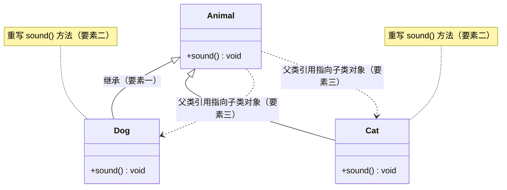
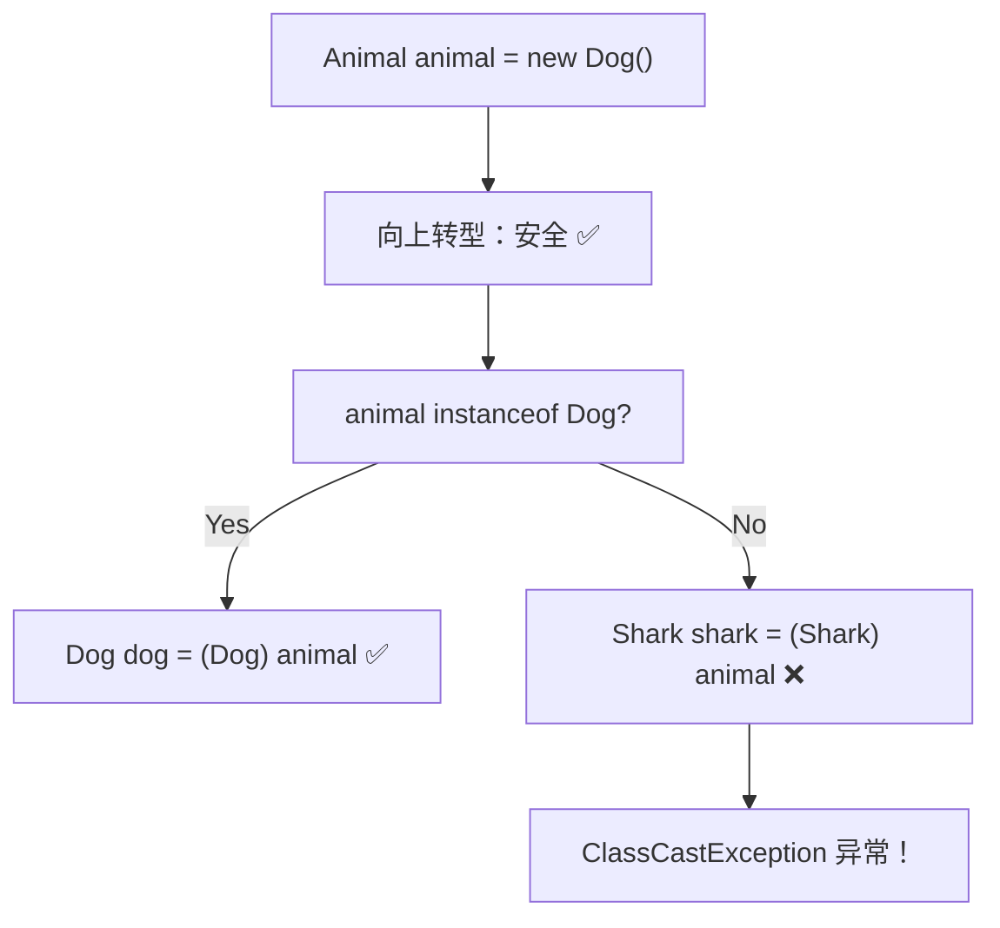
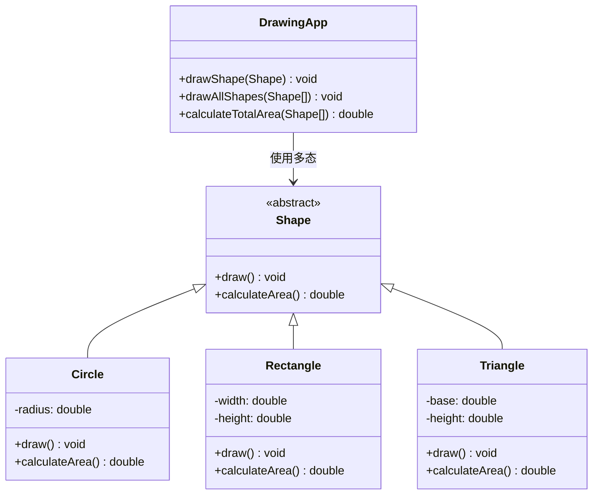

+++
title = "第15章 多态——同一个方法，不同的表现"
weight = 150
date = "2026-03-30T14:33:56.895+08:00"
type = "docs"
description = ""
isCJKLanguage = true
draft = false
+++
# 第十五章 多态——同一个方法，不同的表现

> 🎭 想象一下，你的手机里有一个"拍照"按钮。但这个按钮在不同手机上的表现完全不同——iPhone 拍出 Live Photo，华为可能给你一个月亮模式的夜景，三星可能直接给你一张 GIF。这，就是多态！

**多态（Polymorphism）** 是面向对象编程的三大支柱之一（封装、继承、多态）。它的名字来自希腊语，意思是"多种形态"。简单来说：**同一个方法调用，不同的对象有不同的行为**。

比如你喊一声"叫！"，狗会"汪汪"，猫会"喵喵"，鸭子会"嘎嘎"。方法名都是 `叫()`，但效果完全不同。这就是多态的魅力所在！

---

## 15.1 多态的三要素

多态的实现需要满足三个必要条件，缺一不可：

### 15.1.1 一要素：继承关系

必须有类与类之间的继承（或者接口与实现类之间的关系）。没有继承，就谈不上多态。

### 15.1.2 二要素：方法重写

子类必须重写（Override）父类的方法。如果子类把父类的方法原封不动地继承下来，那调用这个方法时就不会有"不同表现"了。

### 15.1.3 三要素：父类引用指向子类对象

必须通过**父类引用**指向**子类对象**来实现多态。就像你养了一只"动物"（引用类型），但实际上它是一只具体的"狗"（实际对象）。

```java
// 父类
class Animal {
    public void sound() {
        System.out.println("动物发出声音");
    }
}

// 子类
class Dog extends Animal {
    @Override
    public void sound() {
        System.out.println("汪汪汪！🐶");
    }
}

class Cat extends Animal {
    @Override
    public void sound() {
        System.out.println("喵喵喵！🐱");
    }
}

// 测试类
public class PolymorphismDemo {
    public static void main(String[] args) {
        // 要素三：父类引用指向子类对象
        Animal animal1 = new Dog();  // 这只"动物"其实是一只狗
        Animal animal2 = new Cat();   // 这只"动物"其实是一只猫

        // 同一个方法调用，展现出不同的行为
        animal1.sound();  // 输出：汪汪汪！🐶
        animal2.sound();  // 输出：喵喵喵！🐱
    }
}
```

### 15.1.4 三要素缺一不可示意图



---

## 15.2 向上转型（自动）

**向上转型（Upcasting）** 就是把子类对象赋值给父类引用。这个过程是**自动的，不需要强制转换**，因为这是"从小到大"的安全转换。

你可以把一只具体的狗当作"动物"来用，这是完全合理的——毕竟狗本来就是动物的一种嘛！

### 15.2.1 为什么叫"向上"？

在面向对象的继承树中，父类在上方，子类在下方。所以把子类的引用转成父类的引用，就像是"向上"走，故名**向上转型**。

```java
class Animal {
    public void eat() {
        System.out.println("动物在吃东西");
    }
}

class Bird extends Animal {
    @Override
    public void eat() {
        System.out.println("鸟儿在啄食虫子🐦");
    }

    // 鸟特有的方法
    public void fly() {
        System.out.println("鸟儿在飞翔！");
    }
}

public class UpcastingDemo {
    public static void main(String[] args) {
        // 向上转型：自动发生，不需要强制转换
        Animal animal = new Bird();  // 把 Bird 对象赋值给 Animal 引用

        // 调用的是 Bird 重写后的 eat 方法
        animal.eat();  // 输出：鸟儿在啄食虫子🐦

        // 但是，向上转型后，你无法调用 fly() 方法
        // animal.fly();  // 编译错误！Animal 类型没有 fly() 方法
    }
}
```

### 15.2.2 向上转型的特点

| 特点 | 说明 |
|------|------|
| 自动完成 | 不需要任何强制语法，编译器自动处理 |
| 安全 | 永远安全，因为子类is-a父类（"是一只"的关系） |
| 有限制 | 只能访问父类中定义的方法，子类独有的方法不可见 |

> 💡 **小贴士**：向上转型后，你"看到"的范围变小了（只能看到父类部分），但实际执行的还是子类的完整版本。就像你把一只彩色鹦鹉装进一个透明的"动物盒子"里——鹦鹉还是那只鹦鹉，只是你只能通过盒子看到它的动物特性。

---

## 15.3 向下转型（需要强制）

**向下转型（Downcasting）** 与向上转型相反，是把父类引用转换成子类引用。这个过程**必须加强制转换语法**，因为它不安全。

### 15.3.1 为什么需要强制？

向下转型就像是把一个"动物"还原成它具体的类型。但问题来了——你养的这个"动物"到底是狗还是猫？你不确定！所以必须手动告诉编译器："我确定这只动物是只鸟，请把它当鸟来处理。"

```java
class Animal {
    public void description() {
        System.out.println("这是一只动物");
    }
}

class Fish extends Animal {
    @Override
    public void description() {
        System.out.println("这是一条鱼，正在游泳🐟");
    }

    public void swim() {
        System.out.println("鱼儿在水中自由游泳");
    }
}

class Shark extends Animal {
    @Override
    public void description() {
        System.out.println("这是一条鲨鱼，牙齿很锋利🦈");
    }

    public void hunt() {
        System.out.println("鲨鱼在捕猎！");
    }
}

public class DowncastingDemo {
    public static void main(String[] args) {
        // 先向上转型
        Animal animal = new Fish();

        // 向下转型：强制转换
        // 注意：animal 实际上确实是 Fish 对象，所以可以转型成功
        Fish fish = (Fish) animal;
        fish.description();  // 输出：这是一条鱼，正在游泳🐟
        fish.swim();         // 输出：鱼儿在水中自由游泳

        // ============================================
        // 危险例子！不要这样做！
        // ============================================
        Animal anotherAnimal = new Shark();
        // 编译不会报错，但运行时会抛出 ClassCastException！
        // Fish wrongFish = (Fish) anotherAnimal;  // 运行错误：ClassCastException
    }
}
```

### 15.3.2 instanceof 运算符——安全检查的守护神

为了避免向下转型时的 `ClassCastException`（类型转换异常），Java 提供了 `instanceof` 运算符来**先检查再转型**。

```java
public class SafeDowncastingDemo {
    public static void main(String[] args) {
        Animal[] animals = new Animal[3];
        animals[0] = new Dog();
        animals[1] = new Cat();
        animals[2] = new Bird();

        for (Animal animal : animals) {
            // 先检查，再转型——安全第一！
            if (animal instanceof Dog) {
                Dog dog = (Dog) animal;
                dog.eat();
                dog.bark();
            } else if (animal instanceof Cat) {
                Cat cat = (Cat) animal;
                cat.eat();
                cat.meow();
            } else if (animal instanceof Bird) {
                Bird bird = (Bird) animal;
                bird.eat();
                bird.fly();
            }
        }
    }
}

// 完整的类定义
class Animal {
    public void eat() {
        System.out.println("动物在吃东西");
    }
}

class Dog extends Animal {
    @Override
    public void eat() {
        System.out.println("狗在啃骨头");
    }
    public void bark() {
        System.out.println("汪汪汪！");
    }
}

class Cat extends Animal {
    @Override
    public void eat() {
        System.out.println("猫在吃鱼");
    }
    public void meow() {
        System.out.println("喵喵喵！");
    }
}

class Bird extends Animal {
    @Override
    public void eat() {
        System.out.println("鸟在啄虫子");
    }
    public void fly() {
        System.out.println("鸟儿在飞翔！");
    }
}
```

### 15.3.3 向下转型可能失败的原因



> ⚠️ **警告**：向下转型一定要小心！如果你试图把一只"猫"转型成"狗"，Java 运行时会抛出 `ClassCastException`。这就是"类型转换异常"，意味着你做了一个非法的类型转换。

---

## 15.4 多态的实际应用

多态不仅仅是一个理论概念，它在实际的软件开发中有广泛的应用。让我给你展示几个经典的场景！

### 15.4.1 场景一：统一参数类型

假设你正在开发一个动物园管理系统，你需要给动物喂食。如果不用多态，你可能需要写一堆 `if-else`：

```java
// ❌ 没有多态的糟糕写法
public void feedAnimal(Animal animal, String type) {
    if ("dog".equals(type)) {
        ((Dog) animal).eat();
    } else if ("cat".equals(type)) {
        ((Cat) animal).eat();
    } else if ("bird".equals(type)) {
        ((Bird) animal).eat();
    }
    // 每加一种动物，就要再加一个 else if...
}
```

而有了多态，一切都变得简洁优雅：

```java
// ✅ 多态的优雅写法
public void feedAnimal(Animal animal) {
    animal.eat();  // 不管是什么动物，调用它的 eat 方法即可
}
```

### 15.4.2 场景二：回调机制

多态是实现回调（Callback）的基础。想象你设置了一个定时任务，当时间到了，系统会调用你的方法来执行特定操作——但它不需要知道你具体是怎么实现的。

```java
// 定义一个回调接口
interface OnClickListener {
    void onClick();  // 点击时触发
}

// 带回调的按钮类
class Button {
    private OnClickListener listener;

    // 设置监听器
    public void setOnClickListener(OnClickListener listener) {
        this.listener = listener;
    }

    // 模拟点击
    public void click() {
        System.out.println("按钮被点击了！");
        if (listener != null) {
            listener.onClick();  // 回调具体的实现
        }
    }
}

// 具体的实现类
class LoginClickHandler implements OnClickListener {
    @Override
    public void onClick() {
        System.out.println("执行登录逻辑... 🚪");
    }
}

class RegisterClickHandler implements OnClickListener {
    @Override
    public void onClick() {
        System.out.println("执行注册逻辑... 📝");
    }
}

public class CallbackDemo {
    public static void main(String[] args) {
        Button loginBtn = new Button();
        Button registerBtn = new Button();

        // 给按钮设置不同的点击处理器
        loginBtn.setOnClickListener(new LoginClickHandler());
        registerBtn.setOnClickListener(new RegisterClickHandler());

        // 点击按钮，触发不同的回调
        loginBtn.click();
        // 输出：
        // 按钮被点击了！
        // 执行登录逻辑... 🚪

        registerBtn.click();
        // 输出：
        // 按钮被点击了！
        // 执行注册逻辑... 📝
    }
}
```

### 15.4.3 场景三：策略模式（Strategy Pattern）

多态让我们可以在运行时选择不同的算法或策略。比如一个支付系统，支持多种支付方式：

```java
// 支付策略接口
interface PaymentStrategy {
    void pay(double amount);
}

// 具体的支付策略实现
class AlipayStrategy implements PaymentStrategy {
    @Override
    public void pay(double amount) {
        System.out.println("使用支付宝支付：" + amount + " 元 💰");
    }
}

class WechatPayStrategy implements PaymentStrategy {
    @Override
    public void pay(double amount) {
        System.out.println("使用微信支付：" + amount + " 元 💵");
    }
}

class CreditCardStrategy implements PaymentStrategy {
    @Override
    public void pay(double amount) {
        System.out.println("使用信用卡支付：" + amount + " 元 💳");
    }
}

// 订单类，使用支付策略
class Order {
    private PaymentStrategy paymentStrategy;

    // 设置支付方式
    public void setPaymentStrategy(PaymentStrategy strategy) {
        this.paymentStrategy = strategy;
    }

    // 执行支付
    public void checkout(double amount) {
        System.out.println("订单金额：" + amount + " 元");
        paymentStrategy.pay(amount);
        System.out.println("支付完成！✅");
    }
}

public class StrategyPatternDemo {
    public static void main(String[] args) {
        Order order = new Order();

        // 场景1：用户选择支付宝支付
        System.out.println("=== 用户选择支付宝 ===");
        order.setPaymentStrategy(new AlipayStrategy());
        order.checkout(199.99);

        System.out.println();

        // 场景2：用户切换到微信支付
        System.out.println("=== 用户切换到微信支付 ===");
        order.setPaymentStrategy(new WechatPayStrategy());
        order.checkout(299.99);

        System.out.println();

        // 场景3：用户选择信用卡
        System.out.println("=== 用户选择信用卡 ===");
        order.setPaymentStrategy(new CreditCardStrategy());
        order.checkout(599.99);
    }
}
```

### 15.4.4 完整的多态示例——图形绘制系统

让我们用一个完整的例子来展示多态的威力：开发一个图形绘制系统，可以绘制各种形状。

```java
// 抽象图形类
abstract class Shape {
    // 绘制方法（每个子类必须实现自己的绘制逻辑）
    public abstract void draw();

    // 计算面积方法
    public abstract double calculateArea();
}

// 圆形
class Circle extends Shape {
    private double radius;

    public Circle(double radius) {
        this.radius = radius;
    }

    @Override
    public void draw() {
        System.out.println("绘制一个圆形，半径为：" + radius + " 🔵");
    }

    @Override
    public double calculateArea() {
        return Math.PI * radius * radius;
    }
}

// 矩形
class Rectangle extends Shape {
    private double width;
    private double height;

    public Rectangle(double width, double height) {
        this.width = width;
        this.height = height;
    }

    @Override
    public void draw() {
        System.out.println("绘制一个矩形，宽：" + width + "，高：" + height + " 🟧");
    }

    @Override
    public double calculateArea() {
        return width * height;
    }
}

// 三角形
class Triangle extends Shape {
    private double base;
    private double height;

    public Triangle(double base, double height) {
        this.base = base;
        this.height = height;
    }

    @Override
    public void draw() {
        System.out.println("绘制一个三角形，底：" + base + "，高：" + height + " 🔺");
    }

    @Override
    public double calculateArea() {
        return 0.5 * base * height;
    }
}

// 绘图工具类
class DrawingApp {
    // 绘制单个图形
    public void drawShape(Shape shape) {
        shape.draw();
    }

    // 批量绘制图形——这就是多态的威力！
    public void drawAllShapes(Shape[] shapes) {
        System.out.println("===== 开始批量绘图 =====");
        for (Shape shape : shapes) {
            shape.draw();  // 同一个方法调用，不同的图形表现不同
        }
        System.out.println("===== 绘图完成 =====");
    }

    // 计算总面积
    public double calculateTotalArea(Shape[] shapes) {
        double total = 0;
        for (Shape shape : shapes) {
            total += shape.calculateArea();  // 多态调用
        }
        return total;
    }
}

public class PolymorphismCompleteDemo {
    public static void main(String[] args) {
        DrawingApp app = new DrawingApp();

        // 创建各种图形（多态数组）
        Shape[] shapes = new Shape[4];
        shapes[0] = new Circle(5);
        shapes[1] = new Rectangle(4, 6);
        shapes[2] = new Triangle(3, 4);
        shapes[3] = new Circle(3);

        // 批量绘制——利用多态
        app.drawAllShapes(shapes);

        // 计算总面积
        double totalArea = app.calculateTotalArea(shapes);
        System.out.println("\n所有图形的总面积：" + totalArea);
    }
}
```

运行结果：

```
===== 开始批量绘图 =====
绘制一个圆形，半径为：5.0 🔵
绘制一个矩形，宽：4.0，高：6.0 🟧
绘制一个三角形，底：3.0，高：4.0 🔺
绘制一个圆形，半径为：3.0 🔵
===== 绘图完成 =====

所有图形的总面积：109.899
```

### 15.4.5 多态关系图解



---

## 本章小结

本章我们深入探讨了 Java 中的多态（Polymorphism）特性，以下是核心要点：

| 概念 | 关键点 |
|------|--------|
| **多态的定义** | 同一方法调用，不同对象产生不同行为 |
| **三要素** | ① 继承关系 ② 方法重写 ③ 父类引用指向子类对象 |
| **向上转型** | 自动转换，安全，父类引用访问受限 |
| **向下转型** | 强制转换，需用 `instanceof` 检查避免异常 |
| **实际应用** | 统一参数类型、回调机制、策略模式等 |

### 🎯 记住这些黄金法则

1. **"是一只"原则**：向上转型永远安全，因为子类"是一只"父类
2. **"先检查再转型"原则**：向下转型前务必用 `instanceof` 检查
3. **"看左边，调用右边"原则**：编译时看左边（引用类型），运行时执行右边（实际对象类型）
4. **"多态针对方法"原则**：多态只针对方法有效，属性没有多态

> 🌟 多态是面向对象编程中最强大的特性之一，它让代码更加灵活、可扩展和可维护。掌握好多态，你就掌握了 Java 面向对象的精髓！

---

**课后思考**：

- 为什么 `animal.fly()` 在向上转型后无法调用？fly 方法去哪了？
- 如果一个父类引用指向子类对象，但该方法在子类中没有重写，会发生什么？
- `instanceof` 运算符返回 `true` 就能保证向下转型安全吗？

---

*下一章我们将学习 Java 中的接口（Interface），它与多态有着密切的关系，敬请期待！*
