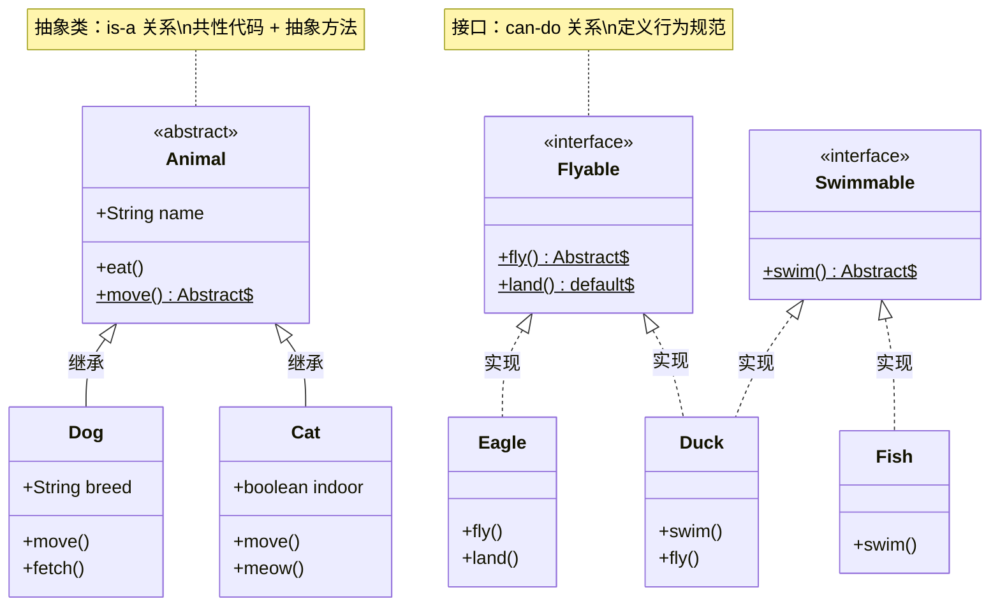

+++
title = "第16章 抽象类与接口"
weight = 160
date = "2026-03-30T14:33:56.896+08:00"
type = "docs"
description = ""
isCJKLanguage = true
draft = false
+++
# 第十六章 抽象类与接口

> [!NOTE]
> 本章我们将探索 Java 中两个"高深莫测"的概念——抽象类和接口。别担心，我会用最接地气的方式把它们讲清楚。如果你之前被这两个概念折磨过，那这一章就是你的救星！

## 16.1 抽象类

### 什么抽象类？先别被名字吓到

**抽象类**（Abstract Class）是什么？说白了，它就是一个"不完整的类"。就像你设计一辆汽车的图纸，图纸上可能只画了"这里放发动机"、"这里放方向盘"，但具体发动机长什么样、方向盘什么形状，图纸上并没有画出来——因为那不是你的职责，你只管设计汽车的"架子"。

在 Java 中，用 `abstract` 关键字来声明一个抽象类：

```java
// 抽象类：不能直接实例化，只能被继承
public abstract class Animal {
    // 抽象方法：没有方法体，子类必须实现
    public abstract void makeSound();

    // 普通方法：抽象类也可以有具体实现的方法
    public void sleep() {
        System.out.println("动物在睡觉...");
    }

    // 成员变量
    protected String name;

    // 构造方法：抽象类可以有构造方法
    public Animal(String name) {
        this.name = name;
    }
}
```

抽象类最大的特点就是：**不能直接 `new` 出来**。你不能这样写：

```java
Animal animal = new Animal(); // 编译错误！抽象类不能实例化
```

但是你可以继承它：

```java
public class Dog extends Animal {
    public Dog(String name) {
        super(name);
    }

    @Override
    public void makeSound() {
        System.out.println(name + "说：汪汪汪！");
    }
}
```

然后这样用：

```java
public class Main {
    public static void main(String[] args) {
        Dog dog = new Dog("小白");
        dog.makeSound();  // 输出：小白说：汪汪汪！
        dog.sleep();      // 输出：动物在睡觉...

        // 向上转型：父类引用指向子类对象（多态的经典操作）
        Animal animal = new Dog("小黑");
        animal.makeSound();  // 输出：小黑说：汪汪汪！
    }
}
```

### 抽象类的"宪法规定"

抽象类可不是想怎么写就怎么写的，它有几条铁律：

```java
public abstract class Base {
    // ✓ 抽象方法：没有方法体，以分号结尾
    public abstract void doSomething();

    // ✓ 普通方法：有具体实现
    public void normalMethod() {
        System.out.println("这是普通方法");
    }

    // ✓ 构造方法：可以有
    public Base() {
        // 初始化逻辑
    }

    // ✓ 成员变量：可以有各种修饰符
    protected String field;

    // ✗ 错误！抽象类不能被 final 修饰（否则它就没法被继承了）
    // public abstract final class Invalid {}
}
```

> [!WARNING]
> **重要规则：**
> - 抽象类可以用 `abstract` 关键字声明
> - 抽象类可以没有抽象方法（但这样写很无聊）
> - 抽象类不能直接实例化
> - 子类继承抽象类时，必须实现所有抽象方法，否则子类也必须声明为抽象类

### 抽象类的应用场景

什么时候该用抽象类？想象一下这些场景：

```java
// 场景：开发一个游戏，需要不同的角色
public abstract class GameCharacter {
    protected String name;
    protected int hp;
    protected int attack;

    public GameCharacter(String name, int hp, int attack) {
        this.name = name;
        this.hp = hp;
        this.attack = attack;
    }

    // 所有角色都有攻击行为，但具体怎么攻击各不相同
    public abstract void attack();

    // 所有角色都能移动，这是共同的
    public void move() {
        System.out.println(name + "正在移动...");
    }

    // 获取角色信息（通用逻辑）
    public void showInfo() {
        System.out.println("名称：" + name + "，生命值：" + hp + "，攻击力：" + attack);
    }
}

public class Warrior extends GameCharacter {
    public Warrior(String name) {
        super(name, 100, 30);
    }

    @Override
    public void attack() {
        System.out.println(name + "发动猛击！造成" + attack + "点伤害！");
    }
}

public class Mage extends GameCharacter {
    public Mage(String name) {
        super(name, 60, 50);
    }

    @Override
    public void attack() {
        System.out.println(name + "释放魔法！造成" + attack + "点伤害！");
    }
}

public class Main {
    public static void main(String[] args) {
        GameCharacter warrior = new Warrior("亚瑟");
        GameCharacter mage = new Mage("甘道夫");

        warrior.showInfo();
        warrior.attack();
        warrior.move();

        mage.showInfo();
        mage.attack();
        mage.move();
    }
}
```

输出：

```
名称：亚瑟，生命值：100，攻击力：30
亚瑟发动猛击！造成30点伤害！
亚瑟正在移动...
名称：甘道夫，生命值：60，攻击力：50
甘道夫释放魔法！造成50点伤害！
甘道夫正在移动...
```

> [!TIP]
> 抽象类的精髓在于：**提供公共代码（通用方法）和公共属性，同时强制子类实现差异化行为（抽象方法）**。

## 16.2 接口

### 接口是什么？

如果说**抽象类**是一份"不完整的图纸"，那**接口**（Interface）就是一份"行为规范说明书"。

接口只告诉你**能做什么**，不告诉你**怎么做**。就像一份美食指南告诉你"这家店提供川菜、粤菜"，但不会告诉你厨师是怎么炒菜的。

在 Java 8 之前，接口里只能是**抽象方法**（`public abstract`，可以省略）；Java 8 开始接口可以有**默认方法**和**静态方法**；Java 9 开始接口还可以有**私有方法**。

### 接口的基本用法

```java
// 定义一个接口
public interface Flyable {
    // 常量（默认是 public static final，可以省略）
    int MAX_SPEED = 1000;

    // 抽象方法（默认是 public abstract，可以省略）
    void fly();

    // Java 8+：默认方法
    default void land() {
        System.out.println("安全着陆");
    }

    // Java 8+：静态方法
    static void checkStatus() {
        System.out.println("检查飞行状态...");
    }

    // Java 9+：私有方法（用于减少代码重复）
    private void log(String message) {
        System.out.println("[日志] " + message);
    }
}
```

实现接口用 `implements` 关键字：

```java
public class Eagle implements Flyable {
    private String name;

    public Eagle(String name) {
        this.name = name;
    }

    @Override
    public void fly() {
        System.out.println(name + "展翅高飞，翱翔于天际！");
    }

    // 可以选择性地重写默认方法
    @Override
    public void land() {
        System.out.println(name + "优雅地降落在悬崖上");
    }
}
```

### 接口的"超能力"——多继承

这是接口最厉害的地方！在 Java 中，**类只能单继承**（一个类只能有一个父类），但**一个类可以实现多个接口**！

```java
// 接口A
public interface Swimmable {
    void swim();
}

// 接口B
public interface Flyable {
    void fly();
}

// 接口C
public interface Runnable {
    void run();
}

// Duck 实现了三个接口！
public class Duck implements Swimmable, Flyable, Runnable {
    private String name;

    public Duck(String name) {
        this.name = name;
    }

    @Override
    public void swim() {
        System.out.println(name + "在水中优雅地游泳...");
    }

    @Override
    public void fly() {
        System.out.println(name + "扑腾翅膀起飞...");
    }

    @Override
    public void run() {
        System.out.println(name + "在岸上摇摇摆摆地跑...");
    }
}

public class Main {
    public static void main(String[] args) {
        Duck duck = new Duck("唐老鸭");

        // 同一个对象，可以被当作不同的类型来使用
        Swimmable swimmer = duck;
        Flyable flyer = duck;
        Runnable runner = duck;

        swimmer.swim();  // 唐老鸭在水中优雅地游泳...
        flyer.fly();      // 唐老鸭扑腾翅膀起飞...
        runner.run();     // 唐老鸭在岸上摇摇摆摆地跑...
    }
}
```

> [!TIP]
> 这就是传说中的**多态**！一个对象可以同时具备多种"身份"，就像唐老鸭既是游泳运动员，又是飞行员，还是跑步选手。

### 接口的"进化史"

| 版本 | 新特性 |
|------|--------|
| Java 7 及以前 | 只有抽象方法，常量 |
| Java 8 | 默认方法、静态方法 |
| Java 9 | 私有方法 |
| Java 21 |密封接口（正式特性） |

### 密封接口（Sealed Interface）

Java 17 引入了**密封接口**，可以精确控制谁可以实现接口：

```java
// sealed 修饰符：只允许 Person 的子类实现
public sealed interface Person permits Teacher, Student, Worker {
    String getName();
}

// 非密封类：允许任何类实现
public non-sealed class Worker implements Person {
    private String name;
    private String job;

    public Worker(String name, String job) {
        this.name = name;
        this.job = job;
    }

    @Override
    public String getName() {
        return name;
    }

    public String getJob() {
        return job;
    }
}

// final 类：不能被继承
public final class Teacher implements Person {
    private String name;
    private String subject;

    public Teacher(String name, String subject) {
        this.name = name;
        this.subject = subject;
    }

    @Override
    public String getName() {
        return name;
    }
}

// sealed 类：只能被指定的类继承
public sealed class Student implements Person {
    private String name;
    private int grade;

    public Student(String name, int grade) {
        this.name = name;
        this.grade = grade;
    }

    @Override
    public String getName() {
        return name;
    }
}

// Student 的子类（如果要继续 sealed 链，必须声明 final/sealed/non-sealed）
// 例如：
public final class HighSchoolStudent extends Student {
    private String major;

    public HighSchoolStudent(String name, int grade, String major) {
        super(name, grade);
        this.major = major;
    }
}
```

## 16.3 抽象类 vs 接口——怎么选？

这是 Java 面试中最经典的问题之一！让我用一个表格 + 实战帮你彻底搞懂。

### 先看对比表

| 特性 | 抽象类 | 接口 |
|------|--------|------|
| 关键字 | `abstract class` | `interface` |
| 继承/实现 | 单继承（一个类只能有一个父抽象类） | 多实现（一个类可以实现多个接口） |
| 构造方法 | 可以有 | 不能有 |
| 成员变量 | 可以是各种类型 | 只能是 `public static final`（常量） |
| 方法类型 | 抽象方法 + 普通方法 | 抽象方法 + 默认方法 + 静态方法（Java 8+） |
| 访问修饰符 | 任意 | 方法默认 `public` |
| 多继承 | ❌ 不支持 | ✅ 支持 |

### 什么时候用抽象类？

**当你需要"是一个"（is-a）的关系时**，且需要共享代码和状态：

```java
// 场景：动物家族有共同的行为和属性
public abstract class Animal {
    protected String name;
    protected int age;

    public Animal(String name, int age) {
        this.name = name;
        this.age = age;
    }

    // 共同的实现
    public void eat() {
        System.out.println(name + "正在吃东西");
    }

    // 子类必须实现的方法
    public abstract void move();
}

// Dog is an Animal
public class Dog extends Animal {
    private String breed;

    public Dog(String name, int age, String breed) {
        super(name, age);
        this.breed = breed;
    }

    @Override
    public void move() {
        System.out.println(name + "用四条腿奔跑");
    }

    // Dog 特有的方法
    public void fetch() {
        System.out.println(name + "去捡球了！");
    }
}
```

### 什么时候用接口？

**当你需要"能做什么"（can-do）的能力时**：

```java
// 能力接口
public interface Jumpable {
    void jump();
}

public interface Swimmable {
    void swim();
}

// 可以跳的鱼
public class JumpingFish implements Swimmable, Jumpable {
    private String name;

    public JumpingFish(String name) {
        this.name = name;
    }

    @Override
    public void swim() {
        System.out.println(name + "在水中游泳");
    }

    @Override
    public void jump() {
        System.out.println(name + "跃出水面！");
    }
}
```

### 一句话总结

> [!QUOTE]
> **抽象类**是"什么是什么"（is-a），用于**继承共性**，同时**保留差异**。
> **接口**是"能做什么"（can-do），用于**定义能力**，实现**行为解耦**。

### 经典实战：Comparable vs Compartor

```java
import java.util.Arrays;
import java.util.Comparator;

// Student 继承自 Person（is-a 关系），Person 是抽象类
public abstract class Person {
    protected String name;
    protected int age;

    public Person(String name, int age) {
        this.name = name;
        this.age = age;
    }

    public String getName() {
        return name;
    }

    public int getAge() {
        return age;
    }
}

// Student is a Person（继承关系用抽象类）
public class Student extends Person {
    private int score;

    public Student(String name, int age, int score) {
        super(name, age);
        this.score = score;
    }

    public int getScore() {
        return score;
    }

    @Override
    public String toString() {
        return "Student{name='" + name + "', age=" + age + ", score=" + score + "}";
    }
}

public class Main {
    public static void main(String[] args) {
        Student[] students = {
            new Student("张三", 18, 95),
            new Student("李四", 17, 88),
            new Student("王五", 19, 92)
        };

        // Comparable：让类自己具备比较能力（"我怎样才能比较"）
        // 这是一个接口，告诉 Student "你自己知道怎么被排序"
        class StudentComparable implements Comparable<StudentComparable> {
            private String name;
            private int score;

            public StudentComparable(String name, int score) {
                this.name = name;
                this.score = score;
            }

            @Override
            public int compareTo(StudentComparable other) {
                return this.score - other.score; // 按分数升序
            }

            @Override
            public String toString() {
                return "StudentComparable{name='" + name + "', score=" + score + "}";
            }
        }

        // Comparator：外部定义比较规则（"你来告诉我怎么比较"）
        // 这是一个接口的实例，代表一种"比较策略"
        Comparator<Student> byAge = (s1, s2) -> s1.getAge() - s2.getAge();
        Comparator<Student> byScore = Comparator.comparingInt(Student::getScore).reversed();

        System.out.println("按年龄排序：");
        Arrays.sort(students, byAge);
        Arrays.stream(students).forEach(System.out::println);

        System.out.println("\n按分数降序排序：");
        Arrays.sort(students, byScore);
        Arrays.stream(students).forEach(System.out::println);
    }
}
```

### 抽象类与接口的关系图



## 16.4 函数式接口

### 什么是函数式接口？

**函数式接口**（Functional Interface）是一个**有且仅有一个抽象方法**的接口。注意这里的"有且仅有"——但是可以有多个默认方法或静态方法。

用 `@FunctionalInterface` 注解标记后，编译器会帮你检查这个接口是否真的符合函数式接口的规范：

```java
@FunctionalInterface
public interface Calculator {
    // 唯一的抽象方法
    int calculate(int a, int b);

    // 默认方法不算抽象方法，所以可以有多个
    default void description() {
        System.out.println("这是一个计算器接口");
    }

    // 静态方法也不算抽象方法
    static void info() {
        System.out.println("函数式接口用于 Lambda 表达式");
    }
}
```

如果你的接口有两个抽象方法，加了 `@FunctionalInterface` 注解后会编译报错：

```java
@FunctionalInterface
public interface InvalidInterface {
    void method1();
    void method2();  // 编译错误！函数式接口只能有一个抽象方法
}
```

### 常用的函数式接口

Java 8 在 `java.util.function` 包里提供了很多常用的函数式接口：

| 接口 | 抽象方法 | 用途 |
|------|---------|------|
| `Supplier<T>` | `T get()` | 生产一个值 |
| `Consumer<T>` | `void accept(T t)` | 消费一个值 |
| `Function<T,R>` | `R apply(T t)` | 转换值 |
| `Predicate<T>` | `boolean test(T t)` | 判断条件 |
| `UnaryOperator<T>` | `T apply(T t)` | 一元运算 |
| `BinaryOperator<T>` | `T apply(T t, T t)` | 二元运算 |

### 函数式接口实战

```java
import java.util.function.*;

public class FunctionalInterfaceDemo {
    public static void main(String[] args) {
        // 1. Supplier<T>：生产者，不接受参数，返回一个值
        Supplier<String> greeting = () -> "你好，Java！";
        System.out.println(greeting.get());  // 输出：你好，Java！

        // 2. Consumer<T>：消费者，接收一个参数，不返回
        Consumer<String> printer = message -> System.out.println("收到消息：" + message);
        printer.accept("Hello World");  // 输出：收到消息：Hello World

        // 3. Function<T,R>：转换器，接收T返回R
        Function<String, Integer> stringLength = s -> s.length();
        System.out.println("'Java'的长度是：" + stringLength.apply("Java"));  // 输出：4

        // 4. Predicate<T>：断言，接收T返回boolean
        Predicate<Integer> isEven = n -> n % 2 == 0;
        System.out.println("10是偶数吗？" + isEven.test(10));  // 输出：true

        // 5. UnaryOperator<T>：一元操作符，接收T返回T
        UnaryOperator<Integer> doubleIt = n -> n * 2;
        System.out.println("5的两倍是：" + doubleIt.apply(5));  // 输出：10

        // 6. BinaryOperator<T>：二元操作符，接收两个T返回T
        BinaryOperator<Integer> add = (a, b) -> a + b;
        System.out.println("3 + 7 = " + add.apply(3, 7));  // 输出：10

        // 7. BiFunction<T,U,R>：接收两个不同参数
        BiFunction<String, Integer, String> repeat = (s, n) -> s.repeat(n);
        System.out.println(repeat.apply("Java!", 3));  // 输出：Java!Java!Java!

        // 8. BiPredicate<T,U>：接收两个参数的断言
        BiPredicate<String, String> startsWith = (s, prefix) -> s.startsWith(prefix);
        System.out.println("Java 开头是 Ja 吗？" + startsWith.test("Java", "Ja"));  // 输出：true

        // 9. 方法引用：更简洁的 Lambda 写法
        Function<String, String> toUpperCase = String::toUpperCase;
        System.out.println(toUpperCase.apply("hello"));  // 输出：HELLO

        // 10. 组合使用
        Function<String, Integer> lengthAndDouble = stringLength.andThen(doubleIt);
        System.out.println("'Hi'长度翻倍：" + lengthAndDouble.apply("Hi"));  // 输出：4
    }
}
```

### 自定义函数式接口

```java
@FunctionalInterface
public interface MyFunction<T, R> {
    // 唯一的抽象方法
    R apply(T input);

    // 默认方法可以组合
    default <V> MyFunction<V, R> compose(MyFunction<V, T> before) {
        return v -> apply(before.apply(v));
    }

    default <V> MyFunction<T, V> andThen(MyFunction<R, V> after) {
        return t -> after.apply(apply(t));
    }
}

// 使用
public class Main {
    public static void main(String[] args) {
        // 字符串 -> 长度 -> 翻倍
        MyFunction<String, Integer> length = s -> s.length();
        MyFunction<Integer, Integer> doubleIt = n -> n * 2;
        MyFunction<String, Integer> combined = length.andThen(doubleIt);

        System.out.println(combined.apply("Java"));  // "Java"长度4，翻倍=8
    }
}
```

### Lambda 表达式与方法引用

函数式接口的"最佳拍档"是 **Lambda 表达式** 和**方法引用**：

```java
@FunctionalInterface
public interface Converter {
    int convert(String s);
}

public class Main {
    public static void main(String[] args) {
        // 方式1：Lambda 表达式
        Converter c1 = s -> Integer.parseInt(s);
        System.out.println(c1.convert("123"));  // 输出：123

        // 方式2：方法引用（更简洁）
        Converter c2 = Integer::parseInt;
        System.out.println(c2.convert("456"));  // 输出：456

        // 静态方法引用：ClassName::staticMethod
        Function<Double, Long> roundDown = Math::floor;
        System.out.println(roundDown.apply(3.7));  // 输出：3.0

        // 实例方法引用：instance::instanceMethod
        String str = "Hello";
        Function<Integer, String> substring = str::substring;
        System.out.println(substring.apply(1));  // 输出：ello

        // 构造方法引用：ClassName::new
        Function<String, StringBuilder> builderCreator = StringBuilder::new;
        StringBuilder sb = builderCreator.apply("你好");
        System.out.println(sb.reverse());  // 输出：好你
    }
}
```

> [!TIP]
> 方法引用是 Lambda 表达式的"语法糖"，让代码更简洁、更易读。当一个 Lambda 表达式只是调用一个已有方法时，优先考虑使用方法引用。

### 内置函数式接口速查

```java
import java.util.function.*;

public class CheatSheet {
    public static void main(String[] args) {
        // ===== 生产者 =====
        Supplier<int[]> emptyArray = int[]::new;  // 无参构造
        int[] arr = emptyArray.get();  // 创建空数组

        // ===== 消费者 =====
        Consumer<String> print = System.out::println;
        print.accept("Hello");  // 输出：Hello

        // ===== 断言 =====
        Predicate<String> isEmpty = String::isEmpty;
        Predicate<String> notEmpty = isEmpty.negate();  // 取反
        System.out.println(notEmpty.test("Java"));  // 输出：true

        // ===== 基本类型专用（避免装箱拆箱） =====
        IntFunction<String> repeat = i -> "=".repeat(i);
        System.out.println(repeat.apply(10));  // 输出：==========

        // ===== 类型转换 =====
        ToIntFunction<String> toLength = String::length;
        System.out.println(toLength.applyAsInt("Java"));  // 输出：4
    }
}
```

---

## 本章小结

### 抽象类

- 用 `abstract` 关键字声明，**不能直接实例化**
- 可以包含**抽象方法**（子类必须实现）和**普通方法**（可复用）
- 单继承，一个类只能有一个父抽象类
- 适合"is-a"关系，用于**共性抽象 + 个性实现**

### 接口

- 用 `interface` 关键字声明，实现用 `implements`
- Java 8+ 支持**默认方法**和**静态方法**，Java 9+ 支持**私有方法**
- 多实现，一个类可以实现多个接口
- 适合"can-do"关系，用于**行为规范定义**

### 抽象类 vs 接口的选择

- **抽象类**：有共性代码需要继承，有 protected/public 成员变量，需要构造方法
- **接口**：纯粹的行为能力定义，需要多继承，函数式编程场景

### 函数式接口

- 有且仅有一个抽象方法的接口
- 用 `@FunctionalInterface` 注解标识
- 配合 **Lambda 表达式** 和**方法引用**使用
- `java.util.function` 包提供了丰富的内置函数式接口

---

> [!QUOTE]
> **学完本章，你应该：**
> - 理解抽象类的意义：提供模板，强制实现
> - 理解接口的意义：定义契约，解耦行为
> - 能够在实际开发中正确选择抽象类或接口
> - 掌握函数式接口配合 Lambda 的用法
