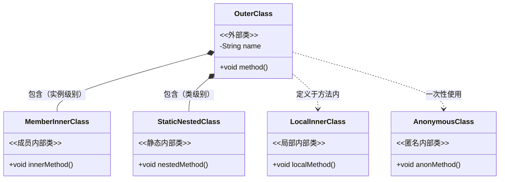
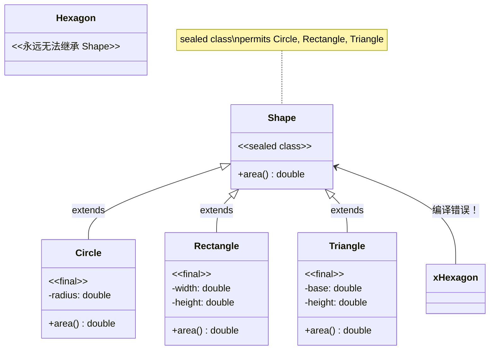

+++
title = "第17章 内部类、枚举、record、密封类"
weight = 170
date = "2026-03-30T14:33:56.898+08:00"
type = "docs"
description = ""
isCJKLanguage = true
draft = false
+++
# 第十七章 内部类、枚举、record、密封类

> 🎭 本章登場人物：类（Class）、对象（Object）、枚举（Enum）、record（记录）、密封类（Sealed Class）——准备好了吗？我们的派对开始了！

---

## 17.1 内部类

### 17.1.1 什么是内部类？

**内部类**（Inner Class），就是定义在另一个类内部的类。听起来像嵌套玩偶？对！就是那个意思。

为什么要有内部类？理由很简单：

- **逻辑上紧密相关**：比如 `Car` 类需要 `Engine` 类，但 `Engine` 只在 `Car` 内部有意义
- **访问权限更方便**：内部类可以"明目张胆"地访问外部类的所有成员（包括 private）
- **增强可读性**：把只在一个地方用的类藏到需要它的类里面，代码更整洁

Java 的内部类分四种，各有各的脾气：

| 类型 | 语法 | 能访问外部类成员？ | 需外部类实例？ |
|------|------|-------------------|----------------|
| 成员内部类 | `class Outer { class Inner {} }` | ✅ 能 | ✅ 需要 |
| 静态内部类 | `class Outer { static class Inner {} }` | ❌ 不能（只能访问外部类的静态成员） | ❌ 不需要 |
| 局部内部类 | 定义在方法内部 | ✅ 能 | ✅ 需要（如果是在实例方法中） |
| 匿名内部类 | 没有名字的类 | ✅ 能 | ✅ 需要 |

### 17.1.2 成员内部类

这是最"正经"的内部类——它就像外部类的一个正式成员，有完整的类声明。

```java
// 外部类：咖啡店
class CoffeeShop {
    private String shopName = "星巴克";

    // 成员内部类：咖啡杯
    class CoffeeCup {
        private String material = "陶瓷";

        public void describe() {
            // 内部类可以直接访问外部类的 private 成员
            System.out.println("这是 " + shopName + " 的 " + material + " 咖啡杯");
        }
    }

    public void showCup() {
        // 在外部类中创建内部类实例，需要外部类引用
        CoffeeCup cup = new CoffeeCup();
        cup.describe();
    }
}

// 测试类
public class InnerClassDemo {
    public static void main(String[] args) {
        // 方式一：通过外部类实例来创建内部类
        CoffeeShop shop = new CoffeeShop();
        CoffeeShop.CoffeeCup cup = shop.new CoffeeCup();
        cup.describe();  // 输出：这是 星巴克 的 陶瓷 咖啡杯

        // 方式二：链式调用（更简洁）
        new CoffeeShop().new CoffeeCup().describe();
    }
}
```

> 💡 小贴士：`外部类.new 内部类()` 这个语法看起来有点怪，但逻辑很清晰——先有外部对象，才有内部对象。内部类寄生于外部类实例，这是它的本质。

### 17.1.3 静态内部类

**静态内部类**（Static Nested Class）听起来矛盾——既然是"内部"的，为什么还能是"静态"的？

其实 static 关键字在这里的意思是：这个内部类不依赖外部类的实例就可以创建对象。但它依然是"名义上"属于外部类的。

```java
class DatabaseConnection {
    private static String DRIVER = "com.mysql.jdbc.Driver";

    // 静态内部类：连接池
    // 它只能访问外部类的静态成员（DRIVER），不能访问实例成员
    static class ConnectionPool {
        private int maxConnections;
        private String poolName;

        public ConnectionPool(String poolName, int maxConnections) {
            this.poolName = poolName;
            this.maxConnections = maxConnections;
        }

        public void info() {
            // ✅ 可以访问外部类的静态成员
            System.out.println("驱动: " + DRIVER);
            // ❌ 编译错误！不能访问外部类的实例成员
            // System.out.println(driver); // 假设这是实例成员
            System.out.println("连接池: " + poolName + ", 最大连接数: " + maxConnections);
        }
    }
}

public class StaticNestedDemo {
    public static void main(String[] args) {
        // 不需要创建 DatabaseConnection 实例，直接通过外部类名访问
        DatabaseConnection.ConnectionPool pool =
            new DatabaseConnection.ConnectionPool("MySQL-Pool", 100);
        pool.info();
        // 输出：
        // 驱动: com.mysql.jdbc.Driver
        // 连接池: MySQL-Pool, 最大连接数: 100
    }
}
```

### 17.1.4 局部内部类

**局部内部类**（Local Inner Class）是定义在方法、构造函数或代码块内部的类。它只在它所属的方法内部可见，外部无法访问它。

```java
class OrderProcessor {

    public void processOrder(String orderId) {
        // 定义在方法内部的类
        class OrderValidator {
            private boolean isValid;

            public OrderValidator() {
                // 模拟验证逻辑
                this.isValid = orderId != null && orderId.length() > 0;
            }

            public boolean validate() {
                return isValid;
            }
        }

        // 局部内部类只在这里可见，方法外无法使用
        OrderValidator validator = new OrderValidator();
        if (validator.validate()) {
            System.out.println("订单 " + orderId + " 验证通过，正在处理...");
        } else {
            System.out.println("订单验证失败！");
        }
    }
}

public class LocalInnerDemo {
    public static void main(String[] args) {
        new OrderProcessor().processOrder("ORD-2024-001");
        // 输出：订单 ORD-2024-001 验证通过，正在处理...

        new OrderProcessor().processOrder("");
        // 输出：订单验证失败！
    }
}
```

### 17.1.5 匿名内部类

**匿名内部类**（Anonymous Inner Class）——没有名字的类，就像一场没有签名的即兴表演。它通常用于创建接口或抽象类的临时实现。

```java
interface Greeting {
    void sayHello();
    void sayGoodbye();
}

class EventManager {
    // 使用匿名内部类实现接口
    public Greeting createGreeting(String language) {
        return new Greeting() {
            private String lang = language;

            @Override
            public void sayHello() {
                switch (lang) {
                    case "Chinese":
                        System.out.println("你好！");
                        break;
                    case "English":
                        System.out.println("Hello!");
                        break;
                    case "Japanese":
                        System.out.println("こんにちは！");
                        break;
                    default:
                        System.out.println("Hi!");
                }
            }

            @Override
            public void sayGoodbye() {
                switch (lang) {
                    case "Chinese":
                        System.out.println("再见！");
                        break;
                    case "English":
                        System.out.println("Goodbye!");
                        break;
                    case "Japanese":
                        System.out.println("さようなら！");
                        break;
                    default:
                        System.out.println("Bye!");
                }
            }
        }; // 别忘了分号！因为这是return语句的一部分
    }
}

public class AnonymousDemo {
    public static void main(String[] args) {
        EventManager manager = new EventManager();

        Greeting cn = manager.createGreeting("Chinese");
        cn.sayHello();   // 你好！
        cn.sayGoodbye(); // 再见！

        Greeting jp = manager.createGreeting("Japanese");
        jp.sayHello();   // こんにちは！

        // Java 8 之后，可以用 Lambda 表达式简化接口实现
        // 但前提是接口只有一个抽象方法（函数式接口）
        Runnable task = () -> System.out.println("任务执行中...");
        task.run();
    }
}
```

> 🎯 匿名内部类在 GUI 编程（事件监听）、集合排序（Comparator）、线程创建（Runnable）等场景中使用频繁。不过随着 Lambda 表达式（Java 8+）的引入，需要实现函数式接口的场景越来越倾向于使用 Lambda，代码更简洁。

### 17.1.6 内部类与外部类的关系图



---

## 17.2 枚举（enum）

### 17.2.1 枚举是什么？

**枚举**（Enumeration，简称 enum）是 Java 中一种特殊的数据类型，用于表示一组固定的常量。打个比方：一年只有春、夏、秋、冬四季，一周只有七天，性别只有男和女——这些场景就该用枚举。

在 Java 5 之前，程序员通常用整型常量来代替枚举：

```java
// 旧式写法：使用整型常量（不推荐）
class WeekdayOld {
    public static final int MONDAY = 1;
    public static final int TUESDAY = 2;
    public static final int SUNDAY = 7;
}
```

这样做有什么问题？编译器不检查值的合法性，你可以把 `WeekdayOld.MONDAY + 5` 当作星期，但答案毫无意义！而且没有类型安全——传入一个整数 99，编译器无法发现这是个问题。

**枚举的解决方案**：把"星期几"变成一个独立的类型，编译器会强制检查。

```java
// 枚举的诞生：类型安全 + 代码简洁
enum Weekday {
    MONDAY,    // 星期一
    TUESDAY,   // 星期二
    WEDNESDAY, // 星期三
    THURSDAY,  // 星期四
    FRIDAY,    // 星期五
    SATURDAY,  // 星期六
    SUNDAY     // 星期日
}
```

### 17.2.2 枚举的基本用法

```java
enum Season {
    SPRING("春天", "春暖花开"),
    SUMMER("夏天", "烈日炎炎"),
    AUTUMN("秋天", "秋高气爽"),
    WINTER("冬天", "冰天雪地");

    // 枚举可以有字段和构造函数
    private final String chineseName;
    private final String description;

    // 枚举构造函数默认是 private（只能由枚举自身调用）
    Season(String chineseName, String description) {
        this.chineseName = chineseName;
        this.description = description;
    }

    // 枚举可以有方法
    public String getChineseName() {
        return chineseName;
    }

    public String getDescription() {
        return description;
    }

    // 判断是否是工作日
    public boolean isWorkday() {
        return this != SATURDAY && this != SUNDAY;
    }
}

public class EnumDemo {
    public static void main(String[] args) {
        // 遍历所有枚举值
        System.out.println("=== 四季分明 ===");
        for (Season s : Season.values()) {
            System.out.printf("%s (%s)：%s%n", s, s.getChineseName(), s.getDescription());
        }

        // 根据名称获取枚举值（很常用！）
        Season spring = Season.valueOf("SPRING");
        System.out.println("\n从字符串获取：" + spring.getChineseName());

        // 枚举自带序号（从0开始）
        System.out.println("SPRING 的序号：" + spring.ordinal()); // 0

        // switch 表达式（Java 14+ 支持）
        Season today = Season.SUMMER;
        switch (today) {
            case SPRING -> System.out.println("春游去！");
            case SUMMER -> System.out.println("去游泳！");
            case AUTUMN -> System.out.println("赏红叶！");
            case WINTER -> System.out.println("堆雪人！");
        }

        // 工作日判断
        Weekday[] days = Weekday.values();
        System.out.println("\n=== 工作日判断 ===");
        for (Weekday d : days) {
            System.out.println(d + " 是工作日吗？" + d.isWorkday());
        }
    }
}
```

### 17.2.3 枚举的进阶用法

#### 枚举实现接口

枚举也可以实现接口，这是个很有用的特性：

```java
interface PaymentMethod {
    void pay(double amount);
    String getName();
}

enum OnlinePayment implements PaymentMethod {
    ALIPAY("支付宝") {
        @Override
        public void pay(double amount) {
            System.out.println("使用支付宝支付 ¥" + amount);
        }
    },
    WECHAT_PAY("微信支付") {
        @Override
        public void pay(double amount) {
            System.out.println("使用微信支付 ¥" + amount);
        }
    },
    CREDIT_CARD("信用卡") {
        @Override
        public void pay(double amount) {
            System.out.println("使用信用卡支付 ¥" + amount);
        }
    };

    private final String displayName;

    OnlinePayment(String displayName) {
        this.displayName = displayName;
    }

    @Override
    public String getName() {
        return displayName;
    }
}

public class EnumInterfaceDemo {
    public static void main(String[] args) {
        // 通过接口引用枚举实例，实现多态
        PaymentMethod payment = OnlinePayment.ALIPAY;
        payment.pay(99.9);  // 使用支付宝支付 ¥99.9

        // 枚举实现接口后，每个枚举值可以有不同的行为
        for (OnlinePayment p : OnlinePayment.values()) {
            System.out.print(p.getName() + " -> ");
            p.pay(50.0);
        }
    }
}
```

#### 枚举与策略模式

枚举天生适合实现策略模式：

```java
enum Operation {
    PLUS("+") {
        @Override
        public double apply(double a, double b) {
            return a + b;
        }
    },
    MINUS("-") {
        @Override
        public double apply(double a, double b) {
            return a - b;
        }
    },
    MULTIPLY("*") {
        @Override
        public double apply(double a, double b) {
            return a * b;
        }
    },
    DIVIDE("/") {
        @Override
        public double apply(double a, double b) {
            if (b == 0) {
                throw new ArithmeticException("除数不能为零！");
            }
            return a / b;
        }
    };

    private final String symbol;

    Operation(String symbol) {
        this.symbol = symbol;
    }

    public String getSymbol() {
        return symbol;
    }

    // 每个枚举值必须实现这个抽象方法
    public abstract double apply(double a, double b);
}

public class EnumStrategyDemo {
    public static void main(String[] args) {
        double x = 10, y = 3;

        for (Operation op : Operation.values()) {
            System.out.printf("%.2f %s %.2f = %.2f%n",
                x, op.getSymbol(), y, op.apply(x, y));
        }
    }
}
```

### 17.2.4 枚举的底层实现

你知道吗？枚举在编译后实际上是一个 **`final` 类**，继承自 `java.lang.Enum`。每个枚举值（如 `MONDAY`）都是这个类的**静态常量对象**。

```java
// 当你写：
enum Color { RED, GREEN, BLUE }

// 编译器会生成（大约等价于）：
/*
final class Color extends java.lang.Enum {
    public static final Color RED = new Color("RED", 0);
    public static final Color GREEN = new Color("GREEN", 1);
    public static final Color BLUE = new Color("BLUE", 2);
    public static final Color[] values() { ... }
    public static Color valueOf(String name) { ... }
}
*/
```

`java.lang.Enum` 提供了一些常用方法：

- `values()`：返回所有枚举值的数组
- `valueOf(String name)`：根据名称查找枚举值，找不到抛 `IllegalArgumentException`
- `name()`：返回枚举值的名称字符串
- `ordinal()`：返回枚举值的序号（从0开始）

---

## 17.3 record 记录类（Java 16+）

### 17.3.1 record 是什么？

**record** 是 Java 16 引入的新特性，中文译作"记录类"。它的设计目标很简单：**让创建"只存储数据"的类变得更简单**。

你有没有写过这样的类？

```java
// 一个"纯粹的数据容器"类—— getters、构造函数、equals()、hashCode()、toString()
// 一个都不能少，写到你手酸！
class Point {
    private final int x;
    private final int y;

    public Point(int x, int y) {
        this.x = x;
        this.y = y;
    }

    public int x() { return x; }  // 注意：record 生成的是 x() 而不是 getX()
    public int y() { return y; }

    @Override
    public boolean equals(Object o) {
        if (this == o) return true;
        if (o == null || getClass() != o.getClass()) return false;
        Point point = (Point) o;
        return x == point.x && y == point.y;
    }

    @Override
    public int hashCode() {
        return Objects.hash(x, y);
    }

    @Override
    public String toString() {
        return "Point{x=" + x + ", y=" + y + '}';
    }
}
```

这样的类叫 **POJO**（Plain Old Java Object，普通的 Java 对象）。每个字段都要写 getter、构造函数、equals、hashCode、toString——太繁琐了！

**record 就是来解决这个问题的**：

```java
// 一行搞定！编译器自动生成：构造函数、所有字段的访问器、equals、hashCode、toString
record Point(int x, int y) {}
```

### 17.3.2 record 的基本用法

```java
// 定义一个记录类：学生记录
record Student(
    String name,      // 自动生成 private final 字段 name
    int age,          // 自动生成 private final 字段 age
    String major      // 自动生成 private final 字段 major
) {
    // record 可以有自己的静态字段和静态方法
    private static int totalStudents = 0;

    public static int getTotalStudents() {
        return totalStudents;
    }

    // record 可以有静态初始化块
    static {
        System.out.println("Student record 类已加载！");
    }

    // record 可以有实例方法
    public String introduce() {
        return "大家好，我叫" + name + "，今年" + age + "岁，专业是" + major;
    }

    // record 可以对构造函数参数进行校验（紧凑型构造函数）
    public Student {
        if (age < 0 || age > 150) {
            throw new IllegalArgumentException("年龄必须在 0-150 之间！");
        }
        totalStudents++;
    }
}

public class RecordDemo {
    public static void main(String[] args) {
        // 创建 record 实例（像普通类一样使用）
        Student alice = new Student("Alice", 20, "计算机科学");
        Student bob = new Student("Bob", 22, "人工智能");

        // 自动生成的访问器方法（注意：没有 get 前缀，直接是字段名）
        System.out.println("姓名：" + alice.name());   // Alice
        System.out.println("年龄：" + alice.age());    // 20
        System.out.println("专业：" + alice.major());   // 计算机科学

        // 调用自定义方法
        System.out.println(alice.introduce());

        // 自动生成的 toString()
        System.out.println("\ntoString: " + alice);
        // 输出：Student[name=Alice, age=20, major=计算机科学]

        // 自动生成的 equals()（按值比较）
        Student alice2 = new Student("Alice", 20, "计算机科学");
        System.out.println("\nalice == alice2（内容比较）: " + alice.equals(alice2)); // true

        // 自动生成的 hashCode()
        System.out.println("alice 的 hashCode: " + alice.hashCode());
        System.out.println("alice2 的 hashCode: " + alice2.hashCode()); // 与 alice 相同

        System.out.println("\n学生总数：" + Student.getTotalStudents()); // 2
    }
}
```

### 17.3.3 record 的限制

record 看似万能，但它有一些**必须遵守的规则**：

1. **record 的字段隐式为 `final`**：创建后不能修改（ immutable，不可变）
2. **不能继承其他类**：`record` 隐式继承 `java.lang.Record`，而 Java 不支持多继承，所以不能再 extends 其他类
3. **不能声明实例字段**（除了构造参数带来的隐式字段）
4. **不能声明 native 方法**

```java
// ❌ 错误示范：record 不能扩展其他类
record InvalidRecord(String name) extends String { }  // 编译错误！

// ❌ 错误示范：record 不能有可变字段
record MutableDemo(String name) {
    private int count;  // 编译错误！不能声明额外的实例字段
}

// ✅ 正确示范：record 可以实现接口
record SerializablePoint(int x, int y) implements java.io.Serializable {
    // 完全可以！
}
```

### 17.3.4 record 与接口

record 可以实现接口，这在设计数据传输对象（DTO）时非常有用：

```java
interface Drawable {
    void draw();
}

interface Transformable {
    void scale(double factor);
}

// record 实现多个接口
record Rectangle(double width, double height) implements Drawable, Transformable {

    // record 可以添加额外的方法
    @Override
    public void draw() {
        System.out.println("绘制矩形：宽=" + width + ", 高=" + height);
    }

    @Override
    public void scale(double factor) {
        System.out.println("按比例 " + factor + " 缩放");
    }

    // record 的紧凑构造函数也可以调用接口的默认方法
    public Rectangle {
        if (width <= 0 || height <= 0) {
            throw new IllegalArgumentException("宽高必须为正数！");
        }
    }
}

public class RecordInterfaceDemo {
    public static void main(String[] args) {
        Rectangle rect = new Rectangle(10, 5);
        rect.draw();    // 绘制矩形：宽=10.0, 高=5.0
        rect.scale(2);  // 按比例 2.0 缩放

        // record 配合接口，实现多态
        Drawable d = new Rectangle(3, 4);
        d.draw();  // 多态调用
    }
}
```

### 17.3.5 record 的应用场景

record 适合用来替代那些"只用来承载数据"的类：

| 场景 | 示例 |
|------|------|
| **数据传输对象（DTO）** | `record UserDTO(String name, String email)` |
| **方法返回值** | `record ApiResponse<T>(int code, String message, T data)` |
| **复合键** | `record Pair<K, V>(K key, V value)` |
| **配置对象** | `record AppConfig(String host, int port)` |
| **几何数据** | `record Point(double x, double y)` |

---

## 17.4 密封类（Sealed Classes，Java 17+）

### 17.4.1 密封类是什么？

**密封类**（Sealed Classes）是 Java 17 引入的特性。想象一下这个场景：

你定义了一个 `Shape`（形状）类，然后有 `Circle`、`Rectangle`、`Triangle` 继承它。在传统的继承体系中，任何类都可以继承 `Shape`，任何类都可以成为 `Shape` 的子类——太开放了，缺乏控制。

**密封类就是来解决这个问题的**：你可以明确声明"哪些类可以继承我"，不在列表中的类一律不准继承！

```java
// 使用 sealed 声明 Shape 是一个密封类
// permits 明确列出允许的子类
sealed class Shape permits Circle, Rectangle, Triangle {
    // 共同的字段和行为
    public abstract double area();
}

non-sealed class Circle extends Shape {  // ✅ 允许：明确在 permits 列表中
    private double radius;

    public Circle(double radius) {
        this.radius = radius;
    }

    @Override
    public double area() {
        return Math.PI * radius * radius;
    }
}

non-sealed class Rectangle extends Shape { // ✅ 允许
    private double width, height;

    public Rectangle(double width, double height) {
        this.width = width;
        this.height = height;
    }

    @Override
    public double area() {
        return width * height;
    }
}

final class Triangle extends Shape {  // ✅ 允许，还可以标记为 final
    private double base, height;

    public Triangle(double base, double height) {
        this.base = base;
        this.height = height;
    }

    @Override
    public double area() {
        return 0.5 * base * height;
    }
}

// ❌ 编译错误！Hexagon 不在 permits 列表中
class Hexagon extends Shape { }  // 不允许！
```

### 17.4.2 密封类的修饰符

密封类的子类必须使用以下四种修饰符之一：

| 修饰符 | 含义 | 可以继续派生？ |
|--------|------|---------------|
| `final` | 最终类，不能再被继承 | ❌ 不能 |
| `sealed` | 密封类，可以继承，但必须明确列出 | ✅ 可以，但也要控制 |
| `non-sealed` | 非密封类，解除限制 | ✅ 可以继承任何类 |

```java
// 完整示例：展示四种修饰符的组合
sealed class Animal permits Dog, Cat, Bird, Robot {
    public abstract String speak();
}

final class Dog extends Animal {  // final：不能再有子类
    @Override
    public String speak() { return "汪汪！"; }
}

sealed class Cat extends Animal permits HouseCat, WildCat {
    @Override
    public String speak() { return "喵呜~"; }
}

final class HouseCat extends Cat {}   // Cat 的子类
non-sealed class WildCat extends Cat {} // Cat 的子类，但 WildCat 还可以被继承

non-sealed class Bird extends Animal {  // non-sealed：解除密封限制
    @Override
    public String speak() { return "叽叽喳喳！"; }
}

// ❌ Robot 是抽象类，不密封它的子类，可以继承任何类
non-sealed class Robot extends Animal {
    @Override
    public String speak() { return "010101..."; }
}

// ❌ 错误！ExoticPet 不在 Animal 的 permits 列表中
class ExoticPet extends Animal {}  // 编译错误！
```

### 17.4.3 密封接口

不仅类可以密封，**接口也可以密封**。密封接口限制了哪些类可以实现它：

```java
// 密封接口：只有特定的类可以实现
sealed interface Payment permits CashPayment, CreditCardPayment, CryptoPayment {
    double amount();
}

// 实现接口的类必须满足密封规则
final class CashPayment implements Payment {
    private double amount;

    public CashPayment(double amount) {
        this.amount = amount;
    }

    @Override
    public double amount() {
        return amount;
    }
}

final class CreditCardPayment implements Payment {
    private double amount;
    private String cardNumber;

    public CreditCardPayment(double amount, String cardNumber) {
        this.amount = amount;
        this.cardNumber = cardNumber;
    }

    @Override
    public double amount() {
        return amount;
    }
}

final class CryptoPayment implements Payment {
    private double amount;
    private String walletAddress;

    public CryptoPayment(double amount, String walletAddress) {
        this.amount = amount;
        this.walletAddress = walletAddress;
    }

    @Override
    public double amount() {
        return amount;
    }
}

public class SealedInterfaceDemo {
    public static void main(String[] args) {
        Payment[] payments = {
            new CashPayment(100),
            new CreditCardPayment(200, "**** **** **** 1234"),
            new CryptoPayment(300, "0xABC...DEF")
        };

        for (Payment p : payments) {
            System.out.println("支付方式：" + p.getClass().getSimpleName() +
                             "，金额：" + p.amount());
        }
    }
}
```

### 17.4.4 密封类与模式匹配

密封类的一个巨大优势是：**编译器能够进行穷尽性检查**。当你使用 `switch` 表达式或 `instanceof` 模式匹配时，编译器可以确保你处理了所有可能的情况。

```java
sealed class Vehicle permits Car, Motorcycle, Bicycle {}

final class Car extends Vehicle {
    void drive() { System.out.println("汽车在公路上行驶"); }
}

final class Motorcycle extends Vehicle {
    void ride() { System.out.println("摩托车在街道上飞驰"); }
}

final class Bicycle extends Vehicle {
    void pedal() { System.out.println("自行车在绿道上骑行"); }
}

public class SealedPatternMatching {
    // 使用 switch 表达式处理密封类——编译器保证穷尽！
    public static String getTransportInfo(Vehicle v) {
        return switch (v) {
            case Car c -> "这是一辆汽车：" + c.getClass().getSimpleName();
            case Motorcycle m -> "这是一辆摩托车：" + m.getClass().getSimpleName();
            case Bicycle b -> "这是一辆自行车：" + b.getClass().getSimpleName();
            // ✅ 编译器知道已经覆盖了所有情况，不会漏掉！
        };
    }

    // instanceof 模式匹配（Java 16+）
    public static void checkVehicle(Vehicle v) {
        if (v instanceof Car c) {
            c.drive();
        } else if (v instanceof Motorcycle m) {
            m.ride();
        } else if (v instanceof Bicycle b) {
            b.pedal();
        }
    }

    public static void main(String[] args) {
        Vehicle[] vehicles = {
            new Car(),
            new Motorcycle(),
            new Bicycle()
        };

        for (Vehicle v : vehicles) {
            System.out.println(getTransportInfo(v));
            checkVehicle(v);
            System.out.println("---");
        }
    }
}
```

> 💡 **穷尽性检查的好处**：如果以后你添加了一个新的 `Truck` 类继承 `Vehicle`，但忘记在 `switch` 中添加对应的 `case`，编译器会立即报错，提示你"switch 语句不完整"！这比运行时才发现 bug 要好太多了。

### 17.4.5 密封类的层级结构图



---

## 本章小结

本章我们学习了 Java 中四类"特殊"类型，它们各自解决了不同的问题：

| 特性 | 核心作用 | 引入版本 |
|------|---------|---------|
| **内部类** | 将类嵌套在另一个类内部，实现逻辑封装与成员访问便利 | Java 1.1 |
| **枚举（enum）** | 定义固定常量集合，提供类型安全的常量管理 | Java 5 |
| **record** | 简化"纯数据类"的创建，自动生成 equals、hashCode、toString、构造器和访问器 | Java 16 |
| **密封类** | 控制类的继承层级，精确指定哪些类可以继承当前类，支持编译器穷尽性检查 | Java 17 |

### 关键要点回顾

1. **内部类**：成员内部类依赖外部类实例，静态内部类不依赖；局部内部类和匿名内部类作用域受限
2. **枚举**：编译后变成继承 `java.lang.Enum` 的 `final` 类，每个枚举值都是静态常量对象
3. **record**：字段隐式为 `final`，自动生成所有"样板代码"，是 immutable（不可变）数据类的不二之选
4. **密封类**：用 `sealed` + `permits` 控制继承权限，子类必须使用 `final`、`sealed` 或 `non-sealed` 修饰符

> 🎉 恭喜你学完了第十七章！这些特性让 Java 的类型系统更加丰富和强大。下一章我们将探索 Java 的泛型（Generics），敬请期待！
