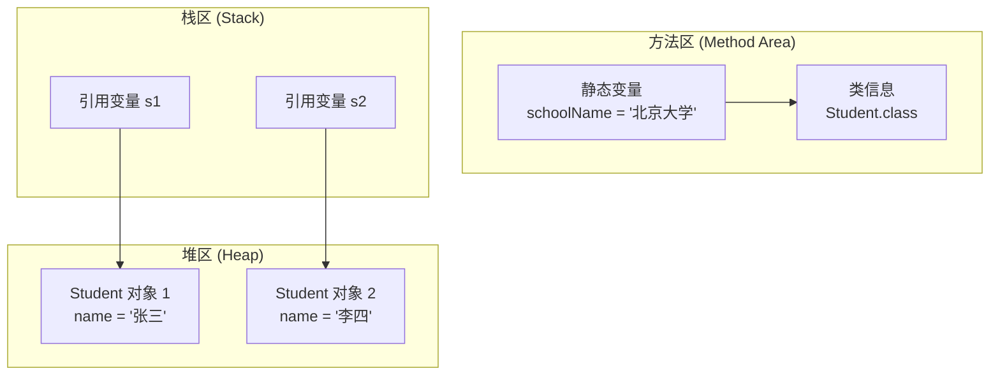

+++
title = "第18章 static 和 final 关键字"
weight = 180
date = "2026-03-30T14:33:56.899+08:00"
type = "docs"
description = ""
isCJKLanguage = true
draft = false
+++
# 第十八章 static 和 final 关键字

> "在 Java 的世界里，有些东西是挂在天上不下来的（static），有些东西是一旦决定就再也不改的（final）。这俩关键字，堪称 Java 世界里的'永恒星'和'定海神针'。"

---

## 18.1 static 修饰变量：静态变量（类变量）

### 什么是静态变量？

在 Java 中，**static 关键字** 用于声明**静态变量**，也叫**类变量**。普通的实例变量是属于对象的，每个对象都有一份副本；而静态变量属于**类本身**，被该类的所有对象**共享**。你可以把它想象成"挂在天花板上的电视"——所有房间里的居民都看同一台电视，谁进去都能看，而且看的都是同一个频道。

### 语法

```java
访问修饰符 static 数据类型 变量名;
```

### 示例

```java
public class Student {
    // 静态变量：所有学生共享同一个学校名称
    public static String schoolName = "清华大学";

    // 实例变量：每个学生有自己的名字
    public String name;

    public Student(String name) {
        this.name = name;
    }

    public static void main(String[] args) {
        Student s1 = new Student("张三");
        Student s2 = new Student("李四");

        // 修改静态变量
        Student.schoolName = "北京大学";

        System.out.println(s1.name + " 的学校是：" + s1.schoolName); // 输出：北京大学
        System.out.println(s2.name + " 的学校是：" + s2.schoolName); // 输出：北京大学
    }
}
```

运行结果：

```
张三 的学校是：北京大学
李四 的学校是：北京大学
```

### 内存分布图



> **专业词汇解释：**
> - **方法区（Method Area）**：存储类的结构信息（运行时常量池、字段、方法数据、方法代码等），静态变量就存在这里
> - **堆区（Heap）**：存储 Java 对象实例的区域
> - **栈区（Stack）**：存储局部变量、方法调用等，每个线程有独立的栈

### 静态变量的特点

| 特点 | 说明 |
|------|------|
| **归属类** | 静态变量属于类，不属于对象 |
| **共享性** | 所有对象共享同一份静态变量 |
| **访问方式** | 可以通过 `类名.静态变量名` 访问，也可以通过 `对象名.静态变量名` 访问（不推荐） |
| **生命周期** | 静态变量在类加载时创建，程序结束才销毁 |

> "想象一下：如果每个学生都有一台自己的学校牌子，那改个校名得跑遍全校去换。但如果是挂在天花板上的牌子，换一次大家都看到了——这就是静态变量的共享哲学。"

---

## 18.2 static 修饰方法：静态方法

### 什么是静态方法？

**静态方法**是属于类的，而不是属于某个对象的。调用静态方法时，不需要创建对象，直接通过 `类名.方法名()` 即可调用。我们常见的 `main` 方法就是一个静态方法——程序还没开始，哪来的对象？所以 `main` 必须是 static 的。

### 语法

```java
访问修饰符 static 返回类型 方法名(参数列表) {
    // 方法体
}
```

### 示例

```java
public class MathUtil {
    // 静态方法：计算两数之和
    public static int add(int a, int b) {
        return a + b;
    }

    // 静态方法：计算两数之积
    public static int multiply(int a, int b) {
        return a * b;
    }

    // 实例方法：需要对象来调用
    public int subtract(int a, int b) {
        return a - b;
    }

    public static void main(String[] args) {
        // 直接通过类名调用静态方法，不需要创建对象
        int sum = MathUtil.add(10, 20);
        int product = MathUtil.multiply(5, 6);

        System.out.println("和是：" + sum);       // 输出：和是：30
        System.out.println("积是：" + product);   // 输出：积是：30

        // 实例方法必须创建对象
        MathUtil util = new MathUtil();
        int diff = util.subtract(10, 4);
        System.out.println("差是：" + diff);     // 输出：差是：6
    }
}
```

运行结果：

```
和是：30
积是：30
差是：6
```

### 静态方法的限制

静态方法有两大"不能"：

1. **不能访问实例变量**：静态方法中没有 `this` 指针，因为它不属于任何对象
2. **不能调用实例方法**：同样因为没有对象实例

```java
public class StaticMethodDemo {
    public String instanceVar = "实例变量";  // 实例变量

    public static void main(String[] args) {
        // 错误！静态方法不能直接访问实例变量
        // System.out.println(instanceVar);

        // 正确：创建对象后访问
        StaticMethodDemo demo = new StaticMethodDemo();
        System.out.println(demo.instanceVar);  // 输出：实例变量
    }
}
```

> "可以把静态方法想象成酒店大厅里的自动贩卖机——你不需要成为酒店的会员（创建对象），路过就能买东西（直接调用）。但贩卖机里可没有你房间里的私人物品（无法访问实例变量）。"

---

## 18.3 static 修饰代码块：静态代码块

### 什么是静态代码块？

**静态代码块**是在类加载时执行一次的代码块，用 `static {}` 包裹。它常用于**初始化静态变量**或**执行一次性操作**。静态代码块在类的生命周期中只执行一次，且在 `main` 方法之前执行。

### 语法

```java
static {
    // 静态初始化代码
}
```

### 示例

```java
public class DatabaseConnection {
    // 静态变量
    public static String driver;
    public static String url;

    // 静态代码块：用于初始化静态变量
    static {
        System.out.println("【静态代码块】正在加载数据库驱动...");
        driver = "com.mysql.cj.jdbc.Driver";
        url = "jdbc:mysql://localhost:3306/mydb";
        System.out.println("【静态代码块】驱动加载完成！");
    }

    // 构造方法：每次创建对象都会执行
    public DatabaseConnection() {
        System.out.println("【构造方法】创建数据库连接对象");
    }

    public static void main(String[] args) {
        System.out.println("=== 程序开始 ===");
        DatabaseConnection conn1 = new DatabaseConnection();
        DatabaseConnection conn2 = new DatabaseConnection();
        System.out.println("驱动名称：" + DatabaseConnection.driver);
        System.out.println("数据库地址：" + DatabaseConnection.url);
    }
}
```

运行结果：

```
【静态代码块】正在加载数据库驱动...
【静态代码块】驱动加载完成！
=== 程序开始 ===
【构造方法】创建数据库连接对象
【构造方法】创建数据库连接对象
驱动名称：com.mysql.cj.jdbc.Driver
数据库地址：jdbc:mysql://localhost:3306/mydb
```

### 执行顺序

> **类加载时机（首次主动使用时）：**
> 1. 父类静态变量初始化 → 父类静态代码块执行
> 2. 子类静态变量初始化 → 子类静态代码块执行
> 3. `main` 方法执行
> 4. 实例变量初始化 → 构造代码块执行 → 构造方法执行

> "静态代码块就像飞机起飞前的安全检查——只做一次，但这次检查决定了整趟飞行能否开始。它在程序正式运行前就默默完成了准备工作。"

---

## 18.4 static 修饰内部类：静态内部类

### 什么是静态内部类？

在 Java 中，可以在一个类的内部再定义一个类，这就是**内部类**。如果内部类用 `static` 修饰，就成了**静态内部类**（也叫嵌套类）。静态内部类不需要外部类的实例即可创建，这和普通内部类有很大的区别。

### 语法

```java
public class Outer {
    // 静态内部类
    static class StaticInner {
        // ...
    }
}
```

### 示例

```java
public class Outer {
    public String outerVar = "外部类变量";

    // 静态内部类
    static class StaticInner {
        public String innerVar = "静态内部类变量";

        public void display() {
            System.out.println("这是静态内部类的方法");
        }
    }

    // 普通内部类（对比用）
    class Inner {
        public void display() {
            // 静态内部类可以直接访问
            System.out.println("普通内部类可以访问外部类变量：" + outerVar);
        }
    }

    public static void main(String[] args) {
        // 创建静态内部类对象：不需要外部类实例
        Outer.StaticInner inner = new Outer.StaticInner();
        inner.display();
        System.out.println(inner.innerVar);

        // 创建普通内部类对象：需要外部类实例
        Outer outer = new Outer();
        Outer.Inner inner2 = outer.new Inner();
        inner2.display();
    }
}
```

运行结果：

```
这是静态内部类的方法
静态内部类变量
普通内部类可以访问外部类变量：外部类变量
```

### 静态内部类 vs 普通内部类

| 特性 | 静态内部类 | 普通内部类 |
|------|-----------|-----------|
| **创建方式** | `new Outer.StaticInner()` | `outer.new Inner()` |
| **依赖外部类** | 不需要外部类实例 | 必须先有外部类实例 |
| **访问外部类成员** | 只能访问外部类的静态成员 | 可以访问外部类的所有成员 |
| **使用场景** | 与外部类关联不紧密时 | 与外部类关联紧密，需要访问外部类成员时 |

> "把静态内部类想象成酒店大堂里的投币电话——你不需要是酒店客人（不需要外部类实例）就能使用。但普通内部类更像是酒店房间里的内线电话——你得先成为客人（创建外部类对象）才能用。"

---

## 18.5 final 修饰变量

### 什么是 final 变量？

**final 关键字** 用于声明"不可改变"的变量。一旦被 `final` 修饰，变量就变成了**常量**，就像给你的变量戴上了"金钟罩"，绝对不能修改。

### 三种 final 变量

1. **成员变量（字段）**：必须在声明时或构造器/静态代码块中初始化
2. **局部变量**：使用前必须初始化，一旦赋值不能更改
3. **引用变量**：引用地址不能改变，但引用的对象内容可以修改

### 示例

```java
public class FinalVariableDemo {
    // final 成员变量：必须在声明时赋值，或在构造器/静态代码块中初始化
    public final int MAX_SIZE = 100;                    // 方式1：声明时赋值
    public final String NAME;                           // 方式2：构造器中赋值

    // 静态 final 成员变量
    public static final double PI = 3.1415926;          // 静态常量

    public FinalVariableDemo() {
        this.NAME = "Java教程";  // 构造器中赋值
    }

    public void demo() {
        // final 局部变量
        final int count = 10;
        System.out.println("局部常量 count = " + count);

        // final 引用变量：引用地址不能变
        final StringBuilder sb = new StringBuilder("Hello");
        sb.append(", World!");  // 可以修改对象内容
        System.out.println(sb);  // 输出：Hello, World!

        // 错误！不能给 final 引用变量重新赋值
        // sb = new StringBuilder("New");  // 编译错误！

        // 错误！不能修改 final 变量的值
        // MAX_SIZE = 200;  // 编译错误！
    }

    public static void main(String[] args) {
        FinalVariableDemo demo = new FinalVariableDemo();
        System.out.println("MAX_SIZE = " + demo.MAX_SIZE);
        System.out.println("NAME = " + demo.NAME);
        System.out.println("PI = " + PI);
        demo.demo();
    }
}
```

运行结果：

```
MAX_SIZE = 100
NAME = Java教程
PI = 3.1415926
局部常量 count = 10
Hello, World!
```

### 命名规范

> 按照 Java 命名规范：**final 变量（常量）的名字要全部大写**，单词之间用下划线分隔。这不是强制的，但这是 Java 社区的约定俗成。
>
> 例如：`MAX_SIZE`、`PI`、`SCHOOL_NAME`

> "final 变量就像刻在石头上的誓言——说出去的话就不能收回了。一旦赋予它值，它就永远是这个值。你可以改变你的发型，但你不能改变你的生日——生日就是一个 final 变量。"

---

## 18.6 final 修饰方法：方法不能被重写

### 什么是 final 方法？

用 `final` 修饰的方法称为 **final 方法**。它的特点是：**不能被子类重写（Override）**。这在设计继承体系时非常有用，可以防止子类修改父类的核心逻辑。

### 示例

```java
// 父类
public class Father {
    // final 方法：子类不能重写
    public final void sayHello() {
        System.out.println("你好，我是父亲！");
    }

    // 普通方法：子类可以重写
    public void introduce() {
        System.out.println("我是一个普通人");
    }
}

// 子类
public class Son extends Father {
    // 错误！不能重写 final 方法
    // @Override
    // public void sayHello() {
    //     System.out.println("你好，我是儿子！");
    // }

    // 正确：可以重写普通方法
    @Override
    public void introduce() {
        System.out.println("我是一个程序员");
    }

    public static void main(String[] args) {
        Son son = new Son();
        son.sayHello();     // 调用父类的 final 方法
        son.introduce();    // 调用子类重写的方法
    }
}
```

运行结果：

```
你好，我是父亲！
我是一个程序员
```

### 使用场景

为什么需要 final 方法？考虑以下场景：

```java
public class String {
    // String 类中的很多方法都是 final 的
    // 因为 String 是不可变的，如果方法可以被重写，可能会破坏其不可变性

    public final String trim() {
        // 去除首尾空格的逻辑
        // ...
        return this;
    }
}
```

> "final 方法就像是家族秘方的食谱——你可以照着做（继承），也可以自己创造新菜（重写其他方法），但这个秘方本身不能改。因为这个秘方可能是你爷爷精心研发的，改了味道就不对了。"

---

## 18.7 final 修饰类：类不能被继承

### 什么是 final 类？

用 `final` 修饰的类称为 **final 类**，它的特点是：**不能被其他类继承**。这就好比这个类已经是"完美形态"了，不需要、也不允许有子类来修改它。

### 示例

```java
// final 类：不能被继承
public final class String {
    // String 类的实际实现非常复杂
    // Java 设计者认为 String 不应该被继承

    private final char[] value;

    public String(String original) {
        this.value = original.value;
    }

    // ... 大量方法
}

// 错误！String 是 final 类，不能继承
// public class MyString extends String {
//     // 编译错误！
// }
```

### 常见 final 类

Java 标准库中有几个非常著名的 final 类：

| 类名 | 说明 |
|------|------|
| `java.lang.String` | 字符串类，不可变 |
| `java.lang.System` | 系统类，提供系统相关操作 |
| `java.lang.Math` | 数学工具类 |
| `java.lang.Integer` | 包装类 |
| `java.net.HttpURLConnection` | HTTP 连接类 |

### 注意事项

> **final 类的所有方法默认也是 final 的吗？**
>
> 不！final 类只是禁止继承，但类中的方法本身不自动是 final 的。如果想让某个方法也不能被重写，需要显式加上 `final` 关键字。

```java
public final class Constants {
    // final 类中的方法不自动是 final
    public static final int MAX = 100;

    // 如果想让某个方法也不能被重写，需要显式声明
    public final void show() {
        System.out.println("这是 final 方法");
    }
}
```

> "final 类就像一本密封的说明书——你只能阅读它（使用它），不能拆开重新组装（继承它）。有些东西太完美了，不需要后代来'改进'——比如 String，如果有人能继承并修改它，Java 的安全性可能就要打问号了。"

---

## 18.8 static final：类常量

### 什么是 static final？

当 `static` 和 `final` 组合在一起使用时，就形成了 Java 中**类常量**的概念：

- **`static`**：属于类，只有一份副本，所有对象共享
- **`final`**：不可改变，值初始化后就不能修改
- **组合起来**：属于类的、不可改变的常量

### 示例

```java
public class Constants {
    // 类常量：static final 的典型用法
    public static final int MAX_STUDENTS = 50;
    public static final String SCHOOL_NAME = "清华大学";
    public static final double PI = 3.141592653589793;

    // 数组常量：引用本身是 final，但数组内容可以修改
    public static final int[] LUCKY_NUMBERS = {6, 8, 666};

    public static void main(String[] args) {
        System.out.println("最大学生数：" + Constants.MAX_STUDENTS);
        System.out.println("学校名称：" + Constants.SCHOOL_NAME);
        System.out.println("圆周率：" + Constants.PI);

        // 数组内容可以修改（注意！这是 static final 的一个陷阱）
        Constants.LUCKY_NUMBERS[0] = 9;
        System.out.println("幸运数字：" + Constants.LUCKY_NUMBERS[0]); // 输出：9

        // 错误！不能修改常量的引用
        // Constants.LUCKY_NUMBERS = new int[]{1, 2, 3};  // 编译错误！
    }
}
```

运行结果：

```
最大学生数：50
学校名称：清华大学
圆周率：3.141592653589793
幸运数字：9
```

### static final 的命名规范

| 类型 | 命名规范 | 示例 |
|------|---------|------|
| **static final 常量** | 全大写，单词间用下划线 | `MAX_SIZE`、`PI`、`SCHOOL_NAME` |
| **static final 变量（可变集合）** | 驼峰命名，末尾加注释说明 | `LUCKY_NUMBERS`（注释说明内容可变） |

### 静态代码块初始化复杂常量

当常量的初始化需要复杂计算时，可以使用静态代码块：

```java
public class ComplexConstants {
    // 使用静态代码块初始化复杂的 static final 常量
    public static final String TIMESTAMP;
    public static final double SQRT2;

    static {
        // 模拟复杂的初始化逻辑
        java.util.Date now = new java.util.Date();
        TIMESTAMP = String.format("%tF %<tT", now);

        SQRT2 = Math.sqrt(2.0);
    }

    public static void main(String[] args) {
        System.out.println("当前时间戳：" + TIMESTAMP);
        System.out.println("根号2的值：" + SQRT2);
    }
}
```

运行结果（示例）：

```
当前时间戳：2026-03-30 20:37:00
根号2的值：1.4142135623730951
```

### static final 的内存位置

static final 变量（基本类型和 String 不可变类型）的值在**方法区**的**运行时常量池**中存储。它们在类加载阶段就被解析（resolve），程序运行期间一直存在。

> "static final 就像刻在寺庙石碑上的经文——它们从一开始就存在（类加载时初始化），并且永远不会改变（final），所有人都可以来读（static，所有对象共享）。如果哪天经文自己变了，那可就天下大乱了。"

---

## 本章小结

本章我们深入学习了 Java 中两个非常重要的关键字：`static` 和 `final`。

### static 关键字

| 修饰目标 | 作用 | 特点 |
|---------|------|------|
| **变量** | 静态变量（类变量） | 属于类，所有对象共享，存储在方法区 |
| **方法** | 静态方法 | 属于类，可直接通过类名调用，不能访问实例成员 |
| **代码块** | 静态代码块 | 类加载时执行一次，用于初始化静态变量 |
| **内部类** | 静态内部类 | 嵌套类，不需要外部类实例即可创建 |

### final 关键字

| 修饰目标 | 作用 | 特点 |
|---------|------|------|
| **变量** | 常量 | 值不可改变，命名规范为全大写 |
| **方法** | final 方法 | 不能被子类重写 |
| **类** | final 类 | 不能被其他类继承 |

### static final 组合

- **类常量**：属于类、不可改变的常量
- **典型应用**：`public static final int MAX_SIZE = 100;`
- **命名规范**：全大写，单词间用下划线分隔
- **注意事项**：如果是数组或集合类型，引用本身不可变，但内容可能可变

> "static 和 final，一个管'共享'，一个管'不变'。把它们想象成：static 是'大家都可以用'的公共物品，final 是'你碰都不能碰'的禁区。两者结合，就是'大家都可以用、但谁都不能改'的公共资产——比如公共图书馆里的藏书。"
