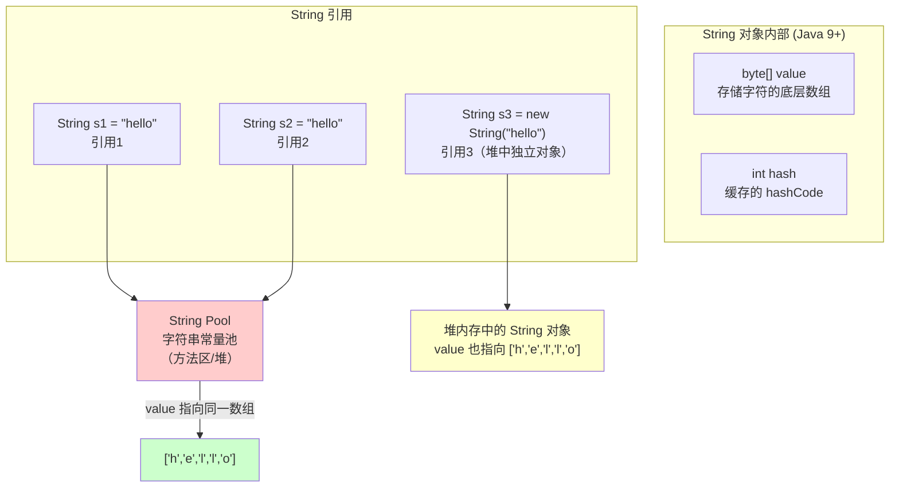

+++
title = "第19章 String 字符串——最常用的类型"
weight = 190
date = "2026-03-30T14:33:56.900+08:00"
type = "docs"
description = ""
isCJKLanguage = true
draft = false
+++
# 第十九章 String 字符串——最常用的类型

> "在 Java 的世界里，一切皆对象，但 String 是个例外中的例外。它既是对象，又像个原始类型那样常用，甚至让你忘了它其实是个正经的类。"

你知道吗？根据无数代码统计分析，`String` 是 Java 程序中使用频率最高的类型，没有之一。无论是用户名、地址、日志信息，还是配置文件路径，统统离不开它。今天我们就来好好扒一扒这个 Java 世界里的"超级明星"。

---

## 19.1 String 的不可变性

### 什么是不可变性？

**不可变性（Immutability）** 指的是一个对象一旦创建，其内部状态（数据）就不能被改变。`String` 就是这样一个"倔脾气"的家伙——创建之后，你只能得到一个新的 String，原来的那个永远不变。

这就好比你买了一本精装书，你可以在书外面包一个书皮（引用），可以在扉页上写个批注（变量名），但书的内容本身不会因为你写批注而改变。你要改内容？只能重新印一本（创建新字符串）。

### 内存结构大揭秘

String 内部到底是怎么存的？让我们来看一张图：



从图中我们可以看到：

- `s1` 和 `s2` 指向字符串常量池中的**同一个对象**，这就是 String interning（字符串驻留）机制
- `s3` 通过 `new String()` 创建，会在堆中创建一个**全新的对象**，即使字符串内容相同

### 为什么 String 要设计成不可变的？

这个问题面试官超级喜欢问！主要有以下几个原因：

1. **字符串常量池的需要**：如果 String 可变，那共享一个对象就危险了——你改了我也跟着变，谁受得了？
2. **安全性**：想想数据库用户名密码、文件路径、网络 URL——这些东西要是能随便改，天下大乱。
3. **线程安全**：不可变的对象天生线程安全，不需要同步。多个线程同时读同一个 String，完全不用担心数据被改坏。
4. **哈希码缓存**：String 的 `hashCode()` 可以缓存起来，因为字符序列不变，结果就永远不变。`Hashtable`、`HashMap` 这些依赖 String 作为 key 的家伙因此效率很高。

### 不可变性的代价

当然，不可变也有代价。每次"修改"字符串，其实都是在创建新对象：

```java
public class StringImmutabilityDemo {
    public static void main(String[] args) {
        // 看似在修改，其实每次都创建了新对象
        String s = "hello";
        s = s + " world"; // 这里是创建了新的 "hello world"，s 指向了新对象
        System.out.println(s); // 输出: hello world
        
        // 原有的 "hello" 并没有被修改，它还在字符串常量池里
        // 如果之前没有 "hello" 的其他引用，GC 会回收它
        
        // 验证：比较地址
        String a = "java";
        String b = "java";
        String c = new String("java");
        
        System.out.println("a == b: " + (a == b));   // true，指向常量池同一个对象
        System.out.println("a == c: " + (a == c));   // false，c 是堆中新对象
        System.out.println("a.equals(c): " + a.equals(c)); // true，内容相同
    }
}
```

> **为什么要避免在循环中频繁拼接 String？**
>
> 每次 `+` 操作都会创建新对象、复制内容，性能极差！这时候你该用 `StringBuilder` 或 `StringBuffer`，后面会讲到。

### String 真的绝对不可变吗？（进阶）

从源码角度看，String 的不可变由以下几道防线守护：

```java,ignore
// String 类的核心字段（简化版）
public final class String
    implements java.io.Serializable, Comparable<String>, CharSequence {
    
    // 1. private：私有化，外部无法直接访问
    // 2. final：value 数组引用不可改变（数组内容可改，但 String 没提供修改方法）
    private final byte[] value;
    
    // 3. 没有 setter 方法！没有任何公开的修改 value 的途径
}
```

等等，数组内容本身是可以改的呀？`value` 是 `final` 的只是说引用不能指向另一个数组，但数组里的字节可以被修改。不过由于 String 没有暴露任何修改数组的方法，外部无法直接改它。而且在 Java 9+ 实际使用的是 `byte[]`（压缩字符串），在正确的封装下，确实是真正不可变的。

---

## 19.2 String 的常用方法

String 类提供了大量方法，我们按功能分组来介绍。假设有：

```java
String str = "  Hello, Java!  ";
String empty = "";
String numbers = "12345";
```

### 19.2.1 获取信息类方法

```java
public class StringInfoMethods {
    public static void main(String[] args) {
        String str = "Hello, Java!";
        
        // 获取长度
        System.out.println("长度: " + str.length()); // 12
        
        // 获取指定位置的字符（索引从0开始）
        System.out.println("第0个字符: " + str.charAt(0)); // H
        System.out.println("最后一个字符: " + str.charAt(str.length() - 1)); // !
        
        // 获取子串
        System.out.println("子串(0,5): " + str.substring(0, 5)); // Hello
        System.out.println("子串(7): " + str.substring(7)); // Java!
        
        // 获取字符或子串第一次/最后一次出现的位置
        System.out.println("'a'第一次出现位置: " + str.indexOf('a')); // 7
        System.out.println("'a'最后一次出现位置: " + str.lastIndexOf('a')); // 9
        System.out.println("\"Java\"第一次出现: " + str.indexOf("Java")); // 7
        
        // 检查是否包含子串
        System.out.println("包含\"Java\": " + str.contains("Java")); // true
        
        // 检查是否以指定内容开头/结尾
        System.out.println("以\"Hello\"开头: " + str.startsWith("Hello")); // true
        System.out.println("以\"!\"结尾: " + str.endsWith("!")); // true
    }
}
```

### 19.2.2 转换类方法

```java
import java.util.Arrays;

public class StringTransformMethods {
    public static void main(String[] args) {
        String str = "Hello, Java!";
        
        // 转为字符数组
        char[] chars = str.toCharArray();
        System.out.println("字符数组: " + Arrays.toString(chars));
        // [H, e, l, l, o, ,,  , J, a, v, a, !]
        
        // 转大写 / 转小写
        System.out.println("大写: " + str.toUpperCase()); // HELLO, JAVA!
        System.out.println("小写: " + str.toLowerCase()); // hello, java!
        
        // 去除首尾空白（常用于处理用户输入）
        String dirty = "  \t\n Hello \r\n  ";
        System.out.println("去除空白: '" + dirty.trim() + "'"); // 'Hello'
        
        // Java 11+ 新增 strip()，对 Unicode 空白字符处理更好
        System.out.println("strip(): '" + dirty.strip() + "'"); // 'Hello'
        
        // 去除首部/尾部空白（Java 11+）
        System.out.println("stripLeading(): '" + dirty.stripLeading() + "'");
        System.out.println("stripTrailing(): '" + dirty.stripTrailing() + "'");
        
        // 替换
        System.out.println("替换'a'为'@': " + str.replace('a', '@')); // Hello, J@v@!
        System.out.println("替换'Java'为'World': " + str.replace("Java", "World")); // Hello, World!
        
        // 替换满足正则的部分（正则表达式后面会讲）
        System.out.println("替换数字: " + "a1b2c3".replaceAll("\\d", "#")); // a#b#c#
        
        // 拼接
        System.out.println("拼接: " + str.concat(" 你好!")); // Hello, Java! 你好!
        
        // String.join()（Java 8+）
        System.out.println("join: " + String.join("-", "a", "b", "c")); // a-b-c
    }
}
```

### 19.2.3 判断类方法

```java
public class String判断方法 {
    public static void main(String[] args) {
        // 判断是否为空字符串
        String empty = "";
        String nullStr = null;
        String blank = "   ";
        
        // isEmpty()：长度为0算 true，null 会抛空指针异常
        System.out.println("空字符串 isEmpty(): " + empty.isEmpty()); // true
        // System.out.println(nullStr.isEmpty()); // NullPointerException!
        
        // isBlank()（Java 11+）：长度为0或全是空白字符
        System.out.println("空白字符串 isBlank(): " + blank.isBlank()); // true
        System.out.println("空字符串 isBlank(): " + empty.isBlank()); // true
        
        // 判断相等（重要！）
        String s1 = "hello";
        String s2 = "hello";
        String s3 = new String("hello");
        
        System.out.println("equals（内容比较）: " + s1.equals(s2)); // true
        System.out.println("equals（new对象）: " + s1.equals(s3)); // true
        
        // == 比较的是引用地址，不是内容
        System.out.println("==（常量池同一对象）: " + (s1 == s2)); // true
        System.out.println("==（堆中新对象）: " + (s1 == s3)); // false
        
        // 忽略大小写比较
        System.out.println("equalsIgnoreCase: " + "Hello".equalsIgnoreCase("hello")); // true
        
        // matches：判断是否匹配正则表达式
        System.out.println("匹配数字+: " + "123".matches("\\d+")); // true
        System.out.println("匹配邮箱格式: " + "test@qq.com".matches("\\w+@\\w+\\.\\w+")); // true
    }
}
```

### 19.2.4 拆分与格式化

```java
import java.util.Arrays;

public class StringSplitAndFormat {
    public static void main(String[] args) {
        // split：拆分字符串
        String csv = "apple,banana,cherry,durian";
        String[] fruits = csv.split(",");
        System.out.println("拆分结果: " + Arrays.toString(fruits));
        // [apple, banana, cherry, durian]
        
        // split 限制拆分次数（第二个参数为限制数量）
        String path = "a/b/c/d";
        String[] parts = path.split("/", 2);
        System.out.println("限制2次: " + Arrays.toString(parts));
        // [a, b/c/d]
        
        // String.format：格式化字符串（类似 C 语言的 printf）
        String name = "小明";
        int age = 18;
        double score = 95.678;
        
        // %s 字符串，%d 整数，%.2f 浮点数（保留2位）
        String info = String.format("姓名: %s, 年龄: %d, 成绩: %.2f", name, age, score);
        System.out.println(info);
        // 姓名: 小明, 年龄: 18, 成绩: 95.68
        
        // 对齐和填充
        System.out.println(String.format("[%10s]", "右对齐"));   // [      右对齐]
        System.out.println(String.format("[%-10s]", "左对齐")); // [左对齐      ]
        System.out.println(String.format("[%05d]", 42));         // [00042]
    }
}
```

### 19.2.5 字符串常量池与 intern()

**字符串常量池（String Pool）** 是 JVM 为了节省内存而设计的一个区域。当我们用字面量创建字符串时，JVM 会先在池中找有没有内容相同的字符串——有的话直接返回引用，没有才创建新的并存入池中。

`intern()` 方法可以手动将堆中的字符串放入常量池：

```java
public class StringInternDemo {
    public static void main(String[] args) {
        String s1 = new String("hello"); // 堆中创建对象
        String s2 = "hello";              // 常量池中获取
        
        System.out.println("创建后 s1 == s2: " + (s1 == s2)); // false
        
        // 调用 intern() 将堆中字符串放入常量池，返回池中的引用
        String s1Intern = s1.intern();
        String s3 = "hello"; // 此时常量池已有，直接获取
        
        System.out.println("intern() 后 s1Intern == s3: " + (s1Intern == s3)); // true
        System.out.println("intern() 后 s1 == s3: " + (s1 == s3)); // false（s1 仍是堆中对象）
        
        // 实际应用：大量重复字符串可以节省内存
        // 将频繁出现的字符串 intern()，可以让他们共享同一个 char[] 或 byte[] 底层数组
    }
}
```

---

## 19.3 StringBuilder 与 StringBuffer

### 为什么需要它们？

前面说过，`String` 的不可变特性意味着每次拼接都会创建新对象。在数据量小、次数少的时候无所谓，但如果遇到大规模拼接——比如循环中拼接 10000 次——性能会急剧下降：

```java
// 低效写法：循环中不要这样用 String
String result = "";
for (int i = 0; i < 10000; i++) {
    result += "item" + i; // 每次都创建新对象，GC 压力巨大
}
```

这时候就需要 `StringBuilder`（或 `StringBuffer`）出场了！

### StringBuilder —— 可变的字符串容器

`StringBuilder` 是一个**可变的字符序列**，类似于一个会自动扩容的字符数组。它不是线程安全的，但正因为少了同步的开销，速度很快。

```java
public class StringBuilderDemo {
    public static void main(String[] args) {
        StringBuilder sb = new StringBuilder();
        
        // append：追加，支持各种类型（会自动转字符串）
        sb.append("Hello");
        sb.append(", ");
        sb.append("Java");
        sb.append("!").append(2024); // 方法链式调用
        System.out.println("拼接结果: " + sb.toString()); // Hello, Java!2024
        
        // insert：在指定位置插入
        StringBuilder sb2 = new StringBuilder("Hello World");
        sb2.insert(5, ","); // 在索引5处插入逗号
        System.out.println("插入后: " + sb2); // Hello, World
        
        // delete / deleteCharAt：删除
        StringBuilder sb3 = new StringBuilder("Hello");
        sb3.delete(1, 3); // 删除索引 [1, 3) 的内容
        System.out.println("删除后: " + sb3); // Hlo
        
        sb3.deleteCharAt(0); // 删除单个字符
        System.out.println("删除首字符后: " + sb3); // lo
        
        // replace：替换
        StringBuilder sb4 = new StringBuilder("Hello");
        sb4.replace(1, 4, "XXX"); // 将 [1, 4) 替换为 "XXX"
        System.out.println("替换后: " + sb4); // HXXXo
        
        // reverse：翻转
        StringBuilder sb5 = new StringBuilder("ABC");
        sb5.reverse();
        System.out.println("翻转后: " + sb5); // CBA
        
        // capacity：容量（底层数组大小）
        StringBuilder sb6 = new StringBuilder();
        System.out.println("默认容量: " + sb6.capacity()); // 16
        sb6.append("0123456789ABCDEF");
        System.out.println("追加后容量: " + sb6.capacity()); // 34（16 + 16 + 2）
        
        // ensureCapacity：确保最小容量
        sb6.ensureCapacity(100);
        System.out.println("确保100后容量: " + sb6.capacity()); // >= 100
    }
}
```

### StringBuffer —— 线程安全的 StringBuilder

`StringBuffer` 和 `StringBuilder` 功能几乎一模一样，唯一的区别是：**`StringBuffer` 是线程安全的，所有关键方法都用 `synchronized` 修饰**。

```java
public class StringBufferDemo {
    public static void main(String[] args) {
        StringBuffer sbf = new StringBuffer("Hello");
        
        // append、insert、delete、replace、reverse —— 用法和 StringBuilder 完全一样
        sbf.append(" Java");
        System.out.println(sbf); // Hello Java
        
        sbf.reverse();
        System.out.println(sbf); // avaJ olleH
        
        // StringBuffer 的主要方法都是 synchronized 的
        // 在多线程环境下共享同一个 StringBuffer 实例时，不会出现数据错乱
        // 但在单线程环境下，StringBuilder 性能更好（无需同步）
    }
}
```

### StringBuilder vs StringBuffer vs String

| 特性 | String | StringBuilder | StringBuffer |
|------|--------|---------------|--------------|
| **可变性** | 不可变 | 可变 | 可变 |
| **线程安全** | 安全 | 不安全 | 安全 |
| **性能** | 拼接最差 | 最好 | 较好（需同步） |
| **使用场景** | 字符串不需变化 | 单线程拼接 | 多线程共享拼接 |

**实战建议**：

- 大部分情况下用 `StringBuilder`，简单高效
- 涉及多线程共享时用 `StringBuffer`（或者考虑用 `Collections.synchronizedList()` 包裹 StringBuilder）
- 字符串基本不变时直接用 `String`

---

## 19.4 StringJoiner（Java 8+）

### 是什么？

`StringJoiner` 是 Java 8 引入的一个工具类，专门用于**将多个字符串用分隔符连接起来**，还可以指定前缀和后缀。比手动循环拼接或 `String.join()` 更灵活。

### 基本用法

```java
import java.util.StringJoiner;

public class StringJoinerDemo {
    public static void main(String[] args) {
        // 创建一个以逗号分隔的 StringJoiner
        StringJoiner sj = new StringJoiner(", ");
        
        sj.add("苹果");
        sj.add("香蕉");
        sj.add("樱桃");
        sj.add("榴莲");
        
        System.out.println(sj.toString());
        // 苹果, 香蕉, 樱桃, 榴莲
        
        // 指定前缀和后缀（很适合做 SQL IN、HTML 列表等）
        StringJoiner sj2 = new StringJoiner(", ", "(", ")");
        sj2.add("Alice");
        sj2.add("Bob");
        sj2.add("Charlie");
        
        System.out.println(sj2.toString());
        // (Alice, Bob, Charlie)
        
        // 合并两个 StringJoiner
        StringJoiner sj3 = new StringJoiner("-");
        sj3.add("X").add("Y").add("Z");
        
        sj2.merge(sj3);
        System.out.println("合并后: " + sj2.toString());
        // (Alice, Bob, Charlie, X-Y-Z)
    }
}
```

### 实际应用场景

```java
import java.util.StringJoiner;
import java.util.Arrays;
import java.util.List;

public class StringJoinerPractical {
    public static void main(String[] args) {
        List<String> languages = Arrays.asList("Java", "Python", "C++", "Go");
        
        // 场景1：生成 SQL IN 子句
        StringJoiner sqlIn = new StringJoiner(", ", "SELECT * FROM users WHERE name IN (", ")");
        for (String lang : languages) {
            sqlIn.add("'" + lang + "'");
        }
        System.out.println("SQL: " + sqlIn);
        // SELECT * FROM users WHERE name IN ('Java', 'Python', 'C++', 'Go')
        
        // 场景2：生成 HTML 列表
        StringJoiner htmlList = new StringJoiner("", "<ul>", "</ul>");
        htmlList.add("<li>第一项</li>");
        htmlList.add("<li>第二项</li>");
        htmlList.add("<li>第三项</li>");
        System.out.println("HTML: " + htmlList);
        // <ul><li>第一项</li><li>第二项</li><li>第三项</li></ul>
        
        // 场景3：生成 CSV 行
        String[] row = {"1001", "张三", "北京", "工程师"};
        StringJoiner csv = new StringJoiner(",");
        for (String cell : row) {
            csv.add("\"" + cell + "\""); // 加引号防止 CSV 分隔符冲突
        }
        System.out.println("CSV: " + csv);
        // "1001","张三","北京","工程师"
    }
}
```

### String.join() —— 简化版的 StringJoiner

对于简单场景，`String.join()` 更方便，它是 Java 8 新增的静态方法：

```java
import java.util.Arrays;

public class StringJoinVsStringJoiner {
    public static void main(String[] args) {
        String[] names = {"Alice", "Bob", "Charlie"};
        
        // 直接用 String.join()，内部就是 StringJoiner
        System.out.println(String.join(", ", names)); // Alice, Bob, Charlie
        
        // join 还可以配合 Stream 使用
        String result = Arrays.asList("a", "b", "c").stream()
            .collect(java.util.stream.Collectors.joining(" -> "));
        System.out.println(result); // a -> b -> c
    }
}
```

---

## 19.5 String Templates：一个被撤回的设计（重要提醒）

### 先记住结论

网上大量文章说“String Templates 是 Java 21 的新特性，会在 Java 26 转正”，这是**不准确的**。真实的时间线是：

| 版本 | JEP | 状态 |
|------|-----|------|
| Java 21 | JEP 430 | 首次预览（`STR."..."` 雏形） |
| Java 22 | JEP 459 | 第二次预览 |
| Java 23 | JEP 465 | **撤回（Withdrawn）** |

也就是说，从 Java 23 起，`STR."..."` 这套语法**已经不在 JDK 里了**，JDK 25、26 里同样没有它，也没有进入任何正式版本。如果你看到有人写 `STR."Hello \{name}"`，那是**老预览版**的写法，今天的编译器会直接报错。

### 它当初想解决什么问题？

Java 的字符串拼接一直比较啰嗦：

```java
String name = "小明";
int age = 20;

// 方式一：+ 拼接，满眼都是引号和加号
String s1 = "姓名: " + name + ", 年龄: " + age;

// 方式二：String.format，参数和占位符一旦错位就很难查
String s2 = String.format("姓名: %s, 年龄: %d", name, age);
```

String Templates 的想法是引入一种**编译期可检查**的插值语法，既比 `+` 干净，又比 `format` 安全（占位符和参数一一对应）。

### 历史语法长什么样（仅作考古，编译不过）

下面这段代码**能看懂即可，不要照着写**——它只能在 Java 21/22 的预览版上编译，而且必须加 `--enable-preview`：

```java,ignore
// ⚠️ 已撤回的预览语法，Java 23 及以后无法编译
String name = "Java";
int version = 21;

// STR 是内置的模板处理器，"\{...}" 是插值（注意是反斜杠，不是 $）
String s1 = STR."Hello \{name}!";

// FMT 处理器支持格式化
String s2 = FMT."圆周率保留2位: \{3.1415926%.2f}";

// 多行模板
String s3 = STR."""
    <h1>欢迎，\{name}！</h1>
    """;
```

> ⚠️ **语法注意**：Java 的插值用 `\{...}`，不是 JavaScript/Python 的 `${...}`。这一点即使当作历史知识了解，也值得记一下。

### 今天应该怎么写？

下面的写法**在今天的 JDK 上都能正常编译运行**：

```java
// Chapter19StringAlternatives.java
public class Chapter19StringAlternatives {
    public static void main(String[] args) {
        String name = "小明";
        int age = 20;
        double gpa = 3.85;

        // 1. + 拼接：少量变量时最直接
        String s1 = "姓名: " + name + ", 年龄: " + age + ", GPA: " + gpa;

        // 2. String.format / formatted：需要对齐、格式化时最合适
        String s2 = String.format("姓名: %s, 年龄: %d, GPA: %.2f", name, age, gpa);
        String s3 = "姓名: %s, 年龄: %d".formatted(name, age);

        // 3. 文本块 + formatted：多行内容的首选
        String s4 = """
                <div>
                    <h1>欢迎，%s！</h1>
                    <p>GPA: %.2f</p>
                </div>
                """.formatted(name, gpa);

        // 4. StringBuilder：循环里大量拼接时用它，避免反复创建 String
        StringBuilder sb = new StringBuilder();
        for (int i = 1; i <= 3; i++) {
            sb.append("第 ").append(i).append(" 行\n");
        }

        System.out.println(s1);
        System.out.println(s2);
        System.out.println(s3);
        System.out.print(s4);
        System.out.print(sb);
    }
}
```

输出：

```
姓名: 小明, 年龄: 20, GPA: 3.85
姓名: 小明, 年龄: 20, GPA: 3.85
姓名: 小明, 年龄: 20
<div>
    <h1>欢迎，小明！</h1>
    <p>GPA: 3.85</p>
</div>
第 1 行
第 2 行
第 3 行
```

### 那“安全拼 SQL”怎么办？

当年 String Templates 被宣传得最响的场景，是“自定义处理器自动转义 SQL 参数”。这个需求今天依然存在，标准答案是用**参数化查询**（PreparedStatement），而不是手动拼接字符串：

```java
// 反例：手动拼接，值里带单引号就会出问题
String bad = "SELECT * FROM " + table + " WHERE name = '" + value + "'";

// 正解：让 JDBC 负责转义，用 ? 占位
String sql = "SELECT * FROM users WHERE name = ?";
PreparedStatement ps = conn.prepareStatement(sql);
ps.setString(1, value);   // 无论 value 里有什么字符，都安全
```

> 📌 **一句话总结**：String Templates 是一个**曾经存在、但已被撤回**的设计。写代码时请用 `+`、`String.format`/`formatted()`、文本块或 `StringBuilder`；拼 SQL 一律用 `PreparedStatement`。

---

## 本章小结

本章我们全面学习了 Java 中 `String` 字符串的相关知识：

1. **String 的不可变性**：String 一旦创建就不能修改，这带来了线程安全、哈希缓存、字符串常量池共享等优势，但频繁拼接会带来性能问题。理解其内存结构（字符串常量池、堆对象、`byte[]` 底层存储）对深入掌握 Java 至关重要。

2. **String 的常用方法**：涵盖获取信息（`length()`、`charAt()`、`substring()`、`indexOf()`）、转换（`toUpperCase()`、`trim()`、`replace()`）、判断（`equals()`、`isEmpty()`、`contains()`）、拆分格式化（`split()`、`String.format()`）等核心方法。牢记 `equals()` 比较内容，`==` 比较引用地址。

3. **StringBuilder 与 StringBuffer**：两者都是可变的字符序列，用于高效拼接。`StringBuilder` 非线程安全但速度快，`StringBuffer` 线程安全（synchronized）但有同步开销。单线程优先选 `StringBuilder`，多线程共享时选 `StringBuffer`。

4. **StringJoiner（Java 8+）**：专门解决用分隔符连接字符串的问题，支持前缀和后缀，非常适合生成 SQL、CSV、HTML 等格式化场景。配合 Stream 使用更香。

5. **String Templates（Java 21+ Preview → Java 26 Stable）**：革命性的字符串拼接语法，用反引号和 `\{}` 插值，支持多行字符串，可自定义处理器实现格式化、防注入等高级功能。这是 Java 字符串处理的未来方向。

> 记住：不是字符串操作慢，而是用错工具才慢。选择合适的工具，让代码既优雅又高效！
