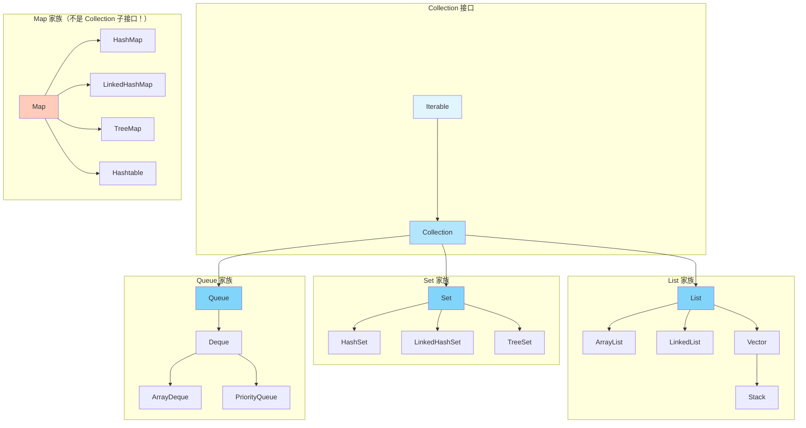

+++
title = "第20章 集合框架（上）——List 和 Set"
weight = 200
date = "2026-03-30T14:33:56.901+08:00"
type = "docs"
description = ""
isCJKLanguage = true
draft = false
+++
# 第二十章 集合框架（上）——List 和 Set

> "程序员的三大难题：缓存穿透、分布式锁、还有——ArrayList 和 LinkedList 到底该用哪个。"

好，这一章咱们来聊聊 Java 里最最常用的数据结构——**集合框架（Collections Framework）**。不管你是做 CRUD 的 Web 开发，还是写中间件、做大数据，集合几乎是天天见、日日用。学会了集合，你才能真正说"我开始写真正的业务代码了"。

---

## 20.1 集合框架全景图

### 什么是集合框架？

在正式进入代码之前，咱们先来认识一下 Java 集合框架的整体架构。这就像你去一个新城市之前，先看一眼地图，知道哪里是商业区、哪里是居民区、哪里是公园，心里有数了再出门。

Java 集合框架（Java Collections Framework，简称 JCF）是一套**用于存储和管理对象组（Group of Objects）的统一架构**。它最初在 JDK 1.2 引入，从此改变了 Java 程序员"手写链表"的历史。

### 核心接口三分天下

Java 集合框架的核心可以分为三大阵营：



> **📌 小贴士**：看到那个红色的 `Map<K,V>` 分支了吗？它**不是** `Collection` 的子接口！`Map` 和 `Collection` 是两套并列的体系，别搞混了。`Map` 存储的是"键值对"（Key-Value），而 `Collection` 存储的是独立的对象。这是个经典的面试题，也是个经典的坑。

### 继承结构一览

下面咱们把核心接口的继承关系整理成表格，方便你对号入座：

| 接口 | 是否有序 | 是否可重复 | 代表实现类 | 典型场景 |
|------|---------|-----------|-----------|---------|
| `List<E>` | ✅ 有序（按插入顺序） | ✅ 可重复 | `ArrayList`, `LinkedList` | 需要按索引访问元素 |
| `Set<E>` | ❌ 无序（或按特定规则排序） | ❌ 不可重复 | `HashSet`, `TreeSet` | 去重、集合运算 |
| `Queue<E>` | ✅ 有序（通常是 FIFO） | ✅ 可重复 | `ArrayDeque`, `PriorityQueue` | 任务队列、线程池 |
| `Deque<E>` | ✅ 有序（两端操作） | ✅ 可重复 | `ArrayDeque`, `LinkedList` | 栈、双端队列 |
| `Map<K,V>` | ❌ 无序（或按 Key 排序 | ❌（Key 不可重复） | `HashMap`, `TreeMap` | 缓存、字典查找 |

### 各接口的核心方法

`Collection` 接口定义了一组所有集合都有的通用方法：

```java
// 增删改查的基本操作
boolean add(E e);           // 添加元素
boolean remove(Object o);   // 删除指定元素
boolean contains(Object o); // 是否包含某元素
int size();                 // 集合大小
boolean isEmpty();          // 是否为空
void clear();               // 清空集合

// 批量操作
boolean addAll(Collection<? extends E> c);  // 批量添加
boolean removeAll(Collection<?> c);          // 批量删除
boolean retainAll(Collection<?> c);          // 取交集
boolean containsAll(Collection<?> c);        // 是否包含所有元素

// 转换成数组
Object[] toArray();
<T> T[] toArray(T[] a);
```

`List` 在 `Collection` 基础上增加的方法：

```java
// 索引操作 —— List 特有的能力
E get(int index);              // 获取指定索引的元素
E set(int index, E element);   // 设置指定索引的元素
void add(int index, E element);// 在指定位置插入元素
E remove(int index);           // 删除指定位置的元素
int indexOf(Object o);         // 查找元素首次出现的位置
int lastIndexOf(Object o);     // 查找元素最后一次出现的位置
```

### 为什么需要集合框架？

在没有集合框架之前（JDK 1.1 及以前），Java 的容器类非常混乱：

- `Vector`——古老的同步列表（现在用 `ArrayList`）
- `Hashtable`——古老的同步 Map（现在用 `HashMap`）
- `Stack`——继承自 `Vector`，性能堪忧
- 没有统一的接口、没有统一的遍历方式

有了集合框架之后：

1. **统一 API**：所有集合都实现相同的接口，学习成本大大降低
2. **互操作性**：可以在不同集合之间自由切换
3. **算法复用**：`Collections` 和 `Arrays` 类提供了丰富的静态方法（排序、查找、洗牌等）
4. **类型安全**：泛型的引入让你在编译期就能发现类型错误

---

## 20.2 List（有序、可重复）

### List 的本质特征

如果说 `Set` 是个"有原则"的家伙（不收重复元素），那 `List` 就是个"海纳百川"的老好人——什么都能往里装，而且**严格按照你插入的顺序排队**。就像银行排队叫号，先来的先办，来一个收一个，绝不拒绝。

**List 的两大核心特征：**

1. **有序**：元素按插入顺序存储，可以通过索引（下标）精确访问
2. **可重复**：同一个元素可以出现多次，比如 `[1, 2, 3, 2, 5]`

### ArrayList 登场——最常用的 List 实现

`ArrayList` 是 `List` 接口最常用的实现类。它的底层数据结构是一个**动态数组（Dynamic Array）**。

"动态数组"是什么意思呢？普通数组大小固定，比如 `int[] arr = new int[10]` 只能存 10 个元素。但 `ArrayList` 内部会帮你自动扩容——当你往一个已满的 `ArrayList` 里添加第 11 个元素时，它会悄悄地创建一个更大的数组（比如容量翻倍），然后把旧数据复制过去。这个过程对你是透明的。

**ArrayList 的优点：**

- 按索引随机访问速度极快——`O(1)` 时间复杂度，因为是数组，直接算偏移量
- 末尾添加元素效率高——均摊后也是 `O(1)`

**ArrayList 的缺点：**

- 在中间插入或删除元素需要移动后面所有元素——`O(n)`
- 线程不安全——在多线程环境下需要额外处理

```java
import java.util.ArrayList;
import java.util.List;

public class ArrayListDemo {
    public static void main(String[] args) {
        // 创建一个 ArrayList，默认初始容量是 10
        List<String> fruits = new ArrayList<>();

        // 添加元素 —— add 方法
        fruits.add("苹果");       // [苹果]
        fruits.add("香蕉");       // [苹果, 香蕉]
        fruits.add("橙子");       // [苹果, 香蕉, 橙子]
        fruits.add("香蕉");       // [苹果, 香蕉, 橙子, 香蕉] —— 重复元素，完全允许！

        // 按索引插入
        fruits.add(1, "葡萄");    // 在索引 1 的位置插入 [苹果, 葡萄, 香蕉, 橙子, 香蕉]

        // 按索引访问 —— get 方法，O(1) 速度极快
        String first = fruits.get(0);
        System.out.println("第一个水果: " + first);  // 输出: 第一个水果: 苹果

        // 按索引修改 —— set 方法
        String old = fruits.set(2, "西瓜");
        System.out.println("被替换的元素: " + old);   // 输出: 被替换的元素: 香蕉
        System.out.println("修改后: " + fruits);       // [苹果, 葡萄, 西瓜, 橙子, 香蕉]

        // 按索引删除 —— remove(int index) 方法
        String removed = fruits.remove(1);
        System.out.println("被删除的元素: " + removed); // 输出: 被删除的元素: 葡萄
        System.out.println("删除后: " + fruits);         // [苹果, 西瓜, 橙子, 香蕉]

        // 按值删除 —— remove(Object o) 方法，只删第一个匹配的
        boolean success = fruits.remove("橙子");
        System.out.println("删除成功? " + success);     // 输出: 删除成功? true
        System.out.println("最终集合: " + fruits);       // [苹果, 西瓜, 香蕉]

        // 集合大小
        System.out.println("大小: " + fruits.size());    // 输出: 大小: 3

        // 是否包含某元素
        System.out.println("包含苹果? " + fruits.contains("苹果"));  // true
        System.out.println("包含芒果? " + fruits.contains("芒果"));  // false

        // 遍历方式一：普通 for 循环（利用索引）
        System.out.print("遍历（索引方式）: ");
        for (int i = 0; i < fruits.size(); i++) {
            System.out.print(fruits.get(i) + " ");
        }
        System.out.println();

        // 遍历方式二：增强 for 循环（for-each）
        System.out.print("遍历（for-each）: ");
        for (String fruit : fruits) {
            System.out.print(fruit + " ");
        }
        System.out.println();

        // 遍历方式三：Lambda 表达式 + forEach 方法（JDK 8+）
        System.out.print("遍历（Lambda）: ");
        fruits.forEach(fruit -> System.out.print(fruit + " "));
        System.out.println();

        // 批量操作
        List<String> moreFruits = new ArrayList<>();
        moreFruits.add("草莓");
        moreFruits.add("蓝莓");

        fruits.addAll(moreFruits);  // 批量添加
        System.out.println("批量添加后: " + fruits);  // [苹果, 西瓜, 香蕉, 草莓, 蓝莓]

        // 清空
        fruits.clear();
        System.out.println("清空后是否为空: " + fruits.isEmpty());  // true
    }
}
```

### LinkedList 登场——链表版 List

`LinkedList` 是 `List` 接口的另一个实现，但它的底层数据结构是**双向链表（Doubly Linked List）**。

什么是双向链表？想象一下你小时候玩过的"套圈"玩具——每个圈都有一根棍子，棍子前面连着下一个圈，后面连着上一个圈。在 `LinkedList` 里，每个元素（节点）都包含：
- **数据**：存储的实际值
- **prev 指针**：指向前一个节点
- **next 指针**：指向后一个节点

```
HEAD -> [元素1] <-> [元素2] <-> [元素3] <-> [元素4] -> TAIL
```

**LinkedList 的优点：**

- 在任意位置插入/删除元素极快——只需要改动相邻节点的指针，`O(1)`
- 头尾操作效率高（因为它还实现了 `Deque` 接口）

**LinkedList 的缺点：**

- 按索引随机访问需要从头遍历——`O(n)`，比 `ArrayList` 慢很多
- 每个节点额外存储两个指针，内存开销略大

```java
import java.util.LinkedList;
import java.util.List;

public class LinkedListDemo {
    public static void main(String[] args) {
        List<String> tasks = new LinkedList<>();

        // 添加元素
        tasks.add("吃饭");      // HEAD -> [吃饭] -> TAIL
        tasks.add("睡觉");      // HEAD -> [吃饭] <-> [睡觉] -> TAIL
        tasks.add("打豆豆");    // HEAD -> [吃饭] <-> [睡觉] <-> [打豆豆] -> TAIL

        // 在头部插入 —— O(1) 操作
        ((LinkedList<String>) tasks).addFirst("起床");
        System.out.println("在头部插入后: " + tasks);

        // 在尾部插入 —— O(1) 操作
        ((LinkedList<String>) tasks).addLast("刷牙");
        System.out.println("在尾部插入后: " + tasks);

        // 获取头部和尾部元素 —— O(1)
        System.out.println("第一个任务: " + ((LinkedList<String>) tasks).peekFirst());
        System.out.println("最后一个任务: " + ((LinkedList<String>) tasks).peekLast());

        // 按索引访问 —— O(n)，越靠后越慢！
        System.out.println("索引2的元素: " + tasks.get(2));

        // 在中间插入 —— O(1) 只需要改指针，但找位置需要 O(n)
        tasks.add(2, "洗脸");
        System.out.println("在索引2插入后: " + tasks);

        // 删除头部 —— O(1)
        ((LinkedList<String>) tasks).removeFirst();
        System.out.println("删除头部后: " + tasks);

        // 删除尾部 —— O(1)
        ((LinkedLinked<String>) tasks).removeLast();  // 修正：这里应该是 LinkedList
        System.out.println("删除尾部后: " + tasks);

        // 标准 for-each 遍历（没问题，但 get(i) 效率低）
        System.out.print("遍历: ");
        for (String task : tasks) {
            System.out.print(task + " ");
        }
        System.out.println();

        // 使用 ListIterator 从后往前遍历 —— 链表特有的强大能力！
        System.out.print("逆序遍历: ");
        var iterator = ((LinkedList<String>) tasks).descendingIterator();
        while (iterator.hasNext()) {
            System.out.print(iterator.next() + " ");
        }
    }
}
```

### ArrayList vs LinkedList 怎么选？

这是 Java 面试中的经典问题。咱们直接给结论：

| 操作 | ArrayList | LinkedList |
|------|----------|-----------|
| 按索引随机访问 `get(i)` | `O(1)` ✅ | `O(n)` ❌ |
| 末尾添加 `add()` | `O(1)` 均摊 ✅ | `O(1)` ✅ |
| 中间插入 `add(i, val)` | `O(n)` ❌ | `O(1)` ✅（但找位置 `O(n)`） |
| 中间删除 `remove(i)` | `O(n)` ❌ | `O(1)` ✅（但找位置 `O(n)`） |
| 内存占用 | 小（纯数据） | 大（两个指针） |
| CPU 缓存友好性 | 好（连续内存） | 差（分散内存） |

**实际开发中的选择建议：**

```java
// 90% 的场景用 ArrayList 就够了！
List<String> list = new ArrayList<>();

// 只有当你确认有以下场景时，才考虑 LinkedList：
// 1. 需要频繁在列表中间插入/删除
// 2. 需要频繁对头尾进行操作
// 3. 数据量非常大且内存不是问题
List<String> linked = new LinkedList<>();
```

> **💡 实战经验**：很多初级程序员喜欢说"我插入多，所以用 LinkedList"。但实际上，`ArrayList` 的末尾插入几乎总是 `O(1)`，而且 CPU 缓存友好。除非你真的测出来 `ArrayList` 成了瓶颈，否则无脑 `ArrayList` 就行。**不要过早优化！**

### Vector 和 Stack——过时的老前辈

`Vector` 是一个**同步的**（thread-safe）`List`，它的方法都加了 `synchronized` 关键字，线程安全。但正因为如此，它的性能比 `ArrayList` 差很多。现在基本不用了。

`Stack`（栈）继承自 `Vector`，是个"后进先出"（LIFO）的数据结构。`push()` 入栈，`pop()` 出栈，`peek()` 看栈顶。

```java
import java.util.Stack;

public class StackDemo {
    public static void main(String[] args) {
        Stack<Integer> stack = new Stack<>();

        // 入栈
        stack.push(10);  // 栈底
        stack.push(20);
        stack.push(30);  // 栈顶

        // 查看栈顶元素（不出栈）
        System.out.println("栈顶元素: " + stack.peek());  // 30

        // 出栈
        System.out.println("弹出: " + stack.pop());  // 30
        System.out.println("弹出: " + stack.pop());  // 20

        // 栈是否为空
        System.out.println("栈空了吗? " + stack.isEmpty());  // false

        // 再弹一个
        System.out.println("弹出: " + stack.pop());  // 10
        System.out.println("栈空了吗? " + stack.isEmpty());  // true
    }
}
```

> **⚠️ 注意**：`Stack` 虽然还能用，但已经不推荐了。现代 Java 中，推荐用 `ArrayDeque` 实现栈的功能，性能更好。`Stack` 的问题是继承自 `Vector`，导致它可以按索引访问（这不符合栈"只能操作栈顶"的语义）。`ArrayDeque` 则没有这个问题。

### List 的静态工厂方法——List.of()

JDK 9 引入了 `List.of()` 静态工厂方法，可以快速创建不可变的列表：

```java
import java.util.List;

public class ListOfDemo {
    public static void main(String[] args) {
        // 快速创建固定列表（不可变）
        List<String> weekdays = List.of(
            "星期一", "星期二", "星期三", "星期四", "星期五", "星期六", "星期日"
        );

        System.out.println("一周七天: " + weekdays);

        // 不可变！尝试修改会抛出 UnsupportedOperationException
        try {
            weekdays.add("第八天");
        } catch (UnsupportedOperationException e) {
            System.out.println("报错啦！不可变列表不能修改！");
        }

        // 遍历
        weekdays.forEach(day -> System.out.print(day + " "));
    }
}
```

> **📌 小贴士**：`List.of()` 创建的是**不可变列表**（Immutable List），适合用来存放常量数据，既安全又省内存。

### List 的排序

对 List 排序是高频需求，Java 提供了 `Collections.sort()` 和 `List.sort()` 两种方式：

```java
import java.util.ArrayList;
import java.util.Collections;
import java.util.Comparator;
import java.util.List;

public class ListSortDemo {
    public static void main(String[] args) {
        List<Integer> scores = new ArrayList<>();
        scores.add(78);
        scores.add(95);
        scores.add(88);
        scores.add(62);
        scores.add(91);

        // 方式一：Collections.sort() —— 原地排序（升序）
        Collections.sort(scores);
        System.out.println("升序排序: " + scores);

        // 方式二：List.sort(Comparator) —— 更灵活
        scores.sort(Comparator.reverseOrder());  // 降序
        System.out.println("降序排序: " + scores);

        // 方式三：自定义排序 —— 按字符串长度排序
        List<String> words = new ArrayList<>(List.of("Java", "is", "awesome", "language"));
        words.sort(Comparator.comparingInt(String::length));
        System.out.println("按长度排序: " + words);

        // 方式四：倒置
        Collections.reverse(scores);
        System.out.println("倒置后: " + scores);

        // 方式五：洗牌（打乱顺序）
        Collections.shuffle(scores);
        System.out.println("洗牌后: " + scores);
    }
}
```

---

## 20.3 Set（无序、不重复）

### Set 的本质特征

如果说 `List` 是个"来者不拒"的老好人，那 `Set` 就是个**洁癖患者**——它只接受"没见过"的新元素，如果这个元素已经存在，对不起，门都不让进。

**Set 的两大核心特征：**

1. **无序**：不保证元素的顺序（`HashSet` 完全无序，`LinkedHashSet` 按插入顺序，`TreeSet` 按自然顺序或自定义规则排序）
2. **不重复**：相等的元素（`equals()` 返回 true）只能存在一个

### 什么是"相等"？—— equals() 和 hashCode()

这是 Set 实现去重机制的核心概念，必须搞明白！

`Set` 判断两个元素是否"相等"，分两步：

1. **先比 `hashCode()`**：计算两个对象的哈希值，如果哈希值不同，直接认定不相等
2. **再比 `equals()`**：如果哈希值相同，再用 `equals()` 做严格比较

```java
import java.util.HashSet;
import java.util.Set;

public class SetEqualityDemo {
    public static void main(String[] args) {
        Set<String> names = new HashSet<>();

        names.add("张三");
        names.add("李四");
        names.add("张三");  // 重复！Set 说不

        System.out.println("集合大小: " + names.size());  // 2，不是 3！
        System.out.println("集合内容: " + names);          // [张三, 李四]

        // 理解 equals 和 hashCode 的配合
        String s1 = new String("Hello");
        String s2 = new String("Hello");

        System.out.println("s1.equals(s2): " + s1.equals(s2));        // true
        System.out.println("s1.hashCode() == s2.hashCode(): " +
            (s1.hashCode() == s2.hashCode()));                        // true

        // 虽然是两个不同对象，但 String 重写了 equals 和 hashCode
        // 所以它们被认为是"相等"的，只会在 Set 中保留一份
        Set<String> stringSet = new HashSet<>();
        stringSet.add(s1);
        stringSet.add(s2);
        System.out.println("String Set 大小: " + stringSet.size());   // 1！
    }
}
```

> **📌 为什么 hashCode 和 equals 要配合？** 这涉及到 `HashSet` 的底层数据结构——**哈希表（Hash Table）**。哈希表用 hashCode 快速定位元素在"桶"（bucket）中的位置，只有 hashCode 相同时才会调用 equals 精确比较。如果每次都要精确比较所有元素，性能会非常差。

### HashSet——最常用的 Set 实现

`HashSet` 是 `Set` 接口最常用的实现。它的底层是 **哈希表**（实际上是 `HashMap` 的封装），提供了最快的查找速度和插入速度。

**HashSet 的特点：**

- 不保证迭代顺序
- 允许 `null` 元素
- 线程不安全
- 基本操作（添加、删除、包含检查）都是 `O(1)` 时间复杂度

```java
import java.util.HashSet;
import java.util.Set;

public class HashSetDemo {
    public static void main(String[] args) {
        Set<String> cities = new HashSet<>();

        // 添加元素
        cities.add("北京");
        cities.add("上海");
        cities.add("深圳");
        cities.add("北京");   // 重复！被忽略
        cities.add(null);    // 允许一个 null

        System.out.println("城市集合: " + cities);        // 无序输出
        System.out.println("城市数量: " + cities.size()); // 4（不是 5！）

        // contains —— O(1) 查找
        System.out.println("有北京吗? " + cities.contains("北京"));   // true
        System.out.println("有广州吗? " + cities.contains("广州"));   // false

        // remove —— O(1) 删除
        boolean removed = cities.remove("深圳");
        System.out.println("删除成功? " + removed);
        System.out.println("删除后: " + cities);

        // 遍历
        System.out.print("遍历所有城市: ");
        for (String city : cities) {
            System.out.print(city + " ");
        }
        System.out.println();

        // 集合运算 —— 面试高频题！
        Set<String> set1 = new HashSet<>(Set.of("A", "B", "C", "D"));
        Set<String> set2 = new HashSet<>(Set.of("C", "D", "E", "F"));

        // 并集
        Set<String> union = new HashSet<>(set1);
        union.addAll(set2);
        System.out.println("并集: " + union);

        // 交集
        Set<String> intersection = new HashSet<>(set1);
        intersection.retainAll(set2);
        System.out.println("交集: " + intersection);

        // 差集（A 有 B 没有）
        Set<String> difference = new HashSet<>(set1);
        difference.removeAll(set2);
        System.out.println("差集（A-B）: " + difference);
    }
}
```

### LinkedHashSet——保持插入顺序的 Set

`LinkedHashSet` 继承自 `HashSet`，但多了一个"链表"来记录插入顺序。如果你既需要 `HashSet` 的高效查找，又需要保持元素的插入顺序，就用它。

```java
import java.util.LinkedHashSet;
import java.util.Set;

public class LinkedHashSetDemo {
    public static void main(String[] args) {
        Set<String> accessOrder = new LinkedHashSet<>();

        accessOrder.add("第一");
        accessOrder.add("第二");
        accessOrder.add("第三");
        accessOrder.add("第四");

        System.out.println("遍历（保持插入顺序）:");
        accessOrder.forEach(item -> System.out.println("  " + item));

        // 输出：
        //   第一
        //   第二
        //   第三
        //   第四

        // 经典应用：实现"访问去重但保持顺序"
        // 比如 LRU 缓存（最近最少使用）的基础结构
    }
}
```

### TreeSet——会排序的 Set

`TreeSet` 是基于**红黑树（Red-Black Tree）**实现的 `Set` 实现类。它的特点是：

- **自动排序**：元素按自然顺序或自定义比较器排序
- **不支持 null**（因为需要比较）
- 基本操作时间复杂度是 `O(log n)`

```java
import java.util.Set;
import java.util.TreeSet;

public class TreeSetDemo {
    public static void main(String[] args) {
        // 自然顺序排序（数字按大小，字符串按字典序）
        Set<Integer> numbers = new TreeSet<>();
        numbers.add(35);
        numbers.add(12);
        numbers.add(89);
        numbers.add(57);
        numbers.add(12);  // 重复，忽略

        System.out.println("自然排序: " + numbers);  // [12, 35, 57, 89]

        // 逆序
        Set<Integer> descNumbers = new TreeSet<>(java.util.Collections.reverseOrder());
        descNumbers.addAll(numbers);
        System.out.println("降序: " + descNumbers);

        // 自定义排序 —— 按字符串长度排序
        Set<String> words = new TreeSet<>(java.util.Comparator.comparingInt(String::length));
        words.add("Java");
        words.add("is");
        words.add("awesome");
        words.add("lang");

        System.out.println("按长度排序: " + words);  // [is, lang, Java, awesome]

        // TreeSet 的独特方法 —— 利用有序性的高效操作
        Set<Integer> scoreSet = new TreeSet<>();
        scoreSet.addAll(Set.of(10, 20, 30, 40, 50, 60, 70, 80, 90));

        // lower/higher —— 找小于/大于给定值的最大/最小元素
        System.out.println("小于 55 的最大元素: " + scoreSet.lower(55));  // 50
        System.out.println("大于 55 的最小元素: " + scoreSet.higher(55));  // 60

        // floor/ceiling —— 找小于等于/大于等于给定值的元素
        System.out.println("小于等于 55 的最大元素: " + scoreSet.floor(55));  // 50
        System.out.println("大于等于 55 的最小元素: " + scoreSet.ceiling(55));  // 60

        // subSet、headSet、tailSet —— 范围查询
        System.out.println("30 到 70 之间（包含两端）: " + scoreSet.subSet(30, 70));
        System.out.println("小于 50: " + scoreSet.headSet(50));
        System.out.println("大于等于 50: " + scoreSet.tailSet(50));
    }
}
```

> **💡 红黑树科普**：红黑树是一种自平衡的二叉搜索树，插入、删除、查找的最坏时间复杂度都是 `O(log n)`。Java 的 `TreeSet` 和 `TreeMap` 底层都用的是红黑树。为什么不用普通二叉搜索树？因为普通 BST 在插入有序数据时会退化成链表（变成一条"歪脖子树"），性能退化成 `O(n)`。红黑树通过着色和旋转规则保证树的高度始终接近 `log n`，所以性能稳定。

### 三种 Set 实现类怎么选？

| 特性 | HashSet | LinkedHashSet | TreeSet |
|------|---------|--------------|---------|
| 底层结构 | 哈希表 | 哈希表 + 链表 | 红黑树 |
| 顺序 | 无序 | 插入顺序 | 排序顺序 |
| 查找速度 | `O(1)` ✅ | `O(1)` ✅ | `O(log n)` |
| 插入速度 | `O(1)` ✅ | `O(1)` ✅ | `O(log n)` |
| 是否允许 null | ✅ 一个 | ✅ 一个 | ❌ 不允许 |
| 适用场景 | 通用去重 | 需要保持插入顺序的去重 | 需要范围查询、排序 |

```java
// 90% 的场景用 HashSet
Set<String> hash = new HashSet<>();

// 需要保持插入顺序时用 LinkedHashSet
Set<String> linked = new LinkedHashSet<>();

// 需要排序或范围查询时用 TreeSet
Set<String> tree = new TreeSet<>();
```

### 去重实战——自定义对象的去重

如果往 `Set` 里放自定义对象，默认的 `equals()` 和 `hashCode()` 比较的是引用地址。如果你想让内容相同的两个对象被认为是"相等的"从而实现去重，需要**重写 `equals()` 和 `hashCode()` 方法**。

```java
import java.util.HashSet;
import java.util.Objects;
import java.util.Set;

// 自定义商品类
class Product {
    private String id;      // 商品编号
    private String name;     // 商品名称
    private double price;    // 价格

    public Product(String id, String name, double price) {
        this.id = id;
        this.name = name;
        this.price = price;
    }

    // 【重要】重写 equals：只要 id 相同就认为是同一个商品
    @Override
    public boolean equals(Object o) {
        if (this == o) return true;
        if (o == null || getClass() != o.getClass()) return false;
        Product product = (Product) o;
        return Objects.equals(id, product.id);
    }

    // 【重要】重写 hashCode：与 equals 保持一致，用 id 计算
    @Override
    public int hashCode() {
        return Objects.hash(id);
    }

    @Override
    public String toString() {
        return String.format("Product{id='%s', name='%s', price=%.2f}", id, name, price);
    }
}

public class CustomObjectDeduplication {
    public static void main(String[] args) {
        Set<Product> cart = new HashSet<>();

        // 添加商品
        cart.add(new Product("P001", "iPhone 15", 7999.0));
        cart.add(new Product("P002", "MacBook Pro", 12999.0));
        cart.add(new Product("P001", "iPhone 15（同样编号）", 7999.0)); // 重复！

        System.out.println("购物车商品数量: " + cart.size());  // 2，不是 3！

        System.out.println("购物车商品列表:");
        cart.forEach(System.out::println);

        // 输出：
        // 购物车商品数量: 2
        // 购物车商品列表:
        // Product{id='P001', name='iPhone 15', price=7999.00}
        // Product{id='P002', name='MacBook Pro', price=12999.00}
    }
}
```

> **⚠️ 重要规则**：如果你重写了 `equals()`，**必须**同时重写 `hashCode()`！这是 Object 类的契约（Contract）。两个对象 `equals()` 返回 true，它们的 `hashCode()` 必须相同。否则，`HashSet`、`HashMap` 等基于哈希的容器会出现奇怪的行为——明明 `equals()` 相等，却能被同时加入集合。

---

## 本章小结

这一章我们认识了 Java 集合框架的核心成员，下面来总结一下关键知识点：

**1. 集合框架的整体架构**

- Java 集合框架以 `Iterable` → `Collection` → `List/Set/Queue` 为核心继承链
- `Map` 是独立于 `Collection` 的另一套体系，存储键值对
- 建议优先使用接口类型声明变量（如 `List<String> list = new ArrayList<>()`），便于切换实现

**2. List——有序、可重复**

- `ArrayList` 基于动态数组，适合高频随机访问，是最常用的 List 实现
- `LinkedList` 基于双向链表，适合频繁中间插入/删除，还可用作 `Deque`
- `Vector` 和 `Stack` 已过时，线程安全需求请用 `CopyOnWriteArrayList` 或外部同步
- `List.of()` 可快速创建不可变列表

**3. Set——无序、不重复**

- `HashSet` 基于哈希表，`O(1)` 查找/插入，是最常用的 Set 实现
- `LinkedHashSet` 在 `HashSet` 基础上保持插入顺序
- `TreeSet` 基于红黑树，自动排序，支持 `O(log n)` 的范围查询
- `Set` 的去重依赖于 `equals()` 和 `hashCode()`，自定义对象必须同时重写这两个方法

**4. 选择合适的数据结构**

```
需要有序 + 快速随机访问   → ArrayList
需要频繁中间插入/删除     → LinkedList
需要去重                  → HashSet（大多数场景）
需要保持插入顺序去重      → LinkedHashSet
需要自动排序或范围查询    → TreeSet
```

> **📚 预告**：下一章我们将深入探讨集合框架的另一个重要成员——**Map（映射）**，以及 `Collections` 工具类和 `Stream` API 在集合操作中的强大威力。敬请期待！
