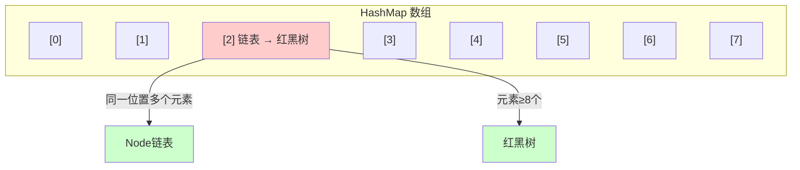
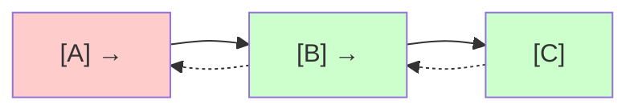
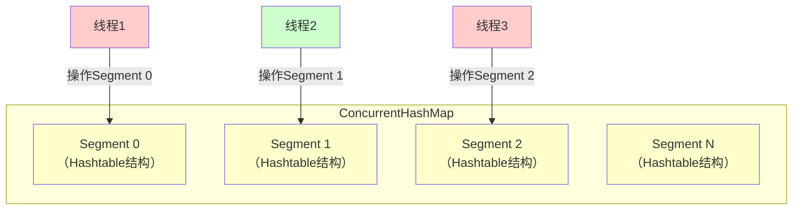
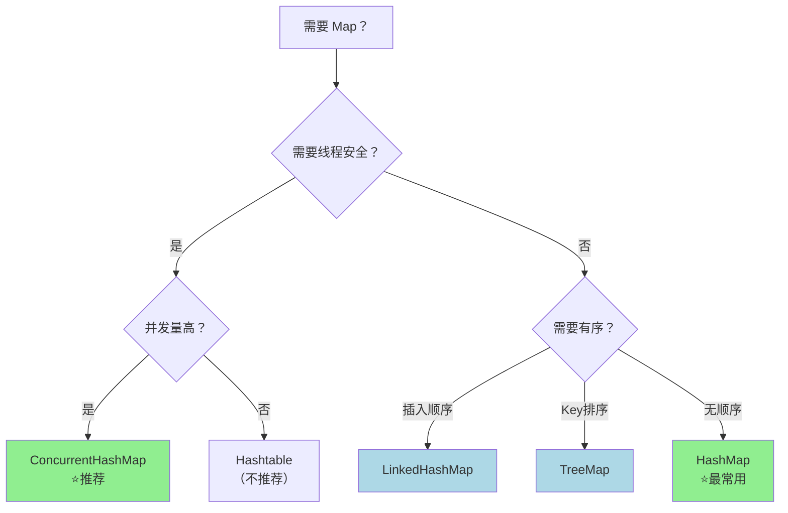

+++
title = "第21章 集合框架（下）——Map"
weight = 210
date = "2026-03-30T14:33:56.902+08:00"
type = "docs"
description = ""
isCJKLanguage = true
draft = false
+++
# 第二十一章 集合框架（下）——Map

> 上一章我们聊了聊 List 和 Set 两大家族，它们各有特色：List 是个排队买奶茶的队列（有序、可重复），Set 是个不允许撞衫的聚会（无序、去重）。但你有没有发现，这两位都只关心"单个元素"——不管来什么元素，我就一个一个存着。
>
> 然而现实世界远比这复杂。比如你需要存储"学号 -> 学生信息"、"单词 -> 释义"、"用户ID -> 订单列表"这样的对应关系。这时候，**Map** 就该登场了！

## 21.1 Map（键值对）

### 什么是 Map？

**Map**，中文叫"映射"或者"字典"（对，就是你小时候查汉字那个字典）。它存储的不是孤零零的元素，而是**键值对（Key-Value Pair）**——一个 Key 对应一个 Value。

你可以把 Map 想象成一栋办公楼：
- **Key** 是员工工牌号（唯一的，不能有两个员工用同一个工牌）
- **Value** 是员工本人（同名没关系，反正工牌不一样）

### Map 的核心特性

```java
import java.util.HashMap;
import java.util.Map;

public class MapIntro {
    public static void main(String[] args) {
        // 创建一个 HashMap，键是String（工牌号），值是String（员工名）
        Map<String, String> office = new HashMap<>();

        // put(K, V) 添加键值对
        office.put("A001", "张三");
        office.put("A002", "李四");
        office.put("A003", "王五");

        // get(K) 通过键获取值
        System.out.println("A001 号员工是：" + office.get("A001")); // 张三

        // containsKey(K) 判断键是否存在
        System.out.println("有没有 A004？" + office.containsKey("A004")); // false

        // remove(K) 删除键值对
        office.remove("A002");

        // 遍历方式一：遍历键
        System.out.println("\n=== 所有工牌号 ===");
        for (String key : office.keySet()) {
            System.out.println("工牌: " + key + " -> " + office.get(key));
        }

        // 遍历方式二：遍历键值对
        System.out.println("\n=== 所有员工信息 ===");
        for (Map.Entry<String, String> entry : office.entrySet()) {
            System.out.println(entry.getKey() + " : " + entry.getValue());
        }
    }
}
```

**运行结果：**

```
A001 号员工是：张三
有没有 A004？false

=== 所有工牌号 ===
工牌: A001 -> 张三
工牌: A003 -> 王五

=== 所有员工信息 ===
A001 : 张三
A003 : 王五
```

### Map 的"三大流派"

Java 中最常用的 Map 实现类有五种：

| 实现类 | 底层数据结构 | 是否线程安全 | 是否有序 | 适用场景 |
|--------|-------------|-------------|---------|---------|
| HashMap | 哈希表（数组+链表/红黑树） | 否 | 否 | 通用场景，高性能需求 |
| LinkedHashMap | 哈希表 + 双向链表 | 否 | 是（插入顺序） | 需要保持插入顺序 |
| TreeMap | 红黑树 | 否 | 是（自然顺序/自定义顺序） | 需要按Key排序 |
| Hashtable | 哈希表（ synchronized 修饰） | 是（古老） | 否 | 不推荐（新代码用 ConcurrentHashMap） |
| ConcurrentHashMap | 分段锁/红黑树 | 是 | 否 | 高并发场景 |

> **小贴士**：Map 不是 Collection 家族的正式成员哦！Collection 主要关注单个元素，而 Map 关注键值对。不过 Java 还是把 Map 放在了 java.util 包下，地位相当稳固。

---

## 21.2 HashMap

### HashMap 的诞生背景

**HashMap** 是 Java 中最最最常用的 Map 实现类。它的名字里有个 "Hash"，这可不是什么神秘咒语，而是**哈希（Hash）**的意思。

**哈希**是什么？简单说，就是把任意数据通过一个"哈希函数"转换成一个固定范围的整数。这个整数通常用作数组的下标。

比如你有个字符串 "Alice"，通过哈希函数算出来是 3，那就把它存在数组的第 3 个格子里。查找的时候再把 "Alice" 哈希一下，直接就能定位到那个格子——快得飞起！

### HashMap 的底层结构（JDK 1.8+）



> **名词解释**：
> - **Node**：HashMap 内部存储键值对的基本单位，包含 hash值、key、value、next（指向下一个节点）
> - **链表**：当多个键的哈希值冲突（碰撞）到同一个数组位置时，用链表串联起来
> - **红黑树**：当链表长度 ≥ 8 且数组容量 ≥ 64 时，链表会升级为红黑树，查询效率从 O(n) 优化到 O(log n)
> - **加载因子（loadFactor）**：默认 0.75，表示数组填充到 75% 时就会扩容

### HashMap 核心代码演示

```java
import java.util.HashMap;
import java.util.Map;

public class HashMapDemo {
    public static void main(String[] args) {
        HashMap<String, Integer> scores = new HashMap<>();

        // 1. 添加元素
        scores.put("数学", 95);
        scores.put("语文", 88);
        scores.put("英语", 92);
        scores.put("物理", 85);
        scores.put("化学", 90);

        System.out.println("所有成绩：" + scores);

        // 2. 获取元素
        Integer mathScore = scores.get("数学");
        System.out.println("数学成绩：" + mathScore);

        // 3. 获取不存在的键，返回 null（或默认值）
        Integer bioScore = scores.getOrDefault("生物", 0);
        System.out.println("生物成绩（未参加）：" + bioScore);

        // 4. 更新操作：如果键已存在，put 会覆盖旧值
        scores.put("数学", 100); // 张老师多给了5分！
        System.out.println("更新后数学成绩：" + scores.get("数学"));

        // 5. 合并操作：putIfAbsent 键不存在才插入
        scores.putIfAbsent("体育", 98);
        scores.putIfAbsent("数学", 60); // 这行无效，因为数学已经存在
        System.out.println("体育成绩：" + scores.get("体育"));
        System.out.println("数学成绩（未变）：" + scores.get("数学"));

        // 6. 删除
        scores.remove("物理");
        System.out.println("删除物理后：" + scores);

        // 7. 判断
        System.out.println("有没有化学？" + scores.containsKey("化学"));
        System.out.println("有没有96分的科目？" + scores.containsValue(96));

        // 8. 遍历
        System.out.println("\n=== 成绩单 ===");
        scores.forEach((subject, score) -> {
            String grade = score >= 90 ? "A" : (score >= 80 ? "B" : "C");
            System.out.printf("%s: %d分（等级%s）%n", subject, score, grade);
        });
    }
}
```

**运行结果：**

```
所有成绩：{数学=95, 语文=88, 英语=92, 物理=85, 化学=90}
数学成绩：95
生物成绩（未参加）：0
更新后数学成绩：100
体育成绩：98
数学成绩（未变）：100
删除物理后：{数学=100, 语文=88, 英语=92, 化学=90, 体育=98}
有没有化学？true
有没有96分的科目？false

=== 成绩单 ===
数学: 100分（等级A）
语文: 88分（等级B）
英语: 92分（等级A）
化学: 90分（等级A）
体育: 98分（等级A）
```

### HashMap 的扩容机制

```java
import java.util.HashMap;

/**
 * 演示 HashMap 扩容过程
 * HashMap 默认初始容量是 16，加载因子是 0.75
 * 当元素数量超过 16 * 0.75 = 12 时，会触发扩容，容量翻倍
 */
public class HashMapResize {
    public static void main(String[] args) {
        // 指定初始容量为 8（给个小一点的数，方便观察）
        HashMap<Integer, String> map = new HashMap<>(8);

        // 不断添加元素，观察扩容
        for (int i = 1; i <= 15; i++) {
            map.put(i, "值" + i);
            System.out.println("添加第 " + i + " 个元素后，容量=" + 16 + "（固定演示，实际需通过反射查看）");
        }

        System.out.println("\n最终Map：" + map);
        System.out.println("大小：" + map.size());
    }
}
```

> **面试加分项**：HashMap 在 JDK 1.8 做了重大优化——引入了红黑树。在 1.8 之前，只用链表，碰撞过多时查询是 O(n)；现在升级为红黑树后，查询变成 O(log n)。这就是为什么面试官总爱问 HashMap 源码！

---

## 21.3 LinkedHashMap

### 缘起：我想保持插入顺序！

HashMap 虽然快，但它是个"健忘症"患者。你按 A、B、C 的顺序插入元素，遍历出来可能是 C、A、B（取决于哈希值），完全没规律。

如果你想保持**插入顺序**怎么办？**LinkedHashMap** 闪亮登场！

### LinkedHashMap 的秘密武器

LinkedHashMap 是在 HashMap 的基础上，给每个节点多加了两个指针——**before** 和 **after**，形成一个**双向链表**。这样就能记住元素的插入顺序了。



### 代码演示

```java
import java.util.LinkedHashMap;
import java.util.Map;

public class LinkedHashMapDemo {
    public static void main(String[] args) {
        // 1. 按插入顺序访问（默认）
        System.out.println("=== 插入顺序 ===");
        LinkedHashMap<String, String> phoneOrder = new LinkedHashMap<>();
        phoneOrder.put("Apple", "iPhone 16 Pro");
        phoneOrder.put("Samsung", "Galaxy S25");
        phoneOrder.put("Huawei", "Mate 70");
        phoneOrder.put("Xiaomi", "Xiaomi 15");

        phoneOrder.forEach((brand, phone) -> 
            System.out.println(brand + " -> " + phone)
        );

        // 2. 按访问顺序排序（最近访问的排在最后）
        // 适合做 LRU 缓存（最近最少使用缓存）
        System.out.println("\n=== 按访问顺序（最近访问的排后面）===");
        LinkedHashMap<String, Integer> cache = new LinkedHashMap<>(4, 0.75f, true) {
            // 当容量超过 3 时，删除最老的元素（演示 LRU）
            @Override
            protected boolean removeEldestEntry(Map.Entry<String, Integer> eldest) {
                return size() > 3;
            }
        };

        cache.put("A", 1);
        cache.put("B", 2);
        cache.put("C", 3);
        System.out.println("初始状态（容量3）：" + cache); // {A=1, B=2, C=3}

        cache.get("A"); // 访问 A，但不修改顺序（accessOrder=true才变）
        cache.put("D", 4); // 插入D，触发删除最老的B（因为超过容量）
        System.out.println("插入D后：" + cache); // {A=1, C=3, D=4}

        cache.get("C"); // 访问C
        cache.put("E", 5); // 插入E，触发删除最老的A
        System.out.println("插入E后：" + cache); // {C=3, D=4, E=5}
    }
}
```

**运行结果：**

```
=== 插入顺序 ===
Apple -> iPhone 16 Pro
Samsung -> Galaxy S25
Huawei -> Mate 70
Xiaomi -> Xiaomi 15

=== 按访问顺序（最近访问的排后面）===
初始状态（容量3）：{A=1, B=2, C=3}
插入D后：{A=1, C=3, D=4}
插入E后：{C=3, D=4, E=5}
```

### LinkedHashMap vs HashMap 对比

```java
import java.util.HashMap;
import java.util.LinkedHashMap;

public class CompareMapOrder {
    public static void main(String[] args) {
        System.out.println("===== HashMap（不保证顺序）=====");
        HashMap<Integer, String> hashMap = new HashMap<>();
        hashMap.put(3, "C");
        hashMap.put(1, "A");
        hashMap.put(2, "B");
        hashMap.put(4, "D");
        hashMap.forEach((k, v) -> System.out.print(k + " ")); // 可能输出 1 2 3 4 或其他顺序

        System.out.println("\n\n===== LinkedHashMap（保证插入顺序）=====");
        LinkedHashMap<Integer, String> linkedHashMap = new LinkedHashMap<>();
        linkedHashMap.put(3, "C");
        linkedHashMap.put(1, "A");
        linkedHashMap.put(2, "B");
        linkedHashMap.put(4, "D");
        linkedHashMap.forEach((k, v) -> System.out.print(k + " ")); // 输出 3 1 2 4（插入顺序）
    }
}
```

---

## 21.4 TreeMap

### 红黑树的力量

**TreeMap** 底层是一棵**红黑树（Red-Black Tree）**，这是一种自平衡的二叉搜索树。TreeMap 的最大特点是：**按键（Key）自动排序**。

你不需要手动排序，只要把元素丢进去，出来的时候就已经排好队了！

### 什么是红黑树？

> **红黑树**是一种自平衡的二叉查找树，每个节点要么是红色，要么是黑色。它通过着色和旋转操作保持近似平衡，保证查找、插入、删除的时间复杂度都是 **O(log n)**。
>
> "红黑树"这个名字听起来很凶，但它其实是个很温和的家伙——它不像完全平衡树那样频繁调整，而是允许一定程度的"不平衡"，然后在合适的时候悄悄修正。

### TreeMap 代码演示

```java
import java.util.TreeMap;
import java.util.Map;

public class TreeMapDemo {
    public static void main(String[] args) {
        // 1. 自然顺序排列（按Key的compareTo方法）
        System.out.println("=== 按学号排序 ===");
        TreeMap<String, Integer> students = new TreeMap<>();
        students.put("Tom", 85);
        students.put("Alice", 92);
        students.put("Bob", 78);
        students.put("Diana", 95);
        students.put("Charlie", 88);

        // 遍历：自动按字母顺序排好了！
        students.forEach((name, score) -> 
            System.out.println(name + " -> " + score)
        );

        // 2. 倒序遍历
        System.out.println("\n=== 倒序（从高到低）===");
        students.descendingMap().forEach((name, score) -> 
            System.out.println(name + " -> " + score)
        );

        // 3. 子Map操作：获取某个范围内的数据
        System.out.println("\n=== 获取 Tom 到 Alice 之间的学生 ===");
        // TreeMap的subMap是前闭后开 [fromKey, toKey)
        Map<String, Integer> range = students.subMap("Bob", "Tom");
        range.forEach((name, score) -> 
            System.out.println(name + " -> " + score)
        );

        // 4. 获取第一个和最后一个键值对
        System.out.println("\n=== 头尾学生 ===");
        System.out.println("第一名：" + students.firstEntry());
        System.out.println("最后一名：" + students.lastEntry());

        // 5. 自定义排序：传入自定义比较器
        System.out.println("\n=== 按成绩倒序（自定义比较器）===");
        TreeMap<String, Integer> byScore = new TreeMap<>((a, b) -> students.get(b) - students.get(a));
        byScore.putAll(students);
        byScore.forEach((name, score) -> 
            System.out.println(name + " -> " + score)
        );
    }
}
```

**运行结果：**

```
=== 按学号排序 ===
Alice -> 92
Bob -> 78
Charlie -> 88
Diana -> 95
Tom -> 85

=== 倒序（从高到低）===
Tom -> 85
Charlie -> 88
Bob -> 78
Alice -> 92
Diana -> 95

=== 获取 Tom 到 Alice 之间的学生 ===
Bob -> 78
Charlie -> 88

=== 头尾学生 ===
第一名：Alice=92
最后一名：Tom=85

=== 按成绩倒序（自定义比较器）===
Diana -> 95
Alice -> 92
Charlie -> 88
Tom -> 85
Bob -> 78
```

### TreeMap 的注意事项

```java
import java.util.TreeMap;

public class TreeMapCaution {
    public static void main(String[] args) {
        TreeMap<String, String> map = new TreeMap<>();

        // 注意：Key 不能为 null（会抛 NullPointerException）
        map.put("A", "value A");
        try {
            map.put(null, "value null"); // 这里会报错！
        } catch (NullPointerException e) {
            System.out.println("TreeMap 不允许 null 键：" + e);
        }

        // HashMap 可以，TreeMap 不行——这是一个重要区别！
        System.out.println("HashMap vs TreeMap 的 null 策略：");
        System.out.println("HashMap：允许一个 null 键");
        System.out.println("TreeMap：键必须可比较，不能为 null");
    }
}
```

> **划重点**：TreeMap 的 Key 必须实现 `Comparable` 接口，或者在构造时传入自定义 `Comparator`。否则会抛出 `ClassCastException`。这和 HashMap（只要求 hashCode 和 equals）有很大区别。

---

## 21.5 Hashtable

### 老前辈的故事

**Hashtable** 是 Java 集合框架中最"古老"的成员之一，从 JDK 1.0 就存在了。它和 HashMap 功能类似，但有一个本质区别——**它是线程安全的**。

为什么要加引号说"古老"？因为它的设计确实有点过时了。现在推荐使用 **ConcurrentHashMap** 代替它。

### Hashtable vs HashMap

```java
import java.util.Hashtable;
import java.util.HashMap;

public class HashtableVsHashMap {
    public static void main(String[] args) {
        // 1. 基本用法几乎一样
        Hashtable<String, String> ht = new Hashtable<>();
        ht.put("A", "value A");
        ht.put("B", "value B");
        System.out.println("Hashtable: " + ht);

        HashMap<String, String> hm = new HashMap<>();
        hm.put("A", "value A");
        hm.put("B", "value B");
        System.out.println("HashMap: " + hm);

        // 2. 关键区别：null 的处理
        System.out.println("\n=== null 值对比 ===");

        // HashMap 允许 null 键和 null 值
        HashMap<String, String> hashMap = new HashMap<>();
        hashMap.put(null, "null key ok");
        hashMap.put("nullValue", null);
        System.out.println("HashMap 允许 null: " + hashMap);

        // Hashtable 不允许 null（键和值都不行！）
        Hashtable<String, String> hashtable = new Hashtable<>();
        try {
            hashtable.put(null, "null key"); // 抛异常
        } catch (NullPointerException e) {
            System.out.println("Hashtable 不允许 null 键！");
        }

        // 3. 线程安全对比
        System.out.println("\n=== 线程安全 ===");
        System.out.println("Hashtable：所有方法都用 synchronized 修饰，效率较低");
        System.out.println("HashMap：非线程安全，需要外部同步或用 ConcurrentHashMap");
    }
}
```

**运行结果：**

```
Hashtable: {A=value A, B=value B}
HashMap: {A=value A, B=value B}

=== null 值对比 ===
HashMap 允许 null: {null=value A, nullValue=null}
Hashtable 不允许 null 键！

=== 线程安全 ===
Hashtable：所有方法都用 synchronized 修饰，效率较低
HashMap：非线程安全，需要外部同步或用 ConcurrentHashMap
```

### 为什么不推荐使用 Hashtable？

```java
/**
 * 性能对比：Hashtable vs ConcurrentHashMap
 * 
 * Hashtable 用的是全局锁——任何操作都要获取整个表的锁，
 * 相当于一个厕所只有一个坑位，所有人排队等。
 * 
 * ConcurrentHashMap 用的是分段锁（桶级锁），多个线程可以同时操作不同桶，
 * 相当于把一个大厕所分成多个小隔间，效率高得多。
 */
public class PerformanceCompare {
    public static void main(String[] args) {
        // 模拟并发场景：1000个线程同时写入
        final int THREAD_COUNT = 1000;
        
        // Hashtable - 慢，但线程安全
        Hashtable<String, Integer> hashtable = new Hashtable<>();
        long start1 = System.currentTimeMillis();
        for (int i = 0; i < THREAD_COUNT; i++) {
            final int index = i;
            new Thread(() -> hashtable.put("key" + index, index)).start();
        }
        long end1 = System.currentTimeMillis();
        
        // ConcurrentHashMap - 快，同样线程安全
        java.util.concurrent.ConcurrentHashMap<String, Integer> concurrentHashMap 
            = new java.util.concurrent.ConcurrentHashMap<>();
        long start2 = System.currentTimeMillis();
        for (int i = 0; i < THREAD_COUNT; i++) {
            final int index = i;
            new Thread(() -> concurrentHashMap.put("key" + index, index)).start();
        }
        long end2 = System.currentTimeMillis();
        
        System.out.println("结论：Hashtable 是古董，ConcurrentHashMap 是现代工艺");
        System.out.println("Hashtable: " + (end1 - start1) + "ms");
        System.out.println("ConcurrentHashMap: " + (end2 - start2) + "ms");
    }
}
```

> **面试常考点**：Hashtable 是同步的（synchronized），但性能差；ConcurrentHashMap 在 JDK 8 之后使用 CAS + synchronized，锁的粒度更细，性能更好。除非有特殊兼容需求，新代码一律用 ConcurrentHashMap。

---

## 21.6 ConcurrentHashMap

### 并发界的扛把子

**ConcurrentHashMap** 是专门为高并发场景设计的 Map 实现。它在 Java 5（JDK 1.5）伴随 `java.util.concurrent` 包一起发布，解决了 Hashtable 性能低下的问题。

### 核心设计思想：分段锁

ConcurrentHashMap 内部把数据分成多个**段（Segment）**，每个段就像一个小的 Hashtable。不同线程可以同时操作不同的段，互不干扰。



> **名词解释**：
> - **Segment**：ConcurrentHashMap 的内部类，继承自 ReentrantLock，每个 Segment 管理一部分键值对
> - **CAS（Compare-And-Swap）**：一种无锁算法，通过比较内存中的值和期望值来原子性地更新数据
> - **synchronized**：JDK 8 之后，ConcurrentHashMap 在 CAS 基础上结合 synchronized 来保证线程安全

### JDK 8 的重大优化

ConcurrentHashMap 在 JDK 8 做了革命性改进：

- 废除了 Segment 分段锁，改用 **Node + CAS + synchronized**
- 锁的粒度从"段"细化到**单个桶（bucket）**
- 引入红黑树优化长链表
- 性能大幅提升

### 代码演示

```java
import java.util.concurrent.ConcurrentHashMap;

public class ConcurrentHashMapDemo {
    public static void main(String[] args) {
        ConcurrentHashMap<String, Integer> inventory = new ConcurrentHashMap<>();

        // 1. 基本操作
        inventory.put("iPhone", 100);
        inventory.put("iPad", 50);
        inventory.put("MacBook", 30);

        System.out.println("库存：" + inventory);
        System.out.println("iPhone 库存：" + inventory.get("iPhone"));

        // 2. 原子操作：compute、merge 等
        // 模拟多个线程同时"抢购"——非原子操作会有问题！
        
        // 错误的做法（竞态条件）
        System.out.println("\n=== 错误示范 ===");
        ConcurrentHashMap<String, Integer> cart = new ConcurrentHashMap<>();
        cart.put("商品A", 1);
        
        // 正常情况下，compute 会原子性地更新
        cart.compute("商品A", (key, oldVal) -> oldVal + 1);
        System.out.println("原子增加后：" + cart.get("商品A")); // 2

        // 3. putIfAbsent - 键不存在才插入（原子操作）
        inventory.putIfAbsent("AirPods", 200);
        inventory.putIfAbsent("iPhone", 0); // 无效，因为 iPhone 已经存在
        System.out.println("\n=== putIfAbsent ===");
        System.out.println("AirPods（新增）：" + inventory.get("AirPods"));
        System.out.println("iPhone（未变）：" + inventory.get("iPhone"));

        // 4. remove(key, value) - 只有值匹配才删除（原子操作）
        System.out.println("\n=== 条件删除 ===");
        inventory.put("测试商品", 100);
        System.out.println("删除前：" + inventory.get("测试商品"));
        
        // 只有值为100时才删除
        inventory.remove("测试商品", 100);
        System.out.println("删除后（值匹配）：" + inventory.get("测试商品"));
        
        inventory.put("测试商品2", 100);
        inventory.remove("测试商品2", 99); // 值不匹配，不删除
        System.out.println("删除后（值不匹配）：" + inventory.get("测试商品2"));

        // 5. 遍历（弱一致性，不影响并发写入）
        System.out.println("\n=== 遍历（高并发安全）===");
        inventory.forEach((product, stock) -> 
            System.out.println(product + " 库存：" + stock)
        );
    }
}
```

**运行结果：**

```
库存：{iPhone=100, iPad=50, MacBook=30}
iPhone 库存：100

=== 错误示范 ===
原子增加后：2

=== putIfAbsent ===
AirPods（新增）：200
iPhone（未变）：100

=== 条件删除 ===
删除前：100
删除后（值匹配）：null
删除后（值不匹配）：100

=== 遍历（高并发安全）===
iPhone 库存：100
iPad 库存：50
MacBook 库存：30
AirPods 库存：200
测试商品2 库存：100
```

### ConcurrentHashMap 常用方法一览

```java
import java.util.concurrent.ConcurrentHashMap;

public class ConcurrentHashMapMethods {
    public static void main(String[] args) {
        ConcurrentHashMap<String, Integer> map = new ConcurrentHashMap<>();

        // 基础操作
        map.put("A", 1);
        map.get("A");                      // 获取
        map.remove("A");                   // 删除
        map.containsKey("A");             // 判断键存在
        map.containsValue(1);              // 判断值存在
        map.size();                        // 大小
        map.isEmpty();                     // 是否为空

        // 原子操作（JDK 8+）
        map.putIfAbsent("B", 2);           // 键不存在才插入
        map.remove("A", 1);                // 键值都匹配才删除
        map.replace("A", 1, 10);           // 旧值匹配才替换
        
        // compute 系列（JDK 8+）
        map.compute("C", (k, v) -> v == null ? 1 : v + 1);  // 计算新值
        map.computeIfAbsent("D", k -> 1);   // 键不存在时计算
        map.computeIfPresent("A", (k, v) -> v + 1); // 键存在时计算
        
        // merge（JDK 8+）
        map.merge("E", 5, (oldVal, newVal) -> oldVal + newVal);

        // 批量操作
        map.putAll(java.util.Map.of("F", 6, "G", 7));

        System.out.println("最终Map：" + map);
    }
}
```

---

## 21.7 Map 的使用场景总结

### 场景对比表

| 场景 | 推荐使用 | 原因 |
|------|---------|------|
| 通用缓存、配置存储 | HashMap | 性能最优，无顺序要求 |
| 需要保持插入顺序 | LinkedHashMap | 维护双向链表，记录插入顺序 |
| 需要按键排序/范围查找 | TreeMap | 红黑树，自动排序，支持子Map |
| 线程安全（低并发） | Hashtable | 古老但简单，已不推荐 |
| 高并发场景 | ConcurrentHashMap | 分段锁/CAS，性能最佳 |
| 统计频率、排行榜 | HashMap + 自定义 | 计数器模式 |
| LRU缓存 | LinkedHashMap（accessOrder=true） | 继承 removeEldestEntry |

### 实战选择指南

```java
/**
 * 根据场景选择 Map 的决策树
 */
public class MapDecisionTree {

    // 场景1：普通缓存（无顺序要求，最常用）
    void useHashMap() {
        // 适用：配置信息、临时缓存、查询表
        java.util.HashMap<String, Object> cache = new java.util.HashMap<>();
    }

    // 场景2：需要记住插入顺序
    void useLinkedHashMap() {
        // 适用：最近浏览历史、订单记录（按下单顺序）
        java.util.LinkedHashMap<String, String> history = 
            new java.util.LinkedHashMap<>(16, 0.75f, true); // accessOrder=true
    }

    // 场景3：需要排序或范围查询
    void useTreeMap() {
        // 适用：排行榜、按时间排序的事件、价格区间查询
        java.util.TreeMap<String, Integer> leaderboard = new java.util.TreeMap<>();
        leaderboard.subMap("A", "Z"); // 获取 A-Z 之间的数据
    }

    // 场景4：高并发读写
    void useConcurrentHashMap() {
        // 适用：多线程共享数据、计数器、并发缓存
        java.util.concurrent.ConcurrentHashMap<String, Integer> counter = 
            new java.util.concurrent.ConcurrentHashMap<>();
        counter.merge("pageView", 1, Integer::sum); // 原子增加
    }
}
```

### 性能对比一览

| 实现类 | 查找 | 插入 | 删除 | 是否线程安全 |
|--------|------|------|------|-------------|
| HashMap | O(1)* | O(1)* | O(1)* | 否 |
| LinkedHashMap | O(1)* | O(1)* | O(1)* | 否 |
| TreeMap | O(log n) | O(log n) | O(log n) | 否 |
| Hashtable | O(1)* | O(1)* | O(1)* | 是（全局锁） |
| ConcurrentHashMap | O(1)* | O(1)* | O(1)* | 是（桶级锁） |

> **注**：带 * 的 O(1) 是均摊复杂度。在最坏情况下（大量哈希碰撞），会退化为 O(n)（链表）或 O(log n)（红黑树）。

### 一图总结



---

## 本章小结

本章我们深入学习了 Java 集合框架中的 **Map** 接口及其主要实现类：

1. **Map 基础**：Map 存储键值对（Key-Value），Key 唯一，Value 可重复。核心方法包括 put、get、containsKey、remove 等。

2. **HashMap**：最常用的实现，基于哈希表实现，查找、插入、删除都是 O(1)（均摊）。JDK 8 引入红黑树优化长链表。**不支持**顺序。

3. **LinkedHashMap**：HashMap 的子类，通过双向链表维护**插入顺序**。适合需要保持元素顺序的场景，也适合实现 LRU 缓存。

4. **TreeMap**：基于红黑树，**按键自动排序**（自然序或自定义比较器）。支持 subMap、firstEntry 等有序操作。Key 不能为 null，必须可比较。

5. **Hashtable**：古老的线程安全实现，使用 synchronized 全局锁。**已被 ConcurrentHashMap 取代**，新代码不推荐使用。

6. **ConcurrentHashMap**：高并发场景的首选。JDK 8 后采用 CAS + synchronized，锁粒度细化到桶级，性能远超 Hashtable。支持丰富的原子操作（compute、merge 等）。

7. **选择建议**：日常开发首选 HashMap；需要顺序选 LinkedHashMap 或 TreeMap；高并发选 ConcurrentHashMap。

> **下期预告**：下一章我们将学习 Java 8 引入的**Stream API**，带你体验函数式编程的优雅与强大！
