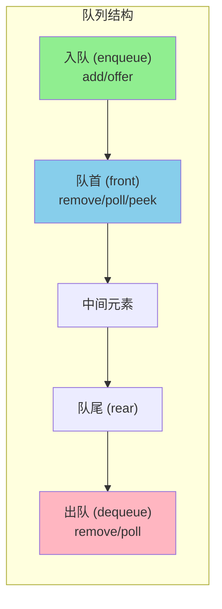
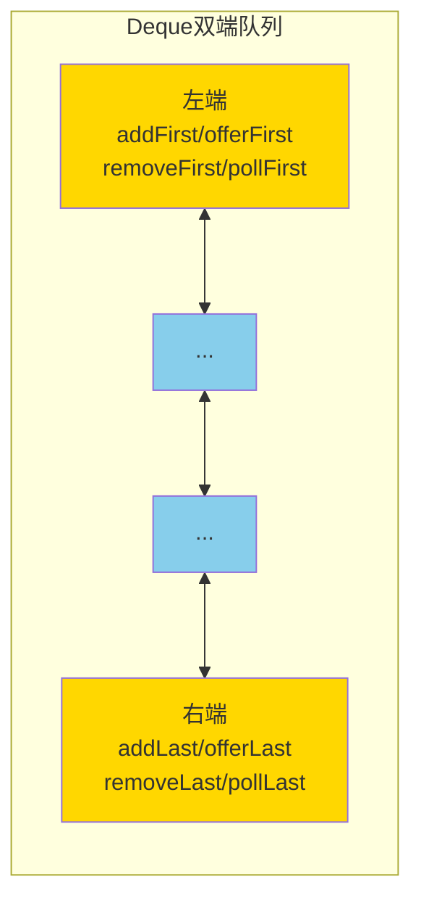

+++
title = "第22章 Queue 与 Deque"
weight = 220
date = "2026-03-30T14:33:56.904+08:00"
type = "docs"
description = ""
isCJKLanguage = true
draft = false
+++
# 第二十二章 Queue 与 Deque

> "人生就像一个队列，先排队的人先办事。后来的人？别急，等前面的人办完再说。"

Queue（队列）和 Deque（双端队列）是 Java 中极其重要的数据结构，它们遵循**先进先出（First In First Out, FIFO）**的原则。想象一下排队买奶茶——先来的人先拿到奶茶，后来的人乖乖排在后面。这个"奶茶店排队"的场景，就是队列最形象的比喻。

在 Java 集合框架中，Queue 和 Deque 都是继承自 `Collection` 接口的子接口，它们各自拥有丰富的实现类。本章我们将逐一揭开它们的神秘面纱。

---

## 22.1 Queue（队列）：先进先出（FIFO）

### 22.1.1 Queue 接口概述

`Queue` 是 Java 集合框架中用于表示队列的接口，继承自 `Collection` 接口。队列是一种**受限的线性数据结构**，它只允许在队尾（rear）添加元素，在队首（front）删除元素。这种限制造就了"FIFO"的特性——最早进入的元素最先离开。

```java
// Queue 接口的核心方法声明
public interface Queue<E> extends Collection<E> {
    // 添加元素到队尾，如果队列满则抛出 IllegalStateException（在有容量限制的队列中）
    boolean add(E e);

    // 添加元素到队尾，成功返回 true，失败返回 false（不会抛异常）
    boolean offer(E e);

    // 移除并返回队首元素，队列为空则抛出 NoSuchElementException
    E remove();

    // 移除并返回队首元素，队列为空返回 null
    E poll();

    // 返回但不移除队首元素，队列为空则抛出 NoSuchElementException
    E element();

    // 返回但不移除队首元素，队列为空返回 null
    E peek();
}
```

### 22.1.2 两套方法的区别

Queue 接口定义了两套方法，它们在**队列为空时的行为**不同：

| 方法 | 队列为空时的行为 |
|------|-----------------|
| `add()` / `remove()` / `element()` | 队列为空时**抛异常** |
| `offer()` / `poll()` / `peek()` | 队列为空时**返回特殊值**（null 或 false） |

> **小贴士**：在有容量限制的队列中（如后面要讲的 `ArrayBlockingQueue`），`offer()` 比 `add()` 更安全，因为它不会因为队列满而抛异常。

### 22.1.3 队列的示意图



### 22.1.4 LinkedList：最常用的 Queue 实现

`LinkedList` 不仅是 List 的实现类，它还实现了 `Queue` 接口，因此可以用作队列使用。

```java
import java.util.LinkedList;
import java.util.Queue;

public class QueueDemo {
    public static void main(String[] args) {
        // 创建一个队列（使用 LinkedList 实现）
        Queue<String> queue = new LinkedList<>();

        // 入队操作：添加元素到队尾
        queue.offer("张三");
        queue.offer("李四");
        queue.offer("王五");
        System.out.println("当前队列：" + queue);

        // 查看队首元素（但不移除）
        String front = queue.peek();
        System.out.println("队首元素是：" + front);
        System.out.println("查看后队列：" + queue);

        // 出队操作：移除并返回队首元素
        String first = queue.poll();
        System.out.println("出队的元素是：" + first);
        System.out.println("出队后队列：" + queue);

        // 继续出队
        System.out.println("再次出队：" + queue.poll());
        System.out.println("再次出队：" + queue.poll());

        // 队列为空时 poll 返回 null
        System.out.println("队列为空，poll 返回：" + queue.poll());
    }
}
```

运行结果：

```
当前队列：[张三, 李四, 王五]
队首元素是：张三
查看后队列：[张三, 李四, 王五]
出队的元素是：张三
出队后队列：[李四, 王五]
再次出队：李四
再次出队：王五
队列为空，poll 返回：null
```

### 22.1.5 模拟银行排队叫号

让我们用一个更有趣的例子来理解队列——模拟银行排队叫号系统：

```java
import java.util.LinkedList;
import java.util.Queue;

public class BankQueueSimulation {
    public static void main(String[] args) {
        // 模拟银行排队队列
        Queue<Integer> ticketQueue = new LinkedList<>();
        int ticketNumber = 1000;  // 起始号码

        // 顾客排队取号
        System.out.println("=== 银行叫号系统模拟 ===");
        ticketQueue.offer(ticketNumber++);
        ticketQueue.offer(ticketNumber++);
        ticketQueue.offer(ticketNumber++);
        System.out.println("3位顾客取了号，当前队列：" + ticketQueue);

        // 又来了2位顾客
        ticketQueue.offer(ticketNumber++);
        ticketQueue.offer(ticketNumber++);
        System.out.println("又来2位顾客，当前队列：" + ticketQueue);

        // 柜员叫号（队首顾客办理）
        while (!ticketQueue.isEmpty()) {
            Integer currentTicket = ticketQueue.poll();
            System.out.println("叫到号码 " + currentTicket + "，请到窗口办理！");
            System.out.println("剩余等待人数：" + ticketQueue.size());
        }
    }
}
```

运行结果：

```
=== 银行叫号系统模拟 ===
3位顾客取了号，当前队列：[1000, 1001, 1002]
又来2位顾客，当前队列：[1000, 1001, 1002, 1003, 1004]
叫到号码 1000，请到窗口办理！
剩余等待人数：4
叫到号码 1001，请到窗口办理！
剩余等待人数：3
叫到号码 1002，请到窗口办理！
剩余等待人数：2
叫到号码 1003，请到窗口办理！
剩余等待人数：1
叫到号码 1004，请到窗口办理！
剩余等待人数：0
```

---

## 22.2 Deque（双端队列）：两端都能插入和删除

### 22.2.1 Deque 接口概述

`Deque`（全称 **Double Ended Queue**，即"双端队列"）是 Queue 的子接口，它最大的特点是**两端都可以进行插入和删除操作**。你可以把 Deque 想象成一个"双向隧道"，元素可以从任意一端进入，也可以从任意一端离开。

```java
// Deque 接口的核心方法
public interface Deque<E> extends Queue<E> {
    // ======== 队首操作 ========
    void addFirst(E e);     // 队首添加，失败抛异常
    boolean offerFirst(E e); // 队首添加，失败返回 false

    E getFirst();           // 获取队首，失败抛异常
    E peekFirst();          // 获取队首，失败返回 null

    E removeFirst();        // 移除队首，失败抛异常
    E pollFirst();          // 移除队首，失败返回 null

    // ======== 队尾操作 ========
    void addLast(E e);      // 队尾添加，失败抛异常
    boolean offerLast(E e); // 队尾添加，失败返回 false

    E getLast();            // 获取队尾，失败抛异常
    E peekLast();           // 获取队尾，失败返回 null

    E removeLast();         // 移除队尾，失败抛异常
    E pollLast();           // 移除队尾，失败返回 null

    // ======== Queue 继承来的方法（队尾进，队首出） ========
    boolean add(E e);       // 等价于 addLast
    boolean offer(E e);     // 等价于 offerLast
    E remove();             // 等价于 removeFirst
    E poll();               // 等价于 pollFirst
    E element();            // 等价于 getFirst
    E peek();               // 等价于 peekFirst
}
```

### 22.2.2 双端队列示意图



### 22.2.3 ArrayDeque：Deque 的高效实现

`ArrayDeque` 是 Deque 接口的一个实现类，它基于**可动态扩容的数组**实现。与 `LinkedList` 相比，`ArrayDeque` 在作为栈或队列使用时通常具有更好的性能，因为它不需要额外的节点对象开销。

```java
import java.util.ArrayDeque;
import java.util.Deque;

public class DequeDemo {
    public static void main(String[] args) {
        // 创建一个 ArrayDeque
        Deque<String> deque = new ArrayDeque<>();

        // 从队尾添加元素（常规队列操作）
        deque.offerLast("A");
        deque.offerLast("B");
        deque.offerLast("C");
        System.out.println("队尾添加后：" + deque);

        // 从队首添加元素（Deque 特有操作）
        deque.offerFirst("X");
        System.out.println("队首添加后：" + deque);

        // 查看两端元素
        System.out.println("队首：" + deque.peekFirst());
        System.out.println("队尾：" + deque.peekLast());

        // 两端都可以移除
        System.out.println("从队首移除：" + deque.pollFirst());
        System.out.println("从队尾移除：" + deque.pollLast());
        System.out.println("操作后：" + deque);
    }
}
```

运行结果：

```
队尾添加后：[A, B, C]
队首添加后：[X, A, B, C]
队首：X
队尾：C
从队首移除：X
从队尾移除：C
操作后：[A, B]
```

### 22.2.4 用 Deque 模拟栈（Stack）

**栈（Stack）**是一种"后进先出"（Last In First Out, LIFO）的数据结构。Deque 的 `addFirst()` / `pollFirst()` 操作完美符合栈的"压栈"和"弹栈"语义。Java 官方推荐使用 `ArrayDeque` 而非老旧的 `Stack` 类作为栈使用。

```java
import java.util.ArrayDeque;
import java.util.Deque;

public class StackDemo {
    public static void main(String[] args) {
        // 用 ArrayDeque 模拟栈
        Deque<Integer> stack = new ArrayDeque<>();

        // 压栈（push）
        stack.push(10);
        stack.push(20);
        stack.push(30);
        System.out.println("压栈后：" + stack);

        // 查看栈顶（但不弹出）
        System.out.println("栈顶元素：" + stack.peek());

        // 弹栈（pop）
        System.out.println("弹出：" + stack.pop());
        System.out.println("弹出：" + stack.pop());
        System.out.println("剩余：" + stack);

        // 栈空时 pop 会抛异常
        // stack.pop(); // NoSuchElementException
    }
}
```

运行结果：

```
压栈后：[30, 20, 10]
栈顶元素：30
弹出：30
弹出：20
剩余：[10]
```

### 22.2.5 Deque 的三大应用场景

| 应用场景 | 说明 | 示例 |
|---------|------|------|
| **普通队列（Queue）** | 队尾进，队首出 | 银行叫号 |
| **栈（Stack）** | 队首进，队首出（后进先出） | 撤销操作、括号匹配 |
| **双端队列（Deque）** | 两端都能进出 | 滑动窗口问题 |

```java
import java.util.ArrayDeque;
import java.util.Deque;

public class DequeApplications {
    public static void main(String[] args) {
        // ====== 场景1：普通队列 ======
        System.out.println("=== 普通队列模式 ===");
        Deque<Integer> queue = new ArrayDeque<>();
        queue.offerLast(1);  // 入队
        queue.offerLast(2);
        queue.offerLast(3);
        while (!queue.isEmpty()) {
            System.out.print(queue.pollFirst() + " ");  // 出队
        }
        System.out.println();  // 输出: 1 2 3

        // ====== 场景2：栈 ======
        System.out.println("=== 栈模式 ===");
        Deque<String> stack = new ArrayDeque<>();
        stack.push("A");  // 压栈
        stack.push("B");
        stack.push("C");
        while (!stack.isEmpty()) {
            System.out.print(stack.pop() + " ");  // 弹栈
        }
        System.out.println();  // 输出: C B A

        // ====== 场景3：双端队列 ======
        System.out.println("=== 双端队列模式 ===");
        Deque<Character> deque = new ArrayDeque<>();
        deque.offerFirst('X');   // 左端入
        deque.offerLast('Y');    // 右端入
        deque.offerFirst('Z');   // 左端入
        System.out.println("deque = " + deque);  // [Z, X, Y]
        System.out.println("左端出：" + deque.pollFirst());  // Z
        System.out.println("右端出：" + deque.pollLast());   // Y
        System.out.println("剩余 = " + deque);  // [X]
    }
}
```

---

## 22.3 PriorityQueue

### 22.3.1 什么是 PriorityQueue？

`PriorityQueue`（优先队列）是一种**特殊的队列**，它不遵循 FIFO 的原则，而是根据元素的**优先级**来决定出队顺序。换句话说，优先级最高的元素会最先被移除。

> **核心点**：PriorityQueue 底层使用**堆（Heap）**数据结构实现。默认情况下，它是一个**小顶堆（Min Heap）**——即最小的元素具有最高优先级，最先出队。

### 22.3.2 PriorityQueue 构造函数

```java
import java.util.PriorityQueue;
import java.util.Queue;

public class PriorityQueueDemo {
    public static void main(String[] args) {
        // 创建一个默认的 PriorityQueue（自然顺序，小顶堆）
        Queue<Integer> pq = new PriorityQueue<>();

        // 添加元素
        pq.offer(30);
        pq.offer(10);
        pq.offer(50);
        pq.offer(20);
        pq.offer(40);

        System.out.println("入队顺序：30, 10, 50, 20, 40");
        System.out.println("内部结构（非完全有序）：" + pq);

        // 出队顺序：按优先级（从小到大）
        System.out.print("出队顺序：");
        while (!pq.isEmpty()) {
            System.out.print(pq.poll() + " ");
        }
    }
}
```

运行结果：

```
入队顺序：30, 10, 50, 20, 40
内部结构（非完全有序）：[10, 20, 50, 30, 40]
出队顺序：10 20 30 40 50
```

可以看到，元素的出队顺序是 **10, 20, 30, 40, 50**，即按自然顺序从小到大排列。

### 22.3.3 优先级的自定义

PriorityQueue 支持两种方式自定义优先级：

#### 方式1：使用自然顺序（元素必须实现 Comparable）

```java
import java.util.PriorityQueue;
import java.util.Queue;

// 学生类（按年龄从小到大排序）
class Student implements Comparable<Student> {
    private String name;
    private int age;

    public Student(String name, int age) {
        this.name = name;
        this.age = age;
    }

    @Override
    public int compareTo(Student other) {
        // 年龄小的优先级高
        return this.age - other.age;
    }

    @Override
    public String toString() {
        return name + "(" + age + "岁)";
    }
}

public class PriorityQueueComparableDemo {
    public static void main(String[] args) {
        Queue<Student> pq = new PriorityQueue<>();

        pq.offer(new Student("张三", 22));
        pq.offer(new Student("李四", 18));
        pq.offer(new Student("王五", 25));
        pq.offer(new Student("赵六", 20));

        System.out.println("按年龄优先级出队：");
        while (!pq.isEmpty()) {
            System.out.println("办理业务：" + pq.poll());
        }
    }
}
```

运行结果：

```
按年龄优先级出队：
办理业务：李四(18岁)
办理业务：赵六(20岁)
办理业务：张三(22岁)
办理业务：王五(25岁)
```

#### 方式2：使用 Comparator（更灵活）

```java
import java.util.PriorityQueue;
import java.util.Queue;
import java.util.Comparator;

class Task {
    String name;
    int priority;  // 优先级，数字越大优先级越高

    public Task(String name, int priority) {
        this.name = name;
        this.priority = priority;
    }

    @Override
    public String toString() {
        return "Task{name='" + name + "', priority=" + priority + "}";
    }
}

public class PriorityQueueComparatorDemo {
    public static void main(String[] args) {
        // 使用 Comparator.reverseOrder() 实现大顶堆（优先级高的先出）
        Queue<Task> pq = new PriorityQueue<>(Comparator.comparingInt(t -> t.priority).reversed());

        pq.offer(new Task("紧急修复", 10));
        pq.offer(new Task("日常巡检", 1));
        pq.offer(new Task("版本发布", 5));
        pq.offer(new Task("紧急上线", 10));

        System.out.println("按优先级从高到低处理：");
        while (!pq.isEmpty()) {
            System.out.println("处理任务：" + pq.poll());
        }
    }
}
```

运行结果：

```
按优先级从高到低处理：
处理任务：Task{name='紧急修复', priority=10}
处理任务：Task{name='紧急上线', priority=10}
处理任务：Task{name='版本发布', priority=5}
处理任务：Task{name='日常巡检', priority=1}
```

### 22.3.4 PriorityQueue 注意事项

> **注意**：PriorityQueue 是**线程不安全**的。如果需要在多线程环境中使用，可以考虑 `PriorityBlockingQueue`。

```java
import java.util.PriorityQueue;
import java.util.Arrays;

public class PriorityQueueTips {
    public static void main(String[] args) {
        // 1. 不能放入 null 元素
        // pq.offer(null); // NullPointerException

        // 2. 非自然排序时，必须提供 Comparator
        Queue<String> pq = new PriorityQueue<>(Comparator.comparingInt(String::length));
        pq.offer("hello");
        pq.offer("hi");
        pq.offer("world");
        System.out.println("按字符串长度优先级：" + pq.poll() + " " + pq.poll() + " " + pq.poll());
        // 输出: hi hello world (hi最短，最先出队)

        // 3. 查看堆顶用 peek()
        PriorityQueue<Integer> numPQ = new PriorityQueue<>();
        numPQ.offer(5);
        numPQ.offer(2);
        numPQ.offer(8);
        System.out.println("堆顶元素：" + numPQ.peek());  // 2
    }
}
```

---

## 22.4 阻塞队列（BlockingQueue）

### 22.4.1 什么是 BlockingQueue？

`BlockingQueue`（阻塞队列）是 Queue 的子接口，它在普通队列的基础上增加了**阻塞（Blocking）**特性。当队列为空时，获取（take）操作会**阻塞**直到队列有元素；当队列满时，添加（put）操作会**阻塞**直到队列有空位。

BlockingQueue 是 Java 并发编程（`java.util.concurrent` 包）的核心组件之一，主要用于**生产者-消费者模式**。

### 22.4.2 BlockingQueue 的核心方法

| 方法 | 队列为空 | 队列为满 |
|------|---------|---------|
| `put(e)` | **阻塞等待**直到插入成功 | **阻塞等待**直到插入成功 |
| `offer(e, timeout)` | 等待超时则返回 false | 等待超时则返回 false |
| `take()` | **阻塞等待**直到取出元素 | **阻塞等待**直到取出元素 |
| `poll(timeout)` | 等待超时则返回 null | 等待超时则返回 null |

### 22.4.3 常见的 BlockingQueue 实现类

| 实现类 | 底层结构 | 特点 |
|-------|---------|------|
| `ArrayBlockingQueue` | 有界数组 | 必须指定容量，公平/非公平可选 |
| `LinkedBlockingQueue` | 链表 | 可选容量（默认 Integer.MAX_VALUE） |
| `PriorityBlockingQueue` | 堆 | 无界但可指定容量，支持优先级 |
| `DelayQueue` | 堆 | 元素必须实现 Delayed 接口 |
| `SynchronousQueue` | 无存储 | ，生产者必须等消费者直接取走 |

### 22.4.4 ArrayBlockingQueue 示例

```java
import java.util.concurrent.ArrayBlockingQueue;
import java.util.concurrent.BlockingQueue;

public class ArrayBlockingQueueDemo {
    public static void main(String[] args) {
        // 创建一个容量为 3 的阻塞队列
        BlockingQueue<Integer> queue = new ArrayBlockingQueue<>(3);

        // 生产者线程：不断往队列放数据
        Thread producer = new Thread(() -> {
            try {
                for (int i = 1; i <= 5; i++) {
                    System.out.println("生产者准备放入：" + i);
                    queue.put(i);  // 队列满时会阻塞
                    System.out.println("生产者放入完成：" + i);
                    Thread.sleep(500);
                }
            } catch (InterruptedException e) {
                Thread.currentThread().interrupt();
            }
        }, "生产者");

        // 消费者线程：不断从队列取数据
        Thread consumer = new Thread(() -> {
            try {
                for (int i = 1; i <= 5; i++) {
                    Integer value = queue.take();  // 队列空时会阻塞
                    System.out.println("消费者取出：" + value);
                    Thread.sleep(1000);  // 消费得慢一点
                }
            } catch (InterruptedException e) {
                Thread.currentThread().interrupt();
            }
        }, "消费者");

        producer.start();
        consumer.start();

        // 等待线程结束
        try {
            producer.join();
            consumer.join();
        } catch (InterruptedException e) {
            Thread.currentThread().interrupt();
        }

        System.out.println("程序结束");
    }
}
```

运行结果（注意顺序可能会因线程调度有所不同）：

```
生产者准备放入：1
生产者放入完成：1
生产者准备放入：2
消费者取出：1
生产者放入完成：2
生产者准备放入：3
消费者取出：2
...
```

### 22.4.5 LinkedBlockingQueue 示例

```java
import java.util.concurrent.LinkedBlockingQueue;
import java.util.concurrent.BlockingQueue;

public class LinkedBlockingQueueDemo {
    public static void main(String[] args) throws InterruptedException {
        // 不指定容量，默认是 Integer.MAX_VALUE
        BlockingQueue<String> queue = new LinkedBlockingQueue<>(2);  // 容量为2

        // offer() 带超时时间
        System.out.println("offer 立即返回：" + queue.offer("A"));
        System.out.println("offer 立即返回：" + queue.offer("B"));
        System.out.println("offer 超时返回：" + queue.offer("C", 1, TimeUnit.SECONDS));

        System.out.println("当前队列：" + queue);
        System.out.println("take 阻塞取：" + queue.take());  // 会阻塞直到有元素
        System.out.println("poll 带超时取：" + queue.poll(1, TimeUnit.SECONDS));

        System.out.println("队列大小：" + queue.size());
    }
}
```

运行结果：

```
offer 立即返回：true
offer 立即返回：true
offer 超时返回：false
当前队列：[A, B]
take 阻塞取：A
poll 带超时取：B
队列大小：0
```

### 22.4.6 阻塞队列的典型应用：生产者-消费者模式

让我们用一个更完整的例子展示阻塞队列在实际生产环境中的应用——模拟餐厅点餐系统：

```java
import java.util.concurrent.BlockingQueue;
import java.util.concurrent.LinkedBlockingQueue;
import java.util.concurrent.TimeUnit;

class Order {
    private final int orderId;
    private final String dishName;

    public Order(int orderId, String dishName) {
        this.orderId = orderId;
        this.dishName = dishName;
    }

    public int getOrderId() { return orderId; }
    public String getDishName() { return dishName; }

    @Override
    public String toString() {
        return "订单#" + orderId + " - " + dishName;
    }
}

public class RestaurantDemo {
    public static void main(String[] args) {
        // 订单队列（最多容纳10个订单）
        BlockingQueue<Order> orderQueue = new LinkedBlockingQueue<>(10);

        // ====== 顾客线程（生产者）======
        Thread customerThread = new Thread(() -> {
            String[] dishes = {"宫保鸡丁", "麻婆豆腐", "鱼香肉丝", "水煮鱼", "糖醋里脊"};
            for (int i = 1; i <= 8; i++) {
                String dish = dishes[i % dishes.length];
                Order order = new Order(i, dish);
                try {
                    orderQueue.put(order);
                    System.out.println("顾客下单：" + order);
                } catch (InterruptedException e) {
                    Thread.currentThread().interrupt();
                    break;
                }
            }
        }, "顾客");

        // ====== 厨师线程（消费者）======
        Thread chefThread = new Thread(() -> {
            int count = 0;
            while (count < 8) {
                try {
                    Order order = orderQueue.take();  // 队列空则阻塞
                    System.out.println("厨师开始烹饪：" + order);
                    Thread.sleep(800);  // 模拟烹饪时间
                    System.out.println("厨师完成烹饪：" + order);
                    count++;
                } catch (InterruptedException e) {
                    Thread.currentThread().interrupt();
                    break;
                }
            }
        }, "厨师");

        // 启动线程
        long startTime = System.currentTimeMillis();
        customerThread.start();
        chefThread.start();

        // 等待完成
        try {
            customerThread.join();
            chefThread.join();
        } catch (InterruptedException e) {
            Thread.currentThread().interrupt();
        }

        long duration = System.currentTimeMillis() - startTime;
        System.out.println("所有订单处理完成，耗时：" + duration + "ms");
    }
}
```

### 22.4.7 SynchronousQueue：没有容量的队列

`SynchronousQueue` 是一种特殊的阻塞队列——**它根本不存储元素**。每个 `put()` 操作必须等待一个 `take()` 操作，反之亦然。这就像接力赛中的交接棒，必须两人同时在场才能完成。

```java
import java.util.concurrent.SynchronousQueue;
import java.util.concurrent.BlockingQueue;

public class SynchronousQueueDemo {
    public static void main(String[] args) {
        BlockingQueue<Integer> queue = new SynchronousQueue<>();

        Thread producer = new Thread(() -> {
            try {
                System.out.println("生产者准备交付物品...");
                queue.put(42);  // 阻塞，等待消费者接收
                System.out.println("生产者完成交付！");
            } catch (InterruptedException e) {
                Thread.currentThread().interrupt();
            }
        }, "生产者");

        Thread consumer = new Thread(() -> {
            try {
                Thread.sleep(1000);  // 晚一秒开始
                System.out.println("消费者准备接收...");
                Integer value = queue.take();  // 阻塞，等待生产者交付
                System.out.println("消费者收到：" + value);
            } catch (InterruptedException e) {
                Thread.currentThread().interrupt();
            }
        }, "消费者");

        producer.start();
        consumer.start();
    }
}
```

---

## 本章小结

本章我们学习了 Java 中的队列相关数据结构：

| 接口/类 | 特点 | 线程安全 | 典型用途 |
|---------|------|---------|---------|
| `Queue` | 队尾进，队首出（FIFO） | 否 | 任务调度、消息队列 |
| `Deque` | 两端都能操作 | 否 | 栈、双端队列、滑动窗口 |
| `PriorityQueue` | 按优先级出队（小顶堆） | 否 | 任务调度、Top-K 问题 |
| `BlockingQueue` | 队列操作可阻塞 | 是 | 生产者-消费者、线程池任务队列 |
| `ArrayDeque` | 数组实现，高效 | 否 | 替代 Stack、通用双端队列 |
| `ArrayBlockingQueue` | 有界数组 | 是 | 固定容量的生产者-消费者 |
| `LinkedBlockingQueue` | 链表实现，可选有界 | 是 | 高性能生产者-消费者 |

**核心要点**：

1. **Queue** 遵循 FIFO 原则，`offer()`/`poll()`/`peek()` 是推荐的方法组合
2. **Deque** 两端都可操作，既可以实现普通队列，也可以实现栈
3. **ArrayDeque** 效率通常高于 `LinkedList`（作为队列使用时），且不支持 null
4. **PriorityQueue** 底层是堆，不保证元素完全有序，只保证堆顶是最小（或最大）元素
5. **BlockingQueue** 是并发编程的核心，适用于生产者-消费者场景
6. 生产者-消费者模式是 BlockingQueue 最经典的应用场景

> "学会队列，你就学会了多线程协作的一半。" —— 某位不愿透露姓名的 Java 工程师
