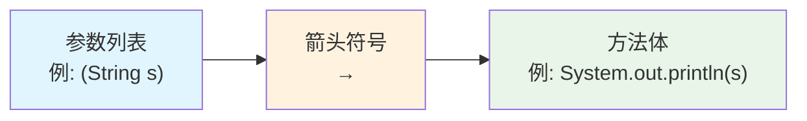

+++
title = "第24章 Lambda 表达式与函数式编程"
weight = 240
date = "2026-03-30T14:33:56.906+08:00"
type = "docs"
description = ""
isCJKLanguage = true
draft = false
+++
# 第二十四章 Lambda 表达式与函数式编程

> 🎭 准备好了吗？Java 8 引入的那个"箭头勇士"——Lambda 表达式，终于要登场了！
> 
> 它让 Java 代码从"严肃的企业级公文"秒变"流畅的函数式诗歌"。别眨眼，这一章可能会颠覆你对 Java 的认知。

---

## 24.1 Lambda 表达式

### 24.1.1 什么是 Lambda 表达式？

**Lambda 表达式**（Lambda Expression）是 Java 8 引入的一种匿名函数（Anonymous Function）。你可以把它理解为一个"没有名字的快速小方法"——它不需要你写一整块 `public static void main`，也不需要你起个方法名，直接用箭头 `->` 把参数和逻辑连起来，一气呵成。

为什么叫 Lambda？这个名字来自**λ演算**（Lambda Calculus），是计算机科学中表示匿名函数的一种经典数学符号。20 世纪 30 年代由阿隆佐·丘奇（Alonzo Church）提出，后来被引入到现代编程语言中（Scala、Python、JavaScript 都有 Lambda）。Java 姗姗来迟，直到 2014 年 Java 8 才把它请进来，但一进来就成了"顶流"。

### 24.1.2 Lambda 语法：三个部分缺一不可

一个完整的 Lambda 表达式由**三部分**构成：



**语法格式：**

```
(参数列表) -> { 方法体 }
```

- **参数列表**：和普通方法参数一样，可以有 0 个、1 个或多个参数
- **`->` 箭头**：Lambda 的标志性符号，读作"goes to"
- **方法体**：具体的实现逻辑，可以是单个表达式或代码块

**Lambda 的六种变体：**

```java
// 变体1：无参数，方法体是单个表达式（省略大括号）
() -> System.out.println("Hello Lambda!")

// 变体2：单个参数，参数类型可省略（编译器自动推断）
s -> s.toUpperCase()

// 变体3：单个参数但需要多行语句（保留大括号和return）
s -> {
    String result = s.trim();
    return result.toUpperCase();
}

// 变体4：多参数，完整写法
(String s1, String s2) -> s1.length() - s2.length()

// 变体5：多参数，带类型推断
(s1, s2) -> s1.compareTo(s2)

// 变体6：参数列表带显式类型
(int x, int y) -> x + y
```

### 24.1.3 为什么需要 Lambda？——从匿名内部类说起

在没有 Lambda 之前，如果要给一个线程传一段代码，我们只能写**匿名内部类**（Anonymous Inner Class）。看这个经典场景：

```java
// 方式1：传统匿名内部类（Java 8 之前的写法）
Runnable runnable = new Runnable() {
    @Override
    public void run() {
        System.out.println("线程正在执行...");
    }
};
new Thread(runnable).start();

// 方式2：匿名内部类一步到位（也很常见）
new Thread(new Runnable() {
    @Override
    public void run() {
        System.out.println("线程正在执行...");
    }
}).start();
```

看看这坨代码！为了执行一行 `System.out.println`，我们要写 6 行模板代码。**Runnable 接口只有一个抽象方法**，我们的真实目的不过是"把一段行为传进去"，却被迫写了一堆废话。

有了 Lambda，一切大不同：

```java
// 方式3：Lambda 表达式（Java 8+ 的写法）
new Thread(() -> System.out.println("线程正在执行...")).start();
```

一行搞定！`() -> System.out.println("线程正在执行...")` 就是 Runnable 的"另一个版本"——它同样代表"一个可以运行的任务"。

### 24.1.4 函数式接口：Lambda 的"准入证"

**函数式接口**（Functional Interface）是**只有一个抽象方法**的接口。Java 8 引入了 `@FunctionalInterface` 注解来标记这类接口，编译器会检查它是否真的只有一个抽象方法。

Runnable 是函数式接口，Callable 也是，还有我们熟悉的 Comparator、Comparable 等等。

> 💡 **关键理解**：Lambda 表达式并不是一个独立的新类型，它需要一个"目标类型"（Target Type）。编译器会根据 Lambda 所在上下文的类型要求，自动推断 Lambda 应该匹配哪个函数式接口。
>
> 换句话说，Lambda 表达式是函数式接口**抽象方法的具体实现**。

```java
// 下面的 Lambda 表达式匹配的是 Runnable 接口
Runnable r = () -> System.out.println("Hello");

// 下面的 Lambda 表达式匹配的是 Callable<String> 接口
Callable<String> c = () -> "Hello";
```

同一个 Lambda 在不同的上下文中可以匹配不同的函数式接口（只要抽象方法的签名一致）：

```java
// 这两个 Lambda 看起来一样，但类型不同
Runnable r = () -> System.out.println("任务");  // 无返回值
Supplier<Void> s = () -> System.out.println("任务");  // 返回 Void（实际是null）
```

### 24.1.5 类型推断：编译器的"读心术"

Java 编译器能从 Lambda 所在上下文中**自动推断**参数的类型，这叫**类型推断**（Type Inference）。

```java
// 完整写法：参数类型显式写出
Comparator<String> c1 = (String a, String b) -> a.length() - b.length();

// 推断写法：参数类型由编译器从 Comparator<String> 推断
Comparator<String> c2 = (a, b) -> a.length() - b.length();
```

这两种写法完全等价。什么时候用哪种？如果代码意图已经非常明确（类型很明显），省略类型让代码更简洁；如果为了可读性要明确类型，就写上。

### 24.1.6 Lambda 的作用域规则

Lambda 表达式的**作用域**（Scope）遵循以下规则：

1. **不能访问修饰符**（如 `public`、`protected`、`private`）——因为 Lambda 不是类的方法，没有访问修饰符的概念
2. **可以访问 `final` 变量或事实上有效的 final 变量**（Effectively Final）
3. **不能声明与外部变量同名的参数**（在方法体内）
4. **`return` 语句**：如果 Lambda 体是表达式形式（没有 `{}`），隐含 return；如果是大括号形式，需要显式 return

```java
String separator = ",";  // effectively final（事实上不可变）

List<String> names = Arrays.asList("Alice", "Bob", "Charlie");

// separator 是 effectively final，可以访问
names.forEach(name -> System.out.println(name + separator));

// 如果在 Lambda 内部尝试修改 separator，编译报错
// separator = ";";  // ❌ 这行如果存在，separator 就不是 effectively final，Lambda 中访问会报错
```

---

## 24.2 方法引用

### 24.2.1 方法引用是什么？

**方法引用**（Method Reference）是 Lambda 表达式的一种"豪华升级版"。当你已经有一个现成的方法可以实现 Lambda 的逻辑时，就没必要再写一遍——直接用 `::` 符号把它"引用"过来就行。

**方法引用 = Lambda 表达式的简写**——前提是你要引用的方法已经存在。

```java
// Lambda 写法
list.forEach(s -> System.out.println(s));

// 方法引用写法（更简洁！）
list.forEach(System.out::println);
```

`System.out::println` 读作"System.out 的 println 方法的引用"。

### 24.2.2 四种方法引用类型

| 类型 | 语法 | 示例 | 对应 Lambda |
|------|------|------|-------------|
| **静态方法引用** | `类名::静态方法名` | `String::valueOf` | `s -> String.valueOf(s)` |
| **实例方法引用（特定对象）** | `对象实例::实例方法名` | `System.out::println` | `s -> System.out.println(s)` |
| **实例方法引用（任意对象）** | `类名::实例方法名` | `String::toUpperCase` | `s -> s.toUpperCase()` |
| **构造方法引用** | `类名::new` | `ArrayList::new` | `() -> new ArrayList()` |

#### 类型一：静态方法引用

```java
import java.util.Arrays;
import java.util.List;

public class StaticMethodReference {
    public static void main(String[] args) {
        List<Integer> numbers = Arrays.asList(1, 2, 3, 4, 5);

        // Lambda 写法
        numbers.forEach(n -> System.out.println(String.valueOf(n)));

        // 静态方法引用写法
        numbers.forEach(System.out::println);
    }
}
```

`String::valueOf` 引用了 `String` 类的静态方法 `valueOf(int i)`，它接受一个 int 返回 String。

#### 类型二：特定对象的实例方法引用

```java
import java.util.function.Consumer;

public class InstanceMethodReference {
    public static void main(String[] args) {
        // 创建一个固定的对象
        String prefix = "Hello: ";

        // Lambda 写法：s 是参数，被拼接在 prefix 后面
        Consumer<String> c1 = s -> prefix.concat(s);

        // 实例方法引用写法：prefix 的 concat 方法
        Consumer<String> c2 = prefix::concat;

        c1.accept("World");  // 输出: Hello: World
        c2.accept("World");  // 输出: Hello: World
    }
}
```

这里的 `prefix::concat` 引用了 `prefix` 这个**具体对象**的 `concat` 实例方法。调用 `c2.accept("World")` 时，等价于 `prefix.concat("World")`。

#### 类型三：任意对象的实例方法引用（最易混淆！）

这是最需要解释的一种。看下面的例子：

```java
import java.util.Arrays;
import java.util.List;

public class ArbitraryInstanceMethodRef {
    public static void main(String[] args) {
        List<String> names = Arrays.asList("alice", "bob", "charlie");

        // Lambda 写法
        names.forEach(name -> name.toUpperCase());  // 每个名字转大写

        // 方法引用写法：String 是 name 的类型
        names.forEach(String::toUpperCase);
    }
}
```

为什么 `String::toUpperCase` 能工作？

这里 `toUpperCase()` 是一个**无参实例方法**。当我们写 `String::toUpperCase` 时，Java 把它理解为：这是一个 Lambda，输入一个 String，返回该 String 的 `toUpperCase()` 结果。

也就是说：
```
String::toUpperCase  ≈  (String s) -> s.toUpperCase()
```

这是一种"绑定到方法签名"的引用方式——不管哪个对象调用，反正方法签名是 `(String) -> String`。

再来看一个带参数的例子：

```java
import java.util.Arrays;
import java.util.List;

public class ArbitraryInstanceMethodRef2 {
    public static void main(String[] args) {
        List<String> words = Arrays.asList("hello", "world", "java");

        // 找出每个字符串的第三个字符（索引2）
        // Lambda: s -> s.charAt(2)
        words.stream()
              .map(s -> s.charAt(2))
              .forEach(System.out::println);

        // 方法引用: String::charAt
        // 因为 charAt 需要一个 int 参数
        // String::charAt 会被解读为 (String s, int index) -> s.charAt(index)
        // 但在 map 中只需要传入 String，index 固定为 2
        words.stream()
              .map(String::charAt)
              .forEach(c -> System.out.println((char) c));
    }
}
```

#### 类型四：构造方法引用

```java
import java.util.ArrayList;
import java.util.List;
import java.util.function.Supplier;
import java.util.function.Function;

public class ConstructorReference {
    public static void main(String[] args) {
        // Supplier: 无参构造 -> ArrayList()
        Supplier<ArrayList<String>> supplier1 = () -> new ArrayList<String>();
        Supplier<ArrayList<String>> supplier2 = ArrayList::new;  // 完全等价

        ArrayList<String> list = supplier2.get();
        list.add("Hello");
        System.out.println(list);  // [Hello]

        // Function: 有参构造 -> ArrayList<>(int capacity)
        Function<Integer, ArrayList<String>> factory = size -> new ArrayList<>(size);
        Function<Integer, ArrayList<String>> factory2 = ArrayList::new;  // 等价

        ArrayList<String> list2 = factory2.apply(10);
        System.out.println(list2.size());  // 0（但底层数组已分配10个空间）
    }
}
```

`ArrayList::new` 会根据上下文需要自动匹配**正确的构造方法**：
- 如果期望 `Supplier<ArrayList>`，匹配无参构造 `ArrayList()`
- 如果期望 `Function<Integer, ArrayList>`，匹配 `ArrayList(int initialCapacity)`

### 24.2.3 方法引用与 Lambda 的选择

> 🎯 **原则**：如果已经有现成的方法能直接用，就用方法引用；否则用 Lambda。

```java
// ✅ 方法引用：已有现成方法 println
list.forEach(System.out::println);

// ✅ Lambda：自定义逻辑（没有现成方法对应）
list.forEach(name -> {
    String formatted = String.format("[%s]", name.toUpperCase());
    System.out.println(formatted);
});

// ✅ 方法引用：自定义类的方法
list.stream()
     .map(String::toUpperCase)      // 方法引用
     .map(s -> "★ " + s + " ★")     // Lambda（有拼接逻辑）
     .forEach(System.out::println);
```

---

## 24.3 四大核心函数式接口

Java 在 `java.util.function` 包里提供了**几十个**函数式接口，但真正核心、最常用的只有四个。掌握这四个，你就掌握了函数式编程的"四大天王"。

| 接口 | 方法签名 | 输入 | 输出 | 典型场景 |
|------|---------|------|------|---------|
| **Supplier<T>** | `T get()` | 0 个参数 | 返回 T | "工厂"，产生数据 |
| **Consumer<T>** | `void accept(T t)` | 接收 T | 无返回值（副作用） | "消费者"，处理数据 |
| **Function<T, R>** | `R apply(T t)` | 接收 T | 返回 R | "转换器"，输入一种输出另一种 |
| **Predicate<T>** | `boolean test(T t)` | 接收 T | 返回 boolean | "过滤器"，判断条件 |

### 24.3.1 Supplier<T> —— 数据生产者

**Supplier**（供应商）不接收任何参数，**只返回一个结果**。它是"无中生有"的能手——适合工厂模式、数据懒加载、测试数据生成等场景。

```java
import java.util.function.Supplier;

/**
 * Supplier 示例：数据懒加载
 * 只有调用 get() 时，数据才会真正生成
 */
public class SupplierDemo {
    public static void main(String[] args) {
        // 场景1：模拟耗时操作的懒加载
        Supplier<String> heavyDataLoader = () -> {
            System.out.println("[Supplier] 正在加载数据（耗时操作）...");
            simulateDelay(2000);  // 模拟2秒耗时
            return "加载完成：订单列表、资金流水、用户画像";
        };

        System.out.println("创建 Supplier 完成，还没执行耗时操作");
        System.out.println("=========================");
        String data = heavyDataLoader.get();  // 这一刻才真正加载
        System.out.println(data);

        // 场景2：随机数生成器工厂
        Supplier<Double> randomSupplier = Math::random;  // 方法引用
        System.out.println("\n随机数: " + randomSupplier.get());
        System.out.println("随机数: " + randomSupplier.get());
        System.out.println("随机数: " + randomSupplier.get());
    }

    private static void simulateDelay(int ms) {
        try { Thread.sleep(ms); } catch (InterruptedException e) {}
    }
}
```

### 24.3.2 Consumer<T> —— 数据消费者

**Consumer**（消费者）接收一个参数，**不返回任何结果**。它代表"只管用，不管返回"的操作——打印、入库、发送通知等。

```java
import java.util.function.Consumer;
import java.util.Arrays;
import java.util.List;

/**
 * Consumer 示例：数据消费（遍历处理）
 */
public class ConsumerDemo {
    public static void main(String[] args) {
        List<String> fruits = Arrays.asList("Apple", "Banana", "Cherry", "Durian");

        // 方式1：方法引用，直接打印
        Consumer<String> printConsumer = System.out::println;
        fruits.forEach(printConsumer);

        System.out.println("---");

        // 方式2：Lambda，自定义消费逻辑
        Consumer<String> fancyConsumer = fruit -> {
            String formatted = "★ " + fruit.toUpperCase() + " ★";
            System.out.println(formatted);
        };
        fruits.forEach(fancyConsumer);

        System.out.println("---");

        // 方式3：andThen 组合两个 Consumer（先执行第一个，再执行第二个）
        Consumer<String> consumer1 = fruit -> System.out.println("消费1: " + fruit);
        Consumer<String> consumer2 = fruit -> System.out.println("消费2: " + fruit.length() + "个字符");

        fruits.forEach(consumer1.andThen(consumer2));
    }
}
```

**进阶：andThen 方法**

`Consumer` 接口有一个默认方法 `andThen(Consumer after)`，用于**组合两个消费者**，先执行当前这个，再执行 `after` 那个：

```java
Consumer<String> c = System.out::println;
Consumer<String> c2 = s -> System.out.println("处理后: " + s);
c.andThen(c2).accept("Hello");
// 输出:
// Hello
// 处理后: Hello
```

### 24.3.3 Function<T, R> —— 转换器

**Function**（函数）接收一个参数，**返回一个结果**。这是最灵活的一个——用于类型转换、数据处理、映射（Map）操作等。

```java
import java.util.function.Function;

/**
 * Function 示例：数据转换
 */
public class FunctionDemo {
    public static void main(String[] args) {
        // 场景1：字符串 -> 整数（长度）
        Function<String, Integer> lengthFunction = s -> s.length();
        System.out.println("'Hello'.length() = " + lengthFunction.apply("Hello"));  // 5

        // 场景2：字符串 -> 字符串（处理后）
        Function<String, String> processFunction = s -> {
            String trimmed = s.trim();
            return trimmed.isEmpty() ? "[空字符串]" : trimmed.toUpperCase();
        };
        System.out.println("  '  abc  '.process() = '" + processFunction.apply("  abc  ") + "'");

        // 场景3：andThen：先执行当前 Function，再执行另一个 Function
        Function<String, String> addPrefix = s -> "[前缀] " + s;
        Function<String, String> addSuffix = s -> s + " [后缀]";

        Function<String, String> combined = addPrefix.andThen(addSuffix);
        System.out.println("combined('Java') = " + combined.apply("Java"));
        // 结果: [前缀] Java [后缀]

        // 场景4：compose：先执行参数中的 Function，再执行当前这个（顺序与 andThen 相反）
        Function<String, String> composed = addPrefix.compose(addSuffix);
        System.out.println("composed('Java') = " + composed.apply("Java"));
        // 结果: [前缀] Java [后缀]（这个例子结果一样，但执行顺序不同）

        // 场景5：identity（返回输入本身，常用于 Map 操作中的默认值）
        Function<String, String> identity = Function.identity();
        System.out.println("identity('test') = " + identity.apply("test"));
    }
}
```

### 24.3.4 Predicate<T> —— 条件判断

**Predicate**（谓词）接收一个参数，**返回 boolean**。它是"判断专家"——过滤（filter）、条件检查、规则匹配都靠它。

```java
import java.util.function.Predicate;
import java.util.Arrays;
import java.util.List;
import java.util.stream.Collectors;

/**
 * Predicate 示例：数据过滤
 */
public class PredicateDemo {
    public static void main(String[] args) {
        List<String> names = Arrays.asList("Alice", "Bob", "Charlie", "Diana", "Eve", "Frank");

        // 场景1：判断字符串长度是否大于4
        Predicate<String> longerThan4 = s -> s.length() > 4;

        System.out.println("名字长度 > 4:");
        names.stream()
             .filter(longerThan4)  // filter 接收 Predicate
             .collect(Collectors.toList())
             .forEach(System.out::println);

        // 场景2：组合 Predicate——and（同时满足）、or（满足其一）、negate（取反）
        Predicate<String> startsWithA = s -> s.startsWith("A");
        Predicate<String> isLong     = s -> s.length() > 4;

        System.out.println("\n以 A 开头 且 长度 > 4:");
        names.stream()
             .filter(startsWithA.and(isLong))
             .forEach(System.out::println);

        System.out.println("\n以 A 开头 或 长度 <= 4:");
        names.stream()
             .filter(startsWithA.or(s -> s.length() <= 4))
             .forEach(System.out::println);

        System.out.println("\n不以 A 开头:");
        names.stream()
             .filter(startsWithA.negate())
             .forEach(System.out::println);

        // 场景3：isEqual（判断是否与指定对象相等）
        Predicate<String> isAlice = Predicate.isEqual("Alice");
        System.out.println("\nisEqual('Alice'):");
        names.stream()
             .filter(isAlice)
             .forEach(System.out::println);
    }
}
```

### 24.3.5 四大接口的"原始类型特化"版本

注意！`Supplier`、`Consumer`、`Function`、`Predicate` 都有针对**原始类型**（int、long、double）的特化版本，目的是**避免自动装箱/拆箱**带来的性能开销。

| 通用版 | int 特化 | long 特化 | double 特化 |
|--------|---------|---------|-----------|
| `Supplier<T>` | `IntSupplier` | `LongSupplier` | `DoubleSupplier` |
| `Consumer<T>` | `IntConsumer` | `LongConsumer` | `DoubleConsumer` |
| `Function<T,R>` | `IntFunction<R>`、`IntToLongFunction` 等 | `LongFunction<R>` 等 | `DoubleFunction<R>` 等 |
| `Predicate<T>` | `IntPredicate` | `LongPredicate` | `DoublePredicate` |

```java
import java.util.function.IntPredicate;
import java.util.function.IntToDoubleFunction;

public class PrimitiveSpecializations {
    public static void main(String[] args) {
        // IntPredicate：避免 Integer 自动装箱
        IntPredicate isEven = n -> n % 2 == 0;
        System.out.println("100 是偶数？" + isEven.test(100));  // true
        System.out.println("99  是偶数？" + isEven.test(99));   // false

        // IntToDoubleFunction：int -> double 的转换
        IntToDoubleFunction square = n -> n * n;
        System.out.println("5 的平方: " + square.applyAsDouble(5));  // 25.0
    }
}
```

> 💡 **性能提示**：在大量数据处理场景（Streams 流水线）中，优先使用原始类型特化版本（如 `IntStream`、`LongStream`），可以显著减少装箱/拆箱开销。

---

## 24.4 闭包与 Lambda 表达式的作用域

### 24.4.1 什么是闭包？

**闭包**（Closure）是计算机科学中的一个概念，指的是**一个函数（方法）及其引用的外部变量的组合**。听起来很抽象？我们用代码说话：

```java
public class ClosureExample {
    public static void main(String[] args) {
        int outerVar = 10;  // 外部变量

        // 下面这个 Lambda 就是"闭包"——它"捕获"了 outerVar
        Runnable r = () -> {
            // 在 Lambda 内部引用了外部变量 outerVar
            System.out.println("outerVar = " + outerVar);
        };

        outerVar = 20;  // 在调用 r.run() 之前修改 outerVar

        r.run();  // 输出什么？outerVar 是多少？
    }
}
```

### 24.4.2 Lambda 的闭包特性

Java 的 Lambda 表达式是**词法作用域**（Lexical Scope）的——它**捕获"快照"而非变量本身**。但这里要特别说明：

- Java 中的 Lambda 捕获的是 **值**（对于局部变量）或 **引用**（对于成员变量/静态变量）
- 局部变量必须满足 **effectively final**（事实上不可变）——Java 编译器要求你**不能修改**被捕获的局部变量

```java
public class ClosureCaptureRules {
    public static void main(String[] args) {
        int localVar = 100;  // effectively final（没有被修改）

        // ✅ 读取：合法，因为 localVar 是 effectively final
        Runnable ok = () -> System.out.println(localVar);

        // localVar = 200;  // ❌ 如果取消注释，localVar 就不是 effectively final
        // Runnable bad = () -> System.out.println(localVar);  // 编译报错！

        // ---- 分割线：闭包捕获的是值 ----
        int counter = 0;

        Runnable countUp = () -> {
            // Java 不允许在 Lambda 内部修改外部局部变量 counter
            // counter++;  // ❌ 编译报错：Local variable counter defined in an enclosing scope must be final or effectively final
        };

        // 正确做法：用数组包装（利用数组引用不可变，但元素可变的特性）
        final int[] mutableCounter = {0};  // 数组引用本身是 effectively final
        Runnable countUp2 = () -> {
            mutableCounter[0]++;  // ✅ 修改变量元素，不算修改引用
            System.out.println("计数器: " + mutableCounter[0]);
        };

        countUp2.run();  // 1
        countUp2.run();  // 2
        countUp2.run();  // 3
    }
}
```

### 24.4.3 this 关键字：在 Lambda 中指向什么？

在 Lambda 表达式内部，`this` 关键字指向的是**包围 Lambda 的那个方法所在的类的实例**（即外层类的 `this`），而不是指向 Lambda 本身——因为 Lambda 不是类！

```java
public class LambdaThisDemo {
    private String field = "外层类字段";

    public void demonstrate() {
        // Lambda 内部的 this 指向的是 LambdaThisDemo 实例
        Runnable r = () -> {
            System.out.println("Lambda 内部 this: " + this.getClass().getName());
            System.out.println("访问外层字段: " + this.field);
        };

        r.run();
    }

    public static void main(String[] args) {
        new LambdaThisDemo().demonstrate();
    }
}
```

输出：

```
Lambda 内部 this: LambdaThisDemo
访问外层字段: 外层类字段
```

> ⚠️ **对比匿名内部类**：在匿名内部类中，`this` 指向的是匿名内部类**自己的实例**。这是 Lambda 和匿名内部类的一个重要区别。

### 24.4.4 作用域层级：Lambda  vs  方法 vs  类

Lambda 表达式的作用域遵循**嵌套层级**，由内向外查找变量：

```java
public class ScopeHierarchy {
    private String outerClassField = "类字段";

    public void outerMethod() {
        String outerMethodVar = "外层方法变量";  // effectively final

        Runnable lambda = () -> {
            String innerVar = "Lambda 内部变量";

            // ✅ Lambda 内部变量：只在这里可见
            System.out.println(innerVar);

            // ✅ 外层方法的变量（effectively final）
            System.out.println(outerMethodVar);

            // ✅ 外层类的字段（实例变量）
            System.out.println(outerClassField);

            // ❌ 不能访问另一个方法的局部变量
            // System.out.println(innerMethodVar);  // 编译错误
        };

        lambda.run();
    }

    public void innerMethod() {
        String innerMethodVar = "另一个方法的变量";

        // Lambda 不能访问 innerMethodVar，因为它在另一个方法的作用域中
        // Runnable r = () -> System.out.println(innerMethodVar);  // ❌ 编译错误
    }
}
```

### 24.4.5 实际应用：闭包在回调和事件处理中的威力

闭包的真正威力体现在**延迟执行**（Deferred Execution）场景中——把一个任务封装起来，稍后再执行：

```java
import java.util.function.Consumer;

/**
 * 闭包应用：构建可复用的"任务模板"
 */
public class ClosureApplication {
    public static void main(String[] args) {
        // 场景1：延迟执行的任务
        int delaySeconds = 5;
        Runnable delayedTask = () -> {
            System.out.println("[" + System.currentTimeMillis() + "] 延迟任务执行了！");
        };

        // 模拟：把任务加入定时器（这里简化处理）
        System.out.println("[" + System.currentTimeMillis() + "] 任务已注册，" + delaySeconds + "秒后执行");
        delayedTask.run();  // 实际项目中这里会是 schedule 执行

        // 场景2：工厂模式——生成带"上下文"的任务
        Consumer<String> createLogger = (level) -> {
            // 闭包捕获了 timestamp
            long timestamp = System.currentTimeMillis();
            String message = "[" + timestamp + "][" + level + "] ";
            Consumer<String> logger = msg -> System.out.println(message + msg);
        };

        createLogger.accept("INFO");
        createLogger.accept("ERROR");

        // 场景3：多层闭包嵌套
        int baseMultiplier = 10;
        Runnable outer = () -> {
            int outerVar = 100;
            Runnable inner = () -> {
                // 访问了 outer 方法和类级别的变量
                System.out.println("baseMultiplier=" + baseMultiplier);
                System.out.println("outerVar=" + outerVar);
            };
            inner.run();
        };
        outer.run();
    }
}
```

---

## 本章小结

本章我们深入探索了 Java 8 引入的 **Lambda 表达式与函数式编程**核心概念：

### 24.1 Lambda 表达式
- Lambda 表达式是**匿名函数**，语法为 `(参数) -> { 方法体 }`
- Lambda 必须依附于**函数式接口**（只有一个抽象方法的接口）
- 编译器根据上下文**自动推断**参数类型（类型推断）
- Lambda 访问外部变量时，该变量必须是 **effectively final**

### 24.2 方法引用
- 方法引用是 Lambda 的简写形式，用 `::` 符号
- 四种类型：**静态方法引用**`类名::静态方法`、**特定对象实例方法引用**`对象::方法`、**任意对象实例方法引用**`类名::实例方法`、`**构造方法引用**`类名::new``
- 选择原则：现成方法直接引用，自定义逻辑用 Lambda

### 24.3 四大核心函数式接口
- **Supplier<T>**：`T get()` — 无参生产数据
- **Consumer<T>**：`void accept(T t)` — 消费数据，执行副作用
- **Function<T,R>**：`R apply(T t)` — 转换/映射数据
- **Predicate<T>**：`boolean test(T t)` — 条件判断，过滤数据
- 记得还有它们的**原始类型特化版本**（避免装箱/拆箱开销）

### 24.4 闭包与作用域
- **闭包** = Lambda 表达式 + 它捕获的外部变量
- Lambda 捕获**值**而非变量本身，外部局部变量必须是 effectively final
- Lambda 内部的 `this` 指向**外层类的实例**（与匿名内部类不同）
- 作用域由内向外嵌套查找，Lambda 不能访问其他方法的局部变量

> 🎉 **恭喜你！** 现在你已经掌握了 Java 函数式编程的核心武器。Lambda 表达式和方法引用让代码更简洁，函数式接口让行为参数化成为可能，而闭包机制则让"延迟执行"和"回调"变得前所未有的优雅。
>
> 在下一章中，我们将学习 **Stream API**，它与 Lambda 表达式是天作之合——用声明式编程处理集合数据，一行代码完成过去几十行的复杂操作。
