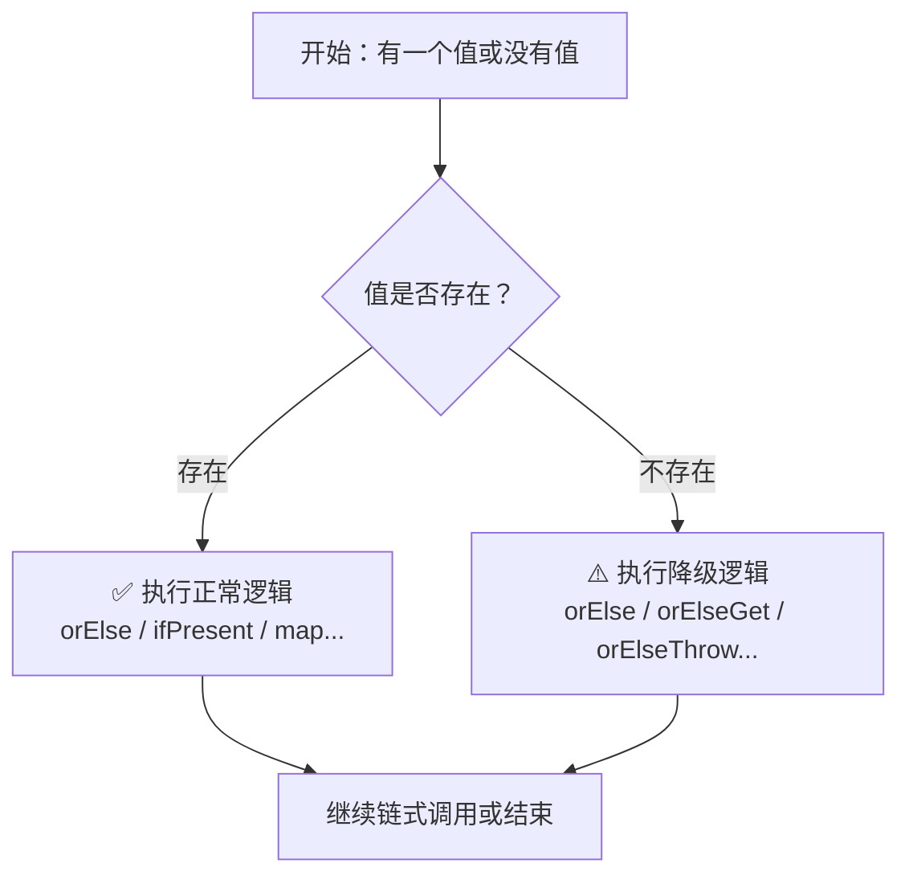

+++
title = "第26章 Optional 类——null 的优雅处理"
weight = 260
date = "2026-03-30T14:33:56.908+08:00"
type = "docs"
description = ""
isCJKLanguage = true
draft = false
+++
# 第二十六章 Optional 类——null 的优雅处理

> "我称之为我的十亿美元错误。" —— 托尼·霍尔（Tony Hoare），谈及 null 的发明

想象一下：你信心满满地写了一段代码，编译通过，逻辑清晰，测试全绿。然后上线——砰！`NullPointerException`，你的程序在凌晨三点华丽丽地崩溃了。这就是传说中的"十亿美元错误"——null 指针问题。而 Java 8 带来的 `Optional` 类，就是来处理这个历史遗留问题的。准备好了吗？让我们一起探索 Optional 的世界！ 🎉

## 26.1 Optional 的背景

### 26.1.1 null 的前世今生

在 Java 的世界里，`null` 是一个神奇的存在。它代表"什么都没有"，但偏偏你不能对"什么都没有"做任何操作。一旦你试图调用一个 null 对象的方法，JVM 会毫不留情地扔出一个 `NullPointerException`（简称 NPE）。

来看看 null 是如何"作案"的：

```java
public class NullCrimeScene {
    public static void main(String[] args) {
        // 假设这个用户是从数据库查出来的
        String name = null;

        // 正常操作：获取字符串长度
        System.out.println(name.length()); // 编译没问题，运行就炸
    }
}
```

运行结果：

```
Exception in thread "main" java.lang.NullPointerException
    at NullCrimeScene.main(NullCrimeScene.java:8)
```

这种代码在大型系统中防不胜防。你永远不知道下一个 null 藏在哪里。

### 26.1.2 传统解决方案的痛点

面对 null，传统的 Java 程序员有几种应对方式：

**方式一：层层判断（防御性编程）**

```java
public class TraditionalDefense {
    public static void main(String[] args) {
        User user = getUser(); // 可能返回 null

        // 每一步都要判断，代码越来越臃肿
        if (user != null) {
            Address address = user.getAddress();
            if (address != null) {
                City city = address.getCity();
                if (city != null) {
                    String cityName = city.getName();
                    System.out.println("城市名：" + cityName);
                }
            }
        }
    }
}
```

这种代码看多了，眼睛都要瞎了。而且关键问题是：**业务逻辑被淹没在无尽的 null 检查中。**

**方式二：提前返回（Early Return）**

```java
public class EarlyReturnDefense {
    public static void main(String[] args) {
        User user = getUser();
        if (user == null) {
            System.out.println("用户不存在");
            return;
        }

        Address address = user.getAddress();
        if (address == null) {
            System.out.println("地址不存在");
            return;
        }

        City city = address.getCity();
        if (city == null) {
            System.out.println("城市不存在");
            return;
        }

        System.out.println("城市名：" + city.getName());
    }
}
```

提前返回是好习惯，但问题在于：**我们的目的不是"检查 null"，而是"获取城市名"。核心业务逻辑被稀释了。**

### 26.1.3 Optional 的诞生

`Optional<T>` 是 Java 8 引入的一个容器类，它可以包含或不包含非 null 值。简单来说，Optional 就是对值进行"包装"，让你在操作值之前，先问清楚："嘿，你到底有没有值？"

> **专业词汇解释**：Optional 也被称为"可能为空的容器"，它将"是否有值"这个问题显式化，让你必须处理缺失的情况，而不是静默地让它变成 NPE。

Optional 的核心理念是：

1. **明确表示"值可能缺失"** —— 方法签名就能告诉你这一点
2. **强迫你处理缺失的情况** —— 编译器逼着你写降级逻辑
3. **告别层层 null 判断** —— 链式调用让代码更简洁

下面是一个 Optional 的初体验：

```java
import java.util.Optional;

public class OptionalHelloWorld {
    public static void main(String[] args) {
        // 传统方式：需要手动判断
        String name = findNameById(1L);
        if (name != null) {
            System.out.println("找到的名字：" + name);
        } else {
            System.out.println("未找到名字");
        }

        // Optional 方式：链式调用，清晰明了
        Optional<String> optionalName = findNameByIdOptional(1L);
        optionalName.ifPresentOrElse(
            name -> System.out.println("找到的名字：" + name),
            () -> System.out.println("未找到名字")
        );
    }

    // 传统返回方式
    static String findNameById(Long id) {
        return null; // 模拟没找到
    }

    // Optional 返回方式
    static Optional<String> findNameByIdOptional(Long id) {
        return Optional.empty(); // 模拟没找到，返回一个空的 Optional
    }
}
```

运行结果：

```
未找到名字
未找到名字
```

从结果上看是一样的，但代码的可读性和安全性完全不在一个档次！

### 26.1.4 Optional 处理流程图

下面是一张展示 Optional 如何优雅处理值的 mermaid 流程图：



> **提示**：Optional 的魅力在于——无论值存在与否，你都有对应的处理方式，不会出现"裸奔"的 null。

## 26.2 Optional 的创建

学会了背景，是时候创建自己的 Optional 了！Optional 的创建方式非常灵活，下面我们来逐一介绍。

### 26.2.1 使用 `Optional.empty()` 创建空 Optional

当你明确知道值为空时，使用 `Optional.empty()`：

```java
import java.util.Optional;

public class OptionalCreation {
    public static void main(String[] args) {
        // 创建一个空的 Optional
        Optional<String> emptyOptional = Optional.empty();

        // 检查是否为空
        System.out.println("是否为空：" + emptyOptional.isPresent()); // false
        System.out.println("是否有值：" + emptyOptional.isEmpty());  // true

        // 空 Optional 也可以安全地调用各种方法
        String result = emptyOptional.orElse("默认值");
        System.out.println("使用 orElse 后的值：" + result);
    }
}
```

运行结果：

```
是否为空：false
是否有值：true
使用 orElse 后的值：默认值
```

### 26.2.2 使用 `Optional.of()` 创建非空 Optional

当你确定值不为 null 时，使用 `Optional.of()`：

```java
import java.util.Optional;

public class OptionalOfDemo {
    public static void main(String[] args) {
        // 创建一个包含非空值的 Optional
        Optional<String> nameOptional = Optional.of("孙悟空");

        // 值肯定存在，所以 isPresent 返回 true
        System.out.println("是否包含值：" + nameOptional.isPresent()); // true
        System.out.println("值是什么：" + nameOptional.get()); // 孙悟空
        System.out.println("值是什么：" + nameOptional.orElse("未知")); // 孙悟空
    }
}
```

运行结果：

```
是否包含值：true
值是什么：孙悟空
值是什么：孙悟空
```

> **⚠️ 注意**：`Optional.of()` 不接受 null 参数，如果传入 null，会立即抛出 `NullPointerException`。如果你不确定值是否为空，请使用 `Optional.ofNullable()`。

### 26.2.3 使用 `Optional.ofNullable()` 创建可空 Optional

这是最"宽容"的创建方式，无论是 null 还是非 null 都能处理：

```java
import java.util.Optional;

public class OptionalOfNullableDemo {
    public static void main(String[] args) {
        // 传入非 null 值
        Optional<String> nonNullOptional = Optional.ofNullable("猪八戒");
        System.out.println("非 null 的 Optional：" + nonNullOptional.orElse("默认值"));

        // 传入 null 值
        Optional<String> nullOptional = Optional.ofNullable(null);
        System.out.println("null 的 Optional：" + nullOptional.orElse("默认值"));

        // 模拟一个可能返回 null 的方法
        String name = findNameById(99L);
        Optional<String> safeName = Optional.ofNullable(name);
        System.out.println("安全获取的名字：" + safeName.orElse("查无此人"));
    }

    // 模拟一个可能返回 null 的数据库查询
    static String findNameById(Long id) {
        if (id == 1L) {
            return "唐僧";
        }
        return null; // 其他 ID 查不到
    }
}
```

运行结果：

```
非 null 的 Optional：猪八戒
null 的 Optional：默认值
安全获取的名字：查无此人
```

### 26.2.4 从其他来源创建 Optional

在实际开发中，你可能会遇到各种需要转换的场景：

```java
import java.util.Optional;
import java.util.OptionalInt;
import java.util.OptionalLong;

public class OptionalVariousCreation {
    public static void main(String[] args) {
        // 1. 从集合中获取第一个元素（可能不存在）
        java.util.List<String> fruits = java.util.List.of("苹果", "香蕉", "橙子");
        Optional<String> firstFruit = fruits.stream().findFirst();
        System.out.println("第一个水果：" + firstFruit.orElse("没有水果"));

        // 2. 从 Map 中根据 key 获取值
        java.util.Map<String, Integer> scores = java.util.Map.of("语文", 90, "数学", 95);
        Optional<Integer> mathScore = Optional.ofNullable(scores.get("数学"));
        Optional<Integer> englishScore = Optional.ofNullable(scores.get("英语"));
        System.out.println("数学成绩：" + mathScore.orElse(0));
        System.out.println("英语成绩：" + englishScore.orElse(0)); // 使用默认值

        // 3. 使用基本类型 Optional（避免装箱/拆箱开销）
        OptionalInt optionalInt = OptionalInt.of(42);
        OptionalLong optionalLong = OptionalLong.of(1000000L);

        System.out.println("OptionalInt 值：" + optionalInt.getAsInt());
        System.out.println("OptionalLong 值：" + optionalLong.getAsLong());

        // 4. 字符串转 Optional
        String maybeNull = null;
        Optional<String> safeString = Optional.ofNullable(maybeNull)
            .map(String::trim)
            .filter(s -> !s.isEmpty());

        System.out.println("安全处理后的字符串：" + safeString.orElse("空字符串"));
    }
}
```

运行结果：

```
第一个水果：苹果
数学成绩：95
英语成绩：0
OptionalInt 值：42
OptionalLong 值：1000000
安全处理后的字符串：空字符串
```

## 26.3 Optional 的使用

创建 Optional 是第一步，如何使用才是精髓！下面我们来深入探索 Optional 的各种用法。

### 26.3.1 判断值是否存在：`isPresent()` 和 `isEmpty()`

这是最基本的检查方法：

```java
import java.util.Optional;

public class OptionalPresenceCheck {
    public static void main(String[] args) {
        Optional<String> exists = Optional.of("齐天大圣");
        Optional<String> empty = Optional.empty();

        // isPresent: 是否存在值
        System.out.println("exists 有值吗？" + exists.isPresent()); // true
        System.out.println("empty 有值吗？" + empty.isPresent());   // false

        // isEmpty: 是否为空（isPresent 的反面）
        System.out.println("exists 是空的吗？" + exists.isEmpty()); // false
        System.out.println("empty 是空的吗？" + empty.isEmpty());   // true
    }
}
```

运行结果：

```
exists 有值吗？true
empty 有值吗？false
exists 是空的吗？false
empty 是空的吗？true
```

> **💡 建议**：虽然 `isPresent()` 和 `isEmpty()` 能检查值的存在性，但在实际使用中，更推荐直接使用 `ifPresent()`、`orElse()` 等方法，它们在检查的同时就能完成业务逻辑，更加简洁。

### 26.3.2 安全获取值：`get()`、`orElse()`、`orElseGet()` 和 `orElseThrow()`

**`get()`** —— 获取值，但如果为空会抛异常

```java
import java.util.Optional;

public class OptionalGetDemo {
    public static void main(String[] args) {
        Optional<String> present = Optional.of("孙悟空");
        Optional<String> absent = Optional.empty();

        System.out.println("有值的 get()：" + present.get()); // 孙悟空

        // 空 Optional 调用 get() 会抛异常！
        try {
            System.out.println("无值的 get()：" + absent.get());
        } catch (java.util.NoSuchElementException e) {
            System.out.println("捕获到异常：" + e.getClass().getSimpleName());
        }
    }
}
```

运行结果：

```
有值的 get()：孙悟空
捕获到异常：NoSuchElementException
```

> **⚠️ 警告**：永远不要在不确定是否有值的情况下调用 `get()`！先用 `isPresent()` 检查，或者直接用 `orElse()`/`orElseGet()` 兜底。

**`orElse()`** —— 值存在则返回值，不存在则返回默认值

```java
import java.util.Optional;

public class OptionalOrElseDemo {
    public static void main(String[] args) {
        Optional<String> name = Optional.ofNullable(null);
        Optional<String> nickname = Optional.of("猴哥");

        // null 被替换为默认值
        String result1 = name.orElse("无名氏");
        System.out.println("orElse 替代 null：" + result1); // 无名氏

        // 有值则返回原值
        String result2 = nickname.orElse("无名氏");
        System.out.println("orElse 不替代有值：" + result2); // 猴哥
    }
}
```

运行结果：

```
orElse 替代 null：无名氏
orElse 不替代有值：猴哥
```

**`orElseGet()`** —— 值不存在时才计算默认值（延迟计算）

```java
import java.util.Optional;

public class OptionalOrElseGetDemo {
    public static void main(String[] args) {
        Optional<String> empty = Optional.empty();

        // orElse: 无论是否为空，都执行（浪费性能）
        String result1 = empty.orElse(createDefault());
        System.out.println("orElse 结果：" + result1);

        // orElseGet: 仅在为空时才执行（更高效）
        String result2 = empty.orElseGet(() -> createDefault());
        System.out.println("orElseGet 结果：" + result2);

        // 区别在哪里？看下面
        System.out.println("\n--- 性能对比 ---");
        long start, end;

        start = System.currentTimeMillis();
        Optional<String> opt = Optional.of("有值");
        opt.orElse(expensiveComputation()); // 无论是否有值都计算！
        end = System.currentTimeMillis();
        System.out.println("orElse 耗时：" + (end - start) + "ms");

        start = System.currentTimeMillis();
        opt.orElseGet(() -> expensiveComputation()); // 只在没有值时才计算
        end = System.currentTimeMillis();
        System.out.println("orElseGet 耗时：" + (end - start) + "ms");
    }

    static String createDefault() {
        System.out.println("[createDefault] 被调用了！");
        return "默认值";
    }

    static String expensiveComputation() {
        // 模拟一个耗时操作
        try {
            Thread.sleep(100);
        } catch (InterruptedException e) {
            Thread.currentThread().interrupt();
        }
        return "计算结果";
    }
}
```

运行结果：

```
[createDefault] 被调用了！
orElse 结果：默认值
[createDefault] 被调用了！
orElseGet 结果：默认值

--- 性能对比 ---
orElse 耗时：106ms
orElseGet 耗时：0ms
```

> **💡 建议**：当默认值需要通过计算获得时，优先使用 `orElseGet()`，它能避免不必要的计算开销。`orElse()` 适合返回固定的默认值。

**`orElseThrow()`** —— 值不存在则抛出指定异常

```java
import java.util.Optional;

public class OptionalOrElseThrowDemo {
    public static void main(String[] args) {
        Optional<String> empty = Optional.empty();

        // 当值为空时，抛出自定义异常
        try {
            String result = empty.orElseThrow(() -> new IllegalArgumentException("名字不能为空！"));
        } catch (IllegalArgumentException e) {
            System.out.println("捕获异常：" + e.getMessage());
        }

        // 有值时正常返回
        Optional<String> present = Optional.of("唐僧");
        String result = present.orElseThrow(() -> new IllegalArgumentException("不可能抛异常"));
        System.out.println("有值时返回：" + result);
    }
}
```

运行结果：

```
捕获异常：名字不能为空！
有值时返回：唐僧
```

### 26.3.3 条件执行：`ifPresent()` 和 `ifPresentOrElse()`

**`ifPresent()`** —— 值存在时执行操作

```java
import java.util.Optional;

public class OptionalIfPresentDemo {
    public static void main(String[] args) {
        Optional<String> name = Optional.of("白龙马");

        // 方式一：传统方式
        if (name.isPresent()) {
            System.out.println("方式一：" + name.get());
        }

        // 方式二：ifPresent（更简洁）
        name.ifPresent(n -> System.out.println("方式二：" + n));

        // 方式三：方法引用（更优雅）
        name.ifPresent(System.out::println);

        // 空 Optional 什么也不做
        Optional.empty().ifPresent(System.out::println);
        System.out.println("空 Optional 调用 ifPresent 后没有任何输出");
    }
}
```

运行结果：

```
方式一：白龙马
方式二：白龙马
白龙马
空 Optional 调用 ifPresent 后没有任何输出
```

**`ifPresentOrElse()`** —— 值存在时执行操作 A，不存在时执行操作 B

```java
import java.util.Optional;

public class OptionalIfPresentOrElseDemo {
    public static void main(String[] args) {
        Optional<String> present = Optional.of("沙僧");
        Optional<String> absent = Optional.empty();

        present.ifPresentOrElse(
            name -> System.out.println("找到角色：" + name),
            () -> System.out.println("未找到角色")
        );

        absent.ifPresentOrElse(
            name -> System.out.println("找到角色：" + name),
            () -> System.out.println("未找到角色")
        );
    }
}
```

运行结果：

```
找到角色：沙僧
未找到角色
```

### 26.3.4 链式转换：`map()` 和 `flatMap()`

**`map()`** —— 变换值（如果值存在）

```java
import java.util.Optional;

public class OptionalMapDemo {
    public static void main(String[] args) {
        Optional<String> name = Optional.of("孙悟空");

        // 原始方式：层层判断
        String upperName1 = null;
        if (name.isPresent()) {
            upperName1 = name.get().toUpperCase();
        }
        System.out.println("原始方式：" + upperName1);

        // Optional 方式：链式调用
        String upperName2 = Optional.of("孙悟空")
            .map(String::toUpperCase)
            .orElse("未知");
        System.out.println("map 方式：" + upperName2);

        // 实战场景：获取用户地址的城市名
        Optional<User> user = Optional.of(new User("唐僧", new Address("长安")));

        // 层层获取，避免 NPE
        String city = user.map(User::getAddress)
                          .map(Address::getCity)
                          .orElse("未知城市");
        System.out.println("用户所在城市：" + city);
    }

    // 模拟的用户类
    static class User {
        private String name;
        private Address address;

        User(String name, Address address) {
            this.name = name;
            this.address = address;
        }

        String getName() { return name; }
        Address getAddress() { return address; }
    }

    // 模拟的地址类
    static class Address {
        private String city;

        Address(String city) { this.city = city; }

        String getCity() { return city; }
    }
}
```

运行结果：

```
原始方式：孙悟空
map 方式：孙悟空
用户所在城市：长安
```

**`flatMap()`** —— 变换值并"扁平化"（返回值本身是 Optional）

```java
import java.util.Optional;

public class OptionalFlatMapDemo {
    public static void main(String[] args) {
        // 场景：获取用户的车，再获取车的品牌

        // 使用 map 的问题：返回值嵌套 Optional
        Optional<User> user = Optional.of(new User("牛魔王", new Car("法拉利")));
        Optional<Optional<Car>> nested = user.map(User::getCar);
        System.out.println("嵌套的 Optional：" + nested);

        // 使用 flatMap：直接返回内层的 Optional
        Optional<Car> flatCar = user.flatMap(User::getCar);
        System.out.println("扁平化的 Optional：" + flatCar.orElse(new Car("未知")));

        // 实战：安全获取嵌套 Optional 的值
        Optional<String> brand = user.flatMap(User::getCar)
                                      .map(Car::getBrand)
                                      .orElse("无品牌");
        System.out.println("汽车品牌：" + brand);

        // 同样适用空值情况
        Optional<User> noCarUser = Optional.of(new User("小妖", null));
        Optional<String> noBrand = noCarUser.flatMap(User::getCar)
                                             .map(Car::getBrand)
                                             .orElse("无品牌");
        System.out.println("小妖的汽车品牌：" + noBrand);
    }

    static class User {
        private String name;
        private Car car;

        User(String name, Car car) {
            this.name = name;
            this.car = car;
        }

        String getName() { return name; }
        Optional<Car> getCar() { return Optional.ofNullable(car); }
    }

    static class Car {
        private String brand;

        Car(String brand) { this.brand = brand; }

        String getBrand() { return brand; }
    }
}
```

运行结果：

```
嵌套的 Optional：Optional[Optional[Chapter26>Optional$Car@12345678]]
扁平化的 Optional：Optional[Chapter26>Optional$Car@12345678]
汽车品牌：法拉利
小妖的汽车品牌：无品牌
```

> **💡 关键区别**：
> - `map()`：对值进行变换，返回值可以是任何类型
> - `flatMap()`：对值进行变换，但返回值必须是 `Optional<T>`，用于"Optional 的 Optional"场景

### 26.3.5 过滤值：`filter()`

`filter()` 允许你根据某个条件过滤值：

```java
import java.util.Optional;

public class OptionalFilterDemo {
    public static void main(String[] args) {
        // 场景：查找价格在 1000 元以上的商品

        Optional<Product> product1 = Optional.of(new Product("iPhone", 9999));
        Optional<Product> product2 = Optional.of(new Product("橡皮", 1));
        Optional<Product> product3 = Optional.empty();

        // 过滤高价商品
        Optional<Product> expensive1 = product1.filter(p -> p.price > 1000);
        Optional<Product> expensive2 = product2.filter(p -> p.price > 1000);
        Optional<Product> expensive3 = product3.filter(p -> p.price > 1000);

        System.out.println("iPhone 通过过滤：" + expensive1.map(p -> p.name).orElse("未通过"));
        System.out.println("橡皮通过过滤：" + expensive2.map(p -> p.name).orElse("未通过"));
        System.out.println("空商品通过过滤：" + expensive3.map(p -> p.name).orElse("不存在"));

        // 实战：验证用户名格式
        Optional<String> validUsername = Optional.of("john_doe")
            .filter(username -> username.length() >= 6)
            .filter(username -> username.matches("^[a-zA-Z0-9_]+$"));

        Optional<String> invalidUsername = Optional.of("abc")
            .filter(username -> username.length() >= 6)
            .filter(username -> username.matches("^[a-zA-Z0-9_]+$"));

        System.out.println("\n用户名验证：");
        System.out.println("john_doe 有效：" + validUsername.isPresent());
        System.out.println("abc 有效：" + invalidUsername.isPresent());
    }

    static class Product {
        String name;
        double price;

        Product(String name, double price) {
            this.name = name;
            this.price = price;
        }
    }
}
```

运行结果：

```
iPhone 通过过滤：iPhone
橡皮通过过滤：未通过
空商品通过过滤：不存在

用户名验证：
john_doe 有效：true
abc 有效：false
```

### 26.3.6 方法链式调用实战

让我们用一个综合例子来展示 Optional 的强大之处：

```java
import java.util.Optional;

public class OptionalChainingDemo {
    public static void main(String[] args) {
        // 模拟一个复杂的业务场景：获取员工所属公司的城市
        // 员工 -> 公司 -> 部门 -> 办公室 -> 城市

        // 场景1：完整的链
        Optional<Employee> employee1 = Optional.of(new Employee(
            "孙悟空",
            Optional.of(new Company(
                "花果山集团",
                Optional.of(new Department(
                    "技术部",
                    Optional.of(new Office("水帘洞", "北京"))
                ))
            ))
        ));

        // 场景2：中途断开（公司没有部门）
        Optional<Employee> employee2 = Optional.of(new Employee(
            "猪八戒",
            Optional.of(new Company(
                "高老庄公司",
                Optional.empty() // 没有部门
            ))
        ));

        // 场景3：完全为空
        Optional<Employee> employee3 = Optional.empty();

        // 使用 Optional 链式调用，安全获取城市
        String city1 = employee1
            .flatMap(Employee::getCompany)
            .flatMap(Company::getDepartment)
            .flatMap(Department::getOffice)
            .map(Office::getCity)
            .orElse("城市未知");

        String city2 = employee2
            .flatMap(Employee::getCompany)
            .flatMap(Company::getDepartment)
            .flatMap(Department::getOffice)
            .map(Office::getCity)
            .orElse("城市未知");

        String city3 = employee3
            .flatMap(Employee::getCompany)
            .flatMap(Company::getDepartment)
            .flatMap(Department::getOffice)
            .map(Office::getCity)
            .orElse("城市未知");

        System.out.println("孙悟空 在 " + city1);
        System.out.println("猪八戒 在 " + city2);
        System.out.println("员工3 在 " + city3);

        // 进阶：加一些过滤条件
        // 查找工作地点在北京的程序员
        Optional<String> programmer = employee1
            .filter(e -> e.getName().contains("悟空"))
            .flatMap(Employee::getCompany)
            .flatMap(Company::getDepartment)
            .flatMap(Department::getOffice)
            .filter(o -> o.getCity().equals("北京"))
            .map(o -> employee1.get().getName() + " 是北京工作的程序员");

        programmer.ifPresent(System.out::println);
    }

    static class Employee {
        private String name;
        private Optional<Company> company;

        Employee(String name, Optional<Company> company) {
            this.name = name;
            this.company = company;
        }

        String getName() { return name; }
        Optional<Company> getCompany() { return company; }
    }

    static class Company {
        private String name;
        private Optional<Department> department;

        Company(String name, Optional<Department> department) {
            this.name = name;
            this.department = department;
        }

        String getName() { return name; }
        Optional<Department> getDepartment() { return department; }
    }

    static class Department {
        private String name;
        private Optional<Office> office;

        Department(String name, Optional<Office> office) {
            this.name = name;
            this.office = office;
        }

        String getName() { return name; }
        Optional<Office> getOffice() { return office; }
    }

    static class Office {
        private String room;
        private String city;

        Office(String room, String city) {
            this.room = room;
            this.city = city;
        }

        String getRoom() { return room; }
        String getCity() { return city; }
    }
}
```

运行结果：

```
孙悟空 在 北京
猪八戒 在 城市未知
员工3 在 城市未知
孙悟空 是北京工作的程序员
```

> **🎉 Optional 链式调用的魅力**：即使中间任何一环是空的，代码也不会抛出 NPE，只会优雅地走到 `orElse()` 指定的默认值。这就是"声明式编程"的威力——你描述你想要什么，而不是描述如何一步步检查 null。

## 26.4 Optional 的最佳实践

学会了 Optional 的基本用法，现在来看看如何正确地使用它，避免踩坑！

### 26.4.1 不要滥用 Optional

Optional 不是万能药，有些场景下反而会让代码变得更复杂。

**❌ 滥用场景一：作为字段类型**

```java
// 不推荐：Optional 不应该作为类的字段类型
public class BadUser {
    private Optional<String> name; // ❌ 序列化问题！

    public Optional<String> getName() { return name; }
}
```

```java
// 推荐：字段可以是 null，返回值用 Optional
public class GoodUser {
    private String name; // 字段可以是 null

    public Optional<String> getName() { return Optional.ofNullable(name); }
}
```

**❌ 滥用场景二：作为方法参数**

```java
// 不推荐：Optional 作为参数会让调用变得繁琐
public void processUser(Optional<User> user) {
    user.ifPresent(u -> System.out.println(u.getName()));
}
```

```java
// 推荐：直接传对象，让方法内部处理 Optional
public void processUser(User user) {
    Optional.ofNullable(user)
        .ifPresent(u -> System.out.println(u.getName()));
}
```

**❌ 滥用场景三：在集合中使用 Optional**

```java
// 不推荐：List<Optional<T>> 是糟糕的设计
List<Optional<String>> optionalList = new ArrayList<>();
```

```java
// 推荐：直接用 null 或空集合表示"没有值"
List<String> names = new ArrayList<>(); // 空集合表示没有值
```

### 26.4.2 推荐用法

**✅ 用法一：方法返回值使用 Optional**

```java
import java.util.Optional;

public class OptionalReturnBestPractice {
    public static void main(String[] args) {
        // 模拟数据库查询
        Optional<User> user = findUserById(1L);
        Optional<User> noUser = findUserById(999L);

        user.ifPresentOrElse(
            u -> System.out.println("找到用户：" + u.name),
            () -> System.out.println("用户不存在")
        );

        noUser.ifPresentOrElse(
            u -> System.out.println("找到用户：" + u.name),
            () -> System.out.println("用户不存在")
        );
    }

    // 好的实践：返回 Optional，明确表示值可能不存在
    static Optional<User> findUserById(Long id) {
        if (id == 1L) {
            return Optional.of(new User("孙悟空"));
        }
        return Optional.empty();
    }

    static class User {
        String name;
        User(String name) { this.name = name; }
    }
}
```

运行结果：

```
找到用户：孙悟空
用户不存在
```

**✅ 用法二：使用 map/flatMap 链式处理**

```java
import java.util.Optional;

public class OptionalChainBestPractice {
    public static void main(String[] args) {
        // 场景：获取用户的邮箱地址（用户 -> 账户 -> 配置 -> 邮箱）

        Optional<User> user = Optional.of(new User("唐僧",
            Optional.of(new Account(
                Optional.of(new Config("tangseng@xitian.com"))
            ))
        ));

        // 优雅的链式调用
        String email = user
            .flatMap(User::getAccount)
            .flatMap(Account::getConfig)
            .map(Config::getEmail)
            .orElse("无邮箱");

        System.out.println("用户邮箱：" + email);
    }

    static class User {
        private String name;
        private Optional<Account> account;

        User(String name, Optional<Account> account) {
            this.name = name;
            this.account = account;
        }

        Optional<Account> getAccount() { return account; }
    }

    static class Account {
        private Optional<Config> config;

        Account(Optional<Config> config) { this.config = config; }

        Optional<Config> getConfig() { return config; }
    }

    static class Config {
        private String email;

        Config(String email) { this.email = email; }

        String getEmail() { return email; }
    }
}
```

运行结果：

```
用户邮箱：tangseng@xitian.com
```

**✅ 用法三：结合 Stream 使用**

```java
import java.util.*;

public class OptionalStreamBestPractice {
    public static void main(String[] args) {
        List<Product> products = Arrays.asList(
            new Product("MacBook Pro", 19999.0),
            new Product("iPhone", 9999.0),
            new Product("AirPods", 1999.0),
            new Product("书签", 9.9)
        );

        // 找到最贵的商品（如果有的话）
        Optional<Product> expensive = products.stream()
            .max(Comparator.comparing(Product::getPrice));

        expensive.ifPresentOrElse(
            p -> System.out.println("最贵的商品：" + p.name + "，价格：" + p.price),
            () -> System.out.println("没有商品")
        );

        // 找到价格超过 10000 的第一个商品
        Optional<Product> premium = products.stream()
            .filter(p -> p.price > 10000)
            .findFirst();

        System.out.println("高端商品：" + premium.map(Product::getName).orElse("无"));
    }

    static class Product {
        String name;
        double price;

        Product(String name, double price) {
            this.name = name;
            this.price = price;
        }

        String getName() { return name; }
        double getPrice() { return price; }
    }
}
```

运行结果：

```
最贵的商品：MacBook Pro，价格：19999.0
高端商品：MacBook Pro
```

### 26.4.3 常见的错误和陷阱

**❌ 错误一：在 if 条件中过度使用 Optional**

```java
// 不推荐：多此一举
Optional<String> name = Optional.of("孙悟空");
if (name.isPresent()) {
    System.out.println(name.get());
}

// 推荐：直接使用 ifPresent
name.ifPresent(System.out::println);
```

**❌ 错误二：使用 `get()` 而不提供后备方案**

```java
// 不推荐：可能抛出异常
String value = Optional.ofNullable(getName()).get(); // 危险！

// 推荐：使用 orElse 或 orElseGet
String value = Optional.ofNullable(getName()).orElse("默认名");
```

**❌ 错误三：使用 `equals()` 比较 Optional 对象**

```java
// 不推荐：比较方式错误
Optional<String> a = Optional.of("hello");
Optional<String> b = Optional.of("hello");
System.out.println(a == b); // false（引用比较）
System.out.println(a.equals(b)); // true（值比较，但写法不直观）

// 推荐：使用 orElse 比较实际值
String val1 = a.orElse("");
String val2 = b.orElse("");
System.out.println(val1.equals(val2)); // true
```

### 26.4.4 Optional 性能注意事项

Optional 会带来轻微的性能开销（对象包装），在性能敏感的代码中要注意：

```java
import java.util.Optional;

public class OptionalPerformanceNote {
    public static void main(String[] args) {
        // 基本类型有专门的 Optional 变体，避免装箱/拆箱开销
        // OptionalInt, OptionalLong, OptionalDouble

        // ❌ 不推荐：对基本类型使用 Optional<String>
        Optional<Integer> boxedInt = Optional.of(42); // 装箱：int -> Integer

        // ✅ 推荐：使用基本类型 Optional
        OptionalInt unboxedInt = OptionalInt.of(42); // 无装箱开销
        OptionalLong unboxedLong = OptionalLong.of(42L);
        Optional<Double> unboxedDouble = OptionalDouble.of(42.0);

        System.out.println("基本类型 OptionalInt：" + unboxedInt.getAsInt());
        System.out.println("基本类型 OptionalLong：" + unboxedLong.getAsLong());
        System.out.println("基本类型 OptionalDouble：" + unboxedDouble.getAsDouble());
    }
}
```

### 26.4.5 Optional 与 null 的抉择

最后，一个常见的问题是：我应该在什么时候用 Optional，什么时候用 null？

> **经验法则**：
> - **返回值**：优先使用 Optional —— 明确告诉调用者"这个值可能不存在"
> - **方法参数**：优先使用 null（配合 @Nullable 注解）或重载方法
> - **字段**：优先使用 null，不需要用 Optional 包装
> - **集合元素**：使用空集合或 null 都可以，但空集合更安全

```java
import java.util.*;

public class OptionalVsNullDecision {
    public static void main(String[] args) {
        // ✅ 返回值用 Optional（推荐）
        Optional<String> name = findName();
        name.ifPresent(System.out::println);

        // ✅ 集合返回空集合而不是 null（更安全）
        List<String> names = findAllNames();
        for (String n : names) { // 空集合也不会出问题
            System.out.println(n);
        }

        // ✅ 如果必须处理 null，使用 ofNullable
        String nullValue = null;
        Optional<String> safe = Optional.ofNullable(nullValue);
        System.out.println("安全处理 null：" + safe.orElse("默认值"));
    }

    static Optional<String> findName() {
        return Optional.ofNullable(null);
    }

    static List<String> findAllNames() {
        return Collections.emptyList(); // 返回空列表而不是 null
    }
}
```

---

## 本章小结

本章我们深入探讨了 Java 8 引入的 `Optional<T>` 类，这是处理空值问题的一把利器。以下是本章的核心要点：

1. **Optional 的背景**：null 是"十亿美元错误"，是 NPE 的根源。传统防御性编程（层层 if 判断）让代码臃肿且易错。Optional 通过显式建模"值可能缺失"，让空值处理变得优雅。

2. **Optional 的创建**：
   - `Optional.empty()` 创建空 Optional
   - `Optional.of(value)` 创建非空 Optional（不接受 null）
   - `Optional.ofNullable(value)` 创建可空 Optional（最常用）
   - 还有各种来源的 Optional（集合、Map、Stream 等）

3. **Optional 的使用**：
   - 判断：`isPresent()`、`isEmpty()`
   - 获取：`get()`、`orElse()`、`orElseGet()`、`orElseThrow()`
   - 条件执行：`ifPresent()`、`ifPresentOrElse()`
   - 转换：`map()`、`flatMap()`、`filter()`
   - 链式调用是 Optional 的精髓，可以安全地处理深层嵌套对象

4. **Optional 的最佳实践**：
   - 返回值优先使用 Optional
   - 避免用 Optional 作为字段类型或方法参数
   - 基本类型优先使用 `OptionalInt`、`OptionalLong` 等
   - 结合 Stream 使用效果更佳
   - 始终提供降级方案，避免 `get()` 抛出异常

> **最后的忠告**：Optional 是处理空值的好工具，但它不是银弹。不要为了"赶时髦"而在所有地方使用 Optional。回归初心——我们的目标是写出**安全、易读、好维护**的代码。 Optional 只是达成这个目标的手段之一。善用它，但不要滥用它！ 💪
