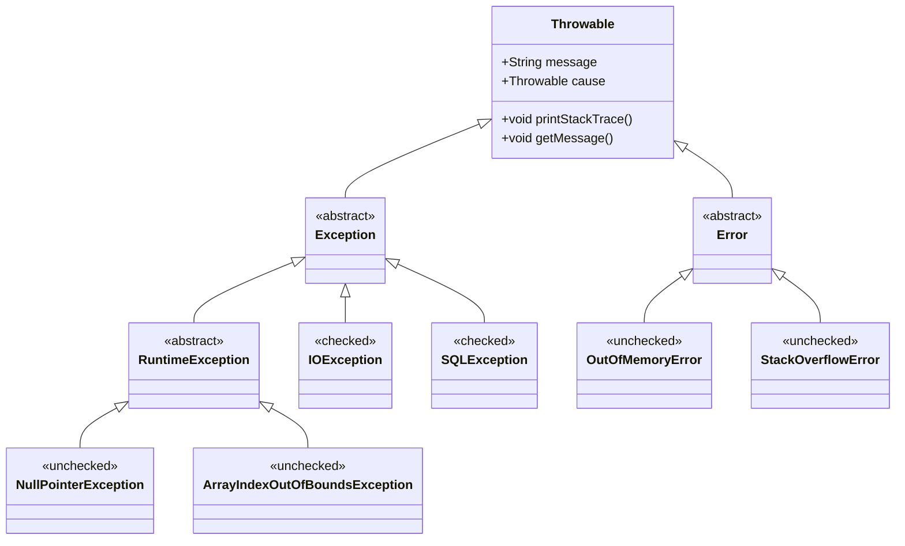

+++
title = "第27章 异常处理——错误的优雅管理"
weight = 270
date = "2026-03-30T14:33:56.909+08:00"
type = "docs"
description = ""
isCJKLanguage = true
draft = false
+++
# 第二十七章 异常处理——错误的优雅管理

> "代码写得好不好，就看异常处理巧不巧。没有异常处理的程序，就像没系安全带就飙车——迟早要出事儿。"

你有没有想过，为什么 Java 要搞出这么一套"异常"机制？说白了，程序运行过程中总会遇到各种意想不到的状况：文件找不到、网络断了、除数为零、数组越界……这些捣蛋鬼，我们统称为**异常（Exception）**。

异常处理的核心思想很简单：**不要等到系统崩溃才后悔，要在错误发生时就优雅地把控局面**。想象一下，如果你的程序在用户毫无防备时突然闪退，那体验简直是灾难级的。但如果程序能温柔地弹出一句"哎呀，文件不见了，我来帮你找找"，那感觉就不一样了。

Java 的异常处理机制，就是让程序在面对错误时能够"从容不迫"，既不伤害用户感情，也不让你的代码变成一团乱麻。接下来，让我们一起揭开 Java 异常体系的神秘面纱。

## 27.1 异常的分类

Java 的异常体系就像一个大家族，根正苗红，所有的异常都继承自一个老祖宗——`Throwable` 类。这个家族主要分为两大门派：**Error（错误）** 和 **Exception（异常）**。

### 27.1.1 Error——程序无力回天的灾难

**Error（错误）** 代表的是 Java 虚拟机（JVM）自身产生的严重问题，这类问题程序本身几乎无法处理。比如：

- `OutOfMemoryError`：内存用光了，连 new 一个对象都没戏
- `StackOverflowError`：调用栈溢出了，通常是递归没写好把自己坑了
- `VirtualMachineError`：JVM 本身的故障

```java
/**
 * 演示 StackOverflowError —— 递归的无限循环陷阱
 * 注意：这个程序会导致栈溢出，请谨慎运行！
 */
public class StackOverflowDemo {
    public static void main(String[] args) {
        System.out.println("开始递归...");
        recursiveMethod(); // 没有终止条件的递归，注定走向崩溃
    }

    private static void recursiveMethod() {
        // 每次调用都会在栈上创建一个新的栈帧，直到栈空间耗尽
        recursiveMethod(); // 我调我自己，永不回头
    }
}
```

> **小知识**：Error 发生时，JVM 可能连捕获的机会都不给你，因为它代表着 JVM 已经自身难保了。所以，遇到 Error，别挣扎了，先检查自己的代码是不是写的有问题吧。

### 27.1.2 Exception——程序可以应对的意外

**Exception（异常）** 才是我们日常打交道最多的家伙。它代表程序运行时遇到的**可恢复性错误**。这一门派又细分为两大家族：

#### 27.1.2.1 RuntimeException——免检产品，无需主动声明

`RuntimeException` 是 Java 异常体系中的"自由派"，它的特点是：**编译器不要求你必须捕获或声明抛出**。这类异常通常是程序员自己的锅，比如逻辑错误或疏忽。

常见的 RuntimeException 包括：

| 异常类型 | 触发场景 | 一句话描述 |
|---------|---------|-----------|
| `NullPointerException` | 对 null 调用方法 | "空指针引用，就像对着空气打电话" |
| `ArrayIndexOutOfBoundsException` | 数组索引越界 | "数组只有5个元素，你要访问第10个？" |
| `ArithmeticException` | 算术运算错误 | "除以零？数学老师棺材板都压不住了" |
| `ClassCastException` | 类型强制转换失败 | "把狗转型成猫？编译器说可以，运行时说不行" |
| `IllegalArgumentException` | 参数不合法 | "方法要求正数，你传个负数？" |

```java
/**
 * 演示各种 RuntimeException
 */
public class RuntimeExceptionDemo {
    public static void main(String[] args) {
        // 场景1：空指针异常 —— 最常见的异常之一
        String str = null;
        try {
            System.out.println("字符串长度：" + str.length()); // NPE来了！
        } catch (NullPointerException e) {
            System.out.println("捕获到空指针异常：字符串是 null，无法调用方法！");
        }

        // 场景2：数组越界
        int[] arr = {1, 2, 3};
        try {
            System.out.println("访问第10个元素：" + arr[9]); // 数组只有3个元素
        } catch (ArrayIndexOutOfBoundsException e) {
            System.out.println("捕获到数组越界：数组只有 " + arr.length + " 个元素，你要访问第 " + 9 + " 个！");
        }

        // 场景3：算术异常
        try {
            int result = 10 / 0; // 除以零，数学不允许
        } catch (ArithmeticException e) {
            System.out.println("捕获到算术异常：" + e.getMessage());
        }
    }
}
```

#### 27.1.2.2 受检异常（Checked Exception）——必须处理的麻烦

与 RuntimeException 相对的是**受检异常（Checked Exception）**。这类异常在编译时就会被 Java 编译器"检查"，如果你的代码可能抛出受检异常，编译器会强迫你必须处理它（通过 try-catch 捕获或通过 throws 声明抛出）。

常见的受检异常包括：

- `IOException`：输入输出操作失败，如文件读写错误
- `SQLException`：数据库操作异常
- `ClassNotFoundException`：类找不到
- `FileNotFoundException`：文件未找到

```java
import java.io.FileReader;
import java.io.IOException;

/**
 * 演示受检异常 —— 编译器逼着你处理
 */
public class CheckedExceptionDemo {
    public static void main(String[] args) {
        // 编译器要求必须处理 IOException，否则代码编译不过
        try (FileReader reader = new FileReader("不存在的文件.txt")) {
            char[] buffer = new char[1024];
            int len = reader.read(buffer);
            System.out.println("读取到 " + len + " 个字符");
        } catch (IOException e) {
            System.out.println("捕获到 IO 异常：" + e.getMessage());
            System.out.println("文件不存在或无法读取，请检查文件路径！");
        }
    }
}
```

### 27.1.3 异常体系的继承关系

下面这张图清晰地展示了 Java 异常体系的层级结构：



从图中可以看出：

- `Throwable` 是整个异常体系的根类
- `Error` 和 `Exception` 是它的两个直接子类
- `Exception` 又分为 `RuntimeException`（非受检异常）和 非 RuntimeException 的受检异常
- 日常编码中，我们主要与 `Exception` 打交道，尤其是 `RuntimeException` 及其子类

## 27.2 异常处理结构

Java 为我们提供了三个关键字来应对异常：`try`、`catch` 和 `finally`。这三剑客各有分工，缺一不可。

### 27.2.1 基本结构：try-catch

`try` 块用于包裹可能发生异常的代码，`catch` 块则负责捕获并处理异常。

```java
/**
 * 最基本的异常处理结构：try-catch
 */
public class TryCatchDemo {
    public static void main(String[] args) {
        System.out.println("程序开始执行...");

        try {
            // 可能会抛出异常的代码
            int result = 10 / 2; // 正常，不会抛异常
            System.out.println("10 / 2 = " + result);

            // 这里会抛异常
            int error = 10 / 0; // ArithmeticException
            System.out.println("这行不会执行！");

        } catch (ArithmeticException e) {
            // 捕获除零异常
            System.out.println("哎呀，除数不能为零！");
            System.out.println("异常信息：" + e.getMessage());
        }

        System.out.println("程序继续执行，优雅地处理了错误！");
    }
}
```

运行结果：

```
程序开始执行...
10 / 2 = 5
哎呀，除数不能为零！
异常信息：/ by zero
程序继续执行，优雅地处理了错误！
```

### 27.2.2 多重 catch——分门别类处理

如果一段代码可能抛出多种不同类型的异常，我们可以使用多个 catch 块分别捕获。需要注意的是：**catch 块的顺序很重要，必须从小到大（从具体到抽象）排列**。

```java
import java.io.FileReader;
import java.io.IOException;
import java.text.ParseException;
import java.text.SimpleDateFormat;

/**
 * 多重 catch 块 —— 分门别类处理不同异常
 */
public class MultiCatchDemo {
    public static void main(String[] args) {
        String[] inputs = {"123", "abc", "2024-13-45"};

        for (String input : inputs) {
            try {
                // 场景1：尝试解析为数字
                int num = Integer.parseInt(input);
                System.out.println("成功解析为数字：" + num);

            } catch (NumberFormatException e) {
                // 不是数字，尝试解析为日期
                try {
                    SimpleDateFormat sdf = new SimpleDateFormat("yyyy-MM-dd");
                    sdf.parse(input);
                    System.out.println("成功解析为日期：" + input);
                } catch (ParseException ex) {
                    System.out.println("无法解析 '" + input + "'：既不是数字，也不是有效日期格式");
                }
            }
        }

        // 演示多个 catch 块的正确顺序
        try {
            Object obj = "Hello";
            Integer num = (Integer) obj; // ClassCastException
        } catch (ClassCastException e) {
            System.out.println("类型转换异常：" + e.getMessage());
        } catch (Exception e) {
            // 通用的异常处理，放最后兜底
            System.out.println("其他异常：" + e.getMessage());
        }
    }
}
```

> **重要原则**：catch 块必须从小范围到大范围排列！如果你把 `catch (Exception e)` 放在最前面，那后面的所有 catch 块都成了摆设，编译器会直接报错。

### 27.2.3 finally——无论如何都要执行的代码

`finally` 块是异常处理结构中的"保证执行"担当。无论 try 块中的代码是否抛出异常，`finally` 块中的代码都会被执行。典型用途：**资源释放、文件关闭、连接断开等**。

```java
import java.io.FileReader;
import java.io.IOException;

/**
 * finally 块 —— 确保执行的安全网
 */
public class FinallyDemo {
    public static void main(String[] args) {
        FileReader reader = null;

        try {
            reader = new FileReader("example.txt");
            char[] buffer = new char[1024];
            int len = reader.read(buffer);
            System.out.println("成功读取 " + len + " 个字符");
        } catch (IOException e) {
            System.out.println("读取文件时发生错误：" + e.getMessage());
        } finally {
            // 无论是否发生异常，都要关闭文件
            if (reader != null) {
                try {
                    reader.close();
                    System.out.println("文件流已关闭");
                } catch (IOException e) {
                    System.out.println("关闭文件时出错：" + e.getMessage());
                }
            }
        }

        System.out.println("\n--- 演示 finally 的无条件执行 ---");

        // 验证 finally 的无条件执行
        System.out.println(testFinally(0)); // 除数为0
        System.out.println(testFinally(2)); // 正常除法
    }

    private static int testFinally(int divisor) {
        try {
            return 10 / divisor;
        } catch (ArithmeticException e) {
            System.out.println("捕获异常...");
            return -1;
        } finally {
            // 即使有 return，finally 也会先执行
            System.out.println("finally 块执行了！");
        }
    }
}
```

### 27.2.4 try-catch-finally 执行流程图

```
                    ┌─────────────┐
                    │   开始执行   │
                    └──────┬──────┘
                           ▼
                    ┌─────────────┐
                    │  执行 try    │
                    │   块代码     │
                    └──────┬──────┘
                           │
              ┌────────────┼────────────┐
              │            │            │
              ▼            ▼            ▼
        ┌──────────┐  ┌──────────┐  ┌──────────┐
        │ 发生异常  │  │ 正常执行  │  │ 发生异常  │
        │ (在try中) │  │  (无异常) │  │ (在catch)│
        └────┬─────┘  └────┬─────┘  └────┬─────┘
             │             │             │
             ▼             │             ▼
        ┌──────────┐       │      ┌──────────┐
        │ 匹配catch │       │      │ 匹配catch │
        │   块      │       │      │   块     │
        └────┬─────┘       │      └────┬─────┘
             │             │           │
             └──────┬───────┴───────────┘
                    ▼
             ┌──────────────┐
             │ 执行 finally │
             │    块代码    │
             └──────┬───────┘
                    ▼
             ┌──────────────┐
             │ 程序继续执行  │
             └──────────────┘
```

## 27.3 throw 与 throws

这两个关键字看起来很像，但实际上有本质区别：`throw` 是**抛出异常**，而 `throws` 是**声明异常**。一个是在代码内部制造异常，一个是在方法签名上声明可能抛出的异常。

### 27.3.1 throw——制造异常的"肇事者"

`throw` 关键字用于在代码中**主动抛出异常**。当你检测到某个不合理的状况时，可以用 `throw` 主动制造一个异常，让调用者知道出了问题。

```java
/**
 * throw 关键字 —— 主动抛出异常
 */
public class ThrowDemo {

    public static void main(String[] args) {
        System.out.println("=== 验证用户年龄 ===");

        // 场景1：正常年龄
        try {
            validateAge(25);
            System.out.println("年龄 25 岁：验证通过 ✓");
        } catch (IllegalArgumentException e) {
            System.out.println("年龄 25 岁：验证失败 - " + e.getMessage());
        }

        // 场景2：负数年龄
        try {
            validateAge(-5);
            System.out.println("年龄 -5 岁：验证通过");
        } catch (IllegalArgumentException e) {
            System.out.println("年龄 -5 岁：验证失败 - " + e.getMessage());
        }

        // 场景3：超出范围
        try {
            validateAge(150);
            System.out.println("年龄 150 岁：验证通过");
        } catch (IllegalArgumentException e) {
            System.out.println("年龄 150 岁：验证失败 - " + e.getMessage());
        }
    }

    /**
     * 验证年龄是否合法
     * @param age 年龄
     * @throws IllegalArgumentException 如果年龄不在 0-120 范围内
     */
    private static void validateAge(int age) {
        if (age < 0) {
            // 主动抛出异常，年龄为负数不合理
            throw new IllegalArgumentException("年龄不能为负数！你从未来穿越来的？");
        }
        if (age > 120) {
            // 主动抛出异常，年龄太大也不合理
            throw new IllegalArgumentException("年龄不能超过 120 岁！你是妖怪吗？");
        }
        // 年龄合法，什么都不做
    }
}
```

运行结果：

```
=== 验证用户年龄 ===
年龄 25 岁：验证通过 ✓
年龄 -5 岁：验证失败 - 年龄不能为负数！你从未来穿越来的？
年龄 150 岁：验证失败 - 年龄不能超过 120 岁！你是妖怪吗？
```

### 27.3.2 throws——方法签名上的"免责声明"

`throws` 关键字用于在**方法签名**上声明该方法可能抛出的异常类型。这是一种"免责声明"——我告诉你这个方法可能会出问题，你自己看着办。

```java
import java.io.FileReader;
import java.io.IOException;

/**
 * throws 关键字 —— 方法签名上的异常声明
 */
public class ThrowsDemo {

    public static void main(String[] args) {
        System.out.println("=== 调用会抛出受检异常的方法 ===");

        // 调用声明了 throws 的方法，需要处理异常
        try {
            readFileContent("C:\\test\\hello.txt");
        } catch (IOException e) {
            System.out.println("主方法捕获到异常：" + e.getMessage());
        }

        System.out.println("\n=== 调用链：从 main 到 readFile ===");
        try {
            processData(); // 一层层传递，最后在 readFile 中抛出
        } catch (IOException e) {
            System.out.println("最终在 main 方法中捕获：" + e.getMessage());
        }
    }

    /**
     * 读取文件内容
     * @param filePath 文件路径
     * @throws IOException 如果文件不存在或读取失败
     */
    private static String readFileContent(String filePath) throws IOException {
        System.out.println("正在读取文件：" + filePath);

        // FileReader 的构造方法声明了 FileNotFoundException（IOException 的子类）
        // 这里我们不需要 catch，直接 throws 上去
        try (FileReader reader = new FileReader(filePath)) {
            StringBuilder content = new StringBuilder();
            char[] buffer = new char[1024];
            int len;
            while ((len = reader.read(buffer)) != -1) {
                content.append(buffer, 0, len);
            }
            return content.toString();
        }
        // 注意：这里不需要 finally 来关闭流，因为使用了 try-with-resources
    }

    /**
     * 处理数据（调用其他可能抛出异常的方法）
     * @throws IOException 异常上抛
     */
    private static void processData() throws IOException {
        System.out.println("processData 开始处理...");
        String data = readFileContent("C:\\nonexistent\\file.txt");
        System.out.println("处理数据：" + data);
    }
}
```

### 27.3.3 throw vs throws：一张表搞清楚

| 特性 | `throw` | `throws` |
|-----|--------|---------|
| 位置 | 方法内部 | 方法签名上 |
| 作用 | 主动抛出异常实例 | 声明方法可能抛出的异常类型 |
| 语法 | `throw new Exception("message")` | `void method() throws IOException` |
| 数量 | 一次抛出一个异常实例 | 声明多个异常类型，用逗号分隔 |
| 后续代码 | throw 之后的代码不会执行 | 方法可以正常执行完 |

```java
/**
 * throw 与 throws 的区别演示
 */
public class ThrowVsThrowsDemo {

    // throws 在方法签名上声明
    public static void calculate(double num) throws IllegalArgumentException {
        if (num < 0) {
            // throw 在方法内部主动抛出
            throw new IllegalArgumentException("不能计算负数的平方根！");
        }
        System.out.println("平方根：" + Math.sqrt(num));
    }

    public static void main(String[] args) {
        // 调用声明了 throws 的方法，需要 try-catch
        try {
            calculate(-10); // 这里会触发 throw
        } catch (IllegalArgumentException e) {
            System.out.println("捕获异常：" + e.getMessage());
        }
    }
}
```

## 27.4 自定义异常

有时候 Java 内置的异常不够用，我们需要自己造"轮子"。比如业务逻辑中的特定错误情况，Java 显然不知道"余额不足"、"用户已存在"这些业务概念，这时候就要自定义异常。

### 27.4.1 为什么需要自定义异常？

1. **表达业务语义**：内置异常如 `NullPointerException` 只能表达技术层面的错误，无法表达业务含义
2. **精确捕获**：调用者可以精准地捕获特定业务异常，而不用写一堆 if-else 判断
3. **携带业务数据**：自定义异常可以包含业务相关的数据字段
4. **统一异常处理**：整个项目可以使用统一的异常体系

### 27.4.2 如何定义自定义异常

自定义异常很简单，记住两点：**继承 `Exception`（受检异常）** 或 **`RuntimeException`（非受检异常）**，然后添加几个构造方法。

```java
/**
 * 自定义异常：余额不足异常
 * 继承 RuntimeException，表示这是非受检异常（业务逻辑错误）
 */
public class InsufficientBalanceException extends RuntimeException {

    // 余额不足时当前的余额
    private final double currentBalance;

    // 余额不足时想要提取的金额
    private final double requestedAmount;

    // 无参构造器
    public InsufficientBalanceException() {
        super("余额不足");
        this.currentBalance = 0;
        this.requestedAmount = 0;
    }

    // 带消息的构造器
    public InsufficientBalanceException(String message) {
        super(message);
        this.currentBalance = 0;
        this.requestedAmount = 0;
    }

    // 带消息和原因（根因）的构造器
    public InsufficientBalanceException(String message, Throwable cause) {
        super(message, cause);
        this.currentBalance = 0;
        this.requestedAmount = 0;
    }

    // 完整的构造器，包含业务数据
    public InsufficientBalanceException(double currentBalance, double requestedAmount) {
        super(String.format("余额不足：当前余额 %.2f 元，想要提取 %.2f 元，差 %.2f 元",
                currentBalance, requestedAmount, requestedAmount - currentBalance));
        this.currentBalance = currentBalance;
        this.requestedAmount = requestedAmount;
    }

    // Getter 方法
    public double getCurrentBalance() {
        return currentBalance;
    }

    public double getRequestedAmount() {
        return requestedAmount;
    }
}
```

### 27.4.3 使用自定义异常

```java
/**
 * 银行账户类 —— 演示自定义异常的使用
 */
public class BankAccount {

    private String accountId;      // 账户ID
    private String ownerName;      // 户主姓名
    private double balance;        // 余额

    // 存款上限（防止恶意存款）
    private static final double MAX_BALANCE = 1_000_000;

    public BankAccount(String accountId, String ownerName, double initialBalance) {
        this.accountId = accountId;
        this.ownerName = ownerName;
        if (initialBalance < 0) {
            throw new IllegalArgumentException("初始存款不能为负数！");
        }
        this.balance = initialBalance;
    }

    /**
     * 存款
     * @param amount 存款金额
     * @throws IllegalArgumentException 如果存款金额不合法
     */
    public void deposit(double amount) {
        if (amount <= 0) {
            throw new IllegalArgumentException("存款金额必须大于零！");
        }
        if (amount + balance > MAX_BALANCE) {
            throw new IllegalArgumentException(
                    "存款后总额不能超过 " + MAX_BALANCE + " 元！");
        }
        balance += amount;
        System.out.printf("%s 存入 %.2f 元，余额：%.2f 元%n", ownerName, amount, balance);
    }

    /**
     * 取款
     * @param amount 取款金额
     * @throws InsufficientBalanceException 如果余额不足
     */
    public void withdraw(double amount) {
        if (amount <= 0) {
            throw new IllegalArgumentException("取款金额必须大于零！");
        }
        if (amount > balance) {
            // 抛出自定义异常，携带业务数据
            throw new InsufficientBalanceException(balance, amount);
        }
        balance -= amount;
        System.out.printf("%s 取款 %.2f 元，余额：%.2f 元%n", ownerName, amount, balance);
    }

    /**
     * 转账
     * @param to 目标账户
     * @param amount 转账金额
     */
    public void transfer(BankAccount to, double amount) {
        System.out.printf("%s 向 %s 转账 %.2f 元%n",
                this.ownerName, to.ownerName, amount);
        // 先从自己账户取款（可能抛出 InsufficientBalanceException）
        this.withdraw(amount);
        // 再向对方账户存款
        to.deposit(amount);
        System.out.println("转账成功！");
    }

    public double getBalance() {
        return balance;
    }

    @Override
    public String toString() {
        return String.format("账户[%s] - %s，余额：%.2f 元",
                accountId, ownerName, balance);
    }
}
```

### 27.4.4 测试自定义异常

```java
/**
 * 测试自定义异常
 */
public class CustomExceptionTest {
    public static void main(String[] args) {
        System.out.println("=== 银行账户异常测试 ===\n");

        // 创建两个账户
        BankAccount accountA = new BankAccount("A001", "小明", 5000);
        BankAccount accountB = new BankAccount("B001", "小红", 1000);

        System.out.println("\n--- 场景1：正常取款 ---");
        try {
            accountA.withdraw(1000);
            System.out.println("取款后余额：" + accountA.getBalance());
        } catch (InsufficientBalanceException e) {
            System.out.println("余额不足！" + e.getMessage());
        }

        System.out.println("\n--- 场景2：余额不足 ---");
        try {
            accountA.withdraw(10000); // 小明只有5000，想要取10000
        } catch (InsufficientBalanceException e) {
            System.out.println("捕获到余额不足异常！");
            System.out.println("  当前余额：" + e.getCurrentBalance());
            System.out.println("  想要取款：" + e.getRequestedAmount());
            System.out.println("  差额：" + (e.getRequestedAmount() - e.getCurrentBalance()));
        }

        System.out.println("\n--- 场景3：转账（余额不足导致部分回滚）---");
        try {
            accountA.transfer(accountB, 6000); // 小明只有5000，想要转6000
        } catch (InsufficientBalanceException e) {
            System.out.println("转账失败：" + e.getMessage());
            System.out.println("账户A余额未变动：" + accountA.getBalance());
            System.out.println("账户B余额未变动：" + accountB.getBalance());
        }

        System.out.println("\n--- 场景4：正常转账 ---");
        accountA.transfer(accountB, 2000);
        System.out.println(accountA);
        System.out.println(accountB);
    }
}
```

### 27.4.5 异常链与根因追溯

有时候异常不是一步到位的，而是经过多层调用才最终暴露出来。这时候，我们需要保留异常的"根因"，让调试时能追溯完整的异常链路。

```java
/**
 * 演示异常链 —— 保留异常的根因
 */
public class ExceptionChainDemo {

    public static void main(String[] args) {
        try {
            level3Method();
        } catch (CustomBusinessException e) {
            System.out.println("捕获到业务异常：" + e.getMessage());
            System.out.println("异常类型：" + e.getExceptionType());
            System.out.println("\n完整异常链（调用栈）：");
            e.printStackTrace();

            System.out.println("\n--- 追溯根因 ---");
            Throwable cause = e.getCause();
            int level = 1;
            while (cause != null) {
                System.out.println("  层级" + level + "原因：" + cause.getMessage());
                cause = cause.getCause();
                level++;
            }
        }
    }

    private static void level3Method() throws CustomBusinessException {
        try {
            level2Method();
        } catch (TechnicalException te) {
            // 技术异常转换为业务异常，保留根因
            throw new CustomBusinessException("业务处理失败", "DATA_ACCESS", te);
        }
    }

    private static void level2Method() throws TechnicalException {
        try {
            level1Method();
        } catch (DatabaseException de) {
            // 数据库异常转换为技术异常，保留根因
            throw new TechnicalException("数据访问层出错", de);
        }
    }

    private static void level1Method() throws DatabaseException {
        // 最底层，直接抛出数据库异常
        throw new DatabaseException("无法连接到数据库：Connection refused");
    }
}

/**
 * 自定义异常：业务异常
 */
class CustomBusinessException extends RuntimeException {
    private final String exceptionType;

    public CustomBusinessException(String message, String exceptionType, Throwable cause) {
        super(message, cause);
        this.exceptionType = exceptionType;
    }

    public String getExceptionType() {
        return exceptionType;
    }
}

/**
 * 技术异常
 */
class TechnicalException extends RuntimeException {
    public TechnicalException(String message, Throwable cause) {
        super(message, cause);
    }
}

/**
 * 数据库异常
 */
class DatabaseException extends RuntimeException {
    public DatabaseException(String message) {
        super(message);
    }
}
```

## 27.5 try-with-resources

在 Java 7 之前，关闭资源（如文件流、数据库连接）是一件非常痛苦的事情。你需要在 `finally` 块中写一大堆关闭代码，而且还要担心关闭时是否也会抛出异常。`try-with-resources` 的出现，彻底解决了这个问题。

### 27.5.1 传统的资源关闭方式

```java
import java.io.FileReader;
import java.io.FileWriter;
import java.io.IOException;

/**
 * 传统方式关闭资源 —— 代码冗长，容易出错
 */
public class TraditionalResourceClose {
    public static void main(String[] args) {
        FileReader reader = null;
        FileWriter writer = null;

        try {
            reader = new FileReader("input.txt");
            writer = new FileWriter("output.txt");

            char[] buffer = new char[1024];
            int len;
            while ((len = reader.read(buffer)) != -1) {
                writer.write(buffer, 0, len);
            }
            System.out.println("文件复制完成！");

        } catch (IOException e) {
            System.out.println("IO 异常：" + e.getMessage());
        } finally {
            // 关闭资源也要 try-catch，太繁琐了
            if (reader != null) {
                try {
                    reader.close();
                } catch (IOException e) {
                    System.out.println("关闭读取器失败：" + e.getMessage());
                }
            }
            if (writer != null) {
                try {
                    writer.close();
                } catch (IOException e) {
                    System.out.println("关闭写入器失败：" + e.getMessage());
                }
            }
        }
    }
}
```

### 27.5.2 try-with-resources 登场

`try-with-resources` 是 Java 7 引入的新语法，只要资源实现了 `AutoCloseable` 接口，就可以在 try 后面的小括号里声明，Java 会自动帮你关闭资源。

```java
import java.io.FileReader;
import java.io.FileWriter;
import java.io.IOException;

/**
 * try-with-resources —— 自动关闭资源的优雅写法
 */
public class TryWithResourcesDemo {
    public static void main(String[] args) {
        // 在 try 后面声明资源，Java 会自动关闭
        try (FileReader reader = new FileReader("input.txt");
             FileWriter writer = new FileWriter("output.txt")) {

            char[] buffer = new char[1024];
            int len;
            while ((len = reader.read(buffer)) != -1) {
                writer.write(buffer, 0, len);
            }
            System.out.println("文件复制完成！");

        } catch (IOException e) {
            System.out.println("IO 异常：" + e.getMessage());
        }
        // 不需要 finally 块，资源自动关闭
    }
}
```

### 27.5.3 资源关闭的顺序

如果声明了多个资源，关闭时会按照**相反的顺序**关闭——后声明的先关闭。

```java
import java.io.ByteArrayInputStream;
import java.io.InputStream;

/**
 * 演示 try-with-resources 的关闭顺序
 */
public class ResourceCloseOrder {
    public static void main(String[] args) {
        System.out.println("=== 资源关闭顺序测试 ===\n");

        try (Resource1 r1 = new Resource1();
             Resource2 r2 = new Resource2()) {

            System.out.println("使用资源中...");
            r1.use();
            r2.use();

        } catch (Exception e) {
            System.out.println("异常：" + e.getMessage());
        }
    }
}

class Resource1 implements AutoCloseable {
    public void use() {
        System.out.println("Resource1 使用中");
    }

    @Override
    public void close() throws Exception {
        System.out.println("Resource1 关闭（最后关闭，因为先声明）");
    }
}

class Resource2 implements AutoCloseable {
    public void use() {
        System.out.println("Resource2 使用中");
    }

    @Override
    public void close() throws Exception {
        System.out.println("Resource2 关闭（最先关闭，因为后声明）");
    }
}
```

输出结果：

```
=== 资源关闭顺序测试 ===

使用资源中...
Resource1 使用中
Resource2 使用中
Resource2 关闭（最先关闭，因为后声明）
Resource1 关闭（最后关闭，因为先声明）
```

### 27.5.4 catch 和 finally 都可以配合使用

`try-with-resources` 并不排斥 `catch` 和 `finally`，它们可以一起使用。

```java
import java.io.FileReader;
import java.io.FileWriter;
import java.io.IOException;

/**
 * try-with-resources 配合 catch 和 finally 使用
 */
public class TryWithResourcesComplete {
    public static void main(String[] args) {
        String result = copyFile("source.txt", "target.txt");
        System.out.println("操作结果：" + result);
    }

    private static String copyFile(String source, String target) {
        // try-with-resources 声明资源
        try (FileReader reader = new FileReader(source);
             FileWriter writer = new FileWriter(target)) {

            char[] buffer = new char[1024];
            int len;
            long totalBytes = 0;

            while ((len = reader.read(buffer)) != -1) {
                writer.write(buffer, 0, len);
                totalBytes += len;
            }

            return "复制成功，共传输 " + totalBytes + " 字节";

        } catch (IOException e) {
            // catch 处理异常
            return "复制失败：" + e.getMessage();
        }
        // finally 不需要了，资源自动关闭
    }
}
```

### 27.5.5 自定义资源类

只要实现 `AutoCloseable` 接口，你的类就可以在 try-with-resources 中使用。

```java
/**
 * 自定义可关闭资源：数据库连接模拟
 */
public class CustomResourceDemo {
    public static void main(String[] args) {
        System.out.println("=== 使用自定义资源 ===\n");

        // 使用自定义的资源类
        try (DatabaseConnection db = new DatabaseConnection("localhost:3306", "mydb")) {
            System.out.println("执行查询...");
            db.query("SELECT * FROM users");
            System.out.println("查询完成！");

            // 模拟查询失败
            System.out.println("\n模拟查询失败...");
            db.query(null); // 会抛出异常

        } catch (DatabaseException e) {
            System.out.println("数据库异常：" + e.getMessage());
        }
        // 连接在这里自动关闭
    }
}

/**
 * 数据库连接模拟类 —— 实现 AutoCloseable 接口
 */
class DatabaseConnection implements AutoCloseable {
    private final String host;
    private final String database;
    private boolean connected;

    public DatabaseConnection(String host, String database) throws DatabaseException {
        this.host = host;
        this.database = database;
        this.connected = false;
        connect();
    }

    private void connect() throws DatabaseException {
        System.out.println("连接到 " + host + "/" + database + "...");
        // 模拟连接延迟
        this.connected = true;
        System.out.println("连接成功！");
    }

    public void query(String sql) throws DatabaseException {
        if (!connected) {
            throw new DatabaseException("未连接到数据库！");
        }
        if (sql == null) {
            throw new DatabaseException("SQL 语句不能为空！");
        }
        System.out.println("执行 SQL：" + sql);
    }

    @Override
    public void close() throws DatabaseException {
        if (connected) {
            System.out.println("关闭数据库连接...");
            this.connected = false;
            System.out.println("连接已关闭！");
        }
    }
}

/**
 * 数据库异常
 */
class DatabaseException extends Exception {
    public DatabaseException(String message) {
        super(message);
    }
}
```

## 27.6 异常处理的最佳实践

异常处理看似简单，但要写好并不容易。以下是一些经过实践检验的最佳实践，遵循它们能让你的代码更加健壮、可维护。

### 27.6.1 只捕获你能够处理的异常

不要贪多嚼不烂，只捕获你真正知道如何处理的异常。对于不知道如何处理的异常，**让它继续向上传播**。

```java
/**
 * 最佳实践1：只捕获能处理的异常
 */

// ❌ 错误示例：捕获所有异常，然后什么也不做
try {
    doSomething();
} catch (Exception e) {
    // 吞掉所有异常，静默失败 —— 调试的噩梦
}

// ❌ 错误示例：捕获过于宽泛的异常类型
try {
    doSomething();
} catch (Throwable t) { // 捕获 Throwable 包括 Error，太过宽泛
    // 试图处理所有问题，但很可能处理不了
}

// ✅ 正确示例：只捕获具体能处理的异常
try {
    doSomething();
} catch (SpecificException e) {
    // 明确知道这个异常是什么，能正确处理
    handleSpecificException(e);
}

// ✅ 更好的做法：不知道怎么处理就继续 throws
public void process() throws SpecificException {
    // 让调用者处理，或者在更高层统一处理
    doSomething();
}
```

### 27.6.2 不要用异常来控制正常流程

异常是用来处理**异常情况**的，不是用来控制程序流程的。用异常做流程控制不仅性能差，还会让代码变得难以理解。

```java
/**
 * 最佳实践2：不要用异常来控制正常流程
 */

// ❌ 错误示例：用异常来检查元素是否存在
try {
    iter.next();
} catch (NoSuchElementException e) {
    // 用异常来控制循环 —— 性能极差！
}

// ✅ 正确示例：先检查再操作
if (iter.hasNext()) {
    Object item = iter.next();
    // 处理 item
}
```

### 27.6.3 异常信息要清晰有用

异常消息是调试的关键，要让看日志的人一眼就能明白发生了什么问题。

```java
/**
 * 最佳实践3：提供清晰有用的异常信息
 */

// ❌ 糟糕的异常信息
throw new Exception("Error");

// ❌ 仍然不够具体
throw new Exception("Invalid parameter");

// ✅ 具体且有用的异常信息
throw new IllegalArgumentException(
    "用户ID不能为空或小于1，输入值：" + userId);

// ✅ 包含上下文信息的异常
throw new FileNotFoundException(
    "找不到配置文件：'" + fileName + "'，期望路径：" +
    expectedPath + "，当前工作目录：" + System.getProperty("user.dir"));
```

### 27.6.4 优先使用标准异常

Java 已经提供了一套成熟的异常体系，在大多数情况下，**优先使用 Java 标准异常**比自定义异常更好：

| 场景 | 推荐使用的标准异常 |
|------|-----------------|
| 参数为 null | `NullPointerException` |
| 参数值不合法 | `IllegalArgumentException` |
| 状态不合法 | `IllegalStateException` |
| 下标越界 | `IndexOutOfBoundsException` |
| 不支持的操作 | `UnsupportedOperationException` |

```java
/**
 * 最佳实践4：优先使用标准异常
 */

public class StandardExceptionUsage {

    public void setAge(int age) {
        // 参数校验
        if (age < 0) {
            throw new IllegalArgumentException(
                "年龄不能为负数，输入值：" + age);
        }
        if (age > 150) {
            throw new IllegalArgumentException(
                "年龄超出合理范围（0-150），输入值：" + age);
        }
        this.age = age;
    }

    public int divide(int a, int b) {
        if (b == 0) {
            // 不要抛自定义异常，ArithmeticException 是标准答案
            throw new ArithmeticException(
                "除数不能为零，计算：" + a + " / " + b);
        }
        return a / b;
    }
}
```

### 27.6.5 保持异常的抽象层次一致

每层代码只抛出跟自己层级相关的异常，不要让底层的技术细节泄漏到高层。

```java
/**
 * 最佳实践5：保持异常的抽象层次一致
 */

// ❌ 错误示例：低层异常泄漏到高层
class LowLevelService {
    public void doLowLevelThing() throws SQLException {
        // 低层代码直接抛出数据库异常
    }
}

// ❌ 高层代码被迫处理数据库细节
class HighLevelService {
    public void businessMethod() throws SQLException { // 为什么要知道SQL？
        lowLevelService.doLowLevelThing();
    }
}

// ✅ 正确示例：异常转换
class LowLevelService {
    public void doLowLevelThing() throws BusinessException {
        try {
            // 底层操作
            executeDatabaseQuery();
        } catch (SQLException e) {
            // 转换为业务异常，屏蔽技术细节
            throw new BusinessException("业务操作失败：数据处理异常", e);
        }
    }
}

// ✅ 高层只处理业务异常
class HighLevelService {
    public void businessMethod() throws BusinessException {
        lowLevelService.doLowLevelThing(); // 干净的接口
    }
}
```

### 27.6.6 避免在 finally 块中抛出异常

`finally` 块中的异常会**覆盖**try 块中的原始异常，导致原始错误信息丢失。

```java
/**
 * 最佳实践6：避免在 finally 中抛出异常
 */

// ❌ 危险示例：finally 中的异常会覆盖原始异常
try {
    doSomething();
} catch (IOException e) {
    // 原本想处理这个异常
    throw e;
} finally {
    // 如果这里也抛异常，原始的 IOException 就丢失了
    closeResource(); // 可能抛出异常
}

// ✅ 正确做法：使用 try-with-resources
try (Resource resource = acquireResource()) {
    doSomething();
} // 资源关闭的异常会被正确传播
```

### 27.6.7 日志和异常处理要分开

不要在捕获异常时直接打印日志又重新抛出，这样会导致日志重复。

```java
import java.util.logging.Logger;

/**
 * 最佳实践7：日志记录和异常处理要合理分工
 */
public class LoggingBestPractice {

    private static final Logger logger =
        Logger.getLogger(LoggingBestPractice.class.getName());

    public void process() {
        try {
            doSomething();
        } catch (CustomException e) {
            // ✅ 低层只记录日志，不重新抛出
            logger.warning("处理失败：" + e.getMessage());

            // 或者记录后转换为另一种异常
            throw new BusinessException("业务处理失败", e);
        }
    }

    // ✅ 高层负责最终处理和用户交互
    public void handleUserRequest() {
        try {
            process();
        } catch (BusinessException e) {
            // 这里才决定如何与用户交互
            showErrorMessage(e.getMessage());
            logger.severe("业务异常：" + e);
        }
    }

    private void showErrorMessage(String message) {
        System.out.println("错误：" + message);
    }
}
```

### 27.6.8 异常处理 checklist 总结

| 检查项 | 说明 |
|-------|------|
| ✅ 捕获具体异常 | 不要用 `catch (Exception e)` 一网打尽 |
| ✅ 异常信息完整 | 包含上下文、参数值、期望值等 |
| ✅ 资源正确关闭 | 优先使用 `try-with-resources` |
| ✅ 异常链完整 | 保留原始异常作为根因 |
| ✅ 抽象层次一致 | 低层异常转换为高层异常 |
| ✅ 不要吞掉异常 | 至少记录日志 |
| ✅ 不用异常控流程 | 用条件判断代替 |
| ✅ 测试异常路径 | 单元测试覆盖异常场景 |

---

## 本章小结

本章我们深入学习了 Java 的异常处理机制，主要内容包括：

1. **异常的分类**：Java 异常体系以 `Throwable` 为根，分为 `Error`（程序无法处理的灾难）和 `Exception`（程序可以处理的意外）两大类。`Exception` 又分为 `RuntimeException`（非受检异常，无需声明）和受检异常（编译器强制处理）。

2. **异常处理结构**：掌握 `try-catch-finally` 三剑客的使用。`try` 包裹可能出错的代码，`catch` 分门别类捕获异常，`finally` 确保无论如何都会执行的清理代码。

3. **throw 与 throws**：`throw` 在代码内部主动抛出异常实例，`throws` 在方法签名上声明可能抛出的异常类型。一字之差，用法迥异。

4. **自定义异常**：通过继承 `Exception` 或 `RuntimeException` 创建自定义异常，可以携带业务数据、表达业务语义、构建异常链保留根因。

5. **try-with-resources**：Java 7 引入的语法糖，只要资源实现 `AutoCloseable` 接口，就能在 try 后的括号中声明，Java 自动关闭资源，优雅解决了资源泄漏问题。

6. **异常处理最佳实践**：包括只捕获能处理的异常、不用异常控流程、保持异常抽象层次一致、避免在 finally 中抛异常等实用建议。

异常处理是衡量代码质量的重要标准。优雅的异常处理能让程序在出错时依然体面地运行，而不是崩溃给用户看。希望大家在本章的学习中，不仅掌握语法，更能形成良好的异常处理习惯。

> "好的异常处理，不是让错误消失，而是让错误变得可管理、可追踪、可修复。掌握异常处理，就是掌握程序员的自我修养。"
