+++
title = "第28章 I/O 与 NIO——与外部世界对话"
weight = 280
date = "2026-03-30T14:33:56.910+08:00"
type = "docs"
description = ""
isCJKLanguage = true
draft = false
+++
# 第二十八章 I/O 与 NIO——与外部世界对话

> 程序如人，最怕"社恐"。一个不会和外界交流的程序，就像一个把自己锁在房间里的人——再有才华，也只能自娱自乐。Java 的 I/O（输入/输出）系统，就是程序与外部世界对话的窗口。而 NIO，则是 Java 1.4 带来的"社交牛逼症"升级版，让程序可以优雅地"聊天"，而不是傻傻地排队等待。

## 28.1 字节流 vs 字符流

### 什么是流（Stream）？

在 Java 中，**流（Stream）** 是一个抽象的概念。你可以把它想象成一根水管——数据从一端流入，从另一端流出。Java 的 I/O 系统就是围绕"流"构建的：你用输入流（InputStream）从外界"吸水"进来，用输出流（OutputStream）把数据"泵"出去。

**字节流**以字节（byte）为单位处理数据，一个字节 = 8 位，可以表示 0-255 的数值。**字符流**则以字符（char）为单位，一个字符在 Java 中是 16 位（Unicode），可以表示世界上几乎所有的文字系统——包括中文！

### 字节流：Raw Data 的搬运工

字节流是 Java I/O 的老祖宗，根基在 `InputStream` 和 `OutputStream`。它们是抽象类，所有字节流都继承自这两个类。

```java
import java.io.FileInputStream;
import java.io.FileOutputStream;
import java.io.IOException;

/**
 * 字节流：最原始的数据搬运方式
 * 适合处理：图片、音频、视频、压缩文件等一切"原始字节"
 */
public class ByteStreamDemo {

    public static void main(String[] args) {
        // 源文件路径和目标文件路径
        String sourceFile = "source.png";   // 源文件（图片等）
        String targetFile = "target.png";   // 目标文件

        FileInputStream fis = null;
        FileOutputStream fos = null;

        try {
            // 创建字节输入流：从文件读取字节
            fis = new FileInputStream(sourceFile);
            // 创建字节输出流：向文件写入字节
            fos = new FileOutputStream(targetFile);

            // 用一个 byte 数组作为缓冲区，一次读取多个字节
            byte[] buffer = new byte[8192];  // 8KB 缓冲区，够装 8192 个字节
            int bytesRead;  // 实际读取到的字节数

            // read() 返回 -1 表示到达文件末尾（End Of File，简称 EOF）
            while ((bytesRead = fis.read(buffer)) != -1) {
                // 将读取到的字节写入目标文件
                // 注意：只写入实际读取的字节数，不是整个 buffer
                fos.write(buffer, 0, bytesRead);
            }

            System.out.println("文件复制完成！");
            System.out.println("字节流就是这样——一个字节一个字节地搬砖，踏实但有点慢。");

        } catch (IOException e) {
            System.err.println("读写文件时出错: " + e.getMessage());
        } finally {
            // 重要：关闭流，释放系统资源！
            // 这里用了嵌套的 try-catch，确保内外层都能正确关闭
            try {
                if (fis != null) fis.close();
            } catch (IOException e) {
                System.err.println("关闭输入流失败: " + e.getMessage());
            }
            try {
                if (fos != null) fos.close();
            } catch (IOException e) {
                System.err.println("关闭输出流失败: " + e.getMessage());
            }
        }
    }
}
```

### 字符流：文字工作者的最爱

字符流的根基是 `Reader` 和 `Writer`。它们专门处理字符，自动处理字符编码（Encoding）的转换——这对处理中文、日文等非 ASCII 字符至关重要。

```java
import java.io.FileReader;
import java.io.FileWriter;
import java.io.BufferedReader;
import java.io.IOException;

/**
 * 字符流：处理文本文件的利器
 * 字符流会自动处理编码问题，读写中文不再乱码！
 */
public class CharStreamDemo {

    public static void main(String[] args) {
        String sourceFile = "novel.txt";   // 假设是一部中文小说
        String targetFile = "novel_backup.txt";

        // try-with-resources：自动关闭资源（Java 7+ 特性）
        // 编译器会自动生成 finally 块来调用 close()
        try (
            FileReader reader = new FileReader(sourceFile);
            BufferedReader bufferedReader = new BufferedReader(reader);
            FileWriter writer = new FileWriter(targetFile);
        ) {
            String line;  // 每次读取一行文本

            // BufferedReader 的 readLine() 读取一行，遇到换行符停止
            // 返回 null 表示到达文件末尾
            while ((line = bufferedReader.readLine()) != null) {
                writer.write(line);      // 写入行内容
                writer.write(System.lineSeparator());  // 写入系统换行符
            }

            System.out.println("小说备份完成！");
            System.out.println("字符流的好处：'我读到的每一个字，都是有意义的字符' —— 字节流如是说。");

        } catch (IOException e) {
            System.err.println("文本读写出错: " + e.getMessage());
        }
        // 无需手动关闭，try-with-resources 自动搞定！
    }
}
```

### 字节流 vs 字符流：对决时刻

| 特性 | 字节流 | 字符流 |
|------|--------|--------|
| 处理单位 | 字节（byte，8位） | 字符（char，16位 Unicode） |
| 祖先类 | `InputStream` / `OutputStream` | `Reader` / `Writer` |
| 典型实现 | `FileInputStream`, `FileOutputStream` | `FileReader`, `FileWriter` |
| 是否处理编码 | 否（原始字节） | 是（自动处理字符编码） |
| 适用场景 | 图片、音频、视频、二进制文件 | 文本文件、中文内容 |
| 速度 | 快（直接操作字节） | 略慢（需要编码转换） |

**小贴士**：处理纯文本时，优先使用字符流；处理二进制数据（图片、压缩包等），必须用字节流。搞混了，轻则乱码，重则文件损坏！

---

## 28.2 节点流 vs 处理流

### 节点流：数据通道的第一公里

**节点流（Node Stream）** 是"接地气"的流——它们直接和数据源/目的地打交道，比如文件、内存、网络连接。节点流是真正干活的"管道工"。

常见的节点流：
- `FileInputStream` / `FileOutputStream`——与**文件**交互
- `ByteArrayInputStream` / `ByteArrayOutputStream`——与**内存字节数组**交互
- `StringReader` / `StringWriter`——与**字符串**交互
- `Socket.getInputStream()` / `Socket.getOutputStream()`——与**网络**交互

```java
import java.io.ByteArrayInputStream;
import java.io.ByteArrayOutputStream;
import java.io.IOException;

/**
 * 节点流示例：ByteArrayInputStream 和 ByteArrayOutputStream
 * 数据源是内存中的字节数组，不需要关闭！
 */
public class NodeStreamDemo {

    public static void main(String[] args) {
        // 源数据：内存中的一个字节数组（而不是磁盘文件）
        byte[] sourceData = "你好，Java！Hello, World!".getBytes();

        // ByteArrayInputStream：把字节数组当作数据源
        ByteArrayInputStream bais = new ByteArrayInputStream(sourceData);

        // ByteArrayOutputStream：把数据写到内存中的字节数组
        ByteArrayOutputStream baos = new ByteArrayOutputStream();

        int data;  // read() 返回 int，-1 表示 EOF
        while ((data = bais.read()) != -1) {
            // 把每个字节转成大写（模拟数据处理）
            baos.write(Character.toUpperCase((char) data));
        }

        // toByteArray() 获取结果
        byte[] result = baos.toByteArray();
        System.out.println("转换结果: " + new String(result));

        // 节点流不需要关闭！（除非你强迫症发作）
        // ByteArrayInputStream 和 ByteArrayOutputStream
        // 的 close() 方法是空实现，不关闭也没事

        System.out.println("节点流就是'直接与数据源连线'的流，不拐弯抹角！");
    }
}
```

### 处理流：给管道装上智能节点

**处理流（Processing Stream）**，也叫**装饰流（Decorator Stream）**，不能直接连接数据源，它们需要"包装"一个现有的流，在数据经过时施加"魔法处理"——缓冲、压缩、加密、转换等。

你可以把处理流想象成净水器的滤芯——水（数据）从水源（节点流）流出，经过滤芯（处理流）时得到处理，最终流到你手中。

```java
import java.io.BufferedInputStream;
import java.io.BufferedOutputStream;
import java.io.FileInputStream;
import java.io.FileOutputStream;
import java.io.IOException;

/**
 * 处理流示例：BufferedInputStream 和 BufferedOutputStream
 * 缓冲流是最常用的处理流之一，减少磁盘 I/O 次数，大幅提升性能！
 */
public class ProcessingStreamDemo {

    public static void main(String[] args) {
        String sourceFile = "bigdata.db";   // 假设是一个几 GB 的大文件
        String targetFile = "bigdata_backup.db";

        try (
            // 节点流：直接操作文件
            FileInputStream fis = new FileInputStream(sourceFile);
            // 处理流：给节点流加上缓冲能力
            // BufferedInputStream 会一次性从文件读取一大块数据到内存缓冲区
            // 后续读取直接从内存拿，不用每次都访问磁盘
            BufferedInputStream bis = new BufferedInputStream(fis, 65536);  // 64KB 缓冲

            FileOutputStream fos = new FileOutputStream(targetFile);
            BufferedOutputStream bos = new BufferedOutputStream(fos, 65536);
        ) {
            byte[] buffer = new byte[8192];
            int bytesRead;
            long startTime = System.currentTimeMillis();

            while ((bytesRead = bis.read(buffer)) != -1) {
                bos.write(buffer, 0, bytesRead);
            }
            // 重要：flush() 强制把缓冲区中残留的数据写入磁盘！
            // BufferedOutputStream 会在缓冲区满时自动写入，但最后要手动 flush
            bos.flush();

            long elapsed = System.currentTimeMillis() - startTime;
            System.out.println("大文件复制耗时: " + elapsed + " ms");
            System.out.println("没有缓冲流？那是'吃一口饭嚼一下'；有了缓冲流，就是'批量采购'！");

        } catch (IOException e) {
            System.err.println("I/O 操作出错: " + e.getMessage());
        }
    }
}
```

### 装饰器模式：处理流的精髓

Java I/O 流的设计采用了**装饰器模式（Decorator Pattern）**：处理流包装节点流，处理流也可以被另一个处理流包装，形成链式结构。这种设计非常灵活，但也有一个小缺点——容易写出"套娃"代码：

```java
// 经典"套娃" I/O——每多一层包装，就多一层功能
DataInputStream dis = new DataInputStream(
    new BufferedInputStream(
        new FileInputStream("data.txt")
    )
);

// 这条链的功能（从内到外）：
// 1. FileInputStream：读取文件字节
// 2. BufferedInputStream：缓冲，减少磁盘访问
// 3. DataInputStream：提供丰富的数据类型读取方法（readInt()等）
```

**性能小贴士**：对于文件 I/O，**总是**用 `BufferedInputStream` / `BufferedOutputStream` 包装 `FileInputStream` / `FileOutputStream`。不包装就像"每次只买一颗糖"，包装了就是"批发"，性能差距可达数十倍！

---

## 28.3 对象序列化

### 序列化：把对象塞进字节流

**序列化（Serialization）** 是 Java 的"点石成金"术——把一个活生生的 Java 对象（一堆堆属性、方法、引用）转换成一段字节序列，然后可以存到文件里、通过网络发送出去。反过来，把字节序列恢复成对象，叫**反序列化（Deserialization）**。

序列化的应用场景：
- **网络传输**：远程方法调用（RMI）靠序列化传递对象
- **持久化**：把对象状态保存到文件，需要时再恢复
- **缓存**：把对象序列化后存到 Redis 等缓存系统
- **Session 复制**：分布式 Servlet 容器中复制用户 Session

```java
import java.io.*;

/**
 * 序列化和反序列化：对象的"变形术"
 * Serializable 接口是序列化的门票，不实现它，对象就上不了"传送带"
 */
public class SerializationDemo {

    public static void main(String[] args) {
        String filename = "person.ser";  // .ser 是序列化的常见扩展名

        // ========== 序列化：把对象变成字节 ==========
        Person person = new Person("张三", 28, "北京市朝阳区");

        try (
            FileOutputStream fos = new FileOutputStream(filename);
            ObjectOutputStream oos = new ObjectOutputStream(fos);
        ) {
            // writeObject() 会把对象序列化成字节流并写出
            oos.writeObject(person);
            System.out.println("序列化成功！对象已保存到文件。");
            System.out.println("序列化时，对象会说：'我要被拆解成字节了，想我的时候就反序列化一下！'");

        } catch (IOException e) {
            System.err.println("序列化失败: " + e.getMessage());
        }

        // ========== 反序列化：把字节变回对象 ==========
        try (
            FileInputStream fis = new FileInputStream(filename);
            ObjectInputStream ois = new ObjectInputStream(fis);
        ) {
            // readObject() 读取字节流并恢复为对象
            // 返回类型是 Object，需要强制类型转换
            Person restored = (Person) ois.readObject();
            System.out.println("反序列化成功！");
            System.out.println("恢复的对象: " + restored);

        } catch (IOException | ClassNotFoundException e) {
            System.err.println("反序列化失败: " + e.getMessage());
        }
    }
}

/**
 * 必须实现 Serializable 接口才能被序列化！
 * 这是一个标记接口（Marker Interface），没有任何方法需要实现
 * 但它告诉 JVM："这个类的对象可以被转换成字节序列"
 */
class Person implements Serializable {

    // serialVersionUID：序列化的"版本号"
    // 序列化前后的类版本必须一致，否则反序列化会失败（InvalidClassException）
    private static final long serialVersionUID = 1L;

    // transient 关键字：这个字段不参与序列化！
    // 网络传输时不需要暴露密码，反序列化后这个字段会是 null
    private transient String password = "secret123";

    private String name;
    private int age;
    private String address;

    public Person(String name, int age, String address) {
        this.name = name;
        this.age = age;
        this.address = address;
    }

    @Override
    public String toString() {
        return "Person{name='" + name + "', age=" + age +
               ", address='" + address + "', password='" + password + "'}";
    }
}
```

### 序列化的高级话题

```java
import java.io.*;

/**
 * 序列化高级技巧：自定义序列化、控制版本、自定义规则
 */
class AdvancedSerialization implements Serializable {

    private static final long serialVersionUID = 1L;

    private String name;
    private int age;

    // 这是一个"敏感"字段，我们想在序列化时加密
    private transient String sensitiveData;

    public AdvancedSerialization(String name, int age, String sensitiveData) {
        this.name = name;
        this.age = age;
        this.sensitiveData = sensitiveData;
    }

    /**
     * 自定义序列化逻辑！
     * 当 JVM 发现这个方法存在时，会在序列化和反序列化时调用它，
     * 而不是使用默认的序列化机制
     */
    private void writeObject(ObjectOutputStream out) throws IOException {
        // 先用默认方式序列化非 transient 字段
        out.defaultWriteObject();

        // 然后"顺手"加密敏感字段再写入
        String encrypted = encrypt(sensitiveData);
        out.writeObject(encrypted);
    }

    private void readObject(ObjectInputStream in)
            throws IOException, ClassNotFoundException {
        // 先用默认方式反序列化
        in.defaultReadObject();

        // 读取加密数据并解密
        String encrypted = (String) in.readObject();
        this.sensitiveData = decrypt(encrypted);
    }

    private String encrypt(String data) {
        // 简单加密演示（rot13 风格）
        if (data == null) return null;
        StringBuilder sb = new StringBuilder();
        for (char c : data.toCharArray()) {
            sb.append((char) (c + 3));  // 简单移位加密
        }
        return sb.toString();
    }

    private String decrypt(String data) {
        if (data == null) return null;
        StringBuilder sb = new StringBuilder();
        for (char c : data.toCharArray()) {
            sb.append((char) (c - 3));  // 移位解密
        }
        return sb.toString();
    }
}
```

### 序列化注意事项

> **警告**：序列化是一把双刃剑！对象被序列化后，内部的敏感数据（如密码、密钥）也可能暴露在字节流中。如果对不信任的数据进行反序列化，可能触发远程代码执行——这就是著名的"反序列化漏洞"。生产环境中，对外部输入的序列化数据要格外谨慎！

---

## 28.4 NIO（New I/O）

### 传统 I/O 的痛点

Java 1.0 的 I/O 是**阻塞式（Blocking）**的。打个比方：你去餐厅点餐，服务员必须站在你旁边等你吃完一道菜才去服务下一桌——这效率多低啊！

传统 I/O 的问题：
1. **阻塞（Blocking）**：`read()` 要等数据来了才返回，没数据就干等
2. **单线程依赖**：一个线程一次只能处理一个 I/O 操作
3. **复制开销**：数据从磁盘读入内核缓冲区，再复制到用户缓冲区，折腾

### NIO 的诞生：让 I/O 不再阻塞

Java 1.4 引入的 NIO（New I/O，虽然现在已经不新了）是 Java I/O 的一次重大升级。核心组件：

- **Channel（通道）**：类似流，但可以同时用于读写，且是双向的
- **Buffer（缓冲区）**：Channel 读写的数据都要经过 Buffer
- **Selector（选择器）**：让一个线程管理多个 Channel 的多路复用器

### Buffer：数据的容器

**Buffer** 是一个有容量限制的容器，你可以在里面写入数据，然后从中读取。Buffer 本质上是一个数组，但封装了读写指针和状态标记。

```java
import java.nio.ByteBuffer;
import java.nio.CharBuffer;
import java.nio.charset.StandardCharsets;

/**
 * NIO Buffer 演示
 * Buffer 有三个关键指针：position（当前位置）、limit（有效数据边界）、capacity（容量）
 */
public class BufferDemo {

    public static void main(String[] args) {
        // 创建一个容量为 10 的字节缓冲区
        ByteBuffer buffer = ByteBuffer.allocate(10);

        System.out.println("=== 初始状态 ===");
        System.out.println("capacity (容量): " + buffer.capacity());  // 10
        System.out.println("limit (限制):    " + buffer.limit());     // 10
        System.out.println("position (位置): " + buffer.position());   // 0

        // ===== 写入模式 =====
        System.out.println("\n=== 写入 5 个字节 ===");
        buffer.put((byte) 'H');
        buffer.put((byte) 'e');
        buffer.put((byte) 'l');
        buffer.put((byte) 'l');
        buffer.put((byte) 'o');

        System.out.println("capacity: " + buffer.capacity());  // 10
        System.out.println("limit:    " + buffer.limit());     // 10
        System.out.println("position: " + buffer.position());   // 5（已写入5个字节）

        // ===== 切换到读取模式 =====
        // flip() 方法：把 limit 设为 position，position 归零
        // 形象地说：把"写完了，现在开始读"这句话传达给 Buffer
        buffer.flip();

        System.out.println("\n=== flip() 之后（准备读取）===");
        System.out.println("capacity: " + buffer.capacity());  // 10
        System.out.println("limit:    " + buffer.limit());     // 5（有效数据只有5个字节）
        System.out.println("position: " + buffer.position());  // 0

        // ===== 读取数据 =====
        System.out.println("\n=== 读取数据 ===");
        while (buffer.hasRemaining()) {  // 还有可读数据吗？
            byte b = buffer.get();
            System.out.print((char) b + " ");
        }

        // ===== 复用：compact() =====
        // compact() 把未读完的数据压缩到缓冲区开头，准备继续写入
        // 适合"读一部分，写入要继续"的场景
        buffer.compact();
        System.out.println("\n\n=== compact() 之后 ===");
        System.out.println("position: " + buffer.position());  // 0
        System.out.println("limit:    " + buffer.limit());     // 10（重置了）

        // ===== 直接缓冲区 =====
        // allocateDirect() 创建直接缓冲区，数据存储在堆外内存
        // 减少一次内存复制，I/O 性能更好，但分配代价更高
        ByteBuffer directBuffer = ByteBuffer.allocateDirect(1024);
        System.out.println("\n直接缓冲区是否在堆外: " + directBuffer.isDirect());

        System.out.println("\nBuffer 的生命周期：写入 -> flip -> 读取 -> compact/double -> 重复！");
    }
}
```

### Channel：数据的高速公路

**Channel（通道）** 是 NIO 的核心概念。你可以把它想象成铁路轨道——数据从一端流到另一端。Channel 和传统流的关键区别：
- 流是单向的（InputStream 或 OutputStream），Channel 是双向的
- Channel 可以非阻塞操作（配合 Selector）
- Channel 通常与 Buffer 配合使用

```java
import java.io.RandomAccessFile;
import java.nio.ByteBuffer;
import java.nio.channels.FileChannel;
import java.nio.charset.StandardCharsets;

/**
 * NIO Channel 演示
 * FileChannel：文件通道，支持随机访问、锁定、内存映射等高级特性
 */
public class ChannelDemo {

    public static void main(String[] args) throws Exception {
        String filename = "channel_demo.txt";

        // 使用 RandomAccessFile 打开文件，可以同时读写
        try (
            RandomAccessFile raf = new RandomAccessFile(filename, "rw");
            FileChannel channel = raf.getChannel();
        ) {
            // ===== 写入数据 =====
            String message = "Hello, NIO Channel! 你好，NIO通道！";
            ByteBuffer writeBuffer = StandardCharsets.UTF_8.encode(message);

            // write() 从 Buffer 写入 Channel
            long bytesWritten = channel.write(writeBuffer);
            System.out.println("写入字节数: " + bytesWritten);

            // ===== 强制刷新到磁盘 =====
            // 操作系统可能会缓存写入操作，force() 确保数据真正写到磁盘
            channel.force(true);

            // ===== 读取数据 =====
            // 先把文件指针移到开头
            channel.position(0);

            // 创建一个足够大的缓冲区来读取文件
            ByteBuffer readBuffer = ByteBuffer.allocate((int) channel.size() + 1);
            channel.read(readBuffer);

            // 切换到读取模式
            readBuffer.flip();

            String result = StandardCharsets.UTF_8.decode(readBuffer).toString();
            System.out.println("读取内容: " + result.trim());

            // ===== 高级特性：文件锁定 =====
            // lock() 获取文件锁，防止其他进程同时修改
            // 这在集群环境或多进程访问时很重要
            java.nio.channels.FileLock lock = channel.lock();
            System.out.println("文件锁定成功！范围: " + lock.region());
            // ... 执行需要独占访问的操作 ...
            lock.release();  // 释放锁
            System.out.println("文件锁已释放！");

        } catch (Exception e) {
            System.err.println("Channel 操作出错: " + e.getMessage());
        }
    }
}
```

### Selector：单线程管理多连接

**Selector（选择器）** 是 NIO 最强大的武器之一。它允许一个线程监控多个 Channel 的 I/O 事件（连接就绪、可读、可写），从而实现**多路复用（Multiplexing）**——一个线程服务成千上万个连接！

这正是高性能服务器（如 Netty）的核心技术。

```java
import java.io.IOException;
import java.net.InetSocketAddress;
import java.nio.ByteBuffer;
import java.nio.channels.SelectionKey;
import java.nio.channels.Selector;
import java.nio.channels.ServerSocketChannel;
import java.nio.channels.SocketChannel;
import java.util.Iterator;
import java.util.Set;

/**
 * NIO Selector 演示：一个线程管理多个客户端连接
 * 这是一个简化的 Echo 服务器：收到什么就返回什么
 */
public class SelectorDemo {

    public static void main(String[] args) throws IOException {
        // 打开一个选择器
        Selector selector = Selector.open();

        // 打开一个 ServerSocketChannel（监听客户端连接）
        ServerSocketChannel serverChannel = ServerSocketChannel.open();
        serverChannel.bind(new InetSocketAddress(8080));

        // 配置为非阻塞模式！这是使用 Selector 的前提
        serverChannel.configureBlocking(false);

        // 注册到 Selector，监听"接受连接"事件
        // OP_ACCEPT：ServerSocketChannel 准备好接受新连接
        serverChannel.register(selector, SelectionKey.OP_ACCEPT);

        System.out.println("Echo 服务器启动，监听端口 8080...");
        System.out.println("使用 Selector，单线程就能管理多个连接！");

        while (true) {
            // select() 阻塞，直到至少有一个 Channel 发生注册的事件
            // 返回值表示有多少个 Channel 准备就绪
            int readyCount = selector.select();
            if (readyCount == 0) continue;  // 没有事件，继续等

            // 获取所有就绪的 SelectionKey
            Set<SelectionKey> selectedKeys = selector.selectedKeys();
            Iterator<SelectionKey> keyIterator = selectedKeys.iterator();

            while (keyIterator.hasNext()) {
                SelectionKey key = keyIterator.next();
                keyIterator.remove();  // 重要：处理完要移除，否则会重复处理

                if (key.isAcceptable()) {
                    // 有新的客户端连接请求
                    ServerSocketChannel server = (ServerSocketChannel) key.channel();
                    SocketChannel clientChannel = server.accept();
                    clientChannel.configureBlocking(false);

                    // 注册这个客户端 Channel，监听"可读"事件
                    clientChannel.register(selector, SelectionKey.OP_READ);

                    System.out.println("新客户端连接: " + clientChannel.getRemoteAddress());

                } else if (key.isReadable()) {
                    // 有数据可读
                    SocketChannel clientChannel = (SocketChannel) key.channel();
                    ByteBuffer buffer = ByteBuffer.allocate(256);

                    int bytesRead = clientChannel.read(buffer);
                    if (bytesRead > 0) {
                        // 读取模式：flip 切换
                        buffer.flip();

                        // Echo 回写：读取后写回给客户端
                        while (buffer.hasRemaining()) {
                            clientChannel.write(buffer);
                        }

                        // 注册"可写"事件（仅当需要主动发送数据时）
                        key.interestOps(key.interestOps() | SelectionKey.OP_WRITE);

                    } else if (bytesRead == -1) {
                        // 客户端关闭连接
                        System.out.println("客户端断开: " + clientChannel.getRemoteAddress());
                        clientChannel.close();
                    }
                } else if (key.isWritable()) {
                    // 可写事件（这里简化处理，实际应用更复杂）
                    key.interestOps(key.interestOps() & ~SelectionKey.OP_WRITE);
                }
            }
        }
    }
}
```

---

## 28.5 Path 与 Files

### 从 File 到 Path：与时俱进

Java 1.0 就有了 `java.io.File` 类，但它的 API 有很多缺陷——比如 `delete()` 不返回失败原因，`renameTo()` 在不同系统上行为不一致等。Java 1.7 引入了 `java.nio.file.Path` 和 `java.nio.file.Files`，作为 File 类的现代替代品。

**Path** 是文件路径的抽象表示，**Files** 是操作文件的工具类（所有方法都是静态的）。

```java
import java.io.IOException;
import java.nio.file.Files;
import java.nio.file.Path;
import java.nio.file.Paths;
import java.nio.file.attribute.BasicFileAttributes;
import java.nio.file.attribute.DosFileAttributeView;
import java.io.FileVisitor;
import java.nio.file.SimpleFileVisitor;
import java.nio.file.attribute.FileTime;
import java.util.stream;
import java.util.List;

/**
 * Path 和 Files 工具类演示
 * Path 是路径的抽象，Files 是文件操作的瑞士军刀
 */
public class PathAndFilesDemo {

    public static void main(String[] args) throws Exception {
        // ===== 创建 Path =====
        // Paths.get() 是最常用的方式
        Path projectRoot = Paths.get("C:", "projects", "myapp");
        Path configFile = projectRoot.resolve("config", "app.properties");

        System.out.println("项目根目录: " + projectRoot);
        System.out.println("配置文件路径: " + configFile);

        // Path 的各种便捷方法
        System.out.println("文件/目录名: " + configFile.getFileName());        // app.properties
        System.out.println("父目录: " + configFile.getParent());              // .../config
        System.out.println("根路径: " + configFile.getRoot());                 // C:\
        System.out.println("路径层级数: " + configFile.getNameCount());        // 4

        // ===== Files 工具类：读文件 =====
        Path readmeFile = Paths.get("README.md");

        // 一次性读取所有行（适合小文件）
        if (Files.exists(readmeFile)) {
            List<String> lines = Files.readAllLines(readmeFile);
            System.out.println("\nREADME 行数: " + lines.size());
        }

        // 读取为字节数组
        byte[] allBytes = Files.readAllBytes(readmeFile);
        System.out.println("README 大小: " + allBytes.length + " 字节");

        // ===== Files 工具类：写文件 =====
        Path outputFile = Paths.get("output.txt");
        String content = "Hello, Files! 你好，Files！\n第二行内容。";

        // write() 自动创建父目录和多级目录（如果不存在）
        // StandardOpenOption.CREATE：不存在则创建
        // StandardOpenOption.TRUNCATE_EXISTING：存在则清空
        Files.writeString(outputFile, content);

        System.out.println("\n写入文件成功！");
        System.out.println("文件内容:\n" + Files.readString(outputFile));

        // ===== 文件属性 =====
        BasicFileAttributes attrs = Files.readAttributes(
            outputFile, BasicFileAttributes.class
        );

        System.out.println("\n=== 文件属性 ===");
        System.out.println("大小: " + attrs.size() + " 字节");
        System.out.println("创建时间: " + attrs.creationTime());
        System.out.println("最后修改: " + attrs.lastModifiedTime());
        System.out.println("是目录: " + attrs.isDirectory());
        System.out.println("是常规文件: " + attrs.isRegularFile());

        // ===== 目录操作 =====
        Path testDir = Paths.get("test_directory");

        // 创建目录（如果不存在）
        if (!Files.exists(testDir)) {
            Files.createDirectory(testDir);
            System.out.println("\n目录创建成功: " + testDir);
        }

        // 创建多级目录（类似 mkdir -p）
        Path deepDir = Paths.get("a", "b", "c", "d");
        Files.createDirectories(deepDir);
        System.out.println("多级目录创建: " + deepDir);

        // 遍历目录（使用 Stream API）
        Path sampleDir = Paths.get(".");
        System.out.println("\n当前目录内容:");
        try (var entries = Files.list(sampleDir)) {
            entries.filter(p -> !p.getFileName().toString().startsWith("."))
                  .limit(10)
                  .forEach(p -> System.out.println("  " + p.getFileName()));
        }

        // ===== 文件复制、移动、删除 =====
        Path copyOfOutput = Paths.get("output_copy.txt");
        Files.copy(outputFile, copyOfOutput);  // 复制
        System.out.println("\n文件复制: " + copyOfOutput);

        Path movedFile = Paths.get("output_moved.txt");
        Files.move(copyOfOutput, movedFile);   // 移动/重命名
        System.out.println("文件移动: " + movedFile);

        Files.delete(movedFile);               // 删除
        System.out.println("文件删除: " + movedFile);

        // ===== 文件监听（Watch Service）=====
        // 这是个高级功能，可以监控目录变化
        System.out.println("\n=== 文件监听（Watch Service）===");
        Path watchDir = Paths.get("watched");
        Files.createDirectories(watchDir);

        // 创建一个 WatchService
        var watchService = watchDir.getFileSystem().newWatchService();

        // 注册监听事件：创建、修改、删除
        watchDir.register(watchService,
            java.nio.file.StandardWatchEventKinds.ENTRY_CREATE,
            java.nio.file.StandardWatchEventKinds.ENTRY_MODIFY,
            java.nio.file.StandardWatchEventKinds.ENTRY_DELETE
        );

        System.out.println("监听目录: " + watchDir);
        System.out.println("提示：在该目录中创建、修改或删除文件，可以看到事件！");
        System.out.println("（在实际应用中会一直阻塞等待，这里只是演示）");

        // ===== 流式读取大文件 =====
        System.out.println("\n=== 流式读取大文件 ===");
        Path bigFile = Paths.get("bigfile.txt");
        Files.writeString(bigFile, "行1\n行2\n行3\n行4\n行5\n");

        // lines() 返回 Stream<String>，适合处理大文件
        // 不会一次性把整个文件加载到内存
        try (var lineStream = Files.lines(bigFile)) {
            long count = lineStream.count();
            System.out.println("大文件行数: " + count);
        }

        // 清理测试文件
        Files.deleteIfExists(bigFile);
        Files.deleteIfExists(watchDir);
        Files.deleteIfExists(testDir);
        Files.deleteIfExists(outputFile);
    }
}
```

### Files 和 Stream API 的完美结合

Java 8 以后，`Files` 类与 Stream API 的结合让文件处理变得异常优雅：

```java
import java.nio.file.Files;
import java.nio.file.Path;
import java.nio.file.Paths;
import java.nio.charset.StandardCharsets;

/**
 * Files 与 Stream API 的结合
 * 优雅地处理大文件，行级操作，无需把整个文件加载到内存
 */
public class FilesStreamDemo {

    public static void main(String[] args) throws Exception {
        Path logFile = Paths.get("app.log");

        // 准备测试数据
        Files.writeString(logFile,
            "INFO: 服务器启动\n" +
            "ERROR: 连接失败\n" +
            "WARN: 内存使用率高\n" +
            "INFO: 处理请求\n" +
            "ERROR: 超时\n" +
            "DEBUG: 调试信息\n",
            StandardCharsets.UTF_8
        );

        // ===== 场景1：统计错误行数 =====
        long errorCount;
        try (var lines = Files.lines(logFile)) {
            errorCount = lines
                .filter(line -> line.startsWith("ERROR"))
                .count();
        }
        System.out.println("ERROR 日志数量: " + errorCount);

        // ===== 场景2：查找包含关键词的行 =====
        try (var lines = Files.lines(logFile)) {
            lines
                .filter(line -> line.contains("连接") || line.contains("超时"))
                .forEach(System.out::println);
        }

        // ===== 场景3：统计各日志级别的数量 =====
        try (var lines = Files.lines(logFile)) {
            lines
                .map(line -> line.split(":")[0])  // 提取级别（INFO, ERROR 等）
                .collect(java.util.stream.Collectors.groupingBy(
                    s -> s,
                    java.util.stream.Collectors.counting()
                ))
                .forEach((level, count) ->
                    System.out.println(level + ": " + count + " 条")
                );
        }

        // ===== 场景4：并行处理（多核 CPU 加速）=====
        try (var lines = Files.lines(logFile)) {
            // parallel() 开启并行流，自动利用多核
            long count = lines
                .parallel()
                .filter(line -> line.length() > 10)
                .count();
            System.out.println("长日志行数: " + count);
        }

        // ===== 文件树遍历 =====
        Path root = Paths.get(".");
        System.out.println("\n=== 遍历目录树 ===");

        Files.walk(root, 2)  // 深度为2
            .filter(p -> p.toString().contains("."))
            .limit(10)
            .forEach(p -> {
                int depth = root.relativize(p).getNameCount();
                System.out.println("  ".repeat(depth) + p.getFileName());
            });

        Files.deleteIfExists(logFile);
    }
}
```

---

## 28.6 Java 21+：Foreign Function & Memory API

### 为什么需要 Foreign Function & Memory API？

Java 长期以来的痛点：调用其他语言（C、C++、Rust）写的本地代码（Native Code）非常麻烦。JNI（Java Native Interface）门槛高、容易出错、且让 Java 失去跨平台优势——本地库在哪里，你就要把它带到哪里。

Java 21 引入的 **Foreign Function & Memory API（FFM API）**，代码名 **Panama**，是一套标准 API，让 Java 程序可以：
1. **调用本地库**中的函数（Foreign Function）
2. **直接访问本地内存**，无需通过 JNI 的 byte[] 或 ByteBuffer 中转（Memory）

```java
import java.lang.foreign.Arena;
import java.lang.foreign.FunctionDescriptor;
import java.lang.foreign.Linker;
import java.lang.foreign.MemoryAddress;
import java.lang.foreign.MemorySegment;
import java.lang.foreign.SymbolLookup;
import java.lang.foreign.ValueLayout;
import java.lang.invoke.MethodHandle;
import java.nio.charset.StandardCharsets;

/**
 * Java 21+ Foreign Function & Memory API 演示
 * 调用 C 标准库的 strlen 函数来计算字符串长度
 *
 * 准备工作：在项目根目录放一个动态链接库 libdemo.so (Linux)
 * 或 libdemo.dll (Windows) / libdemo.dylib (macOS)
 *
 * 注意：这是一个概念演示，实际运行需要本地库支持
 */
public class ForeignFunctionDemo {

    public static void main(String[] args) throws Throwable {
        System.out.println("=== Foreign Function & Memory API ===");
        System.out.println("Java 21+ 带来的革命性功能！");

        // ===== 1. 加载本地库 =====
        // SymbolLookup 是查找本地库中符号（函数、变量）的接口
        // Linker 负责生成调用本地函数的"桥梁"

        // 查找 C 标准库的 strlen 函数
        Linker linker = Linker.nativeLinker();
        SymbolLookup stdlib = linker.defaultLookup();

        // 在 C 标准库中查找 "strlen" 函数
        MemoryAddress strlenAddr = stdlib.find("strlen")
            .orElseThrow(() -> new RuntimeException("未找到 strlen 函数！"));

        // ===== 2. 创建方法句柄 =====
        // FunctionDescriptor 描述本地函数的签名：
        // - 输入：一个指向 C 字符串的指针（address）
        // - 输出：整数（long，C 的 size_t）
        FunctionDescriptor strlenDescriptor = FunctionDescriptor.of(
            ValueLayout.JAVA_LONG,   // 返回值：long（64位）
            ValueLayout.ADDRESS      // 参数：内存地址
        );

        // 生成可从 Java 调用方法句柄
        MethodHandle strlenHandle = linker.downcallHandle(
            strlenAddr, strlenDescriptor
        );

        // ===== 3. 在本地内存中分配字符串 =====
        // Arena 管理本地内存的分配和释放
        // - AUTO：自动管理，GC 触发时释放
        // - GLOBAL：进程级别，JVM 退出才释放
        // - CONFINED：线程绑定，手动释放
        try (Arena arena = Arena.ofConfined()) {
            String javaString = "Hello from Java! 你好，Java！";
            System.out.println("Java 字符串: " + javaString);

            // 将 Java 字符串复制到本地内存
            // allocateFrom() 自动处理编码转换（UTF-8）
            MemorySegment nativeString = arena.allocateFrom(
                javaString, StandardCharsets.UTF_8
            );

            // ===== 4. 调用本地函数 =====
            // 就像调用普通 Java 方法一样！
            long length = (long) strlenHandle.invoke(nativeString);

            System.out.println("strlen 返回: " + length);
            System.out.println("Java 字符串字节数（UTF-8）: " +
                javaString.getBytes(StandardCharsets.UTF_8).length);

            // 验证结果是否一致
            if (length == javaString.getBytes(StandardCharsets.UTF_8).length) {
                System.out.println("✅ 本地调用成功，结果一致！");
            }
        }

        System.out.println("\n=== 直接访问本地内存 ===");
        // ===== 5. 直接操作本地内存 =====

        try (Arena arena = Arena.ofConfined()) {
            // 分配 100 字节的本地内存
            MemorySegment buffer = arena.allocate(100);

            // 写入数据
            for (int i = 0; i < 10; i++) {
                // ValueLayout.JAVA_BYTE：单个字节
                buffer.set(ValueLayout.JAVA_BYTE, i, (byte) ('A' + i));
            }

            // 读取数据
            System.out.print("读取的字节: ");
            for (int i = 0; i < 10; i++) {
                byte b = buffer.get(ValueLayout.JAVA_BYTE, i);
                System.out.print((char) b);
            }
            System.out.println();

            // ===== 6. 结构体操作 =====
            System.out.println("\n=== 模拟 C 结构体 ===");

            // 在本地内存中模拟一个 C 结构体：
            // struct Point { int x; int y; }
            // x 在偏移 0，y 在偏移 4（int = 4字节）

            MemorySegment point = arena.allocate(8);  // 8 字节足够

            // 设置 x = 10
            point.set(ValueLayout.JAVA_INT, 0, 10);
            // 设置 y = 20
            point.set(ValueLayout.JAVA_INT, 4, 20);

            int x = point.get(ValueLayout.JAVA_INT, 0);
            int y = point.get(ValueLayout.JAVA_INT, 4);

            System.out.println("Point 结构体: x=" + x + ", y=" + y);

            // ===== 7. 内存切片（Memory Slice）=====
            System.out.println("\n=== 内存切片 ===");

            // 从已有内存段创建一个切片，只访问部分区域
            MemorySegment slice = point.asSlice(0, 4);  // 只看前4字节
            int sliceValue = slice.get(ValueLayout.JAVA_INT, 0);
            System.out.println("切片值（应该是 x）: " + sliceValue);
        }

        System.out.println("\n=== 为什么 FFM API 重要？ ===");
        System.out.println("1. 告别 JNI：不再需要编写 C 代码来桥接 Java 和本地库");
        System.out.println("2. 安全性：内存访问受 Arena 约束，不会越界");
        System.out.println("3. 性能：直接访问本地内存，无中间缓冲区");
        System.out.println("4. 可移植性：只要有对应的本地库，Java 代码无需修改");
        System.out.println("5. 生态扩展：Java 可以轻松调用 Python、TensorFlow 等库的 C/C++ 绑定");
    }
}
```

### FFM API vs JNI：新时代的选择

| 特性 | JNI | FFM API (Java 21+) |
|------|-----|---------------------|
| 代码量 | 多（Java + C 各一套） | 少（纯 Java） |
| 编译依赖 | 需要本地编译器 | 无 |
| 内存管理 | 手动，容易泄漏 | Arena 自动管理 |
| 安全性 | 低（裸指针操作） | 高（受控访问） |
| 调试难度 | 高（跨语言） | 低（纯 Java） |
| 性能 | 高 | 高（接近 JNI） |
| 主流程度 | Java 1.1 起使用 | Java 21+ 新标准 |

> **展望**：FFM API 还在持续进化中。Java 22 引入了 **Memory Session**，进一步改进了内存管理。长期来看，FFM API 将成为 Java 与本地世界交互的标准方式，而 JNI 将逐渐退出历史舞台。

---

## 本章小结

本章我们系统学习了 Java 的 I/O 与 NIO 体系，以下是核心要点回顾：

### 28.1 字节流 vs 字符流
- **字节流**以 `InputStream`/`OutputStream` 为根，处理原始字节；**字符流**以 `Reader`/`Writer` 为根，自动处理字符编码
- 纯文本用字符流，二进制数据用字节流，搞混了轻则乱码重则文件损坏

### 28.2 节点流 vs 处理流
- **节点流**直接连接数据源（文件、内存、网络），是"管道工"
- **处理流**包装节点流，增加缓冲、压缩、加密等能力，是"管道上的智能节点"
- 文件 I/O **务必**用 `BufferedInputStream`/`BufferedOutputStream` 包装，性能提升可达数十倍

### 28.3 对象序列化
- 实现 `Serializable` 接口即可序列化对象
- `transient` 字段不参与序列化，适合敏感数据
- `serialVersionUID` 是版本的"身份证"，不一致会导致反序列化失败
- 序列化是双刃剑，**不要**反序列化不信任的数据

### 28.4 NIO（New I/O）
- **Buffer** 是有 position/limit/capacity 三指针的容器，是 NIO 的核心
- **Channel** 是双向通道，配合 Buffer 使用
- **Selector** 实现单线程管理多连接，是高性能服务器和网络编程的基础

### 28.5 Path 与 Files
- `Path` 替代 `File`，`Files` 是强大的静态工具类
- `Files.readString()`/`Files.writeString()` 读写文本一行搞定
- `Files.walk()` + Stream API 优雅遍历目录树
- `WatchService` 实现目录变化监控

### 28.6 Foreign Function & Memory API（Java 21+）
- FFM API 让 Java 可以**直接调用本地库函数**和**访问本地内存**，无需 JNI
- `Arena` 管理本地内存的生命周期，避免泄漏
- `Linker.downcallHandle()` 生成调用本地函数的 Java 方法句柄
- 这是 Java 21+ 最激动人心的新能力之一，标志着 Java 生态的重大扩展

### I/O 流家族关系图（Mermaid）

```mermaid
flowchart TB
    subgraph "字节流家族"
        B1["InputStream<br/>字节输入流（抽象类）"]
        B2["OutputStream<br/>字节输出流（抽象类）"]
        B3["FileInputStream<br/>文件字节输入流"]
        B4["FileOutputStream<br/>文件字节输出流"]
        B5["BufferedInputStream<br/>缓冲字节输入流（处理流）"]
        B6["BufferedOutputStream<br/>缓冲字节输出流（处理流）"]
        B7["DataInputStream<br/>数据字节输入流"]
        B8["DataOutputStream<br/>数据字节输出流"]
        B9["ObjectInputStream<br/>对象输入流"]
        B10["ObjectOutputStream<br/>对象输出流"]
    end

    subgraph "字符流家族"
        C1["Reader<br/>字符输入流（抽象类）"]
        C2["Writer<br/>字符输出流（抽象类）"]
        C3["FileReader<br/>文件字符输入流"]
        C4["FileWriter<br/>文件字符输出流"]
        C5["BufferedReader<br/>缓冲字符输入流（处理流）"]
        C6["BufferedWriter<br/>缓冲字符输出流（处理流）"]
        C7["InputStreamReader<br/>字节转字符"]
        C8["OutputStreamWriter<br/>字符转字节"]
    end

    subgraph "NIO 家族"
        N1["Channel<br/>通道（接口）"]
        N2["Buffer<br/>缓冲区（抽象类）"]
        N3["ByteBuffer<br/>字节缓冲区"]
        N4["CharBuffer<br/>字符缓冲区"]
        N5["FileChannel<br/>文件通道"]
        N6["SocketChannel<br/>Socket通道"]
        N7["Selector<br/>选择器"]
    end

    subgraph "Path & Files 家族"
        P1["Path<br/>路径接口"]
        P2["Paths<br/>路径工厂（工具类）"]
        P3["Files<br/>文件操作工具类"]
        P4["FileVisitor<br/>文件访问接口"]
        P5["WatchService<br/>目录监控服务"]
    end

    subgraph "FFM API 家族"
        F1["Arena<br/>内存区域管理"]
        F2["MemorySegment<br/>内存段"]
        F3["Linker<br/>本地链接器"]
        F4["SymbolLookup<br/>符号查找器"]
        F5["FunctionDescriptor<br/>函数描述符"]
    end

    B1 --> B3 --> B5 --> B7
    B2 --> B4 --> B6 --> B8
    B7 --> B9
    B8 --> B10

    C1 --> C3 --> C5
    C2 --> C4 --> C6
    C1 --> C7
    C2 --> C8

    N1 --> N5
    N1 --> N6
    N2 --> N3
    N2 --> N4

    P1 --> P2
    P3 --> P4
    P3 --> P5

    style B1 fill:#ffcccc
    style B2 fill:#ffcccc
    style C1 fill:#ccffcc
    style C2 fill:#ccffcc
    style N1 fill:#ccccff
    style N2 fill:#ccccff
    style P1 fill:#ffffcc
    style F1 fill:#ffccff
```



---

*本章结束，下一章将探讨 Java 并发编程——让程序"一心多用"的高阶技巧。*
