+++
title = "第29章 日期与时间——新旧 API"
weight = 290
date = "2026-03-30T14:33:56.912+08:00"
type = "docs"
description = ""
isCJKLanguage = true
draft = false
+++
# 第二十九章 日期与时间——新旧 API

> "和时间赛跑？先看看 Java 给你留了什么坑。" —— 某位被 `Date` 折腾过的程序员

时间，是计算机科学中最棘手的问题之一。连鼎鼎大名的《人月神话》作者 Brooks 都说过：**"日期处理有两个棘手的问题：缓存失效和时间 zones。"**（好吧后半句是我加的，但意思到了。）Java 在日期时间处理上走过一段相当曲折的路——从最早被广泛吐槽的 `java.util.Date`，到后来缝合了 `Calendar` 的左右为难，再到 Java 8 一雪前耻推出的 `java.time` 包，这一路堪称 Java 的"浪子回头"经典案例。

本章我们就来扒一扒旧 API 的黑历史，看看新 API 有多优雅，以及如何在两者之间优雅地"跳槽"。

---

## 29.1 旧 API 的问题

### 29.1.1 `java.util.Date`：生而残疾

说起 `Date` 类，那真是一言难尽。看看它的"光辉历史"：

- **月份从 0 开始**：你没看错，`new Date(2024, 11, 25)` 里的 `11` 代表的是 **12 月**。这种设计让无数程序员在调试时怀疑人生——到底是我的 bug 还是 API 的 bug？
- **月份名称形同虚设**：`Date` 类里竟然有 `getMonth()` 方法返回数字，却没有对应的常量来直观表示——于是 `Calendar` 被生硬地塞进来"救火"。
- **`toString()` 欺骗感情**：`date.toString()` 返回的是 "Wed Dec 25 10:30:00 CST 2024"，但它返回的**字符串并不是标准格式**，你没法直接拿来做解析或比较。
- **可变性**：看看这个：

```java
Date now = new Date();
Date later = new Date(now.getTime() + 3600000);  // 加一小时
// 什么？later 不等于 now？
// 不对，它们相等，因为 Date 是可变的——
later.setTime(now.getTime());  // 这行代码可以直接修改 now 的值！
```

你只是想"基于 now 创建一个 later"，结果 `later` 和 `now` 指向了同一个对象，这谁顶得住？

### 29.1.2 `java.util.Calendar`：救火队长自身难保

`Calendar` 是 Java 1.1 引入的，目标是解决 `Date` 的一些问题。然而——

```java
Calendar cal = Calendar.getInstance();
cal.set(2024, Calendar.DECEMBER, 25);  // 终于月份有常量了！
// 但是！get() 返回的还是整数
int month = cal.get(Calendar.MONTH);  // 11，代表12月
// 想打印月份名称？得自己转：
String[] months = {"一月","二月","三月","四月","五月","六月",
                   "七月","八月","九月","十月","十一月","十二月"};
System.out.println("月份：" + months[month]);  // 手动查表
```

`Calendar` 的问题：

| 问题 | 说明 |
|------|------|
| **月份依然从 0 开始** | 虽然有了 `Calendar.DECEMBER` 常量，但底层还是从 0 计数 |
| **抽象不等于好使** | `Calendar` 是抽象类，但你永远拿到的都是其子类 `GregorianCalendar`，多态形同虚设 |
| **操作繁琐** | 想加一天？`cal.add(Calendar.DAY_OF_MONTH, 1)`，这行代码你能一眼看懂吗？ |
| **时区处理混乱** | `getTime()` 和 `getTimeInMillis()` 的时区行为不一致，容易踩坑 |
| **线程不安全** | `Calendar` 的所有 setter 方法都是直接修改内部状态，高并发下分分钟给你颜色看 |

### 29.1.3 `SimpleDateFormat`：正则表达式级陷阱

说到日期格式化，就不能不提 `SimpleDateFormat`。它是 `DateFormat` 的子类，用起来像这样：

```java
SimpleDateFormat sdf = new SimpleDateFormat("yyyy-MM-dd HH:mm:ss");
String str = sdf.format(new Date());  // "2024-12-25 10:30:45"
Date parsed = sdf.parse(str);         // 字符串转回 Date
```

看起来很正常对吧？**问题来了**——`SimpleDateFormat` 是**线程不安全的**：

```java
// 线程不安全的典型错误用法——作为共享变量
public class DateUtils {
    private static final SimpleDateFormat sdf = new SimpleDateFormat("yyyy-MM-dd");
    
    public static String format(Date date) {
        return sdf.format(date);  // 多线程调用时，可能输出乱码甚至抛异常
    }
}
```

在高并发场景下，两个线程同时调用 `sdf.format()`，内部状态会互相污染，产生不可预期的结果。`ThreadLocal` 成了当时的"急救包"，但这显然不是好的设计。

### 29.1.4 旧 API 的通病总结

```
java.util.Date  ──→ 可变、月份从0开始、toString有欺骗性
       ↓
java.util.Calendar ──→ 救火队员、API繁琐、线程不安全
       ↓
java.text.SimpleDateFormat ──→ 线程不安全、格式化能力弱
```

这一套组合拳下来，Java 的日期时间处理在当时简直是"行业反面教材"。有程序员调侃：**"Java 的日期 API 是唯一一个让程序员怀念 PHP 的领域。"**

---

## 29.2 新 API（java.time，Java 8+）

2014年，随着 Java 8 的发布，`java.time` 包横空出世，彻底解决了历史遗留问题。这个新 API 的设计哲学可以概括为：

> **不可变（Immutable）、清晰（Clear）、线程安全（Thread-Safe）、领域驱动（Domain-Driven）**

这名字起得也很讲究——不是 `java.date`，不是 `java.time.new`，而是直接用 `java.time`，意味着这是"时间本身"，是标准。

### 29.2.1 核心类一览

`java.time` 包下有多个精心设计的类，按用途可以分为三层：

```
java.time
├── 本地日期时间（无时区）
│   ├── LocalDate       ──→ 只有日期（年-月-日）
│   ├── LocalTime       ──→ 只有时间（时:分:秒）
│   └── LocalDateTime   ──→ 日期+时间
│
├──  instants（时刻，带时区信息）
│   ├── Instant         ──→ 时间戳（从1970-01-01T00:00:00Z开始的秒数）
│   └── OffsetDateTime  ──→ 带UTC偏移量的日期时间
│
├──  时区
│   ├── ZonedDateTime   ──→ 带时区的日期时间
│   └── ZoneId          ──→ 时区标识符
│
└──  日期时间计算
    ├── Duration        ──→ 时间段（用于秒/纳秒级别）
    └── Period          ──→ 日期段（用于年/月/日）
```

### 29.2.2 `LocalDate`：只关心"今天几号"

`LocalDate` 用于表示日期，比如生日、节假日、合同到期日。它**不含时间信息，也不带时区**。

```java
import java.time.LocalDate;

public class LocalDateDemo {
    public static void main(String[] args) {
        // 获取当前日期
        LocalDate today = LocalDate.now();
        System.out.println("今天是：" + today);  // 2024-12-25

        // 直接构建一个日期
        LocalDate christmas = LocalDate.of(2024, 12, 25);
        System.out.println("圣诞节：" + christmas);

        // 日期比较
        System.out.println("今天是不是圣诞节？" + today.equals(christmas));
        System.out.println("今天在圣诞节之前？" + today.isBefore(christmas));
        System.out.println("今天在圣诞节之后？" + today.isAfter(christmas));

        // 日期加减——链式调用，优雅到没朋友
        LocalDate nextWeek = today.plusWeeks(1);
        LocalDate lastMonth = today.minusMonths(1);
        LocalDate nextYear = today.plusYears(1).plusMonths(2).plusDays(5);
        System.out.println("一周后：" + nextWeek);
        System.out.println("一个月前：" + lastMonth);

        // 获取日期的各个部分
        System.out.println("今年是第" + today.getYear() + "年");
        System.out.println("这个月是" + today.getMonthValue() + "月");
        System.out.println("今天是" + today.getDayOfMonth() + "号");
        System.out.println("今天是这年的第" + today.getDayOfYear() + "天");
        System.out.println("今天是星期" + today.getDayOfWeek().getValue());  // 1=周一，7=周日

        // 判断闰年
        System.out.println(today.getYear() + "年是闰年吗？" + today.isLeapYear());
    }
}
```

**运行结果（假设今天是 2024-12-25）：**

```
今天是：2024-12-25
圣诞节：2024-12-25
今天是不是圣诞节？true
今天在圣诞节之前？false
今天在圣诞节之后？false
一周后：2025-01-01
一个月前：2024-11-25
今年是第2024年
这个月是12月
今天是25号
今天是这年的第360天
今天是星期3
2024年是闰年吗？true
```

注意到没有？**月份直接用数字 12，不用再减 1 了！**这就是进步。

### 29.2.3 `LocalTime`：只关心"现在几点"

`LocalTime` 用于表示时间，精确到秒（或纳秒），但**不含日期和时区**。

```java
import java.time.LocalTime;

public class LocalTimeDemo {
    public static void main(String[] args) {
        // 获取当前时间
        LocalTime now = LocalTime.now();
        System.out.println("现在时间是：" + now);

        // 直接构建时间
        LocalTime start = LocalTime.of(9, 0);           // 9:00
        LocalTime end = LocalTime.of(17, 30, 45);       // 17:30:45
        System.out.println("上班时间：" + start);
        System.out.println("下班时间：" + end);

        // 时间比较
        System.out.println("现在是不是上班时间？" + now.isAfter(start) && now.isBefore(end));

        // 时间加减
        LocalTime oneHourLater = now.plusHours(1);
        LocalTime halfHourAgo = now.minusMinutes(30);
        System.out.println("一小时后：" + oneHourLater);
        System.out.println("半小时前：" + halfHourAgo);

        // 截断到整点
        System.out.println("四舍五入到整点：" + now.truncatedTo(java.time.temporal.ChronoUnit.HOURS));

        // 获取时分秒
        System.out.println("小时：" + now.getHour());
        System.out.println("分钟：" + now.getMinute());
        System.out.println("秒：" + now.getSecond());
        System.out.println("纳秒：" + now.getNano());
    }
}
```

### 29.2.4 `LocalDateTime`：日期+时间，最常用组合

当你不关心时区，只关心"某年某月某日几点几分"时，`LocalDateTime` 就是你的菜。

```java
import java.time.LocalDateTime;
import java.time.format.DateTimeFormatter;

public class LocalDateTimeDemo {
    public static void main(String[] args) {
        // 当前日期时间
        LocalDateTime now = LocalDateTime.now();
        System.out.println("当前时间：" + now);

        // 构建指定日期时间
        LocalDateTime meeting = LocalDateTime.of(2024, 12, 25, 14, 30);
        System.out.println("会议时间：" + meeting);

        // 日期时间格式化——这是 Java 8+ 的标准方式，线程安全！
        DateTimeFormatter formatter = DateTimeFormatter.ofPattern("yyyy年MM月dd日 HH:mm:ss");
        String formatted = now.format(formatter);
        System.out.println("格式化后：" + formatted);

        // 解析字符串
        DateTimeFormatter parser = DateTimeFormatter.ofPattern("yyyy-MM-dd HH:mm");
        LocalDateTime parsed = LocalDateTime.parse("2024-12-25 14:30", parser);
        System.out.println("解析结果：" + parsed);

        // 加减操作
        LocalDateTime afterTwoHours = now.plusHours(2).plusMinutes(30);
        System.out.println("两个半小时后：" + afterTwoHours);

        // with 系列——替换某个字段（返回新对象，原对象不变！）
        LocalDateTime changed = now.withMonth(6).withDayOfMonth(1).withHour(8);
        System.out.println("改成6月1日8点：" + changed);

        // 判断是否是同一天（忽略时间）
        LocalDateTime tomorrow = now.plusDays(1);
        System.out.println("now 和 tomorrow 是同一天？" + now.toLocalDate().equals(tomorrow.toLocalDate()));
    }
}
```

这里有一个关键区别：`LocalDateTime` 的 `format()` 和 `parse()` 方法都依赖 `DateTimeFormatter`，而 **`DateTimeFormatter` 是不可变且线程安全的**。这意味着你可以安全地把它定义为 `static final` 常量，再也不用 `ThreadLocal` 来"打补丁"了。

### 29.2.5 `Instant`：机器视角的时间戳

`Instant` 是给**机器看的时间**——它记录的是从 **1970-01-01T00:00:00Z（Unix Epoch）** 开始经过的秒数（以及纳秒精度）。这就像从太空俯瞰地球，每个人所在的时区不同，但大家都共用同一个"绝对时刻"。

```java
import java.time.Instant;

public class InstantDemo {
    public static void main(String[] args) {
        // 获取当前瞬间
        Instant now = Instant.now();
        System.out.println("当前瞬间（UTC）：" + now);

        // 获取从 Epoch 开始的秒数/毫秒数
        System.out.println("秒数：" + now.getEpochSecond());
        System.out.println("毫秒数：" + now.toEpochMilli());

        // 由毫秒数构建 Instant（常用于从数据库 long 类型字段还原）
        Instant fromMillis = Instant.ofEpochMilli(1703500800000L);
        System.out.println("从毫秒构建：" + fromMillis);

        // 时间加减
        Instant later = now.plusSeconds(3600);            // 加1小时
        Instant earlier = now.minusSeconds(86400);        // 减1天
        System.out.println("1小时后：" + later);
        System.out.println("1天前：" + earlier);

        // 两个 Instant 之间可以算 Duration
        java.time.Duration duration = java.time.Duration.between(
            Instant.parse("2024-01-01T00:00:00Z"),
            Instant.parse("2024-01-02T00:00:00Z")
        );
        System.out.println("相差" + duration.toHours() + "小时");
        System.out.println("相差" + duration.toDays() + "天");

        // Instant 与 ZonedDateTime 互转
        java.time.ZonedDateTime zdt = now.atZone(java.time.ZoneId.of("Asia/Shanghai"));
        System.out.println("上海时区：" + zdt);
    }
}
```

> **纳秒（Nano-second）**：1秒 = 10亿纳秒（10⁹）。`Instant` 的精度可以达到纳秒级别，不过大部分系统时钟的精度实际只有毫秒。

### 29.2.6 `ZonedDateTime`：带时区的日期时间

当你需要处理跨时区业务时（比如预订国际航班、跨国会议排程），`ZonedDateTime` 就是答案。它在 `LocalDateTime` 的基础上加上了**时区信息**。

```java
import java.time.ZonedDateTime;
import java.time.ZoneId;
import java.time.ZoneOffset;

public class ZonedDateTimeDemo {
    public static void main(String[] args) {
        // 当前时区的日期时间
        ZonedDateTime now = ZonedDateTime.now();
        System.out.println("当前时区时间（系统默认）：" + now);

        // 指定时区
        ZonedDateTime tokyoTime = ZonedDateTime.now(ZoneId.of("Asia/Tokyo"));
        System.out.println("东京时间：" + tokyoTime);

        ZonedDateTime nyTime = ZonedDateTime.now(ZoneId.of("America/New_York"));
        System.out.println("纽约时间：" + nyTime);

        // 创建指定时区的 ZonedDateTime
        ZonedDateTime meeting = ZonedDateTime.of(
            2024, 12, 25, 14, 30, 0, 0,      // 年月日时分秒纳秒
            ZoneId.of("Asia/Shanghai")
        );
        System.out.println("会议（上海）：" + meeting);

        // 时区转换——同一个瞬间，不同的"表盘读数"
        ZonedDateTime meetingInNY = meeting.withZoneSameInstant(ZoneId.of("America/New_York"));
        System.out.println("同一时刻在纽约：" + meetingInNY);

        // 解析带时区字符串
        ZonedDateTime parsed = ZonedDateTime.parse("2024-12-25T14:30:00+08:00[Asia/Shanghai]");
        System.out.println("解析结果：" + parsed);

        // UTC（世界标准时间）转换
        ZonedDateTime utcTime = meeting.toInstant().atZone(ZoneId.of("UTC"));
        System.out.println("转成UTC：" + utcTime);
    }
}
```

### 29.2.7 `Duration` vs `Period`：两个"时间段"有何不同？

这是 Java 8 日期时间 API 中最容易混淆的点之一：

| 类 | 适用场景 | 内部表示 | 示例 |
|---|---|---|---|
| `Duration` | 时间量（时分秒/纳秒） | 秒 + 纳秒 | "会议持续了2小时30分钟" |
| `Period` | 日期量（年月日） | 年 + 月 + 日 | "这个假期持续了3天" |

```java
import java.time.Duration;
import java.time.Period;
import java.time.LocalDateTime;
import java.time.LocalDate;

public class DurationVsPeriodDemo {
    public static void main(String[] args) {
        // Duration：用于时间
        LocalDateTime start = LocalDateTime.of(2024, 12, 25, 9, 0);
        LocalDateTime end = LocalDateTime.of(2024, 12, 25, 11, 45);

        Duration duration = Duration.between(start, end);
        System.out.println("Duration:");
        System.out.println("  总秒数：" + duration.getSeconds());
        System.out.println("  总分钟：" + duration.toMinutes());
        System.out.println("  总小时：" + duration.toHours());
        System.out.println("  转成字符串：" + duration);  // PT2H45M (2小时45分)

        // Period：用于日期
        LocalDate from = LocalDate.of(2024, 12, 20);
        LocalDate to = LocalDate.of(2024, 12, 25);

        Period period = Period.between(from, to);
        System.out.println("\nPeriod:");
        System.out.println("  天数差：" + period.getDays());        // 5
        System.out.println("  月份差：" + period.getMonths());      // 0
        System.out.println("  年份差：" + period.getYears());      // 0
        System.out.println("  转成字符串：" + period);             // P5D (5天)

        // 直接用 Period 做日期加减
        LocalDate future = from.plus(period);  // 2024-12-20 + 5天 = 2024-12-25
        System.out.println("  from + period = " + future);

        // Duration 只能用 LocalDateTime/Instant
        // Period 只能用 LocalDate
        // 两者不可混用！
    }
}
```

### 29.2.8 `DateTimeFormatter`：线程安全的格式化

`DateTimeFormatter` 是 Java 8+ 标准的日期时间格式化工具，它的核心优势就是**线程安全**。

```java
import java.time.LocalDateTime;
import java.time.format.DateTimeFormatter;

public class DateTimeFormatterDemo {
    public static void main(String[] args) {
        LocalDateTime dt = LocalDateTime.of(2024, 12, 25, 14, 30, 45);

        // 预置格式（常用的，不用自己写模式字符串）
        System.out.println("ISO_LOCAL_DATE:      " + dt.format(DateTimeFormatter.ISO_LOCAL_DATE));
        System.out.println("ISO_LOCAL_TIME:      " + dt.format(DateTimeFormatter.ISO_LOCAL_TIME));
        System.out.println("ISO_LOCAL_DATE_TIME: " + dt.format(DateTimeFormatter.ISO_LOCAL_DATE_TIME));

        // 自定义格式
        DateTimeFormatter f1 = DateTimeFormatter.ofPattern("yyyy/MM/dd HH:mm");
        DateTimeFormatter f2 = DateTimeFormatter.ofPattern("yyyy年MM月dd日 E HH:mm");
        DateTimeFormatter f3 = DateTimeFormatter.ofPattern("MM/dd/yyyy hh:mm a");

        System.out.println("\n自定义格式：");
        System.out.println("  格式1：" + dt.format(f1));  // 2024/12/25 14:30
        System.out.println("  格式2：" + dt.format(f2));  // 2024年12月25日 周三 14:30
        System.out.println("  格式3：" + dt.format(f3));  // 12/25/2024 02:30 下午

        // 本地化格式
        DateTimeFormatter localized = DateTimeFormatter.ofLocalizedDateTime(
            java.time.format.FormatStyle.FULL
        ).withLocale(java.util.Locale.CHINA);
        System.out.println("  本地化（FULL）：" + dt.format(localized));
    }
}
```

> **注意**：`DateTimeFormatter` 的模式字符串中，**yyyy** 是年，**MM** 是月，**dd** 是日，**HH** 是24小时制的小时。切记**月份是大写的 MM**，小写的 mm 是**分钟**！这个搞混了输出的日期会让你摸不着头脑。

### 29.2.9 新 API 的 Mermaid 类图

```mermaid
classDiagram
    class TemporalAccessor {
        <<interface>>
        +query(TemporalQuery~R~) R
    }

    class TemporalAmount {
        <<interface>>
    }

    class TemporalUnit {
        <<interface>>
    }

    class ChronoUnit {
        <<enum>>
    }

    class Instant {
        -long epochSecond
        -int nano
        +now() Instant
        +ofEpochSecond(long, long) Instant
        +plus(long, TemporalUnit) Instant
        +minus(long, TemporalUnit) Instant
        +atZone(ZoneId) ZonedDateTime
    }

    class LocalDate {
        -int year
        -Month month
        -int day
        +now() LocalDate
        +of(int, int, int) LocalDate
        +plusDays(long) LocalDate
        +minusMonths(long) LocalDate
        +isLeapYear() boolean
        +getDayOfWeek() DayOfWeek
    }

    class LocalTime {
        -int hour
        -int minute
        -int second
        -int nano
        +now() LocalTime
        +of(int, int, int) LocalTime
        +plusHours(long) LocalTime
        +truncatedTo(TemporalUnit) LocalTime
    }

    class LocalDateTime {
        -LocalDate date
        -LocalTime time
        +now() LocalDateTime
        +of(int, int, int, int, int) LocalDateTime
        +plusHours(long) LocalDateTime
        +format(DateTimeFormatter) String
        +toLocalDate() LocalDate
        +toLocalTime() LocalTime
    }

    class ZonedDateTime {
        -LocalDateTime dateTime
        -ZoneOffset offset
        -ZoneId zone
        +now(ZoneId) ZonedDateTime
        +of(LocalDateTime, ZoneId) ZonedDateTime
        +withZoneSameInstant(ZoneId) ZonedDateTime
        +toInstant() Instant
    }

    class ZoneId {
        +systemDefault() ZoneId
        +of(String) ZoneId
    }

    class Duration {
        -long seconds
        -int nano
        +between(Temporal, Temporal) Duration
        +ofHours(long) Duration
        +toMinutes() long
        +toMillis() long
    }

    class Period {
        -int years
        -int months
        -int days
        +between(LocalDate, LocalDate) Period
        +ofDays(int) Period
        +getDays() int
        +getMonths() int
    }

    class DateTimeFormatter {
        -final Pattern pattern
        -final Locale locale
        +ofPattern(String) DateTimeFormatter
        +format(TemporalAccessor) String
        +parse(CharSequence) TemporalAccessor
    }

    TemporalAccessor <|-- Instant
    TemporalAccessor <|-- LocalDate
    TemporalAccessor <|-- LocalTime
    TemporalAccessor <|-- LocalDateTime
    TemporalAccessor <|-- ZonedDateTime
    TemporalAmount <|-- Duration
    TemporalAmount <|-- Period
    TemporalUnit <|-- ChronoUnit

    LocalDateTime o-- LocalDate : contains
    LocalDateTime o-- LocalTime : contains
    ZonedDateTime o-- LocalDateTime : contains
    ZonedDateTime o-- ZoneId : contains
    Instant --> ZonedDateTime : atZone
    ZonedDateTime --> Instant : toInstant
```



---

## 29.3 新旧 API 转换

尽管 `java.time` 已经如此优秀，但现实世界不是理想国——你的项目里可能还有大量的老代码在用 `Date`、`Calendar`，甚至第三方库还在吐 `java.sql.Date`。所以**掌握新旧 API 之间的转换，是每个 Java 开发者的必备技能**。

### 29.3.1 `java.util.Date` ↔ `java.time` 类型

这是最常见的转换需求。核心规则是：

- **`Date` → `Instant`**：因为 `Date` 内部也是毫秒级时间戳，和 `Instant` 语义相同，转换零成本。
- **`Instant` → `ZonedDateTime`**：`Instant` 加上时区信息就能变成人类可读的日期时间。

```java
import java.util.Date;
import java.time.Instant;
import java.time.ZonedDateTime;
import java.time.ZoneId;
import java.time.LocalDateTime;

public class DateToTimeConvert {
    public static void main(String[] args) {
        // ========== Date → java.time ==========
        Date oldDate = new Date();

        // 方法1：通过 Instant 中转（最标准）
        Instant instant = oldDate.toInstant();

        // 方法2：Instant → ZonedDateTime（带时区）
        ZonedDateTime zdt = instant.atZone(ZoneId.systemDefault());

        // 方法3：Instant → LocalDateTime（使用系统默认时区）
        LocalDateTime ldt = instant.atZone(ZoneId.systemDefault()).toLocalDateTime();

        System.out.println("原始 Date: " + oldDate);
        System.out.println("转成 Instant: " + instant);
        System.out.println("转成 ZonedDateTime: " + zdt);
        System.out.println("转成 LocalDateTime: " + ldt);

        // ========== java.time → Date ==========
        LocalDateTime now = LocalDateTime.now();

        // 通过 ZonedDateTime 或 Instant 中转
        Instant toInstant = now.atZone(ZoneId.systemDefault()).toInstant();
        Date toDate = Date.from(toInstant);

        System.out.println("\nLocalDateTime: " + now);
        System.out.println("转成 Instant: " + toInstant);
        System.out.println("转成 Date: " + toDate);

        // ========== 时间戳直接互转 ==========
        // Date 的 getTime() 返回 long（毫秒），和 Instant.toEpochMilli() 互通
        long timestamp = oldDate.getTime();
        Instant fromTimestamp = Instant.ofEpochMilli(timestamp);
        Date fromTimestampDate = Date.from(fromTimestamp);

        System.out.println("\n时间戳: " + timestamp);
        System.out.println("时间戳 → Instant: " + fromTimestamp);
        System.out.println("时间戳 → Date: " + fromTimestampDate);
    }
}
```

### 29.3.2 `java.util.Calendar` ↔ `java.time`

`Calendar` 转换为新 API 非常直接，因为 `Calendar` 本身就包含时区信息：

```java
import java.util.Calendar;
import java.util.Date;
import java.time.Instant;
import java.time.ZonedDateTime;
import java.time.ZoneId;
import java.time.LocalDateTime;

public class CalendarToTimeConvert {
    public static void main(String[] args) {
        // ========== Calendar → java.time ==========
        Calendar calendar = Calendar.getInstance();
        System.out.println("Calendar: " + calendar.getTime());

        // 方法1：通过 Instant（兼容所有时区）
        Instant instant = calendar.toInstant();
        ZonedDateTime zdt = instant.atZone(ZoneId.systemDefault());
        LocalDateTime ldt = zdt.toLocalDateTime();

        System.out.println("→ Instant: " + instant);
        System.out.println("→ ZonedDateTime: " + zdt);
        System.out.println("→ LocalDateTime: " + ldt);

        // ========== java.time → Calendar ==========
        LocalDateTime now = LocalDateTime.now();
        ZonedDateTime zonedNow = now.atZone(ZoneId.of("Asia/Shanghai"));

        // 通过 GregorianCalendar（Calendar 的具体子类）转换
        GregorianCalendar gregorianCalendar = GregorianCalendar.from(zonedNow);

        System.out.println("\nLocalDateTime: " + now);
        System.out.println("→ GregorianCalendar: " + gregorianCalendar.getTime());

        // 也可以用 setInstant（但会丢失时区信息！）
        Calendar fromInstant = Calendar.getInstance();
        fromInstant.setTime(Date.from(now.atZone(ZoneId.systemDefault()).toInstant()));
        System.out.println("via Date.from → Calendar: " + fromInstant.getTime());
    }
}
```

### 29.3.3 `java.sql` 包中的日期类型转换

数据库的日期类型（`DATE`、`TIME`、`DATETIME/TIMESTAMP`）在 JDBC 4.2 之后都可以直接和 `java.time` 类型映射：

```java
import java.sql.*;
import java.time.LocalDate;
import java.time.LocalTime;
import java.time.LocalDateTime;
import java.time.OffsetDateTime;

public class SqlDateConvert {
    public static void main(String[] args) throws SQLException {
        // 假设有一个 PreparedStatement ps

        // ========== 设置参数 ==========
        LocalDate localDate = LocalDate.of(2024, 12, 25);
        LocalTime localTime = LocalTime.of(14, 30);
        LocalDateTime localDateTime = LocalDateTime.of(2024, 12, 25, 14, 30);

        // java.sql.Date → LocalDate
        java.sql.Date sqlDate = java.sql.Date.valueOf(localDate);  // 2024-12-25

        // java.sql.Time → LocalTime
        java.sql.Time sqlTime = java.sql.Time.valueOf(localTime);  // 14:30:00

        // java.sql.Timestamp → LocalDateTime
        Timestamp sqlTimestamp = Timestamp.valueOf(localDateTime);  // 2024-12-25 14:30:00

        System.out.println("LocalDate → java.sql.Date: " + sqlDate);
        System.out.println("LocalTime → java.sql.Time: " + sqlTime);
        System.out.println("LocalDateTime → Timestamp: " + sqlTimestamp);

        // ========== 从 ResultSet 读取 ==========
        // 伪代码，演示如何从 JDBC ResultSet 直接转 java.time 类型
        // ResultSet rs = ps.executeQuery();
        // while (rs.next()) {
        //     LocalDate ld = rs.getObject("birthday", LocalDate.class);        // 对应 DATE
        //     LocalTime lt = rs.getObject("start_time", LocalTime.class);       // 对应 TIME
        //     LocalDateTime ldt = rs.getObject("create_time", LocalDateTime.class); // 对应 TIMESTAMP
        //     System.out.println(ld + " " + lt + " " + ldt);
        // }

        // ========== Timestamp ↔ Instant ==========
        // Timestamp 本质上就是数据库里的"带毫秒的 Unix 时间戳"
        Instant instant = sqlTimestamp.toInstant();          // Timestamp → Instant
        Timestamp fromInstant = Timestamp.from(Instant.now()); // Instant → Timestamp

        System.out.println("\nTimestamp → Instant: " + instant);
        System.out.println("Instant → Timestamp: " + fromInstant);
    }
}
```

### 29.3.4 完整转换对照表

| 旧 API | 新 API（Java 8+） | 转换方法 |
|--------|-------------------|----------|
| `java.util.Date` | `Instant` | `date.toInstant()` / `Date.from(instant)` |
| `java.util.Calendar` | `ZonedDateTime` | `cal.toInstant().atZone(ZoneId)` / `GregorianCalendar.from(zdt)` |
| `java.util.GregorianCalendar` | `ZonedDateTime` | 同上 |
| `java.sql.Date` | `LocalDate` | `java.sql.Date.valueOf(localDate)` / `sqlDate.toLocalDate()` |
| `java.sql.Time` | `LocalTime` | `java.sql.Time.valueOf(localTime)` / `sqlTime.toLocalTime()` |
| `java.sql.Timestamp` | `Instant` / `LocalDateTime` | `timestamp.toInstant()` / `Timestamp.from(instant)` |
| `long`（毫秒时间戳） | `Instant` | `Instant.ofEpochMilli(millis)` / `instant.toEpochMilli()` |

### 29.3.5 实用工具：快速迁移老代码

如果你的项目里有很多地方用了 `SimpleDateFormat`，可以用以下思路快速迁移：

```java
import java.time.LocalDateTime;
import java.time.format.DateTimeFormatter;

public class DateFormatMigrator {
    // 老代码（线程不安全！）
    // private static final SimpleDateFormat SDF = new SimpleDateFormat("yyyy-MM-dd");

    // 迁移到 java.time 后（线程安全！）
    private static final DateTimeFormatter DTF = DateTimeFormatter.ofPattern("yyyy-MM-dd HH:mm:ss");

    public static void main(String[] args) {
        // 场景：你想把 "2024-12-25 14:30:45" 解析成日期时间对象
        String dateStr = "2024-12-25 14:30:45";

        // 老方式（不推荐）
        try {
            java.text.SimpleDateFormat oldSdf = new java.text.SimpleDateFormat("yyyy-MM-dd HH:mm:ss");
            java.util.Date oldDate = oldSdf.parse(dateStr);
            System.out.println("老方式解析结果：" + oldDate);
        } catch (java.text.ParseException e) {
            System.out.println("解析失败：" + e.getMessage());
        }

        // 新方式（推荐）
        DateTimeFormatter formatter = DateTimeFormatter.ofPattern("yyyy-MM-dd HH:mm:ss");
        LocalDateTime newDateTime = LocalDateTime.parse(dateStr, formatter);
        System.out.println("新方式解析结果：" + newDateTime);

        // 新方式格式化
        String formatted = newDateTime.format(formatter);
        System.out.println("格式化结果：" + formatted);
    }
}
```

---

## 本章小结

本章我们从"吐槽"旧 API 开始，一路走到新 API 的优雅殿堂。核心要点如下：

1. **旧 API 的三大原罪**：`Date` 可变且月份从 0 开始、`Calendar` 救火不成反添乱、`SimpleDateFormat` 线程不安全。这些问题在 Java 8 之前一直是"行业痛点"。

2. **新 API 的四大优点**：
   - **不可变性**：所有核心类（`LocalDate`、`LocalTime`、`LocalDateTime`、`Instant` 等）都是不可变的，线程安全，放心在多线程环境下使用
   - **清晰度**：月份从 1 开始，API 方法名语义明确（`plusDays()` 替代 `add(Calendar.DAY_OF_MONTH, 1)`）
   - **领域驱动**：`LocalDate` 管日期，`LocalTime` 管时间，`Instant` 管时间戳，`ZonedDateTime` 管时区——各司其职，职责分明
   - **线程安全**：`DateTimeFormatter` 不可变，可作为静态常量复用，再也不用 `ThreadLocal`

3. **新旧转换的核心桥梁是 `Instant`**：`Date` 的 `toInstant()` 和 `Date.from(instant)` 是最常用的转换入口，`java.sql.*` 系列也有 `valueOf()` 和 `toLocalXxx()` 双向方法。

4. **实际项目中**，建议**全面拥抱 `java.time`**，新代码一律使用新 API，老代码在合适的重构窗口逐步迁移。JDBC 4.2+ 已经支持直接映射 `java.time` 类型，Spring Data JPA 等主流框架也都早已支持。

> "和时间做朋友，从选对 API 开始。" —— 鲁迅（真的不是我说的）
