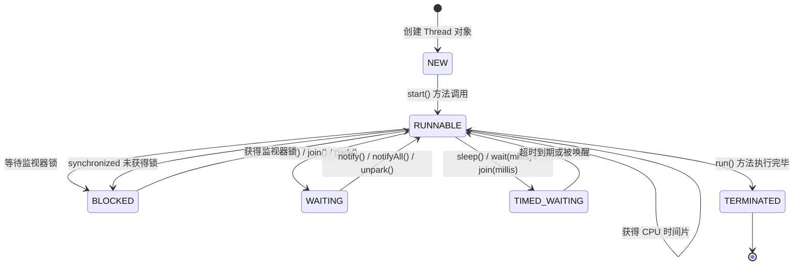

+++
title = "第30章 并发编程——同时做多件事"
weight = 300
date = "2026-03-30T14:33:56.913+08:00"
type = "docs"
description = ""
isCJKLanguage = true
draft = false
+++
# 第三十章 并发编程——同时做多件事

> 并发编程，是 Java 世界里最让人又爱又恨的东西。爱它，因为它能让程序"一心多用"，效率飞起；恨它，因为它一旦出问题，那调试起来简直比破案还刺激——线程 A 等着线程 B，线程 B 等着线程 C，而线程 C 居然在等着一个已经被删掉的锁。本章，让我们一起走进这个"多线程宇宙"，看看如何优雅地让程序同时做多件事，而不是一起"死给你看"。

---

## 30.1 线程的创建

### 什么是线程？

在正式"造线程"之前，我们先来聊聊线程（Thread）到底是什么。

**线程**是操作系统调度的最小单位。它存在于进程（Process）之中，一个进程可以包含多个线程。打个比方：进程就像一家公司，线程就是公司里的员工。每个员工都能独立执行任务，但他们共享公司的资源（内存、文件等）。

在 Java 中，线程是 `java.lang.Thread` 类的实例。我们有多种方式创建线程，且听我一一道来。

### 方式一：继承 Thread 类

这是最"直接粗暴"的方式——写一个类继承 `Thread`，然后重写 `run()` 方法。

```java
/**
 * 第一种创建线程的方式：继承 Thread 类
 * 简单直接，但缺点是 Java 是单继承的，
 * 继承了 Thread 就不能再继承其他类了
 */
public class MyThread extends Thread {

    @Override
    public void run() {
        // 线程要执行的代码写在这里
        // 注意：不是 run() 调用了线程，而是 start() 调用了 run()
        for (int i = 0; i < 5; i++) {
            System.out.println("子线程正在执行第 " + i + " 次 - " + Thread.currentThread().getName());
        }
    }

    public static void main(String[] args) {
        // 创建线程实例
        MyThread thread = new MyThread();
        // 启动线程（不是调用 run()！是调用 start()！）
        thread.start();

        // main 线程继续执行自己的任务
        for (int i = 0; i < 5; i++) {
            System.out.println("主线程（main）正在执行第 " + i + " 次");
        }
    }
}
```

**输出示例**（顺序可能每次都不一样，这就是"并发"的有趣之处）：

```
子线程正在执行第 0 次 - Thread-0
主线程（main）正在执行第 0 次
子线程正在执行第 1 次 - Thread-0
主线程（main）正在执行第 1 次
...
```

> 小贴士：一定要调用 `start()` 而不是直接调用 `run()`。`start()` 会启动一个新线程并让 JVM 调用 `run()`；如果直接调用 `run()`，那它就是一个普通方法调用，不会有新线程产生。

### 方式二：实现 Runnable 接口

这是更推荐的方式，因为 Java 支持多实现嘛。你可以实现多个接口，但只能继承一个类。

```java
/**
 * 第二种创建线程的方式：实现 Runnable 接口
 * 这是最常用的方式，灵活、不占用继承位置
 */
public class MyRunnable implements Runnable {

    @Override
    public void run() {
        // 同样是线程执行体
        for (int i = 0; i < 5; i++) {
            System.out.println("Runnable 线程执行中... " + i + " - " + Thread.currentThread().getName());
        }
    }

    public static void main(String[] args) {
        // 创建 Runnable 实现类实例
        MyRunnable myRunnable = new MyRunnable();
        // 将它交给 Thread 处理
        Thread thread = new Thread(myRunnable, "我的工作线程");
        thread.start();

        System.out.println("主线程继续干活...");
    }
}
```

### 方式三：实现 Callable 接口 + FutureTask

`Runnable` 的 `run()` 方法没有返回值，如果你的线程需要返回一个结果怎么办呢？这时候 `Callable` 就登场了。

```java
import java.util.concurrent.Callable;
import java.util.concurrent.FutureTask;

/**
 * 第三种创建线程的方式：实现 Callable 接口
 * Callable 的 call() 方法可以有返回值，还能抛出异常
 */
public class MyCallable implements Callable<Integer> {

    private final int start;
    private final int end;

    public MyCallable(int start, int end) {
        this.start = start;
        this.end = end;
    }

    @Override
    public Integer call() throws Exception {
        // 模拟计算任务：求和
        int sum = 0;
        for (int i = start; i <= end; i++) {
            sum += i;
        }
        System.out.println("线程计算完成，结果为: " + sum);
        return sum;
    }

    public static void main(String[] args) throws Exception {
        // 创建 Callable 任务
        MyCallable callable = new MyCallable(1, 100);
        // 用 FutureTask 包装，它实现了 Runnable，可以交给 Thread
        FutureTask<Integer> futureTask = new FutureTask<>(callable);
        // 启动线程
        new Thread(futureTask, "求和线程").start();

        // get() 会阻塞当前线程，直到得到返回值
        // （这是一个同步等待的过程，线程执行完才能拿到结果）
        Integer result = futureTask.get();
        System.out.println("最终结果: " + result);
    }
}
```

### 方式四：Lambda 表达式（Java 8+）

现代 Java 代码中，如果线程逻辑简单，很多人直接用 Lambda 表达式来写，简洁到令人发指：

```java
public class LambdaThreadDemo {
    public static void main(String[] args) {
        // 用 Lambda 直接写 Runnable，简洁优雅
        Thread thread = new Thread(() -> {
            for (int i = 0; i < 3; i++) {
                System.out.println("Lambda 线程运行中... " + i);
            }
        }, "LambdaThread");

        thread.start();

        // 主线程也干点活
        System.out.println("主线程继续执行");
    }
}
```

### 三种方式对比

| 方式 | 优点 | 缺点 |
|------|------|------|
| 继承 Thread | 简单直观 | Java 单继承，扩展性差 |
| 实现 Runnable | 灵活，可多实现 | 不能直接返回结果 |
| 实现 Callable | 能返回值、可抛异常 | 稍复杂，需要 FutureTask |

---

## 30.2 线程的状态与生命周期

### 线程的六种状态

Java 中，线程（`Thread.State` 枚举）有六种状态，理解它们是掌握并发编程的基础。

**NEW（新建）**：线程被创建了，但还没调用 `start()`。这时的线程就像一台还没出厂的电脑，零件都装好了，但还没按下电源键。

**RUNNABLE（可运行）**：调用了 `start()` 之后，线程进入可运行状态。这个状态包含了操作系统层面的"就绪"（Ready）和"运行"（Running）两种细分状态。JVM 把它们合并成了一个 RUNNABLE——具体是在 CPU 上跑还是等着被调度，那是操作系统的事，Java 不管那么细。

**BLOCKED（阻塞）**：线程试图获取一个被其他线程占用的**监视器锁**（monitor lock），就会进入阻塞状态。比如，线程 A 在 synchronized 代码块里，线程 B 想进同一个代码块，就得等着。

**WAITING（等待）**：线程调用了 `Object.wait()`、`Thread.join()`（不带超时）或 `LockSupport.park()` 等方法后会进入这个状态。这是一种"佛系"等待——不占用 CPU，但也不知道要等多久，等别人来叫醒。

**TIMED_WAITING（计时等待）**：和 WAITING 类似，但有个时限。比如 `Thread.sleep(millis)`、`Object.wait(millis)`、`Thread.join(millis)` 等。

**TERMINATED（终止）**：线程的 `run()` 方法正常执行完毕，或抛出了未捕获的异常，线程就进入了终止状态。这是一切结束后的"退休"状态。

### 线程生命周期图

下面用 Mermaid 图表展示线程的完整生命周期：



### 代码验证各状态

```java
/**
 * 验证线程各状态转换
 */
public class ThreadStateDemo {

    public static void main(String[] args) throws InterruptedException {
        Thread thread = new Thread(() -> {
            System.out.println("子线程状态: " + Thread.currentThread().getState());
            // 模拟一些工作
            try {
                Thread.sleep(1000);
            } catch (InterruptedException e) {
                e.printStackTrace();
            }
        }, "状态测试线程");

        System.out.println("线程启动前状态: " + thread.getState()); // NEW
        thread.start();
        System.out.println("线程启动后状态: " + thread.getState()); // RUNNABLE

        Thread.sleep(200);
        System.out.println("线程 sleep 时状态: " + thread.getState()); // TIMED_WAITING

        thread.join();
        System.out.println("线程结束后状态: " + thread.getState()); // TERMINATED
    }
}
```

> 记住：线程状态是 JVM 的概念，和操作系统的线程调度是两回事。RUNNABLE 不等于"正在 CPU 上跑"，它也可能只是"就绪队列里等着"。

---

## 30.3 线程同步

### 为什么需要同步？

想象一下：你和你的室友共享一个银行账户，里面有 1000 块钱。你们同时取钱——你取 500，室友取 500。如果没有任何同步机制，可能发生这种事：

1. 你查余额：1000（还没来得及减）
2. 室友查余额：1000（也还没来得及减）
3. 你取走 500，余额变成 500
4. 室友取走 500，余额变成 500

结果：你们总共取了 1000 块，但余额还剩 500。银行亏了 500。这种场景在多线程里叫**竞态条件（Race Condition）**。

### synchronized 关键字

`synchronized` 是 Java 提供的一种最基础的线程同步机制。它就像给代码块或方法上了一把锁，一次只允许一个线程进去"办事"。

#### 1. 同步方法

```java
/**
 * synchronized 实例方法
 * 锁对象是 this（即当前实例）
 * 一次只有一个线程能执行这个方法
 */
public class Counter {
    private int count = 0;

    public synchronized void increment() {
        count++;
        // 这里看似简单，但 count++ 并不是原子操作！
        // 它实际上是：读取 count → 加 1 → 写回 count
        // 三个步骤中任何一步被打断都会出问题
    }

    public synchronized int getCount() {
        return count;
    }

    public static void main(String[] args) throws InterruptedException {
        Counter counter = new Counter();

        // 创建 1000 个线程同时 increment
        Thread[] threads = new Thread[1000];
        for (int i = 0; i < 1000; i++) {
            threads[i] = new Thread(counter::increment);
            threads[i].start();
        }

        // 等待所有线程执行完毕
        for (Thread t : threads) {
            t.join();
        }

        System.out.println("最终计数: " + counter.getCount());
        // 理论上应该是 1000，如果没有 synchronized，可能就不是
    }
}
```

#### 2. 同步代码块

方法级别的同步粒度太粗，影响性能。我们可以用同步代码块来只锁定关键部分：

```java
public class BankAccount {
    private int balance = 1000;

    /**
     * 同步代码块：只锁定需要同步的部分
     * 锁对象可以是任意对象，推荐使用 private final 的锁对象
     */
    public void transfer(BankAccount target, int amount) {
        // 锁定当前账户
        synchronized (this) {
            // 锁定目标账户（避免死锁，后面会讲）
            synchronized (target) {
                if (balance >= amount) {
                    balance -= amount;
                    target.balance += amount;
                    System.out.println("转账完成，金额: " + amount);
                } else {
                    System.out.println("余额不足！");
                }
            }
        }
    }

    public int getBalance() {
        return balance;
    }
}
```

> 小贴士：同步代码块的锁对象要谨慎选择。如果锁定 `this`，可能造成不必要的阻塞；如果锁定外部对象，要确保锁对象的生命周期不会有问题。

#### 3. 静态 synchronized 方法

```java
public class StaticCounter {
    private static int count = 0;

    /**
     * 静态 synchronized 方法的锁对象是 Class 对象
     * 即 StaticCounter.class
     */
    public static synchronized void increment() {
        count++;
    }

    public static synchronized int getCount() {
        return count;
    }
}
```

### volatile 关键字

`volatile` 是另一个重要的关键字，但它不是用来做同步的，它是用来**保证可见性**的。

**可见性（Visibility）**：一个线程对共享变量的修改，能被其他线程及时看到。

```java
/**
 * volatile 确保变量的可见性
 * 每次读取都从主内存读取，不使用 CPU 缓存
 */
public class VolatileDemo extends Thread {
    // running 变量如果不用 volatile
    // 线程可能永远看不到主线程对它的修改（因为 CPU 缓存）
    volatile boolean running = true;

    @Override
    public void run() {
        System.out.println("线程开始执行...");
        while (running) {
            // 如果 running 是普通变量，这里可能永远不会退出
            // 因为线程一直读的是自己的缓存而不是主内存
        }
        System.out.println("线程被停止了");
    }

    public static void main(String[] args) throws InterruptedException {
        VolatileDemo demo = new VolatileDemo();
        demo.start();

        Thread.sleep(1000);
        demo.running = false; // 主线程修改了 running
        System.out.println("主线程已设置 running = false");
    }
}
```

> 注意：`volatile` 不保证原子性！`count++` 这样的复合操作，即使 count 是 volatile 的，也不能保证线程安全。

### synchronized vs volatile

| 特性 | synchronized | volatile |
|------|-------------|---------|
| 原子性 | 保证 | 不保证 |
| 可见性 | 保证 | 保证 |
| 性能 | 较重（会阻塞） | 轻量（直接读主存） |
| 使用场景 | 复合操作同步 | 单一变量读写 |

---

## 30.4 线程间的通信

线程之间不仅仅是竞争关系，有时候也需要"配合"。比如生产者生产了数据，消费者才能消费——这就是线程通信的典型场景。

### Object 的 wait/notify 机制

Java 中最传统的线程通信方式是 `Object` 类的 `wait()`、`notify()` 和 `notifyAll()` 方法。

- `wait()`：让当前线程进入等待状态，**释放锁**
- `notify()`：唤醒一个在该对象上等待的线程
- `notifyAll()`：唤醒所有在该对象上等待的线程

```java
import java.util.LinkedList;
import java.util.Queue;

/**
 * 经典的生产者-消费者问题
 * 使用 wait/notify 实现线程间通信
 */
public class ProducerConsumer {

    private static final int MAX_SIZE = 10;
    // 共享队列
    private static final Queue<Integer> queue = new LinkedList<>();

    /**
     * 生产者
     */
    static class Producer extends Thread {
        @Override
        public void run() {
            synchronized (queue) {
                for (int i = 0; i < 20; i++) {
                    while (queue.size() >= MAX_SIZE) {
                        // 队列满了，等待消费者消费
                        try {
                            System.out.println("队列满了，生产者等待...");
                            queue.wait(); // 释放锁，进入等待
                        } catch (InterruptedException e) {
                            e.printStackTrace();
                        }
                    }
                    queue.offer(i);
                    System.out.println("生产者生产了: " + i);
                    // 通知消费者可以消费了
                    queue.notify(); // 只会唤醒一个等待的线程
                }
            }
        }
    }

    /**
     * 消费者
     */
    static class Consumer extends Thread {
        @Override
        public void run() {
            synchronized (queue) {
                for (int i = 0; i < 20; i++) {
                    while (queue.isEmpty()) {
                        // 队列空了，等待生产者生产
                        try {
                            System.out.println("队列空了，消费者等待...");
                            queue.wait();
                        } catch (InterruptedException e) {
                            e.printStackTrace();
                        }
                    }
                    Integer value = queue.poll();
                    System.out.println("消费者消费了: " + value);
                    // 通知生产者可以继续生产了
                    queue.notify();
                }
            }
        }
    }

    public static void main(String[] args) {
        new Producer().start();
        new Consumer().start();
    }
}
```

> 重要提示：`wait()`、`notify()`、`notifyAll()` 必须在 `synchronized` 代码块内部调用，否则会抛出 `IllegalMonitorStateException`！

### Condition 接口

`java.util.concurrent.locks.Condition` 是 Lock 锁的"豪华升级版"条件变量。相比 `Object` 的 wait/notify，Condition 更加灵活——一个 Lock 可以创建多个条件condition。

```java
import java.util.concurrent.locks.Condition;
import java.util.concurrent.locks.Lock;
import java.util.concurrent.locks.ReentrantLock;

/**
 * 使用 ReentrantLock + Condition 实现线程通信
 * 比 synchronized + wait/notify 更灵活
 */
public class ConditionDemo {
    private static final int MAX_SIZE = 10;
    private static final Lock lock = new ReentrantLock();
    // 创建两个条件变量：一个用于非满，一个用于非空
    private static final Condition notFull = lock.newCondition();
    private static final Condition notEmpty = lock.newCondition();

    private static final java.util.Queue<Integer> queue = new java.util.LinkedList<>();

    static class Producer extends Thread {
        @Override
        public void run() {
            lock.lock(); // 获取锁
            try {
                for (int i = 0; i < 20; i++) {
                    while (queue.size() >= MAX_SIZE) {
                        notFull.await(); // 等待直到不满
                    }
                    queue.offer(i);
                    System.out.println("生产者生产: " + i);
                    notEmpty.signal(); // 唤醒等待非空的线程
                }
            } catch (InterruptedException e) {
                e.printStackTrace();
            } finally {
                lock.unlock();
            }
        }
    }

    static class Consumer extends Thread {
        @Override
        public void run() {
            lock.lock();
            try {
                for (int i = 0; i < 20; i++) {
                    while (queue.isEmpty()) {
                        notEmpty.await(); // 等待直到非空
                    }
                    Integer value = queue.poll();
                    System.out.println("消费者消费: " + value);
                    notFull.signal(); // 唤醒等待非满的线程
                }
            } catch (InterruptedException e) {
                e.printStackTrace();
            } finally {
                lock.unlock();
            }
        }
    }

    public static void main(String[] args) {
        new Producer().start();
        new Consumer().start();
    }
}
```

---

## 30.5 死锁

### 什么是死锁？

死锁（Deadlock）是并发编程中最令人头疼的问题之一。想象这样一个场景：

- 线程 A 持有锁 X，等待锁 Y
- 线程 B 持有锁 Y，等待锁 X

这时候，A 等 B 释放 Y，B 等 A 释放 X，谁也不肯让步，程序就这么卡死了。

### 死锁的四个必要条件

1. **互斥条件**：资源一次只能被一个线程持有
2. **持有并等待**：线程持有资源的同时还等待其他资源
3. **不可抢占**：资源不能被强制从一个线程夺走
4. **循环等待**：存在一个循环链，让线程们互相等待

只要破坏其中一个条件，就能避免死锁。

### 死锁示例

```java
/**
 * 演示死锁
 */
public class DeadlockDemo {

    // 两把锁
    private static final Object lockA = new Object();
    private static final Object lockB = new Object();

    static class ThreadA extends Thread {
        @Override
        public void run() {
            System.out.println("线程 A 尝试获取锁 A...");
            synchronized (lockA) {
                System.out.println("线程 A 获得了锁 A");
                // 模拟一些操作
                try {
                    Thread.sleep(100);
                } catch (InterruptedException e) {}

                System.out.println("线程 A 尝试获取锁 B...");
                synchronized (lockB) {
                    System.out.println("线程 A 获得了锁 B！");
                }
                System.out.println("线程 A 释放锁 B");
            }
            System.out.println("线程 A 释放锁 A");
        }
    }

    static class ThreadB extends Thread {
        @Override
        public void run() {
            // 注意：这里先拿 B 再拿 A，和线程 A 顺序相反！
            System.out.println("线程 B 尝试获取锁 B...");
            synchronized (lockB) {
                System.out.println("线程 B 获得了锁 B");
                try {
                    Thread.sleep(100);
                } catch (InterruptedException e) {}

                System.out.println("线程 B 尝试获取锁 A...");
                synchronized (lockA) {
                    System.out.println("线程 B 获得了锁 A！");
                }
                System.out.println("线程 B 释放锁 A");
            }
            System.out.println("线程 B 释放锁 B");
        }
    }

    public static void main(String[] args) {
        new ThreadA().start();
        new ThreadB().start();
        // 运行后，你会发现程序卡住了，因为死锁了
    }
}
```

### 如何避免死锁？

**方法一：固定加锁顺序**
所有线程都以相同的顺序获取锁。上面的例子中，如果两个线程都先拿 A 再拿 B，就不会有死锁。

**方法二：使用 tryLock 并设置超时**

```java
import java.util.concurrent.TimeUnit;
import java.util.concurrent.locks.ReentrantLock;

/**
 * 使用 tryLock 避免死锁：尝试获取锁，如果超时就放弃
 */
public class TryLockAvoidDeadlock {

    private static final ReentrantLock lockA = new ReentrantLock();
    private static final ReentrantLock lockB = new ReentrantLock();

    static void doWork() {
        // 不断的重试逻辑
    }

    static class ThreadA extends Thread {
        private final ReentrantLock firstLock;
        private final ReentrantLock secondLock;

        ThreadA(ReentrantLock firstLock, ReentrantLock secondLock) {
            this.firstLock = firstLock;
            this.secondLock = secondLock;
        }

        @Override
        public void run() {
            while (true) {
                try {
                    // 尝试获取第一个锁，超时 1 秒
                    if (firstLock.tryLock(1, TimeUnit.SECONDS)) {
                        System.out.println("线程 A 获得了第一个锁");
                        // 尝试获取第二个锁，超时 1 秒
                        if (secondLock.tryLock(1, TimeUnit.SECONDS)) {
                            System.out.println("线程 A 获得了两个锁，工作完成");
                            secondLock.unlock();
                            firstLock.unlock();
                            break; // 成功，退出循环
                        } else {
                            System.out.println("线程 A 没能获得第二个锁，释放第一个锁，重试");
                            firstLock.unlock();
                        }
                    }
                    Thread.sleep(100); // 重试前稍作休息
                } catch (InterruptedException e) {
                    e.printStackTrace();
                }
            }
        }
    }

    public static void main(String[] args) {
        new ThreadA(lockA, lockB).start();
        new ThreadA(lockB, lockA).start(); // 顺序相反，但不会死锁
    }
}
```

---

## 30.6 JUC 并发工具类

Java 并发工具类（`java.util.concurrent`，简称 JUC）是 Java 应对并发编程的"军火库"。这里我们介绍几个最常用也最好用的工具。

### CountDownLatch（倒计时门闩）

**CountDownLatch** 允许一个或多个线程等待其他线程完成操作。你可以把它理解为一个"计数器"，每完成一个任务就减 1，等到计数器归零，等待的线程就开始执行。

```java
import java.util.concurrent.CountDownLatch;

/**
 * CountDownLatch 示例：模拟运动员起跑
 * 主线程（裁判）等待所有运动员（线程）准备就绪
 */
public class CountDownLatchDemo {

    // 5 个运动员
    private static final int PLAYER_COUNT = 5;
    // 裁判拿着一个倒计时器
    private static final CountDownLatch startSignal = new CountDownLatch(1); // 起始信号
    private static final CountDownLatch doneSignal = new CountDownLatch(PLAYER_COUNT); // 完成信号

    static class Athlete extends Thread {
        private final String name;

        Athlete(String name) {
            this.name = name;
        }

        @Override
        public void run() {
            try {
                // 等待裁判发令
                System.out.println(name + " 正在热身...");
                startSignal.await(); // 阻塞在这里

                // 收到发令，开始跑
                System.out.println(name + " 开跑了！");
                Thread.sleep((long) (Math.random() * 2000)); // 模拟跑步
                System.out.println(name + " 冲过终点线！");

            } catch (InterruptedException e) {
                e.printStackTrace();
            } finally {
                // 跑完了，计数器减 1
                doneSignal.countDown();
            }
        }
    }

    public static void main(String[] args) throws InterruptedException {
        // 创建并启动所有运动员线程
        for (int i = 1; i <= PLAYER_COUNT; i++) {
            new Athlete("运动员 #" + i).start();
        }

        System.out.println("裁判：各就各位...");
        Thread.sleep(1000);
        System.out.println("裁判：预备——砰！");
        startSignal.countDown(); // 发射起始信号，所有运动员同时开始

        // 裁判等待所有运动员冲线
        doneSignal.await();
        System.out.println("裁判：所有运动员都完赛了，比赛结束！");
    }
}
```

### CyclicBarrier（循环栅栏）

**CyclicBarrier** 和 CountDownLatch 有些相反的意思。它让一组线程互相等待，直到所有人都到达某个"屏障点"后，再一起继续执行。而且这个屏障是可以循环使用的。

```java
import java.util.concurrent.CyclicBarrier;

/**
 * CyclicBarrier 示例：模拟多人组队副本
 * 所有玩家必须都到达副本门口才能进入
 */
public class CyclicBarrierDemo {

    private static final int TEAM_SIZE = 4;
    // 当 4 个玩家都到达后，执行这个任务（进入副本）
    private static final CyclicBarrier barrier = new CyclicBarrier(TEAM_SIZE, () -> {
        System.out.println("=== 所有玩家就位，副本大门打开了！ ===");
    });

    static class Player extends Thread {
        private final String name;

        Player(String name) {
            this.name = name;
        }

        @Override
        public void run() {
            try {
                // 模拟玩家从不同地方赶来
                int travelTime = (int) (Math.random() * 3000) + 1000;
                Thread.sleep(travelTime);
                System.out.println(name + " 到达副本门口（路上花了 " + travelTime + "ms）");

                // 等待其他玩家
                barrier.await();
                // 所有玩家都到了，继续执行（进入副本）

                System.out.println(name + " 进入副本开始战斗！");

            } catch (Exception e) {
                e.printStackTrace();
            }
        }
    }

    public static void main(String[] args) {
        System.out.println("组队副本开始！等待 " + TEAM_SIZE + " 名玩家...");
        for (int i = 1; i <= TEAM_SIZE; i++) {
            new Player("玩家-" + i).start();
        }

        // 第一个副本结束后，屏障可以循环使用
        // 如果还有下一波玩家，可以继续用同一个 barrier
    }
}
```

### Semaphore（信号量）

**Semaphore** 用于控制同时访问某个资源的线程数量。你可以把它理解为一个"许可证管理器"，比如只有 3 个停车位，外面想停的车必须先拿到许可证。

```java
import java.util.concurrent.Semaphore;

/**
 * Semaphore 示例：模拟停车场
 * 只有 3 个停车位，但有 8 辆车想停
 */
public class SemaphoreDemo {

    private static final int PARKING_SPOTS = 3; // 停车位数量
    private static final int CAR_COUNT = 8; // 车辆数量
    private static final Semaphore semaphore = new Semaphore(PARKING_SPOTS, true);
    // fair = true 保证公平：先来的先获得许可

    static class Car extends Thread {
        private final String carId;

        Car(String carId) {
            this.carId = carId;
        }

        @Override
        public void run() {
            try {
                System.out.println(carId + " 来到停车场，寻找车位...");
                // 获取许可证（停车位），如果没有就等待
                semaphore.acquire();
                System.out.println(carId + " 停进了车位");

                // 模拟停车时间
                int parkTime = (int) (Math.random() * 5000) + 2000;
                Thread.sleep(parkTime);
                System.out.println(carId + " 停了 " + parkTime + "ms 后离开");

            } catch (InterruptedException e) {
                e.printStackTrace();
            } finally {
                // 离开时释放许可证
                semaphore.release();
            }
        }
    }

    public static void main(String[] args) {
        for (int i = 1; i <= CAR_COUNT; i++) {
            new Car("车辆 #" + i).start();
        }
    }
}
```

### Exchanger（交换器）

**Exchanger** 用于两个线程之间交换数据。拿着它，就像两个人遇到了一个"数据交换站"，A 给出数据，换回 B 的数据。

```java
import java.util.concurrent.Exchanger;

/**
 * Exchanger 示例：模拟甲乙双方交换情报
 */
public class ExchangerDemo {

    private static final Exchanger<String> exchanger = new Exchanger<>();

    static class AgentA extends Thread {
        @Override
        public void run() {
            try {
                String secretA = "A 的绝密情报：Java 很牛！";
                System.out.println("A 准备好了情报：" + secretA);

                // 等待和 B 交换
                String received = exchanger.exchange(secretA);
                System.out.println("A 收到了 B 的情报：" + received);

            } catch (InterruptedException e) {
                e.printStackTrace();
            }
        }
    }

    static class AgentB extends Thread {
        @Override
        public void run() {
            try {
                String secretB = "B 的绝密情报：并发很有趣！";
                System.out.println("B 准备好了情报：" + secretB);

                // 等待和 A 交换
                String received = exchanger.exchange(secretB);
                System.out.println("B 收到了 A 的情报：" + received);

            } catch (InterruptedException e) {
                e.printStackTrace();
            }
        }
    }

    public static void main(String[] args) {
        new AgentA().start();
        new AgentB().start();
    }
}
```

---

## 30.7 线程池

### 为什么要用线程池？

我们之前都是"即用即建"线程——需要线程就 `new Thread()`，用完就扔掉。这在任务量少的时候没问题，但如果任务量很大呢？

想象一个场景：每秒钟有 1000 个请求，每个请求都创建一个新线程。那一秒钟就要创建 1000 个线程，CPU 光在创建和销毁线程上就累死了。

**线程池**就是为了解决这个问题。它预先创建好一批线程，要用时从池子里取，用完再放回去，而不是每次都重新创建。

### 核心概念

- **核心线程数（corePoolSize）**：池子里一直保持的最小线程数量
- **最大线程数（maximumPoolSize）**：池子里最多能有的线程数量
- **空闲时间（keepAliveTime）**：超过核心线程数的线程，空闲多久后会被回收
- **工作队列（workQueue）**：来不及处理的任务先放队列里

### Executors 工具类

`java.util.concurrent.Executors` 提供了一些工厂方法来创建线程池：

```java
import java.util.concurrent.ExecutorService;
import java.util.concurrent.Executors;

/**
 * Executors 提供的几种线程池
 */
public class ExecutorDemo {

    public static void main(String[] args) {
        // 1. 固定大小线程池：线程数量固定，任务再多也就这些线程轮着处理
        ExecutorService fixedPool = Executors.newFixedThreadPool(4);

        // 2. 单线程池：只有一个线程，任务按顺序执行
        ExecutorService singlePool = Executors.newSingleThreadExecutor();

        // 3. 缓存线程池：线程数量可变，任务多就多创建，少了就回收
        ExecutorService cachedPool = Executors.newCachedThreadPool();

        // 4. 调度线程池：支持延迟或周期性任务
        java.util.concurrent.ScheduledExecutorService scheduledPool =
                Executors.newScheduledThreadPool(2);

        // 用完记得关闭
        fixedPool.shutdown();
        singlePool.shutdown();
        cachedPool.shutdown();
        scheduledPool.shutdown();
    }
}
```

> 警告：在生产环境中，`Executors.newFixedThreadPool()` 和 `Executors.newCachedThreadPool()` 使用的无界队列可能导致 OOM（内存溢出）。更推荐使用 `new ThreadPoolExecutor()` 手动配置参数。

### ThreadPoolExecutor 详解

```java
import java.util.concurrent.ArrayBlockingQueue;
import java.util.concurrent.ThreadPoolExecutor;
import java.util.concurrent.TimeUnit;

/**
 * 手写 ThreadPoolExecutor 配置
 */
public class ThreadPoolExecutorDemo {

    public static void main(String[] args) {
        // 创建一个自定义的线程池
        ThreadPoolExecutor executor = new ThreadPoolExecutor(
            4,              // corePoolSize: 核心线程数
            8,              // maximumPoolSize: 最大线程数
            60L,            // keepAliveTime: 空闲线程存活时间
            TimeUnit.SECONDS,
            new ArrayBlockingQueue<>(100), // 有界队列，容量 100
            // 拒绝策略：队列满了，新任务来时的处理方式
            new ThreadPoolExecutor.CallerRunsPolicy()
        );

        // 提交 20 个任务
        for (int i = 1; i <= 20; i++) {
            final int taskId = i;
            executor.submit(() -> {
                System.out.println("任务 " + taskId + " 正在由 "
                    + Thread.currentThread().getName() + " 执行");
                try {
                    Thread.sleep(1000); // 模拟任务执行
                } catch (InterruptedException e) {}
            });
        }

        // 优雅关闭
        executor.shutdown();
    }
}
```

### 四种拒绝策略

当线程池和工作队列都满了，新任务到来时的处理策略：

| 策略 | 行为 |
|------|------|
| `AbortPolicy`（默认） | 抛 `RejectedExecutionException` |
| `CallerRunsPolicy` | 由提交任务的线程自己执行 |
| `DiscardPolicy` | 直接丢弃新任务 |
| `DiscardOldestPolicy` | 丢弃队列中最旧的任务，再尝试接受新任务 |

---

## 30.8 虚拟线程（Virtual Threads，Java 21+）

### 什么是虚拟线程？

这是 Java 21 引入的最激动人心的特性！虚拟线程（Virtual Threads）是 JDK 实现的轻量级线程，由 JVM 管理，而不是由操作系统管理。

普通线程（平台线程）是对操作系统线程的 1:1 映射，每个平台线程都要占用约 1MB 的栈内存。而虚拟线程非常轻量，占用内存极小（几百字节到几 KB），可以创建数十万个。

### 为什么要引入虚拟线程？

Java 传统的同步阻塞 I/O 模型中，当线程等待 I/O（如网络请求）时，线程会阻塞，系统却无法切换到其他任务。这意味着每个并发请求都需要一个独立的线程，成本很高。

虚拟线程的出现，让 Java 可以用很少的资源处理大量并发任务，而且是**用同步的方式写代码**，获得异步的性能。

### 创建虚拟线程

```java
/**
 * 创建虚拟线程的三种方式
 */
public class VirtualThreadDemo {

    public static void main(String[] args) throws InterruptedException {

        // 方式一：Thread.ofVirtual() 工厂方法（Java 21+）
        Thread virtualThread1 = Thread.ofVirtual().name("MyVirtual-1").start(() -> {
            System.out.println("虚拟线程运行中: " + Thread.currentThread());
        });

        // 方式二：Thread.startVirtualThread() 快捷方法
        Thread virtualThread2 = Thread.startVirtualThread(() -> {
            System.out.println("另一个虚拟线程: " + Thread.currentThread());
        });

        // 方式三：通过 ThreadFactory
        ThreadFactory factory = Thread.ofVirtual().name("FactoryVirtual-", 0).factory();
        Thread virtualThread3 = factory.newThread(() -> {
            System.out.println("通过工厂创建的虚拟线程: " + Thread.currentThread());
        });
        virtualThread3.start();

        // 等待所有虚拟线程完成
        virtualThread1.join();
        virtualThread2.join();

        System.out.println("\n=== 虚拟线程 vs 平台线程 ===");
        System.out.println("虚拟线程: " + Thread.currentThread().isVirtual()); // false（主线程是平台线程）

        // 创建一个虚拟线程来验证
        Thread vt = Thread.startVirtualThread(() -> {
            System.out.println("当前线程是虚拟线程: " + Thread.currentThread().isVirtual());
        });
        vt.join();
    }
}
```

### 虚拟线程与线程池的关系

> 重要提醒：**不要把虚拟线程放进线程池里！**

这是使用虚拟线程最重要的一条规则。虚拟线程设计为"用完即弃"，它们是廉价的，不需要复用。如果把虚拟线程放进线程池，它会永远停留在 `WAITING` 状态，无法被回收。

```java
/**
 * 虚拟线程的错误用法 vs 正确用法
 */
public class VirtualThreadPoolMistake {

    public static void main(String[] args) throws Exception {

        // 错误示例：把虚拟线程放进线程池（千万不要这样做！）
        ExecutorService badPool = Executors.newFixedThreadPool(10);
        // 这样会导致虚拟线程永远阻塞在池中，无法释放

        // 正确示例：直接创建虚拟线程处理请求
        // 每个请求一个虚拟线程，无需池化
        try (ExecutorService executor = Executors.newVirtualThreadPerTaskExecutor()) {
            for (int i = 1; i <= 100; i++) {
                final int requestId = i;
                executor.submit(() -> {
                    System.out.println("处理请求 #" + requestId
                        + " - 线程: " + Thread.currentThread().getName());
                    // 模拟 I/O 操作
                    try {
                        Thread.sleep(Duration.ofMillis(100));
                    } catch (InterruptedException e) {}
                });
            }
        } // 自动关闭

        System.out.println("所有请求处理完毕！");
    }
}
```

### 虚拟线程的挂起与恢复

虚拟线程之所以轻量，是因为它们的栈不是预分配的，而是在需要时动态增长的，并且可以**挂起（park）**和**恢复（unpark）**。

当虚拟线程执行阻塞操作（如 `Thread.sleep()`、`LockSupport.park()`、I/O 操作）时，JVM 会自动挂起这个虚拟线程，释放底层平台线程去执行其他虚拟线程。当阻塞结束后，JVM 会恢复这个虚拟线程继续执行。

```java
/**
 * 演示虚拟线程的挂起特性
 */
public class VirtualThreadParkDemo {

    public static void main(String[] args) throws Exception {
        System.out.println("主线程: " + Thread.currentThread());

        // 创建大量虚拟线程，每个都进行 sleep
        try (ExecutorService executor = Executors.newVirtualThreadPerTaskExecutor()) {
            for (int i = 1; i <= 20; i++) {
                final int id = i;
                executor.submit(() -> {
                    System.out.println("虚拟线程 #" + id + " 开始 sleep - "
                        + Thread.currentThread().getName());
                    try {
                        Thread.sleep(Duration.ofSeconds(2));
                    } catch (InterruptedException e) {}
                    System.out.println("虚拟线程 #" + id + " 睡醒了！");
                });
            }
        }

        System.out.println("所有虚拟线程的 sleep 任务已提交完毕！");
    }
}
```

### 虚拟线程的限制

- **不能使用 `ThreadLocal` 的大量数据**：虚拟线程数量极多，每个都保留一份 `ThreadLocal` 副本会消耗大量内存
- **不能使用线程局部变量池化**：线程池的思路不适合虚拟线程
- **调试时注意**：虚拟线程的堆栈是动态的，调试信息可能不如平台线程清晰

---

## 本章小结

本章我们系统地学习了 Java 并发编程的核心知识：

1. **线程创建**：通过继承 `Thread`、实现 `Runnable` 或 `Callable` 接口创建线程，推荐使用 `Runnable` 或 `Callable`
2. **线程状态**：NEW → RUNNABLE → BLOCKED/WAITING/TIMED_WAITING → TERMINATED，理解状态转换是调试多线程问题的前提
3. **线程同步**：`synchronized` 保证原子性和可见性，`volatile` 只保证可见性，两者各有适用场景
4. **线程通信**：`wait/notify` 是最基础的方式，`Condition` 提供了更灵活的选择
5. **死锁**：四个必要条件（互斥、持有并等待、不可抢占、循环等待），通过固定加锁顺序或 `tryLock` 避免
6. **JUC 工具类**：`CountDownLatch` 倒数、`CyclicBarrier` 集合点、`Semaphore` 限流、`Exchanger` 数据交换
7. **线程池**：避免频繁创建销毁线程的开销，使用 `ThreadPoolExecutor` 精细控制，拒绝策略保护系统
8. **虚拟线程**：Java 21+ 的革命性特性，用同步代码获得异步性能，但不能池化使用

> 并发编程是一门艺术，也是一场与"不确定性"的博弈。掌握了这些工具，你就能在多线程的世界里游刃有余——让你的程序同时做多件事，而且做得稳稳当当、不会"撞车"。
