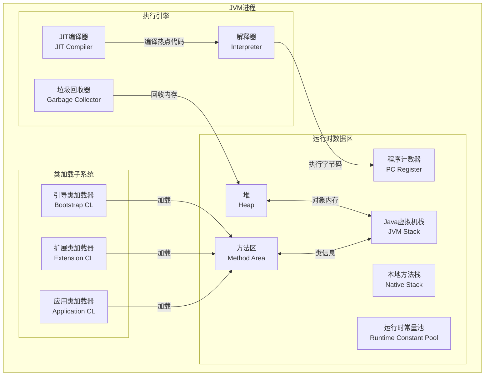
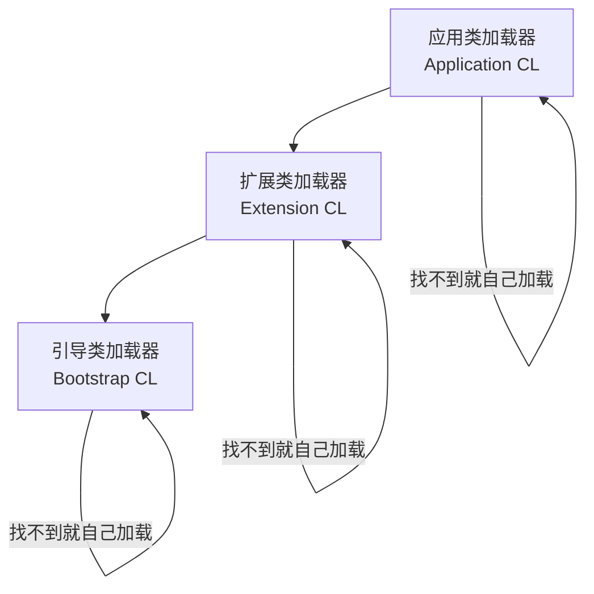

+++
title = "第31章 JVM 虚拟机——Java 的运行秘境"
weight = 310
date = "2026-03-30T14:33:56.915+08:00"
type = "docs"
description = ""
isCJKLanguage = true
draft = false
+++
# 第三十一章 JVM 虚拟机——Java 的运行秘境

> 你写的 Java 代码，是怎么跑起来的？编译器把它编译成 `.class` 文件之后，谁来真正执行？答案就是 JVM——Java 虚拟机。它就像是 Java 程序的神秘后台，一个藏在屏幕背后的超级引擎，默默地为你处理一切。本章我们就来揭开它的神秘面纱，看看这个"虚拟"的机器到底长什么样，又是如何运转的。

## 31.1 JVM 的组成结构

JVM（Java Virtual Machine，Java 虚拟机）是 Java 程序运行的核心环境。它并不是一个真实的物理机器，而是一个基于规范的软件实现——你可以把它理解为一个"假的"计算机，但这个假计算机能跑真代码。很神奇对吧？

JVM 的整体结构可以分成**类加载子系统**、**运行时数据区**、**执行引擎**三大部分。下面用一张图先来看看全貌：



### 运行时数据区——JVM 的内存版图

运行时数据区是 JVM 运行时最重要的地盘，它管理着 Java 程序运行时的所有数据。我们一个一个来认识：

**程序计数器（PC Register）**

这是一块非常小但极其重要的内存区域。每个线程都有自己的程序计数器，用来记录当前线程正在执行的**字节码指令地址**。如果当前执行的是 native 方法（本地方法，比如调用 C/C++ 代码），那么程序计数器的值为 undefined。

为什么需要它？因为 Java 支持多线程，CPU 在不同线程之间切换时，需要记住每个线程执行到哪一步。程序计数器就是那个"书签"。

**Java 虚拟机栈（JVM Stack）**

也叫**栈内存**，每个线程独有。它存储的是**栈帧（Stack Frame）**，每调用一个方法，就会在栈上创建一个栈帧。栈帧里包含了：

- 局部变量表（方法中定义的局部变量）
- 操作数栈（计算过程中的临时数据）
- 动态链接（指向常量池中该方法的符号引用）
- 方法返回地址

栈的特点是**先进后出**（LIFO），就像叠盘子。方法调用就是"往上叠盘子"，方法返回就是"把盘子拿走"。

如果一个方法递归调用太深（比如写了个无限递归），栈会爆掉——这就是经典的 `StackOverflowError`。

**本地方法栈（Native Stack）**

当 Java 代码调用 native 方法（比如 `Object.hashCode()` 的底层实现）时，用的就是本地方法栈。它的原理和 JVM 栈类似，只是服务的对象是 native 方法。有些 JVM（比如 HotSpot）甚至把 JVM 栈和本地方法栈合并实现了。

**堆（Heap）**

这是 JVM 中**最大的一块内存区域**，也是垃圾回收器的主要工作区。所有通过 `new` 关键字创建的对象实例都存放在堆里。堆是被所有线程共享的，所以需要注意线程安全问题。

堆可以进一步细分为新生代（Young Generation）和老年代（Old Generation），新生代又包含 Eden 区和两个 Survivor 区。关于堆的更多细节，我们会在 31.3 节深入讨论。

**方法区（Method Area）**

方法区存储的是**类的元数据**——类的结构信息（比如字段、方法、构造函数）、运行时常量池、静态变量、JIT 编译后的代码等。

在 JDK 8 之前，方法区是用"永久代"（PermGen）实现的，这个设计有很多坑。从 **JDK 8 开始，永久代被移除，改用本地内存中的"元空间"（Metaspace）** 来实现方法区。两者效果类似，但元空间不在堆内，受本地内存限制，配置更灵活。

**运行时常量池（Runtime Constant Pool）**

这是方法区的一部分，存放的是**编译期生成的字面量和符号引用**。比如字符串常量、final 常量、以及对类和方法的符号引用都在这里。运行时常量池一个重要的特点是**动态性**——不仅在编译时生成，运行期间也可以将新的常量放入池中（比如 `String.intern()` 方法）。

### 执行引擎——字节码的翻译官

字节码（`.class` 文件）被加载到 JVM 后，执行引擎负责把这些字节码翻译成机器指令。执行引擎主要有两种工作模式：

- **解释器（Interpreter）**：逐行解释执行字节码。启动快，但执行慢。就像同声传译，一边听一边翻，翻译质量跟不上思维速度。
- **JIT 编译器（Just-In-Time Compiler）**：把热点代码（执行频率高的代码）编译成机器码，缓存起来，下次直接执行。经过 JIT 编译后的代码执行速度可以接近原生程序。就像先把演讲稿翻译好，背下来，再演讲时直接脱稿。

HotSpot VM 默认采用**解释+JIT 混合模式**：先用解释器快速启动，遇到热点代码再用 JIT 编译优化。

### 垃圾回收器——JVM 的清洁工

GC（Garbage Collector）是执行引擎的一部分，负责自动回收不再使用的内存。关于它我们会在 31.4 节专门讲解，这里先认识一下它的位置。

---

## 31.2 类加载过程

Java 程序启动时，第一件事不是执行 `main` 方法，而是**类加载**。JVM 必须先把 `.class` 文件读进来，转换成内存中的 Class 对象，这个过程就叫"类加载"。

类加载的过程分为**五个阶段**：

### 加载（Loading）

这一阶段 JVM 需要完成三件事：

1. 通过类的全限定名（包名 + 类名，如 `java.lang.String`）找到 `.class` 文件
2. 读取字节流，转换成方法区的运行时数据结构
3. 在堆中生成一个 `java.lang.Class` 对象，作为方法区数据的访问入口

加载的方式可以是文件系统、网络、数据库、甚至动态生成（反射、代理）。

### 验证（Verification）

.class 文件虽然是你写的 Java 源码编译来的，但它是可被篡改的！JVM 必须验证这个文件是否符合 JVM 规范，否则可能会引发安全问题。

验证内容包括：

- 文件结构验证：魔数（0xCAFEBABE）、版本号、主次版本号
- 字节码验证：通过 `StackMapTable` 验证指令的合法性
- 符号引用验证：检查引用的类、方法、字段是否存在

这个阶段就像机场安检，不合格的东西不让上飞机。

### 准备（Preparation）

正式为**类变量**（static 修饰的变量）分配内存，并设置默认初始值。注意！这里说的是**默认值**，不是代码里写的初始值！

```java
public class Student {
    // 在准备阶段，name 为 null（引用类型默认值）
    // 在准备阶段，age 为 0（int 默认值）
    // 只有到初始化阶段，才会变成你写的 "张三" 和 18
    public static String name = "张三";
    public static int age = 18;
    public static final int LEVEL = 3;  // 常量，在准备阶段直接初始化为 3
}
```

这里特别要注意 **static final** 的区别——它是编译期常量，在准备阶段就会直接赋值，而不是等到初始化阶段。

### 解析（Resolution）

将**符号引用**替换为**直接引用**的过程。

- **符号引用**：用字符串描述一个引用目标，比如 `java.lang.String`，不限定于具体内存地址
- **直接引用**：指针或者偏移量，指向目标在内存中的实际地址

解析可以在类加载时进行，也可以在使用到这个引用的时候再进行（延迟解析）。

### 初始化（Initialization）

这是类加载过程的最后一步，也是真正执行**类构造器 `<clinit>`** 的阶段。`<clinit>` 是由编译器自动收集所有**类变量的赋值动作**和**静态代码块**合并生成的。

```java
public class InitDemo {
    // 这段代码在 <clinit> 中执行
    public static String name = "初始化中...";  // 赋值动作

    static {
        // 静态代码块，也在 <clinit> 中执行
        System.out.println("静态代码块执行了！");
    }

    public static void main(String[] args) {
        // 到这里，类加载已经完成，输出：
        // 静态代码块执行了！
        // 初始化中...
        System.out.println(name);
    }
}
```

类加载的时机不是随意的，JVM 规范定义了**主动使用**和**被动使用**的区别。只有主动使用时才会触发类加载：

- 创建类的实例
- 调用类的静态方法
- 访问类的静态字段（final 常量除外）
- 反射 `Class.forName()`
- 启动类（包含 `main()` 方法的类）

### 双亲委派模型——类加载器的层级关系

Java 有三类内置类加载器：

| 类加载器 | 负责加载 | 说明 |
|---|---|---|
| **引导类加载器**（Bootstrap ClassLoader） | 核心 Java 类库（`java.lang.*` 等） | 用 C/C++ 实现，是 JVM 的一部分 |
| **扩展类加载器**（Extension ClassLoader） | `jre/lib/ext` 目录下的类 | Java 实现 |
| **应用类加载器**（Application ClassLoader） | classpath 下的类（你写的代码） | Java 实现，也叫系统类加载器 |

它们之间的组织关系叫**双亲委派模型（Parent Delegation Model）**：



工作流程：当要加载一个类时，先逐层向上委托给父类加载器处理，只有父加载器找不到时才由自己加载。这保证了 Java 核心类库的安全性——比如你不能写一个 `java.lang.String` 类来替换 JDK 原版的（因为引导类加载器会先加载）。

---

## 31.3 堆内存

堆（Heap）是 JVM 管理的最大一块内存区域，也是**垃圾回收的主要战场**。所有通过 `new` 创建的对象都存在这里，包括数组。

### 堆内存的分代结构

HotSpot VM 将堆分为**新生代（Young Generation）** 和**老年代（Old Generation）** 两部分：

```
┌─────────────────────────────────────────┐
│                   堆内存                   │
│  ┌───────────────┬─────────────────────┐ │
│  │   新生代        │       老年代         │ │
│  │  (Young Gen)  │    (Old/Tenured)   │ │
│  │               │                     │ │
│  │ ┌───┬───┬───┐ │                     │ │
│  │ │Eden│S0 │S1 │ │                     │ │
│  │ │   │Sur│Sur│ │                     │ │
│  │ │   │viv│viv│ │                     │ │
│  │ └───┴───┴───┘ │                     │ │
│  │  8     1    1 │        10           │ │
│  └───────────────┴─────────────────────┘ │
└─────────────────────────────────────────┘
```

**新生代**（默认占总堆的 1/3）又分为：
- **Eden 区**：新对象刚创建时分配的地方（占 8/10）
- **Survivor 区**（S0 和 S1，各占 1/10）：用于存放在 Eden 区经历过 Minor GC 后仍然存活的对象

**老年代**（默认占总堆的 2/3）用于存放大对象或长期存活的对象。

### 分代的工作原理

**Minor GC（新生代 GC）**：频率高，回收速度快。当 Eden 区满了，触发 Minor GC，把存活的对象复制到 Survivor 区，并标记年龄（熬过一次 GC，年龄 +1）。对象年龄达到阈值（默认 15）后晋升到老年代。

**Major GC / Full GC**：老年代空间不足时触发。频率低，但回收慢，会触发全堆回收甚至"Stop-The-World"（STW）——暂停所有应用线程。

### 对象分配与晋升流程

```java
public class ObjectLifecycle {
    public static void main(String[] args) {
        // 对象分配在 Eden 区
        Object obj = new Object();

        // 大量创建对象测试分代
        for (int i = 0; i < 10000; i++) {
            byte[] bytes = new byte[1024 * 1024];  // 1MB 大对象
        }
    }
}
```

上面创建了 1MB 的数组，在堆中分配。如果 Eden 区空间不足，Minor GC 会尝试回收，存活的对象进入 Survivor 区。如果对象太大，Eden 区放不下，直接进入老年代。

### 查看 JVM 堆内存配置

```java
// JVM 启动参数可以调整堆大小
// -Xms256m  初始堆大小 256MB
// -Xmx512m  最大堆大小 512MB
// -Xmn128m  新生代大小 128MB
// -XX:NewRatio=2  老年代/新生代比例 = 2:1
// -XX:SurvivorRatio=8  Eden/Survivor = 8:1

public class HeapDemo {
    public static void main(String[] args) {
        // 查看堆内存信息
        long totalMemory = Runtime.getRuntime().totalMemory();
        long maxMemory = Runtime.getRuntime().maxMemory();
        long freeMemory = Runtime.getRuntime().freeMemory();

        System.out.println("堆初始总内存: " + (totalMemory / 1024 / 1024) + " MB");
        System.out.println("堆最大内存: " + (maxMemory / 1024 / 1024) + " MB");
        System.out.println("当前空闲内存: " + (freeMemory / 1024 / 1024) + " MB");
    }
}
```

> **提示**：-Xms 和 -Xmx 设置成一样大，可以避免堆自动扩容时带来的抖动。

---

## 31.4 垃圾回收（GC）

终于到了 JVM 中最"激动人心"的部分——垃圾回收！如果说 JVM 是一位城市管理者，那 GC 就是那个默默扫街的清洁工。只不过这位清洁工不用你指挥，它自动识别哪些东西是垃圾，然后悄悄清理掉。

### 什么是垃圾？

在 GC 的世界里，**垃圾就是不再被引用的对象**。判断对象是否存活，有两种算法：

**引用计数算法（Reference Counting）**

给对象添加一个引用计数器，每被引用一次，计数器 +1；引用失效时 -1。当计数器为 0 时，对象就是垃圾。

听起来很简单，但有一个致命缺陷：**循环引用**。两个对象互相引用，但外部没有任何引用指向它们，结果计数器都不为 0，实际上它们已经没用了。Python 用的就是引用计数，但 CPython 解决不了循环引用问题。

**可达性分析算法（Reachability Analysis）**

这是 Java 使用的算法。原理很简单：从一组"GC Roots"出发，通过引用链遍历所有可达的对象。**没有被 GC Roots 引用链连接到的对象，就是垃圾**。

GC Roots 包括：
- 虚拟机栈（栈帧中的本地变量表）中引用的对象
- 方法区中静态属性引用的对象
- 方法区中常量引用的对象
- 本地方法栈中 JNI（native 方法）引用的对象

```java
public class可达性分析 {
    public static void main(String[] args) {
        // obj1 是 GC Root，引用着 obj2
        Object obj1 = new Object();
        Object obj2 = new Object();

        // obj2 被 obj1 引用
        obj1.ref = obj2;

        // 将 obj1 和 obj2 设为 null，断开引用
        obj1 = null;
        obj2 = null;

        // 此时没有任何 GC Root 引用 obj1 和 obj2
        // 它们将在下一次 GC 时被回收
    }
}
```

### 垃圾回收算法

**标记-清除算法（Mark-Sweep）**

最基础的算法，分两阶段：先标记所有需要回收的对象，然后统一清除。

缺点：会产生大量不连续的内存碎片，导致后续分配大对象时找不到足够空间。

**复制算法（Copying）**

将内存分成两半，每次只用一半。回收时，将存活的对象复制到另一半，然后整体清空这一半。

新生代用的就是复制算法（Eden → Survivor）。因为新生代对象大部分都是"朝生夕死"的，存活对象很少，复制开销低。

**标记-整理算法（Mark-Compact）**

在标记-清除的基础上，增加了一步"整理"——将存活的对象向一端移动，消除内存碎片。老年代通常用这种算法。

**分代收集算法（Generational Collecting）**

结合以上几种算法，根据对象存活周期将内存分代：新生代对象存活率低，用复制算法；老年代对象存活率高，用标记-整理或标记-清除算法。

### 常见的垃圾回收器

JVM 提供了多种垃圾回收器，它们各有特点，适用于不同场景：

| 回收器 | 算法 | 作用区域 | 特点 |
|---|---|---|---|
| **Serial GC** | 复制算法 | 新生代 | 单线程，Stop-The-World，简单高效（单核机器） |
| **ParNew GC** | 复制算法 | 新生代 | Serial 的多线程版本，配合 CMS 使用 |
| **Parallel Scavenge** | 复制算法 | 新生代 | 追求高吞吐量（Throughput），适合后台计算 |
| **Serial Old GC** | 标记-整理 | 老年代 | Serial 老年代版本 |
| **Parallel Old GC** | 标记-整理 | 老年代 | Parallel Scavenge 老年代版本 |
| **CMS GC** | 标记-清除 | 老年代 | 追求低停顿，并发收集，但有内存碎片 |
| **G1 GC** | 标记-整理+复制 | 全堆 | 化整为零，把堆分成多个 Region，优先回收价值最大的区域 |
| **ZGC / Shenandoah** | 着色指针+读屏障 | 全堆 | 超低停顿（亚毫秒级），支持TB级堆 |

JDK 9+ 默认使用 **G1 GC**。G1 的设计理念是"化整为零"——把整个堆划分成多个大小相等的 Region（每个 1MB~32MB），每次回收价值（回收获得的最大内存/回收耗时）最高的 Region。

### 实战：观察 GC 日志

```java
public class GCDemo {
    public static void main(String[] args) {
        // 添加 JVM 参数：-XX:+PrintGCDetails -Xloggc:gc.log
        // 让 JVM 输出详细 GC 日志

        for (int i = 0; i < 10; i++) {
            // 每次分配 1MB 数组，测试新生代 GC
            byte[] data = new byte[1024 * 1024];
            System.out.println("第 " + i + " 次分配: " + (i + 1) + " MB");
        }

        // 手动触发 GC
        System.gc();
        System.out.println("手动 GC 执行完毕");
    }
}
```

运行带 GC 日志参数：

```bash
java -XX:+PrintGCDetails -XX:+PrintGCDateStamps -Xloggc:gc.log GCDemo
```

GC 日志会显示每次 GC 的类型（Minor GC / Full GC）、回收前后内存变化、耗时等信息。分析 GC 日志是调优的重要手段。

---

## 31.5 JVM 调优实战

前面的理论学了一堆，现在来点实战！JVM 调优的核心目标是：**让程序跑得又快又稳**。衡量指标主要是两个：

- **吞吐量（Throughput）**：程序运行时间占总时间的比例，越高越好
- **停顿时间（Pause Time）**：GC 时 stop-the-world 的时长，越短越好

### 常见的调优场景

**场景一：OutOfMemoryError: Heap Space**

堆内存不够用了。最常见的原因：内存泄漏（对象被持续引用无法回收）或者流量突增。

```java
public class OOMDemo {
    // 用 -Xmx100m 限制堆大小，观察 OOM
    public static void main(String[] args) {
        java.util.List<byte[]> list = new java.util.ArrayList<>();
        int i = 0;
        while (true) {
            // 不断往 list 里添加数组，但不清理
            // 内存迟早爆掉
            list.add(new byte[1024 * 1024]);  // 每次分配 1MB
            System.out.println("分配了 " + (++i) + " MB");
        }
    }
}
```

OOM 排查思路：

1. 先加 `-XX:+HeapDumpOnOutOfMemoryError -XX:HeapDumpPath=./heapdump.hprof`，让 JVM 在 OOM 时导出堆内存快照
2. 用 **MAT（Memory Analyzer Tool）** 或 **VisualVM** 分析快照
3. 找到占用内存最大的对象，定位泄漏代码

**场景二：GC 频繁，程序卡顿**

如果 Minor GC 频繁执行，或者 Full GC 停顿时间过长，需要排查。

调优思路：

```bash
# 示例：调优后台批处理程序（追求高吞吐量）
java -server \
     -Xms4g -Xmx4g \
     -Xmn2g \
     -XX:+UseParallelGC \
     -XX:ParallelGCThreads=8 \
     -XX:+UseAdaptiveSizePolicy \
     MyApp
```

关键参数说明：

- `-server`：服务器模式（JVM 默认对 Server 模式做了更多优化，适合长时间运行的服务）
- `-Xmn2g`：新生代 2GB（减少 Minor GC 频率）
- `-XX:+UseParallelGC`：使用 Parallel GC（吞吐量优先）
- `-XX:ParallelGCThreads=8`：并行 GC 线程数（建议和 CPU 核心数一致）
- `-XX:+UseAdaptiveSizePolicy`：自动调整 Eden/Survivor 比例

**场景三：使用 G1 GC 进行低停顿调优**

G1 是目前最流行的垃圾回收器，适合追求低停顿的互联网服务。

```bash
# 示例：G1 调优，目标是停顿时间不超过 200ms
java -server \
     -Xms4g -Xmx4g \
     -XX:+UseG1GC \
     -XX:MaxGCPauseMillis=200 \
     -XX:G1HeapRegionSize=8m \
     -XX:InitiatingHeapOccupancyPercent=45 \
     MyApp
```

参数说明：

- `-XX:MaxGCPauseMillis=200`：目标最大停顿时间 200ms（不是承诺，是目标）
- `-XX:G1HeapRegionSize=8m`：Region 大小，2^n，建议 1MB~32MB
- `-XX:InitiatingHeapOccupancyPercent=45`：堆占用率达到 45% 时开始并发标记阶段（Concurrent Mark）

**场景四：查看 JVM 运行时参数**

```java
import java.lang.management.ManagementFactory;
import java.lang.management.MemoryMXBean;
import java.lang.management.MemoryUsage;
import java.lang.management.GarbageCollectorMXBean;
import java.util.List;

public class JVMRuntimeInfo {
    public static void main(String[] args) {
        // 堆内存使用情况
        MemoryMXBean memoryBean = ManagementFactory.getMemoryMXBean();
        MemoryUsage heapUsage = memoryBean.getHeapMemoryUsage();
        MemoryUsage nonHeapUsage = memoryBean.getNonHeapMemoryUsage();

        System.out.println("========== 堆内存 ==========");
        System.out.println("初始内存: " + heapUsage.getInit() / 1024 / 1024 + " MB");
        System.out.println("已使用: " + heapUsage.getUsed() / 1024 / 1024 + " MB");
        System.out.println("最大可用: " + heapUsage.getMax() / 1024 / 1024 + " MB");
        System.out.println("提交给 OS: " + heapUsage.getCommitted() / 1024 / 1024 + " MB");

        System.out.println("\n========== 非堆内存（方法区/元空间）==========");
        System.out.println("已使用: " + nonHeapUsage.getUsed() / 1024 / 1024 + " MB");
        System.out.println("最大: " + (nonHeapUsage.getMax() == -1 ? "无限制" : nonHeapUsage.getMax() / 1024 / 1024 + " MB"));

        // GC 信息
        System.out.println("\n========== GC 信息 ==========");
        List<GarbageCollectorMXBean> gcBeans = ManagementFactory.getGarbageCollectorMXBeans();
        for (GarbageCollectorMXBean gcBean : gcBeans) {
            System.out.println("收集器: " + gcBean.getName());
            System.out.println("  回收次数: " + gcBean.getCollectionCount());
            System.out.println("  总耗时: " + (gcBean.getCollectionTime() / 1000.0) + " 秒");
            System.out.println("  内存池: " + Arrays.toString(gcBean.getMemoryPoolNames()));
        }
    }
}

import java.util.Arrays;
```

### 常用 JVM 参数速查表

| 参数 | 说明 |
|---|---|
| `-Xms256m` | 初始堆大小 |
| `-Xmx512m` | 最大堆大小 |
| `-Xmn128m` | 新生代大小 |
| `-Xss512k` | 线程栈大小 |
| `-XX:+PrintGCDetails` | 打印 GC 详情 |
| `-XX:+HeapDumpOnOutOfMemoryError` | OOM 时导出堆快照 |
| `-XX:HeapDumpPath=./dump.hprof` | 堆快照保存路径 |
| `-XX:+UseSerialGC` | 使用 Serial GC（客户端模式默认） |
| `-XX:+UseParallelGC` | 使用 Parallel GC（吞吐量优先） |
| `-XX:+UseG1GC` | 使用 G1 GC |
| `-XX:MaxGCPauseMillis=200` | G1 最大停顿目标 |
| `-XX:NewRatio=2` | 老年代/新生代比例 |
| `-XX:SurvivorRatio=8` | Eden/Survivor 比例 |

---

## 本章小结

本章我们全面探索了 JVM 这个 Java 运行的神秘秘境：

1. **JVM 组成结构**：了解了运行时数据区（程序计数器、JVM栈、本地方法栈、堆、方法区、运行时常量池）和执行引擎（解释器、JIT编译器、GC）的分工与协作。

2. **类加载过程**：深入学习了加载 → 验证 → 准备 → 解析 → 初始化的五步流程，以及双亲委派模型如何保障类加载的安全性和一致性。

3. **堆内存**：认识了堆的分代结构——新生代（Eden + Survivor × 2）和老年代的划分，以及对象在堆中的分配与晋升机制。

4. **垃圾回收（GC）**：掌握了可达性分析算法、标记-清除、复制、标记-整理等核心算法，以及 Serial、Parallel、CMS、G1 等常见垃圾回收器的工作特点。

5. **JVM 调优实战**：通过实战代码演示了 OOM 排查、GC 日志分析、各类 JVM 参数的调优思路，重点介绍了 G1 GC 的参数配置。

JVM 是 Java 世界的基础设施。理解它，不仅能写出更高效的代码，更能在生产环境中快速定位和解决问题。希望这一章能成为你 JVM 学习之路上的一个良好起点！
