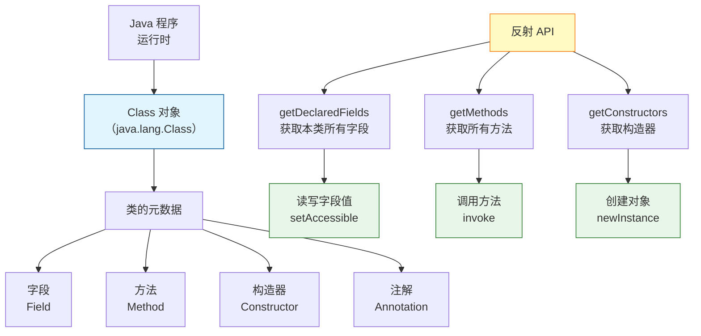

+++
title = "第32章 反射——运行时认识自己"
weight = 320
date = "2026-03-30T14:33:56.916+08:00"
type = "docs"
description = ""
isCJKLanguage = true
draft = false
+++
# 第三十二章 反射——运行时认识自己

> **引子**：你编译完代码，打了个 jar 包扔到服务器上，突然产品经理跑来说："那个类里有个 private 方法，你能帮我改一下返回值吗？"——什么？代码都编译完了，难道要重新编译、重新打包、重新发布？Java 告诉你：不用那么麻烦，我有反射。

**反射（Reflection）**，听起来像是玄学名词，其实它干的事情非常简单粗暴：**在程序运行的时候，去"偷看"类本身的结构**。普通代码是你写好类，编译完，类信息就锁死在 .class 文件里了；反射则允许你杀个回马枪，掀开 .class 文件的盖子，瞅瞅里面有几个字段、几个方法、构造器是啥访问级别——然后，想改就改，想调就调。

这就好比正常情况下你看一个人，只能看到他长什么样（静态属性）；而有了反射，你不仅能看到长相，还能透视他的五脏六腑、骨骼脉络，甚至能在他不知情的情况下让他改姓（修改私有字段）。有点可怕，但确实很强大。

下面这张图展示了反射在整个 Java 体系中的位置，以及反射能够"窥探"和"操作"的核心元素：



**注意**：图中的 `setAccessible` 是反射中最关键的方法之一——它可以**绕过 Java 的访问控制检查**，让 private 的东西不再私密。这也是反射强大的根本原因之一，当然，也是安全问题的根源。

---

## 32.1 Class 对象的获取

在使用反射之前，你得先拿到目标类的 `Class` 对象。注意这里的大小写——`Class` 是 Java 中的一个类，全限定名是 `java.lang.Class`。它不是什么关键字，但长得像关键字，容易让人犯迷糊。

**`Class` 对象是什么？** 简单来说，`.class` 文件被 JVM 加载之后，在堆内存中会生成一个 `Class` 类型的实例，这个实例就是所谓的"类对象"。它包含了整个类的结构信息——字段列表、方法列表、继承关系、注解等等。**每个类有且只有一个 `Class` 对象**（在同一个类加载器范围内）。

### 32.1.1 三种获取 Class 对象的方式

```java
public class Class Acquisition {

    // 定义一个普通的类，稍后我们用它来演示
    static class Person {
        private String name;
        public int age;

        public Person() {
        }

        public Person(String name, int age) {
            this.name = name;
            this.age = age;
        }

        private String getName() {
            return name;
        }

        public void sayHello() {
            System.out.println("Hello, I'm " + name);
        }
    }

    public static void main(String[] args) throws Exception {
        // 方式一：通过 .class 属性（最简单、最安全）
        // 这种方式不会触发类的初始化，编译时就确定了类型
        Class<?> clazz1 = Person.class;
        System.out.println("方式一 .class 属性：" + clazz1.getName());

        // 方式二：通过对象的 getClass() 方法
        // 前提是你得先有一个对象实例
        Person person = new Person("张三", 25);
        Class<?> clazz2 = person.getClass();
        System.out.println("方式二 getClass()：" + clazz2.getName());

        // 方式三：通过 Class.forName("全限定类名") 动态加载
        // 这种方式最灵活，可以从配置文件或字符串中读取类名
        // 注意：会触发类的静态初始化块
        Class<?> clazz3 = Class.forName("reflect.ClassAcquisition$Person");
        System.out.println("方式三 forName：" + clazz3.getName());

        // 三种方式拿到的 Class 对象是同一个（单例）
        System.out.println("clazz1 == clazz2：" + (clazz1 == clazz2)); // true
        System.out.println("clazz2 == clazz3：" + (clazz2 == clazz3)); // true
    }
}
```

输出：

```
方式一 .class 属性：reflect.ClassAcquisition$Person
方式二 getClass()：reflect.ClassAcquisition$Person
方式三 forName：reflect.ClassAcquisition$Person
clazz1 == clazz2：true
clazz2 == clazz3：true
```

### 32.1.2 什么时候用哪种方式？

| 方式 | 优点 | 缺点 | 典型场景 |
|------|------|------|---------|
| `.class` | 简单、编译期安全、不触发类加载 | 写死类型，不灵活 | 已知类型，直接写死 |
| `getClass()` | 需要对象时使用 | 必须已有实例 | 已有对象，想获取其类型信息 |
| `forName()` | 最灵活，字符串驱动 | 需要 try-catch，触发类初始化 | 插件系统、框架、配置文件驱动 |

> **小提示**：如果你在写框架代码，`forName()` 是你的好朋友，因为它允许你通过配置文件指定要加载的类名，而不是写死在代码里。JDBC 驱动加载就是用的这个套路——`Class.forName("com.mysql.cj.jdbc.Driver")`，MySQL 的驱动就是这么被 JVM 发现并加载的。

### 32.1.3 基本类型和数组的 Class 对象

反射可不只对付普通类，`int`、`double`、数组、`void` 同样有 `Class` 对象：

```java
public class PrimitiveAndArrayClass {
    public static void main(String[] args) {
        // 基本类型有对应的 Class，用 TYPE 字段获取
        Class<Integer> intClass = int.class;           // 或者 Integer.TYPE
        Class<Double> doubleClass = double.class;      // 或者 Double.TYPE
        System.out.println("int 的 Class：" + intClass);
        System.out.println("double 的 Class：" + doubleClass);

        // 数组类型也有 Class，规律是 [ + 元素类型简称
        int[] intArray = new int[10];
        String[] strArray = new String[5];
        System.out.println("int[] 的 Class：" + intArray.getClass());
        System.out.println("String[] 的 Class：" + strArray.getClass());

        // void 也有 Class，用于方法返回值表示
        System.out.println("void 的 Class：" + void.class);

        // 特别注意：int 和 Integer 的 Class 对象不一样！
        System.out.println("int.class == Integer.class：" + (int.class == Integer.class)); // false
    }
}
```

---

## 32.2 通过反射操作类

拿到 `Class` 对象之后，我们终于可以开始"窥探"一个类的内部结构了。反射提供了大量 API 来获取类的各种成分。

### 32.2.1 获取类信息概览

```java
public class ClassInfoInspection {

    static class Student {
        private String name = "小明";
        public int score = 90;

        public Student() {
        }

        public Student(String name) {
            this.name = name;
        }

        private void doHomework() {
            System.out.println(name + " 正在写作业...");
        }

        public void play() {
            System.out.println(name + " 正在玩耍！");
        }

        @Override
        public String toString() {
            return "Student{name='" + name + "', score=" + score + "}";
        }
    }

    public static void main(String[] args) throws Exception {
        Class<?> clazz = Student.class;

        // 获取类的修饰符（public、final、abstract 等）
        int modifiers = clazz.getModifiers();
        System.out.println("修饰符：" + java.lang.reflect.Modifier.toString(modifiers));

        // 获取全限定类名（含包名）
        System.out.println("全限定名：" + clazz.getName());

        // 获取简单类名（不含包名）
        System.out.println("简单类名：" + clazz.getSimpleName());

        // 获取包名
        System.out.println("包名：" + clazz.getPackage().getName());

        // 获取父类（如果有的话）
        Class<?> superclass = clazz.getSuperclass();
        System.out.println("父类：" + (superclass != null ? superclass.getName() : "无"));

        // 获取直接实现的接口
        System.out.println("实现的接口：" + Arrays.toString(clazz.getInterfaces()));

        // 判断类型
        System.out.println("是接口？" + clazz.isInterface());
        System.out.println("是枚举？" + clazz.isEnum());
        System.out.println("是数组？" + clazz.isArray());
        System.out.println("是基本类型？" + clazz.isPrimitive());
    }
}
```

输出：

```
修饰符：class
全限定名：reflect.ClassInfoInspection$Student
简单类名：Student
包名：reflect
父类：java.lang.Object
实现的接口：[]
是接口？false
是枚举？false
是数组？false
是基本类型？false
```

### 32.2.2 获取字段（Field）

字段就是类的属性。`Class` 提供了两组方法：

- `getField(String name)` —— 获取**public**字段，包括从父类继承的
- `getDeclaredField(String name)` —— 获取**本类声明的**所有字段，包括 private、protected、package-private，但**不包括继承的**

```java
public class FieldAccess {
    static class Hero {
        // 公有字段——人人可访问
        public String heroName = "无名英雄";

        // 受保护字段——子类和同包可见
        protected int level = 1;

        // 包级私有——同包可见
        long exp = 0L;

        // 私有字段——只有本类可见，外界想碰它得费点劲
        private String secret = "我的超能力是：帅";

        // 静态字段
        public static final String GAME_NAME = "英雄无敌";
    }

    public static void main(String[] args) throws Exception {
        Class<?> clazz = Hero.class;

        System.out.println("===== getDeclaredFields（所有本类声明字段）=====");
        // 获取所有声明的字段，不限访问级别
        Field[] declaredFields = clazz.getDeclaredFields();
        for (Field f : declaredFields) {
            // getType() 获取字段类型，getName() 获取字段名
            System.out.printf("  [%s] %s %s%n",
                    java.lang.reflect.Modifier.toString(f.getModifiers()),
                    f.getType().getSimpleName(),
                    f.getName());
        }

        System.out.println("\n===== getFields（所有公开字段，含父类）=====");
        // 只获取 public 字段，包括从父类继承的
        Field[] publicFields = clazz.getFields();
        for (Field f : publicFields) {
            System.out.printf("  [%s] %s %s%n",
                    java.lang.reflect.Modifier.toString(f.getModifiers()),
                    f.getType().getSimpleName(),
                    f.getName());
        }

        System.out.println("\n===== 操作私有字段 =====");
        // 重点来了：修改 private 字段的值
        Hero hero = new Hero();
        Field secretField = clazz.getDeclaredField("secret");

        // 普通情况下 private 字段是不可访问的，这行代码就是你的"通行证"
        secretField.setAccessible(true);

        // 读取私有字段的值
        String secret = (String) secretField.get(hero);
        System.out.println("读取 private 字段 secret：" + secret);

        // 修改私有字段的值
        secretField.set(hero, "我的超能力是：写 Bug");
        System.out.println("修改后 secret：" + secretField.get(hero));
    }
}
```

输出：

```
===== getDeclaredFields（所有本类声明字段）=====
  [public static final] String GAME_NAME
  [public] String heroName
  [protected] int level
  [long] long exp
  [private] String secret

===== getFields（所有公开字段，含父类）=====
  [public static final] String GAME_NAME
  [public] String heroName

===== 操作私有字段 =====
读取 private 字段 secret：我的超能力是：帅
修改后 secret：我的超能力是：写 Bug
```

> **反射的黑魔法——setAccessible(true)**：这一行代码是整个反射体系的核心开关。设置为 `true` 后，JVM 会暂时禁用 Java 的访问控制检查，让你可以读取甚至修改 private 字段和调用 private 方法。当然，前提是安全管理器（Security Manager）允许这么做。在后续的 JDK 版本中，这个特性受到越来越多的限制，尤其是在模块化系统（Java 9+）下。

### 32.2.3 获取方法（Method）

方法比字段稍微复杂一点，因为方法有参数列表和返回值类型。

```java
public class MethodDiscovery {
    static class Calculator {
        public int add(int a, int b) {
            return a + b;
        }

        private String greet(String name) {
            return "你好，" + name + "！";
        }

        public static void multiply(int a, int b) {
            System.out.println("静态方法：" + (a * b));
        }

        @Override
        public String toString() {
            return "Calculator 实例";
        }
    }

    public static void main(String[] args) throws Exception {
        Class<?> clazz = Calculator.class;

        // 获取所有声明的方法（包括 private）
        Method[] methods = clazz.getDeclaredMethods();
        System.out.println("===== 所有声明的方法 =====");
        for (Method m : methods) {
            // getReturnType() 返回类型，getParameterTypes() 参数类型数组
            System.out.printf("  [%s] %s %s(%s)%n",
                    java.lang.reflect.Modifier.toString(m.getModifiers()),
                    m.getReturnType().getSimpleName(),
                    m.getName(),
                    Arrays.stream(m.getParameterTypes())
                            .map(Class::getSimpleName)
                            .collect(Collectors.joining(", ")));
        }

        System.out.println("\n===== 获取特定方法 =====");
        // getMethod 需要方法名 + 参数类型列表
        // 公开方法可以从父类继承查找
        Method addMethod = clazz.getMethod("add", int.class, int.class);
        System.out.println("找到方法：" + addMethod);

        // 获取私有方法需要用 getDeclaredMethod
        Method greetMethod = clazz.getDeclaredMethod("greet", String.class);
        System.out.println("找到私有方法：" + greetMethod);
        greetMethod.setAccessible(true); // 先拿通行证
    }
}
```

---

## 32.3 通过反射创建对象与调用方法

反射的终极目的之一就是：**在运行时动态决定创建什么对象、调用什么方法**，而不是在代码里写死。这在框架中用得特别多。

### 32.3.1 通过反射创建对象

创建对象有两种主要方式：通过**构造器**创建，或者绕过构造器直接**实例化**。

```java
public class ReflectionObjectCreation {
    static class Robot {
        private String model;
        public int version;

        // 无参构造器
        public Robot() {
            this.model = "Model-Unknown";
            this.version = 0;
            System.out.println("无参构造器被调用了！");
        }

        // 带参构造器
        public Robot(String model, int version) {
            this.model = model;
            this.version = version;
            System.out.println("带参构造器被调用：model=" + model + ", version=" + version);
        }

        private Robot(String model) {
            this.model = model;
            this.version = -1;
            System.out.println("私有构造器被调用：model=" + model);
        }

        @Override
        public String toString() {
            return "Robot{model='" + model + "', version=" + version + "}";
        }
    }

    public static void main(String[] args) throws Exception {
        Class<?> clazz = Robot.class;

        System.out.println("===== 方式一：通过无参构造器创建 =====");
        // 最简单的方式：Class.newInstance()（已deprecated，但值得了解）
        // 推荐使用 Constructor 的 newInstance()
        Object obj1 = clazz.getDeclaredConstructor().newInstance();
        System.out.println("创建结果：" + obj1);

        System.out.println("\n===== 方式二：通过带参构造器创建 =====");
        // 获取特定构造器：需要参数类型匹配
        Constructor<?> ctor = clazz.getConstructor(String.class, int.class);
        Object obj2 = ctor.newInstance("Alpha-1", 7);
        System.out.println("创建结果：" + obj2);

        System.out.println("\n===== 方式三：强制调用私有构造器 =====");
        // 私有构造器也能调用，先拿通行证
        Constructor<?> privateCtor = clazz.getDeclaredConstructor(String.class);
        privateCtor.setAccessible(true);
        Object obj3 = privateCtor.newInstance("Secret-Robot");
        System.out.println("创建结果：" + obj3);

        System.out.println("\n===== 获取所有构造器 =====");
        Constructor<?>[] allCtors = clazz.getDeclaredConstructors();
        for (Constructor<?> c : allCtors) {
            System.out.printf("  构造器：%s, 参数数量：%d%n",
                    java.lang.reflect.Modifier.toString(c.getModifiers()),
                    c.getParameterCount());
        }
    }
}
```

输出：

```
===== 方式一：通过无参构造器创建 =====
无参构造器被调用了！
创建结果：Robot{model='Model-Unknown', version=0}

===== 方式二：通过带参构造器创建 =====
带参构造器被调用：model=Alpha-1, version=7
创建结果：Robot{model='Alpha-1', version=7}

===== 方式三：强制调用私有构造器 =====
私有构造器被调用：model=Secret-Robot
创建结果：Robot{model='Secret-Robot', version=-1}

===== 获取所有构造器 =====
  构造器：public, 参数数量：0
  构造器：public, 参数数量：2
  构造器：private, 参数数量：1
```

### 32.3.2 通过反射调用方法

方法调用用 `Method.invoke()`，基本用法是：把目标对象传进去（静态方法传 `null`），然后跟上参数列表。

```java
public class ReflectionMethodInvocation {
    static class MagicBox {
        public String produce(String item) {
            return "变出了：" + item;
        }

        private int secretFormula() {
            return 42;
        }

        public static void announce(String msg) {
            System.out.println("【公告】" + msg);
        }

        // 没有返回值的方法
        public void drop(String item) {
            System.out.println(item + " 被丢进了盒子！");
        }
    }

    public static void main(String[] args) throws Exception {
        Class<?> clazz = MagicBox.class;
        MagicBox box = new MagicBox();

        System.out.println("===== 调用公开实例方法 =====");
        // 获取方法：方法名 + 参数类型
        Method produce = clazz.getMethod("produce", String.class);
        // invoke(对象实例, 参数...)
        Object result = produce.invoke(box, "一只兔子");
        System.out.println("调用结果：" + result);

        System.out.println("\n===== 调用静态方法 =====");
        // 静态方法不需要对象实例，invoke 第一个参数传 null
        Method announce = clazz.getMethod("announce", String.class);
        announce.invoke(null, "Java 反射太厉害了！");

        System.out.println("\n===== 调用私有方法 =====");
        // 私有方法同理：先 getDeclaredMethod，再 setAccessible
        Method secretFormula = clazz.getDeclaredMethod("secretFormula");
        secretFormula.setAccessible(true);
        Object secretResult = secretFormula.invoke(box);
        System.out.println("私有方法返回值：" + secretResult);

        System.out.println("\n===== 处理无返回值的方法 =====");
        Method drop = clazz.getMethod("drop", String.class);
        drop.invoke(box, "石头"); // 没有返回值，直接调用即可
    }
}
```

### 32.3.3 泛型擦除后的反射补救

Java 的泛型是**编译时特性**，运行时会进行**泛型擦除（Type Erasure）**——也就是说，`List<String>` 和 `List<Integer>` 在运行时看起来都是 `List`。这给反射带来了一些麻烦，但反射也有办法找回丢失的泛型信息。

```java
import java.lang.reflect.*;
import java.util.*;

public class GenericTypeRecovery {

    static class Container<T> {
        private T value;

        public T getValue() {
            return value;
        }

        public void setValue(T value) {
            this.value = value;
        }
    }

    public static void main(String[] args) throws Exception {
        Class<?> clazz = Container.class;

        // 通过 getGenericSuperclass 获取带泛型的父类
        Type genericSuperclass = clazz.getGenericSuperclass();
        System.out.println("带泛型的父类：" + genericSuperclass);
        // 输出：reflect.GenericTypeRecovery$Container<java.lang.String>

        // 从父类中提取泛型参数
        if (genericSuperclass instanceof ParameterizedType pt) {
            Type[] typeArgs = pt.getActualTypeArguments();
            for (Type t : typeArgs) {
                System.out.println("  泛型参数：" + t + "，类型类：" + ((Class<?>) t).getName());
            }
        }

        // 看看方法参数和返回值的泛型类型
        System.out.println("\n===== 方法的泛型信息 =====");
        Method getter = clazz.getMethod("getValue");
        Method setter = clazz.getMethod("setValue", Object.class);

        // getGenericReturnType / getGenericParameterTypes 能拿到带泛型签名
        System.out.println("getValue 返回类型：" + getter.getGenericReturnType());
        System.out.println("setValue 参数类型：" + Arrays.toString(setter.getGenericParameterTypes()));

        // 如果泛型被擦除了，getType 只返回原始类型
        System.out.println("setValue 擦除后参数类型：" + Arrays.toString(setter.getParameterTypes()));

        // 字段的泛型类型也能获取
        System.out.println("\n===== 字段的泛型信息 =====");
        Field valueField = clazz.getDeclaredField("value");
        // getGenericType 能拿到带泛型信息的类型
        System.out.println("value 字段的泛型类型：" + valueField.getGenericType());
    }
}
```

---

## 32.4 反射的应用场景

说了这么多，有人可能觉得："反射听起来很酷，但平时写业务代码用得上吗？"——说实话，日常 CRUD 可能用不上，但 Java 世界里几乎所有"框架"都离不开反射。来看看反射的实际应用场景。

### 32.4.1 框架底层：Spring 的依赖注入

Spring 框架的核心功能之一是**控制反转（IoC, Inversion of Control）**——对象的创建和依赖管理不再由代码主动完成，而是交给 Spring 容器。Spring 容器在创建 Bean（Spring 管理的对象）的时候，大量的工作就是靠反射完成的：

- 读取配置文件（XML 或注解）
- 通过 `Class.forName()` 加载类
- 通过 `Constructor.newInstance()` 创建实例
- 通过 `Field.setAccessible(true)` + `Field.set()` 注入依赖

```java
// 一个简化的"手写 Spring"依赖注入 demo
public class MiniSpringDI {
    public static void main(String[] args) throws Exception {
        // 模拟 Spring 扫描到一个 @Component 标注的类
        Class<?> userServiceClass = Class.forName("reflect.UserService");

        // Spring 容器会扫描 @Component，找到类
        if (userServiceClass.isAnnotationPresent(Component.class)) {
            // 通过反射创建对象
            Object bean = userServiceClass.getDeclaredConstructor().newInstance();

            // 扫描类中的字段，找 @Autowired 标注的依赖
            for (Field field : userServiceClass.getDeclaredFields()) {
                if (field.isAnnotationPresent(Autowired.class)) {
                    field.setAccessible(true);
                    // 递归：从容器中获取对应类型的 Bean 并注入
                    Object dependency = createMockDependency(field.getType());
                    field.set(bean, dependency);
                }
            }
            System.out.println("依赖注入完成：" + bean);
        }
    }

    // 模拟从容器获取依赖
    static Object createMockDependency(Class<?> type) {
        System.out.println("  [模拟] 创建依赖：" + type.getSimpleName());
        try {
            return type.getDeclaredConstructor().newInstance();
        } catch (Exception e) {
            return null;
        }
    }

    // 模拟注解
    @interface Component {}
    @interface Autowired {}

    // 模拟被管理的 Bean
    @Component
    static class UserService {
        @Autowired
        private DatabaseService db;

        @Override
        public String toString() {
            return "UserService{db=" + db + "}";
        }
    }

    @Component
    static class DatabaseService {
    }
}
```

### 32.4.2 JDBC 驱动的加载

你有没有想过，为什么写 JDBC 代码只需要 `Class.forName("com.mysql.cj.jdbc.Driver")` 一行，MySQL 驱动就自动加载了？

```java
// JDBC 标准写法
Class.forName("com.mysql.cj.jdbc.Driver"); // 加载驱动类，触发静态注册
Connection conn = DriverManager.getConnection(url, user, password);
```

实际上，`com.mysql.cj.jdbc.Driver` 类被加载时，会执行类似这样的**静态代码块**：

```java
// MySQL Driver 源码的简化版
public class com.mysql.cj.jdbc.Driver {
    static {
        // 把自己注册到 DriverManager 中
        DriverManager.registerDriver(new com.mysql.cj.jdbc.Driver());
    }
}
```

`Class.forName()` 触发类加载，类加载触发静态代码块，静态代码块把自己注册到 `DriverManager`。之后你调用 `DriverManager.getConnection()`，它就会去那些已注册的驱动里找一个合适的来处理你的请求。

### 32.4.3 序列化与反序列化：JSON / 对象映射

当你在代码里写：

```java
ObjectMapper mapper = new ObjectMapper();
User user = mapper.readValue(jsonString, User.class);
```

Jackson（ObjectMapper 的实现库）在背后做的核心工作就是：

1. 读取 JSON 结构
2. 通过反射找到 `User` 类的所有 setter 方法和字段
3. 把 JSON 中的字段名和值一一对应，调用 setter（或直接设字段）填入

没有反射，这一切都无法实现。

### 32.4.4 动态代理（AOP 的基础）

动态代理是反射的"高阶玩法"。Java 提供了一个 `java.lang.reflect.Proxy` 类，可以**在运行时生成一个类的代理对象**。代理对象的方法调用会被拦截，你可以在调用前后加上自己的逻辑——这就是 AOP（面向切面编程）的基础。

```java
import java.lang.reflect.*;

public class DynamicProxyDemo {

    // 定义一个接口
    interface Image {
        void display();
        String getFileName();
    }

    // 真实的实现类
    static class RealImage implements Image {
        private final String fileName;

        RealImage(String fileName) {
            this.fileName = fileName;
            System.out.println("正在加载图片：" + fileName);
        }

        @Override
        public void display() {
            System.out.println("显示图片：" + fileName);
        }

        @Override
        public String getFileName() {
            return fileName;
        }
    }

    // 自定义调用处理器：方法调用的"拦截器"
    static class LogInvocationHandler implements InvocationHandler {
        private final Object target; // 被代理的真实对象

        LogInvocationHandler(Object target) {
            this.target = target;
        }

        @Override
        public Object invoke(Object proxy, Method method, Object[] args) throws Throwable {
            // 在调用真实方法之前，打个日志
            System.out.println("[代理] 调用方法前：" + method.getName());

            // 调用真实对象的方法
            Object result = method.invoke(target, args);

            // 调用完之后，再打个日志
            System.out.println("[代理] 调用方法后：" + method.getName());
            return result;
        }
    }

    public static void main(String[] args) {
        // 创建一个真实对象
        RealImage realImage = new RealImage("wallpaper.jpg");

        // 创建代理对象
        // Proxy.newProxyInstance(类加载器, 接口数组, 调用处理器)
        Image proxy = (Image) Proxy.newProxyInstance(
                RealImage.class.getClassLoader(),        // 类加载器
                RealImage.class.getInterfaces(),          // 要代理的接口
                new LogInvocationHandler(realImage)       // 方法拦截器
        );

        // 调用代理对象的方法，实际会被转发到 LogInvocationHandler
        proxy.display();
        System.out.println("文件名：" + proxy.getFileName());
    }
}
```

输出：

```
正在加载图片：wallpaper.jpg
[代理] 调用方法前：display
显示图片：wallpaper.jpg
[代理] 调用方法后：display
[代理] 调用方法前：getFileName
文件名：wallpaper.jpg
[代理] 调用方法后：getFileName
```

### 32.4.5 运行时注解处理

注解（Annotation）是元数据的一种形式。框架往往需要在运行时读取注解，并据此改变行为。比如 JUnit 通过 `@Test` 注解知道哪些方法需要被执行；Spring 通过 `@Autowired` 知道哪些字段需要注入依赖。

```java
import java.lang.annotation.*;

public class AnnotationProcessing {

    // 定义一个自定义注解
    @Retention(RetentionPolicy.RUNTIME)  // 必须设为 RUNTIME 才能在运行时通过反射读取
    @Target(ElementType.METHOD)           // 只能用在方法上
    @interface Test {
        int priority() default 0;          // 注解可以带属性
    }

    static class Calculator {
        @Test(priority = 1)
        public void testAdd() {
            System.out.println("测试加法...");
            assert 2 + 3 == 5;
        }

        @Test(priority = 2)
        public void testSubtract() {
            System.out.println("测试减法...");
            assert 10 - 4 == 6;
        }

        @Test(priority = 0)
        public void testMultiply() {
            System.out.println("测试乘法...");
            assert 3 * 5 == 15;
        }

        public void helperMethod() {
            // 这个方法没有 @Test，不应该被测试框架执行
            System.out.println("辅助方法，不是测试");
        }
    }

    public static void main(String[] args) throws Exception {
        Class<?> clazz = Calculator.class;

        // 遍历所有方法，找标注了 @Test 的
        System.out.println("===== 扫描测试方法 =====");
        Method[] methods = clazz.getDeclaredMethods();

        // 按 priority 排序（JUnit 风格的执行顺序）
        List<Method> testMethods = new ArrayList<>();
        for (Method m : methods) {
            if (m.isAnnotationPresent(Test.class)) {
                testMethods.add(m);
            }
        }
        testMethods.sort((a, b) -> {
            int p1 = a.getAnnotation(Test.class).priority();
            int p2 = b.getAnnotation(Test.class).priority();
            return Integer.compare(p1, p2);
        });

        // 执行每个测试方法
        for (Method m : testMethods) {
            System.out.println("执行测试：" + m.getName() + " (优先级=" +
                    m.getAnnotation(Test.class).priority() + ")");
            m.invoke(clazz.getDeclaredConstructor().newInstance());
        }
    }
}
```

---

## 32.5 反射的性能与注意事项

反射虽好，但绝非银弹。它有明显的性能开销和安全风险，这一节我们来好好聊聊。

### 32.5.1 反射的性能开销

反射的操作比直接调用**慢几十倍到几百倍**不等。这主要来自三方面：

1. **动态解析**：每次调用 `Method.invoke()` 时，JVM 需要解析被调用的方法，匹配参数类型，这些工作在直接调用时在编译阶段就完成了。
2. **setAccessible 的安全检查**：每次调用 `setAccessible(true)` 都会触发安全管理器的检查（如果启用了安全管理器的话）。
3. **无法内联优化**：JVM 的 JIT 编译器擅长对热点代码进行内联优化，但反射调用由于动态性太强，JIT 难以优化。

一个简单的性能对比：

```java
import java.lang.reflect.*;

public class ReflectionPerformance {
    static class FastClass {
        public int calculate(int x) {
            return x * x + 1;
        }
    }

    public static void main(String[] args) throws Exception {
        int iterations = 1_000_000;
        FastClass instance = new FastClass();
        Method method = FastClass.class.getMethod("calculate", int.class);
        method.setAccessible(true); // 拿通行证

        // 直接调用（基准）
        long start = System.nanoTime();
        int sum = 0;
        for (int i = 0; i < iterations; i++) {
            sum += instance.calculate(5);
        }
        long directTime = System.nanoTime() - start;
        System.out.println("直接调用耗时：" + directTime / 1_000_000 + " ms");

        // 反射调用
        long start2 = System.nanoTime();
        int sum2 = 0;
        for (int i = 0; i < iterations; i++) {
            sum2 += (int) method.invoke(instance, 5);
        }
        long reflectTime = System.nanoTime() - start2;
        System.out.println("反射调用耗时：" + reflectTime / 1_000_000 + " ms");

        System.out.printf("反射慢约 %.1f 倍%n", (double) reflectTime / directTime);
        // 避免 JIT 优化掉无用计算
        System.out.println("校验和：" + (sum + sum2));
    }
}
```

典型输出（取决于机器）：

```
直接调用耗时：3 ms
反射调用耗时：187 ms
反射慢约 62.3 倍
```

**优化建议**：

- 如果某个反射调用会被频繁执行，考虑将 `Method` / `Field` / `Constructor` 对象**缓存**起来，避免每次都调用 `getMethod` / `getDeclaredField`。
- 在已知类型的情况下，优先使用直接调用或接口代理。
- JDK 17+ 引入的 `MethodHandles` 提供了更高效的反射替代方案，适合在高性能场景中使用。

### 32.5.2 安全管理器的限制

在启用了安全管理器（Security Manager，默认从 JDK 17 开始已废弃但仍可启用）的环境中，`setAccessible(true)` 可能被拒绝：

```
java.lang.SecurityException: Unable to set accessible flag on member
```

**最佳实践**：

```java
public static void setAccessibleQuietly(Field field) {
    // 尝试绕过检查，如果安全管理器拒绝，安静地忽略
    try {
        field.setAccessible(true);
    } catch (SecurityException e) {
        // 降级处理：记录日志，不影响主流程
        System.err.println("无法访问字段 " + field.getName() + "：" + e.getMessage());
    }
}
```

### 32.5.3 模块化系统（Java 9+）的额外限制

Java 9 引入了**模块系统（Module System）**，每个模块有自己的导出（exports）和开放（opens）策略。即使你 `setAccessible(true)` 了，如果目标类在未导出的模块中，仍然会抛出 `IllegalAccessException`。

```java
// 如果尝试反射 java.lang.Module 类（非导出模块）
Module module = Object.class.getModule();
Class<?> clazz = Class.forName("java.lang.Thread");
// 可能抛出：java.lang.reflect.InaccessibleObjectException
Method m = clazz.getDeclaredMethod("somePrivateMethod");
m.setAccessible(true); // 可能在 JDK 9+ 失败
```

**解决办法**是使用 JVM 启动参数 `--add-opens`：

```bash
java --add-opens java.base/java.lang=ALL-UNNAMED -jar your-app.jar
```

Spring 和 Hibernate 等框架在 JDK 9+ 环境下启动时往往会遇到这类问题，通常需要加上类似参数。

### 32.5.4 反射的滥用警示

- **不要用反射来绕过业务逻辑**：有些人觉得反射可以改 private 字段，所以业务校验也能被绕过。这是自找麻烦——private 字段本意就是告诉你"别碰这里"。
- **反射不适合极端性能场景**：热点路径（每秒调用数万次以上）的代码应该尽量避免反射。
- **维护性差**：反射代码的可读性远不如正常调用，一旦出 bug，调试也困难。
- **破坏封装性**：随意修改对象的内部状态可能导致对象处于不一致状态，引发难以排查的 bug。

---

## 本章小结

本章介绍了 Java 反射（Reflection）的核心概念和使用方法，以下是关键知识点回顾：

| 知识点 | 内容 |
|--------|------|
| **Class 对象** | JVM 加载类后在堆中生成的元数据对象，是所有反射操作的入口 |
| **获取 Class** | 三种方式：`.class` 属性、`getClass()`、`Class.forName()` |
| **Field** | 代表类中的字段，`setAccessible(true)` 可突破访问限制 |
| **Method** | 代表类中的方法，`invoke()` 用于动态调用 |
| **Constructor** | 代表构造器，`newInstance()` 用于动态创建对象 |
| **setAccessible** | 反射的核心"作弊开关"，禁用访问检查 |
| **泛型擦除补救** | 通过 `getGenericType()`、`ParameterizedType` 等找回泛型信息 |
| **应用场景** | Spring IoC、JDBC 驱动加载、序列化框架、动态代理、注解处理 |
| **性能问题** | 反射比直接调用慢数十倍，可通过缓存和 `MethodHandles` 优化 |
| **安全风险** | 受安全管理器和模块系统限制，需注意 JDK 版本兼容性 |
| **最佳实践** | 优先直接调用；反射用于框架层和配置驱动场景；注意版本兼容性 |

> 反射是 Java 最强大的特性之一，也是最"危险"的特性之一——它让程序有了"自我审视"和"自我改造"的能力。用得好，它是框架的基石；用得差，它是维护的噩梦。请像对待真正的镜子一样对待反射：看清楚自己的同时，也别被自己吓到。
