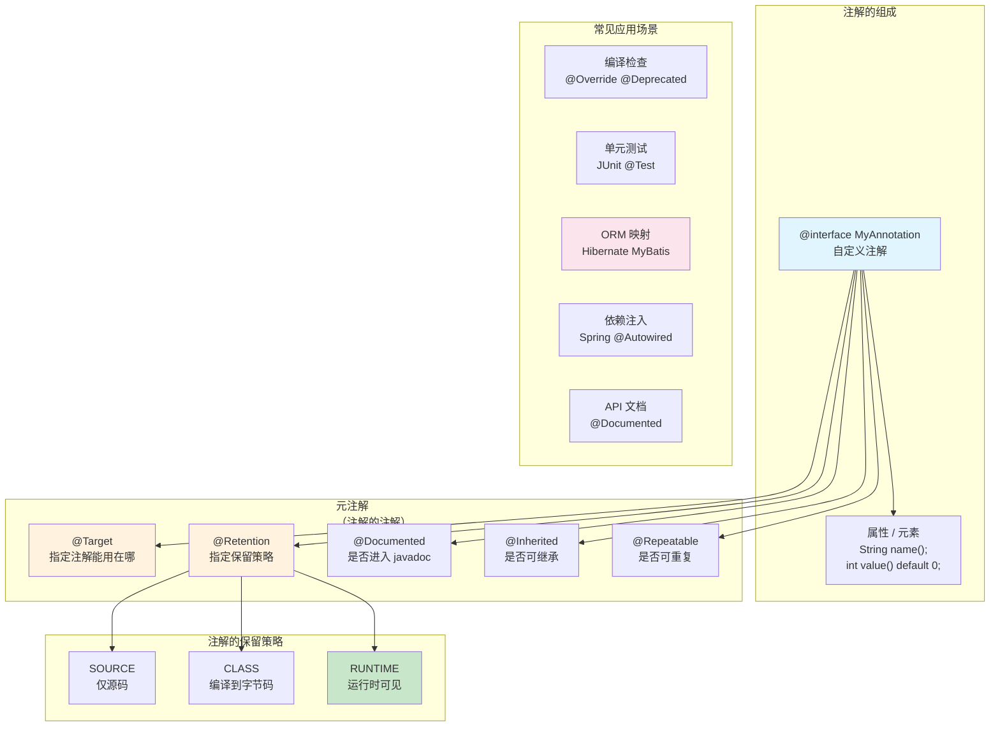
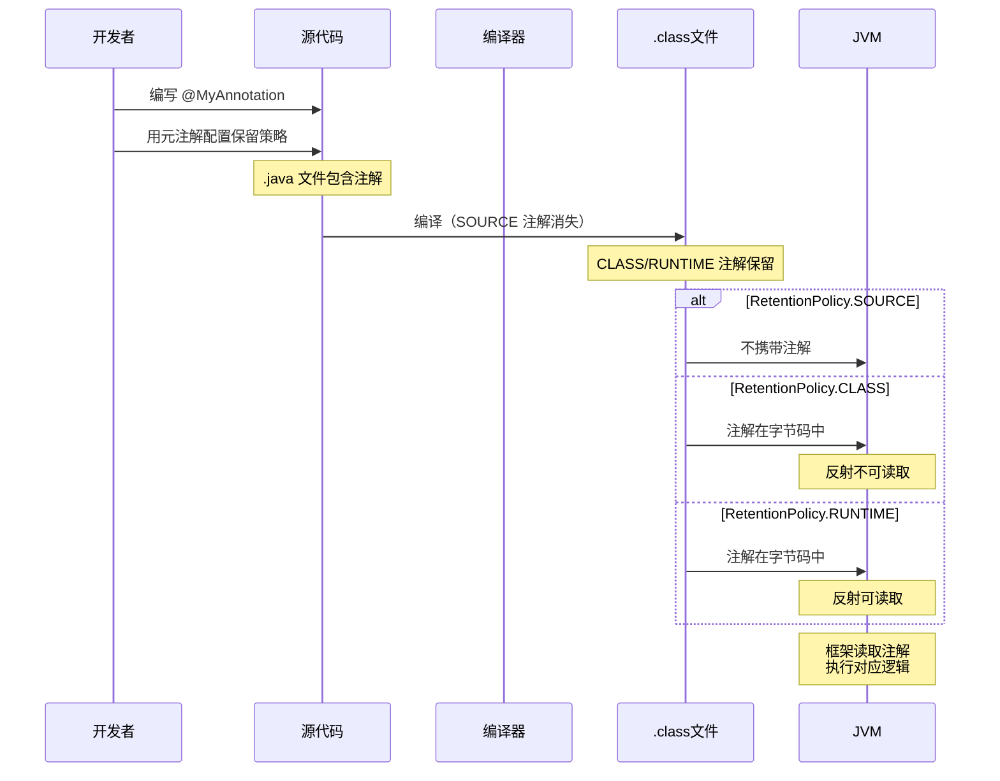

+++
title = "第33章 注解——代码的元数据"
weight = 330
date = "2026-03-30T14:33:56.917+08:00"
type = "docs"
description = ""
isCJKLanguage = true
draft = false
+++
# 第三十三章 注解——代码的元数据

> 📌 **先打个预防针**：注解（Annotation）是 Java 里最容易被人"眼熟"但又最容易被用歪的东西。很多人以为它只是 `@Override` 前面那个 `@`，其实它的本事大着呢——框架用它来生成代码、IDE 用它来做检查、编译器用它来提示警告……可以说，注解就是 Java 世界里的"便签贴"，贴在代码上，告诉别人"这段代码是干啥吃的"。

## 33.1 Java 内置注解

Java 从 1.5 开始就内置了一些注解，这些注解你肯定见过，只是可能没注意。它们是 Java 默认提供的小工具，贴在 JDK 自带的类和方法上，帮编译器做检查。

### 33.1.1 三个元老级注解

Java 内置注解里，有三个元老级别的"老戏骨"，出场率极高：

- `@Override` —— 声明方法是要覆盖父类的方法
- `@Deprecated` —— 标记某个元素已过时，不推荐使用
- `@SuppressWarnings` —— 让编译器对某段代码"闭嘴"，别报警告

```java
/**
 * 内置注解演示类
 * 展示 Java 三大元老级注解的用法
 */
public class BuiltInAnnotationDemo {

    // @Override：声明这个方法要覆盖父类的方法
    // 如果父类没有这个方法，编译器会报错，防止拼写错误
    @Override
    public String toString() {
        return "我是一个内置注解演示对象";
    }

    // @Deprecated：标记这个方法已过时
    // 使用时 IDE 会画上删除线，并给出警告
    @Deprecated
    public void oldMethod() {
        System.out.println("这是一个已经过时的方法，请不要调用我！");
    }

    // @SuppressWarnings：抑制警告
    // "deprecation" 表示抑制关于已过时元素的警告
    @SuppressWarnings("deprecation")
    public void demoSuppress() {
        // 这里调用了 @Deprecated 的方法，但编译器不会警告
        oldMethod();
    }

    public static void main(String[] args) {
        BuiltInAnnotationDemo demo = new BuiltInAnnotationDemo();
        System.out.println(demo);  // 调用 toString()
        demo.demoSuppress();
    }
}
```

> 💡 **小贴士**：`@Override` 是初学者最好的朋友——当你拼错方法名时，它会毫不客气地报错帮你纠错。建议在所有覆盖父类方法的地方都加上它。

### 33.1.2 @FunctionalInterface

这个注解从 Java 8 开始加入，专门用来标记**函数式接口**（只有一个抽象方法的接口）。

```java
// 用 @FunctionalInterface 标记后，编译器会检查这是否真的是一个函数式接口
// 如果你不小心加了两个抽象方法，编译器立刻报错
@FunctionalInterface
interface Calculator {
    // 只有一个抽象方法，符合函数式接口规范
    int calculate(int a, int b);
}
```

### 33.1.3 @SafeVarargs

Java 7 引入，用来标记"可变形参"方法是类型安全的，告诉编译器不要报警告。

```java
public class SafeVarargsDemo {

    // @SafeVarargs 告诉编译器：这个可变参数方法是安全的
    // 不会产生未受检警告（unchecked warning）
    @SafeVarargs
    public static <T> void printAll(T... elements) {
        for (T element : elements) {
            System.out.println(element);
        }
    }

    public static void main(String[] args) {
        printAll("Java", "注解", 2026);
    }
}
```

## 33.2 自定义注解

光用 Java 内置的注解当然不过瘾，我们可以自己定义注解，就像自己发明"贴纸"。自定义注解用 `@interface` 关键字来声明。

### 33.2.1 基本语法

定义一个注解就像定义一个接口，只不过前面多了个 `@`：

```java
/**
 * 这是一个自定义注解，用来标记"作者"信息
 * 类似于给代码贴上一个"作者便签"
 */
public @interface Author {
    // 注解的属性，类似接口中的方法
    // 注意：这里不是方法，是注解的属性
    String name();          // 作者姓名
    String date();          // 编写日期
}
```

### 33.2.2 使用自定义注解

定义好了注解，就可以贴在各种代码元素上了：

```java
/**
 * 这是一个用户服务类
 * 贴上了 @Author 注解，说明是谁写的
 */
@Author(name = "阿Q", date = "2026-03-30")
public class UserService {

    @Author(name = "阿Q", date = "2026-03-30")
    public void addUser(String username) {
        System.out.println("添加用户：" + username);
    }
}
```

### 33.2.3 带默认值的注解属性

注解属性可以设置默认值，这样使用注解时就可以省略有默认值的属性：

```java
/**
 * 带默认值的自定义注解
 */
public @interface Version {
    String value();                    // 没有默认值，必须指定
    String author() default "未知";   // 有默认值，可以省略
    String date() default "未定";
}
```

使用时：

```java
// 全部指定
@Version(value = "1.0", author = "阿Q", date = "2026-03-30")
class ClassA { }

// 省略有默认值的属性
@Version(value = "2.0")
class ClassB { }
```

### 33.2.4 特殊属性：value

如果注解只有一个属性，且属性名叫 `value`，使用注解时可以省略 `value =`：

```java
public @interface Remark {
    String value();  // 只有一个属性，且叫 value
}
```

使用时就简单多了：

```java
@Remark("这段代码写得真棒！")
public void method() { }
```

### 33.2.5 完整示例：日志注解

让我们来一个综合示例——定义一个日志注解，并在方法中使用：

```java
import java.lang.annotation.ElementType;
import java.lang.annotation.Retention;
import java.lang.annotation.RetentionPolicy;
import java.lang.annotation.Target;

/**
 * 自定义日志注解
 * 用于记录方法执行信息
 */
// @Target 指定注解可以用在哪些地方（这里指定用于方法和类）
@Target({ElementType.METHOD, ElementType.TYPE})
// @Retention 指定注解的保留策略（这里是在运行时保留，我们后面会讲）
@Retention(RetentionPolicy.RUNTIME)
public @interface Log {
    // 操作描述，例如 "用户登录"
    String operation();
    // 是否记录时间戳，默认 true
    boolean logTime() default true;
}
```

```java
/**
 * 使用 @Log 注解标记需要记录日志的方法
 */
@Log(operation = "用户管理模块")
public class UserManager {

    @Log(operation = "添加用户")
    public void addUser(String name) {
        System.out.println("正在添加用户：" + name);
    }

    @Log(operation = "删除用户", logTime = false)
    public void deleteUser(String name) {
        System.out.println("正在删除用户：" + name);
    }
}
```

## 33.3 注解的保留策略

这是理解注解的关键！注解就像便签，但便签也有不同的"黏性强度"——有些只在源码里能看到，有些能带进编译后的 class 文件，有些能一直留到程序运行时。

Java 中用 `@Retention` 注解来指定保留策略，它有三个取值：

| 保留策略 | 说明 | 适用场景 |
|---------|------|---------|
| `SOURCE` | 只存在于源代码中，编译后消失 | 编译器检查，如 `@Override` |
| `CLASS` | 存在于 .class 文件中，但运行时不可见 | 类文件分析工具 |
| `RUNTIME` | 存在于 .class 文件中，运行时可通过反射读取 | 框架、依赖注入、AOP |

### 33.3.1 直观理解三种策略

> 🎭 **打个比方**：想象注解是一张便签。
> - `SOURCE`：写在笔记本上的草稿，不会抄到正式文件里。
> - `CLASS`：抄到正式文件里了，但锁在文件柜里，运行时拿不出来。
> - `RUNTIME`：抄到正式文件里，而且你随时可以打开文件柜拿出来用。

### 33.3.2 不同保留策略的代码演示

```java
import java.lang.annotation.Retention;
import java.lang.annotation.RetentionPolicy;

/**
 * 源代码级注解 - 编译后消失
 * 典型用途：给编译器看的提示
 */
@Retention(RetentionPolicy.SOURCE)
@interface SourceOnly {
    String value();
}

/**
 * 字节码级注解 - 存在 .class 中，运行时不可见
 * 典型用途：编译时或类加载时的分析工具
 */
@Retention(RetentionPolicy.CLASS)
@interface ClassOnly {
    String value();
}

/**
 * 运行时注解 - 运行时可通过反射读取
 * 典型用途：框架、依赖注入、AOP
 */
@Retention(RetentionPolicy.RUNTIME)
@interface RuntimeVisible {
    String value();
}
```

```java
/**
 * 在同一个类上使用三种不同的注解
 */
@SourceOnly("源码便签")
@ClassOnly("字节码便签")
@RuntimeVisible("运行时便签")
public class AnnotationRetentionDemo {

    @SourceOnly("方法级源码注解")
    @ClassOnly("方法级字节码注解")
    @RuntimeVisible("方法级运行时注解")
    public void demoMethod() {
        System.out.println("注解保留策略演示");
    }

    public static void main(String[] args) throws Exception {
        // 通过反射获取运行时注解
        // 只有 @RuntimeVisible 的注解在这个环节能被读取到
        RuntimeVisible classAnnotation = AnnotationRetentionDemo.class
                .getAnnotation(RuntimeVisible.class);
        System.out.println("运行时可见注解的值: " + classAnnotation.value());

        RuntimeVisible methodAnnotation = AnnotationRetentionDemo.class
                .getMethod("demoMethod")
                .getAnnotation(RuntimeVisible.class);
        System.out.println("方法上的运行时注解值: " + methodAnnotation.value());
    }
}
```

运行结果：

```
运行时可见注解的值: 运行时便签
方法上的运行时注解值: 方法级运行时注解
```

> 💡 **为什么有些注解是 SOURCE 级别？** 因为有些注解只需要给编译器或 IDE 看，比如 `@Override` 只是告诉编译器"我要覆盖父类方法"，编译完就不需要了。保留在字节码里反而浪费空间。

## 33.4 元注解

**元注解**就是"注解的注解"——专门用来注解其他注解的注解。就像便签纸本身也需要标签来标注它的类型一样。元注解一共有五个：

| 元注解 | 作用 |
|-------|------|
| `@Target` | 限制注解能贴在哪些代码元素上（类、方法、字段等） |
| `@Retention` | 指定注解的保留策略（SOURCE、CLASS、RUNTIME） |
| `@Documented` | 标记这个注解会被 javadoc 包含 |
| `@Inherited` | 标记这个注解可以被子类继承 |
| `@Repeatable` | 标记这个注解可以在同一个元素上使用多次 |

### 33.4.1 @Target：控制注解的"着陆点"

```java
import java.lang.annotation.ElementType;
import java.lang.annotation.Target;

/**
 * @Target 控制这个注解可以用在哪些地方
 * 如果不写 @Target，默认可以用在任何地方
 */

// 只允许用在方法上
@Target(ElementType.METHOD)
@interface MethodOnly {
    String value();
}

// 只允许用在字段上
@Target(ElementType.FIELD)
@interface FieldOnly {
    String value();
}

// 可以用在类和方法上
@Target({ElementType.TYPE, ElementType.METHOD})
@interface TypeAndMethod {
    String value();
}
```

```java
@TypeAndMethod("可以用在类上")
public class TargetDemo {

    @FieldOnly("这是字段的注解")
    private String name;

    @MethodOnly("这是方法的注解")
    public void method() { }

    // 下面这行会报错！FieldOnly 不能用在方法上
    // @FieldOnly("错误用法")  // 编译错误！
    // public void badMethod() { }
}
```

`ElementType` 的所有可选值：

| ElementType | 适用位置 |
|------------|---------|
| `TYPE` | 类、接口、枚举 |
| `FIELD` | 字段（包括枚举常量） |
| `METHOD` | 方法 |
| `PARAMETER` | 方法参数 |
| `CONSTRUCTOR` | 构造方法 |
| `LOCAL_VARIABLE` | 局部变量 |
| `ANNOTATION_TYPE` | 注解类型 |
| `PACKAGE` | 包声明 |
| `TYPE_PARAMETER` | 类型参数（泛型） |
| `TYPE_USE` | 类型使用任何位置 |

### 33.4.2 @Documented：让注解进入 javadoc

默认情况下，注解不会出现在 javadoc 生成的文档里。加上 `@Documented` 就能让它露脸：

```java
import java.lang.annotation.Documented;

/**
 * 这是一个文档化注解
 * 使用此注解的代码在生成 javadoc 时会包含这个注解的信息
 */
@Documented
@interface DocumentedAnnotation {
    String description();
}
```

```java
/**
 * 这个类的 javadoc 中会显示 @DocumentedAnnotation 注解
 */
@DocumentedAnnotation(description = "这是一个重要的配置类")
public class DocumentedDemo {
}
```

### 33.4.3 @Inherited：注解的遗传能力

加了 `@Inherited` 的注解，如果贴在父类上，子类会自动继承这个注解：

```java
import java.lang.annotation.Inherited;

@Inherited
@interface InheritedAnnotation {
    String value();
}
```

```java
@InheritedAnnotation("父类的注解")
class Parent { }

class Child extends Parent { }  // 子类自动继承 @InheritedAnnotation
```

```java
public class InheritedDemo {
    public static void main(String[] args) {
        // 检查子类是否继承了父类的注解
        InheritedAnnotation annotation = Child.class.getAnnotation(InheritedAnnotation.class);
        if (annotation != null) {
            System.out.println("子类继承了父类的注解，值是：" + annotation.value());
        }
    }
}
```

运行结果：`子类继承了父类的注解，值是：父类的注解`

> 💡 **注意**：子类本身不会被标注 `@InheritedAnnotation`，但因为继承了父类，所以通过反射能读取到。如果子类自己被标注了 `@InheritedAnnotation`，那就有两个了。

### 33.4.4 @Repeatable：同一个地方贴多张便签

Java 8 引入的新特性，允许同一个注解使用多次。这在需要给代码添加多个相同类型的标记时非常有用。

```java
import java.lang.annotation.Repeatable;

// 首先定义一个"容器注解"，用来存放多个 @Tag 注解
@java.lang.annotation.Repeatable(Tags.class)
@interface Tag {
    String value();
}

// 然后定义容器注解
@java.lang.annotation.Retention(java.lang.annotation.RetentionPolicy.RUNTIME)
@interface Tags {
    Tag[] value();  // 注意：容器属性名字是固定的 value，类型是注解的数组
}
```

```java
/**
 * 使用 @Repeatable 注解
 * 现在可以给同一个元素贴多个 @Tag 了
 */
public class RepeatableDemo {

    @Tag("Java")
    @Tag("注解")
    @Tag("很酷")
    public void multiTaggedMethod() {
        System.out.println("这个方法有多个标签！");
    }

    public static void main(String[] args) {
        // 通过反射读取多个相同注解
        Tag[] tags = RepeatableDemo.class
                .getMethod("multiTaggedMethod")
                .getAnnotationsByType(Tag.class);

        System.out.println("这个方法有以下标签：");
        for (Tag tag : tags) {
            System.out.println("  - " + tag.value());
        }
    }
}
```

运行结果：

```
这个方法有以下标签：
  - Java
  - 注解
  - 很酷
```

## 33.5 注解的应用

注解本身只是"便签"，光贴着没用，还得有人去"读"这些便签才能发挥作用。读取注解的工具就是**反射（Reflection）**。注解的应用场景非常广泛，下面我们一一介绍。

### 33.5.1 注解的读取：通过反射

这是注解应用的基础。我们用反射来读取类、方法、字段上的注解：

```java
import java.lang.annotation.*;
import java.lang.reflect.*;

/**
 * 演示如何通过反射读取注解
 */
@Retention(RetentionPolicy.RUNTIME)
@Target(ElementType.METHOD)
@interface Test {
    String description() default "";
}

public class AnnotationReflection {

    @Test(description = "测试加法")
    public void testAdd() {
        System.out.println("1 + 1 = " + (1 + 1));
    }

    @Test(description = "测试减法")
    public void testSubtract() {
        System.out.println("5 - 3 = " + (5 - 3));
    }

    public static void main(String[] args) throws Exception {
        // 获取类的所有方法
        Method[] methods = AnnotationReflection.class.getDeclaredMethods();

        for (Method method : methods) {
            // 检查方法是否有 @Test 注解
            if (method.isAnnotationPresent(Test.class)) {
                // 获取注解实例
                Test test = method.getAnnotation(Test.class);
                System.out.println("执行测试: " + test.description());
                method.invoke(new AnnotationReflection());  // 调用方法
                System.out.println();
            }
        }
    }
}
```

### 33.5.2 注解在单元测试中的应用

JUnit 是注解应用最经典的案例。让我们看看 JUnit 4 中注解是如何工作的：

```java
import java.lang.annotation.*;

/**
 * 模拟 JUnit 的测试注解
 * 这展示了框架如何利用注解来驱动测试流程
 */
@Retention(RetentionPolicy.RUNTIME)
@Target(ElementType.METHOD)
@interface Test {
    // expected 属性：期望抛出的异常类型
    Class<? extends Throwable> expected() default None.class;

    static class None { }  // 占位类，表示"不期望异常"
}

@Retention(RetentionPolicy.RUNTIME)
@Target(ElementType.METHOD)
@interface Before {
}

@Retention(RetentionPolicy.RUNTIME)
@Target(ElementType.METHOD)
@interface After {
}
```

```java
/**
 * 一个简单的测试类
 */
public class Calculator {

    public int add(int a, int b) {
        return a + b;
    }

    public int divide(int a, int b) {
        if (b == 0) {
            throw new ArithmeticException("除数不能为零！");
        }
        return a / b;
    }
}
```

```java
/**
 * 使用自定义测试注解的测试类
 */
public class CalculatorTest {

    private Calculator calculator;

    // @Before：在每个测试方法前执行
    @Before
    public void setUp() {
        calculator = new Calculator();
        System.out.println("📦 初始化测试对象");
    }

    // @After：在每个测试方法后执行
    @After
    public void tearDown() {
        calculator = null;
        System.out.println("🧹 清理测试对象\n");
    }

    // 正常的测试方法
    @Test
    public void testAdd() {
        int result = calculator.add(2, 3);
        assert result == 5 : "加法测试失败！";
        System.out.println("✅ testAdd 通过");
    }

    // 测试期望抛出的异常
    @Test(expected = ArithmeticException.class)
    public void testDivideByZero() {
        calculator.divide(1, 0);  // 应该抛出 ArithmeticException
        System.out.println("✅ testDivideByZero 通过（捕获到预期异常）");
    }

    // 运行所有带 @Test 的方法
    public static void main(String[] args) throws Exception {
        System.out.println("=== 模拟 JUnit 测试运行器 ===\n");

        Class<?> testClass = CalculatorTest.class;
        Object testInstance = testClass.getDeclaredConstructor().newInstance();

        // 找到所有带 @Before 的方法，先执行一次
        for (Method before : testClass.getDeclaredMethods()) {
            if (before.isAnnotationPresent(Before.class)) {
                before.invoke(testInstance);
            }
        }

        // 执行所有测试方法
        for (Method method : testClass.getDeclaredMethods()) {
            if (method.isAnnotationPresent(Test.class)) {
                try {
                    Test testAnnotation = method.getAnnotation(Test.class);
                    if (testAnnotation.expected() != Test.None.class) {
                        // 期望异常的情况
                        try {
                            method.invoke(testInstance);
                            System.out.println("❌ " + method.getName() + " 失败：未抛出预期异常");
                        } catch (InvocationTargetException e) {
                            if (testAnnotation.expected().isInstance(e.getCause())) {
                                System.out.println("✅ " + method.getName() + " 通过（捕获到预期异常）");
                            }
                        }
                    } else {
                        method.invoke(testInstance);
                        System.out.println("✅ " + method.getName() + " 通过");
                    }
                } catch (Exception e) {
                    System.out.println("❌ " + method.getName() + " 失败：" + e.getCause());
                }
            }
        }

        // 找到所有带 @After 的方法，执行一次
        for (Method after : testClass.getDeclaredMethods()) {
            if (after.isAnnotationPresent(After.class)) {
                after.invoke(testInstance);
            }
        }

        System.out.println("=== 测试完成 ===");
    }
}
```

运行结果：

```
=== 模拟 JUnit 测试运行器 ===

📦 初始化测试对象
✅ testAdd 通过
🧹 清理测试对象

📦 初始化测试对象
✅ testDivideByZero 通过（捕获到预期异常）
🧹 清理测试对象

=== 测试完成 ===
```

### 33.5.3 注解在 ORM 框架中的应用

注解在数据库 ORM 框架（如 Hibernate、MyBatis）中大量使用。下面模拟一个简单的 ORM 映射：

```java
import java.lang.annotation.*;

/**
 * 表名注解 - 标记实体类对应的数据库表名
 */
@Retention(RetentionPolicy.RUNTIME)
@Target(ElementType.TYPE)
@interface Table {
    String name();
}

/**
 * 列名注解 - 标记字段对应的数据库列名
 */
@Retention(RetentionPolicy.RUNTIME)
@Target(ElementType.FIELD)
@interface Column {
    String name();
}

/**
 * 主键注解 - 标记字段为主键
 */
@Retention(RetentionPolicy.RUNTIME)
@Target(ElementType.FIELD)
@interface PrimaryKey {
}
```

```java
/**
 * 用户实体类 - 用注解描述数据库映射关系
 */
@Table(name = "t_user")
public class User {

    @PrimaryKey
    @Column(name = "user_id")
    private Long id;

    @Column(name = "user_name")
    private String name;

    @Column(name = "user_email")
    private String email;

    // 构造方法
    public User(Long id, String name, String email) {
        this.id = id;
        this.name = name;
        this.email = email;
    }

    // 省略 getter/setter
    public Long getId() { return id; }
    public void setId(Long id) { this.id = id; }
    public String getName() { return name; }
    public void setName(String name) { this.name = name; }
    public String getEmail() { return email; }
    public void setEmail(String email) { this.email = email; }

    @Override
    public String toString() {
        return "User{id=" + id + ", name='" + name + "', email='" + email + "'}";
    }
}
```

```java
import java.lang.reflect.*;

/**
 * 简单的 ORM 工具类 - 通过注解自动生成 SQL
 */
public class OrmUtil {

    /**
     * 根据实体类自动生成 INSERT SQL
     */
    public static String generateInsert(Object entity) throws Exception {
        Class<?> clazz = entity.getClass();

        // 获取表名
        Table tableAnnotation = clazz.getAnnotation(Table.class);
        if (tableAnnotation == null) {
            throw new IllegalArgumentException("实体类必须标注 @Table 注解");
        }
        String tableName = tableAnnotation.name();

        // 收集字段名和值
        StringBuilder columns = new StringBuilder();
        StringBuilder values = new StringBuilder();

        for (Field field : clazz.getDeclaredFields()) {
            Column column = field.getAnnotation(Column.class);
            if (column != null) {
                if (columns.length() > 0) columns.append(", ");
                if (values.length() > 0) values.append(", ");

                columns.append(column.name());

                field.setAccessible(true);  // 允许访问私有字段
                Object value = field.get(entity);
                values.append(formatValue(value));
            }
        }

        return String.format("INSERT INTO %s (%s) VALUES (%s);",
                tableName, columns, values);
    }

    /**
     * 格式化字段值，用于 SQL 字符串
     */
    private static String formatValue(Object value) {
        if (value == null) return "NULL";
        if (value instanceof Number) return value.toString();
        if (value instanceof String) return "'" + value + "'";
        return "'" + value.toString() + "'";
    }

    public static void main(String[] args) throws Exception {
        User user = new User(1L, "阿Q", "aq@example.com");

        String sql = OrmUtil.generateInsert(user);
        System.out.println("生成的 SQL：");
        System.out.println(sql);
    }
}
```

运行结果：

```
生成的 SQL：
INSERT INTO t_user (user_id, user_name, user_email) VALUES (1, '阿Q', 'aq@example.com');
```

> 💡 **框架背后的原理**：像 Spring、Hibernate 这些框架，在启动时会扫描所有被注解标记的类和方法，通过反射读取注解信息，然后根据注解的配置来"组装"程序行为。这就是所谓的"约定大于配置"——你只需要贴上注解，框架就会自动帮你搞定一切。

### 33.5.4 注解结构图

下面用 mermaid 图展示注解的整体结构关系：





## 本章小结

本章我们学习了 Java 注解（Annotation），它是代码的元数据，为代码添加语义化的"标签"。

### 核心知识点回顾

| 知识点 | 内容 |
|-------|------|
| **内置注解** | `@Override`、`@Deprecated`、`@SuppressWarnings`、`@FunctionalInterface`、`@SafeVarargs` |
| **自定义注解** | 使用 `@interface` 声明，可定义属性，支持默认值 |
| **保留策略** | `SOURCE`（源码级）、`CLASS`（字节码级）、`RUNTIME`（运行时） |
| **元注解** | `@Target`、`@Retention`、`@Documented`、`@Inherited`、`@Repeatable` |
| **注解读取** | 通过反射 API（`getAnnotation()`、`isAnnotationPresent()` 等）读取运行时注解 |
| **应用场景** | 编译检查、单元测试（JUnit）、ORM 框架、依赖注入（Spring）、API 文档生成等 |

### 关键理解

1. **注解本身不执行任何逻辑**——它们只是"贴纸"，真正起作用的是读取注解的代码（反射）。
2. **保留策略决定了注解的生命周期**——想在运行时用反射读取，必须用 `@Retention(RetentionPolicy.RUNTIME)`。
3. **元注解是注解的配置信息**——告诉编译器如何处理这个注解，贴在哪些元素上，能用几次。
4. **框架的核心原理**——Spring、Hibernate 等框架本质上是"注解 + 反射"的组合应用，通过扫描注解来自动装配程序。

> 🎉 **恭喜你完成了注解的学习！** 现在你已经掌握了 Java 中最高级的"贴标签"技术。继续加油，下一章我们将学习 Java 的反射机制——那才是真正读取"便签"的魔法！
