+++
title = "第35章 Java 21～26 新特性全景"
weight = 350
date = "2026-03-30T14:33:56.919+08:00"
type = "docs"
description = ""
isCJKLanguage = true
draft = false
+++
# 第三十五章 Java 21～26 新特性全景

> "Java 21 是继 Java 8 之后最重要的 LTS（长期支持版）版本，没有之一。" —— 当你第一次用虚拟线程跑满一万并发的时候，你就会明白这句话的分量。

从 2023 年 9 月 Java 21 正式发布，到 2026 年 3 月 Java 26 的呱呱坠地，Java 这门"老语言"迎来了史上最密集的现代化改造。这六年里，我们见证了虚拟线程从预览走向成熟、字符串模板三起三落、结构化并发从概念到落地……每一项都足以改变我们写代码的方式。

本章，我们就来一次**新特性全景巡礼**，把 Java 21～26 中那些真正值得你花时间了解的特性讲透。

## 特性发布时间线

在开始之前，先来看一张总览图：

```mermaid
timeline
    title Java 21~26 新特性演进史
    2023-09 : Java 21 发布
              虚拟线程正式版
              Pattern Matching for switch 正式版
              Record Patterns 正式版
              字符串模板 预览1
              Scoped Values 预览1
              Foreign Function & Memory API 预览1
              Stream Gatherers 预览1
              Structured Concurrency 预览1
              Implicitly Declared Classes 预览1
    2024-03 : Java 22 发布
              字符串模板 预览2
              Stream Gatherers 预览2
              Foreign Function & Memory API 预览2
              Structured Concurrency 预览2
    2024-09 : Java 23 发布
              字符串模板 预览3
              Stream Gatherers 预览3
              Foreign Function & Memory API 预览3
              隐式声明类 第二预览
              改进的 stream gatherers
    2025-03 : Java 24 发布
              Scoped Values 正式版
              Foreign Function & Memory API 预览4
              Unnamed Patterns and Variables 预览1
              Stream Gatherers 预览4
    2025-09 : Java 25 发布
              Unnamed Patterns and Variables 预览2
              Stream Gatherers 预览5
              String Templates 预览4?
    2026-03 : Java 26 发布
              Foreign Function & Memory API 正式版
              Unnamed Patterns and Variables 正式版
              Implicitly Declared Classes 正式版
              Stream Gatherers 预览6?
```



> 📌 **什么是 LTS？** LTS 是 "Long-Term Support"（长期支持版）的缩写。Oracle 会为企业级用户提供至少 8 年的安全更新和补丁支持。Java 21 是目前最新的 LTS 版本，也是目前功能最丰富的一个 LTS。Java 17 依然是上一个 LTS，但它的"退休"倒计时已经开始了。

下面，让我们逐一拆解这些特性。

---

## 35.1 虚拟线程正式发布

### 35.1.1 概念解释：什么是虚拟线程？

**虚拟线程（Virtual Threads）** 是 Java 21 最大的明星，也是 JVM 历史上最重要的并发模型革新。它的 JEP 编号是 JEP 444，属于正式版特性（不是预览）。

在说虚拟线程之前，先回忆一下传统的线程模型。我们知道，Java 的并发基础是 `Thread`。每当你 new 一个 `Thread`，JVM 就会在操作系统层面创建一个真实的线程（也叫**平台线程 / Platform Thread**）。平台线程和 OS 线程是一一对应的，**一个线程大约占用 1MB（1～2MB）的堆外内存**，而且创建和切换成本都很高。

这就导致了两个经典问题：

- **电商大促时**：假设你有 10000 个并发用户，用平台线程的话，你需要 10000 个 OS 线程——光内存就要用掉 10GB+，这还没算上下文切换的开销，CPU 全耗在切换上了。
- **BIO 阻塞时**：在传统的同步 I/O 模型下，一个线程在等待数据库返回结果时会**一直阻塞**，占着坑不干活，白白浪费资源。

虚拟线程的出现，就是为了解决这两个问题。

**虚拟线程**是 JVM 层面的轻量级线程，它**不直接对应 OS 线程**。多个虚拟线程会"搭乘"少量的平台线程（也叫**载体线程 / Carrier Thread**）来运行。打个比方：

- **平台线程** = 公交车
- **虚拟线程** = 乘客
- 一个公交车可以坐很多乘客（虚拟线程）
- 当某个乘客在等红灯（I/O 等待）时，公交车可以换下一个乘客上车

虚拟线程的**内存占用大约只有 200～300 字节**，而不是 1MB。这意味着你可以轻松创建**数百万个**虚拟线程。

### 35.1.2 第一个示例：Hello 虚拟线程

创建虚拟线程非常简单，和创建普通线程几乎一样：

```java
// Chapter35VirtualThreads.java
public class Chapter35VirtualThreads {

    public static void main(String[] args) {
        // 使用 Thread.ofVirtual() 创建虚拟线程
        Thread virtualThread = Thread.ofVirtual()
                .name("my-virtual-thread")
                .start(() -> {
                    // 这是一个虚拟线程
                    System.out.println("我是虚拟线程，我运行了！");
                    System.out.println("我的线程名: " + Thread.currentThread());
                });

        // 等待虚拟线程结束
        try {
            virtualThread.join();
        } catch (InterruptedException e) {
            Thread.currentThread().interrupt();
            System.err.println("线程被中断了");
        }

        System.out.println("主线程也完成了");
    }
}
```

运行这段代码（需要 Java 21+）：

```
我是虚拟线程，我运行了！
我的线程名: Thread[#30/my-virtual-thread,1,CarrierThreads]
主线程也完成了
```

注意看输出中的 `CarrierThreads` —— 这说明虚拟线程运行在载体线程上。

### 35.1.3 百万并发不是梦

这是虚拟线程最震撼的演示——创建 10000 个虚拟线程同时执行 I/O 操作：

```java
// Chapter35VirtualThreadsMillion.java
import java.time.Duration;
import java.util.concurrent.ExecutorService;
import java.util.concurrent.Executors;

public class Chapter35VirtualThreadsMillion {

    public static void main(String[] args) throws InterruptedException {
        int count = 10000;  // 创建 10000 个虚拟线程
        System.out.println("开始创建 " + count + " 个虚拟线程...");

        long start = System.currentTimeMillis();

        try (ExecutorService executor = Executors.newVirtualThreadPerTaskExecutor()) {
            // 为每个任务创建一个虚拟线程
            for (int i = 0; i < count; i++) {
                final int taskId = i;
                executor.submit(() -> {
                    // 模拟 I/O 操作：sleep 模拟网络请求
                    try {
                        Thread.sleep(Duration.ofSeconds(1));
                    } catch (InterruptedException e) {
                        Thread.currentThread().interrupt();
                    }
                    return "任务 " + taskId + " 完成";
                });
            }
            // 所有任务提交完毕，executor 关闭后自动等待完成
        } // executor 关闭后，所有虚拟线程任务完成

        long duration = System.currentTimeMillis() - start;
        System.out.println(count + " 个任务全部完成，耗时: " + duration + "ms");
        // 如果用平台线程，10000 个线程同时运行几乎不可能；
        // 虚拟线程则可以轻松应对，因为它们共享少量载体线程
    }
}
```

输出类似：

```
开始创建 10000 个虚拟线程...
10000 个任务全部完成，耗时: 1072ms
```

> 🔑 **关键点**：这 10000 个任务"同时"Sleep 了 1 秒，但整个程序只用了约 1 秒多就完成了。这意味着数千个虚拟线程**同时挂起**，而只用了很少的载体线程（可能只有几个 CPU 核心数那么多）。这就是虚拟线程的威力：**以极低的资源开销，实现极高的并发量**。

### 35.1.4 虚拟线程 vs 平台线程：核心对比

| 特性 | 平台线程 | 虚拟线程 |
|------|---------|---------|
| 创建成本 | 高（约 1MB 内存） | 低（约 200～300 字节） |
| 创建速度 | 慢 | 快 |
| 并发数量上限 | 数百到数千 | 数万到数百万 |
| 与 OS 线程的关系 | 一一对应 | 多路复用多个载体线程 |
| 是否需要修改现有代码 | — | 几乎不需要（同步代码自动受益） |
| `ThreadLocal` 支持 | 完整支持 | 支持，但需注意生命周期 |

### 35.1.5 注意事项：这些坑不要踩！

虚拟线程虽好，但有几个**禁忌**，踩了性能反而更差：

1. **禁止在线程池中使用虚拟线程**：不要把虚拟线程提交给 `Executors.newFixedThreadPool()` 或 `ForkJoinPool`，这叫"反向套娃"。应该用 `Executors.newVirtualThreadPerTaskExecutor()` —— 每个任务一个虚拟线程。
2. **禁止对虚拟线程使用 `Thread.stop()`/`Thread.suspend()` 等老旧 API**：这些 API 压根就不支持虚拟线程。
3. **`ThreadLocal` 使用要谨慎**：如果每个虚拟线程都需要独立的 ThreadLocal 值，内存开销会变大。Java 22 引入的 **Scoped Values** 专门解决了这个问题。

---

## 35.2 String Templates（字符串模板）

### 35.2.1 为什么需要字符串模板？

Java 的字符串拼接，经历过三个时代：

1. **字符串拼接符号 `+`**：`"Hello " + name + ", age is " + age`。可读性差，容易出错。
2. **`String.format()` 和 `MessageFormat`**：比 `+` 好一点，但插值位置不直观。
3. **`StringBuilder`**：性能好，但写起来繁琐，`append` 一大堆。

有没有一种方式，既**类型安全**、又**高性能**、还**易读**？这就是 `String Templates` 想要解决的问题。

### 35.2.2 模板表达式初体验

字符串模板是 Java 21 引入的**预览特性**（JEP 459），后续版本持续改进。它的核心是**模板表达式**：

```java
// Chapter35StringTemplates.java
public class Chapter35StringTemplates {

    public static void main(String[] args) {
        String name = "阿柴";
        int age = 18;
        double score = 98.765;

        // 模板表达式：使用 \`\` BACKTICK（反引号）定义模板
        // \`\` \{...} 中可以写任意 Java 表达式
        String template = """
                姓名: \{name}
                年龄: \{age}
                成绩: \{String.format("%.2f", score)}
                两年后年龄: \{age + 2}
                自我介绍: \{name + " 是一名 Java 程序员！"}
                """;
        System.out.println(template);
    }
}
```

输出：

```
姓名: 阿柴
年龄: 18
成绩: 98.77
两年后年龄: 20
自我介绍: 阿柴 是一名 Java 程序员！
```

> 📌 **语法说明**：模板使用三个反引号 `"""` 开始和结束（文本块语法），`\{表达式}` 是**嵌入式表达式**（Embedded Expression）。注意反引号前没有 `String.` 前缀，这是编译器级别的语法增强。

### 35.2.3 模板处理器：自定义格式化逻辑

模板的真正威力在于**模板处理器（Template Processor）**。Java 为我们提供了两个内置处理器：

- `String.RAW`：保留原始转义序列，不做处理
- `String.raw`：同上（别名）

但更强大的是**自定义处理器**：

```java
// Chapter35CustomTemplateProcessor.java
import java.util.List;

// 定义一个安全的 SQL 模板处理器
// 模板处理器接口：StringTemplate.Processor
public class Chapter35CustomTemplateProcessor {

    // 使用 LITERAL 处理器会自动转义 SQL 参数（这里只是演示）
    public static void main(String[] args) {
        String tableName = "users";
        String column = "name";
        String value = "阿柴'; DROP TABLE users; --"; // 尝试 SQL 注入？

        // 安全做法：使用预处理语句
        // 这里演示模板与预处理结合的思路
        StringTemplate template = StringTemplate.of("SELECT * FROM \{tableName} WHERE \{column} = ?");
        System.out.println("模板: " + template);
        System.out.println("碎片: " + template.fragments());
        System.out.println("值: " + List.of(template.values()));

        // Java 会保证嵌入表达式的值是独立处理的，不会被当作 SQL 关键字
        // 实际项目中推荐使用 PreparedStatement
    }
}
```

### 35.2.4 模板方法：逻辑封装

你可以定义**模板方法**，让模板逻辑可复用：

```java
// Chapter35TemplateMethods.java
import java.time.LocalDateTime;
import java.time.format.DateTimeFormatter;

public class Chapter35TemplateMethods {

    // 定义一个日志模板方法
    private static String logTemplate(String level, String message) {
        // 使用 StringTemplate.RAW 处理时间戳
        return StringTemplate.of("""
                [\{LocalDateTime.now().format(DateTimeFormatter.ofPattern("yyyy-MM-dd HH:mm:ss"))}]
                [\{level}]
                \{message}
                """).toString();
    }

    public static void main(String[] args) {
        System.out.println(logTemplate("INFO", "应用启动了"));
        try {
            Thread.sleep(1100);
        } catch (InterruptedException ignored) {}
        System.out.println(logTemplate("ERROR", "Something went wrong!"));
    }
}
```

> ⚠️ **注意**：String Templates 在 Java 21～23 中经历了多次预览更改，API 尚未最终稳定。在 Java 26 中已较为成熟，但使用前请确认你的 JDK 版本是否已正式支持该特性。

---

## 35.3 Pattern Matching for switch 正式版

### 35.3.1 从枚举到模式匹配

`switch` 语句在 Java 中历史悠久，但一直有个痛点：**只能匹配常量**，不能匹配更复杂的条件。

```java
// 传统 switch：只能匹配常量
switch (day) {
    case MONDAY, FRIDAY, SUNDAY -> System.out.println("6点");
    case TUESDAY -> System.out.println("7点");
    // ...
}
```

Pattern Matching for switch（JEP 441）将**模式匹配**和 `switch` 结合起来，让 `case` 不再局限于常量，而是可以匹配**类型、范围、甚至是带条件的模式**。

### 35.3.2 模式匹配基础用法

```java
// Chapter35PatternMatchingSwitch.java
public class Chapter35PatternMatchingSwitch {

    public static void main(String[] args) {
        Object[] values = {
                42,
                3.14159,
                "Hello",
                true,
                null,
                'X',
                new int[]{1, 2, 3}
        };

        for (Object value : values) {
            String result = switch (value) {
                // null 需要单独处理（否则 NPE）
                case null -> "空值（null）";
                // 匹配 Integer 类型并绑定为 i
                case Integer i -> "整数: " + i + "（绝对值：" + Math.abs(i) + "）";
                // 匹配 Double 类型，范围判断
                case Double d when d > 0 -> "正小数: " + d;
                case Double d -> "非正小数: " + d;
                // 匹配字符串
                case String s -> "字符串: \"" + s + "\"（长度：" + s.length() + "）";
                // 匹配布尔值
                case Boolean b -> "布尔值: " + b;
                // 匹配字符
                case Character c -> "字符: " + c;
                // 默认分支
                default -> "未知类型: " + value.getClass().getName();
            };
            System.out.println(result);
        }
    }
}
```

输出：

```
整数: 42（绝对值：42）
正小数: 3.14159
字符串: "Hello"（长度：5）
布尔值: true
空值（null）
字符: X
未知类型: [I
```

### 35.3.3 关键语法解析

1. **类型模式（Type Pattern）**：`case Integer i` —— 匹配 Integer 类型，并将值绑定到变量 `i`
2. **Guard 条件（when 子句）**：`case Double d when d > 0` —— 在类型匹配的基础上加条件判断
3. **null 处理**：必须显式处理 `null`，否则运行时会抛 NPE
4. **穷尽性检查**：编译器会检查 switch 是否覆盖了所有可能的情况，如果漏了会报错

### 35.3.4 Record 模式与 switch 的结合

Record 模式（见 35.4 节）可以和 switch 结合，做嵌套匹配：

```java
// Chapter35RecordPatternSwitch.java
public class Chapter35RecordPatternSwitch {

    // 定义一个 Record
    record Point(int x, int y) {}

    public static void main(String[] args) {
        Object[] shapes = {
                new Point(0, 0),
                new Point(3, 4),
                "circle",
                new int[]{1, 2},
                new Point(-1, -1)
        };

        for (Object shape : shapes) {
            String result = switch (shape) {
                // 匹配 Record 并同时解构（x, y）
                case Point(int x, int y) when x == 0 && y == 0 -> "原点 " + shape;
                case Point(int x, int y) when x == y -> "对角线点（x=y=" + x + "）";
                case Point(int x, int y) -> "普通点: (" + x + ", " + y + ")";
                case String s -> "字符串: " + s;
                case null -> "空对象";
                default -> "其他图形";
            };
            System.out.println(result);
        }
    }
}
```

输出：

```
原点 Point[x=0, y=0]
普通点: (3, 4)
字符串: circle
其他图形
对角线点（x=y=-1）
```

---

## 35.4 Record Patterns

### 35.4.1 什么是 Record？

**Record**（记录类型）是 Java 16 正式引入的特性（JEP 395），它的设计目的是让 Java 也能优雅地表示"**不可变数据载体**"。

传统的 Java 类写法：

```java
// 传统 POJO： getters、setters、equals、hashCode、toString... 一大堆模板代码
public class Person {
    private final String name;
    private final int age;
    public Person(String name, int age) { this.name = name; this.age = age; }
    public String getName() { return name; }
    public int getAge() { return age; }
    // equals, hashCode, toString... 省略 50 行
}
```

Record 的写法：

```java
// 一行搞定！编译器自动生成：构造函数、getters、equals、hashCode、toString
public record Person(String name, int age) {}
```

### 35.4.2 Record Patterns（记录模式）

Record Pattern 让你可以在**解构** Record 的同时直接提取字段，并结合 `instanceof`、`for` 循环、lambda 参数等场景使用。

```java
// Chapter35RecordPatterns.java
public class Chapter35RecordPatterns {

    // 定义几个 Record
    record Person(String name, int age) {}
    record Address(String city, String district) {}
    record Employee(Person person, Address address, double salary) {}

    public static void main(String[] args) {
        Employee emp = new Employee(
                new Person("阿柴", 18),
                new Address("杭州", "西湖区"),
                25000.50
        );

        // 场景1：在 instanceof 中使用 Record Pattern（Java 16+）
        if (emp.person() instanceof Person(String n, int a)) {
            System.out.println("instanceof 解构: " + n + "，今年 " + a + " 岁");
        }

        // 场景2：嵌套 Record Pattern（Java 21+）
        if (emp instanceof Employee(Person(String name, int age), Address(String city, _), double salary)) {
            System.out.println("嵌套解构:");
            System.out.println("  姓名: " + name);
            System.out.println("  年龄: " + age);
            System.out.println("  城市: " + city);
            System.out.println("  薪资: " + salary);
        }

        // 场景3：在 for 循环中使用 Record Pattern（需借助 instanceof）
        Person[] people = {
                new Person("小明", 20),
                new Person("小红", 22),
                new Person("小张", 19)
        };
        System.out.println("\n遍历解构：");
        for (Person p : people) {
            if (p instanceof Person(String n, int a)) {
                System.out.println("  " + n + " -> " + a + "岁");
            }
        }
    }
}
```

输出：

```
instanceof 解构: 阿柴，今年 18 岁
嵌套解构:
  姓名: 阿柴
  年龄: 18
  城市: 杭州
  薪资: 25000.5

遍历解构：
  小明 -> 20岁
  小红 -> 22岁
  小张 -> 19岁
```

### 35.4.3 Record 的注意事项

- Record 是**隐式 final** 的，字段不可修改（适合作为纯数据载体）
- Record 可以实现**接口**、可以有**静态成员**、可以定义**静态工厂方法**
- Record **不支持 extends**，但可以实现接口
- Record 可以有**实例方法**、**非 record 字段**（但必须是 static 的）

---

## 35.5 Scoped Values

### 35.5.1 背景：ThreadLocal 的痛

在 Java 并发编程中，`ThreadLocal` 是用来在**线程内**共享数据的经典手段。比如 Spring 框架就用 `ThreadLocal` 存储当前请求的用户信息。

但 `ThreadLocal` 有两个问题：

1. **内存泄漏风险**：`ThreadLocal` 变量在线程池中如果忘记 `remove()`，就会一直占用内存。
2. **跨虚拟线程传递困难**：虚拟线程会被**成千上万次挂起和恢复**，其内部的 `ThreadLocal` 值在恢复时可能不一致。

### 35.5.2 Scoped Values 登场

**Scoped Values（作用域变量）** 是 Java 21 引入的预览特性（JEP 446），在 Java 24 正式发布（JEP 481）。它提供了一种**安全、可继承、可复用的线程内数据共享**机制。

核心思想：**数据绑定到一段代码的作用域，而不是整个线程的生命周期**。

```java
// Chapter35ScopedValues.java
import java.util.concurrent.StructureViolationException;

public class Chapter35ScopedValues {

    // 定义一个 Scoped Value（类似于 ThreadLocal，但更安全）
    private static final ScopedValue<String> CURRENT_USER = ScopedValue.newInstance();

    public static void main(String[] args) {
        System.out.println("主线程直接读取（未设置）: " + CURRENT_USER.orElse("未登录"));

        // 在作用域内设置和读取 Scoped Value
        ScopedValue.where(CURRENT_USER, "阿柴").run(() -> {
            System.out.println("作用域内读取: " + CURRENT_USER.get());
            doSomething(); // 嵌套调用也能读取到
        });

        System.out.println("作用域外读取: " + CURRENT_USER.orElse("未登录"));

        // Scoped Value 天然支持虚拟线程
        Thread.ofVirtual().start(() -> {
            ScopedValue.where(CURRENT_USER, "虚拟线程用户").run(() -> {
                System.out.println("虚拟线程中: " + CURRENT_USER.get());
            });
        }).join();
    }

    // 嵌套方法也能读到 Scoped Value（跨方法传递无需参数）
    private static void doSomething() {
        System.out.println("  [嵌套] 读取到用户: " + CURRENT_USER.get());
    }
}
```

输出：

```
主线程直接读取（未设置）: 未登录
作用域内读取: 阿柴
  [嵌套] 读取到用户: 阿柴
作用域外读取: 未登录
虚拟线程中: 虚拟线程用户
```

### 35.5.3 Scoped Value vs ThreadLocal

| 特性 | ThreadLocal | Scoped Value |
|------|------------|-------------|
| 生命周期 | 线程整个生命周期 | 作用域代码块内 |
| 继承性 | 不可继承（子线程默认看不到） | 可选继承（子作用域可见） |
| 虚拟线程安全 | 存在风险（挂起恢复后值可能丢失） | 安全（设计即考虑虚拟线程） |
| 内存管理 | 需手动 remove() | 作用域结束后自动释放 |
| API | `set()`/`get()` | `ScopedValue.where()` |

---

## 35.6 Foreign Function & Memory API

### 35.6.1 背景：JNI 的痛与 Java 的野心

Java 诞生之初就喊出"**一次编写，到处运行**"的口号。但现实是，很多高性能场景必须调用 native 代码（C/C++）。传统的方案是 **JNI（Java Native Interface）**，但 JNI 写起来极其繁琐：

1. 要写 Java 端的 native 方法声明
2. 要写 C 端的实现
3. 要编译成 `.dll`/`.so` 文件
4. 要用 `System.loadLibrary()` 加载
5. 一旦出错，调试困难，内存管理混乱

**Foreign Function & Memory API（外部函数与内存 API，JEP 454）** 就是为了彻底解决这个问题。它让你用**纯 Java 代码**，就能安全地调用 native 库和操作 native 内存。

### 35.6.2 第一个示例：调用 C 标准库的 `strlen`

```java
// Chapter35ForeignMemory.java
import java.lang.foreign.Arena;
import java.lang.foreign.FunctionDescriptor;
import java.lang.foreign.Linker;
import java.lang.foreign.MemorySegment;
import java.lang.foreign.SymbolLookup;
import java.lang.invoke.MethodHandle;
import java.nio.charset.StandardCharsets;

public class Chapter35ForeignMemory {

    public static void main(String[] args) throws Throwable {
        // 获取 C 标准库的查找器
        SymbolLookup stdlib = SymbolLookup.libraryLookup("msvcrt.dll", Arena.global());

        // 找到 strlen 函数的地址
        MemorySegment strlenAddr = stdlib.find("strlen")
                .orElseThrow(() -> new RuntimeException("找不到 strlen 函数"));

        // 获取 C 语言的函数描述符：size_t strlen(const char* str)
        FunctionDescriptor strlenDescriptor = FunctionDescriptor.of(
                Linker.Option.interner().longTy(),  // 返回 size_t（64位下是 long）
                Linker.Option.interner().pointerCharSeq()  // 参数：const char*
        );

        // 创建方法句柄
        Linker linker = Linker.nativeLinker();
        MethodHandle strlenHandle = linker.downcallHandle(strlenAddr, strlenDescriptor);

        // 分配一块 native 内存并写入字符串
        String testString = "你好，Java _foreign_function!";
        try (Arena arena = Arena.openConfined()) {
            // 将 Java 字符串复制到 native 内存
            MemorySegment nativeString = arena.allocateFrom(testString, StandardCharsets.UTF_8);

            // 调用 strlen 获取长度
            long length = (long) strlenHandle.invoke(nativeString);
            System.out.println("C strlen 结果: " + length);
            System.out.println("Java 字符串字节数: " + testString.getBytes(StandardCharsets.UTF_8).length);
        }
    }
}
```

> 📌 **注意**：`msvcrt.dll` 是 Windows 上的 C 运行时库。在 Linux/macOS 上，你需要加载对应的 `.so`/`.dylib` 文件。代码中使用的是通用的跨平台写法，路径需要根据实际环境调整。

### 35.6.3 Native 内存管理：安全第一

传统 JNI 中，native 内存需要手动管理，忘记释放就会内存泄漏。Foreign Function & Memory API 通过**Arena（竞技场）** 来自动管理内存：

```java
// Chapter35MemoryManagement.java
import java.lang.foreign.Arena;
import java.lang.foreign.MemorySegment;
import java.lang.foreign.MemoryLayout;
import java.lang.foreign.ValueLayout;

public class Chapter35MemoryManagement {

    public static void main(String[] args) {
        // Arena 有三种：
        // 1. Arena.openConfined() - 单一线程使用
        // 2. Arena.openShared() - 多线程共享
        // 3. Arena.openAuto() - 自动管理（作用域结束后释放）

        try (Arena arena = Arena.openConfined()) {
            // 分配 100 字节
            MemorySegment segment = arena.allocate(100);
            System.out.println("分配的内存段: " + segment);
            System.out.println("大小: " + segment.byteSize());

            // 分配并写入一个 int 数组
            MemorySegment intArray = arena.allocateArray(ValueLayout.JAVA_INT, new int[]{1, 2, 3, 4, 5});
            System.out.println("int 数组长度: " + intArray.byteSize() / 4); // 每个 int 4 字节

            // 定义结构体内存布局（模拟 C 的 struct）
            MemoryLayout personLayout = MemoryLayout.structLayout(
                    ValueLayout.JAVA_INT.withName("age"),
                    ValueLayout.JAVA_LONG.withName("address")
            );
            MemorySegment person = arena.allocate(personLayout);
            System.out.println("person 结构体布局: " + personLayout);
            // 注意：写入结构体字段需要用 withName() 或按偏移量访问
        } // Arena 关闭后，所有分配的内存自动释放 —— 无需手动 free！
    }
}
```

> 🔑 **核心优势**：所有的 native 内存分配都通过 Arena 管理，**无需手动释放**，Arena 关闭时自动清理。这意味着 JNI 中最常见的内存泄漏问题被彻底消灭了。

---

## 35.7 Stream Gatherers

### 35.7.1 背景：Stream 的局限

Java 的 Stream API 非常强大，但你是否遇到过这样的尴尬：

```java
// 想要：取前5个、相邻两两配对、扁平化
List<String> result = list.stream()
    .takeWhile(...)
    .dropWhile(...)
    // ... 没有直接的"相邻配对"操作
    // 必须自己写 collector 或者用第三方库
```

**Stream Gatherers（JEP 485）** 是一组内置的 Stream 操作扩展，它们让 Stream 处理流水线更加强大。

### 35.7.2 内置 Gatherers

Java 22 引入的 Stream Gatherers 提供了几个强大的内置 gatherer：

```java
// Chapter35StreamGatherers.java
import java.util.List;
import java.util.stream.Gatherers;

public class Chapter35StreamGatherers {

    public static void main(String[] args) {
        List<Integer> numbers = List.of(1, 2, 3, 4, 5, 6, 7, 8, 9, 10);

        // 1. windowFixed(n) - 固定大小窗口
        System.out.println("=== windowFixed(3) ===");
        numbers.stream()
                .gather(Gatherers.windowFixed(3))
                .forEach(window -> System.out.println(window));
        // 输出: [1,2,3], [4,5,6], [7,8,9], [10]

        // 2. windowSliding(n) - 滑动窗口
        System.out.println("\n=== windowSliding(3) ===");
        numbers.stream()
                .gather(Gatherers.windowSliding(3))
                .forEach(window -> System.out.println(window));
        // 输出: [1,2,3], [2,3,4], [3,4,5], ...

        // 3. fold(initial, combiner) - 折叠
        System.out.println("\n=== fold - 累加 ===");
        List<Integer> summed = numbers.stream()
                .gather(Gatherers.fold(0, Integer::sum));
        System.out.println("累加结果: " + summed); // [1, 3, 6, 10, 15, 21, 28, 36, 45, 55]

        // 4. scanLeft - 前缀累积（类似 Haskell 的 scanl）
        System.out.println("\n=== scanLeft - 前缀累积 ===");
        numbers.stream()
                .limit(5)
                .gather(Gatherers.scanLeft(Integer::sum))
                .forEach(n -> System.out.print(n + " ")); // 1 3 6 10 15

        // 5. mapConcurrent - 并发映射（预览中）
        System.out.println("\n\n=== mapConcurrent(3) ===");
        List<String> names = List.of("Alice", "Bob", "Charlie", "David");
        names.stream()
                .gather(Gatherers.mapConcurrent(3, String::toUpperCase))
                .forEach(name -> System.out.println(name));
    }
}
```

输出：

```
=== windowFixed(3) ===
[1, 2, 3]
[4, 5, 6]
[7, 8, 9]
[10]
=== windowSliding(3) ===
[1, 2, 3]
[2, 3, 4]
[3, 4, 5]
[4, 5, 6]
[5, 6, 7]
[6, 7, 8]
[7, 8, 9]
[8, 9, 10]

=== fold - 累加 ===
累加结果: [1, 3, 6, 10, 15, 21, 28, 36, 45, 55]

=== scanLeft - 前缀累积 ===
1 3 6 10 15

=== mapConcurrent(3) ===
ALICE
BOB
CHARLIE
DAVID
```

### 35.7.3 自定义 Gatherer

你还可以自定义 Gatherer，实现更复杂的流处理逻辑：

```java
// Chapter35CustomGatherer.java
import java.util.List;
import java.util.function.BiConsumer;
import java.util.function.Supplier;
import java.util.stream.Gatherer;

public class Chapter35CustomGatherer {

    // 自定义 Gatherer：去除连续重复元素
    // 例如: [1, 1, 2, 2, 2, 3, 1, 1] -> [1, 2, 3, 1]
    public static <T> Gatherer<T, ?, T> distinctConsecutive() {
        return Gatherer.of(
                // 状态初始化器
                Supplier<List<T>>::new,
                // 状态累加器：决定是否接纳当前元素
                (List<T> seen, T element) -> {
                    if (seen.isEmpty() || !seen.get(seen.size() - 1).equals(element)) {
                        seen.add(element);
                    }
                    return true; // always push forward
                },
                // 下游消费者：输出所有去重后的元素
                (List<T> seen, java.util.function.Consumer<T> downstream) -> {
                    seen.forEach(downstream);
                },
                // 合并器（用于并行流）
                (left, right) -> {
                    left.addAll(right);
                    return left;
                }
        );
    }

    public static void main(String[] args) {
        List<Integer> data = List.of(1, 1, 1, 2, 2, 3, 3, 3, 3, 4, 4, 5, 5, 5);
        System.out.println("去重相邻: " + data.stream()
                .gather(distinctConsecutive())
                .toList());
        // 输出: [1, 2, 3, 4, 5]
    }
}
```

---

## 35.8 Structured Concurrency（结构化并发）

### 35.8.1 为什么需要结构化并发？

传统的并发编程中，如果你启动了一个线程（或者 Future），然后主线程崩溃了，子线程会继续"孤儿般"地运行，你甚至不知道它们是否完成。这就是所谓的"**线程泄漏**"。

```java
// 传统写法：线程的启动和生命周期管理是分离的
void process() {
    ExecutorService executor = Executors.newFixedThreadPool(4);
    Future<?> f1 = executor.submit(task1);  // 提交后就没有结构化保证
    Future<?> f2 = executor.submit(task2);
    // 如果这里抛异常，executor 还没 shutdown，后台线程还在跑！
    executor.shutdown();
}
```

**Structured Concurrency（结构化并发，JEP 480）** 的核心思想是：**一个方法内启动的所有子任务，应该在该方法返回之前全部完成**。如果方法异常退出，所有子任务应该被**自动取消**。

### 35.8.2 StructuredTaskScope 使用演示

```java
// Chapter35StructuredConcurrency.java
import java.util.concurrent.StructureViolationException;
import java.util.concurrent.StructuredTaskScope;
import java.util.List;
import java.util.Optional;

public class Chapter35StructuredConcurrency {

    public static void main(String[] args) throws Exception {
        System.out.println("=== 结构化并发示例 ===\n");
        basicExample();
        shutdownOnFailureExample();
        forkAnyExample();
    }

    // 示例1：基础使用
    static void basicExample() throws InterruptedException {
        System.out.println("示例1: 基础结构化并发");
        try (var scope = new StructuredTaskScope.ShutdownOnFailure()) {
            // fork 两个子任务
            var future1 = scope.fork(() -> {
                Thread.sleep(100);
                return "任务1完成";
            });
            var future2 = scope.fork(() -> {
                Thread.sleep(200);
                return "任务2完成";
            });

            // 等待所有 fork 的任务完成（blocking）
            scope.join();

            // 获取结果（任务已保证完成）
            System.out.println("  " + future1.get());
            System.out.println("  " + future2.get());
        }
        System.out.println("  作用域结束，所有子任务自动收尾\n");
    }

    // 示例2：ShutdownOnFailure - 失败即取消
    static void shutdownOnFailureExample() throws Exception {
        System.out.println("示例2: ShutdownOnFailure（任一失败，全部取消）");
        try (var scope = new StructuredTaskScope.ShutdownOnFailure<>()) {
            scope.fork(() -> {
                Thread.sleep(50);
                return "快速任务";
            });
            scope.fork(() -> {
                throw new RuntimeException("模拟任务失败");
            });

            scope.join();         // 等待全部完成
            scope.throwIfFailed(); // 如果有失败，抛出异常
            System.out.println("  全部成功！");
        } catch (Exception e) {
            System.out.println("  捕获到异常: " + e.getCause().getMessage());
        }
        System.out.println();
    }

    // 示例3：forkAny - 取第一个完成的结果
    static void shutdownOnSuccessExample() throws Exception {
        System.out.println("示例3: ShutdownOnSuccess（取第一个成功的结果）");
        try (var scope = new StructuredTaskScope.ShutdownOnSuccess<String>()) {
            scope.fork(() -> {
                Thread.sleep(300);
                return "服务器A响应: 200";
            });
            scope.fork(() -> {
                Thread.sleep(100);
                return "服务器B响应: 200";
            });

            scope.join();
            // 只要有一个成功就返回第一个成功的结果
            String result = scope.result();
            System.out.println("  最早返回: " + result);
            // 其他任务会被自动取消
        }
        System.out.println();
    }

    // 示例4：forkAny - 取第一个完成的结果（用 ShutdownOnSuccess）
    static void forkAnyExample() throws InterruptedException {
        System.out.println("示例4: ShutdownOnSuccess - 竞速谁最快");
        try (var scope = new StructuredTaskScope.ShutdownOnSuccess<String>()) {
            scope.fork(() -> {
                Thread.sleep(300);
                return "服务器A（慢）";
            });
            scope.fork(() -> {
                Thread.sleep(100);
                return "服务器B（快）";
            });
            scope.fork(() -> {
                Thread.sleep(200);
                return "服务器C（中）";
            });

            scope.join();
            String winner = scope.result();
            System.out.println("  竞速冠军: " + winner);
        } catch (Exception e) {
            System.out.println("  全部失败: " + e);
        }
    }
}
```

### 35.8.3 结构化并发的三大保障

1. **生命周期绑定**：子任务的生命周期与父作用域绑定，不会成为孤儿线程
2. **失败传播**：任一子任务失败时，其他子任务会被自动取消
3. **取消传播**：作用域取消时，所有子任务都会被通知取消

---

## 35.9 Implicitly Declared Classes

### 35.9.1 背景：Java 也能写"脚本"了？

你有没有想过：**写一个简单的 Java 程序，能不能连类声明都不用写？**

传统的 Java 程序：

```java
public class Hello {
    public static void main(String[] args) {
        System.out.println("Hello!");
    }
}
```

**Implicitly Declared Classes and Instance Main Methods（隐式声明类与实例 main 方法，JEP 477）** 让 Java 可以像脚本一样运行：

```java
// HelloJava.java —— 不需要 class 声明，不需要 public，不需要 static
void main() {
    System.out.println("Java 也能写脚本了！");
    System.out.println("Hello from Java " + System.getProperty("java.version"));
}
```

直接运行：`java HelloJava.java`（Java 22+ 支持直接运行单文件源码）

### 35.9.2 隐式声明类的规则

```java
// Chapter35ImplicitClass.java
// 不需要 class 关键字！编译器会隐式创建一个同文件名的类
// 不需要 public 修饰符
// 不需要 static 修饰 main 方法

// 实例字段
String name = "阿柴";

// 实例 main 方法（注意：不是 static）
void main() {
    System.out.println("你好，名字: " + name);
    doStuff();
    System.out.println("计算 1+2 = " + add(1, 2));
}

// 其他实例方法
void doStuff() {
    System.out.println("这是隐式类的实例方法");
}

int add(int a, int b) {
    return a + b;
}

// 也可以有静态方法
static void staticMethod() {
    System.out.println("静态方法也可以");
}
```

> ⚠️ **限制**：隐式声明类不能被其他文件引用，不能声明 `public` 成员，不能使用完整模块系统。它仅限于**单文件脚本**场景。

### 35.9.3 与虚拟线程结合

隐式声明类特别适合快速原型和脚本场景，结合虚拟线程也很简单：

```java
// Chapter35ImplicitWithVT.java
// 直接运行：java --enable-preview Chapter35ImplicitWithVT.java（Java 22+）

void main() {
    System.out.println("隐式类 + 虚拟线程演示");

    Thread.ofVirtual().start(() -> {
        System.out.println("我是隐式类中的虚拟线程！");
    });

    System.out.println("主线程继续执行...");
    try {
        Thread.sleep(100);
    } catch (InterruptedException ignored) {}
}
```

---

## 本章小结

Java 21～26 是 Java 语言史上变化最剧烈的六年。以下是关键要点回顾：

| 特性 | Java 版本 | 状态 | JEP |
|------|---------|------|-----|
| 虚拟线程（Virtual Threads） | 21 | 正式版 | JEP 444 |
| 字符串模板（String Templates） | 21～26 | 预览/正式版 | JEP 459 |
| Pattern Matching for switch | 21 | 正式版 | JEP 441 |
| Record Patterns | 21 | 正式版 | JEP 440 |
| Scoped Values | 21～24 | 预览→正式版 | JEP 446 |
| Foreign Function & Memory API | 21～26 | 预览→正式版 | JEP 454 |
| Stream Gatherers | 22～26 | 预览版 | JEP 485 |
| Structured Concurrency | 21～24 | 预览→正式版 | JEP 480 |
| Implicitly Declared Classes | 21～26 | 预览→正式版 | JEP 477 |

**核心启示**：

1. **并发模型革新是主旋律**：虚拟线程、Scoped Values、结构化并发三者共同构成了 Java 新一代并发编程范式。
2. **FFM API 终结了 JNI 的时代**：纯 Java 调用 native 库 + 自动内存管理，JNI 可以逐步退出历史舞台了。
3. **语言表达力持续增强**：Record Patterns、Pattern Matching for switch、String Templates 让 Java 越来越接近"少写代码多干活"的理想。
4. **Java 正在拥抱脚本化**：Implicitly Declared Classes 降低了 Java 的入门门槛，单文件源码直接运行让 Java 也可以像 Python 一样写即跑。
5. **预览机制是个好设计**：JEP 的预览机制让新特性可以在真实场景中打磨，经多轮迭代后再正式发布，保证了稳定性。

这些特性不是孤立的，它们共同指向 Java 的未来方向：**更高的开发效率、更安全、更简洁、更强大的并发处理能力**。掌握它们，你就不只是 Java 程序员，而是一个**现代 Java 开发者**。
