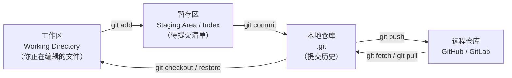

+++
title = "第40章 Git 版本控制——代码的时光机"
weight = 400
date = "2026-03-30T14:33:56.925+08:00"
type = "docs"
description = ""
isCJKLanguage = true
draft = false
+++
# 第四十章 Git 版本控制——代码的时光机

> "代码写崩了怎么办？——还好我有 Git 这个后悔药。" 

先看一张全局图，它把 Git 最核心的"三个区域"和常用命令串在了一起：



往回走的箭头同样重要：`git restore` 能把工作区的改动丢掉，`git reset` 能把暂存区或分支指针退回以前的位置——本章后面会逐一讲到。

你有没有过这样的经历：凌晨三点，写了八百行代码，一运行，满屏红字。你深吸一口气，Ctrl+Z 撤销了...一步。然后电脑卡了，自动关机了，代码没了。那一刻，感觉整个世界都崩塌了。

别怕，Git 来救你了。

Git 是目前世界上最流行的**版本控制系统**（Version Control System，VCS）。所谓版本控制，就是能够记录文件的每一次变更，让你随时可以回到任何一个历史时间点。简单来说，Git 就是你代码的"时光机"。

---

## 40.1 Git 基础

### 40.1.1 Git 是什么？谁发明的？

Git 是由 **Linus Torvalds**（没错，就是 Linux 之父）在 2005 年创造的。当时 BitKeeper 这个商业版本控制系统收回了免费使用权，Linus 一怒之下，花了两周时间自己写了一个分布式版本控制系统。

**分布式版本控制**（Distributed Version Control）的意思是：每个开发者本地都有一份完整的代码仓库副本，包括所有的历史记录。就算服务器炸了，你的本地副本依然完好无损。这可比把鸡蛋放在一个篮子里安全多了。

### 40.1.2 安装 Git

在开始之前，先确保你的电脑上安装了 Git。

**Windows：**

```bash
# 在命令行中输入以下命令检查是否安装
git --version

# 如果没有安装，去 https://git-scm.com 下载安装
```

**macOS（使用 Homebrew）：**

```bash
# 如果没有安装 Homebrew，先安装
/bin/bash -c "$(curl -fsSL https://raw.githubusercontent.com/Homebrew/install/HEAD/install.sh)"

# 然后安装 Git
brew install git

# 验证安装
git --version
# 输出类似：git version 2.51.0
```

**Linux（Ubuntu/Debian）：**

```bash
sudo apt update
sudo apt install git
git --version
```

### 40.1.3 初始化 Git 仓库

所谓**仓库**（Repository），就是一个被 Git 管理的文件夹。Git 会在这里面创建一个隐藏的 `.git` 目录，用来存放所有的版本历史。

```bash
# 创建项目文件夹
mkdir my-java-project
cd my-java-project

# 初始化 Git 仓库
git init

# 输出：
# Initialized empty Git repository in /path/to/my-java-project/.git/
```

> **关于分支名**：Git 2.28 之后可以用 `git init -b main` 一步指定初始分支名。如果你的团队统一用 `main`，建议全局配置一次，省得每次都要改名：
>
> ```bash
> git config --global init.defaultBranch main
> ```
>
> 本章为了照顾老项目，示例里仍然沿用 `master`。下面凡是出现 `master` 的地方，把名字换成你实际的分支名即可。

初始化完成后，Git 会在当前目录创建一个 `.git` 隐藏文件夹。这个文件夹里存放了所有的"剧本"——你代码的每一次变更都会被记录在这里。

> 这个 `.git` 目录**不要手动去改**，更不要直接删——删掉它，这个目录就不再是 Git 仓库，历史记录也随之消失。想"取消版本控制"，正确做法是删掉 `.git` 目录（`rm -rf .git`）**并确认你已经不需要任何历史**。

### 40.1.4 工作区、暂存区与仓库区

理解 Git 的三个核心概念非常重要：

- **工作区**（Working Directory）：就是你肉眼能看到、手能摸到的文件夹。你在这里写代码、改bug、删文件。
- **暂存区**（Staging Area / Index）：也叫索引，是一个即将提交的文件列表。你可以把它理解成"发货前的包裹清单"。
- **仓库区**（Repository / Git Directory）：真正存放历史记录的地方。提交（commit）之后的内容就存在这里。

用一个形象的比喻：

> 你在菜市场买菜。工作区是你手里的购物车，暂存区是你挑好菜、准备结账的区域，仓库区是你把菜买回家放进冰箱。commit（提交）就是"结账并把菜放进冰箱"的动作。

### 40.1.5 添加文件与提交

先随便写一个文件，然后按"查看状态 → 加入暂存区 → 提交"这三步走一遍，感受一下 Git 的节奏：

```bash
# 创建一个 Java 文件
cat > HelloGit.java << 'EOF'
/**
 * 我的第一个 Git 管理的 Java 文件
 * @author JavaLearner
 */
public class HelloGit {
    public static void main(String[] args) {
        System.out.println("Hello, Git! 我的代码被版本控制了！");
    }
}
EOF

# 查看当前 Git 状态
git status

# 输出：
# On branch master
#
# No commits yet
#
# Untracked files:
#   (use "git add <file>..." to include in what will be committed)
#   HelloGit.java
```

Git 告诉你，`HelloGit.java` 是一个"未跟踪的文件"（Untracked），意思是 Git 知道这个文件存在，但还没决定要不要管理它。

```bash
# 添加文件到暂存区
git add HelloGit.java

# 再次查看状态
git status
# 输出：
# Changes to be committed:
#   (use "git rm --cached <file>..." to undo)
#   new file:   HelloGit.java
```

文件已经进入暂存区了。接下来，提交到仓库区：

```bash
# 提交到本地仓库
# -m 参数后面是提交说明，必须填写，且要写得有意义！
git commit -m "feat: 添加 HelloGit 示例类"

# 输出：
# [master (root-commit) a1b2c3d] feat: 添加 HelloGit 示例类
#  1 file changed, 9 insertions(+)
#  create mode 100644 HelloGit.java
```

> 💡 **小贴士**：commit 消息（提交说明）非常重要！好的提交说明应该简洁明了，说明这次提交做了什么。建议使用约定俗成的格式：`type: 描述`，其中 type 可以是 feat（功能）、fix（修复）、docs（文档）、test（测试）等。

### 40.1.6 查看提交历史

每一次 `commit` 都会在历史里留下一条记录，`git log` 就是翻这本"账本"的命令：

```bash
# 查看提交历史
git log

# 输出：
# commit a1b2c3d4e5f6a7b8c9d0e1f2a3b4c5d6e7f8a9b0 (HEAD -> master)
# Author: JavaLearner <java@example.com>
# Date:   Mon Mar 30 21:00:00 2026 +0800
#
#     feat: 添加 HelloGit 示例类
```

注意上面那一长串 `a1b2c3d4e5f6...`，它是 Git 用 SHA-1 算出来的**提交 ID**（Git 也在逐步迁移到 SHA-256）。它**只包含 0-9 和 a-f 这十六个字符**，所以像 `g`、`z` 这种字母永远不会出现在真实的哈希里——看到就说明是伪造的输出。实际使用时你不需要记全，写前 7~8 位就能唯一识别一次提交。

如果你觉得输出太长了，可以用 `--oneline` 简化：

```bash
git log --oneline

# 输出：
# a1b2c3d feat: 添加 HelloGit 示例类
```

### 40.1.7 修改文件与查看差异

修改一下文件，看看 Git 是如何跟踪变更的：

```bash
# 修改 HelloGit.java
cat > HelloGit.java << 'EOF'
/**
 * 我的第一个 Git 管理的 Java 文件（已更新）
 * @author JavaLearner
 */
public class HelloGit {
    public static void main(String[] args) {
        System.out.println("Hello, Git!");
        System.out.println("这是我的第二次修改！");
        // 添加了一个新功能
        sayGoodbye();
    }

    public static void sayGoodbye() {
        System.out.println("Goodbye, Git!");
    }
}
EOF

# 查看文件差异
git diff HelloGit.java
```

`git diff` 会显示文件的当前状态与上一次提交之间的差异。增加的代码行显示为绿色（以 `+` 开头），删除的代码行显示为红色（以 `-` 开头）。

```bash
# 提交这次修改
git add HelloGit.java
git commit -m "feat: 添加 sayGoodbye 方法，完善输出功能"
```

### 40.1.8 撤销操作

Git 最强大的功能之一就是可以"后悔"。

```bash
# 场景1：文件修改了，但还没 add，想撤销
git checkout -- HelloGit.java
# 或者（新版本 Git 语法）
git restore HelloGit.java

# 场景2：文件 add 了，但还没 commit，想撤销（回到工作区）
git reset HEAD HelloGit.java
# 或者
git restore --staged HelloGit.java

# 场景3：已经 commit 了，想回到上一个版本
git reset --hard HEAD^
# 注意：^表示上一个版本，^^表示上上一个版本，或者用 HEAD~1
```

> ⚠️ **警告**：`git reset --hard` 会丢失未提交的修改，使用前请三思！如果你的修改很重要但还没提交，先 `git stash` 暂存一下。

### 40.1.9 .gitignore 文件

有时候我们不想让某些文件被 Git 管理，比如编译后的 `.class` 文件、IDE 的配置文件、日志文件等。

```bash
# 创建 .gitignore 文件
cat > .gitignore << 'EOF'
# 编译生成的 class 文件
*.class

# IDE 配置文件
.idea/
*.iml
.vscode/

# 日志文件
*.log

# Maven/Gradle 构建目录
target/
build/

# 系统文件
.DS_Store
Thumbs.db
EOF

# 查看被忽略的文件状态
git status --ignored
```

---

## 40.2 分支管理

### 40.2.1 什么是分支？

**分支**（Branch）是 Git 最核心的功能之一。想象一下，你正在开发一个新功能，但还没写完，这时候老板突然说"线上有个 bug 必须马上修"。没有分支的话，你就得先把半成品代码放一边，或者硬着头皮提交一个跑不通的版本，再去修 bug，修完后还得想办法把两边的改动揉回一起……想想就头疼。

有了分支，你可以这样理解：

- **主分支**（master/main）：生产环境的代码，稳定的、可以部署的。
- **功能分支**（feature branch）：你正在开发的新功能，独立于主分支。
- **修复分支**（hotfix branch）：紧急修复线上 bug 的分支。

Git 的分支就像一棵树的枝干。从主干（master）上长出分支（feature/xxx），在分支上工作，完成后合并回主干。一切就是这么自然。

### 40.2.2 创建与切换分支

分支的创建和切换只涉及两个命令：`git branch` 负责创建和查看，切换则交给 `git switch`（老写法是 `git checkout`）：

```bash
# 查看当前所有分支（* 表示当前所在分支）
git branch

# 输出：
# * master
#   只有 master 一个分支

# 创建新分支
git branch feature-login

# 切换到新分支
git checkout feature-login
# 或者（新版本 Git）
git switch feature-login

# 输出：
# Switched to branch 'feature-login'

# 再次查看分支
git branch
# 输出：
# * feature-login
#   master
```

我们也可以一步到位，创建并切换到新分支：

```bash
# 创建并切换（常用）
git checkout -b feature-register
# 或者
git switch -c feature-register
```

### 40.2.3 在分支上开发

切换到功能分支后，我们来写点代码：

```bash
# 确保在 feature-login 分支
git checkout feature-login

# 创建一个登录相关的 Java 类
mkdir -p com/example/auth
cat > com/example/auth/LoginService.java << 'EOF'
package com.example.auth;

/**
 * 登录服务类
 */
public class LoginService {
    private String username;
    private String password;

    public LoginService(String username, String password) {
        this.username = username;
        this.password = password;
    }

    /**
     * 执行登录验证
     * @return 登录是否成功
     */
    public boolean login() {
        // 简单的验证逻辑
        if (username != null && password != null) {
            System.out.println("用户 " + username + " 登录成功！");
            return true;
        }
        System.out.println("登录失败：用户名或密码错误！");
        return false;
    }
}
EOF

# 添加并提交
git add .
git commit -m "feat: 添加登录服务类"
```

### 40.2.4 合并分支

假设我们在 `feature-login` 分支上完成了登录功能的开发，现在需要把它合并回 `master` 分支：

```bash
# 1. 先切换回主分支
git checkout master
# 或者
git switch master

# 2. 合并 feature-login 分支
git merge feature-login

# 输出：
# Merge made by the 'ort' strategy.
#  1 file changed, 28 insertions(+)
#  create mode 100644 com/example/auth/LoginService.java
```

> 🔔 **注意**：如果合并时出现"冲突"（conflict），说明两个分支修改了同一文件的同一位置。这时候需要手动解决冲突，然后重新 `git add` 和 `git commit`。

上面输出里的 `'ort'` 是合并策略的名字。老版本 Git 输出的是 `'recursive'`，Git 2.33 起把默认策略换成了 `ort`——**性能更好，而且冲突标记更清晰**。你看到哪个名字都正常，取决于本机 Git 版本。

### 40.2.5 删除分支

功能开发完成并且合并后，就可以删除功能分支了：

```bash
# 删除已合并的分支
git branch -d feature-login

# 输出：
# Deleted branch feature-login (was abc1234).

# 如果分支还没合并，强制删除
git branch -D feature-register
```

### 40.2.6 解决合并冲突

当两个分支修改了同一文件的同一位置时，Git 无法自动合并，需要手动解决冲突：

```bash
# 假设在合并时出现冲突
git merge feature-conflict

# 输出：
# Auto-merging HelloGit.java
# CONFLICT (content): Merge conflict in HelloGit.java
# Automatic merge failed; fix conflicts and then commit the result.
```

打开冲突文件，会看到类似这样的标记：

```java
<<<<<<< HEAD
    public static void main(String[] args) {
        System.out.println("主分支的代码");
    }
=======
    public static void main(String[] args) {
        System.out.println("功能分支的代码");
    }
>>>>>>> feature-conflict
```

你需要手动编辑，决定保留哪部分代码，或者把两部分合并。解决完后：

```bash
# 添加解决后的文件
git add HelloGit.java

# 完成合并提交
git commit -m "merge: 解决与 feature-conflict 的冲突，保留两处修改"
```

### 40.2.7 储藏工作（git stash）

当你正在写代码写到一半，突然要切换分支去修 bug，但又不不想提交半成品怎么办？

```bash
# 暂存当前未提交的工作
git stash

# 输出：
# Saved working directory and index state WIP on master: abc1234 feat: 添加 HelloGit

# 切换分支干活
git checkout hotfix-branch
# ... 修 bug ...

# 修完后回到原分支
git checkout master

# 恢复之前的工作
git stash pop

# 输出：
# Dropped refs/stash@{0} (a1b2c3d4e5f6a7b8c9d0e1f2a3b4c5d6e7f8a9b0)
```

`git stash` 就像一个临时的保险箱，把你未完成的工作先存起来，之后再取出来继续。

几个和 stash 有关的实用细节：

- `git stash` **默认只存已跟踪文件的改动**。新建了但还没 `git add` 的文件不会被存进去——要么先 `git add`，要么用 `git stash -u`（含未跟踪文件）、`git stash -a`（连被 `.gitignore` 忽略的文件也存）。
- 想留个说明、方便以后认出来：`git stash push -m "登录功能写了一半"`。
- 存了多个 stash 时用 `git stash list` 查看，`git stash pop stash@{1}` 取指定的那一个（`pop` 取出并删除，`apply` 取出但保留）。
- **stash 不是备份**：它只存在于本地的 `.git` 里，不会随 `push` 到远程。换电脑、重装系统之前，记得把它变成真正的提交。

---

## 40.3 GitHub 协作

### 40.3.1 GitHub 是什么？

**GitHub**（https://github.com）是全球最大的**代码托管平台**（Code Hosting Platform），基于 Git 进行版本控制。它就像一个"云端代码仓库"，你可以把自己的代码上传上去，也可以看到全世界开源项目的代码。

> 📝 **术语解释**：
> - **Remote（远程仓库）**：托管在云端的 Git 仓库，比如 GitHub、GitLab、Gitee（码云）等。
> - **Clone（克隆）**：把远程仓库复制到本地。
> - **Push（推送）**：把本地仓库的提交上传到远程仓库。
> - **Pull（拉取）**：把远程仓库的更新下载到本地并合并。

### 40.3.2 创建 GitHub 账号与配置 SSH

要使用 GitHub，第一步当然是注册账号。

1. 访问 https://github.com，点击"Sign up"注册。
2. 选择免费计划（Free），创建你的用户名和密码。

接下来配置 SSH 密钥，让你的电脑可以安全地与 GitHub 通信：

```bash
# 1. 检查是否已有 SSH 密钥
ls -la ~/.ssh

# 2. 生成新的 SSH 密钥（替换为你的邮箱）
ssh-keygen -t ed25519 -C "your_email@example.com"

# 输出：
# Generating public/private ed25519 key pair.
# Enter file in which to save the key (~/.ssh/id_ed25519):
# Enter passphrase (empty for no passphrase):
# Enter same passphrase again:

# 3. 查看公钥内容
cat ~/.ssh/id_ed25519.pub
# 输出类似：ssh-ed25519 AAAAC3NzaC1lZDI1NTE5AAAA... your_email@example.com

# 4. 复制公钥，添加到 GitHub：
#    Settings -> SSH and GPG keys -> New SSH key -> 粘贴公钥
```

> **两个容易卡住新手的点**：
> 1. 要复制的是**公钥**（`id_ed25519.pub`），不是没有 `.pub` 后缀的私钥。私钥永远只留在自己电脑上，发给任何人、任何平台都不行。
> 2. 生成密钥时如果设置了 passphrase（口令），每次连接都要输入；想省事可以用 `ssh-add --apple-use-keychain ~/.ssh/id_ed25519`（macOS）或 `ssh-add ~/.ssh/id_ed25519` 把它交给 ssh-agent 缓存起来。
>
> 另外，如果第 5 步用测试命令 `ssh -T git@github.com` 验证不通，先看报错是 `Permission denied`（密钥没配上）还是 `Connection timed out`（网络问题）——两者的排查方向完全不同。

### 40.3.3 在 GitHub 上创建仓库

1. 登录 GitHub，点击右上角的 "+" -> "New repository"
2. 填写仓库信息：
   - Repository name：`my-java-project`（仓库名）
   - Description：`我的 Java 学习项目`（描述）
   - Public / Private：选择公开或私有
   - 勾选"Add a README file"（添加 README 文件）
3. 点击"Create repository"

### 40.3.4 克隆远程仓库

仓库在 GitHub 上建好之后，第一步就是把它复制到本地。`git clone` 会自动帮你做三件事：下载全部历史、建好工作区、把远程地址记成 `origin`：

```bash
# 克隆你刚创建的仓库（替换为你的仓库地址）
git clone git@github.com:yourusername/my-java-project.git

# 输出：
# Cloning into 'my-java-project'...
# remote: Enumerating objects: done.
# remote: Counting objects: done.
# remote: Compressing objects: done.
# Receiving objects: 100%, done.

# 进入项目目录
cd my-java-project
```

### 40.3.5 推送代码到远程仓库

之前我们在本地创建了 Git 仓库，现在把它推送到 GitHub：

```bash
# 添加远程仓库地址（origin 是远程仓库的默认名称）
git remote add origin git@github.com:yourusername/my-java-project.git

# 查看远程仓库信息
git remote -v

# 输出：
# origin  git@github.com:yourusername/my-java-project.git (fetch)
# origin  git@github.com:yourusername/my-java-project.git (push)

# 推送代码到远程仓库的 master 分支
# -u 参数设置上游分支，以后可以直接用 git push
git push -u origin master

# 输出：
# Enumerating objects: 3, done.
# Counting objects: 100%, done.
# Writing objects: 100%, done.
# remote: Resolving deltas: done.
# To github.com:yourusername/my-java-project.git
#    abc1234..def5678  master -> master
```

现在刷新你的 GitHub 页面，就能看到你的代码了！

### 40.3.6 团队协作：Fork 与 Pull Request

GitHub 的协作模式通常是这样的：

1. **Fork**：把你想要参与的项目复制一份到你的 GitHub 账号下。
2. **Clone**：把 Fork 后的仓库克隆到本地。
3. **修改**：在你的本地仓库里修改代码。
4. **Push**：把修改推送到你的 GitHub 仓库。
5. **Pull Request（PR）**：向原项目提交一个"拉取请求"，申请把你的修改合并进去。

```bash
# 假设你想参与一个开源项目
# 1. 在 GitHub 上 Fork 这个项目到你的账号

# 2. 克隆你 Fork 后的仓库
git clone git@github.com:yourusername/some-open-source-project.git

# 3. 创建自己的功能分支
git checkout -b fix-bug-123

# 4. 修改代码并提交
# ... 编辑文件 ...
git add .
git commit -m "fix: 修复了某个bug"

# 5. 推送到你的 GitHub 仓库
git push -u origin fix-bug-123

# 6. 在 GitHub 上创建 Pull Request
#    点击 "Compare & pull request" 按钮，填写说明，然后提交
```

原项目的维护者会收到你的 PR，他们审核代码后决定是否合并。

### 40.3.7 同步远程更新

当别人修改了远程仓库，你需要把这些更新同步到本地：

```bash
# 拉取远程更新并合并
git pull origin master

# 或者分两步走
git fetch origin      # 获取远程更新（不合并）
git merge origin/master  # 合并到当前分支
```

### 40.3.8 Git 标签（Tag）

**标签**（Tag）用于标记特定的提交版本，通常用于发布版本号，比如 v1.0.0、v2.1.0 等。

```bash
# 创建轻量标签
git tag v1.0.0-rc1

# 创建附注标签（推荐，包含更多信息）
git tag -a v1.0.0 -m "第一个正式版本"

# 查看所有标签
git tag

# 推送标签到远程
git push origin v1.0.0

# 或者推送所有标签
git push origin --tags
```

轻量标签和附注标签的区别值得记一下：**轻量标签只是一个指向某次提交的"书签"**，不含额外信息；附注标签是仓库里一个真正的对象，包含打标签的人、时间、说明，还能用 GPG 签名。发布正式版本请用附注标签——`git describe` 和 GitHub 的 Release 页面都更认它。

还有两点：**打了标签不等于推送到远程**，必须显式 `git push origin <标签名>`；删除本地标签用 `git tag -d v1.0.0`，删除远程标签则要 `git push origin --delete v1.0.0`（或者 `git push origin :refs/tags/v1.0.0`）。

### 40.3.9 用 HTTPS 还是 SSH？

前面用的是 SSH（`git@github.com:...`），其实还有另一种方式：HTTPS（`https://github.com/...`）。两者都能用，区别在这里：

| 对比项 | SSH | HTTPS |
|--------|-----|-------|
| 地址形式 | `git@github.com:user/repo.git` | `https://github.com/user/repo.git` |
| 认证方式 | 密钥对（一次配好，长期有效） | 用户名 + **个人访问令牌（PAT）** |
| 是否需要网络限制 | 22 端口被公司网络封了就走不通 | 走 443 端口，基本不会被封 |
| 典型场景 | 自己的机器、长期使用 | CI 环境、临时克隆、只读拉取 |

特别注意：**GitHub 从 2021 年 8 月起就不再支持用账号密码做 Git 操作了**，HTTPS 方式必须用 Personal Access Token（Settings → Developer settings → Personal access tokens）。如果推送时反复弹窗让你输密码却总失败，八成就是这里的问题。想避免反复输入，可以配置凭据缓存：

```bash
# macOS 用钥匙串保存凭据
git config --global credential.helper osxkeychain

# Linux
git config --global credential.helper store
```

### 40.3.10 最佳实践与团队规范

在实际团队协作中，建议遵循以下规范：

**分支命名规范：**

```bash
feature/user-login      # 新功能
fix/checkout-bug       # 修复 bug
hotfix/critical-error  # 紧急修复
release/v1.0.0         # 发布版本
```

**Commit 消息规范：**

```bash
feat: 添加用户登录功能
fix: 修复购物车结算金额错误
docs: 更新 README 文档
style: 格式化代码（不影响功能）
refactor: 重构代码（不影响功能）
test: 添加单元测试
chore: 构建或辅助工具的变动
```

**Git Flow 工作流：**

- `master` 分支：始终保持可发布状态
- `develop` 分支：开发分支，汇总所有功能
- `feature/*` 分支：从 develop 分出，开发新功能
- `release/*` 分支：从 develop 分出，准备发布
- `hotfix/*` 分支：从 master 分出，紧急修复

---

## 40.4 常见坑与几条"救命命令"

### 40.4.1 手抖提交错了、`reset --hard` 删没了怎么办？

**`git reflog` 是 Git 里最后一道保险**。它记录的是"HEAD 一段时间内移动过的地方"——也就是你每一次提交、切换分支、重置、rebase 的轨迹。只要对象还没有被垃圾回收（默认 90 天内不会被清理），你几乎总能把它捞回来：

```bash
# 1. 看看 HEAD 最近都去过哪里
git reflog
# 输出形如：
# a1b2c3d HEAD@{0}: reset: moving to HEAD^
# d4e5f6a HEAD@{1}: commit: feat: 添加订单校验   <-- 就是这次被 reset 掉了

# 2. 把丢失的提交捡回来（两种方式选一种）
git branch rescue d4e5f6a     # 方式一：新建一个分支指向它，安全
git reset --hard d4e5f6a      # 方式二：直接让当前分支回到那次提交
```

记住这个口径：**"提交过的东西基本不会真丢，没提交过的东西才真的危险"**。所以养成"小步提交"的习惯，比任何救援技巧都有用。

### 40.4.2 `git pull` 拉出一堆 merge 提交

多人协作时，如果本地和远程都有新提交，`git pull` 默认会创建一次"合并提交"，时间线变得像麻花。很多人更愿意用变基的方式拉取：

```bash
# 把本地还没推送的提交"挪到"远程最新提交之后，时间线是一条直线
git pull --rebase

# 让它成为默认行为（推荐）
git config --global pull.rebase true
```

**但有一条铁律**：已经推送到共享分支、别人可能基于它工作的提交，**不要 rebase**。rebase 会重写提交 ID，别人拉取时就会冲突不断。个人分支随便用，共享分支老老实实用 merge。

### 40.4.3 一换系统就"整个文件都变了"

Windows 用 CRLF（`\r\n`）换行，Linux/macOS 用 LF（`\n`）。跨平台协作时，Git 可能把整个文件都标记成"被修改"，diff 完全没法看。解决办法是在仓库根目录放一个 `.gitattributes`：

```bash
# .gitattributes：让仓库里统一存 LF，检出到工作区时按平台自动转换
* text=auto
*.java text eol=lf
*.sh   text eol=lf
*.bat  text eol=crlf
*.png  binary
```

Windows 上还可以配合 `git config --global core.autocrlf true`；macOS/Linux 上一般用 `core.autocrlf input`。

### 40.4.4 其他高频小坑

| 现象 | 原因与处理 |
|------|-----------|
| `git push` 被拒绝，提示 `non-fast-forward` | 远程有你本地没有的提交。先 `git pull --rebase` 再推送；**不要**直接 `git push -f` 覆盖别人的工作 |
| 提示 `detached HEAD`（游离头指针） | 你 checkout 到了某个提交而不是分支。想保留改动就 `git switch -c 新分支名`，不想要就 `git switch -` 回到原分支 |
| 提交进去了不该提交的文件（如密码、`.env`） | 先 `git rm --cached 文件名` 并写进 `.gitignore`；**注意历史里仍然有它**，敏感信息必须立即作废重发，必要时用 `git filter-repo` 清洗历史 |
| `.gitignore` 写了却不生效 | 文件已经被跟踪了，忽略规则对**已跟踪文件**无效。先 `git rm --cached` 再提交 |
| 仓库突然变得特别大 | 大概率是提交了二进制大文件或构建产物。用 `git count-objects -vH` 看体积，历史清理用 `git filter-repo`；大文件应该交给 Git LFS |

---

## 本章小结

本章我们学习了 Git 版本控制的核心知识：

| 概念 | 说明 |
|------|------|
| **仓库（Repository）** | 被 Git 管理的文件夹，包含完整的版本历史 |
| **工作区** | 你的代码文件所在的工作目录 |
| **暂存区（Staging Area）** | 准备提交的文件列表 |
| **提交（Commit）** | 把暂存区的内容记录到历史中，每次提交都有唯一的 ID |
| **分支（Branch）** | 独立的开发线，允许同时开发多个功能而不互相影响 |
| **合并（Merge）** | 将不同分支的代码合并到一起 |
| **冲突（Conflict）** | 两个分支修改了同一文件同一位置，需要手动解决 |
| **远程仓库（Remote）** | 托管在云端的仓库，如 GitHub |
| **克隆（Clone）** | 把远程仓库复制到本地 |
| **推送（Push）** | 把本地提交上传到远程 |
| **拉取（Pull）** | 从远程下载更新并合并到本地 |

**核心命令一览：**

```bash
# 初始化与配置
git init                    # 初始化仓库
git config --global user.name "你的名字"
git config --global user.email "你的邮箱"

# 基本操作
git add <文件>              # 添加到暂存区
git commit -m "消息"        # 提交到仓库
git status                  # 查看状态
git log                     # 查看历史
git diff                    # 查看差异

# 分支操作
git branch                  # 查看分支
git branch <分支名>         # 创建分支
git switch <分支名>         # 切换分支（推荐，Git 2.23+）
git switch -c <分支名>      # 创建并切换
git merge <分支名>          # 合并分支
git branch -d <分支名>      # 删除分支

# 撤销与恢复
git restore <文件>              # 丢弃工作区改动（危险）
git restore --staged <文件>     # 从暂存区撤出，保留工作区改动
git reflog                      # 查看 HEAD 的移动轨迹，最后一道保险

# 远程操作
git remote add origin <URL> # 添加远程仓库
git clone <URL>             # 克隆仓库
git push                    # 推送
git pull                    # 拉取
git fetch                   # 获取更新

# 其他
git stash                   # 储藏工作
git tag v1.0.0              # 创建标签
```

> 顺带说一句：`git checkout` 这个命令承担了太多职责（切分支、丢弃文件、检出文件），所以 Git 2.23 之后把它拆成了 `git switch`（只管切分支）和 `git restore`（只管恢复文件）。`checkout` 仍然可用，但在新代码和教程里，看到 `switch` / `restore` 更符合现在的习惯。

Git 是现代软件开发不可或缺的工具，无论是个人项目还是团队协作，熟练掌握 Git 都能让你事半功倍。记住，Git 不仅仅是工具，更是你的代码"时光机"——它让你在代码的历史长河中自由穿梭，再也不用担心"写崩了回不去了"的噩梦。

> 🚀 **下章预告**：下一章我们来聊聊 Java 开发中最容易踩的那些坑——空指针、浮点数精度、`equals` 与 `hashCode`、集合的并发修改异常……这些都是面试必问、线上必炸的高频问题。
