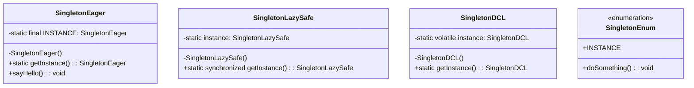
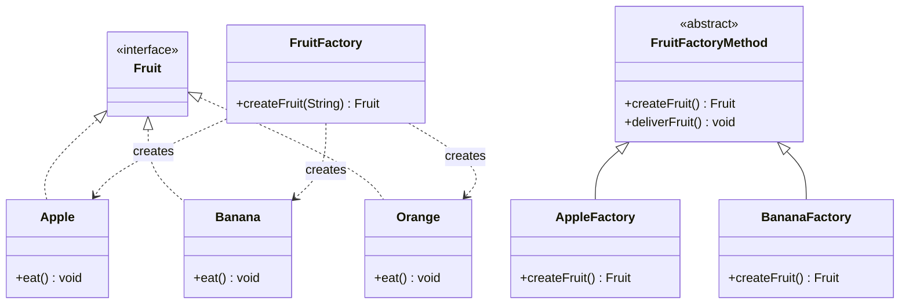
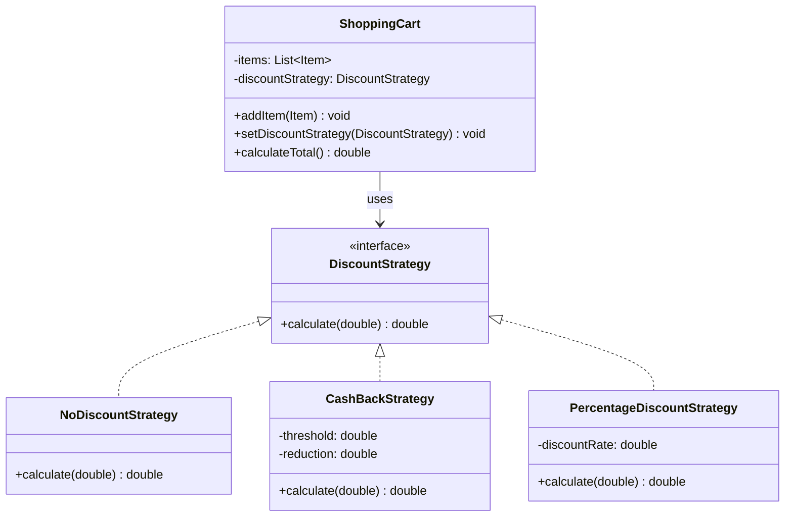
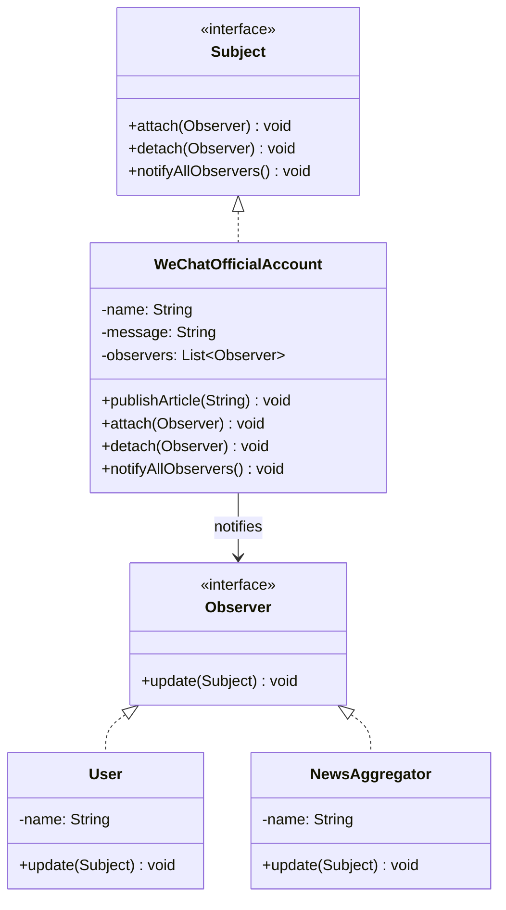
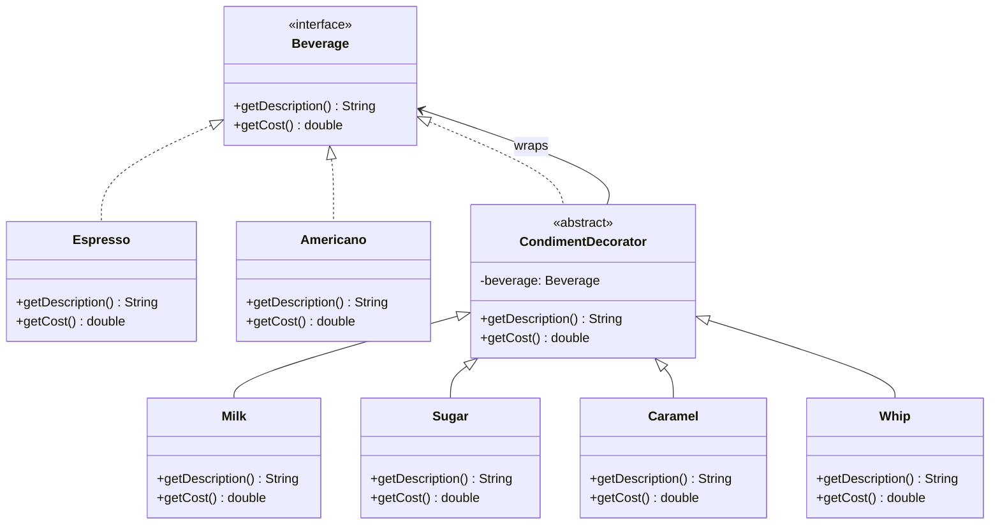
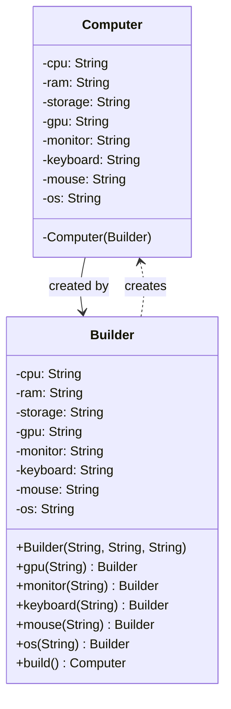

+++
title = "第48章 设计模式——程序员的套路"
weight = 480
date = "2026-03-30T14:33:56.935+08:00"
type = "docs"
description = ""
isCJKLanguage = true
draft = false
+++
# 第四十八章 设计模式——程序员的套路

> "程序员的代码写得像迷宫？设计模式就是那张地图。" ——某不愿透露姓名的架构师

**设计模式**（Design Pattern）是什么？简单来说，就是前辈程序员们踩过无数坑之后，总结出来的「最佳套路」。你可以把它们理解成烹饪里的菜谱——同样的食材，大厨用菜谱做出来的叫米其林，你直接下锅炒出来的叫黑暗料理。

设计模式主要分为三大类：

- **创建型模式**：研究怎么 new 对象，比如单例、工厂、建造者
- **结构型模式**：研究怎么组装类，比如装饰器、适配器、代理
- **行为型模式**：研究怎么分配职责，比如策略、观察者、模板方法

今天我们挑六个最常用的来讲，包你听懂、记住、能上手。

---

## 48.1 单例模式

### 48.1.1 什么是单例模式

**单例模式**（Singleton Pattern）：保证一个类只有一个实例，并提供一个全局访问点。

这就好比——公司的公章只有一枚，放在总裁办公室，谁要用都得来找你借。你（这个类）就是那个唯一的实例。

什么场景用它？日志对象、配置管理、数据库连接池、线程池……总之"全局只该有一个"的东西，就用单例。

### 48.1.2 懒汉式 vs 饿汉式

先看**饿汉式**（Eager Initialization）——类加载时就创建实例，"饿"得迫不及待：

```java
/**
 * 饿汉式单例
 * 类加载时就创建实例，线程安全，但可能浪费资源
 */
public class SingletonEager {

    // 类加载时就创建，final保证唯一性
    private static final SingletonEager INSTANCE = new SingletonEager();

    // 私有构造函数，防止外部 new
    private SingletonEager() {
    }

    // 唯一对外暴露的访问点
    public static SingletonEager getInstance() {
        return INSTANCE;
    }

    public void sayHello() {
        System.out.println("大家好，我是唯一的实例！");
    }
}
```

再看**懒汉式**（Lazy Initialization）——第一次使用时才创建，"懒"得不想动：

```java
/**
 * 懒汉式单例（线程不安全版）
 * 延迟加载，但多线程下可能创建多个实例
 */
public class SingletonLazy {

    private static SingletonLazy instance;

    private SingletonLazy() {
    }

    public static SingletonLazy getInstance() {
        if (instance == null) {
            // ⚠️ 危险！多线程下这里可能同时通过，创建多个实例
            instance = new SingletonLazy();
        }
        return instance;
    }
}
```

线程安全版懒汉，加个 `synchronized`：

```java
/**
 * 懒汉式单例（线程安全版）
 * 使用 synchronized 保证线程安全，但性能开销较大
 */
public class SingletonLazySafe {

    private static SingletonLazySafe instance;

    private SingletonLazySafe() {
    }

    // 同步方法，每次调用都要抢锁，性能差
    public static synchronized SingletonLazySafe getInstance() {
        if (instance == null) {
            instance = new SingletonLazySafe();
        }
        return instance;
    }
}
```

### 48.1.3 双重检查锁定（DCL）

既想延迟加载，又想线程安全，还想高性能？来，上**双重检查锁定**（Double-Checked Locking）：

```java
/**
 * 双重检查锁定单例
 * 既保证延迟加载，又保证线程安全，性能优秀
 */
public class SingletonDCL {

    // volatile 防止指令重排序，确保实例完全构造后才被使用
    private static volatile SingletonDCL instance;

    private SingletonDCL() {
    }

    public static SingletonDCL getInstance() {
        // 第一次检查：避免不必要的同步
        if (instance == null) {
            synchronized (SingletonDCL.class) {
                // 第二次检查：确保只创建一个实例
                if (instance == null) {
                    instance = new SingletonDCL();
                    // 上面这行代码背后做了三件事：
                    // 1. 分配内存
                    // 2. 调用构造函数
                    // 3. 将引用指向内存地址
                    // 没有 volatile，步骤2和3可能重排序，导致其他线程看到未构造完的对象
                }
            }
        }
        return instance;
    }
}
```

> 💡 **volatile 关键字**：保证变量的可见性和有序性。在 DCL 中，`instance = new SingletonDCL()` 不是原子操作，JVM 可能先分配内存再执行构造函数，volatile 就是用来堵这个洞的。

### 48.1.4 枚举单例（最推荐）

Effective Java 的作者 Josh Bloch 大喊："用枚举做单例！"

```java
/**
 * 枚举单例——最简洁、最安全、最推荐的写法
 * 不仅能防止反射和反序列化攻击，还能保证线程安全
 */
public enum SingletonEnum {
    INSTANCE;

    public void doSomething() {
        System.out.println("枚举单例，天然防弹！");
    }
}

// 使用起来非常简单
public class SingletonEnumDemo {
    public static void main(String[] args) {
        SingletonEnum instance = SingletonEnum.INSTANCE;
        instance.doSomething();
    }
}
```

枚举单例的好处：

- **反射安全**：构造函数被强制私有化，枚举的构造函数自动被 JVM 处理
- **反序列化安全**：枚举天然免疫，即使你把对象序列化再反序列化，拿到的还是同一个实例
- **线程安全**：枚举的创建在 JVM 层面就是线程安全的

### 48.1.5 UML 类图



---

## 48.2 工厂模式

### 48.2.1 什么是工厂模式

**工厂模式**（Factory Pattern）：定义一个创建对象的接口，让子类决定实例化哪个类。工厂负责"造对象"，调用者不需要知道对象是怎么 new 出来的。

这就好比点外卖——你不需要去菜市场买菜、回家切菜、开火炒菜，你只需要打开 App 点单，外卖小哥（工厂）会把做好的饭菜送到你手上。

工厂模式分为三种：

- **简单工厂**：一个工厂生产所有产品（简单但不够灵活）
- **工厂方法**：每个产品对应一个工厂子类（符合开闭原则）
- **抽象工厂**：生产一系列相关产品（产品族）

### 48.2.2 简单工厂

先上水果！定义一个水果接口：

```java
/**
 * 水果接口——所有水果都要实现这个接口
 */
public interface Fruit {
    // 吃水果
    void eat();
}

/**
 * 苹果
 */
public class Apple implements Fruit {
    @Override
    public void eat() {
        System.out.println("吃苹果，嘎嘣脆！");
    }
}

/**
 * 香蕉
 */
public class Banana implements Fruit {
    @Override
    public void eat() {
        System.out.println("吃香蕉，剥皮直接啃！");
    }
}

/**
 * 橙子
 */
public class Orange implements Fruit {
    @Override
    public void eat() {
        System.out.println("吃橙子，得剥皮或者切开！");
    }
}
```

简单工厂来了：

```java
/**
 * 水果工厂——简单工厂的核心
 * 一个工厂生产所有类型的水果
 */
public class FruitFactory {

    // 根据类型字符串创建水果
    public static Fruit createFruit(String type) {
        switch (type) {
            case "apple":
                return new Apple();
            case "banana":
                return new Banana();
            case "orange":
                return new Orange();
            default:
                throw new IllegalArgumentException("不支持的水果类型: " + type);
        }
    }
}

// 客户端代码
public class FruitFactoryDemo {
    public static void main(String[] args) {
        Fruit apple = FruitFactory.createFruit("apple");
        apple.eat();  // 输出: 吃苹果，嘎嘣脆！

        Fruit banana = FruitFactory.createFruit("banana");
        banana.eat();  // 输出: 吃香蕉，剥皮直接啃！
    }
}
```

简单工厂的缺点：每加一个新产品，就得修改工厂类，违反**开闭原则**（对扩展开放，对修改关闭）。

### 48.2.3 工厂方法

**工厂方法模式**：定义一个创建对象的抽象方法，让子类决定实例化哪个类。每个产品都有自己专属的工厂。

```java
/**
 * 抽象工厂——定义创建水果的抽象方法
 */
public abstract class FruitFactoryMethod {

    // 抽象方法，子类必须实现
    public abstract Fruit createFruit();

    // 模板方法：定义业务流程，子类可以扩展
    public void deliverFruit() {
        Fruit fruit = createFruit();
        System.out.println("【配送中】");
        fruit.eat();
        System.out.println("【配送完成】");
    }
}

/**
 * 苹果工厂——只负责生产苹果
 */
public class AppleFactory extends FruitFactoryMethod {
    @Override
    public Fruit createFruit() {
        return new Apple();
    }
}

/**
 * 香蕉工厂——只负责生产香蕉
 */
public class BananaFactory extends FruitFactoryMethod {
    @Override
    public Fruit createFruit() {
        return new Banana();
    }
}

// 客户端代码
public class FruitFactoryMethodDemo {
    public static void main(String[] args) {
        FruitFactoryMethod factory = new AppleFactory();
        factory.deliverFruit();
        // 输出:
        // 【配送中】
        // 吃苹果，嘎嘣脆！
        // 【配送完成】

        FruitFactoryMethod bananaFactory = new BananaFactory();
        bananaFactory.deliverFruit();
    }
}
```

工厂方法的好处：新增产品只需要新增一个工厂类，不用修改现有代码。

### 48.2.4 抽象工厂

**抽象工厂模式**：提供一个创建一系列相关或相互依赖对象的接口，而无需指定它们具体的类。

适用场景：产品族（多个产品线）的情况。比如家具工厂，同时生产椅子、桌子、床。

```java
/**
 * 椅子接口
 */
public interface Chair {
    void sit();
}

/**
 * 桌子接口
 */
public interface Table {
    void use();
}

/**
 * 现代风格椅子
 */
public class ModernChair implements Chair {
    @Override
    public void sit() {
        System.out.println("坐在现代简约椅子上，线条流畅！");
    }
}

/**
 * 古典风格椅子
 */
public class ClassicalChair implements Chair {
    @Override
    public void sit() {
        System.out.println("坐在古典雕花椅子上，有内味了！");
    }
}

/**
 * 现代风格桌子
 */
public class ModernTable implements Table {
    @Override
    public void use() {
        System.out.println("使用现代玻璃桌，性冷淡风！");
    }
}

/**
 * 古典风格桌子
 */
public class ClassicalTable implements Table {
    @Override
    public void use() {
        System.out.println("使用红木雕花桌，有钱人的气息！");
    }
}
```

抽象工厂接口：

```java
/**
 * 抽象家具工厂——定义创建家具的抽象方法
 */
public interface FurnitureFactory {
    // 创建椅子
    Chair createChair();
    // 创建桌子
    Table createTable();
}

/**
 * 现代风格家具工厂——生产全套现代家具
 */
public class ModernFurnitureFactory implements FurnitureFactory {
    @Override
    public Chair createChair() {
        return new ModernChair();
    }

    @Override
    public Table createTable() {
        return new ModernTable();
    }
}

/**
 * 古典风格家具工厂——生产全套古典家具
 */
public class ClassicalFurnitureFactory implements FurnitureFactory {
    @Override
    public Chair createChair() {
        return new ClassicalChair();
    }

    @Override
    public Table createTable() {
        return new ClassicalTable();
    }
}

// 客户端代码
public class FurnitureFactoryDemo {
    public static void main(String[] args) {
        // 选择现代风格工厂
        FurnitureFactory modernFactory = new ModernFurnitureFactory();
        Chair modernChair = modernFactory.createChair();
        Table modernTable = modernFactory.createTable();
        modernChair.sit();
        modernTable.use();

        // 选择古典风格工厂
        FurnitureFactory classicalFactory = new ClassicalFurnitureFactory();
        classicalFactory.createChair().sit();
        classicalFactory.createTable().use();
    }
}
```

### 48.2.5 UML 类图



---

## 48.3 策略模式

### 48.3.1 什么是策略模式

**策略模式**（Strategy Pattern）：定义一系列算法，把它们一个个封装起来，并且使它们可以相互替换。

简单说就是——"我不管你用什么算法，反正结果一样就行"。比如排序，你可以用快排、归并、堆排，最终都是把数组排好序，调用者不关心具体算法。

这模式解决什么问题？当你的代码里有一大堆 `if-else` 或 `switch`，每个分支做着类似但略有不同的事情时，策略模式就派上用场了。

### 48.3.2 实战：电商促销

双十一到了，电商网站要做各种促销活动：

```java
/**
 * 折扣策略接口——所有折扣算法都要实现这个接口
 */
public interface DiscountStrategy {
    // 计算折后价格
    double calculate(double originalPrice);
}

/**
 * 无折扣——原价购买
 */
public class NoDiscountStrategy implements DiscountStrategy {
    @Override
    public double calculate(double originalPrice) {
        return originalPrice;
    }
}

/**
 * 满减策略——满100减10
 */
public class CashBackStrategy implements DiscountStrategy {
    private double threshold;  // 满减门槛
    private double reduction;  // 减多少

    public CashBackStrategy(double threshold, double reduction) {
        this.threshold = threshold;
        this.reduction = reduction;
    }

    @Override
    public double calculate(double originalPrice) {
        if (originalPrice >= threshold) {
            return originalPrice - reduction;
        }
        return originalPrice;
    }
}

/**
 * 百分比折扣策略——打8折
 */
public class PercentageDiscountStrategy implements DiscountStrategy {
    private double discountRate;  // 折扣率，0.8表示打8折

    public PercentageDiscountStrategy(double discountRate) {
        this.discountRate = discountRate;
    }

    @Override
    public double calculate(double originalPrice) {
        return originalPrice * discountRate;
    }
}
```

购物车使用策略：

```java
/**
 * 购物车——使用折扣策略来计算价格
 */
public class ShoppingCart {
    private List<Item> items = new ArrayList<>();
    // 当前使用的折扣策略，可以随时切换
    private DiscountStrategy discountStrategy;

    // 添加商品
    public void addItem(Item item) {
        items.add(item);
    }

    // 设置折扣策略
    public void setDiscountStrategy(DiscountStrategy strategy) {
        this.discountStrategy = strategy;
    }

    // 计算总价（使用当前策略）
    public double calculateTotal() {
        double total = items.stream()
                .mapToDouble(Item::getPrice)
                .sum();

        if (discountStrategy != null) {
            return discountStrategy.calculate(total);
        }
        return total;
    }
}

// 商品类
class Item {
    private String name;
    private double price;

    public Item(String name, double price) {
        this.name = name;
        this.price = price;
    }

    public double getPrice() {
        return price;
    }
}

// 客户端代码
public class ShoppingCartDemo {
    public static void main(String[] args) {
        ShoppingCart cart = new ShoppingCart();
        cart.addItem(new Item("iPhone", 8000));
        cart.addItem(new Item("AirPods", 2000));

        // 使用无折扣
        cart.setDiscountStrategy(new NoDiscountStrategy());
        System.out.println("原价: " + cart.calculateTotal());  // 10000

        // 切换到8折
        cart.setDiscountStrategy(new PercentageDiscountStrategy(0.8));
        System.out.println("8折后: " + cart.calculateTotal());  // 8000

        // 切换到满减
        cart.setDiscountStrategy(new CashBackStrategy(5000, 500));
        System.out.println("满5000减500后: " + cart.calculateTotal());  // 9500
    }
}
```

### 48.3.3 策略模式的优点

1. **符合开闭原则**：新增策略不影响原有代码
2. **消除 if-else**：每个策略独立成一个类，代码更清晰
3. **算法可切换**：运行时可以随时更换策略
4. **复用性高**：策略可以在多个地方共用

### 48.3.4 UML 类图



---

## 48.4 观察者模式

### 48.4.1 什么是观察者模式

**观察者模式**（Observer Pattern）：定义对象间的一种一对多依赖关系，当一个对象（被观察者）状态改变时，所有依赖它的对象（观察者）都会收到通知并自动更新。

这个模式在生活中太常见了：

- **微信公众号**：你是订阅者，公众号是发布者。公众号发文章，所有订阅的用户都会收到推送。
- **天气预报**：气象站是发布者，你是订阅者。天气变了，你自动收到通知。
- **拍卖会**：拍卖师是被观察者，竞拍者是观察者。拍卖师喊价，所有竞拍者都听到了。

### 48.4.2 手动实现观察者模式

做一个简单的消息订阅系统：

```java
import java.util.ArrayList;
import java.util.List;

/**
 * 被观察者接口——所有"会发通知的"对象都要实现这个接口
 */
interface Subject {
    // 添加观察者
    void attach(Observer observer);
    // 移除观察者
    void detach(Observer observer);
    // 通知所有观察者
    void notifyAllObservers();
    // 获取发布的内容
    String getMessage();
}

/**
 * 具体被观察者——微信公众号
 */
class WeChatOfficialAccount implements Subject {
    private String name;  // 公众号名称
    private String message;  // 发布的文章
    private List<Observer> observers = new ArrayList<>();  // 订阅者列表

    public WeChatOfficialAccount(String name) {
        this.name = name;
    }

    // 发布新文章
    public void publishArticle(String article) {
        this.message = article;
        System.out.println("【" + name + "】发布了新文章: " + article);
        // 发文后，立刻通知所有订阅者
        notifyAllObservers();
    }

    @Override
    public void attach(Observer observer) {
        observers.add(observer);
    }

    @Override
    public void detach(Observer observer) {
        observers.remove(observer);
    }

    @Override
    public void notifyAllObservers() {
        for (Observer observer : observers) {
            observer.update(this);
        }
    }

    @Override
    public String getMessage() {
        return message;
    }

    public String getName() {
        return name;
    }
}

/**
 * 观察者接口——所有"会收到通知的"对象都要实现这个接口
 */
interface Observer {
    // 当有新消息时，被调用的回调方法
    void update(Subject subject);
}

/**
 * 具体观察者——普通用户
 */
class User implements Observer {
    private String name;

    public User(String name) {
        this.name = name;
    }

    @Override
    public void update(Subject subject) {
        if (subject instanceof WeChatOfficialAccount) {
            WeChatOfficialAccount account = (WeChatOfficialAccount) subject;
            System.out.println("【" + name + "】收到了【" + account.getName() + "】的推送: " + account.getMessage());
        }
    }
}

/**
 * 具体观察者——微信群发助手（可以群发所有订阅的公众号）
 */
class NewsAggregator implements Observer {
    private String name;

    public NewsAggregator(String name) {
        this.name = name;
    }

    @Override
    public void update(Subject subject) {
        if (subject instanceof WeChatOfficialAccount) {
            WeChatOfficialAccount account = (WeChatOfficialAccount) subject;
            System.out.println("【聚合器" + name + "】收集到【" + account.getName() + "】的新文章！");
        }
    }
}

// 客户端代码
public class ObserverPatternDemo {
    public static void main(String[] args) {
        // 创建公众号
        WeChatOfficialAccount coderAccount = new WeChatOfficialAccount("程序员之家");

        // 创建订阅用户
        User xiaoMing = new User("小明");
        User xiaoWang = new User("小王");
        NewsAggregator aggregator = new NewsAggregator("资讯宝");

        // 订阅公众号
        coderAccount.attach(xiaoMing);
        coderAccount.attach(xiaoWang);
        coderAccount.attach(aggregator);

        // 公众号发文章，所有订阅者都会收到通知
        coderAccount.publishArticle("《为什么你的代码总是不够优雅？》");

        System.out.println();

        // 小王取消订阅
        coderAccount.detach(xiaoWang);

        // 再发一篇文章
        coderAccount.publishArticle("《设计模式实战指南》");
    }
}
```

运行结果：

```
【程序员之家】发布了新文章: 《为什么你的代码总是不够优雅？》
【小明】收到了【程序员之家】的推送: 《为什么你的代码总是不够优雅？》
【小王】收到了【程序员之家】的推送: 《为什么你的代码总是不够优雅？》
【聚合器资讯宝】收集到【程序员之家】的新文章！

【程序员之家】发布了新文章: 《设计模式实战指南》
【小明】收到了【程序员之家】的推送: 《设计模式实战指南》
【聚合器资讯宝】收集到【程序员之家】的新文章！
```

### 48.4.3 Java 内置的观察者模式

其实 Java 自带了一套观察者模式！`java.util.Observable` 和 `java.util.Observer`（虽然在新版 Java 中被标记为 `@Deprecated`，因为 Observable 是类而非接口，不够灵活）。

```java
import java.util.Observable;
import java.util.Observer;

/**
 * 使用 Java 内置类的被观察者——气象站
 */
class WeatherStation extends Observable {
    private String weather;

    public void setWeather(String weather) {
        this.weather = weather;
        // 标记状态已改变
        setChanged();
        // 通知所有观察者
        notifyObservers(weather);
    }
}

/**
 * 使用 Java 内置接口的观察者——手机App
 */
class WeatherApp implements Observer {
    private String name;

    public WeatherApp(String name) {
        this.name = name;
    }

    @Override
    public void update(Observable o, Object arg) {
        if (arg instanceof String) {
            System.out.println("【" + name + "】收到天气更新: " + arg);
        }
    }
}

// 客户端代码
public class BuiltInObserverDemo {
    public static void main(String[] args) {
        WeatherStation station = new WeatherStation();

        WeatherApp app1 = new WeatherApp("小米天气");
        WeatherApp app2 = new WeatherApp("华为天气");

        station.addObserver(app1);
        station.addObserver(app2);

        station.setWeather("晴转多云，26℃");
    }
}
```

> ⚠️ **注意**：Java 9 开始 `Observable` 和 `Observer` 被标记为 `@Deprecated`，实际项目中建议自己定义接口或使用第三方库（如 Guava 的 `EventBus`）。

### 48.4.4 UML 类图



---

## 48.5 装饰器模式

### 48.5.1 什么是装饰器模式

**装饰器模式**（Decorator Pattern）：动态地给对象添加一些额外的职责，就增加功能来说，装饰器模式比继承更灵活。

这个模式听起来很抽象，看个生活中的例子：

你买了杯咖啡（基础组件），然后加了牛奶（装饰）、加了糖（装饰）、加了焦糖酱（装饰）、加了奶油顶（装饰）……最后得到一杯"豪华拿铁"。每加一样东西都是在原有基础上"装饰"一下，而不是去改动咖啡本身的配方。

### 48.5.2 实战：咖啡订单系统

先定义饮料接口：

```java
/**
 * 饮料接口——所有饮料都要实现这个接口
 */
public interface Beverage {
    // 获取描述，如"咖啡"、"拿铁"
    String getDescription();
    // 计算价格
    double getCost();
}

/**
 * 基础饮料——浓缩咖啡
 */
public class Espresso implements Beverage {
    @Override
    public String getDescription() {
        return "浓缩咖啡";
    }

    @Override
    public double getCost() {
        return 25.0;  // 基础价格25元
    }
}

/**
 * 基础饮料——美式咖啡
 */
public class Americano implements Beverage {
    @Override
    public String getDescription() {
        return "美式咖啡";
    }

    @Override
    public double getCost() {
        return 22.0;  // 基础价格22元
    }
}
```

定义抽象装饰器（所有装饰器的基类）：

```java
/**
 * 抽象装饰器——继承 Beverage 接口，同时持有被装饰的对象
 * 这是装饰器模式的核心：装饰器和被装饰对象实现同一个接口
 */
public abstract class CondimentDecorator implements Beverage {
    // 持有被装饰的饮料对象（组合而非继承）
    protected Beverage beverage;

    public CondimentDecorator(Beverage beverage) {
        this.beverage = beverage;
    }

    // 默认实现：委托给被装饰对象
    @Override
    public String getDescription() {
        return beverage.getDescription();
    }

    @Override
    public double getCost() {
        return beverage.getCost();
    }
}
```

具体的装饰器——配料：

```java
/**
 * 牛奶配料
 */
public class Milk extends CondimentDecorator {

    public Milk(Beverage beverage) {
        super(beverage);
    }

    @Override
    public String getDescription() {
        return beverage.getDescription() + " + 牛奶";
    }

    @Override
    public double getCost() {
        // 基础价格 + 牛奶价格
        return beverage.getCost() + 5.0;
    }
}

/**
 * 糖配料
 */
public class Sugar extends CondimentDecorator {

    public Sugar(Beverage beverage) {
        super(beverage);
    }

    @Override
    public String getDescription() {
        return beverage.getDescription() + " + 糖";
    }

    @Override
    public double getCost() {
        return beverage.getCost() + 2.0;
    }
}

/**
 * 焦糖配料
 */
public class Caramel extends CondimentDecorator {

    public Caramel(Beverage beverage) {
        super(beverage);
    }

    @Override
    public String getDescription() {
        return beverage.getDescription() + " + 焦糖";
    }

    @Override
    public double getCost() {
        return beverage.getCost() + 8.0;
    }
}

/**
 * 奶油顶配料
 */
public class Whip extends CondimentDecorator {

    public Whip(Beverage beverage) {
        super(beverage);
    }

    @Override
    public String getDescription() {
        return beverage.getDescription() + " + 奶油";
    }

    @Override
    public double getCost() {
        return beverage.getCost() + 10.0;
    }
}
```

点单代码：

```java
// 客户端代码
public class CoffeeShopDemo {
    public static void main(String[] args) {
        // 订单1：一杯美式咖啡 + 牛奶 + 糖
        Beverage order1 = new Sugar(new Milk(new Americano()));
        System.out.println("订单1: " + order1.getDescription());
        System.out.println("价格: " + order1.getCost() + "元");
        // 输出: 订单1: 美式咖啡 + 牛奶 + 糖
        //      价格: 29.0元

        System.out.println();

        // 订单2：一杯浓缩咖啡 + 牛奶 + 焦糖 + 奶油
        Beverage order2 = new Whip(new Caramel(new Milk(new Espresso())));
        System.out.println("订单2: " + order2.getDescription());
        System.out.println("价格: " + order2.getCost() + "元");
        // 输出: 订单2: 浓缩咖啡 + 牛奶 + 焦糖 + 奶油
        //      价格: 50.0元

        System.out.println();

        // 订单3：双份浓缩 + 双份牛奶 + 焦糖（装饰器可以叠加多层）
        Beverage order3 = new Caramel(
                new Milk(
                        new Milk(
                                new Espresso()
                        )
                )
        );
        System.out.println("订单3: " + order3.getDescription());
        System.out.println("价格: " + order3.getCost() + "元");
        // 输出: 订单3: 浓缩咖啡 + 牛奶 + 牛奶 + 焦糖
        //      价格: 45.0元
    }
}
```

### 48.5.3 装饰器 vs 继承

为什么要用装饰器而不是继承？

| 对比项 | 继承 | 装饰器 |
|--------|------|--------|
| 灵活性 | 编译时决定，不灵活 | 运行时组合，随时增减 |
| 类数量 | 类爆炸（每种组合都需一个类） | 类数量稳定，只增装饰器 |
| 扩展 | 需要修改现有代码 | 新增装饰器即可，不改原有代码 |
| 执行顺序 | 固定 | 按添加顺序执行 |

### 48.5.4 UML 类图



---

## 48.6 建造者模式

### 48.6.1 什么是建造者模式

**建造者模式**（Builder Pattern）：将一个复杂对象的构建与它的表示分离，使得同样的构建过程可以创建不同的表示。

这个模式解决什么问题？当一个对象构造时参数很多、构造逻辑复杂，而且有些参数是可选的，用传统的构造函数会非常麻烦：

```java
// 传统写法——参数列表太长，容易传错
User user = new User("张三", 25, "北京", "138xxxx", true, "男", ...);
// 你真的记得第5个参数是什么意思吗？
```

建造者模式就像**汽车组装流水线**：

- **产品**：最终组装好的汽车
- **抽象建造者**：定义建造汽车的抽象步骤
- **具体建造者**：实现具体的零件装配
- **指挥者**：决定建造的顺序（流水线调度员）

### 48.6.2 实战：电脑组装

先看一个不用建造者模式的例子，感受一下痛点：

```java
/**
 * 电脑类——参数巨多
 */
public class Computer {
    private String cpu;      // 必需
    private String ram;      // 必需
    private String storage;  // 必需
    private String gpu;      // 可选
    private String monitor;  // 可选
    private String keyboard; // 可选
    private String mouse;    // 可选
    private String os;       // 可选

    // 传统构造方式——参数太多，容易出错
    public Computer(String cpu, String ram, String storage, String gpu,
                    String monitor, String keyboard, String mouse, String os) {
        this.cpu = cpu;
        this.ram = ram;
        this.storage = storage;
        this.gpu = gpu;
        this.monitor = monitor;
        this.keyboard = keyboard;
        this.mouse = mouse;
        this.os = os;
    }

    @Override
    public String toString() {
        return "Computer{" +
                "cpu='" + cpu + '\'' +
                ", ram='" + ram + '\'' +
                ", storage='" + storage + '\'' +
                ", gpu='" + gpu + '\'' +
                ", monitor='" + monitor + '\'' +
                ", keyboard='" + keyboard + '\'' +
                ", mouse='" + mouse + '\'' +
                ", os='" + os + '\'' +
                '}';
    }
}
```

用建造者模式重写：

```java
/**
 * 电脑类——不变的部分
 */
public class Computer {
    private String cpu;
    private String ram;
    private String storage;
    private String gpu;
    private String monitor;
    private String keyboard;
    private String mouse;
    private String os;

    // 私有构造函数，只能通过 Builder 创建
    private Computer(Builder builder) {
        this.cpu = builder.cpu;
        this.ram = builder.ram;
        this.storage = builder.storage;
        this.gpu = builder.gpu;
        this.monitor = builder.monitor;
        this.keyboard = builder.keyboard;
        this.mouse = builder.mouse;
        this.os = builder.os;
    }

    @Override
    public String toString() {
        return "Computer{" +
                "cpu='" + cpu + '\'' +
                ", ram='" + ram + '\'' +
                ", storage='" + storage + '\'' +
                ", gpu='" + gpu + '\'' +
                ", monitor='" + monitor + '\'' +
                ", keyboard='" + keyboard + '\'' +
                ", mouse='" + mouse + '\'' +
                ", os='" + os + '\'' +
                '}';
    }

    /**
     * 静态内部类——建造者
     */
    public static class Builder {
        // 必需参数
        private String cpu;
        private String ram;
        private String storage;

        // 可选参数，都有默认值
        private String gpu = "集成显卡";
        private String monitor = "无";
        private String keyboard = "无";
        private String mouse = "无";
        private String os = "无";

        // 构造函数——只接收必需参数
        public Builder(String cpu, String ram, String storage) {
            this.cpu = cpu;
            this.ram = ram;
            this.storage = storage;
        }

        // 可选参数的设置方法，返回 this，支持链式调用
        public Builder gpu(String gpu) {
            this.gpu = gpu;
            return this;
        }

        public Builder monitor(String monitor) {
            this.monitor = monitor;
            return this;
        }

        public Builder keyboard(String keyboard) {
            this.keyboard = keyboard;
            return this;
        }

        public Builder mouse(String mouse) {
            this.mouse = mouse;
            return this;
        }

        public Builder os(String os) {
            this.os = os;
            return this;
        }

        // 最终构建方法
        public Computer build() {
            return new Computer(this);
        }
    }
}

// 客户端代码
public class ComputerBuilderDemo {
    public static void main(String[] args) {
        // 配置1：游戏电脑，参数清晰，不用记顺序
        Computer gamingPC = new Computer.Builder("Intel i9", "64GB", "2TB SSD")
                .gpu("RTX 4090")
                .monitor("27寸 4K")
                .keyboard("机械键盘")
                .mouse("游戏鼠标")
                .os("Windows 11")
                .build();

        System.out.println("游戏电脑配置：");
        System.out.println(gamingPC);

        System.out.println();

        // 配置2：办公电脑，可选参数用默认值
        Computer officePC = new Computer.Builder("Intel i5", "16GB", "512GB SSD")
                .os("Windows 10")
                .build();

        System.out.println("办公电脑配置：");
        System.out.println(officePC);

        System.out.println();

        // 配置3：程序员工作站
        Computer devPC = new Computer.Builder("AMD R9", "128GB", "4TB SSD")
                .gpu("RTX 4080")
                .monitor("34寸 曲面屏")
                .keyboard("静电容键盘")
                .mouse("人体工学鼠标")
                .os("Ubuntu 22.04")
                .build();

        System.out.println("开发工作站配置：");
        System.out.println(devPC);
    }
}
```

运行结果：

```
游戏电脑配置：
Computer{cpu='Intel i9', ram='64GB', storage='2TB SSD', gpu='RTX 4090', monitor='27寸 4K', keyboard='机械键盘', mouse='游戏鼠标', os='Windows 11'}

办公电脑配置：
Computer{cpu='Intel i5', ram='16GB', storage='512GB SSD', gpu='集成显卡', monitor='无', keyboard='无', mouse='无', os='Windows 10'}

开发工作站配置：
Computer{cpu='AMD R9', ram='128GB', storage='4TB SSD', gpu='RTX 4080', monitor='34寸 曲面屏', keyboard='静电容键盘', mouse='人体工学鼠标', os='Ubuntu 22.04'}
```

### 48.6.3 链式调用

建造者模式的一大亮点就是**链式调用**（Fluent API）：

```java
new Computer.Builder("Intel i9", "64GB", "2TB SSD")  // 开始
        .gpu("RTX 4090")    // 链接
        .monitor("27寸 4K") // 链接
        .keyboard("机械键盘") // 链接
        .mouse("游戏鼠标")   // 链接
        .os("Windows 11")  // 链接
        .build();           // 结束
```

每个设置方法都返回 `this`（Builder 本身），所以可以一直 `.` 下去，直到 `.build()` 生成最终对象。这种写法读起来非常自然，像是在说"我要一台 i9 CPU、64GB 内存、2TB 固态硬盘的电脑，显卡要 RTX 4090，显示器要 27 寸 4K……"。

### 48.6.4 建造者模式 vs 工厂模式

| 对比项 | 工厂模式 | 建造者模式 |
|--------|----------|------------|
| 创建对象 | 一次性创建完整对象 | 分步骤构建复杂对象 |
| 参数复杂度 | 参数少且固定 | 参数多，且部分可选 |
| 侧重点 | "创建"（产出什么） | "构建"（怎么组装） |
| 适用场景 | 产品相对简单 | 产品复杂、构造步骤多 |

简单记忆：工厂模式像点菜（选了就没法改），建造者模式像自助餐（自己组合配料）。

### 48.6.5 UML 类图



---

## 本章小结

本章介绍了 Java 中最常用的六种设计模式：

| 模式 | 类型 | 核心思想 | 典型场景 |
|------|------|----------|----------|
| **单例模式** | 创建型 | 保证唯一实例 | 日志、配置、数据库连接池 |
| **工厂模式** | 创建型 | 封装对象创建 | 解耦对象创建与使用 |
| **策略模式** | 行为型 | 算法可互换 | 促销折扣、支付方式、排序算法 |
| **观察者模式** | 行为型 | 一对多通知 | 事件监听、消息订阅、GUI 交互 |
| **装饰器模式** | 结构型 | 动态增强功能 | I/O 流、日志增强、咖啡配料 |
| **建造者模式** | 创建型 | 分步构建复杂对象 | 参数众多的配置对象、SQL 构建 |

**记住的诀窍**：设计模式不是银弹，不要为了用模式而用模式。初学时先理解"这个模式解决什么问题"，等你写的代码多了，自然就会发现"咦，这里好像可以用 XXX 模式优化一下"。

下一章我们将学习 Java 的高级特性——**泛型**（Generics），敬请期待！
