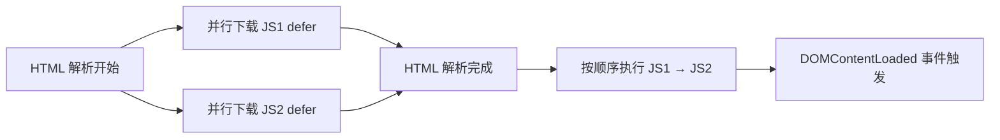
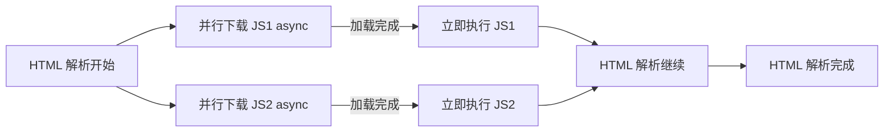
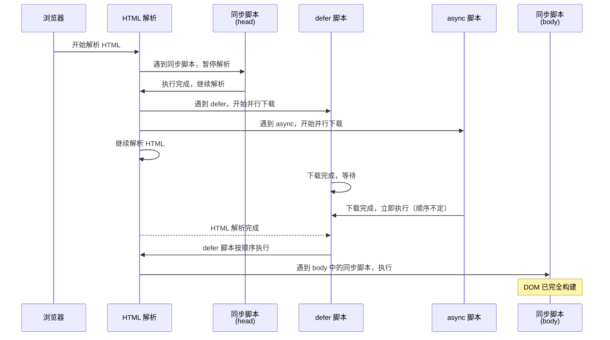

+++
title = "第 1 章 JavaScript 入门"
weight = 10
date = "2026-03-24T22:08:00+08:00"
type = "docs"
description = ""
isCJKLanguage = true
draft = false
+++
# 第 1 章 JavaScript 入门

想象一下，你走进一家餐厅，服务员递给你一份菜单。菜单上写着：「JavaScript」。你心想：「哦，就是那个跟 Java 差不多的东西吧？」——朋友，你不是一个人。几乎每个初学者都掉进过这个坑。别急，咱们先来聊聊 JavaScript 的前世今生，保证让你拍案叫绝。

## 1.1 JavaScript 简介

### JavaScript 的起源与历史

时间拨回到 **1995年**，那时的互联网还是一片蛮荒之地。网景公司（Netscape）正忙着做浏览器，心里琢磨着：「这网页也太无聊了，全是静态文字，能不能让它动起来？」

于是，网景公司找到了一个叫 **Brendan Eich**（埃文·艾希）的大神，对他说：「给我们设计一门脚本语言，十天时间够不够？」

埃文大神微微一笑：「够了。」

然后他用**十天**时间，硬生生撸出了一门编程语言——最早叫 **Mocha**（摸卡），然后改名叫 **LiveScript**（活脚本），最后才定名为 **JavaScript**。

> 所以你看，JavaScript 这个名字，纯粹是一场**市场营销的阴谋**。彼时 Java 语言风头正劲，网景心想：「蹭一下 Java 的热度，说不定能火？」结果这一蹭，就蹭成了全球最流行的编程语言之一。

1996年，网景将 JavaScript 提交给 ECMA 国际（一个制定标准的组织），希望把这门语言标准化。于是，JavaScript 的官方标准名字诞生了：**ECMAScript**，简称 ES。

所以，当你看到 `ES6`、`ES2020` 这样的字眼时，别慌——它们就是 JavaScript 的「官方身份证号」，代表了这门语言的版本和功能。

```javascript
// 来个简单的自我介绍
console.log("我是 JavaScript，1995 年出生，网景公司出品！"); // 我是 JavaScript，1995 年出生，网景公司出品！
console.log("我的官方名字叫 ECMAScript，但大家都叫我 JS"); // 我的官方名字叫 ECMAScript，但大家都叫我 JS
console.log(" Brendan Eich 用十天创造了我，他是个狠人！"); //  Brendan Eich 用十天创造了我，他是个狠人！
```

### JavaScript 与 Java 的关系

这个问题，堪称 JavaScript 界的「玄学之问」。

**JavaScript 和 Java 的关系，大概就相当于「汽车」和「汽车脚垫」的关系。**

没错，它们名字里都有「Java」，但本质上完全是两个东西：

| 对比项 | JavaScript | Java |
|--------|-----------|------|
| 出生时间 | 1995年 | 1995年（同年！） |
| 老爸 | 网景公司（Brendan Eich） | Sun 公司（James Gosling） |
| 运行环境 | 浏览器 + Node.js | 虚拟机（JVM） |
| 类型系统 | 弱类型（不用声明类型） | 强类型（必须声明类型） |
| 代码执行 | 解释执行 | 编译执行 |
| 用途 | 网页交互、后端、小程序... | 企业级应用、Android、大数据... |

JavaScript 的创始人 Brendan Eich 曾经说过：「Java 跟 JavaScript 的关系，就跟「汽车」和「汽车脚垫」一样。」

后来 Oracle 收购了 Sun 公司，顺手也把 JavaScript 的商标给收了。所以现在严格来说，只有 Mozilla 公司可以在官方场合使用「JavaScript」这个名字——但谁在乎呢？地球人都叫它 JavaScript。

```javascript
// 来个形象的比喻
console.log("JavaScript 里的 'Java'，就跟 '汉堡王' 里的 '王' 一样——就是个名字前缀！");
// JavaScript 里的 'Java'，就跟 '汉堡王' 里的 '王' 一样——就是个名字前缀！
```

### JavaScript 的应用场景：浏览器端 / Node.js 后端 / 移动端 / 桌面端 / 小程序

如果说编程语言是一场选秀，那么 JavaScript 绝对是那个「全能型选手」——上得厅堂，下得厨房，写得了网页，敲得了后端。

#### 浏览器端（Browser）

这是 JavaScript 的**老家**。你打开任何一个网页，看到的动画、弹窗、表单验证、轮播图、下拉菜单——八成都是 JavaScript 在背后搞事情。

```javascript
// 浏览器端的经典操作
document.querySelector("button").addEventListener("click", function() {
    alert("你点了我！谢谢惠顾！"); // 点击按钮，弹出提示
});
```

#### Node.js 后端（Server）

2009年，一个叫 **Ryan Dahl**（瑞恩·达尔）的大神觉得：「浏览器都能运行 JavaScript了，为啥服务器不行？」于是他基于 Chrome 的 V8 引擎，搞出了 **Node.js**。

从此，JavaScript 逆天改命，走进了后端的世界。你可以用 JavaScript 写 API、操作数据库、甚至搭建整个网站。

```javascript
// Node.js 后端示例：几行代码创建一个服务器
const http = require("http");

const server = http.createServer((req, res) => {
    res.writeHead(200, { "Content-Type": "text/plain; charset=utf-8" });
    res.end("你好，世界！来自 Node.js 的问候！");
});

server.listen(3000, () => {
    console.log("服务器启动成功，访问 http://localhost:3000"); // 服务器启动成功，访问 http://localhost:3000
});
```

#### 移动端（Mobile）

React Native、Ionic、NativeScript... 这些框架让你可以用 JavaScript 写真正的手机 App，一套代码跑遍 iOS 和 Android。妈妈再也不用担心你学不会 Swift 和 Kotlin 了！

#### 桌面端（Desktop）

Electron 是 GitHub 亲儿子，VS Code 就是用它写的。想象一下：用 JavaScript 写一个桌面应用商店级别的编辑器，这不是科幻，是现实。

```javascript
// Electron 示例：创建一个窗口
const { app, BrowserWindow } = require("electron");

app.whenReady().then(() => {
    const win = new BrowserWindow({
        width: 800,
        height: 600,
        title: "我的第一个 Electron 应用"
    });
    win.loadURL("https://www.example.com");
});
```

#### 小程序（Mini Program）

微信小程序、支付宝小程序、抖音小程序... 虽然各家语法略有不同，但底层都是 JavaScript。换句话说，学会 JavaScript，你就是「小程序全能王」。

```javascript
// 微信小程序示例：页面逻辑
Page({
    data: {
        message: "你好，小程序！"
    },
    onLoad() {
        console.log("页面加载完成！"); // 页面加载完成！
    }
});
```

### 版本演进：ES5 / ES6 / ES2016-ES2024

JavaScript 这几十年，也不是一成不变的。它跟着时代一起进化，功能越来越强大，语法越来越优雅。

#### ES5（2009年）—— 现代化元年

ES5 是 JavaScript 走向「正经语言」的重要一步。引入了：

- `strict` 严格模式
- JSON 内置支持
- `Array` 新方法（`forEach`、`map`、`filter` 等）
- `Object` 新方法（`Object.create`、`Object.defineProperty` 等）

```javascript
"use strict"; // 开启严格模式，向"不规范"说 No

var arr = [1, 2, 3];
arr.forEach(function(item) {
    console.log(item); // 1 2 3（每行一个）
});
```

#### ES6（2015年）—— 史诗级更新

ES6 是 JavaScript 历史上最重要的版本，没有之一。因为它让 JavaScript 从「能用」变成了「好用」。

标志性新特性：

- `let` 和 `const` 变量声明
- 箭头函数 `=>`
- 模板字符串
- 解构赋值
- `Promise` 异步编程
- `Class` 类语法
- `Module` 模块化

```javascript
// ES6 让我们写代码跟说话一样自然
const name = "JavaScript";
let version = "ES6+";

const info = `我是 ${name}，我的版本是 ${version}，我很酷！`;
console.log(info); // 我是 JavaScript，我的版本是 ES6+，我很酷！

// 箭头函数：简洁到没朋友
const add = (a, b) => a + b;
console.log(add(1, 2)); // 3
```

#### ES2016-ES2024 —— 持续进化

从 ES2016 开始，JavaScript 进入了「每年一更」的模式。虽然每年更新的幅度不大，但积少成多，功能越来越丰富。

| 版本 | 年份 | 新特性 |
|------|------|--------|
| ES2016 (ES7) | 2016 | `**` 指数运算符、`Array.prototype.includes()` |
| ES2017 (ES8) | 2017 | `async/await`、字符串填充、共享内存 |
| ES2018 (ES9) | 2018 | 异步迭代、对象展开运算符、正则表达式的命名捕获组 |
| ES2019 (ES10) | 2019 | `Array.prototype.flat()`、`Object.fromEntries()`、可选捕获组 |
| ES2020 (ES11) | 2020 | `BigInt`、`可选链` `?.`、`空值合并运算符` `??` |
| ES2021 (ES12) | 2021 | 逻辑赋值运算符、Promise.any()、数字分隔符 |
| ES2022 (ES13) | 2022 | 顶层 await、Class 私有字段、`at()` 方法 |
| ES2023 (ES14) | 2023 | 数组-find-反向、Hashbang 语法 |
| ES2024 (ES15) | 2024 | `Array.prototype.groupBy()`、正则表达式 `v` 标志 |

```javascript
// ES2020 可选链：再也不用写这种噩梦了
const user = { profile: { name: "张三" } };
// 以前：const name = user && user.profile && user.profile.name;
const name = user?.profile?.name; // 张三
console.log(name);

// ES2020 空值合并运算符：区分 undefined 和 null
const a = null ?? "默认值";  // null -> "默认值"
const b = undefined ?? "默认值"; // undefined -> "默认值"
const c = 0 ?? "默认值";    // 0 -> 0（不会被误判）
console.log(a, b, c); // 默认值 默认值 0
```

## 1.2 HTML 中使用 JavaScript

好，现在你已经知道 JavaScript 是什么了。接下来让我们把它应用到实际场景中——毕竟一门语言不用来写代码，那跟咸鱼有什么区别？

### script 标签：内联脚本与外部脚本

在 HTML 中引入 JavaScript，主要有两种方式：**内联脚本**和**外部脚本**。

**内联脚本**就是直接把代码写在 HTML 文件里，像这样：

```html
<!DOCTYPE html>
<html lang="zh-CN">
<head>
    <meta charset="UTF-8">
    <title>内联脚本示例</title>
</head>
<body>
    <h1>你好，JavaScript！</h1>

    <script>
        // 这里就是 JavaScript 的地盘了！
        console.log("我是内联脚本，我住在 HTML 文件里！");
        document.querySelector("h1").style.color = "red"; // 把标题变成红色
    </script>
</body>
</html>
```

**外部脚本**则是把 JavaScript 代码单独写在一个 `.js` 文件里，然后在 HTML 中引用：

```html
<!DOCTYPE html>
<html lang="zh-CN">
<head>
    <meta charset="UTF-8">
    <title>外部脚本示例</title>
    <!-- 引入外部 JS 文件 -->
    <script src="app.js"></script>
</head>
<body>
    <h1>外部脚本演示</h1>
</body>
</html>
```

```javascript
// app.js 文件内容
console.log("我是外部脚本，我住在独立的 .js 文件里！"); // 我是外部脚本，我住在独立的 .js 文件里！
document.querySelector("h1").textContent = "标题被我改了！";
```

> **什么时候用内联，什么时候用外部？**
>
> - 代码量少、只在这个页面用 → 内联
> - 代码量多、多个页面共用 → 外部脚本
> - 简单说：少就塞进去，多就拆出来

### 外部脚本：src 属性引入 .js 文件

`src` 属性是引入外部 JavaScript 文件的标准方式。你可以引入本地文件，也可以引入网络上的文件：

```html
<!-- 引入本地文件（相对路径） -->
<script src="./js/app.js"></script>
<script src="../assets/utils.js"></script>
<script src="/static/config.js"></script>

<!-- 引入网络文件（绝对路径） -->
<script src="https://cdn.example.com/library.js"></script>

<!-- 引入 CDN 上的流行库 -->
<script src="https://cdn.jsdelivr.net/npm/vue@3/dist/vue.global.js"></script>
```

```html
<!DOCTYPE html>
<html lang="zh-CN">
<head>
    <meta charset="UTF-8">
    <title>引入外部脚本</title>
    <!-- 从 CDN 引入 Vue.js -->
    <script src="https://cdn.jsdelivr.net/npm/vue@3/dist/vue.global.js"></script>
</head>
<body>
    <div id="app">{{ message }}</div>

    <script>
        Vue.createApp({
            data() {
                return { message: "Hello Vue from CDN!" }
            }
        }).mount("#app");
    </script>
</body>
</html>
```

> 小贴士：外链脚本时，`script` 标签必须是**双标签**，不能自闭合！`<script src="app.js" />` 这种写法是**错误的**——虽然某些浏览器会容忍它，但别给自己挖坑。

### script 标签的放置位置：head 与 body 的区别

你可能见过两种写法：把 `<script>` 放在 `<head>` 里，或者放在 `<body>` 底部。它们的区别是什么？

```html
<!DOCTYPE html>
<html lang="zh-CN">
<head>
    <meta charset="UTF-8">
    <title>脚本位置对比</title>

    <!-- 方式一：放在 head 里（不推荐，除非 defer/async） -->
    <script src="app.js"></script>
</head>
<body>
    <h1 id="title">页面标题</h1>
    <p>页面内容...</p>

    <!-- 方式二：放在 body 底部（推荐） -->
    <script src="app.js"></script>
</body>
</html>
```

**为什么放在 body 底部更好？**

浏览器解析 HTML 是从上到下的。当它遇到 `<script>` 时，会**暂停解析**，先去下载（如果是外部脚本）和执行 JavaScript 代码。这段时间里，用户只能看到空白页面。

```html
<!DOCTYPE html>
<html lang="zh-CN">
<head>
    <meta charset="UTF-8">
    <title>脚本位置影响演示</title>

    <!-- 模拟一个加载很慢的脚本 -->
    <script src="https://httpbin.org/delay/3"></script>
</head>
<body>
    <!-- 用户要等 3 秒才能看到这个标题！ -->
    <h1>终于看到了！</h1>
</body>
</html>
```

所以，通常建议把 `<script>` 放在 `<body>` 的最底部，这样页面内容先渲染出来，用户至少能看到点什么。

### defer 属性：延迟加载，HTML 解析完成后执行，多个脚本按顺序执行

`defer` 属性是 HTML5 引入的解决脚本阻塞问题的利器。

```html
<!DOCTYPE html>
<html lang="zh-CN">
<head>
    <meta charset="UTF-8">
    <title>defer 属性演示</title>

    <!-- defer：告诉浏览器"等 HTML 解析完再执行" -->
    <script defer src="first.js"></script>
    <script defer src="second.js"></script>
</head>
<body>
    <h1>页面内容</h1>
    <!-- first.js 和 second.js 会按顺序执行 -->
</body>
</html>
```

`defer` 的特点：

1. **不阻塞 HTML 解析**：浏览器可以一边下载脚本，一边继续解析 HTML
2. **HTML 解析完成后才执行**：所有 defer 脚本会在 `DOMContentLoaded` 事件前按顺序执行
3. **保持执行顺序**：`first.js` 一定在 `second.js` 之前执行



```javascript
// first.js
console.log("first.js 开始执行"); // first.js 开始执行

// second.js
console.log("second.js 开始执行"); // second.js 开始执行

// 页面加载完成后：
// 1. first.js 开始执行
// 2. second.js 开始执行
// 3. DOMContentLoaded 事件触发
```

### async 属性：异步加载，加载完成后立即执行，不保证顺序

`async` 跟 `defer` 一样不阻塞 HTML 解析，但执行时机不同。

```html
<!DOCTYPE html>
<html lang="zh-CN">
<head>
    <meta charset="UTF-8">
    <title>async 属性演示</title>

    <!-- async：加载完就执行，不保证顺序 -->
    <script async src="analytics.js"></script>
    <script async src="widget.js"></script>
</head>
<body>
    <h1>async vs defer</h1>
</body>
</html>
```

`async` 的特点：

1. **不阻塞 HTML 解析**：脚本下载和 HTML 解析并行进行
2. **加载完立即执行**：不管 HTML 是否解析完成，谁先下载完谁先执行
3. **不保证顺序**：`analytics.js` 可能比 `widget.js` 先执行，也可能后执行



> **什么时候用 async？**
>
> - 脚本完全独立，不依赖其他脚本
> - 不需要等 DOM 加载完成
> - 比如：统计分析、第三方 widget、广告脚本
>
> **什么时候用 defer？**
>
> - 脚本依赖 DOM 元素
> - 脚本之间有依赖关系，需要按顺序执行
> - 比如：业务逻辑代码、模块化脚本

### defer vs async 对比：defer 用于需要按顺序执行的脚本，async 用于互不依赖的脚本

| 特性 | defer | async |
|------|-------|-------|
| 是否阻塞 HTML 解析 | 否 | 否 |
| 执行时机 | HTML 解析完成后 | 加载完成后立即 |
| 执行顺序 | 按文档顺序 | 不保证 |
| 依赖 DOM？ | 是 | 否 |
| 典型场景 | 业务代码 | 独立脚本（统计、分析） |

```html
<!DOCTYPE html>
<html lang="zh-CN">
<head>
    <meta charset="UTF-8">
    <title>defer vs async 对比</title>

    <!-- defer 脚本：按顺序执行，等 HTML 解析完 -->
    <!-- 比如：你的主应用代码 -->
    <script defer src="vendor.js"></script>      <!-- 1. 先执行 -->
    <script defer src="app.js"></script>          <!-- 2. 后执行 -->

    <!-- async 脚本：加载完就执行，不保证顺序 -->
    <!-- 比如：第三方统计脚本 -->
    <script async src="analytics.js"></script>   <!-- 谁快谁先 -->
    <script async src="chat-widget.js"></script> <!-- 不一定谁先 -->
</head>
<body>
    <h1>看看控制台</h1>
</body>
</html>
```

### noscript 标签：浏览器禁用 JavaScript 时的替代内容

有些用户或浏览器会禁用 JavaScript（虽然很少见）。这时候 `noscript` 标签就派上用场了——它会在 JavaScript 不可用时显示替代内容。

```html
<!DOCTYPE html>
<html lang="zh-CN">
<head>
    <meta charset="UTF-8">
    <title>noscript 示例</title>
</head>
<body>
    <!-- JavaScript 可用时，这里是个计数器 -->
    <button id="counterBtn">点击次数: 0</button>

    <script>
        let count = 0;
        document.getElementById("counterBtn").addEventListener("click", function() {
            count++;
            this.textContent = "点击次数: " + count;
        });
    </script>

    <!-- JavaScript 不可用时，显示这段文字 -->
    <noscript>
        <p style="color: red; padding: 20px; background: #fff3cd;">
            ⚠️ 您的浏览器禁用了 JavaScript，或者没有启用 JavaScript 支持。
            请启用 JavaScript 后刷新页面，以获得完整体验。
        </p>
    </noscript>
</body>
</html>
```

> 温馨提醒：`noscript` 标签在两种情况下会生效：
>
> 1. 浏览器完全不支持 JavaScript（极其罕见）
> 2. 用户在浏览器设置中禁用了 JavaScript
>
> 在现代 Web 开发中，`noscript` 的使用场景越来越少，但了解它没有坏处。

### 模块脚本：type="module"，默认 defer 行为

ES6 引入了**模块化**概念，JavaScript 终于有了官方的模块系统。在 HTML 中，使用 `<script type="module">` 来引入模块脚本。

```html
<!DOCTYPE html>
<html lang="zh-CN">
<head>
    <meta charset="UTF-8">
    <title>ES Module 示例</title>
</head>
<body>
    <h1>ES Module 模块化演示</h1>

    <!-- type="module" 让浏览器知道这是一个 ES 模块 -->
    <script type="module">
        // 导入工具函数
        import { sayHello, add } from "./utils.js";

        console.log(sayHello("JavaScript")); // 你好，JavaScript！

        const result = add(10, 20);
        console.log("10 + 20 =", result); // 10 + 20 = 30
    </script>
</body>
</html>
```

```javascript
// utils.js - 模块文件
export function sayHello(name) {
    return "你好，" + name + "！";
}

export function add(a, b) {
    return a + b;
}

export const PI = 3.14159;

// 默认导出（可选）
export default function multiply(a, b) {
    return a * b;
}
```

```html
<!-- 引入默认导出 -->
<script type="module">
    import multiply from "./utils.js";
    console.log(multiply(3, 4)); // 12
</script>
```

> `type="module"` 的脚本默认具有 `defer` 行为：
>
> - 不阻塞 HTML 解析
> - 等 HTML 解析完成后执行
> - 按出现顺序执行（这一点比普通 async 脚本更可靠）
> - 自动处于严格模式（`"use strict"` 不用写，天然生效）
> - 跨域请求需要服务器支持（不能直接用 `file://` 协议打开）

```javascript
// module.js - 自动严格模式
// 以前用 var 不会报错，现在会
// 隐式全局变量？不存在的！
"use strict"; // 这行不用写，但效果天然生效

const message = "我是模块级变量，不会污染全局";
console.log(message); // 我是模块级变量，不会污染全局
```

### 代码执行顺序：从上到下依次执行

JavaScript 代码的执行顺序很简单：**从上到下，依次执行**。

```javascript
console.log("第一步：我是第一个");      // 第一步：我是第一个
console.log("第二步：我第二个");        // 第二步：我第二个
console.log("第三步：我排第三");        // 第三步：我排第三

// 变量声明会被提升，但赋值不会
console.log("变量 a =", a); // undefined（声明提升了，赋值没有）
var a = 10;
console.log("变量 a =", a); // 10

// 函数声明也会被提升
say(); // "我被提升了！"
function say() {
    console.log("我被提升了！"); // 我被提升了！
}
```

```javascript
// 经典面试题：输出是什么？
console.log("a =", a); // function a() { return 1; }
var a = 10;
function a() { return 1; }
console.log("a =", a); // 10

// 解析过程：
// 1. 函数声明提升 -> a = function a() { return 1; }
// 2. var a 声明提升（但赋值不提升）
// 3. a = 10 赋值
// 4. 所以第一个 console.log 时，a 是函数；第二个时，a 是 10
```

### 浏览器解析 HTML 与执行脚本的关系

让我们用一个完整的例子来理解浏览器的解析和执行流程：

```html
<!DOCTYPE html>
<html lang="zh-CN">
<head>
    <meta charset="UTF-8">
    <title>完整的解析流程</title>

    <script>
        console.log("1. head 中的同步脚本执行"); // 1. head 中的同步脚本执行
    </script>

    <script defer src="defer-script.js"></script>
    <script async src="async-script.js"></script>

    <script>
        console.log("2. head 中的第二个同步脚本"); // 2. head 中的第二个同步脚本
    </script>
</head>
<body>
    <h1 id="title">页面标题</h1>
    <div id="content">内容区域</div>

    <script>
        console.log("3. body 中的脚本执行（同步）"); // 3. body 中的脚本执行（同步）
        console.log("title 元素：", document.getElementById("title").textContent); // title 元素： 页面标题
    </script>

    <script type="module">
        console.log("4. 模块脚本执行（相当于 defer）"); // 4. 模块脚本执行（相当于 defer）
    </script>
</body>
</html>
```



> **记住这个顺序：**
>
> 1. 同步脚本（head）→ 阻塞解析，立即执行
> 2. defer 脚本（head/body）→ HTML 解析完，按顺序执行
> 3. async 脚本 → 下载完就执行，顺序随机
> 4. 模块脚本（type="module"）→ 等同于 defer 行为
> 5. 同步脚本（body）→ 按出现顺序执行

## 1.3 学习资源与工具

学会了 JavaScript 的基础知识，你肯定想知道：「我该去哪里学更多？我该用什么工具？」别急，这一节给你安排得明明白白。

### 官方文档：MDN Web Docs

说到 JavaScript 学习资源，**MDN Web Docs**（以前叫 Mozilla Developer Network）绝对是你最应该收藏的网站。

MDN 的网址：`https://developer.mozilla.org/zh-CN/`

它就像 JavaScript 的「官方百科全书」——权威、详尽、更新及时。当你遇到不确定的 API 用法时，MDN 是你最好的朋友。

```javascript
// 假设你想知道 Array.prototype.map 的用法
// 去 MDN 搜索，你会找到：
// - 详细的中文解释
// - 语法说明
// - 代码示例
// - 浏览器兼容性

const numbers = [1, 2, 3, 4, 5];
const squared = numbers.map(function(n) {
    return n * n;
});
console.log(squared); // [1, 4, 9, 16, 25]

// 或者用箭头函数更简洁
const squared2 = numbers.map(n => n * n);
console.log(squared2); // [1, 4, 9, 16, 25]
```

> MDN 的好处：
>
> - 官方出品，内容准确
> - 中文翻译质量不错
> - 示例代码可以直接复制运行
> - 显示浏览器兼容性（再也不用担心「这个 API 支不支持 IE」的问题了）

### 在线练习：JS Bin / CodePen / JSFiddle

有时候你只想快速验证一个小想法，不需要创建一个完整的项目。这时候，在线代码编辑器就派上用场了。

#### JS Bin（`https://jsbin.com`）

```html
<!DOCTYPE html>
<html>
<head>
    <meta charset="UTF-8">
</head>
<body>
    <div id="output"></div>

    <script>
        // 在 JS Bin 的 Console 面板查看输出
        console.log("Hello from JS Bin!"); // Hello from JS Bin!

        // 也可以直接操作页面
        document.getElementById("output").textContent = "你好，JS Bin！";
    </script>
</body>
</html>
```

#### CodePen（`https://codepen.io`）

CodePen 特别适合做「前端效果预览」。你可以同时写 HTML、CSS、JavaScript，实时看到效果。

```html
<!-- HTML -->
<div class="card">
    <h2>Hello CodePen!</h2>
    <p>这是一张卡片</p>
</div>

<style>
/* CSS */
.card {
    padding: 20px;
    border-radius: 10px;
    box-shadow: 0 4px 6px rgba(0, 0, 0, 0.1);
    background: #f9f9f9;
    font-family: sans-serif;
}
</style>

<script>
// JavaScript
document.querySelector(".card h2").addEventListener("click", function() {
    this.style.color = "red";
});
</script>
```

#### JSFiddle（`https://jsfiddle.net`）

JSFiddle 界面经典，操作直观，适合做快速的代码片段分享。

```javascript
// JSFiddle 经典示例：点击按钮切换颜色
function changeColor() {
    var colors = ["red", "blue", "green", "purple", "orange"];
    var random = colors[Math.floor(Math.random() * colors.length)];
    document.body.style.backgroundColor = random;
}

console.log("点击预览区的按钮试试！"); // 点击预览区的按钮试试！
```

> **我的建议：**
>
> - 想要快速调试 JS 代码 → JS Bin
> - 想展示前端效果/UI → CodePen
> - 想分享代码片段/协作 → JSFiddle
> - 三者功能其实差不多，选一个顺手的就行

### 推荐书籍：《你不知道的 JavaScript》/《JavaScript 高级程序设计》

虽然网上资源丰富，但几本好书能帮你建立更系统的知识体系。

#### 《你不知道的 JavaScript》（You Don't Know JS）

这套书堪称 JavaScript 进阶必读。作者 **Kyle Simpson** 用深入浅出的方式，把 JavaScript 的核心知识点讲得通透。

这套书有多个分册：

| 书名 | 内容 |
|------|------|
| 《你不知道的 JavaScript（上卷）》 | 作用域、闭包、this 指向 |
| 《你不知道的 JavaScript（中卷）》 | 异步、性能、ES6+ |
| 《你不知道的 JavaScript（下卷）》 | 异步深入、并发 |

```javascript
// 这套书能帮你理解很多「为什么」
// 比如：this 到底指向谁？

function greet() {
    console.log("Hello, I'm " + this.name);
}

const person = { name: "张三", greet: greet };
const dog = { name: "旺财", greet: greet };

person.greet(); // Hello, I'm 张三
dog.greet();    // Hello, I'm 旺财

// 看完书你会明白：this 的值取决于函数的调用方式！
```

#### 《JavaScript 高级程序设计》（Professional JavaScript for Web Developers）

作者 **Nicholas C. Zakas**，这本书被业界称为「红宝书」——厚实、全面、权威。

它是那种**可以放在床头每天翻一页**的书：

```javascript
// 红宝书会教你理解 JavaScript 的底层原理
// 比如：原型链是什么？

function Person(name, age) {
    this.name = name;
    this.age = age;
}

Person.prototype.sayHi = function() {
    console.log("你好，我是 " + this.name);
};

const zhangsan = new Person("张三", 25);
zhangsan.sayHi(); // 你好，我是 张三

console.log(zhangsan instanceof Person); // true
console.log(zhangsan instanceof Object); // true

// 看完你会明白：为什么 zhangsan 能调用 sayHi？
// 答案在原型链上！
```

> **购书建议：**
>
> - 如果你刚开始学 JavaScript → 先把基础打牢，这两套书可以后面再看
> - 如果你学了一阵子，感觉「这语言怎么这么怪」→ 《你不知道的 JavaScript》能解惑
> - 如果你想系统全面地掌握 JavaScript → 《JavaScript 高级程序设计》必备
> - 电子书通常比纸质书便宜，有条件可以支持正版

---

## 本章小结

本章我们完成了 JavaScript 的入门之旅：

1. **JavaScript 的前世今生**：从1995年 Brendan Eich 十天创造的 Mocha，到蹭 Java 热度的命名，再到 ECMAScript 标准，JavaScript 的身世足够传奇。

2. **JavaScript 与 Java 的关系**：除了名字，它们没有任何血缘关系——就像「雷克萨斯」和「雷州」一样。

3. **应用场景**：从前端到后端，从移动端到桌面端，从小程序到 Electron，JavaScript 几乎无处不在。学会它，你就拥有了整个开发生态。

4. **版本演进**：从 ES5 到 ES6 的里程碑式跨越，再到 ES2016 开始的每年一更，JavaScript 始终保持活力。

5. **HTML 中使用 JavaScript**：
   - `script` 标签可以内联或外部引用
   - 脚本位置影响页面加载顺序
   - `defer` 等 HTML 解析完按顺序执行
   - `async` 加载完立即执行，顺序不保证
   - `type="module"` 的脚本默认有 defer 行为
   - `noscript` 为禁用 JavaScript 的用户提供替代内容

6. **学习资源**：MDN 文档是在线百科，JS Bin/CodePen/JSFiddle 是练手神器，《你不知道的 JavaScript》和《JavaScript 高级程序设计》是进阶必备。

下一章，我们将搭建 JavaScript 的开发环境，拿起你的键盘，准备好你的 IDE，我们马上出发！


