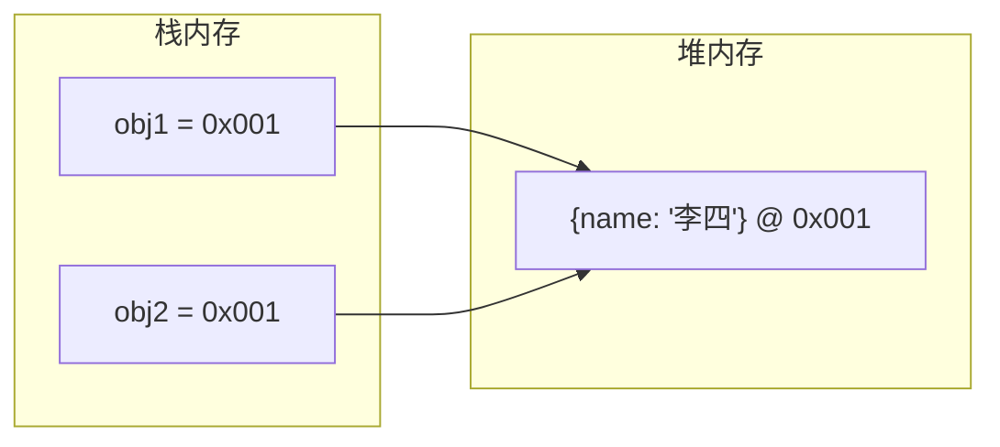

+++
title = "第 8 章 对象"
weight = 80
date = "2026-03-24T22:08:00+08:00"
type = "docs"
description = ""
isCJKLanguage = true
draft = false
+++
# 第 8 章 对象

如果说数组是一条有序的「走廊」，那对象就是一个有标签的「储物柜」——每个格子里放什么，由你决定。对象是 JavaScript 的灵魂，几乎所有东西都是对象。

## 8.1 对象基础

### 对象概念与创建方式：字面量 / new Object() / Object.create()

JavaScript 的对象是一组键值对（key-value pairs）的集合。

```javascript
// 方式1：对象字面量（最常用）
const person = {
    name: "张三",
    age: 25,
    city: "北京"
};

console.log(person); // { name: "张三", age: 25, city: "北京" }

// 方式2：new Object()
const person2 = new Object();
person2.name = "李四";
person2.age = 30;
console.log(person2); // { name: "李四", age: 30 }

// 方式3：Object.create()
const person3 = Object.create(null); // 创建纯净对象，无原型
person3.name = "王五";
person3.age = 35;
console.log(person3); // { name: "王五", age: 35 }
```

```javascript
// 三种方式的区别
// 1. 字面量：最简洁，直接定义属性
const obj1 = { a: 1, b: 2 };

// 2. new Object()：可以动态添加属性，但用得少
const obj2 = new Object();
obj2.a = 1;

// 3. Object.create()：可以指定原型链，功能最强大
const parent = { type: "parent" };
const child = Object.create(parent);
child.name = "child";
console.log(child.type); // "parent"（继承自 parent！）
console.log(Object.getPrototypeOf(child) === parent); // true
```

### Object.create() 的第一个参数作为原型

```javascript
// 原型链继承示例
const animal = {
    speak: function() {
        console.log(this.name + " 在叫");
    }
};

const dog = Object.create(animal);
dog.name = "旺财";
dog.bark = function() {
    console.log(this.name + " 汪汪汪！");
};

dog.speak(); // "旺财 在叫"
dog.bark();  // "旺财 汪汪汪！"

// 检查原型
console.log(Object.getPrototypeOf(dog) === animal); // true
```

### 属性访问：点语法 vs 中括号语法

```javascript
const person = {
    name: "张三",
    age: 25,
    "first-name": "张", // 含特殊字符必须用中括号
    "favorite color": "蓝色" // 空格也必须用中括号
};

// 点语法：只能用于合法标识符
console.log(person.name); // "张三"
console.log(person.age);  // 25

// 中括号语法：可用于任何字符串
console.log(person["name"]); // "张三"
console.log(person["first-name"]); // "张"
console.log(person["favorite color"]); // "蓝色"

// 中括号内可以用变量
const key = "name";
console.log(person[key]); // "张三"
```

```javascript
// 点语法 vs 中括号语法
const obj = {
    "my-key": "value1",
    normalKey: "value2"
};

// 用点语法
console.log(obj.normalKey); // "value2"
// console.log(obj.my-key); // SyntaxError! 不能用减号

// 用中括号
console.log(obj["my-key"]); // "value1"
console.log(obj["normal" + "Key"]); // "value2"（支持表达式）
```

### 添加 / 修改 / 删除属性

```javascript
const person = { name: "张三" };

// 添加属性
person.age = 25;
console.log(person); // { name: "张三", age: 25 }

// 修改属性
person.name = "李四";
console.log(person); // { name: "李四", age: 25 }

// 删除属性
delete person.age;
console.log(person); // { name: "李四" }

// 检查属性是否存在
console.log("name" in person);  // true
console.log("age" in person);   // false
console.log(person.hasOwnProperty("name")); // true
```

### 对象方法

```javascript
const person = {
    name: "张三",
    age: 25,

    // 方法：函数作为属性值
    greet: function() {
        console.log("你好，我叫" + this.name + "！");
    },

    // 简写方法语法（ES6+）
    sayHi() {
        console.log("嗨！我是" + this.name);
    },

    // 计算属性名
    ["say" + "Hello"]() {
        console.log("Hello! I'm " + this.name);
    }
};

person.greet();    // 你好，我叫张三！
person.sayHi();    // 嗨！我是张三
person.sayHello(); // Hello! I'm 张三
```

### 对象的动态特性

JavaScript 对象是动态的——你可以随时添加、修改、删除属性。

```javascript
const empty = {};
console.log(empty); // {}

// 动态添加属性
empty.name = "动态添加的";
empty.sayHello = function() {
    console.log("Hello!");
};
console.log(empty); // { name: "动态添加的", sayHello: [Function] }

// 动态删除属性
delete empty.name;
console.log(empty); // { sayHello: [Function] }
```

## 8.2 属性操作

### Object.keys / values / entries

```javascript
const person = {
    name: "张三",
    age: 25,
    city: "北京"
};

// Object.keys：返回所有键
console.log(Object.keys(person)); // ["name", "age", "city"]

// Object.values：返回所有值
console.log(Object.values(person)); // ["张三", 25, "北京"]

// Object.entries：返回所有键值对
console.log(Object.entries(person)); // [["name", "张三"], ["age", 25], ["city", "北京"]]
```

```javascript
// 实际应用：遍历对象
for (const key of Object.keys(person)) {
    console.log(`${key}: ${person[key]}`);
}
// name: 张三
// age: 25
// city: 北京

// 实际应用：对象转 Map
const map = new Map(Object.entries(person));
console.log(map); // Map(3) { "name" => "张三", "age" => 25, "city" => "北京" }
```

### Object.fromEntries：键值对数组转对象

```javascript
// Object.entries 的逆操作
const entries = [["name", "张三"], ["age", 25]];
const obj = Object.fromEntries(entries);
console.log(obj); // { name: "张三", age: 25 }
```

```javascript
// 实际应用：对象过滤
const person = { name: "张三", age: 25, city: "北京", email: "zhang@example.com" };

const filtered = Object.fromEntries(
    Object.entries(person).filter(([key, value]) => value !== undefined)
);
console.log(filtered); // { name: "张三", age: 25, city: "北京", email: "zhang@example.com" }

// 实际应用：对象映射
const mapped = Object.fromEntries(
    Object.entries(person).map(([key, value]) => [key, String(value)])
);
console.log(mapped); // 所有值都转成字符串
```

### Object.hasOwn()（ES2022+）：推荐替代 hasOwnProperty

```javascript
const parent = { inherited: "from parent" };
const child = Object.create(parent);
child.own = "my own property";

console.log(Object.hasOwn(child, "own"));        // true（自有属性）
console.log(Object.hasOwn(child, "inherited"));  // false（继承属性）
console.log(Object.hasOwn(child, "toString"));   // false（原型链属性）
```

```javascript
// hasOwnProperty 的问题
// 如果对象自己定义了 hasOwnProperty，可能会出问题
const weird = {
    hasOwnProperty: function() {
        return false; // 永远返回 false
    },
    name: "I am weird"
};

// console.log(weird.hasOwnProperty("name")); // TypeError! 永远返回 false！

// 解决方案1：Object.prototype.hasOwnProperty.call
console.log(Object.prototype.hasOwnProperty.call(weird, "name")); // true

// 解决方案2：Object.hasOwn（ES2022+，最推荐）
console.log(Object.hasOwn(weird, "name")); // true
```

### hasOwnProperty：检查属性是否存在

```javascript
const person = {
    name: "张三",
    age: 25
};

console.log(person.hasOwnProperty("name")); // true
console.log(person.hasOwnProperty("toString")); // false（原型链上的）

// 注意：hasOwnProperty 检查的是自有属性，不包括继承属性
```

### in 运算符：检查属性是否存在（含原型链）

```javascript
const parent = { inherited: true };
const child = Object.create(parent);
child.own = true;

console.log("own" in child);        // true
console.log("inherited" in child); // true（包括原型链！）
console.log("toString" in child);  // true（原型链上的）
```

```javascript
// hasOwnProperty vs in
const obj = Object.create({ protoProp: "inherited" });
obj.ownProp = "own";

console.log("ownProp" in obj);             // true
console.log(obj.hasOwnProperty("ownProp")); // true

console.log("protoProp" in obj);              // true（in 会找到原型链！）
console.log(obj.hasOwnProperty("protoProp")); // false（hasOwnProperty 不会）
```

### Object.getOwnPropertyNames：获取所有自身属性名

```javascript
const arr = ["a", "b", "c"];
console.log(Object.getOwnPropertyNames(arr)); // ["0", "1", "2", "length"]
// 注意：数组的索引属性和 length 属性都会被返回

const obj = { name: "张三", age: 25 };
console.log(Object.getOwnPropertyNames(obj)); // ["name", "age"]
```

### Object.getOwnPropertyDescriptors：获取属性描述符详情

```javascript
const person = {
    name: "张三",
    age: 25
};

const descriptors = Object.getOwnPropertyDescriptors(person);
console.log(descriptors);
// {
//   name: { value: "张三", writable: true, enumerable: true, configurable: true },
//   age: { value: 25, writable: true, enumerable: true, configurable: true }
// }
```

## 8.3 属性描述符

属性描述符定义了对象属性的具体行为——它是否可写、可枚举、可配置。

### configurable / enumerable / value / writable

```javascript
const person = {};

// 默认属性描述符
// writable: true（可修改值）
// enumerable: true（可被遍历）
// configurable: true（可被删除或修改描述符）

// 定义属性：Object.defineProperty
Object.defineProperty(person, "name", {
    value: "张三",
    writable: true,
    enumerable: true,
    configurable: true
});

console.log(person.name); // "张三"
person.name = "李四";
console.log(person.name); // "李四"
```

```javascript
// writable: false（不可修改值）
Object.defineProperty(person, "age", {
    value: 25,
    writable: false,
    enumerable: true,
    configurable: true
});

console.log(person.age); // 25
person.age = 30; // 严格模式下会报错
console.log(person.age); // 25（值不变）

// enumerable: false（不可被遍历）
Object.defineProperty(person, "secret", {
    value: "隐藏的秘密",
    enumerable: false
});

console.log(person); // { name: "李四", age: 25 }（secret 不显示）
console.log(Object.keys(person)); // ["name", "age"]（secret 不在其中）

// configurable: false（不可被删除或修改描述符）
Object.defineProperty(person, "id", {
    value: "001",
    writable: false,
    enumerable: true,
    configurable: false
});

console.log(person.id); // "001"
delete person.id; // 严格模式下报错，属性不会被删除
console.log(person.id); // "001"（仍然存在）
```

### Object.defineProperty：定义单个属性描述符

```javascript
const obj = {};

// 定义属性
Object.defineProperty(obj, "name", {
    value: "张三",
    writable: false,
    enumerable: false,
    configurable: false
});

console.log(obj.name); // "张三"
```

### Object.defineProperties：定义多个属性描述符

```javascript
const obj = {};

Object.defineProperties(obj, {
    name: {
        value: "张三",
        writable: true,
        enumerable: true,
        configurable: true
    },
    age: {
        value: 25,
        writable: false,
        enumerable: true,
        configurable: false
    },
    id: {
        value: "001",
        writable: false,
        enumerable: false,
        configurable: false
    }
});

console.log(obj); // { name: "张三", age: 25 }
console.log(Object.getOwnPropertyDescriptors(obj));
```

### enumerable：属性是否可枚举

```javascript
const person = {
    name: "张三",
    age: 25
};

// 默认：enumerable: true
console.log(Object.keys(person)); // ["name", "age"]

// 设置 enumerable: false
Object.defineProperty(person, "secret", {
    value: "隐藏属性",
    enumerable: false
});

console.log(Object.keys(person)); // ["name", "age"]（secret 不显示）
console.log(Object.values(person)); // ["张三", 25]（secret 不显示）

// for...in 也会跳过 enumerable: false 的属性
for (const key in person) {
    console.log(key); // name, age（不会打印 secret）
}
```

### configurable：属性是否可配置

```javascript
const obj = {};

// configurable: false 的属性，不能被删除
Object.defineProperty(obj, "fixed", {
    value: "不能删除",
    configurable: false
});

delete obj.fixed; // 不报错（严格模式会），但属性不会被删除
console.log(obj.fixed); // "不能删除"

// configurable: false 的属性，不能修改描述符
Object.defineProperty(obj, "fixed2", {
    value: "不能修改",
    configurable: false,
    writable: true
});

// 严格模式下会报错
try {
    Object.defineProperty(obj, "fixed2", {
        value: "新值",
        writable: false // 尝试修改 writable
    });
} catch (e) {
    console.log("不能修改描述符！"); // 不能修改描述符！
}
```

### getter / setter：访问器属性

getter 和 setter 允许你定义属性的「读取方法」和「写入方法」，实现数据的封装和验证。

```javascript
const person = {
    _name: "张三", // 私有属性（约定以下划线开头）
    _age: 25,

    // getter：读取 name 时调用
    get name() {
        console.log("正在读取 name...");
        return this._name;
    },

    // setter：写入 name 时调用
    set name(value) {
        console.log("正在设置 name 为：" + value);
        if (typeof value !== "string") {
            throw new Error("name 必须是字符串！");
        }
        this._name = value;
    }
};

console.log(person.name); // 正在读取 name... 张三
person.name = "李四";     // 正在设置 name 为：李四
console.log(person.name); // 正在读取 name... 李四
```

### 用 getter 和 setter 实现数据验证

```javascript
const product = {
    _price: 0,

    get price() {
        return this._price;
    },

    set price(value) {
        if (value < 0) {
            console.log("价格不能为负数！");
            return;
        }
        this._price = value;
    }
};

product.price = 100;
console.log(product.price); // 100

product.price = -50; // 价格不能为负数！
console.log(product.price); // 100（价格没变）
```

### 用 getter 和 setter 实现计算属性

```javascript
const rectangle = {
    _width: 0,
    _height: 0,

    get width() {
        return this._width;
    },

    set width(value) {
        if (value < 0) {
            throw new Error("宽度不能为负数！");
        }
        this._width = value;
    },

    get height() {
        return this._height;
    },

    set height(value) {
        if (value < 0) {
            throw new Error("高度不能为负数！");
        }
        this._height = value;
    },

    // 计算属性：自动计算面积
    get area() {
        return this._width * this._height;
    },

    // 计算属性：自动计算周长
    get perimeter() {
        return 2 * (this._width + this._height);
    }
};

rectangle.width = 5;
rectangle.height = 3;
console.log(rectangle.area);      // 15
console.log(rectangle.perimeter); // 16
```

## 8.4 拷贝与比较

对象的拷贝与比较是 JavaScript 中最容易出问题的部分。让我们彻底搞清楚。

### 赋值与引用的区别

```javascript
// 基本类型赋值：值的复制
let a = 10;
let b = a; // 把 a 的值复制给 b
a = 20;   // 修改 a
console.log(b); // 10（b 不受影响！）
```

```javascript
// 对象赋值：地址的复制（引用）
let obj1 = { name: "张三" };
let obj2 = obj1; // 把 obj1 的地址复制给 obj2（不是复制对象！）
obj1.name = "李四"; // 通过 obj1 修改对象
console.log(obj2.name); // "李四"（obj2 也变了，因为它们指向同一个对象）
```



### 浅拷贝：Object.assign() / 展开运算符

```javascript
// 浅拷贝：只拷贝第一层，深层属性还是共享的

// 方法1：Object.assign()
const original = { name: "张三", info: { age: 25 } };
const copy = Object.assign({}, original);

copy.name = "李四";
copy.info.age = 30;

console.log(original.name); // "张三"（不受影响）
console.log(original.info.age); // 30（被改了！）
```

```javascript
// 方法2：展开运算符
const original2 = { name: "张三", info: { age: 25 } };
const copy2 = { ...original2 };

copy2.name = "李四";
copy2.info.age = 30;

console.log(original2.name); // "张三"（不受影响）
console.log(original2.info.age); // 30（还是被改了！）
```

### 浅拷贝的局限性：嵌套对象仍是共享的

```javascript
const original = {
    name: "张三",
    address: {
        city: "北京",
        district: "朝阳"
    }
};

// 浅拷贝只能拷贝一层
const shallow = { ...original };
shallow.name = "李四"; // OK
shallow.address.city = "上海"; // 会影响 original

console.log(original.address.city); // "上海"（被改了！）
console.log(shallow.address.city); // "上海"
```

### 深拷贝：JSON.parse(JSON.stringify()) 方案

```javascript
// 方法：JSON.parse(JSON.stringify())
const original = {
    name: "张三",
    age: 25,
    hobbies: ["读书", "编程"],
    address: {
        city: "北京",
        districts: ["朝阳", "海淀"]
    }
};

const deepCopy = JSON.parse(JSON.stringify(original));

deepCopy.name = "李四";
deepCopy.hobbies.push("旅游");
deepCopy.address.city = "上海";

console.log(original.name); // "张三"（不受影响）
console.log(original.hobbies); // ["读书", "编程"]（不受影响）
console.log(original.address.city); // "北京"（不受影响）
```

### JSON.stringify 深拷贝的局限性

```javascript
// JSON.stringify 无法处理的内容
const problemObj = {
    name: "张三",
    date: new Date(), // Date 对象变成字符串
    reg: /^[a-z]+$/, // RegExp 变成空对象
    fn: function() {}, // 函数丢失
    und: undefined, // undefined 丢失
    symbol: Symbol("id"), // Symbol 丢失
    nan: NaN, // NaN 变成 null
    infinity: Infinity, // Infinity 变成 null
    circular: null // 循环引用的处理
};
problemObj.circular = problemObj; // 循环引用！

try {
    const copy = JSON.parse(JSON.stringify(problemObj));
    console.log(copy);
} catch (e) {
    console.log("循环引用会导致错误！"); // 循环引用会导致错误！
}
```

### 手写深拷贝函数（递归实现）

```javascript
function deepClone(obj) {
    // 处理 null
    if (obj === null) {
        return null;
    }

    // 处理基本类型（不是对象）
    if (typeof obj !== "object") {
        return obj;
    }

    // 处理 Date
    if (obj instanceof Date) {
        return new Date(obj.getTime());
    }

    // 处理 RegExp
    if (obj instanceof RegExp) {
        return new RegExp(obj.source, obj.flags);
    }

    // 处理 Array
    if (Array.isArray(obj)) {
        return obj.map(item => deepClone(item));
    }

    // 处理普通对象
    const clone = {};
    for (const key in obj) {
        if (obj.hasOwnProperty(key)) {
            clone[key] = deepClone(obj[key]);
        }
    }
    return clone;
}

// 测试
const original = {
    name: "张三",
    info: { age: 25 }
};
const copy = deepClone(original);
copy.info.age = 30;
console.log(original.info.age); // 25（不变！）
```

### 手写深拷贝加强版：处理循环引用 / 特殊类型

```javascript
function deepCloneAdvanced(obj, hash = new WeakMap()) {
    // 处理 null 和基本类型
    if (obj === null || typeof obj !== "object") {
        return obj;
    }

    // 处理循环引用
    if (hash.has(obj)) {
        return hash.get(obj);
    }

    // 处理 Date
    if (obj instanceof Date) {
        return new Date(obj.getTime());
    }

    // 处理 RegExp
    if (obj instanceof RegExp) {
        return new RegExp(obj.source, obj.flags);
    }

    // 处理 Set
    if (obj instanceof Set) {
        const clone = new Set();
        hash.set(obj, clone);
        obj.forEach(value => clone.add(deepCloneAdvanced(value, hash)));
        return clone;
    }

    // 处理 Map
    if (obj instanceof Map) {
        const clone = new Map();
        hash.set(obj, clone);
        obj.forEach((value, key) => {
            clone.set(key, deepCloneAdvanced(value, hash));
        });
        return clone;
    }

    // 处理 Array 和普通对象
    const clone = Array.isArray(obj) ? [] : {};
    hash.set(obj, clone);

    for (const key of Reflect.ownKeys(obj)) {
        clone[key] = deepCloneAdvanced(obj[key], hash);
    }

    return clone;
}

// 测试循环引用
const original = { name: "张三" };
original.self = original; // 循环引用

const copy = deepCloneAdvanced(original);
console.log(copy === original); // false
console.log(copy.self === copy); // true（循环引用正确处理！）
```

### structuredClone：原生深拷贝（ES2021+）

```javascript
// structuredClone 是 JavaScript 内置的深拷贝方法
// 可以处理循环引用、Set、Map、Date、RegExp 等

const original = {
    name: "张三",
    date: new Date(),
    set: new Set([1, 2, 3]),
    map: new Map([["a", 1], ["b", 2]])
};

const clone = structuredClone(original);

console.log(clone.name); // "张三"
console.log(clone.date instanceof Date); // true
console.log(clone.set instanceof Set); // true
console.log(clone.map instanceof Map); // true

// 循环引用也可以处理
const obj = { name: "test" };
obj.self = obj;
const objClone = structuredClone(obj);
console.log(objClone.self === objClone); // true
```

```javascript
// structuredClone 的限制
// 1. 不能克隆函数
// const obj = { fn: () => {} };
// structuredClone(obj); // TypeError!

// 2. 克隆 DOM 节点
// const div = document.createElement("div");
// structuredClone(div); // DOMException!

// 3. 性能：对于大对象，可能比手写深拷贝慢
```

### 对象比较：== / === / Object.is

```javascript
const obj1 = { name: "张三" };
const obj2 = { name: "张三" };

// == 和 === 都是比较引用，不是比较内容
console.log(obj1 === obj2); // false（两个不同的对象）
console.log(obj1 == obj2);  // false

// 同一个引用才相等
const obj3 = obj1;
console.log(obj1 === obj3); // true

// 比较内容：需要手动比较
function isEqual(objA, objB) {
    const keysA = Object.keys(objA);
    const keysB = Object.keys(objB);

    if (keysA.length !== keysB.length) {
        return false;
    }

    for (const key of keysA) {
        if (objA[key] !== objB[key]) {
            return false;
        }
    }
    return true;
}

console.log(isEqual(obj1, obj2)); // true（内容相同）
```

```javascript
// Object.is()：精确比较
console.log(Object.is(obj1, obj2)); // false（不同引用）
console.log(Object.is(obj1, obj3)); // true（同一引用）
console.log(Object.is(NaN, NaN)); // true（比 === 更准确）
console.log(Object.is(+0, -0)); // false（比 === 更准确）
```

## 8.5 解构与展开

### 解构赋值：基本用法

解构赋值让你用更简洁的语法从对象或数组中提取值。

```javascript
// 对象解构
const person = { name: "张三", age: 25, city: "北京" };

// 传统写法
const name = person.name;
const age = person.age;
console.log(name, age); // 张三 25

// 解构赋值（ES6+）
const { name: n, age: a } = person;
console.log(n, a); // 张三 25

// 如果变量名和属性名相同，可以简写
const { name, age } = person;
console.log(name, age); // 张三 25
```

```javascript
// 数组解构
const colors = ["红", "绿", "蓝"];

// 传统写法
const first = colors[0];
const second = colors[1];
console.log(first, second); // 红 绿

// 解构赋值
const [f, s, t] = colors;
console.log(f, s, t); // 红 绿 蓝

// 跳过某些元素
const [firstColor, , thirdColor] = colors;
console.log(firstColor, thirdColor); // 红 蓝

// 剩余模式
const [primary, ...rest] = colors;
console.log(primary); // 红
console.log(rest); // ["绿", "蓝"]
```

### 解构赋值：给变量起别名

```javascript
// 对象解构：给变量起别名
const person = { name: "张三", age: 25 };

// 写法：属性名: 新变量名
const { name: userName, age: userAge } = person;
console.log(userName, userAge); // 张三 25
```

### 解构赋值：设置默认值

```javascript
// 对象解构：设置默认值
const person = { name: "张三", age: undefined };

const { name = "匿名", age = 18 } = person;
console.log(name, age); // 张三 18（age 是 undefined，使用默认值）

// 数组解构：设置默认值
const colors = ["红"];

const [first = "未知", second = "未知", third = "未知"] = colors;
console.log(first, second, third); // 红 未知 未知
```

### 解构赋值：剩余模式 rest

```javascript
// 对象剩余模式
const person = { name: "张三", age: 25, city: "北京", country: "中国" };

const { name, ...others } = person;
console.log(name);   // 张三
console.log(others); // { age: 25, city: "北京", country: "中国" }

// 数组剩余模式
const nums = [1, 2, 3, 4, 5];
const [first, second, ...rest] = nums;
console.log(first, second); // 1 2
console.log(rest); // [3, 4, 5]
```

### 函数参数解构

```javascript
// 函数参数解构
function greet({ name, age }) {
    console.log(`你好，我叫${name}，今年${age}岁！`);
}

greet({ name: "张三", age: 25 }); // 你好，我叫张三，今年25岁！

// 带默认值
function greetWithDefault({ name = "匿名", age = 0 } = {}) {
    console.log(`你好，我叫${name}，今年${age}岁！`);
}

greetWithDefault({ name: "李四" }); // 你好，我叫李四，今年0岁！
greetWithDefault({}); // 你好，我叫匿名，今年0岁！
```

### 展开运算符 ...：合并对象（浅拷贝特性）

```javascript
// 对象展开
const obj1 = { a: 1, b: 2 };
const obj2 = { c: 3, d: 4 };
const merged = { ...obj1, ...obj2 };
console.log(merged); // { a: 1, b: 2, c: 3, d: 4 }

// 展开是浅拷贝
const original = { a: 1, b: { nested: 2 } };
const copy = { ...original };
copy.b.nested = 999;
console.log(original.b.nested); // 999（被改了！）

// 数组展开
const arr1 = [1, 2, 3];
const arr2 = [4, 5, 6];
const mergedArr = [...arr1, ...arr2];
console.log(mergedArr); // [1, 2, 3, 4, 5, 6]
```

## 8.6 序列化

序列化是将对象转成字符串的过程，常用于存储和传输数据。

### JSON.stringify：参数 replacer / space

```javascript
const person = {
    name: "张三",
    age: 25,
    address: {
        city: "北京",
        districts: ["朝阳", "海淀"]
    }
};

// 基本用法
console.log(JSON.stringify(person));
// {"name":"张三","age":25,"address":{"city":"北京","districts":["朝阳","海淀"]}}
```

```javascript
// replacer 参数：过滤或转换属性
const result = JSON.stringify(person, (key, value) => {
    // key 是属性名，value 是属性值
    if (typeof value === "number") {
        return value * 2; // 数字翻倍
    }
    return value; // 其他不变
});
console.log(result);
// {"name":"张三","age":50,"address":{"city":"北京","districts":["朝阳","海淀"]}}

// replacer 数组：只包含指定的属性
const result2 = JSON.stringify(person, ["name", "age"]);
console.log(result2);
// {"name":"张三","age":25}
```

```javascript
// space 参数：美化输出
const pretty = JSON.stringify(person, null, 2);
console.log(pretty);
// {
//   "name": "张三",
//   "age": 25,
//   "address": {
//     "city": "北京",
//     "districts": [
//       "朝阳",
//       "海淀"
//     ]
//   }
// }

const pretty4 = JSON.stringify(person, null, 4);
console.log(pretty4); // 更宽的缩进
```

```javascript
// toJSON 方法：自定义序列化
const person2 = {
    name: "张三",
    age: 25,

    toJSON() {
        return {
            displayName: this.name + "（" + this.age + "岁）"
        };
    }
};

console.log(JSON.stringify(person2)); // {"displayName":"张三（25岁）"}
```

### JSON.parse：参数 reviver

```javascript
const jsonStr = '{"name":"张三","age":25}';

// 基本用法
const obj = JSON.parse(jsonStr);
console.log(obj); // { name: "张三", age: 25 }
```

```javascript
// reviver 参数：解析时转换数据
const jsonStr2 = '{"name":"张三","age":25,"birthday":"2001-01-01"}';

const obj2 = JSON.parse(jsonStr2, (key, value) => {
    if (key === "birthday") {
        return new Date(value); // 把日期字符串转成 Date 对象
    }
    return value;
});

console.log(obj2.birthday instanceof Date); // true
console.log(obj2.birthday.getFullYear()); // 2001
```

### 序列化注意事项

```javascript
// 1. undefined 和函数会被忽略
const obj = {
    name: "张三",
    age: undefined,
    greet: function() {}
};
console.log(JSON.stringify(obj)); // {"name":"张三"}

// 2. NaN 和 Infinity 会变成 null
const obj2 = {
    nan: NaN,
    infinity: Infinity,
    negInfinity: -Infinity
};
console.log(JSON.stringify(obj2)); // {"nan":null,"infinity":null,"negInfinity":null}

// 3. Symbol 作为键会被忽略，作为值会变成 undefined
const obj3 = {
    [Symbol("id")]: 1,
    name: Symbol("name")
};
console.log(JSON.stringify(obj3)); // {}

// 4. 循环引用会导致错误
const obj4 = {};
obj4.self = obj4;
try {
    JSON.stringify(obj4); // TypeError: Converting circular structure to JSON
} catch (e) {
    console.log("循环引用不能序列化！");
}

// 5. 日期对象会变成字符串
const obj5 = {
    date: new Date("2021-01-01")
};
console.log(JSON.stringify(obj5)); // {"date":"2021-01-01T00:00:00.000Z"}

// 6. 数字 0、空字符串 ""、false 不会被变成 null
const obj6 = {
    zero: 0,
    emptyStr: "",
    boolFalse: false
};
console.log(JSON.stringify(obj6)); // {"zero":0,"emptyStr":"","boolFalse":false}
// 注意：0 和 false 不会被变成 null！
```

---

## 本章小结

本章我们全面学习了 JavaScript 对象：

1. **对象基础**：字面量、`new Object()`、`Object.create()` 的区别；属性访问（点语法 vs 中括号语法）；动态添加/修改/删除属性。

2. **属性操作**：`Object.keys/values/entries`、`Object.fromEntries`、`Object.hasOwn()`、`in` 运算符。

3. **属性描述符**：`configurable`、`enumerable`、`value`、`writable`、`getter/setter`；`Object.defineProperty`/`Object.defineProperties`。

4. **拷贝与比较**：赋值是引用复制；浅拷贝（`Object.assign`、展开运算符）只拷贝一层；深拷贝（`JSON.parse(JSON.stringify())`、手写递归、`structuredClone`）；对象比较用 `===`（引用比较）或手动比较内容。

5. **解构与展开**：对象解构 `const { name, age } = person`；数组解构 `const [a, b, ...rest] = arr`；解构别名 `const { name: userName }`；解构默认值 `const { name = "匿名" }`；展开运算符合并对象。

6. **序列化**：`JSON.stringify`（参数 replacer、space）和 `JSON.parse`（参数 reviver）；序列化注意事项（undefined/函数忽略、循环引用报错等）。

---

恭喜你！JavaScript 核心教程的前 8 章已经全部完成！你已经掌握了 JavaScript 最核心的基础知识：

- ✅ 第1章：JavaScript 入门
- ✅ 第2章：开发环境
- ✅ 第3章：变量与数据类型
- ✅ 第4章：运算符与表达式
- ✅ 第5章：控制流
- ✅ 第6章：运算符与表达式（补充）
- ✅ 第7章：数组
- ✅ 第8章：对象

接下来你可以继续学习：函数、作用域与闭包、原型与原型链、异步编程、模块化、ES6+ 新特性等。加油！🚀


