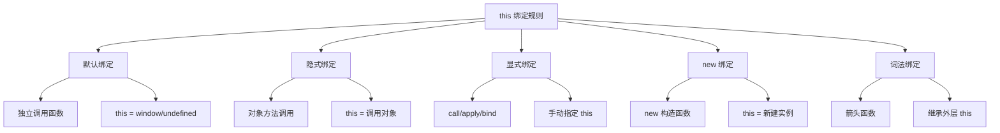
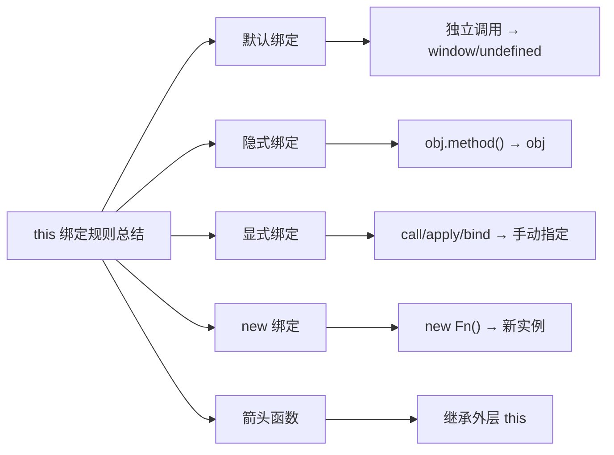
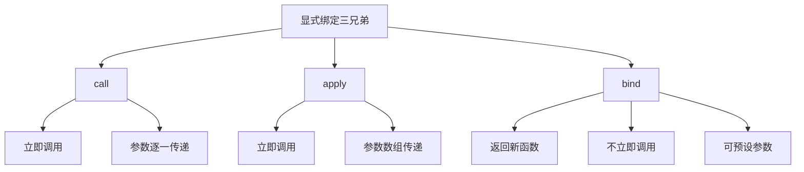
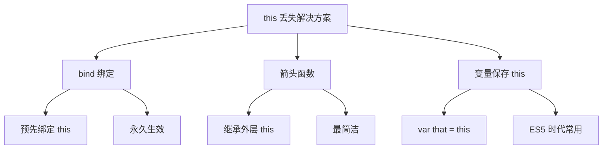

+++
title = "第 18 章 this 指向"
weight = 180
date = "2026-03-24T22:08:00+08:00"
type = "docs"
description = ""
isCJKLanguage = true
draft = false
+++
# 第 18 章 this 指向

> JavaScript 里最让人晕头转向的概念——"this"到底指向谁？

## 18.1 this 绑定规则

### this 是什么？

在 JavaScript 里，`this` 是一个像"变形金刚"一样的变量——它在不同场合会指向不同的东西。

想象 `this` 是一个神奇的遥控器，你在不同的地方按它，它就会操控不同的电视！

```javascript
// 先来看一个最让人迷惑的例子
const person = {
  name: '张三',
  sayHi: function() {
    console.log('你好，我是' + this.name);
  }
};

person.sayHi();  // 输出：你好，我是张三
// 这里的 this 指向 person 对象
```

但是！

```javascript
// 把方法单独拿出来用试试？
const sayHi = person.sayHi;
sayHi();  // 输出：你好，我是 undefined（或者严格模式下报错）
// 天哪！this 怎么变了？！
```

这就是 `this` 的"变态"之处——它不是固定的，而是**由调用方式决定**的！

---

### 默认绑定：普通函数中的 this

当函数是**独立调用**的（不是作为对象的方法），`this` 的默认值是 `window`（浏览器环境）或者 `undefined`（严格模式）。

```javascript
// 场景1：普通函数调用
function introduce() {
  console.log('我叫' + this.name);
}

const person = { name: '李四' };
introduce();  // this 指向谁？
// 在浏览器中，this.name 会变成 window.name（可能是空字符串）
// 在严格模式下，会变成 undefined
```

```javascript
// 严格模式下的表现
'use strict';

function showThis() {
  console.log('this 是：', this);
}

showThis();  // 输出：this 是： undefined
// 严格模式下，默认绑定的 this 是 undefined！
```

```javascript
// 在浏览器控制台试试这个
function sayName() {
  console.log('我的名字是：' + this.name);
}

var name = '我是window的name';  // 注意：用 var 声明的才是 window 的属性
sayName();  // 输出：我的名字是：我是window的name

let name2 = '我不是window的';  // let 不会挂在 window 上
// sayName2();  // 会报错！
```

```javascript
// 一个经典的坑
const obj = {
  name: '小明',
  delayLog: function() {
    setTimeout(function() {
      console.log('名字是：' + this.name);  // 这里 this 指向谁？
    }, 100);
  }
};

obj.delayLog();  // 1秒后输出：名字是：（空白或undefined）
// 因为 setTimeout 里的函数是普通函数调用，this 指向 window！
```

---

### 隐式绑定：对象方法中的 this

当函数是**对象的属性**，并且通过**对象调用**时，`this` 指向**调用这个方法的对象**。

```javascript
// 隐式绑定的基本规则：谁调用，this 就指向谁
const cat = {
  name: '喵喵',
  sound: '喵~',
  speak: function() {
    console.log(this.name + '说：' + this.sound);
  }
};

cat.speak();  // 输出：喵喵说：喵~
// cat 调用了 speak，所以 this 指向 cat
```

```javascript
// 陷阱！赋值操作会丢失 this
const dog = {
  name: '旺财',
  sound: '汪汪~',
  speak: function() {
    console.log(this.name + '说：' + this.sound);
  }
};

const speak = dog.speak;  // 把方法赋值给变量
speak();  // this 变成 window 或 undefined！
// 输出：undefined说：undefined
```

```javascript
// 另一个经典陷阱：回调函数
const calculator = {
  value: 100,
  add: function(n) {
    this.value += n;
  },
  process: function(numbers) {
    numbers.forEach(function(n) {
      this.add(n);  // 这里的 this 是谁？
    });
  }
};

// calculator.process([1, 2, 3]);
// 报错！因为 forEach 的回调函数是普通调用，this 指向 window
```



---

### 显式绑定：call / apply / bind 手动指定

有时候我们不想让 JavaScript 自动决定 `this`，想**手动指定**它是谁。这时候就轮到 `call`、`apply`、`bind` 这三兄弟登场了！

```javascript
// 先看一个不用显式绑定的痛苦例子
const person1 = { name: '小红', age: 18 };
const person2 = { name: '小丽', age: 20 };

function introduce(city, job) {
  console.log('我是' + this.name + '，' + this.age + '岁，来自' + city + '，职业是' + job);
}

// 普通调用会报错或输出 undefined
// introduce();  // this 是 undefined

// 用 call 指定 this
introduce.call(person1, '北京', '老师');  // 我是小红，18岁，来自北京，职业是老师
introduce.call(person2, '上海', '医生');  // 我是小丽，20岁，来自上海，职业是医生
```

```javascript
// apply 跟 call 一样，只是参数传递方式不同
introduce.apply(person1, ['广州', '工程师']);  // 我是小红，18岁，来自广州，职业是工程师
introduce.apply(person2, ['深圳', '设计师']);  // 我是小丽，20岁，来自深圳，职业是设计师
```

```javascript
// call vs apply 的区别
// call：参数一个个传
func.call(this, arg1, arg2, arg3);

// apply：参数用数组传
func.apply(this, [arg1, arg2, arg3]);

// 效果完全一样！只是传参方式不同
```

```javascript
// bind：绑定 this，但不像 call/apply 那样立即调用
const boundIntroduce = introduce.bind(person1);
boundIntroduce('杭州', '律师');  // 我是小红，18岁，来自杭州，职业是律师

// bind 返回一个新函数，原函数不变
introduce.call(person2, '武汉', '会计');  // 我是小丽，20岁，来自武汉，职业是会计
```

```javascript
// bind 的真正强大之处：永久绑定
const person3 = { name: '小刚' };
function greet() {
  console.log('你好，我是' + this.name);
}

const boundGreet = greet.bind(person3);  // 永远绑定到 person3

boundGreet();  // 你好，我是小刚
boundGreet.call({ name: '其他人' });  // 你好，我是小刚（还是指向 person3！）
// 因为 bind 绑定的 this 是"永久"的，无法被覆盖
```

---

### new 绑定：构造函数中的 this

当用 `new` 关键字调用函数时，这个函数就变成了**构造函数**，`this` 会指向**新创建的对象**。

```javascript
// 构造函数：专门用来创建对象的函数
function Student(name, age, grade) {
  // this 指向新创建的对象
  this.name = name;    // 给新对象添加属性
  this.age = age;
  this.grade = grade;
  this.introduce = function() {
    console.log('我是' + this.name + '，' + this.age + '岁，在' + this.grade + '年级');
  };
}

// 用 new 调用构造函数
const student1 = new Student('小明', 12, '六年级');
const student2 = new Student('小红', 11, '五年级');

student1.introduce();  // 我是小明，12岁，在六年级
student2.introduce();  // 我是小红，11岁，在五年级
```

```javascript
// 如果不用 new 调用构造函数会怎样？
const student3 = Student('小华', 13, '初一');
console.log(student3);  // undefined！因为构造函数没有 return
// 但是 window.name 会变成 '小华'！
// console.log(name);  // 小华 —— 变量污染了全局！
```

```javascript
// 构造函数（Class）版本
class Animal {
  constructor(name, sound) {
    this.name = name;
    this.sound = sound;
  }

  speak() {
    console.log(this.name + '叫：' + this.sound);
  }
}

const cat = new Animal('猫咪', '喵喵~');
const dog = new Animal('小狗', '汪汪~');

cat.speak();  // 猫咪叫：喵喵~
dog.speak();  // 小狗叫：汪汪~
```

---

### 词法绑定：箭头函数的 this

箭头函数是 ES6 引入的" special agent"，它的 `this` **不遵循普通的绑定规则**，而是**继承外层函数的 this**。

```javascript
// 普通函数的 this
const counter1 = {
  count: 0,
  // 普通函数有自己的 this
  increment: function() {
    this.count++;
    console.log('普通函数 this:', this.count);
  }
};

counter1.increment();  // 普通函数 this: 1
counter1.increment();  // 普通函数 this: 2

// 箭头函数的 this
const counter2 = {
  count: 0,
  // 箭头函数继承外层的 this
  increment: () => {
    this.count++;  // 这里的 this 是谁？
    console.log('箭头函数 this:', this.count);
  }
};

counter2.increment();  // 箭头函数 this: NaN
// 因为箭头函数的 this 是 window 或 undefined，不是 counter2！
```

```javascript
// 箭头函数的正确用法：在需要保持 this 的回调中使用
const timer = {
  name: '倒计时器',
  seconds: 10,
  start: function() {
    // 用箭头函数，this 永远指向 timer
    setInterval(() => {
      if (this.seconds > 0) {
        this.seconds--;
        console.log(this.name + '：' + this.seconds + '秒');
      }
    }, 1000);
  }
};

// timer.start();
```

```javascript
// 对比：普通函数 vs 箭头函数
const compare = {
  name: '比较器',

  // 普通函数方法
  normalMethod: function() {
    console.log('普通函数 this.name:', this.name);
  },

  // 箭头函数方法
  arrowMethod: () => {
    console.log('箭头函数 this.name:', this.name);
  }
};

compare.normalMethod();  // 普通函数 this.name: 比较器
compare.arrowMethod();  // 箭头函数 this.name: undefined
// 箭头函数的 this 指向外层（这里是 window）
```

```javascript
// 记住这个规则
// 普通函数：谁调用 this，this 就指向谁
// 箭头函数：继承定义时的外层 this，而不是调用时的
```



> 💡 **本章小结（第18章第1节）**
> 
> JavaScript 的 `this` 是个"变色龙"，它的指向取决于函数的调用方式。**默认绑定**下，独立调用的函数 `this` 指向 `window`（严格模式是 `undefined`）。**隐式绑定**下，作为对象方法调用的函数 `this` 指向该对象。**显式绑定**下，可以用 `call/apply/bind` 手动指定 `this`。**new 绑定**下，用 `new` 调用构造函数时 `this` 指向新创建的实例。**箭头函数**比较特殊，它不绑定自己的 `this`，而是继承外层的 `this`。记住：**普通函数看调用，箭头函数看定义**！

---

## 18.2 call / apply / bind

### call：逐一传参

`call` 是三兄弟中最直接的一个，它会**立即调用函数**，并把 `this` 绑定到指定的对象。

```javascript
// 基本用法
function greet(age, city) {
  console.log('你好，我叫' + this.name + '，' + age + '岁，来自' + city);
}

const person = { name: '张三' };

// call(thisArg, arg1, arg2, ...)
greet.call(person, 25, '北京');
// 输出：你好，我叫张三，25岁，来自北京
```

```javascript
// call 的应用场景：继承
function Animal(name, sound) {
  this.name = name;
  this.sound = sound;
}

function Dog(name, breed) {
  // 用 call 调用 Animal 的构造函数，继承它的属性
  Animal.call(this, name, '汪汪~');
  this.breed = breed;
}

const dog = new Dog('旺财', '金毛');
console.log(dog.name);   // 旺财
console.log(dog.sound);  // 汪汪~
console.log(dog.breed);  // 金毛
```

```javascript
// 用 call 借用数组方法
const arrayLike = { 0: 'a', 1: 'b', 2: 'c', length: 3 };

// 数组的 slice 方法可以把这个"类数组"变成真正的数组
const realArray = Array.prototype.slice.call(arrayLike, 0);
console.log(realArray);  // ['a', 'b', 'c']

// 或者用 ES6 的 Array.from()
const realArray2 = Array.from(arrayLike);
console.log(realArray2);  // ['a', 'b', 'c']
```

---

### apply：数组传参

`apply` 和 `call` 功能一模一样，唯一的区别是：**参数用数组传递**。

```javascript
// apply 的参数是一个数组（或类数组对象）
function greet(age, city) {
  console.log('你好，我叫' + this.name + '，' + age + '岁，来自' + city);
}

const person = { name: '李四' };

// apply(thisArg, [arg1, arg2])
greet.apply(person, [30, '上海']);
// 输出：你好，我叫李四，30岁，来自上海
```

```javascript
// apply 的真正价值：处理数组参数
function max() {
  return Math.max.apply(null, arguments);
}

console.log(max(1, 5, 3, 9, 2));  // 9
// 相当于 Math.max(1, 5, 3, 9, 2)

// 现在有更好的方法了
console.log(Math.max(...[1, 5, 3, 9, 2]));  // 9
```

```javascript
// 用 apply 合并数组
const arr1 = [1, 2, 3];
const arr2 = [4, 5, 6];

// 以前用 concat
const merged = arr1.concat(arr2);
console.log(merged);  // [1, 2, 3, 4, 5, 6]

// 用 apply（虽然不常见）
const merged2 = Array.prototype.concat.apply([], [arr1, arr2]);
console.log(merged2);  // [1, 2, 3, 4, 5, 6]

// 现在用展开运算符更简洁
const merged3 = [...arr1, ...arr2];
console.log(merged3);  // [1, 2, 3, 4, 5, 6]
```

---

### bind：绑定 this，返回新函数

`bind` 不会立即调用函数，而是**创建一个新的函数**，这个新函数的 `this` 被永久绑定到指定的对象。

```javascript
// 基本用法
function greet(age, city) {
  console.log('你好，我叫' + this.name + '，' + age + '岁，来自' + city);
}

const person = { name: '王五' };

// 创建绑定后的新函数
const boundGreet = greet.bind(person);

// 现在调用新函数
boundGreet(28, '广州');  // 你好，我叫王五，28岁，来自广州
boundGreet(29, '深圳');  // 你好，我叫王五，29岁，来自深圳
// 无论怎么调用，this 永远指向 person
```

```javascript
// bind 还可以预设部分参数（偏函数）
function multiply(a, b) {
  return a * b;
}

// 创建一个乘以 2 的函数
const double = multiply.bind(null, 2);
console.log(double(5));   // 10
console.log(double(10));  // 20

// 创建一个乘以 3 的函数
const triple = multiply.bind(null, 3);
console.log(triple(5));   // 15
console.log(triple(10));  // 30
```

```javascript
// bind 的实际应用：事件处理
class Counter {
  constructor() {
    this.count = 0;

    // 用 bind 绑定 this
    this.increment = this.increment.bind(this);
  }

  increment() {
    this.count++;
    console.log('计数：' + this.count);
  }
}

const counter = new Counter();

// 当作事件处理器时，this 不会丢失
// button.addEventListener('click', counter.increment);
// 因为已经 bind 过了，所以点击时 this 仍然指向 counter
```

---

### call vs apply vs bind 对比与场景选择

```javascript
// 一图流对比
console.log('=== call vs apply vs bind 对比 ===');

function test(a, b, c) {
  console.log('this.name:', this.name);
  console.log('参数:', a, b, c);
}

const obj = { name: '测试对象' };

// call：立即调用，参数逐一传递
console.log('\n--- call ---');
test.call(obj, 1, 2, 3);

// apply：立即调用，参数用数组传递
console.log('\n--- apply ---');
test.apply(obj, [1, 2, 3]);

// bind：不立即调用，返回新函数，参数可以分开传
console.log('\n--- bind ---');
const newTest = test.bind(obj, 1);  // 预设第一个参数
newTest(2, 3);  // 只传剩下的两个参数
```

```javascript
// 选择建议
// 1. call：参数不多，直接列出
someFunction.call(context, arg1, arg2, arg3);

// 2. apply：参数是数组，或者参数数量不确定
someFunction.apply(context, arrayOfArgs);

// 3. bind：需要稍后调用，或者需要预设部分参数
const boundFn = someFunction.bind(context, presetArg);
```

```javascript
// 经典应用场景

// 场景1：类数组转数组
const arrayLike = document.querySelectorAll('div');
const divs = Array.prototype.slice.call(arrayLike);  // 旧方法
const divs2 = Array.from(arrayLike);                // 新方法

// 场景2：找出数组中的最大值
const numbers = [3, 1, 4, 1, 5, 9, 2, 6];
const max = Math.max.apply(null, numbers);  // 9
const max2 = Math.max(...numbers);          // 9（ES6+）

// 场景3：数组追加
const arr1 = [1, 2, 3];
const arr2 = [4, 5, 6];
arr1.push.apply(arr1, arr2);  // [1, 2, 3, 4, 5, 6]
arr1.push(...arr2);            // [1, 2, 3, 4, 5, 6, 4, 5, 6]（ES6+）

// 场景4：事件处理中保持 this
// button.addEventListener('click', handler.bind(this));
```



> 💡 **本章小结（第18章第2节）**
> 
> `call`、`apply`、`bind` 是 JavaScript 给我们控制 `this` 的三大神器。`call` 和 `apply` 都是**立即调用**函数，区别只是传参方式（逐一 vs 数组）。`bind` **不立即调用**，而是创建一个新函数，适合需要稍后调用或预设参数的场景。选择建议：**参数确定用 call**，**参数是数组用 apply**，**需要稍后调用或预设参数用 bind**。

---

## 18.3 this 丢失问题

### 回调函数中的 this 丢失

`this` 丢失是 JavaScript 中最让人头疼的问题之一。简单来说就是：**把对象的方法赋值给变量，或者传给回调函数，this 就不认识原来的对象了**。

```javascript
// 经典案例：setTimeout 回调中的 this
const person = {
  name: '小明',
  greet: function() {
    console.log('你好，我是' + this.name);
  }
};

person.greet();  // 正常工作：你好，我是小明

// 把方法传给 setTimeout
setTimeout(person.greet, 100);  // 你好，我是（空白或undefined）
// 因为 setTimeout 调用 greet 时，this 变成了 window 或 undefined！
```

```javascript
// 为什么会这样？
// setTimeout(person.greet, 100) 实际上是这样的：
// setTimeout 把 person.greet 这个函数赋值给了内部
// 然后内部以普通函数的方式调用它
// 所以 this 丢失了！
```

```javascript
// another 经典案例：数组方法的回调
const util = {
  name: '工具对象',
  process: function(items) {
    return items.map(function(item) {
      // 这里的 this 是谁？
      return item + this.suffix;
    });
  },
  suffix: '元'
};

console.log(util.process([10, 20, 30]));  // ['10undefined', '20undefined', '30undefined']
// 因为 map 的回调是普通函数调用，this 丢失了！
```

---

### 解决方案一：bind

`bind` 可以永久绑定 `this`，这样即使在回调中也不会丢失。

```javascript
// 解决方案1：用 bind 预先绑定 this
const person1 = {
  name: '小明',
  greet: function() {
    console.log('你好，我是' + this.name);
  }
};

// 创建一个绑定好 this 的版本
const boundGreet = person1.greet.bind(person1);

// 无论怎么传，this 都不会丢
setTimeout(boundGreet, 100);  // 你好，我是小明
```

```javascript
// bind 在数组方法中的应用
const util2 = {
  name: '工具对象',
  process: function(items) {
    return items.map(function(item) {
      return item + this.suffix;
    }.bind(this));  // 绑定 this
  },
  suffix: '元'
};

console.log(util2.process([10, 20, 30]));  // ['10元', '20元', '30元']
```

---

### 解决方案二：箭头函数

箭头函数**不绑定自己的 this**，它会继承定义时外层的 `this`。

```javascript
// 解决方案2：用箭头函数
const person2 = {
  name: '小红',
  greet: function() {
    // 用箭头函数，this 不会丢失
    setTimeout(() => {
      console.log('你好，我是' + this.name);  // this 指向 person2
    }, 100);
  }
};

person2.greet();  // 你好，我是小红
```

```javascript
// 箭头函数在数组方法中的应用
const util3 = {
  name: '工具对象',
  process: function(items) {
    return items.map((item) => {
      // 箭头函数继承外层的 this
      return item + this.suffix;
    });
  },
  suffix: '元'
};

console.log(util3.process([10, 20, 30]));  // ['10元', '20元', '30元']
```

```javascript
// 注意！箭头函数要写在正确的地方
const person3 = {
  name: '小刚',
  // 如果 greet 本身就是箭头函数，那外层就是 window 了！
  // greet: () => { ... }

  greet: function() {
    // 这里用箭头函数，继承 person3
    setTimeout(() => {
      console.log('你好，我是' + this.name);
    }, 100);
  }
};

person3.greet();  // 你好，我是小刚
```

---

### 解决方案三：变量保存 this

在 ES6 之前，还有一个经典技巧：**用一个变量把 this 保存下来**。

```javascript
// 解决方案3：变量保存 this
const person4 = {
  name: '小丽',
  greet: function() {
    const self = this;  // 把 this 存到变量里
    setTimeout(function() {
      // 用 self 代替 this
      console.log('你好，我是' + self.name);
    }, 100);
  }
};

person4.greet();  // 你好，我是小丽
```

```javascript
// 这个技巧在 ES5 时代非常流行
// 叫 "that" 或 "self" 模式
const oldSchool = {
  name: '老写法',
  init: function() {
    var that = this;  // 经典写法：var that = this;
    jQuery('#button').click(function() {
      that.doSomething();  // 用 that 代替 this
    });
  },
  doSomething: function() {
    console.log('做了点什么');
  }
};
```

```javascript
// 变量保存 this 在数组方法中的应用
const util4 = {
  name: '工具对象',
  process: function(items) {
    var self = this;  // 保存 this
    return items.map(function(item) {
      return item + self.suffix;
    });
  },
  suffix: '元'
};

console.log(util4.process([10, 20, 30]));  // ['10元', '20元', '30元']
```

---

### 三种方案对比

```javascript
// 假设有这样一个场景
const counter = {
  count: 0,
  // 点击后 count 加 1
  handleClick: function() {
    this.count++;
    console.log('点击次数：' + this.count);
  }
};

// 绑定到按钮上
// button.addEventListener('click', ???);
```

```javascript
// 方案1：bind 绑定
// button.addEventListener('click', counter.handleClick.bind(counter));

// 方案2：箭头函数（需要在调用处用箭头包裹）
// button.addEventListener('click', () => counter.handleClick());

// 方案3：变量保存（不适用这个场景，需要改 handleClick 定义）
```



> 💡 **本章小结（第18章第3节）**
> 
> `this` 丢失通常发生在把方法传给回调函数时，因为回调函数是以普通函数方式调用的。有三种解决方案：**bind** 预先绑定，`this` 永久生效；**箭头函数**继承外层 `this`，代码最简洁；**变量保存**（`var that = this`），ES5 时代的经典技巧。现在的推荐是**优先使用箭头函数**，如果场合不允许，再用 `bind`。记住：**普通函数看调用，箭头函数看定义**！

---

## 本章小结（第18章）

### 1. this 绑定规则
- **默认绑定**：独立调用 → `window`（严格模式 `undefined`）
- **隐式绑定**：对象方法调用 → 调用对象
- **显式绑定**：`call/apply/bind` 手动指定
- **new 绑定**：构造函数 → 新建实例
- **词法绑定**：箭头函数 → 继承外层

### 2. call / apply / bind
- `call`：立即调用，参数逐一传递
- `apply`：立即调用，参数数组传递
- `bind`：返回新函数，不立即调用，可预设参数

### 3. this 丢失问题
- 原因：把方法赋值给变量或传给回调时，变成普通函数调用
- 解决1：`bind` 预先绑定
- 解决2：箭头函数
- 解决3：变量保存 `var that = this`

### 记忆口诀
```
this 是个变色龙，看调用的方式来决定
默认绑定看 window，严格模式 undefined
隐式绑定看对象，谁调方法指向谁
显式绑定三兄弟，call apply bind 手动定
new 绑定造实例，构造函数返回新对象
箭头函数最特殊，继承外层不绑定自己
this 丢失别慌张，bind 箭头变量来帮忙
```

### 实战建议
1. **永远不要**把对象的方法单独赋值给变量调用
2. **优先使用箭头函数**解决回调中的 this 问题
3. **bind** 适合需要稍后调用或预设参数的场景
4. **构造函数**记得用 `new` 调用，否则 this 会乱套
5. **class 语法**可以避免很多 this 相关的坑

搞定了 `this`，你离 JavaScript 大神又近了一步！🎉
