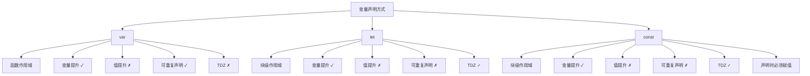
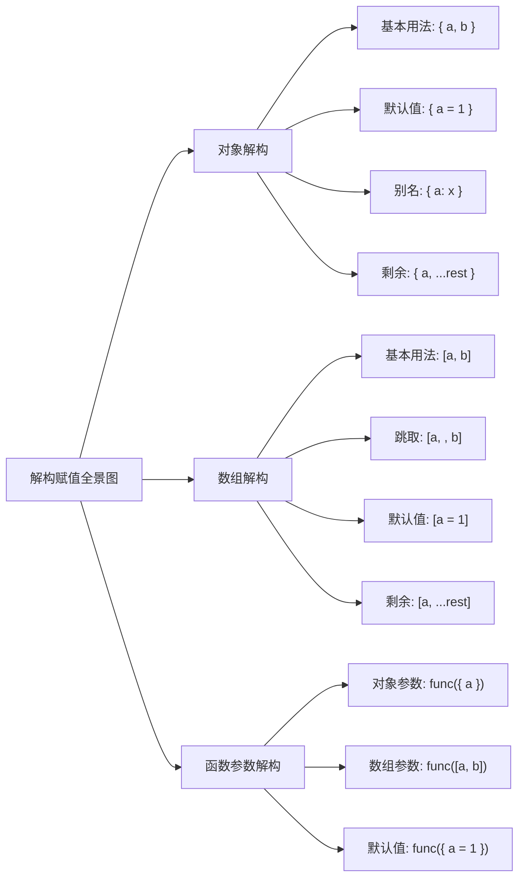
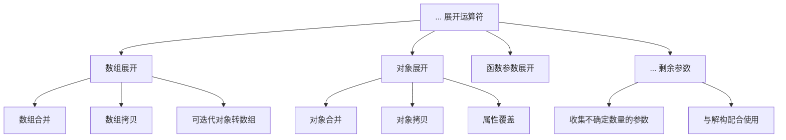
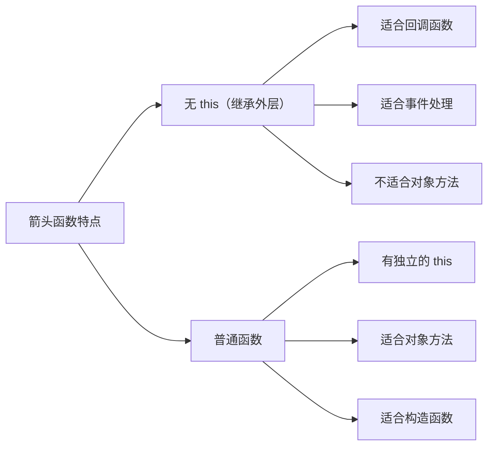
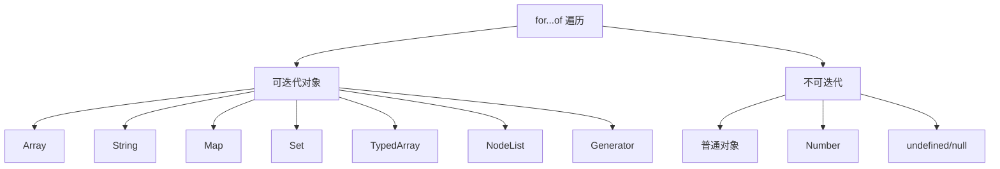
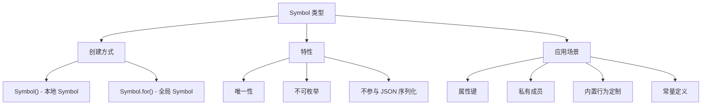

+++
title = "第 20 章 ES6+ 核心语法"
weight = 200
date = "2026-03-24T22:08:00+08:00"
type = "docs"
description = ""
isCJKLanguage = true
draft = false
+++
# 第 20 章 ES6+ 核心语法

> JavaScript 从"草履虫"进化成"高级生物"的关键一跃！

## 20.1 块级作用域

### let 与 const 的作用域规则

话说在很久很久以前，JavaScript 只有两种作用域：全局作用域和函数作用域。那时候程序员们写代码就像在玩"大家来找茬"——到处都是 var，一不小心就变量覆盖，天坑遍野，民不聊生。

直到 ES6 带着 `let` 和 `const` 横空出世，JavaScript 终于迎来了"改革开放"的新时代！

**块级作用域**是什么？说白了就是一对花括号 `{}` 圈起来的地盘。在这个地盘里声明的变量，就像加了结界一样，里面的出不去，外面的也进不来。隔壁的 var 看了都馋哭了："我飘零半生，只因没有一堵墙！"

```javascript
// 让我们感受一下 var 的"海纳百川"
function oldSchool() {
  if (true) {
    var pizza = '意大利披萨';  // var 声明的变量没有块级作用域
    console.log('里面:', pizza);  // 里面: 意大利披萨
  }
  console.log('外面:', pizza);  // 外面: 意大利披萨 —— 居然还能访问到！
}
oldSchool();
console.log(pizza);  // 意大利披萨 —— 纳尼？！函数外面的 var 居然是全局变量！
```

```javascript
// 现在看看 let 和 const 是怎么收拾烂摊子的
function newEra() {
  if (true) {
    let sushi = '日本寿司';      // let 声明的变量有块级作用域
    const ramen = '日本拉面';    // const 也是如此
    console.log('里面:', sushi, ramen);  // 里面: 日本寿司 日本拉面
  }
  // console.log('外面:', sushi, ramen);  // ReferenceError! 终于锁起来了！
}
newEra();
// console.log(sushi);  // ReferenceError! 域外来了也白搭！
// console.log(ramen);  // ReferenceError! 想越狱？没门！
```

```javascript
// for 循环的经典陷阱，let 来拯救
// 经典的 var 循环闭包问题
function printNumbersVar() {
  for (var i = 0; i < 3; i++) {
    setTimeout(() => {
      console.log('var i =', i);  // var i = 3, var i = 3, var i = 3 —— 全是3！
    }, 100);
  }
}
printNumbersVar();

// let 版本的救赎
function printNumbersLet() {
  for (let i = 0; i < 3; i++) {  // 每次循环都是全新的 i！
    setTimeout(() => {
      console.log('let i =', i);  // let i = 0, let i = 1, let i = 2 —— 完美！
    }, 100);
  }
}
printNumbersLet();
```

**let 和 const 的区别：**

```javascript
let drink = '可口可乐';  // let 声明的变量可以重新赋值
drink = '百事可乐';      // 没问题，改吧！
console.log(drink);     // 百事可乐

const dessert = '提拉米苏';  // const 声明的常量不能重新赋值
// dessert = '芝士蛋糕';   // TypeError! const 不是你想换就能换的！
console.log(dessert);   // 提拉米苏

// 但是！const 声明的对象和数组，内容是可以修改的！
const person = { name: '小明', age: 18 };
person.age = 20;           // 这完全可以！因为修改的是对象的属性
person.gender = 'male';    // 添加属性也是可以的！
console.log(person);       // { name: '小明', age: 20, gender: 'male' }
// person = {};             // 但是重新赋值为新对象？门都没有！

const fruits = ['苹果', '香蕉'];
fruits.push('橙子');        // 数组添加元素，完全OK
fruits[0] = '鸭梨';         // 修改数组元素，也没毛病
console.log(fruits);       // [ '鸭梨', '香蕉', '橙子' ]
// fruits = ['葡萄'];       // 重新赋值？ReferenceError 伺候！
```

```javascript
// 小贴士：什么时候用 let？什么时候用 const？
// 原则：优先 const，实在要改才用 let
// 就像找对象：首选忠贞不渝的，实在守不住再选花心的 😏

const API_URL = 'https://api.example.com';  // 这种常量必须用 const
let count = 0;                               // 计数器这种会变的，用 let
count = count + 1;                           // 改就改呗，反正你是 let
```

---

### 暂时性死区（TDZ）

**暂时性死区**（Temporal Dead Zone，简称 TDZ）——这个名字听起来像是《进击的巨人》里的设定，但实际上它是 JavaScript 给 `let` 和 `const` 增加的一层保护罩。

简单来说：**在块级作用域内，在 let/const 声明之前的区域，叫做暂时性死区。在这个区域内访问变量，会直接报错！**

```javascript
// 先来看看 var 的"飘逸"
console.log('var 飘逸:', freedom);  // undefined —— 变量提升，但值是 undefined
var freedom = '我欲乘风破浪';

// 再来看看 let/const 的"严谨"
try {
  console.log('let 在死区里:', trapped);  // ReferenceError! 你居然敢在声明前使用！
  let trapped = '我想静静';
} catch (e) {
  console.log('报错信息:', e.message);  // Cannot access 'trapped' before initialization
}
```

```javascript
// 死区的范围：从块级作用域开始到 let/const 声明的那一行
{
  // TDZ 开始！从这里的每一行都是死区
  // console.log( TDZ_start );  // ReferenceError!

  let TDZ_start = '我终于出来了！';
  console.log(TDZ_start);  // 我终于出来了！ —— 过了这个村就没这个店了！

  // console.log( TDZ_end );  // 这里是死区后面的正常区域，可以访问
  let TDZ_end = '我也是正常的变量了';
}

// 出了这个块，TDZ 就不存在了
// console.log(TDZ_start);  // ReferenceError! 块外面当然访问不到块里面的变量！
```

```javascript
// 一个小测验：你觉得下面代码会报错吗？
function testTDZ() {
  console.log(myVar);  // 这里会输出什么？
  var myVar = '我是 var';
}
testTDZ();  // 调用一下试试！
// 答案：输出 undefined！因为 var 会变量提升，只是值没提升
```

```javascript
// 再来一个测验！
function testTDZ2() {
  // console.log(myLet);  // ReferenceError! 在声明前使用 let？TDZ 警告！
  let myLet = '我是 let';
  console.log(myLet);  // 正常输出
}
testTDZ2();
// 答案：第一行报错！因为 let 有 TDZ 保护
```

**TDZ 的存在是为了让代码更安全**——强迫你养成先声明后使用的好习惯。想象一下，如果没有 TDZ，你可能会写出这样的代码：

```javascript
// 没有 TDZ 的灾难现场（假设的）
function calculate() {
  result = 100;          // 以为是全局变量
  let result;             // 哦原来是局部变量！晚了！
  console.log(result);   // 你猜输出啥？
}
calculate();
```

```javascript
// 有 TDZ 的保护现场
function calculateSafe() {
  // result = 100;  // ReferenceError! 在声明前使用？门都没有！
  let result = 100;
  console.log(result);  // 100，稳稳当当！
}
calculateSafe();
```

**为什么叫"暂时性"死区？**

因为只要你声明了变量，死区就消失了。这个"暂时"指的是从块开始到声明之前的那个时间窗口。

---

### 变量提升对比：var vs let vs const

**变量提升**（Hoisting）是 JavaScript 的一大特色，就像是变量们集体练习"轻功水上漂"，在代码执行前就悄悄飘到了作用域顶部。但它们的轻功水平参差不齐：

```javascript
// var 的"半吊子轻功" —— 只提升声明，不提升赋值
console.log('var 提升测试:');
console.log(halfMaster);          // undefined —— 声明提升了，但赋值还在原地
var halfMaster = '我轻功一般般';

// 上面代码的真相是这样的：
var halfMaster;                   // 声明提升到顶部
console.log(halfMaster);          // undefined
halfMaster = '我轻功一般般';       // 赋值还在原来的位置
```

```javascript
// let 的"专业级轻功" —— 提升 + TDZ 保护
// console.log(letMaster);  // ReferenceError! TDZ 让你在声明前动弹不得！
let letMaster = '我轻功很专业';
console.log(letMaster);          // 正常访问
```

```javascript
// const 和 let 类似，但是声明时必须赋值
// console.log(constMaster);  // ReferenceError! TDZ 保护！
const constMaster = '我轻功最稳'; // const 必须在声明时就赋值！
console.log(constMaster);        // 我轻功最稳
```

```javascript
// 让我们来个三方大PK！
console.log('=== 变量提升大比武 ===');

// var 的表现
function varTest() {
  console.log('var 比赛:');
  console.log('提升的值:', varPlayer);  // undefined —— 飘上去了但没带值
  var varPlayer = 'var选手';
  console.log('原位置:', varPlayer);    // var选手 —— 在原位等着呢
}
varTest();

// let 的表现
function letTest() {
  console.log('let 比赛:');
  // console.log('提升的值:', letPlayer);  // ReferenceError! let 不会提升？错！提升了但 TDZ 保护！
  let letPlayer = 'let选手';
  console.log('原位置:', letPlayer);    // let选手
}
letTest();
// 真相：let 也会提升，只是提升后立即进入 TDZ，直到遇到声明语句

// const 的表现
function constTest() {
  console.log('const 比赛:');
  // console.log('提升的值:', constPlayer);  // ReferenceError! 同样 TDZ 保护
  const constPlayer = 'const选手';
  console.log('原位置:', constPlayer);  // const选手
}
constTest();
```

```javascript
// 面试题大挑战！
function interviewQuestion(question) {
  console.log('面试官问:', question);
}

interviewQuestion('var、let、const 有什么区别？');
// 标准化答案：
/*
 * 1. var 有变量提升，let/const 也有提升但有 TDZ 保护
 * 2. var 是函数作用域，let/const 是块级作用域
 * 3. var 可以重复声明，let/const 不行
 * 4. const 声明时必须赋值，且不能重新赋值（但引用类型可以修改内部属性）
 * 5. 在 for 循环中，var 是共享的，let 是独立的
 */
```



```javascript
// 实战建议
// 1. 默认使用 const —— 稳定性第一
// 2. 当你需要修改变量时使用 let —— 明确告诉别人这个值会变
// 3. 尽量避免使用 var —— 老旧代码的遗留问题，能不用就不用
// 4. for 循环中务必使用 let —— 血泪教训！

// 最后的忠告：let 和 const 不是 var 的替代品，而是更精准的工具
// 就像瑞士军刀 vs 西瓜刀 —— 各有各的用途！
```

> 💡 **本章小结（第20章第1节）**
> 
> 块级作用域让 JavaScript 变得更有纪律。`let` 给你重新赋值的能力，`const` 则是"一旦拥有，别无所求"。TDZ 是 let/const 的保护罩，在你声明之前，变量是不可触碰的。变量提升让 var 看起来很神奇，但实际上它只提升了声明，没提升值 —— 就像是飘到天花板上但没带降落伞。而 let/const 虽然也提升，但在声明之前那段区域是"死区"，谁碰谁报错。记住：**优先 const，需要变就用 let，永远不用 var**！

---

## 20.2 解构赋值

### 对象解构：基本用法 / 默认值 / 变量别名 / 剩余模式

如果你还在这样赋值：

```javascript
const name = user.name;
const age = user.age;
const city = user.city;
```

那么恭喜你，你正在参加"2020年前最无聊代码大赛"！解构赋值了解一下？

**解构赋值**就像是 JavaScript 世界里的"垃圾分类"——把一个对象或数组里的属性/元素"拆开"，分别放进不同的变量里，既优雅又高效。

```javascript
// 最基础的解构赋值
const student = {
  name: '张小明',
  age: 16,
  grade: '高二',
  hobby: '打篮球'
};

// 传统写法：无聊透顶
// const name = student.name;
// const age = student.age;
// const hobby = student.hobby;

// 解构写法：一行搞定！
const { name, age, hobby } = student;
console.log('姓名:', name);  // 姓名: 张小明
console.log('年龄:', age);    // 年龄: 16
console.log('爱好:', hobby);  // 爱好: 打篮球
```

```javascript
// 解构赋值还可以用在函数参数里！
function greet({ name, age, city = '北京' }) {  // city 有默认值
  console.log(`你好，我叫${name}，今年${age}岁，来自${city}`);
}

const person = { name: '李小花', age: 18, city: '上海' };
greet(person);  // 你好，我叫李小花，今年18岁，来自上海

const person2 = { name: '王二麻子', age: 25 };
greet(person2);  // 你好，我叫王二麻子，今年25岁，来自北京（使用了默认值）
```

```javascript
// 默认值：解构时可以给变量设置默认值
const { title, author = '匿名作者', price = 0 } = {
  title: 'JavaScript 高级教程',
  author: '张三'
};

console.log('书名:', title);    // JavaScript 高级教程
console.log('作者:', author);   // 张张三 —— 有默认值就用原值
console.log('价格:', price);    // 0 —— 没有这个属性，用默认值
```

```javascript
// 变量别名：可以给解构出来的变量起个新名字
const { name: userName, age: userAge, password: secret = '123456' } = {
  name: '赵六',
  age: 30
};

console.log('用户名:', userName);   // 用户名: 赵六
console.log('用户年龄:', userAge);   // 用户年龄: 30
console.log('密码:', secret);       // 密码: 123456 —— 用的是默认值
// console.log(name);              // ReferenceError! 原名已经不存在了
// console.log(age);               // ReferenceError! 必须用别名！
```

```javascript
// 剩余模式：把剩余的属性都收走
const { name, age, ...otherInfo } = {
  name: '孙七',
  age: 22,
  gender: '女',
  occupation: '工程师',
  hobby: '写代码'
};

console.log('姓名:', name);           // 姓名: 孙七
console.log('年龄:', age);             // 年龄: 22
console.log('其他信息:', otherInfo);   // 其他信息: { gender: '女', occupation: '工程师', hobby: '写代码' }
```

```javascript
// 嵌套解构：对象里还有对象？不怕！
const company = {
  name: '宇宙科技集团',
  CEO: {
    name: '马云',
    age: 58,
    contact: {
      email: 'ma@yun.com',
      phone: '13800138000'
    }
  },
  employees: 100000
};

const { CEO: { name: ceoName, contact: { email: ceoEmail } }, employees } = company;

console.log('CEO姓名:', ceoName);      // CEO姓名: 马云
console.log('CEO邮箱:', ceoEmail);     // CEO邮箱: ma@yun.com
console.log('员工数:', employees);     // 员工数: 100000
```

```javascript
// 实际应用场景：解析 JSON 响应
const apiResponse = {
  status: 200,
  message: 'success',
  data: {
    userId: 1001,
    userName: '周九',
    userProfile: {
      avatar: 'https://example.com/avatar.jpg',
      bio: '一个有趣的灵魂'
    }
  },
  timestamp: 1710681600000
};

// 解析这个响应
const {
  status,
  message,
  data: {
    userId,
    userName,
    userProfile: { avatar, bio }
  }
} = apiResponse;

console.log('状态:', status);         // 状态: 200
console.log('用户ID:', userId);       // 用户ID: 1001
console.log('头像:', avatar);         // 头像: https://example.com/avatar.jpg
console.log('简介:', bio);           // 简介: 一个有趣的灵魂
```

---

### 数组解构

对象有解构，数组当然也不能落后！数组解构是按**位置**来匹配的，就像发扑克牌一样，按顺序来。

```javascript
// 最基本的数组解构
const fruits = ['苹果', '香蕉', '橙子', '葡萄'];

// 传统写法
// const first = fruits[0];
// const second = fruits[1];

// 解构写法
const [first, second, third] = fruits;
console.log('第一个:', first);   // 第一个: 苹果
console.log('第二个:', second);  // 第二个: 香蕉
console.log('第三个:', third);   // 第三个: 橙子
```

```javascript
// 跳着解构：只取我想要的
const colors = ['红', '绿', '蓝', '黄', '紫'];

const [, , primary, , secondary] = colors;  // 用逗号跳过前两个
console.log('主色:', primary);     // 主色: 蓝
console.log('副色:', secondary);    // 副色: 紫
```

```javascript
// 默认值：数组元素不存在时使用默认值
const [a, b, c, d = '默认值'] = [1, 2];
console.log(a, b, c, d);  // 1 2 undefined 默认值
```

```javascript
// 剩余模式：把剩下的都收走
const [head, ...rest] = ['A', 'B', 'C', 'D', 'E'];
console.log('头:', head);      // 头: A
console.log('尾巴:', rest);    // 尾巴: ['B', 'C', 'D', 'E']
```

```javascript
// 交换变量：解构让 swap 变得优雅！
let x = 10;
let y = 20;

// 传统方法：需要临时变量
// let temp = x;
// x = y;
// y = temp;

// 解构方法：一行搞定！
[y, x] = [x, y];
console.log('x:', x, 'y:', y);  // x: 20 y: 10 —— 完美交换！
```

```javascript
// 嵌套数组解构
const matrix = [
  [1, 2, 3],
  [4, 5, 6],
  [7, 8, 9]
];

const [[a], [, b], [, , c]] = matrix;
console.log('a:', a, 'b:', b, 'c:', c);  // a: 1 b: 5 c: 9
```

```javascript
// 实际应用：解析函数返回值
function getUserInfo() {
  return ['张三', 25, '北京', ['编程', '游戏', '电影']];
}

const [userName, userAge, userCity, [hobby1, hobby2, hobby3]] = getUserInfo();
console.log(`我是${userName}，${userAge}岁，来自${userCity}，喜欢${hobby1}和${hobby3}`);
// 我是张三，25岁，来自北京，喜欢编程和电影
```

```javascript
// 解构 + 剩余模式 + 默认值的组合拳
const [first = '头', second, ...others] = [undefined, '脖子', '手', '脚', '腿'];

console.log('first:', first);   // first: 头（用了默认值，因为数组第一个是 undefined）
console.log('second:', second); // second: 脖子
console.log('others:', others);  // others: ['手', '脚', '腿']
```

```javascript
// 小技巧：忽略前N个元素后剩余的
const data = [1, 2, 3, 4, 5, 6, 7, 8, 9, 10];

// 只取前3个
const [p1, p2, p3] = data;
console.log('前3个:', p1, p2, p3);  // 前3个: 1 2 3

// 跳过前5个，取剩余的
const [, , , , , ...lastFive] = data;
console.log('后5个:', lastFive);  // 后5个: [ 6, 7, 8, 9, 10 ]
```

---

### 函数参数解构

函数参数解构是 React 开发者天天见的写法，如果你没见过，那说明你还没准备好迎接现代 JavaScript 的洗礼！

```javascript
// 最常见的：解构配置对象
function createButton({
  text = '按钮',           // 默认文本
  type = 'primary',       // 默认类型
  disabled = false,       // 默认不禁用
  onClick = () => {}      // 默认空函数
} = {}) {                 // 解构 + 默认值（防止传 undefined 报错）
  console.log(`创建了一个${disabled ? '禁用' : ''}${type}按钮，文本是"${text}"`);
  onClick();
}

createButton({ text: '提交', type: 'success' });
// 创建了一个success按钮，文本是"提交"

createButton({});
// 创建了一个primary按钮，文本是"按钮"

createButton();
// 创建了一个primary按钮，文本是"按钮"
```

```javascript
// 数组参数解构
function processScores([first, second, ...others]) {
  console.log('冠军:', first);
  console.log('亚军:', second);
  console.log('其他:', others);
}

processScores(['小红', '小明', '小芳', '小刚', '小李']);
// 冠军: 小红
// 亚军: 小明
// 其他: ['小芳', '小刚', '小李']
```

```javascript
// 解构参数 + 类型注解（TypeScript 风格，虽然这是 JS）
// JavaScript 本身不支持类型注解，但这种写法在文档中很常见
function greet({
  name = '陌生人',
  age = 0,
  isVip = false
}) {
  const vipTag = isVip ? '（VIP用户）' : '';
  console.log(`你好，${name}${vipTag}！${age ? `你${age}岁了。` : ''}`);
}

greet({ name: '王五', age: 35, isVip: true });  // 你好，王五（VIP用户）！你35岁了。
greet({ name: '赵四' });                          // 你好，赵四！你0岁了。（年龄没传就用默认值0）
greet({});                                        // 你好，陌生人！你0岁了。
greet();                                          // 你好，陌生人！你0岁了。（参数都没传）
```

```javascript
// 解构参数与 arguments 对象
// 使用解构参数后，arguments 对象依然可用（如果是普通函数）
function showArgs(a, b, c) {
  const [d, e] = [40, 50];  // 函数体内的解构
  console.log('a:', a, 'b:', b, 'c:', c, 'd:', d, 'e:', e);
  console.log('arguments:', Array.from(arguments));  // [10, 20, 30]
}

showArgs(10, 20, 30);
// a: 10 b: 20 c: 30 d: 40 e: 50
// arguments: [ 10, 20, 30 ]
```

```javascript
// 嵌套解构参数
function parseUser({
  info: {
    name,
    age,
    address: { city, district }
  },
  preferences: [firstHobby, secondHobby]
}) {
  console.log(`${name}，${age}岁，住在${city}${district}，喜欢${firstHobby}和${secondHobby}`);
}

const userData = {
  info: {
    name: '钱多多',
    age: 28,
    address: {
      city: '杭州',
      district: '西湖区',
      street: '龙井路'
    }
  },
  preferences: ['喝茶', '爬山', '摄影']
};

parseUser(userData);
// 钱多多，28岁，住在杭州西湖区，喜欢喝茶和爬山
```

---

### 嵌套解构

当对象的属性是对象，对象的属性是数组，数组的元素是对象，对象的属性是数组的数组...的时候，嵌套解构就是你的救星！

```javascript
// 经典场景：解析复杂配置
const config = {
  server: {
    host: 'localhost',
    port: 8080,
    ssl: {
      enabled: true,
      key: './keys/private.pem',
      cert: './keys/certificate.pem'
    }
  },
  database: {
    type: 'postgresql',
    connections: [
      { host: 'db1.example.com', weight: 3 },
      { host: 'db2.example.com', weight: 2 },
      { host: 'db3.example.com', weight: 1 }
    ]
  },
  logging: {
    level: 'info',
    outputs: ['console', 'file']
  }
};

// 嵌套解构，层层剥开
const {
  server: {
    host: serverHost,
    port: serverPort,
    ssl: { enabled: sslEnabled, key: sslKey }
  },
  database: {
    connections: [, , { host: thirdDbHost }]
  },
  logging: {
    outputs: [primaryOutput, ...otherOutputs]
  }
} = config;

console.log('服务器:', serverHost, serverPort);    // 服务器: localhost 8080
console.log('SSL:', sslEnabled ? '开启' : '关闭');  // SSL: 开启
console.log('第三个数据库:', thirdDbHost);          // 第三个数据库: db3.example.com
console.log('主要日志:', primaryOutput);           // 主要日志: console
console.log('其他日志:', otherOutputs);            // 其他日志: ['file']
```

```javascript
// 函数返回值的嵌套解构
function getFullName() {
  return {
    person: {
      name: {
        firstName: '欧阳',
        lastName: '锋'
      },
      nickname: '西毒'
    },
    titles: ['白驼山主人', '一代宗师']
  };
}

const {
  person: {
    name: { firstName, lastName },
    nickname
  },
  titles: [primaryTitle]
} = getFullName();

console.log(`姓名: ${lastName}${firstName}（${nickname}）`);  // 姓名: 欧阳锋（西毒）
console.log('称号:', primaryTitle);                          // 称号: 白驼山主人
```

```javascript
// 实战场景：解析 Event 对象
const event = {
  target: {
    dataset: {
      userId: '12345',
      action: 'click'
    },
    tagName: 'BUTTON',
    classList: ['btn', 'btn-primary', 'active']
  },
  type: 'click',
  bubbles: true,
  cancelable: true,
  timeStamp: 1710681600000
};

// React 风格的事件处理
function handleEvent({
  target: {
    dataset: { userId, action },
    tagName,
    classList: [, , isActive]
  },
  type
}) {
  const activeStatus = isActive ? '激活' : '未激活';
  console.log(`${tagName}元素被${type}了，用户ID=${userId}，动作=${action}，状态=${activeStatus}`);
}

handleEvent(event);
// BUTTON元素被click了，用户ID=12345，动作=click，状态=激活
```



```javascript
// 综合实战：解析 API 响应
const apiData = {
  code: 200,
  message: '操作成功',
  data: {
    pagination: {
      page: 1,
      pageSize: 10,
      total: 100,
      totalPages: 10
    },
    list: [
      { id: 1, name: '商品A', price: 99.9, tags: ['热销', '新品'] },
      { id: 2, name: '商品B', price: 199.9, tags: ['精品'] },
      { id: 3, name: '商品C', price: 49.9, tags: ['特价', '清仓'] }
    ]
  }
};

function parseProductList(response) {
  const {
    code,
    message,
    data: {
      pagination: { page, pageSize, total },
      list: [
        { name: firstProduct, price: firstPrice },
        { name: secondProduct },
        ...otherProducts
      ]
    }
  } = response;

  console.log(`响应码: ${code}，消息: ${message}`);
  console.log(`第${page}页，每页${pageSize}条，共${total}条`);
  console.log(`第一个商品: ${firstProduct}，价格: ¥${firstPrice}`);
  console.log(`第二个商品: ${secondProduct}`);
  console.log(`还有${otherProducts.length}个其他商品`);
}

parseProductList(apiData);
// 响应码: 200，消息: 操作成功
// 第1页，每页10条，共100条
// 第一个商品: 商品A，价格: ¥99.9
// 第二个商品: 商品B
// 还有1个其他商品
```

> 💡 **本章小结（第20章第2节）**
> 
> 解构赋值是 ES6+ 最常用的语法之一，它让赋值代码从"土肥圆"变成"白富美"。对象解构靠属性名匹配，数组解构靠位置匹配。可以设置默认值防止 undefined，可以起别名避免命名冲突，可以用剩余模式收集"散户"。函数参数解构让配置对象的使用变得优雅，嵌套解构则让你能一层层剥开复杂的数据结构。记住：**解构一时爽，一直解构一直爽**！

---

## 20.3 展开与剩余

### 展开运算符 ...：数组展开 / 对象展开

**展开运算符**（Spread Operator）——三个点的人格分裂表演。它既是"拆快递"的，也是"打包行李"的。在赋值时是拆（展开），在声明时是收（剩余）。

```javascript
// 先来认识一下展开运算符的真面目
console.log(...'hello');  // h e l l o —— 字符串被展开了！
console.log(...[1, 2, 3]);  // 1 2 3 —— 数组被展开了！
```

---

#### 数组展开

```javascript
// 场景1：数组合并 —— 以前要这样写
const arr1 = [1, 2, 3];
const arr2 = [4, 5, 6];
// const mergedOld = arr1.concat(arr2);  // concat 方法

// 现在这样写
const merged = [...arr1, ...arr2];
console.log('合并后:', merged);  // 合并后: [ 1, 2, 3, 4, 5, 6 ]
```

```javascript
// 场景2：复制数组（浅拷贝）
const original = [1, 2, 3];
const copy = [...original];
console.log('拷贝:', copy);  // 拷贝: [ 1, 2, 3 ]
copy.push(4);
console.log('原数组:', original);  // 原数组: [ 1, 2, 3 ] —— 没变！
console.log('拷贝:', copy);        // 拷贝: [ 1, 2, 3, 4 ] —— 独立的！
```

```javascript
// 场景3：在任意位置插入元素
const fruits = ['苹果', '香蕉'];
const vegetables = ['白菜', '萝卜'];

// 在水果前面插入蔬菜
const food1 = [...vegetables, ...fruits];
console.log('蔬菜在前:', food1);  // 蔬菜在前: [ '白菜', '萝卜', '苹果', '香蕉' ]

// 在中间插入
const mix = ['米饭', ...fruits, '可乐', ...vegetables, '面条'];
console.log('混搭:', mix);  // 混搭: [ '米饭', '苹果', '香蕉', '可乐', '白菜', '萝卜', '面条' ]
```

```javascript
// 场景4：将可迭代对象转为数组
// 字符串
const strArr = [...'hello'];
console.log('字符串转数组:', strArr);  // 字符串转数组: [ 'h', 'e', 'l', 'l', 'o' ]

// Set
const set = new Set([1, 2, 3, 2, 1]);
const setArr = [...set];
console.log('Set去重后:', setArr);  // Set去重后: [ 1, 2, 3 ]

// NodeList（DOM 中的元素集合）
// const divs = document.querySelectorAll('div');
// const divArr = [...divs];  // NodeList 转数组后才能用 map/filter
```

```javascript
// 场景5：作为函数参数
const numbers = [3, 1, 4, 1, 5, 9, 2, 6];
console.log('最大值:', Math.max(...numbers));  // 最大值: 9
console.log('最小值:', Math.min(...numbers));  // 最小值: 1

// 以前要这样写
// Math.max.apply(null, numbers);  // apply 写法，不直观
```

```javascript
// 场景6：数组去重（结合 Set）
const duplicates = [1, 2, 2, 3, 3, 3, 4, 4, 4, 4];
const unique = [...new Set(duplicates)];
console.log('去重后:', unique);  // 去重后: [ 1, 2, 3, 4 ]
```

```javascript
// 场景7：展开还可以用来解构配对
const [first, ...rest] = [1, 2, 3, 4, 5];
console.log('第一个:', first);  // 第一个: 1
console.log('剩余:', rest);     // 剩余: [ 2, 3, 4, 5 ]
```

---

#### 对象展开

```javascript
// 对象展开（ES2018+）
const person = { name: '张三', age: 30 };
const job = { title: '工程师', company: '某狐公司' };

// 合并对象
const fullProfile = { ...person, ...job };
console.log('完整资料:', fullProfile);
// 完整资料: { name: '张三', age: 30, title: '工程师', company: '某狐公司' }
```

```javascript
// 对象拷贝（浅拷贝）
const originalObj = { name: '李四', age: 25, address: { city: '北京' } };
const copiedObj = { ...originalObj };

copiedObj.age = 26;              // 修改基本类型
copiedObj.address.city = '上海';  // 修改嵌套对象

console.log('原对象:', originalObj);
// 原对象: { name: '李四', age: 25, address: { city: '上海' } }
// 注意！嵌套对象是共享引用，不是深拷贝！
console.log('拷贝对象:', copiedObj);
// 拷贝对象: { name: '李四', age: 26, address: { city: '上海' } }
```

```javascript
// 属性覆盖：后面的会覆盖前面的
const defaults = { theme: 'light', lang: 'zh', fontSize: 14 };
const userConfig = { lang: 'en', fontSize: 16 };

const config = { ...defaults, ...userConfig };
console.log('最终配置:', config);
// 最终配置: { theme: 'light', lang: 'en', fontSize: 16 }
// lang 被覆盖了，fontSize 也被覆盖了，但 theme 保留了
```

```javascript
// 应用：更新对象（不变性操作）
const state = { count: 0, user: { name: '王五' }, loading: false };

// 更新 count
const newState1 = { ...state, count: state.count + 1 };
console.log('更新后:', newState1.count);  // 更新后: 1
console.log('原state未变:', state.count); // 原state未变: 0

// 更新嵌套属性（需要手动展开）
const newState2 = {
  ...state,
  user: { ...state.user, name: '赵六' }
};
console.log('新用户名:', newState2.user.name);  // 新用户名: 赵六
console.log('原用户名:', state.user.name);       // 原用户名: 王五
```

```javascript
// 实战：表单数据处理
const formDefaults = {
  username: '',
  password: '',
  email: '',
  agreeTerms: false,
  subscribe: true
};

const userInput = {
  username: 'admin',
  email: 'admin@example.com',
  // password 和 agreeTerms 没填，用默认值
};

const formData = { ...formDefaults, ...userInput };
console.log('表单数据:', formData);
// 表单数据: {
//   username: 'admin',
//   password: '',
//   email: 'admin@example.com',
//   agreeTerms: false,
//   subscribe: true
// }
```

```javascript
// 对象展开的限制
// 1. 只会展开自有属性，不会展开继承的属性
const parent = { inherited: '来自父类' };
const child = { own: '自己的' };
Object.setPrototypeOf(child, parent);  // 设置原型

const expanded = { ...child };
console.log('展开结果:', expanded);  // { own: '自己的' } —— 继承的属性没了！

// 2. Symbol 类型的属性不会被展开
const sym = Symbol('test');
const objWithSym = { [sym]: 'symbol值', normal: '普通值' };
const expandedSym = { ...objWithSym };
console.log('Symbol属性:', expandedSym);  // { normal: '普通值' } —— Symbol 丢失了！

// 3. 不可枚举的属性也不会被展开
const unenumerable = {};
Object.defineProperty(unenumerable, 'hidden', {
  value: '隐藏的值',
  enumerable: false  // 不可枚举
});
const expandedUnenum = { ...unenumerable };
console.log('不可枚举属性:', expandedUnenum);  // {} —— 空对象！
```

```javascript
// 数组和对象的混合展开
const arr = [1, 2, 3];
const obj = { a: 4, b: 5 };

// 数组可以展开为参数，对象可以合并
const mixed = [...arr, obj];      // 数组展开 + 对象作为整体
const mixed2 = [...arr, ...obj]; // 数组展开 + 对象展开（会变成索引）
console.log('混合1:', mixed);    // [ 1, 2, 3, { a: 4, b: 5 } ]
console.log('混合2:', mixed2);    // [ 1, 2, 3, 4, 5 ] —— 对象被转成了可枚举的 [a, b]
```

---

### 剩余参数 ...rest

如果说展开运算符是"拆快递"，那**剩余参数**就是"打包行李"。它们用同样的符号 `...`，但场景完全相反。

```javascript
// 剩余参数：把不确定数量的参数收集成一个数组
function sum(...numbers) {
  console.log('收到的参数:', numbers);  // 收到的参数: [ 1, 2, 3, 4, 5 ]
  return numbers.reduce((total, num) => total + num, 0);
}

console.log('求和结果:', sum(1, 2, 3, 4, 5));  // 求和结果: 15
console.log('求和结果:', sum(10, 20));           // 求和结果: 30
console.log('求和结果:', sum());                 // 求和结果: 0
```

```javascript
// 剩余参数必须在最后
// 这是正确的
function correct(a, b, ...rest) {
  console.log('a:', a, 'b:', b, 'rest:', rest);
}
correct(1, 2, 3, 4, 5);
// a: 1 b: 2 rest: [ 3, 4, 5 ]

// 这是错误的！
// function wrong(...rest, last) {  // SyntaxError: Rest parameter must be last
//   console.log(rest, last);
// }
```

```javascript
// 与arguments对象的对比
// arguments 是伪数组（没有数组方法）
function oldStyle() {
  console.log('arguments类型:', typeof arguments);  // object
  console.log('是数组?', Array.isArray(arguments));  // false
  // arguments.push(6);  // 报错！arguments不是真数组

  // 需要转换
  const args = Array.from(arguments);
  console.log('转换后是数组?', Array.isArray(args));  // true
}

oldStyle(1, 2, 3);

// 剩余参数是真数组
function newStyle(...args) {
  console.log('args类型:', typeof args);  // object
  console.log('是数组?', Array.isArray(args));  // true
  args.push(4);  // 直接用数组方法！
  console.log('push后:', args);  // [ 1, 2, 3, 4 ]
}

newStyle(1, 2, 3);
```

```javascript
// 解构 + 剩余参数
const [first, second, ...remaining] = [1, 2, 3, 4, 5];
console.log('first:', first);        // first: 1
console.log('second:', second);      // second: 2
console.log('remaining:', remaining); // remaining: [ 3, 4, 5 ]

// 对象解构 + 剩余
const { name, age, ...otherInfo } = {
  name: '孙七',
  age: 28,
  city: '深圳',
  hobby: '游泳',
  profession: '医生'
};
console.log('姓名:', name);          // 姓名: 孙七
console.log('年龄:', age);          // 年龄: 28
console.log('其他信息:', otherInfo); // 其他信息: { city: '深圳', hobby: '游泳', profession: '医生' }
```

```javascript
// 实际应用：实现一个日志函数
function logger(level, ...messages) {
  const timestamp = new Date().toISOString();
  const formattedMessages = messages.map(msg => {
    if (typeof msg === 'object') {
      return JSON.stringify(msg);  // 对象转JSON字符串
    }
    return msg;
  });

  console.log(`[${timestamp}] [${level.toUpperCase()}]`, ...formattedMessages);
}

logger('info', '用户登录成功');  // [2026-03-24T12:58:00.000Z] [INFO] 用户登录成功
logger('error', '数据库连接失败', { code: 500, reason: 'timeout' });
// [2026-03-24T12:58:00.000Z] [ERROR] 数据库连接失败 {"code":500,"reason":"timeout"}
```

```javascript
// 实现一个 partial function（函数柯里化的简化版）
function partial(fn, ...initialArgs) {
  return function(...laterArgs) {
    return fn(...initialArgs, ...laterArgs);
  };
}

function multiply(a, b, c) {
  return a * b * c;
}

const multiplyBy2 = partial(multiply, 2);  // 固定第一个参数为2
const multiplyBy2And3 = partial(multiply, 2, 3);  // 固定前两个参数为2和3

console.log('multiplyBy2(5):', multiplyBy2(5));  // multiplyBy2(5): 10
console.log('multiplyBy2And3(5):', multiplyBy2And3(5));  // multiplyBy2And3(5): 30
console.log('multiply(2, 3, 5):', multiply(2, 3, 5));  // multiply(2, 3, 5): 30
```

```javascript
// 剩余参数收集不匹配的参数
function handleRequest(method, url, ...options) {
  console.log('方法:', method);
  console.log('地址:', url);
  console.log('额外选项:', options);
}

handleRequest('GET', '/api/users');
// 方法: GET
// 地址: /api/users
// 额外选项: []

handleRequest('POST', '/api/users', { headers: { 'Content-Type': 'application/json' } }, 3000);
// 方法: POST
// 地址: /api/users
// 额外选项: [ { headers: { 'Content-Type': 'application/json' } }, 3000 ]
```



```javascript
// 一图流总结
console.log('=== 展开 vs 剩余 ===');
console.log('展开：在赋值/传参时，把集合拆成单独的元素');
console.log('剩余：在声明/定义时，把单独的元素收集成集合');
console.log('');
console.log('展开例子：');
console.log('  const arr = [...[1,2,3]];  // [1,2,3]');
console.log('  fn(...args);  // 把数组展开成参数');
console.log('');
console.log('剩余例子：');
console.log('  function fn(a, ...rest) {}  // 收集剩余参数');
console.log('  const [first, ...rest] = arr;  // 收集剩余元素');
```

> 💡 **本章小结（第20章第3节）**
> 
> 展开运算符 `...` 是个多面手：**在数组中**它能合并、拷贝、转换可迭代对象；**在对象中**它能合并、拷贝（浅拷贝）、覆盖属性。剩余参数 `...rest` 则是收快递的，把零散的元素收集成数组。注意：剩余参数必须在参数列表的最后，而展开则没有这个限制。记住：**展开是拆，剩余是收**，三个点的双重人格！

---

## 20.4 其他核心特性

### 箭头函数

箭头函数——ES6 最讨人喜欢的语法糖。它让 JavaScript 程序员从"function 打字员"进化成了"箭头艺术家"。

```javascript
// 箭头函数的基本形态
// 传统函数
function addOld(a, b) {
  return a + b;
}

// 箭头函数
const addNew = (a, b) => a + b;

console.log('5 + 3 =', addNew(5, 3));  // 5 + 3 = 8
```

```javascript
// 单参数可以省略括号（但仅限一个参数时）
const double = x => x * 2;       // 省略括号
const triple = (x) => x * 3;     // 不省略括号（但没必要）

console.log('double(5):', double(5));  // double(5): 10
console.log('triple(5):', triple(5));  // triple(5): 15
```

```javascript
// 无参数函数
const sayHello = () => '你好！';
console.log(sayHello());  // 你好！
```

```javascript
// 多行函数体需要用花括号包裹，此时必须写 return
const calculate = (a, b) => {
  const sum = a + b;
  const product = a * b;
  return { sum, product };
};

console.log('计算结果:', calculate(3, 4));
// 计算结果: { sum: 7, product: 12 }
```

```javascript
// 箭头函数的高级技巧：立即执行函数（IIFE）的替代写法
// 传统 IIFE
(function() {
  console.log('传统IIFE');
})();

// 箭头函数版本
(() => {
  console.log('箭头IIFE');
})();

// 带参数的版本
((name) => {
  console.log(`你好，${name}！`);
})('小明');
// 你好，小明！
```

```javascript
// 箭头函数与数组方法的天生一对
const numbers = [1, 2, 3, 4, 5, 6, 7, 8, 9, 10];

// map：每个元素翻倍
const doubled = numbers.map(n => n * 2);
console.log('翻倍:', doubled);  // [ 2, 4, 6, 8, 10, 12, 14, 16, 18, 20 ]

// filter：只保留偶数
const evens = numbers.filter(n => n % 2 === 0);
console.log('偶数:', evens);  // [ 2, 4, 6, 8, 10 ]

// reduce：求和
const sum = numbers.reduce((acc, n) => acc + n, 0);
console.log('总和:', sum);  // 55

// find：找第一个大于5的
const firstBig = numbers.find(n => n > 5);
console.log('第一个大于5的:', firstBig);  // 6

// some：是否有偶数
const hasEven = numbers.some(n => n % 2 === 0);
console.log('有偶数?', hasEven);  // true

// every：是否都是正数
const allPositive = numbers.every(n => n > 0);
console.log('都是正数?', allPositive);  // true
```

```javascript
// 箭头函数 vs 普通函数：关键区别
// 区别1：没有自己的 this
const counter = {
  count: 0,
  // 普通函数：有自己的 this
  incrementOld: function() {
    setTimeout(function() {
      this.count++;  // 这里的 this 指向谁？指向 setTimeout（Node 环境）或 window（浏览器环境）
      console.log('普通函数 count:', this.count);  // NaN 或报错
    }, 100);
  },
  // 箭头函数：继承外部的 this
  incrementNew: function() {
    setTimeout(() => {
      this.count++;  // 这里的 this 指向 counter 对象！
      console.log('箭头函数 count:', this.count);  // 1, 2, 3...
    }, 100);
  }
};

counter.incrementOld();
counter.incrementNew();
```

```javascript
// 区别2：没有 arguments 对象
function oldFunc() {
  console.log('arguments:', arguments);  // [Arguments] { '0': 1, '1': 2, '2': 3 }
}

const newFunc = (...args) => {
  // console.log(arguments);  // ReferenceError! 箭头函数没有 arguments
  console.log('rest参数:', args);  // [ 1, 2, 3 ]
};

oldFunc(1, 2, 3);
newFunc(1, 2, 3);
```

```javascript
// 区别3：不能作为构造函数（不能用 new 调用）
const Person = (name, age) => {
  this.name = name;
  this.age = age;
};

// new Person('张三', 20);  // TypeError! 箭头函数不是构造函数
```

```javascript
// 区别4：没有 prototype 属性
const fn = () => {};
console.log('箭头函数有 prototype?', fn.hasOwnProperty('prototype'));  // false
console.log('普通函数有 prototype?', function(){}.hasOwnProperty('prototype'));  // true
```

```javascript
// 箭头函数的实际应用场景
// 场景1：React 中的事件处理（class component）
class Counter extends React.Component {
  constructor(props) {
    super(props);
    this.state = { count: 0 };
    // 绑定 this（或者用箭头函数就不需要绑定了）
    this.handleClick = this.handleClick.bind(this);
  }

  handleClick() {
    this.setState({ count: this.state.count + 1 });
  }

  // 用箭头函数定义方法，不需要 bind
  handleClickArrow = () => {
    this.setState({ count: this.state.count + 1 });
  };
}
```

```javascript
// 场景2：链式调用
const users = [
  { name: '张三', age: 20 },
  { name: '李四', age: 25 },
  { name: '王五', age: 30 }
];

const result = users
  .filter(u => u.age > 22)           // 过滤出年龄大于22的
  .map(u => u.name.toUpperCase())    // 转为大写名字
  .join(', ');

console.log('结果:', result);  // 李四, 王五
```

```javascript
// 箭头函数的陷阱：不要滥用！
// 错误示例：作为对象的方法
const person = {
  name: '小明',
  // 错误！箭头函数的 this 不会绑定到 person
  // greet: () => console.log(`你好，我是${this.name}`)
};

// 正确写法
const personCorrect = {
  name: '小明',
  greet: function() {
    console.log(`你好，我是${this.name}`);
  }
  // 或者用方法简写语法（不会改变 this 绑定）
  // greet() {
  //   console.log(`你好，我是${this.name}`);
  // }
};

personCorrect.greet();  // 你好，我是小明
```

```javascript
// 箭头函数不适合的场景
// 1. 对象的 getter/setter
const obj = {
  // 错误！this 不会指向 obj
  // getValue: () => this._value
  // 正确
  get value() { return this._value || 0; },
  set value(v) { this._value = v; }
};

// 2. 需要动态 this 的事件处理（早期 React 的问题）
// button.addEventListener('click', () => { this.doSomething(); }); // 错误！

// 3. 需要使用 arguments 的场景
// const sum = (...nums) => nums.reduce((a, b) => a + b, 0); // 用 rest 代替
```



```javascript
// 箭头函数语法大集合
// 基本形式
const fn1 = () => {};
const fn2 = x => {};
const fn3 = (x, y) => {};

// 隐式返回（单行函数体）
const add = (a, b) => a + b;
const getName = user => user.name;
const getConfig = config => config.db.host;

// 返回对象字面量需要括号包裹
const createUser = (name, age) => ({ name, age });
console.log('用户对象:', createUser('小红', 18));  // 用户对象: { name: '小红', age: 18 }
```

> 💡 **本章小结（第20章第4节-箭头函数）**
> 
> 箭头函数是 ES6 最常用的语法之一，它的三大特点让它在回调函数中如鱼得水：**没有自己的 this**（继承外层）、**没有自己的 arguments**（用 rest 代替）、**不能作为构造函数**（不能用 new）。适合用的场景：数组方法的回调、React 组件的事件处理、需要保持 this 指向的场合。不适合的场景：对象方法（需要动态 this）、构造函数、需要使用 arguments 的场景。记住：**箭头函数是函数，不是方法**！

---

### 模板字符串

还在用字符串拼接？`'+str1+' '+str2+'` 满天飞？模板字符串来拯救你了！

**模板字符串**（Template Literals）——用反引号（`` ` ``）包裹的字符串，支持插值和多行文本。

```javascript
// 基本用法：反引号替代引号
const name = '小明';
const age = 18;

// 传统拼接（痛苦）
const intro1 = '我叫' + name + '，今年' + age + '岁。';
console.log(intro1);  // 我叫小明，今年18岁。

// 模板字符串（优雅）
const intro2 = `我叫${name}，今年${age}岁。`;
console.log(intro2);  // 我叫小明，今年18岁。
```

```javascript
// 插值表达式：${} 里可以放任何 JavaScript 表达式
const a = 10, b = 20;
console.log(`a + b = ${a + b}`);           // a + b = 30
console.log(`a > b 吗？${a > b}`);          // a > b 吗？false
console.log(`a 的类型是 ${typeof a}`);     // a 的类型是 number
console.log(`${a} 的平方是 ${a * a}`);      // 10 的平方是 100

// 三元运算符
const score = 85;
console.log(`考试成绩：${score >= 60 ? '及格 🎉' : '不及格 😢'}`);
// 考试成绩：及格 🎉
```

```javascript
// 调用函数
function greet(name) {
  return `你好，${name}！`;
}
console.log(`${greet('小红')}`);  // 你好，小红！

// 调用方法
const user = { name: '张三', sayHi() { return `我是${this.name}`; } };
console.log(`${user.sayHi()}`);   // 我是张三
```

```javascript
// 多行文本：终于不用 \n 地狱了！
const poem = `
  床前明月光，
  疑是地上霜。
  举头望明月，
  低头思故乡。
`;
console.log(poem);
/*
  床前明月光，
  疑是地上霜。
  举头望明月，
  低头思故乡。
*/
```

```javascript
// 对比传统多行字符串写法
// 错误方式（会报错）
// const error = '第一行
// 第二行';

// 传统正确方式
const oldStyle = '第一行\n' +
                 '第二行\n' +
                 '第三行';

// 模板字符串方式
const newStyle = `第一行
第二行
第三行`;
console.log(newStyle === oldStyle);  // true —— 结果一样，但写法更美
```

```javascript
// 嵌套模板字符串
const data = { name: '商品A', price: 99.9 };
const template = `商品：${data.name}，价格：¥${data.price.toFixed(2)}`;
console.log(template);  // 商品：商品A，价格：¥99.90

// 更复杂的嵌套
const items = ['苹果', '香蕉', '橙子'];
const list = items.map(item => `• ${item}`).join('\n');
const message = `
购物清单：
${list}
总计：${items.length}件商品
`;
console.log(message);
/*
购物清单：
• 苹果
• 香蕉
• 橙子
总计：3件商品
*/
```

```javascript
// 模板字符串中的特殊字符转义
// 普通字符转义
console.log(`反引号：\``);  // 反引号：`
console.log(`美元符号：\$`);  // 美元符号：$
console.log(`反斜杠：\\`);    // 反斜杠：\

// ${} 的转义
console.log(`转义美元：\${不会被解析}`);  // 转义美元：${不会被解析}
```

```javascript
// 标签模板（Tagged Template）—— 高级用法
// 标签函数可以处理模板字符串
function tag(strings, ...values) {
  console.log('字符串部分:', strings);  // [ 'Hello', '，你今年', '岁！' ]
  console.log('值部分:', values);       // [ '小明', 18 ]
  return '自定义返回值';
}

const result = tag`Hello ${'小明'}，你今年${18}岁！`;
console.log('标签函数返回值:', result);  // 自定义返回值
```

```javascript
// 标签模板的实际应用：防止 XSS
function safeHtml(strings, ...values) {
  const escapeHtml = (str) => {
    const escapeMap = {
      '&': '&amp;',
      '<': '&lt;',
      '>': '&gt;',
      '"': '&quot;',
      "'": '&#39;'
    };
    return str.replace(/[&<>"']/g, (char) => escapeMap[char]);
  };

  return strings.reduce((result, str, i) => {
    const value = values[i - 1];
    return result + str + (value !== undefined ? escapeHtml(String(value)) : '');
  }, '');
}

const userInput = '<script>alert("XSS!")</script>';
const safe = safeHtml`<p>用户输入：${userInput}</p>`;
console.log('安全的HTML:', safe);
// <p>用户输入：&lt;script&gt;alert(&quot;XSS!&quot;)&lt;/script&gt;</p>
```

```javascript
// 另一个标签模板应用：国际化
// 注意：这是一个简化示例，实际项目中请使用专业的 i18n 库
const i18n = (strings, ...values) => {
  const translations = {
    'en': {
      'Hello': 'Hello',
      'years old': 'years old',
      'you are': 'you are'
    },
    'zh': {
      'Hello': '你好',
      'years old': '岁',
      'you are': '你'
    }
  };
  const lang = 'zh';
  const dict = translations[lang];

  return strings.reduce((result, str, i) => {
    const value = values[i - 1];
    // 简单的翻译逻辑（实际项目用 i18next 等专业库）
    let translated = str;
    // 使用正则更精确地匹配并替换
    translated = translated.replace(/Hello/g, dict['Hello']);
    translated = translated.replace(/you are/g, dict['you are']);
    translated = translated.replace(/years old/g, dict['years old']);
    return result + translated + (value !== undefined ? value : '');
  }, '');
};

const name = '小明';
const age = 18;
console.log(i18n`Hello ${name}, you are ${age} years old!`);
// 你好小明, 你是18岁!
```

> 💡 **本章小结（第20章第4节-模板字符串）**
> 
> 模板字符串用反引号包裹，支持 `${}` 插值表达式和多行文本。它让字符串拼接从"焊接工"变成了"艺术家"。插值里可以放变量、表达式、函数调用。标签模板是高级用法，可以自定义模板字符串的处理逻辑，比如做 XSS 防护或国际化。告别 `'+str1+'` 地狱，拥抱 `` `${}` `` 的优雅！

---

### for...of 遍历

`for...of` 是 ES6 引入的新式循环，专门用来遍历**可迭代对象**。如果说 `for...in` 是专门对付对象的，那 `for...of` 就是专门对付数组、字符串、Map、Set 等"序列型"数据的。

```javascript
// 遍历数组
const fruits = ['苹果', '香蕉', '橙子', '葡萄'];

console.log('=== 遍历数组 ===');
for (const fruit of fruits) {
  console.log('水果:', fruit);
}
/*
水果: 苹果
水果: 香蕉
水果: 橙子
水果: 葡萄
*/
```

```javascript
// 遍历字符串
console.log('\n=== 遍历字符串 ===');
for (const char of 'hello') {
  console.log('字符:', char);
}
/*
字符: h
字符: e
字符: l
字符: l
字符: o
*/
```

```javascript
// 遍历 Map
console.log('\n=== 遍历 Map ===');
const colorMap = new Map([
  ['red', '#ff0000'],
  ['green', '#00ff00'],
  ['blue', '#0000ff']
]);

for (const [key, value] of colorMap) {
  console.log(`${key} -> ${value}`);
}
/*
red -> #ff0000
green -> #00ff00
blue -> #0000ff
*/
```

```javascript
// 遍历 Set
console.log('\n=== 遍历 Set ===');
const uniqueNumbers = new Set([1, 2, 3, 2, 1]);
for (const num of uniqueNumbers) {
  console.log('数字:', num);  // 1 2 3（去重了！）
}
```

```javascript
// 遍历 NodeList（DOM 元素集合）
// const divs = document.querySelectorAll('div');
// for (const div of divs) {
//   console.log(div.className);
// }
```

```javascript
// 对比：for...of vs for...in
console.log('=== for...of vs for...in ===');

const arr = ['a', 'b', 'c'];
arr.customProperty = '自定义属性';

console.log('for...of（遍历值）:');
for (const item of arr) {
  console.log('  ', item);  // a, b, c
}

console.log('for...in（遍历键）:');
for (const key in arr) {
  console.log('  ', key, '->', arr[key]);
  // 0 -> a, 1 -> b, 2 -> c, customProperty -> 自定义属性
}
```

```javascript
// for...of 的优势：可以用 break/continue/return
console.log('\n=== 控制流 ===');
const numbers = [1, 2, 3, 4, 5];

for (const num of numbers) {
  if (num === 3) {
    console.log('遇到3，跳过');
    continue;  // 跳过3
  }
  if (num === 5) {
    console.log('遇到5，结束');
    break;  // 结束循环
  }
  console.log('处理数字:', num);
}
/*
处理数字: 1
处理数字: 2
遇到3，跳过
遇到5，结束
*/
```

```javascript
// 配合解构使用
console.log('\n=== 配合解构 ===');
const pairs = [['a', 1], ['b', 2], ['c', 3]];

for (const [key, value] of pairs) {
  console.log(`${key} = ${value}`);
}
/*
a = 1
b = 2
c = 3
*/
```

```javascript
// 生成器函数（Generator）也可以用 for...of
function* numberGenerator() {
  yield 1;
  yield 2;
  yield 3;
}

console.log('\n=== 遍历生成器 ===');
for (const num of numberGenerator()) {
  console.log('生成数字:', num);  // 1, 2, 3
}
```

```javascript
// for...of 不能直接遍历对象
const person = { name: '张三', age: 30 };
// for (const item of person) {  // TypeError: person is not iterable
//   console.log(item);
// }

// 对象遍历需要用 Object 方法或 Object.entries/keys/values
console.log('\n=== 遍历对象的正确方式 ===');
console.log('keys:', Object.keys(person));      // [ 'name', 'age' ]
console.log('values:', Object.values(person));  // [ '张三', 30 ]
console.log('entries:', Object.entries(person)); // [ ['name', '张三'], ['age', 30] ]

for (const [key, value] of Object.entries(person)) {
  console.log(`${key}: ${value}`);
}
/*
name: 张三
age: 30
*/
```

```javascript
// 数组方法对比
const nums = [1, 2, 3, 4, 5];

// forEach - 不能 break/continue
console.log('\n=== forEach（无法中断）===');
nums.forEach(num => {
  // if (num === 3) return;  // 只能跳过当前迭代，不能真正中断
  console.log('num:', num);
});

// for...of - 可以 break/continue
console.log('\n=== for...of（可以中断）===');
for (const num of nums) {
  if (num === 3) break;  // 可以真正中断
  console.log('num:', num);
}

// 性能对比：for...of 略慢于传统 for 循环，但可读性更好
// 绝大多数场景下，for...of 的性能差距可以忽略不计
```



> 💡 **本章小结（第20章第4节-for...of）**
> 
> `for...of` 是遍历可迭代对象的利器，比 `for...in` 更精确（遍历值而非键），比 `forEach` 更灵活（可以用 break/continue）。它可以遍历数组、字符串、Map、Set、生成器等，但不能直接遍历普通对象。配合解构使用效果更佳！在需要中断循环的场景，for...of 是最佳选择！

---

### Symbol 基本用法

**Symbol** —— JavaScript 的第七种数据类型（之前有六种：undefined、null、boolean、number、string、object）。它是 ES6 引入的"独一无二"的类型，用来创建唯一标识符。

```javascript
// 创建 Symbol
const sym1 = Symbol();
const sym2 = Symbol();

console.log('sym1:', sym1);      // sym1: Symbol()
console.log('sym2:', sym2);      // sym2: Symbol()
console.log('sym1 === sym2:', sym1 === sym2);  // false —— 永远不相等！
console.log('typeof sym1:', typeof sym1);      // symbol
```

```javascript
// Symbol 的描述（方便调试）
const mySymbol = Symbol('这是一个测试符号');
console.log('描述:', mySymbol.description);  // 这是一个测试符号

// console.log 会自动调用 description
console.log(mySymbol);  // Symbol(这是一个测试符号)
```

```javascript
// Symbol 的核心特性：唯一性
const key1 = Symbol('id');
const key2 = Symbol('id');

console.log('key1 === key2:', key1 === key2);  // false！即使描述相同
console.log('key1 == key2:', key1 == key2);    // false！

// 这意味着可以用 Symbol 来创建"私有"属性
```

```javascript
// Symbol 作为对象的属性键
const age = Symbol('年龄');
const person = {
  name: '张三',
  [age]: 30  // 使用 Symbol 作为属性键
};

console.log('person:', person);         // { name: '张三', [Symbol(年龄)]: 30 }
console.log('person.name:', person.name);  // 张三
// console.log(person.age);  // undefined！普通方式访问不到
console.log('通过Symbol访问:', person[age]);  // 30
```

```javascript
// Symbol 属性不会被常规遍历访问到
const user = {
  name: '李四',
  email: 'li@example.com',
  [Symbol('secret')]: '隐藏的信息',
  [Symbol('id')]: 12345
};

console.log('=== 遍历测试 ===');
console.log('Object.keys:', Object.keys(user));    // [ 'name', 'email' ]
console.log('Object.values:', Object.values(user)); // [ '李四', 'li@example.com' ]
console.log('Object.entries:', Object.entries(user)); // [ ['name', '李四'], ['email', 'li@example.com'] ]

// for...in 也访问不到
for (const key in user) {
  console.log('for...in:', key);  // name, email
}
```

```javascript
// 获取对象的所有 Symbol 属性
const secretKey = Symbol('密钥');
const obj = {
  a: 1,
  b: 2,
  [secretKey]: 'secret value'
};

const symbolKeys = Object.getOwnPropertySymbols(obj);
console.log('Symbol属性列表:', symbolKeys);  // [ Symbol(密钥) ]

// 通过 Symbol 访问属性
console.log('secretKey:', obj[secretKey]);  // secret value
```

```javascript
// Symbol 的应用场景1：防止属性名冲突
// 模拟 DOM 扩展冲突问题
const DOM = {
  // 添加一个 data 属性
  data: { id: 1, value: 'test' }
};

// 第三方库可能也添加了 data 属性，导致覆盖
// DOM.data = { conflict: true }; // 这会覆盖原来的 data！

// 使用 Symbol 避免冲突
const DATA_KEY = Symbol('data');
DOM[DATA_KEY] = { id: 2, value: 'protected' };

console.log('原有data:', DOM.data);           // { id: 1, value: 'test' }
console.log('Symbol data:', DOM[DATA_KEY]);   // { id: 2, value: 'protected' }
```

```javascript
// Symbol 的应用场景2：定义类的私有成员
const _privateField = Symbol('privateField');

class MyClass {
  constructor() {
    this.publicField = '公开的';
    this[_privateField] = '私有的';  // 外部无法直接访问
  }

  getPrivate() {
    return this[_privateField];  // 类内部可以访问
  }

  // Symbol 作为方法名
  [Symbol.iterator]() {
    // 自定义迭代行为
    return [1, 2, 3][Symbol.iterator]();
  }
}

const instance = new MyClass();
console.log('公开字段:', instance.publicField);  // 公开的
// console.log(instance[_privateField]);  // 访问不到！
console.log('通过方法获取私有:', instance.getPrivate());  // 私有的
```

```javascript
// Symbol 的应用场景3：内置 Symbol 值
// JavaScript 内置了很多 Symbol 值，用于自定义语言行为

// Symbol.iterator - 定义对象的默认迭代器
const customIterable = {
  items: [10, 20, 30],
  [Symbol.iterator]: function*() {
    for (const item of this.items) {
      yield item * 2;
    }
  }
};

console.log('自定义迭代器:');
for (const item of customIterable) {
  console.log('  ', item);  // 20, 40, 60（翻倍了）
}

// Symbol.toStringTag - 自定义 toString 的标签
const myObj = {
  [Symbol.toStringTag]: 'CustomType'
};
console.log('自定义toString:', Object.prototype.toString.call(myObj));
// [object CustomType]
```

```javascript
// Symbol 的应用场景4：全局 Symbol 注册表
// Symbol.for() - 创建/获取全局 Symbol
const globalSym1 = Symbol.for('app.key');
const globalSym2 = Symbol.for('app.key');

console.log('全局Symbol:', globalSym1 === globalSym2);  // true！同一个 Symbol

// Symbol.keyFor() - 获取 Symbol 的 key
const registeredKey = Symbol.keyFor(globalSym1);
console.log('注册的key:', registeredKey);  // app.key

// 注意：Symbol('desc') 和 Symbol.for('desc') 是不同的！
const localSym = Symbol('test');
const globalSym = Symbol.for('test');
console.log('local === global:', localSym === globalSym);  // false！
```

```javascript
// Symbol 的一些常用内置值
console.log('=== 常用内置 Symbol ===');
console.log('Symbol.hasInstance:', Symbol.hasInstance);     // Symbol(Symbol.hasInstance)
console.log('Symbol.isConcatSpreadable:', Symbol.isConcatSpreadable);
console.log('Symbol.iterator:', Symbol.iterator);
console.log('Symbol.toPrimitive:', Symbol.toPrimitive);
console.log('Symbol.toStringTag:', Symbol.toStringTag);
console.log('Symbol.match:', Symbol.match);
console.log('Symbol.replace:', Symbol.replace);
console.log('Symbol.search:', Symbol.search);
console.log('Symbol.split:', Symbol.split);
```

```javascript
// 实战：使用 Symbol 实现常量
const STATUS = {
  PENDING: Symbol('pending'),
  SUCCESS: Symbol('success'),
  ERROR: Symbol('error')
};

function handleStatus(status) {
  if (status === STATUS.PENDING) {
    console.log('处理中...');
  } else if (status === STATUS.SUCCESS) {
    console.log('处理成功！');
  } else if (status === STATUS.ERROR) {
    console.log('处理失败！');
  }
}

handleStatus(STATUS.PENDING);  // 处理中...
handleStatus(STATUS.SUCCESS);  // 处理成功！
handleStatus(STATUS.ERROR);    // 处理失败！

// 优点：不会被意外覆盖，不会与其他模块冲突
```

```javascript
// Symbol 无法被 JSON.stringify
const objWithSymbol = {
  name: '测试',
  [Symbol('secret')]: '隐藏值',
  data: { value: 123 }
};

const json = JSON.stringify(objWithSymbol);
console.log('JSON输出:', json);  // {"name":"测试","data":{"value":123}}
// Symbol 属性能正常序列化，但它不会被 JSON.stringify 访问到
```



> 💡 **本章小结（第20章第4节-Symbol）**
> 
> Symbol 是 ES6 引入的第七种数据类型，用来创建唯一的标识符。它的核心特性是**唯一性**——每次创建的 Symbol 都是独一无二的。Symbol 可以作为对象的属性键，这种属性不会被 `Object.keys()`、`for...in`、`JSON.stringify()` 访问到，适合用来实现"私有"属性或避免属性名冲突。通过 `Symbol.for()` 可以创建全局注册的 Symbol，通过 `Symbol.keyFor()` 可以获取注册时用的 key。记住：**Symbol 不是为了"隐藏"数据，而是为了创建唯一的标识符**！

---

## 本章小结（第20章）

这一章我们学习了 ES6+ 的核心语法，这些语法彻底改变了 JavaScript 的编写方式：

### 1. 块级作用域
- `let` 和 `const` 带来了块级作用域，告别了 `var` 的"海纳百川"
- **暂时性死区（TDZ）**是 let/const 的保护罩，声明前访问会报错
- **变量提升**让 var 看起来"飘"，但实际上只提升声明不提升值

### 2. 解构赋值
- 对象解构按属性名匹配，数组解构按位置匹配
- 支持默认值、变量别名、剩余模式
- 函数参数解构让配置对象的使用变得优雅

### 3. 展开与剩余
- 展开运算符 `...` 在赋值时"拆"开集合
- 剩余参数 `...rest` 在声明时"收"集元素
- 数组、对象、函数参数都可以使用

### 4. 其他核心特性
- **箭头函数**：没有自己的 this，适合回调函数，不适合对象方法
- **模板字符串**：反引号包裹，支持插值和多行文本，标签模板可以自定义处理逻辑
- **for...of**：遍历可迭代对象，可以用 break/continue，比 forEach 更灵活
- **Symbol**：创建唯一标识符，用于属性键、私有成员、常量定义

### 记忆口诀
```
块级作用域用 let/const，TDZ 是保护罩
解构赋值按名或按位，默认别名剩余都会
展开是拆剩余是收，三个点里藏玄机
箭头函数没有 this，回调用它最合适
模板字符串反引号，插值多行都搞定
for...of 遍历万物，break/continue 随你
Symbol 创建唯一键，属性私有它来帮
```

### 实战建议
1. **默认使用 const**，需要修改变量时用 let，永远不用 var
2. **优先使用解构**，让代码更简洁优雅
3. **箭头函数不是万能的**，需要 this 或 constructor 的场景别用它
4. **Symbol 不是用来"加密"的**，它是用来创建唯一标识的

这些核心语法是现代 JavaScript 的基石，熟练掌握它们，你就能写出更简洁、更优雅、更专业的代码！
