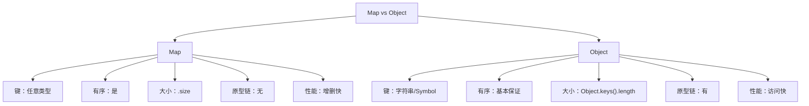
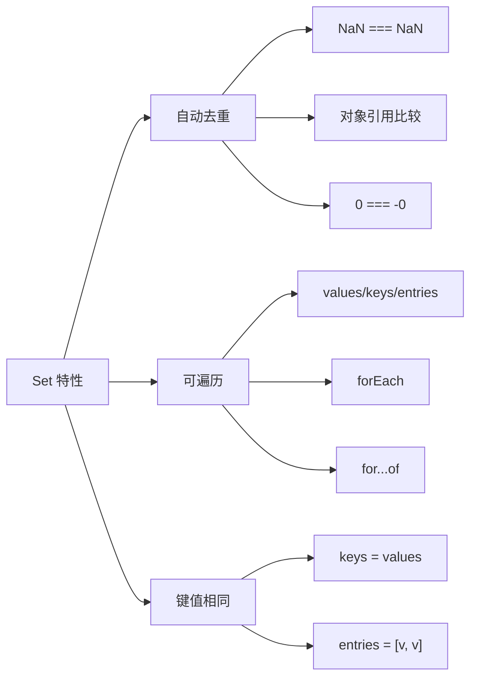
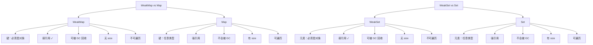
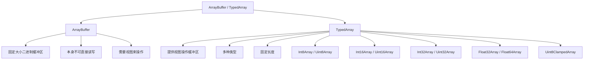

+++
title = "第 21 章 ES6+ 数据结构"
weight = 210
date = "2026-03-24T22:08:00+08:00"
type = "docs"
description = ""
isCJKLanguage = true
draft = false
+++
# 第 21 章 ES6+ 数据结构

> JavaScript 终于有了正经的"容器"——Map 和 Set 来了！

## 21.1 Map

### 创建与基本操作：set / get / has / delete / clear / size

话说在 ES6 之前，JavaScript 的"字典"（键值对数据结构）只有一种选择——**Object**。但 Object 作为字典有诸多问题：键会被转成字符串、原型链上的属性可能捣乱、遍历不友好...

**Map** 就是为了解决这些问题而生的！它是一种专门的键值对集合，键可以是任意类型（包括对象、函数、Symbol）。

```javascript
// 创建 Map 的几种方式

// 1. 使用 new Map() 构造函数
const map1 = new Map();

// 2. 使用可迭代对象初始化（数组的数组）
const map2 = new Map([
  ['name', '张三'],
  ['age', 25],
  ['city', '北京']
]);

// 3. 复制另一个 Map
const map3 = new Map(map2);

console.log('map2 大小:', map2.size);  // map2 大小: 3
console.log('map3 大小:', map3.size);  // map3 大小: 3
```

```javascript
// set：设置键值对
const userMap = new Map();

// 设置各种类型的键
userMap.set('stringKey', '字符串值');
userMap.set(123, '数字键');
userMap.set(true, '布尔键');
userMap.set({ id: 1 }, '对象键');
userMap.set(function(){}, '函数键');

console.log('userMap 大小:', userMap.size);  // userMap 大小: 5

// set 方法返回 Map 本身，支持链式调用
userMap
  .set('a', 1)
  .set('b', 2)
  .set('c', 3);

console.log('链式调用后:', userMap.size);  // 链式调用后: 8
```

```javascript
// get：获取值
const scores = new Map([
  ['数学', 95],
  ['语文', 88],
  ['英语', 92]
]);

console.log('数学成绩:', scores.get('数学'));           // 数学成绩: 95
console.log('不存在的键:', scores.get('化学'));          // 不存在的键: undefined
console.log('大小写敏感:', scores.get('数学'));          // 大小写敏感: 95
console.log('中文全角:', scores.get('数学'));           // 中文全角: 95
```

```javascript
// has：检查键是否存在
const config = new Map([
  ['debug', true],
  ['version', '1.0.0'],
  ['timeout', 5000]
]);

console.log('有debug?', config.has('debug'));     // 有debug? true
console.log('有port?', config.has('port'));       // 有port? false
console.log('有undefined键?', config.has(undefined)); // 有undefined键? false
```

```javascript
// delete：删除键值对
const fruits = new Map([
  ['apple', '苹果'],
  ['banana', '香蕉'],
  ['orange', '橙子']
]);

console.log('删除前大小:', fruits.size);  // 删除前大小: 3
console.log('删除banana:', fruits.delete('banana'));  // 删除banana: true
console.log('删除不存在的:', fruits.delete('grape')); // 删除不存在的: false
console.log('删除后大小:', fruits.size);  // 删除后大小: 2
```

```javascript
// clear：清空所有键值对
const tempMap = new Map([
  ['x', 1],
  ['y', 2],
  ['z', 3]
]);

console.log('清空前:', tempMap.size);  // 清空前: 3
tempMap.clear();
console.log('清空后:', tempMap.size);  // 清空后: 0
```

```javascript
// size：获取键值对数量（属性，不是方法！）
const m = new Map([
  [1, 'one'],
  [2, 'two'],
  [3, 'three']
]);

console.log('Map 大小:', m.size);  // Map 大小: 3
// 注意：不是 m.size()，是属性！
```

---

### 遍历：keys / values / entries / forEach / for...of

Map 提供了四种遍历方法，让你可以按需获取键、值或键值对。

```javascript
const student = new Map([
  ['name', '小明'],
  ['age', 18],
  ['grade', '高三']
]);

// keys()：获取所有键的迭代器
console.log('=== keys() ===');
for (const key of student.keys()) {
  console.log('键:', key);
}
/*
键: name
键: age
键: grade
*/

// values()：获取所有值的迭代器
console.log('\n=== values() ===');
for (const value of student.values()) {
  console.log('值:', value);
}
/*
值: 小明
值: 18
值: 高三
*/

// entries()：获取所有键值对的迭代器
console.log('\n=== entries() ===');
for (const entry of student.entries()) {
  console.log('键值对:', entry[0], '->', entry[1]);
}
/*
键值对: name -> 小明
键值对: age -> 18
键值对: grade -> 高三
*/

// forEach：遍历（回调函数）
console.log('\n=== forEach ===');
student.forEach((value, key, map) => {
  console.log(`${key}: ${value}`);
});
/*
name: 小明
age: 18
grade: 高三
*/
```

```javascript
// for...of 直接遍历 Map（默认遍历 entries）
const colorMap = new Map([
  ['red', '#ff0000'],
  ['green', '#00ff00'],
  ['blue', '#0000ff']
]);

console.log('默认遍历（entries）:');
for (const item of colorMap) {
  console.log('  ', item);  // ['red', '#ff0000'], ...
}

// 解构遍历
console.log('\n解构遍历:');
for (const [key, value] of colorMap) {
  console.log(`  ${key} 的颜色码是 ${value}`);
}
```

```javascript
// Map 与 Array 的互相转换
const m = new Map([['a', 1], ['b', 2], ['c', 3]]);

// Map -> Array
const arr1 = [...m];           // 展开为数组的数组
console.log('Map转数组:', arr1);  // [ [ 'a', 1 ], [ 'b', 2 ], [ 'c', 3 ] ]

const keysArr = [...m.keys()];
const valuesArr = [...m.values()];
console.log('键数组:', keysArr);    // [ 'a', 'b', 'c' ]
console.log('值数组:', valuesArr);  // [ 1, 2, 3 ]

// Array -> Map
const nestedArr = [['x', 10], ['y', 20]];
const m2 = new Map(nestedArr);
console.log('数组转Map:', m2.size);  // 2
```

```javascript
// Map 的实际应用：缓存函数结果
function expensiveOperation(input) {
  console.log('执行耗时操作...', input);
  return input * input;
}

const cache = new Map();

function cachedOperation(input) {
  if (cache.has(input)) {
    console.log('从缓存读取:', input);
    return cache.get(input);
  }
  const result = expensiveOperation(input);
  cache.set(input, result);
  return result;
}

console.log(cachedOperation(5));  // 执行耗时操作... 5 -> 25
console.log(cachedOperation(5));  // 从缓存读取: 5 -> 25
console.log(cachedOperation(10)); // 执行耗时操作... 10 -> 100
console.log('缓存大小:', cache.size);  // 缓存大小: 2
```

---

### Map vs Object：键类型 / 有序 / 大小 / 原型链

这是面试常考题！Map 和 Object 到底有什么区别？

```javascript
// 键类型对比
const map = new Map();
const obj = {};

// Map 的键可以是任意类型
map.set(123, '数字键');
map.set({id: 1}, '对象键');
map.set(true, '布尔键');
map.set(null, 'null键');
map.set(undefined, 'undefined键');
// map.set(NaN, 'NaN键'); // NaN 也可以作为键

// Object 的键只能是字符串或 Symbol
obj['string'] = '字符串键';
obj[123] = '数字键';  // 123 会被转成 '123'
obj[{id: 1}] = '对象键';  // 对象被转成 '[object Object]'
obj[true] = '布尔键';  // true 被转成 'true'

console.log('Object 键:', Object.keys(obj));  // [ 'string', '123', 'true', '[object Object]' ]
console.log('Map 键数:', map.size);  // Map 键数: 5
```

```javascript
// 有序性对比
// ES2015+ 规定 Object.keys() 按照插入顺序返回（大多数浏览器）
// 但 Map 是严格按照插入顺序排列的

const orderedMap = new Map();
orderedMap.set('z', 1);
orderedMap.set('a', 2);
orderedMap.set('m', 3);

console.log('Map 遍历顺序:');
for (const [k, v] of orderedMap) {
  console.log(`  ${k}: ${v}`);
}
// z: 1, a: 2, m: 3（严格按插入顺序）
```

```javascript
// 大小获取对比
const dataMap = new Map([['x', 1], ['y', 2]]);
const dataObj = { x: 1, y: 2 };

// Map 直接用 .size
console.log('Map 大小:', dataMap.size);  // Map 大小: 2

// Object 需要 Object.keys().length
console.log('Object 大小:', Object.keys(dataObj).length);  // Object 大小: 2
```

```javascript
// 原型链对比
const mapWithProto = new Map();
const objWithProto = {};

console.log('Map 有原型属性吗?', mapWithProto.has('toString'));  // Map 有原型属性吗? false
console.log('Object 有 toString?', objWithProto.hasOwnProperty('toString'));  // Object 有 toString? true

// Object 有原型链，可能导致键名冲突
objWithProto['constructor'] = '冲突了！';
console.log('Object.constructor:', objWithProto['constructor']);  // 冲突了！

// Map 不会有这个问题
mapWithProto.set('constructor', '不会冲突');
console.log('Map.constructor:', mapWithProto.get('constructor'));  // 不会冲突
```

```javascript
// 性能对比
// Map 在频繁增删键值对的场景下性能更好
// Object 在频繁访问属性的场景下有内部优化（V8 引擎的快速属性访问）

// 什么时候用 Map？
// 1. 键需要是 非字符串 类型
// 2. 需要按插入顺序遍历
// 3. 需要频繁增删键值对
// 4. 键值对数量是动态变化的

// 什么时候用 Object？
// 1. 键只能是 字符串 或 Symbol
// 2. 需要使用 JSON.stringify() / JSON.parse()
// 3. 需要使用 . 语法访问属性
// 4. 作为"结构体"使用（有固定键集合）
```



> 💡 **本章小结（第21章第1节）**
> 
> Map 是 ES6 引入的专门键值对集合，相比 Object，它有四大优势：**键可以是任意类型**、**严格按插入顺序排列**、**用 .size 获取大小**、**没有原型链干扰**。常用操作包括 set、get、has、delete、clear，配合 keys/values/entries/forEach/for...of 可以灵活遍历。什么时候用 Map？当你需要非字符串键、需要有序遍历、或者键值对频繁变动时。

---

## 21.2 Set

### 创建与基本操作：add / delete / has / clear / size

如果说 Map 是"字典"，那 **Set** 就是"集合"。Set 就像是一个只装 ключи（键）不装值的 Map，或者说是只有值没有键的 Map。

**Set 的核心特点：只存储唯一值，不允许重复。**

```javascript
// 创建 Set 的几种方式

// 1. 使用 new Set() 构造函数
const set1 = new Set();

// 2. 使用可迭代对象初始化
const set2 = new Set([1, 2, 3, 4, 5]);

// 3. 从数组创建（自动去重）
const set3 = new Set([1, 2, 2, 3, 3, 3, 4, 4, 4, 4]);

console.log('set1 大小:', set1.size);  // set1 大小: 0
console.log('set2 大小:', set2.size);  // set2 大小: 5
console.log('set3 大小（去重后）:', set3.size);  // set3 大小（去重后）: 4
console.log('set3 内容:', [...set3]);  // set3 内容: [ 1, 2, 3, 4 ]
```

```javascript
// add：添加元素
const fruits = new Set();

fruits.add('苹果');
fruits.add('香蕉');
fruits.add('橙子');
fruits.add('苹果');  // 重复添加，无效果！

console.log('Set 大小:', fruits.size);  // Set 大小: 3
console.log('有苹果吗?', fruits.has('苹果'));  // 有苹果吗? true
console.log('有葡萄吗?', fruits.has('葡萄'));  // 有葡萄吗? false

// add 返回 Set 本身，支持链式调用
fruits.add('葡萄').add('西瓜').add('草莓');

console.log('链式添加后大小:', fruits.size);  // 链式添加后大小: 6
```

```javascript
// delete：删除元素
const numbers = new Set([1, 2, 3, 4, 5]);

console.log('删除前大小:', numbers.size);  // 删除前大小: 5
console.log('删除2:', numbers.delete(2));   // 删除2: true
console.log('删除不存在的6:', numbers.delete(6)); // 删除不存在的6: false
console.log('删除后大小:', numbers.size);  // 删除后大小: 4
console.log('删除后内容:', [...numbers]);  // 删除后内容: [ 1, 3, 4, 5 ]
```

```javascript
// has：检查元素是否存在
const colors = new Set(['红', '绿', '蓝']);

console.log('有红色?', colors.has('红'));    // 有红色? true
console.log('有黄色?', colors.has('黄'));    // 有黄色? false
```

```javascript
// clear：清空所有元素
const tempSet = new Set([1, 2, 3, 4, 5]);

console.log('清空前大小:', tempSet.size);  // 清空前大小: 5
tempSet.clear();
console.log('清空后大小:', tempSet.size);  // 清空后大小: 0
console.log('清空后为空?', tempSet.size === 0);  // 清空后为空? true
```

```javascript
// size：获取元素数量（属性，不是方法！）
const s = new Set([10, 20, 30, 40]);
console.log('Set 大小:', s.size);  // Set 大小: 4
```

```javascript
// Set 对"相等"的判断：与 === 类似，但 NaN 等于 NaN
const specialSet = new Set();

specialSet.add(NaN);
specialSet.add(NaN);  // NaN 只添加一次！

specialSet.add(0);
specialSet.add(-0);  // 0 和 -0 被视为相等，只添加一次！

specialSet.add('hello');
specialSet.add('Hello');  // 大小写敏感

console.log('特殊 Set 大小:', specialSet.size);  // 特殊 Set 大小: 3
console.log('内容:', [...specialSet]);  // 内容: [ NaN, 0, 'hello' ]
```

```javascript
// 对象作为元素时，不相等（因为是引用比较）
const objSet = new Set();

const obj1 = { id: 1 };
const obj2 = { id: 1 };

objSet.add(obj1);
objSet.add(obj2);  // obj1 !== obj2，所以都会添加！

console.log('对象 Set 大小:', objSet.size);  // 对象 Set 大小: 2
```

---

### 遍历：keys / values / entries / forEach / for...of

Set 的遍历方法与 Map 类似，但由于 Set 只有值没有键，`keys()` 和 `values()` 返回的是相同的内容。

```javascript
const fruits = new Set(['苹果', '香蕉', '橙子']);

// values()：获取所有值的迭代器（Set 的主要迭代器）
console.log('=== values() ===');
for (const value of fruits.values()) {
  console.log('值:', value);
}
/*
值: 苹果
值: 香蕉
值: 橙子
*/

// keys()：与 values() 完全相同（为了与 Map 兼容）
console.log('\n=== keys() ===');
for (const key of fruits.keys()) {
  console.log('键:', key);
}
/*
键: 苹果
键: 香蕉
键: 橙子
*/

// entries()：返回 [值, 值] 的迭代器（为了与 Map 兼容）
console.log('\n=== entries() ===');
for (const entry of fruits.entries()) {
  console.log('条目:', entry);
}
/*
条目: [ '苹果', '苹果' ]
条目: [ '香蕉', '香蕉' ]
条目: [ '橙子', '橙子' ]
*/

// forEach：遍历
console.log('\n=== forEach ===');
fruits.forEach((value, sameValue, set) => {
  console.log(`${value} (${sameValue} in ${set.size})`);
});
/*
苹果 (苹果 in 3)
香蕉 (香蕉 in 3)
橙子 (橙子 in 3)
*/
```

```javascript
// for...of 直接遍历 Set
console.log('=== for...of 直接遍历 ===');
for (const item of fruits) {
  console.log('元素:', item);
}
```

```javascript
// Set 与 Array 的互相转换
const nums = [1, 2, 3, 3, 4, 4, 4, 5];

// Array -> Set（自动去重）
const numSet = new Set(nums);
console.log('数组转Set:', numSet.size);  // 数组转Set: 5

// Set -> Array
const uniqueArr = [...numSet];
console.log('Set转数组:', uniqueArr);  // Set转数组: [ 1, 2, 3, 4, 5 ]

// 也可以用 Array.from
const uniqueArr2 = Array.from(numSet);
console.log('Array.from:', uniqueArr2);  // Array.from: [ 1, 2, 3, 4, 5 ]
```

---

### 自动去重特性

Set 最强大的特性就是自动去重！它使用 SameValueZero 算法来判断相等，相当于 `Object.is()` 但 `NaN` 也等于 `NaN`。

```javascript
// 基本类型去重
const mixedArray = [1, 2, 2, 3, 3, 3, 'a', 'a', true, true, false, false];
const unique = [...new Set(mixedArray)];
console.log('去重前:', mixedArray.length);  // 去重前: 12
console.log('去重后:', unique);  // 去重后: [ 1, 2, 3, 'a', true, false ]
```

```javascript
// 字符串去重（常见应用）
const str = 'Hello, World!';
const uniqueChars = [...new Set(str)].join('');
console.log('原字符串:', str);  // 原字符串: Hello, World!
console.log('去重后:', uniqueChars);  // 去重后: Helo, World!
```

```javascript
// 对象数组去重（需要自定义逻辑）
const users = [
  { id: 1, name: '张三' },
  { id: 2, name: '李四' },
  { id: 1, name: '张三' },  // 重复
  { id: 3, name: '王五' }
];

// 使用 Map 来根据 id 去重
const uniqueUsers = [...new Map(users.map(u => [u.id, u])).values()];
console.log('去重后用户:', uniqueUsers.length);  // 去重后用户: 3
console.log('去重后:', uniqueUsers.map(u => u.name));  // 去重后: [ '张三', '李四', '王五' ]
```

```javascript
// 字符串去重并保持顺序
const removeDuplicates = (str) => [...new Set(str)].join('');

console.log(removeDuplicates('ababbc'));  // abc
console.log(removeDuplicates('多多关照'));  // 多关照
```

---

### 数组去重应用

Set 最常见的应用就是数组去重，比传统的 `filter` + `indexOf` 或 `includes` 更简洁高效。

```javascript
// 方法1：Set 去重（最简洁）
const arr1 = [1, 2, 3, 3, 4, 4, 5];
const unique1 = [...new Set(arr1)];
console.log('Set去重:', unique1);  // Set去重: [ 1, 2, 3, 4, 5 ]
```

```javascript
// 方法2：filter + indexOf（传统方法，不推荐）
const arr2 = [1, 2, 3, 3, 4, 4, 5];
const unique2 = arr2.filter((item, index) => arr2.indexOf(item) === index);
console.log('filter去重:', unique2);  // filter去重: [ 1, 2, 3, 4, 5 ]
// 问题：indexOf 每次都要遍历数组，时间复杂度 O(n²)
```

```javascript
// 方法3：reduce + includes（中等）
const arr3 = [1, 2, 3, 3, 4, 4, 5];
const unique3 = arr3.reduce((acc, curr) => 
  acc.includes(curr) ? acc : [...acc, curr], []);
console.log('reduce去重:', unique3);  // reduce去重: [ 1, 2, 3, 4, 5 ]
```

```javascript
// 性能对比
console.log('=== 性能对比 ===');
const largeArr = Array.from({ length: 10000 }, (_, i) => i % 100);

console.time('Set去重');
[...new Set(largeArr)].length;
console.timeEnd('Set去重');  // Set去重: ~1ms

console.time('filter去重');
largeArr.filter((item, index) => largeArr.indexOf(item) === index).length;
console.timeEnd('filter去重');  // filter去重: ~50ms
// Set 去重快 50 倍左右！
```

```javascript
// 进阶：多条件去重
const products = [
  { category: 'fruit', name: '苹果' },
  { category: 'fruit', name: '香蕉' },
  { category: 'vegetable', name: '白菜' },
  { category: 'fruit', name: '苹果' },  // 重复
  { category: 'vegetable', name: '萝卜' }
];

// 根据 category + name 去重
const uniqueProducts = [
  ...new Map(products.map(p => [`${p.category}-${p.name}`, p])).values()
];

console.log('去重后商品数:', uniqueProducts.length);  // 去重后商品数: 4
uniqueProducts.forEach(p => console.log(`  ${p.category}: ${p.name}`));
/*
  fruit: 苹果
  fruit: 香蕉
  vegetable: 白菜
  vegetable: 萝卜
*/
```



> 💡 **本章小结（第21章第2节）**
> 
> Set 是 ES6 引入的"集合"数据结构，它的核心特性就是**自动去重**。Set 使用 SameValueZero 算法判断相等，NaN 等于 NaN，0 等于 -0。常用操作包括 add、delete、has、clear、size。遍历方式与 Map 类似，keys/values/entries 都可用（但 keys 和 values 返回相同内容）。Set 最常见的应用就是数组去重，比 filter + indexOf 快 50 倍以上！

---

## 21.3 WeakMap 与 WeakSet

### WeakMap：弱引用，键必须为对象，防止内存泄漏

**WeakMap** 是 Map 的"虚弱版"——它的键必须是对象，而且当键对象不再被其他地方引用时，会被垃圾回收，从而避免内存泄漏。

这听起来有点抽象，让我们先理解什么是"垃圾回收"：

JavaScript 引擎会自动回收不再使用的内存。想象你创建了一个对象，然后你不再需要它了——如果没有引用指向它，垃圾回收器就会把它"吃掉"，释放内存。

但问题是：如果这个对象被放在一个 Map 里，Map 会"死死抓住"它，导致它永远不会被回收！

```javascript
// 内存泄漏的经典案例
let obj = { name: '重要数据', hugeData: new Array(1000000) };
const map = new Map();
map.set(obj, '这是关联的值');

console.log('obj 还在:', map.has(obj));  // obj 还在: true

obj = null;  // 解除 obj 的引用
// 但是！map 里还有引用！obj 不会被回收！
console.log('obj 还在吗?', map.has(obj));  // obj 还在吗? false（因为是新的 null）
console.log('map.size:', map.size);  // map.size: 1 —— obj 还在 map 里！

// 我们再也访问不到那个 hugeData 了，但它还占着内存！
```

```javascript
// WeakMap 的解决方案：弱引用
let weakObj = { name: '重要数据', hugeData: new Array(1000000) };
const weakMap = new WeakMap();
weakMap.set(weakObj, '这是关联的值');

console.log('weakObj 还在:', weakMap.has(weakObj));  // weakObj 还在: true

weakObj = null;  // 解除 weakObj 的引用
// 此时，没有任何其他引用指向那个对象了
// WeakMap 的弱引用会被"松开"，对象会被垃圾回收
// 这次，内存真的被释放了！
```

```javascript
// WeakMap 的特点
const wm = new WeakMap();

// 1. 键必须是对象（不能是原始值）
// wm.set('string', 'value');  // TypeError! 键必须是对象
wm.set({ id: 1 }, '对象键');  // 正确

// 2. 没有 size 属性（因为是弱引用，数量不固定）
// console.log(wm.size);  // undefined

// 3. 不能遍历（因为弱引用可能导致元素随时消失）
// for (const [k, v] of wm) {}  // TypeError! WeakMap 不可迭代

// 4. 常用方法：set / get / has / delete
const key1 = { a: 1 };
const key2 = { b: 2 };

wm.set(key1, 'value1');
wm.set(key2, 'value2');

console.log('has key1?', wm.has(key1));  // has key1? true
console.log('get key2?', wm.get(key2));  // get key2? value2
wm.delete(key1);
console.log('has key1 after delete?', wm.has(key1));  // has key1 after delete? false
```

---

### WeakMap 应用：存储私有数据 / DOM 节点映射

WeakMap 的最大价值在于它的"弱引用"特性，这使得它成为存储私有数据和临时映射的理想选择。

```javascript
// 应用1：存储对象的私有数据（模拟 #private 字段）
const privateData = new WeakMap();

class User {
  constructor(name, age) {
    // 私有数据存在 WeakMap 里
    privateData.set(this, {
      name,
      age,
      createdAt: Date.now()
    });
  }

  getName() {
    return privateData.get(this).name;
  }

  getAge() {
    return privateData.get(this).age;
  }

  getInfo() {
    const data = privateData.get(this);
    return `${data.name}, ${data.age}岁，注册于${new Date(data.createdAt).toLocaleDateString()}`;
  }

  // 销毁用户（清理私有数据）
  destroy() {
    privateData.delete(this);
  }
}

const user = new User('小明', 18);
console.log('用户信息:', user.getInfo());  // 用户信息: 小明, 18岁，注册于2026/3/24

// 外部无法直接访问私有数据
console.log('私有数据存在吗?', privateData.has(user));  // 私有数据存在吗? true
// console.log(privateData.get(user));  // 可以访问，但至少不是公开的 API

user.destroy();
console.log('销毁后还存在吗?', privateData.has(user));  // 销毁后还存在吗? false
```

```javascript
// 应用2：DOM 节点映射（不阻止 DOM 被回收）
// 传统写法（可能导致内存泄漏）
const elementData = new Map();
const buttons = document.querySelectorAll('button');

buttons.forEach(btn => {
  elementData.set(btn, { clickCount: 0 });
});

btn.addEventListener('click', () => {
  elementData.get(btn).clickCount++;
});

// 问题：如果按钮被从 DOM 中移除，但还在 Map 里，就会内存泄漏

// WeakMap 写法（更安全）
const elementWeakData = new WeakMap();

function trackClicks(btn) {
  elementWeakData.set(btn, { clickCount: 0 });
  btn.addEventListener('click', () => {
    elementWeakData.get(btn).clickCount++;
    console.log('点击次数:', elementWeakData.get(btn).clickCount);
  });
}

// 当按钮被移除 DOM 并失去其他引用时，WeakMap 条目会被自动清理
```

```javascript
// 应用3：缓存计算结果
const computeCache = new WeakMap();

function heavyComputation(obj) {
  if (computeCache.has(obj)) {
    console.log('从缓存读取');
    return computeCache.get(obj);
  }

  console.log('执行耗时计算...');
  const result = obj.id * obj.id;  // 模拟耗时计算

  computeCache.set(obj, result);
  return result;
}

const data1 = { id: 5 };
const data2 = { id: 10 };

console.log(heavyComputation(data1));  // 执行耗时计算... 25
console.log(heavyComputation(data1));  // 从缓存读取 25
console.log(heavyComputation(data2));  // 执行耗时计算... 100
```

```javascript
// 应用4：实现观察者模式（不阻止对象被回收）
const observers = new WeakMap();

function addObserver(obj, callback) {
  if (!observers.has(obj)) {
    observers.set(obj, []);
  }
  observers.get(obj).push(callback);
}

function notifyObservers(obj, event) {
  if (observers.has(obj)) {
    observers.get(obj).forEach(cb => cb(event));
  }
}

const button = { name: '按钮' };
addObserver(button, (e) => console.log('观察者1收到:', e));
addObserver(button, (e) => console.log('观察者2收到:', e));

notifyObservers(button, 'click');  // 两条消息

// 当 button 不再被引用时，整个观察者列表会被清理
```

---

### WeakSet：弱引用，只能存储对象

**WeakSet** 与 Set 的关系，就像 WeakMap 与 Map 的关系一样——WeakSet 是 Set 的弱引用版本。

```javascript
// WeakSet 的特点
const ws = new WeakSet();

// 1. 只能添加对象（不能是原始值）
// ws.add(1);  // TypeError!
// ws.add('hello');  // TypeError!

const obj1 = { id: 1 };
const obj2 = { id: 2 };

ws.add(obj1);
ws.add(obj2);

// 2. 没有 size 属性
// console.log(ws.size);  // undefined

// 3. 不能遍历
// for (const item of ws) {}  // TypeError!

// 4. 常用方法：add / has / delete
console.log('有 obj1?', ws.has(obj1));  // 有 obj1? true
console.log('有 obj3?', ws.has({ id: 3 }));  // 有 obj3? false（新对象）

ws.delete(obj1);
console.log('删除后有 obj1?', ws.has(obj1));  // 删除后有 obj1? false
```

```javascript
// WeakSet 的应用：标记临时对象
const processedData = new WeakSet();

function processItem(item) {
  if (processedData.has(item)) {
    console.log('已经处理过了，跳过');
    return;
  }

  console.log('处理中...');
  // 模拟处理逻辑
  item.processed = true;

  // 标记为已处理
  processedData.add(item);
}

// 用例：追踪已处理的对象，防止重复处理
const data1 = { content: '数据1' };
const data2 = { content: '数据2' };

processItem(data1);  // 处理中...
processItem(data1);  // 已经处理过了，跳过
processItem(data2);  // 处理中...
```

```javascript
// 应用：追踪活跃对象
const activeUsers = new WeakSet();

function login(user) {
  activeUsers.add(user);
  console.log(`${user.name} 已登录`);
}

function logout(user) {
  activeUsers.delete(user);
  console.log(`${user.name} 已登出`);
}

function showActiveUsers() {
  console.log('当前活跃用户数（无法直接获取，需要外部计数）:');
}

const user1 = { name: '张三' };
const user2 = { name: '李四' };

login(user1);  // 张三 已登录
login(user2);  // 李四 已登录
console.log('张三在线?', activeUsers.has(user1));  // 张三在线? true

logout(user1);
console.log('张三在线?', activeUsers.has(user1));  // 张三在线? false
```

```javascript
// 应用：验证对象是否来自特定构造函数
const validInstances = new WeakSet();

class Widget {
  constructor() {
    validInstances.add(this);
  }

  static validate(instance) {
    return validInstances.has(instance);
  }

  destroy() {
    validInstances.delete(this);
  }
}

const widget1 = new Widget();
const widget2 = new Widget();

console.log('widget1 有效?', Widget.validate(widget1));  // widget1 有效? true
console.log('widget2 有效?', Widget.validate(widget2));  // widget2 有效? true

widget1.destroy();
console.log('widget1 销毁后有效?', Widget.validate(widget1));  // widget1 销毁后有效? false
```



---

### WeakSet 应用：存储临时对象标记

```javascript
// 场景：追踪已被访问过的节点（用于图遍历）
function canReachTarget(graph, start, target) {
  const visited = new WeakSet();

  function dfs(node) {
    if (node === target) return true;
    if (visited.has(node)) return false;

    visited.add(node);

    for (const neighbor of graph[node] || []) {
      if (dfs(neighbor)) return true;
    }

    return false;
  }

  return dfs(start);
}

const graph = {
  A: ['B', 'C'],
  B: ['D'],
  C: ['D'],
  D: ['E'],
  E: []
};

console.log('A -> E 可达?', canReachTarget(graph, 'A', 'E'));  // A -> E 可达? true
console.log('A -> Z 可达?', canReachTarget(graph, 'A', 'Z'));  // A -> Z 可达? false
```

```javascript
// 场景：实现对象的"已使用"标记
const usedObjects = new WeakSet();

function processStream(items) {
  const results = [];

  for (const item of items) {
    if (usedObjects.has(item)) {
      console.log('对象已使用过，跳过');
      continue;
    }

    // 处理对象
    results.push({ ...item, processed: true });
    usedObjects.add(item);
  }

  return results;
}

const item1 = { id: 1, value: 'a' };
const item2 = { id: 2, value: 'b' };

const batch1 = processStream([item1, item2]);
// 对象已使用过，跳过（第一次调用后都标记了）
// 实际上第二次调用同一个 item 会跳过，但这里只是示例

console.log('第一批结果:', batch1);
```

> 💡 **本章小结（第21章第3节）**
> 
> WeakMap 和 WeakSet 是"弱引用"版本的数据结构。**WeakMap** 的键必须是对象，当键对象失去其他引用时会被垃圾回收，适合存储私有数据、DOM 节点映射、缓存等场景。**WeakSet** 的元素必须是对象，适合标记临时对象、追踪已访问节点等。它们都没有 size 属性、都不能遍历，这是为了避免在遍历过程中对象被回收导致的意外行为。选择 WeakMap/WeakSet 的理由只有一个：**你需要让对象能被垃圾回收**！

---

## 21.4 其他数据结构

### BigInt：大整数

JavaScript 的 `Number` 类型使用 IEEE 754 双精度浮点数，这意味着它只能安全地表示 `-2^53 + 1` 到 `2^53 - 1` 之间的整数。超过这个范围，就会出现精度丢失的问题。

```javascript
// Number 的精度问题
const largeNumber = 9007199254740992;  // 2^53
const largerNumber = largeNumber + 1;

console.log('2^53:', largeNumber);  // 2^53: 9007199254740992
console.log('2^53 + 1:', largerNumber);  // 2^53 + 1: 9007199254740992
console.log('精度丢失了!', largeNumber === largerNumber);  // 精度丢失了! true

// 再大一点
const hugeNumber = 90071992547409920;
console.log('2^53 * 10:', hugeNumber);  // 2^53 * 10: 90071992547409920
console.log('再加1:', hugeNumber + 1);  // 加1: 90071992547409920 —— 又丢了！
```

**BigInt** 就是为了解决这个问题而生的！它让你可以安全地表示任意大小的整数。

```javascript
// 创建 BigInt
// 方式1：在数字后面加 n
const bigInt1 = 9007199254740993n;
const bigInt2 = 1000000000000000000000000n;  // 10^24

// 方式2：使用 BigInt() 构造函数
const bigInt3 = BigInt('9007199254740993');
const bigInt4 = BigInt(9007199254740993);

console.log('bigInt1:', bigInt1);  // bigInt1: 9007199254740993n
console.log('bigInt2:', bigInt2);  // bigInt2: 1000000000000000000000000n
console.log('bigInt3:', bigInt3);  // bigInt3: 9007199254740993n
console.log('bigInt4:', bigInt4);  // bigInt4: 9007199254740993n
```

```javascript
// BigInt 与 Number 的转换
const num = 123;
const big = 123n;

// Number -> BigInt
const bigFromNum = BigInt(num);
console.log('从Number转:', bigFromNum);  // 从Number转: 123n

// BigInt -> Number（可能丢失精度）
const numFromBig = Number(big);
console.log('从BigInt转:', numFromBig);  // 从BigInt转: 123

// 字符串转换
const str = '123456789012345678901234567890';
const bigFromStr = BigInt(str);
console.log('从字符串转:', bigFromStr);  // 从字符串转: 123456789012345678901234567890n

const backToStr = bigFromStr.toString();
console.log('转回字符串:', backToStr);  // 转回字符串: 123456789012345678901234567890
```

```javascript
// BigInt 支持所有数学运算符（除了无符号右移 >>>）
const a = 100n;
const b = 30n;

// 加减乘除
console.log('a + b:', a + b);  // a + b: 130n
console.log('a - b:', a - b);  // a - b: 70n
console.log('a * b:', a * b);  // a * b: 3000n
console.log('a / b:', a / b);  // a / b: 3n —— 整除，向下取整
console.log('a % b:', a % b);  // a % b: 10n

// 幂运算
const power = 2n ** 10n;  // 2^10
console.log('2^10:', power);  // 2^10: 1024n

// 一元负号
const negative = -5n;
console.log('负数:', negative);  // 负数: -5n
```

```javascript
// BigInt 的比较
const big1 = 100n;
const big2 = 99n;
const num = 100;

console.log('100n > 99n:', big1 > big2);  // 100n > 99n: true
console.log('100n === 100:', big1 === num);  // 100n === 100: false —— 类型不同！
console.log('100n == 100:', big1 == num);   // 100n == 100: true —— 宽松相等

// BigInt 与 Number 混合比较
console.log('100n > 99:', big1 > 99);  // 100n > 99: true
```

```javascript
// BigInt 不支持与 Number 混合运算
const b = 100n;
const n = 50;

// console.log(b + n);  // TypeError! 不能混合运算
console.log(b + BigInt(n));  // 150n
console.log(Number(b) + n);   // 150
```

```javascript
// BigInt 在 JSON 中的处理
const obj = {
  name: '大数字',
  value: 9007199254740993n
};

// JSON.stringify 不会自动处理 BigInt
try {
  const json = JSON.stringify(obj);
  console.log('JSON输出:', json);
} catch (e) {
  console.log('BigInt 不能直接 JSON 序列化!');
}

// 自定义序列化
const serialized = {
  ...obj,
  value: obj.value.toString()
};
console.log('序列化后:', JSON.stringify(serialized));
```

```javascript
// BigInt 的实用场景
// 1. 大整数计算（金融、科学计算）
function calculateFactorial(n) {
  let result = 1n;
  for (let i = 2n; i <= BigInt(n); i++) {
    result *= i;
  }
  return result;
}

console.log('20! =', calculateFactorial(20));  // 20! = 2432902008176640000n
console.log('50! =', calculateFactorial(50));
// 50! = 30414093201713378043612608166064768844377641568960512000000000000n

// 2. 精确时间戳（纳秒级）
const timestamp = BigInt(Date.now()) * 1000000n;  // 毫秒转纳秒
console.log('纳秒时间戳:', timestamp);  // 纳秒时间戳: 1710681600000000000n

// 3. 加密学（需要大素数）
const p = 2n ** 127n - 1n;  // Mersenne 素数
console.log('大素数:', p);
```

---

### ArrayBuffer / TypedArray：二进制数组

在 JavaScript 中处理二进制数据曾经是一件很痛苦的事情。**ArrayBuffer** 和 **TypedArray** 的出现，让二进制数据处理变得简单高效。

```javascript
// ArrayBuffer：固定长度的二进制数据缓冲区
// 它本身不能直接读写，需要通过 TypedArray 或 DataView 来操作

// 创建 ArrayBuffer（参数是字节数）
const buffer = new ArrayBuffer(16);  // 16 字节的缓冲区

console.log('缓冲区大小:', buffer.byteLength);  // 缓冲区大小: 16
console.log('缓冲区类型:', buffer.constructor.name);  // 缓冲区类型: ArrayBuffer
```

```javascript
// TypedArray：类型化数组，提供多种视图
// 类型包括：Int8Array, Uint8Array, Uint8ClampedArray, Int16Array, Uint16Array,
//          Int32Array, Uint32Array, Float32Array, Float64Array

// 创建 Uint8Array 视图（无符号8位整数，0-255）
const uint8View = new Uint8Array(buffer);

uint8View[0] = 255;
uint8View[1] = 128;
uint8View[2] = 64;

console.log('Uint8Array:', uint8View);  // Uint8Array(16) [ 255, 128, 64, 0, 0, 0, 0, 0, 0, 0, 0, 0, 0, 0, 0, 0 ]
console.log('第一个字节:', uint8View[0]);  // 第一个字节: 255
```

```javascript
// TypedArray 的各种类型
const buf = new ArrayBuffer(8);  // 8 字节

const int8 = new Int8Array(buf);     // 有符号8位整数 -128 ~ 127
const uint8 = new Uint8Array(buf);   // 无符号8位整数 0 ~ 255
const int16 = new Int16Array(buf);   // 有符号16位整数
const uint16 = new Uint16Array(buf); // 无符号16位整数
const int32 = new Int32Array(buf);   // 有符号32位整数
const uint32 = new Uint32Array(buf); // 无符号32位整数
const float32 = new Float32Array(buf); // 32位浮点数
const float64 = new Float64Array(buf); // 64位浮点数

console.log('各类型元素数:');
console.log('  Int8Array:', int8.length);     // 8
console.log('  Int16Array:', int16.length);  // 4
console.log('  Int32Array:', int32.length);  // 2
console.log('  Float64Array:', float64.length); // 1
```

```javascript
// 直接创建 TypedArray（不用 ArrayBuffer）
const intArray = new Int32Array([1, 2, 3, 4, 5]);
console.log('Int32Array:', intArray);  // Int32Array(5) [ 1, 2, 3, 4, 5 ]
console.log('长度:', intArray.length);  // 长度: 5
console.log('字节数:', intArray.byteLength);  // 字节数: 20
```

```javascript
// 字节序（Endianness）
// 大端序：高位在前（网络协议常用）
// 小端序：低位在前（大多数个人电脑）

const buffer = new ArrayBuffer(4);
const view = new Uint16Array(buffer);

// 先写入
view[0] = 1;    // 低地址
view[1] = 256;  // 高地址

console.log('Uint16Array[0]:', view[0]);  // Uint16Array[0]: 1
console.log('Uint16Array[1]:', view[1]);  // Uint16Array[1]: 256

// 转为 Uint8Array 查看字节布局
const bytes = new Uint8Array(buffer);
console.log('字节:', bytes);  // 在小端机器上: [1, 0, 0, 1]
```

```javascript
// Uint8ClampedArray：截断而非环绕
const clamped = new Uint8ClampedArray(5);

clamped[0] = 100;
clamped[1] = 256;   // 超过255，自动截断为255
clamped[2] = -10;  // 小于0，自动截断为0
clamped[3] = 200.7; // 小数部分被截断

console.log('Uint8ClampedArray:', clamped);
// [ 100, 255, 0, 201, 0 ]
```

```javascript
// 实际应用：处理图片像素
// 假设有一个 2x2 的 RGBA 图像（每个像素4字节）
const imageSize = 2 * 2 * 4;  // 宽*高*RGBA
const imageBuffer = new ArrayBuffer(imageSize);
const rgba = new Uint8ClampedArray(imageBuffer);

// 设置像素（红色方块）
// 像素 (0,0) - 左上
rgba[0] = 255;   // R
rgba[1] = 0;     // G
rgba[2] = 0;     // B
rgba[3] = 255;   // A

// 像素 (1,0) - 右上
rgba[4] = 0;
rgba[5] = 255;
rgba[6] = 0;
rgba[7] = 255;

// ... 以此类推

console.log('像素数据:', rgba);  // Uint8ClampedArray(16)
```

```javascript
// DataView：更灵活地读写不同数据类型
const dataView = new DataView(new ArrayBuffer(16));

// 写入不同类型的数据
dataView.setInt8(0, 127);      // 字节
dataView.setUint8(1, 255);     // 无符号字节
dataView.setInt16(2, 32767, true);   // 有符号16位，小端序
dataView.setUint16(4, 65535, false); // 无符号16位，大端序
dataView.setFloat32(6, 3.14159, true); // 32位浮点，小端序
dataView.setFloat64(8, 2.718281828, true); // 64位浮点，小端序

// 读取数据
console.log('Int8:', dataView.getInt8(0));      // Int8: 127
console.log('Uint8:', dataView.getUint8(1));     // Uint8: 255
console.log('Int16:', dataView.getInt16(2, true));    // Int16: 32767
console.log('Uint16:', dataView.getUint16(4, false)); // Uint16: 65535
console.log('Float32:', dataView.getFloat32(6, true));  // Float32: 3.1415899999999999
console.log('Float64:', dataView.getFloat64(8, true));  // Float64: 2.718281828
```

```javascript
// ArrayBuffer 与字符串的转换
function stringToArrayBuffer(str) {
  const encoder = new TextEncoder();
  return encoder.encode(str);
}

function arrayBufferToString(buffer) {
  const decoder = new TextDecoder();
  return decoder.decode(buffer);
}

const original = '你好，JavaScript！';
const encoded = stringToArrayBuffer(original);
console.log('编码后字节:', encoded);  // Uint8Array(25) [ ... ]

const decoded = arrayBufferToString(encoded);
console.log('解码后:', decoded);  // 解码后: 你好，JavaScript！
console.log('完全相同?', original === decoded);  // 完全相同? true
```

```javascript
// TypedArray 与普通数组的区别
const typed = new Int32Array([1, 2, 3]);
const normal = [1, 2, 3];

console.log('TypedArray:', typed);
console.log('普通数组:', normal);
console.log('TypedArray 有 BYTES_PER_ELEMENT:', typed.BYTES_PER_ELEMENT);  // 4
console.log('普通数组没有:', normal.BYTES_PER_ELEMENT);  // undefined

// TypedArray 性能更好，但功能更少
// - TypedArray 长度固定，不能 push/pop
// - TypedArray 元素类型固定
// - TypedArray 支持更多二进制操作
```



> 💡 **本章小结（第21章第4节）**
> 
> **BigInt** 让你可以处理任意大小的整数，解决了 JavaScript 中大整数精度丢失的问题。创建方式是数字后加 `n` 或使用 `BigInt()` 函数。**ArrayBuffer** 是一个固定大小的二进制缓冲区，本身不能直接读写，需要通过 **TypedArray**（如 Uint8Array、Int32Array 等）或 **DataView** 来操作。TypedArray 提供了不同数据类型的视图，适合处理图像、音频、网络协议等二进制数据。BigInt 和 TypedArray 都是处理特殊数据场景的利器，记住它们的适用场景就够了！

---

## 本章小结（第21章）

这一章我们学习了 ES6+ 引入的几种新型数据结构：

### 1. Map
- 专门的键值对集合，键可以是任意类型
- 严格按插入顺序排列，有 `.size` 属性
- 没有原型链干扰，适合频繁增删的场景

### 2. Set
- 集合数据结构，只存储唯一值
- 自动去重，使用 SameValueZero 算法
- 比数组去重性能高 50 倍以上

### 3. WeakMap 与 WeakSet
- 弱引用版本，当对象失去其他引用时会被垃圾回收
- 键（WeakMap）或元素（WeakSet）必须是对象
- 不能遍历，没有 `.size`，适合存储私有数据或临时映射

### 4. 其他数据结构
- **BigInt**：任意大小整数，解决精度丢失问题
- **ArrayBuffer/TypedArray**：二进制数据处理，适合图像、音频、网络协议等场景

### 记忆口诀
```
Map 是字典键随意，Set 是集合去重急
WeakMap 和 WeakSet，弱引用来防泄漏
BigInt 整数的救星，TypedArray 二进制
何时用啥心里明，性能优化更给力
```

### 实战建议
1. 需要键值对且键非字符串时，用 **Map**
2. 需要快速去重时，用 **Set**（`[...new Set(arr)]`）
3. 需要存储私有数据或 DOM 映射时，用 **WeakMap**
4. 需要标记临时对象时，用 **WeakSet**
5. 处理大整数时，用 **BigInt**
6. 处理二进制数据时，用 **ArrayBuffer + TypedArray**
