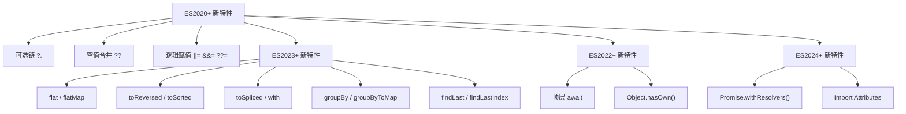

+++
title = "第 22 章 ES6+ 新增语法"
weight = 220
date = "2026-03-24T22:08:00+08:00"
type = "docs"
description = ""
isCJKLanguage = true
draft = false
+++
# 第 22 章 ES6+ 新增语法

> ES2020、ES2021、ES2022、ES2023、ES2024... JavaScript 越来越甜了！

## 22.1 链式操作

### 可选链操作符 ?.（ES2020+）

**可选链操作符**（Optional Chaining）——`?.`，这是 JavaScript 历史上最受好评的语法更新之一！它让深层属性访问变得安全，再也不用写一堆 `&&` 了。

```javascript
// 以前的痛苦写法
const city = user && user.address && user.address.city;

// 现在的优雅写法
const city = user?.address?.city;
console.log('城市:', city);  // 城市: undefined（如果路径上任何一环是 null/undefined）
```

```javascript
// 可选链的三种用法

const person = {
  name: '张三',
  address: {
    city: '北京',
    zip: '100000'
  }
};

// 1. 属性访问
console.log('城市:', person?.address?.city);  // 城市: 北京
console.log('国家:', person?.address?.country);  // 国家: undefined

// 2. 函数调用
const obj = {
  greet: function() {
    return '你好！';
  }
};

const noGreet = null;

console.log('打招呼:', obj?.greet?.());  // 打招呼: 你好！
console.log('不存在的方法:', noGreet?.greet?.());  // 不存在的方法: undefined
```

```javascript
// 3. 数组元素访问
const arr = [1, 2, 3];

console.log('第三个元素:', arr?.[2]);     // 第三个元素: 3
console.log('第十个元素:', arr?.[9]);    // 第十个元素: undefined
```

```javascript
// 可选链与空值合并运算符配合
const user = {
  profile: {
    name: '小明'
    // age 没定义
  }
};

// 只用可选链：得到 undefined
console.log('年龄:', user?.profile?.age);  // 年龄: undefined

// 配合空值合并：得到默认值
console.log('年龄（带默认值）:', user?.profile?.age ?? '未知');  // 年龄（带默认值）: 未知
```

```javascript
// 可选链的短路特性
// 如果可选链某一步是 null/undefined，后续不再执行

const obj2 = {
  getValue: () => {
    console.log('这个函数会被调用吗？');
    return 'value';
  }
};

console.log('结果:', obj2?.nonExistent?.());  // 结果: undefined（函数没被调用）
console.log('结果是 undefined 类型:', typeof obj2?.nonExistent?.());  // undefined
```

```javascript
// 多次可选链
const deep = {};

console.log('多层可选链:', deep?.a?.b?.c?.d);  // undefined（不会报错）
```

```javascript
// 实际应用：安全地访问 API 响应
const apiResponse = {
  status: 200,
  data: {
    user: {
      name: '李四',
      contact: {
        email: 'li@example.com'
      }
    }
  }
};

const email = apiResponse?.data?.user?.contact?.email;
console.log('邮箱:', email);  // 邮箱: li@example.com

// 不存在的路径
const phone = apiResponse?.data?.user?.contact?.phone;
console.log('电话:', phone);  // 电话: undefined
```

```javascript
// 容易犯的错误：可选链不能用于赋值
// person?.name = '王五';  // SyntaxError! 可选链不能用于赋值目标
```

```javascript
// 可选链与算符结合
// 错误写法
// const x = person?.name.length;  // 如果 name 是 undefined，会报错

// 正确写法（可选链后使用空值合并）
const nameLength = person?.name?.length ?? 0;
console.log('名字长度:', nameLength);  // 名字长度: 2
```

---

### 空值合并运算符 ??（ES2020+）

**空值合并运算符**（Nullish Coalescing）——`??`，它只在你真正"什么都没有"的时候才使用默认值，而不是在"假值"（falsy）的时候。

```javascript
// ?? vs || 的区别
console.log('=== ?? vs || ===');

const a = 0;
const b = '';
const c = false;
const d = null;
const e = undefined;

console.log('使用 ||:');
console.log('  a || 10:', a || 10);    // 10（0 是 falsy）
console.log('  b || "hi":', b || 'hi');    // hi（空字符串是 falsy）
console.log('  c || true:', c || true);   // true（false 是 falsy）
console.log('  d || "null":', d || 'null'); // null（null 是 falsy）
console.log('  e || "undefined":', e || 'undefined'); // undefined（undefined 是 falsy）

console.log('\n使用 ??（只关心 null/undefined）:');
console.log('  a ?? 10:', a ?? 10);    // 0（0 不是 null/undefined）
console.log('  b ?? "hi":', b ?? 'hi');    // ''（空字符串不是 null/undefined）
console.log('  c ?? true:', c ?? true);   // false（false 不是 null/undefined）
console.log('  d ?? "null":', d ?? 'null'); // null（d 是 null）
console.log('  e ?? "undefined":', e ?? 'undefined'); // undefined（e 是 undefined）
```

```javascript
// 典型应用：设置默认值
function setWidth(width) {
  // || 会把 0 和 '' 也当成需要替换的值
  // ?? 只替换 null 和 undefined
  const finalWidth = width ?? 300;
  console.log('最终宽度:', finalWidth);
}

setWidth(0);       // 最终宽度: 0（而不是 300！）
setWidth(500);     // 最终宽度: 500
setWidth(null);    // 最终宽度: 300
setWidth(undefined); // 最终宽度: 300
```

```javascript
// 配合可选链使用
const user = {
  name: '小红',
  age: 0,  // 故意设为0
  bio: ''  // 故意设为空字符串
};

// 获取年龄，如果没有则默认为 18
const displayAge = user?.age ?? 18;
console.log('显示年龄:', displayAge);  // 0（而不是 18！）

// 获取简介，如果没有则默认为 '这个人很懒'
const displayBio = user?.bio ?? '这个人很懒';
console.log('显示简介:', displayBio);  // ''（空字符串，而不是默认值）
```

```javascript
// ?? 不能与 && 或 || 混用（除非用括号）
// 这会报错
// const x = a || b ?? c;

// 需要加括号（|| 和 ?? 的优先级：|| > ??）
const x = a || (b ?? c);

// 如果 a 是 truthy，x = a
// 如果 a 是 falsy 但不是 null/undefined，x = b ?? c
// 如果 a 是 null/undefined，x = b ?? c

// 实际例子：
let a = 0, b = 1, c = 2;
console.log('a || (b ?? c):', a || (b ?? c));  // 1（因为 a 是 0，|| 会看 b）

// 所以正确的等价写法需要考虑 a 的所有 falsy 值
// 如果想用 ?? 代替 ||，需要这样：
const y = a !== null && a !== undefined ? a : (b ?? c);
```

```javascript
// ?? 的短路特性
function getValue() {
  console.log('函数被调用了！');
  return 'value';
}

const result = null ?? getValue();  // 函数被调用了！
console.log('结果:', result);  // 结果: value

const result2 = 'hello' ?? getValue();  // 函数不会被调用！
console.log('结果2:', result2);  // 结果2: hello
```

> 💡 **本章小结（第22章第1节）**
> 
> 可选链 `?.` 让深层属性访问变得安全，`user?.profile?.address?.city` 不会在中间任何一环为 null/undefined 时报错。空值合并运算符 `??` 只在值为 null 或 undefined 时才使用默认值，不会被 `0`、`''`、`false` 这些假值误导。两者配合使用效果最佳：`user?.age ?? 18` 既安全又有默认值！

---

## 22.2 逻辑赋值

### ||= / &&= / ??=（ES2021+）

**逻辑赋值运算符**——`||=`、`&&=`、`??=`——它们把逻辑运算和赋值合并成了一步。这语法刚出来的时候很多人觉得奇怪，但用习惯了还真挺方便的。

```javascript
// 逻辑 OR 赋值 ||=（当值为 falsy 时才赋值）
let a = 0;
let b = 'hello';
let c = null;

a ||= 10;  // a 是 0（falsy），所以赋值为 10
b ||= 'world';  // b 是 'hello'（truthy），不变
c ||= 'assigned';  // c 是 null（falsy），所以赋值为 'assigned'

console.log('a:', a, 'b:', b, 'c:', c);  // a: 10 b: hello c: assigned
```

```javascript
// 逻辑 AND 赋值 &&=（当值为 truthy 时才赋值）
let x = 5;
let y = 0;
let z = 'existing';

x &&= 100;  // x 是 5（truthy），所以赋值为 100
y &&= 50;   // y 是 0（falsy），不变
z &&= 'changed';  // z 是 'existing'（truthy），所以赋值为 'changed'

console.log('x:', x, 'y:', y, 'z:', z);  // x: 100 y: 0 z: changed
```

```javascript
// 逻辑空值赋值 ??=（当值为 null/undefined 时才赋值）
let m = null;
let n = undefined;
let o = 0;  // 不是 null/undefined
let p = '';

m ??= 'm assigned';  // m 是 null，赋值
n ??= 'n assigned';  // n 是 undefined，赋值
o ??= 'o assigned';  // o 是 0，不赋值
p ??= 'p assigned';  // p 是 ''，不赋值

console.log('m:', m, 'n:', n, 'o:', o, 'p:', p);  // m: m assigned n: n assigned o: 0 p: ''
```

```javascript
// 对比三种逻辑赋值
let value;

console.log('=== 初始值 ===');
value = 0;
console.log('value = 0');

console.log('\n||=:');
value ||= 'default';  // 0 是 falsy，所以赋值为 'default'
console.log('result:', value);  // result: default

value = 'hello';
value ||= 'default';  // 'hello' 是 truthy，不变
console.log('result:', value);  // result: hello

console.log('\n&&=:');
value = 0;
value &&= 'default';  // 0 是 falsy，不变
console.log('result:', value);  // result: 0

value = 'hello';
value &&= 'default';  // 'hello' 是 truthy，赋值为 'default'
console.log('result:', value);  // result: default

console.log('\n??=:');
value = 0;
value ??= 'default';  // 0 不是 null/undefined，不变
console.log('result:', value);  // result: 0

value = null;
value ??= 'default';  // null，赋值为 'default'
console.log('result:', value);  // result: default
```

```javascript
// 实际应用：配置对象合并
function createConfig(baseConfig, overrides) {
  return {
    theme: baseConfig.theme,
    language: baseConfig.language,
    debug: baseConfig.debug,
    // 用 ||= 来允许用户覆盖
    ...Object.fromEntries(
      Object.entries(overrides).map(([key, value]) => [key, value])
    )
  };
}

// 用逻辑赋值实现
function createConfigBetter(base) {
  const config = {};

  config.theme = base.theme;
  config.language = base.language ?? 'en';  // 默认英语
  config.debug = base.debug ?? false;       // 默认关闭

  // 允许传入的配置覆盖默认
  config.theme = base.theme;
  config.language ??= 'en';  // 如果没设置，默认英语
  config.debug ??= false;

  return config;
}

const defaults = { theme: 'light', language: 'en' };
const userPrefs = { language: 'zh' };

const config = createConfigBetter(defaults);
console.log('配置:', config);  // 配置: { theme: 'light', language: 'zh', debug: false }
```

```javascript
// 应用：安全地添加属性
const user = { name: '张三' };

// 以前
if (!user.age) {
  user.age = 18;
}

// 现在
user.age ??= 18;
console.log('用户年龄:', user.age);  // 用户年龄: 18

user.age = 20;
user.age ??= 18;  // 已经是 20 了，不会再改
console.log('更新后年龄:', user.age);  // 更新后年龄: 20
```

```javascript
// 应用：缓存结果
function expensiveCalc() {
  console.log('执行耗时计算...');
  return 42;
}

const cache = {};

function getCachedResult(key) {
  cache[key] ??= expensiveCalc();
  return cache[key];
}

console.log(getCachedResult('answer'));  // 执行耗时计算... 42
console.log(getCachedResult('answer'));  // 不打印，直接返回缓存值 42
console.log(getCachedResult('answer'));  // 不打印，直接返回缓存值 42
```

```javascript
// 等价转换
// a ||= b 等价于 a || (a = b)
// a &&= b 等价于 a && (a = b)
// a ??= b 等价于 a ?? (a = b)

// 但是逻辑赋值更简洁！
```

> 💡 **本章小结（第22章第2节）**
> 
> 逻辑赋值运算符把逻辑判断和赋值合并成了一步：`||=` 在值为 falsy 时赋值，`&&=` 在值为 truthy 时赋值，`??=` 在值为 null/undefined 时赋值。它们的出现让配置合并、默认值设置、缓存等场景的代码更简洁。记住：**||= 是"假值替换"，&&= 是"真值替换"，??= 是"空值替换"**！

---

## 22.3 数组新方法

### flat / flatMap：扁平化

数组扁平化是前端开发中的常见需求。ES2019 引入了 `flat()` 和 `flatMap()`，让这个操作变得异常简单。

```javascript
// flat：扁平化数组
const nested = [1, [2, 3], [4, [5, 6]]];

console.log('原数组:', nested);
console.log('扁平一层:', nested.flat());   // [ 1, 2, 3, 4, [ 5, 6 ] ]
console.log('完全扁平:', nested.flat(Infinity));  // [ 1, 2, 3, 4, 5, 6 ]
```

```javascript
// flat 会自动移除空位
const withHoles = [1, , 2, , [3, , 4]];
console.log('有空洞的数组:', withHoles);
console.log('扁平后:', withHoles.flat());  // [ 1, 2, 3, 4 ] —— 空洞被移除了！
```

```javascript
// flatMap：先映射再扁平
const words = ['hello world', 'good morning'];
const chars = words.flatMap(word => word.split(''));
console.log('字符数组:', chars);
// [ 'h', 'e', 'l', 'l', 'o', ' ', 'w', 'o', 'r', 'l', 'd', 'g', 'o', 'o', 'd', ' ', 'm', 'o', 'r', 'n', 'i', 'n', 'g' ]
```

```javascript
// flatMap 的返回值会自动被扁平
// 相当于 words.map(...).flat()
const result1 = words.map(w => w.split(''));
console.log('map后:', result1);  // [['h','e','l','l','o',' '...], ['g','o','o','d',' '...]]

const result2 = words.flatMap(w => w.split(''));
console.log('flatMap后:', result2);  // ['h','e','l','l','o',' ','w',...]
```

```javascript
// flatMap 可以返回不同长度的数组
const numbers = [1, 2, 3, 4];

const doubled = numbers.map(n => [n * 2]);  // [[2], [4], [6], [8]]
console.log('map后:', doubled);

const doubledFlat = numbers.flatMap(n => [n * 2]);  // [2, 4, 6, 8]
console.log('flatMap后:', doubledFlat);

// 如果想"展开"成单个元素，用 flatMap
// 如果想"展开"成多个元素，也可以
const expanded = numbers.flatMap(n => Array(n).fill(n));
console.log('展开为重复数组:', expanded);  // [1, 2, 2, 3, 3, 3, 4, 4, 4, 4]
```

---

### toSorted / toReversed / toSpliced / with（ES2023+）

ES2023 引入了数组的"非变异"方法——这些方法会返回新的数组/值，而不会修改原数组。在 React 等强调不可变性的框架中，这些方法非常有用。

```javascript
// toReversed()：返回反转后的新数组（不修改原数组）
const arr1 = [1, 2, 3, 4, 5];
const reversed1 = arr1.toReversed();

console.log('原数组:', arr1);      // [ 1, 2, 3, 4, 5 ] —— 不变！
console.log('反转后:', reversed1);   // [ 5, 4, 3, 2, 1 ]

// 对比旧的 reverse()
const arr2 = [1, 2, 3, 4, 5];
const reversed2 = arr2.reverse();

console.log('原数组 after reverse():', arr2);   // [ 5, 4, 3, 2, 1 ] —— 被修改了！
console.log('反转后:', reversed2);               // [ 5, 4, 3, 2, 1 ]
```

```javascript
// toSorted()：返回排序后的新数组（不修改原数组）
const unsorted = [3, 1, 4, 1, 5, 9, 2, 6];
const sorted = unsorted.toSorted();

console.log('原数组:', unsorted);  // [ 3, 1, 4, 1, 5, 9, 2, 6 ] —— 不变！
console.log('排序后:', sorted);    // [ 1, 1, 2, 3, 4, 5, 6, 9 ]
```

```javascript
// toSpliced()：返回 splice 操作后的新数组（不修改原数组）
const original = ['a', 'b', 'c', 'd', 'e'];

// 删除元素
const deleted = original.toSpliced(1, 2);  // 从索引1开始删除2个
console.log('原数组:', original);  // ['a', 'b', 'c', 'd', 'e'] —— 不变！
console.log('删除后:', deleted);    // ['a', 'd', 'e']

// 插入元素
const inserted = original.toSpliced(2, 0, 'x', 'y');  // 从索引2插入，不删除
console.log('插入后:', inserted);  // ['a', 'b', 'x', 'y', 'c', 'd', 'e']

// 替换元素
const replaced = original.toSpliced(2, 2, 'Z');
console.log('替换后:', replaced);  // ['a', 'b', 'Z', 'd', 'e']
```

```javascript
// with()：返回指定位置元素被替换后的新数组（不修改原数组）
const arr = [1, 2, 3, 4, 5];

const newArr = arr.with(2, 'three');  // 把索引2的元素替换为'three'
console.log('原数组:', arr);  // [ 1, 2, 3, 4, 5 ] —— 不变！
console.log('替换后:', newArr);  // [ 1, 2, 'three', 4, 5 ]

// 支持负索引
const lastItem = arr.with(-1, 999);
console.log('替换最后一个:', lastItem);  // [ 1, 2, 3, 4, 999 ]
```

```javascript
// 这些方法在 React 中的应用
// React 鼓励不可变性，直接修改状态是不推荐的

const state = {
  items: [1, 2, 3, 4, 5],
  user: { name: '张三', age: 30 }
};

// 以前的写法
const newItems1 = state.items.slice();  // 先拷贝
newItems1.reverse();
const newState1 = { ...state, items: newItems1 };

// 现在的写法（更简洁）
const newState2 = {
  ...state,
  items: state.items.toReversed()
};
```

```javascript
// 对比总结
const test = [3, 1, 4, 1, 5, 9, 2, 6];

// 旧方法（修改原数组）
test.sort();     // 修改 test
test.reverse();  // 修改 test
test.splice();   // 修改 test

// 新方法（返回新数组）
test.toSorted(); // 返回新数组，test 不变
test.toReversed(); // 返回新数组，test 不变
test.toSpliced(); // 返回新数组，test 不变
test.with();     // 返回新数组，test 不变
```

---

### Array.groupBy / Map.groupBy（ES2024+）

ES2024 引入了 `groupBy` 和 `Map.groupBy` 方法，让分组变得超级简单！

```javascript
// groupBy：根据条件分组
const students = [
  { name: '张三', score: 85 },
  { name: '李四', score: 72 },
  { name: '王五', score: 90 },
  { name: '赵六', score: 68 },
  { name: '钱七', score: 95 }
];

// 按及格/不及格分组
const byPass = students.groupBy(s => s.score >= 60 ? 'pass' : 'fail');
console.log('按及格分组:');
console.log('  pass:', byPass.pass.map(s => s.name));   // [ '张三', '李四', '王五', '赵六' ]
console.log('  fail:', byPass.fail.map(s => s.name));   // [ '钱七' ]
```

```javascript
// 按分数段分组
const byGrade = students.groupBy(s => {
  if (s.score >= 90) return 'A';
  if (s.score >= 80) return 'B';
  if (s.score >= 70) return 'C';
  if (s.score >= 60) return 'D';
  return 'F';
});

console.log('按等级分组:', Object.entries(byGrade));
// [ ['A', [{name: '王五', score: 90}, {name: '钱七', score: 95}]],
//   ['B', [{name: '张三', score: 85}]],
//   ['C', [{name: '李四', score: 72}]],
//   ['D', [{name: '赵六', score: 68}]],
//   ['F', []] ]
```

```javascript
// groupByToMap：返回 Map 而不是普通对象
const byGradeMap = students.groupByToMap(s => {
  if (s.score >= 90) return 'A';
  if (s.score >= 80) return 'B';
  if (s.score >= 70) return 'C';
  if (s.score >= 60) return 'D';
  return 'F';
});

console.log('Map分组:', byGradeMap.get('A'));
// [ { name: '王五', score: 90 }, { name: '钱七', score: 95 } ]
```

```javascript
// groupBy 不会包含空数组
const items = [1, 2, 3, 4, 5, 6];
const grouped = items.groupBy(n => n % 2 === 0 ? 'even' : 'odd');
console.log('分组结果:', Object.keys(grouped));  // ['even', 'odd'] —— 不会包含空分组
```

---

### findLast / findLastIndex

ES2023 还引入了 `findLast` 和 `findLastIndex`，从数组末尾开始查找。

```javascript
// findLast：从后往前找第一个满足条件的元素
const fruits = ['苹果', '香蕉', '橙子', '葡萄', '香蕉', '西瓜'];

console.log('最后一个香蕉:', fruits.findLast(f => f === '香蕉'));  // 最后一个香蕉: 香蕉（第二个）
console.log('最后一个以"西"开头的:', fruits.findLast(f => f.startsWith('西')));  // 西瓜

// 对比 find：从前往后找
console.log('第一个香蕉:', fruits.find(f => f === '香蕉'));  // 第一个香蕉: 香蕉（第一个）
```

```javascript
// findLastIndex：返回从后往前第一个满足条件的索引
const numbers = [1, 3, 5, 7, 9, 3, 5];

console.log('最后一个3的位置:', numbers.findLastIndex(n => n === 3));  // 5（索引5）
console.log('第一个3的位置:', numbers.findIndex(n => n === 3));        // 2（索引2）
console.log('最后一个大于5的:', numbers.findLast(n => n > 5));        // 9
```

```javascript
// 实际应用：获取最新添加的数据
const logs = [
  { time: '10:00', level: 'info' },
  { time: '10:05', level: 'warn' },
  { time: '10:10', level: 'error' },
  { time: '10:15', level: 'warn' },
  { time: '10:20', level: 'info' }
];

const latestError = logs.findLast(log => log.level === 'error');
console.log('最新错误:', latestError);  // { time: '10:10', level: 'error' }
```

> 💡 **本章小结（第22章第3节）**
> 
> ES2023+ 为数组带来了很多实用的新方法：`flat()/flatMap()` 用于扁平化数组；`toReversed()/toSorted()/toSpliced()/with()` 是非变异版本的方法，不会修改原数组；`groupBy()/groupByToMap()` 简化了分组操作；`findLast()/findLastIndex()` 从数组末尾开始查找。在 React 等强调不可变性的框架中，非变异方法尤为重要！

---

## 22.4 其他新特性

### 顶层 await（ES2022+）

**顶层 await**（Top-level await）让你可以在模块顶层使用 `await`，而不用包在 async 函数里。

```javascript
// 以前的写法：必须包在 async 函数里
async function loadConfig() {
  const response = await fetch('/api/config');
  const config = await response.json();
  return config;
}

const config = loadConfig();  // 返回的是 Promise，不是 config！
config.then(c => console.log('配置:', c));

// 顶层 await 写法
// const config = await fetch('/api/config').then(r => r.json());
// console.log('配置:', config);  // 直接得到配置对象
```

```javascript
// 实际应用：模块初始化
// config.js
// const config = await fetch('/api/config').then(r => r.json());
// export default config;

// anotherModule.js
// import config from './config.js';
// console.log(config);  // 已经解析好了
```

```javascript
// 顶层 await 的风险：阻塞
// 如果在模块顶层使用 await，会阻塞后续代码的执行
// 这在某些场景下很有用，但在另一些场景下可能是灾难

// 例如：
// const data = await fetch('/api/slow-endpoint').then(r => r.json());
// console.log('这条语句要等上面的 fetch 完成才能执行');
```

```javascript
// 错误处理
try {
  const data = await fetch('/api/config').then(r => {
    if (!r.ok) throw new Error('请求失败');
    return r.json();
  });
  console.log('数据:', data);
} catch (error) {
  console.error('获取数据失败:', error);
}
```

---

### Object.hasOwn()（ES2022+）

**Object.hasOwn()** 是 `Object.prototype.hasOwnProperty()` 的更安全替代品。

```javascript
const obj = { name: '张三', age: 30 };

// 旧方法
console.log('hasOwnProperty:', obj.hasOwnProperty('name'));  // true
console.log('hasOwnProperty:', obj.hasOwnProperty('toString'));  // false

// hasOwn 的优势
// 1. 不会被子类重写
class NewObj {
  constructor() {
    this.name = '李四';
  }

  hasOwnProperty() {
    return false;  // 重写了 hasOwnProperty
  }
}

const newObj = new NewObj();
console.log('hasOwnProperty 调用:', newObj.hasOwnProperty('name'));  // false（被破坏了）
console.log('Object.hasOwn:', Object.hasOwn(newObj, 'name'));  // true（不受影响）
```

```javascript
// 2. 更简洁的语法
const proto = { inherited: 'inherit' };
const child = Object.create(proto);
child.own = 'own';

console.log('Object.hasOwn:', Object.hasOwn(child, 'own'));      // true
console.log('Object.hasOwn:', Object.hasOwn(child, 'inherited')); // false
```

```javascript
// 3. 可以处理原始值
// Object.hasOwn(123, 'toString');  // TypeError! 第一个参数必须是对象

Object.hasOwn({ name: 'test' }, 'name');  // true
```

---

### Promise.withResolvers()（ES2024+）

**Promise.withResolvers()** 是 ES2024 新增的语法糖，让创建 Promise 和它的 resolve/reject 函数变得更简单。

```javascript
// 传统写法
function fetchData() {
  let resolve, reject;

  const promise = new Promise((res, rej) => {
    resolve = res;
    reject = rej;
  });

  // 使用 setTimeout 模拟异步操作
  setTimeout(() => {
    if (Math.random() > 0.5) {
      resolve('数据加载成功！');
    } else {
      reject(new Error('加载失败'));
    }
  }, 1000);

  return { promise, resolve, reject };
}

// 使用
const { promise, resolve, reject } = fetchData();

promise
  .then(data => console.log('成功:', data))
  .catch(err => console.error('失败:', err));
```

```javascript
// Promise.withResolvers() 写法（ES2024+）
function fetchDataNew() {
  const { promise, resolve, reject } = Promise.withResolvers();

  setTimeout(() => {
    if (Math.random() > 0.5) {
      resolve('数据加载成功！');
    } else {
      reject(new Error('加载失败'));
    }
  }, 1000);

  return { promise, resolve, reject };
}
```

---

### import.meta

**import.meta** 是一个提供模块元信息的对象，包含当前模块的 URL 等信息。

```javascript
// import.meta.url：当前模块的 URL
// 在浏览器中
// console.log(import.meta.url);  // file:///path/to/current/module.js

// 在 Node.js 中
// console.log(import.meta.url);  // file:///path/to/current/module.js

// 应用：获取当前文件的目录
// import { fileURLToPath } from 'url';
// import { dirname } from 'path';

// const __filename = fileURLToPath(import.meta.url);
// const __dirname = dirname(__filename);
```

```javascript
// import.meta.meta：模块的元数据（实验性）
// console.log(import.meta.meta);  // { url: '...', ... }
```

---

### Import Attributes / with { type: 'json' }

**Import Attributes**（之前叫 Import Assertions）允许你在导入时指定资源的类型，比如导入 JSON 文件。

```javascript
// 导入 JSON 文件
// import config from './config.json' with { type: 'json' };

// 以前需要这样
// const response = await fetch('./config.json');
// const config = await response.json();

// 现在可以直接 import
// import books from './books.json' with { type: 'json' };
// console.log(books);  // 直接是解析后的对象
```

```javascript
// 应用：确保导入的是正确类型的资源
// 防止导入错误的文件类型
try {
  // import data from './data.txt' with { type: 'json' };
  // 这里会报错，因为 data.txt 不是 JSON
} catch (e) {
  console.error('导入类型不匹配');
}
```



> 💡 **本章小结（第22章第4节）**
> 
> ES2020-2024 为 JavaScript 带来了大量实用新语法：顶层 await 简化了模块初始化；Object.hasOwn() 是更安全的 hasOwnProperty 替代品；Promise.withResolvers() 让 Promise + resolve/reject 的模式更简洁；import.meta 提供了模块的元信息；Import Attributes 让你在导入时指定资源类型。这些新特性让 JavaScript 越来越像一门"成熟"的语言了！

---

## 本章小结（第22章）

### 1. 链式操作
- **可选链 `?.`**：安全访问深层属性，为 null/undefined 时不报错
- **空值合并 `??`**：只在 null/undefined 时使用默认值，不被假值误导

### 2. 逻辑赋值
- `||=`：值为 falsy 时赋值
- `&&=`：值为 truthy 时赋值
- `??=`：值为 null/undefined 时赋值

### 3. 数组新方法
- `flat/flatMap`：扁平化数组
- `toReversed/toSorted/toSpliced/with`：非变异操作，不修改原数组
- `groupBy/groupByToMap`：简化分组操作
- `findLast/findLastIndex`：从末尾开始查找

### 4. 其他新特性
- **顶层 await**：模块顶层直接使用 await
- **Object.hasOwn()**：更安全的 hasOwnProperty 替代
- **Promise.withResolvers()**：简化 Promise + resolve/reject 模式
- **import.meta**：获取模块元信息
- **Import Attributes**：导入时指定资源类型

### 记忆口诀
```
可选链防报错，空值合并不怕假
逻辑赋值三兄弟，||= &&= ??=
数组方法越来越甜，flat groupBy findLast
新特新语法学不完，JavaScript 真能干！
```