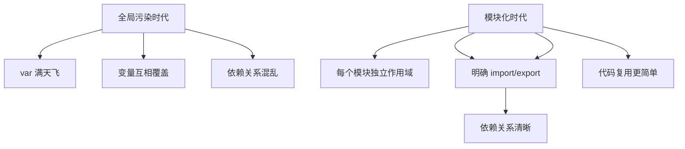
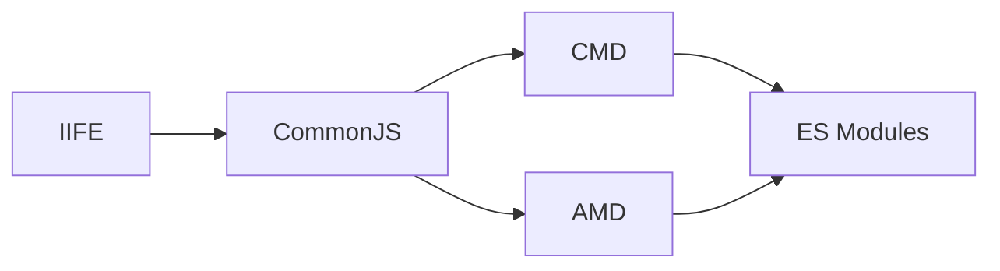
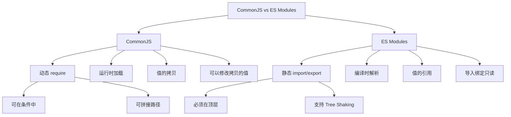

+++
title = "第 23 章 模块化"
weight = 230
date = "2026-03-24T22:08:00+08:00"
type = "docs"
description = ""
isCJKLanguage = true
draft = false
+++
# 第 23 章 模块化

> JavaScript 从"草履虫"进化到"蚂蚁群"的关键——模块系统！

## 23.1 模块化基础

### 模块化的意义：避免全局污染 / 明确依赖 / 代码复用

在 JavaScript 的蛮荒时代，所有代码都往全局作用域里塞。想象一下：

```javascript
// file1.js
var name = '张三';

// file2.js
var name = '李四';  // 完蛋！覆盖了 file1 的 name！

// file3.js
console.log(name);  // 到底是张三还是李四？
```

这就是**全局污染**问题——所有变量都挤在一个 namespace 里，互相覆盖，天坑遍野。

**模块化**就是为了解决这个问题：

1. **避免全局污染**：每个模块有自己的作用域，模块内的变量不会自动跑到全局
2. **明确依赖**：模块之间可以声明"我需要用哪个模块"，依赖关系一目了然
3. **代码复用**：写一次模块，到处引用，不用复制粘贴

```javascript
// 模块化后的代码
// module1.js
const name = '张三';  // 只在这个模块里有效
export { name };

// module2.js
const name = '李四';  // 这是另一个模块的 name，互不影响
export { name };

// main.js
import { name as name1 } from './module1.js';
import { name as name2 } from './module2.js';
console.log(name1, name2);  // 张三 李四 —— 完美！
```



---

### 模块化规范演进：IIFE → CommonJS → AMD → CMD → ES Modules

JavaScript 的模块化之路，就像一部"江湖恩怨史"：



#### 1. IIFE（Immediately Invoked Function Expression）

**立即调用函数表达式**——用函数作用域来"包住"变量，防止污染全局。

```javascript
// IIFE 写法
(function() {
  var name = '张三';  // 变量不会跑到全局
  console.log('模块内的 name:', name);
})();

// 外部访问不到 name
// console.log(name);  // ReferenceError!
```

```javascript
// IIFE 的变体：增强版
(function(global, $) {
  // global 是 window，$ 是 jQuery（如果有）
  global.MyModule = {
    greet: function() {
      console.log('你好！');
    }
  };
})(window, jQuery);

// 外部可以通过 MyModule 访问
// MyModule.greet();
```

IIFE 的缺点：没有真正的依赖管理，只是"自欺欺人"式的隔离。

#### 2. CommonJS（CJS）

Node.js 使用的模块系统，使用 `require()` 导入，`module.exports` 或 `exports` 导出。

```javascript
// math.js
const add = (a, b) => a + b;
const multiply = (a, b) => a * b;

module.exports = {
  add,
  multiply
};

// 或者
exports.add = add;
exports.multiply = multiply;
```

```javascript
// main.js
const { add, multiply } = require('./math.js');

console.log(add(1, 2));      // 3
console.log(multiply(3, 4)); // 12
```

#### 3. AMD（Asynchronous Module Definition）

RequireJS 使用的模块系统，专门为浏览器设计，支持异步加载。

```javascript
// 定义模块
define('math', ['dependency1', 'dependency2'], function(dep1, dep2) {
  return {
    add: function(a, b) { return a + b; }
  };
});

// 使用模块
require(['math'], function(math) {
  console.log(math.add(1, 2));
});
```

#### 4. CMD（Common Module Definition）

SeaJS 使用的模块系统，与 AMD 类似，但推崇"就近依赖"。

```javascript
// CMD 写法
define(function(require, exports, module) {
  var add = require('./add');
  var multiply = require('./multiply');

  exports.add = add;
  exports.multiply = multiply;
});
```

#### 5. ES Modules（ESM）

ES6+ 标准化的模块系统，`import`/`export` 语法，终结了江湖混战！

```javascript
// math.js
export const add = (a, b) => a + b;
export const multiply = (a, b) => a * b;
export default function(a, b) { return a + b; }
```

```javascript
// main.js
import add, { multiply } from './math.js';

console.log(add(1, 2));      // 3
console.log(multiply(3, 4)); // 12
```

> 💡 **本章小结（第23章第1节）**
> 
> 模块化解决了 JavaScript 的三大痛点：全局污染、依赖混乱、代码复用困难。JavaScript 模块化经历了 IIFE → CommonJS → AMD → CMD → ES Modules 的演进。IIFE 用函数作用域隔离，CommonJS 是 Node.js 的标准，AMD/CMD 是浏览器端的早期方案，ES Modules 是最终的统一标准！

---

## 23.2 CommonJS

### module.exports / exports.xxx

CommonJS 是 Node.js 的标准模块系统。虽然现在 Node.js 也支持 ES Modules，但 CommonJS 仍然是 Node.js 生态的主流。

```javascript
// 导出方式1：module.exports
// 导出一个对象（最常用）
module.exports = {
  name: '我的模块',
  version: '1.0.0',
  greet: function() {
    return '你好！';
  }
};

// 导出一个函数
module.exports = function() {
  console.log('这是一个函数模块！');
};

// 导出一个类
module.exports = class Calculator {
  add(a, b) { return a + b; }
  subtract(a, b) { return a - b; }
};
```

```javascript
// 导出方式2：exports.xxx
// exports 是 module.exports 的引用
exports.name = '我的模块';
exports.version = '1.0.0';
exports.greet = function() {
  return '你好！';
};

// 注意！不能这样写：
// exports = { name: 'xxx' };  // 这样会断开引用！
// 应该用：
// module.exports = { name: 'xxx' };
```

```javascript
// 两种导出方式的区别
// 方式1：module.exports = {...}  —— 替换整个导出对象
const obj1 = { a: 1 };
module.exports = obj1;

// 方式2：exports.xxx = xxx —— 向导出对象添加属性
exports.a = 1;
exports.b = 2;

// 如果同时使用，以 module.exports 为准
module.exports = { c: 3 };
exports.a = 100;  // 会被 module.exports 覆盖！
```

```javascript
// module.exports 与 exports 的关系
console.log('module.exports === exports?', module.exports === exports);  // true（初始时）

// 当我们给 exports 添加属性时，module.exports 也会变
exports.name = 'test';
console.log(module.exports.name);  // 'test'

// 但如果直接给 module.exports 赋值新的对象
module.exports = { new: 'object' };
console.log('module.exports === exports?', module.exports === exports);  // false！
```

---

### require() 导入

```javascript
// 导入 module.exports 导出的对象
const myModule = require('./myModule.js');
console.log(myModule.name);
console.log(myModule.greet());

// 解构导入（CommonJS 不支持，但可以用变量接收后解构）
const { name, greet } = require('./myModule.js');
console.log(name, greet());
```

```javascript
// 导入 npm 包
const express = require('express');  // npm 安装的包
const _ = require('lodash');           // 工具库
const axios = require('axios');       // HTTP 客户端
```

```javascript
// 导入 JSON 文件（Node.js 特有功能）
const config = require('./config.json');
console.log(config.database.host);
```

```javascript
// 动态 require（根据条件加载不同模块）
function loadAdapter(type) {
  return require(`./adapters/${type}Adapter.js`);
}

const sqlAdapter = loadAdapter('sql');
const mongoAdapter = loadAdapter('mongodb');
```

---

### 循环引用问题与模块缓存机制

CommonJS 有循环引用的问题，但 Node.js 有模块缓存机制来缓解。

```javascript
// 循环引用示例
// a.js
console.log('a.js 开始加载');
const { b } = require('./b.js');
console.log('a.js 加载完成，b =', b);
function a() { return 'a'; }
module.exports = { a };

// b.js
console.log('b.js 开始加载');
const { a } = require('./a.js');
console.log('b.js 加载完成，a =', a);
function b() { return 'b'; }
module.exports = { b };

// 当运行 node a.js 时：
/*
a.js 开始加载
b.js 开始加载
b.js 加载完成，a = undefined  （a.js 还没导出完成！）
a.js 加载完成，b = [Function: b]
*/
```

```javascript
// 解决循环引用的方法
// 方法1：在需要用到的地方才 require（延迟加载）
// a.js
console.log('a.js 开始加载');
function a() { return 'a'; }
module.exports = { a };

setTimeout(() => {
  const { b } = require('./b.js');
  console.log('a 中访问 b:', b());
}, 0);

// 方法2：只导出需要的部分
// a.js
function getB() {
  return require('./b.js');
}
module.exports = { getB };
```

```javascript
// 模块缓存机制
// 同一个模块多次 require，只会执行一次
// console.log(require.cache);  // 查看缓存
```

> 💡 **本章小结（第23章第2节）**
> 
> CommonJS 使用 `module.exports` 或 `exports` 导出，`require()` 导入。`exports` 只是 `module.exports` 的引用，给 `exports` 添加属性等同于给 `module.exports` 添加属性，但直接赋值 `module.exports` 会断开引用。CommonJS 有循环引用问题，因为模块是同步加载的，但 Node.js 的模块缓存机制可以缓解这个问题。

---

## 23.3 ES Modules

### export：命名导出

**命名导出**（Named Export）——每个导出都有一个名字，导入时需要知道这个名字。

```javascript
// 方式1：导出时声明
export const PI = 3.14159;
export function add(a, b) {
  return a + b;
}
export class Calculator {
  constructor() {
    this.result = 0;
  }
  add(a) { this.result += a; return this; }
}
```

```javascript
// 方式2：统一导出（在文件末尾）
const EULER = 2.71828;
const PHI = 1.61803;

function multiply(a, b) { return a * b; }
function divide(a, b) { return a / b; }

export { EULER, PHI, multiply, divide };
```

```javascript
// 重命名导出
const originalName = '原始名字';
export { originalName as aliasName };
// 导入时只能用 aliasName
```

```javascript
// 重新导出（从其他模块导出）
// export { add } from './math.js';
// export { multiply } from './math.js';
// 或者一次性导出所有
// export * from './math.js';
```

```javascript
// 导入命名导出
import { PI, add, Calculator } from './utils.js';
console.log(PI);  // 3.14159
console.log(add(1, 2));  // 3

// 重命名导入
import { PI as pi, add as sum } from './utils.js';
console.log(pi, sum(1, 2));
```

---

### export default：默认导出

**默认导出**——每个模块只能有一个默认导出，导入时不用知道具体名字。

```javascript
// 默认导出（每个模块只能有一个）
// math.js
export default class MathUtils {
  static add(a, b) { return a + b; }
  static multiply(a, b) { return a * b; }
}
```

```javascript
// 使用默认导出
// main.js
import MathUtils from './math.js';  // 名字可以随便起
// 或者
import MyClass from './math.js';  // 一样能用

MathUtils.add(1, 2);
```

```javascript
// 默认导出 + 命名导出可以同时使用
// logger.js
const log = (msg) => console.log(msg);
const warn = (msg) => console.warn(msg);
const error = (msg) => console.error(msg);

export default log;        // 默认导出
export { warn, error };   // 命名导出
```

```javascript
// 导入混合导出
import log, { warn, error } from './logger.js';

log('普通消息');
warn('警告消息');
error('错误消息');
```

```javascript
// 默认导出的名字可以随便起
import whatever from './math.js';
import Calculator from './math.js';
import MyCoolMathTool from './math.js';
// 都能正常工作，因为它们都是默认导出
```

---

### import：导入

```javascript
// 基本导入
import { name, age } from './user.js';

// 导入时重命名
import { name as userName, age as userAge } from './user.js';

// 导入所有命名导出
import * as user from './user.js';
console.log(user.name, user.age);

// 导入默认导出
import defaultExport from './module.js';

// 混合导入
import defaultExport, { named1, named2 } from './module.js';
```

```javascript
// 导入的只读性
// 导入的绑定是只读的，不能在导入模块中修改
// user.js
export let counter = 0;
export function increment() { counter++; }

// main.js
import { counter, increment } from './user.js';

// counter = 10;  // TypeError! 导入的绑定是只读的
increment();  // 可以在原模块中修改
console.log(counter);  // 1
```

```javascript
// 导入路径规则
// 相对路径
import { a } from './module.js';
import { b } from '../utils/helper.js';

// 绝对路径（需要配置）
// import { c } from '/absolute/path.js';

// npm 包
import express from 'express';
import _ from 'lodash';
```

---

### 导入导出组合：export { xxx } from '...'

```javascript
// 重新导出（Re-exporting）
// utils/index.js - 汇总导出
export { add } from './math.js';
export { multiply } from './math.js';
export { greet } from './string.js';
export { format } from './format.js';

// 使用时只需要从一个文件导入所有
import { add, multiply, greet, format } from './utils/index.js';
```

```javascript
// 重新导出所有（不包括默认导出）
export * from './module1.js';
export * from './module2.js';
```

```javascript
// 重新导出默认导出（需要命名）
// 假设 module1 有默认导出
export { default as module1Default } from './module1.js';

// 如果有默认导出和命名导出
export { default } from './module1.js';
export { named1, named2 } from './module1.js';
```

```javascript
// 实际应用：封装第三方库
// lib/moment-wrapper.js
// export { default } from 'moment';
// export { format, utc } from 'moment';

// 使用
// import moment, { format } from './lib/moment-wrapper.js';
```

---

### 动态 import：import() 返回 Promise，用于代码分割

**动态 import** 不是声明式的导入语句，而是函数调用，返回 Promise。这在需要按需加载模块时非常有用。

```javascript
// 动态 import
const modulePromise = import('./math.js');

// modulePromise 是一个 Promise
modulePromise.then(module => {
  console.log(module.add(1, 2));
});
```

```javascript
// 配合 async/await
async function loadModule() {
  const module = await import('./math.js');
  console.log(module.add(1, 2));
}
loadModule();
```

```javascript
// 动态 import 的应用场景
// 1. 代码分割（Code Splitting）- 按需加载
button.addEventListener('click', async () => {
  const { Chart } = await import('./chart.js');
  new Chart(ctx, data);
});
```

```javascript
// 2. 条件加载（根据条件加载不同模块）
async function loadAdapter(type) {
  if (type === 'sql') {
    const { SqlAdapter } = await import('./adapters/sql.js');
    return new SqlAdapter();
  } else if (type === 'mongodb') {
    const { MongoAdapter } = await import('./adapters/mongodb.js');
    return new MongoAdapter();
  }
}
```

```javascript
// 3. 懒加载路由（React/Vue 路由懒加载）
// React
// const Home = lazy(() => import('./Home'));
// Vue
// const routes = [
//   { path: '/home', component: () => import('./Home.vue') }
// ];
```

```javascript
// 4. 动态加载配置文件
async function loadConfig(env) {
  const { default: config } = await import(`./config.${env}.js`);
  return config;
}

const config = await loadConfig('production');
```

```javascript
// 动态 import 的模块缓存
// 同一个模块多次动态 import，只会执行一次
async function load() {
  const m1 = await import('./module.js');
  const m2 = await import('./module.js');  // 不会重新执行
  console.log(m1 === m2);  // true
}
```

> 💡 **本章小结（第23章第3节）**
> 
> ES Modules 有两种导出方式：**命名导出**（每个导出有名字）和**默认导出**（每个模块一个）。导入时用 `{}` 解构命名导出，用普通变量名接收默认导出。可以用 `export { } from '...'` 重新导出。动态 `import()` 返回 Promise，可以用于代码分割、条件加载、懒加载路由等场景，是现代前端性能优化的重要手段。

---

## 23.4 两种规范对比

### 静态 vs 动态

这是 CommonJS 和 ES Modules 最大的区别。

```javascript
// CommonJS：动态require
// require 可以在任何地方调用，可以在条件语句中、函数里等
if (needsModule) {
  const module = require('./module.js');
}

// 可以拼接路径
const moduleName = 'math';
const math = require('./' + moduleName + '.js');
```

```javascript
// ES Modules：静态 import/export
// import/export 必须在模块顶层，不能在条件语句中
// import { add } from './math.js';  // 必须这样写

// 不能拼接路径
// const moduleName = 'math';
// import { add } from './' + moduleName + '.js';  // 错误！
```

```javascript
// 动态导入的优势
// 静态 import 让工具能够在编译时分析依赖
// - Tree Shaking（删除未使用的代码）
// - IDE 自动补全
// - 代码静态分析
// - 打包工具优化
```

---

### 编译时 vs 运行时

```javascript
// CommonJS：运行时加载
// require 在代码运行时才执行
console.log('开始');
const mod = require('./module.js');  // 这里才加载
console.log('加载完成');
```

```javascript
// ES Modules：编译时解析
// import 在编译时就被处理
console.log('开始');
import { add } from './math.js';  // 编译时就处理了
console.log('这里其实是编译后的代码');

// 注意：ES Modules 的 import 被 hoisting 到模块顶部
```

```javascript
// 这个区别的影响
// CommonJS 可以：
if (true) {
  const module = require('./module.js');
}

// ES Modules 不行，必须：
import { module } from './module.js';  // 必须在顶层
```

---

### 拷贝 vs 引用

```javascript
// CommonJS：值的拷贝
// module.js
let count = 0;
function increment() { count++; }
module.exports = { count, increment };

// main.js
const { count, increment } = require('./module.js');
console.log(count);  // 0
increment();
console.log(count);  // 仍然是 0！拷贝的值不会变
```

```javascript
// ES Modules：值的引用
// module.mjs
export let count = 0;
export function increment() { count++; }

// main.mjs
import { count, increment } from './module.mjs';
console.log(count);  // 0
increment();
console.log(count);  // 1！共享同一个变量
```

```javascript
// ES Modules 的导入绑定是只读的
// main.mjs
import { count } from './module.mjs';
// count = 10;  // TypeError! 导入的绑定是只读的

// 但可以通过导出的函数修改
increment();  // 可以
console.log(count);  // 变成 2 了
```

---

### 只读 vs 可修改

```javascript
// CommonJS：拷贝的值可以随便改
const { count } = require('./module.js');
count = 100;  // 可以，但这只是本地变量的修改，不影响原模块

// ES Modules：导入的绑定是只读的
import { count } from './module.mjs';
// count = 100;  // TypeError!

// 但可以修改导出的对象属性（如果对象是引用类型）
const obj = { count: 0 };
export { obj };
obj.count = 100;  // 可以，因为 obj 本身是引用
```



---

## 23.5 浏览器环境

### script type="module"

浏览器中使用 ES Modules 需要在 `<script>` 标签上加上 `type="module"`。

```html
<!-- 方式1：内联模块 -->
<script type="module">
  import { greet } from './utils.js';
  greet('World');
</script>

<!-- 方式2：外部模块 -->
<script type="module" src="./app.js"></script>

<!-- 方式3：nomodule（兼容旧浏览器） -->
<script nomodule>
  alert('你的浏览器太旧了！');
</script>
```

```javascript
// 模块脚本的特点
// 1. 默认延迟执行（defer）
// 2. 跨域请求需要 CORS
// 3. 始终以严格模式运行
// 4. 不会挂在 window 上
```

```javascript
// 浏览器中动态导入
button.addEventListener('click', async () => {
  const { renderChart } = await import('./chart.js');
  renderChart(data);
});
```

```html
<!-- 预加载模块 -->
<!-- <link rel="modulepreload" href="./utils.js"> -->
```

---

### package.json 中 type: "module"

Node.js 项目中，通过 `package.json` 的 `type` 字段指定模块类型。

```json
{
  "name": "my-project",
  "version": "1.0.0",
  "type": "module",
  "main": "index.js"
}
```

```javascript
// type: "module" 时，所有 .js 文件都使用 ES Modules
// utils.js - ES Modules
export const add = (a, b) => a + b;

// index.js
import { add } from './utils.js';
```

```javascript
// 如果想混用，可以：
// 1. 使用 .mjs 扩展名强制 ES Modules
// 2. 使用 .cjs 扩展名强制 CommonJS

// utils.cjs - 强制 CommonJS
const add = (a, b) => a + b;
module.exports = { add };

// index.js (type: "module")
const { add } = require('./utils.cjs');  // 可以 require .cjs 文件
```

```javascript
// package.json 配置示例
{
  "name": "my-app",
  "type": "module",
  "exports": {
    ".": "./dist/index.js",
    "./utils": "./dist/utils.js",
    "./package.json": "./package.json"
  },
  "imports": {
    "#utils": "./src/utils.js"
  }
}
```

> 💡 **本章小结（第23章第4-5节）**
> 
> CommonJS 和 ES Modules 有四大区别：**静态 vs 动态**（import 不能拼接路径，require 可以）、**编译时 vs 运行时**（import 在编译时处理）、**拷贝 vs 引用**（CJS 是拷贝值，ESM 是共享引用）、**只读 vs 可修改**（ESM 的导入绑定只读）。浏览器中使用 ES Modules 需要 `type="module"`，Node.js 中通过 `package.json` 的 `type: "module"` 配置。现在 Node.js 也原生支持 ES Modules，两种规范会长期共存。

---

## 本章小结（第23章）

### 1. 模块化基础
- 模块化解决了全局污染、依赖混乱、代码复用难的问题
- 演进历程：IIFE → CommonJS → AMD → CMD → ES Modules

### 2. CommonJS（Node.js 标准）
- 导出：`module.exports` 或 `exports.xxx`
- 导入：`require()`
- 有循环引用问题，但有模块缓存机制
- 动态的、运行时的、值的拷贝

### 3. ES Modules（浏览器 + Node.js 标准）
- 导出：`export` / `export default`
- 导入：`import`
- 静态的、编译时的、值的引用
- 导入绑定只读
- 支持动态 `import()` 实现代码分割

### 4. 两种规范对比
- **静态 vs 动态**：ESM 必须顶层静态，CommonJS 可以动态
- **编译时 vs 运行时**：ESM 编译时解析，支持 Tree Shaking
- **拷贝 vs 引用**：CommonJS 拷贝值，ESM 共享引用
- **只读 vs 可修改**：ESM 导入绑定只读

### 5. 浏览器环境
- `<script type="module">` 启用 ES Modules
- `type="module"` 让 .js 文件使用 ES Modules
- `.mjs` 强制 ES Modules，`.cjs` 强制 CommonJS

### 记忆口诀
```
模块化让代码不打架，
CommonJS 用 require 和 module.exports，
ES Modules 用 import 和 export，
静态编译能 Tree Shaking，
动态导入代码分割真牛逼！
```