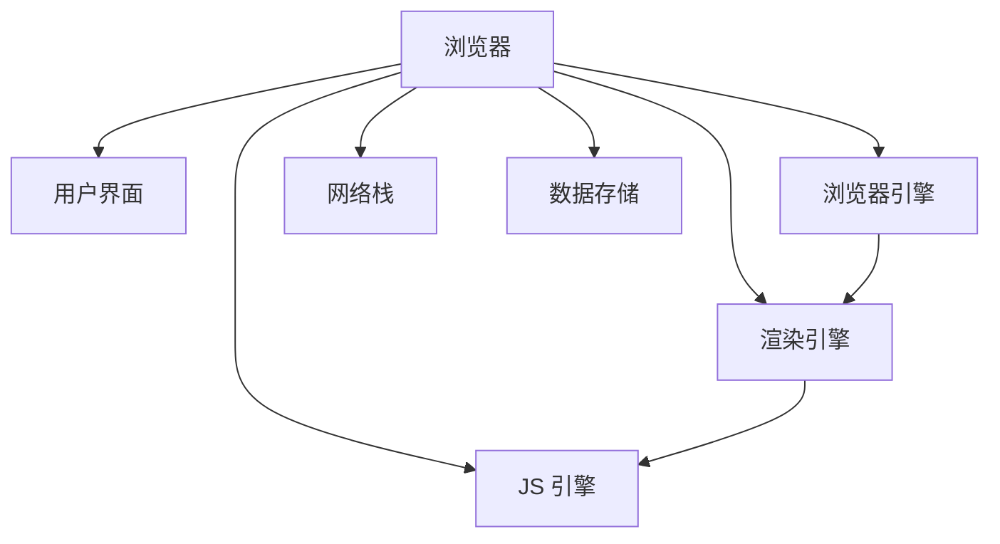
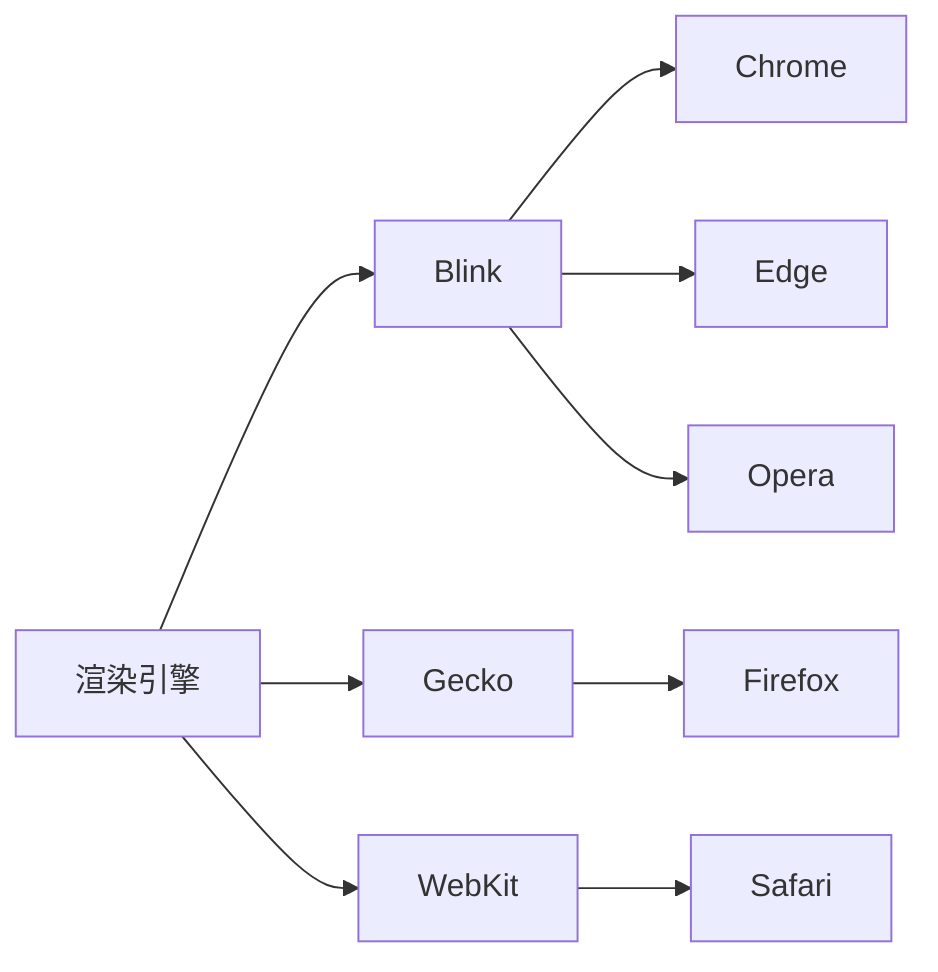
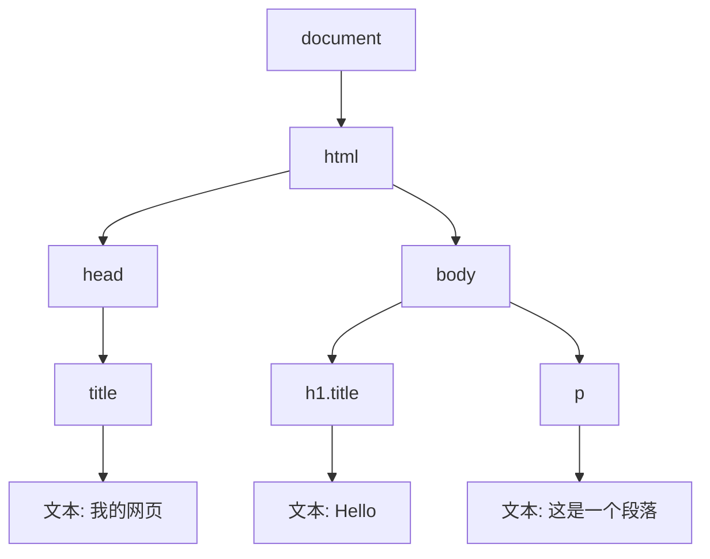
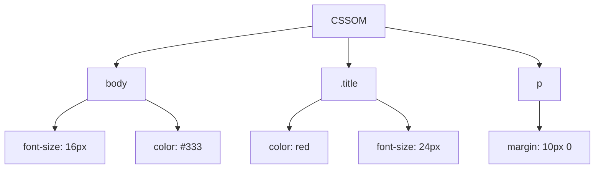
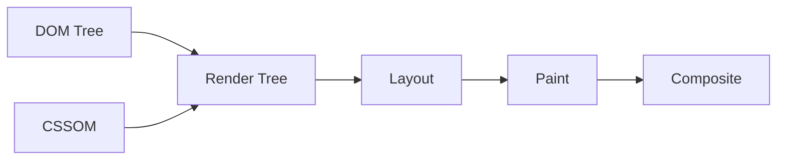
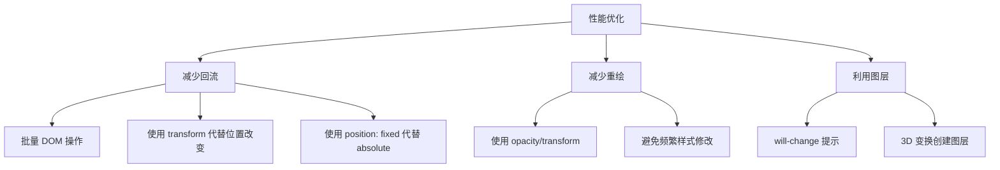

+++
title = "第 24 章 浏览器工作原理"
weight = 240
date = "2026-03-24T22:08:00+08:00"
type = "docs"
description = ""
isCJKLanguage = true
draft = false
+++
# 第 24 章 浏览器工作原理

> 打开网页时，浏览器里发生了什么？比你想象的复杂多了！

## 24.1 浏览器组成

### 用户界面 / 浏览器引擎 / 渲染引擎 / JS 引擎

你以为浏览器只是一个"显示网页"的软件？too young too simple！

浏览器其实是一个超级复杂的系统，由多个组件构成：



#### 1. 用户界面（UI）

地址栏、书签栏、前进/后退按钮、刷新按钮...都是用户界面的一部分。

#### 2. 浏览器引擎（Browser Engine）

浏览器引擎是用户界面和渲染引擎之间的"桥梁"，它负责协调两者的通信。

#### 3. 渲染引擎（Rendering Engine）

渲染引擎负责解析 HTML 和 CSS，计算布局并绘制页面。

#### 4. JS 引擎（JavaScript Engine）

JS 引擎负责执行 JavaScript 代码。

#### 5. 网络栈（Networking）

负责处理 HTTP 请求、网络图片加载等。

#### 6. 数据存储（Data Storage）

Cookie、LocalStorage、IndexedDB 等。

---

### 渲染引擎：Blink（Chrome）/ Gecko（Firefox）/ WebKit（Safari）

不同的浏览器使用不同的渲染引擎：

| 浏览器 | 渲染引擎 | JS 引擎 |
|--------|----------|---------|
| Chrome | Blink | V8 |
| Firefox | Gecko | SpiderMonkey |
| Safari | WebKit | JavaScriptCore |
| Edge（旧版） | EdgeHTML | Chakra |
| Edge（新版） | Blink | V8 |



---

### JS 引擎：V8 / SpiderMonkey / JavaScriptCore

**V8** 是 Chrome 和 Node.js 使用的 JS 引擎，由 Google 开发，是目前最流行的 JS 引擎。

```javascript
// V8 的工作原理
// 1. 解析源码生成 AST（抽象语法树）
// 2. Ignition 解释器将 AST 编译成字节码并执行
// 3. TurboFan 编译器识别热点代码，将其编译成优化机器码
// 4. 如果优化后的代码遇到类型变化，会去优化（Deoptimization）

// 热点函数会被 V8 优化
function add(a, b) {
  return a + b;
}

// 多次调用后，V8 会优化这个函数
for (let i = 0; i < 10000; i++) {
  add(1, 2);
}
```

```javascript
// 避免 V8 去优化的写法
// 1. 不要动态改变函数结构
function optimized() {
  // 保持函数结构稳定
}

// 2. 不要使用 arguments 对象（在优化函数中）
function useArgs(a, b) {
  // 避免：arguments.callee, arguments.length
}

// 3. 类型要一致
// 如果传入的类型总是相同的，V8 优化效果更好
```

> 💡 **本章小结（第24章第1节）**
> 
> 浏览器由多个组件构成：用户界面、浏览器引擎、渲染引擎、JS 引擎、网络栈、数据存储。渲染引擎负责解析 HTML/CSS 并绘制页面，主流的渲染引擎有 Blink（Chrome）、Gecko（Firefox）、WebKit（Safari）。JS 引擎负责执行 JavaScript 代码，主流的有 V8（Chrome/Node.js）、SpiderMonkey（Firefox）、JavaScriptCore（Safari）。了解这些组件有助于理解浏览器的工作方式。

---

## 24.2 渲染过程

### HTML → DOM Tree

浏览器首先解析 HTML 文档，构建 DOM 树。

```html
<!DOCTYPE html>
<html>
<head>
  <title>我的网页</title>
</head>
<body>
  <h1 class="title">Hello</h1>
  <p>这是一个段落</p>
</body>
</html>
```



```javascript
// DOM 树是由 DOM 节点组成的树形结构
// 每个 HTML 标签都是一个 DOM 节点
// 节点类型：
// - Element node (1) - HTML 标签
// - Text node (3) - 文本
// - Comment node (8) - 注释
// - Document node (9) - document 对象
```

---

### CSS → CSSOM

同时，浏览器也会解析 CSS，构建 CSSOM（CSS Object Model）。

```css
body {
  font-size: 16px;
  color: #333;
}

.title {
  color: red;
  font-size: 24px;
}

p {
  margin: 10px 0;
}
```



---

### DOM + CSSOM → Render Tree

DOM 树和 CSSOM 结合，生成 Render 树（渲染树）。



```javascript
// Render 树的特点：
// 1. 只包含可见元素（display: none 的不会包含）
// 2. 每个节点包含计算后的样式信息
// 3. 顺序与 DOM 类似，但不是完全一致
```

```javascript
// visibility: hidden vs display: none
// visibility: hidden 会显示在渲染树中，但不绘制
// display: none 完全不显示，不在渲染树中
```

---

### Layout（回流）：计算元素位置和尺寸

**Layout（布局）**，也叫 **Reflow（回流）**，是计算每个元素在屏幕上的位置和尺寸的过程。

```javascript
// 触发 Layout 的操作
// 1. 添加或删除可见元素
// 2. 元素位置/尺寸改变
// 3. 浏览器窗口大小改变
// 4. 获取某些属性（offsetWidth, offsetHeight, getComputedStyle 等）
```

```javascript
// 每次 Layout 都是昂贵的操作
// 尽量避免：
element.style.width = '100px';  // 触发 Layout
element.style.height = '200px';  // 又触发一次！

// 应该合并：
element.style.cssText = 'width: 100px; height: 200px;';  // 只触发一次
```

---

### Paint（重绘）：绘制元素外观

**Paint（绘制）**是根据 Layout 阶段计算的布局信息，把元素绘制到屏幕上的过程。

```javascript
// 触发 Paint 的操作
// 1. 颜色/背景/边框等外观改变
// 2. visibility: hidden 不触发，但 visibility: visible 会触发
// 3. 阴影、圆角等视觉效果
```

```javascript
// Layout 比 Paint 更昂贵
// Layout 一定会触发 Paint
// Paint 不一定需要 Layout
```

---

### Composite（合成）：图层合并

**Composite（合成）**阶段，浏览器将多个图层合并成最终画面。

```javascript
// 浏览器使用多层合成来优化渲染性能
// 每个图层独立绘制，然后合并

// will-change 属性提示浏览器创建独立图层
.animated-element {
  will-change: transform;  // 提示浏览器为 transform 创建独立图层
}
```

```javascript
// 图层的好处：
// 1. 动画/变换不需要触发 Layout 和 Paint
// 2. 可以利用 GPU 加速
// 3. 不影响其他图层

// 图层的坏处：
// 1. 占用更多内存
// 2. 创建图层本身也有开销
// 3. 过多图层会影响性能
```

> 💡 **本章小结（第24章第2节）**
> 
> 渲染过程是：HTML → DOM Tree，CSS → CSSOM，DOM + CSSOM → Render Tree，然后 Layout（计算布局）、Paint（绘制）、Composite（合成）。**回流（Layout）**计算位置和尺寸，**重绘（Paint）**绘制外观。回流必定触发重绘，重绘不一定回流。了解渲染过程有助于写出高性能的代码。

---

## 24.3 回流与重绘

### 触发回流的操作：元素尺寸 / 位置 / 字体大小变化

回流（Reflow/Layout）是最昂贵的操作之一，以下操作会触发回流：

```javascript
// 1. 元素尺寸变化
element.style.width = '200px';  // 宽度改变
element.style.height = '100px'; // 高度改变
element.style.padding = '20px'; // 内边距改变

// 2. 元素位置变化
element.style.margin = '10px';
element.style.top = '100px';

// 3. 字体大小变化
element.style.fontSize = '18px';

// 4. 添加或删除可见元素
document.body.appendChild(newElement);
element.remove();

// 5. 浏览器窗口大小变化
window.resizeTo(800, 600);

// 6. 获取某些属性（强迫浏览器立即计算布局）
const width = element.offsetWidth;  // 强制 Layout
const height = element.clientHeight;
const rect = element.getBoundingClientRect();
```

```javascript
// 批量操作避免多次回流
// 错误做法
element.style.left = '10px';
element.style.top = '20px';
element.style.width = '100px';

// 正确做法
element.style.cssText = 'left: 10px; top: 20px; width: 100px;';

// 或者使用 CSS 类
.element-transform {
  left: 10px;
  top: 20px;
  width: 100px;
}
element.classList.add('element-transform');
```

---

### 触发重绘的操作：颜色 / 背景等外观变化

不改变布局的外观变化只触发重绘：

```javascript
// 触发重绘但不触发回流
element.style.backgroundColor = 'red';
element.style.color = 'white';
element.style.border = '1px solid black';
element.style.visibility = 'hidden';  // visibility: hidden 触发重绘
element.style.opacity = '0.5';
element.style.boxShadow = '0 2px 4px rgba(0,0,0,0.1)';
```

---

### 回流必定触发重绘，重绘不一定回流

```javascript
// 回流 → 重绘
element.style.width = '200px';  // 回流 + 重绘

// 只有重绘
element.style.backgroundColor = 'blue';  // 只有重绘
```

---

### will-change：提示浏览器创建独立图层

`will-change` 属性告诉浏览器某个元素即将发生变化，让浏览器提前做好准备。

```css
/* 为动画元素创建独立图层 */
.animated {
  will-change: transform;
  /* 或 */
  will-change: opacity;
  /* 或多个属性 */
  will-change: transform, opacity;
}

/* 3D 变换自动创建图层 */
.uses-3d {
  transform: translateZ(0);  /* 或 perspective(1px) */
}
```

```javascript
// JavaScript 中的 will-change
element.style.willChange = 'transform';
// 动画结束后移除
element.style.willChange = 'auto';
```

```css
/* will-change 使用建议 */
/* 1. 不要滥用，只有在必要时使用 */
.bad {
  will-change: all;  /* 坏例子！创建太多图层 */
}

.good {
  will-change: transform;  /* 只声明需要的属性 */
}

/* 2. 不要太早设置 */
.early {
  will-change: transform;  /* 从页面加载就设置 */
}

/* 3. 动画结束后移除 */
.element {
  will-change: transform;
  transition: transform 0.3s;
}

.element:hover {
  transform: translateX(100px);
}
```

```javascript
// 使用 will-change 的正确姿势
// 1. 在动画开始前设置
button.addEventListener('mouseenter', () => {
  panel.style.willChange = 'height';
  panel.style.height = panel.scrollHeight + 'px';
});

// 2. 动画结束后移除
panel.addEventListener('transitionend', () => {
  panel.style.willChange = 'auto';
  panel.style.height = 'auto';
});
```



```javascript
// 实战优化技巧

// 1. 使用 transform 和 opacity 做动画（不触发 Layout 和 Paint）
// bad
element.style.left = x + 'px';
element.style.top = y + 'px';

// good
element.style.transform = `translate(${x}px, ${y}px)`;

// 2. 批量读取，批量写入
// bad
for (const elem of elements) {
  const width = elem.offsetWidth;  // 触发 Layout
  elem.style.width = (width / 2) + 'px';  // 触发 Layout + Paint
}

// good
const widths = elements.map(e => e.offsetWidth);  // 读取全部
elements.forEach((elem, i) => {
  elem.style.width = (widths[i] / 2) + 'px';  // 写入
});
```

```javascript
// 3. 使用 requestAnimationFrame
// bad
function animate() {
  element.style.left = x + 'px';
  x++;
  requestAnimationFrame(animate);
}

// good
function animate() {
  // 读取
  const computedStyle = window.getComputedStyle(element);
  const currentX = parseFloat(computedStyle.left);

  // 写入
  element.style.left = (currentX + 1) + 'px';

  requestAnimationFrame(animate);
}
```

> 💡 **本章小结（第24章第3节）**
> 
> 回流（Layout）计算元素位置和尺寸，是最昂贵的操作；重绘（Paint）只改变外观，代价较小。回流必定触发重绘，重绘不一定回流。优化性能的关键是：**尽量使用 transform/opacity 做动画**、**批量 DOM 操作**、**读写分离**、**使用 will-change 提示浏览器创建图层**。记住：**永远不要在动画帧中同时读写布局属性**！

---

## 本章小结（第24章）

### 1. 浏览器组成
- 用户界面、浏览器引擎、渲染引擎、JS 引擎、网络栈、数据存储
- 主流渲染引擎：Blink（Chrome）、Gecko（Firefox）、WebKit（Safari）
- 主流 JS 引擎：V8（Chrome）、SpiderMonkey（Firefox）、JavaScriptCore（Safari）

### 2. 渲染过程
- HTML → DOM Tree
- CSS → CSSOM
- DOM + CSSOM → Render Tree
- Layout（回流）：计算位置和尺寸
- Paint（重绘）：绘制外观
- Composite（合成）：图层合并

### 3. 回流与重绘
- 触发回流：尺寸、位置、字体变化，添加/删除可见元素，读取布局属性
- 触发重绘：颜色、背景、边框等外观变化
- 回流必定触发重绘，重绘不一定回流
- will-change 提示浏览器创建独立图层

### 性能优化口诀
```
动画用 transform 和 opacity，
批量操作少回流，
读写分离要记住，
will-change 勿滥用，
动画帧中不读布局！
```