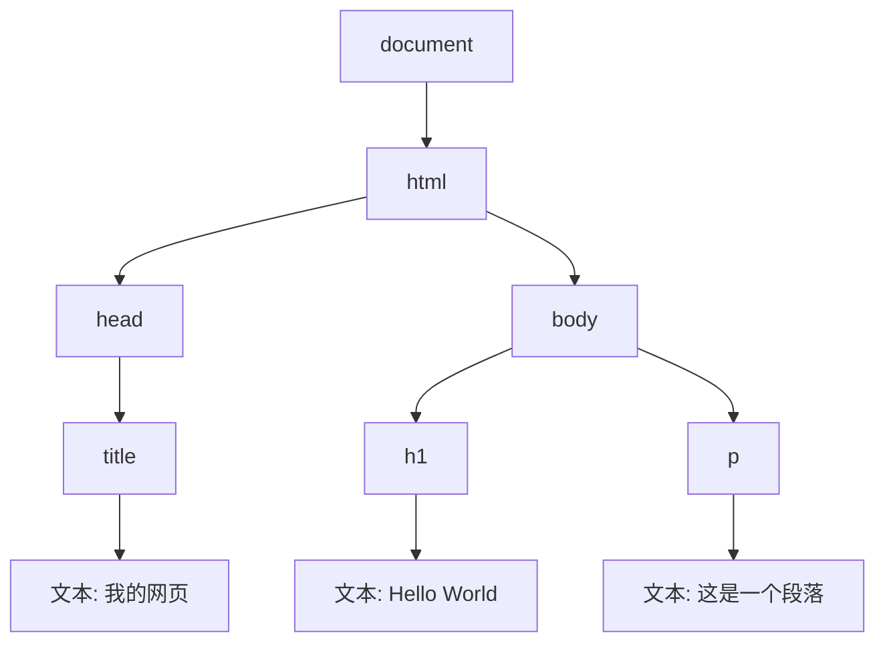
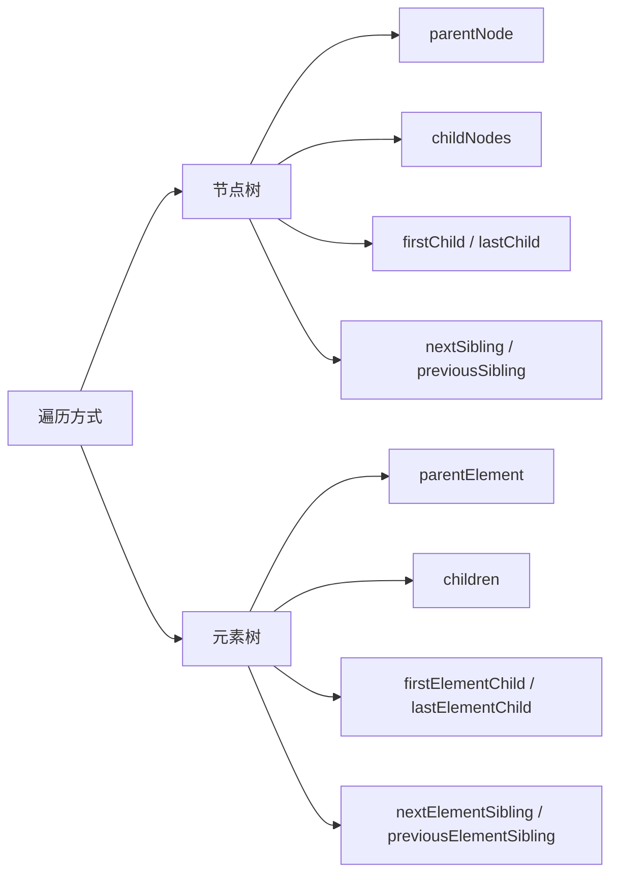

+++
title = "第 26 章 DOM 基础"
weight = 260
date = "2026-03-24T22:08:00+08:00"
type = "docs"
description = ""
isCJKLanguage = true
draft = false
+++
# 第 26 章 DOM 基础

> DOM——Document Object Model，JavaScript 操作网页的桥梁！

## 26.1 DOM 概述

### DOM（Document Object Model）：文档对象模型

**DOM** 是一种让程序访问和操作 HTML/XML 文档的接口。简单来说，DOM 就是浏览器把 HTML 文档解析成一棵树，JavaScript 可以通过这棵树来"操控"网页。

```html
<!DOCTYPE html>
<html>
<head>
  <title>我的网页</title>
</head>
<body>
  <h1>Hello World</h1>
  <p>这是一个段落</p>
</body>
</html>
```



---

### DOM Tree：树形结构，根节点是 document

```javascript
// DOM 树的基本结构
// document 是 DOM 树的根节点
console.log('根节点:', document);  // #document

// document 的父节点是 null
console.log('document.parentNode:', document.parentNode);  // null

// document.documentElement 是 <html> 元素
console.log('html元素:', document.documentElement);  // <html>...</html>

// document.body 是 <body> 元素
console.log('body元素:', document.body);  // <body>...</body>
```

---

### Node 类型：元素(1) / 属性(2) / 文本(3) / 注释(8) / document(9) / DocumentFragment(11)

DOM 规范定义了 12 种节点类型，常用的有：

| 类型 | 值 | 说明 |
|------|-----|------|
| Element | 1 | HTML 元素 |
| Attr | 2 | 属性（已废弃） |
| Text | 3 | 文本节点 |
| Comment | 8 | 注释 |
| Document | 9 | document 对象 |
| DocumentFragment | 11 | 文档片段 |

```javascript
// 检测节点类型
const element = document.createElement('div');
const textNode = document.createTextNode('Hello');
const comment = document.createComment('这是一条注释');

console.log('元素节点类型:', element.nodeType);  // 1
console.log('文本节点类型:', textNode.nodeType);  // 3
console.log('注释节点类型:', comment.nodeType);  // 8
console.log('document节点类型:', document.nodeType);  // 9
```

---

### NodeType 值

```javascript
// NodeType 的常量（Node.ELEMENT_NODE 等）
console.log('ELEMENT_NODE:', Node.ELEMENT_NODE);         // 1
console.log('TEXT_NODE:', Node.TEXT_NODE);               // 3
console.log('COMMENT_NODE:', Node.COMMENT_NODE);         // 8
console.log('DOCUMENT_NODE:', Node.DOCUMENT_NODE);       // 9
console.log('DOCUMENT_FRAGMENT_NODE:', Node.DOCUMENT_FRAGMENT_NODE);  // 11

// 使用常量判断节点类型
if (element.nodeType === Node.ELEMENT_NODE) {
  console.log('这是一个元素节点');
}
```

> 💡 **本章小结（第26章第1节）**
> 
> DOM（Document Object Model）是访问和操作 HTML/XML 文档的接口。浏览器把 HTML 解析成一棵树（DOM Tree），根节点是 `document`。树上有不同类型的节点：元素节点（1）、文本节点（3）、注释节点（8）、document 节点（9）等。每个节点都有 `nodeType` 属性标识类型。

---

## 26.2 选择元素

### getElementById：通过 ID 获取（最快，浏览器内部有索引）

```javascript
// getElementById：根据 ID 获取单个元素
// ID 在 HTML 中应该是唯一的
const header = document.getElementById('header');
console.log('header:', header);

// 如果找不到元素，返回 null
const nonExistent = document.getElementById('non-existent');
console.log('不存在的元素:', nonExistent);  // null
```

```javascript
// 注意：ID 区分大小写
// <div id="myId"> vs <div id="MyId"> 是不同的 ID
```

```javascript
// getElementById 是最高效的选择方法
// 因为浏览器内部为每个 ID 维护了索引
// 时间复杂度是 O(1)
```

---

### getElementsByClassName / getElementsByTagName：返回 HTMLCollection（动态集合）

```javascript
// getElementsByClassName：根据类名获取元素集合
const buttons = document.getElementsByClassName('btn');
console.log('按钮数量:', buttons.length);  // HTMLCollection 是动态的

// HTMLCollection 可以用索引访问
console.log('第一个按钮:', buttons[0]);

// HTMLCollection 有 namedItem 方法
// const submitBtn = buttons.namedItem('submit');
```

```javascript
// getElementsByTagName：根据标签名获取元素集合
const allDivs = document.getElementsByTagName('div');
const allLinks = document.getElementsByTagName('a');

console.log('div 数量:', allDivs.length);
console.log('链接数量:', allLinks.length);
```

```javascript
// HTMLCollection 是动态的！
// 当 DOM 变化时，集合会自动更新
const items = document.getElementsByClassName('item');

console.log('初始数量:', items.length);  // 例如：3

// 添加一个新元素
const newItem = document.createElement('div');
newItem.className = 'item';
document.body.appendChild(newItem);

console.log('添加后数量:', items.length);  // 自动变成 4！
```

```javascript
// HTMLCollection 不是数组！
// 它有 length 属性，可以用索引访问
// 但没有数组的方法（如 forEach、map 等）

const elements = document.getElementsByClassName('item');
// elements.forEach(...)  // 报错！HTMLCollection 没有 forEach

// 需要转成数组
const array = Array.from(elements);
// 或者
const array2 = [...elements];
```

---

### querySelector / querySelectorAll：CSS 选择器，返回 NodeList（多为静态）

```javascript
// querySelector：获取第一个匹配的元素
const firstButton = document.querySelector('.btn');
const submitBtn = document.querySelector('#submit-btn');
const activeLink = document.querySelector('a.active');
```

```javascript
// querySelectorAll：获取所有匹配的元素
const allButtons = document.querySelectorAll('.btn');
const allInputs = document.querySelectorAll('input[type="text"]');

// NodeList 支持 forEach
allButtons.forEach(btn => {
  console.log(btn.textContent);
});
```

```javascript
// NodeList vs HTMLCollection
// NodeList：querySelectorAll 返回，大多数是静态的
// HTMLCollection：getElementsBy* 返回，是动态的

// 注意：querySelectorAll 返回的 NodeList 在现代浏览器中大多是静态的
// 但在旧版 Firefox 中可能是动态的
```

```javascript
// NodeList 有 forEach 方法
const elements = document.querySelectorAll('div.container');
elements.forEach((el, index) => {
  console.log(`div #${index}:`, el.className);
});

// NodeList 转数组
const array = Array.from(elements);
// 或
const array2 = [...elements];
```

---

### HTMLCollection vs NodeList 对比

| 特性 | HTMLCollection | NodeList |
|------|----------------|----------|
| 来源 | getElementsBy* | querySelectorAll |
| 动态性 | 动态 | 多为静态（querySelectorAll） |
| forEach | 无 | 有 |
| 数组方法 | 无 | 部分支持（forEach） |
| namedItem | 有 | 无 |

```javascript
// HTMLCollection 示例
const htmlCollection = document.getElementsByClassName('item');

// NodeList 示例
const nodeList = document.querySelectorAll('.item');

// HTMLCollection 没有 forEach
// htmlCollection.forEach(...)  // 报错

// NodeList 有 forEach
nodeList.forEach(...)  // 正常
```

> 💡 **本章小结（第26章第2节）**
> 
> 选择元素有四种方法：`getElementById`（最快，O(1)）、`getElementsByClassName`（返回动态 HTMLCollection）、`getElementsByTagName`（返回动态 HTMLCollection）、`querySelector/querySelectorAll`（CSS 选择器，返回 NodeList）。HTMLCollection 是动态的，会随 DOM 变化自动更新；NodeList（querySelectorAll 返回的）大多是静态的。NodeList 有 `forEach`，HTMLCollection 没有。

---

## 26.3 遍历节点

### 节点树遍历：parentNode / childNodes / firstChild / lastChild / nextSibling / previousSibling

这些属性遍历所有节点（包括文本节点和注释）。

```html
<div id="container">
  <!-- 这是一个注释 -->
  <p>第一段</p>
  <p>第二段</p>
</div>
```

```javascript
const container = document.getElementById('container');

// parentNode：父节点
console.log('父节点:', container.parentNode);

// childNodes：所有子节点（文本、元素、注释等）
console.log('子节点数量:', container.childNodes.length);  // 5（空白文本、注释、空白文本、p、空白文本）

// firstChild：第一个子节点
console.log('第一个子节点:', container.firstChild);  // 可能是空白文本节点

// lastChild：最后一个子节点
console.log('最后一个子节点:', container.lastChild);  // 可能是空白文本节点

// nextSibling：下一个兄弟节点
console.log('下一个兄弟:', container.nextSibling);

// previousSibling：上一个兄弟节点
console.log('上一个兄弟:', container.previousSibling);
```

---

### 元素树遍历：parentElement / children / firstElementChild / lastElementChild / nextElementSibling / previousElementSibling

这些属性只遍历元素节点，不包括文本节点和注释。

```javascript
const container = document.getElementById('container');

// parentElement：父元素
console.log('父元素:', container.parentElement);

// children：所有子元素
console.log('子元素数量:', container.children.length);  // 2（两个 p 标签）

// firstElementChild：第一个子元素
console.log('第一个子元素:', container.firstElementChild);  // 第一个 <p>

// lastElementChild：最后一个子元素
console.log('最后一个子元素:', container.lastElementChild);  // 第二个 <p>

// nextElementSibling：下一个兄弟元素
console.log('下一个兄弟元素:', container.nextElementSibling);

// previousElementSibling：上一个兄弟元素
console.log('上一个兄弟元素:', container.previousElementSibling);
```

---

### childNodes（含文本节点）vs children（仅元素节点）对比

```javascript
const ul = document.querySelector('ul');

console.log('childNodes 数量:', ul.childNodes.length);  // 包括空白文本节点
console.log('children 数量:', ul.children.length);       // 只有元素

// 遍历 childNodes（包含所有节点）
ul.childNodes.forEach(node => {
  if (node.nodeType === Node.ELEMENT_NODE) {
    console.log('元素节点:', node.tagName);
  } else if (node.nodeType === Node.TEXT_NODE) {
    console.log('文本节点:', node.textContent.trim());
  }
});
```

---

### firstChild vs firstElementChild 对比

```html
<ul>
  <li>第一项</li>
  <li>第二项</li>
</ul>
```

```javascript
const ul = document.querySelector('ul');

// firstChild：可能是空白文本节点（因为 ul 和第一个 li 之间可能有空白）
const first = ul.firstChild;
console.log('firstChild:', first);  // 可能是 #text（空白）

// firstElementChild：一定是第一个元素
const firstElement = ul.firstElementChild;
console.log('firstElementChild:', firstElement);  // <li>第一项</li>
```



---

## 26.4 节点属性

### nodeName / nodeType / nodeValue

```javascript
// nodeName：节点名称
const div = document.createElement('div');
const text = document.createTextNode('Hello');
const comment = document.createComment('注释');

console.log('元素节点名称:', div.nodeName);    // DIV
console.log('文本节点名称:', text.nodeName);   // #text
console.log('注释节点名称:', comment.nodeName); // #comment

// 对于元素节点，nodeName 等于 tagName
console.log('tagName:', div.tagName);  // DIV
```

```javascript
// nodeType：节点类型
console.log('元素节点类型:', Node.ELEMENT_NODE);   // 1
console.log('文本节点类型:', Node.TEXT_NODE);      // 3
console.log('注释节点类型:', Node.COMMENT_NODE);   // 8
console.log('文档节点类型:', Node.DOCUMENT_NODE);  // 9
```

```javascript
// nodeValue：节点的值
// 对于文本节点，nodeValue 是文本内容
// 对于元素节点，nodeValue 是 null
const textNode = document.createTextNode('Hello World');
console.log('文本节点值:', textNode.nodeValue);  // Hello World

const elem = document.createElement('div');
console.log('元素节点值:', elem.nodeValue);  // null
```

---

### textContent：纯文本内容

```javascript
// textContent：获取或设置元素的纯文本内容
// 会忽略所有 HTML 标签

const container = document.createElement('div');
container.innerHTML = '<p>Hello <strong>World</strong></p>';

console.log('textContent:', container.textContent);  // Hello World
console.log('innerHTML:', container.innerHTML);     // <p>Hello <strong>World</strong></p>
```

```javascript
// 设置 textContent 会替换所有子节点
const div = document.createElement('div');
div.innerHTML = '<p>第一段</p><p>第二段</p>';
console.log('初始:', div.innerHTML);

div.textContent = '纯文本';
console.log('设置后:', div.innerHTML);  // 纯文本（HTML 标签被移除了）
```

```javascript
// textContent vs innerText
// textContent：获取所有文本，包括隐藏元素的文本
// innerText：只获取可见文本，会忽略 display: none 的元素

const div = document.createElement('div');
div.innerHTML = '<span style="display:none">隐藏</span>可见';
console.log('textContent:', div.textContent);  // 隐藏可见
console.log('innerText:', div.innerText);      // 可见（需要元素已在 DOM 中）
```

```javascript
// 安全考虑：使用 textContent 而不是 innerHTML 来设置用户输入
// 可以防止 XSS 攻击

function safeSetText(element, userInput) {
  element.textContent = userInput;  // 用户输入被当作纯文本
  // 如果用 innerHTML = userInput，可能导致 XSS
}
```

> 💡 **本章小结（第26章第3-4节）**
> 
> DOM 遍历有两种方式：**节点树遍历**（包括文本节点）和**元素树遍历**（只包括元素）。`childNodes` 包含空白文本节点，`children` 只有元素。`firstChild` 可能是空白文本，`firstElementChild` 一定是第一个元素。节点属性包括 `nodeName`（节点名称）、`nodeType`（节点类型）、`nodeValue`（节点值）、`textContent`（纯文本内容）。使用 `textContent` 设置用户输入更安全，可以防止 XSS。

---

## 本章小结（第26章）

### 1. DOM 概述
- DOM（Document Object Model）是访问和操作 HTML 文档的接口
- 浏览器把 HTML 解析成 DOM 树，根节点是 `document`
- 节点类型：元素(1)、文本(3)、注释(8)、document(9) 等

### 2. 选择元素
- `getElementById`：最快（O(1)），返回单个元素
- `getElementsByClassName/getElementsByTagName`：返回动态 HTMLCollection
- `querySelector/querySelectorAll`：CSS 选择器，返回 NodeList
- HTMLCollection 是动态的，NodeList（querySelectorAll）多为静态

### 3. 遍历节点
- 节点树：`parentNode`、`childNodes`、`firstChild`、`lastChild`、`nextSibling`、`previousSibling`
- 元素树：`parentElement`、`children`、`firstElementChild`、`lastElementChild`、`nextElementSibling`、`previousElementSibling`
- `childNodes` 包含空白文本节点，`children` 只有元素

### 4. 节点属性
- `nodeName`：节点名称（元素返回标签名）
- `nodeType`：节点类型（1=元素，3=文本，8=注释，9=document）
- `nodeValue`：节点值（元素为 null，文本为内容）
- `textContent`：纯文本内容

### 记忆口诀
```
DOM 是网页的树，
document 是根，
节点类型要记清，
选择元素用哪个快？
getElementById 最快，
querySelectorAll 最灵活，
遍历要用元素树，
childNodes 有文本！
```