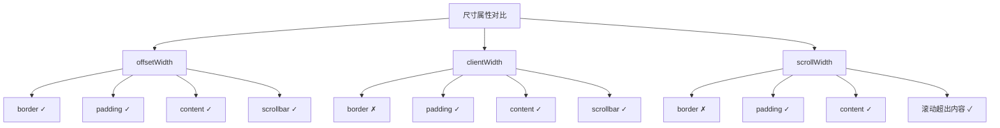

+++
title = "第 27 章 DOM 操作"
weight = 270
date = "2026-03-24T22:08:00+08:00"
type = "docs"
description = ""
isCJKLanguage = true
draft = false
+++
# 第 27 章 DOM 操作

> JavaScript 操控网页的核心技能——增删改查！

## 27.1 创建节点

### createElement：创建元素

```javascript
// 创建元素节点
const div = document.createElement('div');
div.className = 'container';
div.id = 'my-div';
div.textContent = '这是一个 div';

console.log('创建的 div:', div.outerHTML);
// <div id="my-div" class="container">这是一个 div</div>
```

```javascript
// 创建带属性的元素
const link = document.createElement('a');
link.href = 'https://example.com';
link.target = '_blank';
link.className = 'link';
link.textContent = '访问 Example';

console.log('创建的链接:', link.outerHTML);
// <a href="https://example.com" target="_blank" class="link">访问 Example</a>
```

```javascript
// 创建嵌套结构
const article = document.createElement('article');
article.className = 'blog-post';

const title = document.createElement('h2');
title.textContent = '我的博客文章';

const content = document.createElement('p');
content.textContent = '这是一段示例内容。';

article.appendChild(title);
article.appendChild(content);

console.log('完整结构:', article.outerHTML);
```

---

### createTextNode：创建文本节点

```javascript
// 创建纯文本节点（不会被解析为 HTML）
const text = document.createTextNode('<strong>粗体</strong>');
console.log('文本节点:', text.textContent);  // <strong>粗体</strong>（HTML 被转义了）
```

```javascript
// 与 innerHTML 的区别
const div1 = document.createElement('div');
div1.appendChild(document.createTextNode('<strong>粗体</strong>'));
console.log('createTextNode:', div1.innerHTML);
// &lt;strong&gt;粗体&lt;/strong&gt;（HTML 被转义了）

const div2 = document.createElement('div');
div2.innerHTML = '<strong>粗体</strong>';
console.log('innerHTML:', div2.innerHTML);
// <strong>粗体</strong>（HTML 被解析了）
```

---

### createDocumentFragment：文档片段（减少回流）

**DocumentFragment** 是一个轻量级的文档容器，添加到这个容器中的元素不会直接添加到 DOM，直到你把它添加到 DOM 中。这样可以减少回流次数。

```javascript
// 传统方法：每次 appendChild 都可能触发回流
const container = document.getElementById('container');
for (let i = 0; i < 100; i++) {
  const item = document.createElement('div');
  item.textContent = `项 ${i}`;
  container.appendChild(item);  // 触发 100 次回流！
}
```

```javascript
// 使用 DocumentFragment：只触发一次回流
const container = document.getElementById('container');
const fragment = document.createDocumentFragment();

for (let i = 0; i < 100; i++) {
  const item = document.createElement('div');
  item.textContent = `项 ${i}`;
  fragment.appendChild(item);  // 添加到 fragment，不会触发回流
}

container.appendChild(fragment);  // 一次性添加到 DOM，只触发一次回流
```

```javascript
// DocumentFragment 的特点
const fragment = document.createDocumentFragment();

// fragment 有父节点，但不在 DOM 树中
console.log('fragment 的父节点:', fragment.parentNode);  // null

// 添加到 DOM 后，fragment 变为空
fragment.appendChild(document.createElement('div'));
console.log('添加后长度:', fragment.childNodes.length);  // 1
container.appendChild(fragment);
console.log('添加到 DOM 后长度:', fragment.childNodes.length);  // 0
```

> 💡 **本章小结（第27章第1节）**
> 
> 创建节点有三种方法：`createElement` 创建元素节点，`createTextNode` 创建纯文本节点（HTML 不会被解析），`createDocumentFragment` 创建文档片段（用于减少回流）。使用 DocumentFragment 可以在添加到 DOM 之前先组装好节点，然后一次性添加，只触发一次回流。

---

## 27.2 插入与替换

### appendChild / insertBefore

```javascript
// appendChild：将节点添加到父元素的末尾
const parent = document.createElement('div');
const child = document.createElement('p');
child.textContent = '新段落';

parent.appendChild(child);
console.log('添加后:', parent.innerHTML);
// <p>新段落</p>

// 如果添加的是已存在的节点，会移动它（不是复制）
const container = document.getElementById('container');
const existingP = container.querySelector('p');
container.appendChild(existingP);  // 把已存在的 p 移到末尾
```

```javascript
// insertBefore：在指定节点前插入
const parent = document.createElement('ul');
const li1 = document.createElement('li');
li1.textContent = '第一项';
const li2 = document.createElement('li');
li2.textContent = '第二项';

parent.appendChild(li1);
parent.appendChild(li2);

// 在 li1 前插入新项
const li0 = document.createElement('li');
li0.textContent = '第零项';
parent.insertBefore(li0, li1);

console.log('insertBefore 结果:');
// <li>第零项</li>
// <li>第一项</li>
// <li>第二项</li>
```

```javascript
// insertBefore 的第二个参数为 null 时，等同于 appendChild
parent.insertBefore(newItem, null);  // 等同于 parent.appendChild(newItem)
```

---

### append / prepend / after / before（ES2017+）

ES2017 引入了更直观的新方法。

```javascript
// append：在末尾插入（可一次插入多个）
const list = document.createElement('ul');

const li1 = document.createElement('li');
li1.textContent = '第一项';
const li2 = document.createElement('li');
li2.textContent = '第二项';

list.append(li1, li2);
console.log('append 结果:', list.innerHTML);
// <ul>
//   <li>第一项</li>
//   <li>第二项</li>
// </ul>

// 也可以插入文本节点
list.append('（这是文本）');
```

```javascript
// prepend：在开头插入
const header = document.createElement('header');
const h1 = document.createElement('h1');
h1.textContent = '标题';
header.append(h1);

const nav = document.createElement('nav');
nav.textContent = '导航';
header.prepend(nav);

console.log('prepend 结果:', header.innerHTML);
// <header>
//   <nav>导航</nav>
//   <h1>标题</h1>
// </header>
```

```javascript
// after：在元素之后插入
const container = document.createElement('div');
const p = document.createElement('p');
p.textContent = '这是段落';
container.append(p);

const note = document.createElement('small');
note.textContent = '（小字说明）';
p.after(note);

console.log('after 结果:', container.innerHTML);
// <div>
//   <p>这是段落</p>
//   <small>（小字说明）</small>
// </div>
```

```javascript
// before：在元素之前插入
const section = document.createElement('section');
const h2 = document.createElement('h2');
h2.textContent = '小标题';
section.append(h2);

const hr = document.createElement('hr');
h2.before(hr);

console.log('before 结果:', section.innerHTML);
// <section>
//   <hr>
//   <h2>小标题</h2>
// </section>
```

---

### replaceWith：替换元素

```javascript
// replaceWith：用新元素替换目标元素
const oldDiv = document.createElement('div');
oldDiv.textContent = '旧 div';
const container = document.createElement('div');
container.append(oldDiv);

const newDiv = document.createElement('div');
newDiv.textContent = '新 div';
oldDiv.replaceWith(newDiv);

console.log('替换后:', container.innerHTML);
// <div>新 div</div>
```

```javascript
// replaceWith 也可以用字符串
const span = document.createElement('span');
span.textContent = '原来的 span';
const wrapper = document.createElement('div');
wrapper.append(span);

span.replaceWith('<strong>替换后的内容</strong>');
console.log('字符串替换:', wrapper.innerHTML);
// <div><strong>替换后的内容</strong></div>
```

> 💡 **本章小结（第27章第2节）**
> 
> 插入节点有多种方法：`appendChild` 添加到末尾，`insertBefore` 在指定节点前插入，`append/prepend`（ES2017+）更直观地插入到开头或末尾，`after/before` 在元素之后或之前插入，`replaceWith` 替换元素。相比 `appendChild + insertBefore`，新方法更简洁，而且 `append/prepend` 还可以一次插入多个节点。

---

## 27.3 删除与克隆

### remove / removeChild：删除元素

```javascript
// remove：直接删除元素（现代浏览器支持）
const element = document.getElementById('to-remove');
if (element) {
  element.remove();
  console.log('元素已删除');
}
```

```javascript
// removeChild：父节点删除子节点
const parent = document.getElementById('parent');
const child = document.getElementById('child');

// 删除并返回被删除的节点
const removed = parent.removeChild(child);
console.log('被删除的元素:', removed);
```

```javascript
// removeChild 需要父节点引用
// 如果只有子节点本身，可以使用 parentNode
const child = document.getElementById('child');
child.parentNode.removeChild(child);

// 或者用 remove（更简洁）
child.remove();
```

```javascript
// 删除所有子节点
const container = document.getElementById('container');

// 方法1：while 循环
while (container.firstChild) {
  container.removeChild(container.firstChild);
}

// 方法2：innerHTML
container.innerHTML = '';

// 方法3：replaceChildren（ES2022+）
container.replaceChildren();
```

---

### cloneNode：克隆（true 深克隆 / false 浅克隆）

```javascript
// cloneNode：克隆节点
const original = document.createElement('div');
original.className = 'container';
original.innerHTML = '<p>段落内容</p>';

// 浅克隆（false）：只克隆元素本身，不克隆子元素
const shallowClone = original.cloneNode(false);
console.log('浅克隆:', shallowClone.innerHTML);  // 空！子元素没被克隆

// 深克隆（true）：克隆元素及其所有后代
const deepClone = original.cloneNode(true);
console.log('深克隆:', deepClone.innerHTML);
// <p>段落内容</p>
```

```javascript
// 深克隆会复制所有属性和子节点
const source = document.createElement('article');
source.id = 'article-1';
source.className = 'blog-post';
source.innerHTML = '<h2>标题</h2><p>内容</p><footer>作者</footer>';

const copy = source.cloneNode(true);
document.body.appendChild(copy);

console.log('克隆的 id:', copy.id);  // article-1（id 被复制了！）

// 注意：如果 id 在文档中已存在，可能导致 id 冲突
```

```javascript
// 克隆事件监听器不会被复制！
const button = document.createElement('button');
button.textContent = '点击我';
button.addEventListener('click', () => {
  console.log('按钮被点击了！');
});

// 克隆按钮
const clonedButton = button.cloneNode(true);
clonedButton.textContent = '克隆的按钮';
document.body.appendChild(clonedButton);

// 原按钮点击有效，克隆的按钮点击无效（因为事件监听器没被复制）
```

```javascript
// 如果需要克隆事件，可以使用 cloneNode + 重新绑定
function deepCloneWithEvents(element) {
  const clone = element.cloneNode(true);
  // 重新绑定事件（这里需要你自己实现）
  return clone;
}

// 或者使用自定义的 clone 工具函数
```

> 💡 **本章小结（第27章第3节）**
> 
> 删除元素有两种方法：`remove`（直接删除）和 `removeChild`（父节点删除子节点，返回被删除的节点）。克隆使用 `cloneNode`，参数为 `true` 时深克隆（包含所有子节点），为 `false` 时浅克隆。注意：`cloneNode` 不会复制事件监听器！

---

## 27.4 属性操作

### getAttribute / setAttribute / removeAttribute

```javascript
// getAttribute：获取属性值
const link = document.createElement('a');
link.href = 'https://example.com';
link.title = '示例链接';

console.log('href:', link.getAttribute('href'));  // https://example.com
console.log('title:', link.getAttribute('title'));  // 示例链接

// 获取不存在的属性返回 null
console.log('target:', link.getAttribute('target'));  // null
```

```javascript
// setAttribute：设置属性
const button = document.createElement('button');
button.setAttribute('type', 'submit');
button.setAttribute('disabled', '');
button.setAttribute('data-id', '123');

console.log('button:', button.outerHTML);
// <button type="submit" disabled data-id="123"></button>
```

```javascript
// setAttribute vs 直接赋值
const input = document.createElement('input');

// setAttribute：总是设置为字符串
input.setAttribute('value', '123');
console.log('value 类型:', typeof input.value);  // string

// 直接赋值：可以是任意类型
input.value = 123;
console.log('value 类型:', typeof input.value);  // number
```

```javascript
// removeAttribute：移除属性
const div = document.createElement('div');
div.id = 'my-div';
div.className = 'container active';

div.removeAttribute('id');
console.log('移除 id 后:', div.outerHTML);
// <div class="container active"></div>
```

---

### 直接属性访问：element.id / element.src 等（href 自动转绝对路径）

```javascript
// 直接访问常见属性
const link = document.createElement('a');
link.href = '/path/to/page';  // 设置相对路径

console.log('直接访问 href:', link.href);  // 自动转换为绝对路径
// file:///path/to/page 或 https://example.com/path/to/page

console.log('getAttribute 获取的是原始值:', link.getAttribute('href'));  // /path/to/page
```

```javascript
// 常见属性访问
const img = document.createElement('img');
img.src = 'image.png';
img.alt = '图片描述';
img.className = 'thumbnail';
img.id = 'main-image';

console.log('img.src:', img.src);  // 绝对路径
console.log('img.alt:', img.alt);  // 图片描述
```

```javascript
// 属性名映射
// class → className
// for → htmlFor
// maxlength → maxLength
```

```javascript
// checked / selected / disabled 等布尔属性
const checkbox = document.createElement('input');
checkbox.type = 'checkbox';

checkbox.checked = true;
console.log('checked:', checkbox.checked);  // true

// setAttribute 设置布尔属性（值必须是空字符串或属性名）
checkbox.setAttribute('checked', '');
checkbox.removeAttribute('checked');

// 直接赋值更简洁
checkbox.checked = false;
```

---

### data-* 自定义属性：dataset

```javascript
// data-* 属性：存储自定义数据
const card = document.createElement('div');
card.className = 'card';
card.dataset.userId = '12345';
card.dataset.username = '张三';
card.dataset['product-id'] = 'PRO-001';  // 转为 data-product-id

console.log('dataset:', card.dataset);
// DOMStringMap { userId: '12345', username: '张三', productId: 'PRO-001' }

console.log('userId:', card.dataset.userId);  // 12345
console.log('productId:', card.dataset.productId);  // PRO-001
```

```javascript
// dataset 的命名规则
// data-user-name → dataset.userName
// data-userid → dataset.userid
// 短横线转为驼峰
```

```javascript
// 实际应用：事件委托中使用 data 属性
// HTML
// <div id="product-list">
//   <button data-action="add" data-product-id="1">添加</button>
//   <button data-action="delete" data-product-id="1">删除</button>
// </div>

document.getElementById('product-list').addEventListener('click', (e) => {
  const button = e.target.closest('button');
  if (!button) return;

  const { action, productId } = button.dataset;
  console.log(`动作: ${action}, 产品ID: ${productId}`);
});
```

> 💡 **本章小结（第27章第4节）**
> 
> 属性操作有三种方法：`getAttribute`/`setAttribute`/`removeAttribute`，以及直接属性访问。直接访问属性（如 `element.href`）时，`href` 会自动转换为绝对路径。`data-*` 自定义属性可以通过 `element.dataset` 对象来访问和修改，属性名会自动转为驼峰格式。

---

## 27.5 类名与样式

### className / classList：add / remove / toggle / contains / replace

```javascript
// className：获取或设置 class 属性（字符串）
const div = document.createElement('div');
div.className = 'container';
console.log('className:', div.className);  // container

div.className = 'wrapper active';
console.log('className:', div.className);  // wrapper active
```

```javascript
// classList：更方便地操作 class
const button = document.createElement('button');
button.classList.add('btn', 'btn-primary');
console.log('classList:', button.classList);  // ['btn', 'btn-primary']

// contains：检查是否有某个 class
console.log('有 btn-primary?', button.classList.contains('btn-primary'));  // true
console.log('有 btn-danger?', button.classList.contains('btn-danger'));  // false

// add：添加 class
button.classList.add('disabled');
console.log('add 后:', button.classList.value);  // btn btn-primary disabled

// remove：移除 class
button.classList.remove('disabled');
console.log('remove 后:', button.classList.value);  // btn btn-primary

// toggle：切换 class（没有就添加，有就移除）
button.classList.toggle('active');
console.log('toggle 1:', button.classList.value);  // btn btn-primary active

button.classList.toggle('active');
console.log('toggle 2:', button.classList.value);  // btn btn-primary
```

```javascript
// classList.toggle 的第二个参数（ES2021+）
// 第二个参数决定是添加还是移除，而不是根据当前状态

button.classList.toggle('disabled', true);  // 强制添加
button.classList.toggle('disabled', false);  // 强制移除

// 实际应用：根据条件设置 class
button.classList.toggle('loading', isLoading);
button.classList.toggle('error', hasError);
```

```javascript
// replace：替换 class
const header = document.createElement('header');
header.className = 'header old-style';
header.classList.replace('old-style', 'new-style');
console.log('replace 后:', header.className);  // header new-style
```

---

### element.style：行内样式

```javascript
// style：获取或设置行内样式
const div = document.createElement('div');
div.style.color = 'red';
div.style.fontSize = '16px';
div.style.backgroundColor = '#f0f0f0';

console.log('行内样式:', div.getAttribute('style'));
// color: red; font-size: 16px; background-color: #f0f0f0;
```

```javascript
// CSS 属性名转为驼峰格式
// font-size → fontSize
// background-color → backgroundColor
// border-left-width → borderLeftWidth
```

```javascript
// style 的读写
// 读取时获取的是行内样式的值（即使 CSS 中有更高优先级的样式）
div.style.color = 'blue';

// 如果想获取计算后的完整样式，使用 getComputedStyle
const computed = window.getComputedStyle(div);
console.log('计算后的 color:', computed.color);
```

```javascript
// 批量设置样式
const box = document.createElement('div');
Object.assign(box.style, {
  width: '100px',
  height: '100px',
  backgroundColor: 'blue',
  borderRadius: '10px'
});
```

---

### getComputedStyle：计算后的完整样式

```javascript
// getComputedStyle：获取元素计算后的完整样式
const div = document.createElement('div');
div.style.width = '50%';
div.style.color = 'red';

const computed = window.getComputedStyle(div);
console.log('计算后 width:', computed.width);  // 可能是 400px（根据父元素宽度）
console.log('计算后 color:', computed.color);  // rgb(255, 0, 0)
console.log('计算后 fontSize:', computed.fontSize);  // 可能有默认值
```

```javascript
// getComputedStyle 是只读的
// 第一个参数是元素
// 第二个参数是伪元素（如 ::before, ::after）
const pseudoElement = document.querySelector('.tooltip::before');
const styles = window.getComputedStyle(pseudoElement, '::before');
console.log('content:', styles.content);
```

> 💡 **本章小结（第27章第5节）**
> 
> 类名操作推荐使用 `classList`，它提供了 `add`、`remove`、`toggle`、`contains`、`replace` 等方法，比直接操作 `className` 字符串更安全。`element.style` 用于操作行内样式，CSS 属性名要转为驼峰格式。`getComputedStyle` 可以获取元素计算后的完整样式（包括 CSS 样式表中的样式），但它是只读的。

---

## 27.6 尺寸与位置

### offsetWidth / offsetHeight：border + padding + content

```javascript
// offsetWidth / offsetHeight：元素的总尺寸
// = border + padding + content

// <div style="width: 100px; padding: 10px; border: 5px solid black;">
// offsetWidth = 100 + 20 + 10 = 130
// offsetHeight 同理
```

---

### clientWidth / clientHeight：padding + content（不含 border）

```javascript
// clientWidth / clientHeight：内部尺寸
// = padding + content（不含 border 和滚动条）
```

---

### scrollWidth / scrollHeight：滚动区域尺寸

```javascript
// scrollWidth / scrollHeight：滚动内容的总尺寸
// 如果没有滚动条，等于 clientWidth / clientHeight
// 如果内容溢出，包含隐藏部分的尺寸
```

---

### offsetParent / offsetTop / offsetLeft：相对于 offsetParent 的偏移

```javascript
// offsetParent：最近的定位祖先元素
// 如果没有定位祖先，是 <body>

// offsetTop / offsetLeft：元素边框外侧到 offsetParent 边框内侧的距离
```

---

### getBoundingClientRect：元素在视口中的位置和尺寸

```javascript
// getBoundingClientRect：获取元素相对于视口的位置和尺寸
const rect = element.getBoundingClientRect();

console.log('left:', rect.left);     // 元素左边到视口左边的距离
console.log('top:', rect.top);       // 元素上边到视口上边的距离
console.log('right:', rect.right);   // 元素右边到视口左边的距离
console.log('bottom:', rect.bottom); // 元素下边到视口上边的距离
console.log('width:', rect.width);   // 元素宽度
console.log('height:', rect.height);  // 元素高度
console.log('x:', rect.x);           // x 坐标
console.log('y:', rect.y);            // y 坐标
```

```javascript
// 判断元素是否在视口内
function isInViewport(element) {
  const rect = element.getBoundingClientRect();
  return (
    rect.top >= 0 &&
    rect.left >= 0 &&
    rect.bottom <= (window.innerHeight || document.documentElement.clientHeight) &&
    rect.right <= (window.innerWidth || document.documentElement.clientWidth)
  );
}
```

---

### scrollTop / scrollLeft：滚动位置

```javascript
// scrollTop / scrollLeft：元素已滚动的距离
const container = document.getElementById('scroll-container');

// 读取滚动位置
console.log('scrollTop:', container.scrollTop);
console.log('scrollLeft:', container.scrollLeft);

// 设置滚动位置
container.scrollTop = 100;
container.scrollLeft = 50;

// 滚动到顶部
container.scrollTop = 0;

// 滚动到底部
container.scrollTop = container.scrollHeight;
```

---

### scrollTo / scrollIntoView：滚动控制

```javascript
// scrollTo：滚动到指定位置
window.scrollTo(0, 100);  // 滚动到 y=100 的位置
window.scrollTo({ top: 100, left: 0, behavior: 'smooth' });  // 平滑滚动
```

```javascript
// scrollIntoView：滚动使元素可见
const element = document.getElementById('target');

// 默认滚动
element.scrollIntoView();

// 滚动到顶部
element.scrollIntoView(true);
element.scrollIntoView({ block: 'start' });

// 滚动到底部
element.scrollIntoView(false);
element.scrollIntoView({ block: 'end' });

// 平滑滚动
element.scrollIntoView({ behavior: 'smooth' });
element.scrollIntoView({ behavior: 'smooth', block: 'center' });
```

---

### offsetWidth vs clientWidth vs scrollWidth 对比

| 属性 | content | padding | border | scrollbar | 说明 |
|------|---------|---------|--------|-----------|------|
| offsetWidth | ✓ | ✓ | ✓ | ✓ | border + padding + content + 滚动条 |
| clientWidth | ✓ | ✓ | ✗ | ✓ | padding + content |
| scrollWidth | ✓ | ✓ | ✗ | ✗ | 滚动内容的总宽度（可能超出可视区） |

```javascript
// 一图流
// +-----------------+
// | border          |
// | +-------------+ |
// | | padding      | |
// | | +---------+ | |
// | | | content | | |
// | | +---------+ | |
// | +-------------+ |
// +-----------------+
// 
// offsetWidth = border + padding + content + scrollbar
// clientWidth = padding + content（不含 border 和 scrollbar）
// scrollWidth = 内容的总宽度（可能超出可视区）
```



> 💡 **本章小结（第27章第6节）**
> 
> DOM 提供了多种尺寸和位置 API：`offsetWidth/offsetHeight` 是 border + padding + content 的总尺寸；`clientWidth/clientHeight` 是 padding + content（不含 border）；`scrollWidth/scrollHeight` 是滚动内容的总尺寸；`getBoundingClientRect` 获取元素相对于视口的位置和尺寸；`scrollTop/scrollLeft` 是已滚动的距离；`scrollTo/scrollIntoView` 用于控制滚动。了解这些 API 的区别，有助于正确获取元素尺寸和实现滚动效果。

---

## 本章小结（第27章）

### 1. 创建节点
- `createElement`：创建元素节点
- `createTextNode`：创建纯文本节点
- `createDocumentFragment`：创建文档片段，减少回流

### 2. 插入与替换
- `appendChild/insertBefore`：传统方法
- `append/prepend/after/before`：ES2017+ 更简洁
- `replaceWith`：替换元素

### 3. 删除与克隆
- `remove`：直接删除元素
- `removeChild`：父节点删除子节点
- `cloneNode(true/false)`：深克隆/浅克隆

### 4. 属性操作
- `getAttribute/setAttribute/removeAttribute`
- 直接属性访问：`element.href`（href 会转绝对路径）
- `dataset`：访问 data-* 自定义属性

### 5. 类名与样式
- `classList`：add/remove/toggle/contains/replace
- `element.style`：行内样式（驼峰命名）
- `getComputedStyle`：获取计算后的完整样式

### 6. 尺寸与位置
- `offsetWidth/offsetHeight`：border + padding + content
- `clientWidth/clientHeight`：padding + content
- `scrollWidth/scrollHeight`：滚动内容总尺寸
- `getBoundingClientRect`：相对于视口的位置
- `scrollTop/scrollLeft`：滚动位置
- `scrollTo/scrollIntoView`：滚动控制

### 记忆口诀
```
DOM 操作全搞定，
创建用 create，
插入用 append，
删除用 remove，
属性用 set/get，
类名用 classList，
样式用 style，
尺寸用 offset/client/scroll，
位置用 getBoundingClientRect！
```