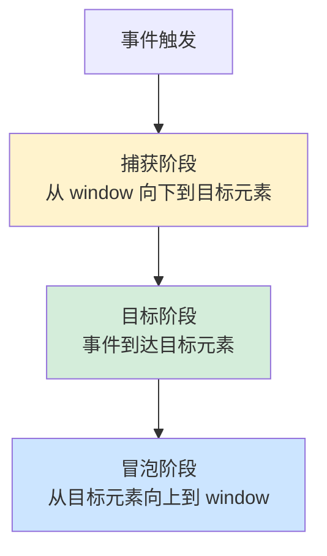

+++
title = "第 28 章 事件基础"
weight = 280
date = "2026-03-24T22:08:00+08:00"
type = "docs"
description = ""
isCJKLanguage = true
draft = false
+++
# 第 28 章 事件基础

想象一下，你在网上商城买了一件衣服，点击了"立即购买"按钮，然后...什么都没发生。你以为坏了，但其实是 JavaScript 在"等待指令"。事件就是 JavaScript 和用户之间的"对讲机"——用户做点什么（比如点击、输入、移动鼠标），JavaScript 就收到"信号"然后做出响应。

## 28.1 事件绑定

### onclick = function(){}：同类型只能绑定一个，会覆盖

`onclick` 是最古老、最简单的绑定事件的方式。但它有一个致命缺陷——**同一种事件类型只能绑定一个处理函数**。

```javascript
// 获取按钮元素
const button = document.getElementById('myButton');

// 第一次绑定
button.onclick = function() {
    console.log('第一次绑定的处理函数');
};

// 第二次绑定 —— 第一个函数被"覆盖"了！
button.onclick = function() {
    console.log('第二次绑定的处理函数');
};

button.click();
// 打印结果: 第二次绑定的处理函数（只有这一个，第一个永远不会被调用）
```

**实际案例**：假设你想让按钮点击两次后失效，用 `onclick` 实现会很麻烦。

```javascript
const button = document.getElementById('myButton');
let clickCount = 0;

button.onclick = function() {
    clickCount++;
    console.log('点击了 ' + clickCount + ' 次');
    
    if (clickCount >= 2) {
        // 想禁用，但 onclick 的问题在于...
        // 你没法"追加"处理函数，只能替换
        button.onclick = null; // 直接清空
    }
};
```

### addEventListener()：可绑定多个，不覆盖，推荐使用

`addEventListener` 是现代浏览器推荐的事件绑定方式。它最大的优点是——**可以绑定多个处理函数，它们会依次执行，不会覆盖**。

```javascript
const button = document.getElementById('myButton');

// 第一个处理函数
button.addEventListener('click', function() {
    console.log('处理函数 A');
});

// 第二个处理函数 —— 不会覆盖 A
button.addEventListener('click', function() {
    console.log('处理函数 B');
});

button.click();
// 打印结果: 处理函数 A
// 处理函数 B
```

**addEventListener 的语法**：

```javascript
// 完整语法
element.addEventListener(eventType, handler, options);

// eventType: 事件类型，如 'click'、'mouseover'（不带 on 前缀）
// handler: 处理函数
// options: 可选配置对象

// 示例
button.addEventListener('click', function(event) {
    console.log('按钮被点击了');
}, false);

// 第三个参数为 false 表示在冒泡阶段处理（默认）
```

### removeEventListener()：解绑（匿名函数无法解绑，需保存函数引用）

当你不再需要某个事件处理函数时，应该把它解绑，否则可能会造成内存泄漏和意外的 bug。

```javascript
const button = document.getElementById('myButton');

// 定义一个命名函数
function handleClick() {
    console.log('点击了一次');
    // 满足某个条件后，解除绑定
    if (clickCount >= 3) {
        button.removeEventListener('click', handleClick);
        console.log('已解除事件绑定');
    }
    clickCount++;
}

let clickCount = 0;
button.addEventListener('click', handleClick);
```

**❌ 匿名函数无法解绑**：

```javascript
// ❌ 匿名函数的问题：无法解绑
button.addEventListener('click', function() {
    console.log('匿名函数');
});

// 没有办法解绑这个函数！
// 因为你无法引用它

// ✅ 解决：使用具名函数或保存引用
const handler = function() {
    console.log('可以解绑');
};
button.addEventListener('click', handler);
button.removeEventListener('click', handler);
```

### onclick vs addEventListener 对比

| 特性 | onclick | addEventListener |
|------|---------|------------------|
| 绑定多个处理函数 | ❌ 会覆盖 | ✅ 依次执行 |
| 解绑 | ❌ 不能 | ✅ 可以 |
| 支持事件捕获 | ❌ 不支持 | ✅ 支持 |
| 支持选项配置 | ❌ 不支持 | ✅ 支持 |
| 兼容性 | IE6+ | IE9+（IE8 用 attachEvent） |

```javascript
// onclick 用法
button.onclick = function() {
    console.log('onclick 方式');
};

// addEventListener 方式
button.addEventListener('click', function() {
    console.log('addEventListener 方式');
});

// onclick 只支持冒泡阶段，addEventListener 支持捕获阶段
// 第三个参数 true 表示捕获阶段处理
button.addEventListener('click', function() {
    console.log('捕获阶段');
}, true);

// 第三个参数 false 表示冒泡阶段处理（默认）
button.addEventListener('click', function() {
    console.log('冒泡阶段');
}, false);
```

下一节，我们来学习事件对象！

## 28.2 事件对象

当事件触发时，浏览器会自动创建一个**事件对象（Event Object）**，包含了很多有用的信息，比如：触发事件的元素是什么？鼠标在哪里点击的？按了什么键？

### e.target：触发事件的元素

`target` 是触发事件的**源头元素**，也就是你实际点击的那个元素。

```javascript
// 事件委托场景：给父元素绑定事件，通过 target 判断点击了哪个子元素
const container = document.getElementById('container');

// 点击按钮、div、span 都会触发这个事件
container.addEventListener('click', function(event) {
    console.log('触发事件的元素是：', event.target);
    console.log('元素标签名：', event.target.tagName);
    console.log('元素 ID：', event.target.id);
    console.log('元素内容：', event.target.textContent);
});
```

### e.currentTarget：绑定事件的元素

`currentTarget` 是**绑定事件的元素**，也就是绑定了这个事件监听器的元素。

```javascript
// 对比 target 和 currentTarget
const parent = document.getElementById('parent');
const child = document.getElementById('child');

parent.addEventListener('click', function(event) {
    console.log('target:', event.target.id);       // 实际点击的元素
    console.log('currentTarget:', event.currentTarget.id); // 绑定事件的元素
});

child.addEventListener('click', function(event) {
    // 如果 child 也绑定了事件
    console.log('target:', event.target.id);
    console.log('currentTarget:', event.currentTarget.id);
});

// 点击 child 时：
// child 自己的监听器：target=child, currentTarget=child
// parent 的监听器：target=child, currentTarget=parent
```

### e.type：事件类型

`type` 告诉你这是什么类型的事件。

```javascript
const button = document.getElementById('myButton');

button.addEventListener('click', function(event) {
    console.log('事件类型是：', event.type); // 打印结果: click
});

button.addEventListener('mouseover', function(event) {
    console.log('事件类型是：', event.type); // 打印结果: mouseover
});

// 一个通用的日志函数
function logEvent(event) {
    console.log('事件类型: ' + event.type + ', 目标元素: ' + event.target.tagName);
}
```

### e.preventDefault()：阻止默认行为

有些元素有默认行为，比如链接会跳转、表单会提交。`preventDefault()` 可以阻止这些默认行为。

```javascript
// 阻止链接跳转
document.querySelector('a.no-follow').addEventListener('click', function(event) {
    event.preventDefault(); // 阻止跳转
    console.log('链接跳转被阻止了');
});

// 阻止表单提交
document.querySelector('form').addEventListener('submit', function(event) {
    event.preventDefault(); // 阻止提交
    console.log('表单提交被阻止了');
});

// 阻止右键菜单
document.addEventListener('contextmenu', function(event) {
    event.preventDefault();
    console.log('右键菜单被阻止了');
});

// 阻止文本选择
document.querySelector('.no-select').addEventListener('selectstart', function(event) {
    event.preventDefault();
});
```

### e.stopPropagation()：阻止冒泡

事件会从触发元素向上传播到父元素，这叫"冒泡"。`stopPropagation()` 可以阻止这个传播过程。

```javascript
const parent = document.getElementById('parent');
const child = document.getElementById('child');

parent.addEventListener('click', function() {
    console.log('parent 被点击了');
});

child.addEventListener('click', function(event) {
    console.log('child 被点击了');
    event.stopPropagation(); // 阻止事件继续向上冒泡
});

child.click();
// 打印结果: child 被点击了
// parent 的点击事件不会被触发！
```

### e.stopImmediatePropagation()：阻止后续同类型事件

如果一个元素绑定了多个同类型事件，`stopImmediatePropagation()` 不仅阻止冒泡，还会阻止后续的处理函数执行。

```javascript
const button = document.getElementById('myButton');

button.addEventListener('click', function(event) {
    console.log('处理函数 1');
});

button.addEventListener('click', function(event) {
    console.log('处理函数 2');
    event.stopImmediatePropagation(); // 不仅阻止冒泡，还阻止后续处理函数
});

button.addEventListener('click', function(event) {
    console.log('处理函数 3 —— 不会执行');
});

button.click();
// 打印结果: 处理函数 1
// 处理函数 2
// 处理函数 3 不会打印！
```

下一节，我们来学习事件流！

## 28.3 事件流

### 三个阶段：捕获阶段 → 目标阶段 → 冒泡阶段

当一个事件触发时，它会经历三个阶段：



```javascript
// 三个阶段的监听器
document.addEventListener('click', function() {
    console.log('捕获阶段 - document');
}, true); // true 表示在捕获阶段处理

window.addEventListener('click', function() {
    console.log('捕获阶段 - window');
}, true);

const button = document.getElementById('myButton');

button.addEventListener('click', function() {
    console.log('目标阶段 - button');
}, true); // 目标阶段

button.addEventListener('click', function() {
    console.log('目标阶段 - button（冒泡）');
}, false); // false 或不传表示在冒泡阶段处理

document.addEventListener('click', function() {
    console.log('冒泡阶段 - document');
}, false);
```

### 事件捕获：addEventListener 第三个参数为 true

默认情况下，事件处理在**冒泡阶段**执行。如果想在**捕获阶段**处理，第三个参数传 `true`。

```javascript
const parent = document.getElementById('parent');
const child = document.getElementById('child');

// 捕获阶段：外层先处理，内层后处理
parent.addEventListener('click', function() {
    console.log('parent 捕获阶段');
}, true);

child.addEventListener('click', function() {
    console.log('child 捕获阶段');
}, true);

child.click();
// 打印结果: parent 捕获阶段 -> child 捕获阶段
```

### 事件冒泡：默认行为，事件向上传播

**冒泡**是事件的默认行为。当子元素的事件触发时，父元素同类型的事件也会被触发。

```javascript
const outer = document.getElementById('outer');
const inner = document.getElementById('inner');

outer.addEventListener('click', function() {
    console.log('outer 冒泡');
});

inner.addEventListener('click', function() {
    console.log('inner 冒泡');
});

inner.click();
// 打印结果:
// inner 冒泡
// outer 冒泡
// 事件从内向外"冒泡"
```

### 事件委托：绑定到父元素，利用冒泡处理子元素事件

**事件委托**是一种高级技巧——把事件绑定到父元素，利用冒泡机制统一处理子元素的事件。

```javascript
// ❌ 传统方式：给每个 li 都绑定事件
document.querySelectorAll('li').forEach(function(li) {
    li.addEventListener('click', function() {
        console.log('点击了：' + this.textContent);
    });
});

// ✅ 事件委托方式：只绑定一个事件
document.querySelector('ul').addEventListener('click', function(event) {
    // event.target 是实际点击的元素
    if (event.target.tagName === 'LI') {
        console.log('点击了：' + event.target.textContent);
    }
});
```

**事件委托的优点**：

```javascript
// 1. 性能优化：减少事件绑定数量
// 假设有一个 1000 项的列表
// ❌ 传统方式：绑定 1000 个事件
// ✅ 事件委托：只绑定 1 个事件

// 2. 动态内容支持：新增的子元素自动获得事件
const list = document.getElementById('list');
list.addEventListener('click', function(event) {
    if (event.target.classList.contains('item')) {
        console.log('点击了：' + event.target.textContent);
    }
});

// 新增的 li 不用单独绑定事件
const newItem = document.createElement('li');
newItem.className = 'item';
newItem.textContent = '新项目';
list.appendChild(newItem); // 自动就有点击事件了！
```

---

## 本章小结

本章我们学习了 JavaScript 事件的基础知识：

1. **事件绑定**：`onclick` 简单但会覆盖，`addEventListener` 可绑定多个且可解绑。
2. **事件对象**：target、currentTarget、type、preventDefault、stopPropagation、stopImmediatePropagation。
3. **事件流**：三个阶段——捕获阶段、目标阶段、冒泡阶段。
4. **事件委托**：利用冒泡机制，在父元素统一处理子元素的事件，性能高且支持动态内容。

下一章，我们要学习各种具体的事件类型——鼠标事件、键盘事件、表单事件等！
