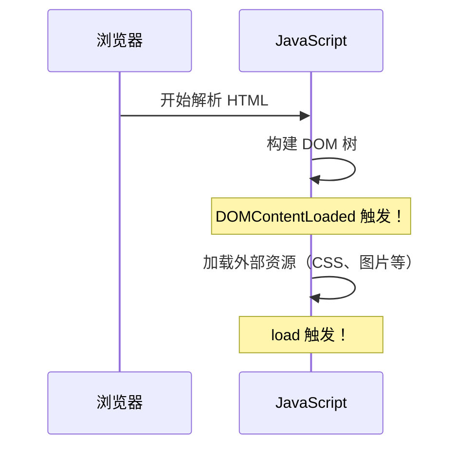

+++
title = "第 29 章 事件类型"
weight = 290
date = "2026-03-24T22:08:00+08:00"
type = "docs"
description = ""
isCJKLanguage = true
draft = false
+++
# 第 29 章 事件类型

如果说事件是 JavaScript 和用户之间的"对讲机"，那事件类型就是不同的"频道"——有的是"点击频道"，有的是"键盘频道"，有的是"表单频道"。不同的事件类型，让你响应不同的用户行为。

## 29.1 鼠标事件

### click / dblclick：单击与双击

```javascript
const button = document.getElementById('myButton');

// 单击
button.addEventListener('click', function(event) {
    console.log('单击了一次');
});

// 双击
button.addEventListener('dblclick', function(event) {
    console.log('双击了');
});
```

### mousedown / mouseup：按下与抬起

鼠标按下和抬起是两个独立的事件，可以用来区分"拖拽开始"和"拖拽结束"。

```javascript
const box = document.getElementById('box');

box.addEventListener('mousedown', function(event) {
    console.log('鼠标按下');
});

box.addEventListener('mouseup', function(event) {
    console.log('鼠标抬起');
});
```

### mousemove：鼠标移动

当鼠标在元素上移动时触发，可以用来实现"鼠标追踪"等效果。

```javascript
const area = document.getElementById('moveArea');

area.addEventListener('mousemove', function(event) {
    console.log('鼠标位置：', event.clientX, event.clientY);
});
```

### mouseenter / mouseleave：不冒泡，不重复触发

```javascript
const box = document.getElementById('box');

// mouseenter：鼠标进入元素时触发（不冒泡）
box.addEventListener('mouseenter', function(event) {
    console.log('鼠标进入了');
    this.style.backgroundColor = 'lightblue'; // 变蓝
});

// mouseleave：鼠标离开元素时触发（不冒泡）
box.addEventListener('mouseleave', function(event) {
    console.log('鼠标离开了');
    this.style.backgroundColor = '';
});
```

### mouseover / mouseout：冒泡，会重复触发

```javascript
const parent = document.getElementById('parent');
const child = document.getElementById('child');

parent.addEventListener('mouseover', function(event) {
    console.log('mouseover: 鼠标移入了', event.target.id);
});

parent.addEventListener('mouseout', function(event) {
    console.log('mouseout: 鼠标移出了', event.target.id);
});
```

### mouseenter vs mouseleave vs mouseover vs mouseout 对比

| 特性 | mouseenter | mouseleave | mouseover | mouseout |
|------|------------|------------|----------|----------|
| 是否冒泡 | ❌ 不冒泡 | ❌ 不冒泡 | ✅ 冒泡 | ✅ 冒泡 |
| 子元素影响 | 不受子元素影响 | 不受子元素影响 | 受子元素影响 | 受子元素影响 |
| 重复触发 | 离开再进入才触发 | 进入再离开才触发 | 子元素进出会重复触发 | 子元素进出会重复触发 |

```javascript
// mouseenter/mouseleave 更适合做"鼠标悬停高亮"
box.addEventListener('mouseenter', function() {
    this.style.boxShadow = '0 0 10px blue';
});
box.addEventListener('mouseleave', function() {
    this.style.boxShadow = '';
});
```

### contextmenu：右键菜单

```javascript
document.addEventListener('contextmenu', function(event) {
    event.preventDefault(); // 阻止默认右键菜单
    console.log('右键被点击了');
    console.log('位置：', event.clientX, event.clientY);
});
```

### 坐标：clientX / clientY / pageX / pageY / offsetX / offsetY / screenX / screenY

```javascript
document.addEventListener('click', function(event) {
    // 相对于视口的坐标（不包含滚动）
    console.log('clientX/Y:', event.clientX, event.clientY);
    
    // 相对于页面的坐标（包含滚动）
    console.log('pageX/Y:', event.pageX, event.pageY);
    
    // 相对于屏幕的坐标
    console.log('screenX/Y:', event.screenX, event.screenY);
    
    // 相对于元素自身的坐标
    console.log('offsetX/Y:', event.offsetX, event.offsetY);
});
```

### 拖拽元素实现

```javascript
const draggable = document.getElementById('draggable');
let isDragging = false;
let offsetX, offsetY;

draggable.addEventListener('mousedown', function(event) {
    isDragging = true;
    offsetX = event.clientX - draggable.offsetLeft;
    offsetY = event.clientY - draggable.offsetTop;
});

document.addEventListener('mousemove', function(event) {
    if (!isDragging) return;
    draggable.style.left = (event.clientX - offsetX) + 'px';
    draggable.style.top = (event.clientY - offsetY) + 'px';
});

document.addEventListener('mouseup', function() {
    isDragging = false;
});
```

下一节，我们来学习键盘事件！

## 29.2 键盘事件

### keydown / keyup / keypress（已废弃）

```javascript
// keydown：键盘按下时触发
document.addEventListener('keydown', function(event) {
    console.log('按键按下：', event.key);
});

// keyup：键盘抬起时触发
document.addEventListener('keyup', function(event) {
    console.log('按键抬起：', event.key);
});

// keypress：已废弃，不推荐使用
// 这个事件在 keydown 之后、keyup 之前触发，但已经被废弃
```

### e.key vs e.code：按键值 vs 物理键代码

```javascript
// key：返回按键的实际值（考虑大小写、语言）
// code：返回物理键代码（不考虑大小写、语言）

document.addEventListener('keydown', function(event) {
    console.log('key:', event.key);     // 'a' 或 'A'
    console.log('code:', event.code);   // 'KeyA'
});
```

### e.ctrlKey / e.shiftKey / e.altKey / e.metaKey：修饰键

```javascript
document.addEventListener('keydown', function(event) {
    // Ctrl 键
    if (event.ctrlKey) {
        console.log('Ctrl + ' + event.key);
    }
    
    // Shift 键
    if (event.shiftKey) {
        console.log('Shift + ' + event.key);
    }
    
    // Alt 键
    if (event.altKey) {
        console.log('Alt + ' + event.key);
    }
    
    // Command 键（Mac）
    if (event.metaKey) {
        console.log('Command + ' + event.key);
    }
});
```

下一节，我们来学习表单事件！

## 29.3 表单事件

### focus / blur：不冒泡

```javascript
const input = document.getElementById('myInput');

// focus：获得焦点时触发
input.addEventListener('focus', function(event) {
    console.log('输入框获得焦点');
    this.style.borderColor = 'blue';
});

// blur：失去焦点时触发
input.addEventListener('blur', function(event) {
    console.log('输入框失去焦点');
    this.style.borderColor = '';
});
```

### focusin / focusout：冒泡

```javascript
const form = document.getElementById('myForm');

// focusin：在表单内任意元素获得焦点时触发（冒泡）
form.addEventListener('focusin', function(event) {
    console.log('表单内元素获得焦点：', event.target.id);
});

// focusout：在表单内任意元素失去焦点时触发（冒泡）
form.addEventListener('focusout', function(event) {
    console.log('表单内元素失去焦点：', event.target.id);
});
```

### focus vs focusin 对比

| 特性 | focus | focusin |
|------|-------|---------|
| 是否冒泡 | ❌ 不冒泡 | ✅ 冒泡 |
| 适合场景 | 单一元素 | 表单整体 |

### input：输入时实时触发

```javascript
const input = document.getElementById('myInput');

input.addEventListener('input', function(event) {
    console.log('输入了：', this.value);
    console.log('输入内容长度：', this.value.length);
});
```

### change：值改变且失焦时触发

```javascript
const input = document.getElementById('myInput');

input.addEventListener('change', function(event) {
    console.log('值改变了：', this.value);
});
```

### submit / reset：表单提交与重置

```javascript
const form = document.getElementById('myForm');

form.addEventListener('submit', function(event) {
    event.preventDefault(); // 阻止表单提交
    console.log('表单提交了');
    console.log('表单数据：', new FormData(this));
});

form.addEventListener('reset', function(event) {
    event.preventDefault();
    console.log('表单重置了');
});
```

下一节，我们来学习资源与视图事件！

## 29.4 资源与视图事件

### load / DOMContentLoaded：资源加载完成

```javascript
// DOMContentLoaded：DOM 构建完成时触发（不等待外部资源）
document.addEventListener('DOMContentLoaded', function() {
    console.log('DOM 已加载完成');
});

// load：所有资源（包括图片、CSS等）都加载完成时触发
window.addEventListener('load', function() {
    console.log('页面所有资源都加载完成了');
});
```

### DOMContentLoaded vs load 先后顺序



### scroll：滚动（防抖优化）

```javascript
// 基本用法
window.addEventListener('scroll', function(event) {
    console.log('滚动了，当前位置：', window.scrollY);
});

// 防抖优化
function debounce(func, delay) {
    let timer = null;
    return function(...args) {
        clearTimeout(timer);
        timer = setTimeout(() => func.apply(this, args), delay);
    };
}

window.addEventListener('scroll', debounce(function() {
    console.log('滚动了（防抖）');
}, 200));
```

### resize：窗口大小改变（防抖优化）

```javascript
window.addEventListener('resize', debounce(function() {
    console.log('窗口大小改变了');
    console.log('当前尺寸：', window.innerWidth, window.innerHeight);
}, 200));
```

### error：资源加载失败

```javascript
const img = document.getElementById('myImage');

img.addEventListener('error', function(event) {
    console.log('图片加载失败了');
    this.src = 'fallback.png'; // 替换成备用图片
});
```

### visibilitychange / document.hidden：页面可见性变化

```javascript
document.addEventListener('visibilitychange', function(event) {
    if (document.hidden) {
        console.log('页面被隐藏了');
        // 停止动画、暂停视频等
    } else {
        console.log('页面可见了');
        // 恢复动画、继续视频等
    }
});
```

下一节，我们来学习自定义事件！

## 29.5 自定义事件

### new Event()：创建事件

```javascript
const myEvent = new Event('myCustomEvent', {
    bubbles: true,  // 是否冒泡
    cancelable: true // 是否可取消
});

document.addEventListener('myCustomEvent', function(event) {
    console.log('自定义事件触发了！');
});

document.dispatchEvent(myEvent);
```

### new CustomEvent()：带数据的事件

```javascript
const myEvent = new CustomEvent('userAction', {
    detail: { name: '小明', action: 'click' }
});

document.addEventListener('userAction', function(event) {
    console.log('事件名：', event.type);
    console.log('携带的数据：', event.detail);
});

document.dispatchEvent(myEvent);
```

### dispatchEvent()：触发事件

```javascript
const button = document.getElementById('myButton');

button.addEventListener('myEvent', function(event) {
    console.log('自定义事件触发了！');
});

// 触发事件
button.dispatchEvent(new Event('myEvent'));
```

下一节，我们来学习跨文档通信！

## 29.6 跨文档通信

### postMessage / message：不同源间通信

```javascript
// 发送消息
iframe.contentWindow.postMessage('Hello from parent!', 'https://example.com');

// 接收消息
window.addEventListener('message', function(event) {
    // 注意：验证 origin！
    if (event.origin !== 'https://example.com') return;
    
    console.log('收到消息：', event.data);
    console.log('来源：', event.origin);
});
```

### storage 事件：同源标签页间通信

```javascript
// 标签页 A
localStorage.setItem('message', 'Hello from tab A!');

// 标签页 B（在同一个域下）
window.addEventListener('storage', function(event) {
    console.log('key:', event.key);
    console.log('newValue:', event.newValue);
    console.log('oldValue:', event.oldValue);
});
```

---

## 本章小结

本章我们学习了各种事件类型：

1. **鼠标事件**：click、dblclick、mousedown、mouseup、mousemove、mouseenter、mouseleave、mouseover、mouseout、contextmenu。
2. **键盘事件**：keydown、keyup、keypress（废弃）、event.key vs event.code、修饰键。
3. **表单事件**：focus、blur、focusin、focusout、input、change、submit、reset。
4. **资源与视图事件**：load、DOMContentLoaded、scroll、resize、error、visibilitychange。
5. **自定义事件**：new Event()、new CustomEvent()、dispatchEvent()。
6. **跨文档通信**：postMessage、storage 事件。

下一章，我们要学习网络请求——让 JavaScript 和服务器"对话"！
