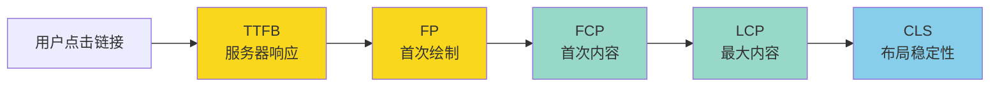
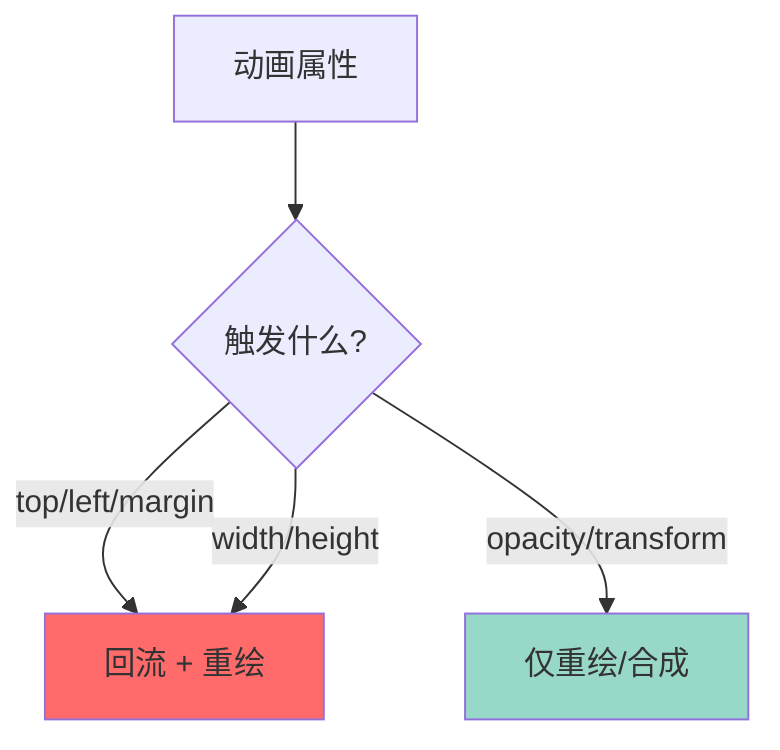
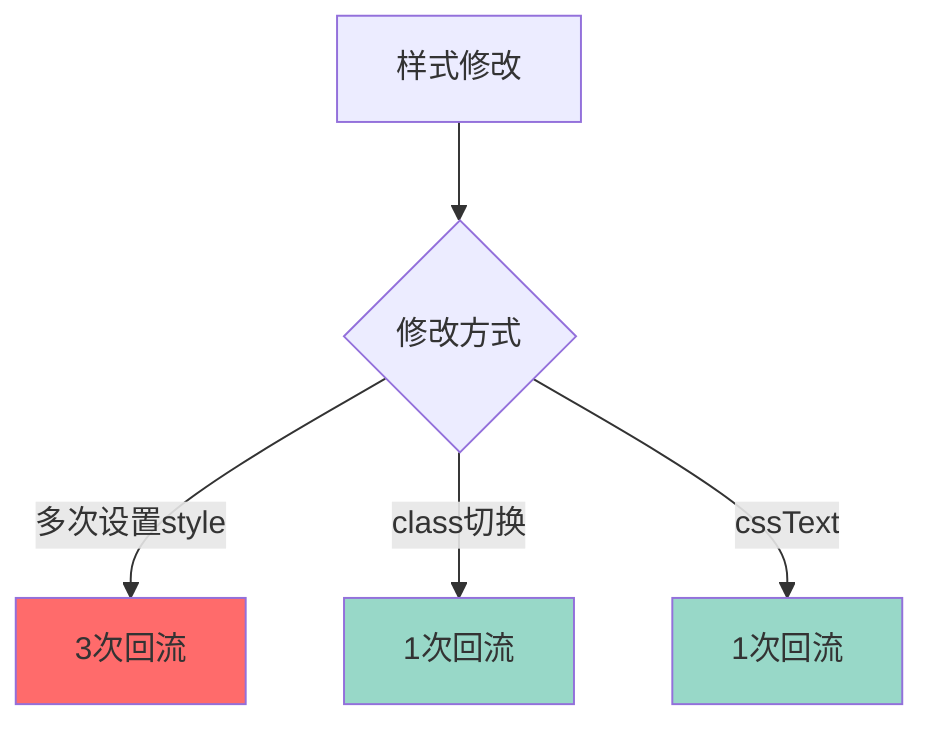
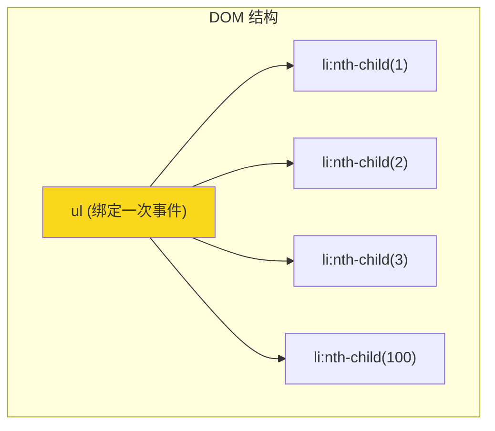
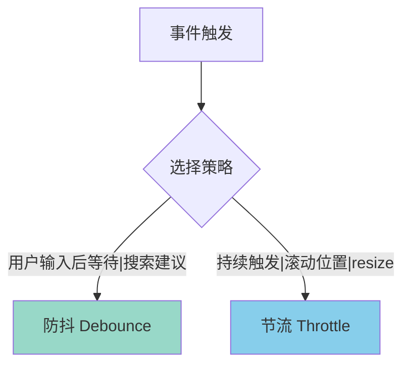
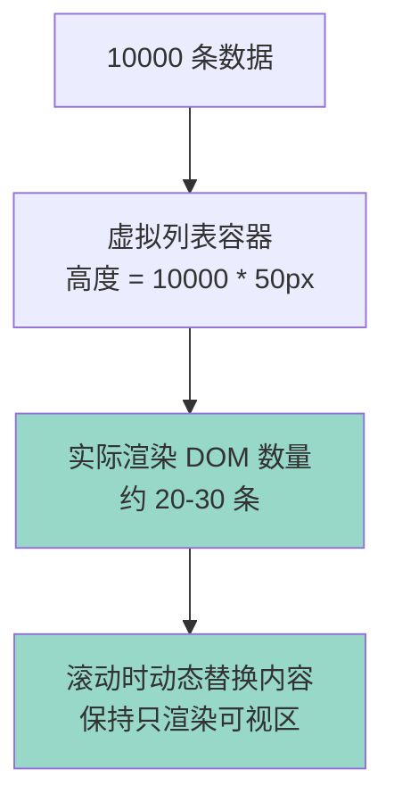
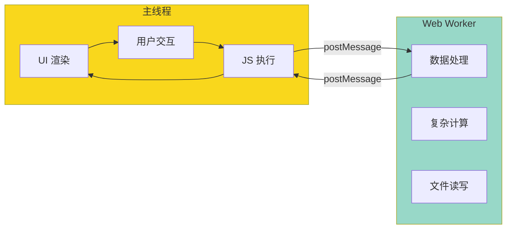
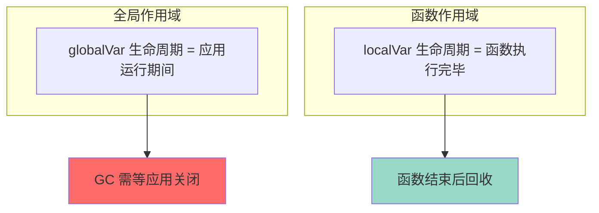

+++
title = "第 39 章 性能优化"
weight = 390
date = "2026-03-24T22:08:00+08:00"
type = "docs"
description = ""
isCJKLanguage = true
draft = false
+++
# 第 39 章 性能优化

> 网站加载慢？页面卡顿？用户等得不耐烦跑了？性能优化就是让网站"飞起来"的秘诀！让我们一起来拯救那些慢吞吞的网页吧！

## 39.1 性能指标

### 39.1.1 FP / FCP / LCP / CLS / TTFB

现代 Web 性能有五大核心指标，简称 **RAIL** 模型的延伸：

**FP（First Paint）- 首次绘制**

页面开始渲染的第一个像素，这是用户第一次看到任何东西的时刻。

```javascript
// 使用 PerformanceObserver 监听 FP
const observer = new PerformanceObserver((list) => {
  for (const entry of list.getEntries()) {
    if (entry.name === "first-paint") {
      console.log("FP:", entry.startTime, "ms");
    }
  }
});
observer.observe({ type: "paint", buffered: true });
```

**FCP（First Contentful Paint）- 首次内容绘制**

第一个内容元素（如文本、图片、SVG）出现在屏幕上的时间。

```javascript
const observer = new PerformanceObserver((list) => {
  for (const entry of list.getEntries()) {
    if (entry.name === "first-contentful-paint") {
      console.log("FCP:", entry.startTime, "ms");
    }
  }
});
observer.observe({ type: "paint", buffered: true });
```

**LCP（Largest Contentful Paint）- 最大内容绘制**

页面视口内最大可见元素（通常是图片或大段文本）渲染完成的时间。

```javascript
const observer = new PerformanceObserver((list) => {
  const entries = list.getEntries();
  const lastEntry = entries[entries.length - 1];
  console.log("LCP:", lastEntry.startTime, "ms");
  console.log("LCP 元素:", lastEntry.element);
});
observer.observe({ type: "largest-contentful-paint", buffered: true });
```

**CLS（Cumulative Layout Shift）- 累计布局偏移**

页面在加载过程中元素位置发生了多大变化。CLS 越低，用户体验越好。

```javascript
let clsValue = 0;

const observer = new PerformanceObserver((list) => {
  for (const entry of list.getEntries()) {
    // 只有不属于用户操作的布局偏移才计入
    if (!entry.hadRecentInput) {
      clsValue += entry.value;
      console.log("CLS:", clsValue);
    }
  }
});
observer.observe({ type: "layout-shift", buffered: true });
```

**TTFB（Time To First Byte）- 首字节时间**

从发起请求到收到服务器响应第一个字节的时间。

```javascript
// 通过 Navigation API 获取
const navigation = performance.getEntriesByType("navigation")[0];
console.log("TTFB:", navigation.responseStart - navigation.requestStart, "ms");

// 或者用 Resource Timing API
const resource = performance.getEntriesByType("resource")
  .filter(r => r.initiatorType === "navigation")[0];
console.log("TTFB:", resource.responseStart - resource.startTime, "ms");
```

**性能指标总结图**：



**各指标的目标值**：

| 指标 | 优秀 | 需改进 | 差 |
|------|------|--------|-----|
| FP | < 1s | 1-2s | > 2s |
| FCP | < 1.8s | 1.8-3s | > 3s |
| LCP | < 2.5s | 2.5-4s | > 4s |
| CLS | < 0.1 | 0.1-0.25 | > 0.25 |
| TTFB | < 0.8s | 0.8-1.8s | > 1.8s |

---

### 39.1.2 Lighthouse 审计工具

**Lighthouse** 是 Chrome 内置的性能审计工具，可以对页面进行全面评分。

```bash
# 通过 Chrome DevTools 使用
# 1. 打开 Chrome
# 2. 按 F12 打开 DevTools
# 3. 切换到 Lighthouse 标签
# 4. 点击 "Analyze page load"
```

```javascript
// 通过 Lighthouse CLI 使用
// 安装：npm install -g lighthouse

// 运行审计
lighthouse https://example.com --output html --output-path ./report.html

// 获取 JSON 格式结果
lighthouse https://example.com --output json --output-path ./report.json
```

```javascript
// 通过 Node.js API 使用
const lighthouse = require("lighthouse");
const chromeLauncher = require("chrome-launcher");

async function runAudit() {
  const chrome = await chromeLauncher.launch({ chromeFlags: ["--headless"] });

  const result = await lighthouse("https://example.com", {
    port: chrome.port,
    output: "json",
    categories: ["performance", "accessibility", "best-practices", "seo"]
  });

  console.log("Performance Score:", result.lhr.categories.performance.score * 100);
  console.log("Accessibility Score:", result.lhr.categories.accessibility.score * 100);

  await chrome.kill();
  return result.lhr;
}
```

**Lighthouse 评分维度**：

| 维度 | 说明 |
|------|------|
| Performance | 性能表现 |
| Accessibility | 可访问性 |
| Best Practices | 最佳实践 |
| SEO | 搜索引擎优化 |
| PWA | 渐进式 Web 应用（可选） |

**Lighthouse 报告解读**：

```javascript
// 报告中常见的优化建议
const auditResults = {
  "first-contentful-paint": {
    score: 0.85,
    displayValue: "1.6 s",
    description: "FCP 良好"
  },
  "largest-contentful-paint": {
    score: 0.78,
    displayValue: "3.2 s",
    description: "LCP 需优化"
  },
  "cumulative-layout-shift": {
    score: 0.92,
    displayValue: "0.05",
    description: "CLS 优秀"
  },
  "render-blocking-resources": {
    score: 0.45,
    displayValue: "3 elements",
    description: "存在阻塞渲染的资源"
  }
};
```

---

**本节小结**

Web 性能五大核心指标：

| 指标 | 含义 | 优化方向 |
|------|------|---------|
| FP | 首次绘制 | 减少 HTML/CSS 阻塞 |
| FCP | 首次内容绘制 | 优化关键渲染路径 |
| LCP | 最大内容绘制 | 优化图片/大文本加载 |
| CLS | 布局偏移 | 预留元素空间 |
| TTFB | 服务器响应 | 优化后端/CDN |

使用 Lighthouse 进行全面性能审计！

## 39.2 回流与重绘优化

### 39.2.1 批量 DOM 操作：DocumentFragment / 离线 DOM

**回流（Reflow）和重绘（Repaint）是性能杀手！每次修改 DOM 的几何属性都会触发回流，每次修改外观属性都会触发重绘。**

```javascript
// ❌ 低效：每次添加都触发回流
const container = document.getElementById("list");

for (let i = 0; i < 1000; i++) {
  const item = document.createElement("div");
  item.textContent = `Item ${i}`;
  container.appendChild(item); // 每次添加都可能触发回流！
}
```

**方法一：使用 DocumentFragment**

```javascript
// ✅ 高效：只触发一次回流
const container = document.getElementById("list");
const fragment = document.createDocumentFragment();

for (let i = 0; i < 1000; i++) {
  const item = document.createElement("div");
  item.textContent = `Item ${i}`;
  fragment.appendChild(item); // 先添加到 fragment，不触发布局
}

container.appendChild(fragment); // 最后一次性添加到 DOM，只触发一次回流
```

**方法二：离线 DOM 操作**

```javascript
// ✅ 高效：先从 DOM 树脱离，操作完再挂回去
const container = document.getElementById("list");

// 脱离 DOM 树
container.style.display = "none"; // 或使用 cloneNode

// 在"离线"状态下操作
const items = [];
for (let i = 0; i < 1000; i++) {
  const item = document.createElement("div");
  item.textContent = `Item ${i}`;
  items.push(item);
}
container.innerHTML = items.map(item => `<div>${item.textContent}</div>`).join("");

// 重新挂载到 DOM 树
container.style.display = "block";
```

**方法三：先读取，后写入（读写分离）**

```javascript
// ❌ 低效：交替读写，触发多次强制回流
for (const box of boxes) {
  const height = box.offsetHeight; // 读取（触发回流）
  box.style.height = height * 2 + "px"; // 写入（触发回流）
}

// ✅ 高效：批量读取，批量写入
const heights = boxes.map(box => box.offsetHeight); // 批量读取
boxes.forEach((box, i) => { // 批量写入
  box.style.height = heights[i] * 2 + "px";
});
```

---

### 39.2.2 使用 transform 替代位置属性做动画

**transform 和 opacity 是不会触发回流的属性，因为它们在合成层（compositor layer）处理！**

```javascript
// ❌ 低效：使用 top/left 动画（触发回流）
element.style.transition = "top 1s";
function animate() {
  element.style.top = currentPos + "px";
  currentPos += 5;
  requestAnimationFrame(animate);
}
```

```javascript
// ✅ 高效：使用 transform 动画（不触发回流）
element.style.transition = "transform 1s";
function animate() {
  element.style.transform = `translateX(${currentPos}px)`;
  currentPos += 5;
  requestAnimationFrame(animate);
}
```

**原理图**：



**常用不触发回流的属性**：

| 属性 | 说明 |
|------|------|
| transform | translate, scale, rotate |
| opacity | 透明度 |
| filter | 模糊、阴影等 |
| will-change | 提示浏览器创建独立图层 |

---

### 39.2.3 will-change：创建独立图层

**will-change** 告诉浏览器某个元素即将发生变化，浏览器会提前为其创建独立的合成图层。

```css
/* 优化动画性能 */
.animated-element {
  /* 提前告知浏览器这个元素会变化 */
  will-change: transform, opacity;

  /* 或者直接用 transform 触发 GPU 加速 */
  transform: translateZ(0);
}
```

```javascript
// JavaScript 动态设置
element.style.willChange = "transform";

// 动画结束后清除（避免内存浪费）
element.addEventListener("animationend", () => {
  element.style.willChange = "auto";
});
```

**注意事项**：

```css
/* 滥用 will-change 的后果 */
/* 每个图层都会占用 GPU 内存！*/

.bad-example {
  will-change: all; /* 千万不要这样！会创建大量图层，内存爆炸！ */
}
```

**最佳实践**：

```css
/* 1. 只在需要动画的元素上使用 */
.need-animate {
  will-change: transform;
}

/* 2. 动画开始前设置，结束后清除 */
@keyframes slide {
  from { transform: translateX(0); }
  to { transform: translateX(100px); }
}

.slide-element {
  will-change: transform;
  animation: slide 0.5s forwards;
}

/* 3. 合理选择属性 */
.will-change-transform { will-change: transform; }
.will-change-opacity { will-change: opacity; }
```

---

### 39.2.4 合并多次样式修改

**批量应用样式变更，减少回流次数。**

```javascript
// ❌ 低效：多次修改样式，触发多次回流
element.style.width = "100px";
element.style.height = "100px";
element.style.margin = "10px";
element.style.padding = "10px";
```

```javascript
// ✅ 方法一：使用 class
.element {
  width: 100px;
  height: 100px;
  margin: 10px;
  padding: 10px;
}

element.classList.add("element");
```

```javascript
// ✅ 方法二：使用 cssText 一次性设置
element.style.cssText = "width: 100px; height: 100px; margin: 10px; padding: 10px;";
```

```javascript
// ✅ 方法三：使用 style.setProperty（更规范）
element.style.setProperty("width", "100px");
element.style.setProperty("height", "100px");
```

```javascript
// ✅ 方法四：修改 CSS 变量
element.style.setProperty("--width", "100px");
element.style.setProperty("--height", "100px");
```

**样式修改性能对比图**：



---

**本节小结**

回流与重绘优化要点：

| 优化手段 | 说明 |
|---------|------|
| DocumentFragment | 批量添加，减少回流 |
| 离线 DOM | 先脱离再操作 |
| transform/opacity | 动画优先选择 |
| will-change | 提示创建独立图层 |
| 批量修改 | class/cssText 替代多次 style |

## 39.3 事件优化

### 39.3.1 事件委托：减少事件绑定数量

**事件委托是利用事件冒泡机制，在父元素上统一处理子元素的事件。**



**❌ 低效：为每个子元素单独绑定事件**

```javascript
// 100 个按钮，绑定 100 个事件监听器！
const buttons = document.querySelectorAll(".item button");

buttons.forEach((button, index) => {
  button.addEventListener("click", () => {
    console.log(`按钮 ${index} 被点击`);
  });
});
```

**✅ 高效：使用事件委托**

```javascript
// 只需要一个事件监听器！
const container = document.getElementById("list");

container.addEventListener("click", (event) => {
  // 检查点击的是不是按钮
  if (event.target.tagName === "BUTTON") {
    // 获取点击的元素
    const button = event.target;
    const index = button.dataset.index;
    console.log(`按钮 ${index} 被点击`);

    // 阻止事件冒泡（如果需要）
    event.stopPropagation();
  }
});
```

**事件委托的实际应用**：

```javascript
// 列表操作：添加、删除、编辑
const todoList = document.getElementById("todo-list");

todoList.addEventListener("click", (event) => {
  const target = event.target;
  const todoItem = target.closest(".todo-item");

  if (!todoItem) return;

  const todoId = todoItem.dataset.id;

  if (target.classList.contains("delete-btn")) {
    deleteTodo(todoId);
  } else if (target.classList.contains("edit-btn")) {
    editTodo(todoId);
  } else if (target.classList.contains("complete-btn")) {
    toggleComplete(todoId);
  }
});

// 动态添加的元素也自动拥有事件处理！
const newTodo = createTodoElement("新任务");
todoList.appendChild(newTodo); // 点击新元素的按钮，依然有效！
```

**事件委托的额外优势**：

```javascript
// 1. 动态元素自动拥有事件处理
//    新添加的按钮不需要单独绑定，直接生效！

// 2. 内存占用更低
//    100 个按钮 = 1 个监听器 vs 100 个监听器

// 3. 代码更简洁
//    集中管理，修改方便
```

---

### 39.3.2 防抖与节流：高频事件优化

**滚动、输入、窗口 resize 等事件触发频率很高，需要防抖或节流来减少处理次数。**

**防抖（Debounce）**：事件触发 n 秒后执行，如果 n 秒内再次触发，重新计时。

```javascript
// 防抖函数
function debounce(func, wait) {
  let timeout;

  return function(...args) {
    const context = this;

    clearTimeout(timeout);

    timeout = setTimeout(() => {
      func.apply(context, args);
    }, wait);
  };
}

// 应用：搜索输入
const searchInput = document.getElementById("search");

searchInput.addEventListener("input", debounce((event) => {
  const query = event.target.value;
  console.log("搜索:", query);
  fetchResults(query);
}, 300)); // 300ms 后才执行
```

**节流（Throttle）**：事件触发后 n 秒内只执行一次，n 秒后再触发才会执行。

```javascript
// 节流函数
function throttle(func, limit) {
  let inThrottle;

  return function(...args) {
    const context = this;

    if (!inThrottle) {
      func.apply(context, args);
      inThrottle = true;

      setTimeout(() => {
        inThrottle = false;
      }, limit);
    }
  };
}

// 应用：滚动事件
window.addEventListener("scroll", throttle(() => {
  const scrollY = window.scrollY;
  console.log("滚动位置:", scrollY);
  updateParallax(scrollY);
}, 100)); // 每 100ms 最多执行一次
```

**防抖 vs 节流对比**：



**实际应用场景**：

```javascript
// 防抖场景：搜索输入、表单验证、窗口 resize（停止后才处理）
const handleResize = debounce(() => {
  console.log("窗口大小:", window.innerWidth, window.innerHeight);
  updateLayout();
}, 300);

window.addEventListener("resize", handleResize);

// 节流场景：滚动加载、拖拽、高频计算
const handleScroll = throttle(() => {
  const scrollPercent = (window.scrollY / document.body.scrollHeight) * 100;
  updateProgressBar(scrollPercent);
}, 50);

window.addEventListener("scroll", handleScroll);

// 组合：先防抖再节流（适用于搜索 + 无限滚动）
const searchInfiniteScroll = throttle(debounce((event) => {
  const scrollTop = event.target.documentElement.scrollTop;
  const scrollHeight = event.target.documentElement.scrollHeight;
  const clientHeight = event.target.documentElement.clientHeight;

  if (scrollTop + clientHeight >= scrollHeight - 100) {
    loadMoreItems();
  }
}, 300), 200);
```

---

**本节小结**

事件优化两大法宝：

| 技术 | 原理 | 适用场景 |
|------|------|---------|
| 事件委托 | 在父元素处理子元素事件 | 列表、表格等动态内容 |
| 防抖 | 等待事件停止后执行 | 搜索输入、验证 |
| 节流 | 限制执行频率 | 滚动、resize、拖拽 |

## 39.4 加载优化

### 39.4.1 图片懒加载：IntersectionObserver

**图片懒加载可以让用户滚动到可视区域时才加载图片，大大提升首屏加载速度。**

**传统方式（已过时）**：

```javascript
// 传统方式：监听 scroll 事件，效率低
const images = document.querySelectorAll("img[data-src]");

function lazyLoad() {
  images.forEach(img => {
    const rect = img.getBoundingClientRect();
    if (rect.top < window.innerHeight) {
      img.src = img.dataset.src;
      img.removeAttribute("data-src");
    }
  });
}

window.addEventListener("scroll", lazyLoad);
```

**现代方式：IntersectionObserver**：

```javascript
// IntersectionObserver：浏览器原生 API，性能更好
const imageObserver = new IntersectionObserver((entries, observer) => {
  entries.forEach(entry => {
    if (entry.isIntersecting) {
      const img = entry.target;
      img.src = img.dataset.src;
      img.classList.remove("lazy");
      observer.unobserve(img); // 停止观察该图片
    }
  });
}, {
  root: null, // 使用视口作为根
  rootMargin: "0px 0px 200px 0px", // 提前 200px 开始加载
  threshold: 0 // 进入视口就开始加载
});

document.querySelectorAll("img.lazy").forEach(img => {
  imageObserver.observe(img);
});
```

```html
<!-- HTML 结构 -->

```

**实际应用：封装懒加载组件**：

```javascript
class LazyLoader {
  constructor(options = {}) {
    this.options = {
      root: options.root || null,
      rootMargin: options.rootMargin || "0px",
      threshold: options.threshold || 0
    };

    this.images = document.querySelectorAll("img[data-src]");
    this.observer = null;

    this.init();
  }

  init() {
    if (!("IntersectionObserver" in window)) {
      // 不支持 IntersectionObserver，回退到立即加载
      this.images.forEach(img => this.loadImage(img));
      return;
    }

    this.observer = new IntersectionObserver((entries) => {
      entries.forEach(entry => {
        if (entry.isIntersecting) {
          this.loadImage(entry.target);
          this.observer.unobserve(entry.target);
        }
      });
    }, this.options);

    this.images.forEach(img => this.observer.observe(img));
  }

  loadImage(img) {
    img.src = img.dataset.src;
    img.classList.remove("lazy");
    img.addEventListener("load", () => {
      img.classList.add("loaded");
    });
  }

  destroy() {
    if (this.observer) {
      this.observer.disconnect();
    }
  }
}

// 使用
const lazyLoader = new LazyLoader({
  rootMargin: "200px"
});
```

---

### 39.4.2 虚拟列表：只渲染可视区

**当列表有成千上万条数据时，一次性渲染所有 DOM 会非常卡顿。虚拟列表只渲染可视区域的几条数据，保持性能如飞！**

```javascript
class VirtualList {
  constructor(container, items, itemHeight = 50) {
    this.container = container;
    this.items = items;
    this.itemHeight = itemHeight;
    this.scrollTop = 0;

    this.container.style.height = `${items.length * itemHeight}px`;
    this.container.style.position = "relative";

    this.visibleCount = Math.ceil(container.clientHeight / itemHeight) + 2;
    this.render();
    this.bindEvents();
  }

  bindEvents() {
    this.container.parentElement.addEventListener("scroll", () => {
      this.scrollTop = this.container.parentElement.scrollTop;
      this.render();
    });
  }

  render() {
    // 计算可视区域的起始和结束索引
    const startIndex = Math.floor(this.scrollTop / this.itemHeight);
    const endIndex = startIndex + this.visibleCount;

    // 清空并重建可视区域
    const visibleItems = this.items.slice(startIndex, endIndex);

    this.container.innerHTML = visibleItems
      .map((item, i) => {
        const index = startIndex + i;
        const top = index * this.itemHeight;
        return `
          <div class="virtual-item" style="
            position: absolute;
            top: ${top}px;
            height: ${this.itemHeight}px;
            width: 100%;
          ">
            ${item.content}
          </div>
        `;
      })
      .join("");
  }
}

// 使用
const container = document.getElementById("list-container");
const items = Array.from({ length: 10000 }, (_, i) => ({
  content: `Item ${i + 1}`
}));

const virtualList = new VirtualList(container, items, 50);
```

**虚拟列表原理图**：



---

### 39.4.3 Web Worker：多线程计算

**JavaScript 是单线程的，长时间运行的计算会阻塞主线程，导致页面卡顿。Web Worker 让你可以在后台线程执行计算！**

```javascript
// worker.js - Web Worker 文件
self.addEventListener("message", (event) => {
  const { data } = event.data;

  // 执行复杂计算
  const result = data.map(n => {
    // 模拟耗时计算
    return Math.sqrt(n * n * n);
  });

  // 返回结果给主线程
  self.postMessage({ result });
});
```

```javascript
// 主线程使用 Web Worker
const worker = new Worker("worker.js");

worker.addEventListener("message", (event) => {
  const { result } = event.data;
  console.log("计算结果:", result);
});

// 发送数据给 Worker
worker.postMessage({
  data: [1, 2, 3, 4, 5]
});

// 关闭 Worker
worker.terminate();
```

**Web Worker 适用场景**：

```javascript
// 1. 大量数据排序
const sortWorker = new Worker("sort-worker.js");
sortWorker.postMessage({ data: largeArray });
sortWorker.addEventListener("message", ({ data }) => {
  displaySortedData(data.sortedArray);
});

// 2. 图像处理
const imageWorker = new Worker("image-worker.js");
imageWorker.postMessage({ data: pixelData, filter: "blur" });

// 3. 加密解密
const cryptoWorker = new Worker("crypto-worker.js");
cryptoWorker.postMessage({ data: sensitiveData, operation: "encrypt" });

// 4. 解析大型 JSON
const parserWorker = new Worker("json-parser-worker.js");
parserWorker.postMessage({ data: hugeJsonString });
```

**Web Worker vs 主线程对比图**：



---

**本节小结**

加载优化三大技术：

| 技术 | 说明 | 效果 |
|------|------|------|
| 图片懒加载 | 可视区外不加载 | 减少首屏请求 |
| 虚拟列表 | 只渲染可视区 | 减少 DOM 数量 |
| Web Worker | 后台线程计算 | 避免 UI 卡顿 |

## 39.5 内存优化

### 39.5.1 合理使用闭包，避免内存泄漏

**闭包是 JavaScript 的强大特性，但如果使用不当，很容易造成内存泄漏！**

**闭包内存泄漏的典型案例**：

```javascript
// ❌ 内存泄漏：闭包引用了大对象
function createHandler() {
  const largeData = new Array(1000000).fill("data"); // 占用大量内存

  // 这个事件处理器闭包引用了 largeData
  const handler = () => {
    console.log(largeData.length);
  };

  document.getElementById("btn").addEventListener("click", handler);
  // handler 引用了 largeData，只要事件监听器还在，largeData 就无法被回收！
}

createHandler();
// 即使函数执行完毕，largeData 也不会被回收，因为 handler 还引用着它！
```

**✅ 修复：及时移除事件监听器**

```javascript
function createHandler() {
  const largeData = new Array(1000000).fill("data");

  const handler = () => {
    console.log(largeData.length);
  };

  const btn = document.getElementById("btn");
  btn.addEventListener("click", handler);

  // 返回清理函数
  return () => {
    btn.removeEventListener("click", handler);
    // 现在 largeData 可以被回收了
  };
}

const cleanup = createHandler();
// 当不需要时，调用清理函数
cleanup();
```

**✅ 修复：避免闭包引用大对象**

```javascript
function createHandler() {
  const largeData = new Array(1000000).fill("data");
  const dataLength = largeData.length; // 只保存需要的数据

  const handler = () => {
    console.log(dataLength); // 只引用基本类型，不引用整个大对象
  };

  document.getElementById("btn").addEventListener("click", handler);
}
```

---

### 39.5.2 解除不需要的引用

**当对象不再需要时，手动解除引用，帮助垃圾回收器回收内存。**

```javascript
// ❌ 内存泄漏：数组持续增长
const cache = [];

function processData(data) {
  const result = heavyComputation(data);
  cache.push(result); // 缓存永远不清理，会越来越大！
  return result;
}
```

```javascript
// ✅ 方案一：限制缓存大小
const cache = [];
const MAX_CACHE_SIZE = 100;

function processData(data) {
  const result = heavyComputation(data);

  if (cache.length >= MAX_CACHE_SIZE) {
    cache.shift(); // 删除最旧的缓存
  }

  cache.push(result);
  return result;
}
```

```javascript
// ✅ 方案二：使用 Map 并定期清理
const cache = new Map();
const CACHE_TTL = 5 * 60 * 1000; // 5 分钟

function processData(key, data) {
  const cached = cache.get(key);

  if (cached && Date.now() - cached.timestamp < CACHE_TTL) {
    return cached.result;
  }

  const result = heavyComputation(data);
  cache.set(key, { result, timestamp: Date.now() });
  return result;
}

// 定期清理过期缓存
setInterval(() => {
  const now = Date.now();
  for (const [key, value] of cache) {
    if (now - value.timestamp > CACHE_TTL) {
      cache.delete(key);
    }
  }
}, 60000);
```

```javascript
// ✅ 方案三：使用 WeakMap（键为对象时自动回收）
const weakCache = new WeakMap();

function processData(obj) {
  const cached = weakCache.get(obj);

  if (cached) {
    return cached;
  }

  const result = heavyComputation(obj);
  weakCache.set(obj, result); // obj 被垃圾回收时，WeakMap 自动清除
  return result;
}
```

---

### 39.5.3 减少全局变量

**全局变量在整个应用生命周期内都不会被回收，是内存泄漏的常见原因！**

**❌ 反面教材：大量全局变量**

```javascript
// 糟糕的代码
var globalData = []; // 全局数组
var tempBuffer = new Array(10000); // 全局大数组
var userInfo = null; // 全局用户信息

function processData() {
  globalData.push({ /* ... */ });
  tempBuffer = new Array(20000); // 旧数组无法回收！
}

function updateUser() {
  userInfo = fetchUser(); // 旧对象无法回收！
}
```

**✅ 正确做法：使用模块模式或局部变量**

```javascript
// 方式一：IIFE 模块模式
const UserModule = (function() {
  // 私有变量（不污染全局）
  let userInfo = null;
  const tempBuffer = [];

  function processData() {
    // 使用局部变量
    const result = heavyComputation();
    return result;
  }

  function updateUser(newInfo) {
    userInfo = newInfo;
    return userInfo;
  }

  // 公开 API
  return {
    updateUser,
    getUser: () => userInfo
  };
})();
```

```javascript
// 方式二：ES6 模块
// userModule.js
let userInfo = null;

export function updateUser(newInfo) {
  userInfo = newInfo;
}

export function getUser() {
  return userInfo;
}
```

```javascript
// 方式三：及时清理
function processData() {
  const largeData = new Array(100000).fill("data");
  const result = process(largeData);

  // 用完立即清理
  largeData.length = 0;
  return result;
}
```

**全局变量 vs 局部变量对比图**：



**常见内存泄漏场景与修复**：

| 场景 | 问题 | 修复方法 |
|------|------|---------|
| 全局变量 | 永不释放 | 使用 let/const、模块模式 |
| 闭包引用大对象 | 无法回收 | 移除不必要的引用 |
| 事件监听器未移除 | DOM 对象无法回收 | 及时 removeEventListener |
| setInterval 未清除 | 内部变量无法回收 | clearInterval |
| 缓存无限制增长 | 内存持续增加 | LRU 缓存、WeakMap |

---

**本章小结**

性能优化是一个系统工程：

| 优化方向 | 具体措施 |
|---------|---------|
| 加载优化 | 懒加载、虚拟列表、Web Worker |
| 渲染优化 | 减少回流/重绘、transform 动画 |
| 事件优化 | 事件委托、防抖节流 |
| 内存优化 | 避免闭包泄漏、解除引用、减少全局变量 |

**性能优化没有银弹，需要根据实际场景选择合适的方案！**

