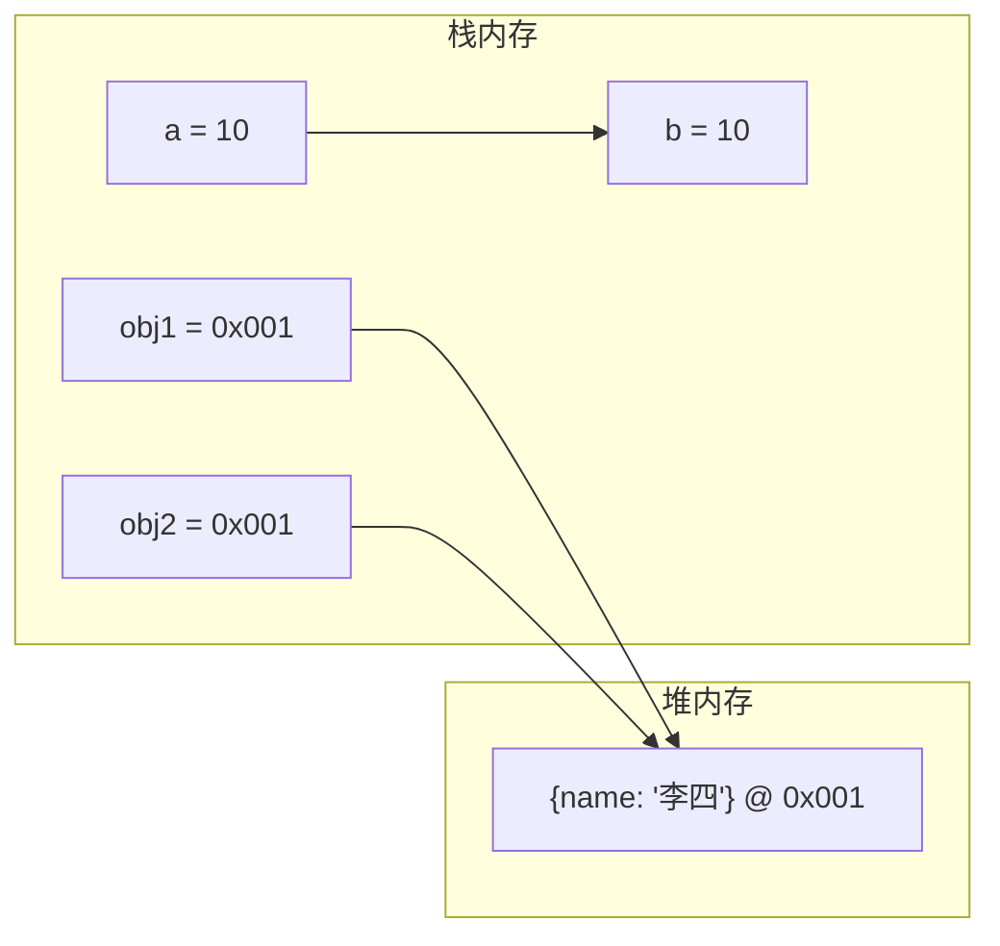

+++
title = "第 3 章 变量与数据类型"
weight = 30
date = "2026-03-24T22:08:00+08:00"
type = "docs"
description = ""
isCJKLanguage = true
draft = false
+++
# 第 3 章 变量与数据类型

如果说 JavaScript 是一门语言，那变量就是它的「词汇」，数据类型就是它的「语法」。不懂变量和数据类型，就等于不懂 JavaScript。这一章，我们来把这两件事彻底搞清楚。

## 3.1 变量声明

### var：函数作用域，存在变量提升

在 ES6 之前，JavaScript 只有 `var` 一种方式声明变量。虽然现在我们更推荐 `let` 和 `const`，但理解 `var` 能帮助你理解 JavaScript 的历史遗留问题。

```javascript
var name = "JavaScript";
console.log(name); // JavaScript
```

`var` 的特点：

#### 函数作用域

`var` 声明的变量是函数级别的作用域，不是块级作用域。

```javascript
function test() {
    if (true) {
        var message = "我是 var 声明的";
        console.log("在 if 里面：", message); // 在 if 里面：我是 var 声明的
    }
    console.log("在 if 外面：", message); // 在 if 外面：我是 var 声明的（居然还能访问！）
}
test();
```

```javascript
// 对比 let（块级作用域）
function testLet() {
    if (true) {
        let message = "我是 let 声明的";
        console.log("在 if 里面：", message); // 在 if 里面：我是 let 声明的
    }
    // console.log("在 if 外面：", message); // ReferenceError! let 有块级作用域
}
testLet();
```

#### 变量提升

`var` 声明的变量会被「提升」到函数或脚本的顶部，但赋值不会提升。

```javascript
// 变量提升的原理
console.log(hoistedVar); // undefined（声明提升了，赋值没有）
var hoistedVar = "我被提升了";

// 实际上 JavaScript 引擎是这样解析的：
var hoistedVar; // 提升声明
console.log(hoistedVar); // undefined
hoistedVar = "我被提升了"; // 赋值留在原位
```

```javascript
// 函数声明也会提升
sayHello(); // "你好！"
function sayHello() {
    console.log("你好！");
}

// 但函数表达式不会正确提升
// sayWorld(); // TypeError! sayWorld 不是函数
var sayWorld = function() {
    console.log("你好，世界！");
};
```

#### 可重复声明

`var` 允许重复声明，后面的会覆盖前面的。

```javascript
var name = "张三";
var name = "李四"; // 合法！后面的覆盖前面的
console.log(name); // 李四

// 另一个例子
var count = 0;
var count = count + 10; // count 变成 10
console.log(count); // 10
```

### let：块级作用域，不提升，存在暂时性死区

`let` 是 ES6 引入的，是更现代、更安全的变量声明方式。

```javascript
let score = 100;
console.log(score); // 100
```

`let` 的特点：

#### 块级作用域

`let` 声明的变量只在当前代码块内有效。

```javascript
if (true) {
    let blockVar = "我在块里面";
    console.log(blockVar); // 我在块里面
}
// console.log(blockVar); // ReferenceError! 出了块就不认识了
```

```javascript
// for 循环中的 let
for (let i = 0; i < 3; i++) {
    console.log("循环第" + i + "次");
}
// console.log(i); // ReferenceError! i 只在 for 循环内有效
```

#### 不提升，但存在暂时性死区（Temporal Dead Zone）

`let` 确实也有提升，但提升后不能访问——从变量声明到初始化之间有一段「死区」，这段时间访问变量会报错。

```javascript
// console.log(letVar); // ReferenceError! 在声明前访问
let letVar = "我能用了";
console.log(letVar); // 我能用了
```

```javascript
// 暂时性死区的典型陷阱
let x = 1;
{
    // 这个块里面，x 被重新声明了
    // 从这里开始到 let x 的声明，是 x 的暂时性死区
    console.log(x); // ReferenceError! x 还没有初始化！
    let x = 2; // 这里才是声明
}
```

> 暂时性死区（TDZ）的意义：让代码更可预测。在 `let` 声明之前，你永远不应该访问这个变量——因为它「不存在」。

#### 不能重复声明

`let` 不允许在同一作用域内重复声明同一个变量。

```javascript
let name = "张三";
// let name = "李四"; // SyntaxError! 不能重复声明
```

### const：块级作用域，声明时必须赋值，引用地址不可变

`const` 同样是 ES6 引入的，用于声明常量。

```javascript
const PI = 3.14159;
console.log(PI); // 3.14159
```

`const` 的特点：

#### 声明时必须赋值

`const` 必须在声明时就给出初始值。

```javascript
const PI = 3.14159; // OK
// const E; // SyntaxError! const 必须有初始值
```

#### 块级作用域

跟 `let` 一样，`const` 也是块级作用域。

```javascript
if (true) {
    const CONSTANT = "我是常量";
    console.log(CONSTANT); // 我是常量
}
// console.log(CONSTANT); // ReferenceError!
```

#### 引用地址不可变

`const` 保证的是变量**指向的内存地址**不变，不是**值**不变。

```javascript
const PI = 3.14159;
PI = 3.14; // TypeError! 不能给常量重新赋值
```

但对于对象和数组，地址不变不代表内容不能变：

```javascript
// 对象：可以修改属性，但不能重新赋值
const person = { name: "张三", age: 25 };

person.name = "李四"; // OK！修改属性是允许的
console.log(person); // {name: "李四", age: 25}

person = { name: "王五" }; // TypeError! 不能重新赋值给 const 变量
```

```javascript
// 数组：可以添加/删除元素，但不能重新赋值
const fruits = ["苹果", "香蕉"];

fruits.push("橙子"); // OK！添加元素
console.log(fruits); // ["苹果", "香蕉", "橙子"]

fruits[0] = "葡萄"; // OK！修改元素
console.log(fruits); // ["葡萄", "香蕉", "橙子"]

fruits = ["西瓜"]; // TypeError! 不能重新赋值
```

```javascript
// 如果真的想冻结对象/数组，使用 Object.freeze
const frozenPerson = Object.freeze({ name: "张三", age: 25 });
frozenPerson.name = "李四"; // 严格模式下会报错，非严格模式下静默失败
console.log(frozenPerson); // {name: "张三", age: 25}
```

### let 与 const 的经验法则

```javascript
// 经验法则：能用 const 就用 const，不行就用 let，尽量别用 var

// 1. 默认用 const（值不会变）
const APP_NAME = "我的应用";
const PI = 3.14159;
const MAX_COUNT = 100;

// 2. 需要重新赋值用 let（值会变）
let count = 0;
count++; // OK！

let userName = "张三";
userName = "李四"; // OK！

// 3. 循环计数器用 let（每次迭代都是新变量）
for (let i = 0; i < 5; i++) {
    console.log(i); // 0, 1, 2, 3, 4
}

// 4. 需要函数级别作用域时... 还是用 let 吧，别用 var
// var 已经过时了，现代 JavaScript 中没有用 var 的理由
```

```javascript
// 实际项目中的选择
// const 用于配置、 常量、不变的对象
const CONFIG = {
    apiUrl: "https://api.example.com",
    timeout: 5000,
    maxRetries: 3
};

const REDIRECT_ROUTES = ["/login", "/register", "/home"];

// let 用于会变化的值
let userCount = 0;
let isLoading = false;
let currentPage = 1;

// 当你需要用 var 的"特性"时（函数作用域、变量提升），
// 通常意味着你的代码设计有问题，应该用函数或闭包解决
```

### var 的变量提升

JavaScript 引擎在执行代码前，会先「扫描」一遍代码，把 `var` 声明和函数声明提升到当前作用域的顶部。

```javascript
// 示例 1：变量提升
console.log(a); // undefined
var a = 1;
console.log(a); // 1

// 引擎实际解析顺序：
var a;        // 提升声明
console.log(a); // undefined
a = 1;       // 赋值留在原位
console.log(a); // 1
```

```javascript
// 示例 2：函数声明提升（提升到 var 之后）
console.log(myFunc()); // "hello"
function myFunc() {
    return "hello";
}

// 引擎实际解析顺序：
function myFunc() {
    return "hello";
}
console.log(myFunc()); // "hello"
```

```javascript
// 示例 3：var 覆盖函数声明
var myVar = "变量";
function myVar() {
    return "函数";
}
console.log(typeof myVar); // "string"（变量覆盖了函数声明）

// 引擎实际解析顺序：
function myVar() {  // 函数声明提升
    return "函数";
}
var myVar;         // var 声明提升，但不会覆盖函数
myVar = "变量";    // 赋值执行，变量变成字符串
console.log(typeof myVar); // "string"
```

```javascript
// 示例 4：提升导致的有趣现象
var name = "全局";

function test() {
    console.log(name); // undefined（不是"全局"！）
    var name = "局部";
    console.log(name); // "局部"
}
test();

// 引擎实际解析顺序：
function test() {
    var name;         // 函数内的 var 提升到函数顶部
    console.log(name); // undefined
    name = "局部";
    console.log(name); // "局部"
}
```

### 暂时性死区（Temporal Dead Zone）

`let` 和 `const` 在声明前访问会直接报错，而不是像 `var` 那样返回 `undefined`。

```javascript
// var 的"优雅"
console.log(notHoisted); // undefined（不报错，但值是 undefined）
var notHoisted = "我在下面";
```

```javascript
// let/const 的"严格"
console.log(deadZone); // ReferenceError!
let deadZone = "我来了";
```

```javascript
// 暂时性死区的典型场景
function test(value) {
    // 在这个函数体内，value 已经是参数值了
    // 但下面的代码如果也声明了 value，就会产生 TDZ

    // console.log(value); // 如果参数名和内部 let 同名，这里会报错！

    // 实际项目中，这种写法很少见，但一旦出现很难调试
}
test(42);
```

```javascript
// typeof 也不是绝对安全的（对于 let/const）
// 以前：typeof 曾经是"安全"的，因为对未声明变量返回 undefined
typeof undefinedVar; // "undefined"（不会报错）

// 现在：let/const 在 TDZ 内 typeof 会报错
// if (typeof someLetVar === "undefined") { // ReferenceError!
//     let someLetVar = "我在 TDZ 里";
// }
```

### 重复声明：var 可重复，let/const 不行

```javascript
// var：重复声明完全合法
var name = "张三";
var name = "李四"; // OK
var name = "王五"; // 还是 OK
console.log(name); // "王五"
```

```javascript
// let/const：重复声明直接报错
let age = 25;
// let age = 30; // SyntaxError: Identifier 'age' has already been declared

const PI = 3.14;
// const PI = 3.14159; // SyntaxError: Identifier 'PI' has already been declared
```

```javascript
// 隐藏的重复声明陷阱
var count = 10;
// 下面的代码看起来是给 count 赋值，实际上在严格模式下会报错
// function foo() {
//     console.log(count); // ReferenceError!
//     let count = 20;
// }
```

### 变量命名规范

好的变量名是代码可读性的关键。

```javascript
// ✅ 好的命名
let userName = "张三";           // 驼峰命名法
let isLoggedIn = true;           // 布尔值用 is/has/can 前缀
let totalPrice = 99.99;          // 描述性名词
const MAX_RETRY_COUNT = 3;       // 常量全大写+下划线

// ❌ 糟糕的命名
let a = "张三";                  // 毫无意义
let data = 123;                  // 太泛
let temp = "临时值";              // 临时用还可以，长期变量名不行
let num1, num2, num3;           // 序号命名通常是数组/循环的前兆
```

```javascript
// 命名规范总结
// 1. 变量名：名词，驼峰命名
let firstName = "John";
let userAge = 25;
let productList = [];

// 2. 函数名：动词或动词短语，驼峰命名
function getUserInfo() {}
function calculateTotal() {}
function isEmpty() {}
function handleClick() {}

// 3. 常量：全大写+下划线
const MAX_WIDTH = 1920;
const API_BASE_URL = "https://api.example.com";

// 4. 类名：名词，首字母大写（帕斯卡命名）
class UserAccount {}
class ShoppingCart {}

// 5. 私有变量（约定）：下划线前缀
class User {
    constructor() {
        this._password = "secret"; // 约定：这是私有变量
    }
}
```

```javascript
// JavaScript 保留关键字（不能用作变量名）
// break, case, catch, continue, debugger, default, delete, do,
// else, export, extends, finally, for, function, if, import, in,
// instanceof, new, return, super, switch, this, throw, try,
// typeof, var, void, while, with, yield

// ES6 新增：class, const, let, static
// ES6 严格模式保留字：implements, interface, package, private, protected, public

```

## 3.2 数据类型

JavaScript 的数据类型分为两大类：**原始类型**（基本类型）和**引用类型**。理解它们的区别，是理解 JavaScript 的关键。

### JavaScript 的数据类型概述

JavaScript 是一种**动态类型语言**——变量本身没有类型，值才有类型。你可以在任何时候给变量赋任何类型的值。

```javascript
let dynamic = "我是一个字符串";
console.log(typeof dynamic); // "string"

dynamic = 42; // 从字符串变成数字，完全合法！
console.log(typeof dynamic); // "number"

dynamic = true; // 又变成布尔值
console.log(typeof dynamic); // "boolean"

dynamic = null; // 空值
console.log(typeof dynamic); // "object"（历史遗留问题）

dynamic = undefined; // 未定义
console.log(typeof dynamic); // "undefined"

dynamic = { name: "对象" }; // 对象
console.log(typeof dynamic); // "object"

dynamic = [1, 2, 3]; // 数组
console.log(typeof dynamic); // "object"（数组也是对象）

dynamic = function() {}; // 函数
console.log(typeof dynamic); // "function"
```

JavaScript 共有 **7 种原始类型**和 **1 种引用类型**：

| 类型 | typeof 返回值 | 示例 |
|------|-------------|------|
| String（字符串） | `"string"` | `"Hello"` |
| Number（数字） | `"number"` | `42`, `3.14`, `Infinity` |
| Boolean（布尔） | `"boolean"` | `true`, `false` |
| undefined（未定义） | `"undefined"` | `undefined` |
| null（空值） | `"object"` | `null` |
| BigInt（大整数） | `"bigint"` | `9007199254740991n` |
| Symbol（符号） | `"symbol"` | `Symbol("id")` |
| Object（对象） | `"object"` | `{name: "对象"}`, `[1,2]`, `function(){}` |

### typeof 操作符：返回数据类型的字符串表示

`typeof` 是 JavaScript 内置的一元运算符，用于检测变量的数据类型。

```javascript
// 基本用法
console.log(typeof 42);           // "number"
console.log(typeof "hello");      // "string"
console.log(typeof true);          // "boolean"
console.log(typeof undefined);    // "undefined"
console.log(typeof null);         // "object"（著名 bug！）
console.log(typeof Symbol("id"));  // "symbol"
console.log(typeof 123n);          // "bigint"
console.log(typeof {});           // "object"
console.log(typeof []);           // "object"
console.log(typeof function(){}); // "function"
```

```javascript
// typeof 的实际应用
function printType(value) {
    console.log(`值: ${value}, 类型: ${typeof value}`);
}

printType(42);            // 值: 42, 类型: number
printType("Hello");       // 值: Hello, 类型: string
printType(true);          // 值: true, 类型: boolean
printType(undefined);     // 值: undefined, 类型: undefined
printType(null);          // 值: null, 类型: object
printType({});            // 值: [object Object], 类型: object
printType([]);            // 值: , 类型: object
printType(function(){});  // 值: function () { }, 类型: function
```

```javascript
// typeof 的局限性
// 1. null 被错误地识别为 object
console.log(typeof null); // "object"（这个 bug 存在了 20+ 年，JS 社区选择与它共存）

// 2. 数组也被识别为 object
console.log(typeof [1, 2, 3]); // "object"

// 3. 普通对象和特殊对象都用 "object"
console.log(typeof {});              // "object"
console.log(typeof new Date());       // "object"
console.log(typeof new RegExp(""));   // "object"
console.log(typeof new Map());        // "object"
```

```javascript
// 更精确的类型检测：用 Object.prototype.toString
function getTrueType(value) {
    return Object.prototype.toString.call(value);
}

console.log(getTrueType(42));            // "[object Number]"
console.log(getTrueType("hello"));       // "[object String]"
console.log(getTrueType(true));          // "[object Boolean]"
console.log(getTrueType(undefined));     // "[object Undefined]"
console.log(getTrueType(null));          // "[object Null]"
console.log(getTrueType([1, 2, 3]));    // "[object Array]"
console.log(getTrueType({}));            // "[object Object]"
console.log(getTrueType(new Date()));    // "[object Date]"
console.log(getTrueType(function(){}));  // "[object Function]"
console.log(getTrueType(Symbol("id"))); // "[object Symbol]"
console.log(getTrueType(123n));          // "[object BigInt]"

// 提取类型名称
function getTypeName(value) {
    const typeStr = Object.prototype.toString.call(value);
    return typeStr.slice(8, -1); // 去掉 "[object " 和 "]"
}

console.log(getTypeName([1, 2])); // "Array"
console.log(getTypeName({}));     // "Object"
console.log(getTypeName(null));   // "Null"
```

### 基本类型：String / Number / Boolean

#### String（字符串）

字符串是一串文本数据，用引号包裹。

```javascript
// 三种定义字符串的方式
const str1 = "双引号字符串";
const str2 = '单引号字符串';
const str3 = `反引号字符串（模板字符串）`;

console.log(str1); // 双引号字符串
console.log(str2); // 单引号字符串
console.log(str3); // 反引号字符串（模板字符串）

// 相互嵌套
const quote1 = "他说：'你好！'"; // 双引号里可以放单引号
const quote2 = '她说："你好！"'; // 单引号里可以放双引号
console.log(quote1); // 他说：'你好！'
console.log(quote2); // 她说："你好！"

// 模板字符串：支持多行和嵌入表达式
const name = "JavaScript";
const version = "ES2024";
const intro = `我是 ${name}，我的版本是 ${version}！
我可以写多行文字，真是太棒了！`;
console.log(intro);
// 我是 JavaScript，我的版本是 ES2024！
// 我可以写多行文字，真是太棒了！
```

#### Number（数字）

JavaScript 的数字类型是**IEEE 754 双精度浮点数**，可以表示整数和浮点数。

```javascript
// 整数
const int1 = 42;
const int2 = -17;
const int3 = 0;

// 浮点数
const float1 = 3.14159;
const float2 = -2.5;
const float3 = .5; // 0.5，可以省略前导零

// 科学计数法
const big1 = 1e6;    // 1,000,000
const big2 = 1.5e3;  // 1,500
const big3 = 2E-3;   // 0.002

console.log(int1, float1, big1); // 42 3.14159 1000000

// 特殊值
console.log(1 / 0);           // Infinity（正无穷）
console.log(-1 / 0);          // -Infinity（负无穷）
console.log(0 / 0);           // NaN（Not a Number，非数字）
```

#### Boolean（布尔）

布尔类型只有两个值：`true`（真）和 `false`（假）。

```javascript
const isActive = true;
const isFinished = false;

console.log(isActive);   // true
console.log(isFinished); // false

// 布尔值经常来自比较运算
console.log(10 > 5);   // true
console.log(10 === 5); // false
console.log(10 !== 5); // true

// 布尔值在条件判断中很有用
if (true) {
    console.log("这个代码块会执行");
}

if (false) {
    console.log("这个代码块永远不会执行");
}
```

### 基本类型：undefined / null 及历史遗留问题

#### undefined（未定义）

`undefined` 表示变量已声明但未赋值，或者属性不存在。

```javascript
// 声明但未赋值
let uninitialized;
console.log(uninitialized); // undefined

// 访问对象不存在的属性
const obj = { name: "张三" };
console.log(obj.age); // undefined

// 函数没有返回值
function noReturn() {
    // 空函数默认返回 undefined
}
console.log(noReturn()); // undefined

// 访问数组越界
const arr = [1, 2, 3];
console.log(arr[100]); // undefined
```

#### null（空值）

`null` 表示「这里应该有值，但现在没有」——是**刻意**设置为空。

```javascript
// 刻意设置变量为空
let currentUser = null;
console.log(currentUser); // null

// 函数返回值表示「没有结果」
function findUser(id) {
    if (id === 404) {
        return null; // 没找到用户
    }
    return { name: "找到的用户" };
}

const result = findUser(404);
console.log(result); // null
```

#### undefined vs null：历史遗留问题与区别

```javascript
// 区别 1：typeof
console.log(typeof undefined); // "undefined"
console.log(typeof null);      // "object"（著名的 bug！）

// 区别 2：== 相等（值相等）
console.log(undefined == null); // true（松散相等）
console.log(undefined === null); // false（严格相等，类型不同）

// 区别 3：语义不同
// undefined：未初始化、缺失属性、函数无返回值 -> 表示"不知道是什么"
// null：刻意为空、表示"没有值" -> 表示"故意没有"

console.log(Number(undefined)); // NaN
console.log(Number(null));      // 0（null 被当作 0）

console.log(String(undefined)); // "undefined"
console.log(String(null));       // "null"
```

```javascript
// 最佳实践
// 1. 用 null 表示"刻意为空"的值
let user = null; // 还没有登录，用户为空

// 2. 用 undefined 表示"未初始化"
let notYetAssigned; // 还没赋值，就是 undefined

// 3. 比较时用严格相等 ===
if (value === null) { /* 明确检查 null */ }
if (value === undefined) { /* 明确检查 undefined */ }

// 4. 判断类型用 Object.prototype.toString
console.log(Object.prototype.toString.call(null)); // "[object Null]"
console.log(Object.prototype.toString.call(undefined)); // "[object Undefined]"
```

### 引用类型：Object（含 Array / Function / Date / RegExp 等）

在 JavaScript 中，除了原始类型，其他都是**引用类型**——更准确地说，都是 `Object` 的子类。

```javascript
// Object（对象）
const person = {
    name: "张三",
    age: 25,
    isStudent: false
};

// Array（数组）
const numbers = [1, 2, 3, 4, 5];
const mixed = [1, "hello", true, null, { id: 1 }];

// Function（函数）
function greet(name) {
    return "你好，" + name + "！";
}
const arrowFunc = (a, b) => a + b;

// Date（日期）
const now = new Date();

// RegExp（正则表达式）
const emailPattern = /^[^\s@]+@[^\s@]+\.[^\s@]+$/;

// Map / Set
const map = new Map();
const set = new Set();

// ...
```

### 基本类型 vs 引用类型：栈存值 vs 堆存地址

这是 JavaScript 中最重要的概念之一。理解它，你就能理解为什么「赋值」和「比较」的行为不一样。

#### 存储方式

```javascript
// 基本类型：值直接存在栈内存中
let a = 10;
let b = a; // 把 a 的值复制给 b
a = 20;   // 修改 a
console.log(b); // 10（b 不受影响！）
```

```javascript
// 引用类型：栈内存存地址，堆内存存实际值
let obj1 = { name: "张三" };
let obj2 = obj1; // 把地址复制给 obj2（不是复制对象！）
obj1.name = "李四"; // 通过 obj1 修改对象
console.log(obj2.name); // "李四"（obj2 也变了，因为它们指向同一个对象）
```



#### 赋值行为

```javascript
// 基本类型赋值：值的复制
let num1 = 100;
let num2 = num1;
num1 = 200;
console.log("num1 =", num1, ", num2 =", num2); // num1 = 200, num2 = 100

// 引用类型赋值：地址的复制
let arr1 = [1, 2, 3];
let arr2 = arr1;
arr1.push(4);
console.log("arr1 =", arr1, ", arr2 =", arr2); // arr1 = [1,2,3,4], arr2 = [1,2,3,4]
```

#### 比较行为

```javascript
// 基本类型比较：值相等就相等
console.log(10 === 10); // true
console.log("hello" === "hello"); // true
console.log(true === true); // true

// 引用类型比较：比较的是地址，不是内容
let arrA = [1, 2, 3];
let arrB = [1, 2, 3];
console.log(arrA === arrB); // false（两个不同的数组，两个不同的地址）

let objA = { name: "张三" };
let objB = { name: "张三" };
console.log(objA === objB); // false（两个不同的对象）

// 同一个引用比较
let arrC = [1, 2, 3];
let arrD = arrC;
console.log(arrC === arrD); // true（arrC 和 arrD 指向同一个数组）
```

```javascript
// 特殊情况：包装类型（自动装箱）
// 基本类型在访问属性时，会临时包装成对象
let str = "hello";
console.log(str.length); // 5（自动包装成 String 对象）
console.log(str.toUpperCase()); // "HELLO"

// 但这不改变 str 是基本类型的事实
console.log(typeof str); // "string"
console.log(str instanceof String); // false
```

### 浅拷贝 vs 深拷贝

由于引用类型的赋值是地址复制，我们需要「拷贝」来创建独立的对象副本。

#### 浅拷贝：只拷贝第一层

```javascript
// 方法一：Object.assign()
const original1 = { name: "张三", info: { age: 25 } };
const copy1 = Object.assign({}, original1);
copy1.name = "李四";
copy1.info.age = 30;
console.log(original1.name); // "张三"（不受影响）
console.log(original1.info.age); // 30（嵌套对象被改了！）
```

```javascript
// 方法二：展开运算符
const original2 = { name: "张三", info: { age: 25 } };
const copy2 = { ...original2 };
copy2.name = "李四";
copy2.info.age = 30;
console.log(original2.info.age); // 30（还是被改了！）
```

```javascript
// 方法三：Array.prototype.slice() / concat()
const originalArr = [1, 2, { value: 3 }];
const copyArr = originalArr.slice();
copyArr[0] = 99;
copyArr[2].value = 999;
console.log(originalArr[0]); // 1（不受影响）
console.log(originalArr[2].value); // 999（嵌套对象被改了！）
```

#### 深拷贝：所有层级都拷贝

```javascript
// 方法一：JSON.parse(JSON.stringify())
const original = {
    name: "张三",
    age: 25,
    hobbies: ["读书", "编程"],
    address: { city: "北京", district: "朝阳区" }
};

const deepCopy = JSON.parse(JSON.stringify(original));
deepCopy.name = "李四";
deepCopy.hobbies.push("旅游");
deepCopy.address.city = "上海";

console.log(original.name); // "张三"（不受影响）
console.log(original.hobbies); // ["读书", "编程"]（不受影响）
console.log(original.address.city); // "北京"（不受影响）
```

```javascript
// JSON.parse(JSON.stringify()) 的局限性
const problemObj = {
    name: "张三",
    date: new Date(), // Date 对象会变成字符串
    reg: /^[a-z]+$/, // RegExp 变成空对象
    fn: function() {}, // 函数会丢失
    und: undefined, // undefined 会丢失
    symbol: Symbol("id"), // Symbol 会丢失
    nan: NaN, // NaN 会变成 null
    infinity: Infinity // Infinity 变成 null
};

const copy = JSON.parse(JSON.stringify(problemObj));
console.log(copy);
// {
//   name: "张三",
//   date: "2026-03-24T12:00:00.000Z",（变成字符串）
//   reg: {},（正则变成空对象）
//   fn: undefined,（函数丢失）
//   und: undefined,
//   symbol: undefined,
//   nan: null,
//   infinity: null
// }
```

```javascript
// 方法二：手写深拷贝（处理基本类型和普通对象）
function deepClone(obj) {
    if (obj === null || typeof obj !== "object") {
        return obj; // 基本类型直接返回
    }

    if (obj instanceof Date) {
        return new Date(obj.getTime());
    }

    if (obj instanceof RegExp) {
        return new RegExp(obj.source, obj.flags);
    }

    if (obj instanceof Array) {
        return obj.map(item => deepClone(item));
    }

    const clone = {};
    for (const key in obj) {
        if (obj.hasOwnProperty(key)) {
            clone[key] = deepClone(obj[key]);
        }
    }
    return clone;
}

// 测试
const original = { name: "张三", info: { age: 25 } };
const cloned = deepClone(original);
cloned.info.age = 30;
console.log(original.info.age); // 25（完美独立！）
```


## 3.3 数字类型详解

JavaScript 的数字类型（Number）是所有编程语言中最「有个性」的类型之一。它统一了整数和浮点数，还搞出了一堆特殊值：`NaN`、`Infinity`、`-Infinity`。让我们来一探究竟。

### Number 基本用法：整数与浮点数

在 JavaScript 中，整数和浮点数都是同一数据类型——`number`。没有 `int`、`float`、`double` 之分。

```javascript
// 整数
const int1 = 42;
const int2 = -17;
const int3 = 0;

console.log(typeof int1); // "number"
console.log(typeof int2); // "number"

// 浮点数
const float1 = 3.14159;
const float2 = -2.5;
const float3 = 0.5;
const float4 = .5; // 可以省略前导零
const float5 = 3.;  // 可以省略尾随零

console.log(float1); // 3.14159
console.log(float4); // 0.5

// 科学计数法（表示大数或小数）
const bigNum = 1.23e5;  // 1.23 * 10^5 = 123000
const smallNum = 1.23e-3; // 1.23 * 10^-3 = 0.00123

console.log(bigNum);   // 123000
console.log(smallNum); // 0.00123
```

```javascript
// 整数安全范围
// JavaScript 用 64 位浮点数表示数字
// 整数部分只有 53 位（不含符号），所以能精确表示的整数范围是：
console.log(Number.MAX_SAFE_INTEGER); // 9007199254740991
console.log(Number.MIN_SAFE_INTEGER); // -9007199254740991

// 超过这个范围的整数，会丢失精度
const largeInt = 9007199254740992; // MAX_SAFE_INTEGER + 1
console.log(largeInt === 9007199254740993); // true（精度丢失！）

// 解决方案：用 BigInt（后面会讲）
const bigIntNum = 9007199254740993n;
console.log(bigIntNum); // 9007199254740993n
```

### NaN：Not a Number，运算失败的结果

`NaN` 是 JavaScript 的「数字类异常值」——表示「我本来应该返回一个数字，但结果不是数字」。

```javascript
// NaN 的来源
console.log(0 / 0);           // NaN（0 除以 0）
console.log(Math.sqrt(-1));    // NaN（负数的平方根）
console.log(parseInt("hello")); // NaN（把非数字字符串转成数字）
console.log("abc" - 5);        // NaN（字符串减数字）

// NaN 的特性
console.log(typeof NaN); // "number"（NaN 的类型是 number！）
console.log(NaN === NaN); // false（NaN 和谁都不相等，包括自己！）

// 判断 NaN 的正确方式
console.log(Number.isNaN(NaN)); // true（推荐）
console.log(Number.isNaN("hello")); // false（不会误判）
console.log(isNaN(NaN)); // true
console.log(isNaN("hello")); // true（会误判！"hello" 被转换了）
```

```javascript
// NaN 的实用场景
function safeDivide(a, b) {
    if (b === 0) {
        return NaN; // 返回 NaN 表示"不能这么算"
    }
    return a / b;
}

console.log(safeDivide(10, 2)); // 5
console.log(safeDivide(10, 0));  // NaN

// 判断结果是否是 NaN
const result = safeDivide(10, 0);
if (Number.isNaN(result)) {
    console.log("除数不能为零！"); // 除数不能为零！
}
```

```javascript
// NaN 的传播性：任何包含 NaN 的运算，结果都是 NaN
console.log(NaN + 5);      // NaN
console.log(NaN - 10);     // NaN
console.log(NaN * 3);      // NaN
console.log(NaN / 2);      // NaN
console.log(NaN + "hello"); // "NaNhello"（字符串拼接）
```

### Infinity / -Infinity：正无穷与负无穷

`Infinity` 表示数学上的「无穷大」，`-Infinity` 表示「负无穷大」。

```javascript
// 正无穷
console.log(Infinity);         // Infinity
console.log(1 / 0);           // Infinity
console.log(Math.pow(10, 1000)); // Infinity（超出范围）

// 负无穷
console.log(-Infinity);        // -Infinity
console.log(-1 / 0);          // -Infinity

// Infinity 的运算
console.log(Infinity + 1);      // Infinity
console.log(Infinity + Infinity); // Infinity
console.log(Infinity - Infinity); // NaN（无穷减无穷不确定）
console.log(Infinity * 2);      // Infinity
console.log(Infinity * -1);     // -Infinity
console.log(10 / Infinity);    // 0
console.log(Infinity / Infinity); // NaN
```

```javascript
// 判断是否为无穷
console.log(Number.isFinite(10));       // true
console.log(Number.isFinite(Infinity));  // false
console.log(Number.isFinite(-Infinity)); // false
console.log(Number.isFinite(NaN));      // false

// 判断是否为有限数
console.log(Number.isFinite(100));      // true
console.log(Number.isFinite(0));        // true
console.log(Number.isFinite(0.1));      // true
```

```javascript
// 比较中的 Infinity
console.log(Infinity > 1000000);   // true
console.log(Infinity > Number.MAX_VALUE); // true
console.log(-Infinity < Number.MIN_VALUE); // true

// Infinity 和其他值的比较
console.log(Infinity > 1);    // true
console.log(Infinity < 1);    // false
console.log(Infinity === Infinity); // true
console.log(-Infinity === -Infinity); // true
```

### 精度问题：0.1 + 0.2 !== 0.3（IEEE 754 浮点数标准）

这是 JavaScript（也是所有使用 IEEE 754 双精度浮点数的语言）最经典的「坑」。

```javascript
// 经典问题
console.log(0.1 + 0.2); // 0.30000000000000004
console.log(0.1 + 0.2 === 0.3); // false！

// 其他语言的类似问题
console.log(0.1 + 0.2); // 很多语言都是 0.30000000000000004
```

**为什么会出现这个问题？**

因为 JavaScript 使用 IEEE 754 双精度浮点数。0.1 和 0.2 在二进制中是无限循环小数，计算机只能用有限的位数来表示它们，所以有精度损失。

```javascript
// 精度问题的可视化
console.log((0.1).toFixed(20)); // "0.10000000000000000555..."
console.log((0.2).toFixed(20)); // "0.20000000000000001110..."
console.log((0.1 + 0.2).toFixed(20)); // "0.30000000000000004440..."
console.log((0.3).toFixed(20)); // "0.29999999999999998890..."
```

```javascript
// 解决方案一：使用整数运算（先放大再缩小）
function addDecimals(a, b, decimals = 2) {
    const factor = Math.pow(10, decimals);
    return (Math.round(a * factor) + Math.round(b * factor)) / factor;
}

console.log(addDecimals(0.1, 0.2, 2)); // 0.3
console.log(addDecimals(1.1, 2.2, 2)); // 3.3
```

```javascript
// 解决方案二：使用 Number.EPSILON 进行容差比较
function numbersEqual(a, b, epsilon = Number.EPSILON) {
    return Math.abs(a - b) < epsilon;
}

console.log(numbersEqual(0.1 + 0.2, 0.3)); // true
console.log(numbersEqual(0.1 + 0.2, 0.3, 1e-10)); // true

// Number.EPSILON 是 2 的 -52 次方，约等于 2.220446049250313e-16
// 这是 JavaScript 能表示的两个最小浮点数之间的差值
console.log(Number.EPSILON); // 2.220446049250313e-16
```

```javascript
// 解决方案三：使用 toFixed 或 toPrecision 取整
console.log((0.1 + 0.2).toFixed(2)); // "0.30"（返回字符串）
console.log(parseFloat((0.1 + 0.2).toFixed(2))); // 0.3（转回数字）

// 解决方案四：使用专业的十进制库（如 decimal.js）
// npm install decimal.js
// const Decimal = require('decimal.js');
// console.log(new Decimal(0.1).plus(0.2).toNumber()); // 0.3
```

```javascript
// 实用建议：货币计算永远不要用浮点数！
// 错误做法
const price1 = 0.1;
const price2 = 0.2;
const total = price1 + price2;
console.log(total === 0.3); // false！

// 正确做法：转换为最小单位（分）计算
const yuanToFen = (yuan) => yuan * 100;
const fenToYuan = (fen) => fen / 100;

const price1Fen = yuanToFen(0.10); // 10
const price2Fen = yuanToFen(0.20); // 20
const totalFen = price1Fen + price2Fen; // 30
console.log(fenToYuan(totalFen)); // 0.3（精确！）
```

### 极值：MAX_VALUE / MIN_VALUE / MAX_SAFE_INTEGER

JavaScript 为数字类型提供了一系列常量，帮助你了解数字的边界。

```javascript
// 最大正数
console.log(Number.MAX_VALUE); // 1.7976931348623157e+308
// 超过这个值会变成 Infinity

// 最小正数（最接近零的正数）
console.log(Number.MIN_VALUE); // 5e-324
// 比这个更小的数会变成 0

// 最大安全整数
console.log(Number.MAX_SAFE_INTEGER); // 9007199254740991 (2^53 - 1)

// 最小安全整数
console.log(Number.MIN_SAFE_INTEGER); // -9007199254740991

// 使用示例
function isSafeInteger(n) {
    return Number.isSafeInteger(n);
}

console.log(isSafeInteger(100)); // true
console.log(isSafeInteger(Number.MAX_SAFE_INTEGER)); // true
console.log(isSafeInteger(Number.MAX_SAFE_INTEGER + 1)); // false
```

```javascript
// 极值的实际影响
console.log(Number.MAX_VALUE + 1 === Number.MAX_VALUE); // true（加上去没变化！）
console.log(Number.MAX_VALUE + 1e291 === Number.MAX_VALUE); // true
console.log(Number.MAX_VALUE + 1e292 === Infinity); // true（终于溢出了）

// 最小正数的影响
console.log(Number.MIN_VALUE); // 5e-324
console.log(Number.MIN_VALUE / 2); // 0（比最小还小的变成 0）
```

### BigInt：大整数，超出 Number 安全范围的整数

`BigInt` 是 ES2020 引入的新数据类型，用于表示任意大的整数。

```javascript
// BigInt 的创建
const bigInt1 = 9007199254740993n; // 在数字后面加 n
const bigInt2 = BigInt(9007199254740993); // 用 BigInt() 函数

console.log(bigInt1); // 9007199254740993n
console.log(bigInt2); // 9007199254740993n
console.log(typeof bigInt1); // "bigint"
```

```javascript
// BigInt 可以精确表示任意大小的整数
const veryLarge = 1n << 100n; // 左移 100 位
console.log(veryLarge); // 1267650600228229401496703205376n

// 超出 Number 安全范围也能精确
const unsafe = BigInt(Number.MAX_SAFE_INTEGER) + 1n;
console.log(unsafe); // 9007199254740992n（精确！）

// Number 就做不到
console.log(Number.MAX_SAFE_INTEGER + 1); // 9007199254740992（精度丢失！）
console.log(Number.MAX_SAFE_INTEGER + 2); // 9007199254740992（和上面一样！）
```

```javascript
// BigInt 的运算
const a = 10n;
const b = 3n;

console.log(a + b);  // 13n（加法）
console.log(a - b);  // 7n（减法）
console.log(a * b);  // 30n（乘法）
console.log(a / b);  // 3n（除法，向下取整）
console.log(a % b);  // 1n（取模）
console.log(a ** b); // 1000n（幂运算）
```

```javascript
// BigInt 和 Number 不能混合运算
// console.log(10n + 5); // TypeError!

// 必须转换类型
console.log(10n + BigInt(5)); // 15n
console.log(Number(10n) + 5); // 15

// BigInt 和 Number 的比较
console.log(10n === 10); // false（类型不同）
console.log(10n == 10);  // true（宽松相等会转换）
console.log(10n > 9);    // true
console.log(10n < 11);   // true
```

```javascript
// BigInt 的局限性
// 1. 不能用于 Math 对象的方法
// Math.sqrt(16n); // TypeError!

// 2. 不能用于 JSON.stringify（会自动转成字符串）
const obj = { value: 123n };
console.log(JSON.stringify(obj)); // {"value":"123"}（变成字符串了）

// 3. 某些场景需要手动处理
function isBigInt(value) {
    return typeof value === "bigint";
}

console.log(isBigInt(10n)); // true
console.log(isBigInt(10));  // false
```


## 3.4 字符串

字符串是 JavaScript 中最常用的数据类型之一。无论你是处理用户输入、显示页面内容，还是调 API，字符串都是家常便饭。

### 创建方式：单引号 / 双引号 / 反引号

```javascript
// 单引号
const str1 = 'Hello, World!';
console.log(str1); // Hello, World!

// 双引号
const str2 = "你好，JavaScript！";
console.log(str2); // 你好，JavaScript！

// 反引号（模板字符串，ES6+）
const str3 = `多行
字符串
测试`;
console.log(str3);
// 多行
// 字符串
// 测试
```

```javascript
// 引号嵌套
const quote1 = "他说：'你好！'"; // 双引号里包单引号
const quote2 = '她说："你好！"'; // 单引号里包双引号

// 反引号最灵活
const template1 = `他说："你好，'朋友'！"`;
console.log(template1); // 他说："你好，'朋友'！"
```

### 模板字符串：反引号 + ${}

模板字符串是 ES6 最重要的新特性之一，让字符串拼接变得优雅无比。

```javascript
// 基本用法
const name = "张三";
const age = 25;
const intro = `我叫${name}，今年${age}岁。`;
console.log(intro); // 我叫张三，今年25岁。

// 支持表达式
const a = 10;
const b = 20;
console.log(`${a} + ${b} = ${a + b}`); // 10 + 20 = 30

// 支持函数调用
function getGreeting() {
    return "你好";
}
console.log(`${getGreeting()}, ${name}！`); // 你好, 张三！

// 支持三元表达式
const isVip = true;
console.log(`欢迎${isVip ? "，VIP用户" : "，普通用户"}！`); // 欢迎，VIP用户！
```

```javascript
// 模板字符串的多行写法
const html = `
<!DOCTYPE html>
<html>
<head>
    <title>动态页面</title>
</head>
<body>
    <h1>欢迎，${name}！</h1>
    <p>您的会员状态：${isVip ? "VIP" : "普通"}</p>
</body>
</html>
`;
console.log(html);
// 会输出完整的 HTML 字符串，包含换行
```

### 模板标签函数（Tagged Template）

模板标签函数是一种高级用法，允许你自定义模板字符串的「解析方式」。

```javascript
// 基本语法：函数名后面跟模板字符串
function tag(strings, ...values) {
    console.log("strings:", strings); // 字符串数组（按插值分割）
    console.log("values:", values);   // 值数组
    return "自定义结果";
}

const name = "张三";
const result = tag`你好，${name}！`;
// strings: ["你好，", "！"]
// values: ["张三"]
// result: "自定义结果"
```

```javascript
// 实用示例：转义 HTML 标签
function escapeHtml(strings, ...values) {
    const escapeMap = {
        "&": "&amp;",
        "<": "&lt;",
        ">": "&gt;",
        "\"": "&quot;",
        "'": "&#39;"
    };

    let result = strings[0];
    for (let i = 0; i < values.length; i++) {
        let value = String(values[i]);  // 改为 let，因为需要重新赋值
        // 转义特殊字符
        for (const [char, escaped] of Object.entries(escapeMap)) {
            value = value.replaceAll(char, escaped);  // 修复：将结果赋值回去
        }
        result += value + strings[i + 1];
    }
    return result;
}

const userInput = "<script>alert('xss');</script>";
const safe = escapeHtml`用户输入：${userInput}`;
console.log(safe);
// 用户输入：&lt;script&gt;alert(&#39;xss&#39;);&lt;/script&gt;
```

```javascript
// 实用示例：国际化（i18n）
function i18n(strings, ...values) {
    const translations = {
        greeting: { zh: "你好", en: "Hello" },
        farewell: { zh: "再见", en: "Goodbye" }
    };
    const lang = "zh"; // 假设当前语言是中文

    let result = strings[0];
    for (let i = 0; i < values.length; i++) {
        const value = values[i];
        if (typeof value === "object" && value.__key) {
            result += translations[value.__key][lang] || value.__key;
        } else {
            result += value;
        }
        result += strings[i + 1];
    }
    return result;
}

const key = { __key: "greeting" };
console.log(i18n`${key}，朋友！`); // 你好，朋友！
```

### 长度与访问：length / charAt / charCodeAt

```javascript
// length：获取字符串长度
const str = "Hello, World!";
console.log(str.length); // 13

// 访问单个字符：charAt()
console.log(str.charAt(0)); // "H"
console.log(str.charAt(7)); // "W"
console.log(str.charAt(100)); // ""（越界返回空字符串）

// 访问单个字符：直接用下标（ES5+）
console.log(str[0]); // "H"
console.log(str[7]); // "W"
console.log(str[100]); // undefined（越界返回 undefined）

// charCodeAt：获取字符的 Unicode 编码
console.log(str.charCodeAt(0)); // 72（'H' 的 Unicode）
console.log(str.charCodeAt(7)); // 87（'W' 的 Unicode）
console.log("A".charCodeAt(0)); // 65
console.log("a".charCodeAt(0)); // 97
```

```javascript
// 遍历字符串
const str = "JavaScript";

for (let i = 0; i < str.length; i++) {
    console.log(str[i]); // J a v a S c r i p t
}

// ES6+ 支持 for...of
for (const char of str) {
    console.log(char); // J a v a S c r i p t
}
```

### 字符串的不可变性

字符串在 JavaScript 中是**不可变的**（Immutable）。所有「修改」字符串的操作，实际上是创建了一个新的字符串。

```javascript
let str = "Hello";
str[0] = "J"; // 看起来要修改第一个字符
console.log(str); // "Hello"（没变！）

// 正确的修改方式
str = "J" + str.slice(1); // 创建新字符串
console.log(str); // "Jello"
```

```javascript
// 常见的"修改"其实是创建新字符串
const original = "Hello";
const modified = original.toUpperCase(); // 创建新字符串
console.log(original); // "Hello"（原字符串不变）
console.log(modified); // "HELLO"

const s1 = "Hello" + " " + "World"; // 创建新字符串
const s2 = original.replace("Hello", "Hi"); // 创建新字符串
const s3 = original.slice(0, 3); // 创建新字符串
```

### Unicode 与字符编码

JavaScript 字符串使用 UTF-16 编码，每个字符占 2 个字节（对于 BMP 平面字符）或 4 个字节（代理对）。

```javascript
// 基本字符（占 2 字节）
console.log("A".length); // 1
console.log("中".length); // 1
console.log("你".length); // 1

// Emoji 和罕见字（占 4 字节，需要两个代理对）
console.log("😀".length); // 2（JavaScript 把代理对当两个字符）
console.log("𝒜".length); // 2（数学符号）

// 正确处理 Emoji：使用展开运算符
const emoji = "😀";
console.log([...emoji].length); // 1

// 根据码点创建字符
console.log(String.fromCharCode(72)); // "H"
console.log(String.fromCharCode(0x4E2D)); // "中"

// ES6 新增：支持完整的 Unicode
console.log(String.fromCodePoint(72)); // "H"
console.log(String.fromCodePoint(0x1F600)); // "😀"
```

```javascript
// Unicode 码点表示法
// \uXXXX：4位十六进制 Unicode
console.log("\u0041"); // "A"
console.log("\u4E2D"); // "中"

// ES6 新增：\u{XXXXX}：任意 Unicode 码点
console.log("\u{1F600}"); // "😀"
console.log("\u{1F680}"); // "🚀"
```

```javascript
// 判断字符是否是 Emoji（简单版）
function isEmoji(char) {
    return char.length > 1 || (char.codePointAt(0) > 0x1F000);
}

console.log(isEmoji("A")); // false
console.log(isEmoji("中")); // false
console.log(isEmoji("😀")); // true
console.log(isEmoji("🚀")); // true
```


## 3.5 类型转换

JavaScript 是一门「灵活」的语言，类型转换无处不在。理解类型转换，能让你写出更健壮的代码，也能帮你理解那些「奇怪」的行为。

### 自动类型转换规则

JavaScript 在某些操作符和函数中会自动进行类型转换。这就是为什么 `1 + "2"` 等于 `"12"` 而不是 `3`。

```javascript
// 加法运算符：字符串优先
console.log(1 + "2");       // "12"（数字变成字符串）
console.log("1" + 2);       // "12"（数字变成字符串）
console.log(true + "2");    // "true2"（布尔变成字符串）
console.log(null + "2");    // "null2"（null 变成字符串）
console.log(undefined + "2"); // "undefined2"（undefined 变成字符串）

// 其他算术运算符：数字优先
console.log("6" - "3");     // 3（字符串变数字）
console.log(6 - "3");       // 3
console.log("6" * "3");     // 18
console.log("6" / "2");     // 3
console.log("6" % "4");     // 2

// 特殊情况：减法不能用于字符串
console.log("hello" - "world"); // NaN
```

```javascript
// 自动转换的规则表格
// 值          → 字符串   → 数字     → 布尔
console.log(false + "");    // "false"    数字 0      false
console.log(true + "");     // "true"     数字 1      true
console.log(0 + "");        // "0"        数字 0      false
console.log(1 + "");        // "1"        数字 1      true
console.log("" + "");       // ""         数字 0      false
console.log("1" + "");      // "1"        数字 1      true（空字符串是 0）
console.log("hello" + ""); // "hello"    数字 NaN   true
console.log(null + "");     // "null"     数字 0      false
console.log(undefined + ""); // "undefined" 数字 NaN  false
console.log({} + "");       // "[object Object]" 数字 NaN true
console.log([] + "");       // ""         数字 0      true
console.log([1] + "");      // "1"        数字 1      true
console.log([1,2] + "");    // "1,2"      数字 NaN   true
```

### Number() / parseInt() / parseFloat() 对比

这三个函数都能把其他类型转成数字，但行为各不相同。

```javascript
// Number()：严格转换，整个字符串必须是有效的数字
console.log(Number("42"));       // 42
console.log(Number("42.5"));     // 42.5
console.log(Number("42px"));      // NaN（不是纯数字）
console.log(Number("  42  "));   // 42（自动去空格）
console.log(Number(""));          // 0
console.log(Number(true));        // 1
console.log(Number(false));       // 0
console.log(Number(null));        // 0
console.log(Number(undefined));   // NaN
console.log(Number("123abc"));   // NaN
```

```javascript
// parseInt()：从字符串开头解析，遇到非数字停止
console.log(parseInt("42"));        // 42
console.log(parseInt("42.5"));       // 42（只取整数部分）
console.log(parseInt("42px"));       // 42（遇到 px 停止）
console.log(parseInt("px42"));       // NaN（开头就不是数字）
console.log(parseInt("  42"));      // 42（自动去空格）
console.log(parseInt("123abc"));     // 123（取能解析的部分）
console.log(parseInt("100", 2));    // 4（二进制转十进制）
console.log(parseInt("FF", 16));    // 255（十六进制）
console.log(parseInt(true));         // NaN
console.log(parseInt(null));         // NaN
```

```javascript
// parseFloat()：从字符串开头解析，识别小数点
console.log(parseFloat("42"));       // 42
console.log(parseFloat("42.5"));     // 42.5（保留小数！）
console.log(parseFloat("42.5px"));   // 42.5
console.log(parseFloat("42.5.5"));  // 42.5（第二个小数点停止）
console.log(parseFloat("3.14e-2")); // 0.0314（科学计数法）
console.log(parseFloat("3.14E2"));   // 314
console.log(parseFloat("abc42"));    // NaN
console.log(parseFloat(true));       // NaN
console.log(parseFloat(null));       // NaN
```

```javascript
// 实际使用建议
// 1. 要解析整数，且需要严格转换 -> Number()
// 2. 要解析整数，且允许非数字后缀 -> parseInt()
// 3. 要解析浮点数，且允许非数字后缀 -> parseFloat()
// 4. 始终推荐使用 Number()，因为它更严格

// 典型场景：CSS 像素值转换
const pixelValue = "100px";
console.log(Number(pixelValue));    // NaN（严格模式）
console.log(parseInt(pixelValue));   // 100（适合这种场景）
console.log(parseFloat("99.5%"));    // 99.5（百分比转浮点）
```

### parseInt 的第二个参数：指定进制

`parseInt()` 的第二个参数指定被解析数字的进制（基数）。

```javascript
// 二进制（基数 2）
console.log(parseInt("1010", 2));  // 10

// 八进制（基数 8）
console.log(parseInt("0755", 8));  // 493

// 十进制（基数 10）
console.log(parseInt("100", 10)); // 100

// 十六进制（基数 16）
console.log(parseInt("FF", 16));  // 255
console.log(parseInt("0xFF", 16)); // 255

// 自动检测进制（旧版行为）
// 旧版 JS：parseInt("0755") 会自动识别为八进制
// 现代 JS：只有带 "0x" 前缀的才识别为十六进制
console.log(parseInt("0755"));    // 755（现代浏览器）
console.log(parseInt("0xFF"));     // 255

// 安全建议：始终指定第二个参数
console.log(parseInt("0755", 8)); // 493（明确八进制）
console.log(parseInt("0755", 10)); // 755（明确十进制）
```

### String() / toString() / toFixed() / toPrecision() 对比

```javascript
// String()：转字符串，万能转换器
console.log(String(42));           // "42"
console.log(String(3.14));         // "3.14"
console.log(String(true));         // "true"
console.log(String(false));        // "false"
console.log(String(null));         // "null"
console.log(String(undefined));    // "undefined"
console.log(String({}));          // "[object Object]"
console.log(String([1, 2]));       // "1,2"
console.log(String([1]));         // "1"
```

```javascript
// toString()：对象方法，不能转换 null 和 undefined
const num = 42;
console.log(num.toString());       // "42"

const bool = true;
console.log(bool.toString());     // "true"

const arr = [1, 2, 3];
console.log(arr.toString());       // "1,2,3"

// const n = null;
// console.log(n.toString());     // TypeError! 不能调用 null 的方法

// 指定进制转换（数字专有）
console.log((255).toString(2));   // "11111111"
console.log((255).toString(8));   // "377"
console.log((255).toString(16));  // "ff"
```

```javascript
// toFixed()：保留指定小数位，返回字符串
const pi = 3.14159;
console.log(pi.toFixed(2));        // "3.14"
console.log(pi.toFixed(4));        // "3.1416"（四舍五入）
console.log((1.5).toFixed(0));    // "2"
console.log((1.005).toFixed(2));   // "1.01"（有问题！）

// toFixed 的精度问题
// (1.005).toFixed(2) 应该是 "1.01"，但由于浮点数精度问题...
// 实际输出可能是 "1.00"（取决于 JS 引擎）
console.log((2.55).toFixed(1));   // "2.6"（但某些引擎可能输出 "2.5"）

// 解决方案：使用 Math.round 配合乘法
function preciseToFixed(num, decimals) {
    return (Math.round(num * Math.pow(10, decimals)) / Math.pow(10, decimals)).toFixed(decimals);
}
console.log(preciseToFixed(1.005, 2)); // "1.01"
console.log(preciseToFixed(2.55, 1));  // "2.6"
```

```javascript
// toPrecision()：有效数字位数
const num = 123.456;
console.log(num.toPrecision(3));   // "123"（有效数字 1 2 3）
console.log(num.toPrecision(5));   // "123.46"
console.log(num.toPrecision(8));   // "123.45600"（自动补零）
console.log((0.00123).toPrecision(3)); // "0.00123"
console.log((1234567).toPrecision(3)); // "1.23e+6"
```

### Boolean() / !!操作符

```javascript
// Boolean()：显式转布尔
console.log(Boolean(true));     // true
console.log(Boolean(false));    // false
console.log(Boolean(1));        // true
console.log(Boolean(0));        // false
console.log(Boolean(-1));       // true（负数也是 true！）
console.log(Boolean(""));       // false
console.log(Boolean("hello")); // true
console.log(Boolean(null));     // false
console.log(Boolean(undefined)); // false
console.log(Boolean({}));       // true（空对象也是 true！）
console.log(Boolean([]));       // true（空数组也是 true！）
console.log(Boolean(NaN));      // false
```

```javascript
// !!（双感叹号）：简写形式
console.log(!!true);      // true
console.log(!!1);         // true
console.log(!!0);         // false
console.log(!!"hello");   // true
console.log(!!"");        // false
console.log(!!null);      // false
console.log(!!undefined); // false
console.log(!!{});        // true
console.log(!![]);        // true

// 等价于 Boolean()
console.log(!!1 === Boolean(1)); // true
console.log(!!0 === Boolean(0)); // true
```

### 假值（falsy values）

JavaScript 中只有 **6 个假值**，其他都是真值。

```javascript
// JavaScript 的 6 个假值（Falsy Values）
// 1. false
// 2. 0
// 3. ""（空字符串）
// 4. null
// 5. undefined
// 6. NaN

// 全部假值
if (!false) console.log("false 是假值");
if (!0) console.log("0 是假值");
if (!"") console.log("空字符串是假值");
if (!null) console.log("null 是假值");
if (!undefined) console.log("undefined 是假值");
if (!NaN) console.log("NaN 是假值");

// 注意：空数组 [] 和空对象 {} 是真值！
if ([]) console.log("空数组 [] 是真值！"); // 真值！
if ({}) console.log("空对象 {} 是真值！"); // 真值！
if (![]) console.log("不执行"); // 不执行

// 字符串 "false" 也是真值！
if ("false") console.log('字符串 "false" 是真值！'); // 真值！
```

```javascript
// 假值的实际应用
// 判断变量有有效值
function isValid(value) {
    return value !== null && value !== undefined && value !== "" && !Number.isNaN(value);
}

console.log(isValid(0));        // true（0 是有效值）
console.log(isValid(""));       // false
console.log(isValid(null));     // false
console.log(isValid(undefined)); // false
console.log(isValid(NaN));      // false
console.log(isValid("hello"));  // true
```

### valueOf() / toString()：转原始值

这两个方法用于将对象转换为原始值。

```javascript
// valueOf()：返回对象的原始值
const numObj = new Number(42);
console.log(numObj.valueOf()); // 42

const strObj = new String("hello");
console.log(strObj.valueOf()); // "hello"

const boolObj = new Boolean(true);
console.log(boolObj.valueOf()); // true

// Date 对象返回时间戳
const date = new Date();
console.log(date.valueOf()); // 例如：1700000000000（毫秒时间戳，具体值取决于当前时间）
```

```javascript
// toString()：返回对象的字符串表示
const num = 42;
console.log(num.toString()); // "42"

const arr = [1, 2, 3];
console.log(arr.toString()); // "1,2,3"

const obj = { name: "张三" };
console.log(obj.toString()); // "[object Object]"

// 自定义对象的 toString
const person = {
    name: "张三",
    age: 25,
    toString: function() {
        return this.name + "，" + this.age + "岁";
    }
};
console.log(person.toString()); // "张三，25岁"
console.log(String(person));     // "张三，25岁"
```

### == vs ===：隐式转换的坑

这是 JavaScript 最容易踩的坑之一。**永远使用 `===`，除非你明确知道 `==` 的转换规则。**

```javascript
// ==（宽松相等）：会自动转换类型
// ===（严格相等）：不转换类型

console.log(1 == "1");   // true（字符串转数字）
console.log(1 === "1");  // false（类型不同）

console.log(true == 1);   // true（布尔转数字）
console.log(true === 1);  // false

console.log(null == undefined);   // true（特殊规则）
console.log(null === undefined);  // false

console.log("" == 0);    // true（空字符串转数字是 0）
console.log("" === 0);   // false

console.log(false == "");  // true（false 转 0，空字符串转 0）
console.log(false === ""); // false
```

```javascript
// 让人崩溃的例子
console.log([] == ![]);       // true！（两边都转成 0）
console.log({} == !{});       // false！

console.log([] == "");        // true（[] 转字符串是 ""）
console.log({} == "[object Object]"); // true

console.log(0 == "");         // true
console.log(0 == " ");        // true（空格字符串转数字是 0）

// NaN 的比较
console.log(NaN == NaN);       // false（NaN 和谁都不等，包括自己！）
console.log(NaN === NaN);      // false
```

```javascript
// 安全建议：永远用 ===
// 只有在明确知道 == 的行为时才用 ==
// 或者：只在和 null/undefined 比较时用 ==

// 常见模式：检查值是 null 或 undefined
if (value == null) {
    // 这里 value 一定是 null 或 undefined
}
// 等价于：value === null || value === undefined

console.log(null == null);      // true
console.log(undefined == null); // true
console.log(0 == null);         // false
console.log("" == null);        // false
console.log(false == null);     // false
```

### NaN 的判断：Number.isNaN() vs isNaN()

```javascript
// isNaN()：会先尝试转数字，再判断
console.log(isNaN(NaN));        // true
console.log(isNaN("hello"));     // true（"hello" 转数字是 NaN）
console.log(isNaN("123"));       // false（"123" 转数字是 123）
console.log(isNaN(""));         // false（"" 转数字是 0）
console.log(isNaN(true));        // false（true 转数字是 1）
console.log(isNaN(undefined));   // true（undefined 转数字是 NaN）
```

```javascript
// Number.isNaN()：只判断严格等于 NaN
console.log(Number.isNaN(NaN));        // true
console.log(Number.isNaN("hello"));    // false（不会误判！）
console.log(Number.isNaN("123"));      // false
console.log(Number.isNaN(""));         // false
console.log(Number.isNaN(true));       // false
console.log(Number.isNaN(undefined));  // false（不会误判！）
```

```javascript
// 最佳实践：使用 Number.isNaN()
function myIsNaN(value) {
    return Number.isNaN(value);
}

console.log(myIsNaN(NaN));        // true
console.log(myIsNaN("hello"));    // false
console.log(myIsNaN(123));        // false
console.log(myIsNaN({}));         // false
```

### [] == false 的隐式转换陷阱

这是最让人困惑的 JavaScript 行为之一。

```javascript
// [] == false 为 true
console.log([] == false); // true！
console.log([] == "");    // true！

// 为什么会这样？
// 1. false 转数字 -> 0
// 2. [] 调用 valueOf() -> []，还不是原始值
// 3. [] 调用 toString() -> ""
// 4. "" 转数字 -> 0
// 5. [] == 0，[] 转字符串 -> ""，"" 转数字 -> 0
// 6. 0 == 0 -> true

// {} == false 也是陷阱
console.log({} == false); // false！
// {} 转字符串是 "[object Object]"，不是空字符串
```

```javascript
// 安全建议：不要用 == 比较空数组/空对象
// 正确判断空数组
const arr = [];
console.log(Array.isArray(arr) && arr.length === 0); // true

// 正确判断空对象
const obj = {};
console.log(Object.keys(obj).length === 0); // true

// 或者用 JSON.stringify
console.log(JSON.stringify([]) === "[]"); // true
console.log(JSON.stringify({}) === "{}");  // true
```

### +0 和 -0 的比较

JavaScript 有 +0 和 -0 之分，它们相等，但有些操作会有区别。

```javascript
// +0 和 -0 相等
console.log(+0 === -0); // true

// 但在某些运算中表现不同
console.log(1 / +0);  // Infinity
console.log(1 / -0);  // -Infinity

console.log(-1 / +0); // -Infinity
console.log(-1 / -0); // Infinity
```

```javascript
// 区分 +0 和 -0 的方法：1/0 得到 Infinity 或 -Infinity
function isNegativeZero(n) {
    return n === 0 && 1 / n === -Infinity;
}

console.log(isNegativeZero(0));   // false
console.log(isNegativeZero(-0)); // true
console.log(isNegativeZero(+0)); // false
```

### Object.is()：精确比较

ES6 新增的 `Object.is()` 提供了比 `===` 更精确的比较。

```javascript
// Object.is() vs ===
console.log(Object.is(1, 1));        // true
console.log(Object.is(1, "1"));      // false
console.log(Object.is(NaN, NaN));    // true！（比 === 更准确）
console.log(Object.is(+0, -0));     // false！（比 === 更准确）

// 对比 ===
console.log(NaN === NaN);   // false（NaN 不等于自己）
console.log(+0 === -0);     // true（无法区分 +0 和 -0）
```

```javascript
// Object.is() 的比较规则
console.log(Object.is(true, true));      // true
console.log(Object.is(true, false));     // false
console.log(Object.is(null, null));     // true
console.log(Object.is(undefined, undefined)); // true
console.log(Object.is({}, {}));         // false（不同对象，地址不同）
console.log(Object.is([], []));         // false（不同数组，地址不同）

const obj = { a: 1 };
const obj2 = obj;
console.log(Object.is(obj, obj2));      // true（同一个引用）
```

---

## 本章小结

本章我们深入学习了 JavaScript 的变量与数据类型：

1. **变量声明**：`var`（函数作用域、会提升）→ `let`（块级作用域、TDZ）→ `const`（块级作用域、不可重新赋值）。推荐：能用 `const` 就用 `const`，不行用 `let`，别用 `var`。

2. **数据类型**：7 种原始类型（String、Number、Boolean、undefined、null、BigInt、Symbol）+ 1 种引用类型（Object）。原始类型存值，引用类型存地址。

3. **基本类型 vs 引用类型**：赋值和比较的行为完全不同。基本类型赋值是值复制，引用类型赋值是地址复制。比较时，基本类型比较值，引用类型比较地址。

4. **数字类型**：有精度问题（0.1 + 0.2 !== 0.3），有特殊值（NaN、Infinity、-Infinity），大整数用 BigInt。

5. **字符串**：不可变，三种引号都能用，模板字符串是神器，支持 Unicode。

6. **类型转换**：`==` 会自动转换类型（坑多），`===` 不转换（推荐用）。`Number.isNaN()` 比 `isNaN()` 更准确。`Object.is()` 比 `===` 更精确。

7. **浅拷贝 vs 深拷贝**：浅拷贝只拷贝第一层，深拷贝拷贝所有层级。`JSON.parse(JSON.stringify())` 是简单的深拷贝方案，但有局限性。

下一章，我们将学习 JavaScript 的运算符与表达式。准备好了吗？继续冲！


